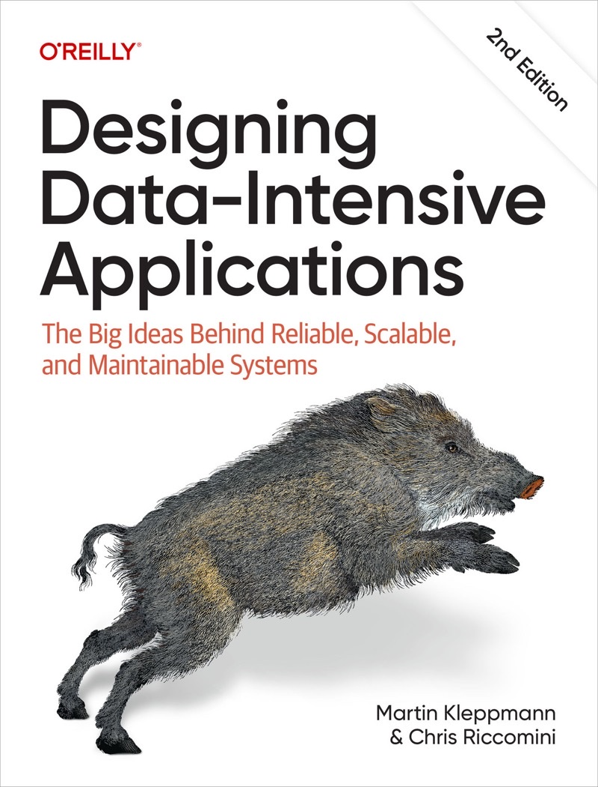

# 设计数据密集型应用（第二版） - 中文翻译版

**作者**：[Martin Kleppmann](https://martin.kleppmann.com) 与 Chris Riccomini 合著[《Designing Data-Intensive Applications 2nd Edition》](https://learning.oreilly.com/library/view/designing-data-intensive-applications/9781098119058/ch01.html)。Martin Kleppmann 是英国剑桥大学分布式系统研究员，演讲者，博主和开源贡献者，软件工程师和企业家，曾在 LinkedIn 和 Rapportive 负责数据基础架构。

**译者**：[冯若航](https://vonng.com) / [Vonng](https://github.com/Vonng) (rh@vonng.com) [Pigsty](https://pgsty.com) 创始人，[活跃](https://committers.top/china)[开源贡献者](https://gitstar-ranking.com/Vonng)，PostgreSQL Hacker。开源 RDS PG 发行版 [Pigsty](https://pigsty.cc/zh/) 与公众号《[老冯云数](https://mp.weixin.qq.com/s/p4Ys10ZdEDAuqNAiRmcnIQ)》作者，[数据库老司机](https://pigsty.cc/zh/blog/db)，[云计算泥石流](https://pigsty.cc/zh/blog/cloud)，曾于阿里，苹果，探探担任架构师与DBA。

**校订**： [@yingang](https://github.com/yingang) ｜ [**繁體中文**](content/tw/_index.md) by [@afunTW](https://github.com/afunTW) ｜ [完整贡献者列表](https://ddia.vonng.com/contrib/)

**阅读**：访问 [https://ddia.vonng.com](https://ddia.vonng.com) 阅读本书在线版本，或使用 [Hugo](https://gohugo.io/documentation/) / [OINK 1.0.0](https://oink.pgsty.com/) 主题自行构建。在线版支持稳定图表编号与交叉引用、顺序阅读、整书打印、Markdown / `llms.txt` 输出和 EPUB 导出。

> [!NOTE] 
> [**DDIA 第二版**](https://ddia.vonng.com) 十四章译文均已上线并持续校订，欢迎阅览并提出宝贵意见！[点击此处阅览第一版](https://ddia.vonng.com/v1)。

---------

## 译序

> 不懂数据库的全栈工程师不是好架构师 
> 
> —— 冯若航 / Vonng

现今，尤其是在互联网领域，大多数应用都属于数据密集型应用。本书从底层数据结构到顶层架构设计，将数据系统设计中的精髓娓娓道来。其中的宝贵经验无论是对架构师、DBA、还是后端工程师、甚至产品经理都会有帮助。

这是一本理论结合实践的书，书中很多问题，译者在实际场景中都曾遇到过，读来让人击节扼腕。如果能早点读到这本书，该少走多少弯路啊！

这也是一本深入浅出的书，讲述概念的来龙去脉而不是卖弄定义，介绍事物发展演化历程而不是事实堆砌，将复杂的概念讲述的浅显易懂，但又直击本质不失深度。每章最后的引用质量非常好，是深入学习各个主题的绝佳索引。

本书为数据系统的设计、实现、与评价提供了很好的概念框架。读完并理解本书内容后，读者可以轻松看破大多数的技术忽悠，与技术砖家撕起来虎虎生风🤣。

这是 2017 年译者读过最好的一本技术类书籍，这么好的书没有中文翻译，实在是遗憾。某不才，愿为先进技术文化的传播贡献一份力量。既可以深入学习有趣的技术主题，又可以锻炼中英文语言文字功底，何乐而不为？

---------

## 前言

> 在我们的社会中，技术是一种强大的力量。数据、软件、通信可以用于坏的方面：不公平的阶级固化，损害公民权利，保护既得利益集团。但也可以用于好的方面：让底层人民发出自己的声音，让每个人都拥有机会，避免灾难。本书献给所有将技术用于善途的人们。

---------

> 计算是一种流行文化，流行文化鄙视历史。流行文化关乎个体身份和参与感，但与合作无关。流行文化活在当下，也与过去和未来无关。我认为大部分（为了钱）编写代码的人就是这样的，他们不知道自己的文化来自哪里。
>
>  —— 阿兰・凯接受 Dobb 博士的杂志采访时（2012 年）

---------

## 目录

* [序言](https://ddia.vonng.com/preface)
* [第一部分：数据系统基础](https://ddia.vonng.com//part-i)
  - [1. 数据系统架构中的权衡](https://ddia.vonng.com/ch1)
  - [2. 定义非功能性需求](https://ddia.vonng.com/ch2)
  - [3. 数据模型与查询语言](https://ddia.vonng.com/ch3)
  - [4. 存储与检索](https://ddia.vonng.com/ch4)
  - [5. 编码与演化](https://ddia.vonng.com/ch5)
* [第二部分：分布式数据](https://ddia.vonng.com/part-ii)
  - [6. 复制](https://ddia.vonng.com/ch6)
  - [7. 分片](https://ddia.vonng.com/ch7)
  - [8. 事务](https://ddia.vonng.com/ch8)
  - [9. 分布式系统的麻烦](https://ddia.vonng.com/ch9)
  - [10.一致性与共识](https://ddia.vonng.com/ch10)
* [第三部分：派生数据](https://ddia.vonng.com/part-iii)
  - [11. 批处理](https://ddia.vonng.com/ch11)
  - [12. 流处理](https://ddia.vonng.com/ch12)
  - [13. 流处理系统哲学](https://ddia.vonng.com/ch13)
  - [14. 做正确的事](https://ddia.vonng.com/ch14)
* [术语表](https://ddia.vonng.com/glossary)
* [后记](https://ddia.vonng.com/colophon)

---------

## 法律声明

从原作者处得知，已经有简体中文的翻译计划，将于 2018 年末完成。[购买地址](https://search.jd.com/Search?keyword=设计数据密集型应用)

译者纯粹出于 **学习目的** 与 **个人兴趣** 翻译本书，不追求任何经济利益。

译者保留对此版本译文的署名权，其他权利以原作者和出版社的主张为准。

本译文只供学习研究参考之用，不得公开发行或用于商业用途，有能力阅读英文书籍者请购买正版支持，本书英文原版在 [O'REILLY](https://learning.oreilly.com/api/v1/continue/9781098119058/) 平台上提供在线免费试预览。

---------

## 贡献

0. 全文校订 by [@yingang](https://github.com/Vonng/ddia/commits?author=yingang)
1. [序言初翻修正](https://github.com/Vonng/ddia/commit/afb5edab55c62ed23474149f229677e3b42dfc2c) by [@seagullbird](https://github.com/Vonng/ddia/commits?author=seagullbird)
2. [第一章语法标点校正](https://github.com/Vonng/ddia/commit/973b12cd8f8fcdf4852f1eb1649ddd9d187e3644) by [@nevertiree](https://github.com/Vonng/ddia/commits?author=nevertiree)
3. [第六章部分校正](https://github.com/Vonng/ddia/commit/d4eb0852c0ec1e93c8aacc496c80b915bb1e6d48) 与[第十章的初翻](https://github.com/Vonng/ddia/commit/9de8dbd1bfe6fbb03b3bf6c1a1aa2291aed2490e) by [@MuAlex](https://github.com/Vonng/ddia/commits?author=MuAlex) 
4. 第一部分前言，ch2 校正 by [@jiajiadebug](https://github.com/Vonng/ddia/commits?author=jiajiadebug)
5. 词汇表、后记关于野猪的部分 by [@cg-zhou](https://github.com/Vonng/ddia/commits?author=cg-zhou)
6. 繁體中文版本与转换脚本 by [@afunTW](https://github.com/afunTW)
7. 多处翻译修正 by [@songzhibin97](https://github.com/Vonng/ddia/commits?author=songzhibin97) [@MamaShip](https://github.com/Vonng/ddia/commits?author=MamaShip) [@FangYuan33](https://github.com/Vonng/ddia/commits?author=FangYuan33)
8. 感谢所有提交 Issue 或 PR 的朋友；无论是否采纳、合并或关闭，反馈本身即是贡献。完整名单见[贡献者页面](https://ddia.vonng.com/contrib/)：

<a href="https://ddia.vonng.com/contrib/">
<picture>
  <source media="(prefers-color-scheme: dark)" srcset="https://raw.githubusercontent.com/Vonng/ddia/codex/repository-cards/contributors-dark.svg">
  
</picture>
</a>

212 位贡献者

[@Vonng](https://github.com/Vonng) · [@yingang](https://github.com/yingang) · [@afunTW](https://github.com/afunTW) · [@117503445](https://github.com/117503445) · [@1ess](https://github.com/1ess) · [@1stcoderXiaoLin](https://github.com/1stcoderXiaoLin)
[@2997ms](https://github.com/2997ms) · [@2w1nd](https://github.com/2w1nd) · [@674019130](https://github.com/674019130) · [@abbychau](https://github.com/abbychau) · [@afredlyj](https://github.com/afredlyj) · [@aha-jansen](https://github.com/aha-jansen)
[@akxxsb](https://github.com/akxxsb) · [@AldenWangExis](https://github.com/AldenWangExis) · [@AlexZFX](https://github.com/AlexZFX) · [@AlphaWang](https://github.com/AlphaWang) · [@amber-moe](https://github.com/amber-moe) · [@anaer](https://github.com/anaer)
[@artiship](https://github.com/artiship) · [@atlas927](https://github.com/atlas927) · [@auula](https://github.com/auula) · [@avenarius-argus](https://github.com/avenarius-argus) · [@Axlgrep](https://github.com/Axlgrep) · [@b7woreo](https://github.com/b7woreo)
[@baijinping](https://github.com/baijinping) · [@bbwang-gl](https://github.com/bbwang-gl) · [@bearomorphism](https://github.com/bearomorphism) · [@BeBraveBeCurious](https://github.com/BeBraveBeCurious) · [@bestgrc](https://github.com/bestgrc) · [@blindpirate](https://github.com/blindpirate)
[@bluebear4](https://github.com/bluebear4) · [@Bowser1704](https://github.com/Bowser1704) · [@bp4m4h94](https://github.com/bp4m4h94) · [@brucevoin](https://github.com/brucevoin) · [@brynne8](https://github.com/brynne8) · [@ButcherV](https://github.com/ButcherV)
[@c25423](https://github.com/c25423) · [@c2j](https://github.com/c2j) · [@cch123](https://github.com/cch123) · [@cclauss](https://github.com/cclauss) · [@ccxhwmy](https://github.com/ccxhwmy) · [@cg-zhou](https://github.com/cg-zhou)
[@chesha1](https://github.com/chesha1) · [@chlch](https://github.com/chlch) · [@chroming](https://github.com/chroming) · [@codexvn](https://github.com/codexvn) · [@cuprumz](https://github.com/cuprumz) · [@cwr31](https://github.com/cwr31)
[@daihaowxg](https://github.com/daihaowxg) · [@DavidZhiXing](https://github.com/DavidZhiXing) · [@dch1228](https://github.com/dch1228) · [@demo-zexuan](https://github.com/demo-zexuan) · [@demonkit](https://github.com/demonkit) · [@derekwu0101](https://github.com/derekwu0101)
[@duroey](https://github.com/duroey) · [@elsonLee](https://github.com/elsonLee) · [@enochii](https://github.com/enochii) · [@ethan-tan-stori](https://github.com/ethan-tan-stori) · [@EvanMu96](https://github.com/EvanMu96) · [@exzhawk](https://github.com/exzhawk)
[@FangYuan33](https://github.com/FangYuan33) · [@fantasyczl](https://github.com/fantasyczl) · [@feeeei](https://github.com/feeeei) · [@Flyraty](https://github.com/Flyraty) · [@fuxuemingzhu](https://github.com/fuxuemingzhu) · [@ganler](https://github.com/ganler)
[@Gezi-lzq](https://github.com/Gezi-lzq) · [@Gilbert1024](https://github.com/Gilbert1024) · [@goace](https://github.com/goace) · [@guaidaokakaxi](https://github.com/guaidaokakaxi) · [@haifeiWu](https://github.com/haifeiWu) · [@hanyu2](https://github.com/hanyu2)
[@hecenjie](https://github.com/hecenjie) · [@hezhengdong](https://github.com/hezhengdong) · [@hli988](https://github.com/hli988) · [@huang06](https://github.com/huang06) · [@huiscool](https://github.com/huiscool) · [@ibyte2011](https://github.com/ibyte2011)
[@Ice-pumpkin](https://github.com/Ice-pumpkin) · [@imcheney](https://github.com/imcheney) · [@jacklightChen](https://github.com/jacklightChen) · [@jasonlei-chn](https://github.com/jasonlei-chn) · [@JCYoky](https://github.com/JCYoky) · [@jenac](https://github.com/jenac)
[@jiajiadebug](https://github.com/jiajiadebug) · [@jiong-han](https://github.com/jiong-han) · [@justlorain](https://github.com/justlorain) · [@Juude](https://github.com/Juude) · [@JYu1999](https://github.com/JYu1999) · [@KAKXA](https://github.com/KAKXA)
[@kangni](https://github.com/kangni) · [@kehao-chen](https://github.com/kehao-chen) · [@kemingy](https://github.com/kemingy) · [@KevinZhangt](https://github.com/KevinZhangt) · [@kimi0230](https://github.com/kimi0230) · [@Klu5ure](https://github.com/Klu5ure)
[@krisjin](https://github.com/krisjin) · [@l1t1](https://github.com/l1t1) · [@leo-987](https://github.com/leo-987) · [@lewiszlw](https://github.com/lewiszlw) · [@LHRchina](https://github.com/LHRchina) · [@liangGTY](https://github.com/liangGTY)
[@LiminCode](https://github.com/LiminCode) · [@lis186](https://github.com/lis186) · [@lllliuliu](https://github.com/lllliuliu) · [@llmmddCoder](https://github.com/llmmddCoder) · [@longjiquan](https://github.com/longjiquan) · [@lpxxn](https://github.com/lpxxn)
[@lqbilbo](https://github.com/lqbilbo) · [@lroolle](https://github.com/lroolle) · [@luchao2424631502](https://github.com/luchao2424631502) · [@Lyianu](https://github.com/Lyianu) · [@lynkeib](https://github.com/lynkeib) · [@lyuxi99](https://github.com/lyuxi99)
[@lzwill](https://github.com/lzwill) · [@Makonike](https://github.com/Makonike) · [@MamaShip](https://github.com/MamaShip) · [@marvin263](https://github.com/marvin263) · [@mawenqi](https://github.com/mawenqi) · [@Max-Tortoise](https://github.com/Max-Tortoise)
[@meijies](https://github.com/meijies) · [@meilin96](https://github.com/meilin96) · [@MintBlue](https://github.com/MintBlue) · [@mrdrivingduck](https://github.com/mrdrivingduck) · [@msxfXF](https://github.com/msxfXF) · [@MuAlex](https://github.com/MuAlex)
[@mxdljwxx](https://github.com/mxdljwxx) · [@NageNalock](https://github.com/NageNalock) · [@narojay](https://github.com/narojay) · [@nevertiree](https://github.com/nevertiree) · [@NIL-zhuang](https://github.com/NIL-zhuang) · [@northmorn](https://github.com/northmorn)
[@omegaatt36](https://github.com/omegaatt36) · [@OneSizeFitsQuorum](https://github.com/OneSizeFitsQuorum) · [@Ozarklake](https://github.com/Ozarklake) · [@PanggNOTlovebean](https://github.com/PanggNOTlovebean) · [@Panmax](https://github.com/Panmax) · [@patricksuo](https://github.com/patricksuo)
[@Pcrab](https://github.com/Pcrab) · [@PragmaTwice](https://github.com/PragmaTwice) · [@q00218426](https://github.com/q00218426) · [@qig243](https://github.com/qig243) · [@quwang123](https://github.com/quwang123) · [@rabomen](https://github.com/rabomen)
[@rentiansheng](https://github.com/rentiansheng) · [@rovernerd](https://github.com/rovernerd) · [@saintube](https://github.com/saintube) · [@samwu4166](https://github.com/samwu4166) · [@scaugrated](https://github.com/scaugrated) · [@seagullbird](https://github.com/seagullbird)
[@secret4233](https://github.com/secret4233) · [@shiyiwan](https://github.com/shiyiwan) · [@shukebeta](https://github.com/shukebeta) · [@skyran1278](https://github.com/skyran1278) · [@smallyard](https://github.com/smallyard) · [@songzhibin97](https://github.com/songzhibin97)
[@soulrrrrr](https://github.com/soulrrrrr) · [@spike014](https://github.com/spike014) · [@SpikeWong](https://github.com/SpikeWong) · [@starsea](https://github.com/starsea) · [@Stephan14](https://github.com/Stephan14) · [@Style980102](https://github.com/Style980102)
[@sunbuhui](https://github.com/sunbuhui) · [@Sunt-ing](https://github.com/Sunt-ing) · [@SunVdong](https://github.com/SunVdong) · [@sunyiwei24601](https://github.com/sunyiwei24601) · [@sunzeren](https://github.com/sunzeren) · [@SXP-Simon](https://github.com/SXP-Simon)
[@taco-wang](https://github.com/taco-wang) · [@tankilo](https://github.com/tankilo) · [@tigerinus](https://github.com/tigerinus) · [@tisonkun](https://github.com/tisonkun) · [@tooloudwind](https://github.com/tooloudwind) · [@TrafalgarRicardoLu](https://github.com/TrafalgarRicardoLu)
[@TronYY](https://github.com/TronYY) · [@truenorth-lj](https://github.com/truenorth-lj) · [@ui-HookeyChiang](https://github.com/ui-HookeyChiang) · [@uncle-lv](https://github.com/uncle-lv) · [@undeflife](https://github.com/undeflife) · [@Valerie-space](https://github.com/Valerie-space)
[@Vermouth1995](https://github.com/Vermouth1995) · [@vult137](https://github.com/vult137) · [@WAangzE](https://github.com/WAangzE) · [@wafer-li](https://github.com/wafer-li) · [@walshzhang](https://github.com/walshzhang) · [@wangqiim](https://github.com/wangqiim)
[@wayne87140](https://github.com/wayne87140) · [@Waynting](https://github.com/Waynting) · [@woodpenker](https://github.com/woodpenker) · [@wwek](https://github.com/wwek) · [@wynn5a](https://github.com/wynn5a) · [@xianlaioy](https://github.com/xianlaioy)
[@xiekeyi98](https://github.com/xiekeyi98) · [@XIJINIAN](https://github.com/XIJINIAN) · [@xiyihan0](https://github.com/xiyihan0) · [@xyohn](https://github.com/xyohn) · [@yangshangde](https://github.com/yangshangde) · [@ych](https://github.com/ych)
[@yhao3](https://github.com/yhao3) · [@yhm138](https://github.com/yhm138) · [@yjhmelody](https://github.com/yjhmelody) · [@YKIsTheBest](https://github.com/YKIsTheBest) · [@Ynjxsjmh](https://github.com/Ynjxsjmh) · [@YunfengGao](https://github.com/YunfengGao)
[@z-soulx](https://github.com/z-soulx) · [@zenuo](https://github.com/zenuo) · [@zhangnew](https://github.com/zhangnew) · [@Zhayhp](https://github.com/Zhayhp) · [@zhtisi](https://github.com/zhtisi) · [@Zombo1296](https://github.com/Zombo1296)
[@ZvanYang](https://github.com/ZvanYang) · [@zydmayday](https://github.com/zydmayday)

<a href="https://github.com/Vonng/ddia/pulls">Pull Requests</a> & <a href="https://github.com/Vonng/ddia/issues">Issues</a>

<!-- CONTRIBUTIONS:START -->
截至 2026-09-19（UTC），共收录 212 位贡献者。以下记录保留实际状态，未合并的提议同样计入贡献。

| Issue / PR | 贡献者 | 标题 | 状态 |
|---|---|---|---|
| [Issue #420](https://github.com/Vonng/ddia/issues/420) | [@Ice-pumpkin](https://github.com/Ice-pumpkin) | 图 10-2 的描述错误 | 已关闭 |
| [PR #419](https://github.com/Vonng/ddia/pull/419) | [@JYu1999](https://github.com/JYu1999) | fix(tw): scalability 譯名由「可伸縮」改為「可擴展」 | 未合并 |
| [PR #418](https://github.com/Vonng/ddia/pull/418) | [@JYu1999](https://github.com/JYu1999) | fix(tw): 修正雲端相關詞彙中誤留簡體「云」的問題 | 已合并 |
| [PR #417](https://github.com/Vonng/ddia/pull/417) | [@JYu1999](https://github.com/JYu1999) | chore: replace early release cover with final 2nd edition cover | 已合并 |
| [PR #415](https://github.com/Vonng/ddia/pull/415) | [@Waynting](https://github.com/Waynting) | Fix &#92;&#91;...&#92;&#93; bracket escaping parsed as math passthrough (en source + zh/tw footnote) | 已合并 |
| [Issue #414](https://github.com/Vonng/ddia/issues/414) | [@Valerie-space](https://github.com/Valerie-space) | 字体选项建议 | 已关闭 |
| [PR #413](https://github.com/Vonng/ddia/pull/413) | [@luchao2424631502](https://github.com/luchao2424631502) | fix(ch1): 修改错别字 | 已合并 |
| [Issue #412](https://github.com/Vonng/ddia/issues/412) | [@chesha1](https://github.com/chesha1) | 近期网站重构后的两点使用体验反馈 | 已关闭 |
| [PR #411](https://github.com/Vonng/ddia/pull/411) | [@Waynting](https://github.com/Waynting) | Fix bracket escaping in GDPR quote rendered as LaTeX math | 未合并 |
| [PR #410](https://github.com/Vonng/ddia/pull/410) | [@aha-jansen](https://github.com/aha-jansen) | fix(epub): 修复 EPUB 导出的封面、目录与导航链接 | 未合并 |
| [PR #409](https://github.com/Vonng/ddia/pull/409) | [@Klu5ure](https://github.com/Klu5ure) | 修复 README 中翻译进度描述的笔误 | 未合并 |
| [PR #408](https://github.com/Vonng/ddia/pull/408) | [@hezhengdong](https://github.com/hezhengdong) | fix(ch8): 删除多余空行，修复有序列表显示问题 | 已合并 |
| [PR #407](https://github.com/Vonng/ddia/pull/407) | [@AldenWangExis](https://github.com/AldenWangExis) | fix(ch): normalize zh/tw emphasis formatting | 已合并 |
| [Issue #406](https://github.com/Vonng/ddia/issues/406) | [@AldenWangExis](https://github.com/AldenWangExis) | Inconsistent bold/italic emphasis in zh translation | 已关闭 |
| [PR #405](https://github.com/Vonng/ddia/pull/405) | [@AldenWangExis](https://github.com/AldenWangExis) | fix(ch1): clarify abbreviation expansions in zh and tw | 未合并 |
| [Issue #404](https://github.com/Vonng/ddia/issues/404) | [@AldenWangExis](https://github.com/AldenWangExis) | Some zh-only wording fixes may have drifted from tw | 已关闭 |
| [Issue #403](https://github.com/Vonng/ddia/issues/403) | [@AldenWangExis](https://github.com/AldenWangExis) | Some zh-only wording fixes may have drifted from tw | 已关闭 |
| [PR #402](https://github.com/Vonng/ddia/pull/402) | [@AldenWangExis](https://github.com/AldenWangExis) | fix(ch1): improve wording in zh and tw | 未合并 |
| [PR #401](https://github.com/Vonng/ddia/pull/401) | [@AldenWangExis](https://github.com/AldenWangExis) | fix(epub): 修复生成 EPUB 后目录跳转错误 | 未合并 |
| [PR #400](https://github.com/Vonng/ddia/pull/400) | [@SXP-Simon](https://github.com/SXP-Simon) | fix(zh): fix untranslated headings in ch13.md | 未合并 |
| [Issue #399](https://github.com/Vonng/ddia/issues/399) | [@1stcoderXiaoLin](https://github.com/1stcoderXiaoLin) | 线上网站是不是挂了：http://ddia.vonng.com/ | 已关闭 |
| [PR #398](https://github.com/Vonng/ddia/pull/398) | [@c2j](https://github.com/c2j) | 支持自动生成一整本PDF 电子书 | 未合并 |
| [PR #397](https://github.com/Vonng/ddia/pull/397) | [@daihaowxg](https://github.com/daihaowxg) | fix(ch2): 修正文案中的“观察记录果”笔误 | 已合并 |
| [Issue #395](https://github.com/Vonng/ddia/issues/395) | [@ethan-tan-stori](https://github.com/ethan-tan-stori) | 第六章节复制篇翻译问题 | 已关闭 |
| [Issue #394](https://github.com/Vonng/ddia/issues/394) | [@wayne87140](https://github.com/wayne87140) | 專有名詞在括號後面加入原文 | 已关闭 |
| [PR #393](https://github.com/Vonng/ddia/pull/393) | [@cg-zhou](https://github.com/cg-zhou) | 更新贡献者 GitHub 链接：按 PR 作者映射修复失效链接，并同步 README/&#95;index/contrib | 已合并 |
| [Issue #391](https://github.com/Vonng/ddia/issues/391) | [@demonkit](https://github.com/demonkit) | 机翻阅读不通顺 | 已关闭 |
| [PR #390](https://github.com/Vonng/ddia/pull/390) | [@bearomorphism](https://github.com/bearomorphism) | Fix typographical errors in chapter 1 | 已合并 |
| [PR #389](https://github.com/Vonng/ddia/pull/389) | [@demo-zexuan](https://github.com/demo-zexuan) | 恢复 EPUB 导出功能并修复图片显示问题 | 已合并 |
| [Issue #388](https://github.com/Vonng/ddia/issues/388) | [@MintBlue](https://github.com/MintBlue) | main 分支现在还支持 导出 epub 这个特性吗 | 已关闭 |
| [PR #387](https://github.com/Vonng/ddia/pull/387) | [@ButcherV](https://github.com/ButcherV) | Update part-i.md | 已合并 |
| [PR #386](https://github.com/Vonng/ddia/pull/386) | [@uncle-lv](https://github.com/uncle-lv) | improve ch2 translation | 已合并 |
| [PR #384](https://github.com/Vonng/ddia/pull/384) | [@PanggNOTlovebean](https://github.com/PanggNOTlovebean) | docs: 优化中文文档的措辞和表达 | 已合并 |
| [PR #383](https://github.com/Vonng/ddia/pull/383) | [@PanggNOTlovebean](https://github.com/PanggNOTlovebean) | docs: 修正ch4中的术语和表达错误 | 已合并 |
| [PR #382](https://github.com/Vonng/ddia/pull/382) | [@uncle-lv](https://github.com/uncle-lv) | Improve ch1 translation | 已合并 |
| [PR #381](https://github.com/Vonng/ddia/pull/381) | [@Max-Tortoise](https://github.com/Max-Tortoise) | fix incomplete term in chapter 4 | 已合并 |
| [PR #377](https://github.com/Vonng/ddia/pull/377) | [@huang06](https://github.com/huang06) | Refine translation terms | 已合并 |
| [Issue #375](https://github.com/Vonng/ddia/issues/375) | [@z-soulx](https://github.com/z-soulx) | 对于是否100%全中文翻译的必要性讨论？个人-没必要100%，特别是“名词”，有原单词更加适合it人员 | 已关闭 |
| [PR #371](https://github.com/Vonng/ddia/pull/371) | [@lewiszlw](https://github.com/lewiszlw) | CPU core -&gt; CPU 核心 | 已合并 |
| [PR #369](https://github.com/Vonng/ddia/pull/369) | [@bbwang-gl](https://github.com/bbwang-gl) | Update ch7.md 可串行化快照隔离检测一个事务何时修改另一个事务的读取 | 已合并 |
| [PR #368](https://github.com/Vonng/ddia/pull/368) | [@yhao3](https://github.com/yhao3) | update zh-tw.py and zh-tw content | 已合并 |
| [PR #367](https://github.com/Vonng/ddia/pull/367) | [@yhao3](https://github.com/yhao3) | Fix typo, formatting and punctuation | 已合并 |
| [PR #366](https://github.com/Vonng/ddia/pull/366) | [@yangshangde](https://github.com/yangshangde) | Update ch8.md，电源失败改为电源失效 | 已合并 |
| [PR #365](https://github.com/Vonng/ddia/pull/365) | [@xyohn](https://github.com/xyohn) | #364 ch1 - optimize translation about Separation of storage and compute | 已合并 |
| [Issue #364](https://github.com/Vonng/ddia/issues/364) | [@xyohn](https://github.com/xyohn) | ch1 - optimize translation about Separation of storage and compute | 已关闭 |
| [PR #363](https://github.com/Vonng/ddia/pull/363) | [@xyohn](https://github.com/xyohn) | #362 optimize translation | 已合并 |
| [Issue #362](https://github.com/Vonng/ddia/issues/362) | [@xyohn](https://github.com/xyohn) | ch1 - optimize translation | 已关闭 |
| [PR #359](https://github.com/Vonng/ddia/pull/359) | [@c25423](https://github.com/c25423) | fix: Correct &quot;Usage-Agent&quot; to &quot;User-Agent&quot; in Chapter 10 | 已合并 |
| [PR #358](https://github.com/Vonng/ddia/pull/358) | [@lewiszlw](https://github.com/lewiszlw) | Fix a typo in chapter4 | 已合并 |
| [PR #357](https://github.com/Vonng/ddia/pull/357) | [@Gezi-lzq](https://github.com/Gezi-lzq) | feat: add Generate GitBook eBooks action | 未合并 |
| [PR #356](https://github.com/Vonng/ddia/pull/356) | [@lewiszlw](https://github.com/lewiszlw) | Fix chapter2 comma typo | 已合并 |
| [PR #355](https://github.com/Vonng/ddia/pull/355) | [@duroey](https://github.com/duroey) | fix: 缺少一个括号 | 已合并 |
| [PR #354](https://github.com/Vonng/ddia/pull/354) | [@justlorain](https://github.com/justlorain) | fix: ch7 ref51 broken link | 已合并 |
| [PR #353](https://github.com/Vonng/ddia/pull/353) | [@fantasyczl](https://github.com/fantasyczl) | fix: 修复错误的引用 | 已合并 |
| [PR #352](https://github.com/Vonng/ddia/pull/352) | [@fantasyczl](https://github.com/fantasyczl) | Feature: Convert Markdown to EPUB | 已合并 |
| [PR #351](https://github.com/Vonng/ddia/pull/351) | [@fantasyczl](https://github.com/fantasyczl) | fix: correct list numbering | 未合并 |
| [Issue #350](https://github.com/Vonng/ddia/issues/350) | [@674019130](https://github.com/674019130) | ch1 - Transaction Processing versus Analytics | 已关闭 |
| [PR #349](https://github.com/Vonng/ddia/pull/349) | [@xiyihan0](https://github.com/xiyihan0) | Fix typo on ch1.md | 已合并 |
| [PR #348](https://github.com/Vonng/ddia/pull/348) | [@omegaatt36](https://github.com/omegaatt36) | fix: wrong img src of fig3-12.png | 已合并 |
| [PR #347](https://github.com/Vonng/ddia/pull/347) | [@hli988](https://github.com/hli988) | Updated ch1.md: Refined translation of &#x27;interfaces&#x27; | 已合并 |
| [Issue #346](https://github.com/Vonng/ddia/issues/346) | [@Vermouth1995](https://github.com/Vermouth1995) | 第二版第一章有一处翻译不太妥当 | 已关闭 |
| [Issue #345](https://github.com/Vonng/ddia/issues/345) | [@Vonng](https://github.com/Vonng) | DDIA 第二版翻译 | 已关闭 |
| [PR #343](https://github.com/Vonng/ddia/pull/343) | [@kehao-chen](https://github.com/kehao-chen) | 修正不精確的表達方式 | 已合并 |
| [PR #342](https://github.com/Vonng/ddia/pull/342) | [@guaidaokakaxi](https://github.com/guaidaokakaxi) | Update ch9.md | 未合并 |
| [PR #341](https://github.com/Vonng/ddia/pull/341) | [@YKIsTheBest](https://github.com/YKIsTheBest) | Refine sentences | 已合并 |
| [PR #340](https://github.com/Vonng/ddia/pull/340) | [@YKIsTheBest](https://github.com/YKIsTheBest) | Refine the chapter 2 sentences | 已合并 |
| [Issue #339](https://github.com/Vonng/ddia/issues/339) | [@tigerinus](https://github.com/tigerinus) | 关于图9-4的解释 | 已关闭 |
| [PR #338](https://github.com/Vonng/ddia/pull/338) | [@YKIsTheBest](https://github.com/YKIsTheBest) | Refine sentences for more comprehensible in Chinese | 已合并 |
| [PR #337](https://github.com/Vonng/ddia/pull/337) | [@YKIsTheBest](https://github.com/YKIsTheBest) | Refine setences in ch1.md | 未合并 |
| [Issue #336](https://github.com/Vonng/ddia/issues/336) | [@msxfXF](https://github.com/msxfXF) | 目录好像有点问题 | 已关闭 |
| [PR #335](https://github.com/Vonng/ddia/pull/335) | [@kimi0230](https://github.com/kimi0230) | fix: zh-tw 日志 to 日誌 | 已合并 |
| [PR #334](https://github.com/Vonng/ddia/pull/334) | [@soulrrrrr](https://github.com/soulrrrrr) | fix zh-tw/ch2 typo | 未合并 |
| [Issue #333](https://github.com/Vonng/ddia/issues/333) | [@TronYY](https://github.com/TronYY) | 这个翻译和&#91;中国电力出版社&#93;赵军平 吕三平翻译的有什么不同 | 已关闭 |
| [PR #332](https://github.com/Vonng/ddia/pull/332) | [@justlorain](https://github.com/justlorain) | fix: ch5 inconsistent translation | 已合并 |
| [PR #331](https://github.com/Vonng/ddia/pull/331) | [@Lyianu](https://github.com/Lyianu) | fix typo in ch9 | 已合并 |
| [PR #330](https://github.com/Vonng/ddia/pull/330) | [@Lyianu](https://github.com/Lyianu) | fix ch7 translation | 已合并 |
| [Issue #329](https://github.com/Vonng/ddia/issues/329) | [@Lyianu](https://github.com/Lyianu) | 第六章似乎存在一处翻译错误 | 已关闭 |
| [PR #328](https://github.com/Vonng/ddia/pull/328) | [@justlorain](https://github.com/justlorain) | fix: ch4 missing translation | 已合并 |
| [Issue #327](https://github.com/Vonng/ddia/issues/327) | [@avenarius-argus](https://github.com/avenarius-argus) | 关于英语版本文字缺失 | 已关闭 |
| [PR #326](https://github.com/Vonng/ddia/pull/326) | [@liangGTY](https://github.com/liangGTY) | Resilient: 韧性 -&gt; 回弹性 | 已合并 |
| [PR #325](https://github.com/Vonng/ddia/pull/325) | [@SunVdong](https://github.com/SunVdong) | 修改 第四章 Field tags and schema evolution 移除字段翻译的问题 | 未合并 |
| [Issue #324](https://github.com/Vonng/ddia/issues/324) | [@starsea](https://github.com/starsea) | 为什么英文原版丢失了很多章节 | 已关闭 |
| [PR #323](https://github.com/Vonng/ddia/pull/323) | [@marvin263](https://github.com/marvin263) | 明确表达：需要如何处理的是“老主库尚未复制的写入” | 已合并 |
| [PR #322](https://github.com/Vonng/ddia/pull/322) | [@marvin263](https://github.com/marvin263) | 经验--&gt;从业经历 | 已合并 |
| [Issue #321](https://github.com/Vonng/ddia/issues/321) | [@chlch](https://github.com/chlch) | 第三章存储与检索，散列索引这章最后一段翻译是不是有问题 | 已关闭 |
| [PR #320](https://github.com/Vonng/ddia/pull/320) | [@FangYuan33](https://github.com/FangYuan33) | 修正错别字 | 未合并 |
| [PR #319](https://github.com/Vonng/ddia/pull/319) | [@FangYuan33](https://github.com/FangYuan33) | 修正标点符号 | 已合并 |
| [PR #318](https://github.com/Vonng/ddia/pull/318) | [@FangYuan33](https://github.com/FangYuan33) | 去掉多余的”在“ | 已合并 |
| [PR #317](https://github.com/Vonng/ddia/pull/317) | [@FangYuan33](https://github.com/FangYuan33) | 去掉多余的空格 | 已合并 |
| [PR #316](https://github.com/Vonng/ddia/pull/316) | [@FangYuan33](https://github.com/FangYuan33) | 更正右引号 | 已合并 |
| [PR #315](https://github.com/Vonng/ddia/pull/315) | [@FangYuan33](https://github.com/FangYuan33) | 成为 -&gt; 称为 | 未合并 |
| [PR #314](https://github.com/Vonng/ddia/pull/314) | [@FangYuan33](https://github.com/FangYuan33) | 更正右引号 | 已合并 |
| [PR #313](https://github.com/Vonng/ddia/pull/313) | [@FangYuan33](https://github.com/FangYuan33) | 更正标点符号 | 已合并 |
| [PR #312](https://github.com/Vonng/ddia/pull/312) | [@FangYuan33](https://github.com/FangYuan33) | 统一上下文名词 | 已合并 |
| [PR #311](https://github.com/Vonng/ddia/pull/311) | [@FangYuan33](https://github.com/FangYuan33) | 补充谓语 | 已合并 |
| [PR #310](https://github.com/Vonng/ddia/pull/310) | [@FangYuan33](https://github.com/FangYuan33) | 确定地 -&gt; 确切地 | 已合并 |
| [PR #309](https://github.com/Vonng/ddia/pull/309) | [@FangYuan33](https://github.com/FangYuan33) | 优化中文表述 | 已合并 |
| [PR #308](https://github.com/Vonng/ddia/pull/308) | [@FangYuan33](https://github.com/FangYuan33) | 去掉多余的“最” | 已合并 |
| [PR #307](https://github.com/Vonng/ddia/pull/307) | [@FangYuan33](https://github.com/FangYuan33) | 优化表述 | 已合并 |
| [PR #306](https://github.com/Vonng/ddia/pull/306) | [@FangYuan33](https://github.com/FangYuan33) | 更正右引号 | 已合并 |
| [PR #305](https://github.com/Vonng/ddia/pull/305) | [@FangYuan33](https://github.com/FangYuan33) | 更改时间r的位置以增强可读性 | 已合并 |
| [PR #304](https://github.com/Vonng/ddia/pull/304) | [@spike014](https://github.com/spike014) | refactor(ch11): update #变更数据捕获的实现 | 已合并 |
| [Issue #303](https://github.com/Vonng/ddia/issues/303) | [@rabomen](https://github.com/rabomen) | 生成epub无法正确显示公式 | 已关闭 |
| [PR #302](https://github.com/Vonng/ddia/pull/302) | [@FangYuan33](https://github.com/FangYuan33) | 页面展示加粗失效 | 已合并 |
| [PR #301](https://github.com/Vonng/ddia/pull/301) | [@FangYuan33](https://github.com/FangYuan33) | 补充省略的宾语以更容易理解 | 已合并 |
| [PR #300](https://github.com/Vonng/ddia/pull/300) | [@FangYuan33](https://github.com/FangYuan33) | 补充谓语 | 已合并 |
| [PR #299](https://github.com/Vonng/ddia/pull/299) | [@FangYuan33](https://github.com/FangYuan33) | 去掉多余的句号 | 已合并 |
| [PR #298](https://github.com/Vonng/ddia/pull/298) | [@Makonike](https://github.com/Makonike) | docs: fix typo | 已合并 |
| [PR #297](https://github.com/Vonng/ddia/pull/297) | [@FangYuan33](https://github.com/FangYuan33) | 更正右引号 | 已合并 |
| [PR #296](https://github.com/Vonng/ddia/pull/296) | [@FangYuan33](https://github.com/FangYuan33) | 优化翻译 | 已合并 |
| [PR #295](https://github.com/Vonng/ddia/pull/295) | [@FangYuan33](https://github.com/FangYuan33) | 优化表述 | 已合并 |
| [PR #294](https://github.com/Vonng/ddia/pull/294) | [@FangYuan33](https://github.com/FangYuan33) | 客户 -&gt; 客户端 | 已合并 |
| [PR #293](https://github.com/Vonng/ddia/pull/293) | [@FangYuan33](https://github.com/FangYuan33) | 并行 -&gt; 并发 | 已合并 |
| [Issue #292](https://github.com/Vonng/ddia/issues/292) | [@117503445](https://github.com/117503445) | 日期被错误解析为 emoji | 已关闭 |
| [PR #291](https://github.com/Vonng/ddia/pull/291) | [@FangYuan33](https://github.com/FangYuan33) | 页面内容加粗失效 | 未合并 |
| [PR #290](https://github.com/Vonng/ddia/pull/290) | [@FangYuan33](https://github.com/FangYuan33) | 页面内容加粗失效 | 未合并 |
| [PR #289](https://github.com/Vonng/ddia/pull/289) | [@FangYuan33](https://github.com/FangYuan33) | 修改语序 | 已合并 |
| [PR #288](https://github.com/Vonng/ddia/pull/288) | [@FangYuan33](https://github.com/FangYuan33) | 去掉不必要的量词修饰 | 已合并 |
| [PR #287](https://github.com/Vonng/ddia/pull/287) | [@FangYuan33](https://github.com/FangYuan33) | 补充谓语 | 已合并 |
| [PR #286](https://github.com/Vonng/ddia/pull/286) | [@FangYuan33](https://github.com/FangYuan33) | 补充丢失的右括号 | 已合并 |
| [PR #284](https://github.com/Vonng/ddia/pull/284) | [@WAangzE](https://github.com/WAangzE) | fix a wrong bullet in ch4 | 已合并 |
| [PR #283](https://github.com/Vonng/ddia/pull/283) | [@WAangzE](https://github.com/WAangzE) | fix a typo in ch3 | 已合并 |
| [PR #282](https://github.com/Vonng/ddia/pull/282) | [@WAangzE](https://github.com/WAangzE) | Fix a mathematical environment issue. | 已合并 |
| [PR #281](https://github.com/Vonng/ddia/pull/281) | [@lyuxi99](https://github.com/lyuxi99) | fix some broken anchor links | 已合并 |
| [PR #280](https://github.com/Vonng/ddia/pull/280) | [@lyuxi99](https://github.com/lyuxi99) | fix a broken anchor link in ch9.md | 已合并 |
| [Issue #279](https://github.com/Vonng/ddia/issues/279) | [@codexvn](https://github.com/codexvn) | 第9章 什么使得系统线性一致，列举CAS情况出现两个x=V old | 已关闭 |
| [PR #278](https://github.com/Vonng/ddia/pull/278) | [@truenorth-lj](https://github.com/truenorth-lj) | Update ch2.md | 未合并 |
| [Issue #277](https://github.com/Vonng/ddia/issues/277) | [@cuprumz](https://github.com/cuprumz) | 分支因子为 500 的 4KB 页面的四层树可以存储多达 256TB 的数据 | 已关闭 |
| [Issue #276](https://github.com/Vonng/ddia/issues/276) | [@sunzeren](https://github.com/sunzeren) | 数据库 | 已关闭 |
| [PR #275](https://github.com/Vonng/ddia/pull/275) | [@117503445](https://github.com/117503445) | fix: license 404 | 已合并 |
| [PR #274](https://github.com/Vonng/ddia/pull/274) | [@uncle-lv](https://github.com/uncle-lv) | docs: ch7.md 错字修订 最着名 -&gt; 最著名 | 已合并 |
| [PR #273](https://github.com/Vonng/ddia/pull/273) | [@quwang123](https://github.com/quwang123) | &#91;docs&#93; ch7 术语统一，写入偏斜-&gt;写入偏差，写偏差-&gt;写入偏差 | 已合并 |
| [PR #272](https://github.com/Vonng/ddia/pull/272) | [@quwang123](https://github.com/quwang123) | &#91;docs&#93; 统一ch7中的术语 写入偏斜-&gt;写入偏差，写偏差-&gt;写入偏差 | 未合并 |
| [PR #271](https://github.com/Vonng/ddia/pull/271) | [@Makonike](https://github.com/Makonike) | docs: update ch6.md | 已合并 |
| [PR #270](https://github.com/Vonng/ddia/pull/270) | [@Ynjxsjmh](https://github.com/Ynjxsjmh) | Fix “更新丢失” to “丢失更新” in ch7.md | 已合并 |
| [Issue #269](https://github.com/Vonng/ddia/issues/269) | [@auula](https://github.com/auula) | GitBook WeChat Group QRcode Expired | 已关闭 |
| [PR #268](https://github.com/Vonng/ddia/pull/268) | [@MamaShip](https://github.com/MamaShip) | 优化第三章的部分语句 | 已合并 |
| [PR #267](https://github.com/Vonng/ddia/pull/267) | [@MamaShip](https://github.com/MamaShip) | 调整脚注段落的位置 | 未合并 |
| [PR #266](https://github.com/Vonng/ddia/pull/266) | [@MamaShip](https://github.com/MamaShip) | 优化第二章后半部分 | 已合并 |
| [PR #265](https://github.com/Vonng/ddia/pull/265) | [@MamaShip](https://github.com/MamaShip) | 优化第二章的部分文字 | 已合并 |
| [PR #264](https://github.com/Vonng/ddia/pull/264) | [@MamaShip](https://github.com/MamaShip) | minor fix: 正确区分「可扩展性」与「可伸缩性」 | 已合并 |
| [PR #263](https://github.com/Vonng/ddia/pull/263) | [@zydmayday](https://github.com/zydmayday) | Update ch5.md | 已合并 |
| [Issue #262](https://github.com/Vonng/ddia/issues/262) | [@ccxhwmy](https://github.com/ccxhwmy) | 第二章的 &#91;例 2-1&#93; 链接缺失 | 已关闭 |
| [Issue #261](https://github.com/Vonng/ddia/issues/261) | [@ccxhwmy](https://github.com/ccxhwmy) | 十二张思维导图分析 | 已关闭 |
| [PR #260](https://github.com/Vonng/ddia/pull/260) | [@haifeiWu](https://github.com/haifeiWu) | 修改部分翻译不准确的问题 | 已合并 |
| [Issue #259](https://github.com/Vonng/ddia/issues/259) | [@SpikeWong](https://github.com/SpikeWong) | 关于无主复制的疑问 | 已关闭 |
| [PR #258](https://github.com/Vonng/ddia/pull/258) | [@bestgrc](https://github.com/bestgrc) | Update ch3.md | 已合并 |
| [PR #257](https://github.com/Vonng/ddia/pull/257) | [@samwu4166](https://github.com/samwu4166) | Fix: typo nonderterministic | 已合并 |
| [PR #256](https://github.com/Vonng/ddia/pull/256) | [@AlphaWang](https://github.com/AlphaWang) | fix ch7-transaction: serializability | 已合并 |
| [PR #255](https://github.com/Vonng/ddia/pull/255) | [@AlphaWang](https://github.com/AlphaWang) | fix transaction: repeatable read | 已合并 |
| [Issue #254](https://github.com/Vonng/ddia/issues/254) | [@2w1nd](https://github.com/2w1nd) | 网站404 not found | 已关闭 |
| [PR #253](https://github.com/Vonng/ddia/pull/253) | [@AlphaWang](https://github.com/AlphaWang) | fix ch7-transaction: Read Committed | 已合并 |
| [PR #252](https://github.com/Vonng/ddia/pull/252) | [@songzhibin97](https://github.com/songzhibin97) | Update ch9.md | 已合并 |
| [PR #251](https://github.com/Vonng/ddia/pull/251) | [@songzhibin97](https://github.com/songzhibin97) | Update ch9.md | 已合并 |
| [PR #250](https://github.com/Vonng/ddia/pull/250) | [@songzhibin97](https://github.com/songzhibin97) | Update ch9.md | 已合并 |
| [PR #249](https://github.com/Vonng/ddia/pull/249) | [@songzhibin97](https://github.com/songzhibin97) | Update ch9.md | 已合并 |
| [PR #248](https://github.com/Vonng/ddia/pull/248) | [@songzhibin97](https://github.com/songzhibin97) | Update ch9.md | 已合并 |
| [PR #247](https://github.com/Vonng/ddia/pull/247) | [@songzhibin97](https://github.com/songzhibin97) | Update ch9.md | 已合并 |
| [PR #246](https://github.com/Vonng/ddia/pull/246) | [@derekwu0101](https://github.com/derekwu0101) | 修正錯字 | 已合并 |
| [PR #245](https://github.com/Vonng/ddia/pull/245) | [@skyran1278](https://github.com/skyran1278) | ch12: 修正繁體中文翻譯 討論瞭 =&gt; 討論了 | 已合并 |
| [PR #244](https://github.com/Vonng/ddia/pull/244) | [@Axlgrep](https://github.com/Axlgrep) | Update ch9.md | 已合并 |
| [PR #243](https://github.com/Vonng/ddia/pull/243) | [@lynkeib](https://github.com/lynkeib) | adjust wording for locking and leader election | 未合并 |
| [PR #242](https://github.com/Vonng/ddia/pull/242) | [@lynkeib](https://github.com/lynkeib) | adjust wording for linearizability vs serializability | 已合并 |
| [PR #241](https://github.com/Vonng/ddia/pull/241) | [@lynkeib](https://github.com/lynkeib) | Update ch8.md | 已合并 |
| [PR #240](https://github.com/Vonng/ddia/pull/240) | [@leo-987](https://github.com/leo-987) | Update ch9.md | 已合并 |
| [PR #239](https://github.com/Vonng/ddia/pull/239) | [@BeBraveBeCurious](https://github.com/BeBraveBeCurious) | Update ch7.md | 已合并 |
| [Issue #238](https://github.com/Vonng/ddia/issues/238) | [@bluebear4](https://github.com/bluebear4) | 在线预览网站打不开 | 已关闭 |
| [PR #237](https://github.com/Vonng/ddia/pull/237) | [@zhangnew](https://github.com/zhangnew) | fix img url in ch3.md | 已合并 |
| [PR #236](https://github.com/Vonng/ddia/pull/236) | [@songzhibin97](https://github.com/songzhibin97) | Update ch8.md | 已合并 |
| [PR #235](https://github.com/Vonng/ddia/pull/235) | [@songzhibin97](https://github.com/songzhibin97) | Update ch8.md | 已合并 |
| [PR #234](https://github.com/Vonng/ddia/pull/234) | [@songzhibin97](https://github.com/songzhibin97) | Update ch8.md | 已合并 |
| [PR #233](https://github.com/Vonng/ddia/pull/233) | [@songzhibin97](https://github.com/songzhibin97) | Update ch8.md | 已合并 |
| [PR #232](https://github.com/Vonng/ddia/pull/232) | [@songzhibin97](https://github.com/songzhibin97) | Update ch8.md | 已合并 |
| [PR #231](https://github.com/Vonng/ddia/pull/231) | [@songzhibin97](https://github.com/songzhibin97) | Update ch8.md | 已合并 |
| [PR #230](https://github.com/Vonng/ddia/pull/230) | [@songzhibin97](https://github.com/songzhibin97) | Update ch8.md | 未合并 |
| [PR #229](https://github.com/Vonng/ddia/pull/229) | [@lis186](https://github.com/lis186) | 更正錯字 | 未合并 |
| [PR #228](https://github.com/Vonng/ddia/pull/228) | [@songzhibin97](https://github.com/songzhibin97) | Update ch7.md | 已合并 |
| [PR #227](https://github.com/Vonng/ddia/pull/227) | [@songzhibin97](https://github.com/songzhibin97) | Update ch7.md | 已合并 |
| [PR #226](https://github.com/Vonng/ddia/pull/226) | [@chroming](https://github.com/chroming) | Update ch1.md | 已合并 |
| [PR #225](https://github.com/Vonng/ddia/pull/225) | [@songzhibin97](https://github.com/songzhibin97) | Update ch7.md | 已合并 |
| [PR #224](https://github.com/Vonng/ddia/pull/224) | [@songzhibin97](https://github.com/songzhibin97) | Update ch7.md | 已合并 |
| [PR #223](https://github.com/Vonng/ddia/pull/223) | [@songzhibin97](https://github.com/songzhibin97) | Update ch7.md | 已合并 |
| [PR #222](https://github.com/Vonng/ddia/pull/222) | [@songzhibin97](https://github.com/songzhibin97) | Update ch7.md | 已合并 |
| [Issue #221](https://github.com/Vonng/ddia/issues/221) | [@Juude](https://github.com/Juude) | 建议能增加下英文原文的链接。 | 已关闭 |
| [PR #220](https://github.com/Vonng/ddia/pull/220) | [@skyran1278](https://github.com/skyran1278) | fix a zh-tw translation issue | 已合并 |
| [Issue #219](https://github.com/Vonng/ddia/issues/219) | [@Style980102](https://github.com/Style980102) | 很多图都挂了，作者能再配一下吗 | 已关闭 |
| [PR #218](https://github.com/Vonng/ddia/pull/218) | [@songzhibin97](https://github.com/songzhibin97) | Update ch5.md | 未合并 |
| [PR #217](https://github.com/Vonng/ddia/pull/217) | [@songzhibin97](https://github.com/songzhibin97) | Update ch5.md | 已合并 |
| [PR #216](https://github.com/Vonng/ddia/pull/216) | [@songzhibin97](https://github.com/songzhibin97) | Update ch5.md | 已合并 |
| [PR #215](https://github.com/Vonng/ddia/pull/215) | [@songzhibin97](https://github.com/songzhibin97) | Update ch5.md | 已合并 |
| [PR #214](https://github.com/Vonng/ddia/pull/214) | [@songzhibin97](https://github.com/songzhibin97) | Update ch5.md | 已合并 |
| [PR #213](https://github.com/Vonng/ddia/pull/213) | [@songzhibin97](https://github.com/songzhibin97) | Update ch5.md | 已合并 |
| [PR #212](https://github.com/Vonng/ddia/pull/212) | [@songzhibin97](https://github.com/songzhibin97) | Update ch5.md | 已合并 |
| [PR #211](https://github.com/Vonng/ddia/pull/211) | [@songzhibin97](https://github.com/songzhibin97) | Update ch5.md | 未合并 |
| [PR #210](https://github.com/Vonng/ddia/pull/210) | [@songzhibin97](https://github.com/songzhibin97) | Update ch5.md | 已合并 |
| [PR #209](https://github.com/Vonng/ddia/pull/209) | [@songzhibin97](https://github.com/songzhibin97) | Update ch5.md | 已合并 |
| [PR #208](https://github.com/Vonng/ddia/pull/208) | [@songzhibin97](https://github.com/songzhibin97) | Update ch5.md | 已合并 |
| [PR #207](https://github.com/Vonng/ddia/pull/207) | [@songzhibin97](https://github.com/songzhibin97) | Update ch5.md | 已合并 |
| [PR #206](https://github.com/Vonng/ddia/pull/206) | [@songzhibin97](https://github.com/songzhibin97) | Update ch5.md | 已合并 |
| [PR #205](https://github.com/Vonng/ddia/pull/205) | [@songzhibin97](https://github.com/songzhibin97) | Update ch5.md | 已合并 |
| [PR #204](https://github.com/Vonng/ddia/pull/204) | [@songzhibin97](https://github.com/songzhibin97) | Update ch5.md | 已合并 |
| [PR #203](https://github.com/Vonng/ddia/pull/203) | [@songzhibin97](https://github.com/songzhibin97) | Update ch5.md | 已合并 |
| [PR #202](https://github.com/Vonng/ddia/pull/202) | [@songzhibin97](https://github.com/songzhibin97) | Update ch5.md | 已合并 |
| [PR #201](https://github.com/Vonng/ddia/pull/201) | [@songzhibin97](https://github.com/songzhibin97) | Update ch4.md | 已合并 |
| [PR #200](https://github.com/Vonng/ddia/pull/200) | [@songzhibin97](https://github.com/songzhibin97) | typo:好外-&gt;好处 | 已合并 |
| [PR #199](https://github.com/Vonng/ddia/pull/199) | [@songzhibin97](https://github.com/songzhibin97) | 索引覆盖了查询-&gt;索引覆盖了的查询 | 未合并 |
| [PR #198](https://github.com/Vonng/ddia/pull/198) | [@songzhibin97](https://github.com/songzhibin97) | type:更具-&gt;更具有 | 已合并 |
| [PR #197](https://github.com/Vonng/ddia/pull/197) | [@songzhibin97](https://github.com/songzhibin97) | 地区、地区-&gt; 地区 | 已合并 |
| [PR #196](https://github.com/Vonng/ddia/pull/196) | [@songzhibin97](https://github.com/songzhibin97) | 够能-&gt;能够 | 已合并 |
| [Issue #195](https://github.com/Vonng/ddia/issues/195) | [@BeBraveBeCurious](https://github.com/BeBraveBeCurious) | REST 是否是一个协议呢？ | 已关闭 |
| [PR #194](https://github.com/Vonng/ddia/pull/194) | [@BeBraveBeCurious](https://github.com/BeBraveBeCurious) | Update ch4.md | 已合并 |
| [PR #193](https://github.com/Vonng/ddia/pull/193) | [@BeBraveBeCurious](https://github.com/BeBraveBeCurious) | Update ch4.md | 已合并 |
| [PR #192](https://github.com/Vonng/ddia/pull/192) | [@BeBraveBeCurious](https://github.com/BeBraveBeCurious) | Update ch4.md | 已合并 |
| [PR #191](https://github.com/Vonng/ddia/pull/191) | [@songzhibin97](https://github.com/songzhibin97) | typo:时以-&gt;是以 | 已合并 |
| [PR #190](https://github.com/Vonng/ddia/pull/190) | [@Pcrab](https://github.com/Pcrab) | Update ch1.md | 已合并 |
| [Issue #189](https://github.com/Vonng/ddia/issues/189) | [@rovernerd](https://github.com/rovernerd) | 第一章中的部分图片挂掉了 | 已关闭 |
| [Issue #188](https://github.com/Vonng/ddia/issues/188) | [@BeBraveBeCurious](https://github.com/BeBraveBeCurious) | 第四章的 typo 更正后，网页阅读版未更新 | 已关闭 |
| [PR #187](https://github.com/Vonng/ddia/pull/187) | [@narojay](https://github.com/narojay) | fix 感觉原来翻译有点生硬 | 已合并 |
| [PR #186](https://github.com/Vonng/ddia/pull/186) | [@narojay](https://github.com/narojay) | 存在语病 | 已合并 |
| [Issue #185](https://github.com/Vonng/ddia/issues/185) | [@leo-987](https://github.com/leo-987) | 小标题无法跳转 | 已关闭 |
| [PR #184](https://github.com/Vonng/ddia/pull/184) | [@DavidZhiXing](https://github.com/DavidZhiXing) | Update ch10.md | 已合并 |
| [PR #183](https://github.com/Vonng/ddia/pull/183) | [@OneSizeFitsQuorum](https://github.com/OneSizeFitsQuorum) | Fix typo in ch8 | 已合并 |
| [Issue #182](https://github.com/Vonng/ddia/issues/182) | [@lroolle](https://github.com/lroolle) | Feature Request: support change to simple theme | 已关闭 |
| [PR #181](https://github.com/Vonng/ddia/pull/181) | [@YunfengGao](https://github.com/YunfengGao) | fix typo of ch2.md | 已合并 |
| [PR #180](https://github.com/Vonng/ddia/pull/180) | [@skyran1278](https://github.com/skyran1278) | fix typo of ch3.md | 未合并 |
| [Issue #179](https://github.com/Vonng/ddia/issues/179) | [@goace](https://github.com/goace) | 请问能编译成epub或者mobi吗？ | 已关闭 |
| [PR #178](https://github.com/Vonng/ddia/pull/178) | [@BeBraveBeCurious](https://github.com/BeBraveBeCurious) | 尝试显示 gitbook 多级目录 | 未合并 |
| [PR #177](https://github.com/Vonng/ddia/pull/177) | [@exzhawk](https://github.com/exzhawk) | use docsify-katex to support latex syntax | 已合并 |
| [PR #176](https://github.com/Vonng/ddia/pull/176) | [@haifeiWu](https://github.com/haifeiWu) | fix some translate confusing place | 已合并 |
| [PR #175](https://github.com/Vonng/ddia/pull/175) | [@cwr31](https://github.com/cwr31) | 不变量-&gt;不变式 | 已合并 |
| [PR #174](https://github.com/Vonng/ddia/pull/174) | [@BeBraveBeCurious](https://github.com/BeBraveBeCurious) | Update README.md | 已合并 |
| [PR #173](https://github.com/Vonng/ddia/pull/173) | [@ZvanYang](https://github.com/ZvanYang) | Update ch12.md | 已合并 |
| [PR #172](https://github.com/Vonng/ddia/pull/172) | [@ZvanYang](https://github.com/ZvanYang) | Update ch12.md | 未合并 |
| [PR #171](https://github.com/Vonng/ddia/pull/171) | [@ZvanYang](https://github.com/ZvanYang) | Update ch12.md | 已合并 |
| [PR #170](https://github.com/Vonng/ddia/pull/170) | [@ZvanYang](https://github.com/ZvanYang) | Update ch12.md | 未合并 |
| [PR #169](https://github.com/Vonng/ddia/pull/169) | [@ZvanYang](https://github.com/ZvanYang) | Update ch12.md | 已合并 |
| [PR #168](https://github.com/Vonng/ddia/pull/168) | [@ZvanYang](https://github.com/ZvanYang) | Update ch12.md | 未合并 |
| [Issue #167](https://github.com/Vonng/ddia/issues/167) | [@yhm138](https://github.com/yhm138) | gitbook pdf这个命令好像行 | 已关闭 |
| [PR #166](https://github.com/Vonng/ddia/pull/166) | [@bp4m4h94](https://github.com/bp4m4h94) | fix: ch1 request | 已合并 |
| [Issue #165](https://github.com/Vonng/ddia/issues/165) | [@yhm138](https://github.com/yhm138) | where can I download pdf version of https://vonng.gitbook.io/vonng/ | 已关闭 |
| [PR #164](https://github.com/Vonng/ddia/pull/164) | [@longjiquan](https://github.com/longjiquan) | Fix quatation marks of preface.md | 已合并 |
| [PR #163](https://github.com/Vonng/ddia/pull/163) | [@llmmddCoder](https://github.com/llmmddCoder) | ch1 evolability -&gt; evolvability | 已合并 |
| [Issue #162](https://github.com/Vonng/ddia/issues/162) | [@yingang](https://github.com/yingang) | GitBook 的翻译可以整体更新下嘛？ | 已关闭 |
| [PR #161](https://github.com/Vonng/ddia/pull/161) | [@ZvanYang](https://github.com/ZvanYang) | Update ch10.md | 未合并 |
| [Issue #160](https://github.com/Vonng/ddia/issues/160) | [@Zhayhp](https://github.com/Zhayhp) | 网络模型（network model）翻译意见 | 已关闭 |
| [PR #159](https://github.com/Vonng/ddia/pull/159) | [@1ess](https://github.com/1ess) | Update ch4.md | 已合并 |
| [PR #158](https://github.com/Vonng/ddia/pull/158) | [@ZvanYang](https://github.com/ZvanYang) | Update ch7.md | 未合并 |
| [PR #157](https://github.com/Vonng/ddia/pull/157) | [@ZvanYang](https://github.com/ZvanYang) | Update ch7.md | 已合并 |
| [PR #156](https://github.com/Vonng/ddia/pull/156) | [@ZvanYang](https://github.com/ZvanYang) | Update ch7.md | 未合并 |
| [PR #155](https://github.com/Vonng/ddia/pull/155) | [@ZvanYang](https://github.com/ZvanYang) | Update ch7.md | 已合并 |
| [PR #154](https://github.com/Vonng/ddia/pull/154) | [@ZvanYang](https://github.com/ZvanYang) | Update ch7.md | 未合并 |
| [PR #153](https://github.com/Vonng/ddia/pull/153) | [@DavidZhiXing](https://github.com/DavidZhiXing) | typos | 已合并 |
| [PR #152](https://github.com/Vonng/ddia/pull/152) | [@ZvanYang](https://github.com/ZvanYang) | Update ch7.md | 已合并 |
| [PR #151](https://github.com/Vonng/ddia/pull/151) | [@ZvanYang](https://github.com/ZvanYang) | Update ch5.md | 已合并 |
| [PR #150](https://github.com/Vonng/ddia/pull/150) | [@ZvanYang](https://github.com/ZvanYang) | Update ch5.md | 未合并 |
| [PR #149](https://github.com/Vonng/ddia/pull/149) | [@ZvanYang](https://github.com/ZvanYang) | Update ch5.md | 未合并 |
| [PR #148](https://github.com/Vonng/ddia/pull/148) | [@ZvanYang](https://github.com/ZvanYang) | Update ch5.md | 未合并 |
| [PR #147](https://github.com/Vonng/ddia/pull/147) | [@ZvanYang](https://github.com/ZvanYang) | Update ch5.md | 已合并 |
| [PR #146](https://github.com/Vonng/ddia/pull/146) | [@ZvanYang](https://github.com/ZvanYang) | Update ch5.md | 未合并 |
| [PR #145](https://github.com/Vonng/ddia/pull/145) | [@ui-HookeyChiang](https://github.com/ui-HookeyChiang) | Fix zh-tw/ch1 typoes | 未合并 |
| [Issue #144](https://github.com/Vonng/ddia/issues/144) | [@secret4233](https://github.com/secret4233) | 间隙锁与next-key locking | 已关闭 |
| [Issue #143](https://github.com/Vonng/ddia/issues/143) | [@imcheney](https://github.com/imcheney) | 第三章有很多中文翻译的不通顺 | 已关闭 |
| [Issue #142](https://github.com/Vonng/ddia/issues/142) | [@XIJINIAN](https://github.com/XIJINIAN) | 文章每一段开头，为什么有一个空格呢？ | 已关闭 |
| [Issue #141](https://github.com/Vonng/ddia/issues/141) | [@Flyraty](https://github.com/Flyraty) | ch5.md 中有个小小的 markdown 语法错误 | 已关闭 |
| [PR #140](https://github.com/Vonng/ddia/pull/140) | [@Bowser1704](https://github.com/Bowser1704) | 修复第五章的一些翻译问题 | 已合并 |
| [PR #139](https://github.com/Vonng/ddia/pull/139) | [@Bowser1704](https://github.com/Bowser1704) | 修复第二章的错误翻译和第三章的一些描述问题 | 已合并 |
| [Issue #138](https://github.com/Vonng/ddia/issues/138) | [@wafer-li](https://github.com/wafer-li) | Online Preview should enforce HTTPS | 已关闭 |
| [PR #137](https://github.com/Vonng/ddia/pull/137) | [@fuxuemingzhu](https://github.com/fuxuemingzhu) | 修复第 5 章和第 6 章中有歧义的描述 | 已合并 |
| [PR #136](https://github.com/Vonng/ddia/pull/136) | [@wangqiim](https://github.com/wangqiim) | fix sidebar view order | 未合并 |
| [Issue #135](https://github.com/Vonng/ddia/issues/135) | [@shukebeta](https://github.com/shukebeta) | 序言中的本书 gitbook 链接失效了。 | 已关闭 |
| [PR #134](https://github.com/Vonng/ddia/pull/134) | [@fuxuemingzhu](https://github.com/fuxuemingzhu) | 修复第 4 章有歧义的内容 | 已合并 |
| [PR #133](https://github.com/Vonng/ddia/pull/133) | [@fuxuemingzhu](https://github.com/fuxuemingzhu) | 修复第三章的错别字以及有歧义描述 | 已合并 |
| [PR #132](https://github.com/Vonng/ddia/pull/132) | [@fuxuemingzhu](https://github.com/fuxuemingzhu) | 把「新值不大于旧值」改为「新值字节数不大于旧值」 | 已合并 |
| [PR #131](https://github.com/Vonng/ddia/pull/131) | [@KAKXA](https://github.com/KAKXA) | ch6中 密钥-&gt;键,zh-tw的ch6中 金鑰-&gt;鍵 | 已合并 |
| [PR #130](https://github.com/Vonng/ddia/pull/130) | [@fuxuemingzhu](https://github.com/fuxuemingzhu) | 把「关键」修改为「关键值索引」，更清晰 | 未合并 |
| [PR #129](https://github.com/Vonng/ddia/pull/129) | [@anaer](https://github.com/anaer) | Update ch4.md | 已合并 |
| [PR #128](https://github.com/Vonng/ddia/pull/128) | [@meilin96](https://github.com/meilin96) | 修改链接错误 | 已合并 |
| [PR #127](https://github.com/Vonng/ddia/pull/127) | [@guaidaokakaxi](https://github.com/guaidaokakaxi) | 修改负载偏斜与热点消除章节的翻译 | 未合并 |
| [PR #126](https://github.com/Vonng/ddia/pull/126) | [@cwr31](https://github.com/cwr31) | 功能---&gt;函数 | 已合并 |
| [PR #125](https://github.com/Vonng/ddia/pull/125) | [@dch1228](https://github.com/dch1228) | 最好地 -&gt; 以最佳方式 | 已合并 |
| [PR #124](https://github.com/Vonng/ddia/pull/124) | [@yingang](https://github.com/yingang) | translation updates (chapter 10) | 已合并 |
| [PR #123](https://github.com/Vonng/ddia/pull/123) | [@yingang](https://github.com/yingang) | translation updates (chapter 9, TOC in readme, glossary, etc.) | 已合并 |
| [Issue #122](https://github.com/Vonng/ddia/issues/122) | [@yingang](https://github.com/yingang) | 想问下bookstack/书栈网对此译本的搬运是得到授权的吗？ | 已关闭 |
| [PR #121](https://github.com/Vonng/ddia/pull/121) | [@yingang](https://github.com/yingang) | translation updates (chapter 5 to chapter 8) | 已合并 |
| [PR #120](https://github.com/Vonng/ddia/pull/120) | [@jiong-han](https://github.com/jiong-han) | Typo fix: 呲之以鼻 -&gt; 嗤之以鼻 | 已合并 |
| [PR #119](https://github.com/Vonng/ddia/pull/119) | [@cclauss](https://github.com/cclauss) | Streamline file operations in convert() | 已合并 |
| [PR #118](https://github.com/Vonng/ddia/pull/118) | [@yingang](https://github.com/yingang) | translation updates (chapter 2 and 3) | 已合并 |
| [PR #117](https://github.com/Vonng/ddia/pull/117) | [@feeeei](https://github.com/feeeei) | 统一每章的标题格式 | 已合并 |
| [Issue #116](https://github.com/Vonng/ddia/issues/116) | 已删除账户 | 有 epub 版本吗 | 已关闭 |
| [PR #115](https://github.com/Vonng/ddia/pull/115) | [@NageNalock](https://github.com/NageNalock) | 第七章病句修改: 重复词语 | 已合并 |
| [PR #114](https://github.com/Vonng/ddia/pull/114) | [@Sunt-ing](https://github.com/Sunt-ing) | Update README.md: correct the book name | 已合并 |
| [PR #113](https://github.com/Vonng/ddia/pull/113) | [@lpxxn](https://github.com/lpxxn) | 修改语句 | 已合并 |
| [PR #112](https://github.com/Vonng/ddia/pull/112) | [@ibyte2011](https://github.com/ibyte2011) | Update ch9.md | 已合并 |
| [Issue #111](https://github.com/Vonng/ddia/issues/111) | [@mxdljwxx](https://github.com/mxdljwxx) | Ddia | 已关闭 |
| [PR #110](https://github.com/Vonng/ddia/pull/110) | [@lpxxn](https://github.com/lpxxn) | 读已写入数据 | 未合并 |
| [Issue #109](https://github.com/Vonng/ddia/issues/109) | [@sunyiwei24601](https://github.com/sunyiwei24601) | 第八章的开头引用 | 已关闭 |
| [Issue #108](https://github.com/Vonng/ddia/issues/108) | [@taco-wang](https://github.com/taco-wang) | 来一个pdf版本吧 | 已关闭 |
| [PR #107](https://github.com/Vonng/ddia/pull/107) | [@abbychau](https://github.com/abbychau) | 單調鐘和好死还是赖活着 | 已合并 |
| [PR #106](https://github.com/Vonng/ddia/pull/106) | [@enochii](https://github.com/enochii) | typo in ch2: fix braces typo | 已合并 |
| [PR #105](https://github.com/Vonng/ddia/pull/105) | [@LiminCode](https://github.com/LiminCode) | Chronicle translation error | 已合并 |
| [PR #104](https://github.com/Vonng/ddia/pull/104) | [@Sunt-ing](https://github.com/Sunt-ing) | several advice for better translation | 已合并 |
| [PR #103](https://github.com/Vonng/ddia/pull/103) | [@Sunt-ing](https://github.com/Sunt-ing) | typo in ch4: should be 完成 rather than 完全 | 已合并 |
| [PR #102](https://github.com/Vonng/ddia/pull/102) | [@Sunt-ing](https://github.com/Sunt-ing) | ch4: better-translation: 扼杀 → 破坏 | 已合并 |
| [PR #101](https://github.com/Vonng/ddia/pull/101) | [@Sunt-ing](https://github.com/Sunt-ing) | typo in Ch4: should be &quot;改变&quot; rathr than &quot;盖面&quot; | 已合并 |
| [PR #100](https://github.com/Vonng/ddia/pull/100) | [@LiminCode](https://github.com/LiminCode) | fix missing translation | 已合并 |
| [PR #99](https://github.com/Vonng/ddia/pull/99) | [@mrdrivingduck](https://github.com/mrdrivingduck) | ch6: fix the word rebalancing | 已合并 |
| [PR #98](https://github.com/Vonng/ddia/pull/98) | [@jacklightChen](https://github.com/jacklightChen) | fix ch7.md: fix wrong references | 已合并 |
| [PR #97](https://github.com/Vonng/ddia/pull/97) | [@jenac](https://github.com/jenac) | 96 | 未合并 |
| [PR #96](https://github.com/Vonng/ddia/pull/96) | [@PragmaTwice](https://github.com/PragmaTwice) | ch2: fix typo about &#x27;may or may not be&#x27; | 已合并 |
| [PR #95](https://github.com/Vonng/ddia/pull/95) | [@EvanMu96](https://github.com/EvanMu96) | fix translation of &quot;the battle cry&quot; in ch5 | 未合并 |
| [PR #94](https://github.com/Vonng/ddia/pull/94) | [@kemingy](https://github.com/kemingy) | ch6: fix markdown and punctuations | 已合并 |
| [PR #93](https://github.com/Vonng/ddia/pull/93) | [@kemingy](https://github.com/kemingy) | ch5: fix markdown and some typos | 已合并 |
| [PR #92](https://github.com/Vonng/ddia/pull/92) | [@Gilbert1024](https://github.com/Gilbert1024) | Merge pull request #1 from Vonng/master | 未合并 |
| [Issue #91](https://github.com/Vonng/ddia/issues/91) | [@xiekeyi98](https://github.com/xiekeyi98) | 事务处理还是分析，语句不通顺问题。 | 已关闭 |
| [Issue #90](https://github.com/Vonng/ddia/issues/90) | [@q00218426](https://github.com/q00218426) | ch4.md 一处翻译错误 | 已关闭 |
| [Issue #89](https://github.com/Vonng/ddia/issues/89) | [@brucevoin](https://github.com/brucevoin) | 建议将第一章的可扩展性修改为可伸缩性 | 已关闭 |
| [PR #88](https://github.com/Vonng/ddia/pull/88) | [@kemingy](https://github.com/kemingy) | fix typo for ch1, ch2, ch3, ch4 | 已合并 |
| [PR #87](https://github.com/Vonng/ddia/pull/87) | [@wynn5a](https://github.com/wynn5a) | Update ch3.md | 未合并 |
| [PR #86](https://github.com/Vonng/ddia/pull/86) | [@northmorn](https://github.com/northmorn) | Update ch1.md | 已合并 |
| [PR #85](https://github.com/Vonng/ddia/pull/85) | [@sunbuhui](https://github.com/sunbuhui) | fix ch2.md: fix ch2 ambiguous translation | 已合并 |
| [PR #84](https://github.com/Vonng/ddia/pull/84) | [@ganler](https://github.com/ganler) | Fix translation: use up | 已合并 |
| [PR #83](https://github.com/Vonng/ddia/pull/83) | [@afunTW](https://github.com/afunTW) | Using OpenCC to convert from zh-cn to zh-tw | 已合并 |
| [PR #82](https://github.com/Vonng/ddia/pull/82) | [@kangni](https://github.com/kangni) | fix gitbook url | 已合并 |
| [Issue #81](https://github.com/Vonng/ddia/issues/81) | [@atlas927](https://github.com/atlas927) | gitbook无法打开了 | 已关闭 |
| [Issue #80](https://github.com/Vonng/ddia/issues/80) | [@l1t1](https://github.com/l1t1) | suggest to reduce the picture size | 已关闭 |
| [Issue #79](https://github.com/Vonng/ddia/issues/79) | [@TrafalgarRicardoLu](https://github.com/TrafalgarRicardoLu) | GitHub不支持公式，能否将数学符号转为图片显示 | 已关闭 |
| [PR #78](https://github.com/Vonng/ddia/pull/78) | [@hanyu2](https://github.com/hanyu2) | Fix unappropriated translation | 已合并 |
| [PR #77](https://github.com/Vonng/ddia/pull/77) | [@Ozarklake](https://github.com/Ozarklake) | fix typo | 已合并 |
| [Issue #76](https://github.com/Vonng/ddia/issues/76) | [@Stephan14](https://github.com/Stephan14) | 图片看不到 | 已关闭 |
| [PR #75](https://github.com/Vonng/ddia/pull/75) | [@2997ms](https://github.com/2997ms) | Fix typo | 未合并 |
| [PR #74](https://github.com/Vonng/ddia/pull/74) | [@2997ms](https://github.com/2997ms) | Update ch9.md | 未合并 |
| [Issue #73](https://github.com/Vonng/ddia/issues/73) | [@vult137](https://github.com/vult137) | 第四章的错误翻译 | 已关闭 |
| [Issue #72](https://github.com/Vonng/ddia/issues/72) | [@tooloudwind](https://github.com/tooloudwind) | 疑問：原作者或出版社是否反對這裡的翻譯？ | 已关闭 |
| [Issue #71](https://github.com/Vonng/ddia/issues/71) | [@huiscool](https://github.com/huiscool) | 建议把第四章 message broker 从 &#x27;消息掮客&#x27; 译为 &#x27;消息代理&#x27; | 已关闭 |
| [PR #70](https://github.com/Vonng/ddia/pull/70) | [@2997ms](https://github.com/2997ms) | Update ch7.md | 已合并 |
| [Issue #69](https://github.com/Vonng/ddia/issues/69) | [@NIL-zhuang](https://github.com/NIL-zhuang) | 错误的引用格式 | 已关闭 |
| [Issue #68](https://github.com/Vonng/ddia/issues/68) | [@walshzhang](https://github.com/walshzhang) | 将 REST 的翻译改为 表述性状态传递 更为确切 | 已关闭 |
| [PR #67](https://github.com/Vonng/ddia/pull/67) | [@jiajiadebug](https://github.com/jiajiadebug) | fix issues in ch2 - ch9 and glossary | 已合并 |
| [PR #66](https://github.com/Vonng/ddia/pull/66) | [@blindpirate](https://github.com/blindpirate) | Fix typo | 已合并 |
| [Issue #65](https://github.com/Vonng/ddia/issues/65) | [@jasonlei-chn](https://github.com/jasonlei-chn) | MarkDown 粗字体未转换 | 已关闭 |
| [Issue #64](https://github.com/Vonng/ddia/issues/64) | [@woodpenker](https://github.com/woodpenker) | 第十章似乎存在翻译错误--重复语句 | 已关闭 |
| [PR #63](https://github.com/Vonng/ddia/pull/63) | [@haifeiWu](https://github.com/haifeiWu) | Update ch10.md | 已合并 |
| [PR #62](https://github.com/Vonng/ddia/pull/62) | [@ych](https://github.com/ych) | fix ch1.md typesetting problem | 已合并 |
| [PR #61](https://github.com/Vonng/ddia/pull/61) | [@xianlaioy](https://github.com/xianlaioy) | docs:钟--&gt;种，去掉ou | 已合并 |
| [PR #60](https://github.com/Vonng/ddia/pull/60) | [@Zombo1296](https://github.com/Zombo1296) | 否则 -&gt; 或者 | 已合并 |
| [PR #59](https://github.com/Vonng/ddia/pull/59) | [@brynne8](https://github.com/brynne8) | 呼叫-&gt;调用，显着-&gt;显著 | 已合并 |
| [PR #58](https://github.com/Vonng/ddia/pull/58) | [@ibyte2011](https://github.com/ibyte2011) | Update ch8.md | 已合并 |
| [Issue #57](https://github.com/Vonng/ddia/issues/57) | [@meijies](https://github.com/meijies) | &#91;第二部分&#93;分布式系统 -- 参考文献小节中的第一个参考文献What Every Programmer Should Know About Memory指向的链接错误 | 已关闭 |
| [Issue #56](https://github.com/Vonng/ddia/issues/56) | [@amber-moe](https://github.com/amber-moe) | 生成pdf | 已关闭 |
| [PR #55](https://github.com/Vonng/ddia/pull/55) | [@saintube](https://github.com/saintube) | ch8: 修改链接错误 | 已合并 |
| [PR #54](https://github.com/Vonng/ddia/pull/54) | [@Panmax](https://github.com/Panmax) | Update ch2.md | 已合并 |
| [PR #53](https://github.com/Vonng/ddia/pull/53) | [@ibyte2011](https://github.com/ibyte2011) | Update ch9.md | 未合并 |
| [PR #52](https://github.com/Vonng/ddia/pull/52) | [@hecenjie](https://github.com/hecenjie) | Update ch1.md | 已合并 |
| [PR #51](https://github.com/Vonng/ddia/pull/51) | [@qig243](https://github.com/qig243) | fix 修正ch3 ch4几处翻译 | 已合并 |
| [PR #50](https://github.com/Vonng/ddia/pull/50) | [@AlexZFX](https://github.com/AlexZFX) | 几个疏漏和格式错误 | 已合并 |
| [PR #49](https://github.com/Vonng/ddia/pull/49) | [@haifeiWu](https://github.com/haifeiWu) | Update ch1.md | 已合并 |
| [PR #48](https://github.com/Vonng/ddia/pull/48) | [@scaugrated](https://github.com/scaugrated) | fix typo | 已合并 |
| [PR #47](https://github.com/Vonng/ddia/pull/47) | [@lzwill](https://github.com/lzwill) | Fixed typos in ch2 | 已合并 |
| [Issue #46](https://github.com/Vonng/ddia/issues/46) | [@afredlyj](https://github.com/afredlyj) | 书上的图怎么搞下来的？ | 已关闭 |
| [PR #45](https://github.com/Vonng/ddia/pull/45) | [@zenuo](https://github.com/zenuo) | 删除一个多余的右括号 | 已合并 |
| [PR #44](https://github.com/Vonng/ddia/pull/44) | [@akxxsb](https://github.com/akxxsb) | 修正第7章底部链接错误 | 未合并 |
| [PR #43](https://github.com/Vonng/ddia/pull/43) | [@baijinping](https://github.com/baijinping) | &quot;更假简单&quot;-&gt;&quot;更加简单&quot; | 已合并 |
| [PR #42](https://github.com/Vonng/ddia/pull/42) | [@tisonkun](https://github.com/tisonkun) | 修复 ch1 中的无序列表格式 | 未合并 |
| [Issue #41](https://github.com/Vonng/ddia/issues/41) | [@shiyiwan](https://github.com/shiyiwan) | 第10章到第11章的导航链接错误 | 已关闭 |
| [Issue #40](https://github.com/Vonng/ddia/issues/40) | [@b7woreo](https://github.com/b7woreo) | 第十一章 传递事件流 部分有重复内容 | 已关闭 |
| [Issue #39](https://github.com/Vonng/ddia/issues/39) | [@lllliuliu](https://github.com/lllliuliu) | 第七章到第八章的导航链接错了 | 已关闭 |
| [PR #38](https://github.com/Vonng/ddia/pull/38) | [@b7woreo](https://github.com/b7woreo) | 纠正多处的翻译小错误 | 已合并 |
| [PR #37](https://github.com/Vonng/ddia/pull/37) | [@tankilo](https://github.com/tankilo) | fix translation mistakes in ch4.md | 未合并 |
| [PR #36](https://github.com/Vonng/ddia/pull/36) | [@wwek](https://github.com/wwek) | 1.修复多个链接错误 2.名词优化修订 3.错误修订 | 已合并 |
| [PR #35](https://github.com/Vonng/ddia/pull/35) | [@wwek](https://github.com/wwek) | fix ch7.md to ch8.md link error | 未合并 |
| [PR #34](https://github.com/Vonng/ddia/pull/34) | [@wwek](https://github.com/wwek) | Merge pull request #1 from Vonng/master | 未合并 |
| [PR #33](https://github.com/Vonng/ddia/pull/33) | [@wwek](https://github.com/wwek) | fix part-ii.md link error | 已合并 |
| [PR #32](https://github.com/Vonng/ddia/pull/32) | [@JCYoky](https://github.com/JCYoky) | Update ch2.md | 已合并 |
| [PR #31](https://github.com/Vonng/ddia/pull/31) | [@elsonLee](https://github.com/elsonLee) | Update ch7.md | 已合并 |
| [Issue #30](https://github.com/Vonng/ddia/issues/30) | [@undeflife](https://github.com/undeflife) | 第七章可商榷的地方 | 已关闭 |
| [Issue #29](https://github.com/Vonng/ddia/issues/29) | [@nevertiree](https://github.com/nevertiree) | 希望能推出Release版本 | 已关闭 |
| [Issue #28](https://github.com/Vonng/ddia/issues/28) | [@krisjin](https://github.com/krisjin) | 刚刚出版的不是该翻译的版本吗 | 已关闭 |
| [Issue #27](https://github.com/Vonng/ddia/issues/27) | [@lqbilbo](https://github.com/lqbilbo) | 每章最后的导航链接都错了 | 已关闭 |
| [PR #26](https://github.com/Vonng/ddia/pull/26) | [@yjhmelody](https://github.com/yjhmelody) | 修复一些明显错误 | 已合并 |
| [PR #25](https://github.com/Vonng/ddia/pull/25) | [@lqbilbo](https://github.com/lqbilbo) | 修复链接错误 | 已合并 |
| [PR #24](https://github.com/Vonng/ddia/pull/24) | [@artiship](https://github.com/artiship) | 修改词语顺序 | 已合并 |
| [PR #23](https://github.com/Vonng/ddia/pull/23) | [@artiship](https://github.com/artiship) | 修正错别字 | 已合并 |
| [PR #22](https://github.com/Vonng/ddia/pull/22) | [@artiship](https://github.com/artiship) | 纠正翻译错误 | 已合并 |
| [PR #21](https://github.com/Vonng/ddia/pull/21) | [@zhtisi](https://github.com/zhtisi) | 修正目录和本章标题不符的情况 | 已合并 |
| [PR #20](https://github.com/Vonng/ddia/pull/20) | [@rentiansheng](https://github.com/rentiansheng) | Update ch7.md | 已合并 |
| [PR #19](https://github.com/Vonng/ddia/pull/19) | [@LHRchina](https://github.com/LHRchina) | 修复语句小bug | 已合并 |
| [Issue #18](https://github.com/Vonng/ddia/issues/18) | [@patricksuo](https://github.com/patricksuo) | 非常感谢翻译，但是会不会有版权问题？ | 已关闭 |
| [Issue #17](https://github.com/Vonng/ddia/issues/17) | [@KevinZhangt](https://github.com/KevinZhangt) | &#91;建议&#93; GitBook 增加下载功能 | 已关闭 |
| [PR #16](https://github.com/Vonng/ddia/pull/16) | [@MuAlex](https://github.com/MuAlex) | Master | 已合并 |
| [PR #15](https://github.com/Vonng/ddia/pull/15) | [@cg-zhou](https://github.com/cg-zhou) | Update translation progress | 未合并 |
| [PR #14](https://github.com/Vonng/ddia/pull/14) | [@cg-zhou](https://github.com/cg-zhou) | Translate glossary | 已合并 |
| [PR #13](https://github.com/Vonng/ddia/pull/13) | [@cg-zhou](https://github.com/cg-zhou) | 详细修改了后记中和印度野猪相关的描述 | 已合并 |
| [PR #12](https://github.com/Vonng/ddia/pull/12) | [@ibyte2011](https://github.com/ibyte2011) | 修改了部分翻译 | 未合并 |
| [PR #11](https://github.com/Vonng/ddia/pull/11) | [@jiajiadebug](https://github.com/jiajiadebug) | ch2 100% | 已合并 |
| [PR #10](https://github.com/Vonng/ddia/pull/10) | [@jiajiadebug](https://github.com/jiajiadebug) | ch2 20% | 已合并 |
| [PR #9](https://github.com/Vonng/ddia/pull/9) | [@jiajiadebug](https://github.com/jiajiadebug) | Preface, ch1, part-i translation minor fixes | 已合并 |
| [Issue #8](https://github.com/Vonng/ddia/issues/8) | [@cch123](https://github.com/cch123) | QRCode expired | 已关闭 |
| [PR #7](https://github.com/Vonng/ddia/pull/7) | [@MuAlex](https://github.com/MuAlex) | Ch6 translation pull request | 已合并 |
| [PR #6](https://github.com/Vonng/ddia/pull/6) | [@MuAlex](https://github.com/MuAlex) | Ch6 change version1 | 已合并 |
| [PR #5](https://github.com/Vonng/ddia/pull/5) | [@nevertiree](https://github.com/nevertiree) | Chapter 01语法微调 | 已合并 |
| [Issue #4](https://github.com/Vonng/ddia/issues/4) | [@nevertiree](https://github.com/nevertiree) | GitBook | 已关闭 |
| [Issue #3](https://github.com/Vonng/ddia/issues/3) | [@mawenqi](https://github.com/mawenqi) | 表3-1标题行的OLTP和OLAP位置反了 | 已关闭 |
| [PR #2](https://github.com/Vonng/ddia/pull/2) | [@seagullbird](https://github.com/seagullbird) | 序言初翻 | 已合并 |
| [Issue #1](https://github.com/Vonng/ddia/issues/1) | [@smallyard](https://github.com/smallyard) | 加油，期待你的完成 | 已关闭 |
<!-- CONTRIBUTIONS:END -->

 

---------

## Star History

<picture>
  <source media="(prefers-color-scheme: dark)" srcset="https://raw.githubusercontent.com/Vonng/ddia/codex/repository-cards/star-history-dark.svg">
  
</picture>

贡献者图片与 Star History 每天自动更新，浅色和深色模式分别适配。金色圆环标出已记录的主要贡献；[生成方式](bin/repository-cards/README.md)。

## 许可证

本项目采用 [CC-BY 4.0](https://github.com/Vonng/ddia/blob/master/LICENSE) 许可证，您可以在这里找到完整说明：

- [署名 4.0 协议国际版 CC BY 4.0 Deed](https://creativecommons.org/licenses/by/4.0/deed.zh-hans)
- [Attribution 4.0 International CC BY 4.0](https://creativecommons.org/licenses/by/4.0/deed.en)
