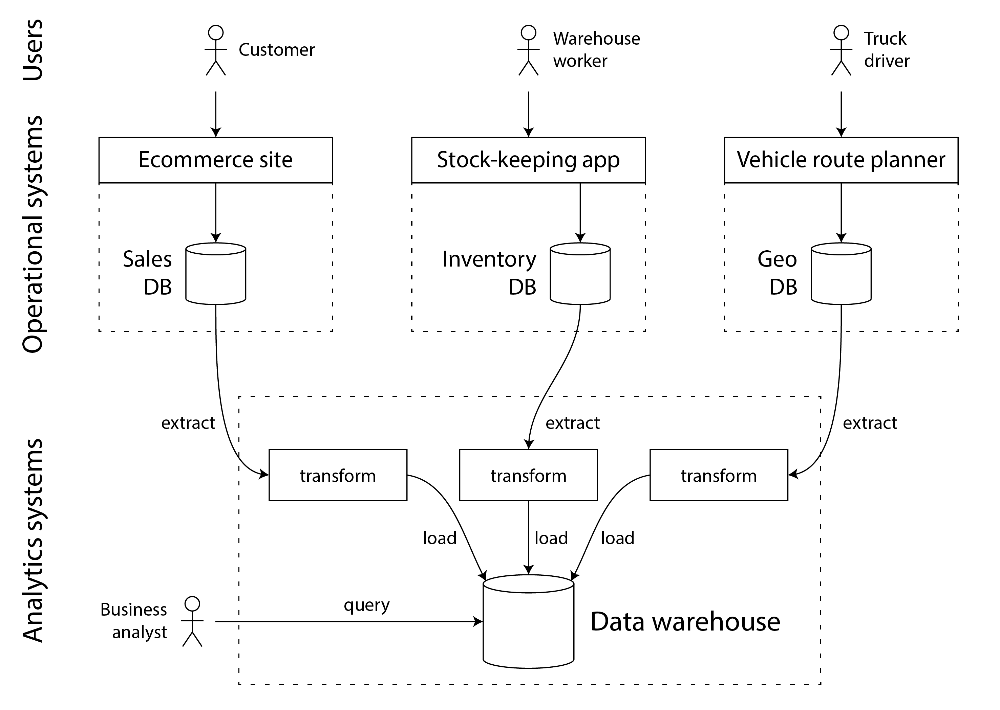
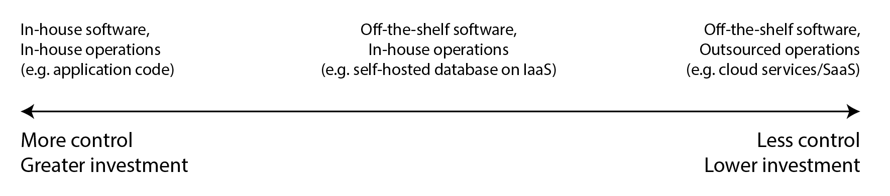

# 第一章：数据系统架构中的利弊权衡

> *没有解决方案，只有利弊权衡。[…] 尽你所能获取最好的利弊权衡，这是你唯一能指望的事。*
>
> [Thomas Sowell](https://www.youtube.com/watch?v=2YUtKr8-_Fg), 与 Fred Barnes 的采访 (2005)

数据在今天的许多应用程序开发中居于核心地位。随着网络和移动应用、软件即服务（SaaS）以及云服务的普及，将来自不同用户的数据存储在共享的基于服务器的数据基础设施中已成为常态。需要存储和供分析使用的数据包括用户活动、商业交易、设备和传感器的数据。当用户与应用程序交互时，他们既读取存储的数据，也生成更多数据。

小量数据，可在单一机器上存储和处理，通常相对容易处理。然而，随着数据量或查询率的增加，需要将数据分布到多台机器上，这引入了许多挑战。随着应用程序需求的复杂化，仅在一个系统中存储所有数据已不再足够，可能需要结合多个提供不同功能的存储或处理系统。

如果数据管理是开发应用程序的主要挑战之一，我们称这类应用为*数据密集型* [[1](ch01.html#Kouzes2009)]。而在*计算密集型*系统中，挑战在于并行处理一些非常大的计算，在数据密集型应用中，我们通常更关心的是如何存储和处理大数据量、管理数据变化、在出现故障和并发时确保一致性以及确保服务的高可用性。

这类应用通常由提供常用功能的标准构建块构成。例如，许多应用需要：

- 存储数据，以便它们或其他应用程序稍后可以再次找到它（*数据库*）
- 记住一次昂贵操作的结果，以加速读取（*缓存*）
- 允许用户按关键词搜索数据或以各种方式过滤数据（*搜索索引*）
- 当事件和数据变化发生时立即处理（*流处理*）
- 定期处理大量积累的数据（*批处理*）

在构建应用程序时，我们通常会采用几个软件系统或服务，如数据库或 API，并用一些应用代码将它们粘合在一起。如果你完全按照数据系统的设计目的去做，那么这个过程可能会非常容易。

然而，随着你的应用变得更加雄心勃勃，挑战也随之而来。有许多不同特性的数据库系统，适用于不同的目的——你该如何选择使用哪一个？有各种各样的缓存方法，几种构建搜索索引的方式等等——你该如何权衡它们的利弊？你需要弄清楚哪些工具和哪些方法最适合手头的任务，而且将工具组合起来时可能会很难做到一款工具单独无法完成的事情。

本书是一本指南，旨在帮助你做出关于使用哪些技术以及如何组合它们的决策。正如你将看到的，没有一种方法基本上比其他方法更好；每种方法都有其优缺点。通过这本书，你将学会提出正确的问题，评估和比较数据系统，从而找出最适合你的特定应用需求的方法。

我们将从探索数据在当今组织中的典型使用方式开始我们的旅程。这里的许多想法起源于*企业软件*（即大型组织，如大公司和政府的软件需求和工程实践），因为历史上只有大型组织拥有需要复杂技术解决方案的大数据量。如果你的数据量足够小，你甚至可以简单地将其保存在电子表格中！然而，最近，较小的公司和初创企业管理大数据量并构建数据密集型系统也变得普遍。

关于数据系统的一个关键挑战是，不同的人需要用数据做非常不同的事情。如果你在一家公司工作，你和你的团队会有一套优先事项，而另一个团队可能完全有不同的目标，尽管你们可能都在处理同一数据集！此外，这些目标可能不会明确表达，这可能会导致误解和对正确方法的争议。

为了帮助你了解你可以做出哪些选择，本章将比较几个对比概念，并探讨它们的利弊：

- 事务处理与分析之间的区别（[“事务处理与分析”](#事务处理与分析)）
- 云服务与自托管系统的优缺点（[“云服务与自托管”](#云服务与自托管)）
- 何时从单节点系统迁移到分布式系统（[“分布式与单节点系统”](#分布式与单节点系统)）
- 平衡业务需求与用户权利（[“数据系统、法律与社会”](#数据系统法律与社会)）

此外，本章将为我们接下来的书中提供必需的术语。

Data is central to much application development today. With web and mobile apps, software as a service (SaaS), and cloud services, it has become normal to store data from many different users in a shared server-based data infrastructure. Data from user activity, business transactions, devices and sensors needs to be stored and made available for analysis. As users interact with an application, they both read the data that is stored, and also generate more data.

Small amounts of data, which can be stored and processed on a single machine, are often fairly easy to deal with. However, as the data volume or the rate of queries grows, it needs to be distributed across multiple machines, which introduces many challenges. As the needs of the application become more complex, it is no longer sufficient to store everything in one system, but it might be necessary to combine multiple storage or processing systems that provide different capabilities.

We call an application *data-intensive* if data management is one of the primary challenges in developing the application [[1](ch01.html#Kouzes2009)]. While in *compute-intensive* systems the challenge is parallelizing some very large computation, in data-intensive applications we usually worry more about things like storing and processing large data volumes, managing changes to data, ensuring consistency in the face of failures and concurrency, and making sure services are highly available.

Such applications are typically built from standard building blocks that provide commonly needed functionality. For example, many applications need to:

- Store data so that they, or another application, can find it again later (*databases*)
- Remember the result of an expensive operation, to speed up reads (*caches*)
- Allow users to search data by keyword or filter it in various ways (*search indexes*)
- Handle events and data changes as soon as they occur (*stream processing*)
- Periodically crunch a large amount of accumulated data (*batch processing*)

In building an application we typically take several software systems or services, such as databases or APIs, and glue them together with some application code. If you are doing exactly what the data systems were designed for, then this process can be quite easy.

However, as your application becomes more ambitious, challenges arise. There are many database systems with different characteristics, suitable for different purposes—how do you choose which one to use? There are various approaches to caching, several ways of building search indexes, and so on—how do you reason about their trade-offs? You need to figure out which tools and which approaches are the most appropriate for the task at hand, and it can be difficult to combine tools when you need to do something that a single tool cannot do alone.

This book is a guide to help you make decisions about which technologies to use and how to combine them. As you will see, there is no one approach that is fundamentally better than others; everything has pros and cons. With this book, you will learn to ask the right questions to evaluate and compare data systems, so that you can figure out which approach will best serve the needs of your particular application.

We will start our journey by looking at some of the ways that data is typically used in organizations today. Many of the ideas here have their origin in *enterprise software* (i.e., the software needs and engineering practices of large organizations, such as big corporations and governments), since historically, only large organizations had the large data volumes that required sophisticated technical solutions. If your data volume is small enough, you can simply keep it in a spreadsheet! However, more recently it has also become common for smaller companies and startups to manage large data volumes and build data-intensive systems.

One of the key challenges with data systems is that different people need to do very different things with data. If you are working at a company, you and your team will have one set of priorities, while another team may have entirely different goals, although you might even be working with the same dataset! Moreover, those goals might not be explicitly articulated, which can lead to misunderstandings and disagreement about the right approach.

To help you understand what choices you can make, this chapter compares several contrasting concepts, and explores their trade-offs:

- the difference between transaction processing and analytics ([“Transaction Processing versus Analytics”](ch01.html#sec_introduction_analytics));
- pros and cons of cloud services and self-hosted systems ([“Cloud versus Self-Hosting”](ch01.html#sec_introduction_cloud));
- when to move from single-node systems to distributed systems ([“Distributed versus Single-Node Systems”](ch01.html#sec_introduction_distributed)); and
- balancing the needs of the business and the rights of the user ([“Data Systems, Law, and Society”](ch01.html#sec_introduction_compliance)).

Moreover, this chapter will provide you with terminology that we will need for the rest of the book.

--------

### 术语：前端与后端

我们在本书中将讨论的许多内容涉及*后端开发*。解释该术语：对于网络应用程序，客户端代码（在网页浏览器中运行）被称为*前端*，处理用户请求的服务器端代码被称为*后端*。移动应用与前端类似，它们提供用户界面，通常通过互联网与服务器端后端通信。前端有时会在用户设备上本地管理数据[[2](ch01.html#Kleppmann2019)]，但最大的数据基础设施挑战通常存在于后端：前端只需要处理一个用户的数据，而后端则代表*所有*用户管理数据。

后端服务通常可以通过 HTTP 访问；它通常包含一些应用程序代码，这些代码在一个或多个数据库中读写数据，有时还会与额外的数据系统（如缓存或消息队列）接口（我们可能统称为*数据基础设施*）。应用程序代码通常是*无状态的*（即，当它完成处理一个 HTTP 请求后，它会忘记该请求的所有信息），并且任何需要从一个请求传递到另一个请求的信息都需要存储在客户端或服务器端的数据基础设施中。

Much of what we will discuss in this book relates to *backend development*. To explain that term: for web applications, the client-side code (which runs in a web browser) is called the *frontend*, and the server-side code that handles user requests is known as the *backend*. Mobile apps are similar to frontends in that they provide user interfaces, which often communicate over the Internet with a server-side backend. Frontends sometimes manage data locally on the user’s device [[2](ch01.html#Kleppmann2019)], but the greatest data infrastructure challenges often lie in the backend: a frontend only needs to handle one user’s data, whereas the backend manages data on behalf of *all* of the users.

A backend service is often reachable via HTTP; it usually consists of some application code that reads and writes data in one or more databases, and sometimes interfaces with additional data systems such as caches or message queues (which we might collectively call *data infrastructure*). The application code is often *stateless* (i.e., when it finishes handling one HTTP request, it forgets everything about that request), and any information that needs to persist from one request to another needs to be stored either on the client, or in the server-side data infrastructure.

--------

## 事务处理与分析

如果你在企业中从事数据系统工作，你可能会遇到几种不同类型的处理数据的人。第一种是*后端工程师*，他们构建处理读取和更新数据请求的服务；这些服务通常直接或间接通过其他服务为外部用户提供服务（见[“微服务和无服务器”](ch01.html#sec_introduction_microservices)）。有时服务是供组织内部其他部分使用的。

除了管理后端服务的团队外，还有两个群体通常需要访问组织的数据：*商业分析师*，他们生成有关组织活动的报告以帮助管理层做出更好的决策（*商业智能*或*BI*），以及*数据科学家*，他们在数据中寻找新的见解或创建由数据分析和机器学习/AI支持的面向用户的产品功能（例如，电子商务网站上的“购买 X 的人也购买了 Y”推荐、风险评分或垃圾邮件过滤等预测分析，以及搜索结果的排名）。

尽管商业分析师和数据科学家倾向于使用不同的工具并以不同的方式操作，但他们有一些共同点：两者都进行*分析*，这意味着他们查看用户和后端服务生成的数据，但他们通常不修改这些数据（除了可能修正错误）。他们可能创建派生数据集，其中原始数据已以某种方式处理。这导致了两种系统之间的分离——这是我们将在整本书中使用的区分：

- *业务系统*包括后端服务和数据基础设施，数据是在那里创建的，例如通过服务外部用户。在这里，应用程序代码根据用户的操作读取并修改其数据库中的数据。
- *分析系统*满足商业分析师和数据科学家的需求。它们包含来自业务系统的数据的只读副本，并针对分析所需的数据处理类型进行了优化。

正如我们将在下一节中看到的，出于充分的理由，操作和分析系统通常保持独立。随着这些系统的成熟，出现了两个新的专业角色：*数据工程师*和*分析工程师*。数据工程师是了解如何整合操作和分析系统的人，他们负责组织的数据基础设施的更广泛管理[[3](ch01.html#Reis2022)]。分析工程师建模和转换数据，使其对查询组织中数据的最终用户更有用[[4](ch01.html#Machado2023)]。

许多工程师专注于操作或分析的一侧。然而，这本书涵盖了操作和分析数据系统，因为两者在组织内的数据生命周期中都扮演着重要的角色。我们将深入探讨用于向内部和外部用户提供服务的数据基础设施，以便你能更好地与这一界限另一侧的同事合作。

If you are working on data systems in an enterprise, you are likely to encounter several different types of people who work with data. The first type are *backend engineers* who build services that handle requests for reading and updating data; these services often serve external users, either directly or indirectly via other services (see [“Microservices and Serverless”](ch01.html#sec_introduction_microservices)). Sometimes services are for internal use by other parts of the organization.

In addition to the teams managing backend services, two other groups of people typically require access to an organization’s data: *business analysts*, who generate reports about the activities of the organization in order to help the management make better decisions (*business intelligence* or *BI*), and *data scientists*, who look for novel insights in data or who create user-facing product features that are enabled by data analysis and machine learning/AI (for example, “people who bought X also bought Y” recommendations on an e-commerce website, predictive analytics such as risk scoring or spam filtering, and ranking of search results).

Although business analysts and data scientists tend to use different tools and operate in different ways, they have some things in common: both perform *analytics*, which means they look at the data that the users and backend services have generated, but they generally do not modify this data (except perhaps for fixing mistakes). They might create derived datasets in which the original data has been processed in some way. This has led to a split between two types of systems—a distinction that we will use throughout this book:

- *Operational systems* consist of the backend services and data infrastructure where data is created, for example by serving external users. Here, the application code both reads and modifies the data in its databases, based on the actions performed by the users.
- *Analytical systems* serve the needs of business analysts and data scientists. They contain a read-only copy of the data from the operational systems, and they are optimized for the types of data processing that are needed for analytics.

As we shall see in the next section, operational and analytical systems are often kept separate, for good reasons. As these systems have matured, two new specialized roles have emerged: *data engineers* and *analytics engineers*. Data engineers are the people who know how to integrate the operational and the analytical systems, and who take responsibility for the organization’s data infrastructure more widely [[3](ch01.html#Reis2022)]. Analytics engineers model and transform data to make it more useful for end users querying data in an organization [[4](ch01.html#Machado2023)].

Many engineers specialize on either the operational or the analytical side. However, this book covers both operational and analytical data systems, since both play an important role in the lifecycle of data within an organization. We will explore in-depth the data infrastructure that is used to deliver services both to internal and external users, so that you can work better with your colleagues on the other side of this divide.

### 分析与业务系统的特征

在商业数据处理的早期，数据库的写入通常对应于正在发生的*商业交易*：进行销售、向供应商下订单、支付员工的薪水等。随着数据库扩展到不涉及金钱交换的领域，*交易*一词仍然沿用，指的是构成逻辑单元的一组读写操作。

In the early days of business data processing, a write to the database typically corresponded to a *commercial transaction* taking place: making a sale, placing an order with a supplier, paying an employee’s salary, etc. As databases expanded into areas that didn’t involve money changing hands, the term *transaction* nevertheless stuck, referring to a group of reads and writes that form a logical unit.

> **注意**
>
> [即将提供链接]将详细探讨我们对交易的定义。本章宽泛地使用这个术语，指代低延迟的读写操作。

尽管数据库开始被用于许多不同类型的数据——社交媒体上的帖子、游戏中的移动、地址簿中的联系人等——基本的访问模式仍与处理商业交易类似。业务系统通常通过某个键查找少量记录（这称为*点查询*）。根据用户的输入，记录被插入、更新或删除。因为这些应用是交互式的，这种访问模式被称为*在线事务处理*（OLTP）。

然而，数据库也越来越多地被用于分析，其访问模式与OLTP有很大不同。通常，分析查询会扫描大量记录，并计算聚合统计数据（如计数、求和或平均值），而不是将个别记录返回给用户。例如，超市连锁的商业分析师可能希望回答诸如：

- 我们的每家店在一月份的总收入是多少？
- 我们在最近的促销活动中卖出的香蕉比平时多多少？
- 哪种品牌的婴儿食品最常与X品牌的尿布一起购买？

这些类型的查询所产生的报告对于商业智能至关重要，帮助管理层决定下一步做什么。为了区分使用数据库的这种模式与事务处理的不同，它被称为*在线分析处理*（OLAP）[[5](ch01.html#Codd1993)]。OLTP和分析之间的区别并不总是明确的，但[表1-1](ch01.html#tab_oltp_vs_olap)列出了一些典型的特征。

| 属性     | 业务系统 (OLTP)    | 分析系统 (OLAP)   |
|--------|----------------|---------------|
| 主要读取模式 | 点查询（按键提取个别记录）  | 在大量记录上聚合      |
| 主要写入模式 | 创建、更新和删除个别记录   | 批量导入（ETL）或事件流 |
| 人类用户示例 | 网络/移动应用的终端用户   | 内部分析师，用于决策支持  |
| 机器使用示例 | 检查是否授权某项行动     | 检测欺诈/滥用模式     |
| 查询类型   | 固定的查询集合，由应用预定义 | 分析师可以进行任意查询   |
| 数据表示   | 数据的最新状态（当前时间点） | 随时间发生的事件历史    |
| 数据集大小  | 千兆字节至太字节       | 太字节至拍字节       |

[Link to Come] explores in detail what we mean with a transaction. This chapter uses the term loosely to refer to low-latency reads and writes.

Even though databases started being used for many different kinds of data—posts on social media, moves in a game, contacts in an address book, and many others—the basic access pattern remained similar to processing business transactions. An operational system typically looks up a small number of records by some key (this is called a *point query*). Records are inserted, updated, or deleted based on the user’s input. Because these applications are interactive, this access pattern became known as *online transaction processing* (OLTP).

However, databases also started being increasingly used for analytics, which has very different access patterns compared to OLTP. Usually an analytic query scans over a huge number of records, and calculates aggregate statistics (such as count, sum, or average) rather than returning the individual records to the user. For example, a business analyst at a supermarket chain may want to answer analytic queries such as:

- What was the total revenue of each of our stores in January?
- How many more bananas than usual did we sell during our latest promotion?
- Which brand of baby food is most often purchased together with brand X diapers?

The reports that result from these types of queries are important for business intelligence, helping the management decide what to do next. In order to differentiate this pattern of using databases from transaction processing, it has been called *online analytic processing* (OLAP) [[5](ch01.html#Codd1993)]. The difference between OLTP and analytics is not always clear-cut, but some typical characteristics are listed in [Table 1-1](ch01.html#tab_oltp_vs_olap).

| Property            | 运营系统 (OLTP)                                     | 分析系统 (OLAP)                               |
|:--------------------|:------------------------------------------------|:------------------------------------------|
| Main read pattern   | Point queries (fetch individual records by key) | Aggregate over large number of records    |
| Main write pattern  | Create, update, and delete individual records   | Bulk import (ETL) or event stream         |
| Human user example  | End user of web/mobile application              | Internal analyst, for decision support    |
| Machine use example | Checking if an action is authorized             | Detecting fraud/abuse patterns            |
| Type of queries     | Fixed set of queries, predefined by application | Analyst can make arbitrary queries        |
| Data represents     | Latest state of data (current point in time)    | History of events that happened over time |
| Dataset size        | Gigabytes to terabytes                          | Terabytes to petabytes                    |

> 注意
>
> *在线*在*OLAP*中的含义并不清晰；它可能指的是分析师不仅仅用于预定义报告的查询，而且还可以交互式地用于探索性查询的事实。

在业务系统中，用户通常不允许构建自定义SQL查询并在数据库上运行，因为这可能允许他们读取或修改他们无权访问的数据。此外，他们可能编写执行成本高昂的查询，从而影响其他用户的数据库性能。因此，OLTP系统大多运行固定的查询集，这些查询嵌入在应用程序代码中，仅偶尔使用一次性自定义查询进行维护或故障排除。另一方面，分析数据库通常允许用户手动编写任意SQL查询，或使用数据可视化或仪表板工具（如Tableau、Looker或Microsoft Power BI）自动生成查询。

The meaning of *online* in *OLAP* is unclear; it probably refers to the fact that queries are not just for predefined reports, but that analysts use the OLAP system interactively for explorative queries.

With operational systems, users are generally not allowed to construct custom SQL queries and run them on the database, since that would potentially allow them to read or modify data that they do not have permission to access. Moreover, they might write queries that are expensive to execute, and hence affect the database performance for other users. For these reasons, OLTP systems mostly run a fixed set of queries that are baked into the application code, and use one-off custom queries only occasionally for maintenance or troubleshooting. On the other hand, analytic databases usually give their users the freedom to write arbitrary SQL queries by hand, or to generate queries automatically using a data visualization or dashboard tool such as Tableau, Looker, or Microsoft Power BI.

### 数据仓库

起初，同一数据库既用于交易处理也用于分析查询。SQL在这方面证明是相当灵活的：它适用于两种类型的查询。然而，在1980年代末和1990年代初，公司停止使用OLTP系统进行分析目的，并在单独的数据库系统上运行分析的趋势日益明显。这种单独的数据库被称为*数据仓库*。

一家大型企业可能有几十个甚至上百个操作性交易处理系统：支撑面向客户的网站、控制实体店的销售点（结账）系统、跟踪仓库库存、规划车辆路线、管理供应商、管理员工以及执行许多其他任务的系统。每个系统都很复杂，需要一个团队来维护，因此这些系统大多独立运行。

通常不希望商业分析师和数据科学家直接查询这些OLTP系统，原因有几个：

- 感兴趣的数据可能分布在多个业务系统中，将这些数据集合并到单一查询中很困难（一个称为*数据孤岛*的问题）；
- 适合OLTP的模式和数据布局不太适合分析（见[“星型和雪花型：分析的模式”](ch03.html#sec_datamodels_analytics)）；
- 分析查询可能相当昂贵，如果在OLTP数据库上运行，将影响其他用户的性能；以及
- OLTP系统可能位于一个不允许用户直接访问的单独网络中，出于安全或合规原因。

与此相反，*数据仓库*是一个单独的数据库，分析师可以尽情查询，而不影响OLTP操作[[6](ch01.html#Chaudhuri1997)]。正如我们将在[即将提供链接]中看到的，数据仓库通常以与OLTP数据库非常不同的方式存储数据，以优化常见于分析的查询类型。

数据仓库包含公司所有各种OLTP系统中的数据的只读副本。数据从OLTP数据库中提取（使用定期数据转储或持续更新流），转换成便于分析的模式，清理后，然后加载到数据仓库中。将数据获取到数据仓库的过程称为*提取-转换-加载*（ETL），并在[图1-1](ch01.html#fig_dwh_etl)中进行了说明。有时*转换*和*加载*的顺序被交换（即在数据仓库中加载后进行转换），这就变成了*ELT*。

At first, the same databases were used for both transaction processing and analytic queries. SQL turned out to be quite flexible in this regard: it works well for both types of queries. Nevertheless, in the late 1980s and early 1990s, there was a trend for companies to stop using their OLTP systems for analytics purposes, and to run the analytics on a separate database system instead. This separate database was called a *data warehouse*.

A large enterprise may have dozens, even hundreds, of operational transaction processing systems: systems powering the customer-facing website, controlling point of sale (checkout) systems in physical stores, tracking inventory in warehouses, planning routes for vehicles, managing suppliers, administering employees, and performing many other tasks. Each of these systems is complex and needs a team of people to maintain it, so these systems end up operating mostly independently from each other.

It is usually undesirable for business analysts and data scientists to directly query these OLTP systems, for several reasons:

- the data of interest may be spread across multiple operational systems, making it difficult to combine those datasets in a single query (a problem known as *data silos*);
- the kinds of schemas and data layouts that are good for OLTP are less well suited for analytics (see [“Stars and Snowflakes: Schemas for Analytics”](ch03.html#sec_datamodels_analytics));
- analytic queries can be quite expensive, and running them on an OLTP database would impact the performance for other users; and
- the OLTP systems might reside in a separate network that users are not allowed direct access to for security or compliance reasons.

A *data warehouse*, by contrast, is a separate database that analysts can query to their hearts’ content, without affecting OLTP operations [[6](ch01.html#Chaudhuri1997)]. As we shall see in [Link to Come], data warehouses often store data in a way that is very different from OLTP databases, in order to optimize for the types of queries that are common in analytics.

The data warehouse contains a read-only copy of the data in all the various OLTP systems in the company. Data is extracted from OLTP databases (using either a periodic data dump or a continuous stream of updates), transformed into an analysis-friendly schema, cleaned up, and then loaded into the data warehouse. This process of getting data into the data warehouse is known as *Extract–Transform–Load* (ETL) and is illustrated in [Figure 1-1](ch01.html#fig_dwh_etl). Sometimes the order of the *transform* and *load* steps is swapped (i.e., the transformation is done in the data warehouse, after loading), resulting in *ELT*.

###### 图1-1 数仓ETL简化框架

在某些情况下，ETL过程的数据来源是外部的SaaS产品，如客户关系管理（CRM）、电子邮件营销或信用卡处理系统。在这些情况下，你无法直接访问原始数据库，因为它只能通过软件供应商的API访问。将这些外部系统的数据引入你自己的数据仓库，可以启用SaaS API无法实现的分析。对于SaaS API的ETL通常由专业的数据连接服务实现，如Fivetran、Singer或AirByte。

有些数据库系统提供*混合事务/分析处理*（HTAP），旨在在单一系统中同时启用OLTP和分析，无需从一个系统向另一个系统进行ETL [[7](ch01.html#Ozcan2017)，[8](ch01.html#Prout2022)]。然而，许多HTAP系统内部由一个OLTP系统与一个独立的分析系统组成，这些系统通过一个公共界面隐藏——因此，理解这两者之间的区别对于理解这些系统的工作方式非常重要。

此外，尽管存在HTAP，由于它们目标和要求的不同，事务性和分析性系统之间的分离仍然很常见。特别是，每个业务系统拥有自己的数据库被视为良好的实践（见[“微服务与无服务器”](ch01.html#sec_introduction_microservices)），导致有数百个独立的操作数据库；另一方面，一个企业通常只有一个数据仓库，这样业务分析师可以在单个查询中合并来自几个业务系统的数据。

业务系统和分析系统之间的分离是一个更广泛趋势的一部分：随着工作负载变得更加苛刻，系统变得更加专业化，并为特定工作负载优化。通用系统可以舒适地处理小数据量，但规模越大，系统趋向于变得更加专业化 [[9](ch01.html#Stonebraker2005fitsall)]。

In some cases the data sources of the ETL processes are external SaaS products such as customer relationship management (CRM), email marketing, or credit card processing systems. In those cases, you do not have direct access to the original database, since it is accessible only via the software vendor’s API. Bringing the data from these external systems into your own data warehouse can enable analyses that are not possible via the SaaS API. ETL for SaaS APIs is often implemented by specialist data connector services such as Fivetran, Singer, or AirByte.

Some database systems offer *hybrid transactional/analytic processing* (HTAP), which aims to enable OLTP and analytics in a single system without requiring ETL from one system into another [[7](ch01.html#Ozcan2017), [8](ch01.html#Prout2022)]. However, many HTAP systems internally consist of an OLTP system coupled with a separate analytical system, hidden behind a common interface—so the distinction beween the two remains important for understanding how these systems work.

Moreover, even though HTAP exists, it is common to have a separation between transactional and analytic systems due to their different goals and requirements. In particular, it is considered good practice for each operational system to have its own database (see [“Microservices and Serverless”](ch01.html#sec_introduction_microservices)), leading to hundreds of separate operational databases; on the other hand, an enterprise usually has a single data warehouse, so that business analysts can combine data from several operational systems in a single query.

The separation between operational and analytical systems is part of a wider trend: as workloads have become more demanding, systems have become more specialized and optimized for particular workloads. General-purpose systems can handle small data volumes comfortably, but the greater the scale, the more specialized systems tend to become [[9](ch01.html#Stonebraker2005fitsall)].

#### 从数据仓库到数据湖

数据仓库通常使用*关系*数据模型，通过SQL查询（见[第3章](ch03.html#ch_datamodels)），可能使用专业的商业智能软件。这种模型很适合业务分析师需要进行的类型的查询，但它不太适合数据科学家的需求，他们可能需要执行的任务如下：

- 将数据转换成适合训练机器学习模型的形式；这通常需要将数据库表的行和列转换为称为*特征*的数字值向量或矩阵。以一种最大化训练模型性能的方式执行这种转换的过程称为*特征工程*，它通常需要使用SQL难以表达的自定义代码。
- 获取文本数据（例如，产品评论）并使用自然语言处理技术尝试从中提取结构化信息（例如，作者的情感或他们提到的主题）。类似地，他们可能需要使用计算机视觉技术从照片中提取结构化信息。

尽管已经努力在SQL数据模型中添加机器学习操作符 [[10](ch01.html#Cohen2009)] 并在关系基础上构建高效的机器学习系统 [[11](ch01.html#Olteanu2020)]，许多数据科学家更喜欢不在数据仓库这类关系数据库中工作。相反，许多人更喜欢使用如pandas和scikit-learn这样的Python数据分析库，统计分析语言如R，以及分布式分析框架如Spark [[12](ch01.html#Bornstein2020)]。我们在[“数据框架、矩阵和数组”](ch03.html#sec_datamodels_dataframes)中进一步讨论这些内容。

因此，组织面临着使数据以适合数据科学家使用的形式可用的需求。答案是*数据湖*：一个集中的数据存储库，存放可能对分析有用的任何数据，通过ETL过程从业务系统获取。与数据仓库的不同之处在于，数据湖只包含文件，不强加任何特定的文件格式或数据模型。数据湖中的文件可能是使用如Avro或Parquet等文件格式编码的数据库记录集合（见[链接即将到来]），但它们同样可能包含文本、图像、视频、传感器读数、稀疏矩阵、特征向量、基因序列或任何其他类型的数据 [[13](ch01.html#Fowler2015)]。

ETL过程已经概括为*数据管道*，在某些情况下，数据湖已成为从业务系统到数据仓库的中间停靠点。数据湖包含由业务系统产生的“原始”形式的数据，而不是转换成关系数据仓库架构的数据。这种方法的优点是，每个数据的消费者都可以将原始数据转换成最适合其需要的形式。这被称为*寿司原则*：“原始数据更好” [[14](ch01.html#Johnson2015)]。

除了从数据湖加载数据到单独的数据仓库外，还可以直接在数据湖中的文件上运行典型的数据仓库工作负载（SQL查询和商业分析），以及数据科学/机器学习工作负载。这种架构被称为*数据湖仓*，它需要一个查询执行引擎和一个元数据（例如，模式管理）层来扩展数据湖的文件存储 [[15](ch01.html#Armbrust2021)]。Apache Hive、Spark SQL、Presto和Trino是这种方法的例子。

A data warehouse often uses a *relational* data model that is queried through SQL (see [Chapter 3](ch03.html#ch_datamodels)), perhaps using specialized business intelligence software. This model works well for the types of queries that business analysts need to make, but it is less well suited to the needs of data scientists, who might need to perform tasks such as:

- Transform data into a form that is suitable for training a machine learning model; often this requires turning the rows and columns of a database table into a vector or matrix of numerical values called *features*. The process of performing this transformation in a way that maximizes the performance of the trained model is called *feature engineering*, and it often requires custom code that is difficult to express using SQL.
- Take textual data (e.g., reviews of a product) and use natural language processing techniques to try to extract structured information from it (e.g., the sentiment of the author, or which topics they mention). Similarly, they might need to extract structured information from photos using computer vision techniques.

Although there have been efforts to add machine learning operators to a SQL data model [[10](ch01.html#Cohen2009)] and to build efficient machine learning systems on top of a relational foundation [[11](ch01.html#Olteanu2020)], many data scientists prefer not to work in a relational database such as a data warehouse. Instead, many prefer to use Python data analysis libraries such as pandas and scikit-learn, statistical analysis languages such as R, and distributed analytics frameworks such as Spark [[12](ch01.html#Bornstein2020)]. We discuss these further in [“Dataframes, Matrices, and Arrays”](ch03.html#sec_datamodels_dataframes).

Consequently, organizations face a need to make data available in a form that is suitable for use by data scientists. The answer is a *data lake*: a centralized data repository that holds a copy of any data that might be useful for analysis, obtained from operational systems via ETL processes. The difference from a data warehouse is that a data lake simply contains files, without imposing any particular file format or data model. Files in a data lake might be collections of database records, encoded using a file format such as Avro or Parquet (see [Link to Come]), but they can equally well contain text, images, videos, sensor readings, sparse matrices, feature vectors, genome sequences, or any other kind of data [[13](ch01.html#Fowler2015)].

ETL processes have been generalized to *data pipelines*, and in some cases the data lake has become an intermediate stop on the path from the operational systems to the data warehouse. The data lake contains data in a “raw” form produced by the operational systems, without the transformation into a relational data warehouse schema. This approach has the advantage that each consumer of the data can transform the raw data into a form that best suits their needs. It has been dubbed the *sushi principle*: “raw data is better” [[14](ch01.html#Johnson2015)].

Besides loading data from a data lake into a separate data warehouse, it is also possible to run typical data warehousing workloads (SQL queries and business analytics) directly on the files in the data lake, alongside data science/machine learning workloads. This architecture is known as a *data lakehouse*, and it requires a query execution engine and a metadata (e.g., schema management) layer that extend the data lake’s file storage [[15](ch01.html#Armbrust2021)]. Apache Hive, Spark SQL, Presto, and Trino are examples of this approach.

#### 数据湖之外

随着分析实践的成熟，组织越来越关注分析系统和数据管道的管理和运营，例如在DataOps宣言中捕捉到的内容 [[16](ch01.html#DataOps)]。其中包括治理、隐私和遵守像GDPR和CCPA这样的法规问题，我们将在[“数据系统、法律与社会”](ch01.html#sec_introduction_compliance)和[即将到来的链接]中讨论。

此外，分析数据越来越多地不仅以文件和关系表的形式提供，还以事件流的形式提供（见[即将到来的链接]）。使用基于文件的数据分析，你可以定期（例如，每天）重新运行分析，以响应数据的变化，但流处理允许分析系统更快地响应事件，大约在几秒钟的数量级。根据应用程序和时间敏感性，流处理方法可以很有价值，例如识别并阻止潜在的欺诈或滥用行为。

在某些情况下，分析系统的输出会提供给业务系统（有时被称为*反向ETL* [[17](ch01.html#Manohar2021)]）。例如，一个在分析系统中训练的机器学习模型可能被部署到生产中，以便它可以为终端用户生成推荐，如“购买X的人也买了Y”。这些部署的分析系统输出也被称为*数据产品* [[18](ch01.html#ORegan2018)]。机器学习模型可以使用TFX、Kubeflow或MLflow等专门工具部署到业务系统中。

As analytics practices have matured, organizations have been increasingly paying attention to the management and operations of analytics systems and data pipelines, as captured for example in the DataOps manifesto [[16](ch01.html#DataOps)]. Part of this are issues of governance, privacy, and compliance with regulation such as GDPR and CCPA, which we discuss in [“Data Systems, Law, and Society”](ch01.html#sec_introduction_compliance) and [Link to Come].

Moreover, analytical data is increasingly made available not only as files and relational tables, but also as streams of events (see [Link to Come]). With file-based data analysis you can re-run the analysis periodically (e.g., daily) in order to respond to changes in the data, but stream processing allows analytics systems to respond to events much faster, on the order of seconds. Depending on the application and how time-sensitive it is, a stream processing approach can be valuable, for example to identify and block potentially fraudulent or abusive activity.

In some cases the outputs of analytics systems are made available to operational systems (a process sometimes known as *reverse ETL* [[17](ch01.html#Manohar2021)]). For example, a machine-learning model that was trained on data in an analytics system may be deployed to production, so that it can generate recommendations for end-users, such as “people who bought X also bought Y”. Such deployed outputs of analytics systems are also known as *data products* [[18](ch01.html#ORegan2018)]. Machine learning models can be deployed to operational systems using specialized tools such as TFX, Kubeflow, or MLflow.

### 记录系统与衍生数据系统

与业务系统和分析系统之间的区别相关，本书还区分了*记录系统*和*衍生数据系统*。这些术语有用，因为它们可以帮助你澄清系统中的数据流动：

- 记录系统

  记录系统，也称为*真实来源*，持有某些数据的权威或*规范*版本。当新数据进入时，例如作为用户输入，首先在此处写入。每个事实只表示一次（通常是*规范化*的；见[“规范化、反规范化和连接”](ch03.html#sec_datamodels_normalization)）。如果另一个系统与记录系统之间存在任何差异，则记录系统中的值（按定义）是正确的。

- 衍生数据系统

  衍生系统中的数据是从另一个系统获取一些现有数据并以某种方式转换或处理的结果。如果你丢失了衍生数据，你可以从原始来源重新创建它。一个典型的例子是缓存：如果存在，可以从缓存中提供数据，但如果缓存中没有你需要的内容，你可以回退到底层数据库。非规范化的值、索引、物化视图、转换的数据表示和在数据集上训练的模型也属于这一类别。

从技术上讲，衍生数据是*冗余的*，因为它复制了现有的信息。然而，它通常对于读取查询的良好性能是必不可少的。你可以从单一来源派生出几个不同的数据集，使你能够从不同的“视点”查看数据。

分析系统通常是衍生数据系统，因为它们是在其他地方创建的数据的消费者。操作服务可能包含记录系统和衍生数据系统的混合。记录系统是首次写入数据的主要数据库，而衍生数据系统是加速常见读取操作的索引和缓存，特别是对于记录系统无法有效回答的查询。

大多数数据库、存储引擎和查询语言本质上不是记录系统或衍生系统。数据库只是一个工具：如何使用它取决于你。记录系统和衍生数据系统之间的区别不在于工具，而在于你如何在应用程序中使用它。通过明确哪些数据是从哪些其他数据衍生的，你可以为一个否则可能混乱的系统架构带来清晰度。

当一个系统中的数据是从另一个系统的数据衍生的时候，你需要一个过程来更新衍生数据，当记录系统中的原始数据发生变化时。不幸的是，许多数据库的设计基于这样的假设：你的应用程序只需要使用那一个数据库，它们并不容易整合多个系统以传播这些更新。在[即将到来的链接]中，我们将讨论*数据集成*的方法，这些方法允许我们组合多个数据系统来实现一个系统无法单独做到的事情。

这标志着我们对分析和交易处理的比较的结束。在下一节中，我们将探讨一个你可能已经看到多次争论的另一个折衷方案。

Related to the distinction between operational and analytical systems, this book also distinguishes between *systems of record* and *derived data systems*. These terms are useful because they can help you clarify the flow of data through a system:

- Systems of record

  A system of record, also known as *source of truth*, holds the authoritative or *canonical* version of some data. When new data comes in, e.g., as user input, it is first written here. Each fact is represented exactly once (the representation is typically *normalized*; see [“Normalization, Denormalization, and Joins”](ch03.html#sec_datamodels_normalization)). If there is any discrepancy between another system and the system of record, then the value in the system of record is (by definition) the correct one.

- Derived data systems

  Data in a derived system is the result of taking some existing data from another system and transforming or processing it in some way. If you lose derived data, you can recreate it from the original source. A classic example is a cache: data can be served from the cache if present, but if the cache doesn’t contain what you need, you can fall back to the underlying database. Denormalized values, indexes, materialized views, transformed data representations, and models trained on a dataset also fall into this category.

Technically speaking, derived data is *redundant*, in the sense that it duplicates existing information. However, it is often essential for getting good performance on read queries. You can derive several different datasets from a single source, enabling you to look at the data from different “points of view.”

Analytical systems are usually derived data systems, because they are consumers of data created elsewhere. Operational services may contain a mixture of systems of record and derived data systems. The systems of record are the primary databases to which data is first written, whereas the derived data systems are the indexes and caches that speed up common read operations, especially for queries that the system of record cannot answer efficiently.

Most databases, storage engines, and query languages are not inherently a system of record or a derived system. A database is just a tool: how you use it is up to you. The distinction between system of record and derived data system depends not on the tool, but on how you use it in your application. By being clear about which data is derived from which other data, you can bring clarity to an otherwise confusing system architecture.

When the data in one system is derived from the data in another, you need a process for updating the derived data when the original in the system of record changes. Unfortunately, many databases are designed based on the assumption that your application only ever needs to use that one database, and they do not make it easy to integrate multiple systems in order to propagate such updates. In [Link to Come] we will discuss approaches to *data integration*, which allow us to compose multiple data systems to achieve things that one system alone cannot do.

That brings us to the end of our comparison of analytics and transaction processing. In the next section, we will examine another trade-off that you might have already seen debated multiple times.

--------

## 云服务与自托管

对于组织需要执行的任何事务，首先要问的问题之一是：应该在内部完成还是外包？您应该自行构建还是购买？

这最终是一个关于业务优先级的问题。管理学的普遍观点是，作为组织的核心能力或竞争优势的事物应该在内部完成，而非核心、常规或普通的事务则应交给供应商处理 [[19](ch01.html#Fournier2021)]。举一个极端的例子，大多数公司不会自己发电（除非它们是能源公司，且不考虑紧急备用电力），因为从电网购买电力更便宜。

在软件方面，需要做出的两个重要决策是谁来构建软件以及谁来部署它。有一个将每个决策外包出去的可能性的范围，如[图 1-2](ch01.html#fig_cloud_spectrum)所示。一个极端是你编写并在内部运行的定制软件；另一个极端是广泛使用的云服务或软件即服务（SaaS）产品，由外部供应商实施和操作，你只能通过Web界面或API访问。

With anything that an organization needs to do, one of the first questions is: should it be done in-house, or should it be outsourced? Should you build or should you buy?

Ultimately, this is a question about business priorities. The received management wisdom is that things that are a core competency or a competitive advantage of your organization should be done in-house, whereas things that are non-core, routine, or commonplace should be left to a vendor [[19](ch01.html#Fournier2021)]. To give an extreme example, most companies do not generate their own electricity (unless they are an energy company, and leaving aside emergency backup power), since it is cheaper to buy electricity from the grid.

With software, two important decisions to be made are who builds the software and who deploys it. There is a spectrum of possibilities that outsource each decision to various degrees, as illustrated in [Figure 1-2](ch01.html#fig_cloud_spectrum). At one extreme is bespoke software that you write and run in-house; at the other extreme are widely-used cloud services or Software as a Service (SaaS) products that are implemented and operated by an external vendor, and which you only access through a web interface or API.

###### 图 1-2. 软件及其运营的类型范围。 A spectrum of types of software and its operations.

中间地带是你自行托管的现成软件（开源或商业的），即自己部署的软件——例如，如果你下载MySQL并将其安装在你控制的服务器上。这可能是在你自己的硬件上（通常称为*本地部署*，即使服务器实际上位于租用的数据中心机架中，也不一定真的在你自己的场所内），或者在云中的虚拟机上（即*基础设施即服务*或IaaS）。在这个范围中还有更多点，例如，运行修改过的开源软件。

与此范围分开的还有一个问题，即你是如何部署服务的，无论是在云中还是本地——例如，你是否使用像Kubernetes这样的编排框架。然而，部署工具的选择超出了本书的范围，因为其他因素对数据系统的架构有更大的影响。

The middle ground is off-the-shelf software (open source or commercial) that you *self-host*, i.e., deploy yourself—for example, if you download MySQL and install it on a server you control. This could be on your own hardware (often called *on-premises*, even if the server is actually in a rented datacenter rack and not literally on your own premises), or on a virtual machine in the cloud (*Infrastructure as a Service* or IaaS). There are still more points along this spectrum, e.g., taking open source software and running a modified version of it.

Seperately from this spectrum there is also the question of *how* you deploy services, either in the cloud or on-premises—for example, whether you use an orchestration framework such as Kubernetes. However, choice of deployment tooling is out of scope of this book, since other factors have a greater influence on the architecture of data systems.

### 云服务的优缺点

使用云服务，而不是自己运行可比软件，本质上是将该软件的运营外包给云提供商。支持和反对使用云服务的理由都很充分。云提供商声称使用他们的服务可以节省时间和金钱，并允许你比建立自己的基础设施更快地行动。

云服务是否实际上比自托管更便宜和更容易，很大程度上取决于你的技能和系统的工作负载。如果你已经有设置和操作所需系统的经验，并且你的负载相当可预测（即，你需要的机器数量不会剧烈波动），那么通常购买自己的机器并自己运行软件会更便宜 [[20](ch01.html#HeinemeierHansson2022), [21](ch01.html#Badizadegan2022)]。

另一方面，如果你需要一个你不知道如何部署和操作的系统，那么采用云服务通常比自己学习管理系统更容易且更快。如果你必须雇佣并培训专门的员工来维护和业务系统，这可能非常昂贵。当你使用云时，仍然需要一个运营团队（见[“云时代的运营”](ch01.html#sec_introduction_operations)），但将基本的系统管理外包可以释放你的团队，专注于更高层次的问题。

当你将系统的运营外包给专门运营该服务的公司时，这可能会带来更好的服务，因为提供商从为许多客户提供服务中获得运营专长。另一方面，如果你自己运行服务，你可以配置并调整它以在你特定的工作负载上表现良好；云服务不太可能愿意代表你进行此类定制。

如果你的系统负载随时间变化很大，云服务特别有价值。如果你配置你的机器能够处理高峰负载，但这些计算资源大部分时间都处于空闲状态，系统的成本效益就会降低。在这种情况下，云服务的优势在于它们可以更容易地根据需求变化扩展或缩减你的计算资源。

例如，分析系统的负载通常变化极大：快速运行大型分析查询需要大量并行的计算资源，但一旦查询完成，这些资源就会闲置，直到用户发出下一个查询。预定义的查询（例如，用于日常报告的查询）可以排队并安排以平滑负载，但对于交互式查询，你希望它们完成得越快，工作负载就越变化无常。如果你的数据集非常大，以至于快速查询需要大量计算资源，使用云可以节省金钱，因为你可以将未使用的资源返回给提供商，而不是让它们闲置。对于较小的数据集，这种差异不那么显著。

云服务最大的缺点是你对它没有控制权：

- 如果它缺少你需要的功能，你唯一能做的就是礼貌地询问供应商是否会添加它；你通常无法自己实现它。
- 如果服务出现故障，你只能等待它恢复。
- 如果你以某种方式使用服务，触发了一个错误或导致性能问题，你很难诊断问题。对于你自己运行的软件，你可以从业务系统获取性能指标和调试信息来帮助你了解其行为，你可以查看服务器日志，但使用供应商托管的服务时，你通常无法访问这些内部信息。
- 此外，如果服务关闭或变得无法接受地昂贵，或者如果供应商决定以你不喜欢的方式更改其产品，你将受制于他们——继续运行软件的旧版本通常不是一个选项，因此你将被迫迁移到另一个服务 [[22](ch01.html#Yegge2020)]。如果有提供兼容API的替代服务，这种风险可以缓解，但对于许多云服务，没有标准的API，这增加了切换的成本，使供应商锁定成为一个问题。

尽管存在这些风险，组织构建基于云服务的新应用变得越来越流行。然而，云服务并不能取代所有的内部数据系统：许多旧系统早于云技术，且对于那些现有云服务无法满足的特殊需求，内部系统仍然是必需的。例如，像高频交易这样对延迟极其敏感的应用需要完全控制硬件。

Using a cloud service, rather than running comparable software yourself, essentially outsources the operation of that software to the cloud provider. There are good arguments for and against cloud services. Cloud providers claim that using their services saves you time and money, and allows you to move faster compared to setting up your own infrastructure.

Whether a cloud service is actually cheaper and easier than self-hosting depends very much on your skills and the workload on your systems. If you already have experience setting up and operating the systems you need, and if your load is quite predictable (i.e., the number of machines you need does not fluctuate wildly), then it’s often cheaper to buy your own machines and run the software on them yourself [[20](ch01.html#HeinemeierHansson2022), [21](ch01.html#Badizadegan2022)].

On the other hand, if you need a system that you don’t already know how to deploy and operate, then adopting a cloud service is often easier and quicker than learning to manage the system yourself. If you have to hire and train staff specifically to maintain and operate the system, that can get very expensive. You still need an operations team when you’re using the cloud (see [“Operations in the Cloud Era”](ch01.html#sec_introduction_operations)), but outsourcing the basic system administration can free up your team to focus on higher-level concerns.

When you outsource the operation of a system to a company that specializes in running that service, that can potentially result in a better service, since the provider gains operational expertise from providing the service to many customers. On the other hand, if you run the service yourself, you can configure and tune it to perform well on your particular workload; it is unlikely that a cloud service would be willing to make such customizations on your behalf.

Cloud services are particularly valuable if the load on your systems varies a lot over time. If you provision your machines to be able to handle peak load, but those computing resources are idle most of the time, the system becomes less cost-effective. In this situation, cloud services have the advantage that they can make it easier to scale your computing resources up or down in response to changes in demand.

For example, analytics systems often have extremely variable load: running a large analytical query quickly requires a lot of computing resources in parallel, but once the query completes, those resources sit idle until the user makes the next query. Predefined queries (e.g., for daily reports) can be enqueued and scheduled to smooth out the load, but for interactive queries, the faster you want them to complete, the more variable the workload becomes. If your dataset is so large that querying it quickly requires significant computing resources, using the cloud can save money, since you can return unused resources to the provider rather than leaving them idle. For smaller datasets, this difference is less significant.

The biggest downside of a cloud service is that you have no control over it:

- If it is lacking a feature you need, all you can do is to politely ask the vendor whether they will add it; you generally cannot implement it yourself.
- If the service goes down, all you can do is to wait for it to recover.
- If you are using the service in a way that triggers a bug or causes performance problems, it will be difficult for you to diagnose the issue. With software that you run yourself, you can get performance metrics and debugging information from the operating system to help you understand its behavior, and you can look at the server logs, but with a service hosted by a vendor you usually do not have access to these internals.
- Moreover, if the service shuts down or becomes unacceptably expensive, or if the vendor decides to change their product in a way you don’t like, you are at their mercy—continuing to run an old version of the software is usually not an option, so you will be forced to migrate to an alternative service [[22](ch01.html#Yegge2020)]. This risk is mitigated if there are alternative services that expose a compatible API, but for many cloud services there are no standard APIs, which raises the cost of switching, making vendor lock-in a problem.

Despite all these risks, it has become more and more popular for organizations to build new applications on top of cloud services. However, cloud services will not subsume all in-house data systems: many older systems predate the cloud, and for any services that have specialist requirements that existing cloud services cannot meet, in-house systems remain necessary. For example, very latency-sensitive applications such as high-frequency trading require full control of the hardware.

--------

### 云原生系统架构

除了经济模式的不同（订阅服务而非购买硬件并在其上运行许可软件），云计算的兴起还在技术层面深刻影响了数据系统的实施方式。*云原生* 一词用来描述一种旨在利用云服务优势的架构。

原则上，几乎任何你可以自行托管的软件也可以作为云服务提供，实际上，许多流行的数据系统现在已经有了这样的托管服务。然而，从底层设计为云原生的系统显示出多项优势：在相同硬件上有更好的性能，从失败中更快恢复，能迅速扩展计算资源以匹配负载，并支持更大的数据集[[23](ch01.html#Verbitski2017), [24](ch01.html#Antonopoulos2019_ch1), [25](ch01.html#Vuppalapati2020)]。[表 1-2](ch01.html#tab_cloud_native_dbs)列出了这两类系统的一些例子。

| 类别       | 自托管系统                       | 云原生系统                                                               |
|----------|-----------------------------|---------------------------------------------------------------------|
| 事务型/OLTP | MySQL, PostgreSQL, MongoDB  | AWS Aurora 【23】, Azure SQL DB Hyperscale 【24】, Google Cloud Spanner |
| 分析型/OLAP | Teradata, ClickHouse, Spark | Snowflake 【25】, Google BigQuery, Azure Synapse Analytics            |

Besides having a different economic model (subscribing to a service instead of buying hardware and licensing software to run on it), the rise of the cloud has also had a profound effect on how data systems are implemented on a technical level. The term *cloud-native* is used to describe an architecture that is designed to take advantage of cloud services.

In principle, almost any software that you can self-host could also be provided as a cloud service, and indeed such managed services are now available for many popular data systems. However, systems that have been designed from the ground up to be cloud-native have been shown to have several advantages: better performance on the same hardware, faster recovery from failures, being able to quickly scale computing resources to match the load, and supporting larger datasets [[23](ch01.html#Verbitski2017), [24](ch01.html#Antonopoulos2019_ch1), [25](ch01.html#Vuppalapati2020)]. [Table 1-2](ch01.html#tab_cloud_native_dbs) lists some examples of both types of systems.

#### 云服务的分层

许多自托管的数据系统具有非常简单的系统要求：它们运行在常规业务系统如 Linux 或 Windows 上，它们将数据存储为文件系统上的文件，并通过标准网络协议如 TCP/IP 进行通信。一些系统依赖于特殊硬件，如用于机器学习的 GPU 或 RDMA 网络接口，但总体来说，自托管软件倾向于使用非常通用的计算资源：CPU、RAM、文件系统和 IP 网络。

在云中，这类软件可以在基础设施即服务（IaaS）环境中运行，使用一个或多个具有一定CPU、内存、磁盘和网络带宽配额的虚拟机（或*实例*）。与物理机相比，云实例可以更快地配置，并且大小种类更多，但在其他方面它们类似于传统计算机：你可以在其上运行任何软件，但你需要自己负责管理。

相比之下，云原生服务的关键思想是不仅使用由业务系统管理的计算资源，还要构建在更低层级的云服务之上，创建更高层级的服务。例如：

- *对象存储*服务，如亚马逊 S3、Azure Blob 存储和 Cloudflare R2 存储大文件。它们提供的 API 比典型文件系统的 API 更有限（基本的文件读写），但它们的优势在于隐藏了底层的物理机器：服务自动将数据分布在许多机器上，因此你无需担心任何一台机器上的磁盘空间耗尽。即使某些机器或其磁盘完全失败，也不会丢失数据。
- 许多其他服务又是建立在对象存储和其他云服务之上的：例如，Snowflake 是一种基于云的分析数据库（数据仓库），依赖于 S3 进行数据存储 [[25](ch01.html#Vuppalapati2020)]，还有一些服务又建立在 Snowflake 之上。

正如计算中的抽象总是一样，关于你应该使用什么，没有一个正确的答案。一般规则是，更高层次的抽象往往更针对特定用例。如果你的需求与更高层系统设计的情况匹配，使用现有的更高层系统可能会比从更低层系统自行构建省去许多麻烦。另一方面，如果没有高层系统满足你的需求，那么自己从更低层组件构建是唯一的选择。

Many self-hosted data systems have very simple system requirements: they run on a conventional operating system such as Linux or Windows, they store their data as files on the filesystem, and they communicate via standard network protocols such as TCP/IP. A few systems depend on special hardware such as GPUs (for machine learning) or RDMA network interfaces, but on the whole, self-hosted software tends to use very generic computing resources: CPU, RAM, a filesystem, and an IP network.

In a cloud, this type of software can be run on an Infrastructure-as-a-Service environment, using one or more virtual machines (or *instances*) with a certain allocation of CPUs, memory, disk, and network bandwidth. Compared to physical machines, cloud instances can be provisioned faster and they come in a greater variety of sizes, but otherwise they are similar to a traditional computer: you can run any software you like on it, but you are responsible for administering it yourself.

In contrast, the key idea of cloud-native services is to use not only the computing resources managed by your operating system, but also to build upon lower-level cloud services to create higher-level services. For example:

- *Object storage* services such as Amazon S3, Azure Blob Storage, and Cloudflare R2 store large files. They provide more limited APIs than a typical filesystem (basic file reads and writes), but they have the advantage that they hide the underlying physical machines: the service automatically distributes the data across many machines, so that you don’t have to worry about running out of disk space on any one machine. Even if some machines or their disks fail entirely, no data is lost.
- Many other services are in turn built upon object storage and other cloud services: for example, Snowflake is a cloud-based analytic database (data warehouse) that relies on S3 for data storage [[25](ch01.html#Vuppalapati2020)], and some other services in turn build upon Snowflake.

As always with abstractions in computing, there is no one right answer to what you should use. As a general rule, higher-level abstractions tend to be more oriented towards particular use cases. If your needs match the situations for which a higher-level system is designed, using the existing higher-level system will probably provide what you need with much less hassle than building it yourself from lower-level systems. On the other hand, if there is no high-level system that meets your needs, then building it yourself from lower-level components is the only option.

#### 存储与计算分离

在传统计算中，磁盘存储被视为持久的（我们假设一旦某些内容被写入磁盘，它就不会丢失）；为了容忍单个硬盘的失败，经常使用 RAID 来在几个磁盘上维护数据的副本。在云中，计算实例（虚拟机）也可能有本地磁盘附加，但云原生系统通常将这些磁盘更像是临时缓存，而不是长期存储。这是因为如果关联实例失败，或者为了适应负载变化而用更大或更小的实例替换实例（在不同的物理机上），本地磁盘将变得无法访问。

作为本地磁盘的替代，云服务还提供了可以从一个实例分离并连接到另一个实例的虚拟磁盘存储（Amazon EBS、Azure 管理磁盘和 Google Cloud 中的持久磁盘）。这种虚拟磁盘实际上不是物理磁盘，而是由一组独立机器提供的云服务，模拟磁盘（块设备）的行为（每个块通常为 4 KiB 大小）。这项技术使得在云中运行传统基于磁盘的软件成为可能，但它通常表现出较差的性能和可扩展性 [[23](ch01.html#Verbitski2017)]。

为解决这个问题，云原生服务通常避免使用虚拟磁盘，而是建立在专门为特定工作负载优化的专用存储服务之上。如 S3 等对象存储服务旨在长期存储相对较大的文件，大小从数百千字节到几个千兆字节不等。存储在数据库中的单独行或值通常比这小得多；因此云数据库通常在单独的服务中管理更小的值，并在对象存储中存储更大的数据块（包含许多单独的值） [[24](ch01.html#Antonopoulos2019_ch1)]。

在传统的系统架构中，同一台计算机负责存储（磁盘）和计算（CPU 和 RAM），但在云原生系统中，这两种责任已经有所分离或*解耦* [[8](ch01.html#Prout2022), [25](ch01.html#Vuppalapati2020), [26](https://learning.oreilly.com/library/view/designing-data-intensive-applications/例如，S3仅存储文件，如果你想分析那些数据，你将不得不在 S3 外部的某处运行分析代码。这意味着需要通过网络传输数据，我们将在[“分布式与单节点系统”](ch01.html#sec_introduction_distributed)中进一步讨论这一点。

此外，云原生系统通常是*多租户*的，这意味着它们不是为每个客户配置单独的机器，而是在同一共享硬件上由同一服务处理来自几个不同客户的数据和计算 [[28](ch01.html#Vanlightly2023)]。多租户可以实现更好的硬件利用率、更容易的可扩展性和云提供商更容易的管理，但它也需要精心的工程设计，以确保一个客户的活动不影响系统对其他客户的性能或安全性 [[29](ch01.html#Jonas2019)]。

In traditional computing, disk storage is regarded as durable (we assume that once something is written to disk, it will not be lost); to tolerate the failure of an individual hard disk, RAID is often used to maintain copies of the data on several disks. In the cloud, compute instances (virtual machines) may also have local disks attached, but cloud-native systems typically treat these disks more like an ephemeral cache, and less like long-term storage. This is because the local disk becomes inaccessible if the associated instance fails, or if the instance is replaced with a bigger or a smaller one (on a different physical machine) in order to adapt to changes in load.

As an alternative to local disks, cloud services also offer virtual disk storage that can be detached from one instance and attached to a different one (Amazon EBS, Azure managed disks, and persistent disks in Google Cloud). Such a virtual disk is not actually a physical disk, but rather a cloud service provided by a separate set of machines, which emulates the behavior of a disk (a *block device*, where each block is typically 4 KiB in size). This technology makes it possible to run traditional disk-based software in the cloud, but it often suffers from poor performance and poor scalability [[23](ch01.html#Verbitski2017)].

To address this problem, cloud-native services generally avoid using virtual disks, and instead build on dedicated storage services that are optimized for particular workloads. Object storage services such as S3 are designed for long-term storage of fairly large files, ranging from hundreds of kilobytes to several gigabytes in size. The individual rows or values stored in a database are typically much smaller than this; cloud databases therefore typically manage smaller values in a separate service, and store larger data blocks (containing many individual values) in an object store [[24](ch01.html#Antonopoulos2019_ch1)].

In a traditional systems architecture, the same computer is responsible for both storage (disk) and computation (CPU and RAM), but in cloud-native systems, these two responsibilities have become somewhat separated or *disaggregated* [[8](ch01.html#Prout2022), [25](ch01.html#Vuppalapati2020), [26](ch01.html#Shapira2023), [27](ch01.html#Murthy2022)]: for example, S3 only stores files, and if you want to analyze that data, you will have to run the analysis code somewhere outside of S3. This implies transferring the data over the network, which we will discuss further in [“Distributed versus Single-Node Systems”](ch01.html#sec_introduction_distributed).

Moreover, cloud-native systems are often *multitenant*, which means that rather than having a separate machine for each customer, data and computation from several different customers are handled on the same shared hardware by the same service [[28](ch01.html#Vanlightly2023)]. Multitenancy can enable better hardware utilization, easier scalability, and easier management by the cloud provider, but it also requires careful engineering to ensure that one customer’s activity does not affect the performance or security of the system for other customers [[29](ch01.html#Jonas2019)].

--------

### 在云时代的运营

传统上，管理组织服务器端数据基础设施的人被称为*数据库管理员*（DBAs）或*系统管理员*（sysadmins）。近年来，许多组织试图将软件开发和运营的角色整合到一个团队中，共同负责后端服务和数据基础设施；*DevOps*哲学指导了这一趋势。*站点可靠性工程师*（SREs）是谷歌实施这一理念的方式 [[30](ch01.html#Beyer2016)]。

运营的角色是确保服务可靠地交付给用户（包括配置基础设施和部署应用程序），并确保稳定的生产环境（包括监控和诊断可能影响可靠性的问题）。对于自托管系统，运营传统上涉及大量单机层面的工作，如容量规划（例如，监控可用磁盘空间并在空间用尽前添加更多磁盘）、配置新机器、将服务从一台机器移至另一台以及安装业务系统补丁。

许多云服务提供了一个API，隐藏了实际实现服务的单个机器。例如，云存储用*计量计费*取代了固定大小的磁盘，您可以在不提前规划容量需求的情况下存储数据，并根据实际使用的空间收费。此外，许多云服务即使单个机器失败也能保持高可用性（见[“可靠性和容错”](ch02.html#sec_introduction_reliability)）。

从单个机器到服务的这种重点转变伴随着运营角色的变化。提供可靠服务的高级目标仍然相同，但过程和工具已经演变。DevOps/SRE哲学更加强调：

- 自动化——偏好可重复的过程而不是一次性的手工作业，
- 偏好短暂的虚拟机和服务而不是长时间运行的服务器，
- 促进频繁的应用更新，
- 从事件中学习，
- 即使个别人员来去，也要保留组织对系统的知识 [[31](ch01.html#Limoncelli2020)]。

随着云服务的兴起，角色出现了分化：基础设施公司的运营团队专注于向大量客户提供可靠服务的细节，而服务的客户尽可能少地花时间和精力在基础设施上 [[32](ch01.html#Majors2020)]。

云服务的客户仍然需要运营，但他们关注的方面不同，如选择最适合特定任务的服务、将不同服务相互集成以及从一个服务迁移到另一个服务。尽管计量计费消除了传统意义上的容量规划的需要，但仍然重要的是了解您正在使用哪些资源以及用途，以免在不需要的云资源上浪费金钱：容量规划变成了财务规划，性能优化变成了成本优化 [[33](ch01.html#Cherkasky2021)]。此外，云服务确实有资源限制或*配额*（如您可以同时运行的最大进程数），您需要了解并计划这些限制，以免遇到问题 [[34](ch01.html#Kushchi2023)]。

采用云服务可能比运行自己的基础设施更容易且更快，尽管即使在这里，学习如何使用它和可能绕过其限制也有成本。随着越来越多的供应商提供针对不同用例的更广泛的云服务，不同服务之间的集成成为特别的挑战 [[35](ch01.html#Bernhardsson2021), [36](ch01.html#Stancil2021)]。ETL（见[“数据仓库”](ch01.html#sec_introduction_dwh)）只是故事的一部分；运营云服务也需要相互集成。目前缺乏促进此类集成的标准，因此它通常涉及大量的手动努力。

其他不能完全外包给云服务的运营方面包括维护应用程序及其使用的库的安全性、管理自己的服务之间的互动、监控服务的负载以及追踪性能下降或中断等问题的原因。虽然云正在改变运营的角色，但运营的需求依旧迫切。

Traditionally, the people managing an organization’s server-side data infrastructure were known as *database administrators* (DBAs) or *system administrators* (sysadmins). More recently, many organizations have tried to integrate the roles of software development and operations into teams with a shared responsibility for both backend services and data infrastructure; the *DevOps* philosophy has guided this trend. *Site Reliability Engineers* (SREs) are Google’s implementation of this idea [[30](ch01.html#Beyer2016)].

The role of operations is to ensure services are reliably delivered to users (including configuring infrastructure and deploying applications), and to ensure a stable production environment (including monitoring and diagnosing any problems that may affect reliability). For self-hosted systems, operations traditionally involves a significant amount of work at the level of individual machines, such as capacity planning (e.g., monitoring available disk space and adding more disks before you run out of space), provisioning new machines, moving services from one machine to another, and installing operating system patches.

Many cloud services present an API that hides the individual machines that actually implement the service. For example, cloud storage replaces fixed-size disks with *metered billing*, where you can store data without planning your capacity needs in advance, and you are then charged based on the space actually used. Moreover, many cloud services remain highly available, even when individual machines have failed (see [“Reliability and Fault Tolerance”](ch02.html#sec_introduction_reliability)).

This shift in emphasis from individual machines to services has been accompanied by a change in the role of operations. The high-level goal of providing a reliable service remains the same, but the processes and tools have evolved. The DevOps/SRE philosophy places greater emphasis on:

- automation—preferring repeatable processes over manual one-off jobs,
- preferring ephemeral virtual machines and services over long running servers,
- enabling frequent application updates,
- learning from incidents, and
- preserving the organization’s knowledge about the system, even as individual people come and go [[31](ch01.html#Limoncelli2020)].

With the rise of cloud services, there has been a bifurcation of roles: operations teams at infrastructure companies specialize in the details of providing a reliable service to a large number of customers, while the customers of the service spend as little time and effort as possible on infrastructure [[32](ch01.html#Majors2020)].

Customers of cloud services still require operations, but they focus on different aspects, such as choosing the most appropriate service for a given task, integrating different services with each other, and migrating from one service to another. Even though metered billing removes the need for capacity planning in the traditional sense, it’s still important to know what resources you are using for which purpose, so that you don’t waste money on cloud resources that are not needed: capacity planning becomes financial planning, and performance optimization becomes cost optimization [[33](ch01.html#Cherkasky2021)]. Moreover, cloud services do have resource limits or *quotas* (such as the maximum number of processes you can run concurrently), which you need to know about and plan for before you run into them [[34](ch01.html#Kushchi2023)].

Adopting a cloud service can be easier and quicker than running your own infrastructure, although even here there is a cost in learning how to use it, and perhaps working around its limitations. Integration between different services becomes a particular challenge as a growing number of vendors offers an ever broader range of cloud services targeting different use cases [[35](ch01.html#Bernhardsson2021), [36](ch01.html#Stancil2021)]. ETL (see [“Data Warehousing”](ch01.html#sec_introduction_dwh)) is only part of the story; operational cloud services also need to be integrated with each other. At present, there is a lack of standards that would facilitate this sort of integration, so it often involves significant manual effort.

Other operational aspects that cannot fully be outsourced to cloud services include maintaining the security of an application and the libraries it uses, managing the interactions between your own services, monitoring the load on your services, and tracking down the cause of problems such as performance degradations or outages. While the cloud is changing the role of operations, the need for operations is as great as ever.

-------

## 分布式与单节点系统

一个涉及通过网络进行通信的多台机器的系统被称为*分布式系统*。参与分布式系统的每个进程被称为*节点*。您可能希望系统分布式的原因有多种：

- 固有的分布式系统

  如果一个应用程序涉及两个或更多互动的用户，每个用户都使用自己的设备，那么该系统不可避免地是分布式的：设备之间的通信必须通过网络进行。

- 云服务间的请求

  如果数据存储在一个服务中但在另一个服务中处理，则必须通过网络从一个服务传输到另一个服务。

- 容错/高可用性

  如果您的应用程序需要在一台机器（或多台机器、网络或整个数据中心）宕机时仍然继续工作，您可以使用多台机器来提供冗余。当一台机器失败时，另一台可以接管。见[“可靠性和容错”](ch02.html#sec_introduction_reliability)。

- 可扩展性

  如果您的数据量或计算需求超过单台机器的处理能力，您可以将负载分散到多台机器上。见[“可扩展性”](ch02.html#sec_introduction_scalability)。

- 延迟

  如果您的用户遍布全球，您可能希望在全球各地设置服务器，以便每个用户都可以从地理位置靠近他们的数据中心获得服务。这避免了用户必须等待网络包绕地球半圈来响应他们的请求。见[“描述性能”](ch02.html#sec_introduction_percentiles)。

- 弹性

  如果您的应用程序在某些时候忙碌而在其他时候空闲，云部署可以根据需求扩展或缩减，因此您只需为您实际使用的资源付费。这在单台机器上更难实现，因为它需要预先配置好以应对最大负载，即使在很少使用时也是如此。

- 使用专用硬件

  系统的不同部分可以利用不同类型的硬件来匹配它们的工作负载。例如，对象存储可能使用多硬盘但CPU较少的机器，而数据分析系统可能使用CPU和内存多但没有硬盘的机器，机器学习系统可能使用GPU（对于训练深度神经网络和其他机器学习任务比CPU更高效）的机器。

- 法律合规

  一些国家有数据居留法律，要求在其管辖区内的人的数据必须在该国地理范围内存储和处理 [[37](ch01.html#Korolov2022)]。这些规则的范围各不相同——例如，在某些情况下，它仅适用于医疗或财务数据，而其他情况则更广泛。因此，一个在几个这样的司法管辖区有用户的服务将不得不将其数据分布在几个位置的服务器上。

这些原因适用于您自己编写的服务（应用程序代码）和由现成软件组成的服务（例如数据库）。

A system that involves several machines communicating via a network is called a *distributed system*. Each of the processes participating in a distributed system is called a *node*. There are various reasons why you might want a system to be distributed:

- Inherently distributed systems

  If an application involves two or more interacting users, each using their own device, then the system is unavoidably distributed: the communication between the devices will have to go via a network.

- Requests between cloud services

  If data is stored in one service but processed in another, it must be transferred over the network from one service to the other.

- Fault tolerance/high availability

  If your application needs to continue working even if one machine (or several machines, or the network, or an entire datacenter) goes down, you can use multiple machines to give you redundancy. When one fails, another one can take over. See [“Reliability and Fault Tolerance”](ch02.html#sec_introduction_reliability).

- Scalability

  If your data volume or computing requirements grow bigger than a single machine can handle, you can potentially spread the load across multiple machines. See [“Scalability”](ch02.html#sec_introduction_scalability).

- Latency

  If you have users around the world, you might want to have servers at various locations worldwide so that each user can be served from a datacenter that is geographically close to them. That avoids the users having to wait for network packets to travel halfway around the world to answer their requests. See [“Describing Performance”](ch02.html#sec_introduction_percentiles).

- Elasticity

  If your application is busy at some times and idle at other times, a cloud deployment can scale up or down to meet the demand, so that you pay only for resources you are actively using. This more difficult on a single machine, which needs to be provisioned to handle the maximum load, even at times when it is barely used.

- Using specialized hardware

  Different parts of the system can take advantage of different types of hardware to match their workload. For example, an object store may use machines with many disks but few CPUs, whereas a data analysis system may use machines with lots of CPU and memory but no disks, and a machine learning system may use machines with GPUs (which are much more efficient than CPUs for training deep neural networks and other machine learning tasks).

- Legal compliance

  Some countries have data residency laws that require data about people in their jurisdiction to be stored and processed geographically within that country [[37](ch01.html#Korolov2022)]. The scope of these rules varies—for example, in some cases it applies only to medical or financial data, while other cases are broader. A service with users in several such jurisdictions will therefore have to distribute their data across servers in several locations.

These reasons apply both to services that you write yourself (application code) and services consisting of off-the-shelf software (such as databases).

--------

### 分布式系统的问题

分布式系统也有其不利之处。通过网络传输的每个请求和API调用都需要处理可能发生的故障：网络可能中断，服务可能过载或崩溃，因此任何请求都可能在未收到响应的情况下超时。在这种情况下，我们不知道服务是否收到了请求，简单地重试可能不安全。我们将在[链接待补充]中详细讨论这些问题。

尽管数据中心网络速度很快，但调用另一个服务的速度仍然比在同一进程中调用函数要慢得多 [38]。在处理大量数据时，与其将数据从存储传输到另一台处理它的机器，不如将计算带到已经拥有数据的机器上，这样可能更快 [39]。更多的节点并不总是更快：在某些情况下，一台计算机上的简单单线程程序可能比拥有超过100个CPU核心的集群表现得更好 [40]。

调试分布式系统通常很困难：如果系统响应缓慢，您如何确定问题所在？在可观测性的标题下开发了分布式系统问题诊断技术 [41, 42]，这涉及收集关于系统执行的数据，并允许以可以分析高级指标和个别事件的方式查询这些数据。追踪工具如OpenTelemetry允许您跟踪哪个客户端为哪个操作调用了哪个服务器，以及每个调用花费了多长时间 [43]。

数据库提供了各种机制来确保数据一致性，我们将在[链接待补充]和[链接待补充]中看到。然而，当每个服务都有自己的数据库时，跨这些不同服务维护数据一致性成为应用程序的问题。我们将在[链接待补充]中探讨的分布式事务是确保一致性的一种可能技术，但它们在微服务环境中很少使用，因为它们与使服务相互独立的目标相悖 [44]。

基于所有这些原因，如果您可以在单台机器上完成某项任务，这通常比建立分布式系统简单得多 [21]。CPU、内存和硬盘已变得更大、更快和更可靠。结合单节点数据库，如DuckDB、SQLite和KùzuDB，现在许多工作负载都可以在单个节点上运行。我们将在[链接待补充]中进一步探讨这个话题。

--------

### 微服务与无服务

分布式系统通常将系统分布在多台机器上，最常见的方式是将它们分为客户端和服务器，并让客户端向服务器发出请求。如我们将在[链接待补充]中讨论的，这种通信最常使用HTTP。同一个过程可能既是服务器（处理传入请求）也是客户端（向其他服务发出传出请求）。

这种构建应用程序的方式传统上被称为*面向服务的架构*（SOA）；最近这个想法被细化为*微服务*架构 [[45](ch01.html#Newman2021_ch1), [46](ch01.html#Richardson2014)]。在这种架构中，每个服务都有一个明确定义的目的（例如，在S3的情况下，这将是文件存储）；每个服务都暴露一个可以通过网络由客户端调用的API，并且每个服务都有一个负责其维护的团队。因此，一个复杂的应用程序可以被分解为多个互动的服务，每个服务由一个单独的团队管理。

将复杂的软件分解为多个服务有几个优点：每个服务都可以独立更新，减少团队间的协调工作；每个服务可以被分配其所需的硬件资源；通过在API后面隐藏实现细节，服务所有者可以自由更改实现，而不影响客户端。在数据存储方面，通常每个服务都有自己的数据库，并且服务之间不共享数据库：共享数据库将有效地使整个数据库结构成为服务API的一部分，然后更改该结构将会很困难。共享的数据库还可能导致一个服务的查询负面影响其他服务的性能。

另一方面，拥有许多服务本身可能产生复杂性：每个服务都需要基础设施来部署新版本，调整分配的硬件资源以匹配负载，收集日志，监控服务健康，并在出现问题时通知值班工程师。*编排*框架如Kubernetes已成为部署服务的流行方式，因为它们为这些基础设施提供了基础。在开发过程中测试服务可能很复杂，因为您还需要运行它所依赖的所有其他服务。

微服务API的演进可能具有挑战性。调用API的客户端希望API具有某些字段。开发人员可能希望根据业务需求的变化添加或删除API中的字段，但这样做可能导致客户端失败。更糟糕的是，这种失败通常直到开发周期后期，当更新的服务API部署到暂存或生产环境时才被发现。API描述标准如OpenAPI和gRPC有助于管理客户端和服务器API之间的关系；我们将在[链接待补充]中进一步讨论这些内容。

微服务主要是对人的问题的技术解决方案：允许不同团队独立进展，无需彼此协调。这在大公司中很有价值，但在小公司中，如果没有许多团队，使用微服务可能是不必要的开销，更倾向于以最简单的方式实现应用程序 [[45](ch01.html#Newman2021_ch1)]。

*无服务器*，或*功能即服务*（FaaS），是部署服务的另一种方法，其中基础设施的管理被外包给云供应商 [[29](ch01.html#Jonas2019)]。使用虚拟机时，您必须明确选择何时启动或关闭实例；相比之下，在无服务器模型中，云提供商根据对您服务的传入请求，自动分配和释放硬件资源 [[47](ch01.html#Shahrad2020)]。“无服务器”的术语可能会产生误导：每个无服务器功能执行仍然在服务器上运行，但后续执行可能在不同的服务器上进行。

就像云存储用计量计费模式取代了容量规划（提前决定购买多少硬盘）一样，无服务器方法正在将计量计费带到代码执行：您只需为应用程序代码实际运行的时间付费，而不必提前预配资源。

The most common way of distributing a system across multiple machines is to divide them into clients and servers, and let the clients make requests to the servers. Most commonly HTTP is used for this communication, as we will discuss in [Link to Come]. The same process may be both a server (handling incoming requests) and a client (making outbound requests to other services).

This way of building applications has traditionally been called a *service-oriented architecture* (SOA); more recently the idea has been refined into a *microservices* architecture [[45](ch01.html#Newman2021_ch1), [46](ch01.html#Richardson2014)]. In this architecture, a service has one well-defined purpose (for example, in the case of S3, this would be file storage); each service exposes an API that can be called by clients via the network, and each service has one team that is responsible for its maintenance. A complex application can thus be decomposed into multiple interacting services, each managed by a separate team.

There are several advantages to breaking down a complex piece of software into multiple services: each service can be updated independently, reducing coordination effort among teams; each service can be assigned the hardware resources it needs; and by hiding the implementation details behind an API, the service owners are free to change the implementation without affecting clients. In terms of data storage, it is common for each service to have its own databases, and not to share databases between services: sharing a database would effectively make the entire database structure a part of the service’s API, and then that structure would be difficult to change. Shared databases could also cause one service’s queries to negatively impact the performance of other services.

On the other hand, having many services can itself breed complexity: each service requires infrastructure for deploying new releases, adjusting the allocated hardware resources to match the load, collecting logs, monitoring service health, and alerting an on-call engineer in the case of a problem. *Orchestration* frameworks such as Kubernetes have become a popular way of deploying services, since they provide a foundation for this infrastructure. Testing a service during development can be complicated, since you also need to run all the other services that it depends on.

Microservice APIs can be challenging to evolve. Clients that call an API expect the API to have certain fields. Developers might wish to add or remove fields to an API as business needs change, but doing so can cause clients to fail. Worse still, such failures are often not discovered until late in the development cycle when the updated service API is deployed to a staging or production environment. API description standards such as OpenAPI and gRPC help manage the relationship between client and server APIs; we discuss these further in [Link to Come].

Microservices are primarily a technical solution to a people problem: allowing different teams to make progress independently without having to coordinate with each other. This is valuable in a large company, but in a small company where there are not many teams, using microservices is likely to be unnecessary overhead, and it is preferable to implement the application in the simplest way possible [[45](ch01.html#Newman2021_ch1)].

*Serverless*, or *function-as-a-service* (FaaS), is another approach to deploying services, in which the management of the infrastructure is outsourced to a cloud vendor [[29](ch01.html#Jonas2019)]. When using virtual machines, you have to explicitly choose when to start up or shut down an instance; in contrast, with the serverless model, the cloud provider automatically allocates and frees hardware resources as needed, based on the incoming requests to your service [[47](ch01.html#Shahrad2020)]. The term “serverless” can misleading: each serverless function execution still runs on a server, but subsequent executions might run on a different one.

Just like cloud storage replaced capacity planning (deciding in advance how many disks to buy) with a metered billing model, the serverless approach is bringing metered billing to code execution: you only pay for the time that your application code is actually running, rather than having to provision resources in advance.

--------

### 云计算与超算

云计算并非构建大规模计算系统的唯一方式；另一种选择是*高性能计算*（HPC），也称为*超级计算*。虽然有一些重叠，但HPC通常有不同的优先级并采用与云计算和企业数据中心系统不同的技术。其中一些差异包括：

- 超级计算机通常用于计算密集型的科学计算任务，如天气预报、分子动力学（模拟原子和分子的运动）、复杂的优化问题和求解偏微分方程。另一方面，云计算倾向于用于在线服务、商业数据系统和需要高可用性服务用户请求的类似系统。
- 超级计算机通常运行大型批处理作业，这些作业会不时地将计算状态检查点保存到磁盘。如果节点失败，一个常见的解决方案是简单地停止整个集群工作，修复故障节点，然后从最后一个检查点重新开始计算 [[48](ch01.html#Barroso2018), [49](ch01.html#Fiala2012)]。在云服务中，通常不希望停止整个集群，因为服务需要持续地以最小的中断服务于用户。
- 超级计算机通常由专用硬件构建，每个节点都相当可靠。云服务中的节点通常由商品机构建，这些商品机由于规模经济可以以较低成本提供等效性能，但也具有更高的故障率（见[“硬件和软件故障”](ch02.html#sec_introduction_hardware_faults)）。
- 超级计算机节点通常通过共享内存和远程直接内存访问（RDMA）进行通信，这支持高带宽和低延迟，但假设系统用户之间有高度的信任 [[50](ch01.html#KornfeldSimpson2020)]。在云计算中，网络和机器经常由互不信任的组织共享，需要更强的安全机制，如资源隔离（例如，虚拟机）、加密和认证。
- 云数据中心网络通常基于IP和以太网，按Clos拓扑排列，以提供高切面带宽——这是衡量网络整体性能的常用指标 [[48](ch01.html#Barroso2018), [51](ch01.html#Singh2015)]。超级计算机通常使用专用的网络拓扑，如多维网格和环面 [[52](ch01.html#Lockwood2014)]，这为具有已知通信模式的HPC工作负载提供了更好的性能。
- 云计算允许节点分布在多个地理位置，而超级计算机通常假设其所有节点都靠近在一起。

大规模分析系统有时与超级计算共享一些特征，这就是为什么如果您在这一领域工作，了解这些技术可能是值得的。然而，本书主要关注需要持续可用的服务，如[“可靠性和容错”](ch02.html#sec_introduction_reliability)中所讨论的。

Cloud computing is not the only way of building large-scale computing systems; an alternative is *high-performance computing* (HPC), also known as *supercomputing*. Although there are overlaps, HPC often has different priorities and uses different techniques compared to cloud computing and enterprise datacenter systems. Some of those differences are:

- Supercomputers are typically used for computationally intensive scientific computing tasks, such as weather forecasting, molecular dynamics (simulating the movement of atoms and molecules), complex optimization problems, and solving partial differential equations. On the other hand, cloud computing tends to be used for online services, business data systems, and similar systems that need to serve user requests with high availability.
- A supercomputer typically runs large batch jobs that checkpoint the state of their computation to disk from time to time. If a node fails, a common solution is to simply stop the entire cluster workload, repair the faulty node, and then restart the computation from the last checkpoint [[48](ch01.html#Barroso2018), [49](ch01.html#Fiala2012)]. With cloud services, it is usually not desirable to stop the entire cluster, since the services need to continually serve users with minimal interruptions.
- Supercomputers are typically built from specialized hardware, where each node is quite reliable. Nodes in cloud services are usually built from commodity machines, which can provide equivalent performance at lower cost due to economies of scale, but which also have higher failure rates (see [“Hardware and Software Faults”](ch02.html#sec_introduction_hardware_faults)).
- Supercomputer nodes typically communicate through shared memory and remote direct memory access (RDMA), which support high bandwidth and low latency, but assume a high level of trust among the users of the system [[50](ch01.html#KornfeldSimpson2020)]. In cloud computing, the network and the machines are often shared by mutually untrusting organizations, requiring stronger security mechanisms such as resource isolation (e.g., virtual machines), encryption and authentication.
- Cloud datacenter networks are often based on IP and Ethernet, arranged in Clos topologies to provide high bisection bandwidth—a commonly used measure of a network’s overall performance [[48](ch01.html#Barroso2018), [51](ch01.html#Singh2015)]. Supercomputers often use specialized network topologies, such as multi-dimensional meshes and toruses [[52](ch01.html#Lockwood2014)], which yield better performance for HPC workloads with known communication patterns.
- Cloud computing allows nodes to be distributed across multiple geographic locations, whereas supercomputers generally assume that all of their nodes are close together.

Large-scale analytics systems sometimes share some characteristics with supercomputing, which is why it can be worth knowing about these techniques if you are working in this area. However, this book is mostly concerned with services that need to be continually available, as discussed in [“Reliability and Fault Tolerance”](ch02.html#sec_introduction_reliability).

--------

## 数据系统，法律与社会

到目前为止，您已经看到本章中数据系统的架构不仅受到技术目标和需求的影响，还受到它们支持的组织的人类需求的影响。越来越多的数据系统工程师意识到，仅仅满足自己业务的需求是不够的：我们还对整个社会负有责任。

特别需要关注的是存储关于人们及其行为的数据的系统。自2018年以来，*通用数据保护条例*（GDPR）为许多欧洲国家的居民提供了更大的控制权和法律权利，用以管理他们的个人数据，类似的隐私法规也在世界各地的不同国家和地区得到采纳，例如加利福尼亚消费者隐私法案（CCPA）。围绕人工智能的法规，如*欧盟人工智能法案*，对个人数据的使用施加了进一步的限制。

此外，即使在不直接受法规约束的领域，也越来越多地认识到计算机系统对人和社会的影响。社交媒体改变了个人获取新闻的方式，这影响了他们的政治观点，从而可能影响选举结果。自动化系统越来越多地做出对个人有深远影响的决定，例如决定谁应获得贷款或保险，谁应被邀请参加工作面试，或者谁应被怀疑犯有罪行 [[53](ch01.html#ONeil2016_ch1)]。

从事这些系统的每个人都负有考虑其伦理影响并确保遵守相关法律的责任。并不是每个人都必须成为法律和伦理的专家，但基本的法律和伦理原则意识与分布式系统的一些基础知识同样重要。

法律考量正在影响数据系统设计的基础 [[54](ch01.html#Shastri2020)]。例如，GDPR授予个人在请求时删除其数据的权利（有时称为*被遗忘权*）。然而，正如我们在本书中将看到的，许多数据系统依赖于不可变构造，如作为设计一部分的仅追加日志；我们如何确保在一个本应不可变的文件中删除某些数据？我们如何处理已并入派生数据集的数据的删除问题（见[“记录系统与派生数据”](ch01.html#sec_introduction_derived)），如机器学习模型的训练数据？回答这些问题创造了新的工程挑战。

目前我们没有明确的指南来判断哪些特定技术或系统架构应被视为“符合GDPR”的。法规故意没有规定特定的技术，因为这些可能随着技术的进步而迅速变化。相反，法律文本提出了需要解释的高级原则。这意味着关于如何遵守隐私法规的问题没有简单的答案，但我们将通过这个视角审视本书中的一些技术。

一般来说，我们存储数据是因为我们认为其价值大于存储它的成本。然而，值得记住的是，存储成本不仅仅是您为亚马逊 S3 或其他服务支付的账单：成本效益计算还应考虑数据泄露或被敌对方妥协时的责任和声誉损害风险，以及如果数据的存储和处理被发现不符合法律的风险，还有法律费用和罚款的风险。

政府或警察部门也可能强制公司交出数据。当存在数据可能揭示被刑事化行为的风险时（例如，在几个中东和非洲国家的同性恋行为，或在几个美国州寻求堕胎），存储该数据为用户创造了真正的安全风险。例如，通过位置数据很容易揭露到堕胎诊所的旅行，甚至可能通过一段时间内用户 IP 地址的日志（表明大致位置）揭露。

一旦考虑到所有风险，可能会合理地决定某些数据根本不值得存储，因此应该将其删除。*数据最小化*原则（有时称为德语术语*Datensparsamkeit*）与存储大量数据的“大数据”哲学相悖，以防它在未来证明有用 [[55](ch01.html#Datensparsamkeit)]。但这与 GDPR 相符，后者规定只能为特定的、明确的目的收集个人数据，这些数据以后不能用于任何其他目的，且为了收集目的，保存的数据不得超过必要的时间 [[56](ch01.html#GDPR)]。

企业也注意到了隐私和安全问题。信用卡公司要求支付处理业务遵守严格的支付卡行业（PCI）标准。处理者经常接受独立审计师的评估，以验证持续合规。软件供应商也看到了增加的审查。现在许多买家要求其供应商符合服务组织控制（SOC）类型 2 标准。与 PCI 合规一样，供应商接受第三方审计以验证遵守情况。

总的来说，平衡您的业务需求与您收集和处理的数据的人的需求很重要。这个话题还有更多内容；在[链接待补充]中，我们将更深入地探讨伦理和法律合规问题，包括偏见和歧视的问题。

So far you’ve seen in this chapter that the architecture of data systems is influenced not only by technical goals and requirements, but also by the human needs of the organizations that they support. Increasingly, data systems engineers are realizing that serving the needs of their own business is not enough: we also have a responsibility towards society at large.

One particular concern are systems that store data about people and their behavior. Since 2018 the *General Data Protection Regulation* (GDPR) has given residents of many European countries greater control and legal rights over their personal data, and similar privacy regulation has been adopted in various other countries and states around the world, including for example the California Consumer Privacy Act (CCPA). Regulations around AI, such as the *EU AI Act*, place further restrictions on how personal data can be used.

Moreover, even in areas that are not directly subject to regulation, there is increasing recognition of the effects that computer systems have on people and society. Social media has changed how individuals consume news, which influences their political opinions and hence may affect the outcome of elections. Automated systems increasingly make decisions that have profound consequences for individuals, such as deciding who should be given a loan or insurance coverage, who should be invited to a job interview, or who should be suspected of a crime [[53](ch01.html#ONeil2016_ch1)].

Everyone who works on such systems shares a responsibility for considering the ethical impact and ensuring that they comply with relevant law. It is not necessary for everybody to become an expert in law and ethics, but a basic awareness of legal and ethical principles is just as important as, say, some foundational knowledge in distributed systems.

Legal considerations are influencing the very foundations of how data systems are being designed [[54](ch01.html#Shastri2020)]. For example, the GDPR grants individuals the right to have their data erased on request (sometimes known as the *right to be forgotten*). However, as we shall see in this book, many data systems rely on immutable constructs such as append-only logs as part of their design; how can we ensure deletion of some data in the middle of a file that is supposed to be immutable? How do we handle deletion of data that has been incorporated into derived datasets (see [“Systems of Record and Derived Data”](ch01.html#sec_introduction_derived)), such as training data for machine learning models? Answering these questions creates new engineering challenges.

At present we don’t have clear guidelines on which particular technologies or system architectures should be considered “GDPR-compliant” or not. The regulation deliberately does not mandate particular technologies, because these may quickly change as technology progresses. Instead, the legal texts set out high-level principles that are subject to interpretation. This means that there are no simple answers to the question of how to comply with privacy regulation, but we will look at some of the technologies in this book through this lens.

In general, we store data because we think that its value is greater than the costs of storing it. However, it is worth remembering that the costs of storage are not just the bill you pay for Amazon S3 or another service: the cost-benefit calculation should also take into account the risks of liability and reputational damage if the data were to be leaked or compromised by adversaries, and the risk of legal costs and fines if the storage and processing of the data is found not to be compliant with the law.

Governments or police forces might also compel companies to hand over data. When there is a risk that the data may reveal criminalized behaviors (for example, homosexuality in several Middle Eastern and African countries, or seeking an abortion in several US states), storing that data creates real safety risks for users. Travel to an abortion clinic, for example, could easily be revealed by location data, perhaps even by a log of the user’s IP addresses over time (which indicate approximate location).

Once all the risks are taken into account, it might be reasonable to decide that some data is simply not worth storing, and that it should therefore be deleted. This principle of *data minimization* (sometimes known by the German term *Datensparsamkeit*) runs counter to the “big data” philosophy of storing lots of data speculatively in case it turns out to be useful in the future [[55](ch01.html#Datensparsamkeit)]. But it fits with the GDPR, which mandates that personal data many only be collected for a specified, explicit purpose, that this data may not later be used for any other purpose, and that the data must not be kept for longer than necessary for the purposes for which it was collected [[56](ch01.html#GDPR)].

Businesses have also taken notice of privacy and safety concerns. Credit card companies require payment processing businesses to adhere to strict payment card industry (PCI) standards. Processors undergo frequent evaluations from independent auditors to verify continued compliance. Software vendors have also seen increased scrutiny. Many buyers now require their vendors to comply with Service Organization Control (SOC) Type 2 standards. As with PCI compliance, vendors undergo third party audits to verify adherence.

Generally, it is important to balance the needs of your business against the needs of the people whose data you are collecting and processing. There is much more to this topic; in [Link to Come] we will go deeper into the topics of ethics and legal compliance, including the problems of bias and discrimination.

--------

## 本章小结

本章的主题是理解权衡：即，认识到对于许多问题并没有唯一的正确答案，而是有几种不同的方法，每种方法都有各自的优缺点。我们探讨了影响数据系统架构的一些重要选择，并介绍了在本书余下部分将需要用到的术语。

我们首先区分了操作型（事务处理，OLTP）和分析型（OLAP）系统，并看到了它们的不同特点：不仅管理不同类型的数据，访问模式也不同，而且服务于不同的受众。我们遇到了数据仓库和数据湖的概念，这些系统通过 ETL 从业务系统接收数据。在[链接待补充]中，我们将看到，由于需要服务的查询类型不同，操作型和分析型系统通常使用非常不同的内部数据布局。

然后，我们比较了云服务（一种相对较新的发展）和之前主导数据系统架构的传统自托管软件范式。这两种方法哪种更具成本效益很大程度上取决于您的具体情况，但不可否认的是，云原生方法正在改变数据系统的架构方式，例如它们如何分离存储和计算。

云系统本质上是分布式的，我们简要考察了与使用单一机器相比，分布式系统的一些权衡。在某些情况下，您无法避免采用分布式，但如果有可能保持在单一机器上，建议不要急于使系统分布式化。在[链接待补充]和[链接待补充]中，我们将更详细地介绍分布式系统的挑战。

最后，我们看到，数据系统架构不仅由部署系统的业务需求决定，还由保护被处理数据人员权利的隐私法规决定——这是许多工程师容易忽视的一个方面。如何将法律要求转化为技术实现尚未被充分理解，但在我们翻阅本书的其余部分时，保持对这个问题的关注是很重要的。

The theme of this chapter has been to understand trade-offs: that is, to recognize that for many questions there is not one right answer, but several different approaches that each have various pros and cons. We explored some of the most important choices that affect the architecture of data systems, and introduced terminology that will be needed throughout the rest of this book.

We started by making a distinction between operational (transaction-processing, OLTP) and analytical (OLAP) systems, and saw their different characteristics: not only managing different types of data with different access patterns, but also serving different audiences. We encountered the concept of a data warehouse and data lake, which receive data feeds from operational systems via ETL. In [Link to Come] we will see that operational and analytical systems often use very different internal data layouts because of the different types of queries they need to serve.

We then compared cloud services, a comparatively recent development, to the traditional paradigm of self-hosted software that has previously dominated data systems architecture. Which of these approaches is more cost-effective depends a lot on your particular situation, but it’s undeniable that cloud-native approaches are bringing big changes to the way data systems are architected, for example in the way they separate storage and compute.

Cloud systems are intrinsically distributed, and we briefly examined some of the trade-offs of distributed systems compared to using a single machine. There are situations in which you can’t avoid going distributed, but it’s advisable not to rush into making a system distributed if it’s possible to keep it on a single machine. In [Link to Come] and [Link to Come] we will cover the challenges with distributed systems in more detail.

Finally, we saw that data systems architecture is determined not only by the needs of the business deploying the system, but also by privacy regulation that protects the rights of the people whose data is being processed—an aspect that many engineers are prone to ignoring. How we translate legal requirements into technical implementations is not yet well understood, but it’s important to keep this question in mind as we move through the rest of this book.

--------

## 参考文献

[[1](ch01.html#Kouzes2009-marker)] Richard T. Kouzes, Gordon A. Anderson, Stephen T. Elbert, Ian Gorton, and Deborah K. Gracio. [The Changing Paradigm of Data-Intensive Computing](http://www2.ic.uff.br/~boeres/slides_AP/papers/TheChanginParadigmDataIntensiveComputing_2009.pdf). *IEEE Computer*, volume 42, issue 1, January 2009. [doi:10.1109/MC.2009.26](https://doi.org/10.1109/MC.2009.26)

[[2](ch01.html#Kleppmann2019-marker)] Martin Kleppmann, Adam Wiggins, Peter van Hardenberg, and Mark McGranaghan. [Local-first software: you own your data, in spite of the cloud](https://www.inkandswitch.com/local-first/). At *2019 ACM SIGPLAN International Symposium on New Ideas, New Paradigms, and Reflections on Programming and Software* (Onward!), October 2019. [doi:10.1145/3359591.3359737](https://doi.org/10.1145/3359591.3359737)

[[3](ch01.html#Reis2022-marker)] Joe Reis and Matt Housley. [*Fundamentals of Data Engineering*](https://www.oreilly.com/library/view/fundamentals-of-data/9781098108298/). O’Reilly Media, 2022. ISBN: 9781098108304

[[4](ch01.html#Machado2023-marker)] Rui Pedro Machado and Helder Russa. [*Analytics Engineering with SQL and dbt*](https://www.oreilly.com/library/view/analytics-engineering-with/9781098142377/). O’Reilly Media, 2023. ISBN: 9781098142384

[[5](ch01.html#Codd1993-marker)] Edgar F. Codd, S. B. Codd, and C. T. Salley. [Providing OLAP to User-Analysts: An IT Mandate](http://www.estgv.ipv.pt/PaginasPessoais/jloureiro/ESI_AID2007_2008/fichas/codd.pdf). E. F. Codd Associates, 1993. Archived at [perma.cc/RKX8-2GEE](https://perma.cc/RKX8-2GEE)

[[6](ch01.html#Chaudhuri1997-marker)] Surajit Chaudhuri and Umeshwar Dayal. [An Overview of Data Warehousing and OLAP Technology](https://www.microsoft.com/en-us/research/wp-content/uploads/2016/02/sigrecord.pdf). *ACM SIGMOD Record*, volume 26, issue 1, pages 65–74, March 1997. [doi:10.1145/248603.248616](https://doi.org/10.1145/248603.248616)

[[7](ch01.html#Ozcan2017-marker)] Fatma Özcan, Yuanyuan Tian, and Pinar Tözün. [Hybrid Transactional/Analytical Processing: A Survey](https://humming80.github.io/papers/sigmod-htaptut.pdf). At *ACM International Conference on Management of Data* (SIGMOD), May 2017. [doi:10.1145/3035918.3054784](https://doi.org/10.1145/3035918.3054784)

[[8](ch01.html#Prout2022-marker)] Adam Prout, Szu-Po Wang, Joseph Victor, Zhou Sun, Yongzhu Li, Jack Chen, Evan Bergeron, Eric Hanson, Robert Walzer, Rodrigo Gomes, and Nikita Shamgunov. [Cloud-Native Transactions and Analytics in SingleStore](https://dl.acm.org/doi/abs/10.1145/3514221.3526055). At *International Conference on Management of Data* (SIGMOD), June 2022. [doi:10.1145/3514221.3526055](https://doi.org/10.1145/3514221.3526055)

[[9](ch01.html#Stonebraker2005fitsall-marker)] Michael Stonebraker and Uğur Çetintemel. [‘One Size Fits All’: An Idea Whose Time Has Come and Gone](https://pages.cs.wisc.edu/~shivaram/cs744-readings/fits_all.pdf). At *21st International Conference on Data Engineering* (ICDE), April 2005. [doi:10.1109/ICDE.2005.1](https://doi.org/10.1109/ICDE.2005.1)

[[10](ch01.html#Cohen2009-marker)] Jeffrey Cohen, Brian Dolan, Mark Dunlap, Joseph M Hellerstein, and Caleb Welton. [MAD Skills: New Analysis Practices for Big Data](http://www.vldb.org/pvldb/vol2/vldb09-219.pdf). *Proceedings of the VLDB Endowment*, volume 2, issue 2, pages 1481–1492, August 2009. [doi:10.14778/1687553.1687576](https://doi.org/10.14778/1687553.1687576)

[[11](ch01.html#Olteanu2020-marker)] Dan Olteanu. [The Relational Data Borg is Learning](http://www.vldb.org/pvldb/vol13/p3502-olteanu.pdf). *Proceedings of the VLDB Endowment*, volume 13, issue 12, August 2020. [doi:10.14778/3415478.3415572](https://doi.org/10.14778/3415478.3415572)

[[12](ch01.html#Bornstein2020-marker)] Matt Bornstein, Martin Casado, and Jennifer Li. [Emerging Architectures for Modern Data Infrastructure: 2020](https://future.a16z.com/emerging-architectures-for-modern-data-infrastructure-2020/). *future.a16z.com*, October 2020. Archived at [perma.cc/LF8W-KDCC](https://perma.cc/LF8W-KDCC)

[[13](ch01.html#Fowler2015-marker)] Martin Fowler. [DataLake](https://www.martinfowler.com/bliki/DataLake.html). *martinfowler.com*, February 2015. Archived at [perma.cc/4WKN-CZUK](https://perma.cc/4WKN-CZUK)

[[14](ch01.html#Johnson2015-marker)] Bobby Johnson and Joseph Adler. [The Sushi Principle: Raw Data Is Better](https://learning.oreilly.com/videos/strata-hadoop/9781491924143/9781491924143-video210840/). At *Strata+Hadoop World*, February 2015.

[[15](ch01.html#Armbrust2021-marker)] Michael Armbrust, Ali Ghodsi, Reynold Xin, and Matei Zaharia. [Lakehouse: A New Generation of Open Platforms that Unify Data Warehousing and Advanced Analytics](https://www.cidrdb.org/cidr2021/papers/cidr2021_paper17.pdf). At *11th Annual Conference on Innovative Data Systems Research* (CIDR), January 2021.

[[16](ch01.html#DataOps-marker)] DataKitchen, Inc. [The DataOps Manifesto](https://dataopsmanifesto.org/en/). *dataopsmanifesto.org*, 2017. Archived at [perma.cc/3F5N-FUQ4](https://perma.cc/3F5N-FUQ4)

[[17](ch01.html#Manohar2021-marker)] Tejas Manohar. [What is Reverse ETL: A Definition & Why It’s Taking Off](https://hightouch.io/blog/reverse-etl/). *hightouch.io*, November 2021. Archived at [perma.cc/A7TN-GLYJ](https://perma.cc/A7TN-GLYJ)

[[18](ch01.html#ORegan2018-marker)] Simon O’Regan. [Designing Data Products](https://towardsdatascience.com/designing-data-products-b6b93edf3d23). *towardsdatascience.com*, August 2018. Archived at [perma.cc/HU67-3RV8](https://perma.cc/HU67-3RV8)

[[19](ch01.html#Fournier2021-marker)] Camille Fournier. [Why is it so hard to decide to buy?](https://skamille.medium.com/why-is-it-so-hard-to-decide-to-buy-d86fee98e88e) *skamille.medium.com*, July 2021. Archived at [perma.cc/6VSG-HQ5X](https://perma.cc/6VSG-HQ5X)

[[20](ch01.html#HeinemeierHansson2022-marker)] David Heinemeier Hansson. [Why we’re leaving the cloud](https://world.hey.com/dhh/why-we-re-leaving-the-cloud-654b47e0). *world.hey.com*, October 2022. Archived at [perma.cc/82E6-UJ65](https://perma.cc/82E6-UJ65)

[[21](ch01.html#Badizadegan2022-marker)] Nima Badizadegan. [Use One Big Server](https://specbranch.com/posts/one-big-server/). *specbranch.com*, August 2022. Archived at [perma.cc/M8NB-95UK](https://perma.cc/M8NB-95UK)

[[22](ch01.html#Yegge2020-marker)] Steve Yegge. [Dear Google Cloud: Your Deprecation Policy is Killing You](https://steve-yegge.medium.com/dear-google-cloud-your-deprecation-policy-is-killing-you-ee7525dc05dc). *steve-yegge.medium.com*, August 2020. Archived at [perma.cc/KQP9-SPGU](https://perma.cc/KQP9-SPGU)

[[23](ch01.html#Verbitski2017-marker)] Alexandre Verbitski, Anurag Gupta, Debanjan Saha, Murali Brahmadesam, Kamal Gupta, Raman Mittal, Sailesh Krishnamurthy, Sandor Maurice, Tengiz Kharatishvili, and Xiaofeng Bao. [Amazon Aurora: Design Considerations for High Throughput Cloud-Native Relational Databases](https://media.amazonwebservices.com/blog/2017/aurora-design-considerations-paper.pdf). At *ACM International Conference on Management of Data* (SIGMOD), pages 1041–1052, May 2017. [doi:10.1145/3035918.3056101](https://doi.org/10.1145/3035918.3056101)

[[24](ch01.html#Antonopoulos2019_ch1-marker)] Panagiotis Antonopoulos, Alex Budovski, Cristian Diaconu, Alejandro Hernandez Saenz, Jack Hu, Hanuma Kodavalla, Donald Kossmann, Sandeep Lingam, Umar Farooq Minhas, Naveen Prakash, Vijendra Purohit, Hugh Qu, Chaitanya Sreenivas Ravella, Krystyna Reisteter, Sheetal Shrotri, Dixin Tang, and Vikram Wakade. [Socrates: The New SQL Server in the Cloud](https://www.microsoft.com/en-us/research/uploads/prod/2019/05/socrates.pdf). At *ACM International Conference on Management of Data* (SIGMOD), pages 1743–1756, June 2019. [doi:10.1145/3299869.3314047](https://doi.org/10.1145/3299869.3314047)

[[25](ch01.html#Vuppalapati2020-marker)] Midhul Vuppalapati, Justin Miron, Rachit Agarwal, Dan Truong, Ashish Motivala, and Thierry Cruanes. [Building An Elastic Query Engine on Disaggregated Storage](https://www.usenix.org/system/files/nsdi20-paper-vuppalapati.pdf). At *17th USENIX Symposium on Networked Systems Design and Implementation* (NSDI), February 2020.

[[26](ch01.html#Shapira2023-marker)] Gwen Shapira. [Compute-Storage Separation Explained](https://www.thenile.dev/blog/storage-compute). *thenile.dev*, January 2023. Archived at [perma.cc/QCV3-XJNZ](https://perma.cc/QCV3-XJNZ)

[[27](ch01.html#Murthy2022-marker)] Ravi Murthy and Gurmeet Goindi. [AlloyDB for PostgreSQL under the hood: Intelligent, database-aware storage](https://cloud.google.com/blog/products/databases/alloydb-for-postgresql-intelligent-scalable-storage). *cloud.google.com*, May 2022. Archived at [archive.org](https://web.archive.org/web/20220514021120/https://cloud.google.com/blog/products/databases/alloydb-for-postgresql-intelligent-scalable-storage)

[[28](ch01.html#Vanlightly2023-marker)] Jack Vanlightly. [The Architecture of Serverless Data Systems](https://jack-vanlightly.com/blog/2023/11/14/the-architecture-of-serverless-data-systems). *jack-vanlightly.com*, November 2023. Archived at [perma.cc/UDV4-TNJ5](https://perma.cc/UDV4-TNJ5)

[[29](ch01.html#Jonas2019-marker)] Eric Jonas, Johann Schleier-Smith, Vikram Sreekanti, Chia-Che Tsai, Anurag Khandelwal, Qifan Pu, Vaishaal Shankar, Joao Carreira, Karl Krauth, Neeraja Yadwadkar, Joseph E Gonzalez, Raluca Ada Popa, Ion Stoica, David A Patterson. [Cloud Programming Simplified: A Berkeley View on Serverless Computing](https://arxiv.org/abs/1902.03383). *arxiv.org*, February 2019.

[[30](ch01.html#Beyer2016-marker)] Betsy Beyer, Jennifer Petoff, Chris Jones, and Niall Richard Murphy. [*Site Reliability Engineering: How Google Runs Production Systems*](https://www.oreilly.com/library/view/site-reliability-engineering/9781491929117/). O’Reilly Media, 2016. ISBN: 9781491929124

[[31](ch01.html#Limoncelli2020-marker)] Thomas Limoncelli. [The Time I Stole $10,000 from Bell Labs](https://queue.acm.org/detail.cfm?id=3434773). *ACM Queue*, volume 18, issue 5, November 2020. [doi:10.1145/3434571.3434773](https://doi.org/10.1145/3434571.3434773)

[[32](ch01.html#Majors2020-marker)] Charity Majors. [The Future of Ops Jobs](https://acloudguru.com/blog/engineering/the-future-of-ops-jobs). *acloudguru.com*, August 2020. Archived at [perma.cc/GRU2-CZG3](https://perma.cc/GRU2-CZG3)

[[33](ch01.html#Cherkasky2021-marker)] Boris Cherkasky. [(Over)Pay As You Go for Your Datastore](https://medium.com/riskified-technology/over-pay-as-you-go-for-your-datastore-11a29ae49a8b). *medium.com*, September 2021. Archived at [perma.cc/Q8TV-2AM2](https://perma.cc/Q8TV-2AM2)

[[34](ch01.html#Kushchi2023-marker)] Shlomi Kushchi. [Serverless Doesn’t Mean DevOpsLess or NoOps](https://thenewstack.io/serverless-doesnt-mean-devopsless-or-noops/). *thenewstack.io*, February 2023. Archived at [perma.cc/3NJR-AYYU](https://perma.cc/3NJR-AYYU)

[[35](ch01.html#Bernhardsson2021-marker)] Erik Bernhardsson. [Storm in the stratosphere: how the cloud will be reshuffled](https://erikbern.com/2021/11/30/storm-in-the-stratosphere-how-the-cloud-will-be-reshuffled.html). *erikbern.com*, November 2021. Archived at [perma.cc/SYB2-99P3](https://perma.cc/SYB2-99P3)

[[36](ch01.html#Stancil2021-marker)] Benn Stancil. [The data OS](https://benn.substack.com/p/the-data-os). *benn.substack.com*, September 2021. Archived at [perma.cc/WQ43-FHS6](https://perma.cc/WQ43-FHS6)

[[37](ch01.html#Korolov2022-marker)] Maria Korolov. [Data residency laws pushing companies toward residency as a service](https://www.csoonline.com/article/3647761/data-residency-laws-pushing-companies-toward-residency-as-a-service.html). *csoonline.com*, January 2022. Archived at [perma.cc/CHE4-XZZ2](https://perma.cc/CHE4-XZZ2)

[[38](ch01.html#Nath2019-marker)] Kousik Nath. [These are the numbers every computer engineer should know](https://www.freecodecamp.org/news/must-know-numbers-for-every-computer-engineer/). *freecodecamp.org*, September 2019. Archived at [perma.cc/RW73-36RL](https://perma.cc/RW73-36RL)

[[39](ch01.html#Hellerstein2019-marker)] Joseph M Hellerstein, Jose Faleiro, Joseph E Gonzalez, Johann Schleier-Smith, Vikram Sreekanti, Alexey Tumanov, and Chenggang Wu. [Serverless Computing: One Step Forward, Two Steps Back](https://arxiv.org/abs/1812.03651). At *Conference on Innovative Data Systems Research* (CIDR), January 2019.

[[40](ch01.html#McSherry2015_ch1-marker)] Frank McSherry, Michael Isard, and Derek G. Murray. [Scalability! But at What COST?](https://www.usenix.org/system/files/conference/hotos15/hotos15-paper-mcsherry.pdf) At *15th USENIX Workshop on Hot Topics in Operating Systems* (HotOS), May 2015.

[[41](ch01.html#Sridharan2018-marker)] Cindy Sridharan. *[Distributed Systems Observability: A Guide to Building Robust Systems](https://unlimited.humio.com/rs/756-LMY-106/images/Distributed-Systems-Observability-eBook.pdf)*. Report, O’Reilly Media, May 2018. Archived at [perma.cc/M6JL-XKCM](https://perma.cc/M6JL-XKCM)

[[42](ch01.html#Majors2019-marker)] Charity Majors. [Observability — A 3-Year Retrospective](https://thenewstack.io/observability-a-3-year-retrospective/). *thenewstack.io*, August 2019. Archived at [perma.cc/CG62-TJWL](https://perma.cc/CG62-TJWL)

[[43](ch01.html#Sigelman2010-marker)] Benjamin H. Sigelman, Luiz André Barroso, Mike Burrows, Pat Stephenson, Manoj Plakal, Donald Beaver, Saul Jaspan, and Chandan Shanbhag. [Dapper, a Large-Scale Distributed Systems Tracing Infrastructure](https://research.google/pubs/pub36356/). Google Technical Report dapper-2010-1, April 2010. Archived at [perma.cc/K7KU-2TMH](https://perma.cc/K7KU-2TMH)

[[44](ch01.html#Laigner2021-marker)] Rodrigo Laigner, Yongluan Zhou, Marcos Antonio Vaz Salles, Yijian Liu, and Marcos Kalinowski. [Data management in microservices: State of the practice, challenges, and research directions](http://www.vldb.org/pvldb/vol14/p3348-laigner.pdf). *Proceedings of the VLDB Endowment*, volume 14, issue 13, pages 3348–3361, September 2021. [doi:10.14778/3484224.3484232](https://doi.org/10.14778/3484224.3484232)

[[45](ch01.html#Newman2021_ch1-marker)] Sam Newman. [*Building Microservices*, second edition](https://www.oreilly.com/library/view/building-microservices-2nd/9781492034018/). O’Reilly Media, 2021. ISBN: 9781492034025

[[46](ch01.html#Richardson2014-marker)] Chris Richardson. [Microservices: Decomposing Applications for Deployability and Scalability](http://www.infoq.com/articles/microservices-intro). *infoq.com*, May 2014. Archived at [perma.cc/CKN4-YEQ2](https://perma.cc/CKN4-YEQ2)

[[47](ch01.html#Shahrad2020-marker)] Mohammad Shahrad, Rodrigo Fonseca, Íñigo Goiri, Gohar Chaudhry, Paul Batum, Jason Cooke, Eduardo Laureano, Colby Tresness, Mark Russinovich, Ricardo Bianchini. [Serverless in the Wild: Characterizing and Optimizing the Serverless Workload at a Large Cloud Provider](https://www.usenix.org/system/files/atc20-shahrad.pdf). At *USENIX Annual Technical Conference* (ATC), July 2020.

[[48](ch01.html#Barroso2018-marker)] Luiz André Barroso, Urs Hölzle, and Parthasarathy Ranganathan. [The Datacenter as a Computer: Designing Warehouse-Scale Machines](https://www.morganclaypool.com/doi/10.2200/S00874ED3V01Y201809CAC046), third edition. Morgan & Claypool Synthesis Lectures on Computer Architecture, October 2018. [doi:10.2200/S00874ED3V01Y201809CAC046](https://doi.org/10.2200/S00874ED3V01Y201809CAC046)

[[49](ch01.html#Fiala2012-marker)] David Fiala, Frank Mueller, Christian Engelmann, Rolf Riesen, Kurt Ferreira, and Ron Brightwell. [Detection and Correction of Silent Data Corruption for Large-Scale High-Performance Computing](http://moss.csc.ncsu.edu/~mueller/ftp/pub/mueller/papers/sc12.pdf),” at *International Conference for High Performance Computing, Networking, Storage and Analysis* (SC), November 2012. [doi:10.1109/SC.2012.49](https://doi.org/10.1109/SC.2012.49)

[[50](ch01.html#KornfeldSimpson2020-marker)] Anna Kornfeld Simpson, Adriana Szekeres, Jacob Nelson, and Irene Zhang. [Securing RDMA for High-Performance Datacenter Storage Systems](https://www.usenix.org/conference/hotcloud20/presentation/kornfeld-simpson). At *12th USENIX Workshop on Hot Topics in Cloud Computing* (HotCloud), July 2020.

[[51](ch01.html#Singh2015-marker)] Arjun Singh, Joon Ong, Amit Agarwal, Glen Anderson, Ashby Armistead, Roy Bannon, Seb Boving, Gaurav Desai, Bob Felderman, Paulie Germano, Anand Kanagala, Jeff Provost, Jason Simmons, Eiichi Tanda, Jim Wanderer, Urs Hölzle, Stephen Stuart, and Amin Vahdat. [Jupiter Rising: A Decade of Clos Topologies and Centralized Control in Google’s Datacenter Network](http://conferences.sigcomm.org/sigcomm/2015/pdf/papers/p183.pdf). At *Annual Conference of the ACM Special Interest Group on Data Communication* (SIGCOMM), August 2015. [doi:10.1145/2785956.2787508](https://doi.org/10.1145/2785956.2787508)

[[52](ch01.html#Lockwood2014-marker)] Glenn K. Lockwood. [Hadoop’s Uncomfortable Fit in HPC](http://glennklockwood.blogspot.co.uk/2014/05/hadoops-uncomfortable-fit-in-hpc.html). *glennklockwood.blogspot.co.uk*, May 2014. Archived at [perma.cc/S8XX-Y67B](https://perma.cc/S8XX-Y67B)

[[53](ch01.html#ONeil2016_ch1-marker)] Cathy O’Neil: *Weapons of Math Destruction: How Big Data Increases Inequality and Threatens Democracy*. Crown Publishing, 2016. ISBN: 9780553418811

[[54](ch01.html#Shastri2020-marker)] Supreeth Shastri, Vinay Banakar, Melissa Wasserman, Arun Kumar, and Vijay Chidambaram. [Understanding and Benchmarking the Impact of GDPR on Database Systems](http://www.vldb.org/pvldb/vol13/p1064-shastri.pdf). *Proceedings of the VLDB Endowment*, volume 13, issue 7, pages 1064–1077, March 2020. [doi:10.14778/3384345.3384354](https://doi.org/10.14778/3384345.3384354)

[[55](ch01.html#Datensparsamkeit-marker)] Martin Fowler. [Datensparsamkeit](https://www.martinfowler.com/bliki/Datensparsamkeit.html). *martinfowler.com*, December 2013. Archived at [perma.cc/R9QX-CME6](https://perma.cc/R9QX-CME6)

[[56](ch01.html#GDPR-marker)] [Regulation (EU) 2016/679 of the European Parliament and of the Council of 27 April 2016 (General Data Protection Regulation)](https://eur-lex.europa.eu/legal-content/EN/TXT/HTML/?uri=CELEX:32016R0679&from=EN). *Official Journal of the European Union* L 119/1, May 2016.