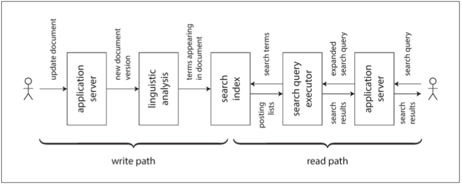

# 第十二章：数据系统的未来


> 如果船长的终极目标是保护船只，他应该永远待在港口。
>
> —— 圣托马斯・阿奎那《神学大全》（1265-1274）

---------------

[TOC]

到目前为止，本书主要描述的是 **现状**。在这最后一章中，我们将放眼 **未来**，讨论应该是怎么样的：我将提出一些想法与方法，我相信它们能从根本上改进我们设计与构建应用的方式。

对未来的看法与推测当然具有很大的主观性。所以在撰写本章时，当提及我个人的观点时会使用第一人称。你完全可以不同意这些观点并提出自己的看法，但我希望本章中的概念，至少能成为富有成效的讨论出发点，并澄清一些经常被混淆的概念。

[第一章](ch1.md) 概述了本书的目标：探索如何创建 **可靠**、**可伸缩** 和 **可维护** 的应用与系统。这一主题贯穿了所有的章节：例如，我们讨论了许多有助于提高可靠性的容错算法，有助于提高可伸缩性的分区，以及有助于提高可维护性的演化与抽象机制。在本章中，我们将把所有这些想法结合在一起，并在它们的基础上展望未来。我们的目标是，发现如何设计出比现有应用更好的应用 —— 健壮、正确、可演化、且最终对人类有益。

## 数据集成

本书中反复出现的主题是，对于任何给定的问题都会有好几种解决方案，所有这些解决方案都有不同的优缺点与利弊权衡。例如在 [第三章](ch3.md) 讨论存储引擎时，我们看到了日志结构存储、B 树以及列式存储。在 [第五章](ch5.md) 讨论复制时，我们看到了单领导者、多领导者和无领导者的方法。

如果你有一个类似于 “我想存储一些数据并稍后再查询” 的问题，那么并没有一种正确的解决方案。但对于不同的具体环境，总会有不同的合适方法。软件实现通常必须选择一种特定的方法。使单条代码路径能做到稳定健壮且表现良好已经是一件非常困难的事情了 —— 尝试在单个软件中完成所有事情，几乎可以保证，实现效果会很差。

因此软件工具的最佳选择也取决于情况。每一种软件，甚至所谓的 “通用” 数据库，都是针对特定的使用模式设计的。

面对让人眼花缭乱的诸多替代品，第一个挑战就是弄清软件与其适用环境的映射关系。供应商不愿告诉你他们软件不适用的工作负载，这是可以理解的。但是希望先前的章节能给你提供一些问题，让你读出字里行间的言外之意，并更好地理解这些权衡。

但是，即使你已经完全理解各种工具与其适用环境间的关系，还有一个挑战：在复杂的应用中，数据的用法通常花样百出。不太可能存在适用于 **所有** 不同数据应用场景的软件，因此你不可避免地需要拼凑几个不同的软件来以提供应用所需的功能。

### 组合使用衍生数据的工具

例如，为了处理任意关键词的搜索查询，将 OLTP 数据库与全文搜索索引集成在一起是很常见的的需求。尽管一些数据库（例如 PostgreSQL）包含了全文索引功能，对于简单的应用完全够了【1】，但更复杂的搜索能力就需要专业的信息检索工具了。相反的是，搜索索引通常不适合作为持久的记录系统，因此许多应用需要组合这两种不同的工具以满足所有需求。

我们在 “[保持系统同步](ch11.md#保持系统同步)” 中接触过集成数据系统的问题。随着数据不同表示形式的增加，集成问题变得越来越困难。除了数据库和搜索索引之外，也许你需要在分析系统（数据仓库，或批处理和流处理系统）中维护数据副本；维护从原始数据中衍生的缓存，或反规范化的数据版本；将数据灌入机器学习、分类、排名或推荐系统中；或者基于数据变更发送通知。

令人惊讶的是，我经常看到软件工程师做出这样的陈述：“根据我的经验，99% 的人只需要 X” 或者 “...... 不需要 X”（对于各种各样的 X）。我认为这种陈述更像是发言人自己的经验，而不是技术实际上的实用性。可能对数据执行的操作，其范围极其宽广。某人认为鸡肋而毫无意义的功能可能是别人的核心需求。当你拉高视角，并考虑跨越整个组织范围的数据流时，数据集成的需求往往就会变得明显起来。

#### 理解数据流

当需要在多个存储系统中维护相同数据的副本以满足不同的访问模式时，你要对输入和输出了如指掌：哪些数据先写入，哪些数据表示衍生自哪些来源？如何以正确的格式，将所有数据导入正确的地方？

例如，你可能会首先将数据写入 **记录系统** 数据库，捕获对该数据库所做的变更（请参阅 “[变更数据捕获](ch11.md#变更数据捕获)”），然后将变更以相同的顺序应用于搜索索引。如果变更数据捕获（CDC）是更新索引的唯一方式，则可以确定该索引完全派生自记录系统，因此与其保持一致（除软件错误外）。写入数据库是向该系统提供新输入的唯一方式。

允许应用程序直接写入搜索索引和数据库引入了如 [图 11-4](img/fig11-4.png) 所示的问题，其中两个客户端同时发送冲突的写入，且两个存储系统按不同顺序处理它们。在这种情况下，既不是数据库说了算，也不是搜索索引说了算，所以它们做出了相反的决定，进入彼此间持久性的不一致状态。

如果你可以通过单个系统来提供所有用户输入，从而决定所有写入的排序，则通过按相同顺序处理写入，可以更容易地衍生出其他数据表示。 这是状态机复制方法的一个应用，我们在 “[全序广播](ch9.md#全序广播)” 中看到。无论你使用变更数据捕获还是事件溯源日志，都不如简单的基于全序的决策原则更重要。

基于事件日志来更新衍生数据的系统，通常可以做到 **确定性** 与 **幂等性**（请参阅 “[幂等性](ch11.md#幂等性)”），使得从故障中恢复相当容易。

#### 衍生数据与分布式事务

保持不同数据系统彼此一致的经典方法涉及分布式事务，如 “[原子提交与两阶段提交](ch9.md#原子提交与两阶段提交)” 中所述。与分布式事务相比，使用衍生数据系统的方法如何？

在抽象层面，它们通过不同的方式达到类似的目标。分布式事务通过 **锁** 进行互斥来决定写入的顺序（请参阅 “[两阶段锁定](ch7.md#两阶段锁定)”），而 CDC 和事件溯源使用日志进行排序。分布式事务使用原子提交来确保变更只生效一次，而基于日志的系统通常基于 **确定性重试** 和 **幂等性**。

最大的不同之处在于事务系统通常提供 [线性一致性](ch9.md#线性一致性)，这包含着有用的保证，例如 [读己之写](ch5.md#读己之写)。另一方面，衍生数据系统通常是异步更新的，因此它们默认不会提供相同的时序保证。

在愿意为分布式事务付出代价的有限场景中，它们已被成功应用。但是，我认为 XA 的容错能力和性能很差劲（请参阅 “[实践中的分布式事务](ch9.md#实践中的分布式事务)”），这严重限制了它的实用性。我相信为分布式事务设计一种更好的协议是可行的。但使这样一种协议被现有工具广泛接受是很有挑战的，且不是立竿见影的事。

在没有广泛支持的良好分布式事务协议的情况下，我认为基于日志的衍生数据是集成不同数据系统的最有前途的方法。然而，诸如读己之写的保证是有用的，我认为告诉所有人 “最终一致性是不可避免的 —— 忍一忍并学会和它打交道” 是没有什么建设性的（至少在缺乏 **如何** 应对的良好指导时）。

在 “[将事情做正确](#将事情做正确)” 中，我们将讨论一些在异步衍生系统之上实现更强保障的方法，并迈向分布式事务和基于日志的异步系统之间的中间地带。

#### 全序的限制

对于足够小的系统，构建一个完全有序的事件日志是完全可行的（正如单主复制数据库的流行所证明的那样，它正好建立了这样一种日志）。但是，随着系统向更大更复杂的工作负载伸缩，限制开始出现：

* 在大多数情况下，构建完全有序的日志，需要所有事件汇集于决定顺序的 **单个领导者节点**。如果事件吞吐量大于单台计算机的处理能力，则需要将其分区到多台计算机上（请参阅 “[分区日志](ch11.md#分区日志)”）。然后两个不同分区中的事件顺序关系就不明确了。
* 如果服务器分布在多个 **地理位置分散** 的数据中心上，例如为了容忍整个数据中心掉线，你通常在每个数据中心都有单独的主库，因为网络延迟会导致同步的跨数据中心协调效率低下（请参阅 “[多主复制](ch5.md#多主复制)“）。这意味着源自两个不同数据中心的事件顺序未定义。
* 将应用程序部署为微服务时（请参阅 “[服务中的数据流：REST 与 RPC](ch4.md#服务中的数据流：REST与RPC)”），常见的设计选择是将每个服务及其持久状态作为独立单元进行部署，服务之间不共享持久状态。当两个事件来自不同的服务时，这些事件间的顺序未定义。
* 某些应用程序在客户端保存状态，该状态在用户输入时立即更新（无需等待服务器确认），甚至可以继续脱机工作（请参阅 “[需要离线操作的客户端](ch5.md#需要离线操作的客户端)”）。对于这样的应用程序，客户端和服务器很可能以不同的顺序看到事件。

在形式上，决定事件的全局顺序称为 **全序广播**，相当于 **共识**（请参阅 “[共识算法和全序广播](ch9.md#共识算法和全序广播)”）。大多数共识算法都是针对单个节点的吞吐量足以处理整个事件流的情况而设计的，并且这些算法不提供多个节点共享事件排序工作的机制。设计可以伸缩至单个节点的吞吐量之上，且在地理位置分散的环境中仍然工作良好的的共识算法仍然是一个开放的研究问题。

#### 排序事件以捕获因果关系

在事件之间不存在因果关系的情况下，全序的缺乏并不是一个大问题，因为并发事件可以任意排序。其他一些情况很容易处理：例如，当同一对象有多个更新时，它们可以通过将特定对象 ID 的所有更新路由到相同的日志分区来完全排序。然而，因果关系有时会以更微妙的方式出现（请参阅 “[顺序与因果关系](ch9.md#顺序与因果关系)”）。

例如，考虑一个社交网络服务，以及一对曾处于恋爱关系但刚分手的用户。其中一个用户将另一个用户从好友中移除，然后向剩余的好友发送消息，抱怨他们的前任。用户的心思是他们的前任不应该看到这些粗鲁的消息，因为消息是在好友状态解除后发送的。

但是如果好友关系状态与消息存储在不同的地方，在这样一个系统中，可能会出现 **解除好友** 事件与 **发送消息** 事件之间的因果依赖丢失的情况。如果因果依赖关系没有被捕捉到，则发送有关新消息的通知的服务可能会在 **解除好友** 事件之前处理 **发送消息** 事件，从而错误地向前任发送通知。

在本例中，通知实际上是消息和好友列表之间的连接，使得它与我们先前讨论的连接的时序问题有关（请参阅 “[连接的时间依赖性](ch11.md#连接的时间依赖性)”）。不幸的是，这个问题似乎并没有一个简单的答案【2,3】。起点包括：

* 逻辑时间戳可以提供无需协调的全局顺序（请参阅 “[序列号顺序](ch9.md#序列号顺序)”），因此它们可能有助于全序广播不可行的情况。但是，他们仍然要求收件人处理不按顺序发送的事件，并且需要传递其他元数据。
* 如果你可以记录一个事件来记录用户在做出决定之前所看到的系统状态，并给该事件一个唯一的标识符，那么后面的任何事件都可以引用该事件标识符来记录因果关系【4】。我们将在 “[读也是事件](#读也是事件)” 中回到这个想法。
* 冲突解决算法（请参阅 “[自动冲突解决](ch5.md#自动冲突解决)”）有助于处理以意外顺序传递的事件。它们对于维护状态很有用，但如果行为有外部副作用（例如，给用户发送通知），就没什么帮助了。

也许，随着时间的推移，应用开发模式将出现，使得能够有效地捕获因果依赖关系，并且保持正确的衍生状态，而不会迫使所有事件经历全序广播的瓶颈）。

### 批处理与流处理

我会说数据集成的目标是，确保数据最终能在所有正确的地方表现出正确的形式。这样做需要消费输入、转换、连接、过滤、聚合、训练模型、评估、以及最终写出适当的输出。批处理和流处理是实现这一目标的工具。

批处理和流处理的输出是衍生数据集，例如搜索索引、物化视图、向用户显示的建议、聚合指标等（请参阅 “[批处理工作流的输出](ch10.md#批处理工作流的输出)” 和 “[流处理的应用](ch11.md#流处理的应用)”）。

正如我们在 [第十章](ch10.md) 和 [第十一章](ch11.md) 中看到的，批处理和流处理有许多共同的原则，主要的根本区别在于流处理器在无限数据集上运行，而批处理输入是已知的有限大小。处理引擎的实现方式也有很多细节上的差异，但是这些区别已经开始模糊。

Spark 在批处理引擎上执行流处理，将流分解为 **微批次（microbatches）**，而 Apache Flink 则在流处理引擎上执行批处理【5】。原则上，一种类型的处理可以用另一种类型来模拟，但是性能特征会有所不同：例如，在跳跃或滑动窗口上，微批次可能表现不佳【6】。

#### 维护衍生状态

批处理有着很强的函数式风格（即使其代码不是用函数式语言编写的）：它鼓励确定性的纯函数，其输出仅依赖于输入，除了显式输出外没有副作用，将输入视作不可变的，且输出是仅追加的。流处理与之类似，但它扩展了算子以允许受管理的、容错的状态（请参阅 “[失败后重建状态”](ch11.md#失败后重建状态)）。

具有良好定义的输入和输出的确定性函数的原理不仅有利于容错（请参阅 “[幂等性](ch11.md#幂等性)”），也简化了有关组织中数据流的推理【7】。无论衍生数据是搜索索引、统计模型还是缓存，采用这种观点思考都是很有帮助的：将其视为从一个东西衍生出另一个的数据管道，通过函数式应用代码推送一个系统的状态变更，并将其效果应用至衍生系统中。

原则上，衍生数据系统可以同步地维护，就像关系数据库在与索引表写入操作相同的事务中同步更新次级索引一样。然而，异步是使基于事件日志的系统稳健的原因：它允许系统的一部分故障被抑制在本地。而如果任何一个参与者失败，分布式事务将中止，因此它们倾向于通过将故障传播到系统的其余部分来放大故障（请参阅 “[分布式事务的限制](ch9.md#分布式事务的限制)”）。

我们在 “[分区与次级索引](ch6.md#分区与次级索引)” 中看到，次级索引经常跨越分区边界。具有次级索引的分区系统需要将写入发送到多个分区（如果索引按关键词分区的话）或将读取发送到所有分区（如果索引是按文档分区的话）。如果索引是异步维护的，这种跨分区通信也是最可靠和最可伸缩的【8】（另请参阅 “[多分区数据处理](#多分区数据处理)”）。

#### 应用演化后重新处理数据

在维护衍生数据时，批处理和流处理都是有用的。流处理允许将输入中的变化以低延迟反映在衍生视图中，而批处理允许重新处理大量累积的历史数据以便将新视图导出到现有数据集上。

特别是，重新处理现有数据为维护系统、演化并支持新功能和需求变更提供了一个良好的机制（请参阅 [第四章](ch4.md)）。没有重新进行处理，模式演化将仅限于简单的变化，例如向记录中添加新的可选字段或添加新类型的记录。无论是在写时模式还是在读时模式中都是如此（请参阅 “[文档模型中的模式灵活性](ch2.md#文档模型中的模式灵活性)”）。另一方面，通过重新处理，可以将数据集重组为一个完全不同的模型，以便更好地满足新的要求。

> ### 铁路上的模式迁移
>
> 大规模的 “模式迁移” 也发生在非计算机系统中。例如，在 19 世纪英国铁路建设初期，轨距（两轨之间的距离）就有了各种各样的竞争标准。为一种轨距而建的列车不能在另一种轨距的轨道上运行，这限制了火车网络中可能的相互连接【9】。
>
> 在 1846 年最终确定了一个标准轨距之后，其他轨距的轨道必须转换 —— 但是如何在不停运火车线路的情况下进行数月甚至数年的迁移？解决的办法是首先通过添加第三条轨道将轨道转换为 **双轨距（dual guage）** 或 **混合轨距**。这种转换可以逐渐完成，当完成时，两种轨距的列车都可以在线路上跑，使用三条轨道中的两条。事实上，一旦所有的列车都转换成标准轨距，那么可以移除提供非标准轨距的轨道。
>
> 以这种方式 “再加工” 现有的轨道，让新旧版本并存，可以在几年的时间内逐渐改变轨距。然而，这是一项昂贵的事业，这就是今天非标准轨距仍然存在的原因。例如，旧金山湾区的 BART 系统使用了与美国大部分地区不同的轨距。

衍生视图允许 **渐进演化（gradual evolution）**。如果你想重新构建数据集，不需要执行突然切换式的迁移。取而代之的是，你可以将旧架构和新架构并排维护为相同基础数据上的两个独立衍生视图。然后可以开始将少量用户转移到新视图，以测试其性能并发现任何错误，而大多数用户仍然会被路由到旧视图。你可以逐渐地增加访问新视图的用户比例，最终可以删除旧视图【10】。

这种逐渐迁移的美妙之处在于，如果出现问题，每个阶段的过程都很容易逆转：你始终有一个可以回滚的可用系统。通过降低不可逆损害的风险，你能对继续前进更有信心，从而更快地改善系统【11】。

#### Lambda架构

如果批处理用于重新处理历史数据，而流处理用于处理最近的更新，那么如何将这两者结合起来？Lambda 架构【12】是这方面的一个建议，引起了很多关注。

Lambda 架构的核心思想是通过将不可变事件附加到不断增长的数据集来记录传入数据，这类似于事件溯源（请参阅 “[事件溯源](ch11.md#事件溯源)”）。为了从这些事件中衍生出读取优化的视图，Lambda 架构建议并行运行两个不同的系统：批处理系统（如 Hadoop MapReduce）和独立的流处理系统（如 Storm）。

在 Lambda 方法中，流处理器消耗事件并快速生成对视图的近似更新；批处理器稍后将使用同一组事件并生成衍生视图的更正版本。这个设计背后的原因是批处理更简单，因此不易出错，而流处理器被认为是不太可靠和难以容错的（请参阅 “[容错](ch11.md#容错)”）。而且，流处理可以使用快速近似算法，而批处理使用较慢的精确算法。

Lambda 架构是一种有影响力的想法，它将数据系统的设计变得更好，尤其是通过推广这样的原则：在不可变事件流上建立衍生视图，并在需要时重新处理事件。但是我也认为它有一些实际问题：

* 在批处理和流处理框架中维护相同的逻辑是很显著的额外工作。虽然像 Summingbird【13】这样的库提供了一种可以在批处理和流处理的上下文中运行的计算抽象。调试、调整和维护两个不同系统的操作复杂性依然存在【14】。
* 由于流管道和批处理管道产生独立的输出，因此需要合并它们以响应用户请求。如果计算是基于滚动窗口的简单聚合，则合并相当容易，但如果视图基于更复杂的操作（例如连接和会话化）而导出，或者输出不是时间序列，则会变得非常困难。
* 尽管有能力重新处理整个历史数据集是很好的，但在大型数据集上这样做经常会开销巨大。因此，批处理流水线通常需要设置为处理增量批处理（例如，在每小时结束时处理一小时的数据），而不是重新处理所有内容。这引发了 “[时间推理](ch11.md#时间推理)” 中讨论的问题，例如处理滞留事件和处理跨批次边界的窗口。增量化批处理计算会增加复杂性，使其更类似于流式传输层，这与保持批处理层尽可能简单的目标背道而驰。

#### 统一批处理和流处理

最近的工作使得 Lambda 架构的优点在没有其缺点的情况下得以实现，允许批处理计算（重新处理历史数据）和流计算（在事件到达时即处理）在同一个系统中实现【15】。

在一个系统中统一批处理和流处理需要以下功能，这些功能也正在越来越广泛地被提供：

* 通过处理最近事件流的相同处理引擎来重播历史事件的能力。例如，基于日志的消息代理可以重播消息（请参阅 “[重播旧消息](ch11.md#重播旧消息)”），某些流处理器可以从 HDFS 等分布式文件系统读取输入。
* 对于流处理器来说，恰好一次语义 —— 即确保输出与未发生故障的输出相同，即使事实上发生故障（请参阅 “[容错](ch11.md#容错)”）。与批处理一样，这需要丢弃任何失败任务的部分输出。
* 按事件时间进行窗口化的工具，而不是按处理时间进行窗口化，因为处理历史事件时，处理时间毫无意义（请参阅 “[时间推理](ch11.md#时间推理)”）。例如，Apache Beam 提供了用于表达这种计算的 API，可以在 Apache Flink 或 Google Cloud Dataflow 使用。


## 分拆数据库

在最抽象的层面上，数据库，Hadoop 和操作系统都发挥相同的功能：它们存储一些数据，并允许你处理和查询这些数据【16】。数据库将数据存储为特定数据模型的记录（表中的行、文档、图中的顶点等），而操作系统的文件系统则将数据存储在文件中 —— 但其核心都是 “信息管理” 系统【17】。正如我们在 [第十章](ch10.md) 中看到的，Hadoop 生态系统有点像 Unix 的分布式版本。

当然，有很多实际的差异。例如，许多文件系统都不能很好地处理包含 1000 万个小文件的目录，而包含 1000 万个小记录的数据库完全是寻常而不起眼的。无论如何，操作系统和数据库之间的相似之处和差异值得探讨。

Unix 和关系数据库以非常不同的哲学来处理信息管理问题。Unix 认为它的目的是为程序员提供一种相当低层次的硬件的逻辑抽象，而关系数据库则希望为应用程序员提供一种高层次的抽象，以隐藏磁盘上数据结构的复杂性，并发性，崩溃恢复等等。Unix 发展出的管道和文件只是字节序列，而数据库则发展出了 SQL 和事务。

哪种方法更好？当然这取决于你想要的是什么。 Unix 是 “简单的”，因为它是对硬件资源相当薄的包装；关系数据库是 “更简单” 的，因为一个简短的声明性查询可以利用很多强大的基础设施（查询优化、索引、连接方法、并发控制、复制等），而不需要查询的作者理解其实现细节。

这些哲学之间的矛盾已经持续了几十年（Unix 和关系模型都出现在 70 年代初），仍然没有解决。例如，我将 NoSQL 运动解释为，希望将类 Unix 的低级别抽象方法应用于分布式 OLTP 数据存储的领域。

在这一部分我将试图调和这两个哲学，希望我们能各取其美。

### 组合使用数据存储技术

在本书的过程中，我们讨论了数据库提供的各种功能及其工作原理，其中包括：

* 次级索引，使你可以根据字段的值有效地搜索记录（请参阅 “[其他索引结构](ch3.md#其他索引结构)”）
* 物化视图，这是一种预计算的查询结果缓存（请参阅 “[聚合：数据立方体和物化视图](ch3.md#聚合：数据立方体和物化视图)”）
* 复制日志，保持其他节点上数据的副本最新（请参阅 “[复制日志的实现](ch5.md#复制日志的实现)”）
* 全文搜索索引，允许在文本中进行关键字搜索（请参阅 “[全文搜索和模糊索引](ch3.md#全文搜索和模糊索引)”），也内置于某些关系数据库【1】

在 [第十章](ch10.md) 和 [第十一章](ch11.md) 中，出现了类似的主题。我们讨论了如何构建全文搜索索引（请参阅 “[批处理工作流的输出](ch10.md#批处理工作流的输出)”），了解了如何维护物化视图（请参阅 “[维护物化视图](ch11.md#维护物化视图)”）以及如何将变更从数据库复制到衍生数据系统（请参阅 “[变更数据捕获](ch11.md#变更数据捕获)”）。

数据库中内置的功能与人们用批处理和流处理器构建的衍生数据系统似乎有相似之处。

#### 创建索引

想想当你运行 `CREATE INDEX` 在关系数据库中创建一个新的索引时会发生什么。数据库必须扫描表的一致性快照，挑选出所有被索引的字段值，对它们进行排序，然后写出索引。然后它必须处理自一致快照以来所做的写入操作（假设表在创建索引时未被锁定，所以写操作可能会继续）。一旦完成，只要事务写入表中，数据库就必须继续保持索引最新。

此过程非常类似于设置新的从库副本（请参阅 “[设置新从库](ch5.md#设置新从库)”），也非常类似于流处理系统中的 **引导（bootstrap）** 变更数据捕获（请参阅 “[初始快照](ch11.md#初始快照)”）。

无论何时运行 `CREATE INDEX`，数据库都会重新处理现有数据集（如 “[应用演化后重新处理数据](#应用演化后重新处理数据)” 中所述），并将该索引作为新视图导出到现有数据上。现有数据可能是状态的快照，而不是所有发生变化的日志，但两者密切相关（请参阅 “[状态、流和不变性](ch11.md#状态、流和不变性)”）。

#### 一切的元数据库

有鉴于此，我认为整个组织的数据流开始像一个巨大的数据库【7】。每当批处理、流或 ETL 过程将数据从一个地方传输到另一个地方并组装时，它表现地就像数据库子系统一样，使索引或物化视图保持最新。

从这种角度来看，批处理和流处理器就像精心实现的触发器、存储过程和物化视图维护例程。它们维护的衍生数据系统就像不同的索引类型。例如，关系数据库可能支持 B 树索引、散列索引、空间索引（请参阅 “[多列索引](ch3.md#多列索引)”）以及其他类型的索引。在新兴的衍生数据系统架构中，不是将这些设施作为单个集成数据库产品的功能实现，而是由各种不同的软件提供，运行在不同的机器上，由不同的团队管理。

这些发展在未来将会把我们带到哪里？如果我们从没有适合所有访问模式的单一数据模型或存储格式的前提出发，我推测有两种途径可以将不同的存储和处理工具组合成一个有凝聚力的系统：

**联合数据库：统一读取**

可以为各种各样的底层存储引擎和处理方法提供一个统一的查询接口 —— 一种称为 **联合数据库（federated database）** 或 **多态存储（polystore）** 的方法【18,19】。例如，PostgreSQL 的 **外部数据包装器（foreign data wrapper）** 功能符合这种模式【20】。需要专用数据模型或查询接口的应用程序仍然可以直接访问底层存储引擎，而想要组合来自不同位置的数据的用户可以通过联合接口轻松完成操作。

联合查询接口遵循着单一集成系统的关系型传统，带有高级查询语言和优雅的语义，但实现起来非常复杂。

**分拆数据库：统一写入**

虽然联合能解决跨多个不同系统的只读查询问题，但它并没有很好的解决跨系统 **同步** 写入的问题。我们说过，在单个数据库中，创建一致的索引是一项内置功能。当我们构建多个存储系统时，我们同样需要确保所有数据变更都会在所有正确的位置结束，即使在出现故障时也是如此。想要更容易地将存储系统可靠地插接在一起（例如，通过变更数据捕获和事件日志），就像将数据库的索引维护功能以可以跨不同技术同步写入的方式分开【7,21】。

分拆方法遵循 Unix 传统的小型工具，它可以很好地完成一件事【22】，通过统一的低层级 API（管道）进行通信，并且可以使用更高层级的语言进行组合（shell）【16】 。

#### 开展分拆工作

联合和分拆是一个硬币的两面：用不同的组件构成可靠、 可伸缩和可维护的系统。联合只读查询需要将一个数据模型映射到另一个数据模型，这需要一些思考，但最终还是一个可解决的问题。而我认为同步写入到几个存储系统是更困难的工程问题，所以我将重点关注它。

传统的同步写入方法需要跨异构存储系统的分布式事务【18】，我认为这是错误的解决方案（请参阅 “[衍生数据与分布式事务](#衍生数据与分布式事务)”）。单个存储或流处理系统内的事务是可行的，但是当数据跨越不同技术之间的边界时，我认为具有幂等写入的异步事件日志是一种更加健壮和实用的方法。

例如，分布式事务在某些流处理组件内部使用，以匹配 **恰好一次（exactly-once）** 语义（请参阅 “[原子提交再现](ch11.md#原子提交再现)”），这可以很好地工作。然而，当事务需要涉及由不同人群编写的系统时（例如，当数据从流处理组件写入分布式键值存储或搜索索引时），缺乏标准化的事务协议会使集成更难。有幂等消费者的有序事件日志（请参阅 “[幂等性](ch11.md#幂等性)”）是一种更简单的抽象，因此在异构系统中实现更加可行【7】。

基于日志的集成的一大优势是各个组件之间的 **松散耦合（loose coupling）**，这体现在两个方面：

1. 在系统级别，异步事件流使整个系统在个别组件的中断或性能下降时更加稳健。如果消费者运行缓慢或失败，那么事件日志可以缓冲消息（请参阅 “[磁盘空间使用](ch11.md#磁盘空间使用)”），以便生产者和任何其他消费者可以继续不受影响地运行。有问题的消费者可以在问题修复后赶上，因此不会错过任何数据，并且包含故障。相比之下，分布式事务的同步交互往往会将本地故障升级为大规模故障（请参阅 “[分布式事务的限制](ch9.md#分布式事务的限制)”）。
2. 在人力方面，分拆数据系统允许不同的团队独立开发，改进和维护不同的软件组件和服务。专业化使得每个团队都可以专注于做好一件事，并与其他团队的系统以明确的接口交互。事件日志提供了一个足够强大的接口，以捕获相当强的一致性属性（由于持久性和事件的顺序），但也足够普适于几乎任何类型的数据。

#### 分拆系统vs集成系统

如果分拆确实成为未来的方式，它也不会取代目前形式的数据库 —— 它们仍然会像以往一样被需要。为了维护流处理组件中的状态，数据库仍然是需要的，并且为批处理和流处理器的输出提供查询服务（请参阅 “[批处理工作流的输出](ch10.md#批处理工作流的输出)” 与 “[流处理](ch11.md#流处理)”）。专用查询引擎对于特定的工作负载仍然非常重要：例如，MPP 数据仓库中的查询引擎针对探索性分析查询进行了优化，并且能够很好地处理这种类型的工作负载（请参阅 “[Hadoop 与分布式数据库的对比](ch10.md#Hadoop与分布式数据库的对比)” 。

运行几种不同基础设施的复杂性可能是一个问题：每种软件都有一个学习曲线，配置问题和操作怪癖，因此部署尽可能少的移动部件是很有必要的。比起使用应用代码拼接多个工具而成的系统，单一集成软件产品也可以在其设计应对的工作负载类型上实现更好、更可预测的性能【23】。正如在前言中所说的那样，为了不需要的规模而构建系统是白费精力，而且可能会将你锁死在一个不灵活的设计中。实际上，这是一种过早优化的形式。

分拆的目标不是要针对个别数据库与特定工作负载的性能进行竞争；我们的目标是允许你结合多个不同的数据库，以便在比单个软件可能实现的更广泛的工作负载范围内实现更好的性能。这是关于广度，而不是深度 —— 与我们在 “[Hadoop 与分布式数据库的对比](ch10.md#Hadoop与分布式数据库的对比)” 中讨论的存储和处理模型的多样性一样。

因此，如果有一项技术可以满足你的所有需求，那么最好使用该产品，而不是试图用更低层级的组件重新实现它。只有当没有单一软件满足你的所有需求时，才会出现拆分和联合的优势。

#### 少了什么？

用于组成数据系统的工具正在变得越来越好，但我认为还缺少一个主要的东西：我们还没有与 Unix shell 类似的分拆数据库等价物（即，一种声明式的、简单的、用于组装存储和处理系统的高级语言）。

例如，如果我们可以简单地声明 `mysql | elasticsearch`，类似于 Unix 管道【22】，成为 `CREATE INDEX` 的分拆等价物：它将读取 MySQL 数据库中的所有文档并将其索引到 Elasticsearch 集群中。然后它会不断捕获对数据库所做的所有变更，并自动将它们应用于搜索索引，而无需编写自定义应用代码。这种集成应当支持几乎任何类型的存储或索引系统。

同样，能够更容易地预先计算和更新缓存将是一件好事。回想一下，物化视图本质上是一个预先计算的缓存，所以你可以通过为复杂查询声明指定物化视图来创建缓存，包括图上的递归查询（请参阅 “[图数据模型](ch2.md#图数据模型)”）和应用逻辑。在这方面有一些有趣的早期研究，如 **差分数据流（differential dataflow）**【24,25】，我希望这些想法能够在生产系统中找到自己的方法。

### 围绕数据流设计应用

使用应用代码组合专用存储与处理系统来分拆数据库的方法，也被称为 “**数据库由内而外（database inside-out）**” 方法【26】，该名称来源于我在 2014 年的一次会议演讲标题【27】。然而称它为 “新架构” 过于夸大，我仅将其看作是一种设计模式，一个讨论的起点，我们只是简单地给它起一个名字，以便我们能更好地讨论它。

这些想法不是我的；它们是很多人的思想的融合，这些思想非常值得我们学习。尤其是，以 Oz【28】和 Juttle【29】为代表的数据流语言，以 Elm【30,31】为代表的 **函数式响应式编程（functional reactive programming, FRP）**，以 Bloom【32】为代表的逻辑编程语言。在这一语境中的术语 **分拆（unbundling）** 是由 Jay Kreps 提出的【7】。

即使是 **电子表格** 也在数据流编程能力上甩开大多数主流编程语言几条街【33】。在电子表格中，可以将公式放入一个单元格中（例如，对另一列中的单元格求和），并且只要公式的任何输入发生变更，公式的结果都会自动重新计算。这正是我们在数据系统层次所需要的：当数据库中的记录发生变更时，我们希望自动更新该记录的任何索引，并且自动刷新依赖于记录的任何缓存视图或聚合。你不必担心这种刷新如何发生的技术细节，但能够简单地相信它可以正常工作。

因此，我认为绝大多数数据系统仍然可以从 VisiCalc 在 1979 年已经具备的功能中学习【34】。与电子表格的不同之处在于，今天的数据系统需要具有容错性，可伸缩性以及持久存储数据。它们还需要能够整合不同人群编写的不同技术，并重用现有的库和服务：期望使用某一种特定的语言、框架或工具来开发所有软件是不切实际的。

在本节中，我将详细介绍这些想法，并探讨一些围绕分拆数据库和数据流的想法构建应用的方法。

#### 应用代码作为衍生函数

当一个数据集衍生自另一个数据集时，它会经历某种转换函数。例如：

* 次级索引是由一种直白的转换函数生成的衍生数据集：对于基础表中的每行或每个文档，它挑选被索引的列或字段中的值，并按这些值排序（假设使用 B 树或 SSTable 索引，按键排序，如 [第三章](ch3.md) 所述）。
* 全文搜索索引是通过应用各种自然语言处理函数而创建的，诸如语言检测、分词、词干或词汇化、拼写纠正和同义词识别，然后构建用于高效查找的数据结构（例如倒排索引）。
* 在机器学习系统中，我们可以将模型视作从训练数据通过应用各种特征提取、统计分析函数衍生的数据，当模型应用于新的输入数据时，模型的输出是从输入和模型（因此间接地从训练数据）中衍生的。
* 缓存通常包含将以用户界面（UI）显示的形式的数据聚合。因此填充缓存需要知道 UI 中引用的字段；UI 中的变更可能需要更新缓存填充方式的定义，并重建缓存。

用于次级索引的衍生函数是如此常用的需求，以致于它作为核心功能被内建至许多数据库中，你可以简单地通过 `CREATE INDEX` 来调用它。对于全文索引，常见语言的基本语言特征可能内置到数据库中，但更复杂的特征通常需要领域特定的调整。在机器学习中，特征工程是众所周知的特定于应用的特征，通常需要包含很多关于用户交互与应用部署的详细知识【35】。

当创建衍生数据集的函数不是像创建次级索引那样的标准搬砖函数时，需要自定义代码来处理特定于应用的东西。而这个自定义代码是让许多数据库挣扎的地方，虽然关系数据库通常支持触发器、存储过程和用户定义的函数，可以用它们来在数据库中执行应用代码，但它们有点像数据库设计里的事后反思。（请参阅 “[传递事件流](ch11.md#传递事件流)”）。

#### 应用代码和状态的分离

理论上，数据库可以是任意应用代码的部署环境，就如同操作系统一样。然而实践中它们对这一目标适配的很差。它们不满足现代应用开发的要求，例如依赖和软件包管理、版本控制、滚动升级、可演化性、监控、指标、对网络服务的调用以及与外部系统的集成。

另一方面，Mesos、YARN、Docker、Kubernetes 等部署和集群管理工具专为运行应用代码而设计。通过专注于做好一件事情，他们能够做得比将数据库作为其众多功能之一执行用户定义的功能要好得多。

我认为让系统的某些部分专门用于持久数据存储并让其他部分专门运行应用程序代码是有意义的。这两者可以在保持独立的同时互动。

现在大多数 Web 应用程序都是作为无状态服务部署的，其中任何用户请求都可以路由到任何应用程序服务器，并且服务器在发送响应后会忘记所有请求。这种部署方式很方便，因为可以随意添加或删除服务器，但状态必须到某个地方：通常是数据库。趋势是将无状态应用程序逻辑与状态管理（数据库）分开：不将应用程序逻辑放入数据库中，也不将持久状态置于应用程序中【36】。正如函数式编程社区喜欢开玩笑说的那样，“我们相信 **教会（Church）** 与 **国家（state）** 的分离”【37】 [^i]

[^i]: 解释笑话很少会让人感觉更好，但我不想让任何人感到被遗漏。 在这里，Church 指代的是数学家的阿隆佐・邱奇，他创立了 lambda 演算，这是计算的早期形式，是大多数函数式编程语言的基础。 lambda 演算不具有可变状态（即没有变量可以被覆盖），所以可以说可变状态与 Church 的工作是分离的。

在这个典型的 Web 应用模型中，数据库充当一种可以通过网络同步访问的可变共享变量。应用程序可以读取和更新变量，而数据库负责维持它的持久性，提供一些诸如并发控制和容错的功能。

但是，在大多数编程语言中，你无法订阅可变变量中的变更 —— 你只能定期读取它。与电子表格不同，如果变量的值发生变化，变量的读者不会收到通知（你可以在自己的代码中实现这样的通知 —— 这被称为 **观察者模式** —— 但大多数语言没有将这种模式作为内置功能）。

数据库继承了这种可变数据的被动方法：如果你想知道数据库的内容是否发生了变化，通常你唯一的选择就是轮询（即定期重复你的查询）。 订阅变更只是刚刚开始出现的功能（请参阅 “[变更流的 API 支持](ch11.md#变更流的API支持)”）。

#### 数据流：应用代码与状态变化的交互

从数据流的角度思考应用程序，意味着重新协调应用代码和状态管理之间的关系。我们不再将数据库视作被应用操纵的被动变量，取而代之的是更多地考虑状态，状态变更和处理它们的代码之间的相互作用与协同关系。应用代码通过在另一个地方触发状态变更来响应状态变更。

我们在 “[数据库与流](ch11.md#数据库与流)” 中看到了这一思路，我们讨论了将数据库的变更日志视为一种我们可以订阅的事件流。诸如 Actor 的消息传递系统（请参阅 “[消息传递中的数据流](ch4.md#消息传递中的数据流)”）也具有响应事件的概念。早在 20 世纪 80 年代，**元组空间（tuple space）** 模型就已经探索了表达分布式计算的方式：观察状态变更并作出反应的过程【38,39】。

如前所述，当触发器由于数据变更而被触发时，或次级索引更新以反映索引表中的变更时，数据库内部也发生着类似的情况。分拆数据库意味着将这个想法应用于在主数据库之外，用于创建衍生数据集：缓存、全文搜索索引、机器学习或分析系统。我们可以为此使用流处理和消息传递系统。

需要记住的重要一点是，维护衍生数据不同于执行异步任务。传统的消息传递系统通常是为执行异步任务设计的（请参阅 “[日志与传统的消息传递相比](ch11.md#日志与传统的消息传递相比)”）：

* 在维护衍生数据时，状态变更的顺序通常很重要（如果多个视图是从事件日志衍生的，则需要按照相同的顺序处理事件，以便它们之间保持一致）。如 “[确认与重新传递](ch11.md#确认与重新传递)” 中所述，许多消息代理在重传未确认消息时没有此属性，双写也被排除在外（请参阅 “[保持系统同步](ch11.md#保持系统同步)”）。
* 容错是衍生数据的关键：仅仅丢失单个消息就会导致衍生数据集永远与其数据源失去同步。消息传递和衍生状态更新都必须可靠。例如，许多 Actor 系统默认在内存中维护 Actor 的状态和消息，所以如果运行 Actor 的机器崩溃，状态和消息就会丢失。

稳定的消息排序和容错消息处理是相当严格的要求，但与分布式事务相比，它们开销更小，运行更稳定。现代流处理组件可以提供这些排序和可靠性保证，并允许应用代码以流算子的形式运行。

这些应用代码可以执行任意处理，包括数据库内置衍生函数通常不提供的功能。就像通过管道链接的 Unix 工具一样，流算子可以围绕着数据流构建大型系统。每个算子接受状态变更的流作为输入，并产生其他状态变化的流作为输出。

#### 流处理器和服务

当今流行的应用开发风格涉及将功能分解为一组通过同步网络请求（如 REST API）进行通信的 **服务**（service，请参阅 “[服务中的数据流：REST 与 RPC](ch4.md#服务中的数据流：REST与RPC)”）。这种面向服务的架构优于单一庞大应用的优势主要在于：通过松散耦合来提供组织上的可伸缩性：不同的团队可以专职于不同的服务上，从而减少团队之间的协调工作（因为服务可以独立部署和更新）。

在数据流中组装流算子与微服务方法有很多相似之处【40】。但底层通信机制是有很大区别：数据流采用单向异步消息流，而不是同步的请求 / 响应式交互。

除了在 “[消息传递中的数据流](ch4.md#消息传递中的数据流)” 中列出的优点（如更好的容错性），数据流系统还能实现更好的性能。例如，假设客户正在购买以一种货币定价，但以另一种货币支付的商品。为了执行货币换算，你需要知道当前的汇率。这个操作可以通过两种方式实现【40,41】：

1. 在微服务方法中，处理购买的代码可能会查询汇率服务或数据库，以获取特定货币的当前汇率。
2. 在数据流方法中，处理订单的代码会提前订阅汇率变更流，并在汇率发生变动时将当前汇率存储在本地数据库中。处理订单时只需查询本地数据库即可。

第二种方法能将对另一服务的同步网络请求替换为对本地数据库的查询（可能在同一台机器甚至同一个进程中）[^ii]。数据流方法不仅更快，而且当其他服务失效时也更稳健。最快且最可靠的网络请求就是压根没有网络请求！我们现在不再使用 RPC，而是在购买事件和汇率更新事件之间建立流联接（请参阅 “[流表连接（流扩充）](ch11.md#流表连接（流扩充）)”）。

[^ii]: 在微服务方法中，你也可以通过在处理购买的服务中本地缓存汇率来避免同步网络请求。 但是为了保证缓存的新鲜度，你需要定期轮询汇率以获取其更新，或订阅变更流 —— 这恰好是数据流方法中发生的事情。

连接是时间相关的：如果购买事件在稍后的时间点被重新处理，汇率可能已经改变。如果要重建原始输出，则需要获取原始购买时的历史汇率。无论是查询服务还是订阅汇率更新流，你都需要处理这种时间相关性（请参阅 “[连接的时间依赖性](ch11.md#连接的时间依赖性)”）。

订阅变更流，而不是在需要时查询当前状态，使我们更接近类似电子表格的计算模型：当某些数据发生变更时，依赖于此的所有衍生数据都可以快速更新。还有很多未解决的问题，例如关于时间相关连接等问题，但我认为围绕数据流构建应用的想法是一个非常有希望的方向。

### 观察衍生数据状态

在抽象层面，上一节讨论的数据流系统提供了创建衍生数据集（例如搜索索引、物化视图和预测模型）并使其保持更新的过程。我们将这个过程称为 **写路径（write path）**：只要某些信息被写入系统，它可能会经历批处理与流处理的多个阶段，而最终每个衍生数据集都会被更新，以适配写入的数据。[图 12-1](img/fig12-1.png) 显示了一个更新搜索索引的例子。



**图 12-1 在搜索索引中，写（文档更新）遇上读（查询）**

但你为什么一开始就要创建衍生数据集？很可能是因为你想在以后再次查询它。这就是 **读路径（read path）**：当服务用户请求时，你需要从衍生数据集中读取，也许还要对结果进行一些额外处理，然后构建给用户的响应。

总而言之，写路径和读路径涵盖了数据的整个旅程，从收集数据开始，到使用数据结束（可能是由另一个人）。写路径是预计算过程的一部分 —— 即，一旦数据进入，即刻完成，无论是否有人需要看它。读路径是这个过程中只有当有人请求时才会发生的部分。如果你熟悉函数式编程语言，则可能会注意到写路径类似于立即求值，读路径类似于惰性求值。

如 [图 12-1](img/fig12-1.png) 所示，衍生数据集是写路径和读路径相遇的地方。它代表了在写入时需要完成的工作量与在读取时需要完成的工作量之间的权衡。

#### 物化视图和缓存

全文搜索索引就是一个很好的例子：写路径更新索引，读路径在索引中搜索关键字。读写都需要做一些工作。写入需要更新文档中出现的所有关键词的索引条目。读取需要搜索查询中的每个单词，并应用布尔逻辑来查找包含查询中所有单词（AND 运算符）的文档，或者每个单词（OR 运算符）的任何同义词。

如果没有索引，搜索查询将不得不扫描所有文档（如 grep），如果有着大量文档，这样做的开销巨大。没有索引意味着写入路径上的工作量较少（没有要更新的索引），但是在读取路径上需要更多工作。

另一方面，可以想象为所有可能的查询预先计算搜索结果。在这种情况下，读路径上的工作量会减少：不需要布尔逻辑，只需查找查询结果并返回即可。但写路径会更加昂贵：可能的搜索查询集合是无限大的，因此预先计算所有可能的搜索结果将需要无限的时间和存储空间。那肯定没戏 [^iii]。

[^iii]: 假设一个有限的语料库，那么返回非空搜索结果的搜索查询集合是有限的。然而，它是与语料库中的术语数量呈指数关系，这仍是一个坏消息。

另一种选择是预先计算一组固定的最常见查询的搜索结果，以便可以快速提供它们而无需转到索引。不常见的查询仍然可以通过索引来提供服务。这通常被称为常见查询的 **缓存（cache）**，尽管我们也可以称之为 **物化视图（materialized view）**，因为当新文档出现，且需要被包含在这些常见查询的搜索结果之中时，这些索引就需要更新。

从这个例子中我们可以看到，索引不是写路径和读路径之间唯一可能的边界；缓存常见搜索结果也是可行的；而在少量文档上使用没有索引的类 grep 扫描也是可行的。由此来看，缓存，索引和物化视图的作用很简单：它们改变了读路径与写路径之间的边界。通过预先计算结果，从而允许我们在写路径上做更多的工作，以节省读路径上的工作量。

在写路径上完成的工作和读路径之间的界限，实际上是本书开始处在 “[描述负载](ch1.md#描述负载)” 中推特例子里谈到的主题。在该例中，我们还看到了与普通用户相比，名人的写路径和读路径可能有所不同。在 500 页之后，我们已经绕回了起点！

#### 有状态、可离线的客户端

我发现写路径和读路径之间的边界很有趣，因为我们可以试着改变这个边界，并探讨这种改变的实际意义。我们来看看不同上下文中的这一想法。

过去二十年来，Web 应用的火热让我们对应用开发作出了一些很容易视作理所当然的假设。具体来说就是，客户端 / 服务器模型 —— 客户端大多是无状态的，而服务器拥有数据的权威 —— 已经普遍到我们几乎忘掉了还有其他任何模型的存在。但是技术在不断地发展，我认为不时地质疑现状非常重要。

传统上，网络浏览器是无状态的客户端，只有当连接到互联网时才能做一些有用的事情（能离线执行的唯一事情基本上就是上下滚动之前在线时加载好的页面）。然而，最近的 “单页面” JavaScript Web 应用已经获得了很多有状态的功能，包括客户端用户界面交互，以及 Web 浏览器中的持久化本地存储。移动应用可以类似地在设备上存储大量状态，而且大多数用户交互都不需要与服务器往返交互。

这些不断变化的功能重新引发了对 **离线优先（offline-first）** 应用的兴趣，这些应用尽可能地在同一设备上使用本地数据库，无需连接互联网，并在后台网络连接可用时与远程服务器同步【42】。由于移动设备通常具有缓慢且不可靠的蜂窝网络连接，因此，如果用户的用户界面不必等待同步网络请求，且应用主要是离线工作的，则这是一个巨大优势（请参阅 “[需要离线操作的客户端](ch5.md#需要离线操作的客户端)”）。

当我们摆脱无状态客户端与中央数据库交互的假设，并转向在终端用户设备上维护状态时，这就开启了新世界的大门。特别是，我们可以将设备上的状态视为 **服务器状态的缓存**。屏幕上的像素是客户端应用中模型对象的物化视图；模型对象是远程数据中心的本地状态副本【27】。

#### 将状态变更推送给客户端

在典型的网页中，如果你在 Web 浏览器中加载页面，并且随后服务器上的数据发生变更，则浏览器在重新加载页面之前对此一无所知。浏览器只能在一个时间点读取数据，假设它是静态的 —— 它不会订阅来自服务器的更新。因此设备上的状态是陈旧的缓存，除非你显式轮询变更否则不会更新。（像 RSS 这样基于 HTTP 的 Feed 订阅协议实际上只是一种基本的轮询形式）

最近的协议已经超越了 HTTP 的基本请求 / 响应模式：服务端发送的事件（EventSource API）和 WebSockets 提供了通信信道，通过这些信道，Web 浏览器可以与服务器保持打开的 TCP 连接，只要浏览器仍然连接着，服务器就能主动向浏览器推送信息。这为服务器提供了主动通知终端用户客户端的机会，服务器能告知客户端其本地存储状态的任何变化，从而减少客户端状态的陈旧程度。

用我们的写路径与读路径模型来讲，主动将状态变更推至到客户端设备，意味着将写路径一直延伸到终端用户。当客户端首次初始化时，它仍然需要使用读路径来获取其初始状态，但此后它就能够依赖服务器发送的状态变更流了。我们在流处理和消息传递部分讨论的想法并不局限于数据中心中：我们可以进一步采纳这些想法，并将它们一直延伸到终端用户设备【43】。

这些设备有时会离线，并在此期间无法收到服务器状态变更的任何通知。但是我们已经解决了这个问题：在 “[消费者偏移量](ch11.md#消费者偏移量)” 中，我们讨论了基于日志的消息代理的消费者能在失败或断开连接后重连，并确保它不会错过掉线期间任何到达的消息。同样的技术适用于单个用户，每个设备都是一个小事件流的小小订阅者。

#### 端到端的事件流

最近用于开发有状态的客户端与用户界面的工具，例如如 Elm 语言【30】和 Facebook 的 React、Flux 和 Redux 工具链，已经通过订阅表示用户输入或服务器响应的事件流来管理客户端的内部状态，其结构与事件溯源相似（请参阅 “[事件溯源](ch11.md#事件溯源)”）。

将这种编程模型扩展为：允许服务器将状态变更事件推送到客户端的事件管道中，是非常自然的。因此，状态变化可以通过 **端到端（end-to-end）** 的写路径流动：从一个设备上的交互触发状态变更开始，经由事件日志，并穿过几个衍生数据系统与流处理器，一直到另一台设备上的用户界面，而有人正在观察用户界面上的状态变化。这些状态变化能以相当低的延迟传播 —— 比如说，在一秒内从一端到另一端。

一些应用（如即时消息传递与在线游戏）已经具有这种 “实时” 架构（在低延迟交互的意义上，不是在 “[响应时间保证](ch8.md#响应时间保证)” 中的意义上）。但我们为什么不用这种方式构建所有的应用？

挑战在于，关于无状态客户端和请求 / 响应交互的假设已经根深蒂固地植入在在我们的数据库、库、框架以及协议之中。许多数据存储支持读取与写入操作，为请求返回一个响应，但只有极少数提供订阅变更的能力 —— 请求返回一个随时间推移的响应流（请参阅 “[变更流的 API 支持](ch11.md#变更流的API支持)” ）。

为了将写路径延伸至终端用户，我们需要从根本上重新思考我们构建这些系统的方式：从请求 / 响应交互转向发布 / 订阅数据流【27】。更具响应性的用户界面与更好的离线支持，我认为这些优势值得我们付出努力。如果你正在设计数据系统，我希望你对订阅变更的选项留有印象，而不只是查询当前状态。

#### 读也是事件

我们讨论过，当流处理器将衍生数据写入存储（数据库，缓存或索引）时，以及当用户请求查询该存储时，存储将充当写路径和读路径之间的边界。该存储应当允许对数据进行随机访问的读取查询，否则这些查询将需要扫描整个事件日志。

在很多情况下，数据存储与流处理系统是分开的。但回想一下，流处理器还是需要维护状态以执行聚合和连接的（请参阅 “[流连接](ch11.md#流连接)”）。这种状态通常隐藏在流处理器内部，但一些框架也允许这些状态被外部客户端查询【45】，将流处理器本身变成一种简单的数据库。

我愿意进一步思考这个想法。正如到目前为止所讨论的那样，对存储的写入是通过事件日志进行的，而读取是临时的网络请求，直接流向存储着待查数据的节点。这是一个合理的设计，但不是唯一可行的设计。也可以将读取请求表示为事件流，并同时将读事件与写事件送往流处理器；流处理器通过将读取结果发送到输出流来响应读取事件【46】。

当写入和读取都被表示为事件，并且被路由到同一个流算子以便处理时，我们实际上是在读取查询流和数据库之间执行流表连接。读取事件需要被送往保存数据的数据库分区（请参阅 “[请求路由](ch6.md#请求路由)”），就像批处理和流处理器在连接时需要在同一个键上对输入分区一样（请参阅 “[Reduce 侧连接与分组](ch10.md#Reduce侧连接与分组)“）。

服务请求与执行连接之间的这种相似之处是非常关键的【47】。一次性读取请求只是将请求传过连接算子，然后请求马上就被忘掉了；而一个订阅请求，则是与连接另一侧过去与未来事件的持久化连接。

记录读取事件的日志可能对于追踪整个系统中的因果关系与数据来源也有好处：它可以让你重现出当用户做出特定决策之前看见了什么。例如在网商中，向客户显示的预测送达日期与库存状态，可能会影响他们是否选择购买一件商品【4】。要分析这种联系，则需要记录用户查询运输与库存状态的结果。

将读取事件写入持久存储可以更好地跟踪因果关系（请参阅 “[排序事件以捕获因果关系](#排序事件以捕获因果关系)”），但会产生额外的存储与 I/O 成本。优化这些系统以减少开销仍然是一个开放的研究问题【2】。但如果你已经出于运维目的留下了读取请求日志，将其作为请求处理的副作用，那么将这份日志作为请求事件源并不是什么特别大的变更。

#### 多分区数据处理

对于只涉及单个分区的查询，通过流来发送查询与收集响应可能是杀鸡用牛刀了。然而，这个想法开启了分布式执行复杂查询的可能性，这需要合并来自多个分区的数据，利用了流处理器已经提供的消息路由、分区和连接的基础设施。

Storm 的分布式 RPC 功能支持这种使用模式（请参阅 “[消息传递和 RPC](ch11.md#消息传递和RPC)”）。例如，它已经被用来计算浏览过某个推特 URL 的人数 —— 即，发推包含该 URL 的所有人的粉丝集合的并集【48】。由于推特的用户是分区的，因此这种计算需要合并来自多个分区的结果。

这种模式的另一个例子是欺诈预防：为了评估特定购买事件是否具有欺诈风险，你可以检查该用户 IP 地址，电子邮件地址，帐单地址，送货地址的信用分。这些信用数据库中的每一个都是有分区的，因此为特定购买事件采集分数需要连接一系列不同的分区数据集【49】。

MPP 数据库的内部查询执行图有着类似的特征（请参阅 “[Hadoop 与分布式数据库的对比](ch10.md#Hadoop与分布式数据库的对比)”）。如果需要执行这种多分区连接，则直接使用提供此功能的数据库，可能要比使用流处理器实现它要更简单。然而将查询视为流提供了一种选项，可以用于实现超出传统现成解决方案的大规模应用。


## 将事情做正确

对于只读取数据的无状态服务，出问题也没什么大不了的：你可以修复该错误并重启服务，而一切都恢复正常。像数据库这样的有状态系统就没那么简单了：它们被设计为永远记住事物（或多或少），所以如果出现问题，这种（错误的）效果也将潜在地永远持续下去，这意味着它们需要更仔细的思考【50】。

我们希望构建可靠且 **正确** 的应用（即使面对各种故障，程序的语义也能被很好地定义与理解）。约四十年来，原子性、隔离性和持久性（[第七章](ch7.md)）等事务特性一直是构建正确应用的首选工具。然而这些地基没有看上去那么牢固：例如弱隔离级别带来的困惑可以佐证（请参阅 “[弱隔离级别](ch7.md#弱隔离级别)”）。

事务在某些领域被完全抛弃，并被提供更好性能与可伸缩性的模型取代，但后者有更复杂的语义（例如，请参阅 “[无主复制](ch5.md#无主复制)”）。**一致性（Consistency）** 经常被谈起，但其定义并不明确（请参阅 “[一致性](ch7.md#一致性)” 和 [第九章](ch9.md)）。有些人断言我们应当为了高可用而 “拥抱弱一致性”，但却对这些概念实际上意味着什么缺乏清晰的认识。

对于如此重要的话题，我们的理解，以及我们的工程方法却是惊人地薄弱。例如，确定在特定事务隔离等级或复制配置下运行特定应用是否安全是非常困难的【51,52】。通常简单的解决方案似乎在低并发性的情况下工作正常，并且没有错误，但在要求更高的情况下却会出现许多微妙的错误。

例如，Kyle Kingsbury 的 Jepsen 实验【53】标出了一些产品声称的安全保证与其在网络问题与崩溃时的实际行为之间的明显差异。即使像数据库这样的基础设施产品没有问题，应用代码仍然需要正确使用它们提供的功能才行，如果配置很难理解，这是很容易出错的（在这种情况下指的是弱隔离级别，法定人数配置等）。

如果你的应用可以容忍偶尔的崩溃，以及以不可预料的方式损坏或丢失数据，那生活就要简单得多，而你可能只要双手合十念阿弥陀佛，期望佛祖能保佑最好的结果。另一方面，如果你需要更强的正确性保证，那么可串行化与原子提交就是久经考验的方法，但它们是有代价的：它们通常只在单个数据中心中工作（这就排除了地理位置分散的架构），并限制了系统能够实现的规模与容错特性。

虽然传统的事务方法并没有走远，但我也相信在使应用正确而灵活地处理错误方面上，事务也不是最后一个可以谈的。在本节中，我将提出一些在数据流架构中考量正确性的方式。

### 数据库的端到端原则

仅仅因为一个应用程序使用了具有相对较强安全属性的数据系统（例如可串行化的事务），并不意味着就可以保证没有数据丢失或损坏。例如，如果某个应用有个 Bug，导致它写入不正确的数据，或者从数据库中删除数据，那么可串行化的事务也救不了你。

这个例子可能看起来很无聊，但值得认真对待：应用会出 Bug，而人也会犯错误。我在 “[状态、流和不变性](ch11.md#状态、流和不变性)” 中使用了这个例子来支持不可变和仅追加的数据，阉割掉错误代码摧毁良好数据的能力，能让从错误中恢复更为容易。

虽然不变性很有用，但它本身并非万灵药。让我们来看一个可能发生的、非常微妙的数据损坏案例。

#### 正好执行一次操作

在 “[容错](ch11.md#容错)” 中，我们见到了 **恰好一次**（或 **等效一次**）语义的概念。如果在处理消息时出现问题，你可以选择放弃（丢弃消息 —— 导致数据丢失）或重试。如果重试，就会有这种风险：第一次实际上成功了，只不过你没有发现。结果这个消息就被处理了两次。

处理两次是数据损坏的一种形式：为同样的服务向客户收费两次（收费太多）或增长计数器两次（夸大指标）都不是我们想要的。在这种情况下，恰好一次意味着安排计算，使得最终效果与没有发生错误的情况一样，即使操作实际上因为某种错误而重试。我们先前讨论过实现这一目标的几种方法。

最有效的方法之一是使操作 **幂等**（idempotent，请参阅 “[幂等性](ch11.md#幂等性)”）；即确保它无论是执行一次还是执行多次都具有相同的效果。但是，将不是天生幂等的操作变为幂等的操作需要一些额外的努力与关注：你可能需要维护一些额外的元数据（例如更新了值的操作 ID 集合），并在从一个节点故障切换至另一个节点时做好防护（请参阅 “[领导者和锁](ch8.md#领导者和锁)”）。

#### 抑制重复

除了流处理之外，其他许多地方也需要抑制重复的模式。例如，TCP 使用了数据包上的序列号，以便接收方可以将它们正确排序，并确定网络上是否有数据包丢失或重复。在将数据交付应用前，TCP 协议栈会重新传输任何丢失的数据包，也会移除任何重复的数据包。

但是，这种重复抑制仅适用于单条 TCP 连接的场景中。假设 TCP 连接是一个客户端与数据库的连接，并且它正在执行 [例 12-1]() 中的事务。在许多数据库中，事务是绑定在客户端连接上的（如果客户端发送了多个查询，数据库就知道它们属于同一个事务，因为它们是在同一个 TCP 连接上发送的）。如果客户端在发送 `COMMIT` 之后并在从数据库服务器收到响应之前遇到网络中断与连接超时，客户端是不知道事务是否已经被提交的（[图 8-1](img/fig8-1.png)）。

**例 12-1 资金从一个账户到另一个账户的非幂等转移**

```sql
BEGIN TRANSACTION;
    UPDATE accounts SET balance = balance + 11.00 WHERE account_id = 1234;
    UPDATE accounts SET balance = balance - 11.00 WHERE account_id = 4321;
COMMIT;
```

客户端可以重连到数据库并重试事务，但现在已经处于 TCP 重复抑制的范围之外了。因为 [例 12-1]() 中的事务不是幂等的，可能会发生转了 \$22 而不是期望的 \$11。因此，尽管 [例 12-1]() 是一个事务原子性的标准样例，但它实际上并不正确，而真正的银行并不会这样办事【3】。

两阶段提交（请参阅 “[原子提交与两阶段提交](ch9.md#原子提交与两阶段提交)”）协议会破坏 TCP 连接与事务之间的 1:1 映射，因为它们必须在故障后允许事务协调器重连到数据库，告诉数据库将存疑事务提交还是中止。这足以确保事务只被恰好执行一次吗？不幸的是，并不能。

即使我们可以抑制数据库客户端与服务器之间的重复事务，我们仍然需要担心终端用户设备与应用服务器之间的网络。例如，如果终端用户的客户端是 Web 浏览器，则它可能会使用 HTTP POST 请求向服务器提交指令。也许用户正处于一个信号微弱的蜂窝数据网络连接中，它们成功地发送了 POST，但却在能够从服务器接收响应之前没了信号。

在这种情况下，可能会向用户显示错误消息，而他们可能会手动重试。 Web 浏览器警告说，“你确定要再次提交这个表单吗？”  —— 用户选 “是”，因为他们希望操作发生（Post/Redirect/Get 模式【54】可以避免在正常操作中出现此警告消息，但 POST 请求超时就没办法了）。从 Web 服务器的角度来看，重试是一个独立的请求；从数据库的角度来看，这是一个独立的事务。通常的除重机制无济于事。

#### 操作标识符

要在通过几跳的网络通信上使操作具有幂等性，仅仅依赖数据库提供的事务机制是不够的 —— 你需要考虑 **端到端（end-to-end）** 的请求流。
例如，你可以为操作生成一个唯一的标识符（例如 UUID），并将其作为隐藏表单字段包含在客户端应用中，或通过计算所有表单相关字段的散列来生成操作 ID 【3】。如果 Web 浏览器提交了两次 POST 请求，这两个请求将具有相同的操作 ID。然后，你可以将该操作 ID 一路传递到数据库，并检查你是否曾经使用给定的 ID 执行过一个操作，如 [例 12-2]() 中所示。

**例 12-2 使用唯一 ID 来抑制重复请求**

```sql
ALTER TABLE requests ADD UNIQUE (request_id);

BEGIN TRANSACTION;
    INSERT INTO requests
        (request_id, from_account, to_account, amount)
        VALUES('0286FDB8-D7E1-423F-B40B-792B3608036C', 4321, 1234, 11.00);
    UPDATE accounts SET balance = balance + 11.00 WHERE account_id = 1234;
    UPDATE accounts SET balance = balance - 11.00 WHERE account_id = 4321;
COMMIT;
```

[例 12-2]() 依赖于 `request_id` 列上的唯一约束。如果一个事务尝试插入一个已经存在的 ID，那么 `INSERT` 失败，事务被中止，使其无法生效两次。即使在较弱的隔离级别下，关系数据库也能正确地维护唯一性约束（而在 “[写入偏斜与幻读](ch7.md#写入偏斜与幻读)” 中讨论过，应用级别的 **检查 - 然后 - 插入** 可能会在不可串行化的隔离下失败）。

除了抑制重复的请求之外，[例 12-2]() 中的请求表表现得就像一种事件日志，暗示着事件溯源的想法（请参阅 “[事件溯源](ch11.md#事件溯源)”）。更新账户余额事实上不必与插入事件发生在同一个事务中，因为它们是冗余的，而能由下游消费者从请求事件中衍生出来 —— 只要该事件被恰好处理一次，这又一次可以使用请求 ID 来强制执行。

#### 端到端原则

抑制重复事务的这种情况只是一个更普遍的原则的一个例子，这个原则被称为 **端到端原则（end-to-end argument）**，它在 1984 年由 Saltzer、Reed 和 Clark 阐述【55】：

> 只有在通信系统两端应用的知识与帮助下，所讨论的功能才能完全地正确地实现。因而将这种被质疑的功能作为通信系统本身的功能是不可能的（有时，通信系统可以提供这种功能的不完备版本，可能有助于提高性能）。
>

在我们的例子中 **所讨论的功能** 是重复抑制。我们看到 TCP 在 TCP 连接层次抑制了重复的数据包，一些流处理器在消息处理层次提供了所谓的恰好一次语义，但这些都无法阻止当一个请求超时时，用户亲自提交重复的请求。TCP，数据库事务，以及流处理器本身并不能完全排除这些重复。解决这个问题需要一个端到端的解决方案：从终端用户的客户端一路传递到数据库的事务标识符。

端到端原则也适用于检查数据的完整性：以太网，TCP 和 TLS 中内置的校验和可以检测网络中数据包的损坏情况，但是它们无法检测到由连接两端发送 / 接收软件中 Bug 导致的损坏。或数据存储所在磁盘上的损坏。如果你想捕获数据所有可能的损坏来源，你也需要端到端的校验和。

类似的原则也适用于加密【55】：家庭 WiFi 网络上的密码可以防止人们窃听你的 WiFi 流量，但无法阻止互联网上其他地方攻击者的窥探；客户端与服务器之间的 TLS/SSL 可以阻挡网络攻击者，但无法阻止恶意服务器。只有端到端的加密和认证可以防止所有这些事情。

尽管低层级的功能（TCP 重复抑制、以太网校验和、WiFi 加密）无法单独提供所需的端到端功能，但它们仍然很有用，因为它们能降低较高层级出现问题的可能性。例如，如果我们没有 TCP 来将数据包排成正确的顺序，那么 HTTP 请求通常就会被搅烂。我们只需要记住，低级别的可靠性功能本身并不足以确保端到端的正确性。

#### 在数据系统中应用端到端思考

这将我带回最初的论点：仅仅因为应用使用了提供相对较强安全属性的数据系统，例如可串行化的事务，并不意味着应用的数据就不会丢失或损坏了。应用本身也需要采取端到端的措施，例如除重。

这实在是一个遗憾，因为容错机制很难弄好。低层级的可靠机制（比如 TCP 中的那些）运行的相当好，因而剩下的高层级错误基本很少出现。如果能将这些剩下的高层级容错机制打包成抽象，而应用不需要再去操心，那该多好呀 —— 但恐怕我们还没有找到这一正确的抽象。

长期以来，事务被认为是一个很好的抽象，我相信它们确实是很有用的。正如 [第七章](ch7.md) 导言中所讨论的，它们将各种可能的问题（并发写入、违背约束、崩溃、网络中断、磁盘故障）合并为两种可能结果：提交或中止。这是对编程模型而言是一种巨大的简化，但恐怕这还不够。

事务是代价高昂的，当涉及异构存储技术时尤为甚（请参阅 “[实践中的分布式事务](ch9.md#实践中的分布式事务)”）。我们拒绝使用分布式事务是因为它开销太大，结果我们最后不得不在应用代码中重新实现容错机制。正如本书中大量的例子所示，对并发性与部分失败的推理是困难且违反直觉的，所以我怀疑大多数应用级别的机制都不能正确工作，最终结果是数据丢失或损坏。

出于这些原因，我认为探索对容错的抽象是很有价值的。它使提供应用特定的端到端的正确性属性变得更简单，而且还能在大规模分布式环境中提供良好的性能与运维特性。

### 强制约束

让我们思考一下在 [分拆数据库](#分拆数据库) 上下文中的 **正确性（correctness）**。我们看到端到端的除重可以通过从客户端一路透传到数据库的请求 ID 实现。那么其他类型的约束呢？

我们先来特别关注一下 **唯一性约束** —— 例如我们在 [例 12-2]() 中所依赖的约束。在 “[约束和唯一性保证](ch9.md#约束和唯一性保证)” 中，我们看到了几个其他需要强制实施唯一性的应用功能例子：用户名或电子邮件地址必须唯一标识用户，文件存储服务不能包含多个重名文件，两个人不能在航班或剧院预订同一个座位。

其他类型的约束也非常类似：例如，确保帐户余额永远不会变为负数，确保不会超卖库存，或者会议室没有重复的预订。执行唯一性约束的技术通常也可以用于这些约束。

#### 唯一性约束需要达成共识

在 [第九章](ch9.md) 中我们看到，在分布式环境中，强制执行唯一性约束需要共识：如果存在多个具有相同值的并发请求，则系统需要决定冲突操作中的哪一个被接受，并拒绝其他违背约束的操作。

达成这一共识的最常见方式是使单个节点作为领导，并使其负责所有决策。只要你不介意所有请求都挤过单个节点（即使客户端位于世界的另一端），只要该节点没有失效，系统就能正常工作。如果你需要容忍领导者失效，那么就又回到了共识问题（请参阅 “[单主复制与共识](ch9.md#单主复制与共识)”）。

唯一性检查可以通过对唯一性字段分区做横向伸缩。例如，如果需要通过请求 ID 确保唯一性（如 [例 12-2]() 所示），你可以确保所有具有相同请求 ID 的请求都被路由到同一分区（请参阅 [第六章](ch6.md)）。如果你需要让用户名是唯一的，则可以按用户名的散列值做分区。

但异步多主复制排除在外，因为可能会发生不同主库同时接受冲突写操作的情况，因而这些值不再是唯一的（请参阅 “[实现线性一致的系统](ch9.md#实现线性一致的系统)”）。如果你想立刻拒绝任何违背约束的写入，同步协调是无法避免的【56】。

#### 基于日志消息传递中的唯一性

日志确保所有消费者以相同的顺序看见消息 —— 这种保证在形式上被称为 **全序广播（total order boardcast）** 并且等价于共识（请参阅 “[全序广播](ch9.md#全序广播)”）。在使用基于日志的消息传递的分拆数据库方法中，我们可以使用非常类似的方法来执行唯一性约束。

流处理器在单个线程上依次消费单个日志分区中的所有消息（请参阅 “[日志与传统的消息传递相比](ch11.md#日志与传统的消息传递相比)”）。因此，如果日志是按需要确保唯一的值做的分区，则流处理器可以无歧义地、确定性地决定几个冲突操作中的哪一个先到达。例如，在多个用户尝试宣告相同用户名的情况下【57】：

1. 每个对用户名的请求都被编码为一条消息，并追加到按用户名散列值确定的分区。
2. 流处理器依序读取日志中的请求，并使用本地数据库来追踪哪些用户名已经被占用了。对于所有申请可用用户名的请求，它都会记录该用户名，并向输出流发送一条成功消息。对于所有申请已占用用户名的请求，它都会向输出流发送一条拒绝消息。
3. 请求用户名的客户端监视输出流，等待与其请求相对应的成功或拒绝消息。

该算法基本上与 “[使用全序广播实现线性一致的存储](ch9.md#使用全序广播实现线性一致的存储)” 中的算法相同。它可以简单地通过增加分区数伸缩至较大的请求吞吐量，因为每个分区都可以被独立处理。

该方法不仅适用于唯一性约束，而且适用于许多其他类型的约束。其基本原理是，任何可能冲突的写入都会路由到相同的分区并按顺序处理。正如 “[什么是冲突？](ch5.md#什么是冲突？)” 与 “[写入偏斜与幻读](ch7.md#写入偏斜与幻读)” 中所述，冲突的定义可能取决于应用，但流处理器可以使用任意逻辑来验证请求。这个想法与 Bayou 在 90 年代开创的方法类似【58】。

#### 多分区请求处理

当涉及多个分区时，确保操作以原子方式执行且同时满足约束就变得很有趣了。在 [例 12-2]() 中，可能有三个分区：一个包含请求 ID，一个包含收款人账户，另一个包含付款人账户。没有理由把这三种东西放入同一个分区，因为它们都是相互独立的。

在数据库的传统方法中，执行此事务需要跨全部三个分区进行原子提交，就这些分区上的所有其他事务而言，这实质上是将该事务嵌入一个全序。而这样就要求跨分区协调，不同的分区无法再独立地进行处理，因此吞吐量很可能会受到影响。

但事实证明，使用分区日志可以达到等价的正确性而无需原子提交：

1. 从账户 A 向账户 B 转账的请求由客户端提供一个唯一的请求 ID，并按请求 ID 追加写入相应日志分区。
2. 流处理器读取请求日志。对于每个请求消息，它向输出流发出两条消息：付款人账户 A 的借记指令（按 A 分区），收款人 B 的贷记指令（按 B 分区）。被发出的消息中会带有原始的请求 ID。
3. 后续处理器消费借记 / 贷记指令流，按照请求 ID 除重，并将变更应用至账户余额。

步骤 1 和步骤 2 是必要的，因为如果客户直接发送贷记与借记指令，则需要在这两个分区之间进行原子提交，以确保两者要么都发生或都不发生。为了避免对分布式事务的需要，我们首先将请求持久化记录为单条消息，然后从这第一条消息中衍生出贷记指令与借记指令。几乎在所有数据系统中，单对象写入都是原子性的（请参阅 “[单对象写入](ch7.md#单对象写入)），因此请求要么出现在日志中，要么就不出现，无需多分区原子提交。

如果流处理器在步骤 2 中崩溃，则它会从上一个存档点恢复处理。这样做时，它不会跳过任何请求消息，但可能会多次处理请求并产生重复的贷记与借记指令。但由于它是确定性的，因此它只是再次生成相同的指令，而步骤 3 中的处理器可以使用端到端请求 ID 轻松地对其除重。

如果你想确保付款人的帐户不会因此次转账而透支，则可以使用一个额外的流处理器来维护账户余额并校验事务（按付款人账户分区），只有有效的事务会被记录在步骤 1 中的请求日志中。

通过将多分区事务分解为两个不同分区方式的阶段，并使用端到端的请求 ID，我们实现了同样的正确性属性（每个请求对付款人与收款人都恰好生效一次），即使在出现故障，且没有使用原子提交协议的情况下依然如此。使用多个不同分区阶段的想法与我们在 “[多分区数据处理](#多分区数据处理)” 中讨论的想法类似（也请参阅 “[并发控制](ch11.md#并发控制)”）。

### 及时性与完整性

事务的一个便利属性是，它们通常是线性一致的（请参阅 “[线性一致性](ch9.md#线性一致性)”），也就是说，写入者会等到事务提交，而之后其写入立刻对所有读取者可见。

当我们把一个操作拆分为跨越多个阶段的流处理器时，却并非如此：日志的消费者在设计上就是异步的，因此发送者不会等其消息被消费者处理完。但是，客户端等待输出流中的特定消息是可能的。这正是我们在 “[基于日志消息传递中的唯一性](#基于日志消息传递中的唯一性)” 一节中检查唯一性约束时所做的事情。

在这个例子中，唯一性检查的正确性不取决于消息发送者是否等待结果。等待的目的仅仅是同步通知发送者唯一性检查是否成功。但该通知可以与消息处理的结果相解耦。

更一般地来讲，我认为术语 **一致性（consistency）** 这个术语混淆了两个值得分别考虑的需求：

* 及时性（Timeliness）

  及时性意味着确保用户观察到系统的最新状态。我们之前看到，如果用户从陈旧的数据副本中读取数据，它们可能会观察到系统处于不一致的状态（请参阅 “[复制延迟问题](ch5.md#复制延迟问题)”）。但这种不一致是暂时的，而最终会通过等待与重试简单地得到解决。

  CAP 定理（请参阅 “[线性一致性的代价](ch9.md#线性一致性的代价)”）使用 **线性一致性（linearizability）** 意义上的一致性，这是实现及时性的强有力方法。像 **写后读** 这样及时性更弱的一致性也很有用（请参阅 “[读己之写](ch5.md#读己之写)”）。

* 完整性（Integrity）

  完整性意味着没有损坏；即没有数据丢失，并且没有矛盾或错误的数据。尤其是如果某些衍生数据集是作为底层数据之上的视图而维护的（请参阅 “[从事件日志中派生出当前状态](ch11.md#从事件日志中派生出当前状态)”），这种衍生必须是正确的。例如，数据库索引必须正确地反映数据库的内容 —— 缺失某些记录的索引并不是很有用。

  如果完整性被违背，这种不一致是永久的：在大多数情况下，等待与重试并不能修复数据库损坏。相反的是，需要显式地检查与修复。在 ACID 事务的上下文中（请参阅 “[ACID 的含义](ch7.md#ACID的含义)”），一致性通常被理解为某种特定于应用的完整性概念。原子性和持久性是保持完整性的重要工具。


口号形式：违反及时性，“最终一致性”；违反完整性，“永无一致性”。

我断言在大多数应用中，完整性比及时性重要得多。违反及时性可能令人困惑与讨厌，但违反完整性的结果可能是灾难性的。

例如在你的信用卡对账单上，如果某一笔过去 24 小时内完成的交易尚未出现并不令人奇怪 —— 这些系统有一定的滞后是正常的。我们知道银行是异步核算与敲定交易的，这里的及时性并不是非常重要【3】。但果当期对账单余额与上期对账单余额加交易总额对不上（求和错误），或者出现一笔向你收费但未向商家付款的交易（消失的钱），那实在是太糟糕了。这样的问题就违背了系统的完整性。

#### 数据流系统的正确性

ACID 事务通常既提供及时性（例如线性一致性）也提供完整性保证（例如原子提交）。因此如果你从 ACID 事务的角度来看待应用的正确性，那么及时性与完整性的区别是无关紧要的。

另一方面，对于在本章中讨论的基于事件的数据流系统而言，它们的一个有趣特性就是将及时性与完整性分开。在异步处理事件流时不能保证及时性，除非你显式构建一个在返回之前明确等待特定消息到达的消费者。但完整性实际上才是流处理系统的核心。

**恰好一次** 或 **等效一次** 语义（请参阅 “[容错](ch11.md#容错)”）是一种保持完整性的机制。如果事件丢失或者生效两次，就有可能违背数据系统的完整性。因此在出现故障时，容错消息传递与重复抑制（例如，幂等操作）对于维护数据系统的完整性是很重要的。

正如我们在上一节看到的那样，可靠的流处理系统可以在无需分布式事务与原子提交协议的情况下保持完整性，这意味着它们有潜力达到与后者相当的正确性，同时还具备好得多的性能与运维稳健性。为了达成这种正确性，我们组合使用了多种机制：

* 将写入操作的内容表示为单条消息，从而可以轻松地被原子写入 —— 与事件溯源搭配效果拔群（请参阅 “[事件溯源](ch11.md#事件溯源)”）。
* 使用与存储过程类似的确定性衍生函数，从这一消息中衍生出所有其他的状态变更（请参阅 “[真的串行执行](ch7.md#真的串行执行)” 和 “[应用代码作为衍生函数](ch12.md#应用代码作为衍生函数)”）
* 将客户端生成的请求 ID 传递通过所有的处理层次，从而允许端到端的除重，带来幂等性。
* 使消息不可变，并允许衍生数据能随时被重新处理，这使从错误中恢复更加容易（请参阅 “[不可变事件的优点](ch11.md#不可变事件的优点)”）

这种机制组合在我看来，是未来构建容错应用的一个非常有前景的方向。

#### 宽松地解释约束

如前所述，执行唯一性约束需要共识，通常通过在单个节点中汇集特定分区中的所有事件来实现。如果我们想要传统的唯一性约束形式，这种限制是不可避免的，流处理也不例外。

然而另一个需要了解的事实是，许多真实世界的应用实际上可以摆脱这种形式，接受弱得多的唯一性：

* 如果两个人同时注册了相同的用户名或预订了相同的座位，你可以给其中一个人发消息道歉，并要求他们换一个不同的用户名或座位。这种纠正错误的变化被称为 **补偿性事务（compensating transaction）**【59,60】。
* 如果客户订购的物品多于仓库中的物品，你可以下单补仓，并为延误向客户道歉，向他们提供折扣。实际上，这么说吧，如果叉车在仓库中轧过了你的货物，剩下的货物比你想象的要少，那么你也是得这么做【61】。因此，既然道歉工作流无论如何已经成为你商业过程中的一部分了，那么对库存物品数目添加线性一致的约束可能就没必要了。
* 与之类似，许多航空公司都会超卖机票，打着一些旅客可能会错过航班的算盘；许多旅馆也会超卖客房，抱着部分客人可能会取消预订的期望。在这些情况下，出于商业原因而故意违反了 “一人一座” 的约束；当需求超过供给的情况出现时，就会进入补偿流程（退款、升级舱位 / 房型、提供隔壁酒店的免费的房间）。即使没有超卖，为了应对由恶劣天气或员工罢工导致的航班取消，你还是需要道歉与补偿流程 —— 从这些问题中恢复仅仅是商业活动的正常组成部分。
* 如果有人从账户超额取款，银行可以向他们收取透支费用，并要求他们偿还欠款。通过限制每天的提款总额，银行的风险是有限的。

在许多商业场景中，临时违背约束并稍后通过道歉来修复，实际上是可以接受的。道歉的成本各不相同，但通常很低（以金钱或名声来算）：你无法撤回已发送的电子邮件，但可以发送一封后续电子邮件进行更正。如果你不小心向信用卡收取了两次费用，则可以将其中一项收费退款，而代价仅仅是手续费，也许还有客户的投诉。尽管一旦 ATM 吐了钱，你无法直接取回，但原则上如果账户透支而客户拒不支付，你可以派催收员收回欠款。

道歉的成本是否能接受是一个商业决策。如果可以接受的话，在写入数据之前检查所有约束的传统模型反而会带来不必要的限制，而线性一致性的约束也不是必须的。乐观写入，事后检查可能是一种合理的选择。你仍然可以在做一些挽回成本高昂的事情前确保有相关的验证，但这并不意味着写入数据之前必须先进行验证。

这些应用 **确实** 需要完整性：你不会希望丢失预订信息，或者由于借方贷方不匹配导致资金消失。但是它们在执行约束时 **并不需要** 及时性：如果你销售的货物多于仓库中的库存，可以在事后道歉后并弥补问题。这种做法与我们在 “[处理写入冲突](ch5.md#处理写入冲突)” 中讨论的冲突解决方法类似。

#### 无协调数据系统

我们现在已经做了两个有趣的观察：

1. 数据流系统可以维持衍生数据的完整性保证，而无需原子提交、线性一致性或者同步的跨分区协调。
2. 虽然严格的唯一性约束要求及时性和协调，但许多应用实际上可以接受宽松的约束：只要整个过程保持完整性，这些约束可能会被临时违反并在稍后被修复。

总之这些观察意味着，数据流系统可以为许多应用提供无需协调的数据管理服务，且仍能给出很强的完整性保证。这种 **无协调（coordination-avoiding）** 的数据系统有着很大的吸引力：比起需要执行同步协调的系统，它们能达到更好的性能与更强的容错能力【56】。

例如，这种系统可以使用多领导者配置运维，跨越多个数据中心，在区域间异步复制。任何一个数据中心都可以持续独立运行，因为不需要同步的跨区域协调。这样的系统的及时性保证会很弱 —— 如果不引入协调它是不可能是线性一致的 —— 但它仍然可以提供有力的完整性保证。

在这种情况下，可串行化事务作为维护衍生状态的一部分仍然是有用的，但它们只能在小范围内运行，在那里它们工作得很好【8】。异构分布式事务（如 XA 事务，请参阅 “[实践中的分布式事务](ch9.md#实践中的分布式事务)”）不是必需的。同步协调仍然可以在需要的地方引入（例如在无法恢复的操作之前强制执行严格的约束），但是如果只是应用的一小部分地方需要它，没必要让所有操作都付出协调的代价。【43】。

另一种审视协调与约束的角度是：它们减少了由于不一致而必须做出的道歉数量，但也可能会降低系统的性能和可用性，从而可能增加由于宕机中断而需要做出的道歉数量。你不可能将道歉数量减少到零，但可以根据自己的需求寻找最佳平衡点 —— 既不存在太多不一致性，又不存在太多可用性问题。

### 信任但验证

我们所有关于正确性，完整性和容错的讨论都基于一些假设，假设某些事情可能会出错，但其他事情不会。我们将这些假设称为我们的 **系统模型**（system model，请参阅 “[将系统模型映射到现实世界](ch8.md#将系统模型映射到现实世界)”）：例如，我们应该假设进程可能会崩溃，机器可能突然断电，网络可能会任意延迟或丢弃消息。但是我们也可能假设写入磁盘的数据在执行 `fsync` 后不会丢失，内存中的数据没有损坏，而 CPU 的乘法指令总是能返回正确的结果。

这些假设是相当合理的，因为大多数时候它们都是成立的，如果我们不得不经常担心计算机出错，那么基本上寸步难行。在传统上，系统模型采用二元方法处理故障：我们假设有些事情可能会发生，而其他事情 **永远** 不会发生。实际上，这更像是一个概率问题：有些事情更有可能，其他事情不太可能。问题在于违反我们假设的情况是否经常发生，以至于我们可能在实践中遇到它们。

我们已经看到，数据可能会在尚未落盘时损坏（请参阅 “[复制与持久性](ch7.md#复制与持久性)”），而网络上的数据损坏有时可能规避了 TCP 校验和（请参阅 “[弱谎言形式](ch8.md#弱谎言形式)” ）。也许我们应当更关注这些事情？

我过去所从事的一个应用收集了来自客户端的崩溃报告，我们收到的一些报告，只有在这些设备内存中出现了随机位翻转才解释的通。这看起来不太可能，但是如果有足够多的设备运行你的软件，那么即使再不可能发生的事也确实会发生。除了由于硬件故障或辐射导致的随机存储器损坏之外，一些病态的存储器访问模式甚至可以在没有故障的存储器中翻转位【62】 —— 一种可用于破坏操作系统安全机制的效应【63】（这种技术被称为 **Rowhammer**）。一旦你仔细观察，硬件并不是看上去那样完美的抽象。

要澄清的是，随机位翻转在现代硬件上仍是非常罕见的【64】。我只想指出，它们并没有超越可能性的范畴，所以值得一些关注。

#### 维护完整性，尽管软件有Bug

除了这些硬件问题之外，总是存在软件 Bug 的风险，这些错误不会被较低层次的网络、内存或文件系统校验和所捕获。即使广泛使用的数据库软件也有 Bug：即使像 MySQL 与 PostgreSQL 这样稳健、口碑良好、多年来被许多人充分测试过的软件，就我个人所见也有 Bug，比如 MySQL 未能正确维护唯一约束【65】，以及 PostgreSQL 的可串行化隔离等级存在特定的写偏斜异常【66】。对于不那么成熟的软件来说，情况可能要糟糕得多。

尽管在仔细设计，测试，以及审查上做出很多努力，但 Bug 仍然会在不知不觉中产生。尽管它们很少，而且最终会被发现并被修复，但总会有那么一段时间，这些 Bug 可能会损坏数据。

而对于应用代码，我们不得不假设会有更多的错误，因为绝大多数应用的代码经受的评审与测试远远无法与数据库的代码相比。许多应用甚至没有正确使用数据库提供的用于维持完整性的功能，例如外键或唯一性约束【36】。

ACID 意义下的一致性（请参阅 “[一致性](ch7.md#一致性)”）基于这样一种想法：数据库以一致的状态启动，而事务将其从一个一致状态转换至另一个一致的状态。因此，我们期望数据库始终处于一致状态。然而，只有当你假设事务没有 Bug 时，这种想法才有意义。如果应用以某种错误的方式使用数据库，例如，不安全地使用弱隔离等级，数据库的完整性就无法得到保证。

#### 不要盲目信任承诺

由于硬件和软件并不总是符合我们的理想，所以数据损坏似乎早晚不可避免。因此，我们至少应该有办法查明数据是否已经损坏，以便我们能够修复它，并尝试追查错误的来源。检查数据完整性称为 **审计（auditing）**。

如 “[不可变事件的优点](ch11.md#不可变事件的优点)” 一节中所述，审计不仅仅适用于财务应用程序。不过，可审计性在财务中是非常非常重要的，因为每个人都知道错误总会发生，我们也都认为能够检测和解决问题是合理的需求。

成熟的系统同样倾向于考虑不太可能的事情出错的可能性，并管理这种风险。例如，HDFS 和 Amazon S3 等大规模存储系统并不完全信任磁盘：它们运行后台进程持续回读文件，并将其与其他副本进行比较，并将文件从一个磁盘移动到另一个，以便降低静默损坏的风险【67】。

如果你想确保你的数据仍然存在，你必须真正读取它并进行检查。大多数时候它们仍然会在那里，但如果不是这样，你一定想尽早知道答案，而不是更晚。按照同样的原则，不时地尝试从备份中恢复是非常重要的 —— 否则当你发现备份损坏时，你可能已经遇到了数据丢失，那时候就真的太晚了。不要盲目地相信它们全都管用。

#### 验证的文化

像 HDFS 和 S3 这样的系统仍然需要假设磁盘大部分时间都能正常工作 —— 这是一个合理的假设，但与它们 **始终** 能正常工作的假设并不相同。然而目前还没有多少系统采用这种 “信任但是验证” 的方式来持续审计自己。许多人认为正确性保证是绝对的，并且没有为罕见的数据损坏的可能性做过准备。我希望未来能看到更多的 **自我验证（self-validating）** 或 **自我审计（self-auditing）** 系统，不断检查自己的完整性，而不是依赖盲目的信任【68】。

我担心 ACID 数据库的文化导致我们在盲目信任技术（如事务机制）的基础上开发应用，而忽视了这种过程中的任何可审计性。由于我们所信任的技术在大多数情况下工作得很好，通常会认为审计机制并不值得投资。

但随之而来的是，数据库的格局发生了变化：在 NoSQL 的旗帜下，更弱的一致性保证成为常态，更不成熟的存储技术越来越被广泛使用。但是由于审计机制还没有被开发出来，尽管这种方式越来越危险，我们仍不断在盲目信任的基础上构建应用。让我们想一想如何针对可审计性而设计吧。

#### 为可审计性而设计

如果一个事务在一个数据库中改变了多个对象，在这一事实发生后，很难说清这个事务到底意味着什么。即使你捕获了事务日志（请参阅 “[变更数据捕获](ch11.md#变更数据捕获)”），各种表中的插入、更新和删除操作并不一定能清楚地表明 **为什么** 要执行这些变更。决定这些变更的是应用逻辑中的调用，而这一应用逻辑稍纵即逝，无法重现。

相比之下，基于事件的系统可以提供更好的可审计性。在事件溯源方法中，系统的用户输入被表示为一个单一不可变事件，而任何其导致的状态变更都衍生自该事件。衍生可以实现为具有确定性与可重复性，因而相同的事件日志通过相同版本的衍生代码时，会导致相同的状态变更。

显式处理数据流（请参阅 “[批处理输出的哲学](ch10.md#批处理输出的哲学)”）可以使数据的 **来龙去脉（provenance）** 更加清晰，从而使完整性检查更具可行性。对于事件日志，我们可以使用散列来检查事件存储没有被破坏。对于任何衍生状态，我们可以重新运行从事件日志中衍生它的批处理器与流处理器，以检查是否获得相同的结果，或者，甚至并行运行冗余的衍生流程。

具有确定性且定义良好的数据流，也使调试与跟踪系统的执行变得容易，以便确定它 **为什么** 做了某些事情【4,69】。如果出现意想之外的事情，那么重现导致意外事件的确切事故现场的诊断能力 —— 一种时间旅行调试功能是非常有价值的。

#### 端到端原则重现

如果我们不能完全相信系统的每个组件都不会损坏 —— 每一个硬件都没缺陷，每一个软件都没有 Bug —— 那我们至少必须定期检查数据的完整性。如果我们不检查，我们就不能发现损坏，直到无可挽回地导致对下游的破坏时，那时候再去追踪问题就要难得多，且代价也要高的多。

检查数据系统的完整性，最好是以端到端的方式进行（请参阅 “[数据库的端到端原则](#数据库的端到端原则)”）：我们能在完整性检查中涵盖的系统越多，某些处理阶中出现不被察觉损坏的几率就越小。如果我们能检查整个衍生数据管道端到端的正确性，那么沿着这一路径的任何磁盘、网络、服务以及算法的正确性检查都隐含在其中了。

持续的端到端完整性检查可以不断提高你对系统正确性的信心，从而使你能更快地进步【70】。与自动化测试一样，审计提高了快速发现错误的可能性，从而降低了系统变更或新存储技术可能导致损失的风险。如果你不害怕进行变更，就可以更好地充分演化一个应用，使其满足不断变化的需求。

#### 用于可审计数据系统的工具

目前，将可审计性作为顶层关注点的数据系统并不多。一些应用实现了自己的审计机制，例如将所有变更记录到单独的审计表中，但是确保审计日志与数据库状态的完整性仍然是很困难的。可以定期使用硬件安全模块对事务日志进行签名来防止篡改，但这无法保证正确的事务一开始就能进入到日志中。

使用密码学工具来证明系统的完整性是十分有趣的，这种方式对于宽泛的硬件与软件问题，甚至是潜在的恶意行为都很稳健有效。加密货币、区块链、以及诸如比特币、以太坊、Ripple、Stellar 的分布式账本技术已经迅速出现在这一领域【71,72,73】。

我没有资格评论这些技术用于货币，或者合同商定机制的价值。但从数据系统的角度来看，它们包含了一些有趣的想法。实质上，它们是分布式数据库，具有数据模型与事务机制，而不同副本可以由互不信任的组织托管。副本不断检查其他副本的完整性，并使用共识协议对应当执行的事务达成一致。

我对这些技术的拜占庭容错方面有些怀疑（请参阅 “[拜占庭故障](ch8.md#拜占庭故障)”），而且我发现 **工作证明（proof of work）** 技术非常浪费（比如，比特币挖矿）。比特币的交易吞吐量相当低，尽管更多是出于政治与经济原因而非技术上的原因。不过，完整性检查的方面是很有趣的。

密码学审计与完整性检查通常依赖 **默克尔树（Merkle tree）**【74】，这是一颗散列值的树，能够用于高效地证明一条记录出现在一个数据集中（以及其他一些特性）。除了炒作的沸沸扬扬的加密货币之外，**证书透明性（certificate transparency）** 也是一种依赖 Merkle 树的安全技术，用来检查 TLS/SSL 证书的有效性【75,76】。

我可以想象，那些在证书透明度与分布式账本中使用的完整性检查和审计算法，将会在通用数据系统中得到越来越广泛的应用。要使得这些算法对于没有密码学审计的系统同样可伸缩，并尽可能降低性能损失还需要一些工作。 但我认为这是一个值得关注的有趣领域。


## 做正确的事情

在本书的最后部分，我想退后一步。在本书中，我们考察了各种不同的数据系统架构，评价了它们的优点与缺点，并探讨了构建可靠，可伸缩，可维护应用的技术。但是，我们忽略了讨论中一个重要而基础的部分，现在我想补充一下。

每个系统都服务于一个目的；我们采取的每个举措都会同时产生期望的后果与意外的后果。这个目的可能只是简单地赚钱，但其对世界的影响，可能会远远超出最初的目的。我们，建立这些系统的工程师，有责任去仔细考虑这些后果，并有意识地决定，我们希望生活在怎样的世界中。

我们将数据当成一种抽象的东西来讨论，但请记住，许多数据集都是关于人的：他们的行为，他们的兴趣，他们的身份。对待这些数据，我们必须怀着人性与尊重。用户也是人类，人类的尊严是至关重要的。

软件开发越来越多地涉及重要的道德抉择。有一些指导原则可以帮助软件工程师解决这些问题，例如 ACM 的软件工程道德规范与专业实践【77】，但实践中很少会讨论这些，更不用说应用与强制执行了。因此，工程师和产品经理有时会对隐私与产品潜在的负面后果抱有非常傲慢的态度【78,79,80】。

技术本身并无好坏之分 —— 关键在于它被如何使用，以及它如何影响人们。这对枪械这样的武器是成立的，而搜索引擎这样的软件系统与之类似。我认为，软件工程师仅仅专注于技术而忽视其后果是不够的：道德责任也是我们的责任。对道德推理很困难，但它太重要了，我们无法忽视。

### 预测性分析

举个例子，预测性分析是 “大数据” 炒作的主要内容之一。使用数据分析预测天气或疾病传播是一码事【81】；而预测一个罪犯是否可能再犯，一个贷款申请人是否有可能违约，或者一个保险客户是否可能进行昂贵的索赔，则是另外一码事。后者会直接影响到个人的生活。

当然，支付网络希望防止欺诈交易，银行希望避免不良贷款，航空公司希望避免劫机，公司希望避免雇佣效率低下或不值得信任的人。从它们的角度来看，失去商机的成本很低，而不良贷款或问题员工的成本则要高得多，因而组织希望保持谨慎也是自然而然的事情。所以如果存疑，它们通常会 Say No。

然而，随着算法决策变得越来越普遍，被某种算法（准确地或错误地）标记为有风险的某人可能会遭受大量这种 “No” 的决定。系统性地被排除在工作，航旅，保险，租赁，金融服务，以及其他社会关键领域之外。这是一种对个体自由的极大约束，因此被称为 “算法监狱”【82】。在尊重人权的国家，刑事司法系统会做无罪推定（默认清白，直到被证明有罪）。另一方面，自动化系统可以系统地，任意地将一个人排除在社会参与之外，不需要任何有罪的证明，而且几乎没有申诉的机会。

#### 偏见与歧视

算法做出的决定不一定比人类更好或更差。每个人都可能有偏见，即使他们主动抗拒这一点；而歧视性做法也可能已经在文化上被制度化了。人们希望根据数据做出决定，而不是通过人的主观评价与直觉，希望这样能更加公平，并给予传统体制中经常被忽视的人更好的机会【83】。

当我们开发预测性分析系统时，不是仅仅用软件通过一系列 IF ELSE 规则将人类的决策过程自动化，那些规则本身甚至都是从数据中推断出来的。但这些系统学到的模式是个黑盒：即使数据中存在一些相关性，我们可能也压根不知道为什么。如果算法的输入中存在系统性的偏见，则系统很有可能会在输出中学习并放大这种偏见【84】。

在许多国家，反歧视法律禁止按种族、年龄、性别、性取向、残疾或信仰等受保护的特征区分对待不同的人。其他的个人特征可能是允许用于分析的，但是如果这些特征与受保护的特征存在关联，又会发生什么？例如在种族隔离地区中，一个人的邮政编码，甚至是他们的 IP 地址，都是很强的种族指示物。这样的话，相信一种算法可以以某种方式将有偏见的数据作为输入，并产生公平和公正的输出【85】似乎是很荒谬的。然而这种观点似乎常常潜伏在数据驱动型决策的支持者中，这种态度被讽刺为 “在处理偏差上，机器学习与洗钱类似”（machine learning is like money laundering for bias）【86】。

预测性分析系统只是基于过去进行推断；如果过去是歧视性的，它们就会将这种歧视归纳为规律。如果我们希望未来比过去更好，那么就需要道德想象力，而这是只有人类才能提供的东西【87】。数据与模型应该是我们的工具，而不是我们的主人。

#### 责任与问责

自动决策引发了关于责任与问责的问题【87】。如果一个人犯了错误，他可以被追责，受决定影响的人可以申诉。算法也会犯错误，但是如果它们出错，谁来负责【88】？当一辆自动驾驶汽车引发事故时，谁来负责？如果自动信用评分算法系统性地歧视特定种族或宗教的人，这些人是否有任何追索权？如果机器学习系统的决定要受到司法审查，你能向法官解释算法是如何做出决定的吗？

收集关于人的数据并进行决策，信用评级机构是一个很经典的例子。不良的信用评分会使生活变得更艰难，但至少信用分通常是基于个人 **实际的** 借款历史记录，而记录中的任何错误都能被纠正（尽管机构通常会设置门槛）。然而，基于机器学习的评分算法通常会使用更宽泛的输入，并且更不透明；因而很难理解特定决策是怎样作出的，以及是否有人被不公正地，歧视性地对待【89】。

信用分总结了 “你过去的表现如何？”，而预测性分析通常是基于 “谁与你类似，以及与你类似的人过去表现的如何？”。与他人的行为画上等号意味着刻板印象，例如，根据他们居住的地方（与种族和阶级关系密切的特征）。那么那些放错位置的人怎么办？而且，如果是因为错误数据导致的错误决定，追索几乎是不可能的【87】。

很多数据本质上是统计性的，这意味着即使概率分布在总体上是正确的，对于个例也可能是错误的。例如，如果贵国的平均寿命是 80 岁，这并不意味着你在 80 岁生日时就会死掉。很难从平均值与概率分布中对某个特定个体的寿命作出什么判断，同样，预测系统的输出是概率性的，对于个例可能是错误的。

盲目相信数据决策至高无上，这不仅仅是一种妄想，而是有切实危险的。随着数据驱动的决策变得越来越普遍，我们需要弄清楚，如何使算法更负责任且更加透明，如何避免加强现有的偏见，以及如何在它们不可避免地出错时加以修复。

我们还需要想清楚，如何避免数据被用于害人，如何认识数据的积极潜力。例如，分析可以揭示人们生活的财务特点与社会特点。一方面，这种权力可以用来将援助与支持集中在帮助那些最需要援助的人身上。另一方面，它有时会被掠夺性企业用于识别弱势群体，并向其兜售高风险产品，比如高利贷和没有价值的大学文凭【87,90】。

#### 反馈循环

即使是那些对人直接影响比较小的预测性应用，比如推荐系统，也有一些必须正视的难题。当服务变得善于预测用户想要看到什么内容时，它最终可能只会向人们展示他们已经同意的观点，将人们带入滋生刻板印象，误导信息，与极端思想的 **回音室**。我们已经看到过社交媒体回音室对竞选的影响了【91】。

当预测性分析影响人们的生活时，自我强化的反馈循环会导致非常有害的问题。例如，考虑雇主使用信用分来评估候选人的例子。你可能是一个信用分不错的好员工，但因不可抗力的意外而陷入财务困境。由于不能按期付账单，你的信用分会受到影响，进而导致找到工作更为困难。失业使你陷入贫困，这进一步恶化了你的分数，使你更难找到工作【87】。在数据与数学严谨性的伪装背后，隐藏的是由恶毒假设导致的恶性循环。

我们无法预测这种反馈循环何时发生。然而通过对整个系统（不仅仅是计算机化的部分，而且还有与之互动的人）进行整体思考，许多后果是可以够预测的 —— 一种称为 **系统思维（systems thinking）** 的方法【92】。我们可以尝试理解数据分析系统如何响应不同的行为，结构或特性。该系统是否加强和增大了人们之间现有的差异（例如，损不足以奉有余，富者愈富，贫者愈贫），还是试图与不公作斗争？而且即使有着最好的动机，我们也必须当心意想不到的后果。

### 隐私和追踪

除了预测性分析 —— 使用数据来做出关于人的自动决策 —— 数据收集本身也存在道德问题。收集数据的组织，与被收集数据的人之间，到底属于什么关系？

当系统只存储用户明确输入的数据时，是因为用户希望系统以特定方式存储和处理这些数据，**系统是在为用户提供服务**：用户就是客户。但是，当用户的活动被跟踪并记录，作为他们正在做的其他事情的副作用时，这种关系就没有那么清晰了。该服务不再仅仅完成用户想要它要做的事情，而是服务于它自己的利益，而这可能与用户的利益相冲突。

追踪用户行为数据对于许多面向用户的在线服务而言，变得越来越重要：追踪用户点击了哪些搜索结果有助于改善搜索结果的排名；推荐 “喜欢 X 的人也喜欢 Y”，可以帮助用户发现实用有趣的东西； A/B 测试和用户流量分析有助于改善用户界面。这些功能需要一定量的用户行为跟踪，而用户也可以从中受益。

但不同公司有着不同的商业模式，追踪并未止步于此。如果服务是通过广告盈利的，那么广告主才是真正的客户，而用户的利益则屈居其次。跟踪的数据会变得更详细，分析变得更深入，数据会保留很长时间，以便为每个人建立详细画像，用于营销。

现在，公司与被收集数据的用户之间的关系，看上去就不太一样了。公司会免费服务用户，并引诱用户尽可能多地使用服务。对用户的追踪，主要不是服务于该用户个体，而是服务于掏钱资助该服务的广告商。我认为这种关系可以用一个更具罪犯内涵的词来恰当地描述：**监视（surveilance）**。

#### 监视

让我们做一个思想实验，尝试用 **监视（surveillance）** 一词替换 **数据（data）**，再看看常见的短语是不是听起来还那么漂亮【93】。比如：“在我们的监视驱动的组织中，我们收集实时监视流并将它们存储在我们的监视仓库中。我们的监视科学家使用高级分析和监视处理来获得新的见解。”

对于本书《设计监控密集型应用》而言，这个思想实验是罕见的争议性内容，但我认为需要激烈的言辞来强调这一点。在我们尝试制造软件 “吞噬世界” 的过程中【94】，我们已经建立了世界上迄今为止所见过的最伟大的大规模监视基础设施。我们正朝着万物互联迈进，我们正在迅速走近这样一个世界：每个有人居住的空间至少包含一个带互联网连接的麦克风，以智能手机、智能电视、语音控制助理设备、婴儿监视器甚至儿童玩具的形式存在，并使用基于云的语音识别。这些设备中的很多都有着可怕的安全记录【95】。

即使是最为极权与专制的政权，可能也只会想着在每个房间装一个麦克风，并强迫每个人始终携带能够追踪其位置与动向的设备。然而，我们显然是自愿地，甚至热情地投身于这个全域监视的世界。不同之处在于，数据是由公司，而不是由政府机构收集的【96】。

并不是所有的数据收集都称得上监视，但检视这一点有助于理解我们与数据收集者之间的关系。为什么我们似乎很乐意接受企业的监视呢？也许你觉得自己没有什么好隐瞒的 —— 换句话说，你与当权阶级穿一条裤子，你不是被边缘化的少数派，也不必害怕受到迫害【97】。不是每个人都如此幸运。或者，也许这是因为目的似乎是温和的 —— 这不是公然胁迫，也不是强制性的，而只是更好的推荐与更个性化的营销。但是，结合上一节中对预测性分析的讨论，这种区别似乎并不是很清晰。

我们已经看到与汽车追踪设备挂钩的汽车保险费，以及取决于需要人佩戴健身追踪设备来确定的健康保险范围。当监视被用于决定生活的重要方面时，例如保险或就业，它就开始变得不那么温和了。此外，数据分析可以揭示出令人惊讶的私密事物：例如，智能手表或健身追踪器中的运动传感器能以相当好的精度计算出你正在输入的内容（比如密码）【98】。而分析算法只会变得越来越精确。

#### 同意与选择的自由

我们可能会断言用户是自愿选择使用了会跟踪其活动的服务，而且他们已经同意了服务条款与隐私政策，因此他们同意数据收集。我们甚至可以声称，用户在用所提供的数据来 **换取** 有价值的服务，并且为了提供服务，追踪是必要的。毫无疑问，社交网络、搜索引擎以及各种其他免费的在线服务对于用户来说都是有价值的，但是这个说法却存在问题。

用户几乎不知道他们提供给我们的是什么数据，哪些数据被放进了数据库，数据又是怎样被保留与处理的 —— 大多数隐私政策都是模棱两可的，忽悠用户而不敢打开天窗说亮话。如果用户不了解他们的数据会发生什么，就无法给出任何有意义的同意。有时来自一个用户的数据还会提到一些关于其他人的事，而其他那些人既不是该服务的用户，也没有同意任何条款。我们在本书这一部分中讨论的衍生数据集 —— 来自整个用户群的数据，加上行为追踪与外部数据源 —— 就恰好是用户无法（在真正意义上）理解的数据类型。

而且从用户身上挖掘数据是一个单向过程，而不是真正的互惠关系，也不是公平的价值交换。用户对能用多少数据换来什么样的服务，既没有没有发言权也没有选择权：服务与用户之间的关系是非常不对称与单边的。这些条款是由服务提出的，而不是由用户提出的【99】。

对于不同意监视的用户，唯一真正管用的备选项，就是简单地不使用服务。但这个选择也不是真正自由的：如果一项服务如此受欢迎，以至于 “被大多数人认为是基本社会参与的必要条件”【99】，那么指望人们选择退出这项服务是不合理的 —— 使用它 **事实上（de facto）** 是强制性的。例如，在大多数西方社会群体中，携带智能手机，使用 Facebook 进行社交，以及使用 Google 查找信息已成为常态。特别是当一项服务具有网络效应时，人们选择 **不** 使用会产生社会成本。

因为一个服务会跟踪用户而拒绝使用它，这只是少数人才拥有的权力，他们有足够的时间与知识来了解隐私政策，并承受得起代价：错过社会参与，以及使用服务可能带来的专业机会。对于那些处境不太好的人而言，并没有真正意义上的选择：监控是不可避免的。

#### 隐私与数据使用

有时候，人们声称 “隐私已死”，理由是有些用户愿意把各种关于他们生活的事情发布到社交媒体上，有时是平凡俗套，但有时是高度私密的。但这种说法是错误的，而且是对 **隐私（privacy）** 一词的误解。

拥有隐私并不意味着保密一切东西；它意味着拥有选择向谁展示哪些东西的自由，要公开什么，以及要保密什么。**隐私权是一项决定权**：在从保密到透明的光谱上，隐私使得每个人都能决定自己想要在什么地方位于光谱上的哪个位置【99】。这是一个人自由与自主的重要方面。

当通过监控基础设施从人身上提取数据时，隐私权不一定受到损害，而是转移到了数据收集者手中。获取数据的公司实际上是说 “相信我们会用你的数据做正确的事情”，这意味着，决定要透露什么和保密什么的权利从个体手中转移到了公司手中。

这些公司反过来选择保密这些监视结果，因为揭露这些会令人毛骨悚然，并损害它们的商业模式（比其他公司更了解人）。用户的私密信息只会间接地披露，例如针对特定人群定向投放广告的工具（比如那些患有特定疾病的人群）。

即使特定用户无法从特定广告定向的人群中以个体的形式区分出来，但他们已经失去了披露一些私密信息的能动性，例如他们是否患有某种疾病。决定向谁透露什么并不是由个体按照自己的喜好决定的，而是由 **公司**，以利润最大化为目标来行使隐私权的。

许多公司都有一个目标，不要让人 **感觉到** 毛骨悚然 —— 先不说它们收集数据实际上是多么具有侵犯性，让我们先关注对用户感受的管理。这些用户感受经常被管理得很糟糕：例如，在事实上可能正确的一些东西，如果会触发痛苦的回忆，用户可能并不希望被提醒【100】。对于任何类型的数据，我们都应当考虑它出错、不可取、不合时宜的可能性，并且需要建立处理这些失效的机制。无论是 “不可取” 还是 “不合时宜”，当然都是由人的判断决定的；除非我们明确地将算法编码设计为尊重人类的需求，否则算法会无视这些概念。作为这些系统的工程师，我们必须保持谦卑，充分规划，接受这些失效。

允许在线服务的用户控制其隐私设置，例如控制其他用户可以看到哪些东西，是将一些控制交还给用户的第一步。但无论怎么设置，服务本身仍然可以不受限制地访问数据，并能以隐私策略允许的任何方式自由使用它。即使服务承诺不会将数据出售给第三方，它通常会授予自己不受限制的权利，以便在内部处理与分析数据，而且往往比用户公开可见的部分要深入的多。

这种从个体到公司的大规模隐私权转移在历史上是史无前例的【99】。监控一直存在，但它过去是昂贵的、手动的，不是可伸缩的、自动化的。信任关系一直存在，例如患者与其医生之间，或被告与其律师之间 —— 但在这些情况下，数据的使用严格受到道德，法律和监管限制的约束。互联网服务使得在未经有意义的同意下收集大量敏感信息变得容易得多，而且无需用户理解他们的私人数据到底发生了什么。

#### 数据资产与权力

由于行为数据是用户与服务交互的副产品，因此有时被称为 “数据废气” —— 暗示数据是毫无价值的废料。从这个角度来看，行为和预测性分析可以被看作是一种从数据中提取价值的回收形式，否则这些数据就会被浪费。

更准确的看法恰恰相反：从经济的角度来看，如果定向广告是服务的金主，那么关于人的行为数据就是服务的核心资产。在这种情况下，用户与之交互的应用仅仅是一种诱骗用户将更多的个人信息提供给监控基础设施的手段【99】。在线服务中经常表现出的令人愉悦的人类创造力与社会关系，十分讽刺地被数据提取机器所滥用。

个人数据是珍贵资产的说法因为数据中介的存在得到支持，这是阴影中的秘密行业，购买、聚合、分析、推断以及转售私密个人数据，主要用于市场营销【90】。初创公司按照它们的用户数量，“眼球数”，—— 即它们的监视能力来估值。

因为数据很有价值，所以很多人都想要它。当然，公司也想要它 —— 这就是为什么它们一开始就收集数据的原因。但政府也想获得它：通过秘密交易、胁迫、法律强制或者只是窃取【101】。当公司破产时，收集到的个人数据就是被出售的资产之一。而且数据安全很难保护，因此经常发生令人难堪的泄漏事件【102】。

这些观察已经导致批评者声称，数据不仅仅是一种资产，而且是一种 “有毒资产”【101】，或者至少是 “有害物质”【103】。即使我们认为自己有能力阻止数据滥用，但每当我们收集数据时，我们都需要平衡收益以及这些数据落入恶人手中的风险：计算机系统可能会被犯罪分子或敌国特务渗透，数据可能会被内鬼泄露，公司可能会落入不择手段的管理层手中，而这些管理者有着迥然不同的价值观，或者国家可能被能毫无愧色迫使我们交出数据的政权所接管。

俗话说，“知识就是力量”。更进一步，“在避免自己被审视的同时审视他人，是权力最重要的形式之一”【105】。这就是极权政府想要监控的原因：这让它们有能力控制全体居民。尽管今天的科技公司并没有公开地寻求政治权力，但是它们积累的数据与知识却给它们带来了很多权力，其中大部分是在公共监督之外偷偷进行的【106】。

#### 回顾工业革命

数据是信息时代的决定性特征。互联网，数据存储，处理和软件驱动的自动化正在对全球经济和人类社会产生重大影响。我们的日常生活与社会组织在过去十年中发生了变化，而且在未来的十年中可能会继续发生根本性的变化，所以我们会想到与工业革命对比【87,96】。

工业革命是通过重大的技术与农业进步实现的，它带来了持续的经济增长，长期的生活水平显著提高。然而它也带来了一些严重的问题：空气污染（由于烟雾和化学过程）和水污染（工业垃圾和人类垃圾）是可怖的。工厂老板生活在纷奢之中，而城市工人经常居住在非常糟糕的住房中，并且在恶劣的条件下长时间工作。童工很常见，甚至包括矿井中危险而低薪的工作。

制定保护措施花费了很长的时间，例如环境保护条例、工作场所安全条例、宣布使用童工非法以及食品卫生检查。毫无疑问，生产成本增加了，因为工厂再也不能把废物倒入河流、销售污染的食物或者剥削工人。但是整个社会都从中受益良多，我们中很少会有人想回到这些管制条例之前的日子【87】。

就像工业革命有着黑暗面需要应对一样，我们转向信息时代的过程中，也有需要应对与解决的重大问题。我相信数据的收集与使用就是其中一个问题。用 Bruce Schneier 的话来说【96】：

> 数据是信息时代的污染问题，保护隐私是环境挑战。几乎所有的电脑都能生产信息。它堆积在周围，开始溃烂。我们如何处理它 —— 我们如何控制它，以及如何摆脱它 —— 是信息经济健康发展的核心议题。正如我们今天回顾工业时代的早期年代，并想知道我们的祖先在忙于建设工业世界的过程时怎么能忽略污染问题；我们的孙辈在回望信息时代的早期年代时，将会就我们如何应对数据收集和滥用的挑战来评断我们。
>
> 我们应该设法让他们感到骄傲。

#### 立法与自律

数据保护法可能有助于维护个人的权利。例如，1995 年的 “欧洲数据保护指示” 规定，个人数据必须 “为特定的、明确的和合法的目的收集，而不是以与这些目的不相符的方式进一步处理”，并且数据必须 “就收集的目的而言适当、相关、不过分。“【107】。

但是，这个立法在今天的互联网环境下是否有效还是有疑问的【108】。这些规则直接否定了大数据的哲学，即最大限度地收集数据，将其与其他数据集结合起来进行试验和探索，以便产生新的洞察。探索意味着将数据用于未曾预期的目的，这与用户同意的 “特定和明确” 目的相反（如果我们可以有意义地表示同意的话）【109】。更新的规章正在制定中【89】。

那些收集了大量有关人的数据的公司反对监管，认为这是创新的负担与阻碍。在某种程度上，这种反对是有道理的。例如，分享医疗数据时，存在明显的隐私风险，但也有潜在的机遇：如果数据分析能够帮助我们实现更好的诊断或找到更好的治疗方法，能够阻止多少人的死亡【110】？过度监管可能会阻止这种突破。在这种潜在机会与风险之间找出平衡是很困难的【105】。

从根本上说，我认为我们需要科技行业在个人数据方面的文化转变。我们应该停止将用户视作待优化的指标数据，并记住他们是值得尊重、有尊严和能动性的人。我们应当在数据收集和实际处理中自我约束，以建立和维持依赖我们软件的人们的信任【111】。我们应当将教育终端用户视为己任，告诉他们我们是如何使用他们的数据的，而不是将他们蒙在鼓里。

我们应该允许每个人保留自己的隐私 —— 即，对自己数据的控制 —— 而不是通过监视来窃取这种控制权。我们控制自己数据的个体权利就像是国家公园的自然环境：如果我们不去明确地保护它、关心它，它就会被破坏。这将是公地的悲剧，我们都会因此而变得更糟。无所不在的监视并非不可避免的 —— 我们现在仍然能阻止它。

我们究竟能做到哪一步，是一个开放的问题。首先，我们不应该永久保留数据，而是一旦不再需要就立即清除数据【111,112】。清除数据与不变性的想法背道而驰（请参阅 “[不变性的局限性](ch11.md#不变性的局限性)”），但这是可以解决的问题。我所看到的一种很有前景的方法是通过加密协议来实施访问控制，而不仅仅是通过策略【113,114】。总的来说，文化与态度的改变是必要的。


## 本章小结

在本章中，我们讨论了设计数据系统的新方式，而且也包括了我的个人观点，以及对未来的猜测。我们从这样一种观察开始：没有单种工具能高效服务所有可能的用例，因此应用必须组合使用几种不同的软件才能实现其目标。我们讨论了如何使用批处理与事件流来解决这一 **数据集成（data integration）** 问题，以便让数据变更在不同系统之间流动。

在这种方法中，某些系统被指定为记录系统，而其他数据则通过转换衍生自记录系统。通过这种方式，我们可以维护索引，物化视图，机器学习模型，统计摘要等等。通过使这些衍生和转换操作异步且松散耦合，能够防止一个区域中的问题扩散到系统中不相关部分，从而增加整个系统的稳健性与容错性。

将数据流表示为从一个数据集到另一个数据集的转换也有助于演化应用程序：如果你想变更其中一个处理步骤，例如变更索引或缓存的结构，则可以在整个输入数据集上重新运行新的转换代码，以便重新衍生输出。同样，出现问题时，你也可以修复代码并重新处理数据以便恢复。

这些过程与数据库内部已经完成的过程非常类似，因此我们将数据流应用的概念重新改写为，**分拆（unbundling）** 数据库组件，并通过组合这些松散耦合的组件来构建应用程序。

衍生状态可以通过观察底层数据的变更来更新。此外，衍生状态本身可以进一步被下游消费者观察。我们甚至可以将这种数据流一路传送至显示数据的终端用户设备，从而构建可动态更新以反映数据变更，并在离线时能继续工作的用户界面。

接下来，我们讨论了如何确保所有这些处理在出现故障时保持正确。我们看到可伸缩的强完整性保证可以通过异步事件处理来实现，通过使用端到端操作标识符使操作幂等，以及通过异步检查约束。客户端可以等到检查通过，或者不等待继续前进，但是可能会冒有违反约束需要道歉的风险。这种方法比使用分布式事务的传统方法更具可伸缩性与可靠性，并且在实践中适用于很多业务流程。

通过围绕数据流构建应用，并异步检查约束，我们可以避免绝大多数的协调工作，创建保证完整性且性能仍然表现良好的系统，即使在地理散布的情况下与出现故障时亦然。然后，我们对使用审计来验证数据完整性，以及损坏检测进行了一些讨论。

最后，我们退后一步，审视了构建数据密集型应用的一些道德问题。我们看到，虽然数据可以用来做好事，但它也可能造成很大伤害：作出严重影响人们生活的决定却难以申诉，导致歧视与剥削、监视常态化、曝光私密信息。我们也冒着数据被泄露的风险，并且可能会发现，即使是善意地使用数据也可能会导致意想不到的后果。

由于软件和数据对世界产生了如此巨大的影响，我们工程师们必须牢记，我们有责任为我们想要的那种世界而努力：一个尊重人们，尊重人性的世界。我希望我们能够一起为实现这一目标而努力。


## 参考文献

1.  Rachid Belaid: “[Postgres Full-Text Search is Good Enough!](http://rachbelaid.com/postgres-full-text-search-is-good-enough/),” *rachbelaid.com*, July 13, 2015.
1.  Philippe Ajoux, Nathan Bronson, Sanjeev Kumar, et al.: “[Challenges to Adopting Stronger Consistency at Scale](https://www.usenix.org/system/files/conference/hotos15/hotos15-paper-ajoux.pdf),” at *15th USENIX Workshop on Hot Topics in Operating Systems* (HotOS), May 2015.
1.  Pat Helland and Dave Campbell: “[Building on Quicksand](https://database.cs.wisc.edu/cidr/cidr2009/Paper_133.pdf),” at *4th Biennial Conference on Innovative Data Systems Research* (CIDR), January 2009.
1.  Jessica Kerr:  “[Provenance   and Causality in Distributed Systems](http://blog.jessitron.com/2016/09/provenance-and-causality-in-distributed.html),” *blog.jessitron.com*, September 25, 2016.
1.  Kostas Tzoumas: “[Batch Is a Special Case of Streaming](http://data-artisans.com/batch-is-a-special-case-of-streaming/),” *data-artisans.com*, September 15, 2015.
1.  Shinji Kim and Robert Blafford: “[Stream Windowing Performance Analysis: Concord and Spark Streaming](http://concord.io/posts/windowing_performance_analysis_w_spark_streaming),” *concord.io*, July 6, 2016.
1.  Jay Kreps: “[The Log: What Every Software Engineer Should Know About Real-Time Data's Unifying Abstraction](http://engineering.linkedin.com/distributed-systems/log-what-every-software-engineer-should-know-about-real-time-datas-unifying),” *engineering.linkedin.com*, December 16, 2013.
1.  Pat Helland: “[Life Beyond Distributed Transactions: An Apostate’s Opinion](http://www-db.cs.wisc.edu/cidr/cidr2007/papers/cidr07p15.pdf),” at *3rd Biennial Conference on Innovative Data Systems Research* (CIDR), January 2007.
1.  “[Great Western Railway (1835–1948)](https://www.networkrail.co.uk/VirtualArchive/great-western/),” Network Rail Virtual Archive, *networkrail.co.uk*.
1.  Jacqueline Xu: “[Online Migrations at Scale](https://stripe.com/blog/online-migrations),” *stripe.com*, February 2, 2017.
1.  Molly Bartlett Dishman and Martin Fowler: “[Agile Architecture](http://conferences.oreilly.com/software-architecture/sa2015/public/schedule/detail/40388),” at *O'Reilly Software Architecture Conference*, March 2015.
1.  Nathan Marz and James Warren: <a href="https://www.manning.com/books/big-data">*Big Data: Principles and Best Practices of Scalable Real-Time Data Systems*</a>. Manning, 2015. ISBN: 978-1-617-29034-3
1.  Oscar Boykin, Sam Ritchie, Ian O'Connell, and Jimmy Lin: “[Summingbird: A Framework for   Integrating Batch and Online MapReduce Computations](http://www.vldb.org/pvldb/vol7/p1441-boykin.pdf),” at *40th International Conference on Very Large Data Bases* (VLDB), September 2014.
1.  Jay Kreps: “[Questioning the   Lambda Architecture](https://www.oreilly.com/ideas/questioning-the-lambda-architecture),” *oreilly.com*, July 2, 2014.
1.  Raul Castro Fernandez, Peter Pietzuch, Jay Kreps, et al.: “[Liquid: Unifying Nearline and Offline Big Data Integration](http://www.cidrdb.org/cidr2015/Papers/CIDR15_Paper25u.pdf),” at *7th Biennial Conference on Innovative Data Systems Research* (CIDR), January 2015.
1.  Dennis M. Ritchie and Ken Thompson: “[The UNIX Time-Sharing System](http://www.cs.virginia.edu/~zaher/classes/CS656/p365-ritchie.pdf),” *Communications of the ACM*, volume 17, number 7, pages 365–375, July 1974. [doi:10.1145/361011.361061](http://dx.doi.org/10.1145/361011.361061)
1.  Eric A. Brewer and Joseph M. Hellerstein: “[CS262a: Advanced Topics in Computer Systems](http://people.eecs.berkeley.edu/~brewer/cs262/systemr.html),” lecture notes, University of California, Berkeley, *cs.berkeley.edu*, August 2011.
1.  Michael Stonebraker:  “[The Case for Polystores](http://wp.sigmod.org/?p=1629),” *wp.sigmod.org*,  July 13, 2015.
1.  Jennie Duggan,  Aaron J. Elmore, Michael Stonebraker, et al.:  “[The BigDAWG Polystore   System](http://dspace.mit.edu/openaccess-disseminate/1721.1/100936),” *ACM SIGMOD Record*, volume 44, number 2, pages 11–16, June 2015.  [doi:10.1145/2814710.2814713](http://dx.doi.org/10.1145/2814710.2814713)
1.  Patrycja Dybka:  “[Foreign   Data Wrappers for PostgreSQL](http://www.vertabelo.com/blog/technical-articles/foreign-data-wrappers-for-postgresql),” *vertabelo.com*, March 24, 2015.
1.  David B. Lomet, Alan Fekete, Gerhard Weikum, and Mike Zwilling:  “[Unbundling   Transaction Services in the Cloud](https://www.microsoft.com/en-us/research/publication/unbundling-transaction-services-in-the-cloud/),” at *4th Biennial Conference on Innovative Data Systems   Research* (CIDR), January 2009.
1.  Martin Kleppmann and Jay Kreps: “[Kafka, Samza and the Unix Philosophy of Distributed Data](http://martin.kleppmann.com/papers/kafka-debull15.pdf),” *IEEE Data Engineering Bulletin*, volume 38, number 4, pages 4–14, December 2015.
1.  John Hugg: “[Winning Now and in the Future: Where VoltDB Shines](https://voltdb.com/blog/winning-now-and-future-where-voltdb-shines),” *voltdb.com*, March 23, 2016.
1.  Frank McSherry, Derek G. Murray, Rebecca Isaacs, and Michael Isard: “[Differential Dataflow](http://cidrdb.org/cidr2013/Papers/CIDR13_Paper111.pdf),” at *6th Biennial Conference on Innovative Data Systems Research* (CIDR), January 2013.
1.  Derek G Murray, Frank McSherry, Rebecca Isaacs, et al.: “[Naiad: A Timely Dataflow System](http://research.microsoft.com/pubs/201100/naiad_sosp2013.pdf),” at *24th ACM Symposium on Operating Systems Principles* (SOSP), pages 439–455, November 2013. [doi:10.1145/2517349.2522738](http://dx.doi.org/10.1145/2517349.2522738)
1.  Gwen Shapira: “[We have a bunch of customers who are implementing ‘database inside-out’ concept and they all ask ‘is anyone else doing it? are we crazy?’](https://twitter.com/gwenshap/status/758800071110430720)” *twitter.com*, July 28, 2016.
1.  Martin Kleppmann: “[Turning the Database Inside-out with Apache Samza,](http://martin.kleppmann.com/2015/03/04/turning-the-database-inside-out.html)” at *Strange Loop*, September 2014.
1.  Peter Van Roy and Seif Haridi: <a href="http://www.epsa.org/forms/uploadFiles/3B6300000000.filename.booksingle.pdf">*Concepts, Techniques, and Models of Computer Programming*</a>. MIT Press, 2004. ISBN: 978-0-262-22069-9
1.  “[Juttle Documentation](http://juttle.github.io/juttle/),” *juttle.github.io*, 2016.
1.  Evan Czaplicki and Stephen Chong: “[Asynchronous Functional Reactive Programming for GUIs](http://people.seas.harvard.edu/~chong/pubs/pldi13-elm.pdf),” at *34th ACM SIGPLAN Conference on Programming Language Design and Implementation* (PLDI), June 2013. [doi:10.1145/2491956.2462161](http://dx.doi.org/10.1145/2491956.2462161)
1.  Engineer Bainomugisha, Andoni Lombide Carreton, Tom van Cutsem, Stijn Mostinckx, and Wolfgang de Meuter: “[A Survey on Reactive Programming](http://soft.vub.ac.be/Publications/2012/vub-soft-tr-12-13.pdf),” *ACM Computing Surveys*, volume 45, number 4, pages 1–34, August 2013. [doi:10.1145/2501654.2501666](http://dx.doi.org/10.1145/2501654.2501666)
1.  Peter Alvaro, Neil Conway, Joseph M. Hellerstein, and William R. Marczak: “[Consistency Analysis in Bloom: A CALM and Collected Approach](http://www.eecs.berkeley.edu/~palvaro/cidr11.pdf),” at *5th Biennial Conference on Innovative Data Systems Research* (CIDR), January 2011.
1.  Felienne Hermans: “[Spreadsheets Are Code](https://vimeo.com/145492419),” at *Code Mesh*, November 2015.
1.  Dan Bricklin and Bob Frankston: “[VisiCalc: Information from Its Creators](http://danbricklin.com/visicalc.htm),” *danbricklin.com*.
1.  D. Sculley, Gary Holt, Daniel Golovin, et al.: “[Machine Learning: The High-Interest Credit Card of Technical Debt](http://research.google.com/pubs/pub43146.html),” at *NIPS Workshop on Software Engineering for Machine Learning* (SE4ML), December 2014.
1.  Peter Bailis, Alan Fekete, Michael J Franklin, et al.: “[Feral Concurrency Control: An Empirical Investigation of Modern Application Integrity](http://www.bailis.org/papers/feral-sigmod2015.pdf),” at *ACM International Conference on Management of Data* (SIGMOD), June 2015. [doi:10.1145/2723372.2737784](http://dx.doi.org/10.1145/2723372.2737784)
1.  Guy Steele: “[Re: Need for Macros (Was Re: Icon)](https://people.csail.mit.edu/gregs/ll1-discuss-archive-html/msg01134.html),” email to *ll1-discuss* mailing list, *people.csail.mit.edu*, December 24, 2001.
1.  David Gelernter: “[Generative Communication in Linda](http://cseweb.ucsd.edu/groups/csag/html/teaching/cse291s03/Readings/p80-gelernter.pdf),” *ACM Transactions on Programming Languages and Systems* (TOPLAS), volume 7, number 1, pages 80–112, January 1985. [doi:10.1145/2363.2433](http://dx.doi.org/10.1145/2363.2433)
1.  Patrick Th. Eugster, Pascal A. Felber, Rachid Guerraoui, and Anne-Marie Kermarrec: “[The Many Faces of Publish/Subscribe](http://www.cs.ru.nl/~pieter/oss/manyfaces.pdf),” *ACM Computing Surveys*, volume 35, number 2, pages 114–131, June 2003. [doi:10.1145/857076.857078](http://dx.doi.org/10.1145/857076.857078)
1.  Ben Stopford: “[Microservices in a Streaming World](https://www.infoq.com/presentations/microservices-streaming),” at *QCon London*, March 2016.
1.  Christian Posta: “[Why Microservices Should Be Event Driven: Autonomy vs Authority](http://blog.christianposta.com/microservices/why-microservices-should-be-event-driven-autonomy-vs-authority/),” *blog.christianposta.com*, May 27, 2016.
1.  Alex Feyerke: “[Say Hello to Offline First](http://hood.ie/blog/say-hello-to-offline-first.html),” *hood.ie*, November 5, 2013.
1.  Sebastian Burckhardt, Daan Leijen, Jonathan Protzenko, and Manuel Fähndrich: “[Global Sequence Protocol: A Robust Abstraction for Replicated Shared State](http://drops.dagstuhl.de/opus/volltexte/2015/5238/),” at *29th European Conference on Object-Oriented Programming* (ECOOP), July 2015. [doi:10.4230/LIPIcs.ECOOP.2015.568](http://dx.doi.org/10.4230/LIPIcs.ECOOP.2015.568)
1.  Mark Soper: “[Clearing Up React Data Management Confusion with Flux, Redux, and Relay](https://medium.com/@marksoper/clearing-up-react-data-management-confusion-with-flux-redux-and-relay-aad504e63cae),” *medium.com*, December 3, 2015.
1.  Eno Thereska, Damian Guy, Michael Noll, and Neha Narkhede: “[Unifying Stream Processing and Interactive Queries in Apache Kafka](http://www.confluent.io/blog/unifying-stream-processing-and-interactive-queries-in-apache-kafka/),” *confluent.io*, October 26, 2016.
1.  Frank McSherry: “[Dataflow as Database](https://github.com/frankmcsherry/blog/blob/master/posts/2016-07-17.md),” *github.com*, July 17, 2016.
1.  Peter Alvaro: “[I See What You Mean](https://www.youtube.com/watch?v=R2Aa4PivG0g),” at *Strange Loop*, September 2015.
1.  Nathan Marz: “[Trident: A High-Level Abstraction for Realtime Computation](https://blog.twitter.com/2012/trident-a-high-level-abstraction-for-realtime-computation),” *blog.twitter.com*, August 2, 2012.
1.  Edi Bice: “[Low Latency Web Scale Fraud Prevention with Apache Samza, Kafka and Friends](http://www.slideshare.net/edibice/extremely-low-latency-web-scale-fraud-prevention-with-apache-samza-kafka-and-friends),” at *Merchant Risk Council MRC Vegas Conference*, March 2016.
1.  Charity Majors: “[The Accidental DBA](https://charity.wtf/2016/10/02/the-accidental-dba/),” *charity.wtf*, October 2, 2016.
1.  Arthur J. Bernstein, Philip M. Lewis, and Shiyong Lu: “[Semantic Conditions for Correctness at Different Isolation Levels](http://db.cs.berkeley.edu/cs286/papers/isolation-icde2000.pdf),” at *16th International Conference on Data Engineering* (ICDE), February 2000. [doi:10.1109/ICDE.2000.839387](http://dx.doi.org/10.1109/ICDE.2000.839387)
1.  Sudhir Jorwekar, Alan Fekete, Krithi Ramamritham, and S. Sudarshan: “[Automating the Detection of Snapshot Isolation Anomalies](http://www.vldb.org/conf/2007/papers/industrial/p1263-jorwekar.pdf),” at *33rd International Conference on Very Large Data Bases* (VLDB), September 2007.
1.  Kyle Kingsbury: [Jepsen blog post series](https://aphyr.com/tags/jepsen), *aphyr.com*, 2013–2016.
1.  Michael Jouravlev: “[Redirect After Post](http://www.theserverside.com/news/1365146/Redirect-After-Post),” *theserverside.com*, August 1, 2004.
1.  Jerome H. Saltzer, David P. Reed, and David D. Clark: “[End-to-End Arguments in System Design](http://www.ece.drexel.edu/courses/ECE-C631-501/SalRee1984.pdf),” *ACM Transactions on Computer Systems*, volume 2, number 4, pages 277–288, November 1984. [doi:10.1145/357401.357402](http://dx.doi.org/10.1145/357401.357402)
1.  Peter Bailis, Alan Fekete, Michael J. Franklin, et al.: “[Coordination-Avoiding Database Systems](http://arxiv.org/pdf/1402.2237.pdf),” *Proceedings of the VLDB Endowment*, volume 8, number 3, pages 185–196, November 2014.
1.  Alex Yarmula: “[Strong Consistency in Manhattan](https://blog.twitter.com/2016/strong-consistency-in-manhattan),” *blog.twitter.com*, March 17, 2016.
1.  Douglas B Terry, Marvin M Theimer, Karin Petersen, et al.: “[Managing Update Conflicts in Bayou, a Weakly Connected Replicated Storage System](http://css.csail.mit.edu/6.824/2014/papers/bayou-conflicts.pdf),” at *15th ACM Symposium on Operating Systems Principles* (SOSP), pages 172–182, December 1995. [doi:10.1145/224056.224070](http://dx.doi.org/10.1145/224056.224070)
1.  Jim Gray:  “[The   Transaction Concept: Virtues and Limitations](http://research.microsoft.com/en-us/um/people/gray/papers/theTransactionConcept.pdf),” at *7th International Conference on Very Large Data Bases* (VLDB), September 1981.
1.  Hector Garcia-Molina and Kenneth Salem:  “[Sagas](http://www.cs.cornell.edu/andru/cs711/2002fa/reading/sagas.pdf),” at  *ACM International Conference on Management of Data* (SIGMOD), May 1987.  [doi:10.1145/38713.38742](http://dx.doi.org/10.1145/38713.38742)
1.  Pat Helland:  “[Memories,   Guesses, and Apologies](http://blogs.msdn.com/b/pathelland/archive/2007/05/15/memories-guesses-and-apologies.aspx),” *blogs.msdn.com*, May 15, 2007.
1.  Yoongu Kim, Ross Daly, Jeremie Kim, et al.: “[Flipping Bits in Memory Without Accessing Them: An Experimental Study of DRAM Disturbance Errors](https://users.ece.cmu.edu/~yoonguk/papers/kim-isca14.pdf),” at *41st Annual International Symposium on Computer Architecture* (ISCA), June 2014. [doi:10.1145/2678373.2665726](http://dx.doi.org/10.1145/2678373.2665726)
1.  Mark Seaborn and Thomas Dullien: “[Exploiting the DRAM Rowhammer Bug to Gain Kernel Privileges](https://googleprojectzero.blogspot.co.uk/2015/03/exploiting-dram-rowhammer-bug-to-gain.html),” *googleprojectzero.blogspot.co.uk*, March 9, 2015.
1.  Jim N. Gray and Catharine van Ingen: “[Empirical Measurements of Disk Failure Rates and Error Rates](https://www.microsoft.com/en-us/research/publication/empirical-measurements-of-disk-failure-rates-and-error-rates/),” Microsoft Research, MSR-TR-2005-166, December 2005.
1.  Annamalai Gurusami and Daniel Price: “[Bug #73170: Duplicates in Unique Secondary Index Because of Fix of Bug#68021](http://bugs.mysql.com/bug.php?id=73170),” *bugs.mysql.com*, July 2014.
1.  Gary Fredericks: “[Postgres Serializability Bug](https://github.com/gfredericks/pg-serializability-bug),” *github.com*, September 2015.
1.  Xiao Chen: “[HDFS DataNode Scanners and Disk Checker Explained](http://blog.cloudera.com/blog/2016/12/hdfs-datanode-scanners-and-disk-checker-explained/),” *blog.cloudera.com*, December 20, 2016.
1.  Jay Kreps: “[Getting Real About Distributed System Reliability](http://blog.empathybox.com/post/19574936361/getting-real-about-distributed-system-reliability),” *blog.empathybox.com*, March 19, 2012.
1.  Martin Fowler: “[The LMAX Architecture](http://martinfowler.com/articles/lmax.html),” *martinfowler.com*, July 12, 2011.
1.  Sam Stokes: “[Move Fast with Confidence](http://blog.samstokes.co.uk/blog/2016/07/11/move-fast-with-confidence/),” *blog.samstokes.co.uk*, July 11, 2016.
1.  “[Sawtooth Lake Documentation](http://intelledger.github.io/introduction.html),” Intel Corporation, *intelledger.github.io*, 2016.
1.  Richard Gendal Brown: “[Introducing R3 Corda™: A Distributed Ledger Designed for Financial Services](https://gendal.me/2016/04/05/introducing-r3-corda-a-distributed-ledger-designed-for-financial-services/),” *gendal.me*, April 5, 2016.
1.  Trent McConaghy, Rodolphe Marques, Andreas Müller, et al.: “[BigchainDB: A Scalable Blockchain Database](https://www.bigchaindb.com/whitepaper/bigchaindb-whitepaper.pdf),” *bigchaindb.com*, June 8, 2016.
1.  Ralph C. Merkle: “[A Digital Signature Based on a Conventional Encryption Function](https://people.eecs.berkeley.edu/~raluca/cs261-f15/readings/merkle.pdf),” at *CRYPTO '87*, August 1987. [doi:10.1007/3-540-48184-2_32](http://dx.doi.org/10.1007/3-540-48184-2_32)
1.  Ben Laurie: “[Certificate Transparency](http://queue.acm.org/detail.cfm?id=2668154),” *ACM Queue*, volume 12, number 8, pages 10-19, August 2014. [doi:10.1145/2668152.2668154](http://dx.doi.org/10.1145/2668152.2668154)
1.  Mark D. Ryan: “[Enhanced Certificate Transparency and End-to-End Encrypted Mail](http://www.internetsociety.org/doc/enhanced-certificate-transparency-and-end-end-encrypted-mail),” at *Network and Distributed System Security Symposium* (NDSS), February 2014. [doi:10.14722/ndss.2014.23379](http://dx.doi.org/10.14722/ndss.2014.23379)
1.  “<a href="http://www.acm.org/about/se-code">Software Engineering Code of Ethics and Professional Practice</a>,” Association for Computing Machinery, *acm.org*, 1999.
1.  François Chollet: “[Software development is starting to involve important ethical choices](https://twitter.com/fchollet/status/792958695722201088),” *twitter.com*, October 30, 2016.
1.  Igor Perisic: “[Making Hard Choices: The Quest for Ethics in Machine Learning](https://engineering.linkedin.com/blog/2016/11/making-hard-choices--the-quest-for-ethics-in-machine-learning),” *engineering.linkedin.com*, November 2016.
1.  John Naughton: “[Algorithm Writers Need a Code of Conduct](https://www.theguardian.com/commentisfree/2015/dec/06/algorithm-writers-should-have-code-of-conduct),” *theguardian.com*, December 6, 2015.
1.  Logan Kugler: “[What Happens When Big Data Blunders?](http://cacm.acm.org/magazines/2016/6/202655-what-happens-when-big-data-blunders/fulltext),” *Communications of the ACM*, volume 59, number 6, pages 15–16, June 2016. [doi:10.1145/2911975](http://dx.doi.org/10.1145/2911975)
1.  Bill Davidow: “[Welcome to Algorithmic Prison](http://www.theatlantic.com/technology/archive/2014/02/welcome-to-algorithmic-prison/283985/),” *theatlantic.com*, February 20, 2014.
1.  Don Peck: “[They're Watching You at Work](http://www.theatlantic.com/magazine/archive/2013/12/theyre-watching-you-at-work/354681/),” *theatlantic.com*, December 2013.
1.  Leigh Alexander: “[Is an Algorithm Any Less Racist Than a Human?](https://www.theguardian.com/technology/2016/aug/03/algorithm-racist-human-employers-work)” *theguardian.com*, August 3, 2016.
1.  Jesse Emspak: “[How a Machine Learns Prejudice](https://www.scientificamerican.com/article/how-a-machine-learns-prejudice/),” *scientificamerican.com*, December 29, 2016.
1.  Maciej Cegłowski: “[The Moral Economy of Tech](http://idlewords.com/talks/sase_panel.htm),” *idlewords.com*, June 2016.
1.  Cathy O'Neil: <a href="https://weaponsofmathdestructionbook.com/">*Weapons of Math Destruction: How Big Data Increases Inequality and Threatens Democracy*</a>. Crown Publishing, 2016. ISBN: 978-0-553-41881-1
1.  Julia Angwin: “[Make Algorithms Accountable](http://www.nytimes.com/2016/08/01/opinion/make-algorithms-accountable.html),” *nytimes.com*, August 1, 2016.
1.  Bryce Goodman and Seth Flaxman: “[European Union Regulations on Algorithmic Decision-Making and a ‘Right to Explanation’](https://arxiv.org/abs/1606.08813),” *arXiv:1606.08813*, August 31, 2016.
1.  “[A Review of the Data Broker Industry: Collection, Use, and Sale of Consumer Data for Marketing Purposes](https://www.commerce.senate.gov/public/index.cfm/reports?ID=57C428EC-8F20-44EE-BFB8-A570E9BE0CCC),” Staff Report, *United States Senate Committee on Commerce, Science, and Transportation*, *commerce.senate.gov*, December 2013.
1.  Olivia Solon: “[Facebook’s Failure: Did Fake News and Polarized Politics Get Trump Elected?](https://www.theguardian.com/technology/2016/nov/10/facebook-fake-news-election-conspiracy-theories)” *theguardian.com*, November 10, 2016.
1.  Donella H. Meadows and Diana Wright: *Thinking in Systems: A Primer*. Chelsea Green Publishing, 2008. ISBN: 978-1-603-58055-7
1.  Daniel J. Bernstein: “[Listening to a ‘big data’/‘data science’ talk](https://twitter.com/hashbreaker/status/598076230437568512),” *twitter.com*, May 12, 2015.
1.  Marc Andreessen: “[Why Software Is Eating the World](http://genius.com/Marc-andreessen-why-software-is-eating-the-world-annotated),” *The Wall Street Journal*, 20 August 2011.
1.  J. M. Porup: “[‘Internet of Things’ Security Is Hilariously Broken and Getting Worse](http://arstechnica.com/security/2016/01/how-to-search-the-internet-of-things-for-photos-of-sleeping-babies/),” *arstechnica.com*, January 23, 2016.
1.  Bruce Schneier: <a href="https://www.schneier.com/books/data_and_goliath/">*Data and Goliath: The Hidden Battles to Collect Your Data and Control Your World*</a>. W. W. Norton, 2015. ISBN: 978-0-393-35217-7
1.  The Grugq: “[Nothing to Hide](https://grugq.tumblr.com/post/142799983558/nothing-to-hide),” *grugq.tumblr.com*, April 15, 2016.
1.  Tony Beltramelli: “[Deep-Spying: Spying Using Smartwatch and Deep Learning](https://arxiv.org/abs/1512.05616),” Masters Thesis, IT University of Copenhagen, December 2015. Available at *arxiv.org/abs/1512.05616*
1.  Shoshana Zuboff: “[Big Other: Surveillance Capitalism and the Prospects of an Information Civilization](http://papers.ssrn.com/sol3/papers.cfm?abstract_id=2594754),” *Journal of Information Technology*, volume 30, number 1, pages 75–89, April 2015.[doi:10.1057/jit.2015.5](http://dx.doi.org/10.1057/jit.2015.5)
1.  Carina C. Zona: “[Consequences of an Insightful Algorithm](https://www.youtube.com/watch?v=YRI40A4tyWU),” at *GOTO Berlin*, November 2016.
1.  Bruce Schneier: “[Data Is a Toxic Asset, So Why Not Throw It Out?](https://www.schneier.com/essays/archives/2016/03/data_is_a_toxic_asse.html),” *schneier.com*, March 1, 2016.
1.  John E. Dunn: “[The UK’s 15 Most Infamous Data Breaches](http://www.techworld.com/security/uks-most-infamous-data-breaches-2016-3604586/),” *techworld.com*, November 18, 2016.
1.  Cory Scott: “[Data is not toxic - which implies no benefit - but rather hazardous material, where we must balance need vs. want](https://twitter.com/cory_scott/status/706586399483437056),” *twitter.com*, March 6, 2016.
1.  Bruce Schneier: “[Mission Creep: When Everything Is Terrorism](https://www.schneier.com/essays/archives/2013/07/mission_creep_when_e.html),” *schneier.com*, July 16, 2013.
1.  Lena Ulbricht and Maximilian von Grafenstein: “[Big Data: Big Power Shifts?](http://policyreview.info/articles/analysis/big-data-big-power-shifts),” *Internet Policy Review*, volume 5, number 1, March 2016. [doi:10.14763/2016.1.406](http://dx.doi.org/10.14763/2016.1.406)
1.  Ellen P. Goodman and Julia Powles: “[Facebook and Google: Most Powerful and Secretive Empires We've Ever Known](https://www.theguardian.com/technology/2016/sep/28/google-facebook-powerful-secretive-empire-transparency),” *theguardian.com*, September 28, 2016.
1.  [Directive 95/46/EC on the protection of individuals with regard to the processing of personal data and on the free movement of such data](http://eur-lex.europa.eu/legal-content/EN/TXT/?uri=CELEX:31995L0046), Official Journal of the European Communities No. L 281/31, *eur-lex.europa.eu*, November 1995.
1.  Brendan Van Alsenoy: “[Regulating Data Protection: The Allocation of Responsibility and Risk Among Actors Involved in Personal Data Processing](https://lirias.kuleuven.be/handle/123456789/545027),” Thesis, KU Leuven Centre for IT and IP Law, August 2016.
1.  Michiel Rhoen: “[Beyond Consent: Improving Data Protection Through Consumer Protection Law](http://policyreview.info/articles/analysis/beyond-consent-improving-data-protection-through-consumer-protection-law),” *Internet Policy Review*, volume 5, number 1, March 2016. [doi:10.14763/2016.1.404](http://dx.doi.org/10.14763/2016.1.404)
1.  Jessica Leber: “[Your Data Footprint Is Affecting Your Life in Ways You Can’t Even Imagine](https://www.fastcoexist.com/3057514/your-data-footprint-is-affecting-your-life-in-ways-you-cant-even-imagine),” *fastcoexist.com*, March 15, 2016.
1.  Maciej Cegłowski: “[Haunted by Data](http://idlewords.com/talks/haunted_by_data.htm),” *idlewords.com*, October 2015.
1.  Sam Thielman: “[You Are Not What You Read: Librarians Purge User Data to Protect Privacy](https://www.theguardian.com/us-news/2016/jan/13/us-library-records-purged-data-privacy),” *theguardian.com*, January 13, 2016.
1.  Conor Friedersdorf: “[Edward Snowden’s Other Motive for Leaking](http://www.theatlantic.com/politics/archive/2014/05/edward-snowdens-other-motive-for-leaking/370068/),” *theatlantic.com*, May 13, 2014.
1.  Phillip Rogaway: “[The Moral Character of Cryptographic Work](http://web.cs.ucdavis.edu/~rogaway/papers/moral-fn.pdf),” Cryptology ePrint 2015/1162, December 2015.


------

| 上一章                      | 目录                            | 下一章              |
| --------------------------- | ------------------------------- | ------------------- |
| [第十一章：流处理](ch11.md) | [设计数据密集型应用](README.md) | [后记](colophon.md) |

