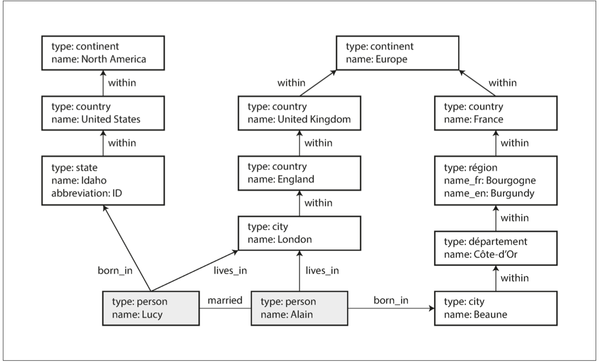

# 第二章：数据模型与查询语言


> 语言的边界就是思想的边界。
>
> —— 路德维奇・维特根斯坦，《逻辑哲学》（1922）
>

-------------------

[TOC]

数据模型可能是软件开发中最重要的部分了，因为它们的影响如此深远：不仅仅影响着软件的编写方式，而且影响着我们的 **解题思路**。

多数应用使用层层叠加的数据模型构建。对于每层数据模型的关键问题是：它是如何用低一层数据模型来 **表示** 的？例如：

1. 作为一名应用开发人员，你观察现实世界（里面有人员、组织、货物、行为、资金流向、传感器等），并采用对象或数据结构，以及操控那些数据结构的 API 来进行建模。那些结构通常是特定于应用程序的。
2. 当要存储那些数据结构时，你可以利用通用数据模型来表示它们，如 JSON 或 XML 文档、关系数据库中的表或图模型。
3. 数据库软件的工程师选定如何以内存、磁盘或网络上的字节来表示 JSON / XML/ 关系 / 图数据。这类表示形式使数据有可能以各种方式来查询，搜索，操纵和处理。
4. 在更低的层次上，硬件工程师已经想出了使用电流、光脉冲、磁场或者其他东西来表示字节的方法。

一个复杂的应用程序可能会有更多的中间层次，比如基于 API 的 API，不过基本思想仍然是一样的：每个层都通过提供一个明确的数据模型来隐藏更低层次中的复杂性。这些抽象允许不同的人群有效地协作（例如数据库厂商的工程师和使用数据库的应用程序开发人员）。

数据模型种类繁多，每个数据模型都带有如何使用的设想。有些用法很容易，有些则不支持如此；有些操作运行很快，有些则表现很差；有些数据转换非常自然，有些则很麻烦。

掌握一个数据模型需要花费很多精力（想想关系数据建模有多少本书）。即便只使用一个数据模型，不用操心其内部工作机制，构建软件也是非常困难的。然而，因为数据模型对上层软件的功能（能做什么，不能做什么）有着至深的影响，所以选择一个适合的数据模型是非常重要的。

在本章中，我们将研究一系列用于数据存储和查询的通用数据模型（前面列表中的第 2 点）。特别地，我们将比较关系模型，文档模型和少量基于图形的数据模型。我们还将查看各种查询语言并比较它们的用例。在 [第三章](ch3.md) 中，我们将讨论存储引擎是如何工作的。也就是说，这些数据模型实际上是如何实现的（列表中的第 3 点）。


## 关系模型与文档模型

现在最著名的数据模型可能是 SQL。它基于 Edgar Codd 在 1970 年提出的关系模型【1】：数据被组织成 **关系**（SQL 中称作 **表**），其中每个关系是 **元组**（SQL 中称作 **行**) 的无序集合。

关系模型曾是一个理论性的提议，当时很多人都怀疑是否能够有效实现它。然而到了 20 世纪 80 年代中期，关系数据库管理系统（RDBMSes）和 SQL 已成为大多数人们存储和查询某些常规结构的数据的首选工具。关系数据库已经持续称霸了大约 25~30 年 —— 这对计算机史来说是极其漫长的时间。

关系数据库起源于商业数据处理，在 20 世纪 60 年代和 70 年代用大型计算机来执行。从今天的角度来看，那些用例显得很平常：典型的 **事务处理**（将销售或银行交易，航空公司预订，库存管理信息记录在库）和 **批处理**（客户发票，工资单，报告）。

当时的其他数据库迫使应用程序开发人员必须考虑数据库内部的数据表示形式。关系模型致力于将上述实现细节隐藏在更简洁的接口之后。

多年来，在数据存储和查询方面存在着许多相互竞争的方法。在 20 世纪 70 年代和 80 年代初，网状模型（network model）和层次模型（hierarchical model）曾是主要的选择，但关系模型（relational model）随后占据了主导地位。对象数据库在 20 世纪 80 年代末和 90 年代初来了又去。XML 数据库在二十一世纪初出现，但只有小众采用过。关系模型的每个竞争者都在其时代产生了大量的炒作，但从来没有持续【2】。

随着电脑越来越强大和互联，它们开始用于日益多样化的目的。关系数据库非常成功地被推广到业务数据处理的原始范围之外更为广泛的用例上。你今天在网上看到的大部分内容依旧是由关系数据库来提供支持，无论是在线发布，讨论，社交网络，电子商务，游戏，软件即服务生产力应用程序等等内容。

### NoSQL 的诞生

现在 - 2010 年代，NoSQL 开始了最新一轮尝试，试图推翻关系模型的统治地位。“NoSQL” 这个名字让人遗憾，因为实际上它并没有涉及到任何特定的技术。最初它只是作为一个醒目的 Twitter 标签，用在 2009 年一个关于分布式，非关系数据库上的开源聚会上。无论如何，这个术语触动了某些神经，并迅速在网络创业社区内外传播开来。好些有趣的数据库系统现在都与 *#NoSQL* 标签相关联，并且 NoSQL 被追溯性地重新解释为 **不仅是 SQL（Not Only SQL）** 【4】。

采用 NoSQL 数据库的背后有几个驱动因素，其中包括：

* 需要比关系数据库更好的可伸缩性，包括非常大的数据集或非常高的写入吞吐量
* 相比商业数据库产品，免费和开源软件更受偏爱
* 关系模型不能很好地支持一些特殊的查询操作
* 受挫于关系模型的限制性，渴望一种更具多动态性与表现力的数据模型【5】

不同的应用程序有不同的需求，一个用例的最佳技术选择可能不同于另一个用例的最佳技术选择。因此，在可预见的未来，关系数据库似乎可能会继续与各种非关系数据库一起使用 - 这种想法有时也被称为 **混合持久化（polyglot persistence）**。

### 对象关系不匹配

目前大多数应用程序开发都使用面向对象的编程语言来开发，这导致了对 SQL 数据模型的普遍批评：如果数据存储在关系表中，那么需要一个笨拙的转换层，处于应用程序代码中的对象和表，行，列的数据库模型之间。模型之间的不连贯有时被称为 **阻抗不匹配（impedance mismatch）**[^i]。

[^i]: 一个从电子学借用的术语。每个电路的输入和输出都有一定的阻抗（交流电阻）。当你将一个电路的输出连接到另一个电路的输入时，如果两个电路的输出和输入阻抗匹配，则连接上的功率传输将被最大化。阻抗不匹配会导致信号反射及其他问题。

像 ActiveRecord 和 Hibernate 这样的 **对象关系映射（ORM object-relational mapping）** 框架可以减少这个转换层所需的样板代码的数量，但是它们不能完全隐藏这两个模型之间的差异。


**图 2-1 使用关系型模式来表示领英简介**

例如，[图 2-1](img/fig2-1.png) 展示了如何在关系模式中表示简历（一个 LinkedIn 简介）。整个简介可以通过一个唯一的标识符 `user_id` 来标识。像 `first_name` 和 `last_name` 这样的字段每个用户只出现一次，所以可以在 User 表上将其建模为列。但是，大多数人在职业生涯中拥有多于一份的工作，人们可能有不同样的教育阶段和任意数量的联系信息。从用户到这些项目之间存在一对多的关系，可以用多种方式来表示：

* 传统 SQL 模型（SQL：1999 之前）中，最常见的规范化表示形式是将职位，教育和联系信息放在单独的表中，对 User 表提供外键引用，如 [图 2-1](img/fig2-1.png) 所示。
* 后续的 SQL 标准增加了对结构化数据类型和 XML 数据的支持；这允许将多值数据存储在单行内，并支持在这些文档内查询和索引。这些功能在 Oracle，IBM DB2，MS SQL Server 和 PostgreSQL 中都有不同程度的支持【6,7】。JSON 数据类型也得到多个数据库的支持，包括 IBM DB2，MySQL 和 PostgreSQL 【8】。
* 第三种选择是将职业，教育和联系信息编码为 JSON 或 XML 文档，将其存储在数据库的文本列中，并让应用程序解析其结构和内容。这种配置下，通常不能使用数据库来查询该编码列中的值。

对于一个像简历这样自包含文档的数据结构而言，JSON 表示是非常合适的：请参阅 [例 2-1]()。JSON 比 XML 更简单。面向文档的数据库（如 MongoDB 【9】，RethinkDB 【10】，CouchDB 【11】和 Espresso【12】）支持这种数据模型。

**例 2-1. 用 JSON 文档表示一个 LinkedIn 简介**

```json
{
  "user_id": 251,
  "first_name": "Bill",
  "last_name": "Gates",
  "summary": "Co-chair of the Bill & Melinda Gates... Active blogger.",
  "region_id": "us:91",
  "industry_id": 131,
  "photo_url": "/p/7/000/253/05b/308dd6e.jpg",
  "positions": [
    {
      "job_title": "Co-chair",
      "organization": "Bill & Melinda Gates Foundation"
    },
    {
      "job_title": "Co-founder, Chairman",
      "organization": "Microsoft"
    }
  ],
  "education": [
    {
      "school_name": "Harvard University",
      "start": 1973,
      "end": 1975
    },
    {
      "school_name": "Lakeside School, Seattle",
      "start": null,
      "end": null
    }
  ],
  "contact_info": {
    "blog": "http://thegatesnotes.com",
    "twitter": "http://twitter.com/BillGates"
  }
}
```

有一些开发人员认为 JSON 模型减少了应用程序代码和存储层之间的阻抗不匹配。不过，正如我们将在 [第四章](ch4.md) 中看到的那样，JSON 作为数据编码格式也存在问题。缺乏一个模式往往被认为是一个优势；我们将在 “[文档模型中的模式灵活性](#文档模型中的模式灵活性)” 中讨论这个问题。

JSON 表示比 [图 2-1](img/fig2-1.png) 中的多表模式具有更好的 **局部性（locality）**。如果在前面的关系型示例中获取简介，那需要执行多个查询（通过 `user_id` 查询每个表），或者在 User 表与其下属表之间混乱地执行多路连接。而在 JSON 表示中，所有相关信息都在同一个地方，一个查询就足够了。

从用户简介文件到用户职位，教育历史和联系信息，这种一对多关系隐含了数据中的一个树状结构，而 JSON 表示使得这个树状结构变得明确（见 [图 2-2](img/fig2-2.png)）。


**图 2-2 一对多关系构建了一个树结构**

### 多对一和多对多的关系

在上一节的 [例 2-1]() 中，`region_id` 和 `industry_id` 是以 ID，而不是纯字符串 “Greater Seattle Area” 和 “Philanthropy” 的形式给出的。为什么？

如果用户界面用一个自由文本字段来输入区域和行业，那么将他们存储为纯文本字符串是合理的。另一方式是给出地理区域和行业的标准化的列表，并让用户从下拉列表或自动填充器中进行选择，其优势如下：

* 各个简介之间样式和拼写统一
* 避免歧义（例如，如果有几个同名的城市）
* 易于更新 —— 名称只存储在一个地方，如果需要更改（例如，由于政治事件而改变城市名称），很容易进行全面更新。
* 本地化支持 —— 当网站翻译成其他语言时，标准化的列表可以被本地化，使得地区和行业可以使用用户的语言来显示
* 更好的搜索 —— 例如，搜索华盛顿州的慈善家就会匹配这份简介，因为地区列表可以编码记录西雅图在华盛顿这一事实（从 “Greater Seattle Area” 这个字符串中看不出来）

存储 ID 还是文本字符串，这是个 **副本（duplication）** 问题。当使用 ID 时，对人类有意义的信息（比如单词：Philanthropy）只存储在一处，所有引用它的地方使用 ID（ID 只在数据库中有意义）。当直接存储文本时，对人类有意义的信息会复制在每处使用记录中。

使用 ID 的好处是，ID 对人类没有任何意义，因而永远不需要改变：ID 可以保持不变，即使它标识的信息发生变化。任何对人类有意义的东西都可能需要在将来某个时候改变 —— 如果这些信息被复制，所有的冗余副本都需要更新。这会导致写入开销，也存在不一致的风险（一些副本被更新了，还有些副本没有被更新）。去除此类重复是数据库 **规范化（normalization）** 的关键思想。[^ii]

[^ii]: 关于关系模型的文献区分了几种不同的规范形式，但这些区别几乎没有实际意义。一个经验法则是，如果重复存储了可以存储在一个地方的值，则模式就不是 **规范化（normalized）** 的。

> 数据库管理员和开发人员喜欢争论规范化和非规范化，让我们暂时保留判断吧。在本书的 [第三部分](part-iii.md)，我们将回到这个话题，探讨系统的方法用以处理缓存，非规范化和衍生数据。

不幸的是，对这些数据进行规范化需要多对一的关系（许多人生活在一个特定的地区，许多人在一个特定的行业工作），这与文档模型不太吻合。在关系数据库中，通过 ID 来引用其他表中的行是正常的，因为连接很容易。在文档数据库中，一对多树结构没有必要用连接，对连接的支持通常很弱 [^iii]。

[^iii]: 在撰写本文时，RethinkDB 支持连接，MongoDB 不支持连接，而 CouchDB 只支持预先声明的视图。

如果数据库本身不支持连接，则必须在应用程序代码中通过对数据库进行多个查询来模拟连接。（在这种情况中，地区和行业的列表可能很小，改动很少，应用程序可以简单地将其保存在内存中。不过，执行连接的工作从数据库被转移到应用程序代码上。

此外，即便应用程序的最初版本适合无连接的文档模型，随着功能添加到应用程序中，数据会变得更加互联。例如，考虑一下对简历例子进行的一些修改：

* 组织和学校作为实体

  在前面的描述中，`organization`（用户工作的公司）和 `school_name`（他们学习的地方）只是字符串。也许他们应该是对实体的引用呢？然后，每个组织、学校或大学都可以拥有自己的网页（标识，新闻提要等）。每个简历可以链接到它所提到的组织和学校，并且包括他们的图标和其他信息（请参阅 [图 2-3](img/fig2-3.png)，来自 LinkedIn 的一个例子）。

* 推荐

  假设你想添加一个新的功能：一个用户可以为另一个用户写一个推荐。在用户的简历上显示推荐，并附上推荐用户的姓名和照片。如果推荐人更新他们的照片，那他们写的任何推荐都需要显示新的照片。因此，推荐应该拥有作者个人简介的引用。


**图 2-3 公司名不仅是字符串，还是一个指向公司实体的链接（LinkedIn 截图）**

[图 2-4](img/fig2-4.png) 阐明了这些新功能需要如何使用多对多关系。每个虚线矩形内的数据可以分组成一个文档，但是对单位，学校和其他用户的引用需要表示成引用，并且在查询时需要连接。


**图 2-4 使用多对多关系扩展简历**

### 文档数据库是否在重蹈覆辙？

在多对多的关系和连接已常规用在关系数据库时，文档数据库和 NoSQL 重启了辩论：如何以最佳方式在数据库中表示多对多关系。那场辩论可比 NoSQL 古老得多，事实上，最早可以追溯到计算机化数据库系统。

20 世纪 70 年代最受欢迎的业务数据处理数据库是 IBM 的信息管理系统（IMS），最初是为了阿波罗太空计划的库存管理而开发的，并于 1968 年有了首次商业发布【13】。目前它仍在使用和维护，运行在 IBM 大型机的 OS/390 上【14】。

IMS 的设计中使用了一个相当简单的数据模型，称为 **层次模型（hierarchical model）**，它与文档数据库使用的 JSON 模型有一些惊人的相似之处【2】。它将所有数据表示为嵌套在记录中的记录树，这很像 [图 2-2](img/fig2-2.png) 的 JSON 结构。

同文档数据库一样，IMS 能良好处理一对多的关系，但是很难应对多对多的关系，并且不支持连接。开发人员必须决定是否复制（非规范化）数据或手动解决从一个记录到另一个记录的引用。这些二十世纪六七十年代的问题与现在开发人员遇到的文档数据库问题非常相似【15】。

那时人们提出了各种不同的解决方案来解决层次模型的局限性。其中最突出的两个是 **关系模型**（relational model，它变成了 SQL，并统治了世界）和 **网状模型**（network model，最初很受关注，但最终变得冷门）。这两个阵营之间的 “大辩论” 在 70 年代持续了很久时间【2】。

那两个模式解决的问题与当前的问题相关，因此值得简要回顾一下那场辩论。

#### 网状模型

网状模型由一个称为数据系统语言会议（CODASYL）的委员会进行了标准化，并被数个不同的数据库厂商实现；它也被称为 CODASYL 模型【16】。

CODASYL 模型是层次模型的推广。在层次模型的树结构中，每条记录只有一个父节点；在网络模式中，每条记录可能有多个父节点。例如，“Greater Seattle Area” 地区可能是一条记录，每个居住在该地区的用户都可以与之相关联。这允许对多对一和多对多的关系进行建模。

网状模型中记录之间的链接不是外键，而更像编程语言中的指针（同时仍然存储在磁盘上）。访问记录的唯一方法是跟随从根记录起沿这些链路所形成的路径。这被称为 **访问路径（access path）**。

最简单的情况下，访问路径类似遍历链表：从列表头开始，每次查看一条记录，直到找到所需的记录。但在多对多关系的情况中，数条不同的路径可以到达相同的记录，网状模型的程序员必须跟踪这些不同的访问路径。

CODASYL 中的查询是通过利用遍历记录列和跟随访问路径表在数据库中移动游标来执行的。如果记录有多个父结点（即多个来自其他记录的传入指针），则应用程序代码必须跟踪所有的各种关系。甚至 CODASYL 委员会成员也承认，这就像在 n 维数据空间中进行导航【17】。

尽管手动选择访问路径能够最有效地利用 20 世纪 70 年代非常有限的硬件功能（如磁带驱动器，其搜索速度非常慢），但这使得查询和更新数据库的代码变得复杂不灵活。无论是分层还是网状模型，如果你没有所需数据的路径，就会陷入困境。你可以改变访问路径，但是必须浏览大量手写数据库查询代码，并重写来处理新的访问路径。更改应用程序的数据模型是很难的。

#### 关系模型

相比之下，关系模型做的就是将所有的数据放在光天化日之下：一个 **关系（表）** 只是一个 **元组（行）** 的集合，仅此而已。如果你想读取数据，它没有迷宫似的嵌套结构，也没有复杂的访问路径。你可以选中符合任意条件的行，读取表中的任何或所有行。你可以通过指定某些列作为匹配关键字来读取特定行。你可以在任何表中插入一个新的行，而不必担心与其他表的外键关系 [^iv]。

[^iv]: 外键约束允许对修改进行限制，但对于关系模型这并不是必选项。即使有约束，外键连接在查询时执行，而在 CODASYL 中，连接在插入时高效完成。

在关系数据库中，查询优化器自动决定查询的哪些部分以哪个顺序执行，以及使用哪些索引。这些选择实际上是 “访问路径”，但最大的区别在于它们是由查询优化器自动生成的，而不是由程序员生成，所以我们很少需要考虑它们。

如果想按新的方式查询数据，你可以声明一个新的索引，查询会自动使用最合适的那些索引。无需更改查询来利用新的索引（请参阅 “[数据查询语言](#数据查询语言)”）。关系模型因此使添加应用程序新功能变得更加容易。

关系数据库的查询优化器是复杂的，已耗费了多年的研究和开发精力【18】。关系模型的一个关键洞察是：只需构建一次查询优化器，随后使用该数据库的所有应用程序都可以从中受益。如果你没有查询优化器的话，那么为特定查询手动编写访问路径比编写通用优化器更容易 —— 不过从长期看通用解决方案更好。

#### 与文档数据库相比

在一个方面，文档数据库还原为层次模型：在其父记录中存储嵌套记录（[图 2-1](img/fig2-1.png) 中的一对多关系，如 `positions`，`education` 和 `contact_info`），而不是在单独的表中。

但是，在表示多对一和多对多的关系时，关系数据库和文档数据库并没有根本的不同：在这两种情况下，相关项目都被一个唯一的标识符引用，这个标识符在关系模型中被称为 **外键**，在文档模型中称为 **文档引用**【9】。该标识符在读取时通过连接或后续查询来解析。迄今为止，文档数据库没有走 CODASYL 的老路。

### 关系型数据库与文档数据库在今日的对比

将关系数据库与文档数据库进行比较时，可以考虑许多方面的差异，包括它们的容错属性（请参阅 [第五章](ch5.md)）和处理并发性（请参阅 [第七章](ch7.md)）。本章将只关注数据模型中的差异。

支持文档数据模型的主要论据是架构灵活性，因局部性而拥有更好的性能，以及对于某些应用程序而言更接近于应用程序使用的数据结构。关系模型通过为连接提供更好的支持以及支持多对一和多对多的关系来反击。

#### 哪种数据模型更有助于简化应用代码？

如果应用程序中的数据具有类似文档的结构（即，一对多关系树，通常一次性加载整个树），那么使用文档模型可能是一个好主意。将类似文档的结构分解成多个表（如 [图 2-1](img/fig2-1.png) 中的 `positions`、`education` 和 `contact_info`）的关系技术可能导致繁琐的模式和不必要的复杂的应用程序代码。

文档模型有一定的局限性：例如，不能直接引用文档中的嵌套的项目，而是需要说 “用户 251 的位置列表中的第二项”（很像层次模型中的访问路径）。但是，只要文件嵌套不太深，这通常不是问题。

文档数据库对连接的糟糕支持可能是个问题，也可能不是问题，这取决于应用程序。例如，如果某分析型应用程序使用一个文档数据库来记录何时何地发生了何事，那么多对多关系可能永远也用不上。【19】。

但如果你的应用程序确实会用到多对多关系，那么文档模型就没有那么诱人了。尽管可以通过反规范化来消除对连接的需求，但这需要应用程序代码来做额外的工作以确保数据一致性。尽管应用程序代码可以通过向数据库发出多个请求的方式来模拟连接，但这也将复杂性转移到应用程序中，而且通常也会比由数据库内的专用代码更慢。在这种情况下，使用文档模型可能会导致更复杂的应用代码与更差的性能【15】。

我们没有办法说哪种数据模型更有助于简化应用代码，因为它取决于数据项之间的关系种类。对高度关联的数据而言，文档模型是极其糟糕的，关系模型是可以接受的，而选用图形模型（请参阅 “[图数据模型](#图数据模型)”）是最自然的。

#### 文档模型中的模式灵活性

大多数文档数据库以及关系数据库中的 JSON 支持都不会强制文档中的数据采用何种模式。关系数据库的 XML 支持通常带有可选的模式验证。没有模式意味着可以将任意的键和值添加到文档中，并且当读取时，客户端无法保证文档可能包含的字段。

文档数据库有时称为 **无模式（schemaless）**，但这具有误导性，因为读取数据的代码通常假定某种结构 —— 即存在隐式模式，但不由数据库强制执行【20】。一个更精确的术语是 **读时模式**（即 schema-on-read，数据的结构是隐含的，只有在数据被读取时才被解释），相应的是 **写时模式**（即 schema-on-write，传统的关系数据库方法中，模式明确，且数据库确保所有的数据都符合其模式）【21】。

读时模式类似于编程语言中的动态（运行时）类型检查，而写时模式类似于静态（编译时）类型检查。就像静态和动态类型检查的相对优点具有很大的争议性一样【22】，数据库中模式的强制性是一个具有争议的话题，一般来说没有正确或错误的答案。

在应用程序想要改变其数据格式的情况下，这些方法之间的区别尤其明显。例如，假设你把每个用户的全名存储在一个字段中，而现在想分别存储名字和姓氏【23】。在文档数据库中，只需开始写入具有新字段的新文档，并在应用程序中使用代码来处理读取旧文档的情况。例如：

```go
if (user && user.name && !user.first_name) {
  // Documents written before Dec 8, 2013 don't have first_name
  user.first_name = user.name.split(" ")[0];
}
```

另一方面，在 “静态类型” 数据库模式中，通常会执行以下 **迁移（migration）** 操作：

```sql
ALTER TABLE users ADD COLUMN first_name text;
UPDATE users SET first_name = split_part(name, ' ', 1);      -- PostgreSQL
UPDATE users SET first_name = substring_index(name, ' ', 1);      -- MySQL
```

模式变更的速度很慢，而且要求停运。它的这种坏名誉并不是完全应得的：大多数关系数据库系统可在几毫秒内执行 `ALTER TABLE` 语句。MySQL 是一个值得注意的例外，它执行 `ALTER TABLE` 时会复制整个表，这可能意味着在更改一个大型表时会花费几分钟甚至几个小时的停机时间，尽管存在各种工具来解决这个限制【24,25,26】。

大型表上运行 `UPDATE` 语句在任何数据库上都可能会很慢，因为每一行都需要重写。要是不可接受的话，应用程序可以将 `first_name` 设置为默认值 `NULL`，并在读取时再填充，就像使用文档数据库一样。

当由于某种原因（例如，数据是异构的）集合中的项目并不都具有相同的结构时，读时模式更具优势。例如，如果：

* 存在许多不同类型的对象，将每种类型的对象放在自己的表中是不现实的。
* 数据的结构由外部系统决定。你无法控制外部系统且它随时可能变化。

在上述情况下，模式的坏处远大于它的帮助，无模式文档可能是一个更加自然的数据模型。但是，要是所有记录都具有相同的结构，那么模式是记录并强制这种结构的有效机制。第四章将更详细地讨论模式和模式演化。

#### 查询的数据局部性

文档通常以单个连续字符串形式进行存储，编码为 JSON、XML 或其二进制变体（如 MongoDB 的 BSON）。如果应用程序经常需要访问整个文档（例如，将其渲染至网页），那么存储局部性会带来性能优势。如果将数据分割到多个表中（如 [图 2-1](img/fig2-1.png) 所示），则需要进行多次索引查找才能将其全部检索出来，这可能需要更多的磁盘查找并花费更多的时间。

局部性仅仅适用于同时需要文档绝大部分内容的情况。数据库通常需要加载整个文档，即使只访问其中的一小部分，这对于大型文档来说是很浪费的。更新文档时，通常需要整个重写。只有不改变文档大小的修改才可以容易地原地执行。因此，通常建议保持相对小的文档，并避免增加文档大小的写入【9】。这些性能限制大大减少了文档数据库的实用场景。

值得指出的是，为了局部性而分组集合相关数据的想法并不局限于文档模型。例如，Google 的 Spanner 数据库在关系数据模型中提供了同样的局部性属性，允许模式声明一个表的行应该交错（嵌套）在父表内【27】。Oracle 类似地允许使用一个称为 **多表索引集群表（multi-table index cluster tables）** 的类似特性【28】。Bigtable 数据模型（用于 Cassandra 和 HBase）中的 **列族（column-family）** 概念与管理局部性的目的类似【29】。

在 [第三章](ch3.md) 将还会看到更多关于局部性的内容。

#### 文档和关系数据库的融合

自 2000 年代中期以来，大多数关系数据库系统（MySQL 除外）都已支持 XML。这包括对 XML 文档进行本地修改的功能，以及在 XML 文档中进行索引和查询的功能。这允许应用程序使用那种与文档数据库应当使用的非常类似的数据模型。

从 9.3 版本开始的 PostgreSQL 【8】，从 5.7 版本开始的 MySQL 以及从版本 10.5 开始的 IBM DB2【30】也对 JSON 文档提供了类似的支持级别。鉴于用在 Web APIs 的 JSON 流行趋势，其他关系数据库很可能会跟随他们的脚步并添加 JSON 支持。

在文档数据库中，RethinkDB 在其查询语言中支持类似关系的连接，一些 MongoDB 驱动程序可以自动解析数据库引用（有效地执行客户端连接，尽管这可能比在数据库中执行的连接慢，需要额外的网络往返，并且优化更少）。

随着时间的推移，关系数据库和文档数据库似乎变得越来越相似，这是一件好事：数据模型相互补充 [^v]，如果一个数据库能够处理类似文档的数据，并能够对其执行关系查询，那么应用程序就可以使用最符合其需求的功能组合。

关系模型和文档模型的混合是未来数据库一条很好的路线。

[^v]: Codd 对关系模型【1】的原始描述实际上允许在关系模式中与 JSON 文档非常相似。他称之为 **非简单域（nonsimple domains）**。这个想法是，一行中的值不一定是一个像数字或字符串一样的原始数据类型，也可以是一个嵌套的关系（表），因此可以把一个任意嵌套的树结构作为一个值，这很像 30 年后添加到 SQL 中的 JSON 或 XML 支持。


## 数据查询语言

当引入关系模型时，关系模型包含了一种查询数据的新方法：SQL 是一种 **声明式** 查询语言，而 IMS 和 CODASYL 使用 **命令式** 代码来查询数据库。那是什么意思？

许多常用的编程语言是命令式的。例如，给定一个动物物种的列表，返回列表中的鲨鱼可以这样写：

```js
function getSharks() {
    var sharks = [];
    for (var i = 0; i < animals.length; i++) {
        if (animals[i].family === "Sharks") {
            sharks.push(animals[i]);
        }
    }
    return sharks;
}
```

在关系代数中：
$$
sharks = σ_{family = "sharks"}(animals)
$$
σ（希腊字母西格玛）是选择操作符，只返回符合条件的动物，`family="shark"`。

定义 SQL 时，它紧密地遵循关系代数的结构：

```sql
SELECT * FROM animals WHERE family ='Sharks';
```

命令式语言告诉计算机以特定顺序执行某些操作。可以想象一下，逐行地遍历代码，评估条件，更新变量，并决定是否再循环一遍。

在声明式查询语言（如 SQL 或关系代数）中，你只需指定所需数据的模式 - 结果必须符合哪些条件，以及如何将数据转换（例如，排序，分组和集合） - 但不是如何实现这一目标。数据库系统的查询优化器决定使用哪些索引和哪些连接方法，以及以何种顺序执行查询的各个部分。

声明式查询语言是迷人的，因为它通常比命令式 API 更加简洁和容易。但更重要的是，它还隐藏了数据库引擎的实现细节，这使得数据库系统可以在无需对查询做任何更改的情况下进行性能提升。

例如，在本节开头所示的命令代码中，动物列表以特定顺序出现。如果数据库想要在后台回收未使用的磁盘空间，则可能需要移动记录，这会改变动物出现的顺序。数据库能否安全地执行，而不会中断查询？

SQL 示例不确保任何特定的顺序，因此不在意顺序是否改变。但是如果查询用命令式的代码来写的话，那么数据库就永远不可能确定代码是否依赖于排序。SQL 相当有限的功能性为数据库提供了更多自动优化的空间。

最后，声明式语言往往适合并行执行。现在，CPU 的速度通过核心（core）的增加变得更快，而不是以比以前更高的时钟速度运行【31】。命令代码很难在多个核心和多个机器之间并行化，因为它指定了指令必须以特定顺序执行。声明式语言更具有并行执行的潜力，因为它们仅指定结果的模式，而不指定用于确定结果的算法。在适当情况下，数据库可以自由使用查询语言的并行实现【32】。

### Web 上的声明式查询

声明式查询语言的优势不仅限于数据库。为了说明这一点，让我们在一个完全不同的环境中比较声明式和命令式方法：一个 Web 浏览器。

假设你有一个关于海洋动物的网站。用户当前正在查看鲨鱼页面，因此你将当前所选的导航项目 “鲨鱼” 标记为当前选中项目。

```html
<ul>
    <li class="selected">
        <p>Sharks</p>
        <ul>
            <li>Great White Shark</li>
            <li>Tiger Shark</li>
            <li>Hammerhead Shark</li>
        </ul>
    </li>
    <li><p>Whales</p>
        <ul>
            <li>Blue Whale</li>
            <li>Humpback Whale</li>
            <li>Fin Whale</li>
        </ul>
    </li>
</ul>
```

现在想让当前所选页面的标题具有一个蓝色的背景，以便在视觉上突出显示。使用 CSS 实现起来非常简单：

```css
li.selected > p {
  background-color: blue;
}
```

这里的 CSS 选择器 `li.selected > p` 声明了我们想要应用蓝色样式的元素的模式：即其直接父元素是具有 CSS 类 `selected` 的 `<li>` 元素的所有 `<p>` 元素。示例中的元素 `<p>Sharks</p>` 匹配此模式，但 `<p>Whales</p>` 不匹配，因为其 `<li>` 父元素缺少 `class="selected"`。

如果使用 XSL 而不是 CSS，你可以做类似的事情：

```xml
<xsl:template match="li[@class='selected']/p">
    <fo:block background-color="blue">
        <xsl:apply-templates/>
    </fo:block>
</xsl:template>
```

这里的 XPath 表达式 `li[@class='selected']/p` 相当于上例中的 CSS 选择器 `li.selected > p`。CSS 和 XSL 的共同之处在于，它们都是用于指定文档样式的声明式语言。

想象一下，必须使用命令式方法的情况会是如何。在 Javascript 中，使用 **文档对象模型（DOM）** API，其结果可能如下所示：

```js
var liElements = document.getElementsByTagName("li");
for (var i = 0; i < liElements.length; i++) {
    if (liElements[i].className === "selected") {
        var children = liElements[i].childNodes;
        for (var j = 0; j < children.length; j++) {
            var child = children[j];
            if (child.nodeType === Node.ELEMENT_NODE && child.tagName === "P") {
                child.setAttribute("style", "background-color: blue");
            }
        }
    }
}
```

这段 JavaScript 代码命令式地将元素设置为蓝色背景，但是代码看起来很糟糕。不仅比 CSS 和 XSL 等价物更长，更难理解，而且还有一些严重的问题：

* 如果选定的类被移除（例如，因为用户点击了不同的页面），即使代码重新运行，蓝色背景也不会被移除 - 因此该项目将保持突出显示，直到整个页面被重新加载。使用 CSS，浏览器会自动检测 `li.selected > p` 规则何时不再适用，并在选定的类被移除后立即移除蓝色背景。

* 如果你想要利用新的 API（例如 `document.getElementsByClassName("selected")` 甚至 `document.evaluate()`）来提高性能，则必须重写代码。另一方面，浏览器供应商可以在不破坏兼容性的情况下提高 CSS 和 XPath 的性能。

在 Web 浏览器中，使用声明式 CSS 样式比使用 JavaScript 命令式地操作样式要好得多。类似地，在数据库中，使用像 SQL 这样的声明式查询语言比使用命令式查询 API 要好得多 [^vi]。

[^vi]: IMS 和 CODASYL 都使用命令式 API。应用程序通常使用 COBOL 代码遍历数据库中的记录，一次一条记录【2,16】。

### MapReduce查询

MapReduce 是一个由 Google 推广的编程模型，用于在多台机器上批量处理大规模的数据【33】。一些 NoSQL 数据存储（包括 MongoDB 和 CouchDB）支持有限形式的 MapReduce，作为在多个文档中执行只读查询的机制。

MapReduce 将 [第十章](ch10.md) 中有更详细的描述。现在我们将简要讨论一下 MongoDB 使用的模型。

MapReduce 既不是一个声明式的查询语言，也不是一个完全命令式的查询 API，而是处于两者之间：查询的逻辑用代码片段来表示，这些代码片段会被处理框架重复性调用。它基于 `map`（也称为 `collect`）和 `reduce`（也称为 `fold` 或 `inject`）函数，两个函数存在于许多函数式编程语言中。

最好举例来解释 MapReduce 模型。假设你是一名海洋生物学家，每当你看到海洋中的动物时，你都会在数据库中添加一条观察记录。现在你想生成一个报告，说明你每月看到多少鲨鱼。

在 PostgreSQL 中，你可以像这样表述这个查询：

```sql
SELECT
  date_trunc('month', observation_timestamp) AS observation_month,
  sum(num_animals)                           AS total_animals
FROM observations
WHERE family = 'Sharks'
GROUP BY observation_month;
```

`date_trunc('month'，timestamp)` 函数用于确定包含 `timestamp` 的日历月份，并返回代表该月份开始的另一个时间戳。换句话说，它将时间戳舍入成最近的月份。

这个查询首先过滤观察记录，以只显示鲨鱼家族的物种，然后根据它们发生的日历月份对观察记录果进行分组，最后将在该月的所有观察记录中看到的动物数目加起来。

同样的查询用 MongoDB 的 MapReduce 功能可以按如下来表述：

```js
db.observations.mapReduce(function map() {
        var year = this.observationTimestamp.getFullYear();
        var month = this.observationTimestamp.getMonth() + 1;
        emit(year + "-" + month, this.numAnimals);
    },
    function reduce(key, values) {
        return Array.sum(values);
    },
    {
        query: {
          family: "Sharks"
        },
        out: "monthlySharkReport"
    });
```

* 可以声明式地指定一个只考虑鲨鱼种类的过滤器（这是 MongoDB 特定的 MapReduce 扩展）。
* 每个匹配查询的文档都会调用一次 JavaScript 函数 `map`，将 `this` 设置为文档对象。
* `map` 函数发出一个键（包括年份和月份的字符串，如 `"2013-12"` 或 `"2014-1"`）和一个值（该观察记录中的动物数量）。
* `map` 发出的键值对按键来分组。对于具有相同键（即，相同的月份和年份）的所有键值对，调用一次 `reduce` 函数。
* `reduce` 函数将特定月份内所有观测记录中的动物数量相加。
* 将最终的输出写入到 `monthlySharkReport` 集合中。

例如，假设 `observations` 集合包含这两个文档：

```json
{
  observationTimestamp: Date.parse(  "Mon, 25 Dec 1995 12:34:56 GMT"),
  family: "Sharks",
  species: "Carcharodon carcharias",
  numAnimals: 3
}
{
  observationTimestamp: Date.parse("Tue, 12 Dec 1995 16:17:18 GMT"),
  family: "Sharks",
  species:    "Carcharias taurus",
  numAnimals: 4
}
```

对每个文档都会调用一次 `map` 函数，结果将是 `emit("1995-12",3)` 和 `emit("1995-12",4)`。随后，以 `reduce("1995-12",[3,4])` 调用 `reduce` 函数，将返回 `7`。

map 和 reduce 函数在功能上有所限制：它们必须是 **纯** 函数，这意味着它们只使用传递给它们的数据作为输入，它们不能执行额外的数据库查询，也不能有任何副作用。这些限制允许数据库以任何顺序运行任何功能，并在失败时重新运行它们。然而，map 和 reduce 函数仍然是强大的：它们可以解析字符串，调用库函数，执行计算等等。

MapReduce 是一个相当底层的编程模型，用于计算机集群上的分布式执行。像 SQL 这样的更高级的查询语言可以用一系列的 MapReduce 操作来实现（见 [第十章](ch10.md)），但是也有很多不使用 MapReduce 的分布式 SQL 实现。请注意，SQL 中没有任何内容限制它在单个机器上运行，而 MapReduce 在分布式查询执行上没有垄断权。

能够在查询中使用 JavaScript 代码是高级查询的一个重要特性，但这不限于 MapReduce，一些 SQL 数据库也可以用 JavaScript 函数进行扩展【34】。

MapReduce 的一个可用性问题是，必须编写两个密切合作的 JavaScript 函数，这通常比编写单个查询更困难。此外，声明式查询语言为查询优化器提供了更多机会来提高查询的性能。基于这些原因，MongoDB 2.2 添加了一种叫做 **聚合管道** 的声明式查询语言的支持【9】。用这种语言表述鲨鱼计数查询如下所示：

```js
db.observations.aggregate([
  { $match: { family: "Sharks" } },
  { $group: {
    _id: {
      year:  { $year:  "$observationTimestamp" },
      month: { $month: "$observationTimestamp" }
    },
    totalAnimals: { $sum: "$numAnimals" } }}
]);
```

聚合管道语言与 SQL 的子集具有类似表现力，但是它使用基于 JSON 的语法而不是 SQL 的英语句子式语法；这种差异也许是口味问题。这个故事的寓意是 NoSQL 系统可能会发现自己意外地重新发明了 SQL，尽管带着伪装。


## 图数据模型

如我们之前所见，多对多关系是不同数据模型之间具有区别性的重要特征。如果你的应用程序大多数的关系是一对多关系（树状结构化数据），或者大多数记录之间不存在关系，那么使用文档模型是合适的。

但是，要是多对多关系在你的数据中很常见呢？关系模型可以处理多对多关系的简单情况，但是随着数据之间的连接变得更加复杂，将数据建模为图形显得更加自然。

一个图由两种对象组成：**顶点**（vertices，也称为 **节点**，即 nodes，或 **实体**，即 entities），和 **边**（edges，也称为 **关系**，即 relationships，或 **弧**，即 arcs）。多种数据可以被建模为一个图形。典型的例子包括：

* 社交图谱

  顶点是人，边指示哪些人彼此认识。

* 网络图谱

  顶点是网页，边缘表示指向其他页面的 HTML 链接。

* 公路或铁路网络

  顶点是交叉路口，边线代表它们之间的道路或铁路线。

可以将那些众所周知的算法运用到这些图上：例如，汽车导航系统搜索道路网络中两点之间的最短路径，PageRank 可以用在网络图上来确定网页的流行程度，从而确定该网页在搜索结果中的排名。

在刚刚给出的例子中，图中的所有顶点代表了相同类型的事物（人、网页或交叉路口）。不过，图并不局限于这样的同类数据：同样强大地是，图提供了一种一致的方式，用来在单个数据存储中存储完全不同类型的对象。例如，Facebook 维护一个包含许多不同类型的顶点和边的单个图：顶点表示人，地点，事件，签到和用户的评论；边缘表示哪些人是彼此的朋友，哪个签到发生在何处，谁评论了哪条消息，谁参与了哪个事件，等等【35】。

在本节中，我们将使用 [图 2-5](img/fig2-5.png) 所示的示例。它可以从社交网络或系谱数据库中获得：它显示了两个人，来自爱达荷州的 Lucy 和来自法国 Beaune 的 Alain。他们已婚，住在伦敦。



**图 2-5 图数据结构示例（框代表顶点，箭头代表边）**

有几种不同但相关的方法用来构建和查询图表中的数据。在本节中，我们将讨论属性图模型（由 Neo4j，Titan 和 InfiniteGraph 实现）和三元组存储（triple-store）模型（由 Datomic，AllegroGraph 等实现）。我们将查看图的三种声明式查询语言：Cypher，SPARQL 和 Datalog。除此之外，还有像 Gremlin 【36】这样的图形查询语言和像 Pregel 这样的图形处理框架（见 [第十章](ch10.md)）。

### 属性图

在属性图模型中，每个顶点（vertex）包括：

* 唯一的标识符
* 一组出边（outgoing edges）
* 一组入边（ingoing edges）
* 一组属性（键值对）

每条边（edge）包括：

* 唯一标识符
* 边的起点（**尾部顶点**，即 tail vertex）
* 边的终点（**头部顶点**，即 head vertex）
* 描述两个顶点之间关系类型的标签
* 一组属性（键值对）

可以将图存储看作由两个关系表组成：一个存储顶点，另一个存储边，如 [例 2-2]() 所示（该模式使用 PostgreSQL JSON 数据类型来存储每个顶点或每条边的属性）。头部和尾部顶点用来存储每条边；如果你想要一组顶点的输入或输出边，你可以分别通过 `head_vertex` 或 `tail_vertex` 来查询 `edges` 表。

**例 2-2 使用关系模式来表示属性图**

```sql
CREATE TABLE vertices (
  vertex_id  INTEGER PRIMARY KEY,
  properties JSON
);

CREATE TABLE edges (
  edge_id     INTEGER PRIMARY KEY,
  tail_vertex INTEGER REFERENCES vertices (vertex_id),
  head_vertex INTEGER REFERENCES vertices (vertex_id),
  label       TEXT,
  properties  JSON
);

CREATE INDEX edges_tails ON edges (tail_vertex);
CREATE INDEX edges_heads ON edges (head_vertex);
```

关于这个模型的一些重要方面是：

1. 任何顶点都可以有一条边连接到任何其他顶点。没有模式限制哪种事物可不可以关联。
2. 给定任何顶点，可以高效地找到它的入边和出边，从而遍历图，即沿着一系列顶点的路径前后移动（这就是为什么 [例 2-2]() 在 `tail_vertex` 和 `head_vertex` 列上都有索引的原因）。
3. 通过对不同类型的关系使用不同的标签，可以在一个图中存储几种不同的信息，同时仍然保持一个清晰的数据模型。

这些特性为数据建模提供了很大的灵活性，如 [图 2-5](img/fig2-5.png) 所示。图中显示了一些传统关系模式难以表达的事情，例如不同国家的不同地区结构（法国有省和州，美国有不同的州和州），国中国的怪事（先忽略主权国家和国家错综复杂的烂摊子），不同的数据粒度（Lucy 现在的住所被指定为一个城市，而她的出生地点只是在一个州的级别）。

你可以想象延伸图还能包括许多关于 Lucy 和 Alain，或其他人的其他更多的事实。例如，你可以用它来表示食物过敏（为每个过敏源增加一个顶点，并增加人与过敏源之间的一条边来指示一种过敏情况），并链接到过敏源，每个过敏源具有一组顶点用来显示哪些食物含有哪些物质。然后，你可以写一个查询，找出每个人吃什么是安全的。图表在可演化性是富有优势的：当向应用程序添加功能时，可以轻松扩展图以适应应用程序数据结构的变化。

### Cypher 查询语言

Cypher 是属性图的声明式查询语言，为 Neo4j 图形数据库而发明【37】（它是以电影 “黑客帝国” 中的一个角色来命名的，而与密码术中的密码无关【38】）。

[例 2-3]() 显示了将 [图 2-5](img/fig2-5.png) 的左边部分插入图形数据库的 Cypher 查询。可以类似地添加图的其余部分，为了便于阅读而省略。每个顶点都有一个像 `USA` 或 `Idaho` 这样的符号名称，查询的其他部分可以使用这些名称在顶点之间创建边，使用箭头符号：`（Idaho） - [：WITHIN] ->（USA）` 创建一条标记为 `WITHIN` 的边，`Idaho` 为尾节点，`USA` 为头节点。

**例 2-3 将图 2-5 中的数据子集表示为 Cypher 查询**

```cypher
CREATE
  (NAmerica:Location {name:'North America', type:'continent'}),
  (USA:Location      {name:'United States', type:'country'  }),
  (Idaho:Location    {name:'Idaho',         type:'state'    }),
  (Lucy:Person       {name:'Lucy' }),
  (Idaho) -[:WITHIN]->  (USA)  -[:WITHIN]-> (NAmerica),
  (Lucy)  -[:BORN_IN]-> (Idaho)
```

当 [图 2-5](img/fig2-5.png) 的所有顶点和边被添加到数据库后，让我们提些有趣的问题：例如，找到所有从美国移民到欧洲的人的名字。更确切地说，这里我们想要找到符合下面条件的所有顶点，并且返回这些顶点的 `name` 属性：该顶点拥有一条连到美国任一位置的 `BORN_IN` 边，和一条连到欧洲的任一位置的 `LIVING_IN` 边。

[例 2-4]() 展示了如何在 Cypher 中表达这个查询。在 MATCH 子句中使用相同的箭头符号来查找图中的模式：`(person) -[:BORN_IN]-> ()` 可以匹配 `BORN_IN` 边的任意两个顶点。该边的尾节点被绑定了变量 `person`，头节点则未被绑定。

**例 2-4 查找所有从美国移民到欧洲的人的 Cypher 查询：**

```cypher
MATCH
  (person) -[:BORN_IN]->  () -[:WITHIN*0..]-> (us:Location {name:'United States'}),
  (person) -[:LIVES_IN]-> () -[:WITHIN*0..]-> (eu:Location {name:'Europe'})
RETURN person.name
```

查询按如下来解读：

> 找到满足以下两个条件的所有顶点（称之为 person 顶点）：
> 1.  `person` 顶点拥有一条到某个顶点的 `BORN_IN` 出边。从那个顶点开始，沿着一系列 `WITHIN` 出边最终到达一个类型为 `Location`，`name` 属性为 `United States` 的顶点。
>
> 2. `person` 顶点还拥有一条 `LIVES_IN` 出边。沿着这条边，可以通过一系列 `WITHIN` 出边最终到达一个类型为 `Location`，`name` 属性为 `Europe` 的顶点。
>
> 对于这样的 `Person` 顶点，返回其 `name` 属性。

执行这条查询可能会有几种可行的查询路径。这里给出的描述建议首先扫描数据库中的所有人，检查每个人的出生地和居住地，然后只返回符合条件的那些人。

等价地，也可以从两个 `Location` 顶点开始反向地查找。假如 `name` 属性上有索引，则可以高效地找到代表美国和欧洲的两个顶点。然后，沿着所有 `WITHIN` 入边，可以继续查找出所有在美国和欧洲的位置（州，地区，城市等）。最后，查找出那些可以由 `BORN_IN` 或 `LIVES_IN` 入边到那些位置顶点的人。

通常对于声明式查询语言来说，在编写查询语句时，不需要指定执行细节：查询优化程序会自动选择预测效率最高的策略，因此你可以继续编写应用程序的其他部分。

### SQL 中的图查询

[例 2-2]() 建议在关系数据库中表示图数据。但是，如果把图数据放入关系结构中，我们是否也可以使用 SQL 查询它？

答案是肯定的，但有些困难。在关系数据库中，你通常会事先知道在查询中需要哪些连接。在图查询中，你可能需要在找到待查找的顶点之前，遍历可变数量的边。也就是说，连接的数量事先并不确定。

在我们的例子中，这发生在 Cypher 查询中的 `() -[:WITHIN*0..]-> ()` 规则中。一个人的 `LIVES_IN` 边可以指向任何类型的位置：街道、城市、地区、国家等。一个城市可以在（WITHIN）一个地区内，一个地区可以在（WITHIN）在一个州内，一个州可以在（WITHIN）一个国家内，等等。`LIVES_IN` 边可以直接指向正在查找的位置，或者一个在位置层次结构中隔了数层的位置。

在 Cypher 中，用 `WITHIN*0..` 非常简洁地表述了上述事实：“沿着 `WITHIN` 边，零次或多次”。它很像正则表达式中的 `*` 运算符。

自 SQL:1999，查询可变长度遍历路径的思想可以使用称为 **递归公用表表达式**（`WITH RECURSIVE` 语法）的东西来表示。[例 2-5]() 显示了同样的查询 - 查找从美国移民到欧洲的人的姓名 - 在 SQL 使用这种技术（PostgreSQL、IBM DB2、Oracle 和 SQL Server 均支持）来表述。但是，与 Cypher 相比，其语法非常笨拙。

**例 2-5  与示例 2-4 同样的查询，在 SQL 中使用递归公用表表达式表示**

```sql
WITH RECURSIVE
  -- in_usa 包含所有的美国境内的位置 ID
    in_usa(vertex_id) AS (
    SELECT vertex_id FROM vertices WHERE properties ->> 'name' = 'United States'
    UNION
    SELECT edges.tail_vertex FROM edges
      JOIN in_usa ON edges.head_vertex = in_usa.vertex_id
      WHERE edges.label = 'within'
  ),
  -- in_europe 包含所有的欧洲境内的位置 ID
    in_europe(vertex_id) AS (
    SELECT vertex_id FROM vertices WHERE properties ->> 'name' = 'Europe'
    UNION
    SELECT edges.tail_vertex FROM edges
      JOIN in_europe ON edges.head_vertex = in_europe.vertex_id
      WHERE edges.label = 'within' ),

  -- born_in_usa 包含了所有类型为 Person，且出生在美国的顶点
    born_in_usa(vertex_id) AS (
      SELECT edges.tail_vertex FROM edges
        JOIN in_usa ON edges.head_vertex = in_usa.vertex_id
        WHERE edges.label = 'born_in' ),

  -- lives_in_europe 包含了所有类型为 Person，且居住在欧洲的顶点。
    lives_in_europe(vertex_id) AS (
      SELECT edges.tail_vertex FROM edges
        JOIN in_europe ON edges.head_vertex = in_europe.vertex_id
        WHERE edges.label = 'lives_in')

  SELECT vertices.properties ->> 'name'
  FROM vertices
    JOIN born_in_usa ON vertices.vertex_id = born_in_usa.vertex_id
    JOIN lives_in_europe ON vertices.vertex_id = lives_in_europe.vertex_id;
```

* 首先，查找 `name` 属性为 `United States` 的顶点，将其作为 `in_usa` 顶点的集合的第一个元素。
* 从 `in_usa` 集合的顶点出发，沿着所有的 `with_in` 入边，将其尾顶点加入同一集合，不断递归直到所有 `with_in` 入边都被访问完毕。
* 同理，从 `name` 属性为 `Europe` 的顶点出发，建立 `in_europe` 顶点的集合。
* 对于 `in_usa` 集合中的每个顶点，根据 `born_in` 入边来查找出生在美国某个地方的人。
* 同样，对于 `in_europe` 集合中的每个顶点，根据 `lives_in` 入边来查找居住在欧洲的人。
* 最后，把在美国出生的人的集合与在欧洲居住的人的集合相交。

同一个查询，用某一个查询语言可以写成 4 行，而用另一个查询语言需要 29 行，这恰恰说明了不同的数据模型是为不同的应用场景而设计的。选择适合应用程序的数据模型非常重要。

### 三元组存储和 SPARQL

三元组存储模式大体上与属性图模型相同，用不同的词来描述相同的想法。不过仍然值得讨论，因为三元组存储有很多现成的工具和语言，这些工具和语言对于构建应用程序的工具箱可能是宝贵的补充。

在三元组存储中，所有信息都以非常简单的三部分表示形式存储（**主语**，**谓语**，**宾语**）。例如，三元组 **(吉姆, 喜欢, 香蕉)** 中，**吉姆** 是主语，**喜欢** 是谓语（动词），**香蕉** 是对象。

三元组的主语相当于图中的一个顶点。而宾语是下面两者之一：

1. 原始数据类型中的值，例如字符串或数字。在这种情况下，三元组的谓语和宾语相当于主语顶点上的属性的键和值。例如，`(lucy, age, 33)` 就像属性 `{“age”：33}` 的顶点 lucy。
2. 图中的另一个顶点。在这种情况下，谓语是图中的一条边，主语是其尾部顶点，而宾语是其头部顶点。例如，在 `(lucy, marriedTo, alain)` 中主语和宾语 `lucy` 和 `alain` 都是顶点，并且谓语 `marriedTo` 是连接他们的边的标签。

[例 2-6]() 显示了与 [例 2-3]() 相同的数据，以称为 Turtle 的格式（Notation3（N3）【39】）的一个子集形式写成三元组。

**例 2-6 图 2-5 中的数据子集，表示为 Turtle 三元组**

```reStructuredText
@prefix : <urn:example:>.
_:lucy     a       :Person.
_:lucy     :name   "Lucy".
_:lucy     :bornIn _:idaho.
_:idaho    a       :Location.
_:idaho    :name   "Idaho".
_:idaho    :type   "state".
_:idaho    :within _:usa.
_:usa      a       :Location
_:usa      :name   "United States"
_:usa      :type   "country".
_:usa      :within _:namerica.
_:namerica a       :Location
_:namerica :name   "North America"
_:namerica :type   :"continent"
```

在这个例子中，图的顶点被写为：`_：someName`。这个名字并不意味着这个文件以外的任何东西。它的存在只是帮助我们明确哪些三元组引用了同一顶点。当谓语表示边时，该宾语是一个顶点，如 `_:idaho :within _:usa.`。当谓语是一个属性时，该宾语是一个字符串，如 `_:usa :name"United States"`

一遍又一遍地重复相同的主语看起来相当重复，但幸运的是，可以使用分号来说明关于同一主语的多个事情。这使得 Turtle 格式相当不错，可读性强：请参阅 [例 2-7]()。

**例 2-7 一种相对例 2-6 写入数据的更为简洁的方法。**

```
@prefix : <urn:example:>.
_:lucy      a :Person;   :name "Lucy";          :bornIn _:idaho.
_:idaho     a :Location; :name "Idaho";         :type "state";   :within _:usa
_:usa       a :Loaction; :name "United States"; :type "country"; :within _:namerica.
_:namerica  a :Location; :name "North America"; :type "continent".
```

#### 语义网

如果你阅读更多关于三元组存储的信息，你可能会被卷入关于语义网的文章漩涡中。三元组存储数据模型完全独立于语义网，例如，Datomic【40】是三元组存储 [^vii]，并没有声称与它有任何关系。但是，由于在很多人眼中这两者紧密相连，我们应该简要地讨论一下。

[^vii]: 从技术上讲，Datomic 使用的是五元组而不是三元组，两个额外的字段是用于版本控制的元数据

从本质上讲语义网是一个简单且合理的想法：网站已经将信息发布为文字和图片供人类阅读，为什么不将信息作为机器可读的数据也发布给计算机呢？**资源描述框架**（RDF）【41】的目的是作为不同网站以统一的格式发布数据的一种机制，允许来自不同网站的数据自动合并成 **一个数据网络** - 一种互联网范围内的 “通用语义网数据库 “。

不幸的是，这个语义网在二十一世纪初被过度使用，但到目前为止没有任何迹象表明已在实践中实现，这使得许多人嗤之以鼻。它还遭受了过多的令人眼花缭乱的缩略词，过于复杂的标准提议和狂妄自大的苦果。

然而，如果从过去的失败中汲取教训，语义网项目还是拥有很多优秀的成果。即使你没有兴趣在语义网上发布 RDF 数据，三元组这种模型也是一种好的应用程序内部数据模型。

#### RDF 数据模型

[例 2-7]() 中使用的 Turtle 语言是一种用于 RDF 数据的人类可读格式。有时候，RDF 也可以以 XML 格式编写，不过完成同样的事情会相对啰嗦，请参阅 [例 2-8]()。Turtle/N3 是更可取的，因为它更容易阅读，像 Apache Jena 【42】这样的工具可以根据需要在不同的 RDF 格式之间进行自动转换。

**例 2-8 用 RDF/XML 语法表示例 2-7 的数据**

```xml
<rdf:RDF xmlns="urn:example:"
         xmlns:rdf="http://www.w3.org/1999/02/22-rdf-syntax-ns#">
    <Location rdf:nodeID="idaho">
        <name>Idaho</name>
        <type>state</type>
        <within>
            <Location rdf:nodeID="usa">
                <name>United States</name>
                <type>country</type>
                <within>
                    <Location rdf:nodeID="namerica">
                        <name>North America</name>
                        <type>continent</type>
                    </Location>
                </within>
            </Location>
        </within>
    </Location>
    <Person rdf:nodeID="lucy">
        <name>Lucy</name>
        <bornIn rdf:nodeID="idaho"/>
    </Person>
</rdf:RDF>
```

RDF 有一些奇怪之处，因为它是为了在互联网上交换数据而设计的。三元组的主语，谓语和宾语通常是 URI。例如，谓语可能是一个 URI，如 `<http://my-company.com/namespace#within>` 或 `<http://my-company.com/namespace#lives_in>`，而不仅仅是 `WITHIN` 或 `LIVES_IN`。这个设计背后的原因为了让你能够把你的数据和其他人的数据结合起来，如果他们赋予单词 `within` 或者 `lives_in` 不同的含义，两者也不会冲突，因为它们的谓语实际上是 `<http://other.org/foo#within>` 和 `<http://other.org/foo#lives_in>`。

从 RDF 的角度来看，URL `<http://my-company.com/namespace>` 不一定需要能解析成什么东西，它只是一个命名空间。为避免与 `http://URL` 混淆，本节中的示例使用不可解析的 URI，如 `urn：example：within`。幸运的是，你只需在文件顶部指定一个前缀，然后就不用再管了。

### SPARQL 查询语言

**SPARQL** 是一种用于三元组存储的面向 RDF 数据模型的查询语言【43】（它是 SPARQL 协议和 RDF 查询语言的缩写，发音为 “sparkle”）。SPARQL 早于 Cypher，并且由于 Cypher 的模式匹配借鉴于 SPARQL，这使得它们看起来非常相似【37】。

与之前相同的查询 - 查找从美国转移到欧洲的人 - 使用 SPARQL 比使用 Cypher 甚至更为简洁（请参阅 [例 2-9]()）。

**例 2-9 与示例 2-4 相同的查询，用 SPARQL 表示**

```sparql
PREFIX : <urn:example:>
SELECT ?personName WHERE {
  ?person :name ?personName.
  ?person :bornIn  / :within* / :name "United States".
  ?person :livesIn / :within* / :name "Europe".
}
```

结构非常相似。以下两个表达式是等价的（SPARQL 中的变量以问号开头）：

```
(person) -[:BORN_IN]-> () -[:WITHIN*0..]-> (location)   # Cypher
?person :bornIn / :within* ?location.                   # SPARQL
```

因为 RDF 不区分属性和边，而只是将它们作为谓语，所以可以使用相同的语法来匹配属性。在下面的表达式中，变量 `usa` 被绑定到任意具有值为字符串 `"United States"` 的 `name` 属性的顶点：

```
(usa {name:'United States'})   # Cypher
?usa :name "United States".    # SPARQL
```

SPARQL 是一种很好的查询语言 — 尽管 SPARQL 从未实现语义网，但是它仍然是一种应用程序内部使用的强大工具。

> #### 图形数据库与网状模型相比较
>
> 在 “[文档数据库是否在重蹈覆辙？](#文档数据库是否在重蹈覆辙？)” 中，我们讨论了 CODASYL 和关系模型如何竞相解决 IMS 中的多对多关系问题。乍一看，CODASYL 的网状模型看起来与图模型相似。CODASYL 是否是图形数据库的第二个变种？
>
> 不，他们在几个重要方面有所不同：
>
> * 在 CODASYL 中，数据库有一个模式，用于指定哪种记录类型可以嵌套在其他记录类型中。在图形数据库中，不存在这样的限制：任何顶点都可以具有到其他任何顶点的边。这为应用程序适应不断变化的需求提供了更大的灵活性。
> * 在 CODASYL 中，达到特定记录的唯一方法是遍历其中的一个访问路径。在图形数据库中，可以通过其唯一 ID 直接引用任何顶点，也可以使用索引来查找具有特定值的顶点。
> * 在 CODASYL，记录的后续是一个有序集合，所以数据库的人不得不维持排序（这会影响存储布局），并且插入新记录到数据库的应用程序不得不担心的新记录在这些集合中的位置。在图形数据库中，顶点和边不是有序的（只能在查询时对结果进行排序）。
> * 在 CODASYL 中，所有查询都是命令式的，难以编写，并且很容易因架构中的变化而受到破坏。在图形数据库中，如果需要，可以在命令式代码中编写遍历，但大多数图形数据库也支持高级声明式查询语言，如 Cypher 或 SPARQL。
>
>

### 基础：Datalog

**Datalog** 是比 SPARQL、Cypher 更古老的语言，在 20 世纪 80 年代被学者广泛研究【44,45,46】。它在软件工程师中不太知名，但是它是重要的，因为它为以后的查询语言提供了基础。

在实践中，Datalog 被用于少数的数据系统中：例如，它是 Datomic 【40】的查询语言，Cascalog 【47】是一种用于查询 Hadoop 大数据集的 Datalog 实现 [^viii]。

[^viii]: Datomic 和 Cascalog 使用 Datalog 的 Clojure S 表达式语法。在下面的例子中使用了一个更容易阅读的 Prolog 语法，但两者没有任何功能差异。

Datalog 的数据模型类似于三元组模式，但进行了一点泛化。把三元组写成 **谓语**（**主语，宾语**），而不是写三元语（**主语，谓语，宾语**）。[例 2-10]() 显示了如何用 Datalog 写入我们的例子中的数据。

**例 2-10 用 Datalog 来表示图 2-5 中的数据子集**

```prolog
name(namerica, 'North America').
type(namerica, continent).

name(usa, 'United States').
type(usa, country).
within(usa, namerica).

name(idaho, 'Idaho').
type(idaho, state).
within(idaho, usa).

name(lucy, 'Lucy').
born_in(lucy, idaho).
```

既然已经定义了数据，我们可以像之前一样编写相同的查询，如 [例 2-11]() 所示。它看起来有点不同于 Cypher 或 SPARQL 的等价物，但是请不要放弃它。Datalog 是 Prolog 的一个子集，如果你学过计算机科学，你可能已经见过。

**例 2-11 与示例 2-4 相同的查询，用 Datalog 表示**

```
within_recursive(Location, Name) :- name(Location, Name). /* Rule 1 */

within_recursive(Location, Name) :- within(Location, Via), /* Rule 2 */
                  within_recursive(Via, Name).

migrated(Name, BornIn, LivingIn) :- name(Person, Name), /* Rule 3 */
                                    born_in(Person, BornLoc),
                                    within_recursive(BornLoc, BornIn),
                                    lives_in(Person, LivingLoc),
                                    within_recursive(LivingLoc, LivingIn).

?- migrated(Who, 'United States', 'Europe'). /* Who = 'Lucy'. */
```

Cypher 和 SPARQL 使用 SELECT 立即跳转，但是 Datalog 一次只进行一小步。我们定义 **规则**，以将新谓语告诉数据库：在这里，我们定义了两个新的谓语，`within_recursive` 和 `migrated`。这些谓语不是存储在数据库中的三元组中，而是它们是从数据或其他规则派生而来的。规则可以引用其他规则，就像函数可以调用其他函数或者递归地调用自己一样。像这样，复杂的查询可以一次构建其中的一小块。

在规则中，以大写字母开头的单词是变量，谓语则用 Cypher 和 SPARQL 的方式一样来匹配。例如，`name(Location, Name)` 通过变量绑定 `Location = namerica` 和 `Name ='North America'` 可以匹配三元组 `name(namerica, 'North America')`。

要是系统可以在 `:-` 操作符的右侧找到与所有谓语的一个匹配，就运用该规则。当规则运用时，就好像通过 `:-` 的左侧将其添加到数据库（将变量替换成它们匹配的值）。

因此，一种可能的应用规则的方式是：

1. 数据库存在 `name (namerica, 'North America')`，故运用规则 1。它生成 `within_recursive (namerica, 'North America')`。
2. 数据库存在 `within (usa, namerica)`，在上一步骤中生成 `within_recursive (namerica, 'North America')`，故运用规则 2。它会产生 `within_recursive (usa, 'North America')`。
3. 数据库存在 `within (idaho, usa)`，在上一步生成 `within_recursive (usa, 'North America')`，故运用规则 2。它产生 `within_recursive (idaho, 'North America')`。

通过重复应用规则 1 和 2，`within_recursive` 谓语可以告诉我们在数据库中包含北美（或任何其他位置名称）的所有位置。这个过程如 [图 2-6](img/fig2-6.png) 所示。


**图 2-6 使用示例 2-11 中的 Datalog 规则来确定爱达荷州在北美。**

现在规则 3 可以找到出生在某个地方 `BornIn` 的人，并住在某个地方 `LivingIn`。通过查询 `BornIn ='United States'` 和 `LivingIn ='Europe'`，并将此人作为变量 `Who`，让 Datalog 系统找出变量 `Who` 会出现哪些值。因此，最后得到了与早先的 Cypher 和 SPARQL 查询相同的答案。

相对于本章讨论的其他查询语言，我们需要采取不同的思维方式来思考 Datalog 方法，但这是一种非常强大的方法，因为规则可以在不同的查询中进行组合和重用。虽然对于简单的一次性查询，显得不太方便，但是它可以更好地处理数据很复杂的情况。


## 本章小结

数据模型是一个巨大的课题，在本章中，我们快速浏览了各种不同的模型。我们没有足够的空间来详细介绍每个模型的细节，但是希望这个概述足以激起你的兴趣，以更多地了解最适合你的应用需求的模型。

在历史上，数据最开始被表示为一棵大树（层次数据模型），但是这不利于表示多对多的关系，所以发明了关系模型来解决这个问题。最近，开发人员发现一些应用程序也不适合采用关系模型。新的非关系型 “NoSQL” 数据存储在两个主要方向上存在分歧：

1. **文档数据库** 的应用场景是：数据通常是自我包含的，而且文档之间的关系非常稀少。
2. **图形数据库** 用于相反的场景：任意事物都可能与任何事物相关联。

这三种模型（文档，关系和图形）在今天都被广泛使用，并且在各自的领域都发挥很好。一个模型可以用另一个模型来模拟 — 例如，图数据可以在关系数据库中表示 — 但结果往往是糟糕的。这就是为什么我们有着针对不同目的的不同系统，而不是一个单一的万能解决方案。

文档数据库和图数据库有一个共同点，那就是它们通常不会为存储的数据强制一个模式，这可以使应用程序更容易适应不断变化的需求。但是应用程序很可能仍会假定数据具有一定的结构；这只是模式是明确的（写入时强制）还是隐含的（读取时处理）的问题。

每个数据模型都具有各自的查询语言或框架，我们讨论了几个例子：SQL，MapReduce，MongoDB 的聚合管道，Cypher，SPARQL 和 Datalog。我们也谈到了 CSS 和 XSL/XPath，它们不是数据库查询语言，而包含有趣的相似之处。

虽然我们已经覆盖了很多层面，但仍然有许多数据模型没有提到。举几个简单的例子：

* 使用基因组数据的研究人员通常需要执行 **序列相似性搜索**，这意味着需要一个很长的字符串（代表一个 DNA 分子），并在一个拥有类似但不完全相同的字符串的大型数据库中寻找匹配。这里所描述的数据库都不能处理这种用法，这就是为什么研究人员编写了像 GenBank 这样的专门的基因组数据库软件的原因【48】。
* 粒子物理学家数十年来一直在进行大数据类型的大规模数据分析，像大型强子对撞机（LHC）这样的项目现在可以工作在数百亿兆字节的范围内！在这样的规模下，需要定制解决方案来阻止硬件成本的失控【49】。
* **全文搜索** 可以说是一种经常与数据库一起使用的数据模型。信息检索是一个很大的专业课题，我们不会在本书中详细介绍，但是我们将在第三章和第三部分中介绍搜索索引。

让我们暂时将其放在一边。在 [下一章](ch3.md) 中，我们将讨论在 **实现** 本章描述的数据模型时会遇到的一些权衡。


## 参考文献

1.  Edgar F. Codd: “[A Relational Model of Data for Large Shared Data Banks](https://www.seas.upenn.edu/~zives/03f/cis550/codd.pdf),” *Communications of the ACM*, volume 13, number 6, pages 377–387, June 1970. [doi:10.1145/362384.362685](http://dx.doi.org/10.1145/362384.362685)
1.  Michael Stonebraker and Joseph M. Hellerstein: “[What Goes Around Comes Around](http://mitpress2.mit.edu/books/chapters/0262693143chapm1.pdf),” in *Readings in Database Systems*, 4th edition, MIT Press, pages 2–41, 2005. ISBN: 978-0-262-69314-1
1.  Pramod J. Sadalage and Martin Fowler: *NoSQL Distilled*. Addison-Wesley, August 2012. ISBN: 978-0-321-82662-6
1.  Eric Evans: “[NoSQL: What's in a Name?](http://blog.sym-link.com/2009/10/30/nosql_whats_in_a_name.html),” *blog.sym-link.com*, October 30, 2009.
1.  James Phillips:  “[Surprises in Our NoSQL   Adoption Survey](http://blog.couchbase.com/nosql-adoption-survey-surprises),” *blog.couchbase.com*, February 8, 2012.
1.  Michael Wagner:  *SQL/XML:2006 – Evaluierung der Standardkonformität ausgewählter Datenbanksysteme*.  Diplomica Verlag, Hamburg, 2010. ISBN: 978-3-836-64609-3
1.  “[XML   Data in SQL Server](http://technet.microsoft.com/en-us/library/bb522446.aspx),” SQL Server 2012 documentation, *technet.microsoft.com*, 2013.
1.  “[PostgreSQL   9.3.1 Documentation](http://www.postgresql.org/docs/9.3/static/index.html),” The PostgreSQL Global Development Group, 2013.
1.  “[The MongoDB 2.4 Manual](http://docs.mongodb.org/manual/),” MongoDB, Inc., 2013.
1.  “[RethinkDB 1.11 Documentation](http://www.rethinkdb.com/docs/),” *rethinkdb.com*, 2013.
1.  “[Apache CouchDB 1.6 Documentation](http://docs.couchdb.org/en/latest/),” *docs.couchdb.org*, 2014.
1.  Lin Qiao, Kapil Surlaker, Shirshanka Das, et al.: “[On Brewing Fresh Espresso: LinkedIn’s Distributed Data Serving Platform](http://www.slideshare.net/amywtang/espresso-20952131),” at *ACM International Conference on Management of Data* (SIGMOD), June 2013.
1.  Rick Long, Mark Harrington, Robert Hain, and Geoff Nicholls: <a href="http://www.redbooks.ibm.com/redbooks/pdfs/sg245352.pdf">*IMS Primer*</a>. IBM Redbook SG24-5352-00, IBM International Technical Support Organization, January 2000.
1.  Stephen D. Bartlett: “[IBM’s IMS—Myths, Realities, and Opportunities](ftp://public.dhe.ibm.com/software/data/ims/pdf/TCG2013015LI.pdf),” The Clipper Group Navigator, TCG2013015LI, July 2013.
1.  Sarah Mei: “[Why You Should Never Use MongoDB](http://www.sarahmei.com/blog/2013/11/11/why-you-should-never-use-mongodb/),” *sarahmei.com*, November 11, 2013.
1.  J. S. Knowles and D. M. R. Bell: “The CODASYL Model,” in *Databases—Role and Structure: An Advanced Course*, edited by P. M. Stocker, P. M. D. Gray, and M. P. Atkinson, pages 19–56, Cambridge University Press, 1984. ISBN: 978-0-521-25430-4
1.  Charles W. Bachman: “[The Programmer as Navigator](http://dl.acm.org/citation.cfm?id=362534),” *Communications of the ACM*, volume 16, number 11, pages 653–658, November 1973. [doi:10.1145/355611.362534](http://dx.doi.org/10.1145/355611.362534)
1.  Joseph M. Hellerstein, Michael Stonebraker, and James Hamilton: “[Architecture of a Database System](http://db.cs.berkeley.edu/papers/fntdb07-architecture.pdf),” *Foundations and Trends in Databases*, volume 1, number 2, pages 141–259, November 2007. [doi:10.1561/1900000002](http://dx.doi.org/10.1561/1900000002)
1.  Sandeep Parikh and Kelly Stirman: “[Schema Design for Time Series Data in MongoDB](http://blog.mongodb.org/post/65517193370/schema-design-for-time-series-data-in-mongodb),” *blog.mongodb.org*, October 30, 2013.
1.  Martin Fowler: “[Schemaless Data Structures](http://martinfowler.com/articles/schemaless/),” *martinfowler.com*, January 7, 2013.
1.  Amr Awadallah: “[Schema-on-Read vs. Schema-on-Write](http://www.slideshare.net/awadallah/schemaonread-vs-schemaonwrite),” at *Berkeley EECS RAD Lab Retreat*, Santa Cruz, CA, May 2009.
1.  Martin Odersky: “[The Trouble with Types](http://www.infoq.com/presentations/data-types-issues),” at *Strange Loop*, September 2013.
1.  Conrad Irwin: “[MongoDB—Confessions of a PostgreSQL Lover](https://speakerdeck.com/conradirwin/mongodb-confessions-of-a-postgresql-lover),” at *HTML5DevConf*, October 2013.
1.  “[Percona Toolkit Documentation: pt-online-schema-change](http://www.percona.com/doc/percona-toolkit/2.2/pt-online-schema-change.html),” Percona Ireland Ltd., 2013.
1.  Rany Keddo, Tobias Bielohlawek, and Tobias Schmidt: “[Large Hadron Migrator](https://github.com/soundcloud/lhm),” SoundCloud, 2013. Shlomi Noach: “[gh-ost: GitHub's Online Schema Migration Tool for MySQL](http://githubengineering.com/gh-ost-github-s-online-migration-tool-for-mysql/),” *githubengineering.com*, August 1, 2016.
1.  James C. Corbett, Jeffrey Dean, Michael Epstein, et al.: “[Spanner: Google’s Globally-Distributed Database](http://research.google.com/archive/spanner.html),” at *10th USENIX Symposium on Operating System Design and Implementation* (OSDI), October 2012.
1.  Donald K. Burleson: “[Reduce I/O with Oracle Cluster Tables](http://www.dba-oracle.com/oracle_tip_hash_index_cluster_table.htm),” *dba-oracle.com*.
1.  Fay Chang, Jeffrey Dean, Sanjay Ghemawat, et al.: “[Bigtable: A Distributed Storage System for Structured Data](http://research.google.com/archive/bigtable.html),” at *7th USENIX Symposium on Operating System Design and Implementation* (OSDI), November 2006.
1.  Bobbie J. Cochrane and Kathy A. McKnight: “[DB2 JSON Capabilities, Part 1: Introduction to DB2 JSON](http://www.ibm.com/developerworks/data/library/techarticle/dm-1306nosqlforjson1/),” IBM developerWorks, June 20, 2013.
1.  Herb Sutter: “[The Free Lunch Is Over: A Fundamental Turn Toward Concurrency in Software](http://www.gotw.ca/publications/concurrency-ddj.htm),” *Dr. Dobb's Journal*, volume 30, number 3, pages 202-210, March 2005.
1.  Joseph M. Hellerstein: “[The Declarative Imperative: Experiences and Conjectures in Distributed Logic](http://www.eecs.berkeley.edu/Pubs/TechRpts/2010/EECS-2010-90.pdf),” Electrical Engineering and Computer Sciences, University of California at Berkeley, Tech report UCB/EECS-2010-90, June 2010.
1.  Jeffrey Dean and Sanjay Ghemawat: “[MapReduce: Simplified Data Processing on Large Clusters](http://research.google.com/archive/mapreduce.html),” at *6th USENIX Symposium on Operating System Design and Implementation* (OSDI), December 2004.
1.  Craig Kerstiens: “[JavaScript in Your Postgres](https://blog.heroku.com/javascript_in_your_postgres),” *blog.heroku.com*, June 5, 2013.
1.  Nathan Bronson, Zach Amsden, George Cabrera, et al.: “[TAO: Facebook’s Distributed Data Store for the Social Graph](https://www.usenix.org/conference/atc13/technical-sessions/presentation/bronson),” at *USENIX Annual Technical Conference* (USENIX ATC), June 2013.
1.  “[Apache TinkerPop3.2.3 Documentation](http://tinkerpop.apache.org/docs/3.2.3/reference/),” *tinkerpop.apache.org*, October 2016.
1.  “[The Neo4j Manual v2.0.0](http://docs.neo4j.org/chunked/2.0.0/index.html),” Neo Technology, 2013. Emil Eifrem: [Twitter correspondence](https://twitter.com/emileifrem/status/419107961512804352), January 3, 2014.
1.  David Beckett and Tim Berners-Lee: “[Turtle – Terse RDF Triple Language](http://www.w3.org/TeamSubmission/turtle/),” W3C Team Submission, March 28, 2011.
1.  “[Datomic Development Resources](http://docs.datomic.com/),” Metadata Partners, LLC, 2013. W3C RDF Working Group: “[Resource Description Framework (RDF)](http://www.w3.org/RDF/),” *w3.org*, 10 February 2004.
1.  “[Apache Jena](http://jena.apache.org/),” Apache Software Foundation.
1.  Steve Harris, Andy Seaborne, and Eric Prud'hommeaux: “[SPARQL 1.1 Query Language](http://www.w3.org/TR/sparql11-query/),” W3C Recommendation, March 2013.
1.  Todd J. Green, Shan Shan Huang, Boon Thau Loo, and Wenchao Zhou: “[Datalog and Recursive Query Processing](http://blogs.evergreen.edu/sosw/files/2014/04/Green-Vol5-DBS-017.pdf),” *Foundations and Trends in Databases*, volume 5, number 2, pages 105–195, November 2013. [doi:10.1561/1900000017](http://dx.doi.org/10.1561/1900000017)
1.  Stefano Ceri, Georg Gottlob, and Letizia Tanca: “[What You Always Wanted to Know About Datalog (And Never Dared to Ask)](https://www.researchgate.net/profile/Letizia_Tanca/publication/3296132_What_you_always_wanted_to_know_about_Datalog_and_never_dared_to_ask/links/0fcfd50ca2d20473ca000000.pdf),” *IEEE Transactions on Knowledge and Data Engineering*, volume 1, number 1, pages 146–166, March 1989. [doi:10.1109/69.43410](http://dx.doi.org/10.1109/69.43410)
1.  Serge Abiteboul, Richard Hull, and Victor Vianu: <a href="http://webdam.inria.fr/Alice/">*Foundations of Databases*</a>. Addison-Wesley, 1995. ISBN: 978-0-201-53771-0, available online at *webdam.inria.fr/Alice*
1.  Nathan Marz: “[Cascalog](http://cascalog.org/)," *cascalog.org*. Dennis A. Benson,  Ilene Karsch-Mizrachi, David J. Lipman, et al.: “[GenBank](http://nar.oxfordjournals.org/content/36/suppl_1/D25.full-text-lowres.pdf),”   *Nucleic Acids Research*, volume 36, Database issue, pages D25–D30, December 2007.   [doi:10.1093/nar/gkm929](http://dx.doi.org/10.1093/nar/gkm929)
1.  Fons Rademakers:   “[ROOT   for Big Data Analysis](http://indico.cern.ch/getFile.py/access?contribId=13&resId=0&materialId=slides&confId=246453),” at *Workshop on the Future of Big Data Management*, London, UK, June 2013.

------

| 上一章                                       | 目录                            | 下一章                       |
| -------------------------------------------- | ------------------------------- | ---------------------------- |
| [第一章：可靠性、可伸缩性和可维护性](ch1.md) | [设计数据密集型应用](README.md) | [第三章：存储与检索](ch3.md) |
