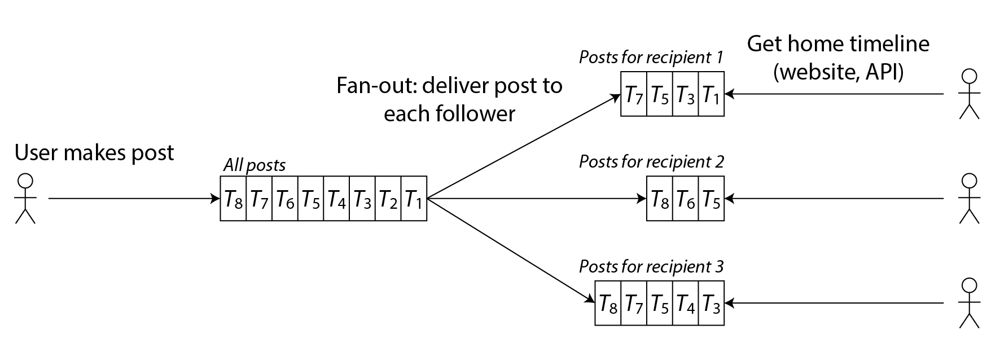

# 第二章 定义非功能性要求

> 互联网做得太棒了，以至于大多数人将它看作像太平洋这样的自然资源，而不是什么人工产物。上一次出现这种大规模且无差错的技术，你还记得是什么时候吗？
>
> —— [艾伦・凯](http://www.drdobbs.com/architecture-and-design/interview-with-alan-kay/240003442) 在接受 Dobb 博士杂志采访时说（2012 年）

--------

如果您正在构建应用程序，您将由一系列需求所驱动。在您需求列表的最顶端，很可能是应用程序必须提供的功能：需要哪些屏幕和按钮，以及每个操作应如何执行以满足软件的目的。这些是您的*功能性需求*。

此外，您可能还有一些*非功能性需求*：例如，应用应该快速、可靠、安全、合法合规，并且易于维护。这些需求可能没有明确书写下来，因为它们似乎有些显而易见，但它们和应用的功能一样重要：一个异常缓慢或不可靠的应用可能根本无法存在。

并非所有非功能性需求都属于本书的讨论范围，但有几个是如此。在本章中，我们将介绍几个技术概念，这将帮助您明确自己系统的非功能性需求：

- 如何定义和衡量系统的*性能*（见[“描述性能”](#描述性能)）；
- 服务*可靠*的含义——即使在出现问题时，也能继续正确工作（见[“可靠性与容错”](#可靠性与容错)）；
- 允许系统通过有效地增加计算能力来*可扩展*，随着系统负载的增长（见[“可伸缩性”](#可伸缩性)）；以及
- 长期易于维护系统（见[“可维护性”](#可维护性)）。

本章引入的术语在后续章节中也将非常有用，当我们详细探讨数据密集型系统的实现方式时。然而，抽象的定义可能相当枯燥；为了使这些概念更具体，我们将从社交网络服务的案例研究开始本章，这将提供性能和可扩展性的实际示例。

If you are building an application, you will be driven by a list of requirements. At the top of your list is most likely the functionality that the application must offer: what screens and what buttons you need, and what each operation is supposed to do in order to fulfill the purpose of your software. These are your *functional requirements*.

In addition, you probably also have some *nonfunctional requirements*: for example, the app should be fast, reliable, secure, legally compliant, and easy to maintain. These requirements might not be explicitly written down, because they may seem somewhat obvious, but they are just as important as the app’s functionality: an app that is unbearably slow or unreliable might as well not exist.

Not all nonfunctional requirements fall within the scope of this book, but several do. In this chapter we will introduce several technical concepts that will help you articulate the nonfunctional requirements for your own systems:

- How to define and measure the *performance* of a system (see [“Describing Performance”](ch02.html#sec_introduction_percentiles));
- What it means for a service to be *reliable*—namely, continuing to work correctly, even when things go wrong (see [“Reliability and Fault Tolerance”](ch02.html#sec_introduction_reliability));
- Allowing a system to be *scalable* by having efficient ways of adding computing capacity as the load on the system grows (see [“Scalability”](ch02.html#sec_introduction_scalability)); and
- Making it easier to maintain a system in the long term (see [“Maintainability”](ch02.html#sec_introduction_maintainability)).

The terminology introduced in this chapter will also be useful in the following chapters, when we go into the details of how data-intensive systems are implemented. However, abstract definitions can be quite dry; to make the ideas more concrete, we will start this chapter with a case study of how a social networking service might work, which will provide practical examples of performance and scalability.


--------

## 案例学习：社交网络主页时间线

假设你被分配了一个任务，要实现一个类似X（前身为Twitter）的社交网络，在这个网络中，用户可以发布消息并关注其他用户。这将是对这种服务实际工作方式的极大简化 [[1](ch02.html#Cvet2016), [2](ch02.html#Krikorian2012_ch2), [3](ch02.html#Twitter2023)]，但它将有助于说明大规模系统中出现的一些问题。

假设用户每天发布 5 亿条消息，平均每秒 5700 条消息。偶尔，这个速率可能会激增至每秒 150,000 条消息 [[4](ch02.html#Krikorian2013)]。我们还假设平均每个用户关注 200 人，拥有 200 名粉丝（尽管这个范围非常广泛：大多数人只有少数几个粉丝，而像巴拉克·奥巴马这样的名人粉丝超过 1 亿）。


Imagine you are given the task of implementing a social network in the style of X (formerly Twitter), in which users can post messages and follow other users. This will be a huge simplification of how such a service actually works [[1](ch02.html#Cvet2016), [2](ch02.html#Krikorian2012_ch2), [3](ch02.html#Twitter2023)], but it will help illustrate some of the issues that arise in large-scale systems.

Let’s assume that users make 500 million posts per day, or 5,700 posts per second on average. Occasionally, the rate can spike as high as 150,000 posts/second [[4](ch02.html#Krikorian2013)]. Let’s also assume that the average user follows 200 people and has 200 followers (although there is a very wide range: most people have only a handful of followers, and a few celebrities such as Barack Obama have over 100 million followers).

### 用户、帖子和关注关系的表示


设想我们将所有数据保存在关系数据库中，如 [图 2-1](ch02.html#fig_twitter_relational) 所示。我们有一个用户表、一个帖子表和一个关注关系表。

Imagine we keep all of the data in a relational database as shown in [Figure 2-1](ch02.html#fig_twitter_relational). We have one table for users, one table for posts, and one table for follow relationships.


> 图 2-1. 社交网络的简单关系模式，其中用户可以相互关注。

假设我们的社交网络需要支持的主要读操作是*首页时间线*，它显示你所关注的人最近的帖子（为简单起见，我们将忽略广告、来自你未关注的人的建议帖子以及其他扩展）。我们可以编写以下 SQL 查询来获取特定用户的首页时间线：

> Figure 2-1. Simple relational schema for a social network in which users can follow each other.

Let’s say the main read operation that our social network must support is the *home timeline*, which displays recent posts by people you are following (for simplicity we will ignore ads, suggested posts from people you are not following, and other extensions). We could write the following SQL query to get the home timeline for a particular user:

```sql
SELECT posts.*, users.* FROM posts
  JOIN follows ON posts.sender_id = follows.followee_id
  JOIN users   ON posts.sender_id = users.id
  WHERE follows.follower_id = current_user
  ORDER BY posts.timestamp DESC
  LIMIT 1000
```

为了执行这个查询，数据库将使用 `follows` 表来查找 `current_user` 正在关注的所有人，查找这些用户的最近帖子，并按时间戳排序以获得被关注用户的最新 1000 条帖子。

帖子应当是及时的，因此假设某人发帖后，我们希望他们的关注者在 5 秒内能看到。一种实现这一目标的方法是，当用户在线时，其客户端每 5 秒重复上述查询一次（这被称为*轮询*）。如果我们假设有 1000 万用户同时在线并登录，这意味着每秒需要运行 200 万次查询。即使你增加轮询间隔，这也是一个庞大的数字。

此外，上述查询相当昂贵：如果你关注了 200 人，它需要获取这 200 人的最近帖子列表，并合并这些列表。每秒 200 万次时间线查询意味着数据库需要每秒查找某些发送者的最近帖子 4 亿次——这是一个巨大的数字。而这只是平均情况。有些用户关注了成千上万的账户；对他们而言，这个查询非常昂贵，难以快速执行。

To execute this query, the database will use the `follows` table to find everybody who `current_user` is following, look up recent posts by those users, and sort them by timestamp to get the most recent 1,000 posts by any of the followed users.

Posts are supposed to be timely, so let’s assume that after somebody makes a post, we want their followers to be able to see it within 5 seconds. One way of doing that would be for the user’s client to repeat the query above every 5 seconds while the user is online (this is known as *polling*). If we assume that 10 million users are online and logged in at the same time, that would mean running the query 2 million times per second. Even if you increase the polling interval, this is a lot.

Moreover, the query above is quite expensive: if you are following 200 people, it needs to fetch a list of recent posts by each of those 200 people, and merge those lists. 2 million timeline queries per second then means that the database needs to look up the recent posts from some sender 400 million times per second—a huge number. And that is the average case. Some users follow tens of thousands of accounts; for them, this query is very expensive to execute, and difficult to make fast.

### 物化与更新时间线

我们怎样才能做得更好？首先，与其使用轮询，不如让服务器主动将新帖推送给当前在线的任何关注者。其次，我们应该预计算上述查询的结果，以便用户请求他们的首页时间线时可以从缓存中获取。

想象一下，对于每个用户，我们存储一个包含他们首页时间线的数据结构，即他们所关注的人的最近帖子。每当用户发表帖子时，我们查找他们所有的关注者，并将该帖子插入到每个关注者的首页时间线中——就像将信息送达邮箱一样。现在，当用户登录时，我们可以简单地提供我们预计算的这个首页时间线。此外，为了接收其时间线上任何新帖子的通知，用户的客户端只需订阅被添加到他们首页时间线的帖子流。

这种方法的缺点是，每当用户发帖时，我们都需要做更多的工作，因为首页时间线是派生数据，需要更新。这一过程在 [图 2-2](ch02.html#fig_twitter_timelines) 中有所示。当一个初始请求导致执行多个下游请求时，我们使用*扩散*一词来描述请求数量的增加因素。

How can we do better? Firstly, instead of polling, it would be better if the server actively pushed new posts to any followers who are currently online. Secondly, we should precompute the results of the query above so that a user’s request for their home timeline can be served from a cache.

Imagine that for each user we store a data structure containing their home timeline, i.e., the recent posts by people they are following. Every time a user makes a post, we look up all of their followers, and insert that post into the home timeline of each follower—like delivering a message to a mailbox. Now when a user logs in, we can simply give them this home timeline that we precomputed. Moreover, to receive a notification about any new posts on their timeline, the user’s client simply needs to subscribe to the stream of posts being added to their home timeline.

The downside of this approach is that we now need to do more work every time a user makes a post, because the home timelines are derived data that needs to be updated. The process is illustrated in [Figure 2-2](ch02.html#fig_twitter_timelines). When one initial request results in several downstream requests being carried out, we use the term *fan-out* to describe the factor by which the number of requests increases.



> 图 2-2. 扇出: 将新推文传达给发帖用户的每个关注者

以每秒 5700 帖的速率，如果平均每个帖子达到 200 个关注者（即扩散因子为 200），我们将需要每秒执行超过 100 万次首页时间线写入。这个数字虽然大，但与我们原本需要执行的每秒 4 亿次按发送者查找帖子相比，仍然是一个显著的节省。

如果由于某些特殊事件导致帖子发布率激增，我们不必立即执行时间线传递——我们可以将它们排队，并接受帖子在关注者时间线上显示出来可能会暂时延迟一些。即使在此类负载激增期间，时间线的加载仍然很快，因为我们只需从缓存中提供它们。

这种预计算和更新查询结果的过程被称为*实体化*，而时间线缓存则是一个*实体化视图*的例子（这是我们将进一步讨论的一个概念）。实体化的缺点是，每当一位名人发帖时，我们现在必须做大量的工作，将那篇帖子插入他们数百万关注者的首页时间线中。

解决这个问题的一种方法是将名人的帖子与其他人的帖子分开处理：我们可以通过将名人的帖子单独存储并在读取时与实体化时间线合并，从而避免将它们添加到数百万时间线上的努力。尽管有此类优化，处理社交网络上的名人可能需要大量的基础设施 [[5](ch02.html#Axon2010_ch2)]。

At a rate of 5,700 posts posted per second, if the average post reaches 200 followers (i.e., a fan-out factor of 200), we will need to do just over 1 million home timeline writes per second. This is a lot, but it’s still a significant saving compared to the 400 million per-sender post lookups per second that we would otherwise have to do.

If the rate of posts spikes due to some special event, we don’t have to do the timeline deliveries immediately—we can enqueue them and accept that it will temporarily take a bit longer for posts to show up in followers’ timelines. Even during such load spikes, timelines remain fast to load, since we simply serve them from a cache.

This process of precomputing and updating the results of a query is called *materialization*, and the timeline cache is an example of a *materialized view* (a concept we will discuss further in [Link to Come]). The downside of materialization is that every time a celebrity makes a post, we now have to do a large amount of work to insert that post into the home timelines of each of their millions of followers.

One way of solving this problem is to handle celebrity posts separately from everyone else’s posts: we can save ourselves the effort of adding them to millions of timelines by storing the celebrity posts separately and merging them with the materialized timeline when it is read. Despite such optimizations, handling celebrities on a social network can require a lot of infrastructure [[5](ch02.html#Axon2010_ch2)].


--------

## 描述性能

在软件性能的讨论中，通常考虑两种主要的度量指标：

- **响应时间**（Response Time）

  从用户发出请求的那一刻到他们接收到请求的答案所经历的时间。测量单位是秒。

- **吞吐量**（Throughput）

  系统每秒处理的请求数量或每秒处理的数据量。对于给定的硬件资源配置，存在一个*最大吞吐量*。测量单位是“每秒某事物数”。

在社交网络案例研究中，“每秒帖子数”和“每秒时间线写入数”是吞吐量指标，而“加载首页时间线所需的时间”或“帖子传递给关注者的时间”是响应时间指标。

吞吐量与响应时间之间通常存在联系；在线服务中这种关系的一个示例在 [图 2-3](ch02.html#fig_throughput) 中进行了描述。当请求吞吐量低时，服务具有低响应时间，但随着负载增加，响应时间会增长。这是因为*排队*：当请求到达一个负载较高的系统时，很可能 CPU 正在处理先前的请求，因此新来的请求需要等待直到先前的请求完成。当吞吐量接近硬件能够处理的最大值时，排队延迟会急剧增加。


Most discussions of software performance consider two main types of metric:

- Response Time

  The elapsed time from the moment when a user makes a request until they receive the requested answer. The unit of measurement is seconds.

- Throughput

  The number of requests per second, or the data volume per second, that the system is processing. For a given a particular allocation of hardware resources, there is a *maximum throughput* that can be handled. The unit of measurement is “somethings per second”.

In the social network case study, “posts per second” and “timeline writes per second” are throughput metrics, whereas the “time it takes to load the home timeline” or the “time until a post is delivered to followers” are response time metrics.

There is often a connection between throughput and response time; an example of such a relationship for an online service is sketched in [Figure 2-3](ch02.html#fig_throughput). The service has a low response time when request throughput is low, but response time increases as load increases. This is because of *queueing*: when a request arrives on a highly loaded system, it’s likely that the CPU is already in the process of handling an earlier request, and therefore the incoming request needs to wait until the earlier request has been completed. As throughput approaches the maximum that the hardware can handle, queueing delays increase sharply.


> 图2-3. 当服务吞吐量接近容量时，响应时间会由于排队而急剧增加


#### 当过载系统无法恢复时

如果系统接近过载，吞吐量接近极限，有时会进入一个恶性循环，使得系统变得效率更低，从而更加过载。例如，如果有大量请求在排队等待处理，响应时间可能会增加到客户端超时并重新发送请求的程度。这会导致请求率进一步增加，使问题更加严重——这就是所谓的*重试风暴*。即使负载再次减少，这样的系统也可能仍处于过载状态，直到重新启动或以其他方式重置。这种现象称为*亚稳定故障*，可能会导致生产系统中严重的中断[[6](ch02.html#Bronson2021), [7](ch02.html#Brooker2021)]。

为了避免重试过度加载服务，你可以增加并随机化客户端连续重试之间的时间（*指数退避*[[8](ch02.html#Brooker2015), [9](ch02.html#Brooker2022backoff)]），并暂时停止向最近返回错误或超时的服务发送请求（使用*断路器*[[10](ch02.html#Nygard2018)]或*令牌桶*算法[[11](ch02.html#Brooker2022retries)]）。服务器也可以检测到它即将过载，并开始主动拒绝请求（*减载*[[12](ch02.html#YanacekLoadShedding)]），并发送回响应要求客户端减慢速度（*反压力*[[1](ch02.html#Cvet2016), [13](ch02.html#Sackman2016_ch2)]）。队列和负载平衡算法的选择也可以有所不同[[14](ch02.html#Kopytkov2018)]。

在性能指标方面，响应时间通常是用户最关心的，而吞吐量决定了所需的计算资源（例如，你需要多少服务器），从而决定了服务特定工作负载的成本。如果吞吐量可能超过当前硬件能够处理的范围，就需要扩展容量；如果一个系统能够通过增加计算资源显著提高其最大吞吐量，则称该系统具有*可扩展性*。

在本节中，我们将主要关注响应时间，并将在[“可扩展性”](ch02.html#sec_introduction_scalability)一节中回归讨论吞吐量和可扩展性。


If a system is close to overload, with throughput pushed close to the limit, it can sometimes enter a vicious cycle where it becomes less efficient and hence even more overloaded. For example, if there is a long queue of requests waiting to be handled, response times may increase so much that clients time out and resend their request. This causes the rate of requests to increase even further, making the problem worse—a *retry storm*. Even when the load is reduced again, such a system may remain in an overloaded state until it is rebooted or otherwise reset. This phenomenon is called a *metastable failure*, and it can cause serious outages in production systems [[6](ch02.html#Bronson2021), [7](ch02.html#Brooker2021)].

To avoid retries overloading a service, you can increase and randomize the time between successive retries on the client side (*exponential backoff* [[8](ch02.html#Brooker2015), [9](ch02.html#Brooker2022backoff)]), and temporarily stop sending requests to a service that has returned errors or timed out recently (using a *circuit breaker* [[10](ch02.html#Nygard2018)] or *token bucket* algorithm [[11](ch02.html#Brooker2022retries)]). The server can also detect when it is approaching overload and start proactively rejecting requests (*load shedding* [[12](ch02.html#YanacekLoadShedding)]), and send back responses asking clients to slow down (*backpressure* [[1](ch02.html#Cvet2016), [13](ch02.html#Sackman2016_ch2)]). The choice of queueing and load-balancing algorithms can also make a difference [[14](ch02.html#Kopytkov2018)].

In terms of performance metrics, the response time is usually what users care about the most, whereas the throughput determines the required computing resources (e.g., how many servers you need), and hence the cost of serving a particular workload. If throughput is likely to increase beyond what the current hardware can handle, the capacity needs to be expanded; a system is said to be *scalable* if its maximum throughput can be significantly increased by adding computing resources.

In this section we will focus primarily on response times, and we will return to throughput and scalability in [“Scalability”](ch02.html#sec_introduction_scalability).

### 延迟与响应时间

“Latency”和“response time”有时被交替使用，但在本书中，我们将以特定的方式使用这些术语（如[图2-4](ch02.html#fig_response_time)所示）：

- *响应时间*是客户端所看到的；它包括系统中任何地方产生的所有延迟。
- *服务时间*是服务实际处理用户请求的持续时间。
- *排队延迟*可以在流程的几个点出现：例如，接收到请求后
- *延迟* 是一个包罗万象的术语，用于描述请求未被积极处理的时间，即处于 *潜伏状态* 的时间。特别是，*网络延迟* 或 *网络延迟* 指的是请求和响应在网络中传输的时间。

“Latency” and “response time” are sometimes used interchangeably, but in this book we will use the terms in a specific way (illustrated in [Figure 2-4](ch02.html#fig_response_time)):

- The *response time* is what the client sees; it includes all delays incurred anywhere in the system.
- The *service time* is the duration for which the service is actively processing the user request.
- *Queueing delays* can occur at several points in the flow: for example, after a request is received, it might need to wait until a CPU is available before it can be processed; a response packet might need to be buffered before it is sent over the network if other tasks on the same machine are sending a lot of data via the outbound network interface.
- *Latency* is a catch-all term for time during which a request is not being actively processed, i.e., during which it is *latent*. In particular, *network latency* or *network delay* refers to the time that request and response spend traveling through the network.


> 图2-4. 响应时间、服务时间、网络延迟和排队延迟

即使反复发出同一请求，响应时间也可能因请求而异，差异显著。许多因素可能会导致随机延迟：例如，切换到后台进程的上下文切换，网络数据包丢失和 TCP 重传，垃圾收集暂停，页面错误强制从磁盘读取，服务器架的机械振动[[15](ch02.html#Gunawi2018)]，或许多其他原因。我们将在 [未来链接] 中更详细地讨论这个话题。

排队延迟通常是响应时间变化性的一个重要部分。由于服务器同时只能处理少量事务（例如，受其 CPU 核心数量的限制），只需少数几个慢请求就足以阻塞后续请求的处理——这种效应被称为 *队首阻塞*。即使那些后续请求的服务时间很快，客户端也会因为等待先前请求完成而感觉到整体响应时间的缓慢。排队延迟不属于服务时间的一部分，因此在客户端测量响应时间十分重要。

The response time can vary significantly from one request to the next, even if you keep making the same request over and over again. Many factors can add random delays: for example, a context switch to a background process, the loss of a network packet and TCP retransmission, a garbage collection pause, a page fault forcing a read from disk, mechanical vibrations in the server rack [[15](ch02.html#Gunawi2018)], or many other causes. We will discuss this topic in more detail in [Link to Come].

Queueing delays often account for a large part of the variability in response times. As a server can only process a small number of things in parallel (limited, for example, by its number of CPU cores), it only takes a small number of slow requests to hold up the processing of subsequent requests—an effect known as *head-of-line blocking*. Even if those subsequent requests have fast service times, the client will see a slow overall response time due to the time waiting for the prior request to complete. The queueing delay is not part of the service time, and for this reason it is important to measure response times on the client side.

### 平均数，中位数与百分位点

因为响应时间从一个请求到另一个请求都在变化，我们需要把它视为一个你可以测量的值的 *分布*，而不是一个单一的数字。在 [图 2-5](ch02.html#fig_lognormal)，每个灰色条代表对一个服务的请求，其高度显示了该请求所需的时间。大多数请求相当快，但偶尔也有 *异常值* 花费的时间要长得多。网络延迟的变化也被称为 *抖动*。

Because the response time varies from one request to the next, we need to think of it not as a single number, but as a *distribution* of values that you can measure. In [Figure 2-5](ch02.html#fig_lognormal), each gray bar represents a request to a service, and its height shows how long that request took. Most requests are reasonably fast, but there are occasional *outliers* that take much longer. Variation in network delay is also known as *jitter*.


> 图 2-5. 描述平均值和百分位数：对某服务100次请求的响应时间。
>
> Figure 2-5. Illustrating mean and percentiles: response times for a sample of 100 requests to a service.

通常我们会报告服务的*平均*响应时间（技术上说是*算术平均值*：即总和所有的响应时间，然后除以请求的数量）。然而，如果你想了解你的“典型”响应时间，平均值并不是一个很好的度量，因为它不能告诉你有多少用户实际经历了那种延迟。

通常使用*百分位数*会更好。如果你将响应时间列表从最快到最慢排序，那么*中位数*是中间点：例如，如果你的中位响应时间是200毫秒，这意味着你一半的请求在200毫秒内返回，另一半请求需要超过这个时间。这使得中位数成为一个好的度量，如果你想知道用户通常需要等待多久。中位数也被称为*第50百分位*，有时缩写为*p50*。

为了弄清楚你的异常值有多严重，你可以查看更高的百分位数：*第95、第99和第99.9百分位*是常见的（缩写为*p95、p99和p999*）。它们是响应时间的阈值，即95%、99%或99.9%的请求比该特定阈值快。例如，如果第95百分位的响应时间是1.5秒，这意味着100次请求中有95次不到1.5秒，有5次需要1.5秒或更多时间。这在[图 2-5](ch02.html#fig_lognormal)中有所示。

响应时间的高百分位数，也称为*尾部延迟*，很重要，因为它们直接影响用户对服务的体验。例如，亚马逊描述其内部服务的响应时间要求是以第99.9百分位来衡量，尽管它只影响1/1000的请求。这是因为请求最慢的客户往往是那些在他们的账户上有最多数据的客户，因为他们进行了许多购买——即，他们是最有价值的客户[[16](ch02.html#DeCandia2007_ch1)]。保证网站对他们来说快速是很重要的，以保持这些客户的满意。

另一方面，优化第99.99百分位（最慢的1/10,000的请求）被认为过于昂贵且对亚马逊的目的来说收益不足。在非常高的百分位数上减少响应时间是困难的，因为它们容易受到你无法控制的随机事件的影响，而且收益递减。


It’s common to report the *average* response time of a service (technically, the *arithmetic mean*: that is, sum all the response times, and divide by the number of requests). However, the mean is not a very good metric if you want to know your “typical” response time, because it doesn’t tell you how many users actually experienced that delay.

Usually it is better to use *percentiles*. If you take your list of response times and sort it from fastest to slowest, then the *median* is the halfway point: for example, if your median response time is 200 ms, that means half your requests return in less than 200 ms, and half your requests take longer than that. This makes the median a good metric if you want to know how long users typically have to wait. The median is also known as the *50th percentile*, and sometimes abbreviated as *p50*.

In order to figure out how bad your outliers are, you can look at higher percentiles: the *95th*, *99th*, and *99.9th* percentiles are common (abbreviated *p95*, *p99*, and *p999*). They are the response time thresholds at which 95%, 99%, or 99.9% of requests are faster than that particular threshold. For example, if the 95th percentile response time is 1.5 seconds, that means 95 out of 100 requests take less than 1.5 seconds, and 5 out of 100 requests take 1.5 seconds or more. This is illustrated in [Figure 2-5](ch02.html#fig_lognormal).

High percentiles of response times, also known as *tail latencies*, are important because they directly affect users’ experience of the service. For example, Amazon describes response time requirements for internal services in terms of the 99.9th percentile, even though it only affects 1 in 1,000 requests. This is because the customers with the slowest requests are often those who have the most data on their accounts because they have made many purchases—that is, they’re the most valuable customers [[16](ch02.html#DeCandia2007_ch1)]. It’s important to keep those customers happy by ensuring the website is fast for them.

On the other hand, optimizing the 99.99th percentile (the slowest 1 in 10,000 requests) was deemed too expensive and to not yield enough benefit for Amazon’s purposes. Reducing response times at very high percentiles is difficult because they are easily affected by random events outside of your control, and the benefits are diminishing.

### 响应时间对用户的影响

直觉上看，快速服务比慢服务更有利于用户似乎是显而易见的[[17](ch02.html#Whitenton2020)]。然而，要获取可靠数据来量化延迟对用户行为的影响却出奇地困难。

一些经常被引用的统计数据是不可靠的。2006年谷歌报告称，搜索结果从400毫秒减慢到900毫秒，导致流量和收入下降20%[[18](ch02.html#Linden2006)]。然而，谷歌在2009年的另一项研究报告称，延迟增加400毫秒仅导致每天的搜索量减少0.6%[[19](ch02.html#Brutlag2009)]，同年必应发现加载时间增加两秒钟，广告收入减少了4.3%[[20](ch02.html#Schurman2009)]。这些公司的更新数据似乎没有公开。

Akamai的一项较新研究[[21](ch02.html#Akamai2017)]声称响应时间增加100毫秒，会使电子商务网站的转化率降低多达7%；然而，仔细检查同一研究发现，非常*快*的页面加载时间也与较低的转化率相关！这种看似矛盾的结果是由于最快加载的页面往往是那些没有有用内容的页面（例如，404错误页面）。然而，由于该研究没有努力区分页面内容和加载时间的影响，其结果可能没有意义。

雅虎的一项研究[[22](ch02.html#Bai2017)]比较了快速加载与慢速加载搜索结果的点击率，控制搜索结果的质量。研究发现，当快速和慢速响应之间的差异在1.25秒或更多时，快速搜索的点击率增加了20-30%。

It seems intuitively obvious that a fast service is better for users than a slow service [[17](ch02.html#Whitenton2020)]. However, it is surprisingly difficult to get hold of reliable data to quantify the effect that latency has on user behavior.

Some often-cited statistics are unreliable. In 2006 Google reported that a slowdown in search results from 400 ms to 900 ms was associated with a 20% drop in traffic and revenue [[18](ch02.html#Linden2006)]. However, another Google study from 2009 reported that a 400 ms increase in latency resulted in only 0.6% fewer searches per day [[19](ch02.html#Brutlag2009)], and in the same year Bing found that a two-second increase in load time reduced ad revenue by 4.3% [[20](ch02.html#Schurman2009)]. Newer data from these companies appears not to be publicly available.

A more recent Akamai study [[21](ch02.html#Akamai2017)] claims that a 100 ms increase in response time reduced the conversion rate of e-commerce sites by up to 7%; however, on closer inspection, the same study reveals that very *fast* page load times are also correlated with lower conversion rates! This seemingly paradoxical result is explained by the fact that the pages that load fastest are often those that have no useful content (e.g., 404 error pages). However, since the study makes no effort to separate the effects of page content from the effects of load time, its results are probably not meaningful.

A study by Yahoo [[22](ch02.html#Bai2017)] compares click-through rates on fast-loading versus slow-loading search results, controlling for quality of search results. It finds 20–30% more clicks on fast searches when the difference between fast and slow responses is 1.25 seconds or more.

#### 使用响应时间指标

高百分位数在后端服务中尤其重要，这些服务在处理单个最终用户请求时会被多次调用。即使你并行进行调用，最终用户请求仍然需要等待并行调用中最慢的一个完成。正如[图 2-6](ch02.html#fig_tail_amplification)所示，只需一个慢调用就能使整个最终用户请求变慢。即使只有少数后端调用较慢，如果最终用户请求需要多次后端调用，获得慢调用的几率就会增加，因此更高比例的最终用户请求最终变慢（这种效应被称为*尾延迟放大*[[23](ch02.html#Dean2013)]）。

High percentiles are especially important in backend services that are called multiple times as part of serving a single end-user request. Even if you make the calls in parallel, the end-user request still needs to wait for the slowest of the parallel calls to complete. It takes just one slow call to make the entire end-user request slow, as illustrated in [Figure 2-6](ch02.html#fig_tail_amplification). Even if only a small percentage of backend calls are slow, the chance of getting a slow call increases if an end-user request requires multiple backend calls, and so a higher proportion of end-user requests end up being slow (an effect known as *tail latency amplification* [[23](ch02.html#Dean2013)]).


> 图 2-6. 当一个请求需要多次后端调用时，只需要一个缓慢的后端请求，就能拖慢整个终端用户的请求

百分位数通常用于*服务级别目标*（SLOs）和*服务级别协议*（SLAs），作为定义服务预期性能和可用性的方式[[24](ch02.html#Hidalgo2020)]。例如，SLO可能设定一个目标，要求服务的中位响应时间少于200毫秒，第99百分位在1秒以下，并且至少99.9%的有效请求结果为非错误响应。SLA是一份合同，规定如果未达到SLO将发生什么（例如，客户可能有权获得退款）。至少基本思想是这样的；实际上，为SLOs和SLAs定义良好的可用性指标并不简单[[25](ch02.html#Mogul2019), 26]。

Percentiles are often used in *service level objectives* (SLOs) and *service level agreements* (SLAs) as ways of defining the expected performance and availability of a service [[24](ch02.html#Hidalgo2020)]. For example, an SLO may set a target for a service to have a median response time of less than 200 ms and a 99th percentile under 1 s, and a target that at least 99.9% of valid requests result in non-error responses. An SLA is a contract that specifies what happens if the SLO is not met (for example, customers may be entitled to a refund). That is the basic idea, at least; in practice, defining good availability metrics for SLOs and SLAs is not straightforward [[25](ch02.html#Mogul2019), [26](ch02.html#Hauer2020)].

#### 计算百分位点

如果你想在服务的监控仪表板上添加响应时间百分位数，你需要持续有效地计算它们。例如，你可能希望保持一个最近10分钟内请求响应时间的滚动窗口。每分钟，你都会计算该窗口中的中位数和各种百分位数，并将这些指标绘制在图表上。

最简单的实现方式是保留时间窗口内所有请求的响应时间列表，并每分钟对该列表进行排序。如果这对你来说效率太低，有些算法可以以最小的CPU和内存成本计算出百分位数的良好近似值。开源的百分位数估计库包括 HdrHistogram、t-digest [[27](ch02.html#Dunning2021), [28](ch02.html#Kohn2021)]、OpenHistogram [[29](ch02.html#Hartmann2020)] 和 DDSketch [[30](ch02.html#Masson2019)]。

注意，对百分位数进行平均化，例如为了降低时间分辨率或将来自几台机器的数据结合在一起，从数学上讲是没有意义的——聚合响应时间数据的正确方法是添加直方图[[31](ch02.html#Schwartz2015)]。

If you want to add response time percentiles to the monitoring dashboards for your services, you need to efficiently calculate them on an ongoing basis. For example, you may want to keep a rolling window of response times of requests in the last 10 minutes. Every minute, you calculate the median and various percentiles over the values in that window and plot those metrics on a graph.

The simplest implementation is to keep a list of response times for all requests within the time window and to sort that list every minute. If that is too inefficient for you, there are algorithms that can calculate a good approximation of percentiles at minimal CPU and memory cost. Open source percentile estimation libraries include HdrHistogram, t-digest [[27](ch02.html#Dunning2021), [28](ch02.html#Kohn2021)], OpenHistogram [[29](ch02.html#Hartmann2020)], and DDSketch [[30](ch02.html#Masson2019)].

Beware that averaging percentiles, e.g., to reduce the time resolution or to combine data from several machines, is mathematically meaningless—the right way of aggregating response time data is to add the histograms [[31](ch02.html#Schwartz2015)].


--------

## 可靠性与容错

每个人对于一个东西可靠不可靠都有自己的直观想法。对于软件来说，典型的期望包括：

* 应用程序表现出用户所期望的功能。
* 软件允许用户犯错，或以意料之外的方式来使用软件。
* 在预期的负载和数据量下，性能可以满足要求。
* 系统能够阻止未经授权的访问和滥用。

如果把所有这些要求放一块儿意味着 “正确工作”，那么我们可以把 *可靠性* 粗略理解为：“即使出现问题，也能继续正常工作”。为了更准确地描述问题的发生，我们将区分*故障*和*失败*[[32](ch02.html#Heimerdinger1992), [33](ch02.html#Gaertner1999)]：

- **故障**（fault）

  故障是指系统的某个部分停止正常工作：例如，单个硬盘故障，或者单台机器崩溃，或者系统依赖的外部服务出现中断。
  A fault is when a particular *part* of a system stops working correctly: for example, if a single hard drive malfunctions, or a single machine crashes, or an external service (that the system depends on) has an outage.

- **失效**（Failure）

  失效是指系统整体停止向用户提供所需服务；换句话说，就是未达到服务级别目标（SLO）。
  A failure is when the system *as a whole* stops providing the required service to the user; in other words, when it does not meet the service level objective (SLO).

故障与失败之间的区别可能会引起混淆，因为它们是同一件事，只是在不同的层级上。例如，如果一个硬盘停止工作，我们说硬盘发生了失败：如果系统只由那一个硬盘组成，它就停止提供所需的服务。然而，如果你所说的系统包含多个硬盘，那么单个硬盘的失败只是从更大系统的角度看是一个故障，并且更大的系统可能能够通过在另一个硬盘上有数据的副本来容忍这个故障。

The distinction between fault and failure can be confusing because they are the same thing, just at different levels. For example, if a hard drive stops working, we say that the hard drive has failed: if the system consists only of that one hard drive, it has stopped providing the required service. However, if the system you’re talking about contains many hard drives, then the failure of a single hard drive is only a fault from the point of view of the bigger system, and the bigger system might be able to tolerate that fault by having a copy of the data on another hard drive.


### 容错

如果系统在某些故障发生时仍继续向用户提供所需服务，我们称该系统为*容错*系统。如果系统不能容忍某部分出现故障，我们称该部分为*单点故障*（SPOF），因为该部分的故障会升级为导致整个系统的失败。

例如，在社交网络案例研究中，可能发生的故障是在广播过程中，参与更新物化时间线的机器崩溃或变得不可用。为了使这个过程具有容错性，我们需要确保另一台机器能够接管这个任务，不遗漏任何本应传送的帖子，也不重复任何帖子。（这个概念被称为*精确一次语义*，我们将在[未来链接]中详细讨论）

We call a system *fault-tolerant* if it continues providing the required service to the user in spite of certain faults occurring. If a system cannot tolerate a certain part becoming faulty, we call that part a *single point of failure* (SPOF), because a fault in that part escalates to cause the failure of the whole system.

For example, in the social network case study, a fault that might happen is that during the fan-out process, a machine involved in updating the materialized timelines crashes or become unavailable. To make this process fault-tolerant, we would need to ensure that another machine can take over this task without missing any posts that should have been delivered, and without duplicating any posts. (This idea is known as *exactly-once semantics*, and we will examine it in detail in [Link to Come].)

容错性始终仅限于一定数量的特定类型的故障。例如，一个系统可能能够同时容忍最多两个硬盘故障，或者三个节点中最多有一个崩溃。容忍任意数量的故障是没有意义的：如果所有节点都崩溃了，那就无计可施。如果整个地球（及其上的所有服务器）被黑洞吞噬，那么要容忍这种故障就需要在太空中进行网络托管——祝你好运，让这个预算项目获批。

违反直觉的是，在这样的容错系统中，通过故意触发故障来*增加*故障率是有意义的——例如，随机无预警地终止个别进程。许多关键性的错误实际上是由于错误处理不当引起的[[34](ch02.html#Yuan2014)]；通过故意诱发故障，你确保了容错机制不断地得到运用和测试，这可以增强你的信心，相信在自然发生故障时能够得到正确处理。*混沌工程*是一门旨在通过诸如故意注入故障的实验来提高对容错机制信心的学科[[35](ch02.html#Rosenthal2020)]。

虽然我们通常倾向于容忍故障而非预防故障，但在某些情况下，预防比治疗更好（例如，因为没有治疗方法）。在安全问题上就是这样，例如：如果攻击者已经侵入系统并获取了敏感数据，那个事件是无法撤销的。然而，本书主要讨论的是可以治愈的故障类型，如下文所述。

Fault tolerance is always limited to a certain number of certain types of faults. For example, a system might be able to tolerate a maximum of two hard drives failing at the same time, or a maximum of one out of three nodes crashing. It would not make sense to tolerate any number of faults: if all nodes crash, there is nothing that can be done. If the entire planet Earth (and all servers on it) were swallowed by a black hole, tolerance of that fault would require web hosting in space—good luck getting that budget item approved.

Counter-intuitively, in such fault-tolerant systems, it can make sense to *increase* the rate of faults by triggering them deliberately—for example, by randomly killing individual processes without warning. Many critical bugs are actually due to poor error handling [[34](ch02.html#Yuan2014)]; by deliberately inducing faults, you ensure that the fault-tolerance machinery is continually exercised and tested, which can increase your confidence that faults will be handled correctly when they occur naturally. *Chaos engineering* is a discipline that aims to improve confidence in fault-tolerance mechanisms through experiments such as deliberately injecting faults [[35](ch02.html#Rosenthal2020)].

Although we generally prefer tolerating faults over preventing faults, there are cases where prevention is better than cure (e.g., because no cure exists). This is the case with security matters, for example: if an attacker has compromised a system and gained access to sensitive data, that event cannot be undone. However, this book mostly deals with the kinds of faults that can be cured, as described in the following sections.

### 硬件与软件缺陷

当我们思考系统故障的原因时，硬件故障很快浮现脑海：

- 每年大约有 2-5% 的磁盘硬盘出现故障[[36](ch02.html#Pinheiro2007), [37](ch02.html#Schroeder2007)]；在一个拥有 10,000 块硬盘的存储集群中，我们因此可以预计平均每天会有一块硬盘故障。最近的数据表明硬盘越来越可靠，但故障率仍然显著[[38](ch02.html#Klein2021)]。
- 每年大约有 0.5-1% 的固态硬盘（SSD）故障[[39](ch02.html#Narayanan2016)]。少量的位错误可以自动纠正[[40](ch02.html#Alibaba2019_ch2)]，但不可纠正的错误大约每年每块硬盘发生一次，即使是相当新的硬盘（即，磨损较少的硬盘）；这种错误率高于磁盘硬盘[[41](ch02.html#Schroeder2016), [42](ch02.html#Alter2019)]。
- 其他硬件组件如电源供应器、RAID 控制器和内存模块也会发生故障，尽管频率低于硬盘[[43](ch02.html#Ford2010), [44](ch02.html#Vishwanath2010)]。
- 大约每 1,000 台机器中就有一台的 CPU 核心偶尔计算出错误的结果，这很可能是由制造缺陷引起的[[45](ch02.html#Hochschild2021), [46](ch02.html#Dixit2021), [47](ch02.html#Behrens2015)]。在某些情况下，错误的计算会导致崩溃，但在其他情况下，它会导致程序简单地返回错误的结果。
- RAM 中的数据也可能被破坏，原因可能是宇宙射线等随机事件，或是永久性物理缺陷。即使使用了具有纠错码（ECC）的内存，超过 1% 的机器在给定年份遇到不可纠正的错误，这通常会导致机器和受影响的内存模块崩溃并需要更换[[48](ch02.html#Schroeder2009)]。此外，某些病态的内存访问模式可以高概率地翻转位[[49](ch02.html#Kim2014)]。
- 整个数据中心可能变得不可用（例如，由于停电或网络配置错误）或甚至被永久性破坏（例如火灾或洪水）。尽管这种大规模故障很少见，但如果一项服务不能容忍数据中心的丢失，其影响可能是灾难性的[[50](ch02.html#Cockcroft2019)]。

这些事件足够罕见，以至于在处理小型系统时你通常不需要担心它们，只要你可以轻松替换变得有故障的硬件。然而，在大规模系统中，硬件故障发生得足够频繁，以至于它们成为正常系统运作的一部分。

When we think of causes of system failure, hardware faults quickly come to mind:

- Approximately 2–5% of magnetic hard drives fail per year [[36](ch02.html#Pinheiro2007), [37](ch02.html#Schroeder2007)]; in a storage cluster with 10,000 disks, we should therefore expect on average one disk failure per day. Recent data suggests that disks are getting more reliable, but failure rates remain significant [[38](ch02.html#Klein2021)].
- Approximately 0.5–1% of solid state drives (SSDs) fail per year [[39](ch02.html#Narayanan2016)]. Small numbers of bit errors are corrected automatically [[40](ch02.html#Alibaba2019_ch2)], but uncorrectable errors occur approximately once per year per drive, even in drives that are fairly new (i.e., that have experienced little wear); this error rate is higher than that of magnetic hard drives [[41](ch02.html#Schroeder2016), [42](ch02.html#Alter2019)].
- Other hardware components such as power supplies, RAID controllers, and memory modules also fail, although less frequently than hard drives [[43](ch02.html#Ford2010), [44](ch02.html#Vishwanath2010)].
- Approximately one in 1,000 machines has a CPU core that occasionally computes the wrong result, likely due to manufacturing defects [[45](ch02.html#Hochschild2021), [46](ch02.html#Dixit2021), [47](ch02.html#Behrens2015)]. In some cases, an erroneous computation leads to a crash, but in other cases it leads to a program simply returning the wrong result.
- Data in RAM can also be corrupted, either due to random events such as cosmic rays, or due to permanent physical defects. Even when memory with error-correcting codes (ECC) is used, more than 1% of machines encounter an uncorrectable error in a given year, which typically leads to a crash of the machine and the affected memory module needing to be replaced [[48](ch02.html#Schroeder2009)]. Moreover, certain pathological memory access patterns can flip bits with high probability [[49](ch02.html#Kim2014)].
- An entire datacenter might become unavailable (for example, due to power outage or network misconfiguration) or even be permanently destroyed (for example by fire or flood). Although such large-scale failures are rare, their impact can be catastrophic if a service cannot tolerate the loss of a datacenter [[50](ch02.html#Cockcroft2019)].

These events are rare enough that you often don’t need to worry about them when working on a small system, as long as you can easily replace hardware that becomes faulty. However, in a large-scale system, hardware faults happen often enough that they become part of the normal system operation.

#### 通过冗余容忍硬件缺陷

Our first response to unreliable hardware is usually to add redundancy to the individual hardware components in order to reduce the failure rate of the system. Disks may be set up in a RAID configuration (spreading data across multiple disks in the same machine so that a failed disk does not cause data loss), servers may have dual power supplies and hot-swappable CPUs, and datacenters may have batteries and diesel generators for backup power. Such redundancy can often keep a machine running uninterrupted for years.

Redundancy is most effective when component faults are independent, that is, the occurrence of one fault does not change how likely it is that another fault will occur. However, experience has shown that there are often significant correlations between component failures [[37](ch02.html#Schroeder2007), [51](ch02.html#Han2021), [52](ch02.html#Nightingale2011)]; unavailability of an entire server rack or an entire datacenter still happens more often than we would like.

Hardware redundancy increases the uptime of a single machine; however, as discussed in [“Distributed versus Single-Node Systems”](ch01.html#sec_introduction_distributed), there are advantages to using a distributed system, such as being able to tolerate a complete outage of one datacenter. For this reason, cloud systems tend to focus less on the reliability of individual machines, and instead aim to make services highly available by tolerating faulty nodes at the software level. Cloud providers use *availability zones* to identify which resources are physically co-located; resources in the same place are more likely to fail at the same time than geographically separated resources.

The fault-tolerance techniques we discuss in this book are designed to tolerate the loss of entire machines, racks, or availability zones. They generally work by allowing a machine in one datacenter to take over when a machine in another datacenter fails or becomes unreachable. We will discuss such techniques for fault tolerance in [Link to Come], [Link to Come], and at various other points in this book.

Systems that can tolerate the loss of entire machines also have operational advantages: a single-server system requires planned downtime if you need to reboot the machine (to apply operating system security patches, for example), whereas a multi-node fault-tolerant system can be patched by restarting one node at a time, without affecting the service for users. This is called a *rolling upgrade*, and we will discuss it further in [Link to Come].

#### 软件缺陷

我们通常认为硬件故障是随机的、相互独立的：一台机器的磁盘失效并不意味着另一台机器的磁盘也会失效。虽然大量硬件组件之间可能存在微弱的相关性（例如服务器机架的温度等共同的原因），但同时发生故障也是极为罕见的。

另一类错误是内部的 **系统性错误（systematic error）**【8】。这类错误难以预料，而且因为是跨节点相关的，所以比起不相关的硬件故障往往可能造成更多的 **系统失效**【5】。例子包括：

* 接受特定的错误输入，便导致所有应用服务器实例崩溃的 BUG。例如 2012 年 6 月 30 日的闰秒，由于 Linux 内核中的一个错误【9】，许多应用同时挂掉了。
* 失控进程会用尽一些共享资源，包括 CPU 时间、内存、磁盘空间或网络带宽。
* 系统依赖的服务变慢，没有响应，或者开始返回错误的响应。
* 级联故障，一个组件中的小故障触发另一个组件中的故障，进而触发更多的故障【10】。

导致这类软件故障的 BUG 通常会潜伏很长时间，直到被异常情况触发为止。这种情况意味着软件对其环境做出了某种假设 —— 虽然这种假设通常来说是正确的，但由于某种原因最后不再成立了【11】。

虽然软件中的系统性故障没有速效药，但我们还是有很多小办法，例如：仔细考虑系统中的假设和交互；彻底的测试；进程隔离；允许进程崩溃并重启；测量、监控并分析生产环境中的系统行为。如果系统能够提供一些保证（例如在一个消息队列中，进入与发出的消息数量相等），那么系统就可以在运行时不断自检，并在出现 **差异（discrepancy）** 时报警【12】。


Although hardware failures can be weakly correlated, they are still mostly independent: for example, if one disk fails, it’s likely that other disks in the same machine will be fine for another while. On the other hand, software faults are often very highly correlated, because it is common for many nodes to run the same software and thus have the same bugs [[53](ch02.html#Gunawi2014), [54](ch02.html#Kreps2012_ch1)]. Such faults are harder to anticipate, and they tend to cause many more system failures than uncorrelated hardware faults [[43](ch02.html#Ford2010)]. For example:

- A software bug that causes every node to fail at the same time in particular circumstances. For example, on June 30, 2012, a leap second caused many Java applications to hang simultaneously due to a bug in the Linux kernel, bringing down many Internet services [[55](ch02.html#Minar2012_ch1)]. Due to a firmware bug, all SSDs of certain models suddenly fail after precisely 32,768 hours of operation (less than 4 years), rendering the data on them unrecoverable [[56](ch02.html#HPE2019)].
- A runaway process that uses up some shared, limited resource, such as CPU time, memory, disk space, network bandwidth, or threads [[57](ch02.html#Hochstein2020)]. For example, a process that consumes too much memory while processing a large request may be killed by the operating system.
- A service that the system depends on slows down, becomes unresponsive, or starts returning corrupted responses.
- An interaction between different systems results in emergent behavior that does not occur when each system was tested in isolation [[58](ch02.html#Tang2023)].
- Cascading failures, where a problem in one component causes another component to become overloaded and slow down, which in turn brings down another component [[59](ch02.html#Ulrich2016), [60](ch02.html#Fassbender2022)].

The bugs that cause these kinds of software faults often lie dormant for a long time until they are triggered by an unusual set of circumstances. In those circumstances, it is revealed that the software is making some kind of assumption about its environment—and while that assumption is usually true, it eventually stops being true for some reason [[61](ch02.html#Cook2000), [62](ch02.html#Woods2017)].

There is no quick solution to the problem of systematic faults in software. Lots of small things can help: carefully thinking about assumptions and interactions in the system; thorough testing; process isolation; allowing processes to crash and restart; avoiding feedback loops such as retry storms (see [“When an overloaded system won’t recover”](ch02.html#sidebar_metastable)); measuring, monitoring, and analyzing system behavior in production.

### 人类与可靠性

设计并构建了软件系统的工程师是人类，维持系统运行的运维也是人类。即使他们怀有最大的善意，人类也是不可靠的。举个例子，一项关于大型互联网服务的研究发现，运维配置错误是导致服务中断的首要原因，而硬件故障（服务器或网络）仅导致了 10-25% 的服务中断【13】。

尽管人类不可靠，但怎么做才能让系统变得可靠？最好的系统会组合使用以下几种办法：

* 以最小化犯错机会的方式设计系统。例如，精心设计的抽象、API 和管理后台使做对事情更容易，搞砸事情更困难。但如果接口限制太多，人们就会忽略它们的好处而想办法绕开。很难正确把握这种微妙的平衡。
* 将人们最容易犯错的地方与可能导致失效的地方 **解耦（decouple）**。特别是提供一个功能齐全的非生产环境 **沙箱（sandbox）**，使人们可以在不影响真实用户的情况下，使用真实数据安全地探索和实验。
* 在各个层次进行彻底的测试【3】，从单元测试、全系统集成测试到手动测试。自动化测试易于理解，已经被广泛使用，特别适合用来覆盖正常情况中少见的 **边缘场景（corner case）**。
* 允许从人为错误中简单快速地恢复，以最大限度地减少失效情况带来的影响。例如，快速回滚配置变更，分批发布新代码（以便任何意外错误只影响一小部分用户），并提供数据重算工具（以备旧的计算出错）。
* 配置详细和明确的监控，比如性能指标和错误率。在其他工程学科中这指的是 **遥测（telemetry）**（一旦火箭离开了地面，遥测技术对于跟踪发生的事情和理解失败是至关重要的）。监控可以向我们发出预警信号，并允许我们检查是否有任何地方违反了假设和约束。当出现问题时，指标数据对于问题诊断是非常宝贵的。
* 良好的管理实践与充分的培训 —— 一个复杂而重要的方面，但超出了本书的范围。


Humans design and build software systems, and the operators who keep the systems running are also human. Unlike machines, humans don’t just follow rules; their strength is being creative and adaptive in getting their job done. However, this characteristic also leads to unpredictability, and sometimes mistakes that can lead to failures, despite best intentions. For example, one study of large internet services found that configuration changes by operators were the leading cause of outages, whereas hardware faults (servers or network) played a role in only 10–25% of outages [[63](ch02.html#Oppenheimer2003)].

It is tempting to label such problems as “human error” and to wish that they could be solved by better controlling human behavior through tighter procedures and compliance with rules. However, blaming people for mistakes is counterproductive. What we call “human error” is not really the cause of an incident, but rather a symptom of a problem with the sociotechnical system in which people are trying their best to do their jobs [[64](ch02.html#Dekker2017)].

Various technical measures can help minimize the impact of human mistakes, including thorough testing [[34](ch02.html#Yuan2014)], rollback mechanisms for quickly reverting configuration changes, gradual roll-outs of new code, detailed and clear monitoring, observability tools for diagnosing production issues (see [“Problems with Distributed Systems”](ch01.html#sec_introduction_dist_sys_problems)), and well-designed interfaces that encourage “the right thing” and discourage “the wrong thing”.

However, these things require an investment of time and money, and in the pragmatic reality of everyday business, organizations often prioritize revenue-generating activities over measures that increase their resilience against mistakes. If there is a choice between more features and more testing, many organizations understandably choose features. Given this choice, when a preventable mistake inevitably occurs, it does not make sense to blame the person who made the mistake—the problem is the organization’s priorities.

Increasingly, organizations are adopting a culture of *blameless postmortems*: after an incident, the people involved are encouraged to share full details about what happened, without fear of punishment, since this allows others in the organization to learn how to prevent similar problems in the future [[65](ch02.html#Allspaw2012)]. This process may uncover a need to change business priorities, a need to invest in areas that have been neglected, a need to change the incentives for the people involved, or some other systemic issue that needs to be brought to the management’s attention.

As a general principle, when investigating an incident, you should be suspicious of simplistic answers. “Bob should have been more careful when deploying that change” is not productive, but neither is “We must rewrite the backend in Haskell.” Instead, management should take the opportunity to learn the details of how the sociotechnical system works from the point of view of the people who work with it every day, and take steps to improve it based on this feedback [[64](ch02.html#Dekker2017)].

### 可靠性到底有多重要？

可靠性不仅仅是针对核电站和空中交通管制软件而言，我们也期望更多平凡的应用能可靠地运行。商务应用中的错误会导致生产力损失（也许数据报告不完整还会有法律风险），而电商网站的中断则可能会导致收入和声誉的巨大损失。

即使在 “非关键” 应用中，我们也对用户负有责任。试想一位家长把所有的照片和孩子的视频储存在你的照片应用里【15】。如果数据库突然损坏，他们会感觉如何？他们可能会知道如何从备份恢复吗？

在某些情况下，我们可能会选择牺牲可靠性来降低开发成本（例如为未经证实的市场开发产品原型）或运营成本（例如利润率极低的服务），但我们偷工减料时，应该清楚意识到自己在做什么。


Reliability is not just for nuclear power stations and air traffic control—more mundane applications are also expected to work reliably. Bugs in business applications cause lost productivity (and legal risks if figures are reported incorrectly), and outages of e-commerce sites can have huge costs in terms of lost revenue and damage to reputation.

In many applications, a temporary outage of a few minutes or even a few hours is tolerable [[66](ch02.html#Sabo2023)], but permanent data loss or corruption would be catastrophic. Consider a parent who stores all their pictures and videos of their children in your photo application [[67](ch02.html#Jurewitz2013)]. How would they feel if that database was suddenly corrupted? Would they know how to restore it from a backup?

As another example of how unreliable software can harm people, consider the Post Office Horizon scandal. Between 1999 and 2019, hundreds of people managing Post Office branches in Britain were convicted of theft or fraud because the accounting software showed a shortfall in their accounts. Eventually it became clear that many of these shortfalls were due to bugs in the software, and many convictions have since been overturned [[68](ch02.html#Siddique2021)]. What led to this, probably the largest miscarriage of justice in British history, is the fact that English law assumes that computers operate correctly (and hence, evidence produced by computers is reliable) unless there is evidence to the contrary [[69](ch02.html#Bohm2022)]. Software engineers may laugh at the idea that software could ever be bug-free, but this is little solace to the people who were wrongfully imprisoned, declared bankrupt, or even committed suicide as a result of a wrongful conviction due to an unreliable computer system.

There are situations in which we may choose to sacrifice reliability in order to reduce development cost (e.g., when developing a prototype product for an unproven market)—but we should be very conscious of when we are cutting corners and keep in mind the potential consequences.


--------

## 可伸缩性

即使系统今天运行可靠，也不意味着将来一定能保持可靠。退化的一个常见原因是负载增加：可能系统从1万并发用户增长到了10万，并发用户，或从100万增加到了1000万。也许它正在处理比以前更大的数据量。

可扩展性是我们用来描述系统应对增加负载能力的术语。有时，在讨论可扩展性时，人们会这样评论：“你不是谷歌或亚马逊。不用担心规模，只用关系型数据库就好。”这个格言是否适用于你，取决于你正在构建的应用类型。

如果你正在为一个刚起步的公司构建一个新产品，目前只有少数用户，通常最重要的工程目标是保持系统尽可能简单和灵活，以便你可以根据对客户需求的了解轻松修改和适应产品功能[70]。在这种环境下，担心未来可能需要的假设性规模是适得其反的：在最好的情况下，投资于可扩展性是浪费努力和过早的优化；在最坏的情况下，它们会让你陷入僵化的设计，使得应用难以进化。

原因是可扩展性不是一维标签：说“X可扩展”或“Y不可扩展”是没有意义的。相反，讨论可扩展性意味着考虑诸如此类的问题：

“如果系统以特定方式增长，我们有哪些应对增长的选项？”
“我们如何增加计算资源来处理额外的负载？”
“基于当前的增长预测，我们何时会达到当前架构的极限？”
如果你成功地让你的应用受欢迎，因此处理了越来越多的负载，你将了解你的性能瓶颈在哪里，因此你将知道你需要沿哪些维度进行扩展。到了那个时候，就是开始担心扩展技术的时候了。

Even if a system is working reliably today, that doesn’t mean it will necessarily work reliably in the future. One common reason for degradation is increased load: perhaps the system has grown from 10,000 concurrent users to 100,000 concurrent users, or from 1 million to 10 million. Perhaps it is processing much larger volumes of data than it did before.

*Scalability* is the term we use to describe a system’s ability to cope with increased load. Sometimes, when discussing scalability, people make comments along the lines of, “You’re not Google or Amazon. Stop worrying about scale and just use a relational database.” Whether this maxim applies to you depends on the type of application you are building.

If you are building a new product that currently only has a small number of users, perhaps at a startup, the overriding engineering goal is usually to keep the system as simple and flexible as possible, so that you can easily modify and adapt the features of your product as you learn more about customers’ needs [[70](ch02.html#McKinley2015)]. In such an environment, it is counterproductive to worry about hypothetical scale that might be needed in the future: in the best case, investments in scalability are wasted effort and premature optimization; in the worst case, they lock you into an inflexible design and make it harder to evolve your application.

The reason is that scalability is not a one-dimensional label: it is meaningless to say “X is scalable” or “Y doesn’t scale.” Rather, discussing scalability means considering questions like:

- “If the system grows in a particular way, what are our options for coping with the growth?”
- “How can we add computing resources to handle the additional load?”
- “Based on current growth projections, when will we hit the limits of our current architecture?”

If you succeed in making your application popular, and therefore handling a growing amount of load, you will learn where your performance bottlenecks lie, and therefore you will know along which dimensions you need to scale. At that point it’s time to start worrying about techniques for scalability.

### 描述负载

首先，我们需要简洁地描述系统当前的负载；只有这样，我们才能讨论增长问题（如果我们的负载翻倍会发生什么？）。这通常是通过吞吐量来衡量的：例如，每秒向服务的请求数量、每天新增多少吉字节的数据，或者每小时有多少购物车结账。有时你关心某些变量的峰值，比如同时在线用户的数量，如[“案例研究：社交网络首页时间线”](ch02.html#sec_introduction_twitter)中所述。

负载的其他统计特性也可能影响访问模式，从而影响可扩展性需求。例如，你可能需要知道数据库中读写的比例、缓存的命中率，或每个用户的数据项数量（例如，社交网络案例研究中的关注者数量）。也许平均情况是你关心的，或许你的瓶颈由少数极端情况主导。这一切都取决于你特定应用的细节。

一旦你描述了系统的负载，你就可以探究当负载增加时会发生什么。你可以从两个方面考虑这个问题：

- 当你以某种方式增加负载并保持系统资源（CPU、内存、网络带宽等）不变时，你的系统性能会受到什么影响？
- 当你以某种方式增加负载时，如果你想保持性能不变，你需要增加多少资源？

通常我们的目标是在最小化运行系统的成本的同时，保持系统性能符合SLA的要求（见[“响应时间指标的使用”](ch02.html#sec_introduction_slo_sla)）。所需的计算资源越多，成本就越高。可能某些类型的硬件比其他类型更具成本效益，随着新型硬件的出现，这些因素可能会随时间而变化。

如果你可以通过加倍资源来处理双倍的负载，同时保持性能不变，我们就说你实现了*线性可扩展性*，这被认为是一件好事。偶尔也可能通过不到双倍的资源来处理双倍的负载，这得益于规模经济或更好的高峰负载分配[[71](ch02.html#Warfield2023)，[72](ch02.html#Brooker2023)]。更常见的情况是，成本增长超过线性，可能有许多原因导致这种低效。例如，如果你有大量数据，那么处理单个写请求可能涉及的工作量比你的数据量小的时候要多，即使请求的大小相同。

First, we need to succinctly describe the current load on the system; only then can we discuss growth questions (what happens if our load doubles?). Often this will be a measure of throughput: for example, the number of requests per second to a service, how many gigabytes of new data arrive per day, or the number of shopping cart checkouts per hour. Sometimes you care about the peak of some variable quantity, such as the number of simultaneously online users in [“Case Study: Social Network Home Timelines”](ch02.html#sec_introduction_twitter).

Often there are other statistical characteristics of the load that also affect the access patterns and hence the scalability requirements. For example, you may need to know the ratio of reads to writes in a database, the hit rate on a cache, or the number of data items per user (for example, the number of followers in the social network case study). Perhaps the average case is what matters for you, or perhaps your bottleneck is dominated by a small number of extreme cases. It all depends on the details of your particular application.

Once you have described the load on your system, you can investigate what happens when the load increases. You can look at it in two ways:

- When you increase the load in a certain way and keep the system resources (CPUs, memory, network bandwidth, etc.) unchanged, how is the performance of your system affected?
- When you increase the load in a certain way, how much do you need to increase the resources if you want to keep performance unchanged?

Usually our goal is to keep the performance of the system within the requirements of the SLA (see [“Use of Response Time Metrics”](ch02.html#sec_introduction_slo_sla)) while also minimizing the cost of running the system. The greater the required computing resources, the higher the cost. It might be that some types of hardware are more cost-effective than others, and these factors may change over time as new types of hardware become available.

If you can double the resources in order to handle twice the load, while keeping performance the same, we say that you have *linear scalability*, and this is considered a good thing. Occasionally it is possible to handle twice the load with less than double the resources, due to economies of scale or a better distribution of peak load [[71](ch02.html#Warfield2023), [72](ch02.html#Brooker2023)]. Much more likely is that the cost grows faster than linearly, and there may be many reasons for the inefficiency. For example, if you have a lot of data, then processing a single write request may involve more work than if you have a small amount of data, even if the size of the request is the same.

### 共享内存，共享磁盘，无共享架构

增加服务的硬件资源最简单的方式是将其迁移到更强大的机器上。单个CPU核心的速度不再显著提升，但您可以购买（或租用云实例）一个拥有更多CPU核心、更多RAM和更多磁盘空间的机器。这种方法被称为*垂直扩展*或*向上扩展*。

在单台机器上，您可以通过使用多个进程或线程来实现并行性。属于同一进程的所有线程可以访问同一RAM，因此这种方法也被称为*共享内存架构*。共享内存方法的问题在于成本增长超过线性：拥有双倍硬件资源的高端机器通常的成本显著高于两倍。而且由于瓶颈，一台规模加倍的机器往往处理的负载不到两倍。

另一种方法是*共享磁盘架构*，它使用多台拥有独立CPU和RAM的机器，但将数据存储在一个磁盘阵列上，这些磁盘阵列在机器之间通过快速网络共享：*网络附加存储*（NAS）或*存储区域网络*（SAN）。这种架构传统上用于本地数据仓库工作负载，但争用和锁定开销限制了共享磁盘方法的可扩展性[[73](ch02.html#Stopford2009)]。

相比之下，*无共享架构* [[74](ch02.html#Stonebraker1986)]（也称为*水平扩展*或*向外扩展*）获得了很大的流行。在这种方法中，我们使用一个具有多个节点的分布式系统，每个节点都拥有自己的CPU、RAM和磁盘。节点之间的任何协调都在软件层面通过常规网络完成。

无共享的优势在于它有潜力线性扩展，它可以使用提供最佳价格/性能比的任何硬件（特别是在云中），它可以随着负载的增减更容易地调整其硬件资源，并且通过在多个数据中心和地区分布系统，它可以实现更大的容错性。缺点是它需要显式的数据分区（见[链接即将到来]），并且带来了分布式系统的所有复杂性（见[链接即将到来]）。

一些云原生数据库系统使用独立的服务来执行存储和事务处理（见[“存储与计算的分离”](ch01.html#sec_introduction_storage_compute)），多个计算节点共享访问同一个存储服务。这种模型与共享磁盘架构有些相似，但它避免了旧系统的可扩展性问题：存储服务不提供文件系统（NAS）或块设备（SAN）抽象，而是提供了专门为数据库需求设计的专用API[[75](ch02.html#Antonopoulos2019_ch2)]。

The simplest way of increasing the hardware resources of a service is to move it to a more powerful machine. Individual CPU cores are no longer getting significantly faster, but you can buy a machine (or rent a cloud instance) with more CPU cores, more RAM, and more disk space. This approach is called *vertical scaling* or *scaling up*.

You can get parallelism on a single machine by using multiple processes or threads. All the threads belonging to the same process can access the same RAM, and hence this approach is also called a *shared-memory architecture*. The problem with a shared-memory approach is that the cost grows faster than linearly: a high-end machine with twice the hardware resources typically costs significantly more than twice as much. And due to bottlenecks, a machine twice the size can often handle less than twice the load.

Another approach is the *shared-disk architecture*, which uses several machines with independent CPUs and RAM, but which stores data on an array of disks that is shared between the machines, which are connected via a fast network: *Network-Attached Storage* (NAS) or *Storage Area Network* (SAN). This architecture has traditionally been used for on-premises data warehousing workloads, but contention and the overhead of locking limit the scalability of the shared-disk approach [[73](ch02.html#Stopford2009)].

By contrast, the *shared-nothing architecture* [[74](ch02.html#Stonebraker1986)] (also called *horizontal scaling* or *scaling out*) has gained a lot of popularity. In this approach, we use a distributed system with multiple nodes, each of which has its own CPUs, RAM, and disks. Any coordination between nodes is done at the software level, via a conventional network.

The advantages of shared-nothing are that it has the potential to scale linearly, it can use whatever hardware offers the best price/performance ratio (especially in the cloud), it can more easily adjust its hardware resources as load increases or decreases, and it can achieve greater fault tolerance by distributing the system across multiple data centers and regions. The downsides are that it requires explicit data partitioning (see [Link to Come]), and it incurs all the complexity of distributed systems ([Link to Come]).

Some cloud-native database systems use separate services for storage and transaction execution (see [“Separation of storage and compute”](ch01.html#sec_introduction_storage_compute)), with multiple compute nodes sharing access to the same storage service. This model has some similarity to a shared-disk architecture, but it avoids the scalability problems of older systems: instead of providing a filesystem (NAS) or block device (SAN) abstraction, the storage service offers a specialized API that is designed for the specific needs of the database [[75](ch02.html#Antonopoulos2019_ch2)].


### 可伸缩性原则

在大规模运行的系统架构通常高度特定于应用——没有所谓的通用、一刀切的可扩展架构（非正式称为*魔法扩展酱*）。例如，一个设计为每秒处理100,000个请求，每个请求1 kB大小的系统，与一个设计为每分钟处理3个请求，每个请求2 GB大小的系统看起来完全不同——尽管这两个系统有相同的数据吞吐量（100 MB/秒）。

此外，适用于某一负载水平的架构不太可能应对10倍的负载。因此，如果您正在处理一个快速增长的服务，很可能您需要在每个数量级负载增加时重新思考您的架构。由于应用的需求可能会发展变化，通常不值得提前超过一个数量级来规划未来的扩展需求。

一个关于可扩展性的好的一般原则是将系统分解成可以相对独立运行的小组件。这是微服务背后的基本原则（见[“微服务与无服务器”](ch01.html#sec_introduction_microservices)）、分区（[链接即将到来]）、流处理（[链接即将到来]）和无共享架构。然而，挑战在于知道在应该在一起的事物和应该分开的事物之间划线的位置。关于微服务的设计指南可以在其他书籍中找到[[76](ch02.html#Newman2021_ch2)]，我们将在[链接即将到来]中讨论无共享系统的分区。

另一个好的原则是不要让事情变得比必要的更复杂。如果单机数据库可以完成工作，它可能比复杂的分布式设置更可取。自动扩展系统（根据需求自动增加或减少资源）很酷，但如果您的负载相当可预测，手动扩展的系统可能会有更少的运营惊喜（见[链接即将到来]）。一个拥有五个服务的系统比拥有五十个服务的系统简单。好的架构通常涉及到方法的实用混合。


The architecture of systems that operate at large scale is usually highly specific to the application—there is no such thing as a generic, one-size-fits-all scalable architecture (informally known as *magic scaling sauce*). For example, a system that is designed to handle 100,000 requests per second, each 1 kB in size, looks very different from a system that is designed for 3 requests per minute, each 2 GB in size—even though the two systems have the same data throughput (100 MB/sec).

Moreover, an architecture that is appropriate for one level of load is unlikely to cope with 10 times that load. If you are working on a fast-growing service, it is therefore likely that you will need to rethink your architecture on every order of magnitude load increase. As the needs of the application are likely to evolve, it is usually not worth planning future scaling needs more than one order of magnitude in advance.

A good general principle for scalability is to break a system down into smaller components that can operate largely independently from each other. This is the underlying principle behind microservices (see [“Microservices and Serverless”](ch01.html#sec_introduction_microservices)), partitioning ([Link to Come]), stream processing ([Link to Come]), and shared-nothing architectures. However, the challenge is in knowing where to draw the line between things that should be together, and things that should be apart. Design guidelines for microservices can be found in other books [[76](ch02.html#Newman2021_ch2)], and we discuss partitioning of shared-nothing systems in [Link to Come].

Another good principle is not to make things more complicated than necessary. If a single-machine database will do the job, it’s probably preferable to a complicated distributed setup. Auto-scaling systems (which automatically add or remove resources in response to demand) are cool, but if your load is fairly predictable, a manually scaled system may have fewer operational surprises (see [Link to Come]). A system with five services is simpler than one with fifty. Good architectures usually involve a pragmatic mixture of approaches.


--------

## 可维护性

软件不会磨损或遭受材料疲劳，因此它的损坏方式与机械物体不同。但应用程序的需求经常变化，软件运行的环境也在变化（如其依赖关系和底层平台），并且它有需要修复的错误。

广泛认为，软件的大部分成本不在于初始开发，而在于持续的维护——修复错误、保持系统运行、调查故障、适应新平台、针对新用例修改软件、偿还技术债务以及添加新功能[77，78]。

然而，维护也很困难。如果一个系统已经成功运行很长时间，它可能会使用一些今天很少有工程师理解的过时技术（如大型机和COBOL代码）；随着人员离职，关于系统如何以及为什么以某种方式设计的机构知识可能已经丢失；可能需要修复其他人的错误。此外，计算机系统往往与它支持的人类组织交织在一起，这意味着维护这种遗留系统既是一个人的问题也是一个技术问题[79]。

如果一个系统足够有价值，能长时间存活，我们今天创建的每个系统终将成为遗留系统。为了最小化未来维护我们软件的后代所承受的痛苦，我们应当在设计时考虑维护问题。虽然我们无法总是预测哪些决策将在未来造成维护难题，但在本书中，我们将关注几个广泛适用的原则：

Software does not wear out or suffer material fatigue, so it does not break in the same ways as mechanical objects do. But the requirements for an application frequently change, the environment that the software runs in changes (such as its dependencies and the underlying platform), and it has bugs that need fixing.

It is widely recognized that the majority of the cost of software is not in its initial development, but in its ongoing maintenance—fixing bugs, keeping its systems operational, investigating failures, adapting it to new platforms, modifying it for new use cases, repaying technical debt, and adding new features [[77](ch02.html#Ensmenger2016), [78](ch02.html#Glass2002)].

However, maintenance is also difficult. If a system has been successfully running for a long time, it may well use outdated technologies that not many engineers understand today (such as mainframes and COBOL code); institutional knowledge of how and why a system was designed in a certain way may have been lost as people have left the organization; it might be necessary to fix other people’s mistakes. Moreover, the computer system is often intertwined with the human organization that it supports, which means that maintenance of such *legacy* systems is as much a people problem as a technical one [[79](ch02.html#Bellotti2021)].

Every system we create today will one day become a legacy system if it is valuable enough to survive for a long time. In order to minimize the pain for future generations who need to maintain our software, we should design it with maintenance concerns in mind. Although we cannot always predict which decisions might create maintenance headaches in the future, in this book we will pay attention to several principles that are widely applicable:

* 可操作性（Operability）

  便于运维团队保持系统平稳运行。

* 简单性（Simplicity）

  让新工程师也能轻松理解系统 —— 通过使用众所周知、协调一致的模式和结构来实现系统，并避免不必要的**复杂性（Complexity）**。

* 可演化性（Evolvability）

  使工程师能够轻松地对系统进行改造，并在未来出现需求变化时，能使其适应和扩展到新的应用场景中。


### 可操作性：人生苦短，关爱运维

我们先前在[云时代的运营](ch1.md#在云时代的运营)中讨论过运维的角色，不难发现在这个过程中人类扮演的角色至少也是与工具一样重要的。 实际上有人认为，“良好的运维经常可以绕开垃圾（或不完整）软件的局限性，而再好的软件摊上垃圾运维也没法可靠运行”。尽管运维的某些方面可以，而且应该是自动化的，但在最初建立正确运作的自动化机制仍然取决于人。

运维团队对于保持软件系统顺利运行至关重要。一个优秀运维团队的典型职责如下（或者更多）【29】：

* 监控系统的运行状况，并在服务状态不佳时快速恢复服务。
* 跟踪问题的原因，例如系统故障或性能下降。
* 及时更新软件和平台，比如安全补丁。
* 了解系统间的相互作用，以便在异常变更造成损失前进行规避。
* 预测未来的问题，并在问题出现之前加以解决（例如，容量规划）。
* 建立部署、配置、管理方面的良好实践，编写相应工具。
* 执行复杂的维护任务，例如将应用程序从一个平台迁移到另一个平台。
* 当配置变更时，维持系统的安全性。
* 定义工作流程，使运维操作可预测，并保持生产环境稳定。
* 铁打的营盘流水的兵，维持组织对系统的了解。

良好的可操作性意味着更轻松的日常工作，进而运维团队能专注于高价值的事情。数据系统可以通过各种方式使日常任务更轻松：

* 通过良好的监控，提供对系统内部状态和运行时行为的 **可见性（visibility）**。
* 为自动化提供良好支持，将系统与标准化工具相集成。
* 避免依赖单台机器（在整个系统继续不间断运行的情况下允许机器停机维护）。
* 提供良好的文档和易于理解的操作模型（“如果做 X，会发生 Y”）。
* 提供良好的默认行为，但需要时也允许管理员自由覆盖默认值。
* 有条件时进行自我修复，但需要时也允许管理员手动控制系统状态。
* 行为可预测，最大限度减少意外。

We previously discussed the role of operations in [“Operations in the Cloud Era”](ch01.html#sec_introduction_operations), and we saw that human processes are at least as important for reliable operations as software tools. In fact, it has been suggested that “good operations can often work around the limitations of bad (or incomplete) software, but good software cannot run reliably with bad operations” [[54](ch02.html#Kreps2012_ch1)].

In large-scale systems consisting of many thousands of machines, manual maintenance would be unreasonably expensive, and automation is essential. However, automation can be a two-edged sword: there will always be edge cases (such as rare failure scenarios) that require manual intervention from the operations team. Since the cases that cannot be handled automatically are the most complex issues, greater automation requires a *more* skilled operations team that can resolve those issues [[80](ch02.html#Bainbridge1983)].

Moreover, if an automated system goes wrong, it is often harder to troubleshoot than a system that relies on an operator to perform some actions manually. For that reason, it is not the case that more automation is always better for operability. However, some amount of automation is important, and the sweet spot will depend on the specifics of your particular application and organization.

Good operability means making routine tasks easy, allowing the operations team to focus their efforts on high-value activities. Data systems can do various things to make routine tasks easy, including [[81](ch02.html#Hamilton2007)]:

- Allowing monitoring tools to check the system’s key metrics, and supporting observability tools (see [“Problems with Distributed Systems”](ch01.html#sec_introduction_dist_sys_problems)) to give insights into the system’s runtime behavior. A variety of commercial and open source tools can help here [[82](ch02.html#Horovits2021)].
- Avoiding dependency on individual machines (allowing machines to be taken down for maintenance while the system as a whole continues running uninterrupted)
- Providing good documentation and an easy-to-understand operational model (“If I do X, Y will happen”)
- Providing good default behavior, but also giving administrators the freedom to override defaults when needed
- Self-healing where appropriate, but also giving administrators manual control over the system state when needed
- Exhibiting predictable behavior, minimizing surprises


### 简单性：管理复杂度

小型软件项目可以使用简单讨喜的、富表现力的代码，但随着项目越来越大，代码往往变得非常复杂，难以理解。这种复杂度拖慢了所有系统相关人员，进一步增加了维护成本。一个陷入复杂泥潭的软件项目有时被描述为 **烂泥潭（a big ball of mud）** 【30】。

**复杂度（complexity）** 有各种可能的症状，例如：状态空间激增、模块间紧密耦合、纠结的依赖关系、不一致的命名和术语、解决性能问题的 Hack、需要绕开的特例等等，现在已经有很多关于这个话题的讨论【31,32,33】。

因为复杂度导致维护困难时，预算和时间安排通常会超支。在复杂的软件中进行变更，引入错误的风险也更大：当开发人员难以理解系统时，隐藏的假设、无意的后果和意外的交互就更容易被忽略。相反，降低复杂度能极大地提高软件的可维护性，因此简单性应该是构建系统的一个关键目标。

简化系统并不一定意味着减少功能；它也可以意味着消除 **额外的（accidental）** 的复杂度。Moseley 和 Marks【32】把 **额外复杂度** 定义为：由具体实现中涌现，而非（从用户视角看，系统所解决的）问题本身固有的复杂度。

用于消除 **额外复杂度** 的最好工具之一是 **抽象（abstraction）**。一个好的抽象可以将大量实现细节隐藏在一个干净，简单易懂的外观下面。一个好的抽象也可以广泛用于各类不同应用。比起重复造很多轮子，重用抽象不仅更有效率，而且有助于开发高质量的软件。抽象组件的质量改进将使所有使用它的应用受益。

例如，高级编程语言是一种抽象，隐藏了机器码、CPU 寄存器和系统调用。SQL 也是一种抽象，隐藏了复杂的磁盘 / 内存数据结构、来自其他客户端的并发请求、崩溃后的不一致性。当然在用高级语言编程时，我们仍然用到了机器码；只不过没有 **直接（directly）** 使用罢了，正是因为编程语言的抽象，我们才不必去考虑这些实现细节。

抽象可以帮助我们将系统的复杂度控制在可管理的水平，不过，找到好的抽象是非常困难的。在分布式系统领域虽然有许多好的算法，但我们并不清楚它们应该打包成什么样抽象。

本书将紧盯那些允许我们将大型系统的部分提取为定义明确的、可重用的组件的优秀抽象。

Small software projects can have delightfully simple and expressive code, but as projects get larger, they often become very complex and difficult to understand. This complexity slows down everyone who needs to work on the system, further increasing the cost of maintenance. A software project mired in complexity is sometimes described as a *big ball of mud* [[83](ch02.html#Foote1997)].

When complexity makes maintenance hard, budgets and schedules are often overrun. In complex software, there is also a greater risk of introducing bugs when making a change: when the system is harder for developers to understand and reason about, hidden assumptions, unintended consequences, and unexpected interactions are more easily overlooked [[62](ch02.html#Woods2017)]. Conversely, reducing complexity greatly improves the maintainability of software, and thus simplicity should be a key goal for the systems we build.

Simple systems are easier to understand, and therefore we should try to solve a given problem in the simplest way possible. Unfortunately, this is easier said than done. Whether something is simple or not is often a subjective matter of taste, as there is no objective standard of simplicity [[84](ch02.html#Brooker2022)]. For example, one system may hide a complex implementation behind a simple interface, whereas another may have a simple implementation that exposes more internal detail to its users—which one is simpler?

One attempt at reasoning about complexity has been to break it down into two categories, *essential* and *accidental* complexity [[85](ch02.html#Brooks1995)]. The idea is that essential complexity is inherent in the problem domain of the application, while accidental complexity arises only because of limitations of our tooling. Unfortunately, this distinction is also flawed, because boundaries between the essential and the accidental shift as our tooling evolves [[86](ch02.html#Luu2020)].

One of the best tools we have for managing complexity is *abstraction*. A good abstraction can hide a great deal of implementation detail behind a clean, simple-to-understand façade. A good abstraction can also be used for a wide range of different applications. Not only is this reuse more efficient than reimplementing a similar thing multiple times, but it also leads to higher-quality software, as quality improvements in the abstracted component benefit all applications that use it.

For example, high-level programming languages are abstractions that hide machine code, CPU registers, and syscalls. SQL is an abstraction that hides complex on-disk and in-memory data structures, concurrent requests from other clients, and inconsistencies after crashes. Of course, when programming in a high-level language, we are still using machine code; we are just not using it *directly*, because the programming language abstraction saves us from having to think about it.

Abstractions for application code, which aim to reduce its complexity, can be created using methodologies such as *design patterns* [[87](ch02.html#Gamma1994)] and *domain-driven design* (DDD) [[88](ch02.html#Evans2003)]. This book is not about such application-specific abstractions, but rather about general-purpose abstractions on top of which you can build your applications, such as database transactions, indexes, and event logs. If you want to use techniques such as DDD, you can implement them on top of the foundations described in this book.

### 可演化性：让变更更容易

系统的需求永远不变，基本是不可能的。更可能的情况是，它们处于常态的变化中，例如：你了解了新的事实、出现意想不到的应用场景、业务优先级发生变化、用户要求新功能、新平台取代旧平台、法律或监管要求发生变化、系统增长迫使架构变化等。

在组织流程方面，**敏捷（agile）** 工作模式为适应变化提供了一个框架。敏捷社区还开发了对在频繁变化的环境中开发软件很有帮助的技术工具和模式，如 **测试驱动开发（TDD, test-driven development）** 和 **重构（refactoring）** 。

这些敏捷技术的大部分讨论都集中在相当小的规模（同一个应用中的几个代码文件）。本书将探索在更大数据系统层面上提高敏捷性的方法，可能由几个不同的应用或服务组成。例如，为了将装配主页时间线的方法从方法 1 变为方法 2，你会如何 “重构” 推特的架构 ？

修改数据系统并使其适应不断变化需求的容易程度，是与 **简单性** 和 **抽象性** 密切相关的：简单易懂的系统通常比复杂系统更容易修改。但由于这是一个非常重要的概念，我们将用一个不同的词来指代数据系统层面的敏捷性： **可演化性（evolvability）** 【34】。


It’s extremely unlikely that your system’s requirements will remain unchanged forever. They are much more likely to be in constant flux: you learn new facts, previously unanticipated use cases emerge, business priorities change, users request new features, new platforms replace old platforms, legal or regulatory requirements change, growth of the system forces architectural changes, etc.

In terms of organizational processes, *Agile* working patterns provide a framework for adapting to change. The Agile community has also developed technical tools and processes that are helpful when developing software in a frequently changing environment, such as test-driven development (TDD) and refactoring. In this book, we search for ways of increasing agility at the level of a system consisting of several different applications or services with different characteristics.

The ease with which you can modify a data system, and adapt it to changing requirements, is closely linked to its simplicity and its abstractions: simple and easy-to-understand systems are usually easier to modify than complex ones. Since this is such an important idea, we will use a different word to refer to agility on a data system level: *evolvability* [[89](ch02.html#Breivold2008)].

One major factor that makes change difficult in large systems is when some action is irreversible, and therefore that action needs to be taken very carefully [[90](ch02.html#Zaninotto2002)]. For example, say you are migrating from one database to another: if you cannot switch back to the old system in case of problems wth the new one, the stakes are much higher than if you can easily go back. Minimizing irreversibility improves flexibility.


--------

## 本章小结

在本章中，我们检查了几个非功能性需求的示例：性能、可靠性、可扩展性和可维护性。通过这些话题，我们还遇到了我们在本书其余部分将需要的原则和术语。我们从一个案例研究开始，探讨了如何在社交网络中实现首页时间线，这展示了在规模扩大时可能出现的一些挑战。

我们讨论了如何测量性能（例如，使用响应时间百分位数）、系统负载（例如，使用吞吐量指标），以及它们如何在SLA中使用。可扩展性是一个密切相关的概念：即确保在负载增长时性能保持不变。我们看到了一些可扩展性的一般原则，如将任务分解成可以独立操作的小部分，并将在后续章节中深入技术细节探讨可扩展性技术。

为了实现可靠性，您可以使用容错技术，即使系统的某个组件（例如，磁盘、机器或其他服务）出现故障，也能继续提供服务。我们看到了可能发生的硬件故障示例，并将其与软件故障区分开来，后者可能更难处理，因为它们往往具有强相关性。实现可靠性的另一个方面是构建对人为错误的抵抗力，我们看到了无责任事故报告作为从事件中学习的一种技术。

最后，我们检查了几个维护性的方面，包括支持运营团队的工作、管理复杂性，以及使应用功能随时间易于演进。关于如何实现这些目标没有简单的答案，但有一件事可以帮助，那就是使用提供有用抽象的、众所周知的构建块来构建应用程序。本书的其余部分将介绍一些最重要的这类构建块。

In this chapter we examined several examples of nonfunctional requirements: performance, reliability, scalability, and maintainability. Through these topics we have also encountered principles and terminology that we will need throughout the rest of the book. We started with a case study of how one might implement home timelines in a social network, which illustrated some of the challenges that arise at scale.

We discussed how to measure performance (e.g., using response time percentiles), the load on a system (e.g., using throughput metrics), and how they are used in SLAs. Scalability is a closely related concept: that is, ensuring performance stays the same when the load grows. We saw some general principles for scalability, such as breaking a task down into smaller parts that can operate independently, and we will dive into deep technical detail on scalability techniques in the following chapters.

To achieve reliability, you can use fault tolerance techniques, which allow a system to continue providing its service even if some component (e.g., a disk, a machine, or another service) is faulty. We saw examples of hardware faults that can occur, and distinguished them from software faults, which can be harder to deal with because they are often strongly correlated. Another aspect of achieving reliability is to build resilience against humans making mistakes, and we saw blameless postmortems as a technique for learning from incidents.

Finally, we examined several facets of maintainability, including supporting the work of operations teams, managing complexity, and making it easy to evolve an application’s functionality over time. There are no easy answers on how to achieve these things, but one thing that can help is to build applications using well-understood building blocks that provide useful abstractions. The rest of this book will cover a selection of the most important such building blocks.


--------

## 参考文献

[[1](ch02.html#Cvet2016-marker)] Mike Cvet. [How We Learned to Stop Worrying and Love Fan-In at Twitter](https://www.youtube.com/watch?v=WEgCjwyXvwc). At *QCon San Francisco*, December 2016.

[[2](ch02.html#Krikorian2012_ch2-marker)] Raffi Krikorian. [Timelines at Scale](http://www.infoq.com/presentations/Twitter-Timeline-Scalability). At *QCon San Francisco*, November 2012. Archived at [perma.cc/V9G5-KLYK](https://perma.cc/V9G5-KLYK)

[[3](ch02.html#Twitter2023-marker)] Twitter. [Twitter’s Recommendation Algorithm](https://blog.twitter.com/engineering/en_us/topics/open-source/2023/twitter-recommendation-algorithm). *blog.twitter.com*, March 2023. Archived at [perma.cc/L5GT-229T](https://perma.cc/L5GT-229T)

[[4](ch02.html#Krikorian2013-marker)] Raffi Krikorian. [New Tweets per second record, and how!](https://blog.twitter.com/engineering/en_us/a/2013/new-tweets-per-second-record-and-how) *blog.twitter.com*, August 2013. Archived at [perma.cc/6JZN-XJYN](https://perma.cc/6JZN-XJYN)

[[5](ch02.html#Axon2010_ch2-marker)] Samuel Axon. [3% of Twitter’s Servers Dedicated to Justin Bieber](http://mashable.com/2010/09/07/justin-bieber-twitter/). *mashable.com*, September 2010. Archived at [perma.cc/F35N-CGVX](https://perma.cc/F35N-CGVX)

[[6](ch02.html#Bronson2021-marker)] Nathan Bronson, Abutalib Aghayev, Aleksey Charapko, and Timothy Zhu. [Metastable Failures in Distributed Systems](https://sigops.org/s/conferences/hotos/2021/papers/hotos21-s11-bronson.pdf). At *Workshop on Hot Topics in Operating Systems* (HotOS), May 2021. [doi:10.1145/3458336.3465286](https://doi.org/10.1145/3458336.3465286)

[[7](ch02.html#Brooker2021-marker)] Marc Brooker. [Metastability and Distributed Systems](https://brooker.co.za/blog/2021/05/24/metastable.html). *brooker.co.za*, May 2021. Archived at [archive.org](https://web.archive.org/web/20230324043015/https://brooker.co.za/blog/2021/05/24/metastable.html)

[[8](ch02.html#Brooker2015-marker)] Marc Brooker. [Exponential Backoff And Jitter](https://aws.amazon.com/blogs/architecture/exponential-backoff-and-jitter/). *aws.amazon.com*, March 2015. Archived at [perma.cc/R6MS-AZKH](https://perma.cc/R6MS-AZKH)

[[9](ch02.html#Brooker2022backoff-marker)] Marc Brooker. [What is Backoff For?](https://brooker.co.za/blog/2022/08/11/backoff.html) *brooker.co.za*, August 2022. Archived at [archive.org](https://web.archive.org/web/20230331022111/https://brooker.co.za/blog/2022/08/11/backoff.html)

[[10](ch02.html#Nygard2018-marker)] Michael T. Nygard. [*Release It!*](https://learning.oreilly.com/library/view/release-it-2nd/9781680504552/), 2nd Edition. Pragmatic Bookshelf, January 2018. ISBN: 9781680502398

[[11](ch02.html#Brooker2022retries-marker)] Marc Brooker. [Fixing retries with token buckets and circuit breakers](https://brooker.co.za/blog/2022/02/28/retries.html). *brooker.co.za*, February 2022. Archived at [archive.org](https://web.archive.org/web/20230325195445/https://brooker.co.za/blog/2022/02/28/retries.html)

[[12](ch02.html#YanacekLoadShedding-marker)] David Yanacek. [Using load shedding to avoid overload](https://aws.amazon.com/builders-library/using-load-shedding-to-avoid-overload/). Amazon Builders’ Library, *aws.amazon.com*. Archived at [perma.cc/9SAW-68MP](https://perma.cc/9SAW-68MP)

[[13](ch02.html#Sackman2016_ch2-marker)] Matthew Sackman. [Pushing Back](https://wellquite.org/posts/lshift/pushing_back/). *wellquite.org*, May 2016. Archived at [perma.cc/3KCZ-RUFY](https://perma.cc/3KCZ-RUFY)

[[14](ch02.html#Kopytkov2018-marker)] Dmitry Kopytkov and Patrick Lee. [Meet Bandaid, the Dropbox service proxy](https://dropbox.tech/infrastructure/meet-bandaid-the-dropbox-service-proxy). *dropbox.tech*, March 2018. Archived at [perma.cc/KUU6-YG4S](https://perma.cc/KUU6-YG4S)

[[15](ch02.html#Gunawi2018-marker)] Haryadi S. Gunawi, Riza O. Suminto, Russell Sears, Casey Golliher, Swaminathan Sundararaman, Xing Lin, Tim Emami, Weiguang Sheng, Nematollah Bidokhti, Caitie McCaffrey, Gary Grider, Parks M. Fields, Kevin Harms, Robert B. Ross, Andree Jacobson, Robert Ricci, Kirk Webb, Peter Alvaro, H. Birali Runesha, Mingzhe Hao, and Huaicheng Li. [Fail-Slow at Scale: Evidence of Hardware Performance Faults in Large Production Systems](https://www.usenix.org/system/files/conference/fast18/fast18-gunawi.pdf). At *16th USENIX Conference on File and Storage Technologies*, February 2018.

[[16](ch02.html#DeCandia2007_ch1-marker)] Giuseppe DeCandia, Deniz Hastorun, Madan Jampani, Gunavardhan Kakulapati, Avinash Lakshman, Alex Pilchin, Swaminathan Sivasubramanian, Peter Vosshall, and Werner Vogels. [Dynamo: Amazon’s Highly Available Key-Value Store](http://www.allthingsdistributed.com/files/amazon-dynamo-sosp2007.pdf). At *21st ACM Symposium on Operating Systems Principles* (SOSP), October 2007. [doi:10.1145/1294261.1294281](https://doi.org/10.1145/1294261.1294281)

[[17](ch02.html#Whitenton2020-marker)] Kathryn Whitenton. [The Need for Speed, 23 Years Later](https://www.nngroup.com/articles/the-need-for-speed/). *nngroup.com*, May 2020. Archived at [perma.cc/C4ER-LZYA](https://perma.cc/C4ER-LZYA)

[[18](ch02.html#Linden2006-marker)] Greg Linden. [Marissa Mayer at Web 2.0](https://glinden.blogspot.com/2006/11/marissa-mayer-at-web-20.html). *glinden.blogspot.com*, November 2005. Archived at [perma.cc/V7EA-3VXB](https://perma.cc/V7EA-3VXB)

[[19](ch02.html#Brutlag2009-marker)] Jake Brutlag. [Speed Matters for Google Web Search](https://services.google.com/fh/files/blogs/google_delayexp.pdf). *services.google.com*, June 2009. Archived at [perma.cc/BK7R-X7M2](https://perma.cc/BK7R-X7M2)

[[20](ch02.html#Schurman2009-marker)] Eric Schurman and Jake Brutlag. [Performance Related Changes and their User Impact](https://www.youtube.com/watch?v=bQSE51-gr2s). Talk at *Velocity 2009*.

[[21](ch02.html#Akamai2017-marker)] Akamai Technologies, Inc. [The State of Online Retail Performance](https://web.archive.org/web/20210729180749/https://www.akamai.com/us/en/multimedia/documents/report/akamai-state-of-online-retail-performance-spring-2017.pdf). *akamai.com*, April 2017. Archived at [perma.cc/UEK2-HYCS](https://perma.cc/UEK2-HYCS)

[[22](ch02.html#Bai2017-marker)] Xiao Bai, Ioannis Arapakis, B. Barla Cambazoglu, and Ana Freire. [Understanding and Leveraging the Impact of Response Latency on User Behaviour in Web Search](https://iarapakis.github.io/papers/TOIS17.pdf). *ACM Transactions on Information Systems*, volume 36, issue 2, article 21, April 2018. [doi:10.1145/3106372](https://doi.org/10.1145/3106372)

[[23](ch02.html#Dean2013-marker)] Jeffrey Dean and Luiz André Barroso. [The Tail at Scale](http://cacm.acm.org/magazines/2013/2/160173-the-tail-at-scale/fulltext). *Communications of the ACM*, volume 56, issue 2, pages 74–80, February 2013. [doi:10.1145/2408776.2408794](https://doi.org/10.1145/2408776.2408794)

[[24](ch02.html#Hidalgo2020-marker)] Alex Hidalgo. [*Implementing Service Level Objectives: A Practical Guide to SLIs, SLOs, and Error Budgets*](https://www.oreilly.com/library/view/implementing-service-level/9781492076803/). O’Reilly Media, September 2020. ISBN: 1492076813

[[25](ch02.html#Mogul2019-marker)] Jeffrey C. Mogul and John Wilkes. [Nines are Not Enough: Meaningful Metrics for Clouds](https://research.google/pubs/pub48033/). At *17th Workshop on Hot Topics in Operating Systems* (HotOS), May 2019. [doi:10.1145/3317550.3321432](https://doi.org/10.1145/3317550.3321432)

[[26](ch02.html#Hauer2020-marker)] Tamás Hauer, Philipp Hoffmann, John Lunney, Dan Ardelean, and Amer Diwan. [Meaningful Availability](https://www.usenix.org/conference/nsdi20/presentation/hauer). At *17th USENIX Symposium on Networked Systems Design and Implementation* (NSDI), February 2020.

[[27](ch02.html#Dunning2021-marker)] Ted Dunning. [The t-digest: Efficient estimates of distributions](https://www.sciencedirect.com/science/article/pii/S2665963820300403). *Software Impacts*, volume 7, article 100049, February 2021. [doi:10.1016/j.simpa.2020.100049](https://doi.org/10.1016/j.simpa.2020.100049)

[[28](ch02.html#Kohn2021-marker)] David Kohn. [How percentile approximation works (and why it’s more useful than averages)](https://www.timescale.com/blog/how-percentile-approximation-works-and-why-its-more-useful-than-averages/). *timescale.com*, September 2021. Archived at [perma.cc/3PDP-NR8B](https://perma.cc/3PDP-NR8B)

[[29](ch02.html#Hartmann2020-marker)] Heinrich Hartmann and Theo Schlossnagle. [Circllhist — A Log-Linear Histogram Data Structure for IT Infrastructure Monitoring](https://arxiv.org/pdf/2001.06561.pdf). *arxiv.org*, January 2020.

[[30](ch02.html#Masson2019-marker)] Charles Masson, Jee E. Rim, and Homin K. Lee. [DDSketch: A Fast and Fully-Mergeable Quantile Sketch with Relative-Error Guarantees](http://www.vldb.org/pvldb/vol12/p2195-masson.pdf). *Proceedings of the VLDB Endowment*, volume 12, issue 12, pages 2195–2205, August 2019. [doi:10.14778/3352063.3352135](https://doi.org/10.14778/3352063.3352135)

[[31](ch02.html#Schwartz2015-marker)] Baron Schwartz. [Why Percentiles Don’t Work the Way You Think](https://orangematter.solarwinds.com/2016/11/18/why-percentiles-dont-work-the-way-you-think/). *solarwinds.com*, November 2016. Archived at [perma.cc/469T-6UGB](https://perma.cc/469T-6UGB)

[[32](ch02.html#Heimerdinger1992-marker)] Walter L. Heimerdinger and Charles B. Weinstock. [A Conceptual Framework for System Fault Tolerance](https://resources.sei.cmu.edu/asset_files/TechnicalReport/1992_005_001_16112.pdf). Technical Report CMU/SEI-92-TR-033, Software Engineering Institute, Carnegie Mellon University, October 1992. Archived at [perma.cc/GD2V-DMJW](https://perma.cc/GD2V-DMJW)

[[33](ch02.html#Gaertner1999-marker)] Felix C. Gärtner. [Fundamentals of fault-tolerant distributed computing in asynchronous environments](https://dl.acm.org/doi/pdf/10.1145/311531.311532). *ACM Computing Surveys*, volume 31, issue 1, pages 1–26, March 1999. [doi:10.1145/311531.311532](https://doi.org/10.1145/311531.311532)

[[34](ch02.html#Yuan2014-marker)] Ding Yuan, Yu Luo, Xin Zhuang, Guilherme Renna Rodrigues, Xu Zhao, Yongle Zhang, Pranay U. Jain, and Michael Stumm. [Simple Testing Can Prevent Most Critical Failures: An Analysis of Production Failures in Distributed Data-Intensive Systems](https://www.usenix.org/system/files/conference/osdi14/osdi14-paper-yuan.pdf). At *11th USENIX Symposium on Operating Systems Design and Implementation* (OSDI), October 2014.

[[35](ch02.html#Rosenthal2020-marker)] Casey Rosenthal and Nora Jones. [*Chaos Engineering*](https://learning.oreilly.com/library/view/chaos-engineering/9781492043850/). O’Reilly Media, April 2020. ISBN: 9781492043867

[[36](ch02.html#Pinheiro2007-marker)] Eduardo Pinheiro, Wolf-Dietrich Weber, and Luiz Andre Barroso. [Failure Trends in a Large Disk Drive Population](https://www.usenix.org/legacy/events/fast07/tech/full_papers/pinheiro/pinheiro_old.pdf). At *5th USENIX Conference on File and Storage Technologies* (FAST), February 2007.

[[37](ch02.html#Schroeder2007-marker)] Bianca Schroeder and Garth A. Gibson. [Disk failures in the real world: What does an MTTF of 1,000,000 hours mean to you?](https://www.usenix.org/legacy/events/fast07/tech/schroeder/schroeder.pdf) At *5th USENIX Conference on File and Storage Technologies* (FAST), February 2007.

[[38](ch02.html#Klein2021-marker)] Andy Klein. [Backblaze Drive Stats for Q2 2021](https://www.backblaze.com/blog/backblaze-drive-stats-for-q2-2021/). *backblaze.com*, August 2021. Archived at [perma.cc/2943-UD5E](https://perma.cc/2943-UD5E)

[[39](ch02.html#Narayanan2016-marker)] Iyswarya Narayanan, Di Wang, Myeongjae Jeon, Bikash Sharma, Laura Caulfield, Anand Sivasubramaniam, Ben Cutler, Jie Liu, Badriddine Khessib, and Kushagra Vaid. [SSD Failures in Datacenters: What? When? and Why?](https://www.microsoft.com/en-us/research/wp-content/uploads/2016/08/a7-narayanan.pdf) At *9th ACM International on Systems and Storage Conference* (SYSTOR), June 2016. [doi:10.1145/2928275.2928278](https://doi.org/10.1145/2928275.2928278)

[[40](ch02.html#Alibaba2019_ch2-marker)] Alibaba Cloud Storage Team. [Storage System Design Analysis: Factors Affecting NVMe SSD Performance (1)](https://www.alibabacloud.com/blog/594375). *alibabacloud.com*, January 2019. Archived at [archive.org](https://web.archive.org/web/20230522005034/https://www.alibabacloud.com/blog/594375)

[[41](ch02.html#Schroeder2016-marker)] Bianca Schroeder, Raghav Lagisetty, and Arif Merchant. [Flash Reliability in Production: The Expected and the Unexpected](https://www.usenix.org/system/files/conference/fast16/fast16-papers-schroeder.pdf). At *14th USENIX Conference on File and Storage Technologies* (FAST), February 2016.

[[42](ch02.html#Alter2019-marker)] Jacob Alter, Ji Xue, Alma Dimnaku, and Evgenia Smirni. [SSD failures in the field: symptoms, causes, and prediction models](https://dl.acm.org/doi/pdf/10.1145/3295500.3356172). At *International Conference for High Performance Computing, Networking, Storage and Analysis* (SC), November 2019. [doi:10.1145/3295500.3356172](https://doi.org/10.1145/3295500.3356172)

[[43](ch02.html#Ford2010-marker)] Daniel Ford, François Labelle, Florentina I. Popovici, Murray Stokely, Van-Anh Truong, Luiz Barroso, Carrie Grimes, and Sean Quinlan. [Availability in Globally Distributed Storage Systems](https://www.usenix.org/legacy/event/osdi10/tech/full_papers/Ford.pdf). At *9th USENIX Symposium on Operating Systems Design and Implementation* (OSDI), October 2010.

[[44](ch02.html#Vishwanath2010-marker)] Kashi Venkatesh Vishwanath and Nachiappan Nagappan. [Characterizing Cloud Computing Hardware Reliability](https://www.microsoft.com/en-us/research/wp-content/uploads/2010/06/socc088-vishwanath.pdf). At *1st ACM Symposium on Cloud Computing* (SoCC), June 2010. [doi:10.1145/1807128.1807161](https://doi.org/10.1145/1807128.1807161)

[[45](ch02.html#Hochschild2021-marker)] Peter H. Hochschild, Paul Turner, Jeffrey C. Mogul, Rama Govindaraju, Parthasarathy Ranganathan, David E. Culler, and Amin Vahdat. [Cores that don’t count](https://sigops.org/s/conferences/hotos/2021/papers/hotos21-s01-hochschild.pdf). At *Workshop on Hot Topics in Operating Systems* (HotOS), June 2021. [doi:10.1145/3458336.3465297](https://doi.org/10.1145/3458336.3465297)

[[46](ch02.html#Dixit2021-marker)] Harish Dattatraya Dixit, Sneha Pendharkar, Matt Beadon, Chris Mason, Tejasvi Chakravarthy, Bharath Muthiah, and Sriram Sankar. [Silent Data Corruptions at Scale](https://arxiv.org/abs/2102.11245). *arXiv:2102.11245*, February 2021.

[[47](ch02.html#Behrens2015-marker)] Diogo Behrens, Marco Serafini, Sergei Arnautov, Flavio P. Junqueira, and Christof Fetzer. [Scalable Error Isolation for Distributed Systems](https://www.usenix.org/conference/nsdi15/technical-sessions/presentation/behrens). At *12th USENIX Symposium on Networked Systems Design and Implementation* (NSDI), May 2015.

[[48](ch02.html#Schroeder2009-marker)] Bianca Schroeder, Eduardo Pinheiro, and Wolf-Dietrich Weber. [DRAM Errors in the Wild: A Large-Scale Field Study](https://static.googleusercontent.com/media/research.google.com/en//pubs/archive/35162.pdf). At *11th International Joint Conference on Measurement and Modeling of Computer Systems* (SIGMETRICS), June 2009. [doi:10.1145/1555349.1555372](https://doi.org/10.1145/1555349.1555372)

[[49](ch02.html#Kim2014-marker)] Yoongu Kim, Ross Daly, Jeremie Kim, Chris Fallin, Ji Hye Lee, Donghyuk Lee, Chris Wilkerson, Konrad Lai, and Onur Mutlu. [Flipping Bits in Memory Without Accessing Them: An Experimental Study of DRAM Disturbance Errors](https://users.ece.cmu.edu/~yoonguk/papers/kim-isca14.pdf). At *41st Annual International Symposium on Computer Architecture* (ISCA), June 2014. [doi:10.5555/2665671.2665726](https://doi.org/10.5555/2665671.2665726)

[[50](ch02.html#Cockcroft2019-marker)] Adrian Cockcroft. [Failure Modes and Continuous Resilience](https://adrianco.medium.com/failure-modes-and-continuous-resilience-6553078caad5). *adrianco.medium.com*, November 2019. Archived at [perma.cc/7SYS-BVJP](https://perma.cc/7SYS-BVJP)

[[51](ch02.html#Han2021-marker)] Shujie Han, Patrick P. C. Lee, Fan Xu, Yi Liu, Cheng He, and Jiongzhou Liu. [An In-Depth Study of Correlated Failures in Production SSD-Based Data Centers](https://www.usenix.org/conference/fast21/presentation/han). At *19th USENIX Conference on File and Storage Technologies* (FAST), February 2021.

[[52](ch02.html#Nightingale2011-marker)] Edmund B. Nightingale, John R. Douceur, and Vince Orgovan. [Cycles, Cells and Platters: An Empirical Analysis of Hardware Failures on a Million Consumer PCs](https://eurosys2011.cs.uni-salzburg.at/pdf/eurosys2011-nightingale.pdf). At *6th European Conference on Computer Systems* (EuroSys), April 2011. [doi:10.1145/1966445.1966477](https://doi.org/10.1145/1966445.1966477)

[[53](ch02.html#Gunawi2014-marker)] Haryadi S. Gunawi, Mingzhe Hao, Tanakorn Leesatapornwongsa, Tiratat Patana-anake, Thanh Do, Jeffry Adityatama, Kurnia J. Eliazar, Agung Laksono, Jeffrey F. Lukman, Vincentius Martin, and Anang D. Satria. [What Bugs Live in the Cloud?](http://ucare.cs.uchicago.edu/pdf/socc14-cbs.pdf) At *5th ACM Symposium on Cloud Computing* (SoCC), November 2014. [doi:10.1145/2670979.2670986](https://doi.org/10.1145/2670979.2670986)

[[54](ch02.html#Kreps2012_ch1-marker)] Jay Kreps. [Getting Real About Distributed System Reliability](http://blog.empathybox.com/post/19574936361/getting-real-about-distributed-system-reliability). *blog.empathybox.com*, March 2012. Archived at [perma.cc/9B5Q-AEBW](https://perma.cc/9B5Q-AEBW)

[[55](ch02.html#Minar2012_ch1-marker)] Nelson Minar. [Leap Second Crashes Half the Internet](http://www.somebits.com/weblog/tech/bad/leap-second-2012.html). *somebits.com*, July 2012. Archived at [perma.cc/2WB8-D6EU](https://perma.cc/2WB8-D6EU)

[[56](ch02.html#HPE2019-marker)] Hewlett Packard Enterprise. [Support Alerts – Customer Bulletin a00092491en_us](https://support.hpe.com/hpesc/public/docDisplay?docId=emr_na-a00092491en_us). *support.hpe.com*, November 2019. Archived at [perma.cc/S5F6-7ZAC](https://perma.cc/S5F6-7ZAC)

[[57](ch02.html#Hochstein2020-marker)] Lorin Hochstein. [awesome limits](https://github.com/lorin/awesome-limits). *github.com*, November 2020. Archived at [perma.cc/3R5M-E5Q4](https://perma.cc/3R5M-E5Q4)

[[58](ch02.html#Tang2023-marker)] Lilia Tang, Chaitanya Bhandari, Yongle Zhang, Anna Karanika, Shuyang Ji, Indranil Gupta, and Tianyin Xu. [Fail through the Cracks: Cross-System Interaction Failures in Modern Cloud Systems](https://tianyin.github.io/pub/csi-failures.pdf). At *18th European Conference on Computer Systems* (EuroSys), May 2023. [doi:10.1145/3552326.3587448](https://doi.org/10.1145/3552326.3587448)

[[59](ch02.html#Ulrich2016-marker)] Mike Ulrich. [Addressing Cascading Failures](https://sre.google/sre-book/addressing-cascading-failures/). In Betsy Beyer, Jennifer Petoff, Chris Jones, and Niall Richard Murphy (ed). [*Site Reliability Engineering: How Google Runs Production Systems*](https://www.oreilly.com/library/view/site-reliability-engineering/9781491929117/). O’Reilly Media, 2016. ISBN: 9781491929124

[[60](ch02.html#Fassbender2022-marker)] Harri Faßbender. [Cascading failures in large-scale distributed systems](https://blog.mi.hdm-stuttgart.de/index.php/2022/03/03/cascading-failures-in-large-scale-distributed-systems/). *blog.mi.hdm-stuttgart.de*, March 2022. Archived at [perma.cc/K7VY-YJRX](https://perma.cc/K7VY-YJRX)

[[61](ch02.html#Cook2000-marker)] Richard I. Cook. [How Complex Systems Fail](https://www.adaptivecapacitylabs.com/HowComplexSystemsFail.pdf). Cognitive Technologies Laboratory, April 2000. Archived at [perma.cc/RDS6-2YVA](https://perma.cc/RDS6-2YVA)

[[62](ch02.html#Woods2017-marker)] David D Woods. [STELLA: Report from the SNAFUcatchers Workshop on Coping With Complexity](https://snafucatchers.github.io/). *snafucatchers.github.io*, March 2017. Archived at [archive.org](https://web.archive.org/web/20230306130131/https://snafucatchers.github.io/)

[[63](ch02.html#Oppenheimer2003-marker)] David Oppenheimer, Archana Ganapathi, and David A. Patterson. [Why Do Internet Services Fail, and What Can Be Done About It?](http://static.usenix.org/legacy/events/usits03/tech/full_papers/oppenheimer/oppenheimer.pdf) At *4th USENIX Symposium on Internet Technologies and Systems* (USITS), March 2003.

[[64](ch02.html#Dekker2017-marker)] Sidney Dekker. [*The Field Guide to Understanding ‘Human Error’, 3rd Edition*](https://learning.oreilly.com/library/view/the-field-guide/9781317031833/). CRC Press, November 2017. ISBN: 9781472439055

[[65](ch02.html#Allspaw2012-marker)] John Allspaw. [Blameless PostMortems and a Just Culture](https://www.etsy.com/codeascraft/blameless-postmortems/). *etsy.com*, May 2012. Archived at [perma.cc/YMJ7-NTAP](https://perma.cc/YMJ7-NTAP)

[[66](ch02.html#Sabo2023-marker)] Itzy Sabo. [Uptime Guarantees — A Pragmatic Perspective](https://world.hey.com/itzy/uptime-guarantees-a-pragmatic-perspective-736d7ea4). *world.hey.com*, March 2023. Archived at [perma.cc/F7TU-78JB](https://perma.cc/F7TU-78JB)

[[67](ch02.html#Jurewitz2013-marker)] Michael Jurewitz. [The Human Impact of Bugs](http://jury.me/blog/2013/3/14/the-human-impact-of-bugs). *jury.me*, March 2013. Archived at [perma.cc/5KQ4-VDYL](https://perma.cc/5KQ4-VDYL)

[[68](ch02.html#Siddique2021-marker)] Haroon Siddique and Ben Quinn. [Court clears 39 post office operators convicted due to ‘corrupt data’](https://www.theguardian.com/uk-news/2021/apr/23/court-clears-39-post-office-staff-convicted-due-to-corrupt-data). *theguardian.com*, April 2021. Archived at [archive.org](https://web.archive.org/web/20220630124107/https://www.theguardian.com/uk-news/2021/apr/23/court-clears-39-post-office-staff-convicted-due-to-corrupt-data)

[[69](ch02.html#Bohm2022-marker)] Nicholas Bohm, James Christie, Peter Bernard Ladkin, Bev Littlewood, Paul Marshall, Stephen Mason, Martin Newby, Steven J. Murdoch, Harold Thimbleby, and Martyn Thomas. [The legal rule that computers are presumed to be operating correctly – unforeseen and unjust consequences](https://www.benthamsgaze.org/wp-content/uploads/2022/06/briefing-presumption-that-computers-are-reliable.pdf). Briefing note, *benthamsgaze.org*, June 2022. Archived at [perma.cc/WQ6X-TMW4](https://perma.cc/WQ6X-TMW4)

[[70](ch02.html#McKinley2015-marker)] Dan McKinley. [Choose Boring Technology](https://mcfunley.com/choose-boring-technology). *mcfunley.com*, March 2015. Archived at [perma.cc/7QW7-J4YP](https://perma.cc/7QW7-J4YP)

[[71](ch02.html#Warfield2023-marker)] Andy Warfield. [Building and operating a pretty big storage system called S3](https://www.allthingsdistributed.com/2023/07/building-and-operating-a-pretty-big-storage-system.html). *allthingsdistributed.com*, July 2023. Archived at [perma.cc/7LPK-TP7V](https://perma.cc/7LPK-TP7V)

[[72](ch02.html#Brooker2023-marker)] Marc Brooker. [Surprising Scalability of Multitenancy](https://brooker.co.za/blog/2023/03/23/economics.html). *brooker.co.za*, March 2023. Archived at [archive.org](https://web.archive.org/web/20230404065818/https://brooker.co.za/blog/2023/03/23/economics.html)

[[73](ch02.html#Stopford2009-marker)] Ben Stopford. [Shared Nothing vs. Shared Disk Architectures: An Independent View](http://www.benstopford.com/2009/11/24/understanding-the-shared-nothing-architecture/). *benstopford.com*, November 2009. Archived at [perma.cc/7BXH-EDUR](https://perma.cc/7BXH-EDUR)

[[74](ch02.html#Stonebraker1986-marker)] Michael Stonebraker. [The Case for Shared Nothing](http://db.cs.berkeley.edu/papers/hpts85-nothing.pdf). *IEEE Database Engineering Bulletin*, volume 9, issue 1, pages 4–9, March 1986.

[[75](ch02.html#Antonopoulos2019_ch2-marker)] Panagiotis Antonopoulos, Alex Budovski, Cristian Diaconu, Alejandro Hernandez Saenz, Jack Hu, Hanuma Kodavalla, Donald Kossmann, Sandeep Lingam, Umar Farooq Minhas, Naveen Prakash, Vijendra Purohit, Hugh Qu, Chaitanya Sreenivas Ravella, Krystyna Reisteter, Sheetal Shrotri, Dixin Tang, and Vikram Wakade. [Socrates: The New SQL Server in the Cloud](https://www.microsoft.com/en-us/research/uploads/prod/2019/05/socrates.pdf). At *ACM International Conference on Management of Data* (SIGMOD), pages 1743–1756, June 2019. [doi:10.1145/3299869.3314047](https://doi.org/10.1145/3299869.3314047)

[[76](ch02.html#Newman2021_ch2-marker)] Sam Newman. [*Building Microservices*, second edition](https://www.oreilly.com/library/view/building-microservices-2nd/9781492034018/). O’Reilly Media, 2021. ISBN: 9781492034025

[[77](ch02.html#Ensmenger2016-marker)] Nathan Ensmenger. [When Good Software Goes Bad: The Surprising Durability of an Ephemeral Technology](https://themaintainers.wpengine.com/wp-content/uploads/2021/04/ensmenger-maintainers-v2.pdf). At *The Maintainers Conference*, April 2016. Archived at [perma.cc/ZXT4-HGZB](https://perma.cc/ZXT4-HGZB)

[[78](ch02.html#Glass2002-marker)] Robert L. Glass. [*Facts and Fallacies of Software Engineering*](https://learning.oreilly.com/library/view/facts-and-fallacies/0321117425/). Addison-Wesley Professional, October 2002. ISBN: 9780321117427

[[79](ch02.html#Bellotti2021-marker)] Marianne Bellotti. [*Kill It with Fire*](https://learning.oreilly.com/library/view/kill-it-with/9781098128883/). No Starch Press, April 2021. ISBN: 9781718501188

[[80](ch02.html#Bainbridge1983-marker)] Lisanne Bainbridge. [Ironies of automation](https://www.adaptivecapacitylabs.com/IroniesOfAutomation-Bainbridge83.pdf). *Automatica*, volume 19, issue 6, pages 775–779, November 1983. [doi:10.1016/0005-1098(83)90046-8](https://doi.org/10.1016/0005-1098(83)90046-8)

[[81](ch02.html#Hamilton2007-marker)] James Hamilton. [On Designing and Deploying Internet-Scale Services](https://www.usenix.org/legacy/events/lisa07/tech/full_papers/hamilton/hamilton.pdf). At *21st Large Installation System Administration Conference* (LISA), November 2007.

[[82](ch02.html#Horovits2021-marker)] Dotan Horovits. [Open Source for Better Observability](https://horovits.medium.com/open-source-for-better-observability-8c65b5630561). *horovits.medium.com*, October 2021. Archived at [perma.cc/R2HD-U2ZT](https://perma.cc/R2HD-U2ZT)

[[83](ch02.html#Foote1997-marker)] Brian Foote and Joseph Yoder. [Big Ball of Mud](http://www.laputan.org/pub/foote/mud.pdf). At *4th Conference on Pattern Languages of Programs* (PLoP), September 1997. Archived at [perma.cc/4GUP-2PBV](https://perma.cc/4GUP-2PBV)

[[84](ch02.html#Brooker2022-marker)] Marc Brooker. [What is a simple system?](https://brooker.co.za/blog/2022/05/03/simplicity.html) *brooker.co.za*, May 2022. Archived at [archive.org](https://web.archive.org/web/20220602141902/https://brooker.co.za/blog/2022/05/03/simplicity.html)

[[85](ch02.html#Brooks1995-marker)] Frederick P Brooks. [No Silver Bullet – Essence and Accident in Software Engineering](http://worrydream.com/refs/Brooks-NoSilverBullet.pdf). In [*The Mythical Man-Month*](https://www.oreilly.com/library/view/mythical-man-month-the/0201835959/), Anniversary edition, Addison-Wesley, 1995. ISBN: 9780201835953

[[86](ch02.html#Luu2020-marker)] Dan Luu. [Against essential and accidental complexity](https://danluu.com/essential-complexity/). *danluu.com*, December 2020. Archived at [perma.cc/H5ES-69KC](https://perma.cc/H5ES-69KC)

[[87](ch02.html#Gamma1994-marker)] Erich Gamma, Richard Helm, Ralph Johnson, and John Vlissides. [*Design Patterns: Elements of Reusable Object-Oriented Software*](https://learning.oreilly.com/library/view/design-patterns-elements/0201633612/). Addison-Wesley Professional, October 1994. ISBN: 9780201633610

[[88](ch02.html#Evans2003-marker)] Eric Evans. [*Domain-Driven Design: Tackling Complexity in the Heart of Software*](https://learning.oreilly.com/library/view/domain-driven-design-tackling/0321125215/). Addison-Wesley Professional, August 2003. ISBN: 9780321125217

[[89](ch02.html#Breivold2008-marker)] Hongyu Pei Breivold, Ivica Crnkovic, and Peter J. Eriksson. [Analyzing Software Evolvability](http://www.es.mdh.se/pdf_publications/1251.pdf). at *32nd Annual IEEE International Computer Software and Applications Conference* (COMPSAC), July 2008. [doi:10.1109/COMPSAC.2008.50](https://doi.org/10.1109/COMPSAC.2008.50)

[[90](ch02.html#Zaninotto2002-marker)] Enrico Zaninotto. [From X programming to the X organisation](https://martinfowler.com/articles/zaninotto.pdf). At *XP Conference*, May 2002. Archived at [perma.cc/R9AR-QCKZ](https://perma.cc/R9AR-QCKZ)


------

| 上一章                        | 目录                     | 下一章                    |
|----------------------------|------------------------|------------------------|
| [第一章：数据系统架构中的利弊权衡](ch1.md) | [设计数据密集型应用](README.md) | [第二章：定义非功能性要求](ch3.md) |