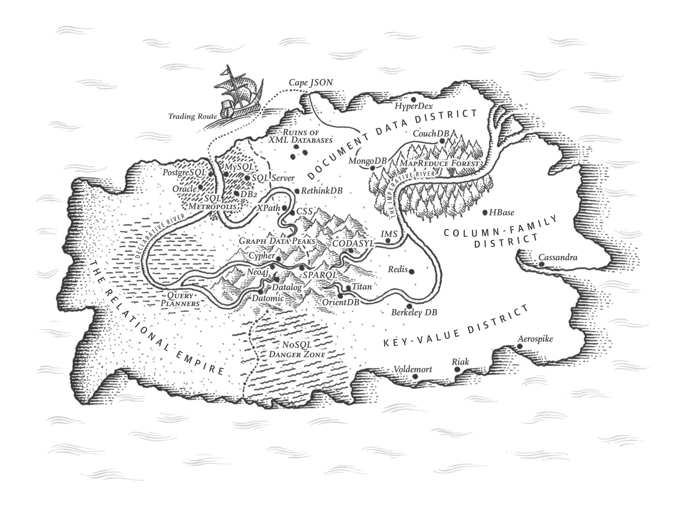
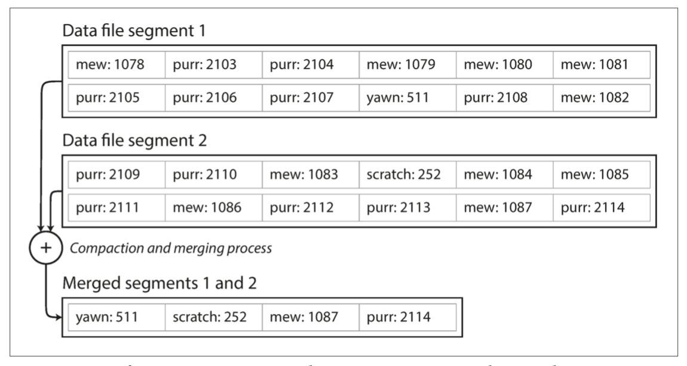
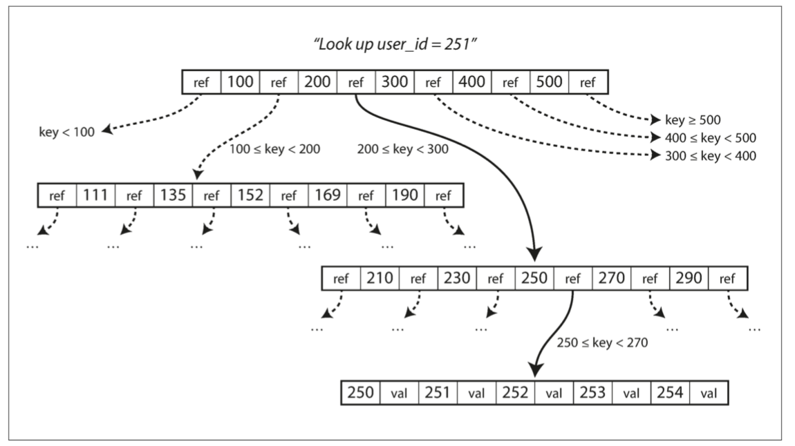
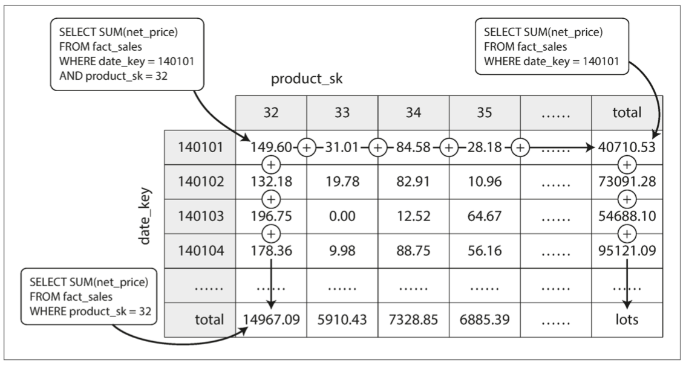

# 3. 存储与检索 



> 建立秩序，省却搜索
>
> ——德国谚语
>

-------------------

[TOC]

一个数据库在最基础的层次上需要完成两件事情：当你把数据交给数据库时，它应当把数据存储起来；而后当你向数据库要数据时，它应当把数据返回给你。

在[第2章](ch2.md)中，我们讨论了数据模型和查询语言，即程序员将数据录入数据库的格式，以及再次要回数据的机制。在本章中我们会从数据库的视角来讨论同样的问题：数据库如何存储我们提供的数据，以及如何在我们需要时重新找到数据。

作为程序员，为什么要关心数据库内部存储与检索的机理？你可能不会去从头开始实现自己的存储引擎，但是你**确实**需要从许多可用的存储引擎中选择一个合适的。而且为了协调存储引擎以适配应用工作负载，你也需要大致了解存储引擎在底层究竟做什么。

特别需要注意，针对**事务**性负载和**分析性**负载优化的存储引擎之间存在巨大差异。稍后我们将在 “[事务处理还是分析？](#事务处理还是分析？)” 一节中探讨这一区别，并在 “[列存储](#列存储)”中讨论一系列针对分析优化存储引擎。

但是，我们将从您最可能熟悉的两大类数据库：传统关系型数据库与很多所谓的“NoSQL”数据库开始，通过介绍它们的**存储引擎**来开始本章的内容。我们会研究两大类存储引擎：**日志结构（log-structured）** 的存储引擎，以及**面向页面（page-oriented）** 的存储引擎（例如B树）。

## 驱动数据库的数据结构

世界上最简单的数据库可以用两个Bash函数实现：

```bash
#!/bin/bash
db_set () {
	echo "$1,$2" >> database
}

db_get () {
	grep "^$1," database | sed -e "s/^$1,//" | tail -n 1
}
```

这两个函数实现了键值存储的功能。执行 `db_set key value` ，会将 **键（key）**和**值（value）** 存储在数据库中。键和值（几乎）可以是你喜欢的任何东西，例如，值可以是JSON文档。然后调用 `db_get key` ，查找与该键关联的最新值并将其返回。

麻雀虽小，五脏俱全：

```bash
$ db_set 123456 '{"name":"London","attractions":["Big Ben","London Eye"]}' $ 

$ db_set 42 '{"name":"San Francisco","attractions":["Golden Gate Bridge"]}'

$ db_get 42
{"name":"San Francisco","attractions":["Golden Gate Bridge"]}
```

底层的存储格式非常简单：一个文本文件，每行包含一条逗号分隔的键值对（忽略转义问题的话，大致与CSV文件类似）。每次对 `db_set` 的调用都会向文件末尾追加记录，所以更新键的时候旧版本的值不会被覆盖 —— 因而查找最新值的时候，需要找到文件中键最后一次出现的位置（因此 `db_get` 中使用了 `tail -n 1 ` 。)

```bash
$ db_set 42 '{"name":"San Francisco","attractions":["Exploratorium"]}' 

$ db_get 42
{"name":"San Francisco","attractions":["Exploratorium"]}

$ cat database
123456,{"name":"London","attractions":["Big Ben","London Eye"]}
42,{"name":"San Francisco","attractions":["Golden Gate Bridge"]}
42,{"name":"San Francisco","attractions":["Exploratorium"]}
```

`db_set` 函数对于极其简单的场景其实有非常好的性能，因为在文件尾部追加写入通常是非常高效的。与`db_set`做的事情类似，许多数据库在内部使用了**日志（log）**，也就是一个 **仅追加（append-only）** 的数据文件。真正的数据库有更多的问题需要处理（如并发控制，回收磁盘空间以避免日志无限增长，处理错误与部分写入的记录），但基本原理是一样的。日志极其有用，我们还将在本书的其它部分重复见到它好几次。

> **日志（log）** 这个词通常指应用日志：即应用程序输出的描述发生事情的文本。本书在更普遍的意义下使用**日志**这一词：一个仅追加的记录序列。它可能压根就不是给人类看的，使用二进制格式，并仅能由其他程序读取。

另一方面，如果这个数据库中有着大量记录，则这个`db_get` 函数的性能会非常糟糕。每次你想查找一个键时，`db_get` 必须从头到尾扫描整个数据库文件来查找键的出现。用算法的语言来说，查找的开销是 `O(n)` ：如果数据库记录数量 n 翻了一倍，查找时间也要翻一倍。这就不好了。

为了高效查找数据库中特定键的值，我们需要一个数据结构：**索引（index）**。本章将介绍一系列的索引结构，并它们进行对比。索引背后的大致思想是，保存一些额外的元数据作为路标，帮助你找到想要的数据。如果您想在同一份数据中以几种不同的方式进行搜索，那么你也许需要不同的索引，建在数据的不同部分上。

索引是从主数据衍生的**附加（additional）**结构。许多数据库允许添加与删除索引，这不会影响数据的内容，它只影响查询的性能。维护额外的结构会产生开销，特别是在写入时。写入性能很难超过简单地追加写入文件，因为追加写入是最简单的写入操作。任何类型的索引通常都会减慢写入速度，因为每次写入数据时都需要更新索引。

这是存储系统中一个重要的权衡：精心选择的索引加快了读查询的速度，但是每个索引都会拖慢写入速度。因为这个原因，数据库默认并不会索引所有的内容，而需要你（程序员或DBA）通过对应用查询模式的了解来手动选择索引。你可以选择能为应用带来最大收益，同时又不会引入超出必要开销的索引。


### 哈希索引

让我们从 **键值数据（key-value Data）** 的索引开始。这不是您可以索引的唯一数据类型，但键值数据是很常见的。对于更复杂的索引来说，这是一个有用的构建模块。

键值存储与在大多数编程语言中可以找到的**字典（dictionary）**类型非常相似，通常字典都是用**散列映射（hash map）**（或**哈希表（hash table）**）实现的。哈希映射在许多算法教科书中都有描述【1,2】，所以这里我们不会讨论它的工作细节。既然我们已经有**内存中**数据结构 —— 哈希映射，为什么不使用它来索引在**磁盘上**的数据呢？

假设我们的数据存储只是一个追加写入的文件，就像前面的例子一样。那么最简单的索引策略就是：保留一个内存中的哈希映射，其中每个键都映射到一个数据文件中的字节偏移量，指明了可以找到对应值的位置，如[图3-1](img/fig3-1.png)所示。当你将新的键值对追加写入文件中时，还要更新散列映射，以反映刚刚写入的数据的偏移量（这同时适用于插入新键与更新现有键）。当你想查找一个值时，使用哈希映射来查找数据文件中的偏移量，**寻找（seek）** 该位置并读取该值。


**图3-1 以类CSV格式存储键值对的日志，并使用内存哈希映射进行索引。**

听上去简单，但这是一个可行的方法。现实中，Bitcask实际上就是这么做的（Riak中默认的存储引擎）【3】。 Bitcask提供高性能的读取和写入操作，但所有键必须能放入可用内存中，因为哈希映射完全保留在内存中。这些值可以使用比可用内存更多的空间，因为可以从磁盘上通过一次`seek`加载所需部分，如果数据文件的那部分已经在文件系统缓存中，则读取根本不需要任何磁盘I/O。

像Bitcask这样的存储引擎非常适合每个键的值经常更新的情况。例如，键可能是视频的URL，值可能是它播放的次数（每次有人点击播放按钮时递增）。在这种类型的工作负载中，有很多写操作，但是没有太多不同的键——每个键有很多的写操作，但是将所有键保存在内存中是可行的。

直到现在，我们只是追加写入一个文件 —— 所以如何避免最终用完磁盘空间？一种好的解决方案是，将日志分为特定大小的段，当日志增长到特定尺寸时关闭当前段文件，并开始写入一个新的段文件。然后，我们就可以对这些段进行**压缩（compaction）**，如[图3-2](img/fig3-2.png)所示。压缩意味着在日志中丢弃重复的键，只保留每个键的最近更新。


**图3-2 压缩键值更新日志（统计猫视频的播放次数），只保留每个键的最近值**

而且，由于压缩经常会使得段变得很小（假设在一个段内键被平均重写了好几次），我们也可以在执行压缩的同时将多个段合并在一起，如[图3-3](img/fig3-3.png)所示。段被写入后永远不会被修改，所以合并的段被写入一个新的文件。冻结段的合并和压缩可以在后台线程中完成，在进行时，我们仍然可以继续使用旧的段文件来正常提供读写请求。合并过程完成后，我们将读取请求转换为使用新的合并段而不是旧段 —— 然后可以简单地删除旧的段文件。



**图3-3 同时执行压缩和分段合并**

每个段现在都有自己的内存散列表，将键映射到文件偏移量。为了找到一个键的值，我们首先检查最近段的哈希映射;如果键不存在，我们检查第二个最近的段，依此类推。合并过程保持细分的数量，所以查找不需要检查许多哈希映射。
大量的细节进入实践这个简单的想法工作。简而言之，一些真正实施中重要的问题是：

***文件格式***

​	CSV不是日志的最佳格式。使用二进制格式更快，更简单，首先以字节为单位对字符串的长度进行编码，然后使用原始字符串（不需要转义）。

***删除记录***

如果要删除一个键及其关联的值，则必须在数据文件（有时称为逻辑删除）中附加一个特殊的删除记录。当日志段被合并时，逻辑删除告诉合并过程放弃删除键的任何以前的值。

***崩溃恢复***

如果数据库重新启动，则内存散列映射将丢失。原则上，您可以通过从头到尾读取整个段文件并在每次按键时注意每个键的最近值的偏移量来恢复每个段的哈希映射。但是，如果段文件很大，这可能需要很长时间，这将使服务器重新启动痛苦。 Bitcask通过存储加速恢复磁盘上每个段的哈希映射的快照，可以更快地加载到内存中。

***部分写入记录***

数据库可能随时崩溃，包括将记录附加到日志中途。 Bitcask文件包含校验和，允许检测和忽略日志的这些损坏部分。

***并发控制***

由于写操作是以严格顺序的顺序附加到日志中的，所以常见的实现选择是只有一个写入器线程。数据文件段是附加的，或者是不可变的，所以它们可以被多个线程同时读取。

乍一看，只有追加日志看起来很浪费：为什么不更新文件，用新值覆盖旧值？但是只能追加设计的原因有几个：

* 追加和分段合并是顺序写入操作，通常比随机写入快得多，尤其是在磁盘旋转硬盘上。在某种程度上，顺序写入在基于闪存的 **固态硬盘（SSD）** 上也是优选的【4】。我们将在第83页的“[比较B-树和LSM-树](#比较B-树和LSM-树)”中进一步讨论这个问题。
* 如果段文件是附加的或不可变的，并发和崩溃恢复就简单多了。例如，您不必担心在覆盖值时发生崩溃的情况，而将包含旧值和新值的一部分的文件保留在一起。
* 合并旧段可以避免数据文件随着时间的推移而分散的问题。

但是，哈希表索引也有局限性：

* 散列表必须能放进内存

  如果你有非常多的键，那真是倒霉。原则上可以在磁盘上保留一个哈希映射，不幸的是磁盘哈希映射很难表现优秀。它需要大量的随机访问I/O，当它变满时增长是很昂贵的，并且散列冲突需要很多的逻辑【5】。

* 范围查询效率不高。例如，您无法轻松扫描kitty00000和kitty99999之间的所有键——您必须在散列映射中单独查找每个键。

在下一节中，我们将看看一个没有这些限制的索引结构。


### SSTables和LSM树

在[图3-3](img/fig3-3.png)中，每个日志结构存储段都是一系列键值对。这些对按照它们写入的顺序出现，日志中稍后的值优先于日志中较早的相同键的值。除此之外，文件中键值对的顺序并不重要。

现在我们可以对段文件的格式做一个简单的改变：我们要求键值对的序列按键排序。乍一看，这个要求似乎打破了我们使用顺序写入的能力，但是我们马上就会明白这一点。

我们把这个格式称为**排序字符串表（Sorted String Table）**，简称SSTable。我们还要求每个键只在每个合并的段文件中出现一次（压缩过程已经保证）。与使用散列索引的日志段相比，SSTable有几个很大的优势：

1. 合并段是简单而高效的，即使文件大于可用内存。这种方法就像归并排序算法中使用的方法一样，如[图3-4](img/fig3-4.png)所示：您开始并排读取输入文件，查看每个文件中的第一个键，复制最低键（根据排序顺序）到输出文件，并重复。这产生一个新的合并段文件，也按键排序。

   

   ##### 图3-4 合并几个SSTable段，只保留每个键的最新值

   如果在几个输入段中出现相同的键，该怎么办？请记住，每个段都包含在一段时间内写入数据库的所有值。这意味着一个输入段中的所有值必须比另一个段中的所有值更新（假设我们总是合并相邻的段）。当多个段包含相同的键时，我们可以保留最近段的值，并丢弃旧段中的值。

2. 为了在文件中找到一个特定的键，你不再需要保存内存中所有键的索引。以[图3-5](img/fig3-5.png)为例：假设你正在内存中寻找键 `handiwork`，但是你不知道段文件中该关键字的确切偏移量。然而，你知道 `handbag` 和 `handsome` 的偏移，而且由于排序特性，你知道 `handiwork` 必须出现在这两者之间。这意味着您可以跳到 `handbag` 的偏移位置并从那里扫描，直到您找到 `handiwork`（或没找到，如果该文件中没有该键）。

   

   **图3-5 具有内存索引的SSTable**

   您仍然需要一个内存中索引来告诉您一些键的偏移量，但它可能很稀疏：每几千字节的段文件就有一个键就足够了，因为几千字节可以很快被扫描[^i]。


3. 由于读取请求无论如何都需要扫描所请求范围内的多个键值对，因此可以将这些记录分组到块中，并在将其写入磁盘之前对其进行压缩（如[图3-5](img/fig3-5.png)中的阴影区域所示） 。稀疏内存中索引的每个条目都指向压缩块的开始处。除了节省磁盘空间之外，压缩还可以减少IO带宽的使用。


[^i]: 如果所有的键与值都是定长的，你可以使用段文件上的二分查找并完全避免使用内存索引。然而实践中键值通常都是变长的，因此如果没有索引，就很难知道记录的分界点（前一条记录结束，后一条记录开始的地方）

#### 构建和维护SSTables

到目前为止，但是如何让你的数据首先被按键排序呢？我们的传入写入可以以任何顺序发生。

在磁盘上维护有序结构是可能的（参阅“[B树](#B树)”），但在内存保存则要容易得多。有许多可以使用的众所周知的树形数据结构，例如红黑树或AVL树【2】。使用这些数据结构，您可以按任何顺序插入键，并按排序顺序读取它们。

现在我们可以使我们的存储引擎工作如下：

* 写入时，将其添加到内存中的平衡树数据结构（例如，红黑树）。这个内存树有时被称为**内存表（memtable）**。
* 当**内存表**大于某个阈值（通常为几兆字节）时，将其作为SSTable文件写入磁盘。这可以高效地完成，因为树已经维护了按键排序的键值对。新的SSTable文件成为数据库的最新部分。当SSTable被写入磁盘时，写入可以继续到一个新的内存表实例。
* 为了提供读取请求，首先尝试在内存表中找到关键字，然后在最近的磁盘段中，然后在下一个较旧的段中找到该关键字。
* 有时会在后台运行合并和压缩过程以组合段文件并丢弃覆盖或删除的值。

这个方案效果很好。它只会遇到一个问题：如果数据库崩溃，则最近的写入（在内存表中，但尚未写入磁盘）将丢失。为了避免这个问题，我们可以在磁盘上保存一个单独的日志，每个写入都会立即被附加到磁盘上，就像在前一节中一样。该日志不是按排序顺序，但这并不重要，因为它的唯一目的是在崩溃后恢复内存表。每当内存表写出到SSTable时，相应的日志都可以被丢弃。

#### 用SSTables制作LSM树

这里描述的算法本质上是LevelDB 【6】和RocksDB 【7】中使用的关键值存储引擎库，被设计嵌入到其他应用程序中。除此之外，LevelDB可以在Riak中用作Bitcask的替代品。在Cassandra和HBase中使用了类似的存储引擎【8】，这两种引擎都受到了Google的Bigtable文档【9】（引入了SSTable和memtable）的启发。

最初这种索引结构是由Patrick O'Neil等人描述的。在日志结构合并树（或LSM树）【10】的基础上，建立在以前的工作上日志结构的文件系统【11】。基于这种合并和压缩排序文件原理的存储引擎通常被称为LSM存储引擎。

Lucene是Elasticsearch和Solr使用的一种全文搜索的索引引擎，它使用类似的方法来存储它的词典【12,13】。全文索引比键值索引复杂得多，但是基于类似的想法：在搜索查询中给出一个单词，找到提及单词的所有文档（网页，产品描述等）。这是通过键值结构实现的，其中键是单词（**关键词（term）**），值是包含单词（文章列表）的所有文档的ID的列表。在Lucene中，从术语到发布列表的这种映射保存在SSTable类的有序文件中，根据需要在后台合并【14】。

#### 性能优化

与往常一样，大量的细节使得存储引擎在实践中表现良好。例如，当查找数据库中不存在的键时，LSM树算法可能会很慢：您必须检查内存表，然后将这些段一直回到最老的（可能必须从磁盘读取每一个），然后才能确定键不存在。为了优化这种访问，存储引擎通常使用额外的Bloom过滤器【15】。 （布隆过滤器是用于近似集合内容的内存高效数据结构，它可以告诉您数据库中是否出现键，从而为不存在的键节省许多不必要的磁盘读取操作。

还有不同的策略来确定SSTables如何被压缩和合并的顺序和时间。最常见的选择是大小分层压实。 LevelDB和RocksDB使用平坦压缩（LevelDB因此得名），HBase使用大小分层，Cassandra同时支持【16】。在规模级别的调整中，更新和更小的SSTables先后被合并到更老的和更大的SSTable中。在水平压实中，关键范围被拆分成更小的SSTables，而较旧的数据被移动到单独的“水平”，这使得压缩能够更加递增地进行，并且使用更少的磁盘空间。

即使有许多微妙的东西，LSM树的基本思想 —— 保存一系列在后台合并的SSTables —— 简单而有效。即使数据集比可用内存大得多，它仍能继续正常工作。由于数据按排序顺序存储，因此可以高效地执行范围查询（扫描所有高于某些最小值和最高值的所有键），并且因为磁盘写入是连续的，所以LSM树可以支持非常高的写入吞吐量。


### B树

刚才讨论的日志结构索引正处在逐渐被接受的阶段，但它们并不是最常见的索引类型。使用最广泛的索引结构在1970年被引入【17】，不到10年后变得“无处不在”【18】，B树经受了时间的考验。在几乎所有的关系数据库中，它们仍然是标准的索引实现，许多非关系数据库也使用它们。

像SSTables一样，B树保持按键排序的键值对，这允许高效的键值查找和范围查询。但这就是相似之处的结尾：B树有着非常不同的设计理念。

我们前面看到的日志结构索引将数据库分解为可变大小的段，通常是几兆字节或更大的大小，并且总是按顺序编写段。相比之下，B树将数据库分解成固定大小的块或页面，传统上大小为4KB（有时会更大），并且一次只能读取或写入一个页面。这种设计更接近于底层硬件，因为磁盘也被安排在固定大小的块中。

每个页面都可以使用地址或位置来标识，这允许一个页面引用另一个页面 —— 类似于指针，但在磁盘而不是在内存中。我们可以使用这些页面引用来构建一个页面树，如[图3-6](img/fig3-6.png)所示。



**图3-6 使用B树索引查找一个键**

一个页面会被指定为B树的根；在索引中查找一个键时，就从这里开始。该页面包含几个键和对子页面的引用。每个子页面负责一段连续范围的键，引用之间的键，指明了引用子页面的键范围。

在[图3-6](img/fig3-6.png)的例子中，我们正在寻找关键字 251 ，所以我们知道我们需要遵循边界 200 和 300 之间的页面引用。这将我们带到一个类似的页面，进一步打破了200 - 300到子范围。

最后，我们可以看到包含单个键（叶页）的页面，该页面包含每个键的内联值，或者包含对可以找到值的页面的引用。

在B树的一个页面中对子页面的引用的数量称为分支因子。例如，在[图3-6](img/fig3-6.png)中，分支因子是 6 。在实践中，分支因子取决于存储页面参考和范围边界所需的空间量，但通常是几百个。

如果要更新B树中现有键的值，则搜索包含该键的叶页，更改该页中的值，并将该页写回到磁盘（对该页的任何引用保持有效） 。如果你想添加一个新的键，你需要找到其范围包含新键的页面，并将其添加到该页面。如果页面中没有足够的可用空间容纳新键，则将其分成两个半满页面，并更新父页面以解释键范围的新分区，如[图3-7](img/fig3-7.png)所示[^ii]。

[^ii]: 向B树中插入一个新的键是相当符合直觉的，但删除一个键（同时保持树平衡）就会牵扯很多其他东西了。


**图3-7 通过分割页面来生长B树**

该算法确保树保持平衡：具有 n 个键的B树总是具有 $O(log n)$ 的深度。大多数数据库可以放入一个三到四层的B树，所以你不需要遵追踪多页面引用来找到你正在查找的页面。 （分支因子为 500 的 4KB 页面的四级树可以存储多达 256TB 。）

#### 让B树更可靠

B树的基本底层写操作是用新数据覆盖磁盘上的页面。假定覆盖不改变页面的位置;即，当页面被覆盖时，对该页面的所有引用保持完整。这与日志结构索引（如LSM树）形成鲜明对比，后者只附加到文件（并最终删除过时的文件），但从不修改文件。

您可以考虑将硬盘上的页面覆盖为实际的硬件操作。在磁性硬盘驱动器上，这意味着将磁头移动到正确的位置，等待旋转盘上的正确位置出现，然后用新的数据覆盖适当的扇区。在固态硬盘上，由于SSD必须一次擦除和重写相当大的存储芯片块，所以会发生更复杂的事情【19】。

而且，一些操作需要覆盖几个不同的页面。例如，如果因为插入导致页面过度而拆分页面，则需要编写已拆分的两个页面，并覆盖其父页面以更新对两个子页面的引用。这是一个危险的操作，因为如果数据库在仅有一些页面被写入后崩溃，那么最终将导致一个损坏的索引（例如，可能有一个孤儿页面不是任何父项的子项） 。

为了使数据库对崩溃具有韧性，B树实现通常会带有一个额外的磁盘数据结构：**预写式日志（WAL, write-ahead-log）**（也称为**重做日志（redo log）**）。这是一个仅追加的文件，每个B树修改都可以应用到树本身的页面上。当数据库在崩溃后恢复时，这个日志被用来使B树恢复到一致的状态【5,20】。

更新页面的一个额外的复杂情况是，如果多个线程要同时访问B树，则需要仔细的并发控制 —— 否则线程可能会看到树处于不一致的状态。这通常通过使用**锁存器（latches）**（轻量级锁）保护树的数据结构来完成。日志结构化的方法在这方面更简单，因为它们在后台进行所有的合并，而不会干扰传入的查询，并且不时地将旧的分段原子交换为新的分段。

#### B树优化

由于B树已经存在了这么久，许多优化已经发展了多年，这并不奇怪。仅举几例：

* 一些数据库（如LMDB）使用写时复制方案【21】，而不是覆盖页面并维护WAL进行崩溃恢复。修改的页面被写入到不同的位置，并且树中的父页面的新版本被创建，指向新的位置。这种方法对于并发控制也很有用，我们将在“[快照隔离和可重复读](ch7.md#快照隔离和可重复读)”中看到。
* 我们可以通过不存储整个键来节省页面空间，但可以缩小它的大小。特别是在树内部的页面上，键只需要提供足够的信息来充当键范围之间的边界。在页面中包含更多的键允许树具有更高的分支因子，因此更少的层次
* 通常，页面可以放置在磁盘上的任何位置；没有什么要求附近的键范围页面附近的磁盘上。如果查询需要按照排序顺序扫描大部分关键字范围，那么每个页面的布局可能会非常不方便，因为每个读取的页面都可能需要磁盘查找。因此，许多B树实现尝试布局树，使得叶子页面按顺序出现在磁盘上。但是，随着树的增长，维持这个顺序是很困难的。相比之下，由于LSM树在合并过程中一次又一次地重写存储的大部分，所以它们更容易使顺序键在磁盘上彼此靠近。
* 额外的指针已添加到树中。例如，每个叶子页面可以在左边和右边具有对其兄弟页面的引用，这允许不跳回父页面就能顺序扫描。
* B树的变体如分形树【22】借用一些日志结构的思想来减少磁盘寻道（而且它们与分形无关）。

### 比较B树和LSM树

尽管B树实现通常比LSM树实现更成熟，但LSM树由于其性能特点也非常有趣。根据经验，通常LSM树的写入速度更快，而B树的读取速度更快【23】。 LSM树上的读取通常比较慢，因为它们必须在压缩的不同阶段检查几个不同的数据结构和SSTables。

然而，基准通常对工作量的细节不确定和敏感。 您需要测试具有特定工作负载的系统，以便进行有效的比较。 在本节中，我们将简要讨论一些在衡量存储引擎性能时值得考虑的事情。

#### LSM树的优点

B树索引必须至少两次写入每一段数据：一次写入预先写入日志，一次写入树页面本身（也许再次分页）。即使在该页面中只有几个字节发生了变化，也需要一次编写整个页面的开销。有些存储引擎甚至会覆盖同一个页面两次，以免在电源故障的情况下导致页面部分更新【24,25】。

由于反复压缩和合并SSTables，日志结构索引也会重写数据。这种影响 —— 在数据库的生命周期中写入数据库导致对磁盘的多次写入 —— 被称为**写放大（write amplification）**。需要特别注意的是固态硬盘，固态硬盘的闪存寿命在覆写有限次数后就会耗尽。

在写入繁重的应用程序中，性能瓶颈可能是数据库可以写入磁盘的速度。在这种情况下，写放大会导致直接的性能代价：存储引擎写入磁盘的次数越多，可用磁盘带宽内的每秒写入次数越少。

而且，LSM树通常能够比B树支持更高的写入吞吐量，部分原因是它们有时具有较低的写放大（尽管这取决于存储引擎配置和工作负载），部分是因为它们顺序地写入紧凑的SSTable文件而不是必须覆盖树中的几个页面【26】。这种差异在磁性硬盘驱动器上尤其重要，顺序写入比随机写入快得多。

LSM树可以被压缩得更好，因此经常比B树在磁盘上产生更小的文件。 B树存储引擎会由于分割而留下一些未使用的磁盘空间：当页面被拆分或某行不能放入现有页面时，页面中的某些空间仍未被使用。由于LSM树不是面向页面的，并且定期重写SSTables以去除碎片，所以它们具有较低的存储开销，特别是当使用平坦压缩时【27】。

在许多固态硬盘上，固件内部使用日志结构化算法，将随机写入转变为顺序写入底层存储芯片，因此存储引擎写入模式的影响不太明显【19】。但是，较低的写入放大率和减少的碎片对SSD仍然有利：更紧凑地表示数据可在可用的I/O带宽内提供更多的读取和写入请求。

#### LSM树的缺点

日志结构存储的缺点是压缩过程有时会干扰正在进行的读写操作。尽管存储引擎尝试逐步执行压缩而不影响并发访问，但是磁盘资源有限，所以很容易发生请求需要等待而磁盘完成昂贵的压缩操作。对吞吐量和平均响应时间的影响通常很小，但是在更高百分比的情况下（参阅“[描述性能](ch1.md#描述性能)”），对日志结构化存储引擎的查询响应时间有时会相当长，而B树的行为则相对更具可预测性【28】。

压缩的另一个问题出现在高写入吞吐量：磁盘的有限写入带宽需要在初始写入（记录和刷新内存表到磁盘）和在后台运行的压缩线程之间共享。写入空数据库时，可以使用全磁盘带宽进行初始写入，但数据库越大，压缩所需的磁盘带宽就越多。

如果写入吞吐量很高，并且压缩没有仔细配置，压缩跟不上写入速率。在这种情况下，磁盘上未合并段的数量不断增加，直到磁盘空间用完，读取速度也会减慢，因为它们需要检查更多段文件。通常情况下，即使压缩无法跟上，基于SSTable的存储引擎也不会限制传入写入的速率，所以您需要进行明确的监控来检测这种情况【29,30】。

B树的一个优点是每个键只存在于索引中的一个位置，而日志结构化的存储引擎可能在不同的段中有相同键的多个副本。这个方面使得B树在想要提供强大的事务语义的数据库中很有吸引力：在许多关系数据库中，事务隔离是通过在键范围上使用锁来实现的，在B树索引中，这些锁可以直接连接到树【5】。在[第7章](ch7.md)中，我们将更详细地讨论这一点。

B树在数据库体系结构中是非常根深蒂固的，为许多工作负载提供始终如一的良好性能，所以它们不可能很快就会消失。在新的数据存储中，日志结构化索引变得越来越流行。没有快速和容易的规则来确定哪种类型的存储引擎对你的场景更好，所以值得进行一些经验上的测试

### 其他索引结构

到目前为止，我们只讨论了关键值索引，它们就像关系模型中的**主键（primary key）** 索引。主键唯一标识关系表中的一行，或文档数据库中的一个文档或图形数据库中的一个顶点。数据库中的其他记录可以通过其主键（或ID）引用该行/文档/顶点，并且索引用于解析这样的引用。

有二级索引也很常见。在关系数据库中，您可以使用 `CREATE INDEX` 命令在同一个表上创建多个二级索引，而且这些索引通常对于有效地执行联接而言至关重要。例如，在[第2章](ch2.md)中的[图2-1](img/fig2-1.png)中，很可能在 `user_id` 列上有一个二级索引，以便您可以在每个表中找到属于同一用户的所有行。

一个二级索引可以很容易地从一个键值索引构建。主要的不同是键不是唯一的。即可能有许多行（文档，顶点）具有相同的键。这可以通过两种方式来解决：或者通过使索引中的每个值，成为匹配行标识符的列表（如全文索引中的发布列表），或者通过向每个索引添加行标识符来使每个关键字唯一。无论哪种方式，B树和日志结构索引都可以用作辅助索引。

#### 将值存储在索引中

索引中的关键字是查询搜索的内容，但是该值可以是以下两种情况之一：它可以是所讨论的实际行（文档，顶点），也可以是对存储在别处的行的引用。在后一种情况下，行被存储的地方被称为**堆文件（heap file）**，并且存储的数据没有特定的顺序（它可以是仅附加的，或者可以跟踪被删除的行以便用新数据覆盖它们后来）。堆文件方法很常见，因为它避免了在存在多个二级索引时复制数据：每个索引只引用堆文件中的一个位置，实际的数据保存在一个地方。
在不更改键的情况下更新值时，堆文件方法可以非常高效：只要新值不大于旧值，就可以覆盖该记录。如果新值更大，情况会更复杂，因为它可能需要移到堆中有足够空间的新位置。在这种情况下，要么所有的索引都需要更新，以指向记录的新堆位置，或者在旧堆位置留下一个转发指针【5】。

在某些情况下，从索引到堆文件的额外跳跃对读取来说性能损失太大，因此可能希望将索引行直接存储在索引中。这被称为聚集索引。例如，在MySQL的InnoDB存储引擎中，表的主键总是一个聚簇索引，二级索引用主键（而不是堆文件中的位置）【31】。在SQL Server中，可以为每个表指定一个聚簇索引【32】。

在 **聚集索引（clustered index）** （在索引中存储所有行数据）和 **非聚集索引（nonclustered index）** （仅在索引中存储对数据的引用）之间的折衷被称为 **包含列的索引（index with included columns）**或**覆盖索引（covering index）**，其存储表的一部分在索引内【33】。这允许通过单独使用索引来回答一些查询（这种情况叫做：索引 **覆盖（cover）** 了查询）【32】。

与任何类型的数据重复一样，聚簇和覆盖索引可以加快读取速度，但是它们需要额外的存储空间，并且会增加写入开销。数据库还需要额外的努力来执行事务保证，因为应用程序不应该因为重复而导致不一致。

#### 多列索引

至今讨论的索引只是将一个键映射到一个值。如果我们需要同时查询一个表中的多个列（或文档中的多个字段），这显然是不够的。

最常见的多列索引被称为 **连接索引（concatenated index）** ，它通过将一列的值追加到另一列后面，简单地将多个字段组合成一个键（索引定义中指定了字段的连接顺序）。这就像一个老式的纸质电话簿，它提供了一个从（姓，名）到电话号码的索引。由于排序顺序，索引可以用来查找所有具有特定姓氏的人，或所有具有特定姓-名组合的人。**然而，如果你想找到所有具有特定名字的人，这个索引是没有用的**。

**多维索引（multi-dimensional index）** 是一种查询多个列的更一般的方法，这对于地理空间数据尤为重要。例如，餐厅搜索网站可能有一个数据库，其中包含每个餐厅的经度和纬度。当用户在地图上查看餐馆时，网站需要搜索用户正在查看的矩形地图区域内的所有餐馆。这需要一个二维范围查询，如下所示：

```sql
SELECT * FROM restaurants WHERE latitude > 51.4946 AND latitude < 51.5079 
                           AND longitude > -0.1162 AND longitude < -0.1004;
```

一个标准的B树或者LSM树索引不能够高效地响应这种查询：它可以返回一个纬度范围内的所有餐馆（但经度可能是任意值），或者返回在同一个经度范围内的所有餐馆（但纬度可能是北极和南极之间的任意地方），但不能同时满足。

一种选择是使用空间填充曲线将二维位置转换为单个数字，然后使用常规B树索引【34】。更普遍的是，使用特殊化的空间索引，例如R树。例如，PostGIS使用PostgreSQL的通用Gist工具【35】将地理空间索引实现为R树。这里我们没有足够的地方来描述R树，但是有大量的文献可供参考。

一个有趣的主意是，多维索引不仅可以用于地理位置。例如，在电子商务网站上可以使用维度（红色，绿色，蓝色）上的三维索引来搜索特定颜色范围内的产品，也可以在天气观测数据库中搜索二维（日期，温度）的指数，以便有效地搜索2013年的温度在25至30°C之间的所有观测资料。使用一维索引，你将不得不扫描2013年的所有记录（不管温度如何），然后通过温度进行过滤，反之亦然。 二维索引可以同时通过时间戳和温度来收窄数据集。这个技术被HyperDex使用【36】。

#### 全文搜索和模糊索引

到目前为止所讨论的所有索引都假定您有确切的数据，并允许您查询键的确切值或具有排序顺序的键的值范围。他们不允许你做的是搜索类似的键，如拼写错误的单词。这种模糊的查询需要不同的技术。

例如，全文搜索引擎通常允许搜索一个单词以扩展为包括该单词的同义词，忽略单词的语法变体，并且搜索在相同文档中彼此靠近的单词的出现，并且支持各种其他功能取决于文本的语言分析。为了处理文档或查询中的拼写错误，Lucene能够在一定的编辑距离内搜索文本（编辑距离1意味着添加，删除或替换了一个字母）【37】。

正如“[在SSTables中创建LSM树](#在SSTables中创建LSM树)”中所提到的，Lucene为其词典使用了一个类似于SSTable的结构。这个结构需要一个小的内存索引，告诉查询在排序文件中哪个偏移量需要查找关键字。在LevelDB中，这个内存中的索引是一些键的稀疏集合，但在Lucene中，内存中的索引是键中字符的有限状态自动机，类似于trie 【38】。这个自动机可以转换成Levenshtein自动机，它支持在给定的编辑距离内有效地搜索单词【39】。

其他的模糊搜索技术正朝着文档分类和机器学习的方向发展。有关更多详细信息，请参阅信息检索教科书，例如【40】。

#### 在内存中存储一切

本章到目前为止讨论的数据结构都是对磁盘限制的回答。与主内存相比，磁盘处理起来很尴尬。对于磁盘和SSD，如果要在读取和写入时获得良好性能，则需要仔细地布置磁盘上的数据。但是，我们容忍这种尴尬，因为磁盘有两个显著的优点：它们是耐用的（它们的内容在电源关闭时不会丢失），并且每GB的成本比RAM低。

随着RAM变得更便宜，每GB的成本价格被侵蚀了。许多数据集不是那么大，所以将它们全部保存在内存中是非常可行的，可能分布在多个机器上。这导致了内存数据库的发展。

某些内存中的键值存储（如Memcached）仅用于缓存，在重新启动计算机时丢失的数据是可以接受的。但其他内存数据库的目标是持久性，可以通过特殊的硬件（例如电池供电的RAM），将更改日志写入磁盘，将定时快照写入磁盘或通过复制内存来实现，记忆状态到其他机器。

内存数据库重新启动时，需要从磁盘或通过网络从副本重新加载其状态（除非使用特殊的硬件）。尽管写入磁盘，它仍然是一个内存数据库，因为磁盘仅用作耐久性附加日志，读取完全由内存提供。写入磁盘也具有操作优势：磁盘上的文件可以很容易地由外部实用程序进行备份，检查和分析。

诸如VoltDB，MemSQL和Oracle TimesTen等产品是具有关系模型的内存数据库，供应商声称，通过消除与管理磁盘上的数据结构相关的所有开销，他们可以提供巨大的性能改进【41,42】。 RAM Cloud是一个开源的内存键值存储器，具有持久性（对存储器中的数据以及磁盘上的数据使用日志结构化方法）【43】。 Redis和Couchbase通过异步写入磁盘提供了较弱的持久性。

反直觉的是，内存数据库的性能优势并不是因为它们不需要从磁盘读取的事实。即使是基于磁盘的存储引擎也可能永远不需要从磁盘读取，因为操作系统缓存最近在内存中使用了磁盘块。相反，它们更快的原因在于省去了将内存数据结构编码为磁盘数据结构的开销。【44】。

除了性能，内存数据库的另一个有趣的领域是提供难以用基于磁盘的索引实现的数据模型。例如，Redis为各种数据结构（如优先级队列和集合）提供了类似数据库的接口。因为它将所有数据保存在内存中，所以它的实现相对简单。

最近的研究表明，内存数据库体系结构可以扩展到支持比可用内存更大的数据集，而不必重新采用以磁盘为中心的体系结构【45】。所谓的 **反缓存（anti-caching）** 方法通过在内存不足的情况下将最近最少使用的数据从内存转移到磁盘，并在将来再次访问时将其重新加载到内存中。这与操作系统对虚拟内存和交换文件的操作类似，但数据库可以比操作系统更有效地管理内存，因为它可以按单个记录的粒度工作，而不是整个内存页面。尽管如此，这种方法仍然需要索引能完全放入内存中（就像本章开头的Bitcask例子）。

如果 **非易失性存储器（NVM）** 技术得到更广泛的应用，可能还需要进一步改变存储引擎设计【46】。目前这是一个新的研究领域，值得关注。


## 事务处理还是分析？

在业务数据处理的早期，对数据库的写入通常对应于正在进行的商业交易：进行销售，向供应商下订单，支付员工工资等等。随着数据库扩展到那些没有不涉及钱易手，术语交易仍然卡住，指的是形成一个逻辑单元的一组读写。
事务不一定具有ACID（原子性，一致性，隔离性和持久性）属性。事务处理只是意味着允许客户端进行低延迟读取和写入 —— 而不是批量处理作业，而这些作业只能定期运行（例如每天一次）。我们在[第7章](ch7.md)中讨论ACID属性，在[第10章](ch10.md)中讨论批处理。

即使数据库开始被用于许多不同类型的博客文章，游戏中的动作，地址簿中的联系人等等，基本访问模式仍然类似于处理业务事务。应用程序通常使用索引通过某个键查找少量记录。根据用户的输入插入或更新记录。由于这些应用程序是交互式的，因此访问模式被称为 **在线事务处理（OLTP, OnLine Transaction Processing）** 。

但是，数据库也开始越来越多地用于数据分析，这些数据分析具有非常不同的访问模式。通常，分析查询需要扫描大量记录，每个记录只读取几列，并计算汇总统计信息（如计数，总和或平均值），而不是将原始数据返回给用户。例如，如果您的数据是一个销售交易表，那么分析查询可能是：

* 一月份每个商店的总收入是多少？
* 在最近的推广活动中卖了多少香蕉？
* 哪个牌子的婴儿食品最常与X品牌的尿布同时购买？

这些查询通常由业务分析师编写，并提供给帮助公司管理层做出更好决策（商业智能）的报告。为了区分这种使用数据库的事务处理模式，它被称为**在线分析处理（OLAP, OnLine Analytice Processing）**。【47】。OLTP和OLAP之间的区别并不总是清晰的，但是一些典型的特征在[表3-1]()中列出。

**表3-1 比较交易处理和分析系统的特点**

|     属性     |        事务处理 OLTP         |      分析系统 OLAP       |
| :----------: | :--------------------------: | :----------------------: |
| 主要读取模式 |    查询少量记录，按键读取    |    在大批量记录上聚合    |
| 主要写入模式 |   随机访问，写入要求低延时   | 批量导入（ETL），事件流  |
|   主要用户   |    终端用户，通过Web应用     | 内部数据分析师，决策支持 |
|  处理的数据  | 数据的最新状态（当前时间点） |   随时间推移的历史事件   |
|  数据集尺寸  |           GB ~ TB            |         TB ~ PB          |

起初，相同的数据库用于事务处理和分析查询。 SQL在这方面证明是非常灵活的：对于OLTP类型的查询以及OLAP类型的查询来说效果很好。尽管如此，在二十世纪八十年代末和九十年代初期，公司有停止使用OLTP系统进行分析的趋势，而是在单独的数据库上运行分析。这个单独的数据库被称为**数据仓库（data warehouse）**。

### 数据仓库

一个企业可能有几十个不同的交易处理系统：面向终端客户的网站，控制实体商店的收银系统，跟踪仓库库存，规划车辆路线，供应链管理，员工管理等。这些系统中每一个都很复杂，需要专人维护，所以系统最终都是自动运行的。

这些OLTP系统往往对业务运作至关重要，因而通常会要求 **高可用** 与 **低延迟**。所以DBA会密切关注他们的OLTP数据库，他们通常不愿意让业务分析人员在OLTP数据库上运行临时分析查询，因为这些查询通常开销巨大，会扫描大部分数据集，这会损害同时执行的事务的性能。

相比之下，数据仓库是一个独立的数据库，分析人员可以查询他们想要的内容而不影响OLTP操作【48】。数据仓库包含公司各种OLTP系统中所有的只读数据副本。从OLTP数据库中提取数据（使用定期的数据转储或连续的更新流），转换成适合分析的模式，清理并加载到数据仓库中。将数据存入仓库的过程称为“**抽取-转换-加载（ETL）**”，如[图3-8](img/fig3-8)所示。


**图3-8 ETL至数据仓库的简化提纲**

几乎所有的大型企业都有数据仓库，但在小型企业中几乎闻所未闻。这可能是因为大多数小公司没有这么多不同的OLTP系统，大多数小公司只有少量的数据 —— 可以在传统的SQL数据库中查询，甚至可以在电子表格中分析。在一家大公司里，要做一些在一家小公司很简单的事情，需要很多繁重的工作。

使用单独的数据仓库，而不是直接查询OLTP系统进行分析的一大优势是数据仓库可针对分析访问模式进行优化。事实证明，本章前半部分讨论的索引算法对于OLTP来说工作得很好，但对于回答分析查询并不是很好。在本章的其余部分中，我们将研究为分析而优化的存储引擎。

#### OLTP数据库和数据仓库之间的分歧

数据仓库的数据模型通常是关系型的，因为SQL通常很适合分析查询。有许多图形数据分析工具可以生成SQL查询，可视化结果，并允许分析人员探索数据（通过下钻，切片和切块等操作）。

表面上，一个数据仓库和一个关系OLTP数据库看起来很相似，因为它们都有一个SQL查询接口。然而，系统的内部看起来可能完全不同，因为它们针对非常不同的查询模式进行了优化。现在许多数据库供应商都将重点放在支持事务处理或分析工作负载上，而不是两者都支持。

一些数据库（例如Microsoft SQL Server和SAP HANA）支持在同一产品中进行事务处理和数据仓库。但是，它们正在日益成为两个独立的存储和查询引擎，这些引擎正好可以通过一个通用的SQL接口访问【49,50,51】。

Teradata，Vertica，SAP HANA和ParAccel等数据仓库供应商通常使用昂贵的商业许可证销售他们的系统。 Amazon RedShift是ParAccel的托管版本。最近，大量的开源SQL-on-Hadoop项目已经出现，它们还很年轻，但是正在与商业数据仓库系统竞争。这些包括Apache Hive，Spark SQL，Cloudera Impala，Facebook Presto，Apache Tajo和Apache Drill 【52,53】。其中一些是基于谷歌的Dremel [54]的想法。

### 星型和雪花型：分析的模式

正如[第2章](ch2.md)所探讨的，根据应用程序的需要，在事务处理领域中使用了大量不同的数据模型。另一方面，在分析中，数据模型的多样性则少得多。许多数据仓库都以相当公式化的方式使用，被称为星型模式（也称为维度建模【55】）。

图3-9中的示例模式显示了可能在食品零售商处找到的数据仓库。在模式的中心是一个所谓的事实表（在这个例子中，它被称为 `fact_sales`）。事实表的每一行代表在特定时间发生的事件（这里，每一行代表客户购买的产品）。如果我们分析的是网站流量而不是零售量，则每行可能代表一个用户的页面浏览量或点击量。


**图3-9 用于数据仓库的星型模式的示例**

通常情况下，事实被视为单独的事件，因为这样可以在以后分析中获得最大的灵活性。但是，这意味着事实表可以变得非常大。像苹果，沃尔玛或eBay这样的大企业在其数据仓库中可能有几十PB的交易历史，其中大部分实际上是表【56】。

事实表中的一些列是属性，例如产品销售的价格和从供应商那里购买的成本（允许计算利润余额）。事实表中的其他列是对其他表（称为维表）的外键引用。由于事实表中的每一行都表示一个事件，因此这些维度代表事件的发生地点，时间，方式和原因。

例如，在[图3-9](img/fig3-9.md)中，其中一个维度是已售出的产品。 `dim_product` 表中的每一行代表一种待售产品，包括**库存单位（SKU）**，说明，品牌名称，类别，脂肪含量，包装尺寸等。`fact_sales` 表中的每一行都使用外部表明在特定交易中销售了哪些产品。 （为了简单起见，如果客户一次购买几种不同的产品，则它们在事实表中被表示为单独的行）。

即使日期和时间通常使用维度表来表示，因为这允许对日期（诸如公共假期）的附加信息进行编码，从而允许查询区分假期和非假期的销售。

“星型模式”这个名字来源于这样一个事实，即当表关系可视化时，事实表在中间，由维表包围；与这些表的连接就像星星的光芒。

这个模板的变体被称为雪花模式，其中尺寸被进一步分解为子尺寸。例如，品牌和产品类别可能有单独的表格，并且 `dim_product` 表格中的每一行都可以将品牌和类别作为外键引用，而不是将它们作为字符串存储在 `dim_product` 表格中。雪花模式比星形模式更规范化，但是星形模式通常是首选，因为分析师使用它更简单【55】。

在典型的数据仓库中，表格通常非常宽泛：事实表格通常有100列以上，有时甚至有数百列【51】。维度表也可以是非常宽的，因为它们包括可能与分析相关的所有元数据——例如，`dim_store` 表可以包括在每个商店提供哪些服务的细节，它是否具有店内面包房，方形镜头，商店第一次开幕的日期，最后一次改造的时间，离最近的高速公路的距离等等。


## 列存储

如果事实表中有万亿行和数PB的数据，那么高效地存储和查询它们就成为一个具有挑战性的问题。维度表通常要小得多（数百万行），所以在本节中我们将主要关注事实的存储。

尽管事实表通常超过100列，但典型的数据仓库查询一次只能访问4个或5个查询（ “ `SELECT *` ” 查询很少用于分析）【51】。以[例3-1]()中的查询为例：它访问了大量的行（在2013日历年中每次都有人购买水果或糖果），但只需访问`fact_sales`表的三列：`date_key, product_sk, quantity`。查询忽略所有其他列。

**例3-1 分析人们是否更倾向于购买新鲜水果或糖果，这取决于一周中的哪一天**

```sql
SELECT
  dim_date.weekday,
  dim_product.category,
  SUM(fact_sales.quantity) AS quantity_sold
FROM fact_sales
  JOIN dim_date ON fact_sales.date_key = dim_date.date_key
  JOIN dim_product ON fact_sales.product_sk = dim_product.product_sk
WHERE
  dim_date.year = 2013 AND
  dim_product.category IN ('Fresh fruit', 'Candy')
GROUP BY
  dim_date.weekday, dim_product.category;
```

我们如何有效地执行这个查询？

在大多数OLTP数据库中，存储都是以面向行的方式进行布局的：表格的一行中的所有值都相邻存储。文档数据库是相似的：整个文档通常存储为一个连续的字节序列。你可以在[图3-1](img/fig3-1.png)的CSV例子中看到这个。

为了处理像[例3-1]()这样的查询，您可能在 `fact_sales.date_key`， `fact_sales.product_sk`上有索引，它们告诉存储引擎在哪里查找特定日期或特定产品的所有销售情况。但是，面向行的存储引擎仍然需要将所有这些行（每个包含超过100个属性）从磁盘加载到内存中，解析它们，并过滤掉那些不符合要求的条件。这可能需要很长时间。

面向列的存储背后的想法很简单：不要将所有来自一行的值存储在一起，而是将来自每一列的所有值存储在一起。如果每个列存储在一个单独的文件中，查询只需要读取和解析查询中使用的那些列，这可以节省大量的工作。这个原理如[图3-10](img/fig3-10.png)所示。


**图3-10 使用列存储关系型数据，而不是行**

列存储在关系数据模型中是最容易理解的，但它同样适用于非关系数据。例如，Parquet 【57】是一种列式存储格式，支持基于Google的Dremel 【54】的文档数据模型。

面向列的存储布局依赖于包含相同顺序行的每个列文件。 因此，如果您需要重新组装整行，您可以从每个单独的列文件中获取第23项，并将它们放在一起形成表的第23行。


### 列压缩

除了仅从磁盘加载查询所需的列以外，我们还可以通过压缩数据来进一步降低对磁盘吞吐量的需求。幸运的是，面向列的存储通常很适合压缩。

看看[图3-10](img/fig3-10.png)中每一列的值序列：它们通常看起来是相当重复的，这是压缩的好兆头。根据列中的数据，可以使用不同的压缩技术。在数据仓库中特别有效的一种技术是位图编码，如[图3-11](img/fig3-11.png)所示。


**图3-11 压缩位图索引存储布局**

通常情况下，一列中不同值的数量与行数相比较小（例如，零售商可能有数十亿的销售交易，但只有100,000个不同的产品）。现在我们可以得到一个有 n 个不同值的列，并把它转换成 n 个独立的位图：每个不同值的一个位图，每行一位。如果该行具有该值，则该位为 1 ，否则为 0 。

如果 n 非常小（例如，国家/地区列可能有大约200个不同的值），则这些位图可以每行存储一位。但是，如果n更大，大部分位图中将会有很多的零（我们说它们是稀疏的）。在这种情况下，位图可以另外进行游程编码，如[图3-11](fig3-11.png)底部所示。这可以使列的编码非常紧凑。

这些位图索引非常适合数据仓库中常见的各种查询。例如：

```sql
WHERE product_sk IN（30，68，69）
```

加载 `product_sk = 30` ,  `product_sk = 68` ,  `product_sk = 69` 的三个位图，并计算三个位图的按位或，这可以非常有效地完成。

```sql
WHERE product_sk = 31 AND store_sk = 3
```

加载 `product_sk = 31` 和 `store_sk = 3` 的位图，并逐位计算AND。 这是因为列按照相同的顺序包含行，因此一列的位图中的第 k 位对应于与另一列的位图中的第 k 位相同的行。

对于不同种类的数据，也有各种不同的压缩方案，但我们不会详细讨论它们，参见【58】的概述。

> #### 面向列的存储和列族
>
> Cassandra和HBase有一个列族的概念，他们从Bigtable继承【9】。然而，把它们称为面向列是非常具有误导性的：在每个列族中，它们将一行中的所有列与行键一起存储，并且不使用列压缩。因此，Bigtable模型仍然主要是面向行的。
>

#### 内存带宽和向量处理

对于需要扫描数百万行的数据仓库查询来说，一个巨大的瓶颈是从磁盘获取数据到内存的带宽。但是，这不是唯一的瓶颈。分析数据库的开发人员也担心有效利用主存储器带宽到CPU缓存中的带宽，避免CPU指令处理流水线中的分支错误预测和泡沫，以及在现代中使用单指令多数据（SIMD）指令CPU 【59,60】。

除了减少需要从磁盘加载的数据量以外，面向列的存储布局也可以有效利用CPU周期。例如，查询引擎可以将大量压缩的列数据放在CPU的L1缓存中，然后在紧密的循环中循环（即没有函数调用）。一个CPU可以执行这样一个循环比代码要快得多，这个代码需要处理每个记录的大量函数调用和条件。列压缩允许列中的更多行适合相同数量的L1缓存。前面描述的按位“与”和“或”运算符可以被设计为直接在这样的压缩列数据块上操作。这种技术被称为矢量化处理【58,49】。


### 列存储中的排序顺序

在列存储中，存储行的顺序并不一定很重要。按插入顺序存储它们是最简单的，因为插入一个新行就意味着附加到每个列文件。但是，我们可以选择强制执行一个命令，就像我们之前对SSTables所做的那样，并将其用作索引机制。

注意，每列独自排序是没有意义的，因为那样我们就不会知道列中的哪些项属于同一行。我们只能重建一行，因为我们知道一列中的第k项与另一列中的第k项属于同一行。

相反，即使按列存储数据，也需要一次对整行进行排序。数据库的管理员可以使用他们对常见查询的知识来选择表格应该被排序的列。例如，如果查询通常以日期范围为目标，例如上个月，则可以将 `date_key` 作为第一个排序键。然后，查询优化器只能扫描上个月的行，这比扫描所有行要快得多。

第二列可以确定第一列中具有相同值的任何行的排序顺序。例如，如果 `date_key` 是[图3-10](img/fig3-10.png)中的第一个排序关键字，那么 `product_sk` 可能是第二个排序关键字，因此同一天的同一产品的所有销售都将在存储中组合在一起。这将有助于需要在特定日期范围内按产品对销售进行分组或过滤的查询。

排序顺序的另一个好处是它可以帮助压缩列。如果主要排序列没有多个不同的值，那么在排序之后，它将具有很长的序列，其中相同的值连续重复多次。一个简单的运行长度编码（就像我们用于[图3-11](img/fig3-11.png)中的位图一样）可以将该列压缩到几千字节 —— 即使表中有数十亿行。

第一个排序键的压缩效果最强。第二和第三个排序键会更混乱，因此不会有这么长时间的重复值。排序优先级下面的列以基本上随机的顺序出现，所以它们可能不会被压缩。但前几列排序仍然是一个整体。

#### 几个不同的排序顺序

这个想法的巧妙扩展在C-Store中引入，并在商业数据仓库Vertica【61,62】中被采用。不同的查询受益于不同的排序顺序，为什么不以相同的方式存储相同的数据呢？无论如何，数据需要复制到多台机器，这样，如果一台机器发生故障，您不会丢失数据。您可能还需要存储以不同方式排序的冗余数据，以便在处理查询时，可以使用最适合查询模式的版本。

在一个面向列的存储中有多个排序顺序有点类似于在一个面向行的存储中有多个二级索引。但最大的区别在于面向行的存储将每一行保存在一个地方（在堆文件或聚簇索引中），二级索引只包含指向匹配行的指针。在列存储中，通常在其他地方没有任何指向数据的指针，只有包含值的列。

### 写入列存储

这些优化在数据仓库中是有意义的，因为大多数负载由分析人员运行的大型只读查询组成。面向列的存储，压缩和排序都有助于更快地读取这些查询。然而，他们有写更加困难的缺点。

使用B树的更新就地方法对于压缩的列是不可能的。如果你想在排序表的中间插入一行，你很可能不得不重写所有的列文件。由于行由列中的位置标识，因此插入必须始终更新所有列。

幸运的是，本章前面已经看到了一个很好的解决方案：LSM树。所有的写操作首先进入一个内存中的存储，在这里它们被添加到一个已排序的结构中，并准备写入磁盘。内存中的存储是面向行还是列的，这并不重要。当已经积累了足够的写入数据时，它们将与磁盘上的列文件合并，并批量写入新文件。这基本上是Vertica所做的【62】。

查询需要检查磁盘上的列数据和最近在内存中的写入，并将两者结合起来。但是，查询优化器隐藏了用户的这个区别。从分析师的角度来看，通过插入，更新或删除操作进行修改的数据会立即反映在后续查询中。

### 聚合：数据立方体和物化视图

并不是每个数据仓库都必定是一个列存储：传统的面向行的数据库和其他一些架构也被使用。然而，对于专门的分析查询，列式存储可以显著加快，所以它正在迅速普及【51,63】。

数据仓库的另一个值得一提的是物化汇总。如前所述，数据仓库查询通常涉及一个聚合函数，如SQL中的COUNT，SUM，AVG，MIN或MAX。如果相同的聚合被许多不同的查询使用，那么每次都可以通过原始数据来处理。为什么不缓存一些查询使用最频繁的计数或总和？

创建这种缓存的一种方式是物化视图。在关系数据模型中，它通常被定义为一个标准（虚拟）视图：一个类似于表的对象，其内容是一些查询的结果。不同的是，物化视图是查询结果的实际副本，写入磁盘，而虚拟视图只是写入查询的捷径。从虚拟视图读取时，SQL引擎会将其展开到视图的底层查询中，然后处理展开的查询。

当底层数据发生变化时，物化视图需要更新，因为它是数据的非规范化副本。数据库可以自动完成，但是这样的更新使得写入成本更高，这就是在OLTP数据库中不经常使用物化视图的原因。在读取繁重的数据仓库中，它们可能更有意义（不管它们是否实际上改善了读取性能取决于个别情况）。

物化视图的常见特例称为数据立方体或OLAP立方【64】。它是按不同维度分组的聚合网格。[图3-12](img/fig3-12.png)显示了一个例子。



**图3-12 数据立方的两个维度，通过求和聚合**

想象一下，现在每个事实都只有两个维度表的外键——在[图3-12](img/fig-3-12.png)中，这些是日期和产品。您现在可以绘制一个二维表格，一个轴线上的日期和另一个轴上的产品。每个单元包含具有该日期 - 产品组合的所有事实的属性（例如，`net_price`）的聚集（例如，`SUM`）。然后，您可以沿着每行或每列应用相同的汇总，并获得一个维度减少的汇总（按产品的销售额，无论日期，还是按日期销售，无论产品如何）。

一般来说，事实往往有两个以上的维度。在图3-9中有五个维度：日期，产品，商店，促销和客户。要想象一个五维超立方体是什么样子是很困难的，但是原理是一样的：每个单元格都包含特定日期（产品-商店-促销-客户）组合的销售。这些值可以在每个维度上重复概括。

物化数据立方体的优点是某些查询变得非常快，因为它们已经被有效地预先计算了。例如，如果您想知道每个商店的总销售额，则只需查看合适维度的总计，无需扫描数百万行。

缺点是数据立方体不具有查询原始数据的灵活性。例如，没有办法计算哪个销售比例来自成本超过100美元的项目，因为价格不是其中的一个维度。因此，大多数数据仓库试图保留尽可能多的原始数据，并将聚合数据（如数据立方体）仅用作某些查询的性能提升。


## 本章小结

在本章中，我们试图深入了解数据库如何处理存储和检索。将数据存储在数据库中会发生什么，以及稍后再次查询数据时数据库会做什么？

在高层次上，我们看到存储引擎分为两大类：优化 **事务处理（OLTP）** 或 **在线分析（OLAP）** 。这些用例的访问模式之间有很大的区别：

* OLTP系统通常面向用户，这意味着系统可能会收到大量的请求。为了处理负载，应用程序通常只访问每个查询中的少部分记录。应用程序使用某种键来请求记录，存储引擎使用索引来查找所请求的键的数据。磁盘寻道时间往往是这里的瓶颈。
* 数据仓库和类似的分析系统会低调一些，因为它们主要由业务分析人员使用，而不是由最终用户使用。它们的查询量要比OLTP系统少得多，但通常每个查询开销高昂，需要在短时间内扫描数百万条记录。磁盘带宽（而不是查找时间）往往是瓶颈，列式存储是这种工作负载越来越流行的解决方案。

在OLTP方面，我们能看到两派主流的存储引擎：

***日志结构学派***

只允许附加到文件和删除过时的文件，但不会更新已经写入的文件。 Bitcask，SSTables，LSM树，LevelDB，Cassandra，HBase，Lucene等都属于这个类别。

***就地更新学派***

将磁盘视为一组可以覆写的固定大小的页面。 B树是这种哲学的典范，用在所有主要的关系数据库中和许多非关系型数据库。

日志结构的存储引擎是相对较新的发展。他们的主要想法是，他们系统地将随机访问写入顺序写入磁盘，由于硬盘驱动器和固态硬盘的性能特点，可以实现更高的写入吞吐量。在完成OLTP方面，我们通过一些更复杂的索引结构和为保留所有数据而优化的数据库做了一个简短的介绍。

然后，我们从存储引擎的内部绕开，看看典型数据仓库的高级架构。这一背景说明了为什么分析工作负载与OLTP差别很大：当您的查询需要在大量行中顺序扫描时，索引的相关性就会降低很多。相反，非常紧凑地编码数据变得非常重要，以最大限度地减少查询需要从磁盘读取的数据量。我们讨论了列式存储如何帮助实现这一目标。

作为一名应用程序开发人员，如果您掌握了有关存储引擎内部的知识，那么您就能更好地了解哪种工具最适合您的特定应用程序。如果您需要调整数据库的调整参数，这种理解可以让您设想一个更高或更低的值可能会产生什么效果。

尽管本章不能让你成为一个特定存储引擎的调参专家，但它至少有大概率使你有了足够的概念与词汇储备去读懂数据库的文档，从而选择合适的数据库。


## 参考文献


1.  Alfred V. Aho, John E. Hopcroft, and Jeffrey D. Ullman: *Data Structures and Algorithms*. Addison-Wesley, 1983. ISBN: 978-0-201-00023-8

1.  Thomas H. Cormen, Charles E. Leiserson, Ronald L. Rivest, and Clifford Stein: *Introduction to Algorithms*, 3rd edition. MIT Press, 2009. ISBN: 978-0-262-53305-8

1.  Justin Sheehy and David Smith: “[Bitcask: A Log-Structured Hash Table for Fast Key/Value Data](http://basho.com/wp-content/uploads/2015/05/bitcask-intro.pdf),” Basho Technologies, April 2010.

1.  Yinan Li, Bingsheng He, Robin Jun Yang, et al.:   “[Tree Indexing on Solid State Drives](http://www.vldb.org/pvldb/vldb2010/papers/R106.pdf),”  *Proceedings of the VLDB Endowment*, volume 3, number 1, pages 1195–1206,  September 2010.

1.  Goetz Graefe:  “[Modern B-Tree Techniques](http://citeseerx.ist.psu.edu/viewdoc/download?doi=10.1.1.219.7269&rep=rep1&type=pdf),”   *Foundations and Trends in Databases*, volume 3, number 4, pages 203–402, August 2011.  [doi:10.1561/1900000028](http://dx.doi.org/10.1561/1900000028)

1.  Jeffrey Dean and Sanjay Ghemawat: “[LevelDB Implementation Notes](https://github.com/google/leveldb/blob/master/doc/impl.html),” *leveldb.googlecode.com*.

1.  Dhruba Borthakur: “[The History of RocksDB](http://rocksdb.blogspot.com/),” *rocksdb.blogspot.com*, November 24, 2013.

1.  Matteo Bertozzi: “[Apache HBase I/O – HFile](http://blog.cloudera.com/blog/2012/06/hbase-io-hfile-input-output/),” *blog.cloudera.com*, June, 29 2012.

1.  Fay Chang, Jeffrey Dean, Sanjay Ghemawat, et al.: “[Bigtable: A Distributed Storage System for Structured Data](http://research.google.com/archive/bigtable.html),” at *7th USENIX Symposium on Operating System Design and Implementation* (OSDI), November 2006.

1.  Patrick O'Neil, Edward Cheng, Dieter Gawlick, and Elizabeth O'Neil: “[The Log-Structured Merge-Tree (LSM-Tree)](http://www.cs.umb.edu/~poneil/lsmtree.pdf),” *Acta Informatica*, volume 33, number 4, pages 351–385, June 1996. [doi:10.1007/s002360050048](http://dx.doi.org/10.1007/s002360050048)

1.  Mendel Rosenblum and John K. Ousterhout: “[The Design and Implementation of a Log-Structured File System](http://research.cs.wisc.edu/areas/os/Qual/papers/lfs.pdf),” *ACM Transactions on Computer Systems*, volume 10, number 1, pages 26–52, February 1992.
    [doi:10.1145/146941.146943](http://dx.doi.org/10.1145/146941.146943)

1.  Adrien Grand: “[What Is in a Lucene Index?](http://www.slideshare.net/lucenerevolution/what-is-inaluceneagrandfinal),” at *Lucene/Solr Revolution*, November 14, 2013.

1.  Deepak Kandepet: “[Hacking Lucene—The Index Format]( http://hackerlabs.github.io/blog/2011/10/01/hacking-lucene-the-index-format/index.html),” *hackerlabs.org*, October 1, 2011.

1.  Michael McCandless: “[Visualizing Lucene's Segment Merges](http://blog.mikemccandless.com/2011/02/visualizing-lucenes-segment-merges.html),” *blog.mikemccandless.com*, February 11, 2011.

1.  Burton H. Bloom: “[Space/Time Trade-offs in Hash Coding with Allowable Errors](http://www.cs.upc.edu/~diaz/p422-bloom.pdf),” *Communications of the ACM*, volume 13, number 7, pages 422–426, July 1970. [doi:10.1145/362686.362692](http://dx.doi.org/10.1145/362686.362692)

1.  “[Operating Cassandra: Compaction](https://cassandra.apache.org/doc/latest/operating/compaction.html),” Apache Cassandra Documentation v4.0, 2016.

1.  Rudolf Bayer and Edward M. McCreight: “[Organization and Maintenance of Large Ordered Indices](http://www.dtic.mil/cgi-bin/GetTRDoc?AD=AD0712079),” Boeing Scientific Research Laboratories, Mathematical and Information Sciences Laboratory, report no. 20, July 1970.

1.  Douglas Comer: “[The Ubiquitous B-Tree](http://citeseerx.ist.psu.edu/viewdoc/download?doi=10.1.1.96.6637&rep=rep1&type=pdf),” *ACM Computing Surveys*, volume 11, number 2, pages 121–137, June 1979. [doi:10.1145/356770.356776](http://dx.doi.org/10.1145/356770.356776)

1.  Emmanuel Goossaert: “[Coding for SSDs](http://codecapsule.com/2014/02/12/coding-for-ssds-part-1-introduction-and-table-of-contents/),” *codecapsule.com*, February 12, 2014.

1.  C. Mohan and Frank Levine: “[ARIES/IM: An Efficient and High Concurrency Index Management Method Using Write-Ahead Logging](http://www.ics.uci.edu/~cs223/papers/p371-mohan.pdf),” at *ACM International Conference on Management of Data* (SIGMOD), June 1992. [doi:10.1145/130283.130338](http://dx.doi.org/10.1145/130283.130338)

1.  Howard Chu:  “[LDAP at Lightning Speed]( https://buildstuff14.sched.com/event/08a1a368e272eb599a52e08b4c3c779d),”  at *Build Stuff '14*, November 2014.

1.  Bradley C. Kuszmaul:  “[A   Comparison of Fractal Trees to Log-Structured Merge (LSM) Trees](http://insideanalysis.com/wp-content/uploads/2014/08/Tokutek_lsm-vs-fractal.pdf),” *tokutek.com*,  April 22, 2014.

1.  Manos Athanassoulis, Michael S. Kester, Lukas M. Maas, et al.: “[Designing Access Methods: The RUM Conjecture](http://openproceedings.org/2016/conf/edbt/paper-12.pdf),” at *19th International Conference on Extending Database Technology* (EDBT), March 2016.
    [doi:10.5441/002/edbt.2016.42](http://dx.doi.org/10.5441/002/edbt.2016.42)

1.  Peter Zaitsev: “[Innodb Double Write](https://www.percona.com/blog/2006/08/04/innodb-double-write/),” *percona.com*, August 4, 2006.

1.  Tomas Vondra: “[On the Impact of Full-Page Writes](http://blog.2ndquadrant.com/on-the-impact-of-full-page-writes/),” *blog.2ndquadrant.com*, November 23, 2016.

1.  Mark Callaghan: “[The Advantages of an LSM vs a B-Tree](http://smalldatum.blogspot.co.uk/2016/01/summary-of-advantages-of-lsm-vs-b-tree.html),” *smalldatum.blogspot.co.uk*, January 19, 2016.

1.  Mark Callaghan: “[Choosing Between Efficiency and Performance with RocksDB](http://www.codemesh.io/codemesh/mark-callaghan),” at *Code Mesh*, November 4, 2016.

1.  Michi Mutsuzaki: “[MySQL vs. LevelDB](https://github.com/m1ch1/mapkeeper/wiki/MySQL-vs.-LevelDB),” *github.com*, August 2011.

1.  Benjamin Coverston, Jonathan Ellis, et al.: “[CASSANDRA-1608: Redesigned Compaction](https://issues.apache.org/jira/browse/CASSANDRA-1608), *issues.apache.org*, July 2011.

1.  Igor Canadi, Siying Dong, and Mark Callaghan: “[RocksDB Tuning Guide](https://github.com/facebook/rocksdb/wiki/RocksDB-Tuning-Guide),”
    *github.com*, 2016.

1.  [*MySQL 5.7 Reference Manual*](http://dev.mysql.com/doc/refman/5.7/en/index.html). Oracle, 2014.

1.  [*Books Online for SQL Server 2012*](http://msdn.microsoft.com/en-us/library/ms130214.aspx). Microsoft, 2012.

1.  Joe Webb: “[Using Covering Indexes to Improve Query Performance](https://www.simple-talk.com/sql/learn-sql-server/using-covering-indexes-to-improve-query-performance/),” *simple-talk.com*, 29 September 2008.

1.  Frank Ramsak, Volker Markl, Robert Fenk, et al.: “[Integrating the UB-Tree into a Database System Kernel](http://www.vldb.org/conf/2000/P263.pdf),” at *26th International Conference on Very Large Data Bases* (VLDB), September 2000.

1.  The PostGIS Development Group: “[PostGIS 2.1.2dev Manual](http://postgis.net/docs/manual-2.1/),” *postgis.net*, 2014.

1.  Robert Escriva, Bernard Wong, and Emin Gün Sirer: “[HyperDex: A Distributed, Searchable Key-Value Store](http://www.cs.princeton.edu/courses/archive/fall13/cos518/papers/hyperdex.pdf),” at *ACM SIGCOMM Conference*, August 2012. [doi:10.1145/2377677.2377681](http://dx.doi.org/10.1145/2377677.2377681)

1.  Michael McCandless: “[Lucene's FuzzyQuery Is 100 Times Faster in 4.0](http://blog.mikemccandless.com/2011/03/lucenes-fuzzyquery-is-100-times-faster.html),” *blog.mikemccandless.com*, March 24, 2011.

1.  Steffen Heinz, Justin Zobel, and Hugh E. Williams: “[Burst Tries: A Fast, Efficient Data Structure for String Keys](http://citeseer.ist.psu.edu/viewdoc/summary?doi=10.1.1.18.3499),” *ACM Transactions on Information Systems*, volume 20, number 2, pages 192–223, April 2002. [doi:10.1145/506309.506312](http://dx.doi.org/10.1145/506309.506312)

1.  Klaus U. Schulz and Stoyan Mihov: “[Fast String Correction with Levenshtein Automata](http://citeseerx.ist.psu.edu/viewdoc/summary?doi=10.1.1.16.652),” *International Journal on Document Analysis and Recognition*, volume 5, number 1, pages 67–85, November 2002. [doi:10.1007/s10032-002-0082-8](http://dx.doi.org/10.1007/s10032-002-0082-8)

1.  Christopher D. Manning, Prabhakar Raghavan, and Hinrich Schütze: [*Introduction to Information Retrieval*](http://nlp.stanford.edu/IR-book/). Cambridge University Press, 2008. ISBN: 978-0-521-86571-5, available online at *nlp.stanford.edu/IR-book*

1.  Michael Stonebraker, Samuel Madden, Daniel J. Abadi, et al.: “[The End of an Architectural Era (It’s Time for a Complete Rewrite)](http://citeseerx.ist.psu.edu/viewdoc/download?doi=10.1.1.137.3697&rep=rep1&type=pdf),” at *33rd International Conference on Very Large Data Bases* (VLDB), September 2007.

1.  “[VoltDB Technical Overview White Paper](https://www.voltdb.com/wptechnicaloverview),” VoltDB, 2014.

1.  Stephen M. Rumble, Ankita Kejriwal, and John K. Ousterhout: “[Log-Structured Memory for DRAM-Based Storage](https://www.usenix.org/system/files/conference/fast14/fast14-paper_rumble.pdf),” at *12th USENIX Conference on File and Storage Technologies* (FAST), February 2014.

1.  Stavros Harizopoulos, Daniel J. Abadi, Samuel Madden, and Michael Stonebraker: “[OLTP Through the Looking Glass, and What We Found There](http://hstore.cs.brown.edu/papers/hstore-lookingglass.pdf),” at *ACM International Conference on Management of Data*
    (SIGMOD), June 2008. [doi:10.1145/1376616.1376713](http://dx.doi.org/10.1145/1376616.1376713)

1.  Justin DeBrabant, Andrew Pavlo, Stephen Tu, et al.: “[Anti-Caching: A New Approach to Database Management System Architecture](http://www.vldb.org/pvldb/vol6/p1942-debrabant.pdf),” *Proceedings of the VLDB Endowment*, volume 6, number 14, pages 1942–1953, September 2013.

1.  Joy Arulraj, Andrew Pavlo, and Subramanya R. Dulloor: “[Let's Talk About Storage & Recovery Methods for Non-Volatile Memory Database Systems](http://www.pdl.cmu.edu/PDL-FTP/NVM/storage.pdf),” at *ACM International Conference on Management of Data* (SIGMOD), June 2015. [doi:10.1145/2723372.2749441](http://dx.doi.org/10.1145/2723372.2749441)

1.  Edgar F. Codd, S. B. Codd, and C. T. Salley: “[Providing OLAP to User-Analysts: An IT Mandate](http://www.minet.uni-jena.de/dbis/lehre/ss2005/sem_dwh/lit/Cod93.pdf),” E. F. Codd Associates, 1993.

1.  Surajit Chaudhuri and Umeshwar Dayal: “[An Overview of Data Warehousing and OLAP Technology](https://www.microsoft.com/en-us/research/wp-content/uploads/2016/02/sigrecord.pdf),” *ACM SIGMOD Record*, volume 26, number 1, pages 65–74, March 1997. [doi:10.1145/248603.248616](http://dx.doi.org/10.1145/248603.248616)

1.  Per-Åke Larson, Cipri Clinciu, Campbell Fraser, et al.: “[Enhancements to SQL Server Column Stores](http://research.microsoft.com/pubs/193599/Apollo3%20-%20Sigmod%202013%20-%20final.pdf),” at *ACM International Conference on Management of Data* (SIGMOD), June 2013.

1.  Franz Färber, Norman May, Wolfgang Lehner, et al.: “[The SAP HANA Database – An Architecture Overview](http://sites.computer.org/debull/A12mar/hana.pdf),” *IEEE Data Engineering Bulletin*, volume 35, number 1, pages 28–33, March 2012.

1.  Michael Stonebraker: “[The Traditional RDBMS Wisdom Is (Almost Certainly) All Wrong](http://slideshot.epfl.ch/talks/166),” presentation at *EPFL*, May 2013.

1.  Daniel J. Abadi: “[Classifying the SQL-on-Hadoop Solutions](https://web.archive.org/web/20150622074951/http://hadapt.com/blog/2013/10/02/classifying-the-sql-on-hadoop-solutions/),” *hadapt.com*, October 2, 2013.

1.  Marcel Kornacker, Alexander Behm, Victor Bittorf, et al.: “[Impala: A Modern, Open-Source SQL Engine for Hadoop](http://pandis.net/resources/cidr15impala.pdf),” at *7th Biennial Conference on Innovative Data Systems Research* (CIDR), January 2015.

1.  Sergey Melnik, Andrey Gubarev, Jing Jing Long, et al.: “[Dremel: Interactive Analysis of Web-Scale Datasets](http://research.google.com/pubs/pub36632.html),” at *36th International Conference on Very Large Data Bases* (VLDB), pages
    330–339, September 2010.

1.  Ralph Kimball and Margy Ross: *The Data Warehouse Toolkit: The Definitive Guide to Dimensional Modeling*, 3rd edition. John Wiley & Sons, July 2013. ISBN: 978-1-118-53080-1

1.  Derrick Harris: “[Why Apple, eBay, and Walmart Have Some of the Biggest Data Warehouses You’ve Ever Seen](http://gigaom.com/2013/03/27/why-apple-ebay-and-walmart-have-some-of-the-biggest-data-warehouses-youve-ever-seen/),” *gigaom.com*, March 27, 2013.

1.  Julien Le Dem: “[Dremel Made Simple with Parquet](https://blog.twitter.com/2013/dremel-made-simple-with-parquet),” *blog.twitter.com*, September 11, 2013.

1.  Daniel J. Abadi, Peter Boncz, Stavros Harizopoulos, et al.: “[The Design and Implementation of Modern Column-Oriented Database Systems](http://cs-www.cs.yale.edu/homes/dna/papers/abadi-column-stores.pdf),” *Foundations and Trends in Databases*, volume 5, number 3, pages 197–280, December 2013. [doi:10.1561/1900000024](http://dx.doi.org/10.1561/1900000024)

1.  Peter Boncz, Marcin Zukowski, and Niels Nes: “[MonetDB/X100: Hyper-Pipelining Query Execution](http://www.cidrdb.org/cidr2005/papers/P19.pdf),”
    at *2nd Biennial Conference on Innovative Data Systems Research* (CIDR), January 2005.

1.  Jingren Zhou and Kenneth A. Ross: “[Implementing Database Operations Using SIMD Instructions](http://www1.cs.columbia.edu/~kar/pubsk/simd.pdf),”
    at *ACM International Conference on Management of Data* (SIGMOD), pages 145–156, June 2002.
    [doi:10.1145/564691.564709](http://dx.doi.org/10.1145/564691.564709)

1.  Michael Stonebraker, Daniel J. Abadi, Adam Batkin, et al.: “[C-Store: A Column-oriented DBMS](http://www.vldb2005.org/program/paper/thu/p553-stonebraker.pdf),”
    at *31st International Conference on Very Large Data Bases* (VLDB), pages 553–564, September 2005.

1.  Andrew Lamb, Matt Fuller, Ramakrishna Varadarajan, et al.: “[The Vertica Analytic Database: C-Store 7 Years Later](http://vldb.org/pvldb/vol5/p1790_andrewlamb_vldb2012.pdf),” *Proceedings of the VLDB Endowment*, volume 5, number 12, pages 1790–1801, August 2012.

1.  Julien Le Dem and Nong Li: “[Efficient Data Storage for Analytics with Apache Parquet 2.0](http://www.slideshare.net/julienledem/th-210pledem),” at *Hadoop Summit*, San Jose, June 2014.

1.  Jim Gray, Surajit Chaudhuri, Adam Bosworth, et al.: “[Data Cube: A Relational Aggregation Operator Generalizing Group-By, Cross-Tab, and Sub-Totals](http://arxiv.org/pdf/cs/0701155.pdf),” *Data Mining and Knowledge Discovery*, volume 1, number 1, pages 29–53, March 2007. [doi:10.1023/A:1009726021843](http://dx.doi.org/10.1023/A:1009726021843)


------

| 上一章                               | 目录                            | 下一章                       |
| ------------------------------------ | ------------------------------- | ---------------------------- |
| [第二章：数据模型与查询语言](ch2.md) | [设计数据密集型应用](README.md) | [第四章：编码与演化](ch4.md) |

