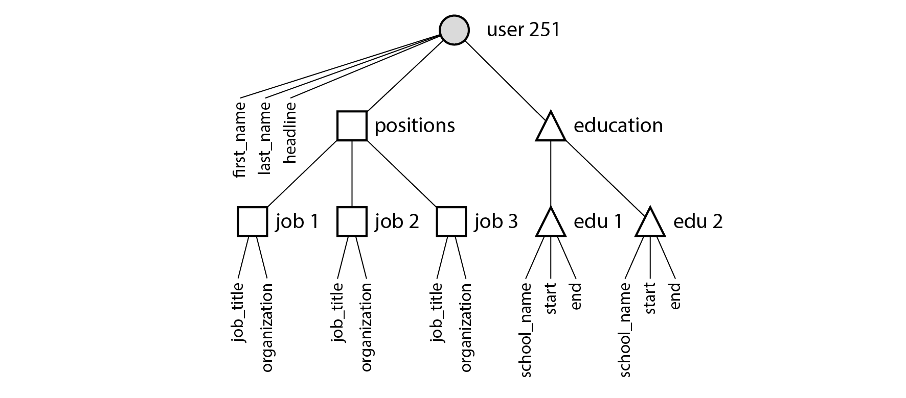
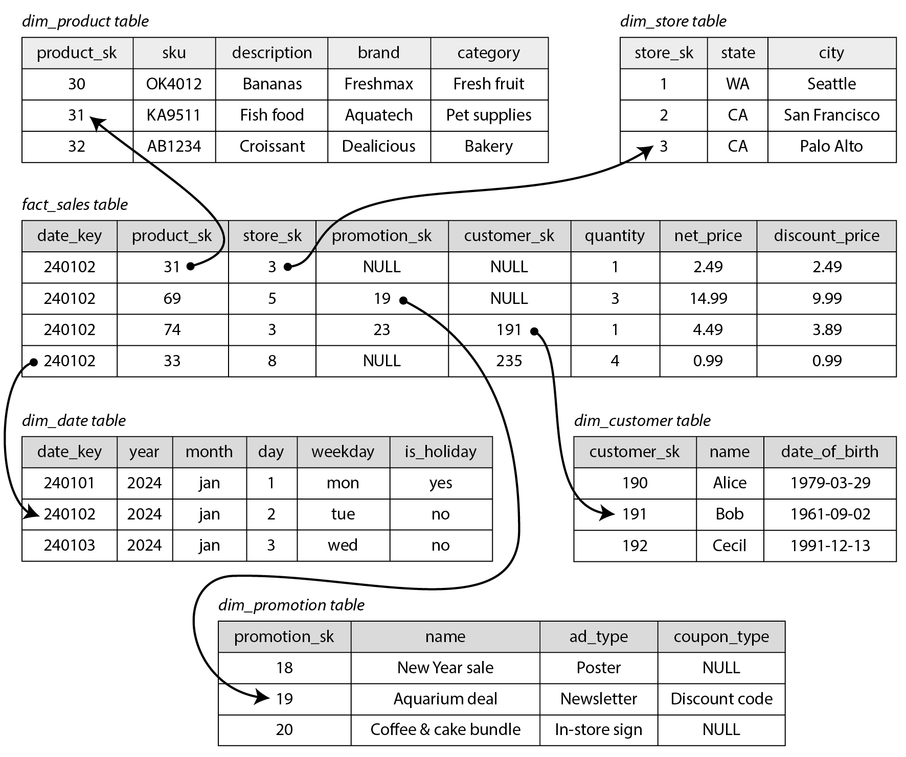

# 第三章：数据模型与查询语言

> 语言的边界就是思想的边界。
>
> —— 路德维奇・维特根斯坦，《逻辑哲学》（1922）


-------------------

[TOC]

数据模型可能是软件开发中最重要的部分了，因为它们的影响如此深远：不仅仅影响着软件的编写方式，而且影响着我们的 **解题思路**。

多数应用使用层层叠加的数据模型构建。对于每层数据模型的关键问题是：它是如何用低一层数据模型来 **表示** 的？例如：

1. 作为一名应用开发人员，你观察现实世界（里面有人员、组织、货物、行为、资金流向、传感器等），并采用对象或数据结构，以及操控那些数据结构的 API 来进行建模。那些结构通常是特定于应用程序的。
2. 当要存储那些数据结构时，你可以利用通用数据模型来表示它们，如 JSON 或 XML 文档、关系数据库中的表或图模型。
3. 数据库软件的工程师选定如何以内存、磁盘或网络上的字节来表示 JSON / XML/ 关系 / 图数据。这类表示形式使数据有可能以各种方式来查询，搜索，操纵和处理。
4. 在更低的层次上，硬件工程师已经想出了使用电流、光脉冲、磁场或者其他东西来表示字节的方法。

一个复杂的应用程序可能会有更多的中间层次，比如基于 API 的 API，不过基本思想仍然是一样的：每个层都通过提供一个明确的数据模型来隐藏更低层次中的复杂性。这些抽象允许不同的人群有效地协作（例如数据库厂商的工程师和使用数据库的应用程序开发人员）。

数据模型种类繁多，每个数据模型都带有如何使用的设想。有些用法很容易，有些则不支持如此；有些操作运行很快，有些则表现很差；有些数据转换非常自然，有些则很麻烦。

掌握一个数据模型需要花费很多精力（想想关系数据建模有多少本书）。即便只使用一个数据模型，不用操心其内部工作机制，构建软件也是非常困难的。然而，因为数据模型对上层软件的功能（能做什么，不能做什么）有着至深的影响，所以选择一个适合的数据模型是非常重要的。

在本章中，我们将研究一系列用于数据存储和查询的通用数据模型（前面列表中的第 2 点）。特别地，我们将比较关系模型，文档模型和少量基于图形的数据模型。我们还将查看各种查询语言并比较它们的用例。在 [第三章](ch3.md) 中，我们将讨论存储引擎是如何工作的。也就是说，这些数据模型实际上是如何实现的（列表中的第 3 点）。


----------

## 关系模型与文档模型

现在最著名的数据模型可能是 SQL。它基于 Edgar Codd 在 1970 年提出的关系模型【1】：数据被组织成 **关系**（SQL 中称作 **表**），其中每个关系是 **元组**（SQL 中称作 **行**) 的无序集合。

关系模型曾是一个理论性的提议，当时很多人都怀疑是否能够有效实现它。然而到了 20 世纪 80 年代中期，关系数据库管理系统（RDBMSes）和 SQL 已成为大多数人们存储和查询某些常规结构的数据的首选工具。关系数据库已经持续称霸了大约 25~30 年 —— 这对计算机史来说是极其漫长的时间。

关系数据库起源于商业数据处理，在 20 世纪 60 年代和 70 年代用大型计算机来执行。从今天的角度来看，那些用例显得很平常：典型的 **事务处理**（将销售或银行交易，航空公司预订，库存管理信息记录在库）和 **批处理**（客户发票，工资单，报告）。

当时的其他数据库迫使应用程序开发人员必须考虑数据库内部的数据表示形式。关系模型致力于将上述实现细节隐藏在更简洁的接口之后。

多年来，在数据存储和查询方面存在着许多相互竞争的方法。在 20 世纪 70 年代和 80 年代初，网状模型（network model）和层次模型（hierarchical model）曾是主要的选择，但关系模型（relational model）随后占据了主导地位。对象数据库在 20 世纪 80 年代末和 90 年代初来了又去。XML 数据库在二十一世纪初出现，但只有小众采用过。关系模型的每个竞争者都在其时代产生了大量的炒作，但从来没有持续【2】。

随着电脑越来越强大和互联，它们开始用于日益多样化的目的。关系数据库非常成功地被推广到业务数据处理的原始范围之外更为广泛的用例上。你今天在网上看到的大部分内容依旧是由关系数据库来提供支持，无论是在线发布、讨论、社交网络、电子商务、游戏、软件即服务生产力应用程序等内容。

### NoSQL 的诞生

现在 - 2010 年代，NoSQL 开始了最新一轮尝试，试图推翻关系模型的统治地位。“NoSQL” 这个名字让人遗憾，因为实际上它并没有涉及到任何特定的技术。最初它只是作为一个醒目的 Twitter 标签，用在 2009 年一个关于分布式，非关系数据库上的开源聚会上。无论如何，这个术语触动了某些神经，并迅速在网络创业社区内外传播开来。好些有趣的数据库系统现在都与 *#NoSQL* 标签相关联，并且 NoSQL 被追溯性地重新解释为 **不仅是 SQL（Not Only SQL）** 【4】。

采用 NoSQL 数据库的背后有几个驱动因素，其中包括：

* 需要比关系数据库更好的可伸缩性，包括非常大的数据集或非常高的写入吞吐量
* 相比商业数据库产品，免费和开源软件更受偏爱
* 关系模型不能很好地支持一些特殊的查询操作
* 受挫于关系模型的限制性，渴望一种更具多动态性与表现力的数据模型【5】

不同的应用程序有不同的需求，一个用例的最佳技术选择可能不同于另一个用例的最佳技术选择。因此，在可预见的未来，关系数据库似乎可能会继续与各种非关系数据库一起使用 - 这种想法有时也被称为 **混合持久化（polyglot persistence）**。

### 对象关系不匹配

目前大多数应用程序开发都使用面向对象的编程语言来开发，这导致了对 SQL 数据模型的普遍批评：如果数据存储在关系表中，那么需要一个笨拙的转换层，处于应用程序代码中的对象和表，行，列的数据库模型之间。模型之间的不连贯有时被称为 **阻抗不匹配（impedance mismatch）**[^i]。

[^i]: 一个从电子学借用的术语。每个电路的输入和输出都有一定的阻抗（交流电阻）。当你将一个电路的输出连接到另一个电路的输入时，如果两个电路的输出和输入阻抗匹配，则连接上的功率传输将被最大化。阻抗不匹配会导致信号反射及其他问题。

像 ActiveRecord 和 Hibernate 这样的 **对象关系映射（ORM object-relational mapping）** 框架可以减少这个转换层所需的样板代码的数量，但是它们不能完全隐藏这两个模型之间的差异。


**图 2-1 使用关系型模式来表示领英简介**

例如，[图 2-1](img/fig2-1.png) 展示了如何在关系模式中表示简历（一个 LinkedIn 简介）。整个简介可以通过一个唯一的标识符 `user_id` 来标识。像 `first_name` 和 `last_name` 这样的字段每个用户只出现一次，所以可以在 User 表上将其建模为列。但是，大多数人在职业生涯中拥有多于一份的工作，人们可能有不同样的教育阶段和任意数量的联系信息。从用户到这些项目之间存在一对多的关系，可以用多种方式来表示：

* 传统 SQL 模型（SQL：1999 之前）中，最常见的规范化表示形式是将职位，教育和联系信息放在单独的表中，对 User 表提供外键引用，如 [图 2-1](img/fig2-1.png) 所示。
* 后续的 SQL 标准增加了对结构化数据类型和 XML 数据的支持；这允许将多值数据存储在单行内，并支持在这些文档内查询和索引。这些功能在 Oracle，IBM DB2，MS SQL Server 和 PostgreSQL 中都有不同程度的支持【6,7】。JSON 数据类型也得到多个数据库的支持，包括 IBM DB2，MySQL 和 PostgreSQL 【8】。
* 第三种选择是将职业，教育和联系信息编码为 JSON 或 XML 文档，将其存储在数据库的文本列中，并让应用程序解析其结构和内容。这种配置下，通常不能使用数据库来查询该编码列中的值。

对于一个像简历这样自包含文档的数据结构而言，JSON 表示是非常合适的：请参阅 [例 2-1]()。JSON 比 XML 更简单。面向文档的数据库（如 MongoDB 【9】，RethinkDB 【10】，CouchDB 【11】和 Espresso【12】）支持这种数据模型。

**例 2-1. 用 JSON 文档表示一个 LinkedIn 简介**

```json
{
  "user_id": 251,
  "first_name": "Bill",
  "last_name": "Gates",
  "summary": "Co-chair of the Bill & Melinda Gates... Active blogger.",
  "region_id": "us:91",
  "industry_id": 131,
  "photo_url": "/p/7/000/253/05b/308dd6e.jpg",
  "positions": [
    {
      "job_title": "Co-chair",
      "organization": "Bill & Melinda Gates Foundation"
    },
    {
      "job_title": "Co-founder, Chairman",
      "organization": "Microsoft"
    }
  ],
  "education": [
    {
      "school_name": "Harvard University",
      "start": 1973,
      "end": 1975
    },
    {
      "school_name": "Lakeside School, Seattle",
      "start": null,
      "end": null
    }
  ],
  "contact_info": {
    "blog": "http://thegatesnotes.com",
    "twitter": "http://twitter.com/BillGates"
  }
}
```

有一些开发人员认为 JSON 模型减少了应用程序代码和存储层之间的阻抗不匹配。不过，正如我们将在 [第四章](ch4.md) 中看到的那样，JSON 作为数据编码格式也存在问题。无模式对 JSON 模型来说往往被认为是一个优势；我们将在 “[文档模型中的模式灵活性](#文档模型中的模式灵活性)” 中讨论这个问题。

JSON 表示比 [图 2-1](img/fig2-1.png) 中的多表模式具有更好的 **局部性（locality）**。如果在前面的关系型示例中获取简介，那需要执行多个查询（通过 `user_id` 查询每个表），或者在 User 表与其下属表之间混乱地执行多路连接。而在 JSON 表示中，所有相关信息都在同一个地方，一个查询就足够了。

从用户简介文件到用户职位，教育历史和联系信息，这种一对多关系隐含了数据中的一个树状结构，而 JSON 表示使得这个树状结构变得明确（见 [图 2-2](img/fig2-2.png)）。


**图 2-2 一对多关系构建了一个树结构**

### 多对一和多对多的关系

在上一节的 [例 2-1]() 中，`region_id` 和 `industry_id` 是以 ID，而不是纯字符串 “Greater Seattle Area” 和 “Philanthropy” 的形式给出的。为什么？

如果用户界面用一个自由文本字段来输入区域和行业，那么将他们存储为纯文本字符串是合理的。另一方式是给出地理区域和行业的标准化的列表，并让用户从下拉列表或自动填充器中进行选择，其优势如下：

* 各个简介之间样式和拼写统一
* 避免歧义（例如，如果有几个同名的城市）
* 易于更新 —— 名称只存储在一个地方，如果需要更改（例如，由于政治事件而改变城市名称），很容易进行全面更新。
* 本地化支持 —— 当网站翻译成其他语言时，标准化的列表可以被本地化，使得地区和行业可以使用用户的语言来显示
* 更好的搜索 —— 例如，搜索华盛顿州的慈善家就会匹配这份简介，因为地区列表可以编码记录西雅图在华盛顿这一事实（从 “Greater Seattle Area” 这个字符串中看不出来）

存储 ID 还是文本字符串，这是个 **副本（duplication）** 问题。当使用 ID 时，对人类有意义的信息（比如单词：Philanthropy）只存储在一处，所有引用它的地方使用 ID（ID 只在数据库中有意义）。当直接存储文本时，对人类有意义的信息会复制在每处使用记录中。

使用 ID 的好处是，ID 对人类没有任何意义，因而永远不需要改变：ID 可以保持不变，即使它标识的信息发生变化。任何对人类有意义的东西都可能需要在将来某个时候改变 —— 如果这些信息被复制，所有的冗余副本都需要更新。这会导致写入开销，也存在不一致的风险（一些副本被更新了，还有些副本没有被更新）。去除此类重复是数据库 **规范化（normalization）** 的关键思想。[^ii]

[^ii]: 关于关系模型的文献区分了几种不同的规范形式，但这些区别几乎没有实际意义。一个经验法则是，如果重复存储了可以存储在一个地方的值，则模式就不是 **规范化（normalized）** 的。

> 数据库管理员和开发人员喜欢争论规范化和非规范化，让我们暂时保留判断吧。在本书的 [第三部分](part-iii.md)，我们将回到这个话题，探讨系统的方法用以处理缓存，非规范化和衍生数据。

不幸的是，对这些数据进行规范化需要多对一的关系（许多人生活在一个特定的地区，许多人在一个特定的行业工作），这与文档模型不太吻合。在关系数据库中，通过 ID 来引用其他表中的行是正常的，因为连接很容易。在文档数据库中，一对多树结构没有必要用连接，对连接的支持通常很弱 [^iii]。

[^iii]: 在撰写本文时，RethinkDB 支持连接，MongoDB 不支持连接，而 CouchDB 只支持预先声明的视图。

如果数据库本身不支持连接，则必须在应用程序代码中通过对数据库进行多个查询来模拟连接。（在这种情况中，地区和行业的列表可能很小，改动很少，应用程序可以简单地将其保存在内存中。不过，执行连接的工作从数据库被转移到应用程序代码上。）

此外，即便应用程序的最初版本适合无连接的文档模型，随着功能添加到应用程序中，数据会变得更加互联。例如，考虑一下对简历例子进行的一些修改：

* 组织和学校作为实体

  在前面的描述中，`organization`（用户工作的公司）和 `school_name`（他们学习的地方）只是字符串。也许他们应该是对实体的引用呢？然后，每个组织、学校或大学都可以拥有自己的网页（标识、新闻提要等）。每个简历可以链接到它所提到的组织和学校，并且包括他们的图标和其他信息（请参阅 [图 2-3](img/fig2-3.png)，来自 LinkedIn 的一个例子）。

* 推荐

  假设你想添加一个新的功能：一个用户可以为另一个用户写一个推荐。在用户的简历上显示推荐，并附上推荐用户的姓名和照片。如果推荐人更新他们的照片，那他们写的任何推荐都需要显示新的照片。因此，推荐应该拥有作者个人简介的引用。


**图 2-3 公司名不仅是字符串，还是一个指向公司实体的链接（LinkedIn 截图）**

[图 2-4](img/fig2-4.png) 阐明了这些新功能需要如何使用多对多关系。每个虚线矩形内的数据可以分组成一个文档，但是对单位，学校和其他用户的引用需要表示成引用，并且在查询时需要连接。


**图 2-4 使用多对多关系扩展简历**

### 文档数据库是否在重蹈覆辙？

在多对多的关系和连接已常规用在关系数据库时，文档数据库和 NoSQL 重启了辩论：如何以最佳方式在数据库中表示多对多关系。那场辩论可比 NoSQL 古老得多，事实上，最早可以追溯到计算机化数据库系统。

20 世纪 70 年代最受欢迎的业务数据处理数据库是 IBM 的信息管理系统（IMS），最初是为了阿波罗太空计划的库存管理而开发的，并于 1968 年有了首次商业发布【13】。目前它仍在使用和维护，运行在 IBM 大型机的 OS/390 上【14】。

IMS 的设计中使用了一个相当简单的数据模型，称为 **层次模型（hierarchical model）**，它与文档数据库使用的 JSON 模型有一些惊人的相似之处【2】。它将所有数据表示为嵌套在记录中的记录树，这很像 [图 2-2](img/fig2-2.png) 的 JSON 结构。

同文档数据库一样，IMS 能良好处理一对多的关系，但是很难应对多对多的关系，并且不支持连接。开发人员必须决定是否复制（非规范化）数据或手动解决从一个记录到另一个记录的引用。这些二十世纪六七十年代的问题与现在开发人员遇到的文档数据库问题非常相似【15】。

那时人们提出了各种不同的解决方案来解决层次模型的局限性。其中最突出的两个是 **关系模型**（relational model，它变成了 SQL，并统治了世界）和 **网状模型**（network model，最初很受关注，但最终变得冷门）。这两个阵营之间的 “大辩论” 在 70 年代持续了很久时间【2】。

那两个模式解决的问题与当前的问题相关，因此值得简要回顾一下那场辩论。

#### 网状模型

网状模型由一个称为数据系统语言会议（CODASYL）的委员会进行了标准化，并被数个不同的数据库厂商实现；它也被称为 CODASYL 模型【16】。

CODASYL 模型是层次模型的推广。在层次模型的树结构中，每条记录只有一个父节点；在网络模式中，每条记录可能有多个父节点。例如，“Greater Seattle Area” 地区可能是一条记录，每个居住在该地区的用户都可以与之相关联。这允许对多对一和多对多的关系进行建模。

网状模型中记录之间的链接不是外键，而更像编程语言中的指针（同时仍然存储在磁盘上）。访问记录的唯一方法是跟随从根记录起沿这些链路所形成的路径。这被称为 **访问路径（access path）**。

最简单的情况下，访问路径类似遍历链表：从列表头开始，每次查看一条记录，直到找到所需的记录。但在多对多关系的情况中，数条不同的路径可以到达相同的记录，网状模型的程序员必须跟踪这些不同的访问路径。

CODASYL 中的查询是通过利用遍历记录列和跟随访问路径表在数据库中移动游标来执行的。如果记录有多个父结点（即多个来自其他记录的传入指针），则应用程序代码必须跟踪所有的各种关系。甚至 CODASYL 委员会成员也承认，这就像在 n 维数据空间中进行导航【17】。

尽管手动选择访问路径能够最有效地利用 20 世纪 70 年代非常有限的硬件功能（如磁带驱动器，其搜索速度非常慢），但这使得查询和更新数据库的代码变得复杂不灵活。无论是分层还是网状模型，如果你没有所需数据的路径，就会陷入困境。你可以改变访问路径，但是必须浏览大量手写数据库查询代码，并重写来处理新的访问路径。更改应用程序的数据模型是很难的。

#### 关系模型

相比之下，关系模型做的就是将所有的数据放在光天化日之下：一个 **关系（表）** 只是一个 **元组（行）** 的集合，仅此而已。如果你想读取数据，它没有迷宫似的嵌套结构，也没有复杂的访问路径。你可以选中符合任意条件的行，读取表中的任何或所有行。你可以通过指定某些列作为匹配关键字来读取特定行。你可以在任何表中插入一个新的行，而不必担心与其他表的外键关系 [^iv]。

[^iv]: 外键约束允许对修改进行限制，但对于关系模型这并不是必选项。即使有约束，外键连接在查询时执行，而在 CODASYL 中，连接在插入时高效完成。

在关系数据库中，查询优化器自动决定查询的哪些部分以哪个顺序执行，以及使用哪些索引。这些选择实际上是 “访问路径”，但最大的区别在于它们是由查询优化器自动生成的，而不是由程序员生成，所以我们很少需要考虑它们。

如果想按新的方式查询数据，你可以声明一个新的索引，查询会自动使用最合适的那些索引。无需更改查询来利用新的索引（请参阅 “[数据查询语言](#数据查询语言)”）。关系模型因此使添加应用程序新功能变得更加容易。

关系数据库的查询优化器是复杂的，已耗费了多年的研究和开发精力【18】。关系模型的一个关键洞察是：只需构建一次查询优化器，随后使用该数据库的所有应用程序都可以从中受益。如果你没有查询优化器的话，那么为特定查询手动编写访问路径比编写通用优化器更容易 —— 不过从长期看通用解决方案更好。

#### 与文档数据库相比

在一个方面，文档数据库还原为层次模型：在其父记录中存储嵌套记录（[图 2-1](img/fig2-1.png) 中的一对多关系，如 `positions`，`education` 和 `contact_info`），而不是在单独的表中。

但是，在表示多对一和多对多的关系时，关系数据库和文档数据库并没有根本的不同：在这两种情况下，相关项目都被一个唯一的标识符引用，这个标识符在关系模型中被称为 **外键**，在文档模型中称为 **文档引用**【9】。该标识符在读取时通过连接或后续查询来解析。迄今为止，文档数据库没有走 CODASYL 的老路。

### 关系型数据库与文档数据库在今日的对比

将关系数据库与文档数据库进行比较时，可以考虑许多方面的差异，包括它们的容错属性（请参阅 [第五章](ch5.md)）和处理并发性（请参阅 [第七章](ch7.md)）。本章将只关注数据模型中的差异。

支持文档数据模型的主要论据是架构灵活性，因局部性而拥有更好的性能，以及对于某些应用程序而言更接近于应用程序使用的数据结构。关系模型通过为连接提供更好的支持以及支持多对一和多对多的关系来反击。

#### 哪种数据模型更有助于简化应用代码？

如果应用程序中的数据具有类似文档的结构（即，一对多关系树，通常一次性加载整个树），那么使用文档模型可能是一个好主意。将类似文档的结构分解成多个表（如 [图 2-1](img/fig2-1.png) 中的 `positions`、`education` 和 `contact_info`）的关系技术可能导致繁琐的模式和不必要的复杂的应用程序代码。

文档模型有一定的局限性：例如，不能直接引用文档中的嵌套的项目，而是需要说 “用户 251 的位置列表中的第二项”（很像层次模型中的访问路径）。但是，只要文件嵌套不太深，这通常不是问题。

文档数据库对连接的糟糕支持可能是个问题，也可能不是问题，这取决于应用程序。例如，如果某分析型应用程序使用一个文档数据库来记录何时何地发生了何事，那么多对多关系可能永远也用不上。【19】。

但如果你的应用程序确实会用到多对多关系，那么文档模型就没有那么诱人了。尽管可以通过反规范化来消除对连接的需求，但这需要应用程序代码来做额外的工作以确保数据一致性。尽管应用程序代码可以通过向数据库发出多个请求的方式来模拟连接，但这也将复杂性转移到应用程序中，而且通常也会比由数据库内的专用代码更慢。在这种情况下，使用文档模型可能会导致更复杂的应用代码与更差的性能【15】。

我们没有办法说哪种数据模型更有助于简化应用代码，因为它取决于数据项之间的关系种类。对高度关联的数据而言，文档模型是极其糟糕的，关系模型是可以接受的，而选用图形模型（请参阅 “[图数据模型](#图数据模型)”）是最自然的。

#### 文档模型中的模式灵活性

大多数文档数据库以及关系数据库中的 JSON 支持都不会强制文档中的数据采用何种模式。关系数据库的 XML 支持通常带有可选的模式验证。没有模式意味着可以将任意的键和值添加到文档中，并且当读取时，客户端无法保证文档可能包含的字段。

文档数据库有时称为 **无模式（schemaless）**，但这具有误导性，因为读取数据的代码通常假定某种结构 —— 即存在隐式模式，但不由数据库强制执行【20】。一个更精确的术语是 **读时模式**（即 schema-on-read，数据的结构是隐含的，只有在数据被读取时才被解释），相应的是 **写时模式**（即 schema-on-write，传统的关系数据库方法中，模式明确，且数据库确保所有的数据都符合其模式）【21】。

读时模式类似于编程语言中的动态（运行时）类型检查，而写时模式类似于静态（编译时）类型检查。就像静态和动态类型检查的相对优点具有很大的争议性一样【22】，数据库中模式的强制性是一个具有争议的话题，一般来说没有正确或错误的答案。

在应用程序想要改变其数据格式的情况下，这些方法之间的区别尤其明显。例如，假设你把每个用户的全名存储在一个字段中，而现在想分别存储名字和姓氏【23】。在文档数据库中，只需开始写入具有新字段的新文档，并在应用程序中使用代码来处理读取旧文档的情况。例如：

```go
if (user && user.name && !user.first_name) {
  // Documents written before Dec 8, 2013 don't have first_name
  user.first_name = user.name.split(" ")[0];
}
```

另一方面，在 “静态类型” 数据库模式中，通常会执行以下 **迁移（migration）** 操作：

```sql
ALTER TABLE users ADD COLUMN first_name text;
UPDATE users SET first_name = split_part(name, ' ', 1);      -- PostgreSQL
UPDATE users SET first_name = substring_index(name, ' ', 1);      -- MySQL
```

模式变更的速度很慢，而且要求停运。它的这种坏名誉并不是完全应得的：大多数关系数据库系统可在几毫秒内执行 `ALTER TABLE` 语句。MySQL 是一个值得注意的例外，它执行 `ALTER TABLE` 时会复制整个表，这可能意味着在更改一个大型表时会花费几分钟甚至几个小时的停机时间，尽管存在各种工具来解决这个限制【24,25,26】。

大型表上运行 `UPDATE` 语句在任何数据库上都可能会很慢，因为每一行都需要重写。要是不可接受的话，应用程序可以将 `first_name` 设置为默认值 `NULL`，并在读取时再填充，就像使用文档数据库一样。

当由于某种原因（例如，数据是异构的）集合中的项目并不都具有相同的结构时，读时模式更具优势。例如，如果：

* 存在许多不同类型的对象，将每种类型的对象放在自己的表中是不现实的。
* 数据的结构由外部系统决定。你无法控制外部系统且它随时可能变化。

在上述情况下，模式的坏处远大于它的帮助，无模式文档可能是一个更加自然的数据模型。但是，要是所有记录都具有相同的结构，那么模式是记录并强制这种结构的有效机制。第四章将更详细地讨论模式和模式演化。

#### 查询的数据局部性

文档通常以单个连续字符串形式进行存储，编码为 JSON、XML 或其二进制变体（如 MongoDB 的 BSON）。如果应用程序经常需要访问整个文档（例如，将其渲染至网页），那么存储局部性会带来性能优势。如果将数据分割到多个表中（如 [图 2-1](img/fig2-1.png) 所示），则需要进行多次索引查找才能将其全部检索出来，这可能需要更多的磁盘查找并花费更多的时间。

局部性仅仅适用于同时需要文档绝大部分内容的情况。即使只访问文档其中的一小部分，数据库通常需要加载整个文档，对于大型文档来说这种加载行为是很浪费的。更新文档时，通常需要整个重写。只有不改变文档大小的修改才可以容易地原地执行。因此，通常建议保持相对小的文档，并避免增加文档大小的写入【9】。这些性能限制大大减少了文档数据库的实用场景。

值得指出的是，为了局部性而分组集合相关数据的想法并不局限于文档模型。例如，Google 的 Spanner 数据库在关系数据模型中提供了同样的局部性属性，允许模式声明一个表的行应该交错（嵌套）在父表内【27】。Oracle 类似地允许使用一个称为 **多表索引集群表（multi-table index cluster tables）** 的类似特性【28】。Bigtable 数据模型（用于 Cassandra 和 HBase）中的 **列族（column-family）** 概念与管理局部性的目的类似【29】。

在 [第三章](ch3.md) 将还会看到更多关于局部性的内容。

#### 文档和关系数据库的融合

自 2000 年代中期以来，大多数关系数据库系统（MySQL 除外）都已支持 XML。这包括对 XML 文档进行本地修改的功能，以及在 XML 文档中进行索引和查询的功能。这允许应用程序使用那种与文档数据库应当使用的非常类似的数据模型。

从 9.3 版本开始的 PostgreSQL 【8】，从 5.7 版本开始的 MySQL 以及从版本 10.5 开始的 IBM DB2【30】也对 JSON 文档提供了类似的支持级别。鉴于用在 Web APIs 的 JSON 流行趋势，其他关系数据库很可能会跟随他们的脚步并添加 JSON 支持。

在文档数据库中，RethinkDB 在其查询语言中支持类似关系的连接，一些 MongoDB 驱动程序可以自动解析数据库引用（有效地执行客户端连接，尽管这可能比在数据库中执行的连接慢，需要额外的网络往返，并且优化更少）。

随着时间的推移，关系数据库和文档数据库似乎变得越来越相似，这是一件好事：数据模型相互补充 [^v]，如果一个数据库能够处理类似文档的数据，并能够对其执行关系查询，那么应用程序就可以使用最符合其需求的功能组合。

关系模型和文档模型的混合是未来数据库一条很好的路线。

[^v]: Codd 对关系模型【1】的原始描述实际上允许在关系模式中与 JSON 文档非常相似。他称之为 **非简单域（nonsimple domains）**。这个想法是，一行中的值不一定是一个像数字或字符串一样的原始数据类型，也可以是一个嵌套的关系（表），因此可以把一个任意嵌套的树结构作为一个值，这很像 30 年后添加到 SQL 中的 JSON 或 XML 支持。


## 数据查询语言

当引入关系模型时，关系模型包含了一种查询数据的新方法：SQL 是一种 **声明式** 查询语言，而 IMS 和 CODASYL 使用 **命令式** 代码来查询数据库。那是什么意思？

许多常用的编程语言是命令式的。例如，给定一个动物物种的列表，返回列表中的鲨鱼可以这样写：

```js
function getSharks() {
    var sharks = [];
    for (var i = 0; i < animals.length; i++) {
        if (animals[i].family === "Sharks") {
            sharks.push(animals[i]);
        }
    }
    return sharks;
}
```

而在关系代数中，你可以这样写：

$$
sharks = \sigma_{family = "sharks"}(animals)
$$

其中 $\sigma$（希腊字母西格玛）是选择操作符，只返回符合 `family="shark"` 条件的动物。

定义 SQL 时，它紧密地遵循关系代数的结构：

```sql
SELECT * FROM animals WHERE family ='Sharks';
```

命令式语言告诉计算机以特定顺序执行某些操作。可以想象一下，逐行地遍历代码，评估条件，更新变量，并决定是否再循环一遍。

在声明式查询语言（如 SQL 或关系代数）中，你只需指定所需数据的模式 - 结果必须符合哪些条件，以及如何将数据转换（例如，排序，分组和集合） - 但不是如何实现这一目标。数据库系统的查询优化器决定使用哪些索引和哪些连接方法，以及以何种顺序执行查询的各个部分。

声明式查询语言是迷人的，因为它通常比命令式 API 更加简洁和容易。但更重要的是，它还隐藏了数据库引擎的实现细节，这使得数据库系统可以在无需对查询做任何更改的情况下进行性能提升。

例如，在本节开头所示的命令代码中，动物列表以特定顺序出现。如果数据库想要在后台回收未使用的磁盘空间，则可能需要移动记录，这会改变动物出现的顺序。数据库能否安全地执行，而不会中断查询？

SQL 示例不确保任何特定的顺序，因此不在意顺序是否改变。但是如果查询用命令式的代码来写的话，那么数据库就永远不可能确定代码是否依赖于排序。SQL 相当有限的功能性为数据库提供了更多自动优化的空间。

最后，声明式语言往往适合并行执行。现在，CPU 的速度通过核心（core）的增加变得更快，而不是以比以前更高的时钟速度运行【31】。命令代码很难在多个核心和多个机器之间并行化，因为它指定了指令必须以特定顺序执行。声明式语言更具有并行执行的潜力，因为它们仅指定结果的模式，而不指定用于确定结果的算法。在适当情况下，数据库可以自由使用查询语言的并行实现【32】。

### Web 上的声明式查询

声明式查询语言的优势不仅限于数据库。为了说明这一点，让我们在一个完全不同的环境中比较声明式和命令式方法：一个 Web 浏览器。

假设你有一个关于海洋动物的网站。用户当前正在查看鲨鱼页面，因此你将当前所选的导航项目 “鲨鱼” 标记为当前选中项目。

```html
<ul>
    <li class="selected">
        <p>Sharks</p>
        <ul>
            <li>Great White Shark</li>
            <li>Tiger Shark</li>
            <li>Hammerhead Shark</li>
        </ul>
    </li>
    <li><p>Whales</p>
        <ul>
            <li>Blue Whale</li>
            <li>Humpback Whale</li>
            <li>Fin Whale</li>
        </ul>
    </li>
</ul>
```

现在想让当前所选页面的标题具有一个蓝色的背景，以便在视觉上突出显示。使用 CSS 实现起来非常简单：

```css
li.selected > p {
  background-color: blue;
}
```

这里的 CSS 选择器 `li.selected > p` 声明了我们想要应用蓝色样式的元素的模式：即其直接父元素是具有 CSS 类 `selected` 的 `<li>` 元素的所有 `<p>` 元素。示例中的元素 `<p>Sharks</p>` 匹配此模式，但 `<p>Whales</p>` 不匹配，因为其 `<li>` 父元素缺少 `class="selected"`。

如果使用 XSL 而不是 CSS，你可以做类似的事情：

```xml
<xsl:template match="li[@class='selected']/p">
    <fo:block background-color="blue">
        <xsl:apply-templates/>
    </fo:block>
</xsl:template>
```

这里的 XPath 表达式 `li[@class='selected']/p` 相当于上例中的 CSS 选择器 `li.selected > p`。CSS 和 XSL 的共同之处在于，它们都是用于指定文档样式的声明式语言。

想象一下，必须使用命令式方法的情况会是如何。在 Javascript 中，使用 **文档对象模型（DOM）** API，其结果可能如下所示：

```js
var liElements = document.getElementsByTagName("li");
for (var i = 0; i < liElements.length; i++) {
    if (liElements[i].className === "selected") {
        var children = liElements[i].childNodes;
        for (var j = 0; j < children.length; j++) {
            var child = children[j];
            if (child.nodeType === Node.ELEMENT_NODE && child.tagName === "P") {
                child.setAttribute("style", "background-color: blue");
            }
        }
    }
}
```

这段 JavaScript 代码命令式地将元素设置为蓝色背景，但是代码看起来很糟糕。不仅比 CSS 和 XSL 等价物更长，更难理解，而且还有一些严重的问题：

* 如果选定的类被移除（例如，因为用户点击了不同的页面），即使代码重新运行，蓝色背景也不会被移除 - 因此该项目将保持突出显示，直到整个页面被重新加载。使用 CSS，浏览器会自动检测 `li.selected > p` 规则何时不再适用，并在选定的类被移除后立即移除蓝色背景。

* 如果你想要利用新的 API（例如 `document.getElementsByClassName("selected")` 甚至 `document.evaluate()`）来提高性能，则必须重写代码。另一方面，浏览器供应商可以在不破坏兼容性的情况下提高 CSS 和 XPath 的性能。

在 Web 浏览器中，使用声明式 CSS 样式比使用 JavaScript 命令式地操作样式要好得多。类似地，在数据库中，使用像 SQL 这样的声明式查询语言比使用命令式查询 API 要好得多 [^vi]。

[^vi]: IMS 和 CODASYL 都使用命令式 API。应用程序通常使用 COBOL 代码遍历数据库中的记录，一次一条记录【2,16】。

### MapReduce查询

MapReduce 是一个由 Google 推广的编程模型，用于在多台机器上批量处理大规模的数据【33】。一些 NoSQL 数据存储（包括 MongoDB 和 CouchDB）支持有限形式的 MapReduce，作为在多个文档中执行只读查询的机制。

关于 MapReduce 更详细的介绍在 [第十章](ch10.md)。现在我们只简要讨论一下 MongoDB 使用的模型。

MapReduce 既不是一个声明式的查询语言，也不是一个完全命令式的查询 API，而是处于两者之间：查询的逻辑用代码片段来表示，这些代码片段会被处理框架重复性调用。它基于 `map`（也称为 `collect`）和 `reduce`（也称为 `fold` 或 `inject`）函数，两个函数存在于许多函数式编程语言中。

最好举例来解释 MapReduce 模型。假设你是一名海洋生物学家，每当你看到海洋中的动物时，你都会在数据库中添加一条观察记录。现在你想生成一个报告，说明你每月看到多少鲨鱼。

在 PostgreSQL 中，你可以像这样表述这个查询：

```sql
SELECT
  date_trunc('month', observation_timestamp) AS observation_month,
  sum(num_animals)                           AS total_animals
FROM observations
WHERE family = 'Sharks'
GROUP BY observation_month;
```

`date_trunc('month'，timestamp)` 函数用于确定包含 `timestamp` 的日历月份，并返回代表该月份开始的另一个时间戳。换句话说，它将时间戳舍入成最近的月份。

这个查询首先过滤观察记录，以只显示鲨鱼家族的物种，然后根据它们发生的日历月份对观察记录果进行分组，最后将在该月的所有观察记录中看到的动物数目加起来。

同样的查询用 MongoDB 的 MapReduce 功能可以按如下来表述：

```js
db.observations.mapReduce(function map() {
        var year = this.observationTimestamp.getFullYear();
        var month = this.observationTimestamp.getMonth() + 1;
        emit(year + "-" + month, this.numAnimals);
    },
    function reduce(key, values) {
        return Array.sum(values);
    },
    {
        query: {
          family: "Sharks"
        },
        out: "monthlySharkReport"
    });
```

* 可以声明式地指定一个只考虑鲨鱼种类的过滤器（这是 MongoDB 特定的 MapReduce 扩展）。
* 每个匹配查询的文档都会调用一次 JavaScript 函数 `map`，将 `this` 设置为文档对象。
* `map` 函数发出一个键（包括年份和月份的字符串，如 `"2013-12"` 或 `"2014-1"`）和一个值（该观察记录中的动物数量）。
* `map` 发出的键值对按键来分组。对于具有相同键（即，相同的月份和年份）的所有键值对，调用一次 `reduce` 函数。
* `reduce` 函数将特定月份内所有观测记录中的动物数量相加。
* 将最终的输出写入到 `monthlySharkReport` 集合中。

例如，假设 `observations` 集合包含这两个文档：

```json
{
  observationTimestamp: Date.parse(  "Mon, 25 Dec 1995 12:34:56 GMT"),
  family: "Sharks",
  species: "Carcharodon carcharias",
  numAnimals: 3
}
{
  observationTimestamp: Date.parse("Tue, 12 Dec 1995 16:17:18 GMT"),
  family: "Sharks",
  species:    "Carcharias taurus",
  numAnimals: 4
}
```

对每个文档都会调用一次 `map` 函数，结果将是 `emit("1995-12",3)` 和 `emit("1995-12",4)`。随后，以 `reduce("1995-12",[3,4])` 调用 `reduce` 函数，将返回 `7`。

map 和 reduce 函数在功能上有所限制：它们必须是 **纯** 函数，这意味着它们只使用传递给它们的数据作为输入，它们不能执行额外的数据库查询，也不能有任何副作用。这些限制允许数据库以任何顺序运行任何功能，并在失败时重新运行它们。然而，map 和 reduce 函数仍然是强大的：它们可以解析字符串、调用库函数、执行计算等等。

MapReduce 是一个相当底层的编程模型，用于计算机集群上的分布式执行。像 SQL 这样的更高级的查询语言可以用一系列的 MapReduce 操作来实现（见 [第十章](ch10.md)），但是也有很多不使用 MapReduce 的分布式 SQL 实现。須注意，SQL 并没有限制它只能在单一机器上运行，而 MapReduce 也并没有垄断所有的分布式查询执行。

能够在查询中使用 JavaScript 代码是高级查询的一个重要特性，但这不限于 MapReduce，一些 SQL 数据库也可以用 JavaScript 函数进行扩展【34】。

MapReduce 的一个可用性问题是，必须编写两个密切合作的 JavaScript 函数，这通常比编写单个查询更困难。此外，声明式查询语言为查询优化器提供了更多机会来提高查询的性能。基于这些原因，MongoDB 2.2 添加了一种叫做 **聚合管道** 的声明式查询语言的支持【9】。用这种语言表述鲨鱼计数查询如下所示：

```js
db.observations.aggregate([
  { $match: { family: "Sharks" } },
  { $group: {
    _id: {
      year:  { $year:  "$observationTimestamp" },
      month: { $month: "$observationTimestamp" }
    },
    totalAnimals: { $sum: "$numAnimals" } }}
]);
```

聚合管道语言的表现力与（前述 PostgreSQL 例子的）SQL 子集相当，但是它使用基于 JSON 的语法而不是 SQL 那种接近英文句式的语法；这种差异也许只是口味问题。这个故事的寓意是：NoSQL 系统可能会意外发现自己只是重新发明了一套经过乔装改扮的 SQL。


## 图数据模型

如我们之前所见，多对多关系是不同数据模型之间具有区别性的重要特征。如果你的应用程序大多数的关系是一对多关系（树状结构化数据），或者大多数记录之间不存在关系，那么使用文档模型是合适的。

但是，要是多对多关系在你的数据中很常见呢？关系模型可以处理多对多关系的简单情况，但是随着数据之间的连接变得更加复杂，将数据建模为图形显得更加自然。

一个图由两种对象组成：**顶点**（vertices，也称为 **节点**，即 nodes，或 **实体**，即 entities），和 **边**（edges，也称为 **关系**，即 relationships，或 **弧**，即 arcs）。多种数据可以被建模为一个图形。典型的例子包括：

* 社交图谱

  顶点是人，边指示哪些人彼此认识。

* 网络图谱

  顶点是网页，边缘表示指向其他页面的 HTML 链接。

* 公路或铁路网络

  顶点是交叉路口，边线代表它们之间的道路或铁路线。

可以将那些众所周知的算法运用到这些图上：例如，汽车导航系统搜索道路网络中两点之间的最短路径，PageRank 可以用在网络图上来确定网页的流行程度，从而确定该网页在搜索结果中的排名。

在刚刚给出的例子中，图中的所有顶点代表了相同类型的事物（人、网页或交叉路口）。不过，图并不局限于这样的同类数据：同样强大地是，图提供了一种一致的方式，用来在单个数据存储中存储完全不同类型的对象。例如，Facebook 维护一个包含许多不同类型的顶点和边的单个图：顶点表示人、地点、事件、签到和用户的评论；边表示哪些人是好友、签到发生在哪里、谁评论了什么帖子、谁参与了什么事件等等【35】。

在本节中，我们将使用 [图 2-5](img/fig2-5.png) 所示的示例。它可以从社交网络或系谱数据库中获得：它显示了两个人，来自爱达荷州的 Lucy 和来自法国 Beaune 的 Alain。他们已婚，住在伦敦。


**图 2-5 图数据结构示例（框代表顶点，箭头代表边）**

有几种不同但相关的方法用来构建和查询图表中的数据。在本节中，我们将讨论属性图模型（由 Neo4j，Titan 和 InfiniteGraph 实现）和三元组存储（triple-store）模型（由 Datomic、AllegroGraph 等实现）。我们将查看图的三种声明式查询语言：Cypher，SPARQL 和 Datalog。除此之外，还有像 Gremlin 【36】这样的图形查询语言和像 Pregel 这样的图形处理框架（见 [第十章](ch10.md)）。

### 属性图

在属性图模型中，每个顶点（vertex）包括：

* 唯一的标识符
* 一组出边（outgoing edges）
* 一组入边（ingoing edges）
* 一组属性（键值对）

每条边（edge）包括：

* 唯一标识符
* 边的起点（**尾部顶点**，即 tail vertex）
* 边的终点（**头部顶点**，即 head vertex）
* 描述两个顶点之间关系类型的标签
* 一组属性（键值对）

可以将图存储看作由两个关系表组成：一个存储顶点，另一个存储边，如 [例 2-2]() 所示（该模式使用 PostgreSQL JSON 数据类型来存储每个顶点或每条边的属性）。头部和尾部顶点用来存储每条边；如果你想要一组顶点的输入或输出边，你可以分别通过 `head_vertex` 或 `tail_vertex` 来查询 `edges` 表。

**例 2-2 使用关系模式来表示属性图**

```sql
CREATE TABLE vertices (
  vertex_id  INTEGER PRIMARY KEY,
  properties JSON
);

CREATE TABLE edges (
  edge_id     INTEGER PRIMARY KEY,
  tail_vertex INTEGER REFERENCES vertices (vertex_id),
  head_vertex INTEGER REFERENCES vertices (vertex_id),
  label       TEXT,
  properties  JSON
);

CREATE INDEX edges_tails ON edges (tail_vertex);
CREATE INDEX edges_heads ON edges (head_vertex);
```

关于这个模型的一些重要方面是：

1. 任何顶点都可以有一条边连接到任何其他顶点。没有模式限制哪种事物可不可以关联。
2. 给定任何顶点，可以高效地找到它的入边和出边，从而遍历图，即沿着一系列顶点的路径前后移动（这就是为什么 [例 2-2]() 在 `tail_vertex` 和 `head_vertex` 列上都有索引的原因）。
3. 通过对不同类型的关系使用不同的标签，可以在一个图中存储几种不同的信息，同时仍然保持一个清晰的数据模型。

这些特性为数据建模提供了很大的灵活性，如 [图 2-5](img/fig2-5.png) 所示。图中显示了一些传统关系模式难以表达的事情，例如不同国家的不同地区结构（法国有省和大区，美国有县和州），国中国的怪事（先忽略主权国家和民族错综复杂的烂摊子），不同的数据粒度（Lucy 现在的住所记录具体到城市，而她的出生地点只是在一个州的级别）。

你可以想象该图还能延伸出许多关于 Lucy 和 Alain 的事实，或其他人的其他更多的事实。例如，你可以用它来表示食物过敏（为每个过敏源增加一个顶点，并增加人与过敏源之间的一条边来指示一种过敏情况），并链接到过敏源，每个过敏源具有一组顶点用来显示哪些食物含有哪些物质。然后，你可以写一个查询，找出每个人吃什么是安全的。图在可演化性方面是富有优势的：当你向应用程序添加功能时，可以轻松扩展图以适应程序数据结构的变化。

### Cypher 查询语言

Cypher 是属性图的声明式查询语言，为 Neo4j 图形数据库而发明【37】（它是以电影 “黑客帝国” 中的一个角色来命名的，而与密码学中的加密算法无关【38】）。

[例 2-3]() 显示了将 [图 2-5](img/fig2-5.png) 的左边部分插入图形数据库的 Cypher 查询。你可以以类似的方式把图的剩余部分添加进去，但这里为了文章可閱读性而省略这部分的示例。每个顶点都有一个像 `USA` 或 `Idaho` 这样的符号名称，查询的其他部分可以使用这些名称在顶点之间创建边，使用箭头符号：`（Idaho） - [：WITHIN] ->（USA）` 创建一条标记为 `WITHIN` 的边，`Idaho` 为尾节点，`USA` 为头节点。

**例 2-3 将图 2-5 中的数据子集表示为 Cypher 查询**

```cypher
CREATE
  (NAmerica:Location {name:'North America', type:'continent'}),
  (USA:Location      {name:'United States', type:'country'  }),
  (Idaho:Location    {name:'Idaho',         type:'state'    }),
  (Lucy:Person       {name:'Lucy' }),
  (Idaho) -[:WITHIN]->  (USA)  -[:WITHIN]-> (NAmerica),
  (Lucy)  -[:BORN_IN]-> (Idaho)
```

当 [图 2-5](img/fig2-5.png) 的所有顶点和边被添加到数据库后，让我们提些有趣的问题：例如，找到所有从美国移民到欧洲的人的名字。更确切地说，这里我们想要找到符合下面条件的所有顶点，并且返回这些顶点的 `name` 属性：该顶点拥有一条连到美国任一位置的 `BORN_IN` 边，和一条连到欧洲的任一位置的 `LIVING_IN` 边。

[例 2-4]() 展示了如何在 Cypher 中表达这个查询。在 MATCH 子句中使用相同的箭头符号来查找图中的模式：`(person) -[:BORN_IN]-> ()` 可以匹配 `BORN_IN` 边的任意两个顶点。该边的尾节点被绑定了变量 `person`，头节点则未被绑定。

**例 2-4 查找所有从美国移民到欧洲的人的 Cypher 查询：**

```cypher
MATCH
  (person) -[:BORN_IN]->  () -[:WITHIN*0..]-> (us:Location {name:'United States'}),
  (person) -[:LIVES_IN]-> () -[:WITHIN*0..]-> (eu:Location {name:'Europe'})
RETURN person.name
```

查询按如下来解读：

> 找到满足以下两个条件的所有顶点（称之为 person 顶点）：
> 1.  `person` 顶点拥有一条到某个顶点的 `BORN_IN` 出边。从那个顶点开始，沿着一系列 `WITHIN` 出边最终到达一个类型为 `Location`，`name` 属性为 `United States` 的顶点。
>
> 2. `person` 顶点还拥有一条 `LIVES_IN` 出边。沿着这条边，可以通过一系列 `WITHIN` 出边最终到达一个类型为 `Location`，`name` 属性为 `Europe` 的顶点。
>
> 对于这样的 `Person` 顶点，返回其 `name` 属性。

执行这条查询可能会有几种可行的查询路径。这里给出的描述建议首先扫描数据库中的所有人，检查每个人的出生地和居住地，然后只返回符合条件的那些人。

等价地，也可以从两个 `Location` 顶点开始反向地查找。假如 `name` 属性上有索引，则可以高效地找到代表美国和欧洲的两个顶点。然后，沿着所有 `WITHIN` 入边，可以继续查找出所有在美国和欧洲的位置（州、地区、城市等）。最后，查找出那些可以由 `BORN_IN` 或 `LIVES_IN` 入边到那些位置顶点的人。

通常对于声明式查询语言来说，在编写查询语句时，不需要指定执行细节：查询优化程序会自动选择预测效率最高的策略，因此你可以专注于编写应用程序的其他部分。

### SQL 中的图查询

[例 2-2]() 指出，可以在关系数据库中表示图数据。但是，如果图数据已经以关系结构存储，我们是否也可以使用 SQL 查询它？

答案是肯定的，但有些困难。在关系数据库中，你通常会事先知道在查询中需要哪些连接。在图查询中，你可能需要在找到待查找的顶点之前，遍历可变数量的边。也就是说，连接的数量事先并不确定。

在我们的例子中，这发生在 Cypher 查询中的 `() -[:WITHIN*0..]-> ()` 规则中。一个人的 `LIVES_IN` 边可以指向任何类型的位置：街道、城市、地区、国家等。一个城市可以在（WITHIN）一个地区内，一个地区可以在（WITHIN）在一个州内，一个州可以在（WITHIN）一个国家内，等等。`LIVES_IN` 边可以直接指向正在查找的位置，或者一个在位置层次结构中隔了数层的位置。

在 Cypher 中，用 `WITHIN*0..` 非常简洁地表述了上述事实：“沿着 `WITHIN` 边，零次或多次”。它很像正则表达式中的 `*` 运算符。

自 SQL:1999，查询可变长度遍历路径的思想可以使用称为 **递归公用表表达式**（`WITH RECURSIVE` 语法）的东西来表示。[例 2-5]() 显示了同样的查询 - 查找从美国移民到欧洲的人的姓名 - 在 SQL 使用这种技术（PostgreSQL、IBM DB2、Oracle 和 SQL Server 均支持）来表述。但是，与 Cypher 相比，其语法非常笨拙。

**例 2-5  与示例 2-4 同样的查询，在 SQL 中使用递归公用表表达式表示**

```sql
WITH RECURSIVE
  -- in_usa 包含所有的美国境内的位置 ID
    in_usa(vertex_id) AS (
    SELECT vertex_id FROM vertices WHERE properties ->> 'name' = 'United States'
    UNION
    SELECT edges.tail_vertex FROM edges
      JOIN in_usa ON edges.head_vertex = in_usa.vertex_id
      WHERE edges.label = 'within'
  ),
  -- in_europe 包含所有的欧洲境内的位置 ID
    in_europe(vertex_id) AS (
    SELECT vertex_id FROM vertices WHERE properties ->> 'name' = 'Europe'
    UNION
    SELECT edges.tail_vertex FROM edges
      JOIN in_europe ON edges.head_vertex = in_europe.vertex_id
      WHERE edges.label = 'within' ),

  -- born_in_usa 包含了所有类型为 Person，且出生在美国的顶点
    born_in_usa(vertex_id) AS (
      SELECT edges.tail_vertex FROM edges
        JOIN in_usa ON edges.head_vertex = in_usa.vertex_id
        WHERE edges.label = 'born_in' ),

  -- lives_in_europe 包含了所有类型为 Person，且居住在欧洲的顶点。
    lives_in_europe(vertex_id) AS (
      SELECT edges.tail_vertex FROM edges
        JOIN in_europe ON edges.head_vertex = in_europe.vertex_id
        WHERE edges.label = 'lives_in')

  SELECT vertices.properties ->> 'name'
  FROM vertices
    JOIN born_in_usa ON vertices.vertex_id = born_in_usa.vertex_id
    JOIN lives_in_europe ON vertices.vertex_id = lives_in_europe.vertex_id;
```

* 首先，查找 `name` 属性为 `United States` 的顶点，将其作为 `in_usa` 顶点的集合的第一个元素。
* 从 `in_usa` 集合的顶点出发，沿着所有的 `with_in` 入边，将其尾顶点加入同一集合，不断递归直到所有 `with_in` 入边都被访问完毕。
* 同理，从 `name` 属性为 `Europe` 的顶点出发，建立 `in_europe` 顶点的集合。
* 对于 `in_usa` 集合中的每个顶点，根据 `born_in` 入边来查找出生在美国某个地方的人。
* 同样，对于 `in_europe` 集合中的每个顶点，根据 `lives_in` 入边来查找居住在欧洲的人。
* 最后，把在美国出生的人的集合与在欧洲居住的人的集合相交。

同一个查询，用某一个查询语言可以写成 4 行，而用另一个查询语言需要 29 行，这恰恰说明了不同的数据模型是为不同的应用场景而设计的。选择适合应用程序的数据模型非常重要。

### 三元组存储和 SPARQL

三元组存储模式大体上与属性图模型相同，用不同的词来描述相同的想法。不过仍然值得讨论，因为三元组存储有很多现成的工具和语言，这些工具和语言对于构建应用程序的工具箱可能是宝贵的补充。

在三元组存储中，所有信息都以非常简单的三部分表示形式存储（**主语**，**谓语**，**宾语**）。例如，三元组 **(吉姆, 喜欢, 香蕉)** 中，**吉姆** 是主语，**喜欢** 是谓语（动词），**香蕉** 是对象。

三元组的主语相当于图中的一个顶点。而宾语是下面两者之一：

1. 原始数据类型中的值，例如字符串或数字。在这种情况下，三元组的谓语和宾语相当于主语顶点上的属性的键和值。例如，`(lucy, age, 33)` 就像属性 `{“age”：33}` 的顶点 lucy。
2. 图中的另一个顶点。在这种情况下，谓语是图中的一条边，主语是其尾部顶点，而宾语是其头部顶点。例如，在 `(lucy, marriedTo, alain)` 中主语和宾语 `lucy` 和 `alain` 都是顶点，并且谓语 `marriedTo` 是连接他们的边的标签。

[例 2-6]() 展示了与 [例 2-3]() 相同的数据，以称为 Turtle 的格式（Notation3（N3）【39】的一个子集）写成三元组。

**例 2-6 图 2-5 中的数据子集，表示为 Turtle 三元组**

```reStructuredText
@prefix : <urn:example:>.
_:lucy     a       :Person.
_:lucy     :name   "Lucy".
_:lucy     :bornIn _:idaho.
_:idaho    a       :Location.
_:idaho    :name   "Idaho".
_:idaho    :type   "state".
_:idaho    :within _:usa.
_:usa      a       :Location
_:usa      :name   "United States"
_:usa      :type   "country".
_:usa      :within _:namerica.
_:namerica a       :Location
_:namerica :name   "North America"
_:namerica :type   :"continent"
```

在这个例子中，图的顶点被写为：`_：someName`。这个名字并不意味着这个文件以外的任何东西。它的存在只是帮助我们明确哪些三元组引用了同一顶点。当谓语表示边时，该宾语是一个顶点，如 `_:idaho :within _:usa.`。当谓语是一个属性时，该宾语是一个字符串，如 `_:usa :name"United States"`

一遍又一遍地重复相同的主语看起来相当重复，但幸运的是，可以使用分号来说明关于同一主语的多个事情。这使得 Turtle 格式相当不错，可读性强：请参阅 [例 2-7]()。

**例 2-7 一种相对例 2-6 写入数据的更为简洁的方法。**

```
@prefix : <urn:example:>.
_:lucy      a :Person;   :name "Lucy";          :bornIn _:idaho.
_:idaho     a :Location; :name "Idaho";         :type "state";   :within _:usa
_:usa       a :Loaction; :name "United States"; :type "country"; :within _:namerica.
_:namerica  a :Location; :name "North America"; :type "continent".
```

#### 语义网

如果你深入了解关于三元组存储的信息，可能会陷入关于**语义网**的讨论漩涡中。三元组存储模型其实是完全独立于语义网存在的，例如，Datomic【40】作为一种三元组存储数据库 [^vii]，从未被用于语义网中。但是，由于在很多人眼中这两者紧密相连，我们应该简要地讨论一下。

[^vii]: 从技术上讲，Datomic 使用的是五元组而不是三元组，两个额外的字段是用于版本控制的元数据

从本质上讲，语义网是一个简单且合理的想法：网站已经将信息发布为文字和图片供人类阅读，为什么不将信息作为机器可读的数据也发布给计算机呢？（基于三元组模型的）**资源描述框架**（**RDF**）【41】，被用作不同网站以统一的格式发布数据的一种机制，允许来自不同网站的数据自动合并成 **一个数据网络** —— 成为一种互联网范围内的 “通用语义网数据库”。

不幸的是，语义网在二十一世纪初被过度炒作，但到目前为止没有任何迹象表明已在实践中应用，这使得许多人嗤之以鼻。它还饱受眼花缭乱的缩略词、过于复杂的标准提案和狂妄自大的困扰。

然而，如果从过去的失败中汲取教训，语义网项目还是拥有很多优秀的成果。即使你没有兴趣在语义网上发布 RDF 数据，三元组这种模型也是一种好的应用程序内部数据模型。

#### RDF 数据模型

[例 2-7]() 中使用的 Turtle 语言是一种用于 RDF 数据的人类可读格式。有时候，RDF 也可以以 XML 格式编写，不过完成同样的事情会相对啰嗦，请参阅 [例 2-8]()。Turtle/N3 是更可取的，因为它更容易阅读，像 Apache Jena 【42】这样的工具可以根据需要在不同的 RDF 格式之间进行自动转换。

**例 2-8 用 RDF/XML 语法表示例 2-7 的数据**

```xml
<rdf:RDF xmlns="urn:example:"
         xmlns:rdf="http://www.w3.org/1999/02/22-rdf-syntax-ns#">
    <Location rdf:nodeID="idaho">
        <name>Idaho</name>
        <type>state</type>
        <within>
            <Location rdf:nodeID="usa">
                <name>United States</name>
                <type>country</type>
                <within>
                    <Location rdf:nodeID="namerica">
                        <name>North America</name>
                        <type>continent</type>
                    </Location>
                </within>
            </Location>
        </within>
    </Location>
    <Person rdf:nodeID="lucy">
        <name>Lucy</name>
        <bornIn rdf:nodeID="idaho"/>
    </Person>
</rdf:RDF>
```

RDF 有一些奇怪之处，因为它是为了在互联网上交换数据而设计的。三元组的主语，谓语和宾语通常是 URI。例如，谓语可能是一个 URI，如 `<http://my-company.com/namespace#within>` 或 `<http://my-company.com/namespace#lives_in>`，而不仅仅是 `WITHIN` 或 `LIVES_IN`。这个设计背后的原因为了让你能够把你的数据和其他人的数据结合起来，如果他们赋予单词 `within` 或者 `lives_in` 不同的含义，两者也不会冲突，因为它们的谓语实际上是 `<http://other.org/foo#within>` 和 `<http://other.org/foo#lives_in>`。

从 RDF 的角度来看，URL `<http://my-company.com/namespace>` 不一定需要能解析成什么东西，它只是一个命名空间。为避免与 `http://URL` 混淆，本节中的示例使用不可解析的 URI，如 `urn：example：within`。幸运的是，你只需在文件顶部对这个前缀做一次声明，后续就不用再管了。

### SPARQL 查询语言

**SPARQL** 是一种用于三元组存储的面向 RDF 数据模型的查询语言【43】（它是 SPARQL 协议和 RDF 查询语言的缩写，发音为 “sparkle”）。SPARQL 早于 Cypher，并且由于 Cypher 的模式匹配借鉴于 SPARQL，这使得它们看起来非常相似【37】。

与之前相同的查询 —— 查找从美国移民到欧洲的人 —— 使用 SPARQL 比使用 Cypher 甚至更为简洁（请参阅 [例 2-9]()）。

**例 2-9 与示例 2-4 相同的查询，用 SPARQL 表示**

```sparql
PREFIX : <urn:example:>
SELECT ?personName WHERE {
  ?person :name ?personName.
  ?person :bornIn  / :within* / :name "United States".
  ?person :livesIn / :within* / :name "Europe".
}
```

结构非常相似。以下两个表达式是等价的（SPARQL 中的变量以问号开头）：

```
(person) -[:BORN_IN]-> () -[:WITHIN*0..]-> (location)   # Cypher
?person :bornIn / :within* ?location.                   # SPARQL
```

因为 RDF 不区分属性和边，而只是将它们作为谓语，所以可以使用相同的语法来匹配属性。在下面的表达式中，变量 `usa` 被绑定到任意 `name` 属性为字符串值 `"United States"` 的顶点：

```
(usa {name:'United States'})   # Cypher
?usa :name "United States".    # SPARQL
```

SPARQL 是一种很好的查询语言 —— 尽管它构想的语义网从未实现，但它仍然是一种可用于应用程序内部的强大工具。

> #### 图形数据库与网状模型相比较
>
> 在 “[文档数据库是否在重蹈覆辙？](#文档数据库是否在重蹈覆辙？)” 中，我们讨论了 CODASYL 和关系模型如何竞相解决 IMS 中的多对多关系问题。乍一看，CODASYL 的网状模型看起来与图模型相似。CODASYL 是否是图形数据库的第二个变种？
>
> 不，他们在几个重要方面有所不同：
>
> * 在 CODASYL 中，数据库有一个模式，用于指定哪种记录类型可以嵌套在其他记录类型中。在图形数据库中，不存在这样的限制：任何顶点都可以具有到其他任何顶点的边。这为应用程序适应不断变化的需求提供了更大的灵活性。
> * 在 CODASYL 中，达到特定记录的唯一方法是遍历其中的一个访问路径。在图形数据库中，可以通过其唯一 ID 直接引用任何顶点，也可以使用索引来查找具有特定值的顶点。
> * 在 CODASYL 中，记录的子项目是一个有序集合，所以数据库必须去管理它们的次序（这会影响存储布局），并且应用程序在插入新记录到数据库时必须关注新记录在这些集合中的位置。在图形数据库中，顶点和边是无序的（只能在查询时对结果进行排序）。
> * 在 CODASYL 中，所有查询都是命令式的，难以编写，并且很容易因架构变化而受到破坏。在图形数据库中，你可以在命令式代码中手写遍历过程，但大多数图形数据库都支持高级声明式查询，如 Cypher 或 SPARQL。
>
>

### 基础：Datalog

**Datalog** 是比 SPARQL、Cypher 更古老的语言，在 20 世纪 80 年代被学者广泛研究【44,45,46】。它在软件工程师中不太知名，但是它是重要的，因为它为以后的查询语言提供了基础。

实践中，Datalog 在有限的几个数据系统中使用：例如，它是 Datomic 【40】的查询语言，Cascalog 【47】是一种用于查询 Hadoop 大数据集的 Datalog 实现 [^viii]。

[^viii]: Datomic 和 Cascalog 使用 Datalog 的 Clojure S 表达式语法。在下面的例子中使用了一个更容易阅读的 Prolog 语法，但两者没有任何功能差异。

Datalog 的数据模型类似于三元组模式，但进行了一点泛化。把三元组写成 **谓语**（**主语，宾语**），而不是写三元语（**主语，谓语，宾语**）。[例 2-10]() 显示了如何用 Datalog 写入我们的例子中的数据。

**例 2-10 用 Datalog 来表示图 2-5 中的数据子集**

```prolog
name(namerica, 'North America').
type(namerica, continent).

name(usa, 'United States').
type(usa, country).
within(usa, namerica).

name(idaho, 'Idaho').
type(idaho, state).
within(idaho, usa).

name(lucy, 'Lucy').
born_in(lucy, idaho).
```

既然已经定义了数据，我们可以像之前一样编写相同的查询，如 [例 2-11]() 所示。它看起来与 Cypher 或 SPARQL 的语法差异较大，但请不要抗拒它。Datalog 是 Prolog 的一个子集，如果你是计算机科学专业的学生，可能已经见过 Prolog。

**例 2-11 与示例 2-4 相同的查询，用 Datalog 表示**

```
within_recursive(Location, Name) :- name(Location, Name). /* Rule 1 */

within_recursive(Location, Name) :- within(Location, Via), /* Rule 2 */
                  within_recursive(Via, Name).

migrated(Name, BornIn, LivingIn) :- name(Person, Name), /* Rule 3 */
                                    born_in(Person, BornLoc),
                                    within_recursive(BornLoc, BornIn),
                                    lives_in(Person, LivingLoc),
                                    within_recursive(LivingLoc, LivingIn).

?- migrated(Who, 'United States', 'Europe'). /* Who = 'Lucy'. */
```

Cypher 和 SPARQL 使用 SELECT 立即跳转，但是 Datalog 一次只进行一小步。我们定义 **规则**，以将新谓语告诉数据库：在这里，我们定义了两个新的谓语，`within_recursive` 和 `migrated`。这些谓语不是存储在数据库中的三元组中，而是从数据或其他规则派生而来的。规则可以引用其他规则，就像函数可以调用其他函数或者递归地调用自己一样。像这样，复杂的查询可以借由小的砖瓦构建起来。

在规则中，以大写字母开头的单词是变量，谓语则用 Cypher 和 SPARQL 的方式一样来匹配。例如，`name(Location, Name)` 通过变量绑定 `Location = namerica` 和 `Name ='North America'` 可以匹配三元组 `name(namerica, 'North America')`。

要是系统可以在 `:-` 操作符的右侧找到与所有谓语的一个匹配，就运用该规则。当规则运用时，就好像通过 `:-` 的左侧将其添加到数据库（将变量替换成它们匹配的值）。

因此，一种可能的应用规则的方式是：

1. 数据库存在 `name (namerica, 'North America')`，故运用规则 1。它生成 `within_recursive (namerica, 'North America')`。
2. 数据库存在 `within (usa, namerica)`，在上一步骤中生成 `within_recursive (namerica, 'North America')`，故运用规则 2。它会产生 `within_recursive (usa, 'North America')`。
3. 数据库存在 `within (idaho, usa)`，在上一步生成 `within_recursive (usa, 'North America')`，故运用规则 2。它产生 `within_recursive (idaho, 'North America')`。

通过重复应用规则 1 和 2，`within_recursive` 谓语可以告诉我们在数据库中包含北美（或任何其他位置名称）的所有位置。这个过程如 [图 2-6](img/fig2-6.png) 所示。


**图 2-6 使用示例 2-11 中的 Datalog 规则来确定爱达荷州在北美。**

现在规则 3 可以找到出生在某个地方 `BornIn` 的人，并住在某个地方 `LivingIn`。通过查询 `BornIn ='United States'` 和 `LivingIn ='Europe'`，并将此人作为变量 `Who`，让 Datalog 系统找出变量 `Who` 会出现哪些值。因此，最后得到了与早先的 Cypher 和 SPARQL 查询相同的答案。

相对于本章讨论的其他查询语言，我们需要采取不同的思维方式来思考 Datalog 方法，但这是一种非常强大的方法，因为规则可以在不同的查询中进行组合和重用。虽然对于简单的一次性查询，显得不太方便，但是它可以更好地处理数据很复杂的情况。


## 本章小结

数据模型是一个巨大的课题，在本章中，我们快速浏览了各种不同的模型。我们没有足够的篇幅来详述每个模型的细节，但是希望这个概述足以激起你的兴趣，以更多地了解最适合你的应用需求的模型。

在历史上，数据最开始被表示为一棵大树（层次数据模型），但是这不利于表示多对多的关系，所以发明了关系模型来解决这个问题。最近，开发人员发现一些应用程序也不适合采用关系模型。新的非关系型 “NoSQL” 数据存储分化为两个主要方向：

1. **文档数据库** 主要关注自我包含的数据文档，而且文档之间的关系非常稀少。
2. **图形数据库** 用于相反的场景：任意事物之间都可能存在潜在的关联。

这三种模型（文档，关系和图形）在今天都被广泛使用，并且在各自的领域都发挥很好。一个模型可以用另一个模型来模拟 —— 例如，图数据可以在关系数据库中表示 —— 但结果往往是糟糕的。这就是为什么我们有着针对不同目的的不同系统，而不是一个单一的万能解决方案。

文档数据库和图数据库有一个共同点，那就是它们通常不会将存储的数据强制约束为特定模式，这可以使应用程序更容易适应不断变化的需求。但是应用程序很可能仍会假定数据具有一定的结构；区别仅在于模式是**明确的**（写入时强制）还是**隐含的**（读取时处理）。

每个数据模型都具有各自的查询语言或框架，我们讨论了几个例子：SQL，MapReduce，MongoDB 的聚合管道，Cypher，SPARQL 和 Datalog。我们也谈到了 CSS 和 XSL/XPath，它们不是数据库查询语言，而包含有趣的相似之处。

虽然我们已经覆盖了很多层面，但仍然有许多数据模型没有提到。举几个简单的例子：

* 使用基因组数据的研究人员通常需要执行 **序列相似性搜索**，这意味着需要一个很长的字符串（代表一个 DNA 序列），并在一个拥有类似但不完全相同的字符串的大型数据库中寻找匹配。这里所描述的数据库都不能处理这种用法，这就是为什么研究人员编写了像 GenBank 这样的专门的基因组数据库软件的原因【48】。
* 粒子物理学家数十年来一直在进行大数据类型的大规模数据分析，像大型强子对撞机（LHC）这样的项目现在会处理数百 PB 的数据！在这样的规模下，需要定制解决方案来阻止硬件成本的失控【49】。
* **全文搜索** 可以说是一种经常与数据库一起使用的数据模型。信息检索是一个很大的专业课题，我们不会在本书中详细介绍，但是我们将在第三章和第三部分中介绍搜索索引。

让我们暂时将其放在一边。在 [下一章](ch3.md) 中，我们将讨论在 **实现** 本章描述的数据模型时会遇到的一些权衡。

-----------------------------


Data models are perhaps the most important part of developing software, because they have such a profound effect: not only on how the software is written, but also on how we *think about the problem* that we are solving.

Most applications are built by layering one data model on top of another. For each layer, the key question is: how is it *represented* in terms of the next-lower layer? For example:

1. As an application developer, you look at the real world (in which there are people, organizations, goods, actions, money flows, sensors, etc.) and model it in terms of objects or data structures, and APIs that manipulate those data structures. Those structures are often specific to your application.
2. When you want to store those data structures, you express them in terms of a general-purpose data model, such as JSON or XML documents, tables in a relational database, or vertices and edges in a graph. Those data models are the topic of this chapter.
3. The engineers who built your database software decided on a way of representing that JSON/relational/graph data in terms of bytes in memory, on disk, or on a network. The representation may allow the data to be queried, searched, manipulated, and processed in various ways. We will discuss these storage engine designs in [Link to Come].
4. On yet lower levels, hardware engineers have figured out how to represent bytes in terms of electrical currents, pulses of light, magnetic fields, and more.

In a complex application there may be more intermediary levels, such as APIs built upon APIs, but the basic idea is still the same: each layer hides the complexity of the layers below it by providing a clean data model. These abstractions allow different groups of people—for example, the engineers at the database vendor and the application developers using their database—to work together effectively.

Several different data models are widely used in practice, often for different purposes. Some types of data and some queries are easy to express in one model, and awkward in another. In this chapter we will explore those trade-offs by comparing the relational model, the document model, graph-based data models, event sourcing, and dataframes. We will also briefly look at query languages that allow you to work with these models. This comparison will help you decide when to use which model.

## 术语：声明式查询语言

Many of the query languages in this chapter (such as SQL, Cypher, SPARQL, or Datalog) are *declarative*, which means that you specify the pattern of the data you want—what conditions the results must meet, and how you want the data to be transformed (e.g., sorted, grouped, and aggregated)—but not *how* to achieve that goal. The database system’s query optimizer can decide which indexes and which join algorithms to use, and in which order to execute various parts of the query.

In contrast, with most programming languages you would have to write an *algorithm*—i.e., telling the computer which operations to perform in which order. A declarative query language is attractive because it is typically more concise and easier to write than an explicit algorithm. But more importantly, it also hides implementation details of the query engine, which makes it possible for the database system to introduce performance improvements without requiring any changes to queries. [[1](https://learning.oreilly.com/library/view/designing-data-intensive-applications/9781098119058/ch03.html#Brandon2024)].

For example, a database might be able to execute a declarative query in parallel across multiple CPU cores and machines, without you having to worry about how to implement that parallelism [[2](https://learning.oreilly.com/library/view/designing-data-intensive-applications/9781098119058/ch03.html#Hellerstein2010)]. In a hand-coded algorithm it would be a lot of work to implement such parallel execution yourself.


--------

## 关系模型与文档模型

The best-known data model today is probably that of SQL, based on the relational model proposed by Edgar Codd in 1970 [[3](https://learning.oreilly.com/library/view/designing-data-intensive-applications/9781098119058/ch03.html#Codd1970)]: data is organized into *relations* (called *tables* in SQL), where each relation is an unordered collection of *tuples* (*rows* in SQL).

The relational model was originally a theoretical proposal, and many people at the time doubted whether it could be implemented efficiently. However, by the mid-1980s, relational database management systems (RDBMS) and SQL had become the tools of choice for most people who needed to store and query data with some kind of regular structure. Many data management use cases are still dominated by relational data decades later—for example, business analytics (see [“Stars and Snowflakes: Schemas for Analytics”](https://learning.oreilly.com/library/view/designing-data-intensive-applications/9781098119058/ch03.html#sec_datamodels_analytics)).

Over the years, there have been many competing approaches to data storage and querying. In the 1970s and early 1980s, the *network model* and the *hierarchical model* were the main alternatives, but the relational model came to dominate them. Object databases came and went again in the late 1980s and early 1990s. XML databases appeared in the early 2000s, but have only seen niche adoption. Each competitor to the relational model generated a lot of hype in its time, but it never lasted [[4](https://learning.oreilly.com/library/view/designing-data-intensive-applications/9781098119058/ch03.html#Stonebraker2005around)]. Instead, SQL has grown to incorporate other data types besides its relational core—for example, adding support for XML, JSON, and graph data [[5](https://learning.oreilly.com/library/view/designing-data-intensive-applications/9781098119058/ch03.html#Winand2015)].

In the 2010s, *NoSQL* was the latest buzzword that tried to overthrow the dominance of relational databases. NoSQL refers not to a single technology, but a loose set of ideas around new data models, schema flexibility, scalability, and a move towards open source licensing models. Some databases branded themselves as *NewSQL*, as they aim to provide the scalability of NoSQL systems along with the data model and transactional guarantees of traditional relational databases. The NoSQL and NewSQL ideas have been very influential in the design of data systems, but as the principles have become widely adopted, use of those terms has faded.

One lasting effect of the NoSQL movement is the popularity of the *document model*, which usually represents data as JSON. This model was originally popularized by specialized document databases such as MongoDB and Couchbase, although most relational databases have now also added JSON support. Compared to relational tables, which are often seen as having a rigid and inflexible schema, JSON documents are thought to be more flexible.

The pros and cons of document and relational data have been debated extensively; let’s examine some of the key points of that debate.

### 对象关系不匹配

Much application development today is done in object-oriented programming languages, which leads to a common criticism of the SQL data model: if data is stored in relational tables, an awkward translation layer is required between the objects in the application code and the database model of tables, rows, and columns. The disconnect between the models is sometimes called an *impedance mismatch*.

> **注意**
>
> The term *impedance mismatch* is borrowed from electronics. Every electric circuit has a certain impedance (resistance to alternating current) on its inputs and outputs. When you connect one circuit’s output to another one’s input, the power transfer across the connection is maximized if the output and input impedances of the two circuits match. An impedance mismatch can lead to signal reflections and other troubles.

#### 对象关系映射（ORM）

Object-relational mapping (ORM) frameworks like ActiveRecord and Hibernate reduce the amount of boilerplate code required for this translation layer, but they are often criticized [[6](https://learning.oreilly.com/library/view/designing-data-intensive-applications/9781098119058/ch03.html#Fowler2012)]. Some commonly cited problems are:

- ORMs are complex and can’t completely hide the differences between the two models, so developers still end up having to think about both the relational and the object representations of the data.
- ORMs are generally only used for OLTP app development (see [“Characterizing Analytical and Operational Systems”](https://learning.oreilly.com/library/view/designing-data-intensive-applications/9781098119058/ch01.html#sec_introduction_oltp)); data engineers making the data available for analytics purposes still need to work with the underlying relational representation, so the design of the relational schema still matters when using an ORM.
- Many ORMs work only with relational OLTP databases. Organizations with diverse data systems such as search engines, graph databases, and NoSQL systems might find ORM support lacking.
- Some ORMs generate relational schemas automatically, but these might be awkward for the users who are accessing the relational data directly, and they might be inefficient on the underlying database. Customizing the ORM’s schema and query generation can be complex and negate the benefit of using the ORM in the first place.
- ORMs often come with schema migration tools that update database schemas as model definitions change. Such tools are handy, but should be used with caution. Migrations on large or high-traffic tables can lock the entire table for an extended amount of time, resulting in downtime. Many operations teams prefer to run schema migrations manually, incrementally, during off peak hours, or with specialized tools. Safe schema migrations are discussed further in [“Schema flexibility in the document model”](https://learning.oreilly.com/library/view/designing-data-intensive-applications/9781098119058/ch03.html#sec_datamodels_schema_flexibility).
- ORMs make it easy to accidentally write inefficient queries, such as the *N+1 query problem* [[7](https://learning.oreilly.com/library/view/designing-data-intensive-applications/9781098119058/ch03.html#Mihalcea2023)]. For example, say you want to display a list of user comments on a page, so you perform one query that returns *N* comments, each containing the ID of its author. To show the name of the comment author you need to look up the ID in the users table. In hand-written SQL you would probably perform this join in the query and return the author name along with each comment, but with an ORM you might end up making a separate query on the users table for each of the *N* comments to look up its author, resulting in *N*+1 database queries in total, which is slower than performing the join in the database. To avoid this problem, you may need to tell the ORM to fetch the author information at the same time as fetching the comments.

Nevertheless, ORMs also have advantages:

- For data that is well suited to a relational model, some kind of translation between the persistent relational and the in-memory object representation is inevitable, and ORMs reduce the amount of boilerplate code required for this translation. Complicated queries may still need to be handled outside of the ORM, but the ORM can help with the simple and repetitive cases.
- Some ORMs help with caching the results of database queries, which can help reduce the load on the database.
- ORMs can also help with managing schema migrations and other administrative activities.

#### The document data model for one-to-many relationships

Not all data lends itself well to a relational representation; let’s look at an example to explore a limitation of the relational model. [Figure 3-1](https://learning.oreilly.com/library/view/designing-data-intensive-applications/9781098119058/ch03.html#fig_obama_relational) illustrates how a résumé (a LinkedIn profile) could be expressed in a relational schema. The profile as a whole can be identified by a unique identifier, `user_id`. Fields like `first_name` and `last_name` appear exactly once per user, so they can be modeled as columns on the `users` table.

Most people have had more than one job in their career (positions), and people may have varying numbers of periods of education and any number of pieces of contact information. One way of representing such *one-to-many relationships* is to put positions, education, and contact information in separate tables, with a foreign key reference to the `users` table, as in [Figure 3-1](https://learning.oreilly.com/library/view/designing-data-intensive-applications/9781098119058/ch03.html#fig_obama_relational).


> Figure 3-1. Representing a LinkedIn profile using a relational schema.

Another way of representing the same information, which is perhaps more natural and maps more closely to an object structure in application code, is as a JSON document as shown in [Example 3-1](https://learning.oreilly.com/library/view/designing-data-intensive-applications/9781098119058/ch03.html#fig_obama_json).

> Example 3-1. Representing a LinkedIn profile as a JSON document

```
{
  "user_id":     251,
  "first_name":  "Barack",
  "last_name":   "Obama",
  "headline":    "Former President of the United States of America",
  "region_id":   "us:91",
  "photo_url":   "/p/7/000/253/05b/308dd6e.jpg",
  "positions": [
    {"job_title": "President", "organization": "United States of America"},
    {"job_title": "US Senator (D-IL)", "organization": "United States Senate"}
  ],
  "education": [
    {"school_name": "Harvard University",  "start": 1988, "end": 1991},
    {"school_name": "Columbia University", "start": 1981, "end": 1983}
  ],
  "contact_info": {
    "website": "https://barackobama.com",
    "twitter": "https://twitter.com/barackobama"
  }
}
```

Some developers feel that the JSON model reduces the impedance mismatch between the application code and the storage layer. However, as we shall see in [Link to Come], there are also problems with JSON as a data encoding format. The lack of a schema is often cited as an advantage; we will discuss this in [“Schema flexibility in the document model”](https://learning.oreilly.com/library/view/designing-data-intensive-applications/9781098119058/ch03.html#sec_datamodels_schema_flexibility).

The JSON representation has better *locality* than the multi-table schema in [Figure 3-1](https://learning.oreilly.com/library/view/designing-data-intensive-applications/9781098119058/ch03.html#fig_obama_relational) (see [“Data locality for reads and writes”](https://learning.oreilly.com/library/view/designing-data-intensive-applications/9781098119058/ch03.html#sec_datamodels_document_locality)). If you want to fetch a profile in the relational example, you need to either perform multiple queries (query each table by `user_id`) or perform a messy multi-way join between the `users` table and its subordinate tables [[8](https://learning.oreilly.com/library/view/designing-data-intensive-applications/9781098119058/ch03.html#Schauder2023)]. In the JSON representation, all the relevant information is in one place, making the query both faster and simpler.

The one-to-many relationships from the user profile to the user’s positions, educational history, and contact information imply a tree structure in the data, and the JSON representation makes this tree structure explicit (see [Figure 3-2](https://learning.oreilly.com/library/view/designing-data-intensive-applications/9781098119058/ch03.html#fig_json_tree)).



> Figure 3-2. One-to-many relationships forming a tree structure.

> **注意**
>
> This type of relationship is sometimes called *one-to-few* rather than *one-to-many*, since a résumé typically has a small number of positions [[9](https://learning.oreilly.com/library/view/designing-data-intensive-applications/9781098119058/ch03.html#Zola2014), [10](https://learning.oreilly.com/library/view/designing-data-intensive-applications/9781098119058/ch03.html#Andrews2023)]. In sitations where there may be a genuinely large number of related items—say, comments on a celebrity’s social media post, of which there could be many thousands—embedding them all in the same document may be too unwieldy, so the relational approach in [Figure 3-1](https://learning.oreilly.com/library/view/designing-data-intensive-applications/9781098119058/ch03.html#fig_obama_relational) is preferable.


--------

### 范式化，反范式化，连接

In [Example 3-1](https://learning.oreilly.com/library/view/designing-data-intensive-applications/9781098119058/ch03.html#fig_obama_json) in the preceding section, `region_id` is given as an ID, not as the plain-text string `"Washington, DC, United States"`. Why?

If the user interface has a free-text field for entering the region, it makes sense to store it as a plain-text string. But there are advantages to having standardized lists of geographic regions, and letting users choose from a drop-down list or autocompleter:

- Consistent style and spelling across profiles
- Avoiding ambiguity if there are several places with the same name (if the string were just “Washington”, would it refer to DC or to the state?)
- Ease of updating—the name is stored in only one place, so it is easy to update across the board if it ever needs to be changed (e.g., change of a city name due to political events)
- Localization support—when the site is translated into other languages, the standardized lists can be localized, so the region can be displayed in the viewer’s language
- Better search—e.g., a search for people on the US East Coast can match this profile, because the list of regions can encode the fact that Washington is located on the East Coast (which is not apparent from the string `"Washington, DC"`)

Whether you store an ID or a text string is a question of *normalization*. When you use an ID, your data is more normalized: the information that is meaningful to humans (such as the text *Washington, DC*) is stored in only one place, and everything that refers to it uses an ID (which only has meaning within the database). When you store the text directly, you are duplicating the human-meaningful information in every record that uses it; this representation is *denormalized*.

The advantage of using an ID is that because it has no meaning to humans, it never needs to change: the ID can remain the same, even if the information it identifies changes. Anything that is meaningful to humans may need to change sometime in the future—and if that information is duplicated, all the redundant copies need to be updated. That requires more code, more write operations, and risks inconsistencies (where some copies of the information are updated but others aren’t).

The downside of a normalized representation is that every time you want to display a record containing an ID, you have to do an additional lookup to resolve the ID into something human-readable. In a relational data model, this is done using a *join*, for example:

```sql
SELECT users.*, regions.region_name
FROM users
JOIN regions ON users.region_id = regions.id
WHERE users.id = 251;
```

In a document database, it is more common to either use a denormalized representation that needs no join when reading, or to perform the join in application code—that is, you first fetch a document containing an ID, and then perform a second query to resolve that ID into another document. In MongoDB, it is also possible to perform a join using the `$lookup` operator in an aggregation pipeline:

```mongodb-json
db.users.aggregate([
  { $match: { _id: 251 } },
  { $lookup: {
      from: "regions",
      localField: "region_id",
      foreignField: "_id",
      as: "region"
  } }
])
```

#### Trade-offs of normalization

In the résumé example, while the `region_id` field is a reference into a standardized set of regions, the name of the `organization` (the company or government where the person worked) and `school_name` (where they studied) are just strings. This representation is denormalized: many people may have worked at the same company, but there is no ID linking them.

Perhaps the organization and school should be entities instead, and the profile should reference their IDs instead of their names? The same arguments for referencing the ID of a region also apply here. For example, say we wanted to include the logo of the school or company in addition to their name:

- In a denormalized representation, we would include the image URL of the logo on every individual person’s profile; this makes the JSON document self-contained, but it creates a headache if we ever need to change the logo, because we now need to find all of the occurrences of the old URL and update them [[9](https://learning.oreilly.com/library/view/designing-data-intensive-applications/9781098119058/ch03.html#Zola2014)].
- In a normalized representation, we would create an entity representing an organization or school, and store its name, logo URL, and perhaps other attributes (description, news feed, etc.) once on that entity. Every résumé that mentions the organization would then simply reference its ID, and updating the logo is easy.

As a general principle, normalized data is usually faster to write (since there is only one copy), but slower to query (since it requires joins); denormalized data is usually faster to read (fewer joins), but more expensive to write (more copies to update). You might find it helpful to view denormalization as a form of derived data ([“Systems of Record and Derived Data”](https://learning.oreilly.com/library/view/designing-data-intensive-applications/9781098119058/ch01.html#sec_introduction_derived)), since you need to set up a process for updating the redundant copies of the data.

Besides the cost of performing all these updates, you also need to consider the consistency of the database if a process crashes halfway through making its updates. Databases that offer atomic transactions (see [Link to Come]) make it easier to remain consistent, but not all databases offer atomicity across multiple documents. It is also possible to ensure consistency through stream processing, which we discuss in [Link to Come].

Normalization tends to be better for OLTP systems, where both reads and updates need to be fast; analytics systems often fare better with denormalized data, since they perform updates in bulk, and the performance of read-only queries is the dominant concern. Moreover, in systems of small to moderate scale, a normalized data model is often best, because you don’t have to worry about keeping multiple copies of the data consistent with each other, and the cost of performing joins is acceptable. However, in very large-scale systems, the cost of joins can become problematic.

#### Denormalization in the social networking case study

In [“Case Study: Social Network Home Timelines”](https://learning.oreilly.com/library/view/designing-data-intensive-applications/9781098119058/ch02.html#sec_introduction_twitter) we compared a normalized representation ([Figure 2-1](https://learning.oreilly.com/library/view/designing-data-intensive-applications/9781098119058/ch02.html#fig_twitter_relational)) and a denormalized one (precomputed, materialized timelines): here, the join between `posts` and `follows` was too expensive, and the materialized timeline is a cache of the result of that join. The fan-out process that inserts a new post into followers’ timelines was our way of keeping the denormalized representation consistent.

However, the implementation of materialized timelines at X (formerly Twitter) does not store the actual text of each post: each entry actually only stores the post ID, the ID of the user who posted it, and a little bit of extra information to identify reposts and replies [[11](https://learning.oreilly.com/library/view/designing-data-intensive-applications/9781098119058/ch03.html#Krikorian2012_ch3)]. In other words, it is a precomputed result of (approximately) the following query:

```
SELECT posts.id, posts.sender_id FROM posts
  JOIN follows ON posts.sender_id = follows.followee_id
  WHERE follows.follower_id = current_user
  ORDER BY posts.timestamp DESC
  LIMIT 1000
```

This means that whenever the timeline is read, the service still needs to perform two joins: look up the post ID to fetch the actual post content (as well as statistics such as the number of likes and replies), and look up the sender’s profile by ID (to get their username, profile picture, and other details). This process of looking up the human-readable information by ID is called *hydrating* the IDs, and it is essentially a join performed in application code [[11](https://learning.oreilly.com/library/view/designing-data-intensive-applications/9781098119058/ch03.html#Krikorian2012_ch3)].

The reason for storing only IDs in the precomputed timeline is that the data they refer to is fast-changing: the number of likes and replies may change multiple times per second on a popular post, and some users regularly change their username or profile photo. Since the timeline should show the latest like count and profile picture when it is viewed, it would not make sense to denormalize this information into the materialized timeline. Moreover, the storage cost would be increased significantly by such denormalization.

This example shows that having to perform joins when reading data is not, as sometimes claimed, an impediment to creating high-performance, scalable services. Hydrating post ID and user ID is actually a fairly easy operation to scale, since it parallelizes well, and the cost doesn’t depend on the number of accounts you are following or the number of followers you have.

If you need to decide whether to denormalize something in your application, the social network case study shows that the choice is not immediately obvious: the most scalable approach may involve denormalizing some things and leaving other things normalized. You will have to carefully consider how often the information changes, and the cost of reads and writes (which might be dominated by outliers, such as users with many follows/followers in the case of a typical social network). Normalization and denormalization are not inherently good or bad—they are just a trade-off in terms of performance of reads and writes, as well as the amount of effort to implement.


--------

### 多对一与多对多关系

While `positions` and `education` in [Figure 3-1](https://learning.oreilly.com/library/view/designing-data-intensive-applications/9781098119058/ch03.html#fig_obama_relational) are examples of one-to-many or one-to-few relationships (one résumé has several positions, but each position belongs only to one résumé), the `region_id` field is an example of a *many-to-one* relationship (many people live in the same region, but we assume that each person lives in only one region at any one time).

If we introduce entities for organizations and schools, and reference them by ID from the résumé, then we also have *many-to-many* relationships (one person has worked for several organizations, and an organization has several past or present employees). In a relational model, such a relationship is usually represented as an *associative table* or *join table*, as shown in [Figure 3-3](https://learning.oreilly.com/library/view/designing-data-intensive-applications/9781098119058/ch03.html#fig_datamodels_m2m_rel): each position associates one user ID with one organization ID.


> Figure 3-3. Many-to-many relationships in the relational model.

Many-to-one and many-to-many relationships do not easily fit within one self-contained JSON document; they lend themselves more to a normalized representation. In a document model, one possible representation is given in [Example 3-2](https://learning.oreilly.com/library/view/designing-data-intensive-applications/9781098119058/ch03.html#fig_datamodels_m2m_json) and illustrated in [Figure 3-4](https://learning.oreilly.com/library/view/designing-data-intensive-applications/9781098119058/ch03.html#fig_datamodels_many_to_many): the data within each dotted rectangle can be grouped into one document, but the links to organizations and schools are best represented as references to other documents.

> Example 3-2. A résumé that references organizations by ID.

```
{
  "user_id":    251,
  "first_name": "Barack",
  "last_name":  "Obama",
  "positions": [
    {"start": 2009, "end": 2017, "job_title": "President",         "org_id": 513},
    {"start": 2005, "end": 2008, "job_title": "US Senator (D-IL)", "org_id": 514}
  ],
  ...
}
```


> Figure 3-4. Many-to-many relationships in the document model: the data within each dotted box can be grouped into one document.

Many-to-many relationships often need to be queried in “both directions”: for example, finding all of the organizations that a particular person has worked for, and finding all of the people who have worked at a particular organization. One way of enabling such queries is to store ID references on both sides, i.e., a résumé includes the ID of each organization where the person has worked, and the organization document includes the IDs of the résumés that mention that organization. This representation is denormalized, since the relationship is stored in two places, which could become inconsistent with each other.

A normalized representation stores the relationship in only one place, and relies on *secondary indexes* (which we discuss in [Link to Come]) to allow the relationship to be efficiently queried in both directions. In the relational schema of [Figure 3-3](https://learning.oreilly.com/library/view/designing-data-intensive-applications/9781098119058/ch03.html#fig_datamodels_m2m_rel), we would tell the database to create indexes on both the `user_id` and the `org_id` columns of the `positions` table.

In the document model of [Example 3-2](https://learning.oreilly.com/library/view/designing-data-intensive-applications/9781098119058/ch03.html#fig_datamodels_m2m_json), the database needs to index the `org_id` field of objects inside the `positions` array. Many document databases and relational databases with JSON support are able to create such indexes on values inside a document.

#### Stars and Snowflakes: Schemas for Analytics

Data warehouses (see [“Data Warehousing”](https://learning.oreilly.com/library/view/designing-data-intensive-applications/9781098119058/ch01.html#sec_introduction_dwh)) are usually relational, and there are a few widely-used conventions for the structure of tables in a data warehouse: a *star schema*, *snowflake schema*, *dimensional modeling* [[12](https://learning.oreilly.com/library/view/designing-data-intensive-applications/9781098119058/ch03.html#Kimball2013_ch3)], and *one big table* (OBT). These structures are optimized for the needs of business analysts. ETL processes translate data from operational systems into this schema.

The example schema in [Figure 3-5](https://learning.oreilly.com/library/view/designing-data-intensive-applications/9781098119058/ch03.html#fig_dwh_schema) shows a data warehouse that might be found at a grocery retailer. At the center of the schema is a so-called *fact table* (in this example, it is called `fact_sales`). Each row of the fact table represents an event that occurred at a particular time (here, each row represents a customer’s purchase of a product). If we were analyzing website traffic rather than retail sales, each row might represent a page view or a click by a user.



> Figure 3-5. Example of a star schema for use in a data warehouse.

Usually, facts are captured as individual events, because this allows maximum flexibility of analysis later. However, this means that the fact table can become extremely large. A big enterprise may have many petabytes of transaction history in its data warehouse, mostly represented as fact tables.

Some of the columns in the fact table are attributes, such as the price at which the product was sold and the cost of buying it from the supplier (allowing the profit margin to be calculated). Other columns in the fact table are foreign key references to other tables, called *dimension tables*. As each row in the fact table represents an event, the dimensions represent the *who*, *what*, *where*, *when*, *how*, and *why* of the event.

For example, in [Figure 3-5](https://learning.oreilly.com/library/view/designing-data-intensive-applications/9781098119058/ch03.html#fig_dwh_schema), one of the dimensions is the product that was sold. Each row in the `dim_product` table represents one type of product that is for sale, including its stock-keeping unit (SKU), description, brand name, category, fat content, package size, etc. Each row in the `fact_sales` table uses a foreign key to indicate which product was sold in that particular transaction. Queries often involve multiple joins to multiple dimension tables.

Even date and time are often represented using dimension tables, because this allows additional information about dates (such as public holidays) to be encoded, allowing queries to differentiate between sales on holidays and non-holidays.

[Figure 3-5](https://learning.oreilly.com/library/view/designing-data-intensive-applications/9781098119058/ch03.html#fig_dwh_schema) is an example of a star schema. The name comes from the fact that when the table relationships are visualized, the fact table is in the middle, surrounded by its dimension tables; the connections to these tables are like the rays of a star.

A variation of this template is known as the *snowflake schema*, where dimensions are further broken down into subdimensions. For example, there could be separate tables for brands and product categories, and each row in the `dim_product` table could reference the brand and category as foreign keys, rather than storing them as strings in the `dim_product` table. Snowflake schemas are more normalized than star schemas, but star schemas are often preferred because they are simpler for analysts to work with [[12](https://learning.oreilly.com/library/view/designing-data-intensive-applications/9781098119058/ch03.html#Kimball2013_ch3)].

In a typical data warehouse, tables are often quite wide: fact tables often have over 100 columns, sometimes several hundred. Dimension tables can also be wide, as they include all the metadata that may be relevant for analysis—for example, the `dim_store` table may include details of which services are offered at each store, whether it has an in-store bakery, the square footage, the date when the store was first opened, when it was last remodeled, how far it is from the nearest highway, etc.

A star or snowflake schema consists mostly of many-to-one relationships (e.g., many sales occur for one particular product, in one particular store), represented as the fact table having foreign keys into dimension tables, or dimensions into sub-dimensions. In principle, other types of relationship could exist, but they are often denormalized in order to simplify queries. For example, if a customer buys several different products at once, that multi-item transaction is not represented explicitly; instead, there is a separate row in the fact table for each product purchased, and those facts all just happen to have the same customer ID, store ID, and timestamp.

Some data warehouse schemas take denormalization even further and leave out the dimension tables entirely, folding the information in the dimensions into denormalized columns on the fact table instead (essentially, precomputing the join between the fact table and the dimension tables). This approach is known as *one big table* (OBT), and while it requires more storage space, it sometimes enables faster queries [[13](https://learning.oreilly.com/library/view/designing-data-intensive-applications/9781098119058/ch03.html#Kaminsky2022)].

In the context of analytics, such denormalization is unproblematic, since the data typically represents a log of historical data that is not going to change (except maybe for occasionally correcting an error). The issues of data consistency and write overheads that occur with denormalization in OLTP systems are not as pressing in analytics.

#### When to Use Which Model

The main arguments in favor of the document data model are schema flexibility, better performance due to locality, and that for some applications it is closer to the object model used by the application. The relational model counters by providing better support for joins, many-to-one, and many-to-many relationships. Let’s examine these arguments in more detail.

If the data in your application has a document-like structure (i.e., a tree of one-to-many relationships, where typically the entire tree is loaded at once), then it’s probably a good idea to use a document model. The relational technique of *shredding*—splitting a document-like structure into multiple tables (like `positions`, `education`, and `contact_info` in [Figure 3-1](https://learning.oreilly.com/library/view/designing-data-intensive-applications/9781098119058/ch03.html#fig_obama_relational))—can lead to cumbersome schemas and unnecessarily complicated application code.

The document model has limitations: for example, you cannot refer directly to a nested item within a document, but instead you need to say something like “the second item in the list of positions for user 251”. If you do need to reference nested items, a relational approach works better, since you can refer to any item directly by its ID.

Some applications allow the user to choose the order of items: for example, imagine a to-do list or issue tracker where the user can drag and drop tasks to reorder them. The document model supports such applications well, because the items (or their IDs) can simply be stored in a JSON array to determine their order. In relational databases there isn’t a standard way of representing such reorderable lists, and various tricks are used: sorting by an integer column (requiring renumbering when you insert into the middle), a linked list of IDs, or fractional indexing [[14](https://learning.oreilly.com/library/view/designing-data-intensive-applications/9781098119058/ch03.html#Nelson2018), [15](https://learning.oreilly.com/library/view/designing-data-intensive-applications/9781098119058/ch03.html#Wallace2017), [16](https://learning.oreilly.com/library/view/designing-data-intensive-applications/9781098119058/ch03.html#Greenspan2020)].

#### Schema flexibility in the document model

Most document databases, and the JSON support in relational databases, do not enforce any schema on the data in documents. XML support in relational databases usually comes with optional schema validation. No schema means that arbitrary keys and values can be added to a document, and when reading, clients have no guarantees as to what fields the documents may contain.

Document databases are sometimes called *schemaless*, but that’s misleading, as the code that reads the data usually assumes some kind of structure—i.e., there is an implicit schema, but it is not enforced by the database [[17](https://learning.oreilly.com/library/view/designing-data-intensive-applications/9781098119058/ch03.html#Schemaless)]. A more accurate term is *schema-on-read* (the structure of the data is implicit, and only interpreted when the data is read), in contrast with *schema-on-write* (the traditional approach of relational databases, where the schema is explicit and the database ensures all data conforms to it when the data is written) [[18](https://learning.oreilly.com/library/view/designing-data-intensive-applications/9781098119058/ch03.html#Awadallah2009)].

Schema-on-read is similar to dynamic (runtime) type checking in programming languages, whereas schema-on-write is similar to static (compile-time) type checking. Just as the advocates of static and dynamic type checking have big debates about their relative merits [[19](https://learning.oreilly.com/library/view/designing-data-intensive-applications/9781098119058/ch03.html#Odersky2013)], enforcement of schemas in database is a contentious topic, and in general there’s no right or wrong answer.

The difference between the approaches is particularly noticeable in situations where an application wants to change the format of its data. For example, say you are currently storing each user’s full name in one field, and you instead want to store the first name and last name separately [[20](https://learning.oreilly.com/library/view/designing-data-intensive-applications/9781098119058/ch03.html#Irwin2013)]. In a document database, you would just start writing new documents with the new fields and have code in the application that handles the case when old documents are read. For example:

```
if (user && user.name && !user.first_name) {
    // Documents written before Dec 8, 2023 don't have first_name
    user.first_name = user.name.split(" ")[0];
}
```

The downside of this approach is that every part of your application that reads from the database now needs to deal with documents in old formats that may have been written a long time in the past. On the other hand, in a schema-on-write database, you would typically perform a *migration* along the lines of:

```
ALTER TABLE users ADD COLUMN first_name text DEFAULT NULL;
UPDATE users SET first_name = split_part(name, ' ', 1);      -- PostgreSQL
UPDATE users SET first_name = substring_index(name, ' ', 1);      -- MySQL
```

In most relational databases, adding a column with a default value is fast and unproblematic, even on large tables. However, running the `UPDATE` statement is likely to be slow on a large table, since every row needs to be rewritten, and other schema operations (such as changing the data type of a column) also typically require the entire table to be copied.

Various tools exist to allow this type of schema changes to be performed in the background without downtime [[21](https://learning.oreilly.com/library/view/designing-data-intensive-applications/9781098119058/ch03.html#Percona2023), [22](https://learning.oreilly.com/library/view/designing-data-intensive-applications/9781098119058/ch03.html#Noach2016), [23](https://learning.oreilly.com/library/view/designing-data-intensive-applications/9781098119058/ch03.html#Mukherjee2022), [24](https://learning.oreilly.com/library/view/designing-data-intensive-applications/9781098119058/ch03.html#PerezAradros2023)], but performing such migrations on large databases remains operationally challenging. Complicated migrations can be avoided by only adding the `first_name` column with a default value of `NULL` (which is fast), and filling it in at read time, like you would with a document database.

The schema-on-read approach is advantageous if the items in the collection don’t all have the same structure for some reason (i.e., the data is heterogeneous)—for example, because:

- There are many different types of objects, and it is not practicable to put each type of object in its own table.
- The structure of the data is determined by external systems over which you have no control and which may change at any time.

In situations like these, a schema may hurt more than it helps, and schemaless documents can be a much more natural data model. But in cases where all records are expected to have the same structure, schemas are a useful mechanism for documenting and enforcing that structure. We will discuss schemas and schema evolution in more detail in [Link to Come].

#### Data locality for reads and writes

A document is usually stored as a single continuous string, encoded as JSON, XML, or a binary variant thereof (such as MongoDB’s BSON). If your application often needs to access the entire document (for example, to render it on a web page), there is a performance advantage to this *storage locality*. If data is split across multiple tables, like in [Figure 3-1](https://learning.oreilly.com/library/view/designing-data-intensive-applications/9781098119058/ch03.html#fig_obama_relational), multiple index lookups are required to retrieve it all, which may require more disk seeks and take more time.

The locality advantage only applies if you need large parts of the document at the same time. The database typically needs to load the entire document, which can be wasteful if you only need to access a small part of a large document. On updates to a document, the entire document usually needs to be rewritten. For these reasons, it is generally recommended that you keep documents fairly small and avoid frequent small updates to a document.

However, the idea of storing related data together for locality is not limited to the document model. For example, Google’s Spanner database offers the same locality properties in a relational data model, by allowing the schema to declare that a table’s rows should be interleaved (nested) within a parent table [[25](https://learning.oreilly.com/library/view/designing-data-intensive-applications/9781098119058/ch03.html#Corbett2012_ch2)]. Oracle allows the same, using a feature called *multi-table index cluster tables* [[26](https://learning.oreilly.com/library/view/designing-data-intensive-applications/9781098119058/ch03.html#BurlesonCluster)]. The *column-family* concept in the Bigtable data model (used in Cassandra, HBase, and ScyllaDB), also known as a *wide-column* model, has a similar purpose of managing locality [[27](https://learning.oreilly.com/library/view/designing-data-intensive-applications/9781098119058/ch03.html#Chang2006_ch2)].

#### Query languages for documents

Another difference between a relational and a document database is the language or API that you use to query it. Most relational databases are queried using SQL, but document databases are more varied. Some allow only key-value access by primary key, while others also offer secondary indexes to query for values inside documents, and some provide rich query languages.

XML databases are often queried using XQuery and XPath, which are designed to allow complex queries, including joins across multiple documents, and also format their results as XML [[28](https://learning.oreilly.com/library/view/designing-data-intensive-applications/9781098119058/ch03.html#Walmsley2015)]. JSON Pointer [[29](https://learning.oreilly.com/library/view/designing-data-intensive-applications/9781098119058/ch03.html#Bryan2013)] and JSONPath [[30](https://learning.oreilly.com/library/view/designing-data-intensive-applications/9781098119058/ch03.html#Goessner2024)] provide an equivalent to XPath for JSON. MongoDB’s aggregation pipeline, whose `$lookup` operator for joins we saw in [“Normalization, Denormalization, and Joins”](https://learning.oreilly.com/library/view/designing-data-intensive-applications/9781098119058/ch03.html#sec_datamodels_normalization), is an example of a query language for collections of JSON documents.

Let’s look at another example to get a feel for this language—this time an aggregation, which is especially needed for analytics. Imagine you are a marine biologist, and you add an observation record to your database every time you see animals in the ocean. Now you want to generate a report saying how many sharks you have sighted per month. In PostgreSQL you might express that query like this:

```sql
SELECT date_trunc('month', observation_timestamp) AS observation_month, 
       sum(num_animals) AS total_animals
FROM observations
WHERE family = 'Sharks'
GROUP BY observation_month;
```

- [](https://learning.oreilly.com/library/view/designing-data-intensive-applications/9781098119058/ch03.html#co_data_models_and_query_languages_CO1-1)

  The `date_trunc('month', timestamp)` function determines the calendar month containing `timestamp`, and returns another timestamp representing the beginning of that month. In other words, it rounds a timestamp down to the nearest month.

This query first filters the observations to only show species in the `Sharks` family, then groups the observations by the calendar month in which they occurred, and finally adds up the number of animals seen in all observations in that month. The same query can be expressed using MongoDB’s aggregation pipeline as follows:

```
db.observations.aggregate([
    { $match: { family: "Sharks" } },
    { $group: {
        _id: {
            year:  { $year:  "$observationTimestamp" },
            month: { $month: "$observationTimestamp" }
        },
        totalAnimals: { $sum: "$numAnimals" }
    } }
]);
```

The aggregation pipeline language is similar in expressiveness to a subset of SQL, but it uses a JSON-based syntax rather than SQL’s English-sentence-style syntax; the difference is perhaps a matter of taste.

#### Convergence of document and relational databases

Document databases and relational databases started out as very different approaches to data management, but they have grown more similar over time. Relational databases added support for JSON types and query operators, and the ability to index properties inside documents. Some document databases (such as MongoDB, Couchbase, and RethinkDB) added support for joins, secondary indexes, and declarative query languages.

This convergence of the models is good news for application developers, because the relational model and the document model work best when you can combine both in the same database. Many document databases need relational-style references to other documents, and many relational databases have sections where schema flexibility is beneficial. Relational-document hybrids are a powerful combination.

> **注意**
>
> Codd’s original description of the relational model [[3](https://learning.oreilly.com/library/view/designing-data-intensive-applications/9781098119058/ch03.html#Codd1970)] actually allowed something similar to JSON within a relational schema. He called it *nonsimple domains*. The idea was that a value in a row doesn’t have to just be a primitive datatype like a number or a string, but it could also be a nested relation (table)—so you can have an arbitrarily nested tree structure as a value, much like the JSON or XML support that was added to SQL over 30 years later.


--------

## 类图数据模型

We saw earlier that the type of relationships is an important distinguishing feature between different data models. If your application has mostly one-to-many relationships (tree-structured data) and few other relationships between records, the document model is appropriate.

But what if many-to-many relationships are very common in your data? The relational model can handle simple cases of many-to-many relationships, but as the connections within your data become more complex, it becomes more natural to start modeling your data as a graph.

A graph consists of two kinds of objects: *vertices* (also known as *nodes* or *entities*) and *edges* (also known as *relationships* or *arcs*). Many kinds of data can be modeled as a graph. Typical examples include:

- Social graphs

  Vertices are people, and edges indicate which people know each other.

- The web graph

  Vertices are web pages, and edges indicate HTML links to other pages.

- Road or rail networks

  Vertices are junctions, and edges represent the roads or railway lines between them.

Well-known algorithms can operate on these graphs: for example, map navigation apps search for the shortest path between two points in a road network, and PageRank can be used on the web graph to determine the popularity of a web page and thus its ranking in search results [[31](https://learning.oreilly.com/library/view/designing-data-intensive-applications/9781098119058/ch03.html#Page1999)].

Graphs can be represented in several different ways. In the *adjacency list* model, each vertex stores the IDs of its neighbor vertices that are one edge away. Alternatively, you can use an *adjacency matrix*, a two-dimensional array where each row and each column corresponds to a vertex, where the value is zero when there is no edge between the row vertex and the column vertex, and where the value is one if there is an edge. The adjacency list is good for graph traversals, and the matrix is good for machine learning (see [“Dataframes, Matrices, and Arrays”](https://learning.oreilly.com/library/view/designing-data-intensive-applications/9781098119058/ch03.html#sec_datamodels_dataframes)).

In the examples just given, all the vertices in a graph represent the same kind of thing (people, web pages, or road junctions, respectively). However, graphs are not limited to such *homogeneous* data: an equally powerful use of graphs is to provide a consistent way of storing completely different types of objects in a single database. For example:

- Facebook maintains a single graph with many different types of vertices and edges: vertices represent people, locations, events, checkins, and comments made by users; edges indicate which people are friends with each other, which checkin happened in which location, who commented on which post, who attended which event, and so on [[32](https://learning.oreilly.com/library/view/designing-data-intensive-applications/9781098119058/ch03.html#Bronson2013)].
- Knowledge graphs are used by search engines to record facts about entities that often occur in search queries, such as organizations, people, and places [[33](https://learning.oreilly.com/library/view/designing-data-intensive-applications/9781098119058/ch03.html#Noy2019)]. This information is obtained by crawling and analyzing the text on websites; some websites, such as Wikidata, also publish graph data in a structured form.

There are several different, but related, ways of structuring and querying data in graphs. In this section we will discuss the *property graph* model (implemented by Neo4j, Memgraph, KùzuDB [[34](https://learning.oreilly.com/library/view/designing-data-intensive-applications/9781098119058/ch03.html#Feng2023)], and others [[35](https://learning.oreilly.com/library/view/designing-data-intensive-applications/9781098119058/ch03.html#Besta2019)]) and the *triple-store* model (implemented by Datomic, AllegroGraph, Blazegraph, and others). These models are fairly similar in what they can express, and some graph databases (such as Amazon Neptune) support both models.

We will also look at four query languages for graphs (Cypher, SPARQL, Datalog, and GraphQL), as well as SQL support for querying graphs. Other graph query languages exist, such as Gremlin [[36](https://learning.oreilly.com/library/view/designing-data-intensive-applications/9781098119058/ch03.html#TinkerPop2023)], but these will give us a representative overview.

To illustrate these different languages and models, this section uses the graph shown in [Figure 3-6](https://learning.oreilly.com/library/view/designing-data-intensive-applications/9781098119058/ch03.html#fig_datamodels_graph) as running example. It could be taken from a social network or a genealogical database: it shows two people, Lucy from Idaho and Alain from Saint-Lô, France. They are married and living in London. Each person and each location is represented as a vertex, and the relationships between them as edges. This example will help demonstrate some queries that are easy in graph databases, but difficult in other models.


> Figure 3-6. Example of graph-structured data (boxes represent vertices, arrows represent edges).


--------

### 属性图

In the *property graph* (also known as *labeled property graph*) model, each vertex consists of:

- A unique identifier
- A label (string) to describe what type of object this vertex represents
- A set of outgoing edges
- A set of incoming edges
- A collection of properties (key-value pairs)

Each edge consists of:

- A unique identifier
- The vertex at which the edge starts (the *tail vertex*)
- The vertex at which the edge ends (the *head vertex*)
- A label to describe the kind of relationship between the two vertices
- A collection of properties (key-value pairs)

You can think of a graph store as consisting of two relational tables, one for vertices and one for edges, as shown in [Example 3-3](https://learning.oreilly.com/library/view/designing-data-intensive-applications/9781098119058/ch03.html#fig_graph_sql_schema) (this schema uses the PostgreSQL `jsonb` datatype to store the properties of each vertex or edge). The head and tail vertex are stored for each edge; if you want the set of incoming or outgoing edges for a vertex, you can query the `edges` table by `head_vertex` or `tail_vertex`, respectively.

##### Example 3-3. Representing a property graph using a relational schema

```
CREATE TABLE vertices (
    vertex_id   integer PRIMARY KEY,
    label       text,
    properties  jsonb
);

CREATE TABLE edges (
    edge_id     integer PRIMARY KEY,
    tail_vertex integer REFERENCES vertices (vertex_id),
    head_vertex integer REFERENCES vertices (vertex_id),
    label       text,
    properties  jsonb
);

CREATE INDEX edges_tails ON edges (tail_vertex);
CREATE INDEX edges_heads ON edges (head_vertex);
```

Some important aspects of this model are:

1. Any vertex can have an edge connecting it with any other vertex. There is no schema that restricts which kinds of things can or cannot be associated.
2. Given any vertex, you can efficiently find both its incoming and its outgoing edges, and thus *traverse* the graph—i.e., follow a path through a chain of vertices—both forward and backward. (That’s why [Example 3-3](https://learning.oreilly.com/library/view/designing-data-intensive-applications/9781098119058/ch03.html#fig_graph_sql_schema) has indexes on both the `tail_vertex` and `head_vertex` columns.)
3. By using different labels for different kinds of vertices and relationships, you can store several different kinds of information in a single graph, while still maintaining a clean data model.

The edges table is like the many-to-many associative table/join table we saw in [“Many-to-One and Many-to-Many Relationships”](https://learning.oreilly.com/library/view/designing-data-intensive-applications/9781098119058/ch03.html#sec_datamodels_many_to_many), generalized to allow many different types of relationship to be stored in the same table. There may also be indexes on the labels and the properties, allowing vertices or edges with certain properties to be found efficiently.

> **Note**

> A limitation of graph models is that an edge can only associate two vertices with each other, whereas a relational join table can represent three-way or even higher-degree relationships by having multiple foreign key references on a single row. Such relationships can be represented in a graph by creating an additional vertex corresponding to each row of the join table, and edges to/from that vertex, or by using a *hypergraph*.


Those features give graphs a great deal of flexibility for data modeling, as illustrated in [Figure 3-6](https://learning.oreilly.com/library/view/designing-data-intensive-applications/9781098119058/ch03.html#fig_datamodels_graph). The figure shows a few things that would be difficult to express in a traditional relational schema, such as different kinds of regional structures in different countries (France has *départements* and *régions*, whereas the US has *counties* and *states*), quirks of history such as a country within a country (ignoring for now the intricacies of sovereign states and nations), and varying granularity of data (Lucy’s current residence is specified as a city, whereas her place of birth is specified only at the level of a state).

You could imagine extending the graph to also include many other facts about Lucy and Alain, or other people. For instance, you could use it to indicate any food allergies they have (by introducing a vertex for each allergen, and an edge between a person and an allergen to indicate an allergy), and link the allergens with a set of vertices that show which foods contain which substances. Then you could write a query to find out what is safe for each person to eat. Graphs are good for evolvability: as you add features to your application, a graph can easily be extended to accommodate changes in your application’s data structures.


--------

### Cypher查询语言

*Cypher* is a query language for property graphs, originally created for the Neo4j graph database, and later developed into an open standard as *openCypher* [[37](https://learning.oreilly.com/library/view/designing-data-intensive-applications/9781098119058/ch03.html#Francis2018)]. Besides Neo4j, Cypher is supported by Memgraph, KùzuDB [[34](https://learning.oreilly.com/library/view/designing-data-intensive-applications/9781098119058/ch03.html#Feng2023)], Amazon Neptune, Apache AGE (with storage in PostgreSQL), and others. It is named after a character in the movie *The Matrix* and is not related to ciphers in cryptography [[38](https://learning.oreilly.com/library/view/designing-data-intensive-applications/9781098119058/ch03.html#EifremTweet)].

[Example 3-4](https://learning.oreilly.com/library/view/designing-data-intensive-applications/9781098119058/ch03.html#fig_cypher_create) shows the Cypher query to insert the lefthand portion of [Figure 3-6](https://learning.oreilly.com/library/view/designing-data-intensive-applications/9781098119058/ch03.html#fig_datamodels_graph) into a graph database. The rest of the graph can be added similarly. Each vertex is given a symbolic name like `usa` or `idaho`. That name is not stored in the database, but only used internally within the query to create edges between the vertices, using an arrow notation: `(idaho) -[:WITHIN]-> (usa)` creates an edge labeled `WITHIN`, with `idaho` as the tail node and `usa` as the head node.

##### Example 3-4. A subset of the data in [Figure 3-6](https://learning.oreilly.com/library/view/designing-data-intensive-applications/9781098119058/ch03.html#fig_datamodels_graph), represented as a Cypher query

```
CREATE
  (namerica :Location {name:'North America',  type:'continent'}),
  (usa      :Location {name:'United States',  type:'country'  }),
  (idaho    :Location {name:'Idaho',          type:'state'    }),
  (lucy     :Person   {name:'Lucy' }),
  (idaho) -[:WITHIN ]-> (usa)  -[:WITHIN]-> (namerica),
  (lucy)  -[:BORN_IN]-> (idaho)
```

When all the vertices and edges of [Figure 3-6](https://learning.oreilly.com/library/view/designing-data-intensive-applications/9781098119058/ch03.html#fig_datamodels_graph) are added to the database, we can start asking interesting questions: for example, *find the names of all the people who emigrated from the United States to Europe*. That is, find all the vertices that have a `BORN_IN` edge to a location within the US, and also a `LIVING_IN` edge to a location within Europe, and return the `name` property of each of those vertices.

[Example 3-5](https://learning.oreilly.com/library/view/designing-data-intensive-applications/9781098119058/ch03.html#fig_cypher_query) shows how to express that query in Cypher. The same arrow notation is used in a `MATCH` clause to find patterns in the graph: `(person) -[:BORN_IN]-> ()` matches any two vertices that are related by an edge labeled `BORN_IN`. The tail vertex of that edge is bound to the variable `person`, and the head vertex is left unnamed.

##### Example 3-5. Cypher query to find people who emigrated from the US to Europe

```
MATCH
  (person) -[:BORN_IN]->  () -[:WITHIN*0..]-> (:Location {name:'United States'}),
  (person) -[:LIVES_IN]-> () -[:WITHIN*0..]-> (:Location {name:'Europe'})
RETURN person.name
```

The query can be read as follows:

> Find any vertex (call it `person`) that meets *both* of the following conditions:
>
> 1. `person` has an outgoing `BORN_IN` edge to some vertex. From that vertex, you can follow a chain of outgoing `WITHIN` edges until eventually you reach a vertex of type `Location`, whose `name` property is equal to `"United States"`.
> 2. That same `person` vertex also has an outgoing `LIVES_IN` edge. Following that edge, and then a chain of outgoing `WITHIN` edges, you eventually reach a vertex of type `Location`, whose `name` property is equal to `"Europe"`.
>
> For each such `person` vertex, return the `name` property.

There are several possible ways of executing the query. The description given here suggests that you start by scanning all the people in the database, examine each person’s birthplace and residence, and return only those people who meet the criteria.

But equivalently, you could start with the two `Location` vertices and work backward. If there is an index on the `name` property, you can efficiently find the two vertices representing the US and Europe. Then you can proceed to find all locations (states, regions, cities, etc.) in the US and Europe respectively by following all incoming `WITHIN` edges. Finally, you can look for people who can be found through an incoming `BORN_IN` or `LIVES_IN` edge at one of the location vertices.

--------

### SQL中的图查询

[Example 3-3](https://learning.oreilly.com/library/view/designing-data-intensive-applications/9781098119058/ch03.html#fig_graph_sql_schema) suggested that graph data can be represented in a relational database. But if we put graph data in a relational structure, can we also query it using SQL?

The answer is yes, but with some difficulty. Every edge that you traverse in a graph query is effectively a join with the `edges` table. In a relational database, you usually know in advance which joins you need in your query. On the other hand, in a graph query, you may need to traverse a variable number of edges before you find the vertex you’re looking for—that is, the number of joins is not fixed in advance.

In our example, that happens in the `() -[:WITHIN*0..]-> ()` pattern in the Cypher query. A person’s `LIVES_IN` edge may point at any kind of location: a street, a city, a district, a region, a state, etc. A city may be `WITHIN` a region, a region `WITHIN` a state, a state `WITHIN` a country, etc. The `LIVES_IN` edge may point directly at the location vertex you’re looking for, or it may be several levels away in the location hierarchy.

In Cypher, `:WITHIN*0..` expresses that fact very concisely: it means “follow a `WITHIN` edge, zero or more times.” It is like the `*` operator in a regular expression.

Since SQL:1999, this idea of variable-length traversal paths in a query can be expressed using something called *recursive common table expressions* (the `WITH RECURSIVE` syntax). [Example 3-6](https://learning.oreilly.com/library/view/designing-data-intensive-applications/9781098119058/ch03.html#fig_graph_sql_query) shows the same query—finding the names of people who emigrated from the US to Europe—expressed in SQL using this technique. However, the syntax is very clumsy in comparison to Cypher.

> Example 3-6. The same query as [Example 3-5](https://learning.oreilly.com/library/view/designing-data-intensive-applications/9781098119058/ch03.html#fig_cypher_query), written in SQL using recursive common table expressions

```postgresql
WITH RECURSIVE

  -- in_usa is the set of vertex IDs of all locations within the United States
  in_usa(vertex_id) AS (
      SELECT vertex_id FROM vertices
        WHERE label = 'Location' AND properties->>'name' = 'United States' 
    UNION
      SELECT edges.tail_vertex FROM edges 
        JOIN in_usa ON edges.head_vertex = in_usa.vertex_id
        WHERE edges.label = 'within'
  ),

  -- in_europe is the set of vertex IDs of all locations within Europe
  in_europe(vertex_id) AS (
      SELECT vertex_id FROM vertices
        WHERE label = 'location' AND properties->>'name' = 'Europe' 
    UNION
      SELECT edges.tail_vertex FROM edges
        JOIN in_europe ON edges.head_vertex = in_europe.vertex_id
        WHERE edges.label = 'within'
  ),

  -- born_in_usa is the set of vertex IDs of all people born in the US
  born_in_usa(vertex_id) AS ( 
    SELECT edges.tail_vertex FROM edges
      JOIN in_usa ON edges.head_vertex = in_usa.vertex_id
      WHERE edges.label = 'born_in'
  ),

  -- lives_in_europe is the set of vertex IDs of all people living in Europe
  lives_in_europe(vertex_id) AS ( 
    SELECT edges.tail_vertex FROM edges
      JOIN in_europe ON edges.head_vertex = in_europe.vertex_id
      WHERE edges.label = 'lives_in'
  )

SELECT vertices.properties->>'name'
FROM vertices
-- join to find those people who were both born in the US *and* live in Europe
JOIN born_in_usa     ON vertices.vertex_id = born_in_usa.vertex_id 
JOIN lives_in_europe ON vertices.vertex_id = lives_in_europe.vertex_id;
```

- [](https://learning.oreilly.com/library/view/designing-data-intensive-applications/9781098119058/ch03.html#co_data_models_and_query_languages_CO2-1)

  First find the vertex whose `name` property has the value `"United States"`, and make it the first element of the set of vertices `in_usa`.

- [](https://learning.oreilly.com/library/view/designing-data-intensive-applications/9781098119058/ch03.html#co_data_models_and_query_languages_CO2-2)

  Follow all incoming `within` edges from vertices in the set `in_usa`, and add them to the same set, until all incoming `within` edges have been visited.

- [](https://learning.oreilly.com/library/view/designing-data-intensive-applications/9781098119058/ch03.html#co_data_models_and_query_languages_CO2-3)

  Do the same starting with the vertex whose `name` property has the value `"Europe"`, and build up the set of vertices `in_europe`.

- [](https://learning.oreilly.com/library/view/designing-data-intensive-applications/9781098119058/ch03.html#co_data_models_and_query_languages_CO2-4)

  For each of the vertices in the set `in_usa`, follow incoming `born_in` edges to find people who were born in some place within the United States.

- [](https://learning.oreilly.com/library/view/designing-data-intensive-applications/9781098119058/ch03.html#co_data_models_and_query_languages_CO2-5)

  Similarly, for each of the vertices in the set `in_europe`, follow incoming `lives_in` edges to find people who live in Europe.

- [](https://learning.oreilly.com/library/view/designing-data-intensive-applications/9781098119058/ch03.html#co_data_models_and_query_languages_CO2-6)

  Finally, intersect the set of people born in the USA with the set of people living in Europe, by joining them.

The fact that a 4-line Cypher query requires 31 lines in SQL shows how much of a difference the right choice of data model and query language can make. And this is just the beginning; there are more details to consider, e.g., around handling cycles, and choosing between breadth-first or depth-first traversal [[39](https://learning.oreilly.com/library/view/designing-data-intensive-applications/9781098119058/ch03.html#Tisiot2021)]. Oracle has a different SQL extension for recursive queries, which it calls *hierarchical* [[40](https://learning.oreilly.com/library/view/designing-data-intensive-applications/9781098119058/ch03.html#Goel2020)].

However, the situation may be improving: at the time of writing, there are plans to add a graph query language called GQL to the SQL standard [[41](https://learning.oreilly.com/library/view/designing-data-intensive-applications/9781098119058/ch03.html#Deutsch2022), [42](https://learning.oreilly.com/library/view/designing-data-intensive-applications/9781098119058/ch03.html#Green2019)], which will provide a syntax inspired by Cypher, GSQL [[43](https://learning.oreilly.com/library/view/designing-data-intensive-applications/9781098119058/ch03.html#Deutsch2018)], and PGQL [[44](https://learning.oreilly.com/library/view/designing-data-intensive-applications/9781098119058/ch03.html#vanRest2016)].


--------

### 三元组与SPARQL

The triple-store model is mostly equivalent to the property graph model, using different words to describe the same ideas. It is nevertheless worth discussing, because there are various tools and languages for triple-stores that can be valuable additions to your toolbox for building applications.

In a triple-store, all information is stored in the form of very simple three-part statements: (*subject*, *predicate*, *object*). For example, in the triple (*Jim*, *likes*, *bananas*), *Jim* is the subject, *likes* is the predicate (verb), and *bananas* is the object.

The subject of a triple is equivalent to a vertex in a graph. The object is one of two things:

1. A value of a primitive datatype, such as a string or a number. In that case, the predicate and object of the triple are equivalent to the key and value of a property on the subject vertex. Using the example from [Figure 3-6](https://learning.oreilly.com/library/view/designing-data-intensive-applications/9781098119058/ch03.html#fig_datamodels_graph), (*lucy*, *birthYear*, *1989*) is like a vertex `lucy` with properties `{"birthYear": 1989}`.
2. Another vertex in the graph. In that case, the predicate is an edge in the graph, the subject is the tail vertex, and the object is the head vertex. For example, in (*lucy*, *marriedTo*, *alain*) the subject and object *lucy* and *alain* are both vertices, and the predicate *marriedTo* is the label of the edge that connects them.

> **注意**
>
> To be precise, databases that offer a triple-like data model often need to store some additional metadata on each tuple. For example, AWS Neptune uses quads (4-tuples) by adding a graph ID to each triple [[45](https://learning.oreilly.com/library/view/designing-data-intensive-applications/9781098119058/ch03.html#NeptuneDataModel)]; Datomic uses 5-tuples, extending each triple with a transaction ID and a boolean to indicate deletion [[46](https://learning.oreilly.com/library/view/designing-data-intensive-applications/9781098119058/ch03.html#DatomicDataModel)]. Since these databases retain the basic *subject-predicate-object* structure explained above, this book nevertheless calls them triple-stores.

[Example 3-7](https://learning.oreilly.com/library/view/designing-data-intensive-applications/9781098119058/ch03.html#fig_graph_n3_triples) shows the same data as in [Example 3-4](https://learning.oreilly.com/library/view/designing-data-intensive-applications/9781098119058/ch03.html#fig_cypher_create), written as triples in a format called *Turtle*, a subset of *Notation3* (*N3*) [[47](https://learning.oreilly.com/library/view/designing-data-intensive-applications/9781098119058/ch03.html#Beckett2011)].

> Example 3-7. A subset of the data in [Figure 3-6](https://learning.oreilly.com/library/view/designing-data-intensive-applications/9781098119058/ch03.html#fig_datamodels_graph), represented as Turtle triples

```
@prefix : <urn:example:>.
_:lucy     a       :Person.
_:lucy     :name   "Lucy".
_:lucy     :bornIn _:idaho.
_:idaho    a       :Location.
_:idaho    :name   "Idaho".
_:idaho    :type   "state".
_:idaho    :within _:usa.
_:usa      a       :Location.
_:usa      :name   "United States".
_:usa      :type   "country".
_:usa      :within _:namerica.
_:namerica a       :Location.
_:namerica :name   "North America".
_:namerica :type   "continent".
```

In this example, vertices of the graph are written as `_:*someName*`. The name doesn’t mean anything outside of this file; it exists only because we otherwise wouldn’t know which triples refer to the same vertex. When the predicate represents an edge, the object is a vertex, as in `_:idaho :within _:usa`. When the predicate is a property, the object is a string literal, as in `_:usa :name "United States"`.

It’s quite repetitive to repeat the same subject over and over again, but fortunately you can use semicolons to say multiple things about the same subject. This makes the Turtle format quite readable: see [Example 3-8](https://learning.oreilly.com/library/view/designing-data-intensive-applications/9781098119058/ch03.html#fig_graph_n3_shorthand).

> Example 3-8. A more concise way of writing the data in [Example 3-7](https://learning.oreilly.com/library/view/designing-data-intensive-applications/9781098119058/ch03.html#fig_graph_n3_triples)

```
@prefix : <urn:example:>.
_:lucy     a :Person;   :name "Lucy";          :bornIn _:idaho.
_:idaho    a :Location; :name "Idaho";         :type "state";   :within _:usa.
_:usa      a :Location; :name "United States"; :type "country"; :within _:namerica.
_:namerica a :Location; :name "North America"; :type "continent".
```

#### The Semantic Web

Some of the research and development effort on triple stores was motivated by the *Semantic Web*, an early-2000s effort to facilitate internet-wide data exchange by publishing data not only as human-readable web pages, but also in a standardized, machine-readable format. Although the Semantic Web as originally envisioned did not succeed [[48](https://learning.oreilly.com/library/view/designing-data-intensive-applications/9781098119058/ch03.html#Target2018), [49](https://learning.oreilly.com/library/view/designing-data-intensive-applications/9781098119058/ch03.html#MendelGleason2022)], the legacy of the Semantic Web project lives on in a couple of specific technologies: *linked data* standards such as JSON-LD [[50](https://learning.oreilly.com/library/view/designing-data-intensive-applications/9781098119058/ch03.html#Sporny2014)], *ontologies* used in biomedical science [[51](https://learning.oreilly.com/library/view/designing-data-intensive-applications/9781098119058/ch03.html#MichiganOntologies)], Facebook’s Open Graph protocol [[52](https://learning.oreilly.com/library/view/designing-data-intensive-applications/9781098119058/ch03.html#OpenGraph)] (which is used for link unfurling [[53](https://learning.oreilly.com/library/view/designing-data-intensive-applications/9781098119058/ch03.html#Haughey2015)]), knowledge graphs such as Wikidata, and standardized vocabularies for structured data maintained by [`schema.org`](https://schema.org/).

Triple-stores are another Semantic Web technology that has found use outside of its original use case: even if you have no interest in the Semantic Web, triples can be a good internal data model for applications.

#### The RDF data model

The Turtle language we used in [Example 3-8](https://learning.oreilly.com/library/view/designing-data-intensive-applications/9781098119058/ch03.html#fig_graph_n3_shorthand) is actually a way of encoding data in the *Resource Description Framework* (RDF) [[54](https://learning.oreilly.com/library/view/designing-data-intensive-applications/9781098119058/ch03.html#W3CRDF)], a data model that was designed for the Semantic Web. RDF data can also be encoded in other ways, for example (more verbosely) in XML, as shown in [Example 3-9](https://learning.oreilly.com/library/view/designing-data-intensive-applications/9781098119058/ch03.html#fig_graph_rdf_xml). Tools like Apache Jena can automatically convert between different RDF encodings.

> Example 3-9. The data of [Example 3-8](https://learning.oreilly.com/library/view/designing-data-intensive-applications/9781098119058/ch03.html#fig_graph_n3_shorthand), expressed using RDF/XML syntax

```
<rdf:RDF xmlns="urn:example:"
    xmlns:rdf="http://www.w3.org/1999/02/22-rdf-syntax-ns#">

  <Location rdf:nodeID="idaho">
    <name>Idaho</name>
    <type>state</type>
    <within>
      <Location rdf:nodeID="usa">
        <name>United States</name>
        <type>country</type>
        <within>
          <Location rdf:nodeID="namerica">
            <name>North America</name>
            <type>continent</type>
          </Location>
        </within>
      </Location>
    </within>
  </Location>

  <Person rdf:nodeID="lucy">
    <name>Lucy</name>
    <bornIn rdf:nodeID="idaho"/>
  </Person>
</rdf:RDF>
```

RDF has a few quirks due to the fact that it is designed for internet-wide data exchange. The subject, predicate, and object of a triple are often URIs. For example, a predicate might be an URI such as `<http://my-company.com/namespace#within>` or `<http://my-company.com/namespace#lives_in>`, rather than just `WITHIN` or `LIVES_IN`. The reasoning behind this design is that you should be able to combine your data with someone else’s data, and if they attach a different meaning to the word `within` or `lives_in`, you won’t get a conflict because their predicates are actually `<http://other.org/foo#within>` and `<http://other.org/foo#lives_in>`.

The URL `<http://my-company.com/namespace>` doesn’t necessarily need to resolve to anything—from RDF’s point of view, it is simply a namespace. To avoid potential confusion with `http://` URLs, the examples in this section use non-resolvable URIs such as `urn:example:within`. Fortunately, you can just specify this prefix once at the top of the file, and then forget about it.

#### SPARQL查询语言

*SPARQL* is a query language for triple-stores using the RDF data model [[55](https://learning.oreilly.com/library/view/designing-data-intensive-applications/9781098119058/ch03.html#Harris2013)]. (It is an acronym for *SPARQL Protocol and RDF Query Language*, pronounced “sparkle.”) It predates Cypher, and since Cypher’s pattern matching is borrowed from SPARQL, they look quite similar.

The same query as before—finding people who have moved from the US to Europe—is similarly concise in SPARQL as it is in Cypher (see [Example 3-10](https://learning.oreilly.com/library/view/designing-data-intensive-applications/9781098119058/ch03.html#fig_sparql_query)).

> Example 3-10. The same query as [Example 3-5](https://learning.oreilly.com/library/view/designing-data-intensive-applications/9781098119058/ch03.html#fig_cypher_query), expressed in SPARQL

```
PREFIX : <urn:example:>

SELECT ?personName WHERE {
  ?person :name ?personName.
  ?person :bornIn  / :within* / :name "United States".
  ?person :livesIn / :within* / :name "Europe".
}
```

The structure is very similar. The following two expressions are equivalent (variables start with a question mark in SPARQL):

```
(person) -[:BORN_IN]-> () -[:WITHIN*0..]-> (location)   # Cypher

?person :bornIn / :within* ?location.                   # SPARQL
```

Because RDF doesn’t distinguish between properties and edges but just uses predicates for both, you can use the same syntax for matching properties. In the following expression, the variable `usa` is bound to any vertex that has a `name` property whose value is the string `"United States"`:

```
(usa {name:'United States'})   # Cypher

?usa :name "United States".    # SPARQL
```

SPARQL is supported by Amazon Neptune, AllegroGraph, Blazegraph, OpenLink Virtuoso, Apache Jena, and various other triple stores [[35](https://learning.oreilly.com/library/view/designing-data-intensive-applications/9781098119058/ch03.html#Besta2019)].


--------

### Datalog：递归关系查询

Datalog is a much older language than SPARQL or Cypher: it arose from academic research in the 1980s [[56](https://learning.oreilly.com/library/view/designing-data-intensive-applications/9781098119058/ch03.html#Green2013), [57](https://learning.oreilly.com/library/view/designing-data-intensive-applications/9781098119058/ch03.html#Ceri1989), [58](https://learning.oreilly.com/library/view/designing-data-intensive-applications/9781098119058/ch03.html#Abiteboul1995)]. It is less well known among software engineers and not widely supported in mainstream databases, but it ought to be better-known since it is a very expressive language that is particularly powerful for complex queries. Several niche databases, including Datomic, LogicBlox, CozoDB, and LinkedIn’s LIquid [[59](https://learning.oreilly.com/library/view/designing-data-intensive-applications/9781098119058/ch03.html#Meyer2020)] use Datalog as their query language.

Datalog is actually based on a relational data model, not a graph, but it appears in the graph databases section of this book because recursive queries on graphs are a particular strength of Datalog.

The contents of a Datalog database consists of *facts*, and each fact corresponds to a row in a relational table. For example, say we have a table *location* containing locations, and it has three columns: *ID*, *name*, and *type*. The fact that the US is a country could then be written as `location(2, "United States", "country")`, where `2` is the ID of the US. In general, the statement `table(val1, val2, …)` means that `table` contains a row where the first column contains `val1`, the second column contains `val2`, and so on.

[Example 3-11](https://learning.oreilly.com/library/view/designing-data-intensive-applications/9781098119058/ch03.html#fig_datalog_triples) shows how to write the data from the left-hand side of [Figure 3-6](https://learning.oreilly.com/library/view/designing-data-intensive-applications/9781098119058/ch03.html#fig_datamodels_graph) in Datalog. The edges of the graph (`within`, `born_in`, and `lives_in`) are represented as two-column join tables. For example, Lucy has the ID 100 and Idaho has the ID 3, so the relationship “Lucy was born in Idaho” is represented as `born_in(100, 3)`.

> Example 3-11. A subset of the data in [Figure 3-6](https://learning.oreilly.com/library/view/designing-data-intensive-applications/9781098119058/ch03.html#fig_datamodels_graph), represented as Datalog facts

```
location(1, "North America", "continent").
location(2, "United States", "country").
location(3, "Idaho", "state").

within(2, 1).    /* US is in North America */
within(3, 2).    /* Idaho is in the US     */

person(100, "Lucy").
born_in(100, 3). /* Lucy was born in Idaho */
```

Now that we have defined the data, we can write the same query as before, as shown in [Example 3-12](https://learning.oreilly.com/library/view/designing-data-intensive-applications/9781098119058/ch03.html#fig_datalog_query). It looks a bit different from the equivalent in Cypher or SPARQL, but don’t let that put you off. Datalog is a subset of Prolog, a programming language that you might have seen before if you’ve studied computer science.

> Example 3-12. The same query as [Example 3-5](https://learning.oreilly.com/library/view/designing-data-intensive-applications/9781098119058/ch03.html#fig_cypher_query), expressed in Datalog

```
within_recursive(LocID, PlaceName) :- location(LocID, PlaceName, _). /* Rule 1 */

within_recursive(LocID, PlaceName) :- within(LocID, ViaID),          /* Rule 2 */
                                      within_recursive(ViaID, PlaceName).

migrated(PName, BornIn, LivingIn)  :- person(PersonID, PName),       /* Rule 3 */
                                      born_in(PersonID, BornID),
                                      within_recursive(BornID, BornIn),
                                      lives_in(PersonID, LivingID),
                                      within_recursive(LivingID, LivingIn).

us_to_europe(Person) :- migrated(Person, "United States", "Europe"). /* Rule 4 */
/* us_to_europe contains the row "Lucy". */
```

Cypher and SPARQL jump in right away with `SELECT`, but Datalog takes a small step at a time. We define *rules* that derive new virtual tables from the underlying facts. These derived tables are like (virtual) SQL views: they are not stored in the database, but you can query them in the same way as a table containing stored facts.

In [Example 3-12](https://learning.oreilly.com/library/view/designing-data-intensive-applications/9781098119058/ch03.html#fig_datalog_query) we define three derived tables: `within_recursive`, `migrated`, and `us_to_europe`. The name and columns of the virtual tables are defined by what appears before the `:-` symbol of each rule. For example, `migrated(PName, BornIn, LivingIn)` is a virtual table with three columns: the name of a person, the name of the place where they were born, and the name of the place where they are living.

The content of a virtual table is defined by the part of the rule after the `:-` symbol, where we try to find rows that match a certain pattern in the tables. For example, `person(PersonID, PName)` matches the row `person(100, "Lucy")`, with the variable `PersonID` bound to the value `100` and the variable `PName` bound to the value `"Lucy"`. A rule applies if the system can find a match for *all* patterns on the righthand side of the `:-` operator. When the rule applies, it’s as though the lefthand side of the `:-` was added to the database (with variables replaced by the values they matched).

One possible way of applying the rules is thus (and as illustrated in [Figure 3-7](https://learning.oreilly.com/library/view/designing-data-intensive-applications/9781098119058/ch03.html#fig_datalog_naive)):

1. `location(1, "North America", "continent")` exists in the database, so rule 1 applies. It generates `within_recursive(1, "North America")`.
2. `within(2, 1)` exists in the database and the previous step generated `within_recursive(1, "North America")`, so rule 2 applies. It generates `within_recursive(2, "North America")`.
3. `within(3, 2)` exists in the database and the previous step generated `within_recursive(2, "North America")`, so rule 2 applies. It generates `within_recursive(3, "North America")`.

By repeated application of rules 1 and 2, the `within_recursive` virtual table can tell us all the locations in North America (or any other location) contained in our database.


> Figure 3-7. Determining that Idaho is in North America, using the Datalog rules from [Example 3-12](https://learning.oreilly.com/library/view/designing-data-intensive-applications/9781098119058/ch03.html#fig_datalog_query).

Now rule 3 can find people who were born in some location `BornIn` and live in some location `LivingIn`. Rule 4 invokes rule 3 with `BornIn = 'United States'` and `LivingIn = 'Europe'`, and returns only the names of the people who match the search. By querying the contents of the virtual `us_to_europe` table, the Datalog system finally gets the same answer as in the earlier Cypher and SPARQL queries.

The Datalog approach requires a different kind of thinking compared to the other query languages discussed in this chapter. It allows complex queries to be built up rule by rule, with one rule referring to other rules, similarly to the way that you break down code into functions that call each other. Just like functions can be recursive, Datalog rules can also invoke themselves, like rule 2 in [Example 3-12](https://learning.oreilly.com/library/view/designing-data-intensive-applications/9781098119058/ch03.html#fig_datalog_query), which enables graph traversals in Datalog queries.

--------

### GraphQL

GraphQL is a query language that, by design, is much more restrictive than the other query languages we have seen in this chapter. The purpose of GraphQL is to allow client software running on a user’s device (such as a mobile app or a JavaScript web app frontend) to request a JSON document with a particular structure, containing the fields necessary for rendering its user interface. GraphQL interfaces allow developers to rapidly change queries in client code without changing server-side APIs.

GraphQL’s flexibility comes at a cost. Organizations that adopt GraphQL often need tooling to convert GraphQL queries into requests to internal services, which often use REST or gRPC (see [Link to Come]). Authorization, rate limiting, and performance challenges are additional concerns [[60](https://learning.oreilly.com/library/view/designing-data-intensive-applications/9781098119058/ch03.html#Bessey2024)]. GraphQL’s query language is also limited since GraphQL come from an untrusted source. The language does not allow anything that could be expensive to execute, since otherwise users could perform denial-of-service attacks on a server by running lots of expensive queries. In particular, GraphQL does not allow recursive queries (unlike Cypher, SPARQL, SQL, or Datalog), and it does not allow arbitrary search conditions such as “find people who were born in the US and are now living in Europe” (unless the service owners specifically choose to offer such search functionality).

Nevertheless, GraphQL is useful. [Example 3-13](https://learning.oreilly.com/library/view/designing-data-intensive-applications/9781098119058/ch03.html#fig_graphql_query) shows how you might implement a group chat application such as Discord or Slack using GraphQL. The query requests all the channels that the user has access to, including the channel name and the 50 most recent messages in each channel. For each message it requests the timestamp, the message content, and the name and profile picture URL for the sender of the message. Moreover, if a message is a reply to another message, the query also requests the sender name and the content of the message it is replying to (which might be rendered in a smaller font above the reply, in order to provide some context).

> Example 3-13. Example GraphQL query for a group chat application

```
query ChatApp {
  channels {
    name
    recentMessages(latest: 50) {
      timestamp
      content
      sender {
        fullName
        imageUrl
      }
      replyTo {
        content
        sender {
          fullName
        }
      }
    }
  }
}
```

[Example 3-14](https://learning.oreilly.com/library/view/designing-data-intensive-applications/9781098119058/ch03.html#fig_graphql_response) shows what a response to the query in [Example 3-13](https://learning.oreilly.com/library/view/designing-data-intensive-applications/9781098119058/ch03.html#fig_graphql_query) might look like. The response is a JSON document that mirrors the structure of the query: it contains exactly those attributes that were requested, no more and no less. This approach has the advantage that the server does not need to know which attributes the client requires in order to render the user interface; instead, the client can simply request what it needs. For example, this query does not request a profile picture URL for the sender of the `replyTo` message, but if the user interface were changed to add that profile picture, it would be easy for the client to add the required `imageUrl` attribute to the query without changing the server.

> Example 3-14. A possible response to the query in [Example 3-13](https://learning.oreilly.com/library/view/designing-data-intensive-applications/9781098119058/ch03.html#fig_graphql_query)

```
{
  "data": {
    "channels": [
      {
        "name": "#general",
        "recentMessages": [
          {
            "timestamp": 1693143014,
            "content": "Hey! How are y'all doing?",
            "sender": {"fullName": "Aaliyah", "imageUrl": "https://..."},
            "replyTo": null
          },
          {
            "timestamp": 1693143024,
            "content": "Great! And you?",
            "sender": {"fullName": "Caleb", "imageUrl": "https://..."},
            "replyTo": {
              "content": "Hey! How are y'all doing?",
              "sender": {"fullName": "Aaliyah"}
            }
          },
          ...
```

In [Example 3-14](https://learning.oreilly.com/library/view/designing-data-intensive-applications/9781098119058/ch03.html#fig_graphql_response) the name and image URL of a message sender is embedded directly in the message object. If the same user sends multiple messages, this information is repeated on each message. In principle, it would be possible to reduce this duplication, but GraphQL makes the design choice to accept a larger response size in order to make it simpler to render the user interface based on the data.

The `replyTo` field is similar: in [Example 3-14](https://learning.oreilly.com/library/view/designing-data-intensive-applications/9781098119058/ch03.html#fig_graphql_response), the second message is a reply to the first, and the content (“Hey!…”) and sender Aaliyah are duplicated under `replyTo`. It would be possible to instead return the ID of the message being replied to, but then the client would have to make an additional request to the server if that ID is not among the 50 most recent messages returned. Duplicating the content makes it much simpler to work with the data.

The server’s database can store the data in a more normalized form, and perform the necessary joins to process a query. For example, the server might store a message along with the user ID of the sender and the ID of the message it is replying to; when it receives a query like the one above, the server would then resolve those IDs to find the records they refer to. However, the client can only ask the server to perform joins that are explicitly offered in the GraphQL schema.

Even though the response to a GraphQL query looks similar to a response from a document database, and even though it has “graph” in the name, GraphQL can be implemented on top of any type of database—relational, document, or graph.


--------

## 事件溯源与CQRS

In all the data models we have discussed so far, the data is queried in the same form as it is written—be it JSON documents, rows in tables, or vertices and edges in a graph. However, in complex applications it can sometimes be difficult to find a single data representation that is able to satisfy all the different ways that the data needs to be queried and presented. In such situations, it can be beneficial to write data in one form, and then to derive from it several representations that are optimized for different types of reads.

We previously saw this idea in [“Systems of Record and Derived Data”](https://learning.oreilly.com/library/view/designing-data-intensive-applications/9781098119058/ch01.html#sec_introduction_derived), and ETL (see [“Data Warehousing”](https://learning.oreilly.com/library/view/designing-data-intensive-applications/9781098119058/ch01.html#sec_introduction_dwh)) is one example of such a derivation process. Now we will take the idea further. If we are going to derive one data representation from another anyway, we can choose different representations that are optimized for writing and for reading, respectively. How would you model your data if you only wanted to optimize it for writing, and if efficient queries were of no concern?

Perhaps the simplest, fastest, and most expressive way of writing data is an *event log*: every time you want to write some data, you encode it as a self-contained string (perhaps as JSON), including a timestamp, and then append it to a sequence of events. Events in this log are *immutable*: you never change or delete them, you only ever append more events to the log (which may supersede earlier events). An event can contain arbitrary properties.

[Figure 3-8](https://learning.oreilly.com/library/view/designing-data-intensive-applications/9781098119058/ch03.html#fig_event_sourcing) shows an example that could be taken from a conference management system. A conference can be a complex business domain: not only can individual attendees register and pay by card, but companies can also order seats in bulk, pay by invoice, and then later assign the seats to individual people. Some number of seats may be reserved for speakers, sponsors, volunteer helpers, and so on. Reservations may also be cancelled, and meanwhile, the conference organizer might change the capacity of the event by moving it to a different room. With all of this going on, simply calculating the number of available seats becomes a challenging query.


> Figure 3-8. Using a log of immutable events as source of truth, and deriving materialized views from it.

In [Figure 3-8](https://learning.oreilly.com/library/view/designing-data-intensive-applications/9781098119058/ch03.html#fig_event_sourcing), every change to the state of the conference (such as the organizer opening registrations, or attendees making and cancelling registrations) is first stored as an event. Whenever an event is appended to the log, several *materialized views* (also known as *projections* or *read models*) are also updated to reflect the effect of that event. In the conference example, there might be one materialized view that collects all information related to the status of each booking, another that computes charts for the conference organizer’s dashboard, and a third that generates files for the printer that produces the attendees’ badges.

The idea of using events as the source of truth, and expressing every state change as an event, is known as *event sourcing* [[61](https://learning.oreilly.com/library/view/designing-data-intensive-applications/9781098119058/ch03.html#Betts2012), [62](https://learning.oreilly.com/library/view/designing-data-intensive-applications/9781098119058/ch03.html#Young2014)]. The principle of maintaining separate read-optimized representations and deriving them from the write-optimized representation is called *command query responsibility segregation (CQRS)* [[63](https://learning.oreilly.com/library/view/designing-data-intensive-applications/9781098119058/ch03.html#Young2010)]. These terms originated in the domain-driven design (DDD) community, although similar ideas have been around for a long time, for example in *state machine replication* (see [Link to Come]).

When a request from a user comes in, it is called a *command*, and it first needs to be validated. Only once the command has been executed and it has been determined to be valid (e.g., there were enough available seats for a requested reservation), it becomes a fact, and the corresponding event is added to the log. Consequently, the event log should contain only valid events, and a consumer of the event log that builds a materialized view is not allowed to reject an event.

When modelling your data in an event sourcing style, it is recommended that you name your events in the past tense (e.g., “the seats were booked”), because an event is a record of the fact that something has happened in the past. Even if the user later decides to change or cancel, the fact remains true that they formerly held a booking, and the change or cancellation is a separate event that is added later.

A similarity between event sourcing and a star schema fact table, as discussed in [“Stars and Snowflakes: Schemas for Analytics”](https://learning.oreilly.com/library/view/designing-data-intensive-applications/9781098119058/ch03.html#sec_datamodels_analytics), is that both are collections of events that happened in the past. However, rows in a fact table all have the same set of columns, wheras in event sourcing there may be many different event types, each with different properties. Moreover, a fact table is an unordered collection, while in event sourcing the order of events is important: if a booking is first made and then cancelled, processing those events in the wrong order would not make sense.

Event sourcing and CQRS have several advantages:

- For the people developing the system, events better communicate the intent of *why* something happened. For example, it’s easier to understand the event “the booking was cancelled” than “the `active` column on row 4001 of the `bookings` table was set to `false`, three rows associated with that booking were deleted from the `seat_assignments` table, and a row representing the refund was inserted into the `payments` table”. Those row modifications may still happen when a materialized view processes the cancellation event, but when they are driven by an event, the reason for the updates becomes much clearer.
- A key principle of event sourcing is that the materialized views are derived from the event log in a reproducible way: you should always be able to delete the materialized views and recompute them by processing the same events in the same order, using the same code. If there was a bug in the view maintenance code, you can just delete the view and recompute it with the new code. It’s also easier to find the bug because you can re-run the view maintenance code as often as you like and inspect its behavior.
- You can have multiple materialized views that are optimized for the particular queries that your application requires. They can be stored either in the same database as the events or a different one, depending on your needs. They can use any data model, and they can be denormalized for fast reads. You can even keep a view only in memory and avoid persisting it, as long as it’s okay to recompute the view from the event log whenever the service restarts.
- If you decide you want to present the existing information in a new way, it is easy to build a new materialized view from the existing event log. You can also evolve the system to support new features by adding new types of events, or new properties to existing event types (any older events remain unmodified). You can also chain new behaviors off existing events (for example, when a conference attendee cancels, their seat could be offered to the next person on the waiting list).
- If an event was written in error you can delete it again, and then you can rebuild the views without the deleted event. On the other hand, in a database where you update and delete data directly, a committed transaction is often difficult to reverse. Event sourcing can therefore reduce the number of irreversible actions in the system, making it easier to change (see [“Evolvability: Making Change Easy”](https://learning.oreilly.com/library/view/designing-data-intensive-applications/9781098119058/ch02.html#sec_introduction_evolvability)).
- The event log can also serve as an audit log of everything that happened in the system, which is valuable in regulated industries that require such auditability.

However, event sourcing and CQRS also have downsides:

- You need to be careful if external information is involved. For example, say an event contains a price given in one currency, and for one of the views it needs to be converted into another currency. Since the exchange rate may fluctuate, it would be problematic to fetch the exchange rate from an external source when processing the event, since you would get a different result if you recompute the materialized view on another date. To make the event processing logic deterministic, you either need to include the exchange rate in the event itself, or have a way of querying the historical exchange rate at the timestamp indicated in the event, ensuring that this query always returns the same result for the same timestamp.
- The requirement that events are immutable creates problems if events contain personal data from users, since users may exercise their right (e.g., under the GDPR) to request deletion of their data. If the event log is on a per-user basis, you can just delete the whole log for that user, but that doesn’t work if your event log contains events relating to multiple users. You can try storing the personal data outside of the actual event, or encrypting it with a key that you can later choose to delete, but that also makes it harder to recompute derived state when needed.
- Reprocessing events requires care if there are externally visible side-effects—for example, you probably don’t want to resend confirmation emails every time you rebuild a materialized view.

You can implement event sourcing on top of any database, but there are also some systems that are specifically designed to support this pattern, such as EventStoreDB, MartenDB (based on PostgreSQL), and Axon Framework. You can also use message brokers such as Apache Kafka to store the event log, and stream processors can keep the materialized views up-to-date; we will return to these topics in [Link to Come].

The only important requirement is that the event storage system must guarantee that all materialized views process the events in exactly the same order as they appear in the log; as we shall see in [Link to Come], this is not always easy to achieve in a distributed system.


--------

## 数据框、矩阵和数组

本章迄今为止我们看到的数据模型通常用于事务处理和分析目的（见[“事务处理与分析对比”](https://learning.oreilly.com/library/view/designing-data-intensive-applications/9781098119058/ch01.html#sec_introduction_analytics)）。还有一些数据模型，你可能在分析或科学上下文中遇到，但它们很少出现在OLTP系统中：数据框和数字的多维数组，如矩阵。

数据框是R语言、Python的Pandas库、Apache Spark、ArcticDB、Dask等系统支持的数据模型。它们是数据科学家准备训练机器学习模型的数据时常用的工具，但也广泛用于数据探索、统计数据分析、数据可视化及类似目的。

乍一看，数据框类似于关系数据库或电子表格中的表。它支持类似关系的操作符，对数据框内容执行批量操作：例如，对所有行应用一个函数，根据某些条件过滤行，按某些列分组并聚合其他列，以及基于某些键将一个数据框中的行与另一个数据框合并（关系数据库中称为*联接*的操作，在数据框上通常称为*合并*）。

数据框通常不是通过像SQL这样的声明性查询操作，而是通过一系列修改其结构和内容的命令进行操纵。这符合数据科学家的典型工作流程，他们逐步“整理”数据，使其能够找到他们正在询问的问题的答案。这些操作通常发生在数据科学家的私有数据集副本上，通常在他们的本地机器上，尽管最终结果可能与其他用户共享。

数据框API还提供了远超关系数据库所提供的各种操作，而且数据模型的使用方式通常与典型的关系数据建模非常不同 [[64](https://learning.oreilly.com/library/view/designing-data-intensive-applications/9781098119058/ch03.html#Petersohn2020)]。例如，数据框的一个常见用途是将数据从类似关系的表示转换为矩阵或多维数组表示，这是许多机器学习算法所期望的输入形式。

一个这样的转换的简单示例显示在[图3-9](https://learning.oreilly.com/library/view/designing-data-intensive-applications/9781098119058/ch03.html#fig_dataframe_to_matrix)中。左边是一个关系表，显示不同用户对各种电影的评分（在1到5的范围内），右边的数据被转换成一个矩阵，每一列是一部电影，每一行是一个用户（类似于电子表格中的*数据透视表*）。该矩阵是*稀疏的*，这意味着许多用户-电影组合没有数据，但这是可以的。这个矩阵可能有成千上万的列，因此不适合在关系数据库中存储，但数据框和提供稀疏数组的库（如Python的NumPy）可以轻松处理这种数据

The data models we have seen so far in this chapter are generally used for both transaction processing and analytics purposes (see [“Transaction Processing versus Analytics”](https://learning.oreilly.com/library/view/designing-data-intensive-applications/9781098119058/ch01.html#sec_introduction_analytics)). There are also some data models that you are likely to encounter in an analytical or scientific context, but that rarely feature in OLTP systems: dataframes and multidimensional arrays of numbers such as matrices.

Dataframes are a data model supported by the R language, the Pandas library for Python, Apache Spark, ArcticDB, Dask, and other systems. They are a popular tool for data scientists preparing data for training machine learning models, but they are also widely used for data exploration, statistical data analysis, data visualization, and similar purposes.

At first glance, a dataframe is similar to a table in a relational database or a spreadsheet. It supports relational-like operators that perform bulk operations on the contents of the dataframe: for example, applying a function to all of the rows, filtering the rows based on some condition, grouping rows by some columns and aggregating other columns, and joining the rows in one dataframe with another dataframe based on some key (what a relational database calls *join* is typically called *merge* on dataframes).

Instead of a declarative query such as SQL, a dataframe is typically manipulated through a series of commands that modify its structure and content. This matches the typical workflow of data scientists, who incrementally “wrangle” the data into a form that allows them to find answers to the questions they are asking. These manipulations usually take place on the data scientist’s private copy of the dataset, often on their local machine, although the end result may be shared with other users.

Dataframe APIs also offer a wide variety of operations that go far beyond what relational databases offer, and the data model is often used in ways that are very different from typical relational data modelling [[64](https://learning.oreilly.com/library/view/designing-data-intensive-applications/9781098119058/ch03.html#Petersohn2020)]. For example, a common use of dataframes is to transform data from a relational-like representation into a matrix or multidimensional array representation, which is the form that many machine learning algorithms expect of their input.

A simple example of such a transformation is shown in [Figure 3-9](https://learning.oreilly.com/library/view/designing-data-intensive-applications/9781098119058/ch03.html#fig_dataframe_to_matrix). On the left we have a relational table of how different users have rated various movies (on a scale of 1 to 5), and on the right the data has been transformed into a matrix where each column is a movie and each row is a user (similarly to a *pivot table* in a spreadsheet). The matrix is *sparse*, which means there is no data for many user-movie combinations, but this is fine. This matrix may have many thousands of columns and would therefore not fit well in a relational database, but dataframes and libraries that offer sparse arrays (such as NumPy for Python) can handle such data easily.


> 图3-9 将电影评级的关系数据库转换为矩阵表示。


矩阵只能包含数字，各种技术被用来将非数字数据转换为矩阵中的数字。例如：

- 日期（在[图3-9](https://learning.oreilly.com/library/view/designing-data-intensive-applications/9781098119058/ch03.html#fig_dataframe_to_matrix)中的示例矩阵中被省略）可以缩放为某个适当范围内的浮点数。
- 对于只能取固定小范围值的列（例如，电影数据库中电影的类型），通常使用*独热编码*：我们为每个可能的值创建一列（一列是“喜剧”，一列是“戏剧”，一列是“恐怖”等），并在代表电影的每一行中，在与该电影类型对应的列中放置1，在所有其他列中放置0。这种表示也很容易泛化到适用于多种类型的电影。

一旦数据以数字矩阵的形式存在，就可以进行线性代数操作，这是许多机器学习算法的基础。例如，[图3-9](https://learning.oreilly.com/library/view/designing-data-intensive-applications/9781098119058/ch03.html#fig_dataframe_to_matrix)中的数据可以是一个推荐系统的一部分，该系统可能会推荐用户可能喜欢的电影。数据框足够灵活，可以让数据从关系形式逐渐演变为矩阵表示，同时让数据科学家控制最适合实现数据分析或模型训练过程目标的表示。

还有一些数据库，如TileDB [[65](https://learning.oreilly.com/library/view/designing-data-intensive-applications/9781098119058/ch03.html#Papadopoulos2016)]，专门用于存储大量的多维数字数组；它们被称为*数组数据库*，最常用于存储科学数据集，如地理空间测量（在规则间隔的网格上的栅格数据）、医学成像或天文望远镜的观测 [[66](https://learning.oreilly.com/library/view/designing-data-intensive-applications/9781098119058/ch03.html#Rusu2022)]。数据框也在金融行业中用于表示*时间序列数据*，如资产价格和随时间的交易 [[67](https://learning.oreilly.com/library/view/designing-data-intensive-applications/9781098119058/ch03.html#Targett2023)]。

A matrix can only contain numbers, and various techniques are used to transform non-numerical data into numbers in the matrix. For example:

- Dates (which are omitted from the example matrix in [Figure 3-9](https://learning.oreilly.com/library/view/designing-data-intensive-applications/9781098119058/ch03.html#fig_dataframe_to_matrix)) could be scaled to be floating-point numbers within some suitable range.
- For columns that can only take one of a small, fixed set of values (for example, the genre of a movie in a database of movies), a *one-hot encoding* is often used: we create a column for each possible value (one for “comedy”, one for “drama”, one for “horror”, etc.), and for each row representing a movie, we put a 1 in the column corresponding to the genre of that movie, and a 0 in all the other columns. This representation also easily generalizes to movies that fit within several genres.

Once the data is in the form of a matrix of numbers, it is amenable to linear algebra operations, which form the basis of many machine learning algorithms. For example, the data in [Figure 3-9](https://learning.oreilly.com/library/view/designing-data-intensive-applications/9781098119058/ch03.html#fig_dataframe_to_matrix) could be a part of a system for recommending movies that the user may like. Dataframes are flexible enough to allow data to be gradually evolved from a relational form into a matrix representation, while giving the data scientist control over the representation that is most suitable for achieving the goals of the data analysis or model training process.

There are also databases such as TileDB [[65](https://learning.oreilly.com/library/view/designing-data-intensive-applications/9781098119058/ch03.html#Papadopoulos2016)] that specialize in storing large multidimensional arrays of numbers; they are called *array databases* and are most commonly used for scientific datasets such as geospatial measurements (raster data on a regularly spaced grid), medical imaging, or observations from astronomical telescopes [[66](https://learning.oreilly.com/library/view/designing-data-intensive-applications/9781098119058/ch03.html#Rusu2022)]. Dataframes are also used in the financial industry for representing *time series data*, such as the prices of assets and trades over time [[67](https://learning.oreilly.com/library/view/designing-data-intensive-applications/9781098119058/ch03.html#Targett2023)].


--------

## 本章小结

Data models are a huge subject, and in this chapter we have taken a quick look at a broad variety of different models. We didn’t have space to go into all the details of each model, but hopefully the overview has been enough to whet your appetite to find out more about the model that best fits your application’s requirements.

The *relational model*, despite being more than half a century old, remains an important data model for many applications—especially in data warehousing and business analytics, where relational star or snowflake schemas and SQL queries are ubiquitous. However, several alternatives to relational data have also become popular in other domains:

- The *document model* targets use cases where data comes in self-contained JSON documents, and where relationships between one document and another are rare.
- *Graph data models* go in the opposite direction, targeting use cases where anything is potentially related to everything, and where queries potentially need to traverse multiple hops to find the data of interest (which can be expressed using recursive queries in Cypher, SPARQL, or Datalog).
- *Dataframes* generalize relational data to large numbers of columns, and thereby provide a bridge between databases and the multidimensional arrays that form the basis of much machine learning, statistical data analysis, and scientific computing.

To some degree, one model can be emulated in terms of another model—for example, graph data can be represented in a relational database—but the result can be awkward, as we saw with the support for recursive queries in SQL.

Various specialist databases have therefore been developed for each data model, providing query languages and storage engines that are optimized for a particular model. However, there is also a trend for databases to expand into neighboring niches by adding support for other data models: for example, relational databases have added support for document data in the form of JSON columns, document databases have added relational-like joins, and support for graph data within SQL is gradually improving.

Another model we discussed is *event sourcing*, which represents data as an append-only log of immutable events, and which can be advantageous for modeling activities in complex business domains. An append-only log is good for writing data (as we shall see in [Link to Come]); in order to support efficient queries, the event log is translated into read-optimized materialized views through CQRS.

One thing that non-relational data models have in common is that they typically don’t enforce a schema for the data they store, which can make it easier to adapt applications to changing requirements. However, your application most likely still assumes that data has a certain structure; it’s just a question of whether the schema is explicit (enforced on write) or implicit (assumed on read).

Although we have covered a lot of ground, there are still data models left unmentioned. To give just a few brief examples:

- Researchers working with genome data often need to perform *sequence-similarity searches*, which means taking one very long string (representing a DNA molecule) and matching it against a large database of strings that are similar, but not identical. None of the databases described here can handle this kind of usage, which is why researchers have written specialized genome database software like GenBank [[68](https://learning.oreilly.com/library/view/designing-data-intensive-applications/9781098119058/ch03.html#Benson2007)].
- Many financial systems use *ledgers* with double-entry accounting as their data model. This type of data can be represented in relational databases, but there are also databases such as TigerBeetle that specialize in this data model. Cryptocurrencies and blockchains are typically based on distributed ledgers, which also have value transfer built into their data model.
- *Full-text search* is arguably a kind of data model that is frequently used alongside databases. Information retrieval is a large specialist subject that we won’t cover in great detail in this book, but we’ll touch on search indexes and vector search in [Link to Come].

We have to leave it there for now. In the next chapter we will discuss some of the trade-offs that come into play when *implementing* the data models described in this chapter.


--------

## 参考文献

[[1](https://learning.oreilly.com/library/view/designing-data-intensive-applications/9781098119058/ch03.html#Brandon2024-marker)] Jamie Brandon. [Unexplanations: query optimization works because sql is declarative](https://www.scattered-thoughts.net/writing/unexplanations-sql-declarative/). *scattered-thoughts.net*, February 2024. Archived at [perma.cc/P6W2-WMFZ](https://perma.cc/P6W2-WMFZ)

[[2](https://learning.oreilly.com/library/view/designing-data-intensive-applications/9781098119058/ch03.html#Hellerstein2010-marker)] Joseph M. Hellerstein. [The Declarative Imperative: Experiences and Conjectures in Distributed Logic](http://www.eecs.berkeley.edu/Pubs/TechRpts/2010/EECS-2010-90.pdf). Tech report UCB/EECS-2010-90, Electrical Engineering and Computer Sciences, University of California at Berkeley, June 2010. Archived at [perma.cc/K56R-VVQM](https://perma.cc/K56R-VVQM)

[[3](https://learning.oreilly.com/library/view/designing-data-intensive-applications/9781098119058/ch03.html#Codd1970-marker)] Edgar F. Codd. [A Relational Model of Data for Large Shared Data Banks](https://www.seas.upenn.edu/~zives/03f/cis550/codd.pdf). *Communications of the ACM*, volume 13, issue 6, pages 377–387, June 1970. [doi:10.1145/362384.362685](http://dx.doi.org/10.1145/362384.362685)

[[4](https://learning.oreilly.com/library/view/designing-data-intensive-applications/9781098119058/ch03.html#Stonebraker2005around-marker)] Michael Stonebraker and Joseph M. Hellerstein. [What Goes Around Comes Around](http://mitpress2.mit.edu/books/chapters/0262693143chapm1.pdf). In *Readings in Database Systems*, 4th edition, MIT Press, pages 2–41, 2005. ISBN: 9780262693141

[[5](https://learning.oreilly.com/library/view/designing-data-intensive-applications/9781098119058/ch03.html#Winand2015-marker)] Markus Winand. [Modern SQL: Beyond Relational](https://modern-sql.com/). *modern-sql.com*, 2015. Archived at [perma.cc/D63V-WAPN](https://perma.cc/D63V-WAPN)

[[6](https://learning.oreilly.com/library/view/designing-data-intensive-applications/9781098119058/ch03.html#Fowler2012-marker)] Martin Fowler. [OrmHate](https://martinfowler.com/bliki/OrmHate.html). *martinfowler.com*, May 2012. Archived at [perma.cc/VCM8-PKNG](https://perma.cc/VCM8-PKNG)

[[7](https://learning.oreilly.com/library/view/designing-data-intensive-applications/9781098119058/ch03.html#Mihalcea2023-marker)] Vlad Mihalcea. [N+1 query problem with JPA and Hibernate](https://vladmihalcea.com/n-plus-1-query-problem/). *vladmihalcea.com*, January 2023. Archived at [perma.cc/79EV-TZKB](https://perma.cc/79EV-TZKB)

[[8](https://learning.oreilly.com/library/view/designing-data-intensive-applications/9781098119058/ch03.html#Schauder2023-marker)] Jens Schauder. [This is the Beginning of the End of the N+1 Problem: Introducing Single Query Loading](https://spring.io/blog/2023/08/31/this-is-the-beginning-of-the-end-of-the-n-1-problem-introducing-single-query). *spring.io*, August 2023. Archived at [perma.cc/6V96-R333](https://perma.cc/6V96-R333)

[[9](https://learning.oreilly.com/library/view/designing-data-intensive-applications/9781098119058/ch03.html#Zola2014-marker)] William Zola. [6 Rules of Thumb for MongoDB Schema Design](https://www.mongodb.com/blog/post/6-rules-of-thumb-for-mongodb-schema-design). *mongodb.com*, June 2014. Archived at [perma.cc/T2BZ-PPJB](https://perma.cc/T2BZ-PPJB)

[[10](https://learning.oreilly.com/library/view/designing-data-intensive-applications/9781098119058/ch03.html#Andrews2023-marker)] Sidney Andrews and Christopher McClister. [Data modeling in Azure Cosmos DB](https://learn.microsoft.com/en-us/azure/cosmos-db/nosql/modeling-data). *learn.microsoft.com*, February 2023. Archived at [archive.org](https://web.archive.org/web/20230207193233/https://learn.microsoft.com/en-us/azure/cosmos-db/nosql/modeling-data)

[[11](https://learning.oreilly.com/library/view/designing-data-intensive-applications/9781098119058/ch03.html#Krikorian2012_ch3-marker)] Raffi Krikorian. [Timelines at Scale](http://www.infoq.com/presentations/Twitter-Timeline-Scalability). At *QCon San Francisco*, November 2012. Archived at [perma.cc/V9G5-KLYK](https://perma.cc/V9G5-KLYK)

[[12](https://learning.oreilly.com/library/view/designing-data-intensive-applications/9781098119058/ch03.html#Kimball2013_ch3-marker)] Ralph Kimball and Margy Ross. [*The Data Warehouse Toolkit: The Definitive Guide to Dimensional Modeling*](https://learning.oreilly.com/library/view/the-data-warehouse/9781118530801/), 3rd edition. John Wiley & Sons, July 2013. ISBN: 9781118530801

[[13](https://learning.oreilly.com/library/view/designing-data-intensive-applications/9781098119058/ch03.html#Kaminsky2022-marker)] Michael Kaminsky. [Data warehouse modeling: Star schema vs. OBT](https://www.fivetran.com/blog/star-schema-vs-obt). *fivetran.com*, August 2022. Archived at [perma.cc/2PZK-BFFP](https://perma.cc/2PZK-BFFP)

[[14](https://learning.oreilly.com/library/view/designing-data-intensive-applications/9781098119058/ch03.html#Nelson2018-marker)] Joe Nelson. [User-defined Order in SQL](https://begriffs.com/posts/2018-03-20-user-defined-order.html). *begriffs.com*, March 2018. Archived at [perma.cc/GS3W-F7AD](https://perma.cc/GS3W-F7AD)

[[15](https://learning.oreilly.com/library/view/designing-data-intensive-applications/9781098119058/ch03.html#Wallace2017-marker)] Evan Wallace. [Realtime Editing of Ordered Sequences](https://www.figma.com/blog/realtime-editing-of-ordered-sequences/). *figma.com*, March 2017. Archived at [perma.cc/K6ER-CQZW](https://perma.cc/K6ER-CQZW)

[[16](https://learning.oreilly.com/library/view/designing-data-intensive-applications/9781098119058/ch03.html#Greenspan2020-marker)] David Greenspan. [Implementing Fractional Indexing](https://observablehq.com/@dgreensp/implementing-fractional-indexing). *observablehq.com*, October 2020. Archived at [perma.cc/5N4R-MREN](https://perma.cc/5N4R-MREN)

[[17](https://learning.oreilly.com/library/view/designing-data-intensive-applications/9781098119058/ch03.html#Schemaless-marker)] Martin Fowler. [Schemaless Data Structures](http://martinfowler.com/articles/schemaless/). *martinfowler.com*, January 2013.

[[18](https://learning.oreilly.com/library/view/designing-data-intensive-applications/9781098119058/ch03.html#Awadallah2009-marker)] Amr Awadallah. [Schema-on-Read vs. Schema-on-Write](https://www.slideshare.net/awadallah/schemaonread-vs-schemaonwrite). At *Berkeley EECS RAD Lab Retreat*, Santa Cruz, CA, May 2009. Archived at [perma.cc/DTB2-JCFR](https://perma.cc/DTB2-JCFR)

[[19](https://learning.oreilly.com/library/view/designing-data-intensive-applications/9781098119058/ch03.html#Odersky2013-marker)] Martin Odersky. [The Trouble with Types](http://www.infoq.com/presentations/data-types-issues). At *Strange Loop*, September 2013. Archived at [perma.cc/85QE-PVEP](https://perma.cc/85QE-PVEP)

[[20](https://learning.oreilly.com/library/view/designing-data-intensive-applications/9781098119058/ch03.html#Irwin2013-marker)] Conrad Irwin. [MongoDB—Confessions of a PostgreSQL Lover](https://speakerdeck.com/conradirwin/mongodb-confessions-of-a-postgresql-lover). At *HTML5DevConf*, October 2013. Archived at [perma.cc/C2J6-3AL5](https://perma.cc/C2J6-3AL5)

[[21](https://learning.oreilly.com/library/view/designing-data-intensive-applications/9781098119058/ch03.html#Percona2023-marker)] [Percona Toolkit Documentation: pt-online-schema-change](https://docs.percona.com/percona-toolkit/pt-online-schema-change.html). *docs.percona.com*, 2023. Archived at [perma.cc/9K8R-E5UH](https://perma.cc/9K8R-E5UH)

[[22](https://learning.oreilly.com/library/view/designing-data-intensive-applications/9781098119058/ch03.html#Noach2016-marker)] Shlomi Noach. [gh-ost: GitHub’s Online Schema Migration Tool for MySQL](https://github.blog/2016-08-01-gh-ost-github-s-online-migration-tool-for-mysql/). *github.blog*, August 2016. Archived at [perma.cc/7XAG-XB72](https://perma.cc/7XAG-XB72)

[[23](https://learning.oreilly.com/library/view/designing-data-intensive-applications/9781098119058/ch03.html#Mukherjee2022-marker)] Shayon Mukherjee. [pg-osc: Zero downtime schema changes in PostgreSQL](https://www.shayon.dev/post/2022/47/pg-osc-zero-downtime-schema-changes-in-postgresql/). *shayon.dev*, February 2022. Archived at [perma.cc/35WN-7WMY](https://perma.cc/35WN-7WMY)

[[24](https://learning.oreilly.com/library/view/designing-data-intensive-applications/9781098119058/ch03.html#PerezAradros2023-marker)] Carlos Pérez-Aradros Herce. [Introducing pgroll: zero-downtime, reversible, schema migrations for Postgres](https://xata.io/blog/pgroll-schema-migrations-postgres). *xata.io*, October 2023. Archived at [archive.org](https://web.archive.org/web/20231008161750/https://xata.io/blog/pgroll-schema-migrations-postgres)

[[25](https://learning.oreilly.com/library/view/designing-data-intensive-applications/9781098119058/ch03.html#Corbett2012_ch2-marker)] James C. Corbett, Jeffrey Dean, Michael Epstein, Andrew Fikes, Christopher Frost, JJ Furman, Sanjay Ghemawat, Andrey Gubarev, Christopher Heiser, Peter Hochschild, Wilson Hsieh, Sebastian Kanthak, Eugene Kogan, Hongyi Li, Alexander Lloyd, Sergey Melnik, David Mwaura, David Nagle, Sean Quinlan, Rajesh Rao, Lindsay Rolig, Dale Woodford, Yasushi Saito, Christopher Taylor, Michal Szymaniak, and Ruth Wang. [Spanner: Google’s Globally-Distributed Database](https://research.google/pubs/pub39966/). At *10th USENIX Symposium on Operating System Design and Implementation* (OSDI), October 2012.

[[26](https://learning.oreilly.com/library/view/designing-data-intensive-applications/9781098119058/ch03.html#BurlesonCluster-marker)] Donald K. Burleson. [Reduce I/O with Oracle Cluster Tables](http://www.dba-oracle.com/oracle_tip_hash_index_cluster_table.htm). *dba-oracle.com*. Archived at [perma.cc/7LBJ-9X2C](https://perma.cc/7LBJ-9X2C)

[[27](https://learning.oreilly.com/library/view/designing-data-intensive-applications/9781098119058/ch03.html#Chang2006_ch2-marker)] Fay Chang, Jeffrey Dean, Sanjay Ghemawat, Wilson C. Hsieh, Deborah A. Wallach, Mike Burrows, Tushar Chandra, Andrew Fikes, and Robert E. Gruber. [Bigtable: A Distributed Storage System for Structured Data](https://research.google/pubs/pub27898/). At *7th USENIX Symposium on Operating System Design and Implementation* (OSDI), November 2006.

[[28](https://learning.oreilly.com/library/view/designing-data-intensive-applications/9781098119058/ch03.html#Walmsley2015-marker)] Priscilla Walmsley. [*XQuery, 2nd Edition*](https://learning.oreilly.com/library/view/xquery-2nd-edition/9781491915080/). O’Reilly Media, December 2015. ISBN: 9781491915080

[[29](https://learning.oreilly.com/library/view/designing-data-intensive-applications/9781098119058/ch03.html#Bryan2013-marker)] Paul C. Bryan, Kris Zyp, and Mark Nottingham. [JavaScript Object Notation (JSON) Pointer](https://www.rfc-editor.org/rfc/rfc6901). RFC 6901, IETF, April 2013.

[[30](https://learning.oreilly.com/library/view/designing-data-intensive-applications/9781098119058/ch03.html#Goessner2024-marker)] Stefan Gössner, Glyn Normington, and Carsten Bormann. [JSONPath: Query Expressions for JSON](https://www.rfc-editor.org/rfc/rfc9535.html). RFC 9535, IETF, February 2024.

[[31](https://learning.oreilly.com/library/view/designing-data-intensive-applications/9781098119058/ch03.html#Page1999-marker)] Lawrence Page, Sergey Brin, Rajeev Motwani, and Terry Winograd. [The PageRank Citation Ranking: Bringing Order to the Web](http://ilpubs.stanford.edu:8090/422/). Technical Report 1999-66, Stanford University InfoLab, November 1999. Archived at [perma.cc/UML9-UZHW](https://perma.cc/UML9-UZHW)

[[32](https://learning.oreilly.com/library/view/designing-data-intensive-applications/9781098119058/ch03.html#Bronson2013-marker)] Nathan Bronson, Zach Amsden, George Cabrera, Prasad Chakka, Peter Dimov, Hui Ding, Jack Ferris, Anthony Giardullo, Sachin Kulkarni, Harry Li, Mark Marchukov, Dmitri Petrov, Lovro Puzar, Yee Jiun Song, and Venkat Venkataramani. [TAO: Facebook’s Distributed Data Store for the Social Graph](https://www.usenix.org/conference/atc13/technical-sessions/presentation/bronson). At *USENIX Annual Technical Conference* (ATC), June 2013.

[[33](https://learning.oreilly.com/library/view/designing-data-intensive-applications/9781098119058/ch03.html#Noy2019-marker)] Natasha Noy, Yuqing Gao, Anshu Jain, Anant Narayanan, Alan Patterson, and Jamie Taylor. [Industry-Scale Knowledge Graphs: Lessons and Challenges](https://cacm.acm.org/magazines/2019/8/238342-industry-scale-knowledge-graphs/fulltext). *Communications of the ACM*, volume 62, issue 8, pages 36–43, August 2019. [doi:10.1145/3331166](https://doi.org/10.1145/3331166)

[[34](https://learning.oreilly.com/library/view/designing-data-intensive-applications/9781098119058/ch03.html#Feng2023-marker)] Xiyang Feng, Guodong Jin, Ziyi Chen, Chang Liu, and Semih Salihoğlu. [KÙZU Graph Database Management System](https://www.cidrdb.org/cidr2023/papers/p48-jin.pdf). At *3th Annual Conference on Innovative Data Systems Research* (CIDR 2023), January 2023.

[[35](https://learning.oreilly.com/library/view/designing-data-intensive-applications/9781098119058/ch03.html#Besta2019-marker)] Maciej Besta, Emanuel Peter, Robert Gerstenberger, Marc Fischer, Michał Podstawski, Claude Barthels, Gustavo Alonso, Torsten Hoefler. [Demystifying Graph Databases: Analysis and Taxonomy of Data Organization, System Designs, and Graph Queries](https://arxiv.org/pdf/1910.09017.pdf). *arxiv.org*, October 2019.

[[36](https://learning.oreilly.com/library/view/designing-data-intensive-applications/9781098119058/ch03.html#TinkerPop2023-marker)] [Apache TinkerPop 3.6.3 Documentation](https://tinkerpop.apache.org/docs/3.6.3/reference/). *tinkerpop.apache.org*, May 2023. Archived at [perma.cc/KM7W-7PAT](https://perma.cc/KM7W-7PAT)

[[37](https://learning.oreilly.com/library/view/designing-data-intensive-applications/9781098119058/ch03.html#Francis2018-marker)] Nadime Francis, Alastair Green, Paolo Guagliardo, Leonid Libkin, Tobias Lindaaker, Victor Marsault, Stefan Plantikow, Mats Rydberg, Petra Selmer, and Andrés Taylor. [Cypher: An Evolving Query Language for Property Graphs](https://core.ac.uk/download/pdf/158372754.pdf). At *International Conference on Management of Data* (SIGMOD), pages 1433–1445, May 2018. [doi:10.1145/3183713.3190657](https://doi.org/10.1145/3183713.3190657)

[[38](https://learning.oreilly.com/library/view/designing-data-intensive-applications/9781098119058/ch03.html#EifremTweet-marker)] Emil Eifrem. [Twitter correspondence](https://twitter.com/emileifrem/status/419107961512804352), January 2014. Archived at [perma.cc/WM4S-BW64](https://perma.cc/WM4S-BW64)

[[39](https://learning.oreilly.com/library/view/designing-data-intensive-applications/9781098119058/ch03.html#Tisiot2021-marker)] Francesco Tisiot. [Explore the new SEARCH and CYCLE features in PostgreSQL® 14](https://aiven.io/blog/explore-the-new-search-and-cycle-features-in-postgresql-14). *aiven.io*, December 2021. Archived at [perma.cc/J6BT-83UZ](https://perma.cc/J6BT-83UZ)

[[40](https://learning.oreilly.com/library/view/designing-data-intensive-applications/9781098119058/ch03.html#Goel2020-marker)] Gaurav Goel. [Understanding Hierarchies in Oracle](https://towardsdatascience.com/understanding-hierarchies-in-oracle-43f85561f3d9). *towardsdatascience.com*, May 2020. Archived at [perma.cc/5ZLR-Q7EW](https://perma.cc/5ZLR-Q7EW)

[[41](https://learning.oreilly.com/library/view/designing-data-intensive-applications/9781098119058/ch03.html#Deutsch2022-marker)] Alin Deutsch, Nadime Francis, Alastair Green, Keith Hare, Bei Li, Leonid Libkin, Tobias Lindaaker, Victor Marsault, Wim Martens, Jan Michels, Filip Murlak, Stefan Plantikow, Petra Selmer, Oskar van Rest, Hannes Voigt, Domagoj Vrgoč, Mingxi Wu, and Fred Zemke. [Graph Pattern Matching in GQL and SQL/PGQ](https://arxiv.org/abs/2112.06217). At *International Conference on Management of Data* (SIGMOD), pages 2246–2258, June 2022. [doi:10.1145/3514221.3526057](https://doi.org/10.1145/3514221.3526057)

[[42](https://learning.oreilly.com/library/view/designing-data-intensive-applications/9781098119058/ch03.html#Green2019-marker)] Alastair Green. [SQL... and now GQL](https://opencypher.org/articles/2019/09/12/SQL-and-now-GQL/). *opencypher.org*, September 2019. Archived at [perma.cc/AFB2-3SY7](https://perma.cc/AFB2-3SY7)

[[43](https://learning.oreilly.com/library/view/designing-data-intensive-applications/9781098119058/ch03.html#Deutsch2018-marker)] Alin Deutsch, Yu Xu, and Mingxi Wu. [Seamless Syntactic and Semantic Integration of Query Primitives over Relational and Graph Data in GSQL](https://cdn2.hubspot.net/hubfs/4114546/IntegrationQuery PrimitivesGSQL.pdf). *tigergraph.com*, November 2018. Archived at [perma.cc/JG7J-Y35X](https://perma.cc/JG7J-Y35X)

[[44](https://learning.oreilly.com/library/view/designing-data-intensive-applications/9781098119058/ch03.html#vanRest2016-marker)] Oskar van Rest, Sungpack Hong, Jinha Kim, Xuming Meng, and Hassan Chafi. [PGQL: a property graph query language](https://event.cwi.nl/grades/2016/07-VanRest.pdf). At *4th International Workshop on Graph Data Management Experiences and Systems* (GRADES), June 2016. [doi:10.1145/2960414.2960421](https://doi.org/10.1145/2960414.2960421)

[[45](https://learning.oreilly.com/library/view/designing-data-intensive-applications/9781098119058/ch03.html#NeptuneDataModel-marker)] Amazon Web Services. [Neptune Graph Data Model](https://docs.aws.amazon.com/neptune/latest/userguide/feature-overview-data-model.html). Amazon Neptune User Guide, *docs.aws.amazon.com*. Archived at [perma.cc/CX3T-EZU9](https://perma.cc/CX3T-EZU9)

[[46](https://learning.oreilly.com/library/view/designing-data-intensive-applications/9781098119058/ch03.html#DatomicDataModel-marker)] Cognitect. [Datomic Data Model](https://docs.datomic.com/cloud/whatis/data-model.html). Datomic Cloud Documentation, *docs.datomic.com*. Archived at [perma.cc/LGM9-LEUT](https://perma.cc/LGM9-LEUT)

[[47](https://learning.oreilly.com/library/view/designing-data-intensive-applications/9781098119058/ch03.html#Beckett2011-marker)] David Beckett and Tim Berners-Lee. [Turtle – Terse RDF Triple Language](http://www.w3.org/TeamSubmission/turtle/). W3C Team Submission, March 2011.

[[48](https://learning.oreilly.com/library/view/designing-data-intensive-applications/9781098119058/ch03.html#Target2018-marker)] Sinclair Target. [Whatever Happened to the Semantic Web?](https://twobithistory.org/2018/05/27/semantic-web.html) *twobithistory.org*, May 2018. Archived at [perma.cc/M8GL-9KHS](https://perma.cc/M8GL-9KHS)

[[49](https://learning.oreilly.com/library/view/designing-data-intensive-applications/9781098119058/ch03.html#MendelGleason2022-marker)] Gavin Mendel-Gleason. [The Semantic Web is Dead – Long Live the Semantic Web!](https://terminusdb.com/blog/the-semantic-web-is-dead/) *terminusdb.com*, August 2022. Archived at [perma.cc/G2MZ-DSS3](https://perma.cc/G2MZ-DSS3)

[[50](https://learning.oreilly.com/library/view/designing-data-intensive-applications/9781098119058/ch03.html#Sporny2014-marker)] Manu Sporny. [JSON-LD and Why I Hate the Semantic Web](http://manu.sporny.org/2014/json-ld-origins-2/). *manu.sporny.org*, January 2014. Archived at [perma.cc/7PT4-PJKF](https://perma.cc/7PT4-PJKF)

[[51](https://learning.oreilly.com/library/view/designing-data-intensive-applications/9781098119058/ch03.html#MichiganOntologies-marker)] University of Michigan Library. [Biomedical Ontologies and Controlled Vocabularies](https://guides.lib.umich.edu/ontology), *guides.lib.umich.edu/ontology*. Archived at [perma.cc/Q5GA-F2N8](https://perma.cc/Q5GA-F2N8)

[[52](https://learning.oreilly.com/library/view/designing-data-intensive-applications/9781098119058/ch03.html#OpenGraph-marker)] Facebook. [The Open Graph protocol](https://ogp.me/), *ogp.me*. Archived at [perma.cc/C49A-GUSY](https://perma.cc/C49A-GUSY)

[[53](https://learning.oreilly.com/library/view/designing-data-intensive-applications/9781098119058/ch03.html#Haughey2015-marker)] Matt Haughey. [Everything you ever wanted to know about unfurling but were afraid to ask /or/ How to make your site previews look amazing in Slack](https://medium.com/slack-developer-blog/everything-you-ever-wanted-to-know-about-unfurling-but-were-afraid-to-ask-or-how-to-make-your-e64b4bb9254). *medium.com*, November 2015. Archived at [perma.cc/C7S8-4PZN](https://perma.cc/C7S8-4PZN)

[[54](https://learning.oreilly.com/library/view/designing-data-intensive-applications/9781098119058/ch03.html#W3CRDF-marker)] W3C RDF Working Group. [Resource Description Framework (RDF)](http://www.w3.org/RDF/). *w3.org*, February 2004.

[[55](https://learning.oreilly.com/library/view/designing-data-intensive-applications/9781098119058/ch03.html#Harris2013-marker)] Steve Harris, Andy Seaborne, and Eric Prud’hommeaux. [SPARQL 1.1 Query Language](http://www.w3.org/TR/sparql11-query/). W3C Recommendation, March 2013.

[[56](https://learning.oreilly.com/library/view/designing-data-intensive-applications/9781098119058/ch03.html#Green2013-marker)] Todd J. Green, Shan Shan Huang, Boon Thau Loo, and Wenchao Zhou. [Datalog and Recursive Query Processing](http://blogs.evergreen.edu/sosw/files/2014/04/Green-Vol5-DBS-017.pdf). *Foundations and Trends in Databases*, volume 5, issue 2, pages 105–195, November 2013. [doi:10.1561/1900000017](https://doi.org/10.1561/1900000017)

[[57](https://learning.oreilly.com/library/view/designing-data-intensive-applications/9781098119058/ch03.html#Ceri1989-marker)] Stefano Ceri, Georg Gottlob, and Letizia Tanca. [What You Always Wanted to Know About Datalog (And Never Dared to Ask)](https://www.researchgate.net/profile/Letizia_Tanca/publication/3296132_What_you_always_wanted_to_know_about_Datalog_and_never_dared_to_ask/links/0fcfd50ca2d20473ca000000.pdf). *IEEE Transactions on Knowledge and Data Engineering*, volume 1, issue 1, pages 146–166, March 1989. [doi:10.1109/69.43410](https://doi.org/10.1109/69.43410)

[[58](https://learning.oreilly.com/library/view/designing-data-intensive-applications/9781098119058/ch03.html#Abiteboul1995-marker)] Serge Abiteboul, Richard Hull, and Victor Vianu. [*Foundations of Databases*](http://webdam.inria.fr/Alice/). Addison-Wesley, 1995. ISBN: 9780201537710, available online at [*webdam.inria.fr/Alice*](http://webdam.inria.fr/Alice/)

[[59](https://learning.oreilly.com/library/view/designing-data-intensive-applications/9781098119058/ch03.html#Meyer2020-marker)] Scott Meyer, Andrew Carter, and Andrew Rodriguez. [LIquid: The soul of a new graph database, Part 2](https://engineering.linkedin.com/blog/2020/liquid--the-soul-of-a-new-graph-database--part-2). *engineering.linkedin.com*, September 2020. Archived at [perma.cc/K9M4-PD6Q](https://perma.cc/K9M4-PD6Q)

[[60](https://learning.oreilly.com/library/view/designing-data-intensive-applications/9781098119058/ch03.html#Bessey2024-marker)] Matt Bessey. [Why, after 6 years, I’m over GraphQL](https://bessey.dev/blog/2024/05/24/why-im-over-graphql/). *bessey.dev*, May 2024. Archived at [perma.cc/2PAU-JYRA](https://perma.cc/2PAU-JYRA)

[[61](https://learning.oreilly.com/library/view/designing-data-intensive-applications/9781098119058/ch03.html#Betts2012-marker)] Dominic Betts, Julián Domínguez, Grigori Melnik, Fernando Simonazzi, and Mani Subramanian. [*Exploring CQRS and Event Sourcing*](https://learn.microsoft.com/en-us/previous-versions/msp-n-p/jj554200(v=pandp.10)). Microsoft Patterns & Practices, July 2012. ISBN: 1621140164, archived at [perma.cc/7A39-3NM8](https://perma.cc/7A39-3NM8)

[[62](https://learning.oreilly.com/library/view/designing-data-intensive-applications/9781098119058/ch03.html#Young2014-marker)] Greg Young. [CQRS and Event Sourcing](https://www.youtube.com/watch?v=JHGkaShoyNs). At *Code on the Beach*, August 2014.

[[63](https://learning.oreilly.com/library/view/designing-data-intensive-applications/9781098119058/ch03.html#Young2010-marker)] Greg Young. [CQRS Documents](https://cqrs.files.wordpress.com/2010/11/cqrs_documents.pdf). *cqrs.wordpress.com*, November 2010. Archived at [perma.cc/X5R6-R47F](https://perma.cc/X5R6-R47F)

[[64](https://learning.oreilly.com/library/view/designing-data-intensive-applications/9781098119058/ch03.html#Petersohn2020-marker)] Devin Petersohn, Stephen Macke, Doris Xin, William Ma, Doris Lee, Xiangxi Mo, Joseph E. Gonzalez, Joseph M. Hellerstein, Anthony D. Joseph, and Aditya Parameswaran. [Towards Scalable Dataframe Systems](http://www.vldb.org/pvldb/vol13/p2033-petersohn.pdf). *Proceedings of the VLDB Endowment*, volume 13, issue 11, pages 2033–2046. [doi:10.14778/3407790.3407807](https://doi.org/10.14778/3407790.3407807)

[[65](https://learning.oreilly.com/library/view/designing-data-intensive-applications/9781098119058/ch03.html#Papadopoulos2016-marker)] Stavros Papadopoulos, Kushal Datta, Samuel Madden, and Timothy Mattson. [The TileDB Array Data Storage Manager](https://www.vldb.org/pvldb/vol10/p349-papadopoulos.pdf). *Proceedings of the VLDB Endowment*, volume 10, issue 4, pages 349–360, November 2016. [doi:10.14778/3025111.3025117](https://doi.org/10.14778/3025111.3025117)

[[66](https://learning.oreilly.com/library/view/designing-data-intensive-applications/9781098119058/ch03.html#Rusu2022-marker)] Florin Rusu. [Multidimensional Array Data Management](http://faculty.ucmerced.edu/frusu/Papers/Report/2022-09-fntdb-arrays.pdf). *Foundations and Trends in Databases*, volume 12, numbers 2–3, pages 69–220, February 2023. [doi:10.1561/1900000069](https://doi.org/10.1561/1900000069)

[[67](https://learning.oreilly.com/library/view/designing-data-intensive-applications/9781098119058/ch03.html#Targett2023-marker)] Ed Targett. [Bloomberg, Man Group team up to develop open source “ArcticDB” database](https://www.thestack.technology/bloomberg-man-group-arcticdb-database-dataframe/). *thestack.technology*, March 2023. Archived at [perma.cc/M5YD-QQYV](https://perma.cc/M5YD-QQYV)

[[68](https://learning.oreilly.com/library/view/designing-data-intensive-applications/9781098119058/ch03.html#Benson2007-marker)] Dennis A. Benson, Ilene Karsch-Mizrachi, David J. Lipman, James Ostell, and David L. Wheeler. [GenBank](https://academic.oup.com/nar/article/36/suppl_1/D25/2507746). *Nucleic Acids Research*, volume 36, database issue, pages D25–D30, December 2007. [doi:10.1093/nar/gkm929](https://doi.org/10.1093/nar/gkm929)


------

| 上一章                    | 目录                     | 下一章                 |
|------------------------|------------------------|---------------------|
| [第二章：定义非功能性要求](ch2.md) | [设计数据密集型应用](README.md) | [第三章：存储与检索](ch4.md) |
