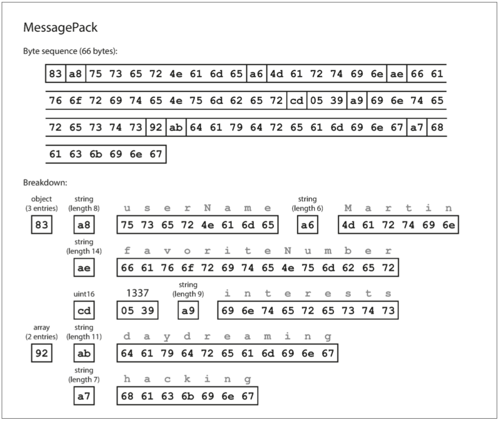
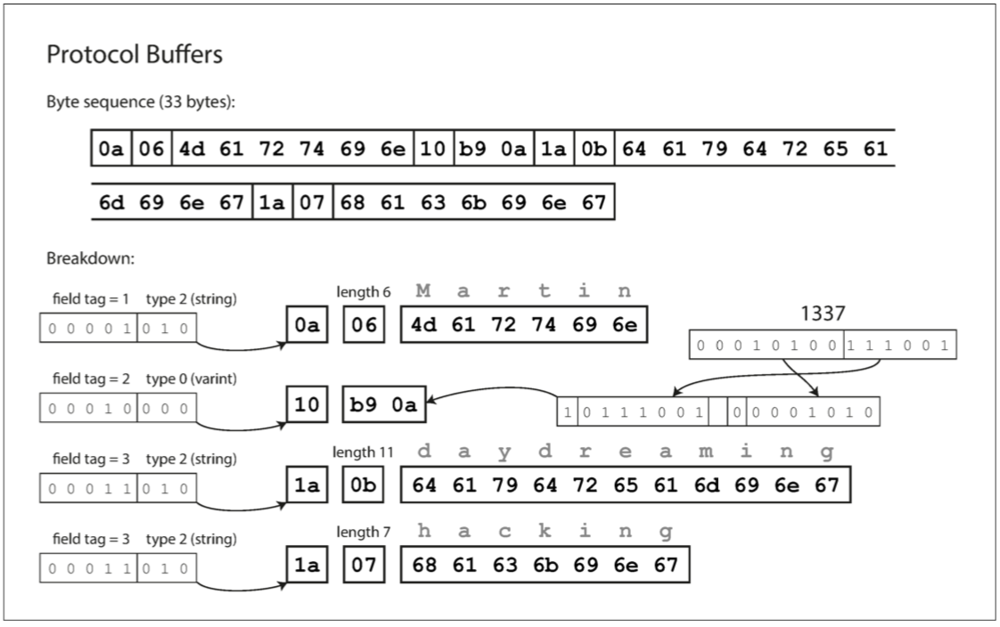
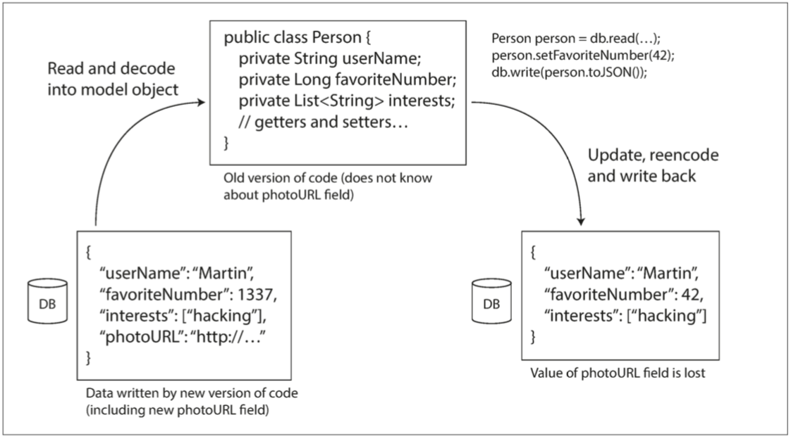

# 4. 编码与演化 


> 唯变所适
>
>  ——以弗所的赫拉克利特，为柏拉图所引（公元前360年）	
>

-------------------

[TOC]

应用程序不可避免地随时间而变化。新产品的推出，对需求的深入理解，或者商业环境的变化，总会伴随着**功能（feature）**的增增改改。[第一章](ch1.md)介绍了[**可演化性(evolvability)**](ch1.md#可演化性：拥抱变化)的概念：应该尽力构建能灵活适应变化的系统（参阅“[可演化性：拥抱变化]()”）。

在大多数情况下，修改应用程序的功能也意味着需要更改其存储的数据：可能需要使用新的字段或记录类型，或者以新方式展示现有数据。

我们在[第二章](ch2.md)讨论的数据模型有不同的方法来应对这种变化。关系数据库通常假定数据库中的所有数据都遵循一个模式：尽管可以更改该模式（通过模式迁移，即`ALTER`语句），但是在任何时间点都有且仅有一个正确的模式。相比之下，**读时模式（schema-on-read）**（或 **无模式（schemaless）**）数据库不会强制一个模式，因此数据库可以包含在不同时间写入的新老数据格式的混合（参阅 “文档模型中的模式灵活性” ）。

当数据**格式（format）**或**模式（schema）**发生变化时，通常需要对应用程序代码进行相应的更改（例如，为记录添加新字段，然后修改程序开始读写该字段）。但在大型应用程序中，代码变更通常不会立即完成：

* 对于 **服务端（server-side）** 应用程序，可能需要执行 **滚动升级 （rolling upgrade）** （也称为 **阶段发布（staged rollout）** ），一次将新版本部署到少数几个节点，检查新版本是否运行正常，然后逐渐部完所有的节点。这样无需中断服务即可部署新版本，为频繁发布提供了可行性，从而带来更好的可演化性。
* 对于 **客户端（client-side）** 应用程序，升不升级就要看用户的心情了。用户可能相当长一段时间里都不会去升级软件。

这意味着，新旧版本的代码，以及新旧数据格式可能会在系统中同时共处。系统想要继续顺利运行，就需要保持**双向兼容性**：

***向后兼容 (backward compatibility)***

​	新代码可以读旧数据。

***向前兼容 (forward compatibility)***

​	旧代码可以读新数据。

向后兼容性通常并不难实现：新代码的作者当然知道由旧代码使用的数据格式，因此可以显示地处理它（最简单的办法是，保留旧代码即可读取旧数据）。

向前兼容性可能会更棘手，因为旧版的程序需要忽略新版数据格式中新增的部分。

本章中将介绍几种编码数据的格式，包括 JSON，XML，Protocol Buffers，Thrift和Avro。尤其将关注这些格式如何应对模式变化，以及它们如何对新旧代码数据需要共存的系统提供支持。然后将讨论如何使用这些格式进行数据存储和通信：在Web服务中，**具象状态传输（REST）**和**远程过程调用（RPC）**，以及**消息传递系统**（如Actor和消息队列）。

## 编码数据的格式

程序通常（至少）使用两种形式的数据：

1. 在内存中，数据保存在对象，结构体，列表，数组，哈希表，树等中。 这些数据结构针对CPU的高效访问和操作进行了优化（通常使用指针）。
2. 如果要将数据写入文件，或通过网络发送，则必须将其 **编码（encode）** 为某种自包含的字节序列（例如，JSON文档）。 由于每个进程都有自己独立的地址空间，一个进程中的指针对任何其他进程都没有意义，所以这个字节序列表示会与通常在内存中使用的数据结构完全不同[^i]。

[^i]: 除一些特殊情况外，例如某些内存映射文件或直接在压缩数据上操作（如“[列压缩](ch4.md#列压缩)”中所述）。

所以，需要在两种表示之间进行某种类型的翻译。 从内存中表示到字节序列的转换称为 **编码（Encoding）** （也称为**序列化（serialization）**或**编组（marshalling）**），反过来称为**解码（Decoding）**[^ii]（**解析（Parsing）**，**反序列化（deserialization）**，**反编组( unmarshalling）**）[^译i]。

[^ii]: 请注意，**编码（encode）**  与 **加密（encryption）** 无关。 本书不讨论加密。
[^译i]: Marshal与Serialization的区别：Marshal不仅传输对象的状态，而且会一起传输对象的方法（相关代码）。

> #### 术语冲突
> 不幸的是，在[第七章](ch7.md)： **事务（Transaction）** 的上下文里，**序列化（Serialization）** 这个术语也出现了，而且具有完全不同的含义。尽管序列化可能是更常见的术语，为了避免术语重载，本书中坚持使用 **编码（Encoding）** 表达此含义。

这是一个常见的问题，因而有许多库和编码格式可供选择。 首先让我们概览一下。

### 语言特定的格式

许多编程语言都内建了将内存对象编码为字节序列的支持。例如，Java有`java.io.Serializable` 【1】，Ruby有`Marshal`【2】，Python有`pickle`【3】等等。许多第三方库也存在，例如`Kryo for Java` 【4】。

这些编码库非常方便，可以用很少的额外代码实现内存对象的保存与恢复。但是它们也有一些深层次的问题：

* 这类编码通常与特定的编程语言深度绑定，其他语言很难读取这种数据。如果以这类编码存储或传输数据，那你就和这门语言绑死在一起了。并且很难将系统与其他组织的系统（可能用的是不同的语言）进行集成。
* 为了恢复相同对象类型的数据，解码过程需要**实例化任意类**的能力，这通常是安全问题的一个来源【5】：如果攻击者可以让应用程序解码任意的字节序列，他们就能实例化任意的类，这会允许他们做可怕的事情，如远程执行任意代码【6,7】。
* 在这些库中，数据版本控制通常是事后才考虑的。因为它们旨在快速简便地对数据进行编码，所以往往忽略了前向后向兼容性带来的麻烦问题。
* 效率（编码或解码所花费的CPU时间，以及编码结构的大小）往往也是事后才考虑的。 例如，Java的内置序列化由于其糟糕的性能和臃肿的编码而臭名昭着【8】。

因此，除非临时使用，采用语言内置编码通常是一个坏主意。

### JSON，XML和二进制变体

谈到可以被许多编程语言编写和读取的标准化编码，JSON和XML是显眼的竞争者。它们广为人知，广受支持，也“广受憎恶”。 XML经常被批评为过于冗长和不必要的复杂【9】。 JSON倍受欢迎，主要由于它在Web浏览器中的内置支持（通过成为JavaScript的一个子集）以及相对于XML的简单性。 CSV是另一种流行的与语言无关的格式，尽管功能较弱。

JSON，XML和CSV是文本格式，因此具有人类可读性（尽管语法是一个热门辩题）。除了表面的语法问题之外，它们也有一些微妙的问题：

* 数字的编码多有歧义之处。XML和CSV不能区分数字和字符串（除非引用外部模式）。 JSON虽然区分字符串和数字，但不区分整数和浮点数，而且不能指定精度。
* 当处理大量数据时，这个问题更严重了。例如，大于$2^{53}$的整数不能在IEEE 754双精度浮点数中精确表示，因此在使用浮点数（例如JavaScript）的语言进行分析时，这些数字会变得不准确。 Twitter上有一个大于$2^{53}$的数字的例子，它使用一个64位的数字来标识每条推文。 Twitter API返回的JSON包含了两种推特ID，一个JSON数字，另一个是十进制字符串，以此避免JavaScript程序无法正确解析数字的问题【10】。
* JSON和XML对Unicode字符串（即人类可读的文本）有很好的支持，但是它们不支持二进制数据（不带字符编码(character encoding)的字节序列）。二进制串是很实用的功能，所以人们通过使用Base64将二进制数据编码为文本来绕开这个限制。模式然后用于表示该值应该被解释为Base64编码。这个工作，但它有点hacky，并增加了33％的数据大小。 XML 【11】和JSON 【12】都有可选的模式支持。这些模式语言相当强大，所以学习和实现起来相当复杂。 XML模式的使用相当普遍，但许多基于JSON的工具嫌麻烦才不会使用模式。由于数据的正确解释（例如数字和二进制字符串）取决于模式中的信息，因此不使用XML/JSON模式的应用程序可能需要对相应的编码/解码逻辑进行硬编码。
* CSV没有任何模式，因此应用程序需要定义每行和每列的含义。如果应用程序更改添加新的行或列，则必须手动处理该变更。 CSV也是一个相当模糊的格式（如果一个值包含逗号或换行符，会发生什么？）。尽管其转义规则已经被正式指定【13】，但并不是所有的解析器都正确的实现了标准。

尽管存在这些缺陷，但JSON，XML和CSV已经足够用于很多目的。特别是作为数据交换格式（即将数据从一个组织发送到另一个组织），它们很可能仍然很受欢迎。这种情况下，只要人们对格式是什么意见一致，格式多么美观或者高效就没有关系。**让不同的组织达成一致的难度超过了其他大多数问题。**

#### 二进制编码

对于仅在组织内部使用的数据，使用最小公分母编码格式的压力较小。例如，可以选择更紧凑或更快的解析格式。虽然对小数据集来说，收益可以忽略不计，但一旦达到TB级别，数据格式的选择就会产生巨大的影响。

JSON比XML简洁，但与二进制格式一比，还是太占地方。这一事实导致大量二进制编码版本JSON & XML的出现，JSON（MessagePack，BSON，BJSON，UBJSON，BISON和Smile等）（例如WBXML和Fast Infoset）。这些格式已经被各种各样的领域所采用，但是没有一个像JSON和XML的文本版本那样被广泛采用。

这些格式中的一些扩展了一组数据类型（例如，区分整数和浮点数，或者增加对二进制字符串的支持），另一方面，它们没有盖面JSON / XML的数据模型。特别是由于它们没有规定模式，所以它们需要在编码数据中包含所有的对象字段名称。也就是说，在[例4-1]()中的JSON文档的二进制编码中，需要在某处包含字符串`userName`，`favoriteNumber`和`interest`。

**例4-1 本章中用于展示二进制编码的示例记录**

```json
{
    "userName": "Martin",
    "favoriteNumber": 1337,
    "interests": ["daydreaming", "hacking"]
}
```

我们来看一个MessagePack的例子，它是一个JSON的二进制编码。图4-1显示了如果使用MessagePack 【14】对[例4-1]()中的JSON文档进行编码，则得到的字节序列。前几个字节如下：

1. 第一个字节`0x83`表示接下来是**3**个字段（低四位= `0x03`）的**对象 object**（高四位= `0x80`）。 （如果想知道如果一个对象有15个以上的字段会发生什么情况，字段的数量塞不进4个bit里，那么它会用另一个不同的类型标识符，字段的数量被编码两个或四个字节）。
2. 第二个字节`0xa8`表示接下来是**8**字节长的字符串（最高四位= 0x08）。
3. 接下来八个字节是ASCII字符串形式的字段名称`userName`。由于之前已经指明长度，不需要任何标记来标识字符串的结束位置（或者任何转义）。
4. 接下来的七个字节对前缀为`0xa6`的六个字母的字符串值`Martin`进行编码，依此类推。

二进制编码长度为66个字节，仅略小于文本JSON编码所取的81个字节（删除了空白）。所有的JSON的二进制编码在这方面是相似的。空间节省了一丁点（以及解析加速）是否能弥补可读性的损失，谁也说不准。

在下面的章节中，能达到比这好得多的结果，只用32个字节对相同的记录进行编码。




**图4-1 使用MessagePack编码的记录（例4-1）**

### Thrift与Protocol Buffers

Apache Thrift 【15】和Protocol Buffers（protobuf）【16】是基于相同原理的二进制编码库。 Protocol Buffers最初是在Google开发的，Thrift最初是在Facebook开发的，并且在2007~2008年都是开源的【17】。
Thrift和Protocol Buffers都需要一个模式来编码任何数据。要在Thrift的[例4-1]()中对数据进行编码，可以使用Thrift **接口定义语言（IDL）** 来描述模式，如下所示：

```c
struct Person {
    1: required string       userName,
    2: optional i64          favoriteNumber,
    3: optional list<string> interests
}
```

Protocol Buffers的等效模式定义看起来非常相似：

```protobuf
message Person {
    required string user_name       = 1;
    optional int64  favorite_number = 2;
    repeated string interests       = 3;
}
```

Thrift和Protocol Buffers每一个都带有一个代码生成工具，它采用了类似于这里所示的模式定义，并且生成了以各种编程语言实现模式的类【18】。您的应用程序代码可以调用此生成的代码来对模式的记录进行编码或解码。
用这个模式编码的数据是什么样的？令人困惑的是，Thrift有两种不同的二进制编码格式[^iii]，分别称为BinaryProtocol和CompactProtocol。先来看看BinaryProtocol。使用这种格式的编码来编码[例4-1]()中的消息只需要59个字节，如[图4-2](img/fig4-2.png)所示【19】。


**图4-2 使用Thrift二进制协议编码的记录**

[^iii]: 实际上，Thrift有三种二进制协议：CompactProtocol和DenseProtocol，尽管DenseProtocol只支持C ++实现，所以不算作跨语言[18]。 除此之外，它还有两种不同的基于JSON的编码格式【19】。 真逗！

与[图4-1](Img/fig4-1.png)类似，每个字段都有一个类型注释（用于指示它是一个字符串，整数，列表等），还可以根据需要指定长度（字符串的长度，列表中的项目数） 。出现在数据中的字符串`(“Martin”, “daydreaming”, “hacking”)`也被编码为ASCII（或者说，UTF-8），与之前类似。

与[图4-1](img/fig4-1.png)相比，最大的区别是没有字段名`(userName, favoriteNumber, interest)`。相反，编码数据包含字段标签，它们是数字`(1, 2和3)`。这些是模式定义中出现的数字。字段标记就像字段的别名 - 它们是说我们正在谈论的字段的一种紧凑的方式，而不必拼出字段名称。

Thrift CompactProtocol编码在语义上等同于BinaryProtocol，但是如[图4-3](img/fig4-3.png)所示，它只将相同的信息打包成只有34个字节。它通过将字段类型和标签号打包到单个字节中，并使用可变长度整数来实现。数字1337不是使用全部八个字节，而是用两个字节编码，每个字节的最高位用来指示是否还有更多的字节来。这意味着-64到63之间的数字被编码为一个字节，-8192和8191之间的数字以两个字节编码，等等。较大的数字使用更多的字节。


**图4-3 使用Thrift压缩协议编码的记录**

最后，Protocol Buffers（只有一种二进制编码格式）对相同的数据进行编码，如[图4-4](img/fig4-4.png)所示。 它的打包方式稍有不同，但与Thrift的CompactProtocol非常相似。 Protobuf将同样的记录塞进了33个字节中。



**图4-4 使用Protobuf编码的记录**

需要注意的一个细节：在前面所示的模式中，每个字段被标记为必需或可选，但是这对字段如何编码没有任何影响（二进制数据中没有任何字段指示是否需要字段）。所不同的是，如果未设置该字段，则所需的运行时检查将失败，这对于捕获错误非常有用。

#### 字段标签和模式演变

我们之前说过，模式不可避免地需要随着时间而改变。我们称之为模式演变。 Thrift和Protocol Buffers如何处理模式更改，同时保持向后兼容性？

从示例中可以看出，编码的记录就是其编码字段的拼接。每个字段由其标签号码（样本模式中的数字1,2,3）标识，并用数据类型（例如字符串或整数）注释。如果没有设置字段值，则简单地从编码记录中省略。从中可以看到，字段标记对编码数据的含义至关重要。您可以更改架构中字段的名称，因为编码的数据永远不会引用字段名称，但不能更改字段的标记，因为这会使所有现有的编码数据无效。

您可以添加新的字段到架构，只要您给每个字段一个新的标签号码。如果旧的代码（不知道你添加的新的标签号码）试图读取新代码写入的数据，包括一个新的字段，其标签号码不能识别，它可以简单地忽略该字段。数据类型注释允许解析器确定需要跳过的字节数。这保持了前向兼容性：旧代码可以读取由新代码编写的记录。

向后兼容性呢？只要每个字段都有一个唯一的标签号码，新的代码总是可以读取旧的数据，因为标签号码仍然具有相同的含义。唯一的细节是，如果你添加一个新的领域，你不能要求。如果您要添加一个字段并将其设置为必需，那么如果新代码读取旧代码写入的数据，则该检查将失败，因为旧代码不会写入您添加的新字段。因此，为了保持向后兼容性，在模式的初始部署之后 **添加的每个字段必须是可选的或具有默认值**。

删除一个字段就像添加一个字段，倒退和向前兼容性问题相反。这意味着您只能删除一个可选的字段（必填字段永远不能删除），而且您不能再次使用相同的标签号码（因为您可能仍然有数据写在包含旧标签号码的地方，而该字段必须被新代码忽略）。

#### 数据类型和模式演变

如何改变字段的数据类型？这可能是可能的——检查文件的细节——但是有一个风险，值将失去精度或被扼杀。例如，假设你将一个32位的整数变成一个64位的整数。新代码可以轻松读取旧代码写入的数据，因为解析器可以用零填充任何缺失的位。但是，如果旧代码读取由新代码写入的数据，则旧代码仍使用32位变量来保存该值。如果解码的64位值不适合32位，则它将被截断。

Protobuf的一个奇怪的细节是，它没有列表或数组数据类型，而是有一个字段的重复标记（这是第三个选项旁边必要和可选）。如[图4-4](img/fig4-4.png)所示，重复字段的编码正如它所说的那样：同一个字段标记只是简单地出现在记录中。这具有很好的效果，可以将可选（单值）字段更改为重复（多值）字段。读取旧数据的新代码会看到一个包含零个或一个元素的列表（取决于该字段是否存在）。读取新数据的旧代码只能看到列表的最后一个元素。

Thrift有一个专用的列表数据类型，它使用列表元素的数据类型进行参数化。这不允许Protocol Buffers所做的从单值到多值的相同演变，但是它具有支持嵌套列表的优点。

### Avro

Apache Avro 【20】是另一种二进制编码格式，与Protocol Buffers和Thrift有趣的不同。 它是作为Hadoop的一个子项目在2009年开始的，因为Thrift不适合Hadoop的用例【21】。

Avro也使用模式来指定正在编码的数据的结构。 它有两种模式语言：一种（Avro IDL）用于人工编辑，一种（基于JSON），更易于机器读取。

我们用Avro IDL编写的示例模式可能如下所示：

```c
record Person {
    string                userName;
    union { null, long }  favoriteNumber = null;
    array<string>         interests;
}
```

等价的JSON表示：

```json
{
    "type": "record",
    "name": "Person",
    "fields": [
        {"name": "userName", "type": "string"},
        {"name": "favoriteNumber", "type": ["null", "long"], "default": null},
        {"name": "interests", "type": {"type": "array", "items": "string"}
    ] 
}
```

首先，请注意架构中没有标签号码。 如果我们使用这个模式编码我们的例子记录（[例4-1]()），Avro二进制编码只有32个字节长，这是我们所见过的所有编码中最紧凑的。 编码字节序列的分解如[图4-5](img/fig4-5.png)所示。

如果您检查字节序列，您可以看到没有什么可以识别字段或其数据类型。 编码只是由连在一起的值组成。 一个字符串只是一个长度前缀，后跟UTF-8字节，但是在被包含的数据中没有任何内容告诉你它是一个字符串。 它可以是一个整数，也可以是其他的整数。 整数使用可变长度编码（与Thrift的CompactProtocol相同）进行编码。


**图4-5 使用Avro编码的记录**

为了解析二进制数据，您按照它们出现在架构中的顺序遍历这些字段，并使用架构来告诉您每个字段的数据类型。这意味着如果读取数据的代码使用与写入数据的代码完全相同的模式，则只能正确解码二进制数据。阅读器和作者之间的模式不匹配意味着错误地解码数据。

那么，Avro如何支持模式演变呢？

#### 作者模式与读者模式

有了Avro，当应用程序想要编码一些数据（将其写入文件或数据库，通过网络发送等）时，它使用它知道的任何版本的模式编码数据，例如，架构可能被编译到应用程序中。这被称为作者的模式。

当一个应用程序想要解码一些数据（从一个文件或数据库读取数据，从网络接收数据等）时，它希望数据在某个模式中，这就是读者的模式。这是应用程序代码所依赖的模式，在应用程序的构建过程中，代码可能是从该模式生成的。

Avro的关键思想是作者的模式和读者的模式不必是相同的 - 他们只需要兼容。当数据解码（读取）时，Avro库通过并排查看作者的模式和读者的模式并将数据从作者的模式转换到读者的模式来解决差异。 Avro规范【20】确切地定义了这种解析的工作原理，如[图4-6](img/fig4-6.png)所示。

例如，如果作者的模式和读者的模式的字段顺序不同，这是没有问题的，因为模式解析通过字段名匹配字段。如果读取数据的代码遇到出现在作者模式中但不在读者模式中的字段，则忽略它。如果读取数据的代码需要某个字段，但是作者的模式不包含该名称的字段，则使用在读者模式中声明的默认值填充。


**图4-6 一个Avro Reader解决读写模式的差异**

#### 模式演变规则

使用Avro，向前兼容性意味着您可以将新版本的架构作为编写器，并将旧版本的架构作为读者。相反，向后兼容意味着你可以有一个作为读者的新版本的模式和作为作者的旧版本。

为了保持兼容性，您只能添加或删除具有默认值的字段。 （我们的Avro模式中的字段`favourNumber`的默认值为`null`）。例如，假设您添加一个默认值的字段，所以这个新的字段存在于新的模式中，而不是旧的。当使用新模式的阅读器读取使用旧模式写入的记录时，将为缺少的字段填充默认值。

如果你要添加一个没有默认值的字段，新的阅读器将无法读取旧作者写的数据，所以你会破坏向后兼容性。如果您要删除没有默认值的字段，旧的阅读器将无法读取新作者写入的数据，因此您会打破兼容性。在一些编程语言中，null是任何变量可以接受的默认值，但在Avro中并不是这样：如果要允许一个字段为`null`，则必须使用联合类型。例如，`union {null，long，string}`字段;表示该字段可以是数字或字符串，也可以是`null`。如果它是union的分支之一，那么只能使用null作为默认值[^iv]。这比默认情况下可以为`null`是更加冗长的，但是通过明确什么可以和不可以是什么，有助于防止错误的`null` 【22】。

[^iv]: 确切地说，默认值必须是联合的第一个分支的类型，尽管这是Avro的特定限制，而不是联合类型的一般特征。

因此，Avro没有像Protocol Buffers和Thrift那样的`optional`和`required`标记（它有联合类型和默认值）。

只要Avro可以转换类型，就可以改变字段的数据类型。更改字段的名称是可能的，但有点棘手：读者的模式可以包含字段名称的别名，所以它可以匹配旧作家的模式字段名称与别名。这意味着更改字段名称是向后兼容的，但不能向前兼容。同样，向联合类型添加分支也是向后兼容的，但不能向前兼容。

##### 但作者模式到底是什么？

到目前为止，我们已经讨论了一个重要的问题：读者如何知道作者的模式是哪一部分数据被编码的？我们不能只将整个模式包括在每个记录中，因为模式可能比编码的数据大得多，从而使二进制编码节省的所有空间都是徒劳的。
答案取决于Avro使用的上下文。举几个例子：

* 有很多记录的大文件

  Avro的一个常见用途 - 尤其是在Hadoop环境中 - 用于存储包含数百万条记录的大文件，所有记录都使用相同的模式进行编码。 （我们将在[第10章](ch10.md)讨论这种情况。）在这种情况下，该文件的作者可以在文件的开头只包含一次作者的模式。 Avro指定一个文件格式（对象容器文件）来做到这一点。

* 支持独立写入的记录的数据库

  在一个数据库中，不同的记录可能会在不同的时间点使用不同的作者的模式编写 - 你不能假定所有的记录都有相同的模式。最简单的解决方案是在每个编码记录的开始处包含一个版本号，并在数据库中保留一个模式版本列表。读者可以获取记录，提取版本号，然后从数据库中获取该版本号的作者模式。使用该作者的模式，它可以解码记录的其余部分。 （例如Espresso 【23】就是这样工作的。）

* 通过网络连接发送记录

  当两个进程通过双向网络连接进行通信时，他们可以在连接设置上协商模式版本，然后在连接的生命周期中使用该模式。 Avro RPC协议（参阅“[通过服务的数据流：REST和RPC](#通过服务的数据流：REST和RPC)”）如此工作。

具有模式版本的数据库在任何情况下都是非常有用的，因为它充当文档并为您提供了检查模式兼容性的机会【24】。作为版本号，你可以使用一个简单的递增整数，或者你可以使用模式的散列。

#### 动态生成的模式

与Protocol Buffers和Thrift相比，Avro方法的一个优点是架构不包含任何标签号码。但为什么这很重要？在模式中保留一些数字有什么问题？

不同之处在于Avro对动态生成的模式更友善。例如，假如你有一个关系数据库，你想要把它的内容转储到一个文件中，并且你想使用二进制格式来避免前面提到的文本格式（JSON，CSV，SQL）的问题。如果你使用Avro，你可以很容易地从关系模式生成一个Avro模式（在我们之前看到的JSON表示中），并使用该模式对数据库内容进行编码，并将其全部转储到Avro对象容器文件【25】中。您为每个数据库表生成一个记录模式，每个列成为该记录中的一个字段。数据库中的列名称映射到Avro中的字段名称。

现在，如果数据库模式发生变化（例如，一个表中添加了一列，删除了一列），则可以从更新的数据库模式生成新的Avro模式，并在新的Avro模式中导出数据。数据导出过程不需要注意模式的改变 - 每次运行时都可以简单地进行模式转换。任何读取新数据文件的人都会看到记录的字段已经改变，但是由于字段是通过名字来标识的，所以更新的作者的模式仍然可以与旧的读者模式匹配。

相比之下，如果您为此使用Thrift或Protocol Buffers，则字段标记可能必须手动分配：每次数据库模式更改时，管理员都必须手动更新从数据库列名到字段标签。 （这可能会自动化，但模式生成器必须非常小心，不要分配以前使用的字段标记。）这种动态生成的模式根本不是Thrift或Protocol Buffers的设计目标，而是为Avro。

#### 代码生成和动态类型的语言

Thrift和Protobuf依赖于代码生成：在定义了模式之后，可以使用您选择的编程语言生成实现此模式的代码。这在Java，C ++或C＃等静态类型语言中很有用，因为它允许将高效的内存中结构用于解码的数据，并且在编写访问数据结构的程序时允许在IDE中进行类型检查和自动完成。

在动态类型编程语言（如JavaScript，Ruby或Python）中，生成代码没有太多意义，因为没有编译时类型检查器来满足。代码生成在这些语言中经常被忽视，因为它们避免了明确的编译步骤。而且，对于动态生成的模式（例如从数据库表生成的Avro模式），代码生成对获取数据是一个不必要的障碍。

Avro为静态类型编程语言提供了可选的代码生成功能，但是它也可以在不生成任何代码的情况下使用。如果你有一个对象容器文件（它嵌入了作者的模式），你可以简单地使用Avro库打开它，并以与查看JSON文件相同的方式查看数据。该文件是自描述的，因为它包含所有必要的元数据。

这个属性特别适用于动态类型的数据处理语言如Apache Pig 【26】。在Pig中，您可以打开一些Avro文件，开始分析它们，并编写派生数据集以Avro格式输出文件，而无需考虑模式。

### 模式的优点

正如我们所看到的，Protocol Buffers，Thrift和Avro都使用模式来描述二进制编码格式。他们的模式语言比XML模式或者JSON模式简单得多，它支持更详细的验证规则（例如，“该字段的字符串值必须与该正则表达式匹配”或“该字段的整数值必须在0和100之间“）。由于Protocol Buffers，Thrift和Avro实现起来更简单，使用起来也更简单，所以它们已经发展到支持相当广泛的编程语言。

这些编码所基于的想法绝不是新的。例如，它们与ASN.1有很多相似之处，它是1984年首次被标准化的模式定义语言【27】。它被用来定义各种网络协议，其二进制编码（DER）仍然被用于编码SSL证书（X.509），例如【28】。 ASN.1支持使用标签号码的模式演进，类似于Protocol Buf-fers和Thrift 【29】。然而，这也是非常复杂和严重的文件记录，所以ASN.1可能不是新应用程序的好选择。

许多数据系统也为其数据实现某种专有的二进制编码。例如，大多数关系数据库都有一个网络协议，您可以通过该协议向数据库发送查询并获取响应。这些协议通常特定于特定的数据库，并且数据库供应商提供将来自数据库的网络协议的响应解码为内存数据结构的驱动程序（例如使用ODBC或JDBC API）。

所以，我们可以看到，尽管JSON，XML和CSV等文本数据格式非常普遍，但基于模式的二进制编码也是一个可行的选择。他们有一些很好的属性：

* 它们可以比各种“二进制JSON”变体更紧凑，因为它们可以省略编码数据中的字段名称。
* 模式是一种有价值的文档形式，因为模式是解码所必需的，所以可以确定它是最新的（而手动维护的文档可能很容易偏离现实）。
* 保留模式数据库允许您在部署任何内容之前检查模式更改的向前和向后兼容性。
* 对于静态类型编程语言的用户来说，从模式生成代码的能力是有用的，因为它可以在编译时进行类型检查。

总而言之，模式进化允许与JSON数据库提供的无模式/模式读取相同的灵活性（请参阅第39页的“文档模型中的模式灵活性”），同时还可以更好地保证数据和更好的工具。


## 数据流的类型

在本章的开始部分，我们曾经说过，无论何时您想要将某些数据发送到不共享内存的另一个进程，例如，只要您想通过网络发送数据或将其写入文件，就需要将它编码为一个字节序列。然后我们讨论了做这个的各种不同的编码。
我们讨论了向前和向后的兼容性，这对于可演化性来说非常重要（通过允许您独立升级系统的不同部分，而不必一次改变所有内容，可以轻松地进行更改）。兼容性是编码数据的一个进程和解码它的另一个进程之间的一种关系。

这是一个相当抽象的概念 - 数据可以通过多种方式从一个流程流向另一个流程。谁编码数据，谁解码？在本章的其余部分中，我们将探讨数据如何在流程之间流动的一些最常见的方式：

* 通过数据库（参阅“[通过数据库的数据流](#通过数据库的数据流)”）
* 通过服务调用（参阅“[通过服务传输数据流：REST和RPC](#通过服务传输数据流：REST和RPC)”）
* 通过异步消息传递（参阅“[消息传递数据流](#消息传递数据流)”）


### 数据库中的数据流

在数据库中，写入数据库的过程对数据进行编码，从数据库读取的过程对数据进行解码。可能只有一个进程访问数据库，在这种情况下，读者只是相同进程的后续版本 - 在这种情况下，您可以考虑将数据库中的内容存储为向未来的自我发送消息。

向后兼容性显然是必要的。否则你未来的自己将无法解码你以前写的东西。

一般来说，几个不同的进程同时访问数据库是很常见的。这些进程可能是几个不同的应用程序或服务，或者它们可能只是几个相同服务的实例（为了可扩展性或容错性而并行运行）。无论哪种方式，在应用程序发生变化的环境中，访问数据库的某些进程可能会运行较新的代码，有些进程可能会运行较旧的代码，例如，因为新版本当前正在部署在滚动升级，所以有些实例已经更新，而其他实例尚未更新。

这意味着数据库中的一个值可能会被更新版本的代码写入，然后被仍旧运行的旧版本的代码读取。因此，数据库也经常需要向前兼容。

但是，还有一个额外的障碍。假设您将一个字段添加到记录模式，并且较新的代码将该新字段的值写入数据库。随后，旧版本的代码（尚不知道新字段）将读取记录，更新记录并将其写回。在这种情况下，理想的行为通常是旧代码保持新的领域完整，即使它不能被解释。

前面讨论的编码格式支持未知域的保存，但是有时候需要在应用程序层面保持谨慎，如图4-7所示。例如，如果将数据库值解码为应用程序中的模型对象，稍后重新编码这些模型对象，那么未知字段可能会在该翻译过程中丢失。

解决这个问题不是一个难题，你只需要意识到它。



**图4-7 当较旧版本的应用程序更新以前由较新版本的应用程序编写的数据时，如果不小心，数据可能会丢失。**

#### 在不同的时间写入不同的值

数据库通常允许任何时候更新任何值。这意味着在一个单一的数据库中，可能有一些值是五毫秒前写的，而一些值是五年前写的。

在部署应用程序的新版本（至少是服务器端应用程序）时，您可能会在几分钟内完全用新版本替换旧版本。数据库内容也是如此：五年前的数据仍然存在于原始编码中，除非您已经明确地重写了它。这种观察有时被总结为数据超出代码。

将数据重写（迁移）到一个新的模式当然是可能的，但是在一个大数据集上执行是一个昂贵的事情，所以大多数数据库如果可能的话就避免它。大多数关系数据库都允许简单的模式更改，例如添加一个默认值为空的新列，而不重写现有数据[^v]读取旧行时，数据库将填充编码数据中缺少的任何列的空值在磁盘上。 LinkedIn的文档数据库Espresso使用Avro存储，允许它使用Avro的模式演变规则【23】。

因此，架构演变允许整个数据库看起来好像是用单个模式编码的，即使底层存储可能包含用模式的各种历史版本编码的记录。

[^v]: 除了MySQL，即使并非真的必要，它也经常会重写整个表，正如“[文档模型中的架构灵活性](ch3.md#文档模型中的灵活性)”中所提到的。


#### 归档存储

也许您不时为数据库创建一个快照，例如备份或加载到数据仓库（参阅“[数据仓库](ch3.md#数据仓库)”）。在这种情况下，即使源数据库中的原始编码包含来自不同时代的模式版本的混合，数据转储通常也将使用最新模式进行编码。既然你正在复制数据，那么你可能会一直对数据的副本进行编码。

由于数据转储是一次写入的，而且以后是不可变的，所以Avro对象容器文件等格式非常适合。这也是一个很好的机会，可以将数据编码为面向分析的列式格式，例如Parquet（请参阅第97页的“[列压缩](ch3.md#列压缩)”）。

在[第10章](ch10.md)中，我们将详细讨论在档案存储中使用数据。


### 服务中的数据流：REST与RPC

当您需要通过网络进行通信的进程时，安排该通信的方式有几种。最常见的安排是有两个角色：客户端和服务器。服务器通过网络公开API，并且客户端可以连接到服务器以向该API发出请求。服务器公开的API被称为服务。

Web以这种方式工作：客户（Web浏览器）向Web服务器发出请求，使GET请求下载HTML，CSS，JavaScript，图像等，并向POST请求提交数据到服务器。 API包含一组标准的协议和数据格式（HTTP，URL，SSL/TLS，HTML等）。由于网络浏览器，网络服务器和网站作者大多同意这些标准，您可以使用任何网络浏览器访问任何网站（至少在理论上！）。

Web浏览器不是唯一的客户端类型。例如，在移动设备或桌面计算机上运行的本地应用程序也可以向服务器发出网络请求，并且在Web浏览器内运行的客户端JavaScript应用程序可以使用XMLHttpRequest成为HTTP客户端（该技术被称为Ajax 【30】）。在这种情况下，服务器的响应通常不是用于显示给人的HTML，而是用于便于客户端应用程序代码（如JSON）进一步处理的编码数据。尽管HTTP可能被用作传输协议，但顶层实现的API是特定于应用程序的，客户端和服务器需要就该API的细节达成一致。

此外，服务器本身可以是另一个服务的客户端（例如，典型的Web应用服务器充当数据库的客户端）。这种方法通常用于将大型应用程序按照功能区域分解为较小的服务，这样当一个服务需要来自另一个服务的某些功能或数据时，就会向另一个服务发出请求。这种构建应用程序的方式传统上被称为 **面向服务的体系结构（service-oriented architecture，SOA）** ，最近被改进和更名为 **微服务架构 ** 【31,32】。

在某些方面，服务类似于数据库：它们通常允许客户端提交和查询数据。但是，虽然数据库允许使用我们在第2章	中讨论的查询语言进行任意查询，但是服务公开了一个特定于应用程序的API，它只允许由服务的业务逻辑（应用程序代码）预定的输入和输出【33】。这种限制提供了一定程度的封装：服务可以对客户可以做什么和不可以做什么施加细粒度的限制。

面向服务/微服务架构的一个关键设计目标是通过使服务独立部署和演化来使应用程序更易于更改和维护。例如，每个服务应该由一个团队拥有，并且该团队应该能够经常发布新版本的服务，而不必与其他团队协调。换句话说，我们应该期望服务器和客户端的旧版本和新版本同时运行，因此服务器和客户端使用的数据编码必须在不同版本的服务API之间兼容——正是我们所做的本章一直在谈论。

#### Web服务

**当服务使用HTTP作为底层通信协议时，可称之为Web服务**。这可能是一个小错误，因为Web服务不仅在Web上使用，而且在几个不同的环境中使用。例如：

1. 运行在用户设备上的客户端应用程序（例如，移动设备上的本地应用程序，或使用Ajax的JavaScript web应用程序）通过HTTP向服务发出请求。这些请求通常通过公共互联网进行。
2. 一种服务向同一组织拥有的另一项服务提出请求，这些服务通常位于同一数据中心内，作为面向服务/微型架构的一部分。 （支持这种用例的软件有时被称为 **中间件（middleware）** ）
3. 一种服务通过互联网向不同组织所拥有的服务提出请求。这用于不同组织后端系统之间的数据交换。此类别包括由在线服务（如信用卡处理系统）提供的公共API，或用于共享访问用户数据的OAuth。

有两种流行的Web服务方法：REST和SOAP。他们在哲学方面几乎是截然相反的，往往是各自支持者之间的激烈辩论（即使在每个阵营内也有很多争论。 例如，**HATEOAS（超媒体作为应用程序状态的引擎）**经常引发讨论【35】。）

REST不是一个协议，而是一个基于HTTP原则的设计哲学【34,35】。它强调简单的数据格式，使用URL来标识资源，并使用HTTP功能进行缓存控制，身份验证和内容类型协商。与SOAP相比，REST已经越来越受欢迎，至少在跨组织服务集成的背景下【36】，并经常与微服务相关[31]。根据REST原则设计的API称为RESTful。

相比之下，SOAP是用于制作网络API请求的基于XML的协议（ 尽管首字母缩写词相似，SOAP并不是SOA的要求。 SOAP是一种特殊的技术，而SOA是构建系统的一般方法。）。虽然它最常用于HTTP，但其目的是独立于HTTP，并避免使用大多数HTTP功能。相反，它带有庞大而复杂的多种相关标准（Web服务框架，称为`WS-*`），它们增加了各种功能【37】。

SOAP Web服务的API使用称为Web服务描述语言（WSDL）的基于XML的语言来描述。 WSDL支持代码生成，客户端可以使用本地类和方法调用（编码为XML消息并由框架再次解码）访问远程服务。这在静态类型编程语言中非常有用，但在动态类型编程语言中很少（参阅“[代码生成和动态类型化语言](#代码生成和动态类型化语言)”）。

由于WSDL的设计不是人类可读的，而且由于SOAP消息通常是手动构建的过于复杂，所以SOAP的用户在很大程度上依赖于工具支持，代码生成和IDE【38】。对于SOAP供应商不支持的编程语言的用户来说，与SOAP服务的集成是困难的。

尽管SOAP及其各种扩展表面上是标准化的，但是不同厂商的实现之间的互操作性往往会造成问题【39】。由于所有这些原因，尽管许多大型企业仍然使用SOAP，但在大多数小公司中已经不再受到青睐。

REST风格的API倾向于更简单的方法，通常涉及较少的代码生成和自动化工具。定义格式（如OpenAPI，也称为Swagger 【40】）可用于描述RESTful API并生成文档。

#### 远程过程调用（RPC）的问题

Web服务仅仅是通过网络进行API请求的一系列技术的最新版本，其中许多技术受到了大量的炒作，但是存在严重的问题。 Enterprise JavaBeans（EJB）和Java的**远程方法调用（RMI）**仅限于Java。**分布式组件对象模型（DCOM）**仅限于Microsoft平台。**公共对象请求代理体系结构（CORBA）**过于复杂，不提供前向或后向兼容性【41】。

所有这些都是基于 **远程过程调用（RPC）** 的思想，该过程调用自20世纪70年代以来一直存在【42】。 RPC模型试图向远程网络服务发出请求，看起来与在同一进程中调用编程语言中的函数或方法相同（这种抽象称为位置透明）。尽管RPC起初看起来很方便，但这种方法根本上是有缺陷的【43,44】。网络请求与本地函数调用非常不同：

* 本地函数调用是可预测的，并且成功或失败，这仅取决于受您控制的参数。网络请求是不可预知的：由于网络问题，请求或响应可能会丢失，或者远程计算机可能很慢或不可用，这些问题完全不在您的控制范围之内。网络问题是常见的，所以你必须预测他们，例如通过重试失败的请求。
* 本地函数调用要么返回结果，要么抛出异常，或者永远不返回（因为进入无限循环或进程崩溃）。网络请求有另一个可能的结果：由于超时，它可能会返回没有结果。在这种情况下，你根本不知道发生了什么：如果你没有得到来自远程服务的响应，你无法知道请求是否通过。 （我们将在[第8章](ch8.md)更详细地讨论这个问题。）
* 如果您重试失败的网络请求，可能会发生请求实际上正在通过，只有响应丢失。在这种情况下，重试将导致该操作被执行多次，除非您在协议中引入除重（ **幂等（idempotence）**）机制。本地函数调用没有这个问题。 （在[第十一章](ch11.md)更详细地讨论幂等性）
* 每次调用本地功能时，通常需要大致相同的时间来执行。网络请求比函数调用要慢得多，而且其延迟也是非常可变的：在不到一毫秒的时间内它可能会完成，但是当网络拥塞或者远程服务超载时，可能需要几秒钟的时间完全一样的东西。
* 调用本地函数时，可以高效地将引用（指针）传递给本地内存中的对象。当你发出一个网络请求时，所有这些参数都需要被编码成可以通过网络发送的一系列字节。没关系，如果参数是像数字或字符串这样的基本类型，但是对于较大的对象很快就会变成问题。

客户端和服务可以用不同的编程语言实现，所以RPC框架必须将数据类型从一种语言翻译成另一种语言。这可能会捅出大篓子，因为不是所有的语言都具有相同的类型 —— 例如回想一下JavaScript的数字大于$2^{53}$的问题（参阅“[JSON，XML和二进制变体](#JSON，XML和二进制变体)”）。用单一语言编写的单个进程中不存在此问题。

所有这些因素意味着尝试使远程服务看起来像编程语言中的本地对象一样毫无意义，因为这是一个根本不同的事情。 REST的部分吸引力在于，它并不试图隐藏它是一个网络协议的事实（尽管这似乎并没有阻止人们在REST之上构建RPC库）。

#### RPC的当前方向

尽管有这样那样的问题，RPC不会消失。在本章提到的所有编码的基础上构建了各种RPC框架：例如，Thrift和Avro带有RPC支持，gRPC是使用Protocol Buffers的RPC实现，Finagle也使用Thrift，Rest.li使用JSON over HTTP。

这种新一代的RPC框架更加明确的是，远程请求与本地函数调用不同。例如，Finagle和Rest.li 使用futures（promises）来封装可能失败的异步操作。`Futures`还可以简化需要并行发出多项服务的情况，并将其结果合并【45】。 gRPC支持流，其中一个调用不仅包括一个请求和一个响应，还包括一系列的请求和响应【46】。

其中一些框架还提供服务发现，即允许客户端找出在哪个IP地址和端口号上可以找到特定的服务。我们将在“[请求路由](ch6.md#请求路由)”中回到这个主题。

使用二进制编码格式的自定义RPC协议可以实现比通用的JSON over REST更好的性能。但是，RESTful API还有其他一些显著的优点：对于实验和调试（只需使用Web浏览器或命令行工具curl，无需任何代码生成或软件安装即可向其请求），它是受支持的所有的主流编程语言和平台，还有大量可用的工具（服务器，缓存，负载平衡器，代理，防火墙，监控，调试工具，测试工具等）的生态系统。由于这些原因，REST似乎是公共API的主要风格。 RPC框架的主要重点在于同一组织拥有的服务之间的请求，通常在同一数据中心内。

#### 数据编码与RPC的演化

对于可演化性，重要的是可以独立更改和部署RPC客户端和服务器。与通过数据库流动的数据相比（如上一节所述），我们可以在通过服务进行数据流的情况下做一个简化的假设：假定所有的服务器都会先更新，其次是所有的客户端。因此，您只需要在请求上具有向后兼容性，并且对响应具有前向兼容性。

RPC方案的前后向兼容性属性从它使用的编码方式中继承

* Thrift，gRPC（Protobuf）和Avro RPC可以根据相应编码格式的兼容性规则进行演变。
* 在SOAP中，请求和响应是使用XML模式指定的。这些可以演变，但有一些微妙的陷阱【47】。
* RESTful API通常使用JSON（没有正式指定的模式）用于响应，以及用于请求的JSON或URI编码/表单编码的请求参数。添加可选的请求参数并向响应对象添加新的字段通常被认为是保持兼容性的改变。

由于RPC经常被用于跨越组织边界的通信，所以服务的兼容性变得更加困难，因此服务的提供者经常无法控制其客户，也不能强迫他们升级。因此，需要长期保持兼容性，也许是无限期的。如果需要进行兼容性更改，则服务提供商通常会并排维护多个版本的服务API。

关于API版本化应该如何工作（即，客户端如何指示它想要使用哪个版本的API）没有一致意见【48】）。对于RESTful API，常用的方法是在URL或HTTP Accept头中使用版本号。对于使用API密钥来标识特定客户端的服务，另一种选择是将客户端请求的API版本存储在服务器上，并允许通过单独的管理界面更新该版本选项【49】。

### 消息传递中的数据流

我们一直在研究从一个过程到另一个过程的编码数据流的不同方式。到目前为止，我们已经讨论了REST和RPC（其中一个进程通过网络向另一个进程发送请求并期望尽可能快的响应）以及数据库（一个进程写入编码数据，另一个进程在将来再次读取）。

在最后一节中，我们将简要介绍一下RPC和数据库之间的异步消息传递系统。它们与RPC类似，因为客户端的请求（通常称为消息）以低延迟传送到另一个进程。它们与数据库类似，不是通过直接的网络连接发送消息，而是通过称为消息代理（也称为消息队列或面向消息的中间件）的中介来临时存储消息。

与直接RPC相比，使用消息代理有几个优点：

* 如果收件人不可用或过载，可以充当缓冲区，从而提高系统的可靠性。
* 它可以自动将消息重新发送到已经崩溃的进程，从而防止消息丢失。
* 避免发件人需要知道收件人的IP地址和端口号（这在虚拟机经常出入的云部署中特别有用）。
* 它允许将一条消息发送给多个收件人。
* 将发件人与收件人逻辑分离（发件人只是发布邮件，不关心使用者）。

然而，与RPC相比，差异在于消息传递通信通常是单向的：发送者通常不期望收到其消息的回复。一个进程可能发送一个响应，但这通常是在一个单独的通道上完成的。这种通信模式是异步的：发送者不会等待消息被传递，而只是发送它，然后忘记它。

#### 消息掮客

过去，信息掮客主要是TIBCO，IBM WebSphere和webMethods等公司的商业软件的秀场。最近像RabbitMQ，ActiveMQ，HornetQ，NATS和Apache Kafka这样的开源实现已经流行起来。我们将在[第11章](ch11.md)中对它们进行更详细的比较。

详细的交付语义因实现和配置而异，但通常情况下，消息代理的使用方式如下：一个进程将消息发送到指定的队列或主题，代理确保将消息传递给一个或多个消费者或订阅者到那个队列或主题。在同一主题上可以有许多生产者和许多消费者。

一个主题只提供单向数据流。但是，消费者本身可能会将消息发布到另一个主题上（因此，可以将它们链接在一起，就像我们将在[第11章](ch11.md)中看到的那样），或者发送给原始消息的发送者使用的回复队列（允许请求/响应数据流，类似于RPC）。

消息代理通常不会执行任何特定的数据模型 - 消息只是包含一些元数据的字节序列，因此您可以使用任何编码格式。如果编码是向后兼容的，则您可以灵活地更改发行商和消费者的独立编码，并以任意顺序进行部署。

如果消费者重新发布消息到另一个主题，则可能需要小心保留未知字段，以防止前面在数据库环境中描述的问题（[图4-7](img/fig4-7.png)）。

#### 分布式的Actor框架

Actor模型是单个进程中并发的编程模型。逻辑被封装在角色中，而不是直接处理线程（以及竞争条件，锁定和死锁的相关问题）。每个角色通常代表一个客户或实体，它可能有一些本地状态（不与其他任何角色共享），它通过发送和接收异步消息与其他角色通信。消息传送不保证：在某些错误情况下，消息将丢失。由于每个角色一次只能处理一条消息，因此不需要担心线程，每个角色可以由框架独立调度。

在分布式的行为者框架中，这个编程模型被用来跨越多个节点来扩展应用程序。不管发送方和接收方是在同一个节点上还是在不同的节点上，都使用相同的消息传递机制。如果它们在不同的节点上，则该消息被透明地编码成字节序列，通过网络发送，并在另一侧解码。

位置透明在actor模型中比在RPC中效果更好，因为actor模型已经假定消息可能会丢失，即使在单个进程中也是如此。尽管网络上的延迟可能比同一个进程中的延迟更高，但是在使用参与者模型时，本地和远程通信之间的基本不匹配是较少的。

分布式的Actor框架实质上是将消息代理和角色编程模型集成到一个框架中。但是，如果要执行基于角色的应用程序的滚动升级，则仍然需要担心向前和向后兼容性问题，因为消息可能会从运行新版本的节点发送到运行旧版本的节点，反之亦然。

三个流行的分布式actor框架处理消息编码如下：

* 默认情况下，Akka使用Java的内置序列化，不提供前向或后向兼容性。 但是，你可以用类似缓冲区的东西替代它，从而获得滚动升级的能力【50】。
* Orleans 默认使用不支持滚动升级部署的自定义数据编码格式; 要部署新版本的应用程序，您需要设置一个新的群集，将流量从旧群集迁移到新群集，然后关闭旧群集【51,52】。 像Akka一样，可以使用自定义序列化插件。
* 在Erlang OTP中，对记录模式进行更改是非常困难的（尽管系统具有许多为高可用性设计的功能）。 滚动升级是可能的，但需要仔细计划【53】。 一个新的实验性的`maps`数据类型（2014年在Erlang R17中引入的类似于JSON的结构）可能使得这个数据类型在未来更容易【54】。


## 本章小结

在本章中，我们研究了将数据结构转换为网络中的字节或磁盘上的字节的几种方法。我们看到了这些编码的细节不仅影响其效率，更重要的是应用程序的体系结构和部署它们的选项。

特别是，许多服务需要支持滚动升级，其中新版本的服务逐步部署到少数节点，而不是同时部署到所有节点。滚动升级允许在不停机的情况下发布新版本的服务（从而鼓励在罕见的大型版本上频繁发布小型版本），并使部署风险降低（允许在影响大量用户之前检测并回滚有故障的版本）。这些属性对于可演化性，以及对应用程序进行更改的容易性都是非常有利的。

在滚动升级期间，或出于各种其他原因，我们必须假设不同的节点正在运行我们的应用程序代码的不同版本。因此，在系统周围流动的所有数据都是以提供向后兼容性（新代码可以读取旧数据）和向前兼容性（旧代码可以读取新数据）的方式进行编码是重要的。

我们讨论了几种数据编码格式及其兼容性属性：

* 编程语言特定的编码仅限于单一编程语言，并且往往无法提供前向和后向兼容性。
* JSON，XML和CSV等文本格式非常普遍，其兼容性取决于您如何使用它们。他们有可选的模式语言，这有时是有用的，有时是一个障碍。这些格式对于数据类型有些模糊，所以你必须小心数字和二进制字符串。
* 像Thrift，Protocol Buffers和Avro这样的二进制模式驱动格式允许使用清晰定义的前向和后向兼容性语义进行紧凑，高效的编码。这些模式可以用于静态类型语言的文档和代码生成。但是，他们有一个缺点，就是在数据可读之前需要对数据进行解码。

我们还讨论了数据流的几种模式，说明了数据编码是重要的不同场景：

* 数据库，写入数据库的进程对数据进行编码，并从数据库读取进程对其进行解码
* RPC和REST API，客户端对请求进行编码，服务器对请求进行解码并对响应进行编码，客户端最终对响应进行解码
* 异步消息传递（使用消息代理或参与者），其中节点之间通过发送消息进行通信，消息由发送者编码并由接收者解码

我们可以小心地得出这样的结论：前向兼容性和滚动升级在某种程度上是可以实现的。愿您的应用程序的演变迅速、敏捷部署。


## 参考文献


1.  “[Java Object Serialization Specification](http://docs.oracle.com/javase/7/docs/platform/serialization/spec/serialTOC.html),” *docs.oracle.com*, 2010.

1.  “[Ruby 2.2.0 API Documentation](http://ruby-doc.org/core-2.2.0/),” *ruby-doc.org*, Dec 2014.

1.  “[The Python 3.4.3 Standard Library Reference Manual](https://docs.python.org/3/library/pickle.html),” *docs.python.org*, February 2015.

1.  “[EsotericSoftware/kryo](https://github.com/EsotericSoftware/kryo),” *github.com*, October 2014.

1.  “[CWE-502:   Deserialization of Untrusted Data](http://cwe.mitre.org/data/definitions/502.html),” Common Weakness Enumeration, *cwe.mitre.org*,
      July 30, 2014.

1.  Steve Breen:  “[What   Do WebLogic, WebSphere, JBoss, Jenkins, OpenNMS, and Your Application Have in Common? This   Vulnerability](http://foxglovesecurity.com/2015/11/06/what-do-weblogic-websphere-jboss-jenkins-opennms-and-your-application-have-in-common-this-vulnerability/),” *foxglovesecurity.com*, November 6, 2015.

1.  Patrick McKenzie:  “[What   the Rails Security Issue Means for Your Startup](http://www.kalzumeus.com/2013/01/31/what-the-rails-security-issue-means-for-your-startup/),” *kalzumeus.com*, January 31, 2013.

1.  Eishay Smith:  “[jvm-serializers wiki](https://github.com/eishay/jvm-serializers/wiki),”  *github.com*, November 2014.

1.  “[XML Is a Poor Copy of S-Expressions](http://c2.com/cgi/wiki?XmlIsaPoorCopyOfEssExpressions),” *c2.com* wiki.

1.  Matt Harris: “[Snowflake: An Update and Some Very Important Information](https://groups.google.com/forum/#!topic/twitter-development-talk/ahbvo3VTIYI),” email to *Twitter Development Talk* mailing list, October 19, 2010.

1.  Shudi (Sandy) Gao, C. M. Sperberg-McQueen, and Henry S. Thompson: “[XML Schema 1.1](http://www.w3.org/XML/Schema),” W3C Recommendation, May 2001.

1.  Francis Galiegue, Kris Zyp, and Gary Court: “[JSON Schema](http://json-schema.org/),” IETF Internet-Draft, February 2013.

1.  Yakov Shafranovich: “[RFC 4180: Common Format and MIME Type for Comma-Separated Values (CSV) Files](https://tools.ietf.org/html/rfc4180),” October 2005.

1.  “[MessagePack Specification](http://msgpack.org/),” *msgpack.org*. Mark Slee, Aditya Agarwal, and Marc Kwiatkowski: “[Thrift: Scalable Cross-Language Services Implementation](http://thrift.apache.org/static/files/thrift-20070401.pdf),” Facebook technical report, April 2007.

1.  “[Protocol Buffers Developer Guide](https://developers.google.com/protocol-buffers/docs/overview),” Google, Inc., *developers.google.com*.

1.  Igor Anishchenko: “[Thrift vs Protocol Buffers vs Avro - Biased Comparison](http://www.slideshare.net/IgorAnishchenko/pb-vs-thrift-vs-avro),” *slideshare.net*, September 17, 2012.

1.  “[A Matrix of the Features Each Individual Language Library Supports](http://wiki.apache.org/thrift/LibraryFeatures),” *wiki.apache.org*.

1.  Martin Kleppmann: “[Schema Evolution in Avro, Protocol Buffers and Thrift](http://martin.kleppmann.com/2012/12/05/schema-evolution-in-avro-protocol-buffers-thrift.html),” *martin.kleppmann.com*, December 5, 2012.

1.  “[Apache Avro 1.7.7 Documentation](http://avro.apache.org/docs/1.7.7/),” *avro.apache.org*, July 2014.

1.  Doug Cutting, Chad Walters, Jim Kellerman, et al.:
    “[&#91;PROPOSAL&#93; New Subproject: Avro](http://mail-archives.apache.org/mod_mbox/hadoop-general/200904.mbox/%3C49D53694.1050906@apache.org%3E),” email thread on *hadoop-general* mailing list,
    *mail-archives.apache.org*, April 2009.

1.  Tony Hoare: “[Null References: The Billion Dollar Mistake](http://www.infoq.com/presentations/Null-References-The-Billion-Dollar-Mistake-Tony-Hoare),” at *QCon London*, March 2009.

1.  Aditya Auradkar and Tom Quiggle:   “[Introducing   Espresso—LinkedIn's Hot New Distributed Document Store](https://engineering.linkedin.com/espresso/introducing-espresso-linkedins-hot-new-distributed-document-store),” *engineering.linkedin.com*, January 21, 2015.

1.  Jay Kreps: “[Putting Apache Kafka to Use: A Practical Guide to Building a Stream Data Platform (Part 2)](http://blog.confluent.io/2015/02/25/stream-data-platform-2/),” *blog.confluent.io*, February 25, 2015.

1.  Gwen Shapira: “[The Problem of Managing Schemas](http://radar.oreilly.com/2014/11/the-problem-of-managing-schemas.html),” *radar.oreilly.com*, November 4, 2014.

1.  “[Apache Pig 0.14.0 Documentation](http://pig.apache.org/docs/r0.14.0/),” *pig.apache.org*, November 2014.

1.  John Larmouth: [*ASN.1Complete*](http://www.oss.com/asn1/resources/books-whitepapers-pubs/larmouth-asn1-book.pdf). Morgan Kaufmann, 1999. ISBN: 978-0-122-33435-1

1.  Russell Housley, Warwick Ford, Tim Polk, and David Solo: “[RFC 2459: Internet X.509 Public Key Infrastructure: Certificate and CRL Profile](https://www.ietf.org/rfc/rfc2459.txt),” IETF Network Working Group, Standards Track,
    January 1999.

1.  Lev Walkin: “[Question: Extensibility and Dropping Fields](http://lionet.info/asn1c/blog/2010/09/21/question-extensibility-removing-fields/),” *lionet.info*, September 21, 2010.

1.  Jesse James Garrett: “[Ajax: A New Approach to Web Applications](http://www.adaptivepath.com/ideas/ajax-new-approach-web-applications/),” *adaptivepath.com*, February 18, 2005.

1.  Sam Newman: *Building Microservices*. O'Reilly Media, 2015. ISBN: 978-1-491-95035-7

1.  Chris Richardson: “[Microservices: Decomposing Applications for Deployability and Scalability](http://www.infoq.com/articles/microservices-intro),” *infoq.com*, May 25, 2014.

1.  Pat Helland: “[Data on the Outside Versus Data on the Inside](http://cidrdb.org/cidr2005/papers/P12.pdf),” at *2nd Biennial Conference on Innovative Data Systems Research* (CIDR), January 2005.

1.  Roy Thomas Fielding: “[Architectural Styles and the Design of Network-Based Software Architectures](https://www.ics.uci.edu/~fielding/pubs/dissertation/fielding_dissertation.pdf),” PhD Thesis, University of California, Irvine, 2000.

1.  Roy Thomas Fielding: “[REST APIs Must Be Hypertext-Driven](http://roy.gbiv.com/untangled/2008/rest-apis-must-be-hypertext-driven),” *roy.gbiv.com*, October 20 2008.

1.  “[REST in Peace, SOAP](http://royal.pingdom.com/2010/10/15/rest-in-peace-soap/),” *royal.pingdom.com*, October 15, 2010.

1.  “[Web Services Standards as of Q1 2007](https://www.innoq.com/resources/ws-standards-poster/),” *innoq.com*, February 2007.

1.  Pete Lacey: “[The S Stands for Simple](http://harmful.cat-v.org/software/xml/soap/simple),” *harmful.cat-v.org*, November 15, 2006.

1.  Stefan Tilkov: “[Interview: Pete Lacey Criticizes Web Services](http://www.infoq.com/articles/pete-lacey-ws-criticism),” *infoq.com*, December 12, 2006.

1.  “[OpenAPI Specification (fka Swagger RESTful API Documentation Specification) Version 2.0](http://swagger.io/specification/),” *swagger.io*, September 8, 2014.

1.  Michi Henning: “[The Rise and Fall of CORBA](http://queue.acm.org/detail.cfm?id=1142044),” *ACM Queue*, volume 4, number 5, pages 28–34, June 2006.
    [doi:10.1145/1142031.1142044](http://dx.doi.org/10.1145/1142031.1142044)

1.  Andrew D. Birrell and Bruce Jay Nelson: “[Implementing Remote Procedure Calls](http://www.cs.princeton.edu/courses/archive/fall03/cs518/papers/rpc.pdf),” *ACM Transactions on Computer Systems* (TOCS), volume 2, number 1, pages 39–59, February 1984. [doi:10.1145/2080.357392](http://dx.doi.org/10.1145/2080.357392)

1.  Jim Waldo, Geoff Wyant, Ann Wollrath, and Sam Kendall: “[A Note on Distributed Computing](http://m.mirror.facebook.net/kde/devel/smli_tr-94-29.pdf),” Sun Microsystems Laboratories, Inc., Technical Report TR-94-29, November 1994.

1.  Steve Vinoski: “[Convenience over Correctness](http://steve.vinoski.net/pdf/IEEE-Convenience_Over_Correctness.pdf),” *IEEE Internet Computing*, volume 12, number 4, pages 89–92, July 2008. [doi:10.1109/MIC.2008.75](http://dx.doi.org/10.1109/MIC.2008.75)

1.  Marius Eriksen: “[Your Server as a Function](http://monkey.org/~marius/funsrv.pdf),” at *7th Workshop on Programming Languages and Operating Systems* (PLOS), November 2013. [doi:10.1145/2525528.2525538](http://dx.doi.org/10.1145/2525528.2525538)

1.  “[grpc-common Documentation](https://github.com/grpc/grpc-common),” Google, Inc., *github.com*, February 2015.

1.  Aditya Narayan and Irina Singh:   “[Designing   and Versioning Compatible Web Services](http://www.ibm.com/developerworks/websphere/library/techarticles/0705_narayan/0705_narayan.html),” *ibm.com*, March 28, 2007.

1.  Troy Hunt: “[Your API Versioning Is Wrong, Which Is Why I Decided to Do It 3 Different Wrong Ways](http://www.troyhunt.com/2014/02/your-api-versioning-is-wrong-which-is.html),” *troyhunt.com*, February 10, 2014.

1.  “[API Upgrades](https://stripe.com/docs/upgrades),” Stripe, Inc., April 2015.

1.  Jonas Bonér:   “[Upgrade in an   Akka Cluster](http://grokbase.com/t/gg/akka-user/138wd8j9e3/upgrade-in-an-akka-cluster),” email to *akka-user* mailing list, *grokbase.com*, August 28, 2013.

1.  Philip A. Bernstein, Sergey Bykov, Alan Geller, et al.:   “[Orleans:   Distributed Virtual Actors for Programmability and Scalability](http://research.microsoft.com/pubs/210931/Orleans-MSR-TR-2014-41.pdf),” Microsoft Research Technical Report MSR-TR-2014-41, March 2014.

1.  “[Microsoft Project   Orleans Documentation](http://dotnet.github.io/orleans/),” Microsoft Research, *dotnet.github.io*, 2015.

1.  David Mercer, Sean Hinde, Yinso Chen, and Richard A O'Keefe:  “[beginner:   Updating Data Structures](http://erlang.org/pipermail/erlang-questions/2007-October/030318.html),” email thread on *erlang-questions* mailing list, *erlang.com*,  October 29, 2007.

1.  Fred Hebert:  “[Postscript: Maps](http://learnyousomeerlang.com/maps),” *learnyousomeerlang.com*,  April 9, 2014.

------

| 上一章                       | 目录                            | 下一章                            |
| ---------------------------- | ------------------------------- | --------------------------------- |
| [第三章：存储与检索](ch3.md) | [设计数据密集型应用](README.md) | [第二部分：分布式数据](part-ii.md) |
