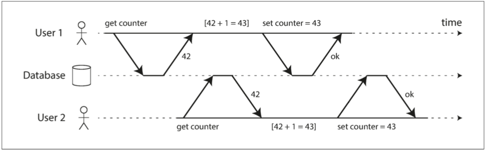
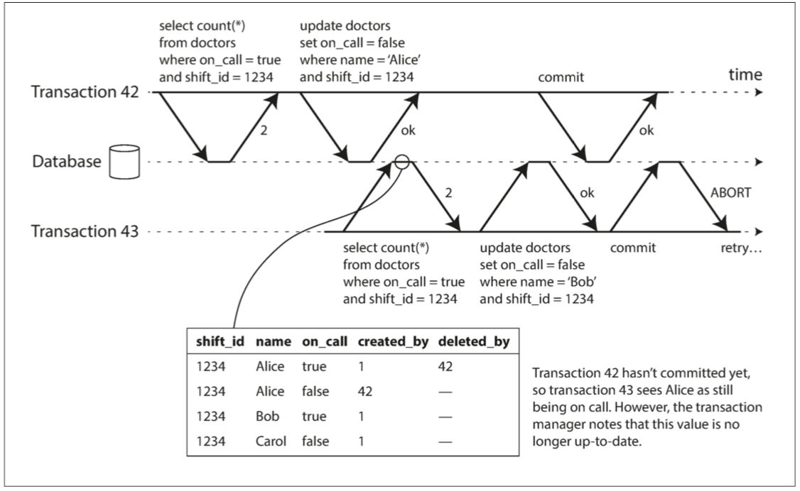

# 7. 事务


> ​	一些作者声称，支持通用的两阶段提交代价太大，会带来性能与可用性的问题。让程序员来处理过度使用事务导致的性能问题，总比缺少事务编程好得多。
>
> ​	——James Corbett等人，Spanner：Google的全球分布式数据库（2012）

------

[TOC]

在数据系统的残酷现实中，很多事情都可能出错：

- 数据库软件、硬件可能在任意时刻发生故障（包括写操作进行到一半时）。
- 应用程序可能在任意时刻崩溃（包括一系列操作的中间）。
- 网络中断可能会意外切断数据库与应用的连接，或数据库之间的连接。
- 多个客户端可能会同时写入数据库，覆盖彼此的更改。
- 客户端可能读取到无意义的数据，因为数据只更新了一部分。
- 客户之间的竞争条件可能导致令人惊讶的错误。

为了实现可靠性，系统必须处理这些故障，确保它们不会导致整个系统的灾难性故障。但是实现容错机制工作量巨大。需要仔细考虑所有可能出错的事情，并进行大量的测试，以确保解决方案真正管用。

​	数十年来，**事务（transaction）** 一直是简化这些问题的首选机制。事务是应用程序将多个读写操作组合成一个逻辑单元的一种方式。从概念上讲，事务中的所有读写操作被视作单个操作来执行：整个事务要么成功（**提交（commit）**）要么失败（**中止（abort）**，**回滚（rollback）**）。如果失败，应用程序可以安全地重试。对于事务来说，应用程序的错误处理变得简单多了，因为它不用再担心部分失败的情况了，即某些操作成功，某些失败（无论出于何种原因）。

​	和事务打交道时间长了，你可能会觉得它显而易见。但我们不应将其视为理所当然。事务不自然法；它们是为了**简化应用编程模型**而创建的。通过使用事务，应用程序可以自由地忽略某些潜在的错误情况和并发问题，因为数据库会替应用处理好这些。（我们称之为**安全保证（safety guarantees）**）。

​	并不是所有的应用都需要事务，有时候弱化事务保证、或完全放弃事务也是有好处的（例如，为了获得更高性能或更高可用性）。一些安全属性也可以在没有事务的情况下实现。

​	怎样知道你是否需要事务？为了回答这个问题，首先需要确切理解事务可以提供的安全保障，以及它们的代价。尽管乍看事务似乎很简单，但实际上有许多微妙但重要的细节在起作用。

​	本章将研究许多出错案例，并探索数据库用于防范这些问题的算法。尤其会深入**并发控制**的领域，讨论各种可能发生的竞争条件，以及数据库如何实现**读已提交**，**快照隔离**和**可串行化**等隔离级别。

​	本章同时适用于单机数据库与分布式数据库；在[第8章](ch8.md)中将重点讨论仅出现在分布式系统中的特殊挑战。


## 事务的棘手概念

​	现今，几乎所有的关系型数据库和一些非关系数据库都支持**事务**。其中大多数遵循IBM System R（第一个SQL数据库）在1975年引入的风格【1,2,3】。40年里，尽管一些实现细节发生了变化，但总体思路大同小异：MySQL，PostgreSQL，Oracle，SQL Server等数据库中的事务支持与System R异乎寻常地相似。

2000年以后，非关系（NoSQL）数据库开始普及。它们的目标是通过提供新的数据模型选择（参见第2章），并通过默认包含复制（第5章）和分区（第6章）来改善关系现状。事务是这种运动的主要原因：这些新一代数据库中的许多数据库完全放弃了事务，或者重新定义了这个词，描述比以前理解所更弱的一套保证【4】。

随着这种新型分布式数据库的炒作，人们普遍认为事务是可扩展性的对立面，任何大型系统都必须放弃事务以保持良好的性能和高可用性【5,6】。另一方面，数据库厂商有时将事务保证作为“重要应用”和“有价值数据”的基本要求。这两种观点都是**纯粹的夸张**。

事实并非如此简单：与其他技术设计选择一样，事务有其优势和局限性。为了理解这些权衡，让我们了解事务所提供保证的细节——无论是在正常运行中还是在各种极端（但是现实存在）情况下。

### ACID的含义

事务所提供的安全保证，通常由众所周知的首字母缩略词ACID来描述，ACID代表**原子性（Atomicity）**，**一致性（Consistency）**，**隔离性（Isolation）**和**持久性（Durability）**。它由TheoHärder和Andreas Reuter于1983年创建，旨在为数据库中的容错机制建立精确的术语。

但实际上，不同数据库的ACID实现并不相同。例如，我们将会看到，围绕着**隔离性（Isolation）** 的含义有许多含糊不清【8】。高层次上的想法是合理的，但魔鬼隐藏在细节里。今天，当一个系统声称自己“符合ACID”时，实际上能期待的是什么保证并不清楚。不幸的是，ACID现在几乎已经变成了一个营销术语。

（不符合ACID标准的系统有时被称为BASE，它代表**基本可用性（Basically Available）**，**软状态（Soft State）**和**最终一致性（Eventual consistency）**【9】，这比ACID的定义更加模糊，似乎BASE的唯一合理的定义是“不是ACID”，即它几乎可以代表任何你想要的东西。）

让我们深入了解原子性，一致性，隔离性和持久性的定义，这可以让我们提炼出事务的思想。

#### 原子性（Atomicity）

一般来说，原子是指不能分解成小部分的东西。这个词在计算的不同分支中意味着相似但又微妙不同的东西。例如，在多线程编程中，如果一个线程执行一个原子操作，这意味着另一个线程无法看到该操作的一半结果。系统只能处于操作之前或操作之后的状态，而不是介于两者之间的状态。

相比之下，ACID的原子性并**不**是关于**并发（concurrent）**的。它并不是在描述如果几个进程试图同时访问相同的数据会发生什么情况，这种情况包含在缩写***I*** 中，即[**隔离性（Isolation）**](#隔离性（Isolation）)

ACID的原子性描述了，当客户想进行多次写入，但在一些写操作处理完之后出现故障的情况。例如进程崩溃，网络连接中断，磁盘变满或者某种完整性约束被违反。如果这些写操作被分组到一个原子事务中，并且该事务由于错误而不能完成（提交），则该事务将被中止，并且数据库必须丢弃或撤消该事务中迄今为止所做的任何写入。

如果没有原子性，在多处更改进行到一半时发生错误，很难知道哪些更改已经生效，哪些没有生效。该应用程序可以再试一次，但冒着进行两次相同变更的风险，可能会导致数据重复或错误的数据。原子性简化了这个问题：如果事务被**中止（abort）**，应用程序可以确定它没有改变任何东西，所以可以安全地重试。

ACID原子性的定义特征是：**能够在错误时中止事务，丢弃该事务进行的所有写入变更的能力。** 或许 **可中止性（abortability）** 是更好的术语，但本书将继续使用原子性，因为这是惯用词。

#### 一致性（Consistency）

一致性这个词重载的很厉害：

* 在[第5章](ch5.md)中，我们讨论了副本一致性，以及异步复制系统中的最终一致性问题（参阅“[复制延迟问题](ch5.md#复制延迟问题)”）。
* [一致性散列（Consistency Hash）](ch6.md#一致性散列))是某些系统用于重新分区的一种分区方法。
* 在[CAP定理](ch9.md#CAP定理)中，一致性一词用于表示[可线性化](ch9.md#线性化)。
* 在ACID的上下文中，**一致性**是指数据库在应用程序的特定概念中处于“良好状态”。

很不幸，这一个词就至少有四种不同的含义。

ACID一致性的概念是，**对数据的一组特定陈述必须始终成立**。即**不变量（invariants）**。例如，在会计系统中，所有账户整体上必须借贷相抵。如果一个事务开始于一个满足这些不变量的有效数据库，且在事务处理期间的任何写入操作都保持这种有效性，那么可以确定，不变量总是满足的。

但是，一致性的这种概念取决于应用程序对不变量的观念，应用程序负责正确定义它的事务，并保持一致性。这并不是数据库可以保证的事情：如果你写入违反不变量的脏数据，数据库也无法阻止你。 （一些特定类型的不变量可以由数据库检查，例如外键约束或唯一约束，但是一般来说，是应用程序来定义什么样的数据是有效的，什么样是无效的。—— 数据库只管存储。）

原子性，隔离性和持久性是数据库的属性，而一致性（在ACID意义上）是应用程序的属性。应用可能依赖数据库的原子性和隔离属性来实现一致性，但这并不仅取决于数据库。因此，字母C不属于ACID[^i]。

[^i]: 乔·海勒斯坦（Joe Hellerstein）指出，在论Härder与Reuter的论文中，“ACID中的C”是被“扔进去凑缩写单词的”【7】，而且那时候大家都不怎么在乎一致性。

#### 隔离性（Isolation）

大多数数据库都会同时被多个客户端访问。如果它们各自读写数据库的不同部分，这是没有问题的，但是如果它们访问相同的数据库记录，则可能会遇到**并发**问题（**竞争条件（race conditions）**）。

[图7-1](img/fig7-1.png)是这类问题的一个简单例子。假设你有两个客户端同时在数据库中增长一个计数器。（假设数据库中没有自增操作）每个客户端需要读取计数器的当前值，加 1 ，再回写新值。[图7-1](img/fig7-1.png) 中，因为发生了两次增长，计数器应该从42增至44；但由于竞态条件，实际上只增至 43 。

ACID意义上的隔离性意味着，**同时执行的事务是相互隔离的**：它们不能相互冒犯。传统的数据库教科书将隔离性形式化为**可序列化（Serializability）**，这意味着每个事务可以假装它是唯一在整个数据库上运行的事务。数据库确保当事务已经提交时，结果与它们按顺序运行（一个接一个）是一样的，尽管实际上它们可能是并发运行的【10】。



**图7-1 两个客户之间的竞争状态同时递增计数器**

然而实践中很少会使用可序列化隔离，因为它有性能损失。一些流行的数据库如Oracle 11g，甚至没有实现它。在Oracle中有一个名为“可序列化”的隔离级别，但实际上它实现了一种叫做**快照隔离（snapshot isolation）** 的功能，**这是一种比可序列化更弱的保证**【8,11】。我们将在“[弱隔离等级]()”中研究快照隔离和其他形式的隔离。

#### 持久性（Durability）

数据库系统的目的是，提供一个安全的地方存储数据，而不用担心丢失。**持久性** 是一个承诺，即一旦事务成功完成，即使发生硬件故障或数据库崩溃，写入的任何数据也不会丢失。

在单节点数据库中，持久性通常意味着数据已被写入非易失性存储设备，如硬盘或SSD。它通常还包括预写日志或类似的文件（参阅“[让B树更可靠](ch3.md#让B树更可靠)”），以便在磁盘上的数据结构损坏时进行恢复。在带复制的数据库中，持久性可能意味着数据已成功复制到一些节点。为了提供持久性保证，数据库必须等到这些写入或复制完成后，才能报告事务成功提交。

如“[可靠性](ch1.md#可靠性)”一节所述，**完美的持久性是不存在的** ：如果所有硬盘和所有备份同时被销毁，那显然没有任何数据库能救得了你。

> #### 复制和持久性
>
> 在历史上，持久性意味着写入归档磁带。后来它被理解为写入硬盘或SSD。最近它已经适应了“复制（replication）”的新内涵。哪种实现更好一些？
>
> 真相是，没有什么是完美的：
>
> * 如果你写入磁盘然后机器宕机，即使数据没有丢失，在修复机器或将磁盘转移到其他机器之前，也是无法访问的。这种情况下，复制系统可以保持可用性。
> * 一个相关性故障（停电，或一个特定输入导致所有节点崩溃的Bug）可能会一次性摧毁所有副本（参阅「[可靠性](ch1.md#可靠性)」），任何仅存储在内存中的数据都会丢失，故内存数据库仍然要和磁盘写入打交道。
> * 在异步复制系统中，当主库不可用时，最近的写入操作可能会丢失（参阅「[处理节点宕机](ch5.md#处理节点宕机)」）。
> * 当电源突然断电时，特别是固态硬盘，有证据显示有时会违反应有的保证：甚至fsync也不能保证正常工作【12】。硬盘固件可能有错误，就像任何其他类型的软件一样【13,14】。
> * 存储引擎和文件系统之间的微妙交互可能会导致难以追踪的错误，并可能导致磁盘上的文件在崩溃后被损坏【15,16】。
> * 磁盘上的数据可能会在没有检测到的情况下逐渐损坏【17】。如果数据已损坏一段时间，副本和最近的备份也可能损坏。这种情况下，需要尝试从历史备份中恢复数据。
> * 一项关于固态硬盘的研究发现，在运行的前四年中，30％到80％的硬盘会产生至少一个坏块【18】。相比固态硬盘，磁盘的坏道率较低，但完全失效的概率更高。
> * 如果SSD断电，可能会在几周内开始丢失数据，具体取决于温度【19】。
>
> 在实践中，没有一种技术可以提供绝对保证。只有各种降低风险的技术，包括写入磁盘，复制到远程机器和备份——它们可以且应该一起使用。与往常一样，最好抱着怀疑的态度接受任何理论上的“保证”

### 单对象和多对象操作

回顾一下，在ACID中，原子性和隔离性描述了客户端在同一事务中执行多次写入时，数据库应该做的事情：

***原子性***

如果在一系列写操作的中途发生错误，则应中止事务处理，并丢弃当前事务的所有写入。换句话说，数据库免去了用户对部分失败的担忧——通过提供“**宁为玉碎，不为瓦全（all-or-nothing）**”的保证。

***隔离性***

同时运行的事务不应该互相干扰。例如，如果一个事务进行多次写入，则另一个事务要么看到全部写入结果，要么什么都看不到，但不应该是一些子集。

这些定义假设你想同时修改多个对象（行，文档，记录）。通常需要**多对象事务（multi-object transaction）** 来保持多块数据同步。[图7-2](img/fig7-2.png)展示了一个来自电邮应用的例子。执行以下查询来显示用户未读邮件数量：

```sql
SELECT COUNT（*）FROM emails WHERE recipient_id = 2 AND unread_flag = true
```

但如果邮件太多，你可能会觉得这个查询太慢，并决定用单独的字段存储未读邮件的数量（一种反规范化）。现在每当一个新消息写入时，必须也增长未读计数器，每当一个消息被标记为已读时，也必须减少未读计数器。

在[图7-2](img/fig7-2.png)中，用户2 遇到异常情况：邮件列表里显示有未读消息，但计数器显示为零未读消息，因为计数器增长还没有发生[^ii]。隔离性可以避免这个问题：通过确保用户2 要么同时看到新邮件和增长后的计数器，要么都看不到。反正不会看到执行到一半的中间结果。

[^ii]: 可以说邮件应用中的错误计数器并不是什么特别重要的问题。但换种方式来看，你可以把未读计数器换成客户账户余额，把邮件收发看成支付交易。


**图7-2 违反隔离性：一个事务读取另一个事务的未被执行的写入（“脏读”）。**

[图7-3](img/fig7-3.png)说明了对原子性的需求：如果在事务过程中发生错误，邮箱和未读计数器的内容可能会失去同步。在原子事务中，如果对计数器的更新失败，事务将被中止，并且插入的电子邮件将被回滚。


**图7-3 原子性确保发生错误时，事务先前的任何写入都会被撤消，以避免状态不一致**

多对象事务需要某种方式来确定哪些读写操作属于同一个事务。在关系型数据库中，通常基于客户端与数据库服务器的TCP连接：在任何特定连接上，`BEGIN TRANSACTION` 和 `COMMIT` 语句之间的所有内容，被认为是同一事务的一部分.[^iii]

[^iii]: 这并不完美。如果TCP连接中断，则事务必须中止。如果中断发生在客户端请求提交之后，但在服务器确认提交发生之前，客户端并不知道事务是否已提交。为了解决这个问题，事务管理器可以通过一个唯一事务标识符来对操作进行分组，这个标识符并未绑定到特定TCP连接。后续再“[数据库端到端的争论](ch12.md#数据库端到端的争论)”一节将回到这个主题。

另一方面，许多非关系数据库并没有将这些操作组合在一起的方法。即使存在多对象API（例如，键值存储可能具有在一个操作中更新几个键的多重放置操作），但这并不一定意味着它具有事务语义：该命令可能在一些键上成功，在其他的键上失败，使数据库处于部分更新的状态。

#### 单对象写入

当单个对象发生改变时，原子性和隔离也是适用的。例如，假设您正在向数据库写入一个 20 KB的 JSON文档：

- 如果在发送第一个10 KB之后网络连接中断，数据库是否存储了不可解析的10KB JSON片段？
- 如果在数据库正在覆盖磁盘上的前一个值的过程中电源发生故障，是否最终将新旧值拼接在一起？
- 如果另一个客户端在写入过程中读取该文档，是否会看到部分更新的值？

这些问题非常让人头大，故存储引擎一个几乎普遍的目标是：对单节点上的单个对象（例如键值对）上提供原子性和隔离性。原子性可以通过使用日志来实现崩溃恢复（参阅“[使B树可靠]()”），并且可以使用每个对象上的锁来实现隔离（每次只允许一个线程访问对象） ）。

一些数据库也提供更复杂的原子操作，例如自增操作，这样就不再需要像 [图7-1](img/fig7-1.png) 那样的读取-修改-写入序列了。同样流行的是 **[比较和设置（CAS, compare-and-set）](#比较并设置（CAS）)** 操作，当值没有并发被其他人修改过时，才允许执行写操作。

这些单对象操作很有用，因为它们可以防止在多个客户端尝试同时写入同一个对象时丢失更新（参阅“[防止丢失更新](#防止丢失更新)”）。但它们不是通常意义上的事务。CAS以及其他单一对象操作被称为“轻量级事务”，甚至出于营销目的被称为“ACID”【20,21,22】，但是这个术语是误导性的。事务通常被理解为，**将多个对象上的多个操作合并为一个执行单元的机制**。[^iv]

[^iv]: 严格地说，**原子自增（atomic increment）** 这个术语在多线程编程的意义上使用了原子这个词。 在ACID的情况下，它实际上应该被称为 **孤立（isolated）** 的或**可序列化（serializable）** 的增量。 但这就太吹毛求疵了。

#### 多对象事务的需求

许多分布式数据存储已经放弃了多对象事务，因为多对象事务很难跨分区实现，而且在需要高可用性或高性能的情况下，它们可能会碍事。但说到底，在分布式数据库中实现事务，并没有什么根本性的障碍。[第9章](ch9.md) 将讨论分布式事务的实现。

但是我们是否需要多对象事务？**是否有可能只用键值数据模型和单对象操作来实现任何应用程序？**

有一些场景中，单对象插入，更新和删除是足够的。但是许多其他场景需要协调写入几个不同的对象：

* 在关系数据模型中，一个表中的行通常具有对另一个表中的行的外键引用。 （类似的是，在一个图数据模型中，一个顶点有着到其他顶点的边）。多对象事务使你确信这些引用始终有效：当插入几个相互引用的记录时，外键必须是正确的，最新的，不然数据就没有意义。
* 在文档数据模型中，需要一起更新的字段通常在同一个文档中，这被视为单个对象——更新单个文档时不需要多对象事务。但是，缺乏连接功能的文档数据库会鼓励非规范化（参阅“[关系型数据库与文档数据库在今日的对比](ch2.md#关系型数据库与文档数据库在今日的对比)”）。当需要更新非规范化的信息时，如 [图7-2](img/fig7-2.png) 所示，需要一次更新多个文档。事务在这种情况下非常有用，可以防止非规范化的数据不同步。
* 在具有二级索引的数据库中（除了纯粹的键值存储以外几乎都有），每次更改值时都需要更新索引。从事务角度来看，这些索引是不同的数据库对象：例如，如果没有事务隔离性，记录可能出现在一个索引中，但没有出现在另一个索引中，因为第二个索引的更新还没有发生。

这些应用仍然可以在没有事务的情况下实现。然而，**没有原子性，错误处理就要复杂得多，缺乏隔离性，就会导致并发问题**。我们将在“[弱隔离级别](#弱隔离级别)”中讨论这些问题，并在[第12章]()中探讨其他方法。

#### 处理错误和中止

事务的一个关键特性是，如果发生错误，它可以中止并安全地重试。 ACID数据库基于这样的哲学：如果数据库有违反其原子性，隔离性或持久性的危险，则宁愿完全放弃事务，而不是留下半成品。

然而并不是所有的系统都遵循这个哲学。特别是具有[无主复制](ch6.md#无主复制)的数据存储，主要是在“尽力而为”的基础上进行工作。可以概括为“数据库将做尽可能多的事，运行遇到错误时，它不会撤消它已经完成的事情“ ——所以，从错误中恢复是应用程序的责任。

错误发生不可避免，但许多软件开发人员倾向于只考虑乐观情况，而不是错误处理的复杂性。例如，像Rails的ActiveRecord和Django这样的**对象关系映射（ORM, object-relation Mapping）** 框架不会重试中断的事务—— 这个错误通常会导致一个从堆栈向上传播的异常，所以任何用户输入都会被丢弃，用户拿到一个错误信息。这实在是太耻辱了，因为中止的重点就是允许安全的重试。

尽管重试一个中止的事务是一个简单而有效的错误处理机制，但它并不完美：

- 如果事务实际上成功了，但是在服务器试图向客户端确认提交成功时网络发生故障（所以客户端认为提交失败了），那么重试事务会导致事务被执行两次——除非你有一个额外的应用级除重机制。
- 如果错误是由于负载过大造成的，则重试事务将使问题变得更糟，而不是更好。为了避免这种正反馈循环，可以限制重试次数，使用指数退避算法，并单独处理与过载相关的错误（如果允许）。
- 仅在临时性错误（例如，由于死锁，异常情况，临时性网络中断和故障切换）后才值得重试。在发生永久性错误（例如，违反约束）之后重试是毫无意义的。
- 如果事务在数据库之外也有副作用，即使事务被中止，也可能发生这些副作用。例如，如果你正在发送电子邮件，那你肯定不希望每次重试事务时都重新发送电子邮件。如果你想确保几个不同的系统一起提交或放弃，**二阶段提交（2PC, two-phase commit）** 可以提供帮助（“[原子提交和两阶段提交（2PC）](ch9.md#原子提交与二阶段提交（2PC）)”中将讨论这个问题）。
- 如果客户端进程在重试中失效，任何试图写入数据库的数据都将丢失。                                                                                                                                                          


## 弱隔离级别

如果两个事务不触及相同的数据，它们可以安全地**并行（parallel）** 运行，因为两者都不依赖于另一个。当一个事务读取由另一个事务同时修改的数据时，或者当两个事务试图同时修改相同的数据时，并发问题（竞争条件）才会出现。

并发BUG很难通过测试找到，因为这样的错误只有在特殊时机下才会触发。这样的时机可能很少，通常很难重现[^译注i]。并发性也很难推理，特别是在大型应用中，你不一定知道哪些其他代码正在访问数据库。在一次只有一个用户时，应用开发已经很麻烦了，有许多并发用户使得它更加困难，因为任何一个数据都可能随时改变。

[^译注i]: 轶事：偶然出现的瞬时错误有时称为***Heisenbug***，而确定性的问题对应地称为***Bohrbugs***

出于这个原因，数据库一直试图通过提供**事务隔离（transaction isolation）** 来隐藏应用程序开发者的并发问题。从理论上讲，隔离可以通过假装没有并发发生，让你的生活更加轻松：**可序列化（serializable）** 的隔离等级意味着数据库保证事务的效果与连续运行（即一次一个，没有任何并发）是一样的。

实际上不幸的是：隔离并没有那么简单。**可序列化** 会有性能损失，许多数据库不愿意支付这个代价【8】。因此，系统通常使用较弱的隔离级别来防止一部分，而不是全部的并发问题。这些隔离级别难以理解，并且会导致微妙的错误，但是它们仍然在实践中被使用【23】。

弱事务隔离级别导致的并发性错误不仅仅是一个理论问题。它们造成了很多的资金损失【24,25】，耗费了财务审计人员的调查【26】，并导致客户数据被破坏【27】。关于这类问题的一个流行的评论是“如果你正在处理财务数据，请使用ACID数据库！” —— 但是这一点没有提到。即使是很多流行的关系型数据库系统（通常被认为是“ACID”）也使用弱隔离级别，所以它们也不一定能防止这些错误的发生。

比起盲目地依赖工具，我们应该对存在的并发问题的种类，以及如何防止这些问题有深入的理解。然后就可以使用我们所掌握的工具来构建可靠和正确的应用程序。

在本节中，我们将看几个在实践中使用的弱（**不可串行化（nonserializable）**）隔离级别，并详细讨论哪种竞争条件可能发生也可能不发生，以便您可以决定什么级别适合您的应用程序。一旦我们完成了这个工作，我们将详细讨论可串行性（请参阅“[可序列化](#可序列化)”）。我们讨论的隔离级别将是非正式的，使用示例。如果你需要严格的定义和分析它们的属性，你可以在学术文献中找到它们[28,29,30]。

### 读已提交

最基本的事务隔离级别是**读已提交（Read Committed）**[^v]，它提供了两个保证：

1. 从数据库读时，只能看到已提交的数据（没有**脏读（dirty reads）**）。
2. 写入数据库时，只会覆盖已经写入的数据（没有**脏写（dirty writes）**）。

我们来更详细地讨论这两个保证。

[^v]: 某些数据库支持甚至更弱的隔离级别，称为**读未提交（Read uncommitted）**。它可以防止脏写，但不防止脏读。

#### 没有脏读

设想一个事务已经将一些数据写入数据库，但事务还没有提交或中止。另一个事务可以看到未提交的数据吗？如果是的话，那就叫做**脏读（dirty reads）**【2】。

在**读已提交**隔离级别运行的事务必须防止脏读。这意味着事务的任何写入操作只有在该事务提交时才能被其他人看到（然后所有的写入操作都会立即变得可见）。如[图7-4]()所示，用户1 设置了`x = 3`，但用户2 的 `get x `仍旧返回旧值2 ，而用户1 尚未提交。


**图7-4 没有脏读：用户2只有在用户1的事务已经提交后才能看到x的新值。**

为什么要防止脏读，有几个原因：

- 如果事务需要更新多个对象，脏读取意味着另一个事务可能会只看到一部分更新。例如，在[图7-2](img/fig7-2.png)中，用户看到新的未读电子邮件，但看不到更新的计数器。这就是电子邮件的脏读。看到处于部分更新状态的数据库会让用户感到困惑，并可能导致其他事务做出错误的决定。
- 如果事务中止，则所有写入操作都需要回滚（如[图7-3](img/fig7-3.png)所示）。如果数据库允许脏读，那就意味着一个事务可能会看到稍后需要回滚的数据，即从未实际提交给数据库的数据。想想后果就让人头大。

#### 没有脏写

如果两个事务同时尝试更新数据库中的相同对象，会发生什么情况？我们不知道写入的顺序是怎样的，但是我们通常认为后面的写入会覆盖前面的写入。

但是，如果先前的写入是尚未提交事务的一部分，又会发生什么情况，后面的写入会覆盖一个尚未提交的值？这被称作**脏写（dirty write）**【28】。在**读已提交**的隔离级别上运行的事务必须防止脏写，通常是延迟第二次写入，直到第一次写入事务提交或中止为止。

通过防止脏写，这个隔离级别避免了一些并发问题：

- 如果事务更新多个对象，脏写会导致不好的结果。例如，考虑 [图7-5](img/fig7-5.png)，[图7-5](img/fig7-5.png) 以一个二手车销售网站为例，Alice和Bob两个人同时试图购买同一辆车。购买汽车需要两次数据库写入：网站上的商品列表需要更新，以反映买家的购买，销售发票需要发送给买家。在[图7-5](img/fig7-5.png)的情况下，销售是属于Bob的（因为他成功更新了商品列表），但发票却寄送给了爱丽丝（因为她成功更新了发票表）。读已提交会阻止这样这样的事故。
- 但是，提交读取并不能防止[图7-1]()中两个计数器增量之间的竞争状态。在这种情况下，第二次写入发生在第一个事务提交后，所以它不是一个脏写。这仍然是不正确的，但是出于不同的原因，在“[防止更新丢失](#防止丢失更新)”中将讨论如何使这种计数器增量安全。


**图7-5 如果存在脏写，来自不同事务的冲突写入可能会混淆在一起**

#### 实现读已提交

**读已提交**是一个非常流行的隔离级别。这是Oracle 11g，PostgreSQL，SQL Server 2012，MemSQL和其他许多数据库的默认设置【8】。

最常见的情况是，数据库通过使用**行锁（row-level lock）** 来防止脏写：当事务想要修改特定对象（行或文档）时，它必须首先获得该对象的锁。然后必须持有该锁直到事务被提交或中止。一次只有一个事务可持有任何给定对象的锁；如果另一个事务要写入同一个对象，则必须等到第一个事务提交或中止后，才能获取该锁并继续。这种锁定是读已提交模式（或更强的隔离级别）的数据库自动完成的。

如何防止脏读？一种选择是使用相同的锁，并要求任何想要读取对象的事务来简单地获取该锁，然后在读取之后立即再次释放该锁。这能确保不会读取进行时，对象不会在脏的状态，有未提交的值（因为在那段时间锁会被写入该对象的事务持有）。

但是要求读锁的办法在实践中效果并不好。因为一个长时间运行的写入事务会迫使许多只读事务等到这个慢写入事务完成。这会损失只读事务的响应时间，并且不利于可操作性：因为等待锁，应用某个部分的迟缓可能由于连锁效应，导致其他部分出现问题。

出于这个原因，大多数数据库[^vi]使用[图7-4]()的方式防止脏读：对于写入的每个对象，数据库都会记住旧的已提交值，和由当前持有写入锁的事务设置的新值。 当事务正在进行时，任何其他读取对象的事务都会拿到旧值。 只有当新值提交后，事务才会切换到读取新值。

[^vi]: 在撰写本文时，唯一在读已提交隔离级别使用读锁的主流数据库是使用`read_committed_snapshot = off`配置的IBM DB2和Microsoft SQL Server [23,36]。

### 快照隔离和可重复读

如果只从表面上看读已提交隔离级别你就认为它完成了事务所需的一切，那是可以原谅的。它允许**中止**（原子性的要求）；它防止读取不完整的事务结果，并排写入的并发写入。事实上这些功能非常有用，比起没有事务的系统来，可以提供更多的保证。

但是在使用此隔离级别时，仍然有很多地方可能会产生并发错误。例如[图7-6](img/fig7-6.png)说明了读已提交时可能发生的问题。


**图7-6 读取偏差：Alice观察数据库处于不一致的状态**

爱丽丝在银行有1000美元的储蓄，分为两个账户，每个500美元。现在一笔事务从她的一个账户中转移了100美元到另一个账户。如果她在事务处理的同时查看其账户余额列表，不幸地在转账事务完成前看到收款账户余额（余额为500美元），而在转账完成后看到另一个转出账户（已经转出100美元，余额400美元）。对爱丽丝来说，现在她的账户似乎只有900美元——看起来100美元已经消失了。

这种异常被称为**不可重复读（nonrepeatable read）**或**读取偏差（read skew）**：如果Alice在事务结束时再次读取账户1的余额，她将看到与她之前的查询中看到的不同的值（600美元）。在读已提交的隔离条件下，**不可重复读**被认为是可接受的：Alice看到的帐户余额时确实在阅读时已经提交了。

> 不幸的是，术语**偏差（skew）** 这个词是过载的：以前使用它是因为热点的不平衡工作量（参阅“[偏斜的负载倾斜与消除热点](ch6.md#负载倾斜与消除热点)”），而这里偏差意味着异常的时机。

对于Alice的情况，这不是一个长期持续的问题。因为如果她几秒钟后刷新银行网站的页面，她很可能会看到一致的帐户余额。但是有些情况下，不能容忍这种暂时的不一致：

***备份***

​	进行备份需要复制整个数据库，对大型数据库而言可能需要花费数小时才能完成。备份进程运行时，数据库仍然会接受写入操作。因此备份可能会包含一些旧的部分和一些新的部分。如果从这样的备份中恢复，那么不一致（如消失的钱）就会变成永久的。

***分析查询和完整性检查***

​	有时，您可能需要运行一个查询，扫描大部分的数据库。这样的查询在分析中很常见（参阅“[事务处理或分析？](ch3.md#事务处理还是分析？)”），也可能是定期完整性检查（即监视数据损坏）的一部分。如果这些查询在不同时间点观察数据库的不同部分，则可能会返回毫无意义的结果。

**快照隔离（snapshot isolation）**【28】是这个问题最常见的解决方案。想法是，每个事务都从数据库的**一致快照（consistent snapshot）** 中读取——也就是说，事务可以看到事务开始时在数据库中提交的所有数据。即使这些数据随后被另一个事务更改，每个事务也只能看到该特定时间点的旧数据。

快照隔离对长时间运行的只读查询（如备份和分析）非常有用。如果查询的数据在查询执行的同时发生变化，则很难理解查询的含义。当一个事务可以看到数据库在某个特定时间点冻结时的一致快照，理解起来就很容易了。

快照隔离是一个流行的功能：PostgreSQL，使用InnoDB引擎的MySQL，Oracle，SQL Server等都支持【23,31,32】。

#### 实现快照隔离

与读取提交的隔离类似，快照隔离的实现通常使用写锁来防止脏写（请参阅“[读已提交](#读已提交)”），这意味着进行写入的事务会阻止另一个事务修改同一个对象。但是读取不需要任何锁定。从性能的角度来看，快照隔离的一个关键原则是：**读不阻塞写，写不阻塞读**。这允许数据库在处理一致性快照上的长时间查询时，可以正常地同时处理写入操作。且两者间没有任何锁定争用。

为了实现快照隔离，数据库使用了我们看到的用于防止[图7-4]()中的脏读的机制的一般化。数据库必须可能保留一个对象的几个不同的提交版本，因为各种正在进行的事务可能需要看到数据库在不同的时间点的状态。因为它并排维护着多个版本的对象，所以这种技术被称为**多版本并发控制（MVCC, multi-version concurrentcy control）**。

如果一个数据库只需要提供**读已提交**的隔离级别，而不提供**快照隔离**，那么保留一个对象的两个版本就足够了：提交的版本和被覆盖但尚未提交的版本。支持快照隔离的存储引擎通常也使用MVCC来实现**读已提交**隔离级别。一种典型的方法是**读已提交**为每个查询使用单独的快照，而**快照隔离**对整个事务使用相同的快照。

[图7-7]()说明了如何在PostgreSQL中实现基于MVCC的快照隔离【31】（其他实现类似）。当一个事务开始时，它被赋予一个唯一的，永远增长[^vii]的事务ID（`txid`）。每当事务向数据库写入任何内容时，它所写入的数据都会被标记上写入者的事务ID。

[^vii]: 事实上，事务ID是32位整数，所以大约会在40亿次事务之后溢出。 PostgreSQL的Vacuum过程会清理老旧的事务ID，确保事务ID溢出（回卷）不会影响到数据。


**图7-7 使用多版本对象实现快照隔离**

表中的每一行都有一个 `created_by` 字段，其中包含将该行插入到表中的的事务ID。此外，每行都有一个 `deleted_by` 字段，最初是空的。如果某个事务删除了一行，那么该行实际上并未从数据库中删除，而是通过将 `deleted_by` 字段设置为请求删除的事务的ID来标记为删除。在稍后的时间，当确定没有事务可以再访问已删除的数据时，数据库中的垃圾收集过程会将所有带有删除标记的行移除，并释放其空间。[^译注ii]

[^译注ii]: 在PostgreSQL中，`created_by` 的实际名称为`xmin`，`deleted_by` 的实际名称为`xmax`

`UPDATE` 操作在内部翻译为 `DELETE` 和 `INSERT` 。例如，在[图7-7]()中，事务13 从账户2 中扣除100美元，将余额从500美元改为400美元。实际上包含两条账户2 的记录：余额为 \$500 的行被标记为**被事务13删除**，余额为 \$400 的行**由事务13创建**。

#### 观察一致性快照的可见性规则

当一个事务从数据库中读取时，事务ID用于决定它可以看见哪些对象，看不见哪些对象。通过仔细定义可见性规则，数据库可以向应用程序呈现一致的数据库快照。工作如下：

1. 在每次事务开始时，数据库列出当时所有其他（尚未提交或中止）的事务清单，即使之后提交了，这些事务的写入也都会被忽略。
2. 被中止事务所执行的任何写入都将被忽略。
3. 由具有较晚事务ID（即，在当前事务开始之后开始的）的事务所做的任何写入都被忽略，而不管这些事务是否已经提交。
4. 所有其他写入，对应用都是可见的。

这些规则适用于创建和删除对象。在[图7-7]()中，当事务12 从账户2 读取时，它会看到 \$500 的余额，因为 \$500 余额的删除是由事务13 完成的（根据规则3，事务12 看不到事务13 执行的删除），且400美元记录的创建也是不可见的（按照相同的规则）。

换句话说，如果以下两个条件都成立，则可见一个对象：

- 读事务开始时，创建该对象的事务已经提交。
- 对象未被标记为删除，或如果被标记为删除，请求删除的事务在读事务开始时尚未提交。

长时间运行的事务可能会长时间使用快照，并继续读取（从其他事务的角度来看）早已被覆盖或删除的值。由于从来不更新值，而是每次值改变时创建一个新的版本，数据库可以在提供一致快照的同时只产生很小的额外开销。

#### 索引和快照隔离

索引如何在多版本数据库中工作？一种选择是使索引简单地指向对象的所有版本，并且需要索引查询来过滤掉当前事务不可见的任何对象版本。当垃圾收集删除任何事务不再可见的旧对象版本时，相应的索引条目也可以被删除。

在实践中，许多实现细节决定了多版本并发控制的性能。例如，如果同一对象的不同版本可以放入同一个页面中，PostgreSQL的优化可以避免更新索引【31】。

在CouchDB，Datomic和LMDB中使用另一种方法。虽然它们也使用[B树](ch2.md#B树)，但它们使用的是一种**仅追加/写时拷贝（append-only/copy-on-write）** 的变体，它们在更新时不覆盖树的页面，而为每个修改页面创建一份副本。从父页面直到树根都会级联更新，以指向它们子页面的新版本。任何不受写入影响的页面都不需要被复制，并且保持不变【33,34,35】。

使用仅追加的B树，每个写入事务（或一批事务）都会创建一颗新的B树，当创建时，从该特定树根生长的树就是数据库的一个一致性快照。没必要根据事务ID过滤掉对象，因为后续写入不能修改现有的B树；它们只能创建新的树根。但这种方法也需要一个负责压缩和垃圾收集的后台进程。

#### 可重复读与命名混淆

快照隔离是一个有用的隔离级别，特别对于只读事务而言。但是，许多数据库实现了它，却用不同的名字来称呼。在Oracle中称为**可序列化（Serializable）**的，在PostgreSQL和MySQL中称为**可重复读（repeatable read）**【23】。

这种命名混淆的原因是SQL标准没有**快照隔离**的概念，因为标准是基于System R 1975年定义的隔离级别【2】，那时候**快照隔离**尚未发明。相反，它定义了**可重复读**，表面上看起来与快照隔离很相似。 PostgreSQL和MySQL称其**快照隔离**级别为**可重复读（repeatable read）**，因为这样符合标准要求，所以它们可以声称自己“标准兼容”。

不幸的是，SQL标准对隔离级别的定义是有缺陷的——模糊，不精确，并不像标准应有的样子独立于实现【28】。有几个数据库实现了可重复读，但它们实际提供的保证存在很大的差异，尽管表面上是标准化的【23】。在研究文献【29,30】中已经有了可重复读的正式定义，但大多数的实现并不能满足这个正式定义。最后，IBM DB2使用“可重复读”来引用可串行化【8】。

结果，没有人真正知道**可重复读**的意思。

### 防止丢失更新

到目前为止已经讨论的**读已提交**和**快照隔离**级别，主要保证了**只读事务在并发写入时**可以看到什么。却忽略了两个事务并发写入的问题——我们只讨论了[脏写](#脏写)，一种特定类型的写-写冲突是可能出现的。

并发的写入事务之间还有其他几种有趣的冲突。其中最着名的是**丢失更新（lost update）** 问题，如[图7-1]()所示，以两个并发计数器增量为例。

如果应用从数据库中读取一些值，修改它并写回修改的值（读取-修改-写入序列），则可能会发生丢失更新的问题。如果两个事务同时执行，则其中一个的修改可能会丢失，因为第二个写入的内容并没有包括第一个事务的修改（有时会说后面写入**狠揍（clobber）** 了前面的写入）这种模式发生在各种不同的情况下：

- 增加计数器或更新账户余额（需要读取当前值，计算新值并写回更新后的值）
- 在复杂值中进行本地修改：例如，将元素添加到JSON文档中的一个列表（需要解析文档，进行更改并写回修改的文档）
- 两个用户同时编辑wiki页面，每个用户通过将整个页面内容发送到服务器来保存其更改，覆写数据库中当前的任何内容。

这是一个普遍的问题，所以已经开发了各种解决方案。

#### 原子写

许多数据库提供了原子更新操作，从而消除了在应用程序代码中执行读取-修改-写入序列的需要。如果你的代码可以用这些操作来表达，那这通常是最好的解决方案。例如，下面的指令在大多数关系数据库中是并发安全的：

```sql
UPDATE counters SET value = value + 1 WHERE key = 'foo';
```

类似地，像MongoDB这样的文档数据库提供了对JSON文档的一部分进行本地修改的原子操作，Redis提供了修改数据结构（如优先级队列）的原子操作。并不是所有的写操作都可以用原子操作的方式来表达，例如维基页面的更新涉及到任意文本编辑[^viii]，但是在可以使用原子操作的情况下，它们通常是最好的选择。

[^viii]: 将文本文档的编辑表示为原子的变化流是可能的，尽管相当复杂。参阅“[自动冲突解决](ch5.md#题外话：自动冲突解决)”。

原子操作通常通过在读取对象时，获取其上的排它锁来实现。以便更新完成之前没有其他事务可以读取它。这种技术有时被称为**游标稳定性（cursor stability）**【36,37】。另一个选择是简单地强制所有的原子操作在单一线程上执行。

不幸的是，ORM框架很容易意外地执行不安全的读取-修改-写入序列，而不是使用数据库提供的原子操作【38】。如果你知道自己在做什么那当然不是问题，但它经常产生那种很难测出来的微妙Bug。

#### 显式锁定

如果数据库的内置原子操作没有提供必要的功能，防止丢失更新的另一个选择是让应用程序显式地锁定将要更新的对象。然后应用程序可以执行读取-修改-写入序列，如果任何其他事务尝试同时读取同一个对象，则强制等待，直到第一个**读取-修改-写入序列**完成。

例如，考虑一个多人游戏，其中几个玩家可以同时移动相同的棋子。在这种情况下，一个原子操作可能是不够的，因为应用程序还需要确保玩家的移动符合游戏规则，这可能涉及到一些不能合理地用数据库查询实现的逻辑。但你可以使用锁来防止两名玩家同时移动相同的棋子，如例7-1所示。

**例7-1 显式锁定行以防止丢失更新**

```plsql
BEGIN TRANSACTION;
SELECT * FROM figures
	WHERE name = 'robot' AND game_id = 222
FOR UPDATE;

-- 检查玩家的操作是否有效，然后更新先前SELECT返回棋子的位置。
UPDATE figures SET position = 'c4' WHERE id = 1234;
COMMIT;
```

- `FOR UPDATE`子句告诉数据库应该对该查询返回的所有行加锁。

这是有效的，但要做对，你需要仔细考虑应用逻辑。忘记在代码某处加锁很容易引入竞争条件。

#### 自动检测丢失的更新

原子操作和锁是通过强制**读取-修改-写入序列**按顺序发生，来防止丢失更新的方法。另一种方法是允许它们并行执行，如果事务管理器检测到丢失更新，则中止事务并强制它们重试其**读取-修改-写入序列**。

这种方法的一个优点是，数据库可以结合快照隔离高效地执行此检查。事实上，PostgreSQL的可重复读，Oracle的可串行化和SQL Server的快照隔离级别，都会自动检测到丢失更新，并中止惹麻烦的事务。但是，MySQL/InnoDB的可重复读并不会检测**丢失更新**【23】。一些作者【28,30】认为，数据库必须能防止丢失更新才称得上是提供了**快照隔离**，所以在这个定义下，MySQL下不提供快照隔离。

丢失更新检测是一个很好的功能，因为它不需要应用代码使用任何特殊的数据库功能，你可能会忘记使用锁或原子操作，从而引入错误；但丢失更新的检测是自动发生的，因此不太容易出错。

#### 比较并设置（CAS）

在不提供事务的数据库中，有时会发现一种原子操作：**比较并设置（CAS, Compare And Set）**（先前在“[单对象写入]()”中提到）。此操作的目的是为了避免丢失更新：只有当前值从上次读取时一直未改变，才允许更新发生。如果当前值与先前读取的值不匹配，则更新不起作用，且必须重试读取-修改-写入序列。

例如，为了防止两个用户同时更新同一个wiki页面，可以尝试类似这样的方式，只有当用户开始编辑页面内容时，才会发生更新：

```sql
-- 根据数据库的实现情况，这可能也可能不安全
UPDATE wiki_pages SET content = '新内容'
  WHERE id = 1234 AND content = '旧内容';
```

如果内容已经更改并且不再与“旧内容”相匹配，则此更新将不起作用，因此您需要检查更新是否生效，必要时重试。但是，如果数据库允许`WHERE`子句从旧快照中读取，则此语句可能无法防止丢失更新，因为即使发生了另一个并发写入，`WHERE`条件也可能为真。在依赖数据库的CAS操作前要检查其是否安全。

#### 冲突解决和复制

在复制数据库中（参见[第5章](ch5.md)），防止丢失的更新需要考虑另一个维度：由于在多个节点上存在数据副本，并且在不同节点上的数据可能被并发地修改，因此需要采取一些额外的步骤来防止丢失更新。

锁和CAS操作假定有一个最新的数据副本。但是多主或无主复制的数据库通常允许多个写入并发执行，并异步复制到副本上，因此无法保证有一份数据的最新副本。所以基于锁或CAS操作的技术不适用于这种情况。 （我们将在“[线性化](ch9.md#线性化)”中更详细地讨论这个问题。）

相反，如“[检测并发写入](ch5.md#检测并发写入)”一节所述，这种复制数据库中的一种常见方法是允许并发写入创建多个冲突版本的值（也称为兄弟），并使用应用代码或特殊数据结构在事实发生之后解决和合并这些版本。

原子操作可以在复制的上下文中很好地工作，尤其当它们具有可交换性时（即，可以在不同的副本上以不同的顺序应用它们，且仍然可以得到相同的结果）。例如，递增计数器或向集合添加元素是可交换的操作。这是Riak 2.0数据类型背后的思想，它可以防止复制副本丢失更新。当不同的客户端同时更新一个值时，Riak自动将更新合并在一起，以免丢失更新【39】。

另一方面，最后写入为准（LWW）的冲突解决方法很容易丢失更新，如“[最后写入为准（丢弃并发写入）](ch5.md#最后写入为准（丢弃并发写入）)”中所述。不幸的是，LWW是许多复制数据库中的默认值。

#### 写入偏差与幻读

前面的章节中，我们看到了**脏写**和**丢失更新**，当不同的事务并发地尝试写入相同的对象时，会出现两种竞争条件。为了避免数据损坏，这些竞争条件需要被阻止——既可以由数据库自动执行，也可以通过锁和原子写操作这类手动安全措施来防止。

但是，并发写入间可能发生的竞争条件还没有完。在本节中，我们将看到一些更微妙的冲突例子。

首先，想象一下这个例子：你正在为医院写一个医生轮班管理程序。医院通常会同时要求几位医生待命，但底线是至少有一位医生在待命。医生可以放弃他们的班次（例如，如果他们自己生病了），只要至少有一个同事在这一班中继续工作【40,41】。

现在想象一下，Alice和Bob是两位值班医生。两人都感到不适，所以他们都决定请假。不幸的是，他们恰好在同一时间点击按钮下班。[图7-8](img/fig7-8.png)说明了接下来的事情。


**图7-8 写入偏差导致应用程序错误的示例**

在两个事务中，应用首先检查是否有两个或以上的医生正在值班；如果是的话，它就假定一名医生可以安全地休班。由于数据库使用快照隔离，两次检查都返回 2 ，所以两个事务都进入下一个阶段。Alice更新自己的记录休班了，而Bob也做了一样的事情。两个事务都成功提交了，现在没有医生值班了。违反了至少有一名医生在值班的要求。

#### 写偏差的特征

这种异常称为**写偏差**【28】。它既不是**脏写**，也不是**丢失更新**，因为这两个事务正在更新两个不同的对象（Alice和Bob各自的待命记录）。在这里发生的冲突并不是那么明显，但是这显然是一个竞争条件：如果两个事务一个接一个地运行，那么第二个医生就不能歇班了。异常行为只有在事务并发进行时才有可能。

可以将写入偏差视为丢失更新问题的一般化。如果两个事务读取相同的对象，然后更新其中一些对象（不同的事务可能更新不同的对象），则可能发生写入偏差。在多个事务更新同一个对象的特殊情况下，就会发生脏写或丢失更新（取决于时机）。

我们看到，有各种不同的方法来防止丢失的更新。随着写偏差，我们的选择更受限制：

* 由于涉及多个对象，单对象的原子操作不起作用。
* 不幸的是，在一些快照隔离的实现中，自动检测丢失更新对此并没有帮助。在PostgreSQL的可重复读，MySQL/InnoDB的可重复读，Oracle可序列化或SQL Server的快照隔离级别中，都不会自动检测写入偏差【23】。自动防止写入偏差需要真正的可序列化隔离（请参见“[可序列化](#可序列化)”）。
* 某些数据库允许配置约束，然后由数据库强制执行（例如，唯一性，外键约束或特定值限制）。但是为了指定至少有一名医生必须在线，需要一个涉及多个对象的约束。大多数数据库没有内置对这种约束的支持，但是你可以使用触发器，或者物化视图来实现它们，这取决于不同的数据库【42】。
* 如果无法使用可序列化的隔离级别，则此情况下的次优选项可能是显式锁定事务所依赖的行。在例子中，你可以写下如下的代码：

```sql
BEGIN TRANSACTION;
SELECT * FROM doctors
  WHERE on_call = TRUE 
  AND shift_id = 1234 FOR UPDATE;

UPDATE doctors
  SET on_call = FALSE
  WHERE name = 'Alice' 
  AND shift_id = 1234;
  
COMMIT;
```

* 和以前一样，`FOR UPDATE`告诉数据库锁定返回的所有行用于更新。

#### 写偏差的更多例子

写偏差乍看像是一个深奥的问题，但一旦意识到这一点，很容易会注意到更多可能的情况。以下是一些例子：

***会议室预订系统***

假设你想强制执行，同一时间不能同时在两个会议室预订【43】。当有人想要预订时，首先检查是否存在相互冲突的预订（即预订时间范围重叠的同一房间），如果没有找到，则创建会议（请参见示例7-2）[^ix]。

[^ix]: 在PostgreSQL中，您可以使用范围类型优雅地执行此操作，但在其他数据库中并未得到广泛支持。

**例7-2 会议室预订系统试图避免重复预订（在快照隔离下不安全）**

```sql
BEGIN TRANSACTION;

-- 检查所有现存的与12:00~13:00重叠的预定
SELECT COUNT(*) FROM bookings
WHERE room_id = 123 AND 
	end_time > '2015-01-01 12:00' AND start_time < '2015-01-01 13:00';

-- 如果之前的查询返回0
INSERT INTO bookings(room_id, start_time, end_time, user_id)
  VALUES (123, '2015-01-01 12:00', '2015-01-01 13:00', 666);

COMMIT;
```

不幸的是，快照隔离并不能防止另一个用户同时插入冲突的会议。为了确保不会遇到调度冲突，你又需要可序列化的隔离级别了。

***多人游戏***

在[例7-1]()中，我们使用一个锁来防止丢失更新（也就是确保两个玩家不能同时移动同一个棋子）。但是锁定并不妨碍玩家将两个不同的棋子移动到棋盘上的相同位置，或者采取其他违反游戏规则的行为。按照您正在执行的规则类型，也许可以使用唯一约束，否则您很容易发生写入偏差。

***抢注用户名***

在每个用户拥有唯一用户名的网站上，两个用户可能会尝试同时创建具有相同用户名的帐户。可以在事务检查名称是否被抢占，如果没有则使用该名称创建账户。但是像在前面的例子中那样，在快照隔离下这是不安全的。幸运的是，唯一约束是一个简单的解决办法（第二个事务在提交时会因为违反用户名唯一约束而被中止）。

***防止双重开支***

允许用户花钱或积分的服务，需要检查用户的支付数额不超过其余额。可以通过在用户的帐户中插入一个试探性的消费项目来实现这一点，列出帐户中的所有项目，并检查总和是否为正值【44】。有了写入偏差，可能会发生两个支出项目同时插入，一起导致余额变为负值，但这两个事务都不会注意到另一个。

#### 导致写入偏差的幻读

所有这些例子都遵循类似的模式：

1. 一个`SELECT`查询找出符合条件的行，并检查是否符合一些要求。（例如：至少有两名医生在值班；不存在对该会议室同一时段的预定；棋盘上的位置没有被其他棋子占据；用户名还没有被抢注；账户里还有足够余额）

2. 按照第一个查询的结果，应用代码决定是否继续。（可能会继续操作，也可能中止并报错）

3. 如果应用决定继续操作，就执行写入（插入、更新或删除），并提交事务。

   这个写入的效果改变了步骤2 中的先决条件。换句话说，如果在提交写入后，重复执行一次步骤1 的SELECT查询，将会得到不同的结果。因为写入改变符合搜索条件的行集（现在少了一个医生值班，那时候的会议室现在已经被预订了，棋盘上的这个位置已经被占据了，用户名已经被抢注，账户余额不够了）。

这些步骤可能以不同的顺序发生。例如可以首先进行写入，然后进行SELECT查询，最后根据查询结果决定是放弃还是提交。

在医生值班的例子中，在步骤3中修改的行，是步骤1中返回的行之一，所以我们可以通过锁定步骤1 中的行（`SELECT FOR UPDATE`）来使事务安全并避免写入偏差。但是其他四个例子是不同的：它们检查是否**不存在**某些满足条件的行，写入会**添加**一个匹配相同条件的行。如果步骤1中的查询没有返回任何行，则`SELECT FOR UPDATE`锁不了任何东西。

这种效应：一个事务中的写入改变另一个事务的搜索查询的结果，被称为**幻读**【3】。快照隔离避免了只读查询中幻读，但是在像我们讨论的例子那样的读写事务中，幻影会导致特别棘手的写歪斜情况。

#### 物化冲突

如果幻读的问题是没有对象可以加锁，也许可以人为地在数据库中引入一个锁对象？

例如，在会议室预订的场景中，可以想象创建一个关于时间槽和房间的表。此表中的每一行对应于特定时间段（例如15分钟）的特定房间。可以提前插入房间和时间的所有可能组合行（例如接下来的六个月）。

现在，要创建预订的事务可以锁定（`SELECT FOR UPDATE`）表中与所需房间和时间段对应的行。在获得锁定之后，它可以检查重叠的预订并像以前一样插入新的预订。请注意，这个表并不是用来存储预订相关的信息——它完全就是一组锁，用于防止同时修改同一房间和时间范围内的预订。

这种方法被称为**物化冲突（materializing conflicts）**，因为它将幻读变为数据库中一组具体行上的锁冲突【11】。不幸的是，弄清楚如何物化冲突可能很难，也很容易出错，而让并发控制机制泄漏到应用数据模型是很丑陋的做法。出于这些原因，如果没有其他办法可以实现，物化冲突应被视为最后的手段。在大多数情况下。**可序列化（Serializable）** 的隔离级别是更可取的。


## 可序列化

在本章中，已经看到了几个易于出现竞争条件的事务例子。**读已提交**和**快照隔离**级别会阻止某些竞争条件，但不会阻止另一些。我们遇到了一些特别棘手的例子，**写入偏差**和**幻读**。这是一个可悲的情况：

- 隔离级别难以理解，并且在不同的数据库中实现的不一致（例如，“可重复读”的含义天差地别）。
- 光检查应用代码很难判断在特定的隔离级别运行是否安全。 特别是在大型应用程序中，您可能并不知道并发发生的所有事情。
- 没有检测竞争条件的好工具。原则上来说，静态分析可能会有帮助【26】，但研究中的技术还没法实际应用。并发问题的测试是很难的，因为它们通常是非确定性的 —— 只有在倒霉的时机下才会出现问题。

这不是一个新问题，从20世纪70年代以来就一直是这样了，当时首先引入了较弱的隔离级别【2】。一直以来，研究人员的答案都很简单：使用**可序列化（serializable）** 的隔离级别！

**可序列化（Serializability）**隔离通常被认为是最强的隔离级别。它保证即使事务可以并行执行，最终的结果也是一样的，就好像它们没有任何并发性，连续挨个执行一样。因此数据库保证，如果事务在单独运行时正常运行，则它们在并发运行时继续保持正确 —— 换句话说，数据库可以防止**所有**可能的竞争条件。

但如果可序列化隔离级别比弱隔离级别的烂摊子要好得多，那为什么没有人见人爱？为了回答这个问题，我们需要看看实现可序列化的选项，以及它们如何执行。目前大多数提供可序列化的数据库都使用了三种技术之一，本章的剩余部分将会介绍这些技术。

- 字面意义上地串行顺序执行事务（参见“[真的串行执行](#真的串行执行)”）
- **两相锁定（2PL, two-phase locking）**，几十年来唯一可行的选择。（参见“[两相锁定（2PL）](#两阶段锁定（2PL）)”）
- 乐观并发控制技术，例如**可序列化的快照隔离（serializable snapshot isolation）**（参阅“[可序列化的快照隔离（SSI）](#序列化快照隔离（SSI）)”

现在将主要在单节点数据库的背景下讨论这些技术；在[第9章](ch9.md)中，我们将研究如何将它们推广到涉及分布式系统中多个节点的事务。

#### 真的串行执行

避免并发问题的最简单方法就是完全不要并发：在单个线程上按顺序一次只执行一个事务。这样做就完全绕开了检测/防止事务间冲突的问题，由此产生的隔离，正是可序列化的定义。

尽管这似乎是一个明显的主意，但数据库设计人员只是在2007年左右才决定，单线程循环执行事务是可行的【45】。如果多线程并发在过去的30年中被认为是获得良好性能的关键所在，那么究竟是什么改变致使单线程执行变为可能呢？

两个进展引发了这个反思：

- RAM足够便宜了，许多场景现在都可以将完整的活跃数据集保存在内存中。（参阅“[在内存中存储一切](ch3.md#在内存中存储一切)”）。当事务需要访问的所有数据都在内存中时，事务处理的执行速度要比等待数据从磁盘加载时快得多。
- 数据库设计人员意识到OLTP事务通常很短，而且只进行少量的读写操作（参阅“[事务处理或分析？](ch3.md#事务处理还是分析？)”）。相比之下，长时间运行的分析查询通常是只读的，因此它们可以在串行执行循环之外的一致快照（使用快照隔离）上运行。

串行执行事务的方法在VoltDB/H-Store，Redis和Datomic中实现【46,47,48】。设计用于单线程执行的系统有时可以比支持并发的系统更好，因为它可以避免锁的协调开销。但是其吞吐量仅限于单个CPU核的吞吐量。为了充分利用单一线程，需要与传统形式不同的结构的事务。

#### 在存储过程中封装事务

​	在数据库的早期阶段，意图是数据库事务可以包含整个用户活动流程。例如，预订机票是一个多阶段的过程（搜索路线，票价和可用座位，决定行程，在每段行程的航班上订座，输入乘客信息，付款）。数据库设计者认为，如果整个过程是一个事务，那么它就可以被原子化地执行。

​	不幸的是，人类做出决定和回应的速度非常缓慢。如果数据库事务需要等待来自用户的输入，则数据库需要支持潜在的大量并发事务，其中大部分是空闲的。大多数数据库不能高效完成这项工作，因此几乎所有的OLTP应用程序都避免在事务中等待交互式的用户输入，以此来保持事务的简短。在Web上，这意味着事务在同一个HTTP请求中被提交——一个事务不会跨越多个请求。一个新的HTTP请求开始一个新的事务。

​	即使人类已经找到了关键路径，事务仍然以交互式的客户端/服务器风格执行，一次一个语句。应用程序进行查询，读取结果，可能根据第一个查询的结果进行另一个查询，依此类推。查询和结果在应用程序代码（在一台机器上运行）和数据库服务器（在另一台机器上）之间来回发送。

​	在这种交互式的事务方式中，应用程序和数据库之间的网络通信耗费了大量的时间。如果不允许在数据库中进行并发处理，且一次只处理一个事务，则吞吐量将会非常糟糕，因为数据库大部分的时间都花费在等待应用程序发出当前事务的下一个查询。在这种数据库中，为了获得合理的性能，需要同时处理多个事务。

​	出于这个原因，具有单线程串行事务处理的系统不允许交互式的多语句事务。取而代之，应用程序必须提前将整个事务代码作为存储过程提交给数据库。这些方法之间的差异如[图7-9](img/fig7-9.png) 所示。如果事务所需的所有数据都在内存中，则存储过程可以非常快地执行，而不用等待任何网络或磁盘I/O。


**图7-9 交互式事务和存储过程之间的区别（使用图7-8的示例事务）**

#### 存储过程的优点和缺点

存储过程在关系型数据库中已经存在了一段时间了，自1999年以来它们一直是SQL标准（SQL/PSM）的一部分。出于各种原因，它们的名声有点不太好：

- 每个数据库厂商都有自己的存储过程语言（Oracle有PL/SQL，SQL Server有T-SQL，PostgreSQL有PL/pgSQL等）。这些语言并没有跟上通用编程语言的发展，所以从今天的角度来看，它们看起来相当丑陋和陈旧，而且缺乏大多数编程语言中能找到的库的生态系统。
- 与应用服务器相，比在数据库中运行的管理困难，调试困难，版本控制和部署起来也更为尴尬，更难测试，更难和用于监控的指标收集系统相集成。
- 数据库通常比应用服务器对性能敏感的多，因为单个数据库实例通常由许多应用服务器共享。数据库中一个写得不好的存储过程（例如，占用大量内存或CPU时间）会比在应用服务器中相同的代码造成更多的麻烦。

但是这些问题都是可以克服的。现代的存储过程实现放弃了PL/SQL，而是使用现有的通用编程语言：VoltDB使用Java或Groovy，Datomic使用Java或Clojure，而Redis使用Lua。

**存储过程与内存存储**，使得在单个线程上执行所有事务变得可行。由于不需要等待I/O，且避免了并发控制机制的开销，它们可以在单个线程上实现相当好的吞吐量。

VoltDB还使用存储过程进行复制：但不是将事务的写入结果从一个节点复制到另一个节点，而是在每个节点上执行相同的存储过程。因此VoltDB要求存储过程是**确定性的**（在不同的节点上运行时，它们必须产生相同的结果）。举个例子，如果事务需要使用当前的日期和时间，则必须通过特殊的确定性API来实现。

#### 分区

顺序执行所有事务使并发控制简单多了，但数据库的事务吞吐量被限制为单机单核的速度。只读事务可以使用快照隔离在其它地方执行，但对于写入吞吐量较高的应用，单线程事务处理器可能成为一个严重的瓶颈。

为了扩展到多个CPU核心和多个节点，可以对数据进行分区（参见[第6章](ch6.md)），在VoltDB中支持这样做。如果你可以找到一种对数据集进行分区的方法，以便每个事务只需要在单个分区中读写数据，那么每个分区就可以拥有自己独立运行的事务处理线程。在这种情况下可以为每个分区指派一个独立的CPU核，事务吞吐量就可以与CPU核数保持线性扩展【47】。

但是，对于需要访问多个分区的任何事务，数据库必须在触及的所有分区之间协调事务。存储过程需要跨越所有分区锁定执行，以确保整个系统的可串行性。

由于跨分区事务具有额外的协调开销，所以它们比单分区事务慢得多。 VoltDB报告的吞吐量大约是每秒1000个跨分区写入，比单分区吞吐量低几个数量级，并且不能通过增加更多的机器来增加【49】。

事务是否可以是划分至单个分区很大程度上取决于应用数据的结构。简单的键值数据通常可以非常容易地进行分区，但是具有多个二级索引的数据可能需要大量的跨分区协调（参阅“[分片与次级索引](ch6.md#分片与次级索引)”）。

#### 串行执行小结

在特定约束条件下，真的串行执行事务，已经成为一种实现可序列化隔离等级的可行办法。

- 每个事务都必须小而快，只要有一个缓慢的事务，就会拖慢所有事务处理。
- 仅限于活跃数据集可以放入内存的情况。很少访问的数据可能会被移动到磁盘，但如果需要在单线程执行的事务中访问，系统就会变得非常慢[^x]。
- 写入吞吐量必须低到能在单个CPU核上处理，如若不然，事务需要能划分至单个分区，且不需要跨分区协调。
- 跨分区事务是可能的，但是它们的使用程度有很大的限制。

[^x]: 如果事务需要访问不在内存中的数据，最好的解决方案可能是中止事务，异步地将数据提取到内存中，同时继续处理其他事务，然后在数据加载完毕时重新启动事务。这种方法被称为**反缓存（anti-caching）**，正如前面在第88页“将所有内容保存在内存”中所述。

### 两阶段锁定（2PL）

大约30年来，在数据库中只有一种广泛使用的序列化算法：**两阶段锁定（2PL，two-phase locking）** [^xi]

[^xi]: 有时也称为**严格两阶段锁定（SS2PL, strict two-phas locking）**，以便和其他2PL变体区分。

> #### 2PL不是2PC
>
> 请注意，虽然两阶段锁定（2PL）听起来非常类似于两阶段提交（2PC），但它们是完全不同的东西。我们将在第9章讨论2PC。

之前我们看到锁通常用于防止脏写（参阅“[没有脏写](没有脏写)”一节）：如果两个事务同时尝试写入同一个对象，则锁可确保第二个写入必须等到第一个写入完成事务（中止或提交），然后才能继续。

两阶段锁定定类似，但使锁的要求更强。只要没有写入，就允许多个事务同时读取同一个对象。但对象只要有写入（修改或删除），就需要**独占访问（exclusive access）** 权限：

- 如果事务A读取了一个对象，并且事务B想要写入该对象，那么B必须等到A提交或中止才能继续。 （这确保B不能在A底下意外地改变对象。）
- 如果事务A写入了一个对象，并且事务B想要读取该对象，则B必须等到A提交或中止才能继续。 （像[图7-1]()那样读取旧版本的对象在2PL下是不可接受的。）

在2PL中，写入不仅会阻塞其他写入，也会阻塞读，反之亦然。快照隔离使得**读不阻塞写，写也不阻塞读**（参阅“[实现快照隔离](#实现快照隔离)”），这是2PL和快照隔离之间的关键区别。另一方面，因为2PL提供了可序列化的性质，它可以防止早先讨论的所有竞争条件，包括丢失更新和写入偏差。

#### 实现两阶段锁

2PL用于MySQL（InnoDB）和SQL Server中的可序列化隔离级别，以及DB2中的可重复读隔离级别【23,36】。

读与写的阻塞是通过为数据库中每个对象添加锁来实现的。锁可以处于**共享模式（shared mode）**或**独占模式（exclusive mode）**。锁使用如下：

- 若事务要读取对象，则须先以共享模式获取锁。允许多个事务同时持有共享锁。但如果另一个事务已经在对象上持有排它锁，则这些事务必须等待。
- 若事务要写入一个对象，它必须首先以独占模式获取该锁。没有其他事务可以同时持有锁（无论是共享模式还是独占模式），所以如果对象上存在任何锁，该事务必须等待。
- 如果事务先读取再写入对象，则它可能会将其共享锁升级为独占锁。升级锁的工作与直接获得排他锁相同。
- 事务获得锁之后，必须继续持有锁直到事务结束（提交或中止）。这就是“两阶段”这个名字的来源：第一阶段（当事务正在执行时）获取锁，第二阶段（在事务结束时）释放所有的锁。

由于使用了这么多的锁，因此很可能会发生：事务A等待事务B释放它的锁，反之亦然。这种情况叫做**死锁（Deadlock）**。数据库会自动检测事务之间的死锁，并中止其中一个，以便另一个继续执行。被中止的事务需要由应用程序重试。

#### 两阶段锁定的性能

两阶段锁定的巨大缺点，以及70年代以来没有被所有人使用的原因，是其性能问题。两阶段锁定下的事务吞吐量与查询响应时间要比弱隔离级别下要差得多。

这一部分是由于获取和释放所有这些锁的开销，但更重要的是由于并发性的降低。按照设计，如果两个并发事务试图做任何可能导致竞争条件的事情，那么必须等待另一个完成。

传统的关系数据库不限制事务的持续时间，因为它们是为等待人类输入的交互式应用而设计的。因此，当一个事务需要等待另一个事务时，等待的时长并没有限制。即使你保证所有的事务都很短，如果有多个事务想要访问同一个对象，那么可能会形成一个队列，所以事务可能需要等待几个其他事务才能完成。

因此，运行2PL的数据库可能具有相当不稳定的延迟，如果在工作负载中存在争用，那么可能高百分位点处的响应会非常的慢（参阅“[描述性能](ch1.md#描述性能)”）。可能只需要一个缓慢的事务，或者一个访问大量数据并获取许多锁的事务，就能把系统的其他部分拖慢，甚至迫使系统停机。当需要稳健的操作时，这种不稳定性是有问题的。

基于锁实现的读已提交隔离级别可能发生死锁，但在基于2PL实现的可序列化隔离级别中，它们会出现的频繁的多（取决于事务的访问模式）。这可能是一个额外的性能问题：当事务由于死锁而被中止并被重试时，它需要从头重做它的工作。如果死锁很频繁，这可能意味着巨大的浪费。

#### 谓词锁

在前面关于锁的描述中，我们掩盖了一个微妙而重要的细节。在“[导致写入偏差的幻读](#导致写入偏差的幻读)”中，我们讨论了**幻读（phantoms）**的问题。即一个事务改变另一个事务的搜索查询的结果。具有可序列化隔离级别的数据库必须防止**幻读**。

在会议室预订的例子中，这意味着如果一个事务在某个时间窗口内搜索了一个房间的现有预订（见[例7-2]()），则另一个事务不能同时插入或更新同一时间窗口与同一房间的另一个预订 （可以同时插入其他房间的预订，或在不影响另一个预定的条件下预定同一房间的其他时间段）。

如何实现这一点？从概念上讲，我们需要一个**谓词锁（predicate lock）**【3】。它类似于前面描述的共享/排它锁，但不属于特定的对象（例如，表中的一行），它属于所有符合某些搜索条件的对象，如：

```sql
SELECT * FROM bookings
WHERE room_id = 123 AND
      end_time > '2018-01-01 12:00' AND 
      start_time < '2018-01-01 13:00';
```

谓词锁限制访问，如下所示：

- 如果事务A想要读取匹配某些条件的对象，就像在这个 `SELECT` 查询中那样，它必须获取查询条件上的**共享谓词锁（shared-mode predicate lock）**。如果另一个事务B持有任何满足这一查询条件对象的排它锁，那么A必须等到B释放它的锁之后才允许进行查询。
- 如果事务A想要插入，更新或删除任何对象，则必须首先检查旧值或新值是否与任何现有的谓词锁匹配。如果事务B持有匹配的谓词锁，那么A必须等到B已经提交或中止后才能继续。

这里的关键思想是，谓词锁甚至适用于数据库中尚不存在，但将来可能会添加的对象（幻象）。如果两阶段锁定包含谓词锁，则数据库将阻止所有形式的写入偏差和其他竞争条件，因此其隔离实现了可串行化。

#### 索引范围锁

不幸的是谓词锁性能不佳：**如果活跃事务持有很多锁，检查匹配的锁会非常耗时。**因此，大多数使用2PL的数据库实际上实现了索引范围锁（也称为**间隙锁（next-key locking）**），这是一个简化的近似版谓词锁【41,50】。

通过使谓词匹配到一个更大的集合来简化谓词锁是安全的。例如，如果你有在中午和下午1点之间预订123号房间的谓词锁，则锁定123号房间的所有时间段，或者锁定12:00~13:00时间段的所有房间（不只是123号房间）是一个安全的近似，因为任何满足原始谓词的写入也一定会满足这种更松散的近似。

在房间预订数据库中，您可能会在`room_id`列上有一个索引，并且/或者在`start_time` 和 `end_time`上有索引（否则前面的查询在大型数据库上的速度会非常慢）：

- 假设您的索引位于`room_id`上，并且数据库使用此索引查找123号房间的现有预订。现在数据库可以简单地将共享锁附加到这个索引项上，指示事务已搜索123号房间用于预订。
- 或者，如果数据库使用基于时间的索引来查找现有预订，那么它可以将共享锁附加到该索引中的一系列值，指示事务已经将12:00~13:00时间段标记为用于预定。

无论哪种方式，搜索条件的近似值都附加到其中一个索引上。现在，如果另一个事务想要插入，更新或删除同一个房间和/或重叠时间段的预订，则它将不得不更新索引的相同部分。在这样做的过程中，它会遇到共享锁，它将被迫等到锁被释放。

这种方法能够有效防止幻读和写入偏差。索引范围锁并不像谓词锁那样精确（它们可能会锁定更大范围的对象，而不是维持可串行化所必需的范围），但是由于它们的开销较低，所以是一个很好的折衷。

如果没有可以挂载间隙锁的索引，数据库可以退化到使用整个表上的共享锁。这对性能不利，因为它会阻止所有其他事务写入表格，但这是一个安全的回退位置。


### 序列化快照隔离（SSI）

本章描绘了数据库中并发控制的黯淡画面。一方面，我们实现了性能不好（2PL）或者扩展性不好（串行执行）的可序列化隔离级别。另一方面，我们有性能良好的弱隔离级别，但容易出现各种竞争条件（丢失更新，写入偏差，幻读等）。序列化的隔离级别和高性能是从根本上相互矛盾的吗？

也许不是：一个称为**可序列化快照隔离（SSI, serializable snapshot isolation）** 的算法是非常有前途的。它提供了完整的可序列化隔离级别，但与快照隔离相比只有只有很小的性能损失。 SSI是相当新的：它在2008年首次被描述【40】，并且是Michael Cahill的博士论文【51】的主题。

今天，SSI既用于单节点数据库（PostgreSQL9.1 以后的可序列化隔离级别）和分布式数据库（FoundationDB使用类似的算法）。由于SSI与其他并发控制机制相比还很年轻，还处于在实践中证明自己表现的阶段。但它有可能因为足够快而在未来成为新的默认选项。

#### 悲观与乐观的并发控制

两阶段锁是一种所谓的**悲观并发控制机制（pessimistic）** ：它是基于这样的原则：如果有事情可能出错（如另一个事务所持有的锁所表示的），最好等到情况安全后再做任何事情。这就像互斥，用于保护多线程编程中的数据结构。

从某种意义上说，串行执行可以称为悲观到了极致：在事务持续期间，每个事务对整个数据库（或数据库的一个分区）具有排它锁，作为对悲观的补偿，我们让每笔事务执行得非常快，所以只需要短时间持有“锁”。

相比之下，**序列化快照隔离**是一种**乐观（optimistic）** 的并发控制技术。在这种情况下，乐观意味着，如果存在潜在的危险也不阻止事务，而是继续执行事务，希望一切都会好起来。当一个事务想要提交时，数据库检查是否有什么不好的事情发生（即隔离是否被违反）；如果是的话，事务将被中止，并且必须重试。只有可序列化的事务才被允许提交。

乐观并发控制是一个古老的想法【52】，其优点和缺点已经争论了很长时间【53】。如果存在很多**争用（contention）**（很多事务试图访问相同的对象），则表现不佳，因为这会导致很大一部分事务需要中止。如果系统已经接近最大吞吐量，来自重试事务的额外负载可能会使性能变差。

但是，如果有足够的备用容量，并且事务之间的争用不是太高，乐观的并发控制技术往往比悲观的要好。可交换的原子操作可以减少争用：例如，如果多个事务同时要增加一个计数器，那么应用增量的顺序（只要计数器不在同一个事务中读取）就无关紧要了，所以并发增量可以全部应用且无需冲突。

顾名思义，SSI基于快照隔离——也就是说，事务中的所有读取都是来自数据库的一致性快照（参见“[快照隔离和可重复读取](#快照隔离和可重复读)”）。与早期的乐观并发控制技术相比这是主要的区别。在快照隔离的基础上，SSI添加了一种算法来检测写入之间的序列化冲突，并确定要中止哪些事务。

#### 基于过时前提的决策

先前讨论了快照隔离中的写入偏差（参阅“[写入偏差和幻像](#写入偏差与幻读)”）时，我们观察到一个循环模式：事务从数据库读取一些数据，检查查询的结果，并根据它看到的结果决定采取一些操作（写入数据库）。但是，在快照隔离的情况下，原始查询的结果在事务提交时可能不再是最新的，因为数据可能在同一时间被修改。

换句话说，事务基于一个**前提（premise）** 采取行动（事务开始时候的事实，例如：“目前有两名医生正在值班”）。之后当事务要提交时，原始数据可能已经改变——前提可能不再成立。

当应用程序进行查询时（例如，“当前有多少医生正在值班？”），数据库不知道应用逻辑如何使用该查询结果。在这种情况下为了安全，数据库需要假设任何对该结果集的变更都可能会使该事务中的写入变得无效。 换而言之，事务中的查询与写入可能存在因果依赖。为了提供可序列化的隔离级别，如果事务在过时的前提下执行操作，数据库必须能检测到这种情况，并中止事务。

数据库如何知道查询结果是否可能已经改变？有两种情况需要考虑：

- 检测对旧MVCC对象版本的读取（读之前存在未提交的写入）
- 检测影响先前读取的写入（读之后发生写入）

#### 检测旧MVCC读取

回想一下，快照隔离通常是通过多版本并发控制（MVCC；见[图7-10]()）来实现的。当一个事务从MVCC数据库中的一致快照读时，它将忽略取快照时尚未提交的任何其他事务所做的写入。在[图7-10]()中，事务43 认为Alice的 `on_call = true` ，因为事务42（修改Alice的待命状态）未被提交。然而，在事务43想要提交时，事务42 已经提交。这意味着在读一致性快照时被忽略的写入已经生效，事务43 的前提不再为真。



**图7-10 检测事务何时从MVCC快照读取过时的值**

为了防止这种异常，数据库需要跟踪一个事务由于MVCC可见性规则而忽略另一个事务的写入。当事务想要提交时，数据库检查是否有任何被忽略的写入现在已经被提交。如果是这样，事务必须中止。

为什么要等到提交？当检测到陈旧的读取时，为什么不立即中止事务43 ？因为如果事务43 是只读事务，则不需要中止，因为没有写入偏差的风险。当事务43 进行读取时，数据库还不知道事务是否要稍后执行写操作。此外，事务42 可能在事务43 被提交的时候中止或者可能仍然未被提交，因此读取可能终究不是陈旧的。通过避免不必要的中止，SSI 保留快照隔离对从一致快照中长时间运行的读取的支持。

#### 检测影响之前读取的写入

第二种情况要考虑的是另一个事务在读取数据之后修改数据。这种情况如[图7-11](img/fig7-11.png)所示。


**图7-11 在可序列化快照隔离中，检测一个事务何时修改另一个事务的读取。**

在两阶段锁定的上下文中，我们讨论了[索引范围锁]()（请参阅“[索引范围锁]()”），它允许数据库锁定与某个搜索查询匹配的所有行的访问权，例如 `WHERE shift_id = 1234`。可以在这里使用类似的技术，除了SSI锁不会阻塞其他事务。

在[图7-11]()中，事务42 和43 都在班次1234 查找值班医生。如果在`shift_id`上有索引，则数据库可以使用索引项1234 来记录事务42 和43 读取这个数据的事实。 （如果没有索引，这个信息可以在表级别进行跟踪）。这个信息只需要保留一段时间：在一个事务完成（提交或中止）之后，所有的并发事务完成之后，数据库就可以忘记它读取的数据了。

当事务写入数据库时，它必须在索引中查找最近曾读取受影响数据的其他事务。这个过程类似于在受影响的键范围上获取写锁，但锁并不会阻塞事务到其他事务完成，而是像一个引线一样只是简单通知其他事务：你们读过的数据可能不是最新的啦。

在[图7-11]()中，事务43 通知事务42 其先前读已过时，反之亦然。事务42首先提交并成功，尽管事务43 的写影响了42 ，但因为事务43 尚未提交，所以写入尚未生效。然而当事务43 想要提交时，来自事务42 的冲突写入已经被提交，所以事务43 必须中止。

#### 可序列化的快照隔离的性能

与往常一样，许多工程细节会影响算法的实际表现。例如一个权衡是跟踪事务的读取和写入的**粒度（granularity）**。如果数据库详细地跟踪每个事务的活动（细粒度），那么可以准确地确定哪些事务需要中止，但是簿记开销可能变得很显著。简略的跟踪速度更快（粗粒度），但可能会导致更多不必要的事务中止。

在某些情况下，事务可以读取被另一个事务覆盖的信息：这取决于发生了什么，有时可以证明执行结果无论如何都是可序列化的。 PostgreSQL使用这个理论来减少不必要的中止次数【11,41】。

与两阶段锁定相比，可序列化快照隔离的最大优点是一个事务不需要阻塞等待另一个事务所持有的锁。就像在快照隔离下一样，写不会阻塞读，反之亦然。这种设计原则使得查询延迟更可预测，变量更少。特别是，只读查询可以运行在一致的快照上，而不需要任何锁定，这对于读取繁重的工作负载非常有吸引力。

与串行执行相比，可序列化快照隔离并不局限于单个CPU核的吞吐量：FoundationDB将检测到的序列化冲突分布在多台机器上，允许扩展到很高的吞吐量。即使数据可能跨多台机器进行分区，事务也可以在保证可序列化隔离等级的同时读写多个分区中的数据【54】。

中止率显著影响SSI的整体表现。例如，长时间读取和写入数据的事务很可能会发生冲突并中止，因此SSI要求同时读写的事务尽量短（只读长事务可能没问题）。对于慢事务，SSI可能比两阶段锁定或串行执行更不敏感。


## 本章小结

事务是一个抽象层，允许应用程序假装某些并发问题和某些类型的硬件和软件故障不存在。各式各样的错误被简化为一种简单情况：**事务中止（transaction abort）**，而应用需要的仅仅是重试。

在本章中介绍了很多问题，事务有助于防止这些问题发生。并非所有应用都易受此类问题影响：具有非常简单访问模式的应用（例如每次读写单条记录）可能无需事务管理。但是对于更复杂的访问模式，事务可以大大减少需要考虑的潜在错误情景数量。

如果没有事务处理，各种错误情况（进程崩溃，网络中断，停电，磁盘已满，意外并发等）意味着数据可能以各种方式变得不一致。例如，非规范化的数据可能很容易与源数据不同步。如果没有事务处理，就很难推断复杂的交互访问可能对数据库造成的影响。

本章深入讨论了**并发控制**的话题。我们讨论了几个广泛使用的隔离级别，特别是**读已提交**，**快照隔离**（有时称为可重复读）和**可序列化**。并通过研究竞争条件的各种例子，来描述这些隔离等级：

***脏读***

​	一个客户端读取到另一个客户端尚未提交的写入。**读已提交**或更强的隔离级别可以防止脏读。

***脏写***

​	一个客户端覆盖写入了另一个客户端尚未提交的写入。几乎所有的事务实现都可以防止脏写。

***读取偏差（不可重复读）***

​	在同一个事务中，客户端在不同的时间点会看见数据库的不同状态。**快照隔离**经常用于解决这个问题，它允许事务从一个特定时间点的一致性快照中读取数据。快照隔离通常使用**多版本并发控制（MVCC）** 来实现。

***更新丢失***

​	两个客户端同时执行**读取-修改-写入序列**。其中一个写操作，在没有合并另一个写入变更情况下，直接覆盖了另一个写操作的结果。所以导致数据丢失。快照隔离的一些实现可以自动防止这种异常，而另一些实现则需要手动锁定（`SELECT FOR UPDATE`）。

***写偏差***

​	一个事务读取一些东西，根据它所看到的值作出决定，并将决定写入数据库。但是，写作的时候，决定的前提不再是真实的。只有可序列化的隔离才能防止这种异常。

***幻读***

​	事务读取符合某些搜索条件的对象。另一个客户端进行写入，影响搜索结果。快照隔离可以防止直接的幻像读取，但是写入歪斜环境中的幻影需要特殊处理，例如索引范围锁定。

弱隔离级别可以防止这些异常情况，但是让应用程序开发人员手动处理其他应用程序（例如，使用显式锁定）。只有可序列化的隔离才能防范所有这些问题。我们讨论了实现可序列化事务的三种不同方法：

***字面意义上的串行执行***

​	如果每个事务的执行速度非常快，并且事务吞吐量足够低，足以在单个CPU核上处理，这是一个简单而有效的选择。

***两阶段锁定***

​	数十年来，两阶段锁定一直是实现可序列化的标准方式，但是许多应用出于性能问题的考虑避免使用它。

***可串行化快照隔离（SSI）***

​	一个相当新的算法，避免了先前方法的大部分缺点。它使用乐观的方法，允许事务执行而无需阻塞。当一个事务想要提交时，它会进行检查，如果执行不可序列化，事务就会被中止。

​	本章中的示例主要是在关系数据模型的上下文中。使用关系数据模型。但是，正如在讨论中，无论使用哪种数据模型，如“**[多对象事务的需求](#多对象事务的需求)**”中所讨论的，事务都是重要的数据库功能。

​	本章主要是在单机数据库的上下文中，探讨了各种概念与想法。分布式数据库中的事务，则引入了一系列新的困难挑战，将在接下来的两章中讨论。


## 参考文献

1. Donald D. Chamberlin, Morton M. Astrahan, Michael W. Blasgen, et al.: “[A History and Evaluation of System R](http://citeseerx.ist.psu.edu/viewdoc/download?doi=10.1.1.84.348&rep=rep1&type=pdf),” *Communications of the ACM*, volume 24, number 10, pages 632–646, October 1981.
   [doi:10.1145/358769.358784](http://dx.doi.org/10.1145/358769.358784)
2. Jim N. Gray, Raymond A. Lorie, Gianfranco R. Putzolu, and Irving L. Traiger: “[Granularity of Locks and Degrees of Consistency in a Shared Data Base](http://citeseer.ist.psu.edu/viewdoc/download?doi=10.1.1.92.8248&rep=rep1&type=pdf),” in *Modelling in Data Base Management Systems: Proceedings of the IFIP Working Conference on Modelling in Data Base Management Systems*, edited by G. M. Nijssen, pages 364–394, Elsevier/North Holland Publishing, 1976. Also in *Readings in Database Systems*, 4th edition, edited by Joseph M. Hellerstein and Michael Stonebraker, MIT Press, 2005. ISBN: 978-0-262-69314-1
3. Kapali P. Eswaran, Jim N. Gray, Raymond A. Lorie, and Irving L. Traiger: “[The Notions of Consistency and Predicate Locks in a Database System](http://research.microsoft.com/en-us/um/people/gray/papers/On%20the%20Notions%20of%20Consistency%20and%20Predicate%20Locks%20in%20a%20Database%20System%20CACM.pdf),” *Communications of the ACM*, volume 19, number 11, pages 624–633, November 1976.
4. “[ACID Transactions Are Incredibly Helpful](http://web.archive.org/web/20150320053809/https://foundationdb.com/acid-claims),” FoundationDB, LLC, 2013.
5. John D. Cook: “[ACID Versus BASE for Database Transactions](http://www.johndcook.com/blog/2009/07/06/brewer-cap-theorem-base/),” *johndcook.com*, July 6, 2009.
6. Gavin Clarke: “[NoSQL's CAP Theorem Busters: We Don't Drop ACID](http://www.theregister.co.uk/2012/11/22/foundationdb_fear_of_cap_theorem/),” *theregister.co.uk*, November 22, 2012.
7. Theo Härder and Andreas Reuter: “[Principles of Transaction-Oriented Database Recovery](http://citeseerx.ist.psu.edu/viewdoc/download?doi=10.1.1.87.2812&rep=rep1&type=pdf),” *ACM Computing Surveys*, volume 15, number 4, pages 287–317, December 1983. [doi:10.1145/289.291](http://dx.doi.org/10.1145/289.291)
8. Peter Bailis, Alan Fekete, Ali Ghodsi, et al.: “[HAT, not CAP: Towards Highly Available Transactions](http://www.bailis.org/papers/hat-hotos2013.pdf),”
   at *14th USENIX Workshop on Hot Topics in Operating Systems* (HotOS), May 2013.
9. Armando Fox, Steven D. Gribble, Yatin Chawathe, et al.: “[Cluster-Based Scalable Network Services](http://www.cs.berkeley.edu/~brewer/cs262b/TACC.pdf),” at
   *16th ACM Symposium on Operating Systems Principles* (SOSP), October 1997.
10. Philip A. Bernstein, Vassos Hadzilacos, and Nathan Goodman: [*Concurrency Control and Recovery in Database Systems*](http://research.microsoft.com/en-us/people/philbe/ccontrol.aspx). Addison-Wesley, 1987. ISBN: 978-0-201-10715-9, available online at *research.microsoft.com*.
11. Alan Fekete, Dimitrios Liarokapis, Elizabeth O'Neil, et al.: “[Making Snapshot Isolation Serializable](https://www.cse.iitb.ac.in/infolab/Data/Courses/CS632/2009/Papers/p492-fekete.pdf),” *ACM Transactions on Database Systems*, volume 30, number 2, pages 492–528, June 2005.
    [doi:10.1145/1071610.1071615](http://dx.doi.org/10.1145/1071610.1071615)
12. Mai Zheng, Joseph Tucek, Feng Qin, and Mark Lillibridge:  “[Understanding the Robustness of SSDs Under Power Fault](https://www.usenix.org/system/files/conference/fast13/fast13-final80.pdf),” at *11th USENIX Conference on File and Storage Technologies* (FAST), February 2013.
13. Laurie Denness:  “[SSDs: A Gift and a Curse](https://laur.ie/blog/2015/06/ssds-a-gift-and-a-curse/),”  *laur.ie*, June 2, 2015.
14. Adam Surak:  “[When Solid State Drives Are Not That Solid](https://blog.algolia.com/when-solid-state-drives-are-not-that-solid/),” *blog.algolia.com*, June 15, 2015.
15. Thanumalayan Sankaranarayana Pillai, Vijay Chidambaram,  Ramnatthan Alagappan, et al.: “[All   File Systems Are Not Created Equal: On the Complexity of Crafting Crash-Consistent Applications](http://research.cs.wisc.edu/wind/Publications/alice-osdi14.pdf),”  at *11th USENIX Symposium on Operating Systems Design and Implementation* (OSDI),
      October 2014.
16. Chris Siebenmann:  “[Unix's File Durability  Problem](https://utcc.utoronto.ca/~cks/space/blog/unix/FileSyncProblem),” *utcc.utoronto.ca*, April 14, 2016.
17. Lakshmi N. Bairavasundaram, Garth R.  Goodson, Bianca Schroeder, et al.:  “[An Analysis of Data   Corruption in the Storage Stack](http://research.cs.wisc.edu/adsl/Publications/corruption-fast08.pdf),” at *6th USENIX Conference on File and Storage Technologies* (FAST), February 2008.
18. Bianca Schroeder, Raghav Lagisetty, and Arif Merchant:  “[Flash   Reliability in Production: The Expected and the Unexpected](https://www.usenix.org/conference/fast16/technical-sessions/presentation/schroeder),” at *14th USENIX Conference on  File and Storage Technologies* (FAST), February 2016.
19. Don Allison:  “[SSD Storage – Ignorance of Technology Is No Excuse](https://blog.korelogic.com/blog/2015/03/24),” *blog.korelogic.com*, March 24, 2015.
20. Dave Scherer: “[Those Are Not Transactions (Cassandra 2.0)](http://web.archive.org/web/20150526065247/http://blog.foundationdb.com/those-are-not-transactions-cassandra-2-0),” *blog.foundationdb.com*, September 6, 2013.
21. Kyle Kingsbury: “[Call Me Maybe: Cassandra](http://aphyr.com/posts/294-call-me-maybe-cassandra/),” *aphyr.com*, September 24, 2013.
22. “[ACID Support in Aerospike](http://www.aerospike.com/docs/architecture/assets/AerospikeACIDSupport.pdf),” Aerospike, Inc., June 2014.
23. Martin Kleppmann: “[Hermitage: Testing the 'I' in ACID](http://martin.kleppmann.com/2014/11/25/hermitage-testing-the-i-in-acid.html),” *martin.kleppmann.com*, November 25, 2014.
24. Tristan D'Agosta: “[BTC Stolen from Poloniex](https://bitcointalk.org/index.php?topic=499580),” *bitcointalk.org*, March 4, 2014.
25. bitcointhief2: “[How I Stole Roughly 100 BTC from an Exchange and How I Could Have Stolen More!](http://www.reddit.com/r/Bitcoin/comments/1wtbiu/how_i_stole_roughly_100_btc_from_an_exchange_and/),” *reddit.com*, February 2, 2014.
26. Sudhir Jorwekar, Alan Fekete, Krithi Ramamritham, and S. Sudarshan: “[Automating the Detection of Snapshot Isolation Anomalies](http://www.vldb.org/conf/2007/papers/industrial/p1263-jorwekar.pdf),” at *33rd International Conference on Very Large Data Bases* (VLDB), September 2007.
27. Michael Melanson: “[Transactions: The Limits of Isolation](http://www.michaelmelanson.net/2014/03/20/transactions/),” *michaelmelanson.net*, March 20, 2014.
28. Hal Berenson, Philip A. Bernstein, Jim N. Gray, et al.: “[A Critique of ANSI SQL Isolation Levels](http://research.microsoft.com/pubs/69541/tr-95-51.pdf),”
    at *ACM International Conference on Management of Data* (SIGMOD), May 1995.
29. Atul Adya: “[Weak Consistency: A Generalized Theory and Optimistic Implementations for Distributed Transactions](http://pmg.csail.mit.edu/papers/adya-phd.pdf),” PhD Thesis, Massachusetts Institute of Technology, March 1999.
30. Peter Bailis, Aaron Davidson, Alan Fekete, et al.: “[Highly Available Transactions: Virtues and Limitations (Extended Version)](http://arxiv.org/pdf/1302.0309.pdf),” at *40th International Conference on Very Large Data Bases* (VLDB), September 2014.
31. Bruce Momjian: “[MVCC Unmasked](http://momjian.us/main/presentations/internals.html#mvcc),” *momjian.us*, July 2014.
32. Annamalai Gurusami: “[Repeatable Read Isolation Level in InnoDB – How Consistent Read View Works](https://blogs.oracle.com/mysqlinnodb/entry/repeatable_read_isolation_level_in),” *blogs.oracle.com*, January 15, 2013.
33. Nikita Prokopov: “[Unofficial Guide to Datomic Internals](http://tonsky.me/blog/unofficial-guide-to-datomic-internals/),” *tonsky.me*, May 6, 2014.
34. Baron Schwartz: “[Immutability, MVCC, and Garbage Collection](http://www.xaprb.com/blog/2013/12/28/immutability-mvcc-and-garbage-collection/),” *xaprb.com*, December 28, 2013.
35. J. Chris Anderson, Jan Lehnardt, and Noah Slater: *CouchDB: The Definitive Guide*. O'Reilly Media, 2010.
    ISBN: 978-0-596-15589-6 Rikdeb Mukherjee: “[Isolation in DB2 (Repeatable Read, Read Stability, Cursor Stability, Uncommitted Read) with Examples](http://mframes.blogspot.co.uk/2013/07/isolation-in-cursor.html),” *mframes.blogspot.co.uk*, July 4, 2013.
36. Steve Hilker: “[Cursor Stability (CS) – IBM DB2 Community](http://www.toadworld.com/platforms/ibmdb2/w/wiki/6661.cursor-stability-cs.aspx),” *toadworld.com*, March 14, 2013.
37. Nate Wiger: “[An Atomic Rant](http://www.nateware.com/an-atomic-rant.html),” *nateware.com*, February 18, 2010.
38. Joel Jacobson: “[Riak 2.0: Data Types](http://blog.joeljacobson.com/riak-2-0-data-types/),” *blog.joeljacobson.com*, March 23, 2014.
39. Michael J. Cahill, Uwe Röhm, and Alan Fekete: “[Serializable Isolation for Snapshot Databases](http://www.cs.nyu.edu/courses/fall12/CSCI-GA.2434-001/p729-cahill.pdf),” at *ACM International Conference on Management of Data* (SIGMOD), June 2008. [doi:10.1145/1376616.1376690](http://dx.doi.org/10.1145/1376616.1376690)
40. Dan R. K. Ports and Kevin Grittner: “[Serializable Snapshot Isolation in PostgreSQL](http://drkp.net/papers/ssi-vldb12.pdf),” at *38th International Conference on Very Large Databases* (VLDB), August 2012.
41. Tony Andrews:   “[Enforcing Complex Constraints in Oracle](http://tonyandrews.blogspot.co.uk/2004/10/enforcing-complex-constraints-in.html),” *tonyandrews.blogspot.co.uk*, October 15, 2004.
42. Douglas B. Terry, Marvin M. Theimer, Karin Petersen, et al.:  “[Managing   Update Conflicts in Bayou, a Weakly Connected Replicated Storage System](http://citeseerx.ist.psu.edu/viewdoc/download?doi=10.1.1.141.7889&rep=rep1&type=pdf),” at *15th ACM Symposium on Operating Systems Principles* (SOSP), December 1995.  [doi:10.1145/224056.224070](http://dx.doi.org/10.1145/224056.224070)
43. Gary Fredericks:  “[Postgres Serializability Bug](https://github.com/gfredericks/pg-serializability-bug),” *github.com*, September 2015.
44. Michael Stonebraker, Samuel Madden, Daniel J. Abadi, et al.: “[The End of an Architectural Era (It’s Time for a Complete Rewrite)](http://citeseerx.ist.psu.edu/viewdoc/download?doi=10.1.1.137.3697&rep=rep1&type=pdf),” at *33rd International Conference on Very Large Data Bases* (VLDB), September 2007.
45. John Hugg: “[H-Store/VoltDB Architecture vs. CEP Systems and Newer Streaming Architectures](https://www.youtube.com/watch?v=hD5M4a1UVz8),” at *Data @Scale Boston*, November 2014.
46. Robert Kallman, Hideaki Kimura, Jonathan Natkins, et al.: “[H-Store: A High-Performance, Distributed Main Memory Transaction Processing System](http://www.vldb.org/pvldb/1/1454211.pdf),” *Proceedings of the VLDB Endowment*, volume 1, number 2, pages 1496–1499, August 2008.
47. Rich Hickey: “[The Architecture of Datomic](http://www.infoq.com/articles/Architecture-Datomic),” *infoq.com*, November 2, 2012.
48. John Hugg: “[Debunking Myths About the VoltDB In-Memory Database](http://voltdb.com/blog/debunking-myths-about-voltdb-memory-database),” *voltdb.com*, May 12, 2014.
49. Joseph M. Hellerstein, Michael Stonebraker, and James Hamilton: “[Architecture of a Database System](http://db.cs.berkeley.edu/papers/fntdb07-architecture.pdf),”
    *Foundations and Trends in Databases*, volume 1, number 2, pages 141–259, November 2007.
    [doi:10.1561/1900000002](http://dx.doi.org/10.1561/1900000002)
50. Michael J. Cahill: “[Serializable Isolation for Snapshot Databases](http://cahill.net.au/wp-content/uploads/2010/02/cahill-thesis.pdf),” PhD Thesis, University of Sydney, July 2009.
51. D. Z. Badal: “[Correctness of Concurrency Control and Implications in Distributed Databases](http://ieeexplore.ieee.org/abstract/document/762563/),” at *3rd International IEEE Computer Software and Applications Conference* (COMPSAC), November 1979.
52. Rakesh Agrawal, Michael J. Carey, and Miron Livny: “[Concurrency Control Performance Modeling: Alternatives and Implications](http://www.eecs.berkeley.edu/~brewer/cs262/ConcControl.pdf),” *ACM Transactions on Database Systems* (TODS), volume 12, number 4, pages 609–654, December 1987. [doi:10.1145/32204.32220](http://dx.doi.org/10.1145/32204.32220)
53. Dave Rosenthal: “[Databases at 14.4MHz](http://web.archive.org/web/20150427041746/http://blog.foundationdb.com/databases-at-14.4mhz),” *blog.foundationdb.com*, December 10, 2014.


------

| 上一章                 | 目录                            | 下一章                             |
| ---------------------- | ------------------------------- | ---------------------------------- |
| [第六章：分区](ch6.md) | [设计数据密集型应用](README.md) | [第八章：分布式系统的麻烦](ch8.md) |
