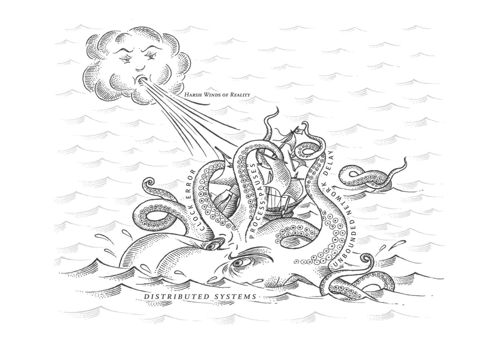
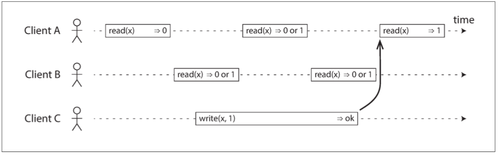

# 第九章：一致性与共识

> 好死还是赖活着？
> —— Jay Kreps, 关于 Kafka 与 Jepsen 的若干笔记 (2013)

---------------

[TOC]

正如 [第八章](ch8.md) 所讨论的，分布式系统中的许多事情可能会出错。处理这种故障的最简单方法是简单地让整个服务失效，并向用户显示错误消息。如果无法接受这个解决方案，我们就需要找到容错的方法 —— 即使某些内部组件出现故障，服务也能正常运行。

在本章中，我们将讨论构建容错分布式系统的算法和协议的一些例子。我们将假设 [第八章](ch8.md) 的所有问题都可能发生：网络中的数据包可能会丢失、重新排序、重复推送或任意延迟；时钟只是尽其所能地近似；且节点可以暂停（例如，由于垃圾收集）或随时崩溃。

构建容错系统的最好方法，是找到一些带有实用保证的通用抽象，实现一次，然后让应用依赖这些保证。这与 [第七章](ch7.md) 中的事务处理方法相同：通过使用事务，应用可以假装没有崩溃（原子性），没有其他人同时访问数据库（隔离），存储设备是完全可靠的（持久性）。即使发生崩溃，竞态条件和磁盘故障，事务抽象隐藏了这些问题，因此应用不必担心它们。

现在我们将继续沿着同样的路线前进，寻求可以让应用忽略分布式系统部分问题的抽象概念。例如，分布式系统最重要的抽象之一就是 **共识（consensus）**：**就是让所有的节点对某件事达成一致**。正如我们在本章中将会看到的那样，要可靠地达成共识，且不被网络故障和进程故障所影响，是一个令人惊讶的棘手问题。

一旦达成共识，应用可以将其用于各种目的。例如，假设你有一个单主复制的数据库。如果主库挂掉，并且需要故障切换到另一个节点，剩余的数据库节点可以使用共识来选举新的领导者。正如在 “[处理节点宕机](ch5.md#处理节点宕机)” 中所讨论的那样，重要的是只有一个领导者，且所有的节点都认同其领导。如果两个节点都认为自己是领导者，这种情况被称为 **脑裂（split brain）**，它经常会导致数据丢失。正确实现共识有助于避免这种问题。

在本章后面的 “[分布式事务与共识](#分布式事务与共识)” 中，我们将研究解决共识和相关问题的算法。但首先，我们首先需要探索可以在分布式系统中提供的保证和抽象的范围。

我们需要了解可以做什么和不可以做什么的范围：在某些情况下，系统可以容忍故障并继续工作；在其他情况下，这是不可能的。我们将深入研究什么可能而什么不可能的限制，既通过理论证明，也通过实际实现。我们将在本章中概述这些基本限制。

分布式系统领域的研究人员几十年来一直在研究这些主题，所以有很多资料 —— 我们只能介绍一些皮毛。在本书中，我们没有空间去详细介绍形式模型和证明的细节，所以我们会按照直觉来介绍。如果你有兴趣，参考文献可以提供更多的深度。

## 一致性保证

在 “[复制延迟问题](ch5.md#复制延迟问题)” 中，我们看到了数据库复制中发生的一些时序问题。如果你在同一时刻查看两个数据库节点，则可能在两个节点上看到不同的数据，因为写请求在不同的时间到达不同的节点。无论数据库使用何种复制方法（单主复制，多主复制或无主复制），都会出现这些不一致情况。

大多数复制的数据库至少提供了 **最终一致性**，这意味着如果你停止向数据库写入数据并等待一段不确定的时间，那么最终所有的读取请求都会返回相同的值【1】。换句话说，不一致性是暂时的，最终会自行解决（假设网络中的任何故障最终都会被修复）。最终一致性的一个更好的名字可能是 **收敛（convergence）**，因为我们预计所有的副本最终会收敛到相同的值【2】。

然而，这是一个非常弱的保证 —— 它并没有说什么时候副本会收敛。在收敛之前，读操作可能会返回任何东西或什么都没有【1】。例如，如果你写入了一个值，然后立即再次读取，这并不能保证你能看到刚才写入的值，因为读请求可能会被路由到另外的副本上。（请参阅 “[读己之写](ch5.md#读己之写)” ）。

对于应用开发人员而言，最终一致性是很困难的，因为它与普通单线程程序中变量的行为有很大区别。对于后者，如果将一个值赋给一个变量，然后很快地再次读取，不可能读到旧的值，或者读取失败。数据库表面上看起来像一个你可以读写的变量，但实际上它有更复杂的语义【3】。

在与只提供弱保证的数据库打交道时，你需要始终意识到它的局限性，而不是意外地作出太多假设。错误往往是微妙的，很难找到，也很难测试，因为应用可能在大多数情况下运行良好。当系统出现故障（例如网络中断）或高并发时，最终一致性的边缘情况才会显现出来。

本章将探索数据系统可能选择提供的更强一致性模型。它不是免费的：具有较强保证的系统可能会比保证较差的系统具有更差的性能或更少的容错性。尽管如此，更强的保证能够吸引人，因为它们更容易用对。只有见过不同的一致性模型后，才能更好地决定哪一个最适合自己的需求。

**分布式一致性模型** 和我们之前讨论的事务隔离级别的层次结构有一些相似之处【4,5】（请参阅 “[弱隔离级别](ch7.md#弱隔离级别)”）。尽管两者有一部分内容重叠，但它们大多是无关的问题：事务隔离主要是为了 **避免由于同时执行事务而导致的竞争状态**，而分布式一致性主要关于 **在面对延迟和故障时如何协调副本间的状态**。

本章涵盖了广泛的话题，但我们将会看到这些领域实际上是紧密联系在一起的：

* 首先看一下常用的 **最强一致性模型** 之一，**线性一致性（linearizability）**，并考察其优缺点。
* 然后我们将检查分布式系统中 [**事件顺序**](#顺序保证) 的问题，特别是因果关系和全局顺序的问题。
* 在第三节的（“[分布式事务与共识](#分布式事务与共识)”）中将探讨如何原子地提交分布式事务，这将最终引领我们走向共识问题的解决方案。

## 线性一致性

在 **最终一致** 的数据库，如果你在同一时刻问两个不同副本相同的问题，可能会得到两个不同的答案。这很让人困惑。如果数据库可以提供只有一个副本的假象（即，只有一个数据副本），那么事情就简单太多了。那么每个客户端都会有相同的数据视图，且不必担心复制滞后了。

这就是 **线性一致性（linearizability）** 背后的想法【6】（也称为 **原子一致性（atomic consistency）**【7】，**强一致性（strong consistency）**，**立即一致性（immediate consistency）** 或 **外部一致性（external consistency ）**【8】）。线性一致性的精确定义相当微妙，我们将在本节的剩余部分探讨它。但是基本的想法是让一个系统看起来好像只有一个数据副本，而且所有的操作都是原子性的。有了这个保证，即使实际中可能有多个副本，应用也不需要担心它们。

在一个线性一致的系统中，只要一个客户端成功完成写操作，所有客户端从数据库中读取数据必须能够看到刚刚写入的值。要维护数据的单个副本的假象，系统应保障读到的值是最近的、最新的，而不是来自陈旧的缓存或副本。换句话说，线性一致性是一个 **新鲜度保证（recency guarantee）**。为了阐明这个想法，我们来看看一个非线性一致系统的例子。

**图 9-1 这个系统是非线性一致的，导致了球迷的困惑**

[图 9-1](img/fig9-1.png) 展示了一个关于体育网站的非线性一致例子【9】。Alice 和 Bob 正坐在同一个房间里，都盯着各自的手机，关注着 2014 年 FIFA 世界杯决赛的结果。在最后得分公布后，Alice 刷新页面，看到宣布了获胜者，并兴奋地告诉 Bob。Bob 难以置信地刷新了自己的手机，但他的请求路由到了一个落后的数据库副本上，手机显示比赛仍在进行。

如果 Alice 和 Bob 在同一时间刷新并获得了两个不同的查询结果，也许就没有那么令人惊讶了。因为他们不知道服务器处理他们请求的精确时刻。然而 Bob 是在听到 Alice 惊呼最后得分 **之后**，点击了刷新按钮（启动了他的查询），因此他希望查询结果至少与爱丽丝一样新鲜。但他的查询返回了陈旧结果，这一事实违背了线性一致性的要求。

### 什么使得系统线性一致？

线性一致性背后的基本思想很简单：使系统看起来好像只有一个数据副本。然而确切来讲，实际上有更多要操心的地方。为了更好地理解线性一致性，让我们再看几个例子。

[图 9-2](img/fig9-2.png) 显示了三个客户端在线性一致数据库中同时读写相同的键 `x`。在分布式系统文献中，`x` 被称为 **寄存器（register）**，例如，它可以是键值存储中的一个 **键**，关系数据库中的一 **行**，或文档数据库中的一个 **文档**。

**图 9-2 如果读取请求与写入请求并发，则可能会返回旧值或新值**

为了简单起见，[图 9-2](img/fig9-2.png) 采用了用户请求的视角，而不是数据库内部的视角。每个柱都是由客户端发出的请求，其中柱头是请求发送的时刻，柱尾是客户端收到响应的时刻。因为网络延迟变化无常，客户端不知道数据库处理其请求的精确时间 —— 只知道它发生在发送请求和接收响应之间的某个时刻。[^i]

[^i]: 这个图的一个微妙的细节是它假定存在一个全局时钟，由水平轴表示。即使真实的系统通常没有准确的时钟（请参阅 “[不可靠的时钟](ch8.md#不可靠的时钟)”），但这种假设是允许的：为了分析分布式算法，我们可以假设一个精确的全局时钟存在，不过算法无法访问它【47】。算法只能看到由石英振荡器和 NTP 产生的实时逼近。

在这个例子中，寄存器有两种类型的操作：

* $read(x)⇒v$表示客户端请求读取寄存器 `x` 的值，数据库返回值 `v`。
* $write(x,v)⇒r$ 表示客户端请求将寄存器 `x` 设置为值 `v` ，数据库返回响应 `r` （可能正确，可能错误）。

在 [图 9-2](img/fig9-2.png) 中，`x` 的值最初为 `0`，客户端 C 执行写请求将其设置为 `1`。发生这种情况时，客户端 A 和 B 反复轮询数据库以读取最新值。 A 和 B 的请求可能会收到怎样的响应？

* 客户端 A 的第一个读操作，完成于写操作开始之前，因此必须返回旧值 `0`。
* 客户端 A 的最后一个读操作，开始于写操作完成之后。如果数据库是线性一致性的，它必然返回新值 `1`：因为读操作和写操作一定是在其各自的起止区间内的某个时刻被处理。如果在写入结束后开始读取，则读取处理一定发生在写入完成之后，因此它必须看到写入的新值。
* 与写操作在时间上重叠的任何读操作，可能会返回 `0` 或 `1` ，因为我们不知道读取时，写操作是否已经生效。这些操作是 **并发（concurrent）** 的。

但是，这还不足以完全描述线性一致性：如果与写入同时发生的读取可以返回旧值或新值，那么读者可能会在写入期间看到数值在旧值和新值之间来回翻转。这不是我们所期望的仿真 “单一数据副本” 的系统。[^ii]

[^ii]: 如果读取（与写入同时发生时）可能返回旧值或新值，则称该寄存器为 **常规寄存器（regular register）**【7,25】

为了使系统线性一致，我们需要添加另一个约束，如 [图 9-3](img/fig9-3.png) 所示

**图 9-3 任何一个读取返回新值后，所有后续读取（在相同或其他客户端上）也必须返回新值。**

在一个线性一致的系统中，我们可以想象，在 `x` 的值从 `0` 自动翻转到 `1` 的时候（在写操作的开始和结束之间）必定有一个时间点。因此，如果一个客户端的读取返回新的值 `1`，即使写操作尚未完成，所有后续读取也必须返回新值。

[图 9-3](img/fig9-3.png) 中的箭头说明了这个时序依赖关系。客户端 A 是第一个读取新的值 `1` 的位置。在 A 的读取返回之后，B 开始新的读取。由于 B 的读取严格在发生于 A 的读取之后，因此即使 C 的写入仍在进行中，也必须返回 `1`（与 [图 9-1](img/fig9-1.png) 中的 Alice 和 Bob 的情况相同：在 Alice 读取新值之后，Bob 也希望读取新的值）。

我们可以进一步细化这个时序图，展示每个操作是如何在特定时刻原子性生效的。[图 9-4](img/fig9-4.png) 显示了一个更复杂的例子【10】。

在 [图 9-4](img/fig9-4.png) 中，除了读写之外，还增加了第三种类型的操作：

* $cas(x, v_{old}, v_{new})⇒r$ 表示客户端请求进行原子性的 [**比较与设置**](ch7.md#比较并设置（CAS）) 操作。如果寄存器 $x$ 的当前值等于 $v_{old}$ ，则应该原子地设置为 $v_{new}$ 。如果 $x≠v_{old}$ ，则操作应该保持寄存器不变并返回一个错误。 $r$ 是数据库的响应（正确或错误）。

[图 9-4](img/fig9-4.png) 中的每个操作都在我们认为执行操作的时候用竖线标出（在每个操作的条柱之内）。这些标记按顺序连在一起，其结果必须是一个有效的寄存器读写序列（**每次读取都必须返回最近一次写入设置的值**）。

线性一致性的要求是，操作标记的连线总是按时间（从左到右）向前移动，而不是向后移动。这个要求确保了我们之前讨论的新鲜度保证：一旦新的值被写入或读取，所有后续的读都会看到写入的值，直到它被再次覆盖。

**图 9-4 可视化读取和写入看起来已经生效的时间点。 B 的最后读取不是线性一致性的**

[图 9-4](img/fig9-4.png) 中有一些有趣的细节需要指出：

* 第一个客户端 B 发送一个读取 `x` 的请求，然后客户端 D 发送一个请求将 `x` 设置为 `0`，然后客户端 A 发送请求将 `x` 设置为 `1`。尽管如此，返回到 B 的读取值为 `1`（由 A 写入的值）。这是可以的：这意味着数据库首先处理 D 的写入，然后是 A 的写入，最后是 B 的读取。虽然这不是请求发送的顺序，但这是一个可以接受的顺序，因为这三个请求是并发的。也许 B 的读请求在网络上略有延迟，所以它在两次写入之后才到达数据库。

* 在客户端 A 从数据库收到响应之前，客户端 B 的读取返回 `1` ，表示写入值 `1` 已成功。这也是可以的：这并不意味着在写之前读到了值，这只是意味着从数据库到客户端 A 的正确响应在网络中略有延迟。

* 此模型不假设有任何事务隔离：另一个客户端可能随时更改值。例如，C 首先读取 `1` ，然后读取 `2` ，因为两次读取之间的值由 B 更改。可以使用原子 **比较并设置（cas）** 操作来检查该值是否未被另一客户端同时更改：B 和 C 的 **cas** 请求成功，但是 D 的 **cas** 请求失败（在数据库处理它时，`x` 的值不再是 `0` ）。

* 客户 B 的最后一次读取（阴影条柱中）不是线性一致性的。 该操作与 C 的 **cas** 写操作并发（它将 `x` 从 `2` 更新为 `4` ）。在没有其他请求的情况下，B 的读取返回 `2` 是可以的。然而，在 B 的读取开始之前，客户端 A 已经读取了新的值 `4`  ，因此不允许 B 读取比 A 更旧的值。再次，与 [图 9-1](img/fig9-1.png) 中的 Alice 和 Bob 的情况相同。

  这就是线性一致性背后的直觉。 正式的定义【6】更准确地描述了它。 通过记录所有请求和响应的时序，并检查它们是否可以排列成有效的顺序，以测试一个系统的行为是否线性一致性是可能的（尽管在计算上是昂贵的）【11】。

> ### 线性一致性与可串行化
>
> **线性一致性** 容易和 [**可串行化**](ch7.md#可串行化) 相混淆，因为两个词似乎都是类似 “可以按顺序排列” 的东西。但它们是两种完全不同的保证，区分两者非常重要：
>
> ***可串行化***
>
> **可串行化（Serializability）** 是事务的隔离属性，每个事务可以读写多个对象（行，文档，记录）—— 请参阅 “[单对象和多对象操作](ch7.md#单对象和多对象操作)”。它确保事务的行为，与它们按照 **某种** 顺序依次执行的结果相同（每个事务在下一个事务开始之前运行完成）。这种执行顺序可以与事务实际执行的顺序不同。【12】。
>
> ***线性一致性***
>
> **线性一致性（Linearizability）** 是读取和写入寄存器（单个对象）的 **新鲜度保证**。它不会将操作组合为事务，因此它也不会阻止写入偏差等问题（请参阅 “[写入偏差和幻读](ch7.md#写入偏斜与幻读)”），除非采取其他措施（例如 [物化冲突](ch7.md#物化冲突)）。
>
> 一个数据库可以提供可串行化和线性一致性，这种组合被称为严格的可串行化或 **强的单副本可串行化（strong-1SR）**【4,13】。基于两阶段锁定的可串行化实现（请参阅 “[两阶段锁定](ch7.md#两阶段锁定)” 一节）或 **真的串行执行**（请参阅 “[真的串行执行](ch7.md#真的串行执行)”一节）通常是线性一致性的。
>
> 但是，可串行化的快照隔离（请参阅 “[可串行化快照隔离](ch7.md#可串行化快照隔离)”）不是线性一致性的：按照设计，它从一致的快照中进行读取，以避免读者和写者之间的锁竞争。一致性快照的要点就在于 **它不会包括该快照之后的写入**，因此从快照读取不是线性一致性的。

### 依赖线性一致性

线性一致性在什么情况下有用？观看体育比赛的最后得分可能是一个轻率的例子：滞后了几秒钟的结果不太可能在这种情况下造成任何真正的伤害。然而对于少数领域，线性一致性是系统正确工作的一个重要条件。

#### 锁定和领导选举

一个使用单主复制的系统，需要确保领导者真的只有一个，而不是几个（脑裂）。一种选择领导者的方法是使用锁：每个节点在启动时尝试获取锁，成功者成为领导者【14】。不管这个锁是如何实现的，它必须是线性一致的：所有节点必须就哪个节点拥有锁达成一致，否则就没用了。

诸如 Apache ZooKeeper 【15】和 etcd 【16】之类的协调服务通常用于实现分布式锁和领导者选举。它们使用一致性算法，以容错的方式实现线性一致的操作（在本章后面的 “[容错共识](#容错共识)” 中讨论此类算法）[^iii]。还有许多微妙的细节来正确地实现锁和领导者选举（例如，请参阅 “[领导者和锁](ch8.md#领导者和锁)” 中的防护问题），而像 Apache Curator 【17】这样的库则通过在 ZooKeeper 之上提供更高级别的配方来提供帮助。但是，线性一致性存储服务是这些协调任务的基础。

[^iii]: 严格地说，ZooKeeper 和 etcd 提供线性一致性的写操作，但读取可能是陈旧的，因为默认情况下，它们可以由任何一个副本提供服务。你可以选择请求线性一致性读取：etcd 称之为 **法定人数读取（quorum read）**【16】，而在 ZooKeeper 中，你需要在读取之前调用 `sync()`【15】。请参阅 “[使用全序广播实现线性一致的存储](#使用全序广播实现线性一致的存储)”。

分布式锁也在一些分布式数据库（如 Oracle Real Application Clusters（RAC）【18】）中有更细粒度级别的使用。RAC 对每个磁盘页面使用一个锁，多个节点共享对同一个磁盘存储系统的访问权限。由于这些线性一致的锁处于事务执行的关键路径上，RAC 部署通常具有用于数据库节点之间通信的专用集群互连网络。

#### 约束和唯一性保证

唯一性约束在数据库中很常见：例如，用户名或电子邮件地址必须唯一标识一个用户，而在文件存储服务中，不能有两个具有相同路径和文件名的文件。如果要在写入数据时强制执行此约束（例如，如果两个人试图同时创建一个具有相同名称的用户或文件，其中一个将返回一个错误），则需要线性一致性。

这种情况实际上类似于一个锁：当一个用户注册你的服务时，可以认为他们获得了所选用户名的 “锁”。该操作与原子性的比较与设置（CAS）非常相似：将用户名赋予声明它的用户，前提是用户名尚未被使用。

如果想要确保银行账户余额永远不会为负数，或者不会出售比仓库里的库存更多的物品，或者两个人不会都预定了航班或剧院里同一时间的同一个位置。这些约束条件都要求所有节点都同意一个最新的值（账户余额，库存水平，座位占用率）。

在实际应用中，宽松地处理这些限制有时是可以接受的（例如，如果航班超额预订，你可以将客户转移到不同的航班并为其提供补偿）。在这种情况下，可能不需要线性一致性，我们将在 “[及时性与完整性](ch12.md#及时性与完整性)” 中讨论这种宽松的约束。

然而，一个硬性的唯一性约束（关系型数据库中常见的那种）需要线性一致性。其他类型的约束，如外键或属性约束，可以不需要线性一致性【19】。

#### 跨信道的时序依赖

注意 [图 9-1](img/fig9-1.png) 中的一个细节：如果 Alice 没有惊呼得分，Bob 就不会知道他的查询结果是陈旧的。他会在几秒钟之后再次刷新页面，并最终看到最后的分数。由于系统中存在额外的信道（Alice 的声音传到了 Bob 的耳朵中），线性一致性的违背才被注意到。

计算机系统也会出现类似的情况。例如，假设有一个网站，用户可以上传照片，一个后台进程会调整照片大小，降低分辨率以加快下载速度（缩略图）。该系统的架构和数据流如 [图 9-5](img/fig9-5.png) 所示。

图像缩放器需要明确的指令来执行尺寸缩放作业，指令是 Web 服务器通过消息队列发送的（请参阅 [第十一章](ch11.md)）。 Web 服务器不会将整个照片放在队列中，因为大多数消息代理都是针对较短的消息而设计的，而一张照片的空间占用可能达到几兆字节。取而代之的是，首先将照片写入文件存储服务，写入完成后再将给缩放器的指令放入消息队列。

**图 9-5 Web 服务器和图像缩放器通过文件存储和消息队列进行通信，打开竞争条件的可能性。**

如果文件存储服务是线性一致的，那么这个系统应该可以正常工作。如果它不是线性一致的，则存在竞争条件的风险：消息队列（[图 9-5](img/fig9-5.png) 中的步骤 3 和 4）可能比存储服务内部的复制（replication）更快。在这种情况下，当缩放器读取图像（步骤 5）时，可能会看到图像的旧版本，或者什么都没有。如果它处理的是旧版本的图像，则文件存储中的全尺寸图和缩略图就产生了永久性的不一致。

出现这个问题是因为 Web 服务器和缩放器之间存在两个不同的信道：文件存储与消息队列。没有线性一致性的新鲜性保证，这两个信道之间的竞争条件是可能的。这种情况类似于 [图 9-1](img/fig9-1.png)，数据库复制与 Alice 的嘴到 Bob 耳朵之间的真人音频信道之间也存在竞争条件。

线性一致性并不是避免这种竞争条件的唯一方法，但它是最容易理解的。如果你可以控制额外信道（例如消息队列的例子，而不是在 Alice 和 Bob 的例子），则可以使用在 “[读己之写](ch5.md#读己之写)” 讨论过的类似方法，不过会有额外的复杂度代价。

### 实现线性一致的系统

我们已经见到了几个线性一致性有用的例子，让我们思考一下，如何实现一个提供线性一致语义的系统。

由于线性一致性本质上意味着 “表现得好像只有一个数据副本，而且所有的操作都是原子的”，所以最简单的答案就是，真的只用一个数据副本。但是这种方法无法容错：如果持有该副本的节点失效，数据将会丢失，或者至少无法访问，直到节点重新启动。

使系统容错最常用的方法是使用复制。我们再来回顾 [第五章](ch5.md) 中的复制方法，并比较它们是否可以满足线性一致性：

* 单主复制（可能线性一致）

  在具有单主复制功能的系统中（请参阅 “[领导者与追随者](ch5.md#领导者与追随者)”），主库具有用于写入的数据的主副本，而追随者在其他节点上保留数据的备份副本。如果从主库或同步更新的从库读取数据，它们 **可能（potential）** 是线性一致性的 [^iv]。然而，实际上并不是每个单主数据库都是线性一致性的，无论是因为设计的原因（例如，因为使用了快照隔离）还是因为在并发处理上存在错误【10】。

  [^iv]: 对单主数据库进行分区（分片），使得每个分区有一个单独的领导者，不会影响线性一致性，因为线性一致性只是对单一对象的保证。 交叉分区事务是一个不同的问题（请参阅 “[分布式事务与共识](#分布式事务与共识)”）。

  从主库读取依赖一个假设，你确定地知道领导者是谁。正如在 “[真相由多数所定义](ch8.md#真相由多数所定义)” 中所讨论的那样，一个节点很可能会认为它是领导者，而事实上并非如此 —— 如果具有错觉的领导者继续为请求提供服务，可能违反线性一致性【20】。使用异步复制，故障切换时甚至可能会丢失已提交的写入（请参阅 “[处理节点宕机](ch5.md#处理节点宕机)”），这同时违反了持久性和线性一致性。

* 共识算法（线性一致）

  一些在本章后面讨论的共识算法，与单主复制类似。然而，共识协议包含防止脑裂和陈旧副本的措施。正是由于这些细节，共识算法可以安全地实现线性一致性存储。例如，Zookeeper 【21】和 etcd 【22】就是这样工作的。

* 多主复制（非线性一致）

  具有多主程序复制的系统通常不是线性一致的，因为它们同时在多个节点上处理写入，并将其异步复制到其他节点。因此，它们可能会产生需要被解决的写入冲突（请参阅 “[处理写入冲突](ch5.md#处理写入冲突)”）。这种冲突是因为缺少单一数据副本所导致的。

* 无主复制（也许不是线性一致的）

  对于无主复制的系统（Dynamo 风格；请参阅 “[无主复制](ch5.md#无主复制)”），有时候人们会声称通过要求法定人数读写（ $w + r > n$ ）可以获得 “强一致性”。这取决于法定人数的具体配置，以及强一致性如何定义（通常不完全正确）。

  基于日历时钟（例如，在 Cassandra 中；请参阅 “[依赖同步时钟](ch8.md#依赖同步时钟)”）的 “最后写入胜利” 冲突解决方法几乎可以确定是非线性一致的，由于时钟偏差，不能保证时钟的时间戳与实际事件顺序一致。宽松的法定人数（请参阅 “[宽松的法定人数与提示移交](ch5.md#宽松的法定人数与提示移交)”）也破坏了线性一致的可能性。即使使用严格的法定人数，非线性一致的行为也是可能的，如下节所示。

#### 线性一致性和法定人数

直觉上在 Dynamo 风格的模型中，严格的法定人数读写应该是线性一致性的。但是当我们有可变的网络延迟时，就可能存在竞争条件，如 [图 9-6](img/fig9-6.png) 所示。

**图 9-6 非线性一致的执行，尽管使用了严格的法定人数**

在 [图 9-6](img/fig9-6.png) 中，$x$ 的初始值为 0，写入客户端通过向所有三个副本（ $n = 3, w = 3$ ）发送写入将 $x$ 更新为 `1`。客户端 A 并发地从两个节点组成的法定人群（ $r = 2$ ）中读取数据，并在其中一个节点上看到新值 `1` 。客户端 B 也并发地从两个不同的节点组成的法定人数中读取，并从两个节点中取回了旧值 `0` 。

法定人数条件满足（ $w + r> n$ ），但是这个执行是非线性一致的：B 的请求在 A 的请求完成后开始，但是 B 返回旧值，而 A 返回新值。 （又一次，如同 Alice 和 Bob 的例子 [图 9-1](img/fig9-1.png)）

有趣的是，通过牺牲性能，可以使 Dynamo 风格的法定人数线性化：读取者必须在将结果返回给应用之前，同步执行读修复（请参阅 “[读修复和反熵](ch5.md#读修复和反熵)”） ，并且写入者必须在发送写入之前，读取法定数量节点的最新状态【24,25】。然而，由于性能损失，Riak 不执行同步读修复【26】。 Cassandra 在进行法定人数读取时，**确实** 在等待读修复完成【27】；但是由于使用了最后写入胜利的冲突解决方案，当同一个键有多个并发写入时，将不能保证线性一致性。

而且，这种方式只能实现线性一致的读写；不能实现线性一致的比较和设置（CAS）操作，因为它需要一个共识算法【28】。

总而言之，最安全的做法是：假设采用 Dynamo 风格无主复制的系统不能提供线性一致性。

### 线性一致性的代价

一些复制方法可以提供线性一致性，另一些复制方法则不能，因此深入地探讨线性一致性的优缺点是很有趣的。

我们已经在 [第五章](ch5.md) 中讨论了不同复制方法的一些用例。例如对多数据中心的复制而言，多主复制通常是理想的选择（请参阅 “[运维多个数据中心](ch5.md#运维多个数据中心)”）。[图 9-7](img/fig9-7.png) 说明了这种部署的一个例子。

**图 9-7 网络中断迫使在线性一致性和可用性之间做出选择。**

考虑这样一种情况：如果两个数据中心之间发生网络中断会发生什么？我们假设每个数据中心内的网络正在工作，客户端可以访问数据中心，但数据中心之间彼此无法互相连接。

使用多主数据库，每个数据中心都可以继续正常运行：由于在一个数据中心写入的数据是异步复制到另一个数据中心的，所以在恢复网络连接时，写入操作只是简单地排队并交换。

另一方面，如果使用单主复制，则主库必须位于其中一个数据中心。任何写入和任何线性一致的读取请求都必须发送给该主库，因此对于连接到从库所在数据中心的客户端，这些读取和写入请求必须通过网络同步发送到主库所在的数据中心。

在单主配置的条件下，如果数据中心之间的网络被中断，则连接到从库数据中心的客户端无法联系到主库，因此它们无法对数据库执行任何写入，也不能执行任何线性一致的读取。它们仍能从从库读取，但结果可能是陈旧的（非线性一致）。如果应用需要线性一致的读写，却又位于与主库网络中断的数据中心，则网络中断将导致这些应用不可用。

如果客户端可以直接连接到主库所在的数据中心，这就不是问题了，那些应用可以继续正常工作。但只能访问从库数据中心的客户端会中断运行，直到网络连接得到修复。

#### CAP定理

这个问题不仅仅是单主复制和多主复制的后果：任何线性一致的数据库都有这个问题，不管它是如何实现的。这个问题也不仅仅局限于多数据中心部署，而可能发生在任何不可靠的网络上，即使在同一个数据中心内也是如此。问题面临的权衡如下：[^v]

* 如果应用需要线性一致性，且某些副本因为网络问题与其他副本断开连接，那么这些副本掉线时不能处理请求。请求必须等到网络问题解决，或直接返回错误。（无论哪种方式，服务都 **不可用**）。
* 如果应用不需要线性一致性，那么某个副本即使与其他副本断开连接，也可以独立处理请求（例如多主复制）。在这种情况下，应用可以在网络问题前保持可用，但其行为不是线性一致的。

[^v]: 这两种选择有时分别称为 CP（在网络分区下一致但不可用）和 AP（在网络分区下可用但不一致）。 但是，这种分类方案存在一些缺陷【9】，所以最好不要这样用。

因此，不需要线性一致性的应用对网络问题有更强的容错能力。这种见解通常被称为 CAP 定理【29,30,31,32】，由 Eric Brewer 于 2000 年命名，尽管 70 年代的分布式数据库设计者早就知道了这种权衡【33,34,35,36】。

CAP 最初是作为一个经验法则提出的，没有准确的定义，目的是开始讨论数据库的权衡。那时候许多分布式数据库侧重于在共享存储的集群上提供线性一致性的语义【18】，CAP 定理鼓励数据库工程师向分布式无共享系统的设计领域深入探索，这类架构更适合实现大规模的网络服务【37】。 对于这种文化上的转变，CAP 值得赞扬 —— 它见证了自 00 年代中期以来新数据库的技术爆炸（即 NoSQL）。

> #### CAP定理没有帮助
>
> CAP 有时以这种面目出现：一致性，可用性和分区容错性：三者只能择其二。不幸的是这种说法很有误导性【32】，因为网络分区是一种故障类型，所以它并不是一个选项：不管你喜不喜欢它都会发生【38】。
>
> 在网络正常工作的时候，系统可以提供一致性（线性一致性）和整体可用性。发生网络故障时，你必须在线性一致性和整体可用性之间做出选择。因此，CAP 更好的表述成：在分区时要么选择一致，要么选择可用【39】。一个更可靠的网络需要减少这个选择，但是在某些时候选择是不可避免的。
>
> 在 CAP 的讨论中，术语可用性有几个相互矛盾的定义，形式化作为一个定理【30】并不符合其通常的含义【40】。许多所谓的 “高可用”（容错）系统实际上不符合 CAP 对可用性的特殊定义。总而言之，围绕着 CAP 有很多误解和困惑，并不能帮助我们更好地理解系统，所以最好避免使用 CAP。

CAP 定理的正式定义仅限于很狭隘的范围【30】，它只考虑了一个一致性模型（即线性一致性）和一种故障（网络分区 [^vi]，或活跃但彼此断开的节点）。它没有讨论任何关于网络延迟，死亡节点或其他权衡的事。 因此，尽管 CAP 在历史上有一些影响力，但对于设计系统而言并没有实际价值【9,40】。

在分布式系统中有更多有趣的 “不可能” 的结果【41】，且 CAP 定理现在已经被更精确的结果取代【2,42】，所以它现在基本上成了历史古迹了。

[^vi]: 正如 “[真实世界的网络故障](ch8.md#真实世界的网络故障)” 中所讨论的，本书使用 **分区（partition）** 指代将大数据集细分为小数据集的操作（分片；请参阅 [第六章](ch6.md)）。与之对应的是，**网络分区（network partition）** 是一种特定类型的网络故障，我们通常不会将其与其他类型的故障分开考虑。但是，由于它是 CAP 的 P，所以这种情况下我们无法避免混乱。

#### 线性一致性和网络延迟

虽然线性一致是一个很有用的保证，但实际上，线性一致的系统惊人的少。例如，现代多核 CPU 上的内存甚至都不是线性一致的【43】：如果一个 CPU 核上运行的线程写入某个内存地址，而另一个 CPU 核上运行的线程不久之后读取相同的地址，并没有保证一定能读到第一个线程写入的值（除非使用了 **内存屏障（memory barrier）** 或 **围栏（fence）**【44】）。

这种行为的原因是每个 CPU 核都有自己的内存缓存和存储缓冲区。默认情况下，内存访问首先走缓存，任何变更会异步写入主存。因为缓存访问比主存要快得多【45】，所以这个特性对于现代 CPU 的良好性能表现至关重要。但是现在就有几个数据副本（一个在主存中，也许还有几个在不同缓存中的其他副本），而且这些副本是异步更新的，所以就失去了线性一致性。

为什么要做这个权衡？对多核内存一致性模型而言，CAP 定理是没有意义的：在同一台计算机中，我们通常假定通信都是可靠的。并且我们并不指望一个 CPU 核能在脱离计算机其他部分的条件下继续正常工作。牺牲线性一致性的原因是 **性能（performance）**，而不是容错。

许多分布式数据库也是如此：它们是 **为了提高性能** 而选择了牺牲线性一致性，而不是为了容错【46】。线性一致的速度很慢 —— 这始终是事实，而不仅仅是网络故障期间。

能找到一个更高效的线性一致存储实现吗？看起来答案是否定的：Attiya 和 Welch 【47】证明，如果你想要线性一致性，读写请求的响应时间至少与网络延迟的不确定性成正比。在像大多数计算机网络一样具有高度可变延迟的网络中（请参阅 “[超时与无穷的延迟](ch8.md#超时与无穷的延迟)”），线性读写的响应时间不可避免地会很高。更快地线性一致算法不存在，但更弱的一致性模型可以快得多，所以对延迟敏感的系统而言，这类权衡非常重要。在 [第十二章](ch12.md) 中将讨论一些在不牺牲正确性的前提下，绕开线性一致性的方法。

## 顺序保证

之前说过，线性一致寄存器的行为就好像只有单个数据副本一样，且每个操作似乎都是在某个时间点以原子性的方式生效的。这个定义意味着操作是按照某种良好定义的顺序执行的。我们将操作以看上去被执行的顺序连接起来，以此说明了 [图 9-4](img/fig9-4.png) 中的顺序。

**顺序（ordering）** 这一主题在本书中反复出现，这表明它可能是一个重要的基础性概念。让我们简要回顾一下其它曾经出现过 **顺序** 的上下文：

* 在 [第五章](ch5.md) 中我们看到，领导者在单主复制中的主要目的就是，在复制日志中确定 **写入顺序（order of write）**—— 也就是从库应用这些写入的顺序。如果不存在一个领导者，则并发操作可能导致冲突（请参阅 “[处理写入冲突](ch5.md#处理写入冲突)”）。
* 在 [第七章](ch7.md) 中讨论的 **可串行化**，是关于事务表现的像按 **某种先后顺序（some sequential order）** 执行的保证。它可以字面意义上地以 **串行顺序（serial order）** 执行事务来实现，或者允许并行执行，但同时防止序列化冲突来实现（通过锁或中止事务）。
* 在 [第八章](ch8.md) 讨论过的在分布式系统中使用时间戳和时钟（请参阅 “[依赖同步时钟](ch8.md#依赖同步时钟)”）是另一种将顺序引入无序世界的尝试，例如，确定两个写入操作哪一个更晚发生。

事实证明，顺序、线性一致性和共识之间有着深刻的联系。尽管这个概念比本书其他部分更加理论化和抽象，但对于明确系统的能力范围（可以做什么和不可以做什么）而言是非常有帮助的。我们将在接下来的几节中探讨这个话题。

### 顺序与因果关系

**顺序** 反复出现有几个原因，其中一个原因是，它有助于保持 **因果关系（causality）**。在本书中我们已经看到了几个例子，其中因果关系是很重要的：

* 在 “[一致前缀读](ch5.md#一致前缀读)”（[图 5-5](img/fig5-5.png)）中，我们看到一个例子：一个对话的观察者首先看到问题的答案，然后才看到被回答的问题。这是令人困惑的，因为它违背了我们对 **因（cause）** 与 **果（effect）** 的直觉：如果一个问题被回答，显然问题本身得先在那里，因为给出答案的人必须先看到这个问题（假如他们并没有预见未来的超能力）。我们认为在问题和答案之间存在 **因果依赖（causal dependency）**。
* [图 5-9](img/fig5-9.png) 中出现了类似的模式，我们看到三位领导者之间的复制，并注意到由于网络延迟，一些写入可能会 “压倒” 其他写入。从其中一个副本的角度来看，好像有一个对尚不存在的记录的更新操作。这里的因果意味着，一条记录必须先被创建，然后才能被更新。
* 在 “[检测并发写入](ch5.md#检测并发写入)” 中我们观察到，如果有两个操作 A 和 B，则存在三种可能性：A 发生在 B 之前，或 B 发生在 A 之前，或者 A 和 B**并发**。这种 **此前发生（happened before）** 关系是因果关系的另一种表述：如果 A 在 B 前发生，那么意味着 B 可能已经知道了 A，或者建立在 A 的基础上，或者依赖于 A。如果 A 和 B 是 **并发** 的，那么它们之间并没有因果联系；换句话说，我们确信 A 和 B 不知道彼此。
* 在事务快照隔离的上下文中（“[快照隔离和可重复读](ch7.md#快照隔离和可重复读)”），我们说事务是从一致性快照中读取的。但此语境中 “一致” 到底又是什么意思？这意味着 **与因果关系保持一致（consistent with causality）**：如果快照包含答案，它也必须包含被回答的问题【48】。在某个时间点观察整个数据库，与因果关系保持一致意味着：因果上在该时间点之前发生的所有操作，其影响都是可见的，但因果上在该时间点之后发生的操作，其影响对观察者不可见。**读偏差（read skew）** 意味着读取的数据处于违反因果关系的状态（不可重复读，如 [图 7-6](img/fig7-6.png) 所示）。
* 事务之间 **写偏差（write skew）** 的例子（请参阅 “[写入偏斜与幻读](ch7.md#写入偏斜与幻读)”）也说明了因果依赖：在 [图 7-8](img/fig7-8.png) 中，爱丽丝被允许离班，因为事务认为鲍勃仍在值班，反之亦然。在这种情况下，离班的动作因果依赖于对当前值班情况的观察。[可串行化快照隔离](ch7.md#可串行化快照隔离) 通过跟踪事务之间的因果依赖来检测写偏差。
* 在爱丽丝和鲍勃看球的例子中（[图 9-1](img/fig9-1.png)），在听到爱丽丝惊呼比赛结果后，鲍勃从服务器得到陈旧结果的事实违背了因果关系：爱丽丝的惊呼因果依赖于得分宣告，所以鲍勃应该也能在听到爱丽斯惊呼后查询到比分。相同的模式在 “[跨信道的时序依赖](#跨信道的时序依赖)” 一节中，以 “图像大小调整服务” 的伪装再次出现。

因果关系对事件施加了一种 **顺序**：因在果之前；消息发送在消息收取之前。而且就像现实生活中一样，一件事会导致另一件事：某个节点读取了一些数据然后写入一些结果，另一个节点读取其写入的内容，并依次写入一些其他内容，等等。这些因果依赖的操作链定义了系统中的因果顺序，即，什么在什么之前发生。

如果一个系统服从因果关系所规定的顺序，我们说它是 **因果一致（causally consistent）** 的。例如，快照隔离提供了因果一致性：当你从数据库中读取到一些数据时，你一定还能够看到其因果前驱（假设在此期间这些数据还没有被删除）。

#### 因果顺序不是全序的

**全序（total order）** 允许任意两个元素进行比较，所以如果有两个元素，你总是可以说出哪个更大，哪个更小。例如，自然数集是全序的：给定两个自然数，比如说 5 和 13，那么你可以告诉我，13 大于 5。

然而数学集合并不完全是全序的：`{a, b}` 比 `{b, c}` 更大吗？好吧，你没法真正比较它们，因为二者都不是对方的子集。我们说它们是 **无法比较（incomparable）** 的，因此数学集合是 **偏序（partially order）** 的：在某些情况下，可以说一个集合大于另一个（如果一个集合包含另一个集合的所有元素），但在其他情况下它们是无法比较的 [^译注i]。

[^译注i]: 设 R 为非空集合 A 上的关系，如果 R 是自反的、反对称的和可传递的，则称 R 为 A 上的偏序关系。简称偏序，通常记作≦。一个集合 A 与 A 上的偏序关系 R 一起叫作偏序集，记作 $(A,R)$ 或 $(A, ≦)$。全序、偏序、关系、集合，这些概念的精确定义可以参考任意一本离散数学教材。

全序和偏序之间的差异反映在不同的数据库一致性模型中：

* 线性一致性

  在线性一致的系统中，操作是全序的：如果系统表现的就好像只有一个数据副本，并且所有操作都是原子性的，这意味着对任何两个操作，我们总是能判定哪个操作先发生。这个全序在 [图 9-4](img/fig9-4.png) 中以时间线表示。

* 因果性

  我们说过，如果两个操作都没有在彼此 **之前发生**，那么这两个操作是并发的（请参阅 [“此前发生” 的关系和并发](ch5.md#“此前发生”的关系和并发)）。换句话说，如果两个事件是因果相关的（一个发生在另一个事件之前），则它们之间是有序的，但如果它们是并发的，则它们之间的顺序是无法比较的。这意味着因果关系定义了一个偏序，而不是一个全序：一些操作相互之间是有顺序的，但有些则是无法比较的。

因此，根据这个定义，在线性一致的数据存储中是不存在并发操作的：必须有且仅有一条时间线，所有的操作都在这条时间线上，构成一个全序关系。可能有几个请求在等待处理，但是数据存储确保了每个请求都是在唯一时间线上的某个时间点自动处理的，不存在任何并发。

并发意味着时间线会分岔然后合并 —— 在这种情况下，不同分支上的操作是无法比较的（即并发操作）。在 [第五章](ch5.md) 中我们看到了这种现象：例如，[图 5-14](img/fig5-14.png) 并不是一条直线的全序关系，而是一堆不同的操作并发进行。图中的箭头指明了因果依赖 —— 操作的偏序。

如果你熟悉像 Git 这样的分布式版本控制系统，那么其版本历史与因果关系图极其相似。通常，一个 **提交（Commit）** 发生在另一个提交之后，在一条直线上。但是有时你会遇到分支（当多个人同时在一个项目上工作时），**合并（Merge）** 会在这些并发创建的提交相融合时创建。

#### 线性一致性强于因果一致性

那么因果顺序和线性一致性之间的关系是什么？答案是线性一致性 **隐含着（implies）** 因果关系：任何线性一致的系统都能正确保持因果性【7】。特别是，如果系统中有多个通信通道（如 [图 9-5](img/fig9-5.png) 中的消息队列和文件存储服务），线性一致性可以自动保证因果性，系统无需任何特殊操作（如在不同组件间传递时间戳）。

线性一致性确保因果性的事实使线性一致系统变得简单易懂，更有吸引力。然而，正如 “[线性一致性的代价](#线性一致性的代价)” 中所讨论的，使系统线性一致可能会损害其性能和可用性，尤其是在系统具有严重的网络延迟的情况下（例如，如果系统在地理上散布）。出于这个原因，一些分布式数据系统已经放弃了线性一致性，从而获得更好的性能，但它们用起来也更为困难。

好消息是存在折衷的可能性。线性一致性并不是保持因果性的唯一途径 —— 还有其他方法。一个系统可以是因果一致的，而无需承担线性一致带来的性能折损（尤其对于 CAP 定理不适用的情况）。实际上在所有的不会被网络延迟拖慢的一致性模型中，因果一致性是可行的最强的一致性模型。而且在网络故障时仍能保持可用【2,42】。

在许多情况下，看上去需要线性一致性的系统，实际上需要的只是因果一致性，因果一致性可以更高效地实现。基于这种观察结果，研究人员正在探索新型的数据库，既能保证因果一致性，且性能与可用性与最终一致的系统类似【49,50,51】。

这方面的研究相当新鲜，其中很多尚未应用到生产系统，仍然有不少挑战需要克服【52,53】。但对于未来的系统而言，这是一个有前景的方向。

#### 捕获因果关系

我们不会在这里讨论非线性一致的系统如何保证因果性的细节，而只是简要地探讨一些关键的思想。

为了维持因果性，你需要知道哪个操作发生在哪个其他操作之前（**happened before**）。这是一个偏序：并发操作可以以任意顺序进行，但如果一个操作发生在另一个操作之前，那它们必须在所有副本上以那个顺序被处理。因此，当一个副本处理一个操作时，它必须确保所有因果前驱的操作（之前发生的所有操作）已经被处理；如果前面的某个操作丢失了，后面的操作必须等待，直到前面的操作被处理完毕。

为了确定因果依赖，我们需要一些方法来描述系统中节点的 “知识”。如果节点在发出写入 Y 的请求时已经看到了 X 的值，则 X 和 Y 可能存在因果关系。这个分析使用了那些在欺诈指控刑事调查中常见的问题：CEO 在做出决定 Y 时是否 **知道** X ？

用于确定 *哪些操作发生在其他操作之前* 的技术，与我们在 “[检测并发写入](ch5.md#检测并发写入)” 中所讨论的内容类似。那一节讨论了无领导者数据存储中的因果性：为了防止丢失更新，我们需要检测到对同一个键的并发写入。因果一致性则更进一步：它需要跟踪整个数据库中的因果依赖，而不仅仅是一个键。可以推广版本向量以解决此类问题【54】。

为了确定因果顺序，数据库需要知道应用读取了哪个版本的数据。这就是为什么在 [图 5-13](img/fig5-13.png) 中，来自先前操作的版本号在写入时被传回到数据库的原因。在 SSI 的冲突检测中会出现类似的想法，如 “[可串行化快照隔离](ch7.md#可串行化快照隔离)” 中所述：当事务要提交时，数据库将检查它所读取的数据版本是否仍然是最新的。为此，数据库跟踪哪些数据被哪些事务所读取。

### 序列号顺序

虽然因果是一个重要的理论概念，但实际上跟踪所有的因果关系是不切实际的。在许多应用中，客户端在写入内容之前会先读取大量数据，我们无法弄清写入因果依赖于先前全部的读取内容，还是仅包括其中一部分。显式跟踪所有已读数据意味着巨大的额外开销。

但还有一个更好的方法：我们可以使用 **序列号（sequence nunber）** 或 **时间戳（timestamp）** 来排序事件。时间戳不一定来自日历时钟（或物理时钟，它们存在许多问题，如 “[不可靠的时钟](ch8.md#不可靠的时钟)” 中所述）。它可以来自一个 **逻辑时钟（logical clock）**，这是一个用来生成标识操作的数字序列的算法，典型实现是使用一个每次操作自增的计数器。

这样的序列号或时间戳是紧凑的（只有几个字节大小），它提供了一个全序关系：也就是说每个操作都有一个唯一的序列号，而且总是可以比较两个序列号，确定哪一个更大（即哪些操作后发生）。

特别是，我们可以使用 **与因果一致（consistent with causality）** 的全序来生成序列号 [^vii]：我们保证，如果操作 A 因果地发生在操作 B 前，那么在这个全序中 A 在 B 前（ A 具有比 B 更小的序列号）。并行操作之间可以任意排序。这样一个全序关系捕获了所有关于因果的信息，但也施加了一个比因果性要求更为严格的顺序。

[^vii]: 与因果关系不一致的全序很容易创建，但没啥用。例如你可以为每个操作生成随机的 UUID，并按照字典序比较 UUID，以定义操作的全序。这是一个有效的全序，但是随机的 UUID 并不能告诉你哪个操作先发生，或者操作是否为并发的。

在单主复制的数据库中（请参阅 “[领导者与追随者](ch5.md#领导者与追随者)”），复制日志定义了与因果一致的写操作。主库可以简单地为每个操作自增一个计数器，从而为复制日志中的每个操作分配一个单调递增的序列号。如果一个从库按照它们在复制日志中出现的顺序来应用写操作，那么从库的状态始终是因果一致的（即使它落后于领导者）。

#### 非因果序列号生成器

如果主库不存在（可能因为使用了多主数据库或无主数据库，或者因为使用了分区的数据库），如何为操作生成序列号就没有那么明显了。在实践中有各种各样的方法：

* 每个节点都可以生成自己独立的一组序列号。例如有两个节点，一个节点只能生成奇数，而另一个节点只能生成偶数。通常，可以在序列号的二进制表示中预留一些位，用于唯一的节点标识符，这样可以确保两个不同的节点永远不会生成相同的序列号。
*可以将日历时钟（物理时钟）的时间戳附加到每个操作上【55】。这种时间戳并不连续，但是如果它具有足够高的分辨率，那也许足以提供一个操作的全序关系。这一事实应用于* 最后写入胜利 * 的冲突解决方法中（请参阅 “[有序事件的时间戳](ch8.md#有序事件的时间戳)”）。
* 可以预先分配序列号区块。例如，节点 A 可能要求从序列号 1 到 1,000 区块的所有权，而节点 B 可能要求序列号 1,001 到 2,000 区块的所有权。然后每个节点可以独立分配所属区块中的序列号，并在序列号告急时请求分配一个新的区块。

这三个选项都比单一主库的自增计数器表现要好，并且更具可伸缩性。它们为每个操作生成一个唯一的，近似自增的序列号。然而它们都有同一个问题：生成的序列号与因果不一致。

因为这些序列号生成器不能正确地捕获跨节点的操作顺序，所以会出现因果关系的问题：

* 每个节点每秒可以处理不同数量的操作。因此，如果一个节点产生偶数序列号而另一个产生奇数序列号，则偶数计数器可能落后于奇数计数器，反之亦然。如果你有一个奇数编号的操作和一个偶数编号的操作，你无法准确地说出哪一个操作在因果上先发生。

* 来自物理时钟的时间戳会受到时钟偏移的影响，这可能会使其与因果不一致。例如 [图 8-3](img/fig8-3.png) 展示了一个例子，其中因果上晚发生的操作，却被分配了一个更早的时间戳。[^vii]

  [^viii]: 可以使物理时钟时间戳与因果关系保持一致：在 “[全局快照的同步时钟](#全局快照的同步时钟)” 中，我们讨论了 Google 的 Spanner，它可以估计预期的时钟偏差，并在提交写入之前等待不确定性间隔。这种方法确保了实际上靠后的事务会有更大的时间戳。但是大多数时钟不能提供这种所需的不确定性度量。

* 在分配区块的情况下，某个操作可能会被赋予一个范围在 1,001 到 2,000 内的序列号，然而一个因果上更晚的操作可能被赋予一个范围在 1 到 1,000 之间的数字。这里序列号与因果关系也是不一致的。

#### 兰伯特时间戳

尽管刚才描述的三个序列号生成器与因果不一致，但实际上有一个简单的方法来产生与因果关系一致的序列号。它被称为兰伯特时间戳，莱斯利・兰伯特（Leslie Lamport）于 1978 年提出【56】，现在是分布式系统领域中被引用最多的论文之一。

[图 9-8](img/fig9-8.png) 说明了兰伯特时间戳的应用。每个节点都有一个唯一标识符，和一个保存自己执行操作数量的计数器。 兰伯特时间戳就是两者的简单组合：（计数器，节点 ID）$(counter, node ID)$。两个节点有时可能具有相同的计数器值，但通过在时间戳中包含节点 ID，每个时间戳都是唯一的。

**图 9-8  Lamport 时间戳提供了与因果关系一致的全序。**

兰伯特时间戳与物理的日历时钟没有任何关系，但是它提供了一个全序：如果你有两个时间戳，则 **计数器** 值大者是更大的时间戳。如果计数器值相同，则节点 ID 越大的，时间戳越大。

迄今，这个描述与上节所述的奇偶计数器基本类似。使兰伯特时间戳因果一致的关键思想如下所示：每个节点和每个客户端跟踪迄今为止所见到的最大 **计数器** 值，并在每个请求中包含这个最大计数器值。当一个节点收到最大计数器值大于自身计数器值的请求或响应时，它立即将自己的计数器设置为这个最大值。

这如 [图 9-8](img/fig9-8.png) 所示，其中客户端 A 从节点 2 接收计数器值 `5` ，然后将最大值 `5` 发送到节点 1 。此时，节点 1 的计数器仅为 `1` ，但是它立即前移至 `5` ，所以下一个操作的计数器的值为 `6` 。

只要每一个操作都携带着最大计数器值，这个方案确保兰伯特时间戳的排序与因果一致，因为每个因果依赖都会导致时间戳增长。

兰伯特时间戳有时会与我们在 “[检测并发写入](ch5.md#检测并发写入)” 中看到的版本向量相混淆。虽然两者有一些相似之处，但它们有着不同的目的：版本向量可以区分两个操作是并发的，还是一个因果依赖另一个；而兰伯特时间戳总是施行一个全序。从兰伯特时间戳的全序中，你无法分辨两个操作是并发的还是因果依赖的。 兰伯特时间戳优于版本向量的地方是，它更加紧凑。

#### 光有时间戳排序还不够

虽然兰伯特时间戳定义了一个与因果一致的全序，但它还不足以解决分布式系统中的许多常见问题。

例如，考虑一个需要确保用户名能唯一标识用户帐户的系统。如果两个用户同时尝试使用相同的用户名创建帐户，则其中一个应该成功，另一个应该失败（我们之前在 “[领导者和锁](ch8.md#领导者和锁)” 中提到过这个问题）。

乍看之下，似乎操作的全序关系足以解决这一问题（例如使用兰伯特时间戳）：如果创建了两个具有相同用户名的帐户，选择时间戳较小的那个作为胜者（第一个抓到用户名的人），并让带有更大时间戳者失败。由于时间戳上有全序关系，所以这个比较总是可行的。

这种方法适用于事后确定胜利者：一旦你收集了系统中的所有用户名创建操作，就可以比较它们的时间戳。然而当某个节点需要实时处理用户创建用户名的请求时，这样的方法就无法满足了。节点需要 **马上（right now）** 决定这个请求是成功还是失败。在那个时刻，节点并不知道是否存在其他节点正在并发执行创建同样用户名的操作，罔论其它节点可能分配给那个操作的时间戳。

为了确保没有其他节点正在使用相同的用户名和较小的时间戳并发创建同名账户，你必须检查其它每个节点，看看它在做什么【56】。如果其中一个节点由于网络问题出现故障或不可达，则整个系统可能被拖至停机。这不是我们需要的那种容错系统。

这里的问题是，只有在所有的操作都被收集之后，操作的全序才会出现。如果另一个节点已经产生了一些操作，但你还不知道那些操作是什么，那就无法构造所有操作最终的全序关系：来自另一个节点的未知操作可能需要被插入到全序中的不同位置。

总之：为了实现诸如用户名上的唯一约束这种东西，仅有操作的全序是不够的，你还需要知道这个全序何时会尘埃落定。如果你有一个创建用户名的操作，并且确定在全序中没有任何其他节点可以在你的操作之前插入对同一用户名的声称，那么你就可以安全地宣告操作执行成功。

如何确定全序关系已经尘埃落定，这将在 [全序广播](#全序广播) 一节中详细说明。

### 全序广播

如果你的程序只运行在单个 CPU 核上，那么定义一个操作全序是很容易的：可以简单认为就是 CPU 执行这些操作的顺序。但是在分布式系统中，让所有节点对同一个全局操作顺序达成一致可能相当棘手。在上一节中，我们讨论了按时间戳或序列号进行排序，但发现它还不如单主复制给力（如果你使用时间戳排序来实现唯一性约束，就不能容忍任何错误，因为你必须要从每个节点都获取到最新的序列号）。

如前所述，单主复制通过选择一个节点作为主库来确定操作的全序，并在主库的单个 CPU 核上对所有操作进行排序。接下来的挑战是，如果吞吐量超出单个主库的处理能力，这种情况下如何扩展系统；以及，如果主库失效（“[处理节点宕机](ch5.md#处理节点宕机)”），如何处理故障切换。在分布式系统文献中，这个问题被称为 **全序广播（total order broadcast）** 或 **原子广播（atomic broadcast）**[^ix]【25,57,58】。

[^ix]: “原子广播” 是一个传统的术语，非常混乱，而且与 “原子” 一词的其他用法不一致：它与 ACID 事务中的原子性没有任何关系，只是与原子操作（在多线程编程的意义上 ）或原子寄存器（线性一致存储）有间接的联系。全序组播（total order multicast）是另一个同义词。

> #### 顺序保证的范围
>
> 每个分区各有一个主库的分区数据库，通常只在每个分区内维持顺序，这意味着它们不能提供跨分区的一致性保证（例如，一致性快照，外键引用）。 跨所有分区的全序是可能的，但需要额外的协调【59】。

全序广播通常被描述为在节点间交换消息的协议。 非正式地讲，它要满足两个安全属性：

* 可靠交付（reliable delivery）

  没有消息丢失：如果消息被传递到一个节点，它将被传递到所有节点。

* 全序交付（totally ordered delivery）

  消息以相同的顺序传递给每个节点。

正确的全序广播算法必须始终保证可靠性和有序性，即使节点或网络出现故障。当然在网络中断的时候，消息是传不出去的，但是算法可以不断重试，以便在网络最终修复时，消息能及时通过并送达（当然它们必须仍然按照正确的顺序传递）。

#### 使用全序广播

像 ZooKeeper 和 etcd 这样的共识服务实际上实现了全序广播。这一事实暗示了全序广播与共识之间有着紧密联系，我们将在本章稍后进行探讨。

全序广播正是数据库复制所需的：如果每个消息都代表一次数据库的写入，且每个副本都按相同的顺序处理相同的写入，那么副本间将相互保持一致（除了临时的复制延迟）。这个原理被称为 **状态机复制（state machine replication）**【60】，我们将在 [第十一章](ch11.md) 中重新回到这个概念。

与之类似，可以使用全序广播来实现可串行化的事务：如 “[真的串行执行](ch7.md#真的串行执行)” 中所述，如果每个消息都表示一个确定性事务，以存储过程的形式来执行，且每个节点都以相同的顺序处理这些消息，那么数据库的分区和副本就可以相互保持一致【61】。

全序广播的一个重要表现是，顺序在消息送达时被固化：如果后续的消息已经送达，节点就不允许追溯地将（先前）消息插入顺序中的较早位置。这个事实使得全序广播比时间戳排序更强。

考量全序广播的另一种方式是，这是一种创建日志的方式（如在复制日志、事务日志或预写式日志中）：传递消息就像追加写入日志。由于所有节点必须以相同的顺序传递相同的消息，因此所有节点都可以读取日志，并看到相同的消息序列。

全序广播对于实现提供防护令牌的锁服务也很有用（请参阅 “[防护令牌](ch8.md#防护令牌)”）。每个获取锁的请求都作为一条消息追加到日志末尾，并且所有的消息都按它们在日志中出现的顺序依次编号。序列号可以当成防护令牌用，因为它是单调递增的。在 ZooKeeper 中，这个序列号被称为 `zxid` 【15】。

#### 使用全序广播实现线性一致的存储

如 [图 9-4](img/fig9-4.png) 所示，在线性一致的系统中，存在操作的全序。这是否意味着线性一致与全序广播一样？不尽然，但两者之间有着密切的联系 [^x]。

[^x]: 从形式上讲，线性一致读写寄存器是一个 “更容易” 的问题。 全序广播等价于共识【67】，而共识问题在异步的崩溃 - 停止模型【68】中没有确定性的解决方案，而线性一致的读写寄存器 **可以** 在这种模型中实现【23,24,25】。 然而，支持诸如 **比较并设置（CAS, compare-and-set）**，或 **自增并返回（increment-and-get）** 的原子操作使它等价于共识问题【28】。 因此，共识问题与线性一致寄存器问题密切相关。

全序广播是异步的：消息被保证以固定的顺序可靠地传送，但是不能保证消息 **何时** 被送达（所以一个接收者可能落后于其他接收者）。相比之下，线性一致性是新鲜性的保证：读取一定能看见最新的写入值。

但如果有了全序广播，你就可以在此基础上构建线性一致的存储。例如，你可以确保用户名能唯一标识用户帐户。

设想对于每一个可能的用户名，你都可以有一个带有 CAS 原子操作的线性一致寄存器。每个寄存器最初的值为空值（表示未使用该用户名）。当用户想要创建一个用户名时，对该用户名的寄存器执行 CAS 操作，在先前寄存器值为空的条件，将其值设置为用户的账号 ID。如果多个用户试图同时获取相同的用户名，则只有一个 CAS 操作会成功，因为其他用户会看到非空的值（由于线性一致性）。

你可以通过将全序广播当成仅追加日志【62,63】的方式来实现这种线性一致的 CAS 操作：

1. 在日志中追加一条消息，试探性地指明你要声明的用户名。
2. 读日志，并等待你刚才追加的消息被读回。[^xi]
4. 检查是否有任何消息声称目标用户名的所有权。如果这些消息中的第一条就是你自己的消息，那么你就成功了：你可以提交声称的用户名（也许是通过向日志追加另一条消息）并向客户端确认。如果所需用户名的第一条消息来自其他用户，则中止操作。

[^xi]: 如果你不等待，而是在消息入队之后立即确认写入，则会得到类似于多核 x86 处理器内存的一致性模型【43】。 该模型既不是线性一致的也不是顺序一致的。

由于日志项是以相同顺序送达至所有节点，因此如果有多个并发写入，则所有节点会对最先到达者达成一致。选择冲突写入中的第一个作为胜利者，并中止后来者，以此确定所有节点对某个写入是提交还是中止达成一致。类似的方法可以在一个日志的基础上实现可串行化的多对象事务【62】。

尽管这一过程保证写入是线性一致的，但它并不保证读取也是线性一致的 —— 如果你从与日志异步更新的存储中读取数据，结果可能是陈旧的。 （精确地说，这里描述的过程提供了 **顺序一致性（sequential consistency）**【47,64】，有时也称为 **时间线一致性（timeline consistency）**【65,66】，比线性一致性稍微弱一些的保证）。为了使读取也线性一致，有几个选项：

* 你可以通过在日志中追加一条消息，然后读取日志，直到该消息被读回才执行实际的读取操作。消息在日志中的位置因此定义了读取发生的时间点（etcd 的法定人数读取有些类似这种情况【16】）。
* 如果日志允许以线性一致的方式获取最新日志消息的位置，则可以查询该位置，等待该位置前的所有消息都传达到你，然后执行读取。 （这是 Zookeeper `sync()` 操作背后的思想【15】）。
* 你可以从同步更新的副本中进行读取，因此可以确保结果是最新的（这种技术用于链式复制（chain replication）【63】；请参阅 “[关于复制的研究](ch5.md#关于复制的研究)”）。

#### 使用线性一致性存储实现全序广播

上一节介绍了如何从全序广播构建一个线性一致的 CAS 操作。我们也可以把它反过来，假设我们有线性一致的存储，接下来会展示如何在此基础上构建全序广播。

最简单的方法是假设你有一个线性一致的寄存器来存储一个整数，并且有一个原子 **自增并返回** 操作【28】。或者原子 CAS 操作也可以完成这项工作。

该算法很简单：每个要通过全序广播发送的消息首先对线性一致寄存器执行 **自增并返回** 操作。然后将从寄存器获得的值作为序列号附加到消息中。然后你可以将消息发送到所有节点（重新发送任何丢失的消息），而收件人将按序列号依序传递（deliver）消息。

请注意，与兰伯特时间戳不同，通过自增线性一致性寄存器获得的数字形式上是一个没有间隙的序列。因此，如果一个节点已经发送了消息 4 并且接收到序列号为 6 的传入消息，则它知道它在传递消息 6 之前必须等待消息 5 。兰伯特时间戳则与之不同 —— 事实上，这是全序广播和时间戳排序间的关键区别。

实现一个带有原子性 **自增并返回** 操作的线性一致寄存器有多困难？像往常一样，如果事情从来不出差错，那很容易：你可以简单地把它保存在单个节点内的变量中。问题在于处理当该节点的网络连接中断时的情况，并在该节点失效时能恢复这个值【59】。一般来说，如果你对线性一致性的序列号生成器进行过足够深入的思考，你不可避免地会得出一个共识算法。

这并非巧合：可以证明，线性一致的 CAS（或自增并返回）寄存器与全序广播都等价于 **共识** 问题【28,67】。也就是说，如果你能解决其中的一个问题，你可以把它转化成为其他问题的解决方案。这是相当深刻和令人惊讶的洞察！

现在是时候正面处理共识问题了，我们将在本章的其余部分进行讨论。

## 分布式事务与共识

**共识** 是分布式计算中最重要也是最基本的问题之一。从表面上看似乎很简单：非正式地讲，目标只是 **让几个节点达成一致（get serveral nodes to agree on something）**。你也许会认为这不会太难。不幸的是，许多出故障的系统都是因为错误地轻信这个问题很容易解决。

尽管共识非常重要，但关于它的内容出现在本书的后半部分，因为这个主题非常微妙，欣赏细微之处需要一些必要的知识。即使在学术界，对共识的理解也是在几十年的过程中逐渐沉淀而来，一路上也有着许多误解。现在我们已经讨论了复制（[第五章](ch5.md)），事务（[第七章](ch7.md)），系统模型（[第八章](ch8.md)），线性一致以及全序广播（本章），我们终于准备好解决共识问题了。

节点能达成一致，在很多场景下都非常重要，例如：

* 领导选举

  在单主复制的数据库中，所有节点需要就哪个节点是领导者达成一致。如果一些节点由于网络故障而无法与其他节点通信，则可能会对领导权的归属引起争议。在这种情况下，共识对于避免错误的故障切换非常重要。错误的故障切换会导致两个节点都认为自己是领导者（**脑裂**，请参阅 “[处理节点宕机](ch5.md#处理节点宕机)”）。如果有两个领导者，它们都会接受写入，它们的数据会发生分歧，从而导致不一致和数据丢失。

* 原子提交

  在支持跨多节点或跨多分区事务的数据库中，一个事务可能在某些节点上失败，但在其他节点上成功。如果我们想要维护事务的原子性（就 ACID 而言，请参阅 “[原子性](ch7.md#原子性)”），我们必须让所有节点对事务的结果达成一致：要么全部中止 / 回滚（如果出现任何错误），要么它们全部提交（如果没有出错）。这个共识的例子被称为 **原子提交（atomic commit）** 问题 [^xii]。

  [^xii]: 原子提交的形式化与共识稍有不同：原子事务只有在 **所有** 参与者投票提交的情况下才能提交，如果有任何参与者需要中止，则必须中止。 共识则允许就 **任意一个** 被参与者提出的候选值达成一致。 然而，原子提交和共识可以相互简化为对方【70,71】。 **非阻塞** 原子提交则要比共识更为困难 —— 请参阅 “[三阶段提交](#三阶段提交)”。

> ### 共识的不可能性
>
> 你可能已经听说过以作者 Fischer，Lynch 和 Paterson 命名的 FLP 结果【68】，它证明，如果存在节点可能崩溃的风险，则不存在 **总是** 能够达成共识的算法。在分布式系统中，我们必须假设节点可能会崩溃，所以可靠的共识是不可能的。然而这里我们正在讨论达成共识的算法，到底是怎么回事？
>
> 答案是 FLP 结果是在 **异步系统模型** 中被证明的（请参阅 “[系统模型与现实](ch8.md#系统模型与现实)”），而这是一种限制性很强的模型，它假定确定性算法不能使用任何时钟或超时。如果允许算法使用 **超时** 或其他方法来识别可疑的崩溃节点（即使怀疑有时是错误的），则共识变为一个可解的问题【67】。即使仅仅允许算法使用随机数，也足以绕过这个不可能的结果【69】。
>
> 因此，虽然 FLP 是关于共识不可能性的重要理论结果，但现实中的分布式系统通常是可以达成共识的。

在本节中，我们将首先更详细地研究 **原子提交** 问题。具体来说，我们将讨论 **两阶段提交（2PC, two-phase commit）** 算法，这是解决原子提交问题最常见的办法，并在各种数据库、消息队列和应用服务器中被实现。事实证明 2PC 是一种共识算法，但不是一个非常好的共识算法【70,71】。

通过对 2PC 的学习，我们将继续努力实现更好的一致性算法，比如 ZooKeeper（Zab）和 etcd（Raft）中使用的算法。

### 原子提交与两阶段提交

在 [第七章](ch7.md) 中我们了解到，事务原子性的目的是在多次写操作中途出错的情况下，提供一种简单的语义。事务的结果要么是成功提交，在这种情况下，事务的所有写入都是持久化的；要么是中止，在这种情况下，事务的所有写入都被回滚（即撤消或丢弃）。

原子性可以防止失败的事务搅乱数据库，避免数据库陷入半成品结果和半更新状态。这对于多对象事务（请参阅 “[单对象和多对象操作](ch7.md#单对象和多对象操作)”）和维护次级索引的数据库尤其重要。每个次级索引都是与主数据相分离的数据结构 —— 因此，如果你修改了一些数据，则还需要在次级索引中进行相应的更改。原子性确保次级索引与主数据保持一致（如果索引与主数据不一致，就没什么用了）。

#### 从单节点到分布式原子提交

对于在单个数据库节点执行的事务，原子性通常由存储引擎实现。当客户端请求数据库节点提交事务时，数据库将使事务的写入持久化（通常在预写式日志中，请参阅 “[让 B 树更可靠](ch3.md#让B树更可靠)”），然后将提交记录追加到磁盘中的日志里。如果数据库在这个过程中间崩溃，当节点重启时，事务会从日志中恢复：如果提交记录在崩溃之前成功地写入磁盘，则认为事务被提交；否则来自该事务的任何写入都被回滚。

因此，在单个节点上，事务的提交主要取决于数据持久化落盘的 **顺序**：首先是数据，然后是提交记录【72】。事务提交或终止的关键决定时刻是磁盘完成写入提交记录的时刻：在此之前，仍有可能中止（由于崩溃），但在此之后，事务已经提交（即使数据库崩溃）。因此，是单一的设备（连接到单个磁盘的控制器，且挂载在单台机器上）使得提交具有原子性。

但是，如果一个事务中涉及多个节点呢？例如，你也许在分区数据库中会有一个多对象事务，或者是一个按关键词分区的次级索引（其中索引条目可能位于与主数据不同的节点上；请参阅 “[分区与次级索引](ch6.md#分区与次级索引)”）。大多数 “NoSQL” 分布式数据存储不支持这种分布式事务，但是很多关系型数据库集群支持（请参阅 “[实践中的分布式事务](#实践中的分布式事务)”）。

在这些情况下，仅向所有节点发送提交请求并独立提交每个节点的事务是不够的。这样很容易发生违反原子性的情况：提交在某些节点上成功，而在其他节点上失败：

* 某些节点可能会检测到违反约束或冲突，因此需要中止，而其他节点则可以成功进行提交。
* 某些提交请求可能在网络中丢失，最终由于超时而中止，而其他提交请求则通过。
* 在提交记录完全写入之前，某些节点可能会崩溃，并在恢复时回滚，而其他节点则成功提交。

如果某些节点提交了事务，但其他节点却放弃了这些事务，那么这些节点就会彼此不一致（如 [图 7-3](img/fig7-3.png) 所示）。而且一旦在某个节点上提交了一个事务，如果事后发现它在其它节点上被中止了，它是无法撤回的。出于这个原因，一旦确定事务中的所有其他节点也将提交，节点就必须进行提交。

事务提交必须是不可撤销的 —— 事务提交之后，你不能改变主意，并追溯性地中止事务。这个规则的原因是，一旦数据被提交，其结果就对其他事务可见，因此其他客户端可能会开始依赖这些数据。这个原则构成了 **读已提交** 隔离等级的基础，在 “[读已提交](ch7.md#读已提交)” 一节中讨论了这个问题。如果一个事务在提交后被允许中止，所有那些读取了 **已提交却又被追溯声明不存在数据** 的事务也必须回滚。

（提交事务的结果有可能通过事后执行另一个补偿事务（compensating transaction）来取消【73,74】，但从数据库的角度来看，这是一个单独的事务，因此任何关于跨事务正确性的保证都是应用自己的问题。）

#### 两阶段提交简介

**两阶段提交（two-phase commit）** 是一种用于实现跨多个节点的原子事务提交的算法，即确保所有节点提交或所有节点中止。 它是分布式数据库中的经典算法【13,35,75】。 2PC 在某些数据库内部使用，也以 **XA 事务** 的形式对应用可用【76,77】（例如 Java Transaction API 支持）或以 SOAP Web 服务的 `WS-AtomicTransaction` 形式提供给应用【78,79】。

[图 9-9](img/fig9-9.png) 说明了 2PC 的基本流程。2PC 中的提交 / 中止过程分为两个阶段（因此而得名），而不是单节点事务中的单个提交请求。

**图 9-9 两阶段提交（2PC）的成功执行**

> #### 不要把2PC和2PL搞混了
>
> 两阶段提交（2PC）和两阶段锁定（请参阅 “[两阶段锁定](ch7.md#两阶段锁定)”）是两个完全不同的东西。 2PC 在分布式数据库中提供原子提交，而 2PL 提供可串行化的隔离等级。为了避免混淆，最好把它们看作完全独立的概念，并忽略名称中不幸的相似性。

2PC 使用一个通常不会出现在单节点事务中的新组件：**协调者**（coordinator，也称为 **事务管理器**，即 transaction manager）。协调者通常在请求事务的相同应用进程中以库的形式实现（例如，嵌入在 Java EE 容器中），但也可以是单独的进程或服务。这种协调者的例子包括 Narayana、JOTM、BTM 或 MSDTC。

正常情况下，2PC 事务以应用在多个数据库节点上读写数据开始。我们称这些数据库节点为 **参与者（participants）**。当应用准备提交时，协调者开始阶段 1 ：它发送一个 **准备（prepare）** 请求到每个节点，询问它们是否能够提交。然后协调者会跟踪参与者的响应：

* 如果所有参与者都回答 “是”，表示它们已经准备好提交，那么协调者在阶段 2 发出 **提交（commit）** 请求，然后提交真正发生。
* 如果任意一个参与者回复了 “否”，则协调者在阶段 2 中向所有节点发送 **中止（abort）** 请求。

这个过程有点像西方传统婚姻仪式：司仪分别询问新娘和新郎是否要结婚，通常是从两方都收到 “我愿意” 的答复。收到两者的回复后，司仪宣布这对情侣成为夫妻：事务就提交了，这一幸福事实会广播至所有的参与者中。如果新娘与新郎之一没有回复 “我愿意”，婚礼就会中止【73】。

#### 系统承诺

这个简短的描述可能并没有说清楚为什么两阶段提交保证了原子性，而跨多个节点的一阶段提交却没有。在两阶段提交的情况下，准备请求和提交请求当然也可以轻易丢失。 2PC 又有什么不同呢？

为了理解它的工作原理，我们必须更详细地分解这个过程：

1. 当应用想要启动一个分布式事务时，它向协调者请求一个事务 ID。此事务 ID 是全局唯一的。
2. 应用在每个参与者上启动单节点事务，并在单节点事务上捎带上这个全局事务 ID。所有的读写都是在这些单节点事务中各自完成的。如果在这个阶段出现任何问题（例如，节点崩溃或请求超时），则协调者或任何参与者都可以中止。
3. 当应用准备提交时，协调者向所有参与者发送一个 **准备** 请求，并打上全局事务 ID 的标记。如果任意一个请求失败或超时，则协调者向所有参与者发送针对该事务 ID 的中止请求。
4. 参与者收到准备请求时，需要确保在任意情况下都的确可以提交事务。这包括将所有事务数据写入磁盘（出现故障，电源故障，或硬盘空间不足都不能是稍后拒绝提交的理由）以及检查是否存在任何冲突或违反约束。通过向协调者回答 “是”，节点承诺，只要请求，这个事务一定可以不出差错地提交。换句话说，参与者放弃了中止事务的权利，但没有实际提交。
5. 当协调者收到所有准备请求的答复时，会就提交或中止事务作出明确的决定（只有在所有参与者投赞成票的情况下才会提交）。协调者必须把这个决定写到磁盘上的事务日志中，如果它随后就崩溃，恢复后也能知道自己所做的决定。这被称为 **提交点（commit point）**。
6. 一旦协调者的决定落盘，提交或放弃请求会发送给所有参与者。如果这个请求失败或超时，协调者必须永远保持重试，直到成功为止。没有回头路：如果已经做出决定，不管需要多少次重试它都必须被执行。如果参与者在此期间崩溃，事务将在其恢复后提交 —— 由于参与者投了赞成，因此恢复后它不能拒绝提交。

因此，该协议包含两个关键的 “不归路” 点：当参与者投票 “是” 时，它承诺它稍后肯定能够提交（尽管协调者可能仍然选择放弃）；以及一旦协调者做出决定，这一决定是不可撤销的。这些承诺保证了 2PC 的原子性（单节点原子提交将这两个事件合为了一体：将提交记录写入事务日志）。

回到婚姻的比喻，在说 “我愿意” 之前，你和你的新娘 / 新郎有中止这个事务的自由，只要回复 “没门！” 就行（或者有类似效果的话）。然而在说了 “我愿意” 之后，你就不能撤回那个声明了。如果你说 “我愿意” 后晕倒了，没有听到司仪说 “你们现在是夫妻了”，那也并不会改变事务已经提交的现实。当你稍后恢复意识时，可以通过查询司仪的全局事务 ID 状态来确定你是否已经成婚，或者你可以等待司仪重试下一次提交请求（因为重试将在你无意识期间一直持续）。

#### 协调者失效

我们已经讨论了在 2PC 期间，如果参与者之一或网络发生故障时会发生什么情况：如果任何一个 **准备** 请求失败或者超时，协调者就会中止事务。如果任何提交或中止请求失败，协调者将无条件重试。但是如果协调者崩溃，会发生什么情况就不太清楚了。

如果协调者在发送 **准备** 请求之前失败，参与者可以安全地中止事务。但是，一旦参与者收到了准备请求并投了 “是”，就不能再单方面放弃 —— 必须等待协调者回答事务是否已经提交或中止。如果此时协调者崩溃或网络出现故障，参与者什么也做不了只能等待。参与者的这种事务状态称为 **存疑（in doubt）** 的或 **不确定（uncertain）** 的。

情况如 [图 9-10](img/fig9-10.png) 所示。在这个特定的例子中，协调者实际上决定提交，数据库 2 收到提交请求。但是，协调者在将提交请求发送到数据库 1 之前发生崩溃，因此数据库 1 不知道是否提交或中止。即使 **超时** 在这里也没有帮助：如果数据库 1 在超时后单方面中止，它将最终与执行提交的数据库 2 不一致。同样，单方面提交也是不安全的，因为另一个参与者可能已经中止了。

**图 9-10 参与者投赞成票后，协调者崩溃。数据库 1 不知道是否提交或中止**

没有协调者的消息，参与者无法知道是提交还是放弃。原则上参与者可以相互沟通，找出每个参与者是如何投票的，并达成一致，但这不是 2PC 协议的一部分。

可以完成 2PC 的唯一方法是等待协调者恢复。这就是为什么协调者必须在向参与者发送提交或中止请求之前，将其提交或中止决定写入磁盘上的事务日志：协调者恢复后，通过读取其事务日志来确定所有存疑事务的状态。任何在协调者日志中没有提交记录的事务都会中止。因此，2PC 的 **提交点** 归结为协调者上的常规单节点原子提交。

#### 三阶段提交

两阶段提交被称为 **阻塞（blocking）**- 原子提交协议，因为存在 2PC 可能卡住并等待协调者恢复的情况。理论上，可以使一个原子提交协议变为 **非阻塞（nonblocking）** 的，以便在节点失败时不会卡住。但是让这个协议能在实践中工作并没有那么简单。

作为 2PC 的替代方案，已经提出了一种称为 **三阶段提交（3PC）** 的算法【13,80】。然而，3PC 假定网络延迟有界，节点响应时间有限；在大多数具有无限网络延迟和进程暂停的实际系统中（见 [第八章](ch8.md)），它并不能保证原子性。

通常，非阻塞原子提交需要一个 **完美的故障检测器（perfect failure detector）**【67,71】—— 即一个可靠的机制来判断一个节点是否已经崩溃。在具有无限延迟的网络中，超时并不是一种可靠的故障检测机制，因为即使没有节点崩溃，请求也可能由于网络问题而超时。出于这个原因，2PC 仍然被使用，尽管大家都清楚可能存在协调者故障的问题。

### 实践中的分布式事务

分布式事务的名声毁誉参半，尤其是那些通过两阶段提交实现的。一方面，它被视作提供了一个难以实现的重要的安全性保证；另一方面，它们因为导致运维问题，造成性能下降，做出超过能力范围的承诺而饱受批评【81,82,83,84】。许多云服务由于其导致的运维问题，而选择不实现分布式事务【85,86】。

分布式事务的某些实现会带来严重的性能损失 —— 例如据报告称，MySQL 中的分布式事务比单节点事务慢 10 倍以上【87】，所以当人们建议不要使用它们时就不足为奇了。两阶段提交所固有的性能成本，大部分是由于崩溃恢复所需的额外强制刷盘（`fsync`）【88】以及额外的网络往返。

但我们不应该直接忽视分布式事务，而应当更加仔细地审视这些事务，因为从中可以汲取重要的经验教训。首先，我们应该精确地说明 “**分布式事务**” 的含义。两种截然不同的分布式事务类型经常被混淆：

* 数据库内部的分布式事务

  一些分布式数据库（即在其标准配置中使用复制和分区的数据库）支持数据库节点之间的内部事务。例如，VoltDB 和 MySQL Cluster 的 NDB 存储引擎就有这样的内部事务支持。在这种情况下，所有参与事务的节点都运行相同的数据库软件。

* 异构分布式事务

  在 **异构（heterogeneous）** 事务中，参与者是由两种或两种以上的不同技术组成的：例如来自不同供应商的两个数据库，甚至是非数据库系统（如消息代理）。跨系统的分布式事务必须确保原子提交，尽管系统可能完全不同。

数据库内部事务不必与任何其他系统兼容，因此它们可以使用任何协议，并能针对特定技术进行特定的优化。因此数据库内部的分布式事务通常工作地很好。另一方面，跨异构技术的事务则更有挑战性。

#### 恰好一次的消息处理

异构的分布式事务处理能够以强大的方式集成不同的系统。例如：消息队列中的一条消息可以被确认为已处理，当且仅当用于处理消息的数据库事务成功提交。这是通过在同一个事务中原子提交 **消息确认** 和 **数据库写入** 两个操作来实现的。藉由分布式事务的支持，即使消息代理和数据库是在不同机器上运行的两种不相关的技术，这种操作也是可能的。

如果消息传递或数据库事务任意一者失败，两者都会中止，因此消息代理可能会在稍后安全地重传消息。因此，通过原子提交 **消息处理及其副作用**，即使在成功之前需要几次重试，也可以确保消息被 **有效地（effectively）** 恰好处理一次。中止会抛弃部分完成事务所导致的任何副作用。

然而，只有当所有受事务影响的系统都使用同样的 **原子提交协议（atomic commit protocol）** 时，这样的分布式事务才是可能的。例如，假设处理消息的副作用是发送一封邮件，而邮件服务器并不支持两阶段提交：如果消息处理失败并重试，则可能会发送两次或更多次的邮件。但如果处理消息的所有副作用都可以在事务中止时回滚，那么这样的处理流程就可以安全地重试，就好像什么都没有发生过一样。

在 [第十一章](ch11.md) 中将再次回到 “恰好一次” 消息处理的主题。让我们先来看看允许这种异构分布式事务的原子提交协议。

#### XA事务

*X/Open XA*（**扩展架构（eXtended Architecture）** 的缩写）是跨异构技术实现两阶段提交的标准【76,77】。它于 1991 年推出并得到了广泛的实现：许多传统关系数据库（包括 PostgreSQL、MySQL、DB2、SQL Server 和 Oracle）和消息代理（包括 ActiveMQ、HornetQ、MSMQ 和 IBM MQ） 都支持 XA。

XA 不是一个网络协议 —— 它只是一个用来与事务协调者连接的 C API。其他语言也有这种 API 的绑定；例如在 Java EE 应用的世界中，XA 事务是使用 **Java 事务 API（JTA, Java Transaction API）** 实现的，而许多使用 **Java 数据库连接（JDBC, Java Database Connectivity）** 的数据库驱动，以及许多使用 **Java 消息服务（JMS）** API 的消息代理都支持 **Java 事务 API（JTA）**。

XA 假定你的应用使用网络驱动或客户端库来与 **参与者**（数据库或消息服务）进行通信。如果驱动支持 XA，则意味着它会调用 XA API 以查明操作是否为分布式事务的一部分 —— 如果是，则将必要的信息发往数据库服务器。驱动还会向协调者暴露回调接口，协调者可以通过回调来要求参与者准备、提交或中止。

事务协调者需要实现 XA API。标准没有指明应该如何实现，但实际上协调者通常只是一个库，被加载到发起事务的应用的同一个进程中（而不是单独的服务）。它在事务中跟踪所有的参与者，并在要求它们 **准备** 之后收集参与者的响应（通过驱动回调），并使用本地磁盘上的日志记录每次事务的决定（提交 / 中止）。

如果应用进程崩溃，或者运行应用的机器报销了，协调者也随之往生极乐。然后任何带有 **准备了** 但未提交事务的参与者都会在疑虑中卡死。由于协调程序的日志位于应用服务器的本地磁盘上，因此必须重启该服务器，且协调程序库必须读取日志以恢复每个事务的提交 / 中止结果。只有这样，协调者才能使用数据库驱动的 XA 回调来要求参与者提交或中止。数据库服务器不能直接联系协调者，因为所有通信都必须通过客户端库。

#### 怀疑时持有锁

为什么我们这么关心存疑事务？系统的其他部分就不能继续正常工作，无视那些终将被清理的存疑事务吗？

问题在于 **锁（locking）**。正如在 “[读已提交](ch7.md#读已提交)” 中所讨论的那样，数据库事务通常获取待修改的行上的 **行级排他锁**，以防止脏写。此外，如果要使用可串行化的隔离等级，则使用两阶段锁定的数据库也必须为事务所读取的行加上共享锁（请参阅 “[两阶段锁定](ch7.md#两阶段锁定)”）。

在事务提交或中止之前，数据库不能释放这些锁（如 [图 9-9](img/fig9-9.png) 中的阴影区域所示）。因此，在使用两阶段提交时，事务必须在整个存疑期间持有这些锁。如果协调者已经崩溃，需要 20 分钟才能重启，那么这些锁将会被持有 20 分钟。如果协调者的日志由于某种原因彻底丢失，这些锁将被永久持有 —— 或至少在管理员手动解决该情况之前。

当这些锁被持有时，其他事务不能修改这些行。根据数据库的不同，其他事务甚至可能因为读取这些行而被阻塞。因此，其他事务没法儿简单地继续它们的业务了 —— 如果它们要访问同样的数据，就会被阻塞。这可能会导致应用大面积进入不可用状态，直到存疑事务被解决。

#### 从协调者故障中恢复

理论上，如果协调者崩溃并重新启动，它应该干净地从日志中恢复其状态，并解决任何存疑事务。然而在实践中，**孤立（orphaned）** 的存疑事务确实会出现【89,90】，即无论出于何种理由，协调者无法确定事务的结果（例如事务日志已经由于软件错误丢失或损坏）。这些事务无法自动解决，所以它们永远待在数据库中，持有锁并阻塞其他事务。

即使重启数据库服务器也无法解决这个问题，因为在 2PC 的正确实现中，即使重启也必须保留存疑事务的锁（否则就会冒违反原子性保证的风险）。这是一种棘手的情况。

唯一的出路是让管理员手动决定提交还是回滚事务。管理员必须检查每个存疑事务的参与者，确定是否有任何参与者已经提交或中止，然后将相同的结果应用于其他参与者。解决这个问题潜在地需要大量的人力，并且可能发生在严重的生产中断期间（不然为什么协调者处于这种糟糕的状态），并很可能要在巨大精神压力和时间压力下完成。

许多 XA 的实现都有一个叫做 **启发式决策（heuristic decisions）** 的紧急逃生舱口：允许参与者单方面决定放弃或提交一个存疑事务，而无需协调者做出最终决定【76,77,91】。要清楚的是，这里 **启发式** 是 **可能破坏原子性（probably breaking atomicity）** 的委婉说法，因为它违背了两阶段提交的系统承诺。因此，启发式决策只是为了逃出灾难性的情况而准备的，而不是为了日常使用的。

#### 分布式事务的限制

XA 事务解决了保持多个参与者（数据系统）相互一致的现实的和重要的问题，但正如我们所看到的那样，它也引入了严重的运维问题。特别来讲，这里的核心认识是：事务协调者本身就是一种数据库（存储了事务的结果），因此需要像其他重要数据库一样小心地打交道：

* 如果协调者没有复制，而是只在单台机器上运行，那么它是整个系统的失效单点（因为它的失效会导致其他应用服务器阻塞在存疑事务持有的锁上）。令人惊讶的是，许多协调者实现默认情况下并不是高可用的，或者只有基本的复制支持。
* 许多服务器端应用都是使用无状态模式开发的（受 HTTP 的青睐），所有持久状态都存储在数据库中，因此具有应用服务器可随意按需添加删除的优点。但是，当协调者成为应用服务器的一部分时，它会改变部署的性质。突然间，协调者的日志成为持久系统状态的关键部分 —— 与数据库本身一样重要，因为协调者日志是为了在崩溃后恢复存疑事务所必需的。这样的应用服务器不再是无状态的了。
* 由于 XA 需要兼容各种数据系统，因此它必须是所有系统的最小公分母。例如，它不能检测不同系统间的死锁（因为这将需要一个标准协议来让系统交换每个事务正在等待的锁的信息），而且它无法与 SSI（请参阅 [可串行化快照隔离](ch7.md#可串行化快照隔离)）协同工作，因为这需要一个跨系统定位冲突的协议。
* 对于数据库内部的分布式事务（不是 XA），限制没有这么大 —— 例如，分布式版本的 SSI 是可能的。然而仍然存在问题：2PC 成功提交一个事务需要所有参与者的响应。因此，如果系统的 **任何** 部分损坏，事务也会失败。因此，分布式事务又有 **扩大失效（amplifying failures）** 的趋势，这又与我们构建容错系统的目标背道而驰。

这些事实是否意味着我们应该放弃保持几个系统相互一致的所有希望？不完全是 —— 还有其他的办法，可以让我们在没有异构分布式事务的痛苦的情况下实现同样的事情。我们将在 [第十一章](ch11.md) 和 [第十二章](ch12.md) 回到这些话题。但首先，我们应该概括一下关于 **共识** 的话题。

### 容错共识

非正式地，共识意味着让几个节点就某事达成一致。例如，如果有几个人 **同时（concurrently）** 尝试预订飞机上的最后一个座位，或剧院中的同一个座位，或者尝试使用相同的用户名注册一个帐户。共识算法可以用来确定这些 **互不相容（mutually incompatible）** 的操作中，哪一个才是赢家。

共识问题通常形式化如下：一个或多个节点可以 **提议（propose）** 某些值，而共识算法 **决定（decides）** 采用其中的某个值。在座位预订的例子中，当几个顾客同时试图订购最后一个座位时，处理顾客请求的每个节点可以 **提议** 将要服务的顾客的 ID，而 **决定** 指明了哪个顾客获得了座位。

在这种形式下，共识算法必须满足以下性质【25】：[^xiii]

[^xiii]: 这种共识的特殊形式被称为 **统一共识（uniform consensus）**，相当于在具有不可靠故障检测器的异步系统中的 **常规共识（regular consensus）**【71】。学术文献通常指的是 **进程（process）** 而不是节点，但我们在这里使用 **节点（node）** 来与本书的其余部分保持一致。

* 一致同意（Uniform agreement）

  没有两个节点的决定不同。

* 完整性（Integrity）

  没有节点决定两次。

* 有效性（Validity）

  如果一个节点决定了值 `v` ，则 `v` 由某个节点所提议。

* 终止（Termination）

  由所有未崩溃的节点来最终决定值。

**一致同意** 和 **完整性** 属性定义了共识的核心思想：所有人都决定了相同的结果，一旦决定了，你就不能改变主意。**有效性** 属性主要是为了排除平凡的解决方案：例如，无论提议了什么值，你都可以有一个始终决定值为 `null` 的算法。；该算法满足 **一致同意** 和 **完整性** 属性，但不满足 **有效性** 属性。

如果你不关心容错，那么满足前三个属性很容易：你可以将一个节点硬编码为 “独裁者”，并让该节点做出所有的决定。但如果该节点失效，那么系统就无法再做出任何决定。事实上，这就是我们在两阶段提交的情况中所看到的：如果协调者失效，那么存疑的参与者就无法决定提交还是中止。

**终止** 属性形式化了容错的思想。它实质上说的是，一个共识算法不能简单地永远闲坐着等死 —— 换句话说，它必须取得进展。即使部分节点出现故障，其他节点也必须达成一项决定（**终止** 是一种 **活性属性**，而另外三种是 **安全属性** —— 请参阅 “[安全性和活性](ch8.md#安全性和活性)”）。

共识的系统模型假设，当一个节点 “崩溃” 时，它会突然消失而且永远不会回来。（不像软件崩溃，想象一下地震，包含你的节点的数据中心被山体滑坡所摧毁，你必须假设节点被埋在 30 英尺以下的泥土中，并且永远不会重新上线）在这个系统模型中，任何需要等待节点恢复的算法都不能满足 **终止** 属性。特别是，2PC 不符合终止属性的要求。

当然如果 **所有** 的节点都崩溃了，没有一个在运行，那么所有算法都不可能决定任何事情。算法可以容忍的失效数量是有限的：事实上可以证明，任何共识算法都需要至少占总体 **多数（majority）** 的节点正确工作，以确保终止属性【67】。多数可以安全地组成法定人数（请参阅 “[读写的法定人数](ch5.md#读写的法定人数)”）。

因此 **终止** 属性取决于一个假设，**不超过一半的节点崩溃或不可达**。然而即使多数节点出现故障或存在严重的网络问题，绝大多数共识的实现都能始终确保安全属性得到满足 —— 一致同意，完整性和有效性【92】。因此，大规模的中断可能会阻止系统处理请求，但是它不能通过使系统做出无效的决定来破坏共识系统。

大多数共识算法假设不存在 **拜占庭式错误**，正如在 “[拜占庭故障](ch8.md#拜占庭故障)” 一节中所讨论的那样。也就是说，如果一个节点没有正确地遵循协议（例如，如果它向不同节点发送矛盾的消息），它就可能会破坏协议的安全属性。克服拜占庭故障，稳健地达成共识是可能的，只要少于三分之一的节点存在拜占庭故障【25,93】。但我们没有地方在本书中详细讨论这些算法了。

#### 共识算法和全序广播

最著名的容错共识算法是 **视图戳复制（VSR, Viewstamped Replication）**【94,95】，Paxos 【96,97,98,99】，Raft 【22,100,101】以及 Zab 【15,21,102】 。这些算法之间有不少相似之处，但它们并不相同【103】。在本书中我们不会介绍各种算法的详细细节：了解一些它们共通的高级思想通常已经足够了，除非你准备自己实现一个共识系统。（可能并不明智，相当难【98,104】）

大多数这些算法实际上并不直接使用这里描述的形式化模型（提议与决定单个值，并满足一致同意、完整性、有效性和终止属性）。取而代之的是，它们决定了值的 **顺序（sequence）**，这使它们成为全序广播算法，正如本章前面所讨论的那样（请参阅 “[全序广播](#全序广播)”）。

请记住，全序广播要求将消息按照相同的顺序，恰好传递一次，准确传送到所有节点。如果仔细思考，这相当于进行了几轮共识：在每一轮中，节点提议下一条要发送的消息，然后决定在全序中下一条要发送的消息【67】。

所以，全序广播相当于重复进行多轮共识（每次共识决定与一次消息传递相对应）：

* 由于 **一致同意** 属性，所有节点决定以相同的顺序传递相同的消息。
* 由于 **完整性** 属性，消息不会重复。
* 由于 **有效性** 属性，消息不会被损坏，也不能凭空编造。
* 由于 **终止** 属性，消息不会丢失。

视图戳复制，Raft 和 Zab 直接实现了全序广播，因为这样做比重复 **一次一值（one value a time）** 的共识更高效。在 Paxos 的情况下，这种优化被称为 Multi-Paxos。

#### 单主复制与共识

在 [第五章](ch5.md) 中，我们讨论了单主复制（请参阅 “[领导者与追随者](ch5.md#领导者与追随者)”），它将所有的写入操作都交给主库，并以相同的顺序将它们应用到从库，从而使副本保持在最新状态。这实际上不就是一个全序广播吗？为什么我们在 [第五章](ch5.md) 里一点都没担心过共识问题呢？

答案取决于如何选择领导者。如果主库是由运维人员手动选择和配置的，那么你实际上拥有一种 **独裁类型** 的 “共识算法”：只有一个节点被允许接受写入（即决定写入复制日志的顺序），如果该节点发生故障，则系统将无法写入，直到运维手动配置其他节点作为主库。这样的系统在实践中可以表现良好，但它无法满足共识的 **终止** 属性，因为它需要人为干预才能取得 **进展**。

一些数据库会自动执行领导者选举和故障切换，如果旧主库失效，会提拔一个从库为新主库（请参阅 “[处理节点宕机](ch5.md#处理节点宕机)”）。这使我们向容错的全序广播更进一步，从而达成共识。

但是还有一个问题。我们之前曾经讨论过脑裂的问题，并且说过所有的节点都需要同意是谁领导，否则两个不同的节点都会认为自己是领导者，从而导致数据库进入不一致的状态。因此，选出一位领导者需要共识。但如果这里描述的共识算法实际上是全序广播算法，并且全序广播就像单主复制，而单主复制需要一个领导者，那么...

这样看来，要选出一个领导者，我们首先需要一个领导者。要解决共识问题，我们首先需要解决共识问题。我们如何跳出这个先有鸡还是先有蛋的问题？

#### 纪元编号和法定人数

迄今为止所讨论的所有共识协议，在内部都以某种形式使用一个领导者，但它们并不能保证领导者是独一无二的。相反，它们可以做出更弱的保证：协议定义了一个 **纪元编号**（epoch number，在 Paxos 中被称为 **投票编号**，即 ballot number，在视图戳复制中被称为 **视图编号**，即 view number，以及在 Raft 中被为 **任期号码**，即 term number），并确保在每个时代中，领导者都是唯一的。

每次当现任领导被认为挂掉的时候，节点间就会开始一场投票，以选出一个新领导。这次选举被赋予一个递增的纪元编号，因此纪元编号是全序且单调递增的。如果两个不同的时代的领导者之间出现冲突（也许是因为前任领导者实际上并未死亡），那么带有更高纪元编号的领导说了算。

在任何领导者被允许决定任何事情之前，必须先检查是否存在其他带有更高纪元编号的领导者，它们可能会做出相互冲突的决定。领导者如何知道自己没有被另一个节点赶下台？回想一下在 “[真相由多数所定义](ch8.md#真相由多数所定义)” 中提到的：一个节点不一定能相信自己的判断 —— 因为只有节点自己认为自己是领导者，并不一定意味着其他节点接受它作为它们的领导者。

相反，它必须从 **法定人数（quorum）** 的节点中获取选票（请参阅 “[读写的法定人数](ch5.md#读写的法定人数)”）。对领导者想要做出的每一个决定，都必须将提议值发送给其他节点，并等待法定人数的节点响应并赞成提案。法定人数通常（但不总是）由多数节点组成【105】。只有在没有意识到任何带有更高纪元编号的领导者的情况下，一个节点才会投票赞成提议。

因此，我们有两轮投票：第一次是为了选出一位领导者，第二次是对领导者的提议进行表决。关键的洞察在于，这两次投票的 **法定人群** 必须相互 **重叠（overlap）**：如果一个提案的表决通过，则至少得有一个参与投票的节点也必须参加过最近的领导者选举【105】。因此，如果在一个提案的表决过程中没有出现更高的纪元编号。那么现任领导者就可以得出这样的结论：没有发生过更高时代的领导选举，因此可以确定自己仍然在领导。然后它就可以安全地对提议值做出决定。

这一投票过程表面上看起来很像两阶段提交。最大的区别在于，2PC 中协调者不是由选举产生的，而且 2PC 则要求 **所有** 参与者都投赞成票，而容错共识算法只需要多数节点的投票。而且，共识算法还定义了一个恢复过程，节点可以在选举出新的领导者之后进入一个一致的状态，确保始终能满足安全属性。这些区别正是共识算法正确性和容错性的关键。

#### 共识的局限性

共识算法对于分布式系统来说是一个巨大的突破：它为其他充满不确定性的系统带来了基础的安全属性（一致同意，完整性和有效性），然而它们还能保持容错（只要多数节点正常工作且可达，就能取得进展）。它们提供了全序广播，因此它们也可以以一种容错的方式实现线性一致的原子操作（请参阅 “[使用全序广播实现线性一致的存储](#使用全序广播实现线性一致的存储)”）。

尽管如此，它们并不是在所有地方都用上了，因为好处总是有代价的。

节点在做出决定之前对提议进行投票的过程是一种同步复制。如 “[同步复制与异步复制](ch5.md#同步复制与异步复制)” 中所述，通常数据库会配置为异步复制模式。在这种配置中发生故障切换时，一些已经提交的数据可能会丢失 —— 但是为了获得更好的性能，许多人选择接受这种风险。

共识系统总是需要严格多数来运转。这意味着你至少需要三个节点才能容忍单节点故障（其余两个构成多数），或者至少有五个节点来容忍两个节点发生故障（其余三个构成多数）。如果网络故障切断了某些节点同其他节点的连接，则只有多数节点所在的网络可以继续工作，其余部分将被阻塞（请参阅 “[线性一致性的代价](#线性一致性的代价)”）。

大多数共识算法假定参与投票的节点是固定的集合，这意味着你不能简单的在集群中添加或删除节点。共识算法的 **动态成员扩展（dynamic membership extension）** 允许集群中的节点集随时间推移而变化，但是它们比静态成员算法要难理解得多。

共识系统通常依靠超时来检测失效的节点。在网络延迟高度变化的环境中，特别是在地理上散布的系统中，经常发生一个节点由于暂时的网络问题，错误地认为领导者已经失效。虽然这种错误不会损害安全属性，但频繁的领导者选举会导致糟糕的性能表现，因系统最后可能花在权力倾扎上的时间要比花在建设性工作的多得多。

有时共识算法对网络问题特别敏感。例如 Raft 已被证明存在让人不悦的极端情况【106】：如果整个网络工作正常，但只有一条特定的网络连接一直不可靠，Raft 可能会进入领导者在两个节点间频繁切换的局面，或者当前领导者不断被迫辞职以致系统实质上毫无进展。其他一致性算法也存在类似的问题，而设计能健壮应对不可靠网络的算法仍然是一个开放的研究问题。

### 成员与协调服务

像 ZooKeeper 或 etcd 这样的项目通常被描述为 “分布式键值存储” 或 “协调与配置服务”。这种服务的 API 看起来非常像数据库：你可以读写给定键的值，并遍历键。所以如果它们基本上算是数据库的话，为什么它们要把工夫全花在实现一个共识算法上呢？是什么使它们区别于其他任意类型的数据库？

为了理解这一点，简单了解如何使用 ZooKeeper 这类服务是很有帮助的。作为应用开发人员，你很少需要直接使用 ZooKeeper，因为它实际上不适合当成通用数据库来用。更有可能的是，你会通过其他项目间接依赖它，例如 HBase、Hadoop YARN、OpenStack Nova 和 Kafka 都依赖 ZooKeeper 在后台运行。这些项目从它那里得到了什么？

ZooKeeper 和 etcd 被设计为容纳少量完全可以放在内存中的数据（虽然它们仍然会写入磁盘以保证持久性），所以你不会想着把所有应用数据放到这里。这些少量数据会通过容错的全序广播算法复制到所有节点上。正如前面所讨论的那样，数据库复制需要的就是全序广播：如果每条消息代表对数据库的写入，则以相同的顺序应用相同的写入操作可以使副本之间保持一致。

ZooKeeper 模仿了 Google 的 Chubby 锁服务【14,98】，不仅实现了全序广播（因此也实现了共识），而且还构建了一组有趣的其他特性，这些特性在构建分布式系统时变得特别有用：

* 线性一致性的原子操作

  使用原子 CAS 操作可以实现锁：如果多个节点同时尝试执行相同的操作，只有一个节点会成功。共识协议保证了操作的原子性和线性一致性，即使节点发生故障或网络在任意时刻中断。分布式锁通常以 **租约（lease）** 的形式实现，租约有一个到期时间，以便在客户端失效的情况下最终能被释放（请参阅 “[进程暂停](ch8.md#进程暂停)”）。

* 操作的全序排序

  如 “[领导者和锁](ch8.md#领导者和锁)” 中所述，当某个资源受到锁或租约的保护时，你需要一个防护令牌来防止客户端在进程暂停的情况下彼此冲突。防护令牌是每次锁被获取时单调增加的数字。ZooKeeper 通过全序化所有操作来提供这个功能，它为每个操作提供一个单调递增的事务 ID（`zxid`）和版本号（`cversion`）【15】。

* 失效检测

  客户端在 ZooKeeper 服务器上维护一个长期会话，客户端和服务器周期性地交换心跳包来检查节点是否还活着。即使连接暂时中断，或者 ZooKeeper 节点失效，会话仍保持在活跃状态。但如果心跳停止的持续时间超出会话超时，ZooKeeper 会宣告该会话已死亡。当会话超时时（ZooKeeper 称这些节点为 **临时节点**，即 ephemeral nodes），会话持有的任何锁都可以配置为自动释放。

* 变更通知

  客户端不仅可以读取其他客户端创建的锁和值，还可以监听它们的变更。因此，客户端可以知道另一个客户端何时加入集群（基于新客户端写入 ZooKeeper 的值），或发生故障（因其会话超时，而其临时节点消失）。通过订阅通知，客户端不用再通过频繁轮询的方式来找出变更。

在这些功能中，只有线性一致的原子操作才真的需要共识。但正是这些功能的组合，使得像 ZooKeeper 这样的系统在分布式协调中非常有用。

#### 将工作分配给节点

ZooKeeper/Chubby 模型运行良好的一个例子是，如果你有几个进程实例或服务，需要选择其中一个实例作为主库或首选服务。如果领导者失败，其他节点之一应该接管。这对单主数据库当然非常实用，但对作业调度程序和类似的有状态系统也很好用。

另一个例子是，当你有一些分区资源（数据库，消息流，文件存储，分布式 Actor 系统等），并需要决定将哪个分区分配给哪个节点时。当新节点加入集群时，需要将某些分区从现有节点移动到新节点，以便重新平衡负载（请参阅 “[分区再平衡](ch6.md#分区再平衡)”）。当节点被移除或失效时，其他节点需要接管失效节点的工作。

这类任务可以通过在 ZooKeeper 中明智地使用原子操作，临时节点与通知来实现。如果设计得当，这种方法允许应用自动从故障中恢复而无需人工干预。不过这并不容易，尽管已经有不少在 ZooKeeper 客户端 API 基础之上提供更高层工具的库，例如 Apache Curator 【17】。但它仍然要比尝试从头实现必要的共识算法要好得多，这样的尝试鲜有成功记录【107】。

应用最初只能在单个节点上运行，但最终可能会增长到数千个节点。试图在如此之多的节点上进行多数投票将是非常低效的。相反，ZooKeeper 在固定数量的节点（通常是三到五个）上运行，并在这些节点之间执行其多数票，同时支持潜在的大量客户端。因此，ZooKeeper 提供了一种将协调节点（共识，操作排序和故障检测）的一些工作 “外包” 到外部服务的方式。

通常，由 ZooKeeper 管理的数据类型的变化十分缓慢：代表 “分区 7 中的节点运行在 `10.1.1.23` 上” 的信息可能会在几分钟或几小时的时间内发生变化。它不是用来存储应用的运行时状态的，后者每秒可能会改变数千甚至数百万次。如果应用状态需要从一个节点复制到另一个节点，则可以使用其他工具（如 Apache BookKeeper 【108】）。

#### 服务发现

ZooKeeper、etcd 和 Consul 也经常用于服务发现 —— 也就是找出你需要连接到哪个 IP 地址才能到达特定的服务。在云数据中心环境中，虚拟机来来往往很常见，你通常不会事先知道服务的 IP 地址。相反，你可以配置你的服务，使其在启动时注册服务注册表中的网络端点，然后可以由其他服务找到它们。

但是，服务发现是否需要达成共识还不太清楚。 DNS 是查找服务名称的 IP 地址的传统方式，它使用多层缓存来实现良好的性能和可用性。从 DNS 读取是绝对不线性一致性的，如果 DNS 查询的结果有点陈旧，通常不会有问题【109】。 DNS 的可用性和对网络中断的鲁棒性更重要。

尽管服务发现并不需要共识，但领导者选举却是如此。因此，如果你的共识系统已经知道领导是谁，那么也可以使用这些信息来帮助其他服务发现领导是谁。为此，一些共识系统支持只读缓存副本。这些副本异步接收共识算法所有决策的日志，但不主动参与投票。因此，它们能够提供不需要线性一致性的读取请求。

#### 成员资格服务

ZooKeeper 和它的小伙伴们可以看作是成员资格服务（membership services）研究的悠久历史的一部分，这个历史可以追溯到 20 世纪 80 年代，并且对建立高度可靠的系统（例如空中交通管制）非常重要【110】。

成员资格服务确定哪些节点当前处于活动状态并且是集群的活动成员。正如我们在 [第八章](ch8.md) 中看到的那样，由于无限的网络延迟，无法可靠地检测到另一个节点是否发生故障。但是，如果你通过共识来进行故障检测，那么节点可以就哪些节点应该被认为是存在或不存在达成一致。

即使它确实存在，仍然可能发生一个节点被共识错误地宣告死亡。但是对于一个系统来说，知道哪些节点构成了当前的成员关系是非常有用的。例如，选择领导者可能意味着简单地选择当前成员中编号最小的成员，但如果不同的节点对现有的成员都有谁有不同意见，则这种方法将不起作用。

## 本章小结

在本章中，我们从几个不同的角度审视了关于一致性与共识的话题。我们深入研究了线性一致性（一种流行的一致性模型）：其目标是使多副本数据看起来好像只有一个副本一样，并使其上所有操作都原子性地生效。虽然线性一致性因为简单易懂而很吸引人 —— 它使数据库表现的好像单线程程序中的一个变量一样，但它有着速度缓慢的缺点，特别是在网络延迟很大的环境中。

我们还探讨了因果性，因果性对系统中的事件施加了顺序（什么发生在什么之前，基于因与果）。与线性一致不同，线性一致性将所有操作放在单一的全序时间线中，因果一致性为我们提供了一个较弱的一致性模型：某些事件可以是 **并发** 的，所以版本历史就像是一条不断分叉与合并的时间线。因果一致性没有线性一致性的协调开销，而且对网络问题的敏感性要低得多。

但即使捕获到因果顺序（例如使用兰伯特时间戳），我们发现有些事情也不能通过这种方式实现：在 “[光有时间戳排序还不够](#光有时间戳排序还不够)” 一节的例子中，我们需要确保用户名是唯一的，并拒绝同一用户名的其他并发注册。如果一个节点要通过注册，则需要知道其他的节点没有在并发抢注同一用户名的过程中。这个问题引领我们走向 **共识**。

我们看到，达成共识意味着以这样一种方式决定某件事：所有节点一致同意所做决定，且这一决定不可撤销。通过深入挖掘，结果我们发现很广泛的一系列问题实际上都可以归结为共识问题，并且彼此等价（从这个意义上来讲，如果你有其中之一的解决方案，就可以轻易将它转换为其他问题的解决方案）。这些等价的问题包括：

* 线性一致性的 CAS 寄存器

  寄存器需要基于当前值是否等于操作给出的参数，原子地 **决定** 是否设置新值。

* 原子事务提交

  数据库必须 **决定** 是否提交或中止分布式事务。

* 全序广播

  消息系统必须 **决定** 传递消息的顺序。

* 锁和租约

  当几个客户端争抢锁或租约时，由锁来 **决定** 哪个客户端成功获得锁。

* 成员 / 协调服务

  给定某种故障检测器（例如超时），系统必须 **决定** 哪些节点活着，哪些节点因为会话超时需要被宣告死亡。

* 唯一性约束

  当多个事务同时尝试使用相同的键创建冲突记录时，约束必须 **决定** 哪一个被允许，哪些因为违反约束而失败。

如果你只有一个节点，或者你愿意将决策的权能分配给单个节点，所有这些事都很简单。这就是在单领导者数据库中发生的事情：所有决策权归属于领导者，这就是为什么这样的数据库能够提供线性一致的操作，唯一性约束，完全有序的复制日志，以及更多。

但如果该领导者失效，或者如果网络中断导致领导者不可达，这样的系统就无法取得任何进展。应对这种情况可以有三种方法：

1. 等待领导者恢复，接受系统将在这段时间阻塞的事实。许多 XA/JTA 事务协调者选择这个选项。这种方法并不能完全达成共识，因为它不能满足 **终止** 属性的要求：如果领导者续命失败，系统可能会永久阻塞。
2. 人工故障切换，让人类选择一个新的领导者节点，并重新配置系统使之生效，许多关系型数据库都采用这种方方式。这是一种来自 “天意” 的共识 —— 由计算机系统之外的运维人员做出决定。故障切换的速度受到人类行动速度的限制，通常要比计算机慢（得多）。
3. 使用算法自动选择一个新的领导者。这种方法需要一种共识算法，使用成熟的算法来正确处理恶劣的网络条件是明智之举【107】。

尽管单领导者数据库可以提供线性一致性，且无需对每个写操作都执行共识算法，但共识对于保持及变更领导权仍然是必须的。因此从某种意义上说，使用单个领导者不过是 “缓兵之计”：共识仍然是需要的，只是在另一个地方，而且没那么频繁。好消息是，容错的共识算法与容错的共识系统是存在的，我们在本章中简要地讨论了它们。

像 ZooKeeper 这样的工具为应用提供了 “外包” 的共识、故障检测和成员服务。它们扮演了重要的角色，虽说使用不易，但总比自己去开发一个能经受 [第八章](ch8.md) 中所有问题考验的算法要好得多。如果你发现自己想要解决的问题可以归结为共识，并且希望它能容错，使用一个类似 ZooKeeper 的东西是明智之举。

尽管如此，并不是所有系统都需要共识：例如，无领导者复制和多领导者复制系统通常不会使用全局的共识。这些系统中出现的冲突（请参阅 “[处理写入冲突](ch5.md#处理写入冲突)”）正是不同领导者之间没有达成共识的结果，但这也许并没有关系：也许我们只是需要接受没有线性一致性的事实，并学会更好地与具有分支与合并版本历史的数据打交道。

本章引用了大量关于分布式系统理论的研究。虽然理论论文和证明并不总是容易理解，有时也会做出不切实际的假设，但它们对于指导这一领域的实践有着极其重要的价值：它们帮助我们推理什么可以做，什么不可以做，帮助我们找到反直觉的分布式系统缺陷。如果你有时间，这些参考资料值得探索。

这里已经到了本书 [第二部分](part-ii.md) 的末尾，第二部介绍了复制（[第五章](ch5.md)）、分区（[第六章](ch6.md)）、事务（[第七章](ch7.md)）、分布式系统的故障模型（[第八章](ch8.md)）以及最后的一致性与共识（[第九章](ch9.md)）。现在我们已经奠定了扎实的理论基础，我们将在 [第三部分](part-iii.md) 再次转向更实际的系统，并讨论如何使用异构的组件积木块构建强大的应用。

## 参考文献

1.  Peter Bailis and Ali Ghodsi: “[Eventual Consistency Today: Limitations, Extensions, and Beyond](http://queue.acm.org/detail.cfm?id=2462076),” *ACM Queue*, volume 11, number 3, pages 55-63, March 2013. [doi:10.1145/2460276.2462076](http://dx.doi.org/10.1145/2460276.2462076)
1.  Prince Mahajan, Lorenzo Alvisi, and Mike Dahlin: “[Consistency, Availability, and Convergence](http://apps.cs.utexas.edu/tech_reports/reports/tr/TR-2036.pdf),” University of Texas at Austin, Department of Computer Science, Tech Report UTCS TR-11-22, May 2011.
1.  Alex Scotti: “[Adventures in Building Your Own Database](http://www.slideshare.net/AlexScotti1/allyourbase-55212398),” at *All Your Base*, November 2015.
1.  Peter Bailis, Aaron Davidson, Alan Fekete, et al.: “[Highly Available Transactions: Virtues and Limitations](http://arxiv.org/pdf/1302.0309.pdf),” at *40th International Conference on Very Large Data Bases* (VLDB), September 2014. Extended version published as pre-print arXiv:1302.0309 &#91;cs.DB&#93;.
1.  Paolo Viotti and Marko Vukolić: “[Consistency in Non-Transactional Distributed Storage Systems](http://arxiv.org/abs/1512.00168),” arXiv:1512.00168, 12 April 2016.
1.  Maurice P. Herlihy and Jeannette M. Wing: “[Linearizability: A Correctness Condition for Concurrent Objects](http://cs.brown.edu/~mph/HerlihyW90/p463-herlihy.pdf),” *ACM Transactions on Programming Languages and Systems* (TOPLAS), volume 12, number 3, pages 463–492, July 1990. [doi:10.1145/78969.78972](http://dx.doi.org/10.1145/78969.78972)
1.  Leslie Lamport: “[On interprocess communication](http://research.microsoft.com/en-us/um/people/lamport/pubs/interprocess.pdf),” *Distributed Computing*, volume 1, number 2, pages 77–101, June 1986. [doi:10.1007/BF01786228](http://dx.doi.org/10.1007/BF01786228)
1.  David K. Gifford: “[Information Storage in a Decentralized Computer System](http://www.mirrorservice.org/sites/www.bitsavers.org/pdf/xerox/parc/techReports/CSL-81-8_Information_Storage_in_a_Decentralized_Computer_System.pdf),” Xerox Palo Alto Research Centers, CSL-81-8, June 1981.
1.  Martin Kleppmann: “[Please Stop Calling Databases CP or AP](http://martin.kleppmann.com/2015/05/11/please-stop-calling-databases-cp-or-ap.html),” *martin.kleppmann.com*, May 11, 2015.
1.  Kyle Kingsbury: “[Call Me Maybe: MongoDB Stale Reads](https://aphyr.com/posts/322-call-me-maybe-mongodb-stale-reads),” *aphyr.com*, April 20, 2015.
1.  Kyle Kingsbury: “[Computational Techniques in Knossos](https://aphyr.com/posts/314-computational-techniques-in-knossos),” *aphyr.com*, May 17, 2014.
1.  Peter Bailis:  “[Linearizability   Versus Serializability](http://www.bailis.org/blog/linearizability-versus-serializability/),” *bailis.org*, September 24, 2014.
1.  Philip A. Bernstein, Vassos Hadzilacos, and Nathan Goodman: [*Concurrency Control and Recovery in Database Systems*](http://research.microsoft.com/en-us/people/philbe/ccontrol.aspx). Addison-Wesley, 1987. ISBN: 978-0-201-10715-9, available online at *research.microsoft.com*.
1.  Mike Burrows: “[The Chubby Lock Service for Loosely-Coupled Distributed Systems](http://research.google.com/archive/chubby.html),” at *7th USENIX Symposium on Operating System Design and Implementation* (OSDI), November 2006.
1.  Flavio P. Junqueira and Benjamin Reed: *ZooKeeper: Distributed Process Coordination*. O'Reilly Media, 2013. ISBN: 978-1-449-36130-3
1.  “[etcd 2.0.12 Documentation](https://coreos.com/etcd/docs/2.0.12/),” CoreOS, Inc., 2015.
1.  “[Apache Curator](http://curator.apache.org/),” Apache Software Foundation, *curator.apache.org*, 2015.
1.  Morali Vallath: *Oracle 10g RAC Grid, Services & Clustering*. Elsevier Digital Press, 2006. ISBN: 978-1-555-58321-7
1.  Peter Bailis, Alan Fekete, Michael J Franklin, et al.: “[Coordination-Avoiding Database Systems](http://arxiv.org/pdf/1402.2237.pdf),” *Proceedings of the VLDB Endowment*, volume 8, number 3, pages 185–196, November 2014.
1.  Kyle Kingsbury: “[Call Me Maybe: etcd and Consul](https://aphyr.com/posts/316-call-me-maybe-etcd-and-consul),” *aphyr.com*, June 9, 2014.
1.  Flavio P. Junqueira, Benjamin C. Reed, and Marco Serafini:  “[Zab: High-Performance Broadcast for   Primary-Backup Systems](https://pdfs.semanticscholar.org/b02c/6b00bd5dbdbd951fddb00b906c82fa80f0b3.pdf),” at *41st IEEE International Conference on Dependable Systems and Networks* (DSN), June 2011.  [doi:10.1109/DSN.2011.5958223](http://dx.doi.org/10.1109/DSN.2011.5958223)
1.  Diego Ongaro and John K. Ousterhout:  “[In Search of an Understandable Consensus   Algorithm (Extended Version)](http://ramcloud.stanford.edu/raft.pdf),” at *USENIX Annual Technical Conference*  (ATC), June 2014.
1.  Hagit Attiya, Amotz Bar-Noy, and Danny Dolev: “[Sharing Memory Robustly in Message-Passing Systems](http://www.cse.huji.ac.il/course/2004/dist/p124-attiya.pdf),” *Journal of the ACM*, volume 42, number 1, pages 124–142, January 1995. [doi:10.1145/200836.200869](http://dx.doi.org/10.1145/200836.200869)
1.  Nancy Lynch and Alex Shvartsman: “[Robust Emulation of Shared Memory Using Dynamic Quorum-Acknowledged Broadcasts](http://groups.csail.mit.edu/tds/papers/Lynch/FTCS97.pdf),” at *27th Annual International Symposium on Fault-Tolerant Computing* (FTCS), June 1997. [doi:10.1109/FTCS.1997.614100](http://dx.doi.org/10.1109/FTCS.1997.614100)
1.  Christian Cachin, Rachid Guerraoui, and Luís Rodrigues: [*Introduction to Reliable and Secure Distributed Programming*](http://www.distributedprogramming.net/), 2nd edition. Springer, 2011. ISBN: 978-3-642-15259-7, [doi:10.1007/978-3-642-15260-3](http://dx.doi.org/10.1007/978-3-642-15260-3)
1.  Sam Elliott, Mark Allen, and Martin Kleppmann: [personal communication](https://twitter.com/lenary/status/654761711933648896), thread on *twitter.com*, October 15, 2015.
1.  Niklas Ekström, Mikhail Panchenko, and Jonathan Ellis: “[Possible Issue with Read Repair?](http://mail-archives.apache.org/mod_mbox/cassandra-dev/201210.mbox/%3CFA480D1DC3964E2C8B0A14E0880094C9%40Robotech%3E),” email thread on *cassandra-dev* mailing list, October 2012.
1.  Maurice P. Herlihy: “[Wait-Free Synchronization](https://cs.brown.edu/~mph/Herlihy91/p124-herlihy.pdf),” *ACM Transactions on Programming Languages and Systems* (TOPLAS), volume 13, number 1, pages 124–149, January 1991. [doi:10.1145/114005.102808](http://dx.doi.org/10.1145/114005.102808)
1.  Armando Fox and Eric A. Brewer: “[Harvest, Yield, and Scalable Tolerant Systems](http://radlab.cs.berkeley.edu/people/fox/static/pubs/pdf/c18.pdf),” at *7th Workshop on Hot Topics in Operating Systems* (HotOS), March 1999. [doi:10.1109/HOTOS.1999.798396](http://dx.doi.org/10.1109/HOTOS.1999.798396)
1.  Seth Gilbert and Nancy Lynch: “[Brewer’s Conjecture and the Feasibility of Consistent, Available, Partition-Tolerant Web Services](http://www.comp.nus.edu.sg/~gilbert/pubs/BrewersConjecture-SigAct.pdf),” *ACM SIGACT News*, volume 33, number 2, pages 51–59, June 2002. [doi:10.1145/564585.564601](http://dx.doi.org/10.1145/564585.564601)
1.  Seth Gilbert and Nancy Lynch: “[Perspectives on the CAP Theorem](http://groups.csail.mit.edu/tds/papers/Gilbert/Brewer2.pdf),” *IEEE Computer Magazine*, volume 45, number 2, pages 30–36, February 2012. [doi:10.1109/MC.2011.389](http://dx.doi.org/10.1109/MC.2011.389)
1.  Eric A. Brewer: “[CAP Twelve Years Later: How the 'Rules' Have Changed](http://cs609.cs.ua.edu/CAP12.pdf),” *IEEE Computer Magazine*, volume 45, number 2, pages 23–29, February 2012. [doi:10.1109/MC.2012.37](http://dx.doi.org/10.1109/MC.2012.37)
1.  Susan B. Davidson, Hector Garcia-Molina, and Dale Skeen: “[Consistency in Partitioned Networks](http://delab.csd.auth.gr/~dimitris/courses/mpc_fall05/papers/invalidation/acm_csur85_partitioned_network_consistency.pdf),” *ACM Computing Surveys*, volume 17, number 3, pages 341–370, September 1985. [doi:10.1145/5505.5508](http://dx.doi.org/10.1145/5505.5508)
1.  Paul R. Johnson and Robert H. Thomas: “[RFC 677: The Maintenance of Duplicate Databases](https://tools.ietf.org/html/rfc677),” Network Working Group, January 27, 1975.
1.  Bruce G. Lindsay, Patricia Griffiths Selinger, C. Galtieri, et al.: “[Notes on Distributed Databases](http://domino.research.ibm.com/library/cyberdig.nsf/papers/A776EC17FC2FCE73852579F100578964/$File/RJ2571.pdf),” IBM Research, Research Report RJ2571(33471), July 1979.
1.  Michael J. Fischer and Alan Michael: “[Sacrificing Serializability to Attain High Availability of Data in an Unreliable Network](http://www.cs.ucsb.edu/~agrawal/spring2011/ugrad/p70-fischer.pdf),” at *1st ACM Symposium on Principles of Database Systems* (PODS), March 1982. [doi:10.1145/588111.588124](http://dx.doi.org/10.1145/588111.588124)
1.  Eric A. Brewer: “[NoSQL: Past, Present, Future](http://www.infoq.com/presentations/NoSQL-History),” at *QCon San Francisco*, November 2012.
1.  Henry Robinson: “[CAP Confusion: Problems with 'Partition Tolerance,'](http://blog.cloudera.com/blog/2010/04/cap-confusion-problems-with-partition-tolerance/)” *blog.cloudera.com*, April 26, 2010.
1.  Adrian Cockcroft: “[Migrating to Microservices](http://www.infoq.com/presentations/migration-cloud-native),” at *QCon London*, March 2014.
1.  Martin Kleppmann: “[A Critique of the CAP Theorem](http://arxiv.org/abs/1509.05393),” arXiv:1509.05393, September 17, 2015.
1.  Nancy A. Lynch: “[A Hundred Impossibility Proofs for Distributed Computing](http://groups.csail.mit.edu/tds/papers/Lynch/podc89.pdf),” at *8th ACM Symposium on Principles of Distributed Computing* (PODC), August 1989. [doi:10.1145/72981.72982](http://dx.doi.org/10.1145/72981.72982)
1.  Hagit Attiya, Faith Ellen, and Adam Morrison: “[Limitations of Highly-Available Eventually-Consistent Data Stores](http://www.cs.technion.ac.il/people/mad/online-publications/podc2015-replds.pdf),” at *ACM Symposium on Principles of Distributed Computing* (PODC), July 2015.  doi:10.1145/2767386.2767419](http://dx.doi.org/10.1145/2767386.2767419)
1.  Peter Sewell, Susmit Sarkar, Scott Owens, et al.: “[x86-TSO: A Rigorous and Usable Programmer's Model for x86 Multiprocessors](http://www.cl.cam.ac.uk/~pes20/weakmemory/cacm.pdf),” *Communications of the ACM*, volume 53, number 7, pages 89–97, July 2010. [doi:10.1145/1785414.1785443](http://dx.doi.org/10.1145/1785414.1785443)
1.  Martin Thompson: “[Memory Barriers/Fences](http://mechanical-sympathy.blogspot.co.uk/2011/07/memory-barriersfences.html),” *mechanical-sympathy.blogspot.co.uk*, July 24, 2011.
1.  Ulrich Drepper: “[What Every Programmer Should Know About Memory](http://www.akkadia.org/drepper/cpumemory.pdf),” *akkadia.org*, November 21, 2007.
1.  Daniel J. Abadi: “[Consistency Tradeoffs in Modern Distributed Database System Design](http://cs-www.cs.yale.edu/homes/dna/papers/abadi-pacelc.pdf),” *IEEE Computer Magazine*, volume 45, number 2, pages 37–42, February 2012. [doi:10.1109/MC.2012.33](http://dx.doi.org/10.1109/MC.2012.33)
1.  Hagit Attiya and Jennifer L. Welch: “[Sequential Consistency Versus Linearizability](http://courses.csail.mit.edu/6.852/01/papers/p91-attiya.pdf),” *ACM Transactions on Computer Systems* (TOCS), volume 12, number 2, pages 91–122, May 1994. [doi:10.1145/176575.176576](http://dx.doi.org/10.1145/176575.176576)
1.  Mustaque Ahamad, Gil Neiger, James E. Burns, et al.:  “[Causal   Memory: Definitions, Implementation, and Programming](http://www-i2.informatik.rwth-aachen.de/i2/fileadmin/user_upload/documents/Seminar_MCMM11/Causal_memory_1996.pdf),” *Distributed Computing*, volume 9, number 1, pages 37–49, March 1995.  [doi:10.1007/BF01784241](http://dx.doi.org/10.1007/BF01784241)
1.  Wyatt Lloyd, Michael J. Freedman, Michael Kaminsky, and David G. Andersen: “[Stronger Semantics for Low-Latency Geo-Replicated Storage](https://www.usenix.org/system/files/conference/nsdi13/nsdi13-final149.pdf),” at *10th USENIX Symposium on Networked Systems Design and Implementation* (NSDI), April 2013.
1.  Marek Zawirski, Annette Bieniusa, Valter Balegas, et al.: “[SwiftCloud: Fault-Tolerant Geo-Replication Integrated All the Way to the Client Machine](http://arxiv.org/abs/1310.3107),” INRIA Research Report 8347, August 2013.
1.  Peter Bailis, Ali Ghodsi, Joseph M Hellerstein, and Ion Stoica: “[Bolt-on Causal Consistency](http://db.cs.berkeley.edu/papers/sigmod13-bolton.pdf),” at *ACM International Conference on Management of Data* (SIGMOD), June 2013.
1.  Philippe Ajoux, Nathan Bronson, Sanjeev Kumar, et al.: “[Challenges to Adopting Stronger Consistency at Scale](https://www.usenix.org/system/files/conference/hotos15/hotos15-paper-ajoux.pdf),” at *15th USENIX Workshop on Hot Topics in Operating Systems* (HotOS), May 2015.
1.  Peter Bailis: “[Causality Is Expensive (and What to Do About It)](http://www.bailis.org/blog/causality-is-expensive-and-what-to-do-about-it/),” *bailis.org*, February 5, 2014.
1.  Ricardo Gonçalves, Paulo Sérgio Almeida, Carlos Baquero, and Victor Fonte: “[Concise Server-Wide Causality Management for Eventually Consistent Data Stores](http://haslab.uminho.pt/tome/files/global_logical_clocks.pdf),” at *15th IFIP International Conference on Distributed Applications and Interoperable Systems* (DAIS), June 2015. [doi:10.1007/978-3-319-19129-4_6](http://dx.doi.org/10.1007/978-3-319-19129-4_6)
1.  Rob Conery:  “[A Better ID   Generator for PostgreSQL](http://rob.conery.io/2014/05/29/a-better-id-generator-for-postgresql/),” *rob.conery.io*, May 29, 2014.
1.  Leslie Lamport: “[Time, Clocks, and the Ordering of Events in a Distributed System](http://research.microsoft.com/en-US/um/people/Lamport/pubs/time-clocks.pdf),” *Communications of the ACM*, volume 21, number 7, pages 558–565, July 1978. [doi:10.1145/359545.359563](http://dx.doi.org/10.1145/359545.359563)
1.  Xavier Défago, André Schiper, and Péter Urbán: “[Total Order Broadcast and Multicast Algorithms: Taxonomy and Survey](https://dspace.jaist.ac.jp/dspace/bitstream/10119/4883/1/defago_et_al.pdf),” *ACM Computing Surveys*, volume 36, number 4, pages 372–421, December 2004. [doi:10.1145/1041680.1041682](http://dx.doi.org/10.1145/1041680.1041682)
1.  Hagit Attiya and Jennifer Welch: *Distributed Computing: Fundamentals, Simulations and Advanced Topics*, 2nd edition. John Wiley & Sons, 2004. ISBN: 978-0-471-45324-6, [doi:10.1002/0471478210](http://dx.doi.org/10.1002/0471478210)
1.  Mahesh Balakrishnan, Dahlia Malkhi, Vijayan Prabhakaran, et al.: “[CORFU: A Shared Log Design for Flash Clusters](https://www.usenix.org/system/files/conference/nsdi12/nsdi12-final30.pdf),” at *9th USENIX Symposium on Networked Systems Design and Implementation* (NSDI), April 2012.
1.  Fred B. Schneider: “[Implementing Fault-Tolerant Services Using the State Machine Approach: A Tutorial](http://www.cs.cornell.edu/fbs/publications/smsurvey.pdf),” *ACM Computing Surveys*, volume 22, number 4, pages 299–319, December 1990.
1.  Alexander Thomson, Thaddeus Diamond, Shu-Chun Weng, et al.: “[Calvin: Fast Distributed Transactions for Partitioned Database Systems](http://cs.yale.edu/homes/thomson/publications/calvin-sigmod12.pdf),” at *ACM International Conference on Management of Data* (SIGMOD), May 2012.
1.  Mahesh Balakrishnan, Dahlia Malkhi, Ted Wobber, et al.: “[Tango: Distributed Data Structures over a Shared Log](http://research.microsoft.com/pubs/199947/Tango.pdf),” at *24th ACM Symposium on Operating Systems Principles* (SOSP), November 2013. [doi:10.1145/2517349.2522732](http://dx.doi.org/10.1145/2517349.2522732)
1.  Robbert van Renesse and Fred B. Schneider: “[Chain Replication for Supporting High Throughput and Availability](http://static.usenix.org/legacy/events/osdi04/tech/full_papers/renesse/renesse.pdf),” at *6th USENIX Symposium on Operating System Design and Implementation* (OSDI), December 2004.
1.  Leslie Lamport: “[How to Make a Multiprocessor Computer That Correctly Executes Multiprocess Programs](http://research-srv.microsoft.com/en-us/um/people/lamport/pubs/multi.pdf),” *IEEE Transactions on Computers*, volume 28, number 9, pages 690–691, September 1979. [doi:10.1109/TC.1979.1675439](http://dx.doi.org/10.1109/TC.1979.1675439)
1.  Enis Söztutar, Devaraj Das, and Carter Shanklin: “[Apache HBase High Availability at the Next Level](http://hortonworks.com/blog/apache-hbase-high-availability-next-level/),” *hortonworks.com*, January 22, 2015.
1.  Brian F Cooper, Raghu Ramakrishnan, Utkarsh Srivastava, et al.: “[PNUTS: Yahoo!’s Hosted Data Serving Platform](http://www.mpi-sws.org/~druschel/courses/ds/papers/cooper-pnuts.pdf),” at *34th International Conference on Very Large Data Bases* (VLDB), August 2008. [doi:10.14778/1454159.1454167](http://dx.doi.org/10.14778/1454159.1454167)
1.  Tushar Deepak Chandra and Sam Toueg: “[Unreliable Failure Detectors for Reliable Distributed Systems](http://courses.csail.mit.edu/6.852/08/papers/CT96-JACM.pdf),” *Journal of the ACM*, volume 43, number 2, pages 225–267, March 1996. [doi:10.1145/226643.226647](http://dx.doi.org/10.1145/226643.226647)
1.  Michael J. Fischer, Nancy Lynch, and Michael S. Paterson: “[Impossibility of Distributed Consensus with One Faulty Process](https://groups.csail.mit.edu/tds/papers/Lynch/jacm85.pdf),” *Journal of the ACM*, volume 32, number 2, pages 374–382, April 1985. [doi:10.1145/3149.214121](http://dx.doi.org/10.1145/3149.214121)
1.  Michael Ben-Or: “Another Advantage of Free Choice: Completely Asynchronous Agreement Protocols,” at *2nd ACM Symposium on Principles of Distributed Computing* (PODC), August 1983. [doi:10.1145/800221.806707](http://dl.acm.org/citation.cfm?id=806707)
1.  Jim N. Gray and Leslie Lamport: “[Consensus on Transaction Commit](http://db.cs.berkeley.edu/cs286/papers/paxoscommit-tods2006.pdf),” *ACM Transactions on Database Systems* (TODS), volume 31, number 1, pages 133–160, March 2006. [doi:10.1145/1132863.1132867](http://dx.doi.org/10.1145/1132863.1132867)
1.  Rachid Guerraoui: “[Revisiting the Relationship Between Non-Blocking Atomic Commitment and Consensus](https://pdfs.semanticscholar.org/5d06/489503b6f791aa56d2d7942359c2592e44b0.pdf),” at *9th International Workshop on Distributed Algorithms* (WDAG), September 1995. [doi:10.1007/BFb0022140](http://dx.doi.org/10.1007/BFb0022140)
1.  Thanumalayan Sankaranarayana Pillai, Vijay Chidambaram, Ramnatthan Alagappan, et al.: “[All File Systems Are Not Created Equal: On the Complexity of Crafting Crash-Consistent Applications](http://research.cs.wisc.edu/wind/Publications/alice-osdi14.pdf),” at *11th USENIX Symposium on Operating Systems Design and Implementation* (OSDI), October 2014.
1.  Jim Gray: “[The Transaction Concept: Virtues and Limitations](http://research.microsoft.com/en-us/um/people/gray/papers/theTransactionConcept.pdf),” at *7th International Conference on Very Large Data Bases* (VLDB), September 1981.
1.  Hector Garcia-Molina and Kenneth Salem: “[Sagas](http://www.cs.cornell.edu/andru/cs711/2002fa/reading/sagas.pdf),” at *ACM International Conference on Management of Data* (SIGMOD), May 1987. [doi:10.1145/38713.38742](http://dx.doi.org/10.1145/38713.38742)
1.  C. Mohan, Bruce G. Lindsay, and Ron Obermarck: “[Transaction Management in the R* Distributed Database Management System](https://cs.brown.edu/courses/csci2270/archives/2012/papers/dtxn/p378-mohan.pdf),” *ACM Transactions on Database Systems*, volume 11, number 4, pages 378–396, December 1986. [doi:10.1145/7239.7266](http://dx.doi.org/10.1145/7239.7266)
1.  “[Distributed Transaction Processing: The XA Specification](http://pubs.opengroup.org/onlinepubs/009680699/toc.pdf),” X/Open Company Ltd., Technical Standard XO/CAE/91/300, December 1991. ISBN: 978-1-872-63024-3
1.  Mike Spille: “[XA Exposed, Part II](http://www.jroller.com/pyrasun/entry/xa_exposed_part_ii_schwartz),” *jroller.com*, April 3, 2004.
1.  Ivan Silva Neto and Francisco Reverbel: “[Lessons Learned from Implementing WS-Coordination and WS-AtomicTransaction](http://www.ime.usp.br/~reverbel/papers/icis2008.pdf),” at *7th IEEE/ACIS International Conference on Computer and Information Science* (ICIS), May 2008. [doi:10.1109/ICIS.2008.75](http://dx.doi.org/10.1109/ICIS.2008.75)
1.  James E. Johnson, David E. Langworthy, Leslie Lamport, and Friedrich H. Vogt: “[Formal Specification of a Web Services Protocol](http://research.microsoft.com/en-us/um/people/lamport/pubs/wsfm-web.pdf),” at *1st International Workshop on Web Services and Formal Methods* (WS-FM), February 2004. [doi:10.1016/j.entcs.2004.02.022](http://dx.doi.org/10.1016/j.entcs.2004.02.022)
1.  Dale Skeen: “[Nonblocking Commit Protocols](http://www.cs.utexas.edu/~lorenzo/corsi/cs380d/papers/Ske81.pdf),” at *ACM International Conference on Management of Data* (SIGMOD), April 1981. [doi:10.1145/582318.582339](http://dx.doi.org/10.1145/582318.582339)
1.  Gregor Hohpe: “[Your Coffee Shop Doesn’t Use Two-Phase Commit](http://www.martinfowler.com/ieeeSoftware/coffeeShop.pdf),” *IEEE Software*, volume 22, number 2, pages 64–66, March 2005. [doi:10.1109/MS.2005.52](http://dx.doi.org/10.1109/MS.2005.52)
1.  Pat Helland: “[Life Beyond Distributed Transactions: An Apostate’s Opinion](http://www-db.cs.wisc.edu/cidr/cidr2007/papers/cidr07p15.pdf),” at *3rd Biennial Conference on Innovative Data Systems Research* (CIDR), January 2007.
1.  Jonathan Oliver: “[My Beef with MSDTC and Two-Phase Commits](http://blog.jonathanoliver.com/my-beef-with-msdtc-and-two-phase-commits/),” *blog.jonathanoliver.com*, April 4, 2011.
1.  Oren Eini (Ahende Rahien): “[The Fallacy of Distributed Transactions](http://ayende.com/blog/167362/the-fallacy-of-distributed-transactions),” *ayende.com*, July 17, 2014.
1.  Clemens Vasters: “[Transactions in Windows Azure (with Service Bus) – An Email Discussion](https://blogs.msdn.microsoft.com/clemensv/2012/07/30/transactions-in-windows-azure-with-service-bus-an-email-discussion/),” *vasters.com*, July 30, 2012.
1.  “[Understanding Transactionality in Azure](https://docs.particular.net/nservicebus/azure/understanding-transactionality-in-azure),” NServiceBus Documentation, Particular Software, 2015.
1.  Randy Wigginton, Ryan Lowe, Marcos Albe, and Fernando Ipar: “[Distributed Transactions in MySQL](https://www.percona.com/live/mysql-conference-2013/sites/default/files/slides/XA_final.pdf),” at *MySQL Conference and Expo*, April 2013.
1.  Mike Spille: “[XA Exposed, Part I](http://www.jroller.com/pyrasun/entry/xa_exposed),” *jroller.com*, April 3, 2004.
1.  Ajmer Dhariwal: “[Orphaned MSDTC Transactions (-2 spids)](http://www.eraofdata.com/orphaned-msdtc-transactions-2-spids/),” *eraofdata.com*, December 12, 2008.
1.  Paul Randal: “[Real World Story of DBCC PAGE Saving the Day](http://www.sqlskills.com/blogs/paul/real-world-story-of-dbcc-page-saving-the-day/),” *sqlskills.com*, June 19, 2013.
1.  “[in-doubt xact resolution Server Configuration Option](https://msdn.microsoft.com/en-us/library/ms179586.aspx),” SQL Server 2016 documentation, Microsoft, Inc., 2016.
1.  Cynthia Dwork, Nancy Lynch, and Larry Stockmeyer: “[Consensus in the Presence of Partial Synchrony](http://www.net.t-labs.tu-berlin.de/~petr/ADC-07/papers/DLS88.pdf),” *Journal of the ACM*, volume 35, number 2, pages 288–323, April 1988. [doi:10.1145/42282.42283](http://dx.doi.org/10.1145/42282.42283)
1.  Miguel Castro and Barbara H. Liskov: “[Practical Byzantine Fault Tolerance and Proactive Recovery](http://zoo.cs.yale.edu/classes/cs426/2012/bib/castro02practical.pdf),” *ACM Transactions on Computer Systems*, volume 20, number 4, pages 396–461, November 2002. [doi:10.1145/571637.571640](http://dx.doi.org/10.1145/571637.571640)
1.  Brian M. Oki and Barbara H. Liskov: “[Viewstamped Replication: A New Primary Copy Method to Support Highly-Available Distributed Systems](http://www.cs.princeton.edu/courses/archive/fall11/cos518/papers/viewstamped.pdf),” at *7th ACM Symposium on Principles of Distributed Computing* (PODC), August 1988. [doi:10.1145/62546.62549](http://dx.doi.org/10.1145/62546.62549)
1.  Barbara H. Liskov and James Cowling: “[Viewstamped Replication Revisited](http://pmg.csail.mit.edu/papers/vr-revisited.pdf),” Massachusetts Institute of Technology, Tech Report MIT-CSAIL-TR-2012-021, July 2012.
1.  Leslie Lamport: “[The Part-Time Parliament](http://research.microsoft.com/en-us/um/people/lamport/pubs/lamport-paxos.pdf),” *ACM Transactions on Computer Systems*, volume 16, number 2, pages 133–169, May 1998. [doi:10.1145/279227.279229](http://dx.doi.org/10.1145/279227.279229)
1.  Leslie Lamport: “[Paxos Made Simple](http://research.microsoft.com/en-us/um/people/lamport/pubs/paxos-simple.pdf),” *ACM SIGACT News*, volume 32, number 4, pages 51–58, December 2001.
1.  Tushar Deepak Chandra, Robert Griesemer, and Joshua Redstone: “[Paxos Made Live – An Engineering Perspective](http://www.read.seas.harvard.edu/~kohler/class/08w-dsi/chandra07paxos.pdf),” at *26th ACM Symposium on Principles of Distributed Computing* (PODC), June 2007.
1.  Robbert van Renesse: “[Paxos Made Moderately Complex](http://www.cs.cornell.edu/home/rvr/Paxos/paxos.pdf),” *cs.cornell.edu*, March 2011.
1.  Diego Ongaro: “[Consensus: Bridging Theory and Practice](https://github.com/ongardie/dissertation),” PhD Thesis, Stanford University, August 2014.
1.  Heidi Howard, Malte Schwarzkopf, Anil Madhavapeddy, and Jon Crowcroft: “[Raft Refloated: Do We Have Consensus?](http://www.cl.cam.ac.uk/~ms705/pub/papers/2015-osr-raft.pdf),” *ACM SIGOPS Operating Systems Review*, volume 49, number 1, pages 12–21, January 2015. [doi:10.1145/2723872.2723876](http://dx.doi.org/10.1145/2723872.2723876)
1.  André Medeiros: “[ZooKeeper’s Atomic Broadcast Protocol: Theory and Practice](http://www.tcs.hut.fi/Studies/T-79.5001/reports/2012-deSouzaMedeiros.pdf),” Aalto University School of Science, March 20, 2012.
1.  Robbert van Renesse, Nicolas Schiper, and Fred B. Schneider: “[Vive La Différence: Paxos vs. Viewstamped Replication vs. Zab](http://arxiv.org/abs/1309.5671),” *IEEE Transactions on Dependable and Secure Computing*, volume 12, number 4, pages 472–484, September 2014. [doi:10.1109/TDSC.2014.2355848](http://dx.doi.org/10.1109/TDSC.2014.2355848)
1.  Will Portnoy: “[Lessons Learned from Implementing Paxos](http://blog.willportnoy.com/2012/06/lessons-learned-from-paxos.html),” *blog.willportnoy.com*, June 14, 2012.
1.  Heidi Howard, Dahlia Malkhi, and Alexander Spiegelman: “[Flexible Paxos: Quorum Intersection Revisited](https://arxiv.org/abs/1608.06696),” *arXiv:1608.06696*, August 24, 2016.
1.  Heidi Howard and Jon Crowcroft: “[Coracle: Evaluating Consensus at the Internet Edge](http://www.sigcomm.org/sites/default/files/ccr/papers/2015/August/2829988-2790010.pdf),” at *Annual Conference of the ACM Special Interest Group on Data Communication* (SIGCOMM), August 2015. [doi:10.1145/2829988.2790010](http://dx.doi.org/10.1145/2829988.2790010)
1.  Kyle Kingsbury: “[Call Me Maybe: Elasticsearch 1.5.0](https://aphyr.com/posts/323-call-me-maybe-elasticsearch-1-5-0),” *aphyr.com*, April 27, 2015.
1.  Ivan Kelly: “[BookKeeper Tutorial](https://github.com/ivankelly/bookkeeper-tutorial),” *github.com*, October 2014.
1.  Camille Fournier: “[Consensus Systems for the Skeptical Architect](http://www.ustream.tv/recorded/61483409),” at *Craft Conference*, Budapest, Hungary, April 2015.
1.  Kenneth P. Birman: “[A History of the Virtual Synchrony Replication Model](https://www.truststc.org/pubs/713.html),” in *Replication: Theory and Practice*, Springer LNCS volume 5959, chapter 6, pages 91–120, 2010. ISBN: 978-3-642-11293-5, [doi:10.1007/978-3-642-11294-2_6](http://dx.doi.org/10.1007/978-3-642-11294-2_6)

------

| 上一章                             | 目录                            | 下一章                            |
| ---------------------------------- | ------------------------------- | --------------------------------- |
| [第八章：分布式系统的麻烦](ch8.md) | [设计数据密集型应用](README.md) | [第三部分：衍生数据](part-iii.md) |

