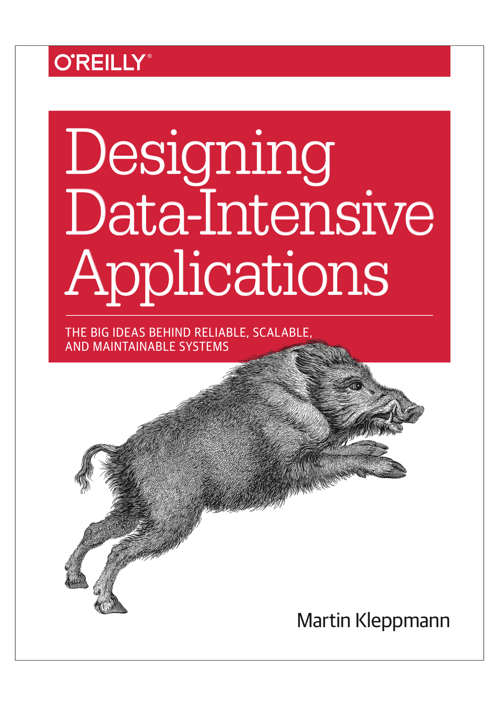

# 《设计数据密集应用》 

* 作者： Martin Kleppmann
* 原书名称：《Designing Data-Intensive Application》
* 译者：[冯若航]( http://vonng.com/about) （fengruohang@outlook.com ）
* 建议本地使用[Typora](https://www.typora.io)以获取最佳阅读体验。


-----------------

## 译序

现今，尤其是互联网领域，大多数应用都属于数据密集型应用。这本书从底层数据结构讲到顶层架构设计，将系统设计中的精髓娓娓道来。对架构师、DBA、后端工程师尤其有帮助。

这是一本理论结合实践的书，书中很多问题，译者在实际场景中都曾遇到过，读来让人击节赞叹。如果能早点读到这本书，该少走多少弯路啊！

又是一本深入浅出的书，按照事物发展演化的历程来介绍，将复杂的概念讲述的浅显易懂，但又直击本质，不失深度。每章最后的参考引用质量非常好，是进一步深入学习各个主题的绝佳索引。

本书为系统的设计、实现、与评价提供了很好的概念框架。读完并理解本书内容后，读者可以轻松看破大多数的技术忽悠，与技术砖家撕起逼来虎虎生风。

这是2017年译者读过最好的一本技术类书籍，这么好的书没有中文翻译，实在是遗憾。某不才，愿为先进技术文化的传播贡献一分力量。既可以深入学习有趣的技术主题，又可以锻炼中英文语言文字功底，何乐而不为呢？


## 前言

> 在我们的社会中，技术是一种强大的力量。数据、软件、通信可以用于坏的方面：不公平的阶级固化，损害公民权利，保护既得利益集团。但也可以用于好的方面：让底层人民发出自己的声音，让每个人都拥有机会，避免灾难。本书献给所有将技术用于善途的人们。


> 计算是一种流行文化，流行文化鄙视历史。 流行文化关乎个体身份和参与感，与合作无关。它活在当下，也与过去和未来无关。 我认为大部分（为钱）写代码的人就是这样， 他们不知道他们的文化来自哪里。
>
> ​                          ——阿兰·凯接受Dobb博士的杂志采访时（2012年）


## 目录

### [序言](preface.md)

### [数据系统的基石](part-i.md)

1. [可靠性、可扩展性、可维护性](ch1.md)
2. [数据模型与查询语言](ch2.md)
3. [存储与检索](ch3.md) 
4. [编码与演化](ch4.md)

### [分布式数据](part-ii.md)

5. [复制](ch5.md) 
6. [分片](ch6.md) 
7. [事务](ch7.md) 
8. [分布式系统的麻烦](ch8.md) 
9. [一致性与共识](ch9.md) 

### [衍生数据](part-iii.md)

10. [批处理](ch10.md) 
11. [流处理](ch11.md) 
12. [数据系统的未来](ch12.md) 


### [术语表](glossary.md)

### [后记](colophon.md)


## 翻译计划

机翻：只在乎结构：梳理文章结构、图片、引用、备注。

初翻：保证自己经完全理解本章内容，人工修复显著的错误，重新组织语言。

精翻：确定术语的最终译法，修复格式瑕疵，着力信达雅。

通常机翻一章1个小时左右，初翻一章6小时，精翻一章三到五天。

精翻可以看，初翻凑合看，机翻没法看。精翻太累了，看心情吧。

| 章节   | 文件   | 计划 | 进度 |
| ------ | ------ | ---- | ---- |
| 序言   | [preface.md](preface.md) |      | 机翻 |
| 第一部分：数据系统基础 ——概览 | [part-i.md](part-i.md) |      | 初翻 |
| 第一章：可靠性、可扩展性、可维护性 | [ch1.md](ch1.md) |      | **精翻** |
| 第二章：数据模型与查询语言 | [ch2.md](ch2.md) |      | 初翻 |
| 第三章：存储与检索 | [ch3.md](ch3.md) |      | 初翻 |
| 第四章：编码与演化 | [ch4.md](ch4.md) |      | 初翻 |
| 第二部分：分布式数据——概览 | [part-ii.md](part-ii.md) | | 初翻 |
| 第五章：复制 | [ch5.md](ch5.md) |      | 初翻 |
| 第六章：分片 | [ch6.md](ch6.md) |      | 初翻 |
| 第七章：事务 | [ch7.md](ch7.md) |      | **精翻 50%** |
| 第八章：分布式系统的麻烦 | [ch8.md](ch8.md) |      | 机翻 |
| 第九章：一致性与共识 | [ch9.md](ch9.md) |      | 机翻 |
| 第三部分：前言 | [part-iii.md](part-iii.md) | | 机翻 |
| 第十章：批处理 | [ch10.md](ch10.md) |  | 机翻 |
| 第十一章：流处理 | [ch11.md](ch11.md) |      | 机翻 |
| 第十二章：数据系统的未来 | [ch12.md](ch12.md) |      | 机翻 |
| 术语表 | [glossary.md](glossary.md) | | - |
| 后记 | [colophon.md](colophon.md) | | 机翻 |


## 译者声明

纯粹出于学习目的与个人兴趣翻译，仅供交流讨论与个人学习使用，闷声发大财自己看就行，严禁用于商业目的与公开传播发行。侵删。目前尚无中文译本，有能力阅读英文书籍者请购买原版支持。

```
《中华人民共和国著作权法》
第四节 权利的限制
第二十二条　在下列情况下使用作品，可以不经著作权人许可，不向其支付报酬，但应当指明作者姓名、作品名称，并且不得侵犯著作权人依照本法享有的其他权利：
(六)为学校课堂教学或者科学研究，翻译或者少量复制已经发表的作品，供教学或者科研人员使用，但不得出版发行;
```

