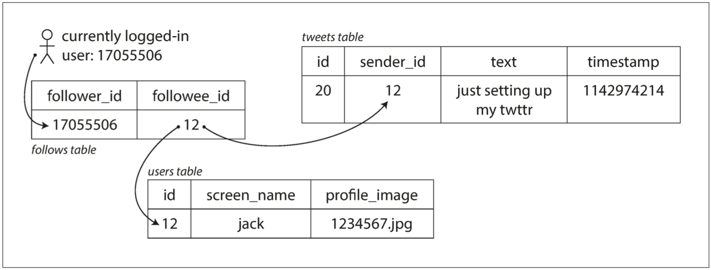
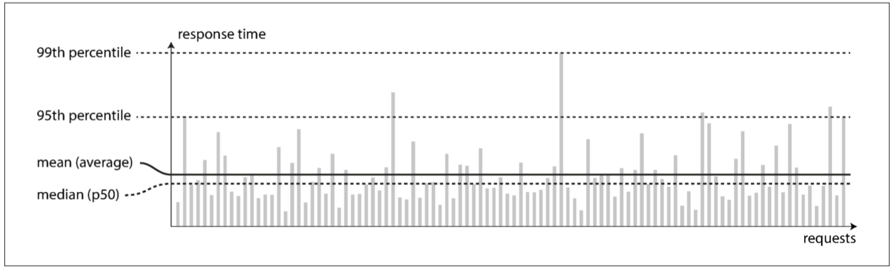
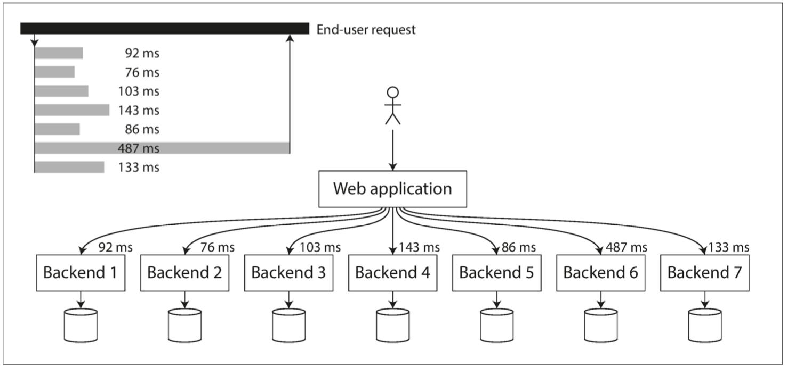

# 1.可靠性，可扩展性，可维护性


> 互联网做得太棒了，以至于多数人将它看作像海洋这样的天然资源，而不是什么人工产物。 这种规模的技术没出问题，上一次是什么时候了？          
>
> ——阿兰·凯在接受Dobb博士杂志采访时（2012年）

-----------------------

[TOC]

现今很多应用程序都是**数据密集型（data-intensive）**，而非**计算密集型（compute-intensive）**的。CPU很少成为这类应用的瓶颈，更大的问题通常来自数据量，数据的复杂性、以及数据的变更速度。

数据密集型应用通常由标准组件构建而成，标准组件提供了很多通用的功能：例如，许多应用程序需要：

* 存储数据，以便自己或其他应用程序之后能再次找到。（ **数据库（database）**）


* 记住开销昂贵操作的结果，加快读取速度。（**缓存（cache）**）


* 允许用户按关键字搜索数据，或以各种方式对数据进行过滤。（**搜索索引（search indexes）**）


* 向其他进程发送消息，进行异步处理。（**流处理（stream processing）**）


* 定期压缩累积的大批量数据。（**批处理（batch processing）**）


如果这些功能听上去平淡无奇，那真让人心酸。因为这些**数据系统（data system）**是如此成功的抽象，我们一直用着它们，却没有想太多。绝大多数工程师不会想从零开始编写存储引擎，开发应用时，数据库已经是足够完美工具了。

但事实并没有这么简单。不同的应用有不同的需求，所以数据库系统也是百花齐放，有着各式各样的特性。有很多不同的手段可以实现缓存，也有好几种方法可以搞定搜索索引，诸如此类。所以开发应用时仍然有必要弄清楚什么样的工具和方法最适合手头的工作。而且，当单个工具解决不了你的问题时，你会发现组合使用这些工具还是挺有难度的。

本书将是一趟关于数据系统原理、实践与应用的旅途，并讲述了设计数据密集型应用的方法。我们将探索不同工具之间的共性与特性，以及各自的实现原理。

本章将从我们所要实现的基础目标开始：可靠，可扩展、可维护的数据系统。我们将澄清这些词语的含义，概述考量这些目标的方法。并回顾一些后续章节所需的基础知识。在接下来的章节中我们将抽丝剥茧，研究设计数据密集型应用时可能遇到的设计决策。


## 关于数据系统的思考

通常认为，数据库，消息队列，缓存这些，是差异显著的工具分类。虽然数据库和消息队列表面上有一些相似性—— 都会存一段时间的数据。——但它们有迥然不同的访问模式，这意味着迥异的性能特征和迥异的实现。

那么为什么要把它们混为一谈，放在一个 **数据系统（data system）**的总称之下呢？

近些年来出现了许多新的数据存储工具与数据处理工具。它们针对各种不同应用场景进行优化，不再适用于传统的类别[【1】][1]。类别之间的界限越来越模糊，例如：数据存储也被当成消息队列用（Redis），消息队列带有类似数据库的持久保证（Apache Kafka）。

其次，越来越多的应用程序有各式各样苛刻广泛的要求，单个工具不足以满足所有的数据处理和存储需求。取而代之的是，工作被拆分成一系列能被单个工具能高效完成的任务。并通过应用代码将这些工具缝合起来。

例如，如果把缓存和全文搜索功能从主数据库分离出来，多了一个应用管理的缓存（Memcached或类似品）和一个全文搜索服务器（例如Elasticsearch或Solr），那么使缓存/索引与主数据库保证同步通常是应用代码的责任。[图1-1]() 给出了这种架构可能的样子（细节将在后面的章节中详细介绍）。


**图1-1 组合使用多个组件的数据系统，一种可能的架构**

当你将多个工具组合在一起提供服务时，服务的接口，或**应用程序编程接口（API, Application Programming Interface）**通常向客户端隐藏这些实现细节。现在，你基本上已经使用较小的通用组件创建了一个全新的，专用的数据系统。这个新的复合数据系统可能会提供特定的保证：例如，缓存在写入时会作废或更新，以便外部客户端获取一致的结果。现在你不仅是应用程序开发人员，还是数据系统设计人员了。

设计数据系统或服务时可能会遇到很多棘手的问题。当系统出问题时，如何确保数据的正确性和完整性？当部分系统退化降级时，如何为客户提供始终如一的良好性能？当负载增加时，如何扩容应对？什么样的API才是好的API？

影响数据系统设计的因素很多，包括参与人员的技能和经验，历史遗留问题，系统路径依赖，交付时限，单位对各种风险的容忍度，监管约束等。这些因素都需要具体问题具体分析。

本书着重讨论三个在大多数软件系统中都很重要的问题：

***可靠性（Reliability）***

系统在困境（硬件故障、软件故障、人为错误）中仍可正常工作（正确完成功能，能并达到期望性能水准）。

***可扩展性（Scalability）***

有合理的办法应对系统的增长（数据量，流量、复杂性）（参阅“可伸缩性”）

***可维护性（Maintainability）***

许多不同的人（工程师、运维）在不同的生命周期，都能在高效地在系统上工作（使系统保持现有行为，适应新的应用场景）。（参阅”可维护性“）

人们经常追求这些词汇，却并没有清楚理解它们到底意味着什么。为了工程的严谨性，本章的剩余部分将探讨可靠性、可扩展性、可维护性的含义。为实现这些目标而使用的各种技术，架构和算法，将在后续的章节中研究。


## 可靠性

人们对于一个东西是否可靠，都有一个直观的想法。对于可靠的软件，典型的期望包括：

* 应用程序表现出用户所期望的功能。
* 允许用户犯错，允许用户以出乎意料的方式使用软件。
* 在预期的负载和数据量下，性能满足应用场景的要求。
* 系统可以防止未经授权的访问和滥用。

如果所有这些在一起意味着“正确工作”，那么可以把可靠性粗略理解为”即使出现问题，也能继续正确工作”。

可能出问题的东西叫做**故障（fault）**，能预料并应对故障的系统特性可称为**容错（fault-tolerant）**或**韧性（resilient）**。第一个术语可能会产生误导：它暗示可以让系统容忍所有可能的错误，实际中这是不可能的。如果整个地球（及其上的所有服务器）都被黑洞吞噬，容忍这种错误需要将网络托管到宇宙中。能不能通过这种预算就祝你好运了。所以在讲容错时，只有谈论*特定类型*的错误才有意义。

注意**故障（fault）**不同于**失效（failure）**[【2】][2]。**故障**通常定义为系统的一部分偏离其标准，而**失效**则是系统作为一个整体停止向用户提供服务。故障的概率不可能降到零，因此最好设计容错机制，以防**故障**导致**失效**。本书们将介绍几种用不可靠的部件构建可靠系统的技术。

反直觉的是，在这类容错系统中，通过故意触发来**提高**故障率是有意义的。例如在没有警告的情况下随机地杀死单个进程。许多高危漏洞实际上由糟糕的错误处理导致的[【3】][3]；通过故意引发故障，来确保容错机制不断运行并接受考验，从而提高故障自然发生时系统能正确处理的信心。Netflix *Chaos Monkey*[【4】][4]就是这种方法的一个例子。

尽管比起**阻止错误（Prevent error）**，我们通常更倾向于容忍错误。但也有**预防胜于治疗**的情况（比如不存在治疗方法时）。安全问题就属于这种情况。例如，如果攻击者破坏了系统，并获取了敏感数据，这种事是撤销不了的。但本书主要讨论的是可以恢复的故障类型，如下所述。

### 硬件故障

当想到系统失效的原因时，硬件故障总会第一个进入脑海。硬盘崩溃，内存出错，机房断电，有人拔错网线。任何与大型数据中心打交道的人都会告诉你，当拥有很多机器时，这些事情**总是**会发生的。

硬盘的**平均无故障时间（MTTF, mean time to failure）**据报道称约为10到50年[【5】][5][【6】][6]。因此，在一个有一万个磁盘的存储集群上，期望上每天平均会有一个磁盘挂掉。

为了减少系统的故障率，第一反应通常是增加单个硬件的冗余度。磁盘可以组RAID，服务器可能有双路电源和热插拔CPU，数据中心可能有电池和柴油发电机作为后备电源。当某个组件挂掉时，换下来并由冗余组件取而代之。这种方法并不能完全防止因为硬件问题导致的系统失效，但它简单易懂，通常也足以让机器不间断运行多年。

直到最近，硬件冗余对于大多数应用来说已经足够了，它使单台机器完全失效变得相当罕见。只要你能快速地把备份恢复到新机器上，故障停机时间对于大多数应用程序都算不上灾难性的。少部分需要高可用的应用可能会采用多个冗余硬件副本。

但随着数据量和应用计算需求的增加，越来越多的应用开始大量使用机器，这会相应地增加硬件故障率。此外，在一些云平台（**如亚马逊网络服务（AWS, Amazon Web Services）**）中，虚拟机实例在没有警告的情况下变得不可用[7]，这是因为平台旨在优先考虑单机可靠性的灵活性和弹性。

因此，通过优先使用软件容错技术或除了硬件冗余之外，还有一种趋向于可以容忍整个机器损失的系统。这样的系统还具有运维优势：如果需要重启机器（例如应用操作系统安全补丁），则单服务器系统需要计划的停机时间，而可以容忍机器故障的系统可以一次修补一个节点没有整个系统的停机时间（滚动升级;参见第4章）。

### 软件错误

我们通常认为硬件故障是随机的，相互独立的：一台机器的磁盘失败并不意味着另一台机器的磁盘将会失败。可能存在较弱的相关性（例如，由于常见原因，例如服务器机架中的温度），否则大量硬件组件不可能同时发生故障。
另一类错误是系统内部的系统错误[8]。这样的错误很难预测，而且由于它们在节点间相互关联，所以往往比不相关的硬件故障造成更多的系统故障[5]。例子包括：

* 给定特定的错误输入时，导致应用程序服务器的每个实例崩溃的软件错误。例如，考虑到2012年6月30日的闰秒，由于Linux内核中的一个错误，导致许多应用程序同时挂起。
* 失控进程会占用一些共享资源 - CPU时间，内存，磁盘空间或网络带宽。
* 系统依赖的服务变慢，变为无响应，或者开始返回损坏的响应。
* 级联故障，其中一个组件中的小故障触发另一个组件中的故障，进而触发进一步的故障[10]。

导致这类软件故障的错误通常会长时间处于休眠状态，直到被不寻常的情况触发为止。在这种情况下，显示出软件正在对其环境做出某种假设 - 虽然这种假设通常是正确的，但由于某种原因它最终会被否定[11]。

软件中的系统故障问题没有快速的解决方案。许多小事情可以帮助：仔细考虑系统中的假设和交互;彻底的测试;过程隔离;允许进程崩溃并重新启动;测量，监控和分析生产中的系统行为。如果一个系统需要提供一些保证（例如在一个消息队列中，输入消息的数量等于输出消息的数量），它可以在运行时不断检查自己，并在出现差异时发出警报被发现[12]。

### 人为错误

人类设计和建造软件系统，保持系统运行的操作人员也是人。即使他们有最好的意图，人类也是不可靠的。例如，一项关于大型互联网服务的研究发现，运营商的配置错误是导致中断的主要原因，而硬件故障（服务器或网络）仅在10-25％的中断中发挥作用[13]。

尽管人类不可靠，我们如何使我们的系统可靠？最好的系统结合了几种方法：

* 以最大限度地减少错误机会的方式设计系统。例如，精心设计的抽象，API和管理界面使得“做正确的事情”变得容易，并且阻止“错误的事情”。然而，如果接口过于严格，人们会绕过它们，否定它们的好处。这是一个棘手的平衡得到正确的。
* 将人们犯最多错误的地方与可能导致失败的地方分开。特别是提供功能齐全的非生产性沙箱环境，使用户可以在不影响真实用户的情况下使用真实数据安全地探索和实验。
* 从单元测试到全系统集成测试和手动测试，在各个层面进行彻底测试[3]。自动化测试广泛使用，易于理解，特别适用于覆盖在正常运行中很少出现的角落案例。
* 允许从人为错误中快速轻松地恢复，以最大限度地减少故障情况下的影响。 例如，快速回滚配置更改，逐渐推出新代码（以便任何意外的错误只影响一小部分用户），并提供重新计算数据的工具（万一事实证明旧计算 是不正确的）。
* 设置详细和明确的监控，如性能指标和错误率。 在其他工程学科中，这被称为遥测。 （一旦火箭离开了地面，遥测技术对于追踪发生的事情和理解失败是必不可少的。）监测可以向我们展示预警信号，并让我们检查是否有任何假设或限制是违反的。迟来。 发生问题时，度量标准对于诊断问题是非常有价值的。
* 实施良好的管理实践和培训 - 一个复杂而重要的方面，超出了本书的范围。

### 可靠性有多重要？

可靠性不仅仅针对核电站和空中交通管制软件，更多的普通应用也预计可靠运行。商业应用程序中的错误会导致生产力的损失（如果数据报告不完整，则会面临法律风险），而且电子商务网站的中断可能会导致收入损失和声誉受损。

即使在“非关键”应用中，我们也对用户负有责任。考虑一个父母，他们的所有照片和他们的孩子的视频存储在您的照片应用程序[15]。如果数据库突然被破坏，他们会感觉如何？他们会知道如何从备份恢复它？

在某些情况下，我们可能选择牺牲可靠性来降低开发成本（例如，为未经证实的市场开发原型产品）或运营成本（例如，利润率极低的服务），但是我们应该非常清楚我们什么时候偷工减料。


## 可扩展性

即使系统今天运行稳定，但这并不意味着未来一定能够可靠运行。降级的一个常见原因是负载增加：或许系统已经从10,000个并发用户增加到100000个并发用户，或者从100万增加到1000万。也许正在处理的数据量比以前大得多。

可伸缩性（Scalability）是我们用来描述系统应对负载增加的能力的术语。但是请注意，这不是我们可以附加到系统上的一维标签：说“X可伸缩”或“Y不能缩放”是没有意义的。相反，讨论可扩展性意味着考虑如“如果系统以特定方式增长，我们有什么选择来应对增长？”和“我们如何增加计算资源来处理额外的负载？”等问题。

### 描述负载

首先，我们需要简洁地描述系统的当前负载。只有这样我们才能讨论增长问题（如果我们的负荷加倍，会发生什么？）。负载可以用一些我们称之为负载参数的数字来描述。参数的最佳选择取决于系统的体系结构：它可能是每秒向Web服务器发出的请求，数据库中的读写比率，聊天室中同时活动的用户数量，缓存或其他东西。也许平均情况对你来说很重要，或者你的瓶颈主要是少数极端情况。

为了使这个想法更加具体，我们以2012年11月发布的数据[16]为例，以Twitter为例。 Twitter的两个主要业务是：

* 发布推文：用户可以向其追随者发布新消息（平均每秒4.6k个请求/秒，峰值超过12k个请求/秒）。


* 主页时间线：用户可以查看他们关注的人发布的推文（300k请求/秒）。

简单地处理每秒12,000次写入（发布推文的最高速率）将是相当容易的。然而，Twitter的扩张挑战并不是主要由于推特量，而是由扇出（fan-out：从电子工程中借用的一个术语，它描述了连接到另一个门输出的逻辑门输入的数量。 输出需要提供足够的电流来驱动所有连接的输入。 在事务处理系统中，我们使用它来描述为了服务一个传入请求而需要做的其他服务的请求数量。）， 每个用户跟随很多人，每个用户跟着很多人。大致有两种方法来实现这两个操作：

1. 发布推文只需将新推文插入推文的全局集合即可。当用户请求他们的主页时间线时，查找他们关注的所有人，为每个用户查找所有推文，并合并（按时间排序）。在如图1-2所示的关系数据库中，可以编写如下查询：

```sql
SELECT tweets.*, users.* 
FROM tweets 
JOIN users ON tweets.sender_id = users.id 
JOIN follows ON follows.followee_id = users.id 
WHERE follows.follower_id = current_user
```

为每个用户的主页时间线维护一个缓存，例如每个收件人用户的推文信箱（见图1-3）。 当用户发布tweet时，查找所有关注该用户的人，并将新的tweet插入到每个主页时间线缓存中。 阅读主页时间表的请求便宜，因为其结果是提前计算的。



**图1-2 推特主页时间线的关系型模式简单实现**


**图1-2 用于分发推特至关注者的数据流水线，带有负载参数（2012年11月）**

Twitter的第一个版本使用了方法1，但系统努力跟上主页时间线查询的负载，所以公司转向了方法2.这更好地发挥作用，因为发布的推文的平均比率几乎比主页时间线查询频率低了两个数量级，所以在这种情况下，最好在写入时间做更多的工作，而在读取时间做更少的工作。

然而，方法2的缺点是发布推文现在需要大量的额外工作。平均来说，一条推特被发送到约75个追随者，所以每秒4.6k的推文变成主页时间线缓存每秒345k的写入。但是这个平均值隐藏了每个用户的关注者数量与一些用户差异很大的事实

有超过三千万的追随者。这意味着一个推特可能会导致超过3000万的写入时间表！及时做到这一点 - Twitter试图在5秒内向粉丝发送推文 - 是一个重大的挑战。
在Twitter的例子中，每个用户的关注者分布（可能是这些用户发微博的频率）是讨论可伸缩性的关键负载参数，因为它决定了扇出负载。您的应用程序可能具有非常不同的特征，但您可以应用相似的原则来推理其负载。

推特轶事的最后一个转折：现在，方法2 健壮的实施了，Twitter正在转向两种方法的混合。大多数用户的推文在发布的时候仍然是在主页时间线上，但是很少有粉丝（即名人）的用户被排除在外。用户可能关注的任何名人的推文都会单独提取，并在阅读时与用户的家庭时间线合并，如方法1所示。这种混合方法能够持续提供良好的性能。我们将在第12章重新讨论这个例子，因为我们已经覆盖了更多的技术层面。

### 描述性能

一旦描述了系统的负载，就可以调查负载增加时发生的情况。你可以用两种方法来看它：

* 增加负载参数并保持系统资源（CPU，内存，网络带宽等）不变时，系统性能如何受影响？
* 当您增加一个负载参数时，如果要保持性能不变，您需要增加多少资源？

这两个问题都需要性能数字，所以让我们简单地看一下系统的性能。

在像Hadoop这样的批处理系统中，我们通常关心吞吐量 - 每秒处理的记录数量，或者在一定数量的数据集上运行作业的总时间.（理想情况下，批量作业的运行时间是数据集的大小除以吞吐量。 在实践中，由于歪斜（数据不是均匀分布在工作进程中），而且需要等待最慢的任务完成，所以运行时间往往更长）在在线系统中，通常是什么更重要的是服务的响应时间 - 也就是客户端发送请求和接收响应之间的时间。


#### 延迟和响应时间

延迟（Latency）和响应时间（Response Time）通常用作同义词，但它们并不相同。响应时间是**客户看到的**：除了处理请求的实际时间（服务时间）之外，还包括网络延迟和排队延迟。**延迟是一个请求等待处理的时间** - 在这个时间内，它是潜在的，等待服务[17]。

即使你只是一次又一次地提出相同的请求，每次尝试都会得到一个稍微不同的响应时间。实际上，在处理各种请求的系统中，响应时间可能会有很大差异。因此，我们需要将响应时间视为一个单一的数字，而不是一个可以衡量的价值分布。

在图1-4中，每个灰色条表示对服务的请求，其高度表示请求花了多长时间。大多数请求是相当快的，但是偶尔出现的异常值需要更长的时间。也许缓慢的请求本质上更昂贵，例如，因为它们处理更多的数据。但是即使在你认为所有的请求都要花费同样的时间的情况下，你也会得到一些变化：上下文切换到后台进程可能引入随机的附加延迟，网络数据包丢失和TCP重传，垃圾收集暂停，强制从磁盘读取的页面错误，服务器机架[18]中的机械振动或许多其他原因。



**图1-4 展示了一个服务100次请求响应时间的均值与百分位数**

通常看到报告的服务的平均响应时间。 （严格地说，“平均”一词并不是指任何特定的公式，但实际上它通常被理解为算术平均值：给定n	个值，加起来所有的值，除以n）。然而，平均值如果你想知道你的“典型”响应时间，那么它不是一个很好的指标，因为它不能告诉你有多少用户实际上经历了这个延迟。

通常使用百分比更好。如果将响应时间列表从最快到最慢排序，那么中值是中间值：例如，如果您的中值响应时间是200毫秒，这意味着一半请求的返回时间少于200毫秒，一半你的要求比这个要长。

如果您想知道用户通常需要等待多长时间，那么这使中间值成为一个好的度量标准：用户请求的一半服务时间少于中间响应时间，另一半服务时间比中间值长。中位数也被称为第50百分位，有时缩写为p50。请注意，中位数是指单个请求;如果用户提出了几个请求（在一个会话过程中，或者由于多个资源被包含在一个页面中），至少其中一个请求比中间值慢的可能性远远大于50％。

为了弄清楚你的异常值有多糟糕，你可以看看更高的百分位数：第95,99和99.9百分位数是常见的（缩写p95，p99和p999）。它们是95％，99％或99.9％的请求比特定阈值更快的响应时间阈值。例如，如果第95百分位响应时间是1.5秒，则意味着100个请求中的95个占用少于1.5秒，并且100个请求中的5个占用1.5秒或更多。如图1-4所示。

响应时间的高百分比（也称为尾部延迟 Tail Percentil）非常重要，因为它们直接影响用户的服务体验。例如，亚马逊描述了内部服务的响应时间要求，**以百分之九十九为单位，即使只影响一千个请求中的一个**。这是因为要求最慢的客户往往是那些账户数据最多的客户，因为他们进行了大量的采购 - 也就是说，他们是最有价值的客户[19]。通过确保网站快速发展，让客户满意是非常重要的：亚马逊还观察到，响应时间增加了100毫秒，销售量减少了1％[20]，而另一些人则报告说，1秒钟的减速会减少客户 - 收敛度为16％[21,22]。

另一方面，优化第99.99个百分点（10000个请求中最慢的1个）被认为太昂贵，并且不能为亚马逊的目的带来足够的好处。以非常高的百分比来减少响应时间是困难的，因为它们很容易受到您控制之外的随机事件的影响，并且好处正在减少。

例如，百分比通常用于服务级别目标（SLO）和服务级别协议（SLA），即定义服务的预期性能和可用性的合同。 SLA可能会声明，如果服务的响应时间中位数小于200毫秒，并且在1秒内响应时间较长（如果响应时间较长，则可能会下降），则认为该服务已启动。可能需要至少99.9％的时间。这些指标为服务客户设定了期望值，并允许客户在SLA未达到的情况下要求退款。

排队延迟通常占高百分比响应时间的很大一部分。由于服务器只能并行处理少量的事务（例如，受其CPU核数量的限制），所以只需要少量缓慢的请求来阻止后续请求的处理，这种效果有时被称为头部阻塞。即使这些后续请求在服务器上快速处理，由于等待事先请求完成的时间，客户端将看到总体响应时间缓慢。由于这种影响，测量客户端的响应时间非常重要。

当为了测试系统的可扩展性而人为地产生负载时，产生负载的客户端需要不受响应时间的影响而不断发送请求。如果客户端在发送下一个请求之前等待先前的请求完成，那么这种行为会在测试中人为地保持队列的长度，而不是在实际中保持队列的长度，这会影响测量结果[23]。

> #### 实践中的百分位点
>
> 在多重调用的后端服务里，高百分位数变得特别重要。即使并行调用，最终用户请求仍然需要等待最慢的并行呼叫完成。如图1-5所示，只需要一个缓慢的呼叫就可以使整个最终用户请求变慢。即使只有一小部分后端呼叫速度较慢，如果最终用户请求需要多个后端调用，则获得较慢调用的机会也会增加，因此较高比例的最终用户请求速度会变慢（效果称为尾部延迟放大[24]）。
>
> 如果您想将响应时间百分点添加到您的服务的监视仪表板，则需要持续有效地计算它们。例如，您可能希望在最近10分钟内保持请求响应时间的滚动窗口。每一分钟，您都会计算出该窗口中的中值和各种百分数，并将这些度量值绘制在图上。
>
> 简单的实现是在时间窗口内保存所有请求的响应时间列表，并且每分钟对列表进行排序。如果对你来说效率太低，那么有一些算法能够以最小的CPU和内存成本（如正向衰减[25]，t-digest [26]或HdrHistogram [27]）来计算百分位数的近似值。请注意，平均百分比（例如，减少时间分辨率或合并来自多台机器的数据）在数学上没有意义 - 聚合响应时间数据的正确方法是添加直方图[28]。



**图1-5 当一个请求需要多个后端请求时，单个慢后端请求就会拖慢整个终端用请求**


### 应对负荷的方法

现在我们已经讨论了用于描述测量性能的负载和度量的参数，我们可以开始认真讨论可伸缩性：即使当我们的负载参数增加一些时，我们如何保持良好的性能呢？

适合于一个级别的负载的体系结构不太可能应付10倍的负载。如果您正在开发一个快速增长的服务，那么您可能需要重新考虑每个数量级负载增长的架构 - 或者甚至更多。

人们经常谈到 scale-up（垂直扩展，转向更强大的机器）和scale-out（水平扩展，将负载分配到多个小型机器）之间的矛盾。在多台机器上分配负载也称为“无共享(shared-nothing)”体系结构。可以在一台机器上运行的系统通常更简单，但是高端机器可能变得非常昂贵，所以非常密集的工作量通常无法避免向外扩展。实际上，优秀的体系结构通常包含一些实用的方法：例如，使用几个功能相当强大的机器可能比大量的小型虚拟机更简单，更便宜。

有些系统是弹性的，这意味着他们可以在检测到负载增加时自动添加计算资源，而其他系统则是手动扩展（人工分析容量并决定向系统添加更多计算机）。如果负载高度不可预测，则弹性系统可能非常有用，但手动缩放系统更简单，并且可能具有更少的操作意外（请参阅“重新平衡分区”第195页）。

在多台机器上分发无状态服务非常简单，从单一节点到分布式设置的状态数据系统可能会带来很多额外的复杂性。出于这个原因，直到最近，人们普遍认为将数据库保持在单个节点上（扩展），直到缩放成本或高可用性要求迫使您将其改为分布式的。

随着分布式系统的工具和抽象变得越来越好，这种常识可能会改变，至少对于某些类型的应用来说。可以想象，分布式数据系统将成为未来的默认设置，即使对于不处理大量数据或流量的用例也是如此。在本书的其余部分中，我们将介绍多种分布式数据系统，并讨论它们不仅在可伸缩性方面的表现，还包括易用性和可维护性。
大规模运行的系统体系结构通常对应用程序具有高度的特定性 - 没有像通用的，一刀切的可扩展体系结构（非正式地称为魔力缩放magic scaling sauce ）这样的事物。问题可能是读取量，写入量，要存储的数据量，数据的复杂程度，响应时间要求，访问模式，或者（通常）所有这些的混合物以及更多的问题。

例如，设计用于处理每秒100,000个请求（每个大小为1 kB）的系统与为每分钟3个请求（每个大小为2 GB）设计的系统看起来非常不同，即使两个系统的大小相同数据吞吐量。

一个适合特定应用的体系结构是围绕着哪些操作是常见的，哪些是负载参数是罕见的。如果这些假设结果是错误的，那么缩放的工程努力至多是浪费的，最糟糕的是适得其反。在早期阶段的初创公司或非正式的产品中，能够快速迭代产品特征比扩展到假设的未来负载更重要。

尽管它们是特定于特定应用程序的，但可扩展架构通常是从通用构建模块构建而成，并以熟悉的模式排列。在本书中，我们将讨论这些构件和模式。


## 可维护性

众所周知，软件的大部分成本并没不在最初的开发阶段，而是在于持续的维护修复漏洞：保持系统正常运行，调查故障，适应新的平台，修改新的用例，偿还技术债务，增加新的功能。

然而不幸的是，许多从事软件系统工作的人不喜欢维护所谓的遗留系统 - 也许涉及修复其他人的错误或处理已经过时的平台，或者被迫做从未有意为之的系统。每一个遗留系统都是以自己的方式让人不爽，所以很难给出一个一般的建议来处理它们。

但是，我们可以也应该设计软件，以便在维护期间尽可能减少痛苦，从而避免自己创建传统软件。为此，我们将特别关注软件系统的三个设计原则：

* 可操作性

  方便运营团队保持系统平稳运行。

* 简单

  通过从系统中消除尽可能多的复杂性，使新工程师能够轻松理解系统。 （注意这与用户界面的简单性不一样。）

  可进化

  使工程师能够轻松地对将来的系统进行更改，并根据需求变化将其适用于意外的用例。也被称为可扩展性，可修改性或可塑性。


正如以前的可靠性和可扩展性一样，实现这些目标也没有简单的解决方案。相反，我们会考虑可操作性，简单性和可演化性的系统。

### 可操作性：关爱运维

有人认为，“良好的运维经常可以解决不好的（或不完整的）软件的局限性，再好的系统也架不住垃圾运维。尽管运维的某些方面可以而且应该是自动化的，但首先要确保自动化的正确性，然后由人来完成。

运维团队对于保持软件系统顺利运行至关重要。一个优秀的运维团队通常负责以下内容，以及更多[29]：

* 监控系统的运行状况，并在服务状况不佳时快速恢复服务
* 追踪问题的原因，例如系统故障或性能下降
* 保持软件和平台保持最新状态，包括安全补丁
* 了解不同的系统如何相互影响，以便在造成损害之前避免有问题的更改
* 预测未来的问题并在问题出现之前加以解决（例如扩容计划）
* 建立部署，配置管理等方面的良好实践和工具
* 执行复杂的维护任务，例如将应用程序从一个平台移动到另一个平台
* 随着配置更改，维护系统的安全性
* 定义使操作可预测的流程，并帮助保持生产环境稳定
* 保持组织对系统的了解，即使是个人来来去去

良好的可操作性意味着使日常工作变得简单，使运营团队能够专注于高价值的活动。数据系统可以做各种事情，使日常任务变得简单，包括：

* 提供对系统的运行时行为和内部的可视性，并具有良好的监控能力
* 为自动化和与标准工具的集成提供良好的支持
* 避免依赖个别机器（在整个系统继续不间断运行的情况下允许机器停机维护）
* 提供良好的文档和易于理解的操作模型（“如果我做X，Y会发生”）
* 提供良好的默认行为，还可以让管理员在需要时自由覆盖默认值
* 在适当的情况下进行自我修复，并在需要时让管理员手动控制系统状态
* 展现可预见的行为，最大限度地减少惊喜


### 简单性：管理复杂性

小型软件项目可以有简单而富有表现力的代码，但随着项目越来越大，它们往往变得非常复杂，难以理解。这种复杂性拖慢了每个需要在系统上工作的人员，进一步增加了维护成本。一个陷入复杂的软件项目有时被描述为一个大泥潭[30]。

复杂性有各种可能的症状：状态空间的爆炸，模块的紧密耦合，纠结的依赖关系，不一致的命名和术语，旨在解决性能问题的黑客攻击，解决其他问题的特殊框架等等。已经有很多关于这个话题的说法[31,32,33]。

当复杂性使维护困难时，预算和时间安排通常会超支。在复杂的软件中，当发生变化时，引入错误的风险也更大：系统开发人员难以理解和推理时，隐藏的假设，意想不到的后果和意外的交互更容易被忽略。相反，降低复杂性大大提高了软件的可维护性，因此简单性应该是我们构建系统的关键目标。

简化系统并不一定意味着减少其功能;它也意味着消除意外的复杂性。 Moseley和Marks [32]把复杂性定义为偶然的，如果软件解决的问题不是固有的（用户看到的），而只是由实现产生的。

我们用来消除意外复杂性的最好工具之一是抽象。一个好的抽象可以隐藏大量的实现细节在一个干净，简单易懂的外观背后。一个好的抽象也可以用于各种不同的应用程序。这不仅是重复使用效率比多次重复实现类似的东西更高效，而且还会导致更高质量的软件，因为抽象组件中的质量改进将有利于所有使用它的应用程序。

例如，高级编程语言是隐藏机器代码，CPU寄存器和系统调用的抽象。 SQL是隐藏复杂的磁盘和内存数据结构，

来自其他客户端的并发请求以及崩溃之后的不一致的抽象。当然，在用高级语言编程时，我们仍然使用机器码;我们只是不直接使用它，因为编程语言抽象使我们不必考虑它。

但是，找到好的抽象是非常困难的。在分布式系统领域，虽然有许多好的算法，但是我们应该如何将它们打包成抽象，这样就不那么清楚了，这些抽象可以帮助我们将系统的复杂性保持在可管理的水平。

在整本书中，我们将继续睁大眼睛来看好抽象，从而使我们能够将大型系统的一部分抽象成定义明确，可重用的组件。


### 可演化性：易于改变

你的系统的需求不会永远保持不变。他们更有可能处于不断变化的状态：您学习新的事实，之前出现意想不到的用例，业务优先级发生变化，用户请求新功能，新平台取代旧平台，法律或监管要求发生变化，系统增长强迫架构发生变化等

在组织流程方面，敏捷工作模式为适应变化提供了一个框架。敏捷社区还开发了技术工具和模式，这些工具和模式在频繁变化的环境中开发软件时很有帮助，如测试驱动开发（TDD）和重构。

这些敏捷技术的大部分讨论都集中在相当小的本地规模（同一个应用程序中的源代码文件）。在本书中，我们将探索在更大的数据系统层面上提高敏捷性的方法，可能由几个不同特性的应用程序或服务组成。例如，您将如何“重构”Twitter的架构来将Home Time从方法1重构为方法2？

您可以轻松修改数据系统并使其适应不断变化的需求，这与其简单性和抽象性密切相关：简单易懂的系统通常比复杂系统更容易修改。但是由于这是一个非常重要的想法，我们将用一个不同的词来指代数据系统层面的敏捷性：可进化性[34]。


## 本章小结

在本章中，我们探讨了一些关于数据密集型应用程序的基本思路。这些原则将指导我们阅读本书的其余部分，在这里我们深入技术细节。

一个应用程序必须满足各种要求才能有用。有一些功能需求（它应该做什么，比如允许以各种方式存储，检索，搜索和处理数据）以及一些非功能性需求（一般属性如安全性，可靠性，合规性，可伸缩性，兼容性和可维护性）。在本章中，我们详细讨论了可靠性，可扩展性和可维护性。

**可靠性**意味着即使发生故障，也能使系统正常工作。故障可以是硬件（通常是随机的和不相关的），软件（缺陷通常是系统的，难以处理的），以及人类（不可避免地会不时出错）。容错技术可以隐藏最终用户的某些类型的故障。

**可扩展性**意味着即使在负载增加的情况下也有保持性能的策略。为了讨论可扩展性，我们首先需要定量描述负载和性能的方法。我们简单地将Twitter的家庭时间表作为描述负载的一个例子，并将响应时间百分比作为衡量每个时间段的一种方式。在可扩展的系统中，您可以添加处理能力以在高负载下保持可靠。

**可维护性**有许多方面，但实质上是为需要使用该系统的工程和运营团队提供更好的生活。良好的抽象可以帮助降低复杂性，并使系统更易于修改和适应新的用例。良好的可操作性意味着对系统的健康具有良好的可见性，并具有有效的管理方式。

不幸的是，为了使应用程序可靠，可扩展或可持续，并不容易。但是，某些模式和技术会不断出现在不同的应用程序中。在接下来的几章中，我们将看看数据系统的一些例子，并分析它们如何实现这些目标。
在本书后面的第三部分中，我们将看看由几个组件组成的系统的模式，比如图1-1中的组件。


## 参考文献

[1]: http://citeseerx.ist.psu.edu/viewdoc/download?doi=10.1.1.68.9136&amp;amp;amp;amp;amp;amp;amp;rep=rep1&amp;amp;amp;amp;amp;amp;amp;type=pdf	"Michael Stonebraker and Uğur Çetintemel: “'One Size Fits All': An Idea Whose Time Has Come and Gone,” at *21st International Conference on Data Engineering* (ICDE), April 2005."
[2]: http://www.sei.cmu.edu/reports/92tr033.pdf	"Walter L. Heimerdinger and Charles B. Weinstock: “A Conceptual Framework for System Fault Tolerance,” Technical Report CMU/SEI-92-TR-033, Software Engineering Institute, Carnegie Mellon University, October 1992."
[3]: https://www.usenix.org/system/files/conference/osdi14/osdi14-paper-yuan.pdf	"Ding Yuan, Yu Luo, Xin Zhuang, et al.: “Simple Testing Can Prevent Most Critical Failures: An Analysis of Production Failures in Distributed Data-Intensive Systems,” at 11th USENIX Symposium on Operating Systems Design and Implementation (OSDI), October 2014."
[4]: http://techblog.netflix.com/2011/07/netflix-simian-army.html	"Yury Izrailevsky and Ariel Tseitlin: “The Netflix Simian Army,” techblog.netflix.com, July 19, 2011."


1.  Walter L. Heimerdinger and Charles B. Weinstock:
    “[A Conceptual Framework for System Fault Tolerance](http://www.sei.cmu.edu/reports/92tr033.pdf),” Technical Report CMU/SEI-92-TR-033, Software Engineering Institute, Carnegie
    Mellon University, October 1992.

2.  Ding Yuan, Yu Luo, Xin Zhuang, et al.:
    “[Simple Testing Can Prevent Most Critical Failures: An Analysis of Production Failures in Distributed Data-Intensive Systems](https://www.usenix.org/system/files/conference/osdi14/osdi14-paper-yuan.pdf),” at *11th USENIX Symposium on Operating Systems Design
    and Implementation* (OSDI), October 2014.

3.  Yury Izrailevsky and Ariel Tseitlin:
    “[The Netflix Simian Army](http://techblog.netflix.com/2011/07/netflix-simian-army.html),”
    *techblog.netflix.com*, July 19, 2011.

4.  Daniel Ford, François Labelle, Florentina I. Popovici, et al.:
    “[Availability in Globally Distributed Storage Systems](http://research.google.com/pubs/archive/36737.pdf),”
    at *9th USENIX Symposium on Operating Systems Design and Implementation* (OSDI),
    October 2010.

5.  Brian Beach:
    “[Hard Drive Reliability Update – Sep 2014](https://www.backblaze.com/blog/hard-drive-reliability-update-september-2014/),” *backblaze.com*, September 23, 2014.

6.  Laurie Voss:
    “[AWS: The Good, the Bad and the Ugly](https://web.archive.org/web/20160429075023/http://blog.awe.sm/2012/12/18/aws-the-good-the-bad-and-the-ugly/),” *blog.awe.sm*, December 18, 2012.

7.  Haryadi S. Gunawi, Mingzhe Hao, Tanakorn
    Leesatapornwongsa, et al.: “[What Bugs Live in the Cloud?](http://ucare.cs.uchicago.edu/pdf/socc14-cbs.pdf),” at *5th ACM Symposium on Cloud Computing* (SoCC), November 2014.
    [doi:10.1145/2670979.2670986](http://dx.doi.org/10.1145/2670979.2670986)

8.  Nelson Minar:
      “[Leap Second Crashes Half   the Internet](http://www.somebits.com/weblog/tech/bad/leap-second-2012.html),” *somebits.com*, July 3, 2012.

9.  Amazon Web Services:
      “[Summary of the Amazon EC2 and Amazon RDS Service   Disruption in the US East Region](http://aws.amazon.com/message/65648/),” *aws.amazon.com*, April 29, 2011.

10.  Richard I. Cook:
     “[How Complex Systems Fail](http://web.mit.edu/2.75/resources/random/How%20Complex%20Systems%20Fail.pdf),” Cognitive Technologies Laboratory, April 2000.

11.  Jay Kreps:
     “[Getting Real About Distributed System Reliability](http://blog.empathybox.com/post/19574936361/getting-real-about-distributed-system-reliability),” *blog.empathybox.com*, March 19, 2012.

12.  David Oppenheimer, Archana Ganapathi, and David A. Patterson:
     “[Why Do Internet Services Fail, and What Can Be Done About It?](http://static.usenix.org/legacy/events/usits03/tech/full_papers/oppenheimer/oppenheimer.pdf),” at *4th USENIX Symposium on
     Internet Technologies and Systems* (USITS), March 2003.

13.  Nathan Marz:
       “[Principles   of Software Engineering, Part 1](http://nathanmarz.com/blog/principles-of-software-engineering-part-1.html),” *nathanmarz.com*, April 2, 2013.

14.  Michael Jurewitz:
     “[The Human Impact of Bugs](http://jury.me/blog/2013/3/14/the-human-impact-of-bugs),”
     *jury.me*, March 15, 2013.

15.  Raffi Krikorian:
     “[Timelines at Scale](http://www.infoq.com/presentations/Twitter-Timeline-Scalability),”
     at *QCon San Francisco*, November 2012.

16.  Martin Fowler:
     *Patterns of Enterprise Application Architecture*. Addison Wesley, 2002.
     ISBN: 978-0-321-12742-6

17.  Kelly Sommers:
     “[After all that run around, what caused 500ms disk latency even when we replaced physical server?](https://twitter.com/kellabyte/status/532930540777635840)” *twitter.com*, November 13, 2014.

18.  Giuseppe DeCandia, Deniz Hastorun, Madan Jampani, et al.:
     “[Dynamo: Amazon's Highly Available Key-Value Store](http://www.allthingsdistributed.com/files/amazon-dynamo-sosp2007.pdf),” at *21st ACM Symposium on Operating
     Systems Principles* (SOSP), October 2007.

19.  Greg Linden:
     “[Make Data Useful](http://glinden.blogspot.co.uk/2006/12/slides-from-my-talk-at-stanford.html),” slides from presentation at Stanford University Data Mining class (CS345), December 2006.

20.  Tammy Everts:
     “[The Real Cost of Slow Time vs Downtime](http://www.webperformancetoday.com/2014/11/12/real-cost-slow-time-vs-downtime-slides/),” *webperformancetoday.com*, November 12, 2014.

21.  Jake Brutlag:
     “[Speed Matters for Google Web Search](http://googleresearch.blogspot.co.uk/2009/06/speed-matters.html),” *googleresearch.blogspot.co.uk*, June 22, 2009.

22.  Tyler Treat:
     “[Everything You Know About Latency Is Wrong](http://bravenewgeek.com/everything-you-know-about-latency-is-wrong/),” *bravenewgeek.com*, December 12, 2015.

23.  Jeffrey Dean and Luiz André Barroso:
     “[The Tail at Scale](http://cacm.acm.org/magazines/2013/2/160173-the-tail-at-scale/fulltext),”
     *Communications of the ACM*, volume 56, number 2, pages 74–80, February 2013.
     [doi:10.1145/2408776.2408794](http://dx.doi.org/10.1145/2408776.2408794)

24.  Graham Cormode, Vladislav
     Shkapenyuk, Divesh Srivastava, and Bojian Xu:
     “[Forward Decay: A Practical Time Decay Model for Streaming Systems](http://dimacs.rutgers.edu/~graham/pubs/papers/fwddecay.pdf),” at *25th IEEE International Conference on Data
     Engineering* (ICDE), March 2009.

25.  Ted Dunning and Otmar Ertl:
     “[Computing Extremely Accurate Quantiles Using t-Digests](https://github.com/tdunning/t-digest),” *github.com*, March 2014.

26.  Gil Tene:
     “[HdrHistogram](http://www.hdrhistogram.org/),” *hdrhistogram.org*.

27.  Baron Schwartz:
     “[Why Percentiles Don’t Work the Way You Think](https://www.vividcortex.com/blog/why-percentiles-dont-work-the-way-you-think),” *vividcortex.com*, December 7, 2015.

28.  James Hamilton:
     “[On Designing and Deploying Internet-Scale Services](https://www.usenix.org/legacy/events/lisa07/tech/full_papers/hamilton/hamilton.pdf),” at *21st Large Installation
     System Administration Conference* (LISA), November 2007.

29.  Brian Foote and Joseph Yoder:
     “[Big Ball of Mud](http://www.laputan.org/pub/foote/mud.pdf),” at
     *4th Conference on Pattern Languages of Programs* (PLoP),
     September 1997.

30.  Frederick P Brooks: “No Silver Bullet – Essence and
     Accident in Software Engineering,” in *The Mythical Man-Month*, Anniversary
     edition, Addison-Wesley, 1995. ISBN: 978-0-201-83595-3

31.  Ben Moseley and Peter Marks:
     “[Out of the Tar Pit](http://citeseerx.ist.psu.edu/viewdoc/summary?doi=10.1.1.93.8928),”
     at *BCS Software Practice Advancement* (SPA), 2006.

32.  Rich Hickey:
     “[Simple Made Easy](http://www.infoq.com/presentations/Simple-Made-Easy),”
     at *Strange Loop*, September 2011.

33.  Hongyu Pei Breivold, Ivica Crnkovic, and Peter J. Eriksson:
     “[Analyzing Software Evolvability](http://www.mrtc.mdh.se/publications/1478.pdf),”
     at *32nd Annual IEEE International Computer Software and Applications Conference*
     (COMPSAC), July 2008.
     [doi:10.1109/COMPSAC.2008.50](http://dx.doi.org/10.1109/COMPSAC.2008.50)


------

| 上一章                              | 目录                            | 下一章                               |
| ----------------------------------- | ------------------------------- | ------------------------------------ |
| [第一部分：数据系统基础](part-i.md) | [设计数据密集型应用](README.md) | [第二章：数据模型与查询语言](ch2.md) |