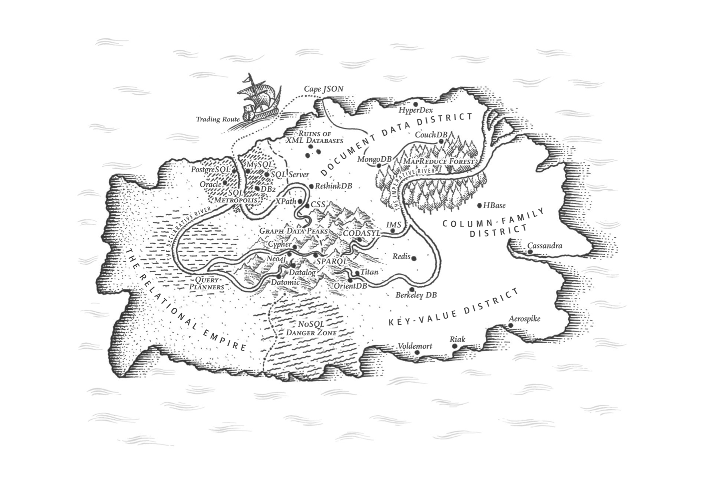
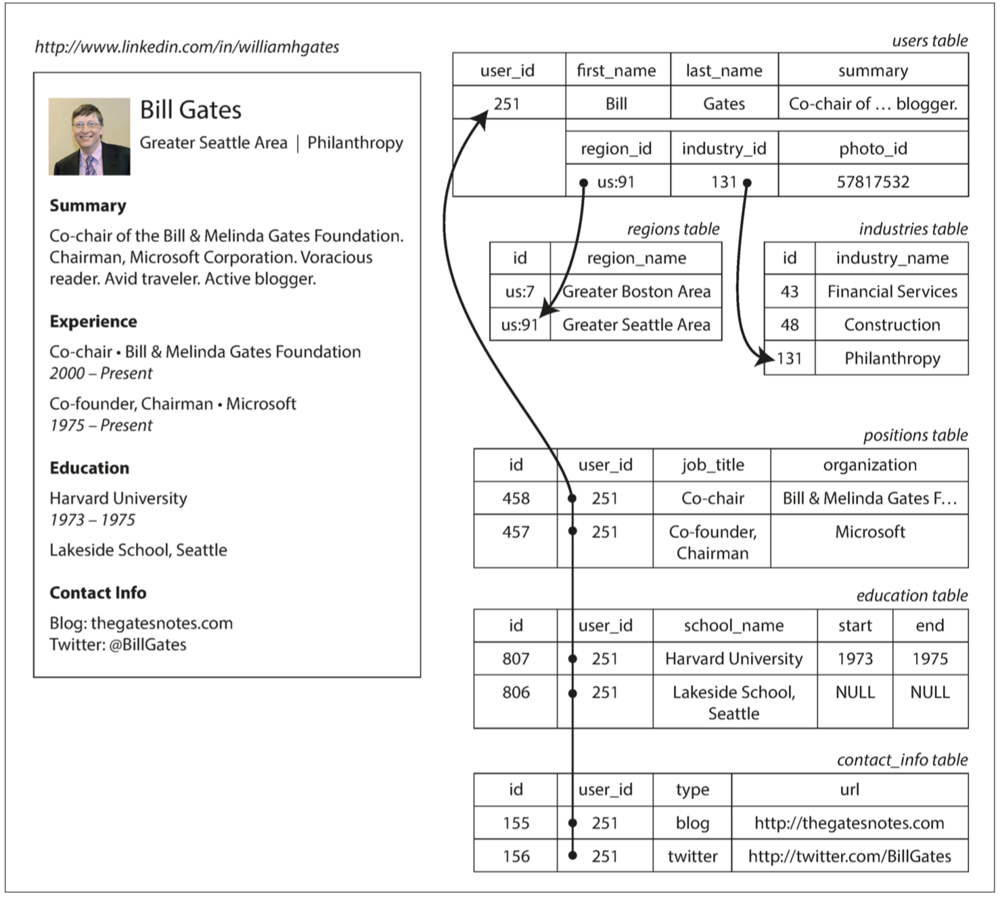

# 2. 数据模型与查询语言



> 语言的极限即世界的极限
>
> —— 路德维奇·维特根斯坦， 《逻辑哲学》（1922）
>

-------------------

[TOC]


数据模型可能是开发软件最重要的部分，因为它们有着深远的影响：不仅在于软件的编写方式，而且在于它如何影响对问题解决方案的思考。

大多数应用程序是通过将一个数据模型叠加在另一个之上来构建的。对于每一层，关键问题是：它是如何用下一层来表示的？例如：

1. 作为一名应用程序开发人员，您将看到现实世界（包括人员，组织，货物，行为，资金流向，传感器等），并根据对象或数据结构以及API进行建模，操纵这些数据结构。这些结构通常是应用程序特定的。
2. 如果要存储这些数据结构，可以使用通用数据模型（如JSON或XML文档，关系数据库中的表、或图模型）来表示它们。
3. 构建数据库软件的工程师决定以内存，磁盘或网络上的字节表示JSON / XML /关系/图形数据。该表示可以允许以各种方式查询，搜索，操纵和处理数据。
4. 在更低的层面上，硬件工程师已经计算出如何用电流，光脉冲，磁场等来表示字节。

在一个复杂的应用程序中，可能会有更多的中间层次，比如基于API的API，但是基本思想仍然是一样的：每个层都通过提供一个干净的数据模型来隐藏下面层的复杂性。这些抽象允许不同的人群（例如数据库供应商的工程师和使用他们的数据库的应用程序开发人员）有效地协作。

有许多不同类型的数据模型，每个数据模型都体现了如何使用它的假设。某些用法很容易，有些不被支持;一些操作很快，一些操作不好;一些数据转换感觉自然，有些是尴尬的。

掌握一个数据模型可能需要很多努力（想想关系数据建模有多少本书）。即使只使用一种数据模型，而不用担心其内部工作，构建软件也是非常困难的。但是由于数据模型对软件的功能有很大的影响，因此选择适合应用程序的软件是非常重要的。

在本章中，我们将研究一系列用于数据存储和查询的通用数据模型（前面列表中的第2点）。特别是，我们将比较关系模型，文档模型和一些基于图形的数据模型。我们还将查看各种查询语言并比较它们的用例。在第3章中，我们将讨论存储引擎是如何工作的。也就是说，这些数据模型是如何实际实现的（列表中的第3点）。


## 关系模型与文档模型

现在最着名的数据模型可能是SQL，它基于Edgar Codd在1970年提出的关系模型[1]：数据被组织到关系中（称为SQL表），其中每个关系是元组的无序集合SQL中的行）。

关系模型是一个理论上的建议，当时很多人怀疑是否能够有效实施。然而，到了20世纪80年代中期，关系数据库管理系统（RDBMSes）和SQL已成为大多数需要存储和查询具有某种规模结构的数据的人们的首选工具。关系数据库的优势已经持续了大约25 - 30年 - 计算历史上的一个永恒。

关系数据库的根源在于商业数据处理，这是在20世纪60年代和70年代在大型计算机上进行的。从今天的角度来看，用例显得很平常：通常是交易处理（进入销售或银行交易，航空公司预订，仓库库存）和批处理（客户发票，工资单，报告）。

当时的其他数据库迫使应用程序开发人员考虑数据库内部的数据表示。关系模型的目标是将实现细节隐藏在更简洁的界面之后。

多年来，在数据存储和查询方面存在着许多相互竞争的方法。在20世纪70年代和80年代初，网络模型和分层模型是主要的选择，但关系模型占据了主导地位。对象数据库在二十世纪八十年代末和九十年代初再次出现。 XML数据库出现在二十一世纪初，但只有小众采用。关系模型的每个竞争者都在其时代产生了大量的炒作，但从来没有持续[2]。

随着电脑越来越强大和联网，它们开始被用于日益多样化的目的。值得注意的是，关系数据库在业务数据处理的原始范围之外被推广到很广泛的用例。您今天在网上看到的大部分内容仍然是由关系数据库提供支持，无论是在线发布，讨论，社交网络，电子商务，游戏，软件即服务生产力应用程序等等。

### NoSQL的诞生

现在，在2010年代，NoSQL是推翻关系模式主导地位的最新尝试。 “NoSQL”这个名字是不幸的，因为它实际上并没有涉及到任何特定的技术，它最初只是作为一个吸引人的Twitter标签在2009年的开源，分布式，非关系数据库上聚会。无论如何，这个术语触动了一个神经，并迅速通过网络启动社区和更远的地方传播开来。一些有趣的数据库系统现在与#NoSQL#标签相关联，并被追溯性地重新解释为不仅是SQL [4]。

采用NoSQL数据库有几个驱动力，其中包括：

* 需要比关系数据库更好的可扩展性，包括非常大的数据集或非常高的写入吞吐量
* 相比商业数据库产品，偏爱免费和开源软件
* 关系模型不能很好地支持一些特殊的查询操作
* 对关系模型限制性感到受挫，对更多动态性与表现力的渴望

不同的应用程序有不同的要求，一个用例的最佳技术选择可能不同于另一个用例的最佳选择。因此，在可预见的未来，关系数据库似乎可能会继续与各种非关系数据库一起使用 - 这种想法有时也被称为**混合持久化（Polyglot Persistences）**

### 对象关系不匹配

现在大多数应用程序开发都是在面向对象的编程语言中完成的，这导致了对SQL数据模型的普遍批评：如果数据存储在关系表中，那么应用程序代码中的对象之间需要一个笨拙的转换层，表，行和列的数据库模型。模型之间的不连贯有时被称为**阻抗不匹配（impedance mismatch）**[^i]。

[^i]:  从电子学借用一个术语。每个电路的输入和输出都有一定的阻抗（交流电阻）。当您将一个电路的输出连接到另一个电路的输入时，如果两个电路的输出和输入阻抗匹配，则连接上的功率传输将被最大化。阻抗不匹配可能导致信号反射和其他问题

像ActiveRecord和Hibernate这样的对象关系映射（ORM）框架减少了这个翻译层需要的样板代码的数量，但是它们不能完全隐藏这两个模型之间的差异。



**图2-1 使用关系型模式来表示领英简历**

例如，图2-1展示了如何在关系模式中表达简历（一个LinkedIn简介）。整个配置文件可以通过一个唯一的标识符user_id来标识。像first_name和last_name这样的字段每个用户只出现一次，所以他们可以在用户表上建模为列。但是，大多数人的职业（职位）多于一份工作，人们可能有不同的教育期限和不同数量的联系信息。从用户到这些项目之间存在一对多的关系，可以用多种方式来表示：

* 在传统SQL模型（SQL：1999之前）中，最常见的规范化表示形式是将职位，培训和联系信息放在单独的表中，对用户表提供外键引用，如图2-1所示。
* 更高版本的SQL标准增加了对结构化数据类型和XML数据的支持;这允许将多值数据存储在单行内，支持在这些文档内查询和索引。这些功能在Oracle，IBM DB2，MS SQL Server和PostgreSQL中都有不同程度的支持[6,7]。 JSON数据类型也受到几个数据库的支持，包括IBM DB2，MySQL和PostgreSQL [8]。
* 第三种选择是将作业，教育和联系信息编码为JSON或XML文档，将其存储在数据库的文本列中，并让应用程序解释其结构和内容。在此设置中，通常不能使用数据库查询该编码列中的值。

对于一个像简历这样的数据结构来说，JSON表示可以是非常合适的：参见例2-1。 JSON比XML更简单。 面向文档的数据库（如MongoDB [9]，RethinkDB [10]，CouchDB [11]和Espresso [12]）支持这种数据模型。

```json
{
  "user_id": 251,
  "first_name": "Bill",
  "last_name": "Gates",
  "summary": "Co-chair of the Bill & Melinda Gates... Active blogger.",
  "region_id": "us:91",
  "industry_id": 131,
  "photo_url": "/p/7/000/253/05b/308dd6e.jpg",
  "positions": [
    {
      "job_title": "Co-chair",
      "organization": "Bill & Melinda Gates Foundation"
    },
    {
      "job_title": "Co-founder, Chairman",
      "organization": "Microsoft"
    }
  ],
  "education": [
    {
      "school_name": "Harvard University",
      "start": 1973,
      "end": 1975
    },
    {
      "school_name": "Lakeside School, Seattle",
      "start": null,
      "end": null
    }
  ],
  "contact_info": {
    "blog": "http://thegatesnotes.com",
    "twitter": "http://twitter.com/BillGates"
  }
}
```

一些开发人员认为JSON模型减少了应用程序代码和存储层之间的阻抗不匹配。但是，正如我们将在第4章中看到的那样，JSON作为数据编码格式也存在问题。缺乏一个模式往往被认为是一个优势;我们将在第39页的“文档模型中的模式灵活性”中讨论这个问题。

JSON表示比图2-1中的多表模式具有更好的局部性。如果要在关系示例中获取配置文件，则需要执行多个查询（通过user_id查询每个表），或者在用户表与其下属表之间执行混乱的多路连接。在JSON表示中，所有的相关信息都在一个地方，一个查询就足够了。

从用户配置文件到用户位置，教育历史和联系信息的一对多关系意味着数据中的树状结构，而JSON表示使得这个树状结构变得明确（见图2-2）。


**图2-2 一对多关系构建了一个树结构**

### 多对一和多对多的关系

在上一节的例2-1中，region_id和industry_id是以ID而不是纯字符串“Greater Seattle Area”和“Philanthropy”的形式给出的。为什么？

如果用户界面具有用于输入区域和行业的自由文本字段，则将其存储为纯文本字符串是有意义的。但是，对地理区域和行业进行标准化，并让用户从下拉列表或自动填充器中进行选择是有好处的：

* 统一的样式和拼写
* 避免歧义（例如，如果有几个同名的城市）
* 易于更新 - 名称只存储在一个地方，所以如果需要更改（例如，由于政治事件而改变城市名称），便于全面更新。
* 本地化支持 - 当网站翻译成其他语言时，标准化的名单可以被本地化，所以地区和行业可以用观众的语言表示
* 更好的搜索 - 例如，搜索华盛顿州的慈善家可以匹配这个概况，因为地区列表可以编码西雅图在华盛顿的事实（从“大西雅图地区”这个字符串中看不出来）

无论是存储一个ID还是一个文本字符串，都是一个关于**重复**的问题。当你使用一个ID时，对人类有意义的信息（比如慈善词）只存储在一个地方，引用它的所有信息都使用一个ID（ID只在数据库中有意义）。当你直接存储文本时，每个使用它的记录中，都存储的是有意义的信息。

使用ID的好处是，因为它对人类没有任何意义，所以永远不需要改变：ID可以保持不变，即使它标识的信息发生变化。任何对人类有意义的东西都可能需要在将来某个时候改变 - 如果这些信息被复制，所有的冗余副本都需要更新。这会导致写入开销，并且存在不一致的风险（信息的一些副本被更新，但其他信息的副本不被更新）。去除这种重复是数据库规范化的关键思想。（关系模型区分了几种不同的范式，但这些区别实际上并不重要。 作为一个经验法则，如果您重复只能存储在一个地方的值，那么架构不会被规范化（normalized）。）

不幸的是，对这些数据进行规范化需要多对一的关系（许多人生活在一个特定的地区，许多人在一个特定的行业工作），这与文档模型不太吻合。在关系数据库中，通过ID来引用其他表中的行是正常的，因为连接很容易。在文档数据库中，一对多树结构不需要连接，对连接的支持通常很弱

如果数据库本身不支持连接，则必须通过对数据库进行多个查询来模拟应用程序代码中的连接。 （在这种情况下，地区和行业的名单可能很小，变化不大，应用程序可以简单地将它们留在内存中，但是，联接的工作从数据库转移到应用程序代码。

而且，即使应用程序的初始版本适合无连接的文档模型，随着功能添加到应用程序中，数据也会变得更加互联。例如，考虑一下我们可以对简历例子进行的一些修改：

* 组织和学校作为实体

  在前面的描述中，组织（用户工作的公司）和school_name（他们学习的地方）只是字符串。也许他们应该是对实体的引用呢？然后，每个组织，学校或大学都可以拥有自己的网页（标识，新闻提要等）。每个简历可以链接到它所提到的组织和学校，并且包括他们的标识和其他信息（参见图2-3，来自LinkedIn的一个例子）。

* 推荐

  假设你想添加一个新的功能：一个用户可以为另一个用户写一个推荐。推荐在用户的简历上显示，并附上推荐用户的姓名和照片。如果推荐人更新他们的照片，他们写的任何建议都需要反映新的照片。因此，推荐应该引用作者的个人资料。


**图2-3 公司名不仅是字符串，还是一个指向公司实体的连接（领英截图）**

图2-4 阐明了这些新功能怎样使用多对多关系。 每个虚线矩形内的数据可以分组成一个文档，但是对单位，学校和其他用户的引用需要表示为引用，并且在查询时需要连接。


**图2-4 使用多对多关系扩展简历**

### 文档数据库是否在重蹈覆辙？

虽然关系数据库中经常使用多对多的关系和连接，但文档数据库和NoSQL重新讨论了如何最好地在数据库中表示这种关系的争论。这个辩论比NoSQL早得多，事实上，它可以追溯到最早的计算机化数据库系统。

20世纪70年代最受欢迎的业务数据处理数据库是IBM的信息管理系统（IMS），最初是为了在阿波罗太空计划中进行存货而开发的，并于1968年首次商业发布[13]。目前它仍在使用和维护，在IBM大型机的OS / 390上运行[14]。
IMS的设计使用了一个相当简单的数据模型，称为分层模型，它与文档数据库使用的JSON模型有一些显着的相似之处[2]。它将所有数据表示为嵌套在记录中的记录树，就像图2-2的JSON结构一样。

像文档数据库一样，IMS在一对多的关系中运行良好，但是它使多对多的关系变得困难，并且不支持连接。开发人员必须决定是否冗余（非规范化）数据或手动解决从一个记录到另一个记录的引用。这些二十世纪六七十年代的问题与开发人员今天遇到的文档数据库问题非常相似[15]。

提出了各种解决方案来解决层次模型的局限性。其中最突出的两个是关系模型（它变成了SQL，接管了世界）和网络模型（最初很受关注，但最终变得模糊）。这两个阵营之间的“大辩论”持续了70年代的大部分时间[2]。

由于这两个模式解决的问题今天仍然如此相关，今天的辩论值得简要回顾一下。

#### 网络模型

网络模型由一个称为数据系统语言会议（CODASYL）的委员会进行了标准化，并由几个不同的数据源进行实施;它也被称为CODASYL模型[16]。

CODASYL模型是层次模型的推广。在分层模型的树结构中，每条记录只有一个父节点，在网络模式中，一个记录可能有多个父母。例如，“大西雅图地区”地区可能有一条记录，而且每个居住在该地区的用户都可以与之相关联。这允许对多对一和多对多的关系进行建模。

网络模型中记录之间的链接不是外键，而更像编程语言中的指针（同时仍然存储在磁盘上）。访问记录的唯一方法是沿着这些链路链上的根记录进行路径。这被称为访问路径。

在最简单的情况下，访问路径可能类似于遍历链表：从列表头开始，一次查看一条记录，直到找到所需的记录。但在一个多对多关系的世界里，几条不同的路径可能会导致相同的记录，一个使用网络模型的程序员必须跟踪这些不同的访问路径。

CODASYL中的查询是通过遍历记录列表和访问路径后，通过在数据库中移动游标来执行的。如果记录有多个父母（即来自其他记录的多个传入指针），则应用程序代码必须跟踪所有的各种关系。甚至CODASYL委员会成员也承认，这就像在一个n维数据空间中进行导航[17]。

尽管手动访问路径选择能够最有效地利用20世纪70年代非常有限的硬件功能（如磁带驱动器，其搜索速度非常慢），但问题是他们使查询和更新数据库的代码变得复杂不灵活。无论是分层还是网络模型，如果你没有一个你想要的数据的路径，那么你就处于一个困难的境地。你可以改变访问路径，但是你必须经过大量的手写数据库查询代码，并重写它来处理新的访问路径。很难对应用程序的数据模型进行更改。

#### 关系模型

相比之下，关系模型做的就是将所有的数据放在open中：一个关系（table）只是一个元组（行）的集合，就是这样。没有迷宫似的嵌套结构，如果你想看看数据，没有复杂的访问路径。您可以读取表中的任何或所有行，选择符合任意条件的行。您可以通过指定某些列作为关键字并匹配这些关键字来读取特定行。您可以在任何表中插入一个新的行，而不必担心与其他表的外键关系[^iii]。

[^iii]: 外键约束允许对修改做限制，对于关系模型这并不是必选项。 即使有约束，在查询时执行外键连接，而在CODASYL中，连接在插入时高效完成。

在关系数据库中，查询优化器自动决定查询的哪些部分以哪个顺序执行，以及使用哪些索引。这些选择实际上是“访问路径”，但最大的区别在于它们是由查询优化器自动生成的，而不是由程序员生成，所以我们很少需要考虑它们。

如果你想以新的方式查询你的数据，你可以声明一个新的索引，查询会自动使用哪个索引是最合适的。您不需要更改查询来利用新的索引。 （另请参阅第42页上的“用于数据的查询语言”。）关系模型因此使向应用程序添加新功能变得更加容易。

关系数据库的查询优化器是复杂的，他们已经耗费了多年的研究和开发工作[18]。但关系模型的一个关键洞察是：您只需构建一次查询优化器，然后使用该数据库的所有应用程序都可以从中受益。如果您没有查询优化器，那么为特定查询手动编写访问路径比编写通用优化器更容易 - 但通用解决方案长期获胜。

#### 与文档数据库相比

文档数据库在一个方面还原为层次模型：在其父记录中存储嵌套记录（图2-1中的一对多关系，如位置，教育和contact_info），而不是在单独的表中。

但是，在表示多对一和多对多的关系时，关系数据库和文档数据库并没有根本的不同：在这两种情况下，相关项目都被一个唯一的标识符引用，这个标识符在关系模型中被称为外键，在文档模型中称为文档引用[9]。该标识符在读取时通过使用加入或后续查询来解决。迄今为止，文档数据库没有遵循CODASYL的路径。

### 关系型数据库与文档数据库在今日的对比

将关系数据库与文档数据库进行比较时，需要考虑许多差异，包括它们的容错属性（请参阅第5章）和处理并发性（请参阅第7章）。在本章中，我们将只关注数据模型中的差异。

支持文档数据模型的主要论据是架构灵活性，由于局部性而导致的更好的性能，对于某些应用程序而言更接近于应用程序使用的数据结构。关系模型通过为连接提供更好的支持以及支持多对一和多对多的关系来反击。

#### 哪个数据模型更方便写代码？

如果应用程序中的数据具有类似文档的结构（即，一对多关系树，通常整个树被一次加载），那么使用文档模型可能是一个好主意。将类似文档的结构分解成多个表（如图2-1中的位置，教育和contact_info）的关系技术可能导致繁琐的模式和不必要的复杂的应用程序代码。

文档模型有一定的局限性：例如，您不能直接引用文档中的需要的项目，而是需要说“用户251的位置列表中的第二项”（很像访问路径在分层模型中）。但是，只要文件嵌套不太深，通常不是问题。

应用程序对文档数据库连接的垃圾支持也许或也许不是一个问题。例如，在使用文档数据库记录 哪个事件发生在哪儿 的分析应用程序中，可能永远不需要多对多的关系[19]。

但是，如果您的应用程序确实使用多对多关系，则文档模型变得不太吸引人。通过反规范化可以减少对连接的需求，但是应用程序代码需要做额外的工作来保持数据的一致性。通过向数据库发出多个请求，可以在应用程序代码中模拟连接，但是这也将复杂性转移到应用程序中，并且通常比由数据库内的专用代码执行的连接慢。在这种情况下，使用文档模型会导致更复杂的应用程序代码和更差的性能[15]。

说哪个数据模型在一般情况下导致更简单的应用程序代码是不可能的;它取决于数据项之间存在的关系种类。对于高度相互关联的数据，文档模型很尴尬，关系模型是可接受的，而图形模型（参见第49页上的“类图形数据模型”）是最自然的。

#### 文档模型中的架构灵活性

大多数文档数据库以及关系数据库中的JSON支持都不会对文档中的数据执行任何模式。关系数据库中的XML支持通常带有可选的模式验证。没有模式意味着可以将任意的键和值添加到文档中，并且在读取时，客户端对于文档可能包含的字段没有保证。

文档数据库有时称为无模式，但这是误导性的，因为读取数据的代码通常采用某种结构 - 即存在隐式模式，但不由数据库强制执行[20]。一个更精确的术语是 读时模式（schema-on-read数据的结构是隐含的，只有在数据被读取时才被解释），相应的是写时模式（schema-on-write 传统的关系数据库方法，模式是明确，数据库确保所有的数据都符合它的形式）[21]。

读取模式类似于编程语言中的动态（运行时）类型检查，而模式写入类似于静态（编译时）类型检查。就像静态和动态类型检查的倡导者对于它们的相对优点有很大的争议[22]，数据库中模式的执行是一个有争议的话题，一般来说没有正确或错误的答案。

在应用程序想要改变其数据格式的情况下，这些方法之间的区别特别明显。例如，假设你正在将每个用户的全名存储在一个字段中，而你想分别存储名字和姓氏[23]。在文档数据库中，只需开始使用新字段写入新文档，并在应用程序中使用代码来处理读取旧文档时的情况。例如：

```go
if (user && user.name && !user.first_name) {
// Documents written before Dec 8, 2013 don't have first_name 
  	user.first_name = user.name.split(" ")[0];
}
```

另一方面，在“静态类型”数据库模式中，通常会执行以下操作：

```sql
ALTER TABLE users ADD COLUMN first_name text;
UPDATE users SET first_name = split_part(name, ' ', 1); -- PostgreSQL 
UPDATE users SET first_name = substring_index(name, ' ', 1); -- MySQL
```

模式变更的速度很慢，而且需要停机。这种声誉并不是完全应得的：大多数关系数据库系统在几毫秒内执行ALTER TABLE语句。 MySQL是一个值得注意的例外，它在ALTER TABLE上复制整个表，这可能意味着在更改一个大表时会花费几分钟甚至几个小时的停机时间，尽管存在各种工具可以解决这个限制[24,25,26]。

在大型表上运行UPDATE语句在任何数据库上都可能会很慢，因为每一行都需要重写。如果这是不可接受的，应用程序可以将first_name设置为默认值NULL，并在读取时填充它，就像使用文档数据库一样。

如果由于某种原因（例如，数据是异构的）集合中的项目并不都具有相同的结构，例如，因为：

* 有许多不同类型的对象，将每种类型的对象放在自己的表中是不现实的。
* 数据的结构由您无法控制，且随时可能更改的外部系统决定。

在这样的情况下，模式的伤害远大于它的帮助，无模式文档可能是一个更加自然的数据模型。但是，如果所有记录都有相同的结构，那么模式就是记录和强制这种结构的有用机制。我们将在第四章更详细地讨论模式和模式演化。

#### 查询的数据局部性

文档通常以单个连续字符串形式存储，编码为JSON，XML或其二进制变体（如MongoDB的BSON）。如果您的应用程序经常需要访问整个文档（例如，将其渲染至网页），则此存储局部性会带来性能优势。如果将数据分割到多个表中（如图2-1所示），则需要进行多次索引查找才能将其全部检索出来，这可能需要更多的磁盘查找并花费更多的时间。

局部性仅适用于需要文档绝大部分内容的情况。数据库通常需要加载整个文档，即使只访问其中的一小部分，这对于大型文档来说是很浪费的。更新文档时，通常需要整个重写。 只有不改变文档大小的修改才可以容易地原地执行。因此通常建议，保持相对小的文档，并避免增加文档的大小的写入[9]。这些性能限制大大减少了文档数据库的实用场景。

值得指出的是，将相关的数据分组在一起的想法并不局限于文档模型。例如，Google的Spanner数据库在关系数据模型中提供了相同的位置属性，允许模式声明一个表的行应该在父表内交织 interleaved（嵌套）[27]。 Oracle允许使用一个称为多表索引集群表（multi-table index cluster tables）的特性相同的表[28]。 Bigtable数据模型（在Cassandra和HBase中使用）中的列族(column-family)概念与管理局部性的目的类似[29]。

在第3章我们还会看到更多关于本地的内容。

#### 文档和关系数据库的融合

自2000年代以来，大多数关系数据库系统（MySQL除外）都支持XML。这包括对XML文档进行本地修改的功能，以及在XML文档中进行索引和查询的功能，这允许应用程序使用与使用文档数据库时所做的非常相似的数据模型。

从9.3版本开始的PostgreSQL [8]，从5.7版本开始的MySQL以及从版本10.5开始的IBM DB2 [30]也对JSON文档提供了类似的支持级别。鉴于Web API的JSON流行，其他关系数据库很可能会跟随他们的脚步并添加JSON支持。

在文档数据库方面，RethinkDB支持其查询语言中的类似关系的连接，一些MongoDB驱动程序自动解决数据库引用（有效地执行客户端JOIN，尽管这可能比在数据库中执行的JOIN慢，需要额外的网络往返，并且没有优化）。

似乎随着时间的推移，关系数据库和文档数据库变得越来越相似，这是一件好事：数据模型相互补充，如果一个数据库能够处理类似文档的数据，并对其执行关系查询，那么应用可以使用最适合其需要的特征的组合。
关系模型和文档模型的混合是数据库未来的一个很好的途径。

（Codd对关系模型[1]的原始描述实际上允许在关系模式中与JSON文档非常相似。 他称之为 非简单域（nonsimple domains）。 这个想法是，一行中的值不一定是一个像数字或字符串一样的原始数据类型，也可以是一个嵌套的关系（表格） - 所以你可以有一个任意嵌套的树结构作为一个值， 很像30年后添加到SQL中的JSON或XML支持。）


## 数据查询语言

当引入关系模型时，它包含了一种查询数据的新方法：SQL是一个声明式查询语言，而IMS和CODASYL使用命令式的代码来查询数据库。那是什么意思？
许多常用的编程语言是命令式的。例如，如果你有一个动物物种的列表，返回列表中的鲨鱼可以这样写：

```js
function getSharks() {
    var sharks = [];
    for (var i = 0; i < animals.length; i++) {
        if (animals[i].family === "Sharks") {
            sharks.push(animals[i]);
        }
    }
    return sharks;
}
```

在关系代数中：
$$
sharks = σ_{family = "sharks"}(animals)
$$
σ（希腊字母西格玛）是选择操作符，只返回符合条件的动物，family=“shark”。

在定义SQL时，它紧密地遵循关系代数的结构：

```sql
SELECT * FROM animals WHERE family ='Sharks';
```

命令式语言告诉计算机以特定顺序执行某些操作。你可以想象一下，逐行地遍历代码，评估条件，更新变量，并决定是否再循环一遍。

在声明式查询语言（如SQL或关系代数）中，您只需指定所需数据的模式 - 结果必须符合哪些条件，以及如何将数据转换（例如，排序，分组和集合）但不是如何实现这一目标。数据库系统的查询优化器决定使用哪些索引和哪些连接方法，以及以何种顺序执行查询的各个部分。

声明式查询语言是有吸引力的，因为它通常比命令式API更加简洁和容易。但更重要的是，它还隐藏了数据库引擎的实现细节，这使得数据库系统可以在不需要对查询进行任何更改的情况下提高性能。

例如，在本节开头所示的命令代码中，动物列表以特定顺序出现。如果数据库想要在场景后面回收未使用的磁盘空间，则可能需要移动记录，改变动物出现的顺序。数据库能否安全地执行，而不会中断查询？
SQL示例不保证任何特定的顺序，所以它不介意顺序是否改变。但是如果查询被写为命令式的代码，那么数据库就永远不能确定代码是否依赖于排序。 SQL在功能上更加有限的事实为数据库提供了更多自动优化的空间。

最后，声明性语言往往适合于并行执行。现在，通过增加更多的内核，CPU的速度会更快，而不是以比以前更高的时钟速度运行[31]。命令代码很难在多个内核和多个机器之间并行化，因为它指定了必须以特定顺序执行的指令。声明性语言在并行执行中获得更快的机会，因为它们仅指定结果的模式，而不是用于确定结果的算法。如果合适，数据库可以自由使用查询语言的并行实现[32]。

### Web上的声明式查询

声明式查询语言的优点不仅限于数据库。 为了说明这一点，我们在一个完全不同的环境中比较声明式和命令式的方法：一个Web浏览器。

假设你有一个关于海洋动物的网站。 用户当前正在查看鲨鱼页面，因此您将当前所选的导航项目“鲨鱼”标记为当前选中项目。

```html
<ul>
    <li class="selected">
        <p>Sharks</p>
        <ul>
            <li>Great White Shark</li>
            <li>Tiger Shark</li>
            <li>Hammerhead Shark</li>
        </ul>
    </li>
    <li><p>Whales</p>
        <ul>
            <li>Blue Whale</li>
            <li>Humpback Whale</li>
            <li>Fin Whale</li>
        </ul>
    </li>
</ul>
```

现在想让当前所选页面的标题有一个蓝色的背景，以便在视觉上突出显示。 使用CSS实现起来非常简单：

```css
li.selected > p { 
  background-color: blue;
}
```

在这里，CSS选择器`li.selected> p`声明了我们想要应用蓝色样式的元素的模式：即直接父元素是一个CSS元素的`<li>`元素的所有`<p>`元素。 示例中的元素`<p> Sharks </ p>`匹配此模式，但`<p> Whales </ p>`不匹配，因为其`<li>`父类缺少`class =“selected”`。


如果你使用XSL而不是CSS，你可以做类似的事情：

```xml
<xsl:template match="li[@class='selected']/p">
    <fo:block background-color="blue">
        <xsl:apply-templates/>
    </fo:block>
</xsl:template>
```

在这里，XPath表达式`li[@class='selected']/p`相当于上例中的CSS选择器`li.selected> p`。 CSS和XSL的共同之处在于，它们都是用于指定文档样式的声明性语言。

想象一下，如果你必须使用一命令式的方法，生活会是什么样子。在Javascript中，使用文档对象模型（DOM）API，结果可能如下所示：

```js
var liElements = document.getElementsByTagName("li");
for (var i = 0; i < liElements.length; i++) {
    if (liElements[i].className === "selected") {
        var children = liElements[i].childNodes;
        for (var j = 0; j < children.length; j++) {
            var child = children[j];
            if (child.nodeType === Node.ELEMENT_NODE && child.tagName === "P") {
                child.setAttribute("style", "background-color: blue");
            }
        }
    }
}
```

这个JavaScript强制性地将元素设置为蓝色背景，但是代码太糟糕了。不仅比CSS和XSL等价物更长，更难理解，而且还有一些严重的问题：

* 如果选定的类被移除（例如，因为用户点击了不同的页面），即使代码重新运行，蓝色也不会被移除 - 因此该项目将保持突出显示，直到整个页面被重新加载。使用CSS，浏览器会自动检测`li.selected> p`规则何时不再适用，并在选定的类被移除后立即移除蓝色背景。


* 如果您想要利用新的API（例如`document.getElementsBy ClassName（“selected”`）甚至`document.evaluate()`）来提高性能，则必须重写代码。另一方面，浏览器供应商可以在不破坏兼容性的情况下提高CSS和XPath的性能。

在Web浏览器中，使用声明式CSS样式比在JavaScript中强制操作样式好得多。类似地，在数据库中，像SQL这样的声明式查询语言比命令式查询API（IMS与CODASYL都是命令式的，应用程序通常通过COBOL代码来一次一行迭代数据库中的记录）要好得多

### MapReduce查询

MapReduce是一个编程模型，用于在许多机器上批量处理大量的数据，由Google推广[33]。一些NoSQL数据存储（包括MongoDB和CouchDB）支持有限形式的MapReduce，作为在多个文档中执行只读查询的机制。
总的来说，MapReduce在第10章中有更详细的描述。现在我们将简要讨论一下MongoDB对这一模型的应用。

MapReduce既不是一个声明性的查询语言，也不是一个完全强制性的查询API，而是位于两者之间的地方：查询的逻辑用代码片断来表示，这些代码片段被处理框架重复地调用。它基于许多函数式编程语言中存在的map（也称为collect）和reduce（也称为fold或inject）函数。

举一个例子，假设你是一名海洋生物学家，每当你看到海洋中的动物时，你都会在数据库中添加观察记录。现在你想生成一个报告，说明你每月看到多少鲨鱼。

在PostgreSQL中，你可以像这样表达这个查询：

```sql
SELECT
  date_trunc('month', observation_timestamp) AS observation_month,
  sum(num_animals)                           AS total_animals
FROM observations
WHERE family = 'Sharks'
GROUP BY observation_month;
```

`date_trunc('month'，timestamp)`函数确定包含时间戳记的日历月份，并返回代表该月份开始的另一个时间戳记。换句话说，它将时间戳降到最近的月份。

这个查询首先过滤观察结果，只显示鲨鱼家族的物种，然后根据它们发生的日历月份对观察结果进行分组，最后将在该月的所有观察中看到的动物数加起来。

MongoDB的MapReduce功能也可以这样表示：

```js
db.observations.mapReduce(function map() {
        var year = this.observationTimestamp.getFullYear();
        var month = this.observationTimestamp.getMonth() + 1;
        emit(year + "-" + month, this.numAnimals);
    },
    function reduce(key, values) {
        return Array.sum(values);
    },
    {
        query: {
          family: "Sharks"
        },
        out: "monthlySharkReport"
    });
```

* 可以声明性地指定只考虑鲨鱼种类的过滤器（这是对MapReduce的特定于MongoDB的扩展）。
* 每个匹配查询的文档都会调用一次JavaScript函数`map`，将`this`设置为文档对象。
* map函数发出一个键（包括年份和月份的字符串，如“2013-12”或“2014-1”）和一个值（该观察中的动物数量）。
* map发出的键值对按键组合。 对于具有相同键（即，相同的月份和年份）的所有键值对，`reduce`函数被调用一次。
* reduce函数将特定月份内所有观测值的动物数量相加。
* 最终的输出被写入到`monthlySharkReport`集合中。

例如假设`observations`集合包含这两个文档：

```json
{
  observationTimestamp: Date.parse(  "Mon, 25 Dec 1995 12:34:56 GMT"),
  family: "Sharks",
  species: "Carcharodon carcharias",
  numAnimals: 3
{
}
  observationTimestamp: Date.parse("Tue, 12 Dec 1995 16:17:18 GMT"),
  family: "Sharks",
  species:    "Carcharias taurus",
  numAnimals: 4
}
```

`map`函数会对这两个文档每个调用一次，导致 `emit("1995-12",3)`和`emit("1995-12",4)`，然后，`reduce`函数会执行`reduce("1995-12",[3,4])`，并返回`7`。

map和reduce函数在功能上有限制：它们必须是纯函数，这意味着它们只使用传递给它们的数据作为输入，它们不能执行额外的数据库查询，也不能有任何副作用。这些限制允许数据库以任何顺序运行任何功能，并在失败时重新运行它们。然而，它们仍然是强大的：它们可以解析字符串，调用库函数，执行计算等等。

MapReduce是一个相当低级的编程模型，用于在一组机器上进行分布式执行。像SQL这样的更高级的查询语言可以用一系列的MapReduce操作来实现（见第10章），但是也有很多不使用MapReduce的分布式SQL实现。请注意，SQL中没有任何内容限制它在单个机器上运行，而MapReduce在分布式查询执行方面没有垄断权。

能够在查询中使用JavaScript代码是高级查询的一个重要特性，但不限于MapReduce，一些SQL数据库也可以使用JavaScript函数进行扩展[34]。

MapReduce的可用性问题是，你必须编写两个协调的JavaScript函数，这通常比编写单个查询更困难。此外，声明性查询语言为查询优化器提供了更多机会来提高查询的性能。由于这些原因，MongoDB 2.2添加了对称为聚合管道的声明性查询语言的支持[9]。在这种语言中，相同的鲨鱼计数查询如下所示：

```js
db.observations.aggregate([
  { $match: { family: "Sharks" } },
  { $group: {
    _id: {
      year:  { $year:  "$observationTimestamp" },
      month: { $month: "$observationTimestamp" }
    },
    totalAnimals: { $sum: "$numAnimals" } }}
]);
```

聚合流水线语言与SQL的子集表现类似，但是它使用基于JSON的语法而不是SQL的英语句子式语法; 这种差异也许是品味的问题。 这个故事的寓意是NoSQL系统可能会发现自己意外地重新发明了SQL，尽管是伪装的。


## 图数据模型

如我们之前所见，多对多关系是不同数据模型之间的重要区别特征。如果您的应用程序大多数是一对多关系（树状结构化数据），或者记录之间没有关系，则文档模型是适当的。

但是，如果多对多的关系在您的数据中很常见呢？关系模型可以处理多对多关系的简单情况，但是随着数据之间的连接变得更加复杂，开始将数据建模为图形变得更加自然。

一个图由两种对象组成：顶点（vertices 也称为节点nodes 或实体 entities）和边（edges 也称为关系relationships或弧 arcs ）。许多种数据可以被模拟为一个图形。典型的例子包括：

***社交图表***

顶点是人，边指示哪些人彼此认识。

***网络图***

顶点是网页，边缘表示到其他页面的HTML链接。

***公路或铁路网络***

顶点是连接点，边线代表它们之间的道路或铁路线。

众所周知的算法可以在这些图上进行操作：例如，汽车导航系统搜索道路网络中两点之间的最短路径，PageRank可以用在网络图上来确定网页的流行程度，从而其在搜索结果中的排名。

在刚刚给出的例子中，图中的所有顶点代表了相同类型的东西（人，网页或交叉路口）。然而，图并不局限于这样的同类数据：图的同样强大的用途是提供一种在单个数据存储中存储完全不同类型的对象的一致方式。例如，Facebook维护一个包含许多不同类型的顶点和边的单个图：顶点表示用户所做的人，地点，事件，签到和评论;边缘表示哪些人是彼此的朋友，哪个位置发生了检查，谁评论了哪个职位，谁参加了哪个事件，等等[35]。

在本节中，我们将使用图2-5所示的示例。它可以从社交网络或系谱数据库中获得：它显示了两个人，来自爱达荷州的Lucy和来自法国Beaune的Alain。他们已婚，住在伦敦。


**图2-5 图数据结构示例（框代表顶点，箭头代表边）**

有几种不同但相关的方法来构建和查询图表中的数据。 在本节中，我们将讨论属性图模型（由Neo4j，Titan和InfiniteGraph实现）和三存储（triple-store）模型（由Datomic，AllegroGraph等实现）。 我们将看图的三种声明性查询语言：Cypher，SPARQL和Datalog。 除此之外，还有像Gremlin [36]这样的图形查询语言和像Pregel这样的图形处理框架（见第10章）。

### 属性图

在属性图模型中，每个顶点（vertex）包括：

* 唯一的标识符
* 出向边的集合（outgoing edges）
* 入向边的集合（ingoing edges）
* 一组属性（键值对）

每条边（edge）包括：

* 唯一标识符
* 边的起点（tail vertex 箭头出发的点）
* 边的终点（head vertex 箭头指向的点）
* 描述两个顶点之间关系类型的标签
* 一组属性（键值对）

可以将图存储看作两个关系表：一个存储顶点，另一个存储边，如例2-2所示（该模式使用PostgreSQL json数据类型来存储每个顶点或边的属性）。头部和尾部顶点存储为每个边缘。如果您想要一组顶点的输入或输出边，您可以分别通过head_vertex或tail_vertex来查询边表。
例2-2 使用关系模式来表示属性图

```sql
CREATE TABLE vertices (
  vertex_id  INTEGER PRIMARY KEY,
  properties JSON
);

CREATE TABLE edges (
  edge_id     INTEGER PRIMARY KEY,
  tail_vertex INTEGER REFERENCES vertices (vertex_id),
  head_vertex INTEGER REFERENCES vertices (vertex_id),
  label       TEXT,
  properties  JSON
);

CREATE INDEX edges_tails ON edges (tail_vertex);
CREATE INDEX edges_heads ON edges (head_vertex);
```

这个模型的一些重要方面是：

1. 任何顶点都可以有一个边连接到任何其他顶点。没有哪种事物可不可以关联的模式限制。
2. 给定任何顶点，您可以高效地找到它的入边和出边，从而遍历图，即沿着一系列顶点的路径前后移动。 （这就是为什么示例2-2在tail_vertex和head_vertex列上都有索引的原因。）
3. 通过对不同类型的关系使用不同的标签，可以在一个图中存储几种不同的信息，同时仍然保持一个干净的数据模型。

这些特性为数据建模提供了很大的灵活性，如图2-5所示。图中显示了一些传统关系模式难以表达的东西，例如不同国家的不同地区结构（法国有省和州，美国有不同的州和州），国中国的怪事（先忽略主权国家和国家错综复杂的烂摊子），不同的数据粒度（露西现在的住所被指定为一个城市，而她的出生地点只是在一个州的级别）。

你可以想象延伸图还包括许多关于露西和阿兰，或其他人的其他事实。例如，您可以用它来表示食物过敏（通过为每个过敏原引入一个顶点，以及人与过敏原之间的边缘来指示过敏），并将过敏原与一组过敏原显示哪些食物含有哪些物质的顶点。然后，你可以写一个查询，找出每个人吃什么是安全的。图表对于可演化性是有利的：当您向应用程序添加功能时，可以轻松扩展图形以适应应用程序数据结构的变化。

### Cypher查询语言

Cypher是属性图的声明式查询语言，为Neo4j图形数据库发明[37]。 （它是以电影“黑客帝国”中的角色命名的，与密码术中的密码无关[38]。）

例2-3显示了将图2-5的左边部分插入图形数据库的Cypher查询。图的其余部分可以类似地添加，为了便于阅读而省略。每个顶点都有一个像USA或Idaho这样的符号名称，查询的其他部分可以使用这些名称在顶点之间创建边，使用箭头符号：`（Idaho） - [：WITHIN] - >（USA）`创建一个带有标记`WITHIN`的边，爱达荷州为尾节点，美国为头节点。

例2-3 将图2-5中的数据子集表示为Cypher查询

```cypher
CREATE
  (NAmerica:Location {name:'North America', type:'continent'}),
  (USA:Location      {name:'United States', type:'country'  }),
  (Idaho:Location    {name:'Idaho',         type:'state'    }),
  (Lucy:Person       {name:'Lucy' }),
  (Idaho) -[:WITHIN]->  (USA)  -[:WITHIN]-> (NAmerica),
  (Lucy)  -[:BORN_IN]-> (Idaho)
```

当图2-5的所有顶点和边被添加到数据库时，我们可以开始提出有趣的问题：例如，找到所有从美国移民到欧洲的人的名字。更确切地说，在这里我们想要找到在美国有一个BORN_IN边缘的所有顶点，还有一个LIVING_IN边缘到欧洲的一个位置，并且返回每个这些顶点的名称属性。

例2-4展示了如何在Cypher中表达这个查询。在MATCH子句中使用相同的箭头符号来查找图中的模式：

```cypher
MATCH
  (person) -[:BORN_IN]->  () -[:WITHIN*0..]-> (us:Location {name:'United States'}),
  (person) -[:LIVES_IN]-> () -[:WITHIN*0..]-> (eu:Location {name:'Europe'}) 
RETURN person.name
```

查询可以被读取如下：

* 找到满足以下两者的所有顶点（称之为person）：
  * 有一条到某个顶点`BORN_IN`类型的出边。从那个顶点开始可以沿着一系列`WITHIN`出边最终到达类型为`Location`，`name=United States`的顶点
  * 也有一条到某个顶点`LIVES_IN`类型的出边。沿着这条边，可以通过一系列`WITHIN`出边最终到达类型为`Location`，`name=Europe`的顶点
  * 对于这样的`Person`类型顶点，返回其name属性。

这条查询有几种可行的查询路径。这里给出的描述建议你首先扫描数据库中的所有人，检查每个人的出生地和居住地，然后只返回符合条件的人。

等价地，也可以从两个位置顶点开始并向后查找。如果名称属性上有一个索引，则可以高效地找到代表美国和欧洲的两个顶点。然后，您可以继续查找所有在WITHIN边缘中的位置（美国和欧洲的所有位置（州，地区，城市等））。最后，您可以查找可以通过在某个位置顶点处传入的BORN_IN或LIVES_IN边缘找到的人员。

对于声明性查询语言来说，典型的情况是，在编写查询语句时，您不需要指定执行细节：查询优化程序会自动选择预测效率最高的策略，因此您可以继续编写其余的应用程序。

### SQL中的图表查询

例2-2建议可以在关系数据库中表示图形数据。但是，如果我们把图形数据放入关系结构中，我们是否也可以使用SQL查询它？答案是肯定的，但有些困难。在关系数据库中，您通常会事先知道在查询中需要哪些连接。在图表查询中，您可能需要在找到要查找的顶点之前，遍历可变数量的边。也就是说，JOIN的数量事先并不确定。

在我们的例子中，这发生在Cypher查询中的`（） - [：WITHIN * 0 ..] - >（）`规则中。一个人的LIVES_IN边缘可以指向任何类型的位置：街道，城市，地区，地区，国家等。城市可以在一个地区，在一个州内的一个地区，在一个国家内的一个州等等.LIVES_IN边缘可以直接指向你正在查找的位置，或者可以在位置层次结构中删除几个级别。
在Cypher中，`WITHIN * 0`表示这个事实非常简洁：意思是“沿着一个WITHIN边，零次或多次”。它就像正则表达式中的*运算符。
由于SQL：1999，查询中可变长度遍历路径的思想可以使用称为递归公用表表达式（`WITH RECURSIVE`语法）的东西来表示。例2-5显示了同样的查询 - 查找使用这种技术（PostgreSQL，IBM DB2，Oracle和SQL Server支持）中从美国移民到欧洲的人的姓名。但是，与Cypher相比，语法非常笨拙。

例2-5  与示例2-4相同的查询，使用递归公用表表达式在SQL中表示

```sql
WITH RECURSIVE
  -- in_usa 包含所有的美国境内的地点ID
    in_usa(vertex_id) AS (
    SELECT vertex_id FROM vertices WHERE properties ->> 'name' = 'United States'
    UNION
    SELECT edges.tail_vertex FROM edges 
      JOIN in_usa ON edges.head_vertex = in_usa.vertex_id
      WHERE edges.label = 'within'
  ),
  -- in_europe 包含所有的欧洲境内的地点ID
    in_europe(vertex_id) AS (
    SELECT vertex_id FROM vertices WHERE properties ->> 'name' = 'Europe'
    UNION 
    SELECT edges.tail_vertex FROM edges
      JOIN in_europe ON edges.head_vertex = in_europe.vertex_id
      WHERE edges.label = 'within' ),
  
  -- born_in_usa 包含了所有类型为Person，且出生在美国的顶点
    born_in_usa(vertex_id) AS (
      SELECT edges.tail_vertex FROM edges
        JOIN in_usa ON edges.head_vertex = in_usa.vertex_id
        WHERE edges.label = 'born_in' ),
  
  -- lives_in_europe 包含了所有类型为Person，且居住在欧洲的顶点。
    lives_in_europe(vertex_id) AS (
      SELECT edges.tail_vertex FROM edges
        JOIN in_europe ON edges.head_vertex = in_europe.vertex_id
        WHERE edges.label = 'lives_in')

  SELECT vertices.properties ->> 'name'
  FROM vertices
    JOIN born_in_usa ON vertices.vertex_id = born_in_usa.vertex_id
    JOIN lives_in_europe ON vertices.vertex_id = lives_in_europe.vertex_id;
```

* 集合in_usa以（Location name=United States）作为种子，沿着边表，从种子集作为起点，将所有具有`with_in`边的终点加入种子集，不断递归直到边表内的所有条目都被访问完毕。
* 同理建立点集in_europe，获取欧洲的地点列表。
* 对于in_usa集合中的每个顶点，按照传入的born_in边缘来查找出生在美国某个地方的人。
* 同样，对于in_europe集合中的每个顶点，请按照传入的lives_in边缘来查找居住在欧洲的人。
* 最后，把在美国出生的人与在欧洲居住的人相交，获取他们的名称。

同一个查询，可以用一个查询语言写成4行，而另一个查询需要29行，这说明了不同的数据模型是为不同的应用场景设计的。选择适合应用程序的数据模型非常重要。

### 三元组存储和SPARQL

三元组存储模式大体上与属性图模型相同，用不同的词来描述相同的想法。不过值得讨论的是，因为三元组存储有很多现成的工具和语言，这些工具和语言对于构建应用程序的工具箱可能是有价值的补充。

在三元组存储中，所有信息都以非常简单的三部分表示形式存储（主体，谓词，客体）。例如，在三重（吉姆，喜欢，香蕉），吉姆是主语，喜欢是谓语（动词），香蕉是对象。

三元组的主体相当于图中的一个顶点。而客体是两件事情之一：

1. 原始数据类型中的值，例如字符串或数字。在这种情况下，三元组的谓词和对象相当于主题顶点上的属性的键和值。例如，（lucy，age，33）就像属性{“age”：33}的顶点lucy。
2. 图中的另一个顶点。在这种情况下，谓词是图中的边，主体是尾部顶点，而对象是顶点。例如，在（lucy，marriedTo，alain）主语和宾语lucy和alain都是顶点，并且谓词marriedTo是连接他们的边的标签。

示例2-6显示了与示例2-3相同的数据，以称为Turtle的格式（Notation3（N3）[39]）的一个子集形式写成三元组。
例2-6。图2-5中的数据子集，表示为Turtle三元组

```reStructuredText
@prefix : <urn:example:>.
_:lucy     a       :Person.
_:lucy     :name   "Lucy".
_:lucy     :bornIn _:idaho.
_:idaho    a       :Location.
_:idaho    :name   "Idaho".
_:idaho    :type   "state".
_:idaho    :within _:usa.
_:usa      a       :Location
_:usa      :name   "United States"
_:usa      :type   "country".
_:usa      :within _:namerica.
_:namerica a       :Location
_:namerica :name   "North America"
_:namerica :type   :"continent"
```

在这个例子中，图的顶点被写为：`_：someName`。这个名字并不意味着这个文件以外的任何东西。它的存在只是帮助我们明确三元组之间的相互引用。当谓词表示边时，该对象是一个顶点，如_：idaho：在_：usa内。当谓词是一个属性时，该对象是一个字符串，如_：usa：name“United States”。
一遍又一遍地重复相同的主题是相当重复的，但幸运的是，您可以使用分号来说明关于同一主题的多个事情。这使得Turtle格式相当不错，可读性强：参见例2-7。
例2-7。在示例2-6 @prefix：<urn：example：>中写入数据的更简洁的方法。

```
@prefix : <urn:example:>.
_:lucy      a :Person;   :name "Lucy";          :bornIn _:idaho.
_:idaho     a :Location; :name "Idaho";         :type "state";   :within _:usa
_:usa       a :Loaction; :name "United States"; :type "country"; :within _:namerica.
_:namerica  a :Location; :name "North America"; :type "continent".
```

#### 语义网络

如果您阅读更多关于三元组存储的信息，您可能会被卷入关于语义网的文章中。三元组存储数据模型完全独立于语义网络，例如，Datomic [40]是三元组存储，并不声称与它有任何关系。但是，由于在很多人眼中这两者紧密相连，我们应该简要地讨论一下。

语义网从本质上讲是一个简单而合理的想法：网站已经将信息发布为文字和图片供人类阅读，为什么不把它们作为机器可读的数据发布给计算机呢？资源描述框架（RDF）[41]的目的是作为不同网站以一致的格式发布数据的一种机制，允许来自不同网站的数据自动合并成一个数据网络 - 一种互联网范围内的“一切的数据库“。

不幸的是，这个语义网在二十一世纪初被过度使用，但到目前为止还没有显示出在实践中有任何实现的迹象，这使得许多人愤世嫉俗。它也遭受了令人眼花缭乱的缩略词，过于复杂的标准提议和自大。

但是，如果你仔细观察这些失败，那么语义Web项目中也有很多好的工作。即使您没有兴趣在语义网上发布RDF数据，三元组也可以成为应用程序的良好内部数据模型。

#### RDF数据模型

例2-7中使用的Turtle语言是RDF数据的可读格式。有时候，RDF也是以XML格式编写的，它可以更详细地完成同样的事情，参见例2-8。龟Turtle N3是最好的，因为它更容易阅读，像Apache Jena [42]这样的工具可以根据需要在不同的RDF格式之间自动转换。

例2-8。 例2-7的数据，用RDF / XML语法表示

```xml
<rdf:RDF xmlns="urn:example:"
         xmlns:rdf="http://www.w3.org/1999/02/22-rdf-syntax-ns#">
    <Location rdf:nodeID="idaho">
        <name>Idaho</name>
        <type>state</type>
        <within>
            <Location rdf:nodeID="usa">
                <name>United States</name>
                <type>country</type>
                <within>
                    <Location rdf:nodeID="namerica">
                        <name>North America</name>
                        <type>continent</type>
                    </Location>
                </within>
            </Location>
        </within>
    </Location>
    <Person rdf:nodeID="lucy">
        <name>Lucy</name>
        <bornIn rdf:nodeID="idaho"/>
    </Person>
</rdf:RDF>
```

RDF有一些奇怪之处，因为它是为了在互联网上交换数据而设计的。三元组的主题，谓词和对象通常是URI。例如，谓词可能是一个URI，如 `<http://my-company.com/namespace#within>`或`<http://my-company.com/namespace#lives_in>`，而不仅仅是WITHIN或LIVES_IN。这个设计背后的原因是你应该能够把你的数据和其他人的数据结合起来，如果他们给这个单词或者lives_in附加不同的含义，你不会得到冲突，因为它们的谓词实际上是`<http://other.org/foo#within>`和`<http://other.org/foo#lives_in>`。
从RDF的角度来看，URL <http://my-company.com/namespace> 不一定需要能解析成什么东西，它只是一个命名空间。为避免与`http://URL`混淆，本节中的示例使用不可解析的URI，如urn：example：within。幸运的是，您只需在文件顶部指定一个前缀，然后忘记它。

### SPARQL查询语言

SPARQL是 RDF数据模型三元组存储的查询语言[43]。 （它是SPARQL协议和RDF查询语言的缩写，发音为“sparkle”。）它早于Cypher，并且由于Cypher的模式匹配是从SPARQL中借用的，所以它们看起来非常相似[37]。
与从前从美国转移到欧洲的人相同的查询 - 在SPARQL中比在Cypher中更加简洁（请参见示例2-9）。
例2-9。与示例2-4相同的查询，用SPARQL表示

```sparql
PREFIX : <urn:example:>
SELECT ?personName WHERE {
  ?person :name ?personName.
  ?person :bornIn  / :within* / :name "United States".
  ?person :livesIn / :within* / :name "Europe".
}
```

结构非常相似。以下两个表达式是等价的（变量以SPARQL中的问号开头）：

```
(person) -[:BORN_IN]-> () -[:WITHIN*0..]-> (location)   # Cypher
?person :bornIn / :within* ?location.                   # SPARQL
```

由于RDF不区分属性和边，而只是使用两个属性，所以可以使用相同的语法来匹配属性。在下面的表达式中，变量usa被绑定到任何具有值为字符串“United States”的name属性的顶点：

```
(usa {name:'United States'})   # Cypher
?usa :name "United States".    # SPARQL
```

SPARQL是一种很好的查询语言 - 即使语义网从来没有出现，它也可以成为应用程序内部使用的强大工具。

#### 图形数据库与网络模型相比较

在第36页的“文档数据库是否重复历史？”中，我们讨论了CODASYL和关系模型如何竞争解决IMS中的多对多关系问题。乍一看，CODASYL的网络模型看起来与图模型相似。 CODASYL是否是图形数据库的第二个变种？
不，他们在几个重要方面有所不同：

* 在CODASYL中，数据库有一个模式，指定哪种记录类型可以嵌套在其他记录类型中。在图形数据库中，不存在这样的限制：任何顶点都可以具有到其他任何顶点的边。这为应用程序适应不断变化的需求提供了更大的灵活性。
* 在CODASYL中，达到特定记录的唯一方法是遍历其中的一个访问路径。在图形数据库中，可以通过其唯一ID直接引用任何顶点，也可以使用索引来查找具有特定值的顶点。
* 在CODASYL，记录的孩子们的有序集合，所以数据库的人不得不维持排序（其中有用于存储布局的后果），并且插入新记录到数据库的应用程序不得不担心的新记录的位置在这些集合中。在图形数据库中，顶点和边不是有序的（您只能在查询时对结果进行排序）。
* 在CODASYL中，所有查询都是必要的，难以编写，并且很容易被架构中的变化破坏。在图形数据库中，如果需要，可以在命令式代码中编写遍历，但大多数图形数据库也支持高级声明式查询语言，如Cypher或SPARQL。


### 基础：Datalog

Datalog是比SPARQL或Cypher更古老的语言，在20世纪80年代被学者广泛研究[44,45,46]。它在软件工程师中是不太知名的，但是它是重要的，因为它为以后的查询语言提供了基础。

在实践中，Datalog在一些数据系统中被使用：例如，它是Datomic [40]的查询语言，而Cascalog [47]是用于查询Hadoop中的大数据集的Datalog实现（Datomic和Cascalog使用Datalog的Clojure S表达式语法。 在下面的例子中使用了一个更容易阅读的Prolog语法，没有任何功能差异。）

Datalog的数据模型类似于三元组模式，但有一点泛化。我们把它写成谓词（主语，宾语），而不是写三元语（主语，宾语，宾语）。例2-10显示了如何在Datalog中写入我们的例子中的数据。

例2-10. 图2-5中的数据子集，表示为Datalog事实

```prolog
name(namerica, 'North America').
type(namerica, continent).

name(usa, 'United States').
type(usa, country).
within(usa, namerica).

name(idaho, 'Idaho').
type(idaho, state).
within(idaho, usa).

name(lucy, 'Lucy').
born_in(lucy, idaho).
```

现在我们已经定义了数据，我们可以像之前一样编写相同的查询，如例2-11所示。它看起来有点不同于Cypher或SPARQL的等价物，但是不要让你失望。 Datalog是Prolog的一个子集，如果你已经学过计算机科学，你可能已经见过。

例2-11。与示例2-4相同的查询，在Datalog中表示

```
within_recursive(Location, Name) :- name(Location, Name). /* Rule 1 */

within_recursive(Location, Name) :- within(Location, Via), /* Rule 2 */ 
									within_recursive(Via, Name).

migrated(Name, BornIn, LivingIn) :- name(Person, Name), /* Rule 3 */ 
                                    born_in(Person, BornLoc),
                                    within_recursive(BornLoc, BornIn),
                                    lives_in(Person, LivingLoc),
                                    within_recursive(LivingLoc, LivingIn).
                                    
?- migrated(Who, 'United States', 'Europe'). /* Who = 'Lucy'. */

```

Cypher和SPARQL使用SELECT立即跳转，但是Datalog一次只需要一小步。我们定义告诉数据库有关新谓词的规则：在这里，我们定义了两个新的谓词，在_recursive和migrated内。这些谓词不是存储在数据库中的三元组，而是它们是从数据或其他规则派生而来的。规则可以引用其他规则，就像函数可以调用其他函数或者自发地调用自己一样。像这样，复杂的查询可以一次构建一小块。

在规则中，以大写字母开头的单词是变量，谓词匹配如Cypher和SPARQL。例如，name（Location，Name）与可变绑定Location = namerica和Name ='North America'的三重名称（namerica，'North America'）匹配。

如果系统可以在 - 操作符的右侧找到与所有谓词相匹配的规则，则适用该规则。当规则适用时，就好像将 - 的左边添加到数据库（用变量替换它们的值）。

因此，应用规则的一种可能的方式是：

1. 名称（namerica，'北美'）存在于数据库中，故规则1适用。它生成within_recursive（namerica，'北美'）。
2. 数据库中存在（usa，namerica），并在之前的步骤中生成（namerica，'North America'），所以适用规则2。它会产生within_recursive（美国，“北美”）。
3. 在（爱达荷州，美国）存在于数据库和上一步生成within_recursive（美国，“北美”），所以规则2适用。它产生within_recursive（爱达荷州，“北美”）。

通过重复应用规则1和2，within_recursive谓词可以告诉我们在我们的数据库中包含的北美（或任何其他位置名称）的所有位置。这个过程如图2-6所示。


**图2-6 使用示例2-11中的Datalog规则确定爱达荷州在北美。**

现在规则3可以找到出生在某个地方BornIn的人，并住在某个地方LivingIn。通过查询BornIn ='United States'和LivingIn ='Europe'，并将此人作为变量Who，我们要求Datalog系统找出变量Who可以出现哪些值。因此，最后我们得到了与早先的Cypher和SPARQL查询相同的答案。

Datalog方法需要对本章讨论的其他查询语言采取不同的思维方式，但这是一种非常强大的方法，因为规则可以在不同的查询中进行组合和重用。简单的一次性查询不太方便，但是如果数据很复杂，它可以更好地处理。


## 本章小结

数据模型是一个巨大的课题，在本章中，我们快速浏览了各种不同的模型。我们没有足够的空间来详细介绍每个模型的细节，但是希望这个概述足以激起您的兴趣，以更多地了解最适合您的应用需求的模型。

在历史上，数据开始被表示为一棵大树（层次数据模型），但是这不利于表示多对多的关系，所以发明了关系模型来解决这个问题。最近，开发人员发现一些应用程序也不适合在关系模型中使用。新的非关系型“NoSQL”数据存储在两个主要方向上有分歧：

1. 文档数据库的应用场景是：数据通常是自我包含的，而且文档之间的关系非常罕见。
2. 图形数据库用于相反的场景： 任何东西都可能和任何东西相关联。

所有这三种模型（文档，关系和图形）今天都被广泛使用，并且在各自的领域都是很好用的。一个模型可以用另一个模型来模拟 - 例如，图形数据可以在关系数据库中表示 - 但结果往往是尴尬的。这就是为什么我们有不同的系统用于不同的目的，而不是一个单一的万能解决方案。

文档数据库和图数据库有一个共同点，那就是它们通常不会为存储的数据强制实施一个模式，这可以使应用程序更容易适应不断变化的需求。但是应用程序很可能仍假定数据具有一定的结构：这只是模式是明确的（强制写入）还是隐含的（在读取时处理）的问题。

每个数据模型都带有自己的查询语言或框架，我们讨论了几个例子：SQL，MapReduce，MongoDB的聚合管道，Cypher，SPARQL和Datalog。我们也谈到了CSS和XSL / XPath，它们不是数据库查询语言，而包含有趣的相似之处。

虽然我们已经覆盖了很多地方，但仍然有许多数据模型没有提到。举几个简单的例子：

* 研究人员使用基因组数据通常需要执行序列相似性搜索，这意味着需要一个很长的字符串（代表一个DNA分子），并将其与一个类似但不完全相同的大型字符串数据库进行匹配。这里所描述的数据库都不能处理这种用法，这就是为什么研究人员编写了像GenBank这样的专门的基因组数据库软件的原因[48]。
* 粒子物理学家数十年来一直在进行大数据类型的大规模数据分析，像大型强子对撞机（LHC）这样的项目现在可以工作在数百亿兆字节的范围内！在这样的规模下，需要定制解决方案来阻止硬件成本从失控中解脱出来[49]。
* 全文搜索可以说是一种经常与数据库一起使用的数据模型。信息检索是一个大的专业课题，在本书中我们不会详细介绍，但是我们将在第三章和第三章中介绍搜索指标。

在下一章中，我们将讨论在实现本章描述的数据模型时会发挥的一些权衡。


## 参考文献


1.  Edgar F. Codd:
    “[A Relational Model of Data for Large Shared Data Banks](https://www.seas.upenn.edu/~zives/03f/cis550/codd.pdf),” *Communications of the ACM*, volume 13, number
    6, pages 377–387, June 1970.
    [doi:10.1145/362384.362685](http://dx.doi.org/10.1145/362384.362685)

1.  Michael Stonebraker and Joseph M. Hellerstein:
    “[What Goes Around Comes Around](http://mitpress2.mit.edu/books/chapters/0262693143chapm1.pdf),”
    in *Readings in Database Systems*, 4th edition, MIT Press, pages 2–41, 2005.
    ISBN: 978-0-262-69314-1

1.  Pramod J. Sadalage and
    Martin Fowler: *NoSQL Distilled*. Addison-Wesley, August 2012. ISBN:
    978-0-321-82662-6

1.  Eric Evans:
    “[NoSQL: What's in a Name?](http://blog.sym-link.com/2009/10/30/nosql_whats_in_a_name.html),” *blog.sym-link.com*, October 30, 2009.

1.  James Phillips:
      “[Surprises in Our NoSQL   Adoption Survey](http://blog.couchbase.com/nosql-adoption-survey-surprises),” *blog.couchbase.com*, February 8, 2012.

1.  Michael Wagner:
      *SQL/XML:2006 – Evaluierung der Standardkonformität ausgewählter Datenbanksysteme*.
      Diplomica Verlag, Hamburg, 2010. ISBN: 978-3-836-64609-3

1.  “[XML   Data in SQL Server](http://technet.microsoft.com/en-us/library/bb522446.aspx),” SQL Server 2012 documentation, *technet.microsoft.com*, 2013.

1.  “[PostgreSQL   9.3.1 Documentation](http://www.postgresql.org/docs/9.3/static/index.html),” The PostgreSQL Global Development Group, 2013.

1.  “[The MongoDB 2.4 Manual](http://docs.mongodb.org/manual/),” MongoDB, Inc., 2013.

1.  “[RethinkDB 1.11 Documentation](http://www.rethinkdb.com/docs/),” *rethinkdb.com*, 2013.

1.  “[Apache CouchDB 1.6 Documentation](http://docs.couchdb.org/en/latest/),” *docs.couchdb.org*, 2014.

1.  Lin Qiao, Kapil Surlaker, Shirshanka Das, et al.:
    “[On Brewing Fresh Espresso: LinkedIn’s Distributed Data Serving Platform](http://www.slideshare.net/amywtang/espresso-20952131),” at *ACM International Conference on Management
    of Data* (SIGMOD), June 2013.

1.  Rick Long, Mark Harrington, Robert Hain, and Geoff Nicholls:
    <a href="http://www.redbooks.ibm.com/redbooks/pdfs/sg245352.pdf">*IMS Primer*</a>.
    IBM Redbook SG24-5352-00, IBM International Technical Support Organization, January 2000.

1.  Stephen D. Bartlett:
    “[IBM’s IMS—Myths, Realities, and Opportunities](ftp://public.dhe.ibm.com/software/data/ims/pdf/TCG2013015LI.pdf),” The Clipper Group Navigator, TCG2013015LI, July 2013.

1.  Sarah Mei:
    “[Why You Should Never Use MongoDB](http://www.sarahmei.com/blog/2013/11/11/why-you-should-never-use-mongodb/),”
    *sarahmei.com*, November 11, 2013.

1.  J. S. Knowles and D. M. R. Bell:
    “The CODASYL Model,” in *Databases—Role and Structure: An Advanced Course*, edited by P. M.
    Stocker, P. M. D. Gray, and M. P. Atkinson, pages 19–56, Cambridge University Press, 1984. ISBN:
    978-0-521-25430-4

1.  Charles W. Bachman:
    “[The Programmer as Navigator](http://dl.acm.org/citation.cfm?id=362534),”
    *Communications of the ACM*, volume 16, number 11, pages 653–658, November 1973.
    [doi:10.1145/355611.362534](http://dx.doi.org/10.1145/355611.362534)

1.  Joseph M. Hellerstein, Michael Stonebraker, and James Hamilton:
    “[Architecture of a Database System](http://db.cs.berkeley.edu/papers/fntdb07-architecture.pdf),”
    *Foundations and Trends in Databases*, volume 1, number 2, pages 141–259, November 2007.
    [doi:10.1561/1900000002](http://dx.doi.org/10.1561/1900000002)

1.  Sandeep Parikh and Kelly Stirman:
    “[Schema Design for Time Series Data in MongoDB](http://blog.mongodb.org/post/65517193370/schema-design-for-time-series-data-in-mongodb),” *blog.mongodb.org*, October 30, 2013.

1.  Martin Fowler:
    “[Schemaless Data Structures](http://martinfowler.com/articles/schemaless/),”
    *martinfowler.com*, January 7, 2013.

1.  Amr Awadallah:
    “[Schema-on-Read vs. Schema-on-Write](http://www.slideshare.net/awadallah/schemaonread-vs-schemaonwrite),” at *Berkeley EECS RAD Lab Retreat*, Santa Cruz, CA, May 2009.

1.  Martin Odersky:
    “[The Trouble with Types](http://www.infoq.com/presentations/data-types-issues),”
    at *Strange Loop*, September 2013.

1.  Conrad Irwin:
    “[MongoDB—Confessions of a PostgreSQL Lover](https://speakerdeck.com/conradirwin/mongodb-confessions-of-a-postgresql-lover),” at *HTML5DevConf*, October 2013.

1.  “[Percona Toolkit Documentation: pt-online-schema-change](http://www.percona.com/doc/percona-toolkit/2.2/pt-online-schema-change.html),” Percona Ireland Ltd., 2013.

1.  Rany Keddo, Tobias Bielohlawek, and Tobias Schmidt:
    “[Large Hadron Migrator](https://github.com/soundcloud/lhm),” SoundCloud, 2013.

1.  Shlomi Noach:
    “[gh-ost: GitHub's Online Schema Migration Tool for MySQL](http://githubengineering.com/gh-ost-github-s-online-migration-tool-for-mysql/),” *githubengineering.com*, August 1, 2016.

1.  James C. Corbett, Jeffrey Dean, Michael Epstein, et al.:
    “[Spanner: Google’s Globally-Distributed Database](http://research.google.com/archive/spanner.html),”
    at *10th USENIX Symposium on Operating System Design and Implementation* (OSDI),
    October 2012.

1.  Donald K. Burleson:
    “[Reduce I/O with Oracle Cluster Tables](http://www.dba-oracle.com/oracle_tip_hash_index_cluster_table.htm),” *dba-oracle.com*.

1.  Fay Chang, Jeffrey Dean, Sanjay Ghemawat, et al.:
    “[Bigtable: A Distributed Storage System for Structured Data](http://research.google.com/archive/bigtable.html),” at *7th USENIX Symposium on Operating System Design and
    Implementation* (OSDI), November 2006.

1.  Bobbie J. Cochrane and Kathy A. McKnight:
    “[DB2 JSON Capabilities, Part 1: Introduction to DB2 JSON](http://www.ibm.com/developerworks/data/library/techarticle/dm-1306nosqlforjson1/),” IBM developerWorks, June 20, 2013.

1.  Herb Sutter:
    “[The Free Lunch Is Over: A Fundamental Turn Toward Concurrency in Software](http://www.gotw.ca/publications/concurrency-ddj.htm),” *Dr. Dobb's Journal*,
    volume 30, number 3, pages 202-210, March 2005.

1.  Joseph M. Hellerstein:
    “[The Declarative Imperative: Experiences and Conjectures in Distributed Logic](http://www.eecs.berkeley.edu/Pubs/TechRpts/2010/EECS-2010-90.pdf),” Electrical Engineering and
    Computer Sciences, University of California at Berkeley, Tech report UCB/EECS-2010-90, June
    2010.

1.  Jeffrey Dean and Sanjay Ghemawat:
    “[MapReduce: Simplified Data Processing on Large Clusters](http://research.google.com/archive/mapreduce.html),” at *6th USENIX Symposium on Operating System Design and
    Implementation* (OSDI), December 2004.

1.  Craig Kerstiens:
    “[JavaScript in Your Postgres](https://blog.heroku.com/javascript_in_your_postgres),”
    *blog.heroku.com*, June 5, 2013.

1.  Nathan Bronson, Zach Amsden, George Cabrera, et al.:
    “[TAO: Facebook’s Distributed Data Store for the Social Graph](https://www.usenix.org/conference/atc13/technical-sessions/presentation/bronson),” at
    *USENIX Annual Technical Conference* (USENIX ATC), June 2013.

1.  “[Apache TinkerPop3.2.3 Documentation](http://tinkerpop.apache.org/docs/3.2.3/reference/),” *tinkerpop.apache.org*, October 2016.

1.  “[The Neo4j Manual v2.0.0](http://docs.neo4j.org/chunked/2.0.0/index.html),”
    Neo Technology, 2013.

1.  Emil Eifrem:
    [Twitter correspondence](https://twitter.com/emileifrem/status/419107961512804352), January 3, 2014.

1.  David Beckett and Tim Berners-Lee:
    “[Turtle – Terse RDF Triple Language](http://www.w3.org/TeamSubmission/turtle/),”
    W3C Team Submission, March 28, 2011.

1.  “[Datomic Development Resources](http://docs.datomic.com/),” Metadata Partners, LLC, 2013.

1.  W3C RDF Working Group:
    “[Resource Description Framework (RDF)](http://www.w3.org/RDF/),”
    *w3.org*, 10 February 2004.

1.  “[Apache Jena](http://jena.apache.org/),”
    Apache Software Foundation.

1.  Steve Harris, Andy Seaborne, and Eric
    Prud'hommeaux: “[SPARQL 1.1 Query Language](http://www.w3.org/TR/sparql11-query/),”
    W3C Recommendation, March 2013.

1.  Todd J. Green, Shan Shan Huang, Boon Thau Loo, and Wenchao Zhou:
    “[Datalog and Recursive Query Processing](http://blogs.evergreen.edu/sosw/files/2014/04/Green-Vol5-DBS-017.pdf),” *Foundations and Trends in Databases*,
    volume 5, number 2, pages 105–195, November 2013.
    [doi:10.1561/1900000017](http://dx.doi.org/10.1561/1900000017)

1.  Stefano Ceri, Georg Gottlob, and Letizia Tanca:
    “[What You Always Wanted to Know About Datalog (And Never Dared to Ask)](https://www.researchgate.net/profile/Letizia_Tanca/publication/3296132_What_you_always_wanted_to_know_about_Datalog_and_never_dared_to_ask/links/0fcfd50ca2d20473ca000000.pdf),” *IEEE
    Transactions on Knowledge and Data Engineering*, volume 1, number 1, pages 146–166, March 1989.
    [doi:10.1109/69.43410](http://dx.doi.org/10.1109/69.43410)

1.  Serge Abiteboul, Richard Hull, and Victor Vianu:
    <a href="http://webdam.inria.fr/Alice/">*Foundations of Databases*</a>. Addison-Wesley, 1995.
    ISBN: 978-0-201-53771-0, available online at *webdam.inria.fr/Alice*

1.  Nathan Marz:
    “[Cascalog](http://cascalog.org/)," *cascalog.org*.

1.  Dennis A. Benson,
      Ilene Karsch-Mizrachi, David J. Lipman, et al.:
      “[GenBank](http://nar.oxfordjournals.org/content/36/suppl_1/D25.full-text-lowres.pdf),”
      *Nucleic Acids Research*, volume 36, Database issue, pages D25–D30, December 2007.
      [doi:10.1093/nar/gkm929](http://dx.doi.org/10.1093/nar/gkm929)

1.  Fons Rademakers:
      “[ROOT   for Big Data Analysis](http://indico.cern.ch/getFile.py/access?contribId=13&resId=0&materialId=slides&confId=246453),” at *Workshop on the Future of Big Data Management*,
      London, UK, June 2013.

