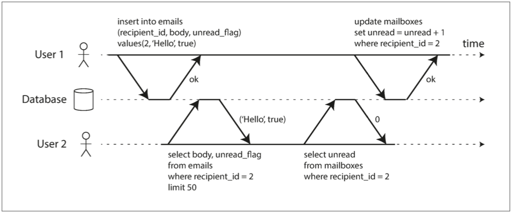
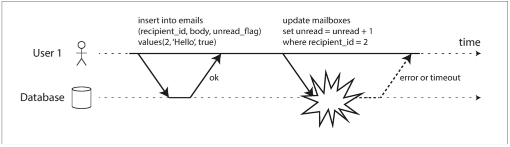
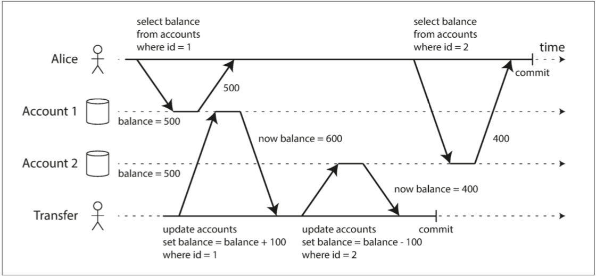
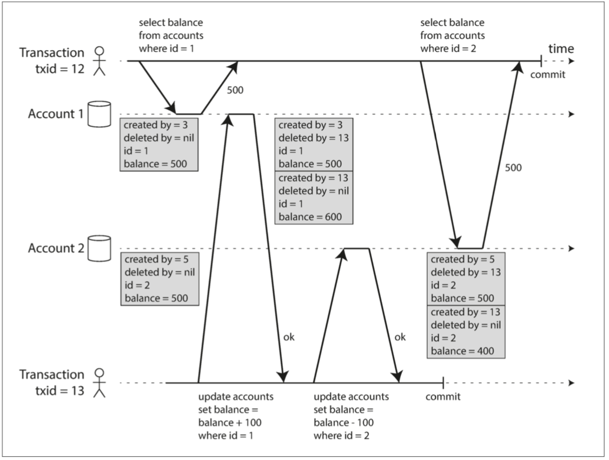
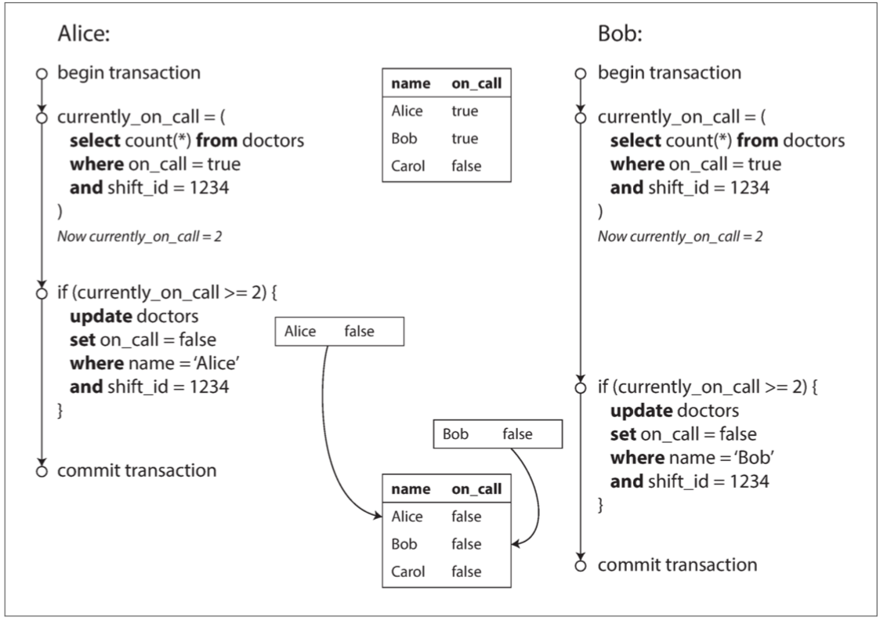
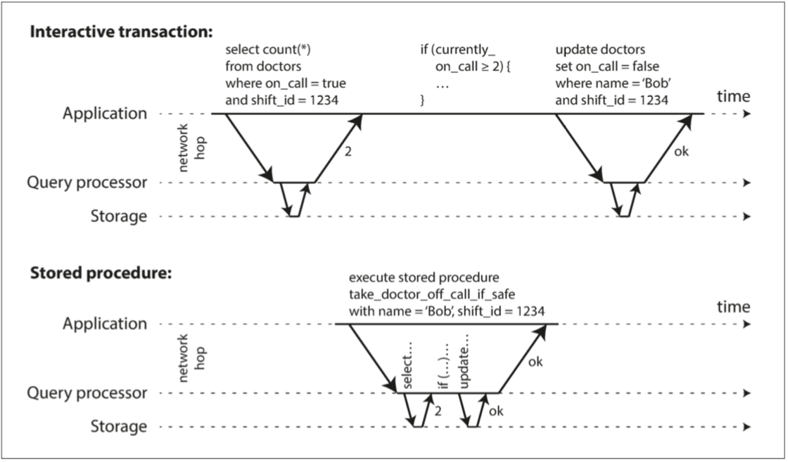

# 7. 事务 


> 一些作者声称，由于其带来的性能或可用性问题，一般的两阶段提交支持太昂贵了。 我们认为应用程序员应该处理由于过度使用而导致的性能问题，而不是在缺乏事务的情况下编写代码。
>
> ​	——James Corbett等人，Spanner：Google的全球分布式数据库（2012）

--------

[TOC]


在数据系统的严酷现实中，很多事情可能会出错：

* 数据库软件或硬件可能随时发生故障（包括写操作过程中）。
* 应用程序可能随时崩溃（包括一系列操作的中途）。
* 网络中断可能会意外地切断来自数据库的应用程序，或从另一个数据库节点切断应用程序。
* 多个客户端可能会同时写入数据库，覆盖彼此的更改。
* 客户可能读取的数据无意义，因为它只是部分更新。
* 客户之间的竞争条件可能导致令人惊讶的错误。

为了可靠，系统必须处理这些故障并确保它们不会导致整个系统的灾难性故障。但是，实现容错机制是很多工作。它需要仔细考虑所有可能出错的事情，并进行大量的测试以确保解决方案真正起作用。

数十年来，交易一直是简化这些问题的首选机制。事务是应用程序将多个读取和写入组合成逻辑单元的一种方式。从概念上讲，事务中的所有读写都是作为一个操作执行的：整个事务成功（提交）或失败（中止，回滚）。如果失败，应用程序可以安全地重试。对于事务来说，应用程序的错误处理变得简单多了，因为它不需要担心部分失败，即某些操作成功，有些失败（无论出于何种原因）的情况。
如果你花了数年时间处理交易，看起来很明显，但我们不应该把它们视为理所当然。交易不是一种自然规律;它们是为了简化访问数据库的应用程序的编程模型而创建的。通过使用事务，应用程序可以自由地忽略某些潜在的错误情况和并发问题，因为数据库会替代它们（我们称之为安全保证）。
并不是所有的应用程序都需要事务处理，有时候有利于削弱事务保证或完全放弃它们（例如，为了获得更高的性能或更高的可用性）。一些安全属性可以在没有交易的情况
你怎么知道你是否需要交易？为了回答这个问题，我们首先需要确切地理解交易可以提供的安全保障，以及与这些交易相关的成本。尽管乍一看交易似乎很简单，但实际上有许多微妙而重要的细节正在发挥作用。
在本章中，我们将研究许多可能出错的事例，并探讨数据库用于防范这些问题的算法。我们将在并发控制领域特别深入地讨论可能发生的各种竞争条件以及数据库如何实现读取提交，快照隔离和可串行化等隔离级别。
本章适用于单节点和分布式数据库;在第8章中，我们将重点讨论仅在分布式系统中出现的特殊挑战。


## 事务的棘手概念

现在几乎所有的关系数据库和一些非关系数据库都支持事务处理。他们中的大多数遵循IBM系统R（第一个SQL数据库）在1975年引入的风格[1,2，3]。尽管一些实现细节已经改变，但总体思路在40年中几乎保持不变：MySQL，PostgreSQL，Oracle，SQL Server等中的事务支持与系统R的支持非常相似。
在二十一世纪末期，非关系（NoSQL）数据库开始普及。他们的目标是通过提供新的数据模型选择（参见第2章），并通过默认包括复制（第5章）和分区（第6章）来改善关系现状。交易是这种运动的主要原因：这些新一代数据库中的许多数据库完全放弃了交易，或者重新定义了这个词来描述比以前更为理解的更弱的一套保证[4]。
随着这种新型分布式数据库的炒作，人们普遍认为交易是可扩展性的对立面，任何大型系统都必须放弃交易以保持良好的性能和高可用性[5， 6]。另一方面，数据库供应商有时将交易保证作为“重要应用”和“有价值数据”的基本要求。这两种观点都是纯粹的夸张。
事实并非如此简单：与其他技术设计选择一样，交易具有优势和局限性。为了理解这些权衡，让我们进入交易可以提供的保证的细节 - 无论是在正常运行中还是在各种极端（但是现实的）情况下。

### ACID的含义

交易所提供的安全保证通常由众所周知的首字母缩略词ACID来描述，ACID代表原子性，一致性，隔离性和耐久性。它由TheoHärder和Andreas Reuter于1983年创建，旨在为数据库中的容错机制建立精确的术语。
但实际上，一个数据库的ACID实现并不等于另一个实现。例如，我们将会看到，围绕着隔离的含义有许多含糊不清[8]。高层的想法是健全的，但恶魔是在细节。今天，当一个系统声称是“符合ACID”的时候，目前还不清楚你可以期待什么保证。不幸的是，ACID主要是一个营销术语。
（不符合ACID标准的系统有时被称为BASE，它代表基本可用性，软状态和最终一致性[9]，这比ACID的定义更加模糊，似乎BASE的唯一合理的定义是“不是ACID”，即它几乎可以代表任何你想要的东西。）
让我们深入了解原子性，一致性，隔离性和持久性的定义，因为这可以让我们改进我们的交易思想。

#### Atomicity: 原子性

一般来说，原子是指不能分解成小部分的东西。这个词在计算的不同分支中意味着相似但又微妙不同的东西。例如，在多线程编程中，如果一个线程执行一个原子操作，这意味着另一个线程无法看到该操作的一半结果。系统只能处于操作之前或操作之后的状态，而不是介于两者之间的状态。
相比之下，在ACID的情况下，原子性不是关于并发性。它没有描述如果几个进程试图同时访问相同的数据会发生什么情况，因为它包含在字母I下，用于隔离（请参见“隔离”（第195页））。
而是，ACID原子性描述了如果客户想要进行多次写入会发生什么情况，但是在处理了一些写入之后发生故障，例如进程崩溃，网络连接中断，磁盘变满或者某种完整性约束被违反。如果这些写入被分组到一个原子事务中，并且该事务由于错误而不能完成（提交），则该事务将被中止，并且数据库必须丢弃或撤消该事务中迄今为止所做的任何写入。
没有原子性，如果通过多次更改发生错误，很难知道哪些更改已经生效，哪些没有生效。该应用程序可以再试一次，但冒着两次相同的风险，导致重复或不正确的数据。原子性简化了这个问题：如果事务被中止，应用程序可以确定它没有改变任何东西，所以它可以安全地重试。
ACID原子性的定义特征是能够在错误中止事务并且丢弃来自该事务的所有写入的能力。或许堕胎将是一个比原子性更好的术语，但是我们将坚持原子性，因为这是通常的词。

#### Consistency：一致性

一致性这个词非常重要：
•在第5章中，我们讨论了副本一致性以及在异步复制系统中出现的最终一致性问题（请参阅第161页上的“复制滞后问题”）。
•一致性散列是某些系统用于重新分区的一种分区方法（请参阅“一致性散列”第191页）。
•在CAP定理（参见第9章）中，一致性一词用于表示可线性化（请参见“线性化”（第295页））。
•在ACID的情况下，一致性是指数据库的应用程序特定概念处于“良好状态”。
不幸的是，同一个词至少有四种不同的含义。
ACID一致性的概念是，您对数据（不变量）有一定的陈述，这些陈述必须始终是真实的，例如，在会计系统中，所有账户的信用和借记必须始终保持平衡。如果一个事务以一个根据这些不变量有效的数据库开始，并且在事务处理期间的任何写入保持有效性，那么你可以确定不变量总是被满足。
但是，这种一致性的思想取决于应用程序的不变量的概念，应用程序有责任正确定义它的事务，以保持一致性。这不是数据库可以保证的事情：如果您编写的数据违反了您的不变量，数据库无法阻止您。 （一些特定类型的不变量可以由数据库检查，例如使用外键约束或唯一性约束，但是一般来说，应用程序定义什么数据是有效的或者无效的 - 数据库只存储它。
原子性，隔离性和持久性是数据库的属性，而一致性（在ACID意义上）是应用程序的属性。应用程序可能依赖于数据库的原子性和隔离属性来实现一致性，但这并不取决于数据库本身。因此，字母C不属于ACID.i

#### Isolation：隔离

大多数数据库同时被多个客户端访问。如果他们读取和写入数据库的不同部分，这是没有问题的，但是如果他们正在访问相同的数据库记录，则可能会遇到并发问题（竞争条件）。
图7-1是这类问题的一个简单例子。假设你有两个客户同时增加一个存储在数据库中的计数器。每个客户端需要读取当前值，加1，并写回新值（假设数据库中没有增加操作）。在图7-1中，柜台应该从42增加到44，因为两个增量发生了，但实际上由于竞态条件只能到43。
ACID意义上的隔离意味着同时执行的事务是相互隔离的：它们不能彼此的脚趾。传统的数据库教科书将隔离形式化为可序列化，这意味着每个事务可以假装它是在整个数据库上运行的唯一事务。数据库确保当事务已经提交时，结果与它们连续运行（一个接一个）是一样的，尽管实际上它们可能已经运行了[10]。


**图7-1 两个客户之间的竞争状态同时递增计数器。**

然而，在实践中，很少使用可序列化隔离，因为它带来了性能损失。一些流行的数据库，如Oracle 11g，甚至没有实现它。在Oracle中有一个名为“serializable”的隔离级别，但实际上它实现了一种叫做快照隔离的功能，这是一种比serializability更弱的保证[8,11]。我们将在第233页的“弱等级”中探索快照隔离和其他形式的隔离。

#### Durability 持久性

数据库系统的目的是提供一个安全的地方，可以存储数据而不用担心丢失数据。耐久性是一个承诺，即一旦交易成功完成，即使存在硬件故障或数据库崩溃，所写的任何数据也不会被遗忘。

在单节点数据库中，耐久性通常意味着数据已被写入非易失性存储设备，如硬盘驱动器或SSD。它通常还包括预写日志或类似的文件（请参阅第77页的“使B树可靠”），以便在磁盘上的数据结构损坏时进行恢复。在复制的数据库中，可用性可能意味着数据已成功复制到某些节点。为了提供持久性保证，数据库必须等到这些写入或复制完成后才能报告事务成功提交。

如第6页的“可靠性”中所述，完美的持久性不存在：如果所有硬盘和所有备份同时被销毁，那么显然没有任何数据库能够为您节省。


> #### 复制和持久性
>
> 从历史上看，耐用性意味着写入存档磁带。然后它被理解为写入磁盘或SSD。最近，它已被改编为意味着复制。哪个实施更好？
> 事实是，没有什么是完美的：
> •如果您写入磁盘并且机器死机，即使您的数据没有丢失，在您修复机器或将磁盘传输到另一台机器之前，也无法访问。复制的系统可以保持可用。
> •一个相关的故障（停电或一个可能导致特定输入的每个节点崩溃的错误）可能会一次性删除所有副本（请参阅第6页的「可靠性」），丢失任何仅在内存中的数据。因此写入磁盘仍然与内存数据库相关。
> •在异步复制系统中，当引导器变得不可用时，最近的写入操作可能会丢失（请参阅第156页的「处理节点中断」）。
> •当电源突然断电时，特别是固态硬盘被证明有时违反了应有的保证：甚至fsync也不能保证正常工作[12]。磁盘固件可能有错误，就像任何其他类型的软件一样[13,14]。
> 存储引擎和文件系统之间的微妙交互可能会导致难以追踪的错误，并可能导致磁盘上的文件在崩溃后被损坏[15,16]。
> •磁盘上的数据可能会逐渐被破坏而不会被检测到[17]。如果数据已损坏一段时间，副本和最近的备份也可能损坏。在这种情况下，您将需要尝试从历史备份中恢复数据。
> •一项关于固态硬盘的研究发现，在运行的前四年，30％到80％的硬盘至少发生一个坏块[18]。磁性硬盘驱动器的坏道率较低，但比SSD更高的完全故障率。
> •如果SSD断电，可能会在几周内开始丢失数据，具体取决于温度[19]。
> 在实践中，没有一种技术可以提供绝对的保证。只有各种降低风险的技术，包括写入磁盘，复制到远程机器和备份 - 它们可以并且应该一起使用。与往常一样，采取任何理论上的“保证”，用一粒健康的盐都是明智的做法。

### 单对象和多对象操作

回顾一下，在ACID中，原子性和隔离性描述了如果客户在同一事务中进行多次写入时数据库应该做的事情：

* 原子性

如果在一系列写操作的中途发生错误，则应中止事务处理，并废除写入该处的写操作。换句话说，数据库不必担心部分失败，通过提供全或无的保证。

* 隔离

同时运行的交易不应该互相干扰。例如，如果一个事务进行多次写入，则另一个事务应该看到全部或者全部写入，而不是一些子集。

这些定义假定您想一次修改几个对象（行，文档，记录）。如果需要保持多个数据同步，则通常需要这种多对象事务。图7-2显示了一个来自电子邮件应用程序的例子。要显示用户的未读邮件数量，可以查询如下所示的内容：

```sql
SELECT COUNT（*）FROM emails WHERE recipient_id = 2 AND unread_flag = true
```

但是，如果电子邮件太多，您可能会发现这个查询太慢，并决定将未读邮件的数量存储在一个单独的字段（一种规范化）中。现在，每当一个新的消息进来，你也必须增加未读的计数器，每当一个消息被标记为已读，你也必须减少未读的计数器。

在图7-2中，用户2遇到异常情况：邮箱列表显示未读消息，但计数器显示零未读消息，因为计数器增量还没有发生.ii隔离将通过确保用户2看到插入的电子邮件和更新的计数器，或者都不是，但不是一个不一致的中间点。

[^ii]: 可以说，电子邮件应用程序中的错误计数器并不是特别重要的问题。 或者，考虑一个客户账户余额，而不是一个未读的柜台，而不是一个电子邮件的支付交易。



**图7-2 违反隔离：一个事务读取另一个事务的未被执行的写入（“脏读”）。**

图7-3说明了对原子性的需求：如果在事务过程中发生错误，邮箱和未读计数器的内容可能会失去同步。在原子事务中，如果对计数器的更新失败，事务将被中止，并且插入的电子邮件将被回滚。



**图7-3。原子性可以确保，如果发生错误，则该事务的任何先前写入都会被撤消，以避免不一致的状态。**

多对象事务需要某种方式来确定哪些读写操作属于同一个事务。在关系数据库中，通常基于客户端到数据库服务器的TCP连接来完成：在任何特定连接上，`BEGIN TRANSACTION`和`COMMIT`语句之间的所有内容都被认为是同一事务的一部分.[^iii]

[^iii]: 这并不理想。如果TCP连接中断，则事务必须中止。如果中断发生在客户端请求提交之后，但在服务器确认提交发生之前，客户端不知道交易是否已提交。为了解决这个问题，事务管理器可以通过一个唯一的事务标识符对操作进行分组，这个标识符没有绑定到特定的TCP连接。我们将回到第516页的“数据库的端到端的争论”中的这个主题。

另一方面，许多非关系数据库并没有将这些操作组合在一起的方法。即使存在多对象API（例如，键值存储可能具有在一个操作中更新几个键的多重放置操作），但这并不一定意味着它具有事务语义：该命令可能成功一些键和其他的失败，使数据库处于部分更新的状态。

#### 单对象写入

当一个对象被改变时，原子性和隔离也是适用的。例如，假设您正在向数据库写入一个20 KB的JSON文档：

* 如果在发送第一个10 KB之后网络连接中断，数据库是否存储了不可解析的10 KB JSON片段？
* 如果在数据库正在覆盖磁盘上的前一个值的过程中电源发生故障，是否最终将新旧值拼接在一起？
* 如果另一个客户端在写入过程中读取该文档，是否会看到部分更新的值？

这些问题会令人难以置信的混淆，因此存储引擎几乎普遍的目的是在一个节点上的单个对象（例如键值对）上提供原子性和隔离性。原子性可以通过使用日志来实现崩溃恢复（请参阅第82页的“使B树可靠”），并且可以使用每个对象的锁来实现隔离（每次只允许一个线程访问对象） ）。

一些数据库也提供更复杂的原子操作，例如增量操作，这样就不需要像图7-1那样的读 - 修改 - 写循环。同样流行的是比较和设置操作，只有当其他人没有同时更改该值时才允许进行写操作（请参见“比较和设置”一节第245页）。

这些单对象操作很有用，因为它们可以防止在多个客户端尝试同时写入同一个对象时丢失更新（请参阅“防止丢失的更新”第221页）。但是，它们不是通常意义上的交易。比较和设置以及其他单一对象操作被称为“轻量级事务”，甚至被称为“ACID”[20,21,22]，但是这个术语是误导性的。事务通常被理解为将多个对象上的多个操作分组为一个执行单元的机制。[^iv]

[^iv]: 严格地说，原子增量这个术语在多线程编程的意义上使用了原子这个词。 在ACID的情况下，它实际上应该被称为孤立的或可序列化的增量。 但是，这是越来越nitpicky。

#### 需要多对象事务

许多分布式数据存储已经放弃了多对象事务，因为它们很难跨分区实现，而且在需要高可用性或高性能的情况下，它们可能会遇到阻碍。但是，没有什么能从根本上防止分布式数据库中的事务，我们将在第9章讨论分布式事务的实现。
但是我们是否需要多对象交易？是否有可能只用键值数据模型和单对象操作来实现任何应用程序？
有一些使用情况下，单对象插入，更新和删除是足够的。但是，在许多其他情况下，需要协调写入几个不同的对象：
•在关系数据模型中，一个表中的行通常具有对另一个表中的行的外键引用。 （同样，在一个类似图形的数据模型中，一个顶点与其他顶点有边）。多对象事务允许你确保这些引用保持有效：当插入几个相互引用的记录时，外键有是正确的和最新的，或者数据变得荒谬。
•在文档数据模型中，需要一起更新的字段通常在同一个文档中，这被视为单个对象 - 更新单个文档时不需要多对象事务。但是，缺乏连接功能的文档数据库也会鼓励非规范化（请参阅第38页上的“与文档数据库相关的对比”）。当需要更新非规范化的信息时，如图7-2所示，您需要一次更新多个文档。事务在这种情况下非常有用，可以防止非规范化的数据不同步。
•在具有二级索引的数据库中（几乎除了纯粹的键值存储以外的所有内容），每次更改值时都需要更新索引。从事务角度来看，这些索引是不同的数据库对象：例如，如果没有事务隔离，记录可能出现在一个索引中，而不是另一个索引中，因为第二个索引的更新还没有发生。
这些应用程序仍然可以在没有交易的情况然而，没有原子性，错误处理就变得复杂得多，缺乏隔离性会导致并发问题。我们将在第233页的“弱隔离级别”中讨论这些问题，并在第12章中探讨其他方法。

#### 处理错误和中止

事务的一个关键特性是，如果发生错误，它可以被中止并安全地重试。 ACID数据库是基于这样一种理念：如果数据库有违反其原子性，隔离性或持久性的危险，则完全放弃交易，而不是完全放弃交易。

不是所有的系统都遵循这个理念。具体而言，具有无引导复制的数据存储（请参见第167页的“无引导复制”）在“尽力而为”的基础上工作得更多，可以概括为“数据库将尽其所能，并且运行到一个错误，它不会撤消它已经完成的事情“ - 所以这是应用程序的责任，从错误中恢复。

错误将不可避免地发生，但许多软件开发人员更喜欢只考虑快乐的道路，而不是错误处理的复杂性。例如，像Rails的ActiveRecord和Django这样的弹性对象关系映射（ORM）框架不会重试异常事务 - 这个错误通常会导致一个异常，导致堆栈出现异常，所以任何用户输入都会被丢弃，一个错误信息。这是一个耻辱，因为整个中止的重点是安全的重试。

虽然重试一个中止的事务是一个简单而有效的错误处理机制，但它并不完美：

* 如果事务实际上成功了，但是在服务器试图确认成功提交给客户端（所以客户端认为失败）时网络发生故障，那么重试事务会导致它被执行两次，除非你有一个额外的应用程序，级别的重复数据删除机制已到位。
* 如果错误是由于过载造成的，则重试交易将使问题变得更糟，而不是更好。为了避免这种反馈周期，您可以限制重试次数，使用指数回退，并处理与过载相关的错误（与可能的情况不同）。
* 仅在暂时性错误（例如，由于死锁，异常情况，临时性网络中断和故障转移）之后才值得重试。在发生永久性错误（例如，违反约束）之后，重试将毫无意义。
* 如果事务在数据库之外也有副作用，即使事务被中止，也可能发生这些副作用。例如，如果您正在发送电子邮件，则每次重试交易时都不会再发送电子邮件。如果您想确保几个不同的系统提交或放弃在一起，两阶段提交可以提供帮助（我们将在第354页的“原子提交和两阶段提交（2PC）”中讨论这个问题）。
* 如果客户端进程在重试时失败，则任何试图写入数据库的数据都将丢失。


## 弱隔离级别

如果两个事务不触及相同的数据，它们可以安全地并行运行，因为两者都不依赖于另一个。当一个事务读取由另一个事务同时修改的数据时，或者当两个事务试图同时修改相同的数据时，并发问题（竞争条件）才起作用。

并发性错误很难通过测试找到，因为这样的错误只有在运行不正常时才会触发。这样的时间问题可能很少发生，通常很难重现。并发性也很难推理，特别是在大型应用程序中，您不一定知道哪些其他代码正在访问数据库。如果您一次只有一个用户，应用程序开发就非常困难;有许多并发用户使得它更加困难，因为任何一个数据块都可能随时改变。

出于这个原因，数据库一直试图通过提供事务隔离来隐藏应用程序开发者的并发问题。从理论上讲，隔离应该让你假装没有并发发生，让你的生活更轻松：可序列化的隔离意味着数据库保证事务的效果与连续运行（即一次一个没有任何并发）是一样的。

实际上，隔离不幸并不那么简单。可序列化的隔离性能很高，许多数据库不愿意支付这个价格[8]。因此，系统通常使用较弱的隔离级别来防止一些并发问题，但不是全部。这些孤立的程度难以理解，并且会导致微妙的错误，但是它们仍然在实践中被使用[23]。

并发性错误导致的并发性错误不仅仅是一个理论问题。他们造成了大量的资金损失[24,25]，导致了财务审计人员的调查[26]，并导致客户数据被破坏[27]。关于这类问题的一个流行的评论是“如果你正在处理财务数据，请使用一个ACID数据库！” - 但是这一点没有提到。即使是很多流行的关系型数据库系统（通常被认为是“ACID”）也使用弱隔离，所以它们不一定能防止这些错误的发生。

我们不必盲目依赖工具，而应该对存在的并发问题的种类以及如何防止这些问题有一个很好的理解。然后，我们可以使用我们所掌握的工具来构建可靠和正确的应用程序。

在本节中，我们将看几个在实践中使用的弱（不可串行化）隔离级别，并详细讨论哪种竞争条件可以发生也可能不发生，以便您可以决定什么级别适合您的应用程序。一旦我们完成了这个工作，我们将详细讨论可串行性（请参阅“可序列化”第259页）。我们讨论的隔离级别将是非正式的，使用示例。如果你需要严格的定义和分析它们的属性，你可以在学术文献中找到它们[28,29,30]。

### 读已提交

最基本的事务隔离级别是read committed.v它提供了两个保证：

1. 从数据库读取时，只能看到已提交的数据（没有脏读）。
2. 写入数据库时，只会覆盖已经写入的数据（没有脏写入）。

我们来更详细地讨论这两个保证。

#### 没有脏读

设想一个事务已经将一些数据写入数据库，但事务还没有提交或中止。另一个事务可以看到未提交的数据吗？如果是的话，那就叫做脏读[2][2]。

在读提交隔离级别运行的事务必须防止脏读。这意味着事务的任何写入操作只有在该事务提交时才能被其他人看到（然后所有的写入操作都会立即可见）。如图7-4所示，用户1设置了`x = 3`，但用户2的`get x`仍旧返回旧值2，而用户1尚未提交。


**图7-4 没有脏读：用户2只有在用户1的事务已经提交后才能看到x的新值。**

[^v]: 某些数据库支持甚至更弱的隔离级别，称为读取未提交。它可以防止脏写入，但不防止脏读。

有几个原因为什么需要防止脏读：

- 如果事务需要更新多个对象，脏读取意味着另一个事务可能会看到一些更新，而不是其他更新。例如，在图7-2中，用户看到新的未读电子邮件，但看不到更新的计数器。这是电子邮件的一个肮脏的阅读。看到处于部分更新状态的数据库会对用户造成混淆，并可能导致其他事务做出错误的决定。
- 如果事务中止，则所有写入操作都需要回滚（如图7-3所示）。如果数据库允许脏读，那就意味着一个事务可能会看到稍后回滚的数据，即从未实际提交给数据库的数据。有关后果的推理很快变成了令人费解的想法。

#### 没有脏写

如果两个事务同时尝试更新数据库中的相同对象，会发生什么情况？我们不知道写入的顺序是怎样的，但是我们通常认为后面的写入会覆盖前面的写入。

但是，如果先前的写入是尚未提交的事务的一部分，那么会发生什么情况，因此后面的写入会覆盖未提交的值？这被称为肮脏的写作[28]。在读取提交的隔离级别上运行的事务必须防止脏写入，通常是延迟第二次写入，直到第一次写入事务提交或中止为止。

通过防止脏写，这个隔离级别避免了一些并发问题：

* 如果事务更新多个对象，脏写入会导致不好的结果。例如，考虑图7-5，图7-5说明了一个二手车销售网站，Alice和Bob两个人同时试图购买同一辆车。购买汽车需要两次数据库写入：网站上的商品需要更新以反映买家，销售发票需要发送给买家。在图7-5的情况下，销售授予鲍勃（因为他执行获奖更新列表表），但发票发送给爱丽丝（因为她执行获奖更新发票表）。阅读承诺这样的事故。
* 但是，提交读取并不能防止图7-1中两个计数器增量之间的竞争状态。在这种情况下，第二次写入发生在第一个事务提交后，所以它不是一个肮脏的写。这仍然是不正确的，但是出于不同的原因，在第242页的“防止丢失的更新”中，我们将讨论如何使这种计数器增量安全。


**图7-5 使用脏写，来自不同事务的冲突写入可能会混淆在一起**

#### 实现读已提交

读提交是一个非常流行的隔离级别。这是Oracle 11g，PostgreSQL，SQL Server 2012，MemSQL和其他许多数据库的默认设置[8]。

最常见的情况是，数据库通过使用行级锁来防止脏写入：当事务想要修改特定对象（行或文档）时，它必须首先获得该对象的锁。然后必须保持该锁，直到交易被提交或中止。只有一个事务可以保存任何给定对象的锁;如果另一个事务要写入同一个对象，则必须等到第一个事务被提交或中止后才能获取该锁并继续。这种锁定是通过读取提交模式（或更强的隔离级别）中的数据库自动完成的。

我们如何防止脏读？一种选择是使用相同的锁，并要求任何想要读取对象的事务来简单地获取该锁，然后在读取之后立即再次释放该锁。这将确保读取不会发生，而对象有一个肮脏的，未提交的值（因为在那段时间锁将由举行了写的事务）。

但是，要求读取锁定的方法在实际中并不奏效，因为长时间运行的写入事务会强制许多只读事务等待长时间运行的事务完成。这会损害只读事务的响应时间，并且不利于可操作性：由于等待锁定，应用程序的某个部分的减速可能会在完全不同的应用程序中产生连锁效应。

出于这个原因，大多数数据库[^vi]使用上述方法防止脏读。如图7-4：对于写入的每个对象，数据库都会记住旧的提交值和由当前持有写入锁的事务设置的新值。 当交易正在进行时，任何其他读取对象的交易都被赋予旧的价值。 只有当提交新值时，交易才会切换到读取新值。

### 快照隔离和可重复读取

如果你从表面上看读取承诺的隔离，你可以原谅它认为事务需要做的一切事情：它允许中止（原子性要求），它防止读取不完整的事务结果，并排写入的并发写入。事实上，这些是非常有用的功能，而且比没有交易的系统可以得到更多的保证。

但是，在使用此隔离级别时，仍然有很多方法可能会导致并发错误。例如，图7-6说明了提交读取时可能发生的问题。



**图7-6 读取偏斜：Alice观察数据库处于不一致的状态**

说爱丽丝在银行有1000美元的储蓄，分两个账户，每个500美元。现在一笔交易从她的账户中转移了100美元到另一笔账户。如果她不幸在交易正在处理的同一时间查看其账户余额列表，则可以在收到付款之前的一段时间看到一个账户余额（余额为500美元），另一个外汇转账完成后的账户（新余额为400美元）。对于爱丽丝来说，现在她的账户似乎只有900美元 - 看起来100美元已经消失了。

[^vi]: 在撰写本文时，唯一使用读取提交隔离锁定的主流数据库是`read_committed_snapshot = off`配置中的IBM DB2和Microsoft SQL Server [23,36]。

这种异常被称为不可重复读取或读取歪斜：如果Alice在交易结束时再次读取账户1的余额，她将看到与她之前的查询中看到的不同的值（600美元）。在阅读承诺的隔离条件下，阅读偏差被认为是可接受的：Alice看到的帐户余额确实是在阅读时确定的。

> 不幸的是，skew 这个词倾斜是超负荷的：我们以前使用它是因为热点的不平衡工作量（请参阅第205页上的“偏斜的工作负荷和减轻热点”），而这意味着计时异常。


在Alice的情况下，这不是一个长期的问题，因为如果她几秒钟后重新加载在线银行网站，她很可能会看到一致的帐户余额。但是，有些情况不能容忍这种暂时的不一致：

* *备份*

  进行备份需要复制整个数据库，这可能需要花费数小时才能完成。在备份过程正在运行的过程中，将继续写入数据库。因此，您可能会得到包含较旧版本数据的备份部分以及包含较新版本的其他部分。如果您需要从这样的备份中恢复，那么不一致（如消失的钱）就会变成永久的。

* *分析查询和完整性检查*

  有时，您可能需要运行一个查询，扫描大部分的数据库。这样的查询在分析中很常见（请参阅第90页的“事务处理或分析？”），也可能是定期完整性检查（即监视数据损坏）的一部分。如果这些查询在不同时间点观察数据库的某些部分，则这些查询可能会返回无意义的结果。

快照隔离[28]是这个问题最常见的解决方案。这个想法是，每个事务都从数据库的一致快照中读取 - 也就是说，事务处理可以看到事务开始时在数据库中提交的所有数据。即使数据随后被另一个事务更改，每个事务也只能看到该特定时间点的旧数据。

快照隔离对长时间运行的只读查询（如备份和分析）非常有用。如果查询的运行数据在查询执行的同时发生变化，则很难推理查询的含义。当一个事务可以看到数据库的一致快照，并在某个特定的时间点被冻结时，它会更容易理解。

快照隔离是一个流行的功能：PostgreSQL支持，MySQL与InnoDB存储引擎，Oracle，SQL Server等[23,31,32]。

#### 实现快照隔离

与读取提交的隔离类似，快照隔离的实现通常使用写入锁来防止脏写入（请参阅“实施读取已提交”（第217页）），这意味着进行写入的事务可以阻止另一个写入同一事务的进程目的。但是，读取不需要任何锁定。从性能的角度来看，快照隔离的一个关键原则是读者不会阻止作者，作者也不会阻止读者。这允许数据库在处理正常写入的同时处理一致快照上的长时间运行的读取查询，而两者之间没有任何锁定争用。

为了实现快照隔离，数据库使用了我们看到的用于防止图7-4中的脏读的机制的一般化。数据库必须可能保留一个对象的几个不同的提交版本，因为各种正在进行的交易可能需要在不同的时间点看到数据库的状态。因为它并排维护着多个版本的对象，所以这种技术被称为多版本并发控制（MVCC）。

如果一个数据库只需要提供读提交的隔离，而不提供快照的隔离，那么保留一个对象的两个版本就足够了：提交的版本和被覆盖但尚未提交的版本。但是，支持快照隔离的存储引擎通常也使用MVCC作为读提交隔离级别。一种典型的方法是提交读取为每个查询使用单独的快照，而快照隔离对整个事务使用相同的快照。

图7-7说明了如何在PostgreSQL中实现基于MVCC的快照隔离[31]（其他实现类似）。当一个事务开始时，它被赋予一个唯一的，永远增长的事务ID（txid）。每当事务向数据库写入任何内容时，它所写入的数据都会被标记为写入者的事务ID。

[^vii]: 事实上，事务ID是32位整数，所以它们在大约40亿次事务之后溢出。 PostgreSQL的真空过程执行清理，确保溢出不会影响数据。



**图7-7 使用多版本对象实现快照隔离**

表中的每一行都有一个created_by字段，其中包含将该行插入到表中的事务的ID。此外，每行都有一个deleted_by字段，最初是空的。如果某个事务删除了一行，那么该行实际上并未从数据库中删除，而是通过将deleted_by字段设置为请求删除的事务的ID来标记为删除。在稍后的时间，当确定没有事务可以再访问已删除的数据时，数据库中的垃圾收集过程将删除标记为删除的行并释放它们的空间。

更新内部翻译成删除和创建。例如，在图7-7中，交易13从账户2中扣除100美元，将余额从500美元改为400美元。账户表现在实际上包含账户2的两行：一笔余额为\$500的行被标记为被事务13删除，一行的余额为\$400，由事务13创建。

#### 可见性规则用于观察一致的快照

当一个事务从数据库中读取时，事务ID被用来决定它可以看到哪些对象，哪些是不可见的。通过仔细定义可见性规则，

数据库可以向应用程序呈现一致的数据库快照。这工作如下：

1. 在每次交易开始时，数据库列出当时所有其他交易（尚未提交或中止）的交易清单。即使交易随后提交，任何写入的交易都会被忽略。
2. 被中止的事务所做的任何写入都被忽略。
3. 由具有较晚的事务ID（即，在当前事务开始之后开始的）的事务所做的任何写入都被忽略，而不管这些事务是否已经提交。
4. 所有其他写入对应用程序的查询都是可见的。

这些规则适用于创建和删除对象。在图7-7中，当交易12从账户2读取时，它看到$ 500的余额，因为$ 500余额的删除是由交易13完成的（根据规则3，交易12看不到交易13所做的删除），并且400美元的余额的创建还不可见（按照相同的规则）。

换句话说，如果以下两个条件都成立，则可见一个对象：

* 读者事务开始时，创建该对象的事务已经提交。
* 对象未被标记为删除，或者如果是，请求删除的事务在读者事务开始时尚未提交。

长时间运行的事务可能会长时间继续使用快照，并继续读取（从其他事务的角度来看）早已被覆盖或删除的值。由于从不更新值，而是每次更改值时创建一个新版本，数据库可以提供一致的快照，同时只产生一个小的开销。

#### 索引和快照隔离

索引如何在多版本数据库中工作？一种选择是使索引简单地指向对象的所有版本并且需要索引查询来过滤掉当前事务不可见的任何对象版本。当垃圾收集删除任何事务不再可见的旧对象版本时，相应的索引条目也可以被删除。
在实践中，许多实现细节决定了多版本并发控制的性能。例如，如果同一对象的不同版本可以放在同一个页面上，PostgreSQL就可以避免索引更新的优化[31]。

在CouchDB，Datomic和LMDB中使用另一种方法。虽然它们也使用B树（请参阅第79页上的“B树”），但它们使用仅附加/正在写入的变体，它们在更新时不覆盖树的页面，而是创建一个新的每个修改页面的副本。父页面，直到树的根，被复制和更新，以指向他们的子页面的新版本。任何不受写入影响的页面都不需要被复制，并且保持不变[33,34,35]。

使用仅附加B树，每个写入事务（或一批事务）都会创建一个新的B树根，而且特定的根在数据库创建时是一致的快照。没有必要根据事务ID过滤掉对象，因为后续写入不能修改现有的B-树;他们只能创建新的树根。但是，这种方法也需要一个压缩和垃圾收集的后台进程。

#### 可重复的读取和命名混淆

快照隔离是一个有用的隔离级别，特别是对于只读事务。但是，许多实现它的数据库都是通过不同的名称来调用它。在Oracle中称为可序列化的，在PostgreSQL和MySQL中称为可重复读取[23]。

这种命名混淆的原因是SQL标准没有快照隔离的概念，因为标准是基于System R 1975年定义的隔离级别[2]，并且快照隔离尚未发明然后。相反，它定义了可重复读取，这看起来表面上与快照隔离很相似。 PostgreSQL和MySQL调用其快照隔离级别可重复读取，因为它符合标准的要求，所以他们可以要求遵守标准。

不幸的是，SQL标准对隔离级别的定义是有缺陷的 - 它是模糊的，不精确的，而不是像标准那样独立于实现[28]。尽管有几个数据库实现了可重复读取，但它们实际提供的保证存在很大的差异，尽管表面上是标准化的[23]。在研究文献[29,30]中已经有了可重复阅读的正式定义，但是大多数的实现并不能满足这个正式的定义。最后，IBM DB2使用“可重复读”来引用可串行化[8]。

结果，没有人真正知道可重复的读取手段。

### 防止丢失的更新

到目前为止，我们讨论的读取提交和快照隔离级别主要是保证只读事务在并发写入时可以看到什么。我们主要忽略了同时写入两个事务的问题 - 我们只讨论了脏写入（请参阅第235页的“无肮脏的写入”），可能会发生一种特定类型的写入 - 写入冲突。

并发写作交易之间还有其他几种有趣的冲突。其中最着名的是丢失更新问题，如图7-1所示，以两个并发计数器增量为例。

如果应用程序从数据库中读取一些值，修改它并写回修改的值（读取 - 修改 - 写入周期），则可能会发生丢失的更新问题。如果两个事务同时执行，则其中一个修改可能会丢失，因为第二个写入不包括第一个修改。 （我们有时会说后面写的是先前写的。）这种模式发生在各种不同的情况下：

* 增加计数器或更新账户余额（需要读取当前值，计算新值并写回更新后的值）
* 将本地更改设置为复杂的值，例如，将元素添加到JSON文档中的列表（需要解析文档，进行更改并写回修改的文档）
* 两个用户同时编辑wiki页面，每个用户通过将整个页面内容发送到服务器来保存其更改，覆盖数据库中当前的任何内容

由于这是一个普遍的问题，所以已经开发了各种解决方案。

#### 原子写

许多数据库提供了原子更新操作，从而消除了在应用程序代码中执行读取 - 修改 - 写入循环的需要。如果您的代码可以用这些操作来表示，那么它们通常是最好的解决方案。例如，下面的指令在大多数关系数据库中是并发安全的：

```sql
UPDATE counters SET value = value + 1 WHERE key = 'foo';
```

类似地，像MongoDB这样的文档数据库提供了对JSON文档的一部分进行本地修改的原子操作，Redis提供了修改数据结构（如优先级队列）的原子操作。并不是所有的写操作都可以用原子操作的方式来表达，例如维基页面的更新涉及到任意文本编辑[^viii]，但是在可以使用原子操作的情况下，它们通常是最好的选择。

原子操作通常通过在读取对象时对其进行独占锁定来实现，以便在更新完成之前没有其他事务可以读取它

[^viii]: 将文本文档的编辑表示为原子突变流是可能的，尽管相当复杂。有关指针的信息，请参阅第174页上的“自动冲突解决”。

应用。这种技术有时被称为游标稳定性[36,37]。另一个选择是仅仅强制所有的原子操作在一个线程上执行。

不幸的是，对象关系映射框架可以很容易地意外编写执行不安全读取 - 修改 - 写入循环的代码，而不是使用数据库提供的原子操作[38]。如果你知道自己在做什么，这不是一个问题，但它可能是测试难以发现的微妙错误的来源。

#### 显式锁定

如果数据库的内置原子操作没有提供必要的功能，防止丢失更新的另一个选择是让应用程序显式地锁定将要更新的对象。然后应用程序可以执行读 - 修改 - 写周期，如果任何其他事务尝试同时读取同一个对象，则强制等待，直到第一个读 - 修改 - 写周期完成。

例如，考虑一个多人游戏，其中几个玩家可以同时移动相同的数字。在这种情况下，一个原子操作可能是不够的，因为应用程序还需要确保一个玩家的移动遵守游戏规则，这涉及到一些你不能合理地实现的作为数据库查询的逻辑。相反，您可以使用锁来防止两名玩家同时移动相同的棋子，如例7-1所示。

##### 例7-1 显式锁定行以防止丢失更新

```plsql
BEGIN TRANSACTION;
SELECT *
FROM figures
WHERE name = 'robot' AND game_id = 222
FOR UPDATE;
-- Check whether move is valid, then update the position -- of the piece that was returned by the previous SELECT. UPDATE figures SET position = 'c4' WHERE id = 1234;
COMMIT;
```

* FOR UPDATE子句指示数据库应该对所有行进行锁定由此查询返回。


这是有效的，但要做到这一点，你需要仔细考虑你的应用逻辑。忘记在代码的某个地方添加一个必要的锁，很容易引入竞争条件。

#### 自动检测丢失的更新

原子操作和锁定是通过强制读取 - 修改 - 写入循环顺序发生来防止丢失更新的方法。另一种方法是允许它们并行执行，如果事务管理器检测到丢失的更新，则中止事务并强制它重试其读 - 修改 - 写周期。

这种方法的一个优点是数据库可以结合快照隔离高效地执行此检查。事实上，PostgreSQL的可重复读取，Oracle的可串行化和SQL Server的快照隔离级别会自动检测丢失更新何时发生，并中止违规事务。但是，MySQL / InnoDB的可重复读取没有检测到丢失的更新[23]。一些作者[28,30]认为，数据库必须防止丢失的更新，以便有资格提供快照隔离，所以MySQL在这个定义下不提供快照隔离。

丢失更新检测是一个很好的功能，因为它不需要应用程序代码来使用任何特殊的数据库功能，您可能会忘记使用锁定或原子操作，从而引入一个错误，但丢失的更新检测自动发生，因此不太容易出错。

#### 比较和设置

在不提供事务的数据库中，您有时会发现原子比较和设置操作（先前在第230页上的“单对象写入”中提到）。此操作的目的是为了避免丢失的更新，只有在上次读取该值时才更新。如果当前值与先前读取的值不匹配，则更新不起作用，并且必须重试读取 - 修改 - 写入周期。
例如，为了防止两个用户同时更新同一个wiki页面，可以尝试类似这样的方式，只有当用户开始编辑页面内容时，才会发生更新：

根据数据库的实现情况，这可能也可能不安全

```sql
-- This may or may not be safe, depending on the database implementation
UPDATE wiki_pages
SET content = 'new content'
WHERE id = 1234 AND content = 'old content';
```

如果内容已经更改并且不再与“旧内容”相匹配，则此更新将不起作用，因此您需要检查更新是否生效，并在必要时重试。但是，如果数据库允许从旧快照中读取WHERE子句，则此语句可能无法防止丢失的更新，因为即使发生了另一个并发写入，条件也可能为真。在依赖数据库之前，检查数据库的比较和设置操作是否安全。

#### 冲突解决和复制

在复制的数据库中（参见第5章），防止丢失的更新需要另一个维度：由于它们具有多个节点上的数据副本，并且可能会在不同节点上同时修改数据，因此需要采取一些额外的步骤来防止丢失更新。

锁和比较和设置操作假定有一个最新的数据副本。但是，具有多领导者或无领导者复制的数据库通常允许同时发生多个写入并异步复制，因此他们无法保证数据的最新副本。因此，基于锁或比较和设置的技术不适用于这种情况。 （我们将在第324页的“Linearizability”中更详细地讨论这个问题。）

相反，如“检测并发写入”一节第184页中所述，这种复制数据库中的一种常见方法是允许并发写入创建多个冲突版本的值（也称为同级），并使用应用程序代码或特殊数据结构在事实之后解决和合并这些版本。

原子操作可以在复制的上下文中很好地工作，特别是如果它们是兼容的（即，可以在不同的副本上以不同的顺序应用它们，并且仍然可以得到相同的结果）。例如，递增计数器或向元素添加元素是可交换的操作。这是Riak 2.0数据类型背后的思想，它可以防止复制副本丢失更新。当不同的客户端同时更新一个值时，Riak自动将更新合并在一起，以免丢失更新[39]。

另一方面，最后一次写入胜利（LWW）冲突解决方法很容易丢失更新，如第188页的“上次写入胜出（放弃并发写入）”中所述。不幸的是，LWW是许多复制数据库中的默认值。

#### 写倾斜和幻读

前面的章节中，我们看到了肮脏的写入和丢失的更新，当不同的事务并发地尝试写入相同的对象时，会出现两种竞争条件。为了避免数据损坏，这些竞争条件需要被阻止 - 既可以由数据库自动执行，也可以通过手动安全措施（如使用锁定或原子写入操作）来防止。

但是，这不是并发写入之间可能发生的竞争条件列表的末尾。在本节中，我们将看到一些更微妙的冲突的例子。
首先，想象一下这个例子：你正在写医生的一个应用程序来管理他们在医院的轮班。医院通常会同时要求几位医生随叫随到，但必须至少有一位医生随时待命。医生

可以放弃他们的班次（例如，如果他们自己生病了），只要至少有一个同事在这个班次中继续工作[40,41]。
现在想象一下，爱丽丝和鲍勃是两位值班医生。两人都感到不适，所以他们都决定请假。不幸的是，他们恰好在同一时间点击按钮关闭电话。图7-8说明了接下来的事情。



**图7-8 写入歪斜导致应用程序错误的示例**

在每次交易中，您的申请首先检查两个或两个以上的医生是否正在通话;如果是的话，它假定一名医生可以安全地接通电话。由于数据库使用快照隔离，两个检查都返回2，所以两个事务都进入下一个阶段。爱丽丝更新自己的记录，让自己脱离呼叫，而鲍勃也更新自己的记录。这两个交易承诺，现在没有医生在接电话。您的电话至少有一名医生的要求已被违反。

#### 表征写入歪斜

这种异常称为写歪斜[28]。它既不是一个肮脏的写作，也不是一个丢失的更新，因为这两个事务正在更新两个不同的对象（分别是Alice和Bob的待命记录）。在这里发生冲突并不那么明显，但是这显然是一个竞争条件：如果两个交易一个接一个地运行，那么第二个

医生会被阻止接听电话。异常行为只有在交易同时进行时才有可能。
您可以将写入歪斜视为丢失更新问题的一般化。如果两个事务读取相同的对象，然后更新其中一些对象（不同的事务可能更新不同的对象），则可能发生写入歪斜。在不同的事务更新相同的对象的特殊情况下，你会得到一个脏写或丢失更新异常（取决于时间）。
我们看到，有各种不同的方法来防止丢失的更新。随着写歪斜，我们的选择更受限制：
•由于涉及多个对象，原子单对象操作不起作用。
在一些快照隔离的实现中，你发现丢失的更新的自动检测不幸并没有帮助：在PostgreSQL的可重复读取，MySQL / InnoDB的可重复读取，Oracle可序列化或SQL Server的快照隔离中，不会自动检测到写入歪斜级别[23]。自动防止写入歪斜需要真正的可序列化隔离（请参见“可串行化”（第217页））。
•某些数据库允许您配置约束，然后由数据库强制执行（例如，唯一性，外键约束或特定值限制）。但是，为了指定至少有一名医生必须在线，您需要一个涉及多个对象的约束。大多数数据库没有内置的对这种约束的支持，但是你可以使用触发器或者实体化视图来实现它们，这取决于数据库[42]。
•如果无法使用可序列化的隔离级别，则此情况下的次优选项可能是显式锁定事务所依赖的行。在例子中，你可以写下如下的代码：

```sql
BEGIN TRANSACTION;
SELECT *
FROM doctors
WHERE on_call = TRUE
      AND shift_id = 1234
FOR UPDATE;
UPDATE doctors
SET on_call = FALSE
WHERE name = 'Alice' AND shift_id = 1234;
COMMIT;
```

和以前一样，FOR UPDATE告诉数据库锁定这个返回的所有行用于查询。

#### 更多的写歪斜的例子

写起来歪斜起初可能看起来像是一个深奥的问题，但是一旦你意识到这一点，你可能会注意到更多的情况发生。以下是一些例子：

***会议室预订系统***

假设你想强制执行，同一时间不能同时在两个会议室预订[43]。当有人想要预订时，首先检查是否存在相互冲突的预订（即预订时间范围重叠的同一房间），如果没有找到，则创建会议（请参见示例7-2）[^ix]。

**例7-2 会议室预订系统试图避免重复预订（在快照隔离下不安全）**

```sql
BEGIN TRANSACTION;
-- Check for any existing bookings that overlap with the period of noon-1pm
SELECT COUNT(*)
FROM bookings
WHERE room_id = 123 AND
      end_time > '2015-01-01 12:00' AND start_time < '2015-01-01 13:00';
-- If the previous query returned zero:
INSERT INTO bookings
(room_id, start_time, end_time, user_id)
VALUES (123, '2015-01-01 12:00', '2015-01-01 13:00', 666);
COMMIT;
```

不幸的是，快照隔离并不能防止另一个用户同时插入冲突的会议。为了保证你不会调度冲突，你再一次需要可序列化的隔离。

***多人游戏***

在例7-1中，我们使用一个锁来防止丢失的更新（也就是确保两个玩家不能同时移动同一个数字）。但是，锁定并不妨碍玩家将两个不同的数字移动到棋盘上的相同位置，或者可能采取其他违反游戏规则的行为。根据您正在执行的规则类型，您可能可以使用唯一的约束，但否则您很容易发生写入歪斜。

***声称一个用户名***

在每个用户拥有唯一用户名的网站上，两个用户可能会尝试同时创建具有相同用户名的帐户。您可以使用交易来检查名称是否被采用，如果没有，则使用该名称创建账户。但是，像在前面的例子中那样，在快照隔离下是不安全的。幸运的是，一个唯一的约束是一个简单的解决方案（第二个事务，试图注册用户名将被中止，由于违反约束）。

***防止双重开支***

允许用户花钱或积分的服务需要检查用户花费的不多。你可以通过在用户的帐户中插入一个消费项目来实现这一点，列出帐户中的所有项目，并检查总和是否为正值[44]。有了写歪斜，可能会发生两个支出项目同时插入，一起导致余额变为负值，但这两个交易都不会注意到另一个。

[^ix]: 在PostgreSQL中，您可以使用范围类型更优雅地执行此操作，但在其他数据库中并未得到广泛支持。

#### 导致写入歪斜的幻影

所有这些例子都遵循类似的模式：

1. SELECT查询通过搜索与某些搜索条件相匹配的行来检查是否满足某些要求（至少有两名医生正在通话，当时没有该房间的现有预订，该板上的位置不已经有了另外一个数字，用户名还没有被占用，账户里还有钱）。
2. 根据第一个查询的结果，应用程序代码决定如何继续（可能继续操作，或者向用户报告错误并中止）。
3. 如果应用程序决定继续执行，它将向数据库写入（INSERT，UPDATE或DELETE）并提交事务。

这个写的效果改变了步骤2的决定的前提条件。换句话说，如果在提交写入后重复从步骤1开始的SELECT查询，将得到不同的结果，因为写改变了一组行符合搜索条件（现在有一个电话的医生减少了，那时候会议室现在已经预订了，现在这个位置已经被移动了，现在用户名已经被占用，现在有了更少的钱在帐户中）。

这些步骤可能以不同的顺序发生。例如，您可以首先进行写入，然后进行SELECT查询，最后根据查询结果决定是放弃还是提交。在医生调用示例的情况下，在步骤3中修改的行是在步骤1中返回的行之一，所以我们可以通过锁定步骤1中的行（SELECT FOR UPDATE）来使事务安全并避免写入歪斜。但是，其他四个例子是不同的：它们检查是否存在与某些搜索条件相匹配的行，写入会添加一个匹配相同条件的行。如果步骤1中的查询没有返回任何行，则SELECT FOR UPDATE不能将锁附加到任何内容。

这种效应，在一个事务中的写入改变另一个事务中的搜索查询的结果，被称为幻影[3]。快照隔离避免了只读查询中的幻影，但是在像我们讨论的例子那样的读写事务中，幻影会导致特别棘手的写歪斜情况。

#### 实现冲突

如果虚幻的问题是没有对象可以附加锁，也许我们可以人为地在数据库中引入一个锁对象？

例如，在会议室预订案例中，您可以想象创建一个时间表和房间表。此表中的每一行对应于特定时间段（例如15分钟）的特定房间。您可以提前创建所有可能的房间和时间组合的行，例如在接下来的六个月。

现在，要创建预订的事务可以锁定（SELECT FOR UPDATE）表中与所需房间和时间段对应的行。在获得锁定之后，它可以检查重叠的预订并像以前一样插入新的预订。请注意，附加表格不用于存储有关预订的信息 - 它完全是一组锁，用于防止同时修改同一房间和时间范围内的预订。

这种方法被称为物化冲突，因为它需要一个幻像，并将其变成数据库中存在的一组具体行的锁定冲突[11]。不幸的是，弄清楚如何实现冲突可能很难，也很容易出错，而让并发控制机制泄漏到应用程序数据模型是很难的。出于这些原因，如果没有其他办法可以实现，冲突的实现应被视为最后的手段。在大多数情况下，可序列化的隔离级别是更可取的。


## 串行执行

在本章中，我们已经看到了几个易于出现竞争条件的交易的例子。读取提交和快照隔离级别会阻止某些竞争条件，但其他竞争条件则不会。我们遇到了一些特别棘手的例子，写有歪斜和幻影。这是一个可悲的情况：

* 隔离级别难以理解，并且在不同的数据库中不一致地实现（例如，“可重复读取”的含义差别很大）。
* 如果您查看应用程序代码，很难判断在特定的隔离级别运行是否安全 - 特别是在大型应用程序中，您可能并不知道可能同时发生的所有事情。

没有好的工具来帮助我们检测竞争状况。原则上，静态分析可能有助于[26]，但研究技术还没有找到实际应用的方法。并发问题的测试是很难的，因为它们通常是非确定性的 - 只有在不及时的情况下才会出现问题。

这不是一个新问题，自20世纪70年代以来，这种情况一直是这样，当时首先引入了较弱的隔离级别[2]。一直以来，研究人员的答案都很简单：使用可序列化的隔离！

可串行隔离通常被认为是最强的隔离级别。它保证即使事务可以并行执行，最终的结果也是一样的，就好像它们连续执行一个一样，没有任何并发性。因此，数据库保证，如果事务在单独运行时正常运行，则它们在并发运行时继续保持正确 - 换句话说，数据库可以防止所有可能的竞争条件。

但是，如果可序列化隔离比弱隔离级别的混乱好得多，那么为什么不是每个人都使用它？为了回答这个问题，我们需要看看实现可串行化的选项，以及它们如何执行。目前大多数提供可串行化的数据库都使用了三种技术之一，本章后面将会介绍这些技术。

* 以串行顺序从字面上执行事务（请参见第252页的“实际的串行执行”）
* 两相锁定（参见第257页上的“两相锁定（2PL）”），几十年来唯一可行的选择
* 开放式并发控制技术，例如可序列化的快照隔离（请参阅“可序列化的快照隔离（SSI）”

目前，我们将主要在单节点数据库的背景下讨论这些技术;在第9章中，我们将研究如何将它们推广到涉及分布式系统中多个节点的事务。


#### 现实世界中的串行执行

避免并发问题的最简单方法是完全去除并发：在一个线程上按顺序一次只执行一个事务。通过这样做，我们完全回

避了检测和防止事务间冲突的问题：由此产生的隔离按定义是可序列化的。

尽管这似乎是一个明显的想法，但数据库设计人员只是在2007年左右才决定，执行事务的单线程循环是可行的[45]。如果多线程并发在过去的30年中被认为是获得良好性能的关键所在，那么为了使单线程执行成为可能，改变了什么呢？

两个事态发展引起了这个反思：

* RAM变得足够便宜，现在许多用例可以将整个活动数据集保存在内存中（请参阅第88页的“将所有内容保留在内存中”）。当事务需要访问的所有数据都在内存中时，事务处理的执行速度要比等待数据从磁盘加载时快得多。
* 数据库设计人员意识到OLTP事务通常很短，只能进行少量的读写操作（请参阅“事务处理或分析？”）。相比之下，长时间运行的分析查询通常是只读的，因此它们可以在串行执行循环之外的一致快照（使用快照隔离）上运行。

串行执行事务的方法在VoltDB / H-Store，Redis和Datomic中实现[46,47,48]。设计用于单线程执行的系统有时可以比支持并发的系统更好，因为它可以避免锁定的协调开销。但是，其吞吐量仅限于单个CPU内核的吞吐量。为了充分利用单一线索，交易需要与传统形式不同的结构。

#### 在存储过程中封装事务

在数据库的早期阶段，意图是数据库事务可以包含整个用户活动流程。例如，预订机票是一个多阶段的过程（搜索路线，票价和可用座位，决定行程，在行程的每个航班上预订座位，输入旅客详细信息，付款）。数据库设计者认为，如果整个过程是一个事务，那么它就可以被原子化地执行。

不幸的是，人类做出决定和回应的速度非常缓慢。如果数据库事务需要等待来自用户的输入，则数据库需要支持潜在的大量并发事务，其中大部分是空闲的。大多数数据库不能高效地完成这项工作，因此几乎所有的OLTP应用程序都通过避免交互式地等待交易中的用户来保持交易的简短。在Web上，这意味着事务在同一个HTTP请求中被提交 - 一个事务不会跨越多个请求。一个新的HTTP请求开始一个新的事务。

即使人类已经找出了关键路径，事务仍然以交互式的客户端/服务器风格执行，一次一个语句。应用程序进行查询，读取结果，可能根据第一个查询的结果进行另一个查询，依此类推。查询和结果在应用程序代码（在一台机器上运行）和数据库服务器（在另一台机器上）之间来回发送。

在这种交互式的事务方式中，应用程序和数据库之间的网络通信耗费了大量的时间。如果您不允许在数据库中进行并发处理，并且一次只处理一个事务，则吞吐量将会非常糟糕，因为数据库将花费大部分时间等待应用程序发出当前事务的下一个查询。在这种数据库中，为了获得合理的性能，需要同时处理多个事务。

出于这个原因，具有单线程串行事务处理的系统不允许交互式多语句事务。相反，应用程序必须提前将整个事务代码作为存储过程提交给数据库。这些方法之间的差异如图7-9所示。如果事务所需的所有数据都在内存中，则存储过程可以非常快地执行，而不用等待任何网络或磁盘I/O。



**图7-9 交互式事务和存储过程之间的区别（使用图7-8的示例事务）**

#### 存储过程的优点和缺点

存储过程在关系型数据库中已经存在了一段时间了，自1999年以来它们一直是SQL标准（SQL/PSM）的一部分。由于各种原因，它们的名声不太好：

* 每个数据库供应商都有自己的存储过程语言（Oracle有PL/SQL，SQL Server有T-SQL，PostgreSQL有PL/pgSQL等）。这些语言并没有跟上通用编程语言的发展，所以从今天的角度来看它们看起来相当丑陋和陈旧，而且它们缺乏大多数编程语言中能找到的库的生态系统。
* 与应用程序服务器相，比在数据库中运行的代码难以管理，调试更为困难，版本控制和部署起来也比较尴尬，更难测试，难与监控系统集成。
* 数据库通常比应用程序服务器对性能敏感的多，因为单个数据库实例通常由许多应用程序服务器共享。数据库中一个写得不好的存储过程（例如，使用大量内存或CPU时间）会比在应用程序服务器中写入相同的代码造成更多的麻烦。

但是这些问题都是可以克服的。现代的存储过程实现放弃了PL/SQL，而是使用现有的通用编程语言：VoltDB使用Java或Groovy，Datomic使用Java或Clojure，而Redis使用Lua。

使用存储过程和内存数据，在单个线程上执行所有事务变得可行。由于它们不需要等待I / O，并且避免了其他并发控制机制的开销，它们可以在单个线程上实现相当好的吞吐量。

VoltDB还使用存储过程进行复制：不是将事务的写入从一个节点复制到另一个节点，而是在每个节点上执行相同的存储过程。因此，VoltDB要求存储过程是确定性的（当在不同的节点上运行时，它们必须产生相同的结果）。如果事务需要使用当前的日期和时间，则必须通过特定的确定性API来实现。

#### 分区

并发执行所有事务使得并发控制更为简单，但是将数据库的事务吞吐量限制在单个机器上单个CPU内核的速度。只读事务可以使用快照隔离在其他地方执行，但对于写入吞吐量较高的应用程序，单线程事务处理器可能成为一个严重的瓶颈。

为了扩展到多个CPU核心和多个节点，您可以对您的数据进行分区（参见第6章），这在VoltDB中是受支持的。如果您可以找到一种对数据集进行分区的方法，以便每个事务只需要在单个分区中读写数据，那么每个分区就可以拥有自己独立运行的事务处理线程。在这种情况下，您可以为每个CPU内核分配一个自己的分区，这样您的事务吞吐量就可以与CPU内核数量成线性比例关系[47]。

但是，对于需要访问多个分区的任何事务，数据库必须在触及的所有分区之间协调事务。存储过程需要跨越所有分区锁定执行，以确保整个系统的可串行性。

由于跨分区事务具有额外的协调开销，所以它们比单分区事务慢得多。 VoltDB报告的吞吐量大约是每秒1000个跨分区写入，比单分区吞吐量低几个数量级，并且不能通过增加更多的机器来增加[49]。

事务是否可以是单分区很大程度上取决于应用程序使用的数据的结构。简单的键值数据通常可以非常容易地进行分区，但是具有多个二级索引的数据可能需要大量的跨分区协调（请参阅第206页的“分区和二级索引”）。

#### 串行执行摘要

事务的串行执行已成为在一定的约束条件下实现可序列化的隔离的一种可行方法：

* 每笔交易都必须小而快，因为只需一个缓慢的交易即可拖延所有交易处理。
* 仅限于使用活动数据集可以放入内存的情况。很少访问的数据可能会被移动到磁盘，但是如果需要在单线程事中访问，系统会变得非常慢[^x]。
* 写入吞吐量必须足够低才能在单个CPU内核上处理，否则事务需要进行分区而不需要跨分区协调。
* 交叉分区交易是可能的，但是它们的使用程度有很大的限制。

[^x]: 如果事务需要访问不在内存中的数据，最好的解决方案可能是放弃事务，异步地将数据提取到内存中，同时继续处理其他事务，然后在数据加载时重新启动事务。这种方法被称为反高速缓存，正如前面在第88页“将所有内容保存在内存”中所述。

### 两相锁定（2PL）

大约30年来，在数据库中只有一种广泛使用的可串行化算法：双相锁定（2PL）

> #### 2PL不是2PC
>
> 请注意，虽然两阶段锁定（2PL）听起来非常类似于两阶段提交（2PC），但它们是完全不同的东西。我们将在第9章讨论2PC。

之前我们看到锁通常用于防止脏写入（请参阅“无脏写”一节第217页）：如果两个事务同时尝试写入同一个对象，则锁可确保第二个写入器必须等到第一个写入器完成交易（中止或承诺），然后才能继续。

两相锁定类似，但使锁定要求更强。只要没有人写信，就允许多个事务同时读取同一个对象。但只要有人想写（修改或删除）对象，就需要独占访问权限：

* 如果事务A读取了一个对象，并且事务B想要写入该对象，那么B必须等到A提交或中止才能继续。 （这确保B不能在A后面意外地改变对象。）
* 如果事务A写入了一个对象，并且事务B想要读取该对象，则B必须等到A提交或中止才能继续。 （如图7-1所示，读取旧版本的对象在2PL下是不可接受的。）

在第二方物流中，作家不只是阻碍其他作家，他们也阻挡读者，反之亦然。快照隔离使得读者永远不会阻止写入者，编写者也不会阻止读取者（请参阅“实施快照隔离”在本页221），该功能捕获快照隔离和两阶段锁定之间的这一关键区别。另一方面，因为2PL提供了可串行性，它可以防止早先讨论的所有竞争条件，包括丢失更新和写入歪斜。

#### 执行两阶段锁定

2PL用于MySQL（InnoDB）和SQL Server中的可序列化隔离级别，以及DB2中的可重复读取隔离级别[23,36]。

[^xi]: 有时被称为强有力的严格的两阶段锁定（SS2PL），以区别于2PL的其他变种。

读写器的阻塞是通过锁定数据库中的每个对象来实现的。锁可以处于共享模式或独占模式。锁使用如下：

* 如果事务要读取对象，则必须先以共享模式获取锁。允许多个事务同时保持共享模式下的锁定，但是如果另一个事务已经在对象上拥有独占锁定，则这些事务必须等待。
* 如果一个事务要写入一个对象，它必须首先以独占模式获取该锁。没有其他事务可以同时持有锁（共享或独占模式），所以如果对象上存在任何锁，事务必须等待。
* 如果事务首先读取并写入对象，则可能会将其共享锁升级为独占锁。升级工作与直接获得排他锁相同。
* 事务获得锁之后，必须继续保持锁直到事务结束（提交或中止）。这就是“两阶段”这个名字的来源：第一阶段（当事务正在执行时）是获取锁的时间，第二阶段（在事务结束时）是所有的锁被释放。

由于使用了这么多的锁，因此事务A可能很容易发生，等待事务B释放它的锁，反之亦然。这种情况叫做死锁。数据库自动检测事务之间的死锁，并中止其中的一个，以便其他人可以取得进展。被中止的事务需要被应用程序重试。

#### 二阶段锁定的性能

两阶段锁定的大缺点以及自1970年代以来没有被大家使用的原因是性能：两阶段锁定下的查询的事务吞吐量和响应时间要比弱隔离下的要严重得多。

这部分是由于获取和释放所有这些锁的开销，但更重要的是由于并发性的降低。按照设计，如果两个并发事务试图做任何可能导致竞争条件的事情，那么必须等待另一个完成。

传统的关系数据库不限制事务的持续时间，因为它们是为等待人类输入的交互式应用而设计的。因此，当一个交易需要等待另一个交易时，可以等待多长时间没有限制。即使你保证你所有的交易都是短暂的，如果有多个交易想要访问同一个对象，那么可能会形成一个队列，所以交易可能需要等待几个其他交易才能完成。

因此，运行2PL的数据库可能具有相当不稳定的等待时间，如果在工作负载中存在争用，那么在高百分比情况下它们可能非常慢（请参阅第13页的“描述性能”）。它可能只需要一个缓慢的事务，或者一个访问大量数据并获取许多锁的事务，导致系统的其他部分停下来。当需要稳健的操作时，这种不稳定性是有问题的。

虽然基于锁定的读取提交隔离级别可能发生死锁，但在2PL可序列化隔离（取决于事务的访问模式）下，它们发生得更为频繁。这可能是一个额外的性能问题：当事务由于死锁而被中止并被重试时，它需要重新做它的工作。如果僵局频繁，这可能意味着重大的浪费。

#### 预测锁

在前面关于锁的描述中，我们掩盖了一个微妙而重要的细节。在第250页的“导致写入歪斜的幻像”中，我们讨论了一些性能问题，即一个事务改变另一个事务的搜索查询的结果。具有可序列化隔离的数据库必须防止幻像。

在会议室预订的例子中，这意味着如果一个交易在某个时间窗口内搜索了一个房间的现有预订（见例7-2），则另一个交易不能同时插入或更新同一房间的另一个预订，时间范围。 （可以同时插入其他房间的预订，或在不影响预定预订的不同时间的同一房间）。

我们如何实现这一点？从概念上讲，我们需要一个谓词锁定[3]。它类似于前面描述的共享/排它锁，但不属于特定的对象（例如，表中的一行），它属于所有符合某些搜索条件的对象，如：

```sql
SELECT *
FROM bookings
WHERE room_id = 123 AND
      end_time > '2018-01-01 12:00' AND start_time < '2018-01-01 13:00';
```

谓词锁限制访问，如下所示：

* 如果事务A想要读取匹配某些条件的对象，就像在该SELECT查询中那样，它必须获取对查询条件的共享模式谓词锁定。如果另一个事务B当前对与这些条件匹配的任何对象具有排他锁，那么A必须等到B释放它的锁之后才允许它进行查询。
* 如果事务A想要插入，更新或删除任何对象，则必须首先检查旧值或新值是否与任何现有的谓词锁匹配。如果事务B持有匹配的谓词锁，那么A必须等到B已经提交或中止后才能继续。

这里的关键思想是，谓词锁定甚至适用于数据库中尚不存在的对象，但可能在将来添加（幻像）对象。如果两阶段锁定包含谓词锁定，则数据库将阻止所有形式的写入歪斜和其他竞争条件，因此其隔离可以串行化。

#### 索引范围的锁

不幸的是，谓词锁定性能不佳：如果活动事务中存在许多锁定，则检查匹配的锁定会变得非常耗时。因此，大多数使用2PL的数据库实际上实现了索引范围锁定（也称为下一个锁定），这是一个简化的谓词锁定近似[41,50]。

通过使谓词与更多的对象相匹配来简化谓词是安全的。例如，如果在中午和下午1点之间预订123号房间的谓词锁，您可以随时锁定123号房间的预订，或者通过锁定所有房间（不只是123号房间）中午至下午1点这是安全的，因为任何与原始谓词相匹配的书写都肯定会匹配近似值。

在房间预订数据库中，您可能会在room_id列上有一个索引，并且/或者在start_time和end_time上有索引（否则前面的查询在大型数据库上的速度会非常慢）：

* 假设您的索引位于room_id上，并且数据库使用此索引查找123号房间的现有预订。现在数据库可以简单地将共享锁附加到此索引条目，指示交易已搜索123号房间的预订。
* 或者，如果数据库使用基于时间的索引来查找现有预订，那么它可以将共享锁附加到该索引中的一系列值，指示交易已搜索与中午的时间段重叠的预订到下午1点2018年1月1日

无论哪种方式，搜索条件的近似值都附加到其中一个索引上。现在，如果另一个交易想要插入，更新或删除同一个房间和/或重叠时间段的预订，则它将不得不更新索引的相同部分。在这样做的过程中，它会遇到共享锁，它将被迫等到锁被释放。

这提供了有效的防止幻影和写歪斜。索引范围锁并不像谓词锁那样精确（它们可能会锁定更大范围的对象，而不是维持可串行化所必需的范围），但是由于它们的开销较低，所以它们是一个很好的折衷。

如果在可以连接范围锁的地方没有合适的索引，则数据库可以回退到整个表上的共享锁。这对性能不利，因为它会阻止所有其他交易写入表格，但这是一个安全的回退位置。


### 可串行快照隔离（SSI）

本章描绘了数据库中并发控制的黯淡画面。一方面，我们实现了不能很好执行的串行化（两阶段锁定）或不能很好地扩展（串行执行）。另一方面，我们有较弱的隔离级别，性能良好，但容易出现各种竞争条件（丢失更新，写歪斜，幻影等）。序列化的隔离和良好的性能从根本上相互矛盾？

也许不是：一个称为可序列化快照隔离（SSI）的算法是非常有前途的。它提供了完全的可串行性，但与快照隔离相比，性能损失只有很小的一部分。 SSI是相当新的：它在2008年首次被描述[40]，并且是Michael Cahill的博士论文[51]的主题。

今天，SSI既用于单节点数据库（自9.1版以来PostgreSQL中的可序列化隔离级别）和分布式数据库（FoundationDB使用类似的算法）。由于SSI与其他并发控制机制相比还很年轻，它在实践中仍然可以证明其性能，但它有可能成为未来的新的违约。

#### 悲观与乐观的并发控制

两阶段锁定是一种所谓的悲观并发控制机制：它是基于如果有什么可能出错（如另一个事务所持有的锁所表示的）的原则，最好等到情况再次安全做任何事情。这就像互斥，用于保护多线程编程中的数据结构。

从某种意义上说，串行执行是极端悲观的：在事务持续期间，每个事务对整个数据库（或数据库的一个分区）具有独占锁定，这基本相当。我们通过使每笔交易执行得非常快来弥补悲观情绪，所以只需要短时间保持“锁定”。

相比之下，可串行化的快照隔离是一种乐观的并发控制技术。在这种情况下乐观意味着，如果发生某种可能的危险，不要阻止交易，反而继续交易，希望一切都会好起来。当一个事务想要提交时，数据库检查是否有什么不好的事情发生（即隔离是否被违反）;如果是的话，交易将被中止，并且必须重试。只有可序列化的事务才被允许提交。

乐观并发控制是一个古老的想法[52]，其优点和缺点已经争论了很长时间[53]。如果存在较高的意图（很多事务试图访问相同的对象），则表现不佳，因为这会导致很大一部分事务需要中止。如果系统已经接近最大吞吐量，来自重试交易的额外交易负载可能会使性能变差。

但是，如果有足够的备用容量，并且交易之间的争用不是太高，乐观的并发控制技术往往比悲观的要好。可交换的原子操作可以减少争用：例如，如果多个事务同时要增加一个计数器，那么应用增量的顺序（只要计数器不在同一个事务中读取）就无关紧要了，所以并发增量可以全部应用而不冲突。

顾名思义，SSI基于快照隔离 - 也就是说，事务中的所有读取操作都是通过数据库的一致快照创建的（请参见第237页的“快照隔离和可重复读取”）。与早期的乐观并发控制技术相比，这是主要的区别。在快照隔离的基础上，SSI添加了一种算法来检测写入之间的序列化冲突，并确定要中止哪些事务。

#### 基于过时前提的决定

当我们先前讨论了快照隔离中的写入歪斜（请参阅“写入歪斜和幻像”第221页）时，我们观察到一个循环模式：事务从数据库读取一些数据，检查查询的结果，并决定采取一些操作（写入数据库）根据它看到的结果。但是，在快照隔离的情况下，原始查询的结果在事务提交时可能不再是最新的，因为数据可能在同一时间被修改。
换句话说，交易正在基于一个前提采取行动（交易一开始就是事实，例如“目前有两名医生正在通话”）。之后，当交易要提交时，原始数据可能已经改变 - 前提可能不再成立。

当应用程序进行查询时（例如，“当前有多少医生正在调用？”），数据库不知道应用程序逻辑如何使用该查询的结果。为了安全，数据在这种情况下，交易可能在一个过时的前提下采取了行动并放弃交易。

数据库如何知道查询结果是否可能已经改变？有两种情况需要考虑：

* 检测陈旧的MVCC对象版本的读取（在读取之前发生未提交的写入）
* 检测影响先前读取的写入（写入发生在读取之后）


#### 检测陈旧的MVCC读取

回想一下，快照隔离通常是通过多版本并发控制（MVCC;见图7-10）来实现的。当一个事务从MVCC数据库中一致的快照中读取时，它将忽略在拍摄快照时尚未提交的任何其他事务所做的写入。在图7-10中，事务43将Alice看作具有on_call = true，因为事务42（修改Alice的待命状态）未被提交。然而，在事务43想要提交时，事务42已经提交。这意味着从一致性快照读取时被忽略的写入已经生效，并且事务43的前提不再是真实的。


**图7-10 检测事务何时从MVCC快照读取过时的值**

为了防止这种异常，数据库需要跟踪一个事务由于MVCC可见性规则而忽略另一个事务的写入。当事务想要提交时，数据库检查是否有任何被忽略的写入现在已经被提交。如果是这样，交易必须中止。

为什么要等到提交？当检测到陈旧的读取时，为什么不立即中止事务43？那么，如果事务43是只读事务，则不需要中止，因为没有写歪斜的风险。当事务43进行读取时，数据库还不知道事务是否要稍后执行写操作。此外，交易42可能在交易43被提交的时候中止或者可能仍然未被提交，因此读取可能终究不是陈旧的。通过避免不必要的中止，SSI保留快照隔离对从一致快照中长时间运行的读取的支持。

#### 检测影响之前读取的写入

第二种情况要考虑的是另一个事务在读取数据之后修改数据。这种情况如图7-11所示。


**图7-11 在可序列化快照隔离中，检测一个事务何时修改另一个事务的读取。**

在两阶段锁定的上下文中，我们讨论了索引范围锁（请参阅“索引范围锁”，第259页），它允许数据库锁定与某个搜索查询匹配的所有行的访问权，例如WHERE shift_id = 1234。可以在这里使用类似的技术，除了SSI锁不会阻塞其他事务。

在图7-11中，交易42和43都在轮班1234期间寻找在线医生。如果在shift_id上有索引，则数据库可以使用索引条目1234来记录事务42和43读取这个数据的事实。 （如果没有索引，这个信息可以在表级进行跟踪）。这个信息只需要保留一段时间：在一个事务完成（提交或中止）之后，所有的并发事务完成之后，数据库可能会忘记它读取的数据。

当事务写入数据库时，它必须在索引中查找最近读取受影响数据的其他事务。这个过程类似于在受影响的密钥范围上获取写入锁定，而不是在读取器提交之前阻塞，锁定作为tripwire：它只是通知事务他们读取的数据可能不再是最新的。

在图7-11中，交易43通知交易42其先前的阅读已过时，反之亦然。事务42首先提交，并且成功：尽管事务43的写入受到影响42,43尚未提交，所以写入尚未生效。然而，当事务43想要提交时，来自42的冲突写入已经被提交，所以43必须中止。

#### 可序列化的快照隔离的性能

与往常一样，许多工程细节会影响算法在实践中的效果。例如，一个权衡是跟踪事务的读取和写入的粒度。如果数据库非常详细地跟踪每个事务的活动，那么可以准确地确定哪些事务需要中止，但是记帐开销可能变得很重要。不太详细的跟踪速度更快，但可能会导致更多的交易被中止。

在某些情况下，事务可以读取被另一个事务覆盖的信息：取决于发生了什么，有时可以证明执行的结果是可序列化的。 PostgreSQL使用这个理论来减少不必要的中止次数[11,41]。

与两阶段锁定相比，可序列化快照隔离的最大优点是一个事务不需要阻塞等待另一个事务所持有的锁。就像在快照隔离下一样，编写者不会阻止读者，反之亦然。这种设计原则使得查询延迟更可预测，变量更少。特别是，只读查询可以运行在一致的快照上，而不需要任何锁定，这对于读取繁重的工作负载非常有吸引力。

与串行执行相比，可串行化的快照隔离并不局限于单个CPU内核的吞吐量：FoundationDB将检测到的串行冲突分布在多台机器上，允许扩展到很高的吞吐量。即使数据可能跨多台机器进行分区，事务也可以在保证可串行化隔离的同时读写多个分区中的数据[54]。

中止率显着影响SSI的整体表现。例如，长时间读取和写入数据的事务很可能会发生冲突并中止，因此SSI要求读写事务相当短（长时间运行的只读事务可能没有问题）。但是，SSI可能比两阶段锁定或串行执行更不敏感。


## 本章小结

事务是一个抽象层，允许应用程序假装某些并发问题和某些类型的硬件和软件故障不存在。大量的错误被简化为简单的事务中止，而应用程序只需要再次尝试。

在本章中，我们看到许多交易有助于防止的问题。并非所有的应用程序都容易出现所有这些问题：具有非常简单的访问模式的应用程序（例如只读和写一条记录）可能无需事务管理。但是，对于更复杂的访问模式，事务可以大大减少您需要考虑的潜在错误情况的数量。

没有事务处理，各种错误情况（进程崩溃，网络中断，停电，磁盘已满，意外并发等）意味着数据可能以各种方式变得不一致。例如，非规格化的数据可能很容易与源数据不同步。如果没有事务处理，就很难推断复杂的交互访问可能对数据库造成的影响。

在本章中，我们深入到并发控制的主题。我们讨论了几个广泛使用的隔离级别，特别是读取提交，快照隔离（有时称为可重复读取）和可序列化。我们通过讨论种族条件的各种示例来描述这些竟态条件：

***脏读***

​	一个客户端在提交之前读取另一个客户端的写入。读提交的隔离级别和更强的级别防止脏读。

***脏写***

​	一个客户端会覆盖另一个客户端已经写入但尚未提交的数据。几乎所有的事务实现都可以防止脏写入。

***读取偏斜（不可重复读）***
​	客户在不同的时间点看到数据库的不同部分。快照隔离最常遇到这个问题，它允许事务在一个时间点从一致的快照中读取数据。它通常使用多版本并发控制（MVCC）来实现。

***丢失的更新***

​	两个客户端同时执行读 - 修改 - 写周期。一个覆盖另一个的写入而不包含其变化，所以数据丢失。快照隔离的一些实现可以自动防止这种异常，而另一些实现则需要手动锁定（SELECT FOR UPDATE）。

***写歪斜***
​	一个事务读取一些东西，根据它所看到的值作出决定，并将决定写入数据库。但是，写作的时候，决定的前提不再是真实的。只有可序列化的隔离才能防止这种异常。

***幻读***
​	事务读取符合某些搜索条件的对象。另一个客户端进行写入，影响搜索结果。快照隔离可以防止直接的幻像读取，但是写入歪斜环境中的幻影需要特殊处理，例如索引范围锁定。

弱隔离级别可以防止这些异常情况，但是让应用程序开发人员手动处理其他应用程序（例如，使用显式锁定）。只有可序列化的隔离才能防范所有这些问题。我们讨论了实现可序列化事务的三种不同方法：

***按照连续顺序从字面上执行交易***
​	如果您可以使每个事务的执行速度非常快，并且事务吞吐量足够低以在单个CPU内核上处理，这是一个简单而有效的选择。

***两相锁定***
​	数十年来，这一直是实现可串行化的标准方式，但是许多应用程序由于其性能特征而避免使用它。
***可串行化快照隔离（SSI）***

​	一个相当新的算法，避免了以前方法的大部分缺点。它使用乐观的方法，允许事务进行而不会阻塞。当一个事务想要提交时，它会被检查，如果执行不可序列化，它将被中止。

本章中的示例使用关系数据模型。但是，正如在讨论中

无论使用哪种数据模型，第231页上的“多对象事务的需要”事务都是有价值的数据库功能。

在本章中，我们主要探讨了在一台机器上运行数据库的情况下的想法和算法。分布式数据库中的事务开启了一系列新的困难挑战，我们将在接下来的两章中讨论。


## 参考文献


1.  Donald D. Chamberlin, Morton M. Astrahan, Michael W. Blasgen, et al.:
    “[A History and Evaluation of System R](http://citeseerx.ist.psu.edu/viewdoc/download?doi=10.1.1.84.348&rep=rep1&type=pdf),” *Communications of the ACM*,
    volume 24, number 10, pages 632–646, October 1981.
    [doi:10.1145/358769.358784](http://dx.doi.org/10.1145/358769.358784)

1.  Jim N. Gray, Raymond A. Lorie, Gianfranco R. Putzolu, and Irving L. Traiger:
    “[Granularity of Locks and Degrees of Consistency in a Shared Data Base](http://citeseer.ist.psu.edu/viewdoc/download?doi=10.1.1.92.8248&rep=rep1&type=pdf),” in *Modelling in Data
    Base Management Systems: Proceedings of the IFIP Working Conference on Modelling in Data Base
    Management Systems*, edited by G. M. Nijssen, pages
    364–394, Elsevier/North Holland Publishing, 1976. Also in *Readings in Database Systems*, 4th edition, edited by Joseph M.
    Hellerstein and Michael Stonebraker, MIT Press, 2005. ISBN: 978-0-262-69314-1

1.  Kapali P. Eswaran, Jim N. Gray, Raymond A. Lorie, and Irving L. Traiger:
    “[The Notions of Consistency and Predicate Locks in a Database System](http://research.microsoft.com/en-us/um/people/gray/papers/On%20the%20Notions%20of%20Consistency%20and%20Predicate%20Locks%20in%20a%20Database%20System%20CACM.pdf),” *Communications of the
    ACM*, volume 19, number 11, pages 624–633, November 1976.

1.  “[ACID Transactions Are Incredibly Helpful](http://web.archive.org/web/20150320053809/https://foundationdb.com/acid-claims),” FoundationDB, LLC, 2013.

1.  John D. Cook:
    “[ACID Versus BASE for Database Transactions](http://www.johndcook.com/blog/2009/07/06/brewer-cap-theorem-base/),” *johndcook.com*, July 6, 2009.

1.  Gavin Clarke:
    “[NoSQL's CAP Theorem Busters: We Don't Drop ACID](http://www.theregister.co.uk/2012/11/22/foundationdb_fear_of_cap_theorem/),” *theregister.co.uk*, November 22, 2012.

1.  Theo Härder and Andreas Reuter:
    “[Principles of Transaction-Oriented Database Recovery](http://citeseerx.ist.psu.edu/viewdoc/download?doi=10.1.1.87.2812&rep=rep1&type=pdf),” *ACM Computing Surveys*,
    volume 15, number 4, pages 287–317, December 1983.
    [doi:10.1145/289.291](http://dx.doi.org/10.1145/289.291)

1.  Peter Bailis, Alan Fekete, Ali Ghodsi, et al.:
    “[HAT, not CAP: Towards Highly Available Transactions](http://www.bailis.org/papers/hat-hotos2013.pdf),”
    at *14th USENIX Workshop on Hot Topics in Operating Systems* (HotOS), May 2013.

1.  Armando Fox, Steven D. Gribble, Yatin Chawathe, et al.:
    “[Cluster-Based Scalable Network Services](http://www.cs.berkeley.edu/~brewer/cs262b/TACC.pdf),” at
    *16th ACM Symposium on Operating Systems Principles* (SOSP), October 1997.

1.  Philip A. Bernstein, Vassos Hadzilacos, and Nathan Goodman:
    <a href="http://research.microsoft.com/en-us/people/philbe/ccontrol.aspx">*Concurrency
    Control and Recovery in Database Systems*</a>. Addison-Wesley, 1987. ISBN: 978-0-201-10715-9,
    available online at *research.microsoft.com*.

1.  Alan Fekete, Dimitrios Liarokapis, Elizabeth O'Neil, et al.:
    “[Making Snapshot Isolation Serializable](https://www.cse.iitb.ac.in/infolab/Data/Courses/CS632/2009/Papers/p492-fekete.pdf),” *ACM Transactions on Database Systems*,
    volume 30, number 2, pages 492–528, June 2005.
    [doi:10.1145/1071610.1071615](http://dx.doi.org/10.1145/1071610.1071615)

1.  Mai Zheng, Joseph Tucek, Feng Qin, and Mark Lillibridge:
      “[Understanding   the Robustness of SSDs Under Power Fault](https://www.usenix.org/system/files/conference/fast13/fast13-final80.pdf),” at *11th USENIX Conference on File and
      Storage Technologies* (FAST), February 2013.

1.  Laurie Denness:
      “[SSDs: A Gift and a Curse](https://laur.ie/blog/2015/06/ssds-a-gift-and-a-curse/),”
      *laur.ie*, June 2, 2015.

1.  Adam Surak:
      “[When Solid State   Drives Are Not That Solid](https://blog.algolia.com/when-solid-state-drives-are-not-that-solid/),” *blog.algolia.com*, June 15, 2015.

1.  Thanumalayan Sankaranarayana Pillai, Vijay Chidambaram,
      Ramnatthan Alagappan, et al.: “[All   File Systems Are Not Created Equal: On the Complexity of Crafting Crash-Consistent Applications](http://research.cs.wisc.edu/wind/Publications/alice-osdi14.pdf),”
      at *11th USENIX Symposium on Operating Systems Design and Implementation* (OSDI),
      October 2014.

1.  Chris Siebenmann:
      “[Unix's File Durability   Problem](https://utcc.utoronto.ca/~cks/space/blog/unix/FileSyncProblem),” *utcc.utoronto.ca*, April 14, 2016.

1.  Lakshmi N. Bairavasundaram, Garth R.
      Goodson, Bianca Schroeder, et al.:
      “[An Analysis of Data   Corruption in the Storage Stack](http://research.cs.wisc.edu/adsl/Publications/corruption-fast08.pdf),” at *6th USENIX Conference on File and Storage
      Technologies* (FAST), February 2008.

1.  Bianca Schroeder, Raghav Lagisetty, and Arif Merchant:
      “[Flash   Reliability in Production: The Expected and the Unexpected](https://www.usenix.org/conference/fast16/technical-sessions/presentation/schroeder),” at *14th USENIX Conference on
      File and Storage Technologies* (FAST), February 2016.

1.  Don Allison:
      “[SSD Storage – Ignorance of Technology Is No   Excuse](https://blog.korelogic.com/blog/2015/03/24),” *blog.korelogic.com*, March 24, 2015.

1.  Dave Scherer:
    “[Those Are Not Transactions (Cassandra 2.0)](http://web.archive.org/web/20150526065247/http://blog.foundationdb.com/those-are-not-transactions-cassandra-2-0),” *blog.foundationdb.com*, September 6, 2013.

1.  Kyle Kingsbury:
    “[Call Me Maybe: Cassandra](http://aphyr.com/posts/294-call-me-maybe-cassandra/),”
    *aphyr.com*, September 24, 2013.

1.  “[ACID Support in Aerospike](http://www.aerospike.com/docs/architecture/assets/AerospikeACIDSupport.pdf),” Aerospike, Inc., June 2014.

1.  Martin Kleppmann:
    “[Hermitage: Testing the 'I' in ACID](http://martin.kleppmann.com/2014/11/25/hermitage-testing-the-i-in-acid.html),” *martin.kleppmann.com*, November 25, 2014.

1.  Tristan D'Agosta:
    “[BTC Stolen from Poloniex](https://bitcointalk.org/index.php?topic=499580),”
    *bitcointalk.org*, March 4, 2014.

1.  bitcointhief2:
    “[How I Stole Roughly 100 BTC from an Exchange and How I Could Have Stolen More!](http://www.reddit.com/r/Bitcoin/comments/1wtbiu/how_i_stole_roughly_100_btc_from_an_exchange_and/),” *reddit.com*,
    February 2, 2014.

1.  Sudhir Jorwekar, Alan Fekete, Krithi Ramamritham, and S. Sudarshan:
    “[Automating the Detection of Snapshot Isolation Anomalies](http://www.vldb.org/conf/2007/papers/industrial/p1263-jorwekar.pdf),” at *33rd International Conference on
    Very Large Data Bases* (VLDB), September 2007.

1.  Michael Melanson:
    “[Transactions: The Limits of Isolation](http://www.michaelmelanson.net/2014/03/20/transactions/),” *michaelmelanson.net*, March 20, 2014.

1.  Hal Berenson, Philip A. Bernstein, Jim N. Gray, et al.:
    “[A Critique of ANSI SQL Isolation Levels](http://research.microsoft.com/pubs/69541/tr-95-51.pdf),”
    at *ACM International Conference on Management of Data* (SIGMOD), May 1995.

1.  Atul Adya: “[Weak Consistency: A Generalized Theory and Optimistic Implementations for Distributed Transactions](http://pmg.csail.mit.edu/papers/adya-phd.pdf),”
    PhD Thesis, Massachusetts Institute of Technology, March 1999.

1.  Peter Bailis, Aaron Davidson, Alan Fekete, et al.:
    “[Highly Available Transactions: Virtues and Limitations (Extended Version)](http://arxiv.org/pdf/1302.0309.pdf),” at *40th International Conference on Very Large Data Bases*
    (VLDB), September 2014.

1.  Bruce Momjian:
    “[MVCC Unmasked](http://momjian.us/main/presentations/internals.html#mvcc),” *momjian.us*,
    July 2014.

1.  Annamalai Gurusami:
    “[Repeatable Read Isolation Level in InnoDB – How Consistent Read View Works](https://blogs.oracle.com/mysqlinnodb/entry/repeatable_read_isolation_level_in),” *blogs.oracle.com*,
    January 15, 2013.

1.  Nikita Prokopov:
    “[Unofficial Guide to Datomic Internals](http://tonsky.me/blog/unofficial-guide-to-datomic-internals/),” *tonsky.me*, May 6, 2014.

1.  Baron Schwartz:
    “[Immutability, MVCC, and Garbage Collection](http://www.xaprb.com/blog/2013/12/28/immutability-mvcc-and-garbage-collection/),” *xaprb.com*, December 28, 2013.

1.  J. Chris Anderson, Jan Lehnardt, and Noah Slater:
    *CouchDB: The Definitive Guide*. O'Reilly Media, 2010.
    ISBN: 978-0-596-15589-6

1.  Rikdeb Mukherjee:
    “[Isolation in DB2 (Repeatable Read, Read Stability, Cursor Stability, Uncommitted Read) with Examples](http://mframes.blogspot.co.uk/2013/07/isolation-in-cursor.html),”
    *mframes.blogspot.co.uk*, July 4, 2013.

1.  Steve Hilker:
    “[Cursor Stability (CS) – IBM DB2 Community](http://www.toadworld.com/platforms/ibmdb2/w/wiki/6661.cursor-stability-cs.aspx),” *toadworld.com*, March 14, 2013.

1.  Nate Wiger:
    “[An Atomic Rant](http://www.nateware.com/an-atomic-rant.html),” *nateware.com*,
    February 18, 2010.

1.  Joel Jacobson:
    “[Riak 2.0: Data Types](http://blog.joeljacobson.com/riak-2-0-data-types/),”
    *blog.joeljacobson.com*, March 23, 2014.

1.  Michael J. Cahill, Uwe Röhm, and Alan Fekete:
    “[Serializable Isolation for Snapshot Databases](http://www.cs.nyu.edu/courses/fall12/CSCI-GA.2434-001/p729-cahill.pdf),” at *ACM International Conference on
    Management of Data* (SIGMOD), June 2008.
    [doi:10.1145/1376616.1376690](http://dx.doi.org/10.1145/1376616.1376690)

1.  Dan R. K. Ports and Kevin Grittner:
    “[Serializable Snapshot Isolation in PostgreSQL](http://drkp.net/papers/ssi-vldb12.pdf),”
    at *38th International Conference on Very Large Databases* (VLDB), August 2012.

1.  Tony Andrews:
      “[Enforcing   Complex Constraints in Oracle](http://tonyandrews.blogspot.co.uk/2004/10/enforcing-complex-constraints-in.html),” *tonyandrews.blogspot.co.uk*, October 15, 2004.

1.  Douglas B. Terry, Marvin M. Theimer, Karin Petersen, et al.:
      “[Managing   Update Conflicts in Bayou, a Weakly Connected Replicated Storage System](http://citeseerx.ist.psu.edu/viewdoc/download?doi=10.1.1.141.7889&rep=rep1&type=pdf),” at
      *15th ACM Symposium on Operating Systems Principles* (SOSP), December 1995.
      [doi:10.1145/224056.224070](http://dx.doi.org/10.1145/224056.224070)

1.  Gary Fredericks:
      “[Postgres Serializability   Bug](https://github.com/gfredericks/pg-serializability-bug),” *github.com*, September 2015.

1.  Michael Stonebraker, Samuel Madden, Daniel J. Abadi, et al.:
    “[The End of an Architectural Era (It’s Time for a Complete Rewrite)](http://citeseerx.ist.psu.edu/viewdoc/download?doi=10.1.1.137.3697&rep=rep1&type=pdf),” at *33rd International
    Conference on Very Large Data Bases* (VLDB), September 2007.

1.  John Hugg:
    “[H-Store/VoltDB Architecture vs. CEP Systems and Newer Streaming Architectures](https://www.youtube.com/watch?v=hD5M4a1UVz8),” at *Data @Scale Boston*,
    November 2014.

1.  Robert Kallman, Hideaki Kimura, Jonathan Natkins, et al.:
    “[H-Store: A High-Performance, Distributed Main Memory Transaction Processing System](http://www.vldb.org/pvldb/1/1454211.pdf),” *Proceedings of the VLDB
    Endowment*, volume 1, number 2, pages 1496–1499, August 2008.

1.  Rich Hickey:
    “[The Architecture of Datomic](http://www.infoq.com/articles/Architecture-Datomic),” *infoq.com*, November 2, 2012.

1.  John Hugg:
    “[Debunking Myths About the VoltDB In-Memory Database](http://voltdb.com/blog/debunking-myths-about-voltdb-memory-database),” *voltdb.com*, May 12, 2014.

1.  Joseph M. Hellerstein, Michael Stonebraker, and James Hamilton:
    “[Architecture of a Database System](http://db.cs.berkeley.edu/papers/fntdb07-architecture.pdf),”
    *Foundations and Trends in Databases*, volume 1, number 2, pages 141–259, November 2007.
    [doi:10.1561/1900000002](http://dx.doi.org/10.1561/1900000002)

1.  Michael J. Cahill:
    “[Serializable Isolation for Snapshot Databases](http://cahill.net.au/wp-content/uploads/2010/02/cahill-thesis.pdf),” PhD Thesis, University of Sydney, July 2009.

1.  D. Z. Badal:
    “[Correctness of Concurrency Control and Implications in Distributed Databases](http://ieeexplore.ieee.org/abstract/document/762563/),” at *3rd International IEEE Computer Software and
    Applications Conference* (COMPSAC), November 1979.

1.  Rakesh Agrawal, Michael J. Carey, and Miron Livny:
    “[Concurrency Control Performance Modeling: Alternatives and Implications](http://www.eecs.berkeley.edu/~brewer/cs262/ConcControl.pdf),” *ACM Transactions on Database
    Systems* (TODS), volume 12, number 4, pages 609–654, December 1987.
    [doi:10.1145/32204.32220](http://dx.doi.org/10.1145/32204.32220)

1.  Dave Rosenthal:
    “[Databases at 14.4MHz](http://web.archive.org/web/20150427041746/http://blog.foundationdb.com/databases-at-14.4mhz),”
    *blog.foundationdb.com*, December 10, 2014.

