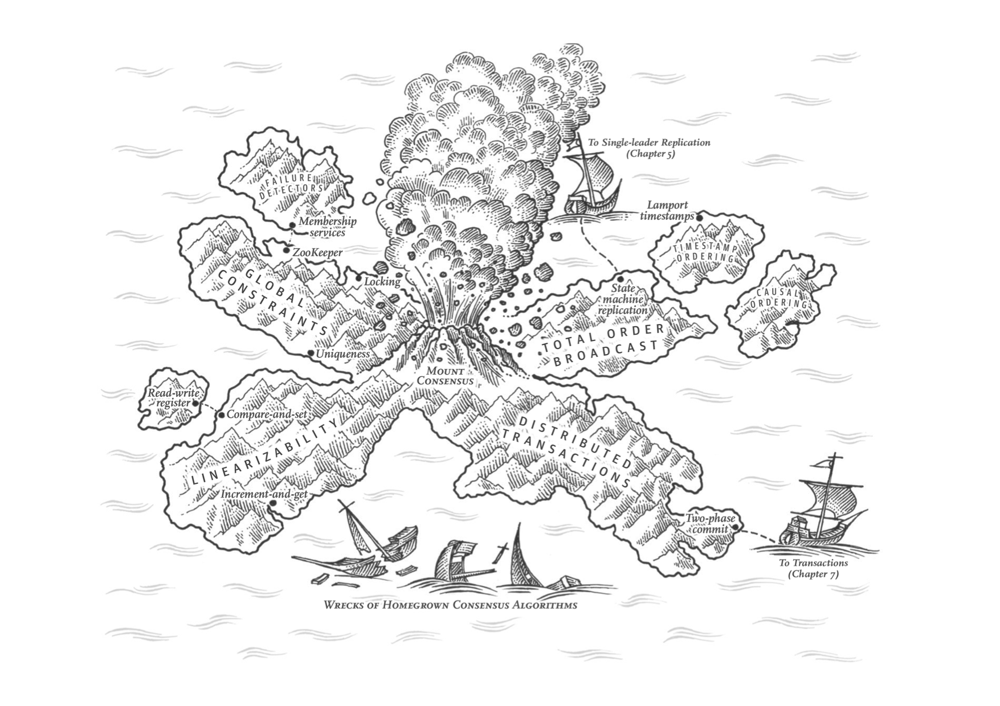
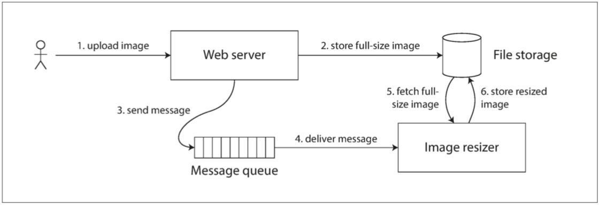
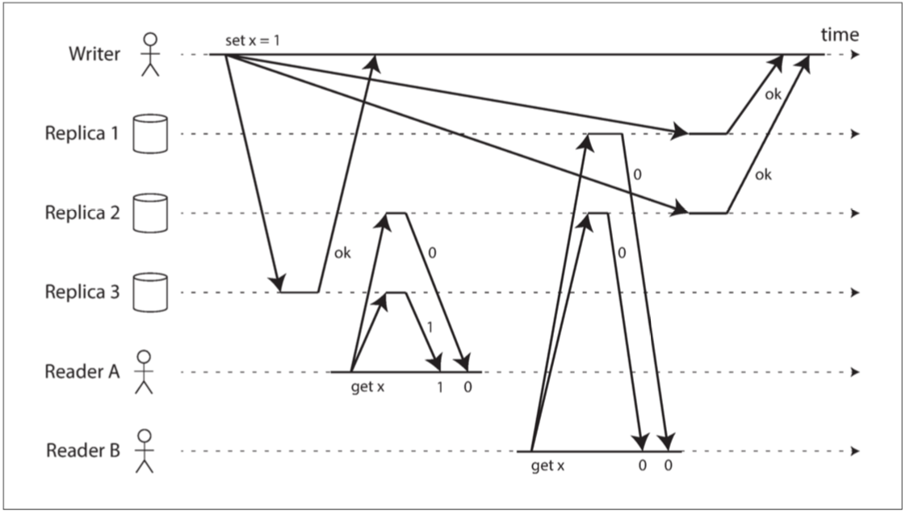
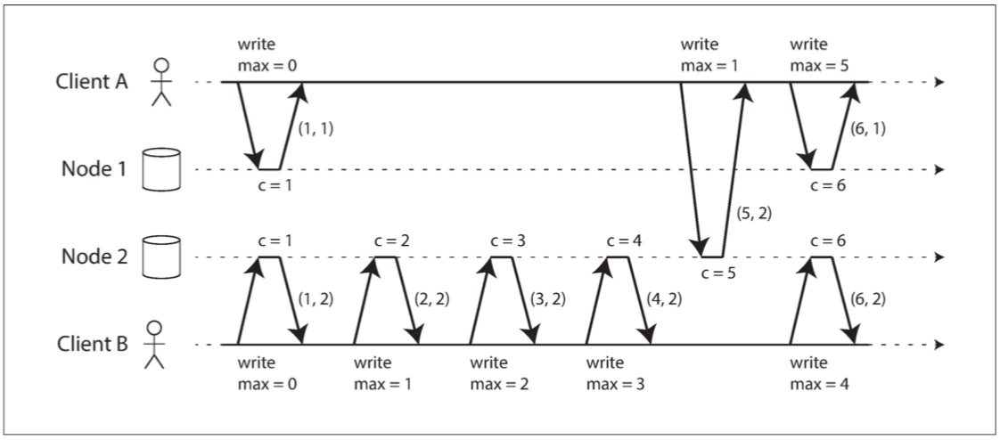
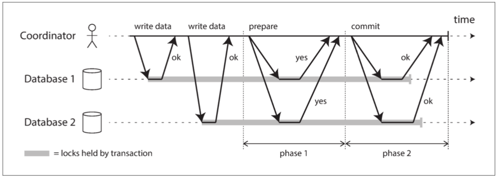
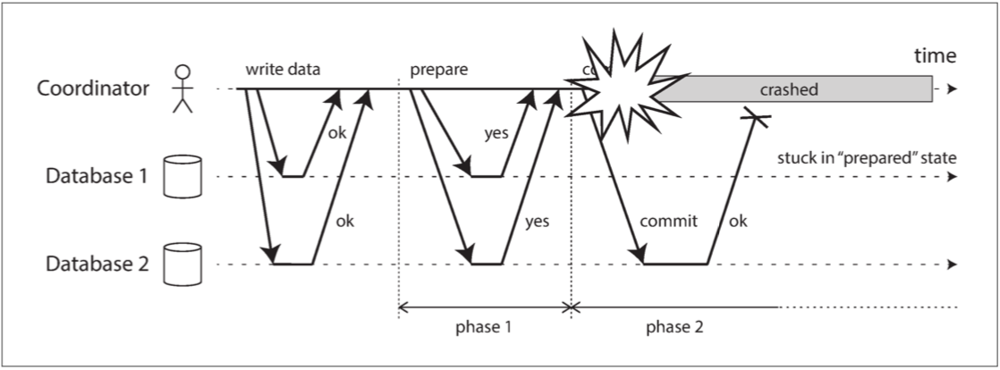

# 9. 一致性与共识 

> 好死不如赖活着
> —— Jay Kreps, 关于Kafka与 Jepsen的若干笔记 (2013)

---------------

[TOC]

## 一致性保证

## 线性一致性

### 什么使得系统线性一致？

### 依赖线性一致性

### 实现线性一致的系统

### 线性一致性的代价

## 顺序保证

### 顺序与因果

### 序列号顺序

### 全局序列广播

## 分布式事务与共识

### 原子提交与二阶段提交

### 实践中的分布式事务

### 容错的共识

### 成员与协调服务

## 本章小结

## 参考文献

1.  Peter Bailis and Ali Ghodsi:
    “[Eventual Consistency Today: Limitations, Extensions, and Beyond](http://queue.acm.org/detail.cfm?id=2462076),” *ACM Queue*, volume 11, number 3, pages 55-63, March 2013.
    [doi:10.1145/2460276.2462076](http://dx.doi.org/10.1145/2460276.2462076)

1.  Prince Mahajan, Lorenzo Alvisi, and Mike Dahlin:
    “[Consistency, Availability, and Convergence](http://apps.cs.utexas.edu/tech_reports/reports/tr/TR-2036.pdf),” University of Texas at Austin, Department of Computer
    Science, Tech Report UTCS TR-11-22, May 2011.

1.  Alex Scotti:
    “[Adventures in Building Your Own Database](http://www.slideshare.net/AlexScotti1/allyourbase-55212398),” at *All Your Base*, November 2015.

1.  Peter Bailis, Aaron Davidson, Alan Fekete, et al.:
    “[Highly Available Transactions: Virtues and Limitations](http://arxiv.org/pdf/1302.0309.pdf),” at *40th International Conference on Very Large Data Bases* (VLDB),
    September 2014. Extended version published as pre-print arXiv:1302.0309 &#91;cs.DB&#93;.

1.  Paolo Viotti and Marko Vukolić:
    “[Consistency in Non-Transactional Distributed Storage Systems](http://arxiv.org/abs/1512.00168),” arXiv:1512.00168, 12 April 2016.

1.  Maurice P. Herlihy and Jeannette M. Wing:
    “[Linearizability: A Correctness Condition for Concurrent Objects](http://cs.brown.edu/~mph/HerlihyW90/p463-herlihy.pdf),” *ACM Transactions on Programming
    Languages and Systems* (TOPLAS), volume 12, number 3, pages 463–492, July 1990.
    [doi:10.1145/78969.78972](http://dx.doi.org/10.1145/78969.78972)

1.  Leslie Lamport:
    “[On interprocess communication](http://research.microsoft.com/en-us/um/people/lamport/pubs/interprocess.pdf),” *Distributed Computing*, volume 1, number 2, pages 77–101,
    June 1986. [doi:10.1007/BF01786228](http://dx.doi.org/10.1007/BF01786228)

1.  David K. Gifford:
    “[Information Storage in a Decentralized Computer System](http://www.mirrorservice.org/sites/www.bitsavers.org/pdf/xerox/parc/techReports/CSL-81-8_Information_Storage_in_a_Decentralized_Computer_System.pdf),” Xerox Palo Alto Research Centers, CSL-81-8, June 1981.

1.  Martin Kleppmann:
    “[Please Stop Calling Databases CP or AP](http://martin.kleppmann.com/2015/05/11/please-stop-calling-databases-cp-or-ap.html),” *martin.kleppmann.com*, May 11, 2015.

1.  Kyle Kingsbury:
    “[Call Me Maybe: MongoDB Stale Reads](https://aphyr.com/posts/322-call-me-maybe-mongodb-stale-reads),” *aphyr.com*, April 20, 2015.

1.  Kyle Kingsbury:
    “[Computational Techniques in Knossos](https://aphyr.com/posts/314-computational-techniques-in-knossos),” *aphyr.com*, May 17, 2014.

1.  Peter Bailis:
      “[Linearizability   Versus Serializability](http://www.bailis.org/blog/linearizability-versus-serializability/),” *bailis.org*, September 24, 2014.

1.  Philip A. Bernstein, Vassos Hadzilacos, and Nathan Goodman:
    <a href="http://research.microsoft.com/en-us/people/philbe/ccontrol.aspx">*Concurrency
    Control and Recovery in Database Systems*</a>. Addison-Wesley, 1987. ISBN: 978-0-201-10715-9,
    available online at *research.microsoft.com*.

1.  Mike Burrows:
    “[The Chubby Lock Service for Loosely-Coupled Distributed Systems](http://research.google.com/archive/chubby.html),” at *7th USENIX Symposium on Operating System
    Design and Implementation* (OSDI), November 2006.

1.  Flavio P. Junqueira and Benjamin Reed:
    *ZooKeeper: Distributed Process Coordination*. O'Reilly Media, 2013.
    ISBN: 978-1-449-36130-3

1.  “[etcd 2.0.12 Documentation](https://coreos.com/etcd/docs/2.0.12/),” CoreOS, Inc., 2015.

1.  “[Apache Curator](http://curator.apache.org/),” Apache Software Foundation, *curator.apache.org*, 2015.

1.  Morali Vallath:
    *Oracle 10g RAC Grid, Services & Clustering*. Elsevier Digital Press, 2006.
    ISBN: 978-1-555-58321-7

1.  Peter Bailis, Alan Fekete, Michael J Franklin, et al.:
    “[Coordination-Avoiding Database Systems](http://arxiv.org/pdf/1402.2237.pdf),”
    *Proceedings of the VLDB Endowment*, volume 8, number 3, pages 185–196, November 2014.

1.  Kyle Kingsbury:
    “[Call Me Maybe: etcd and Consul](https://aphyr.com/posts/316-call-me-maybe-etcd-and-consul),” *aphyr.com*, June 9, 2014.

1.  Flavio P. Junqueira, Benjamin C. Reed, and Marco Serafini:
      “[Zab: High-Performance Broadcast for   Primary-Backup Systems](https://pdfs.semanticscholar.org/b02c/6b00bd5dbdbd951fddb00b906c82fa80f0b3.pdf),” at *41st IEEE International Conference on Dependable
      Systems and Networks* (DSN), June 2011.
      [doi:10.1109/DSN.2011.5958223](http://dx.doi.org/10.1109/DSN.2011.5958223)

1.  Diego Ongaro and John K. Ousterhout:
      “[In Search of an Understandable Consensus   Algorithm (Extended Version)](http://ramcloud.stanford.edu/raft.pdf),” at *USENIX Annual Technical Conference*
      (ATC), June 2014.

1.  Hagit Attiya, Amotz Bar-Noy, and Danny Dolev:
    “[Sharing Memory Robustly in Message-Passing Systems](http://www.cse.huji.ac.il/course/2004/dist/p124-attiya.pdf),” *Journal of the ACM*, volume 42, number 1, pages 124–142, January 1995.
    [doi:10.1145/200836.200869](http://dx.doi.org/10.1145/200836.200869)

1.  Nancy Lynch and Alex Shvartsman:
    “[Robust Emulation of Shared Memory Using Dynamic Quorum-Acknowledged Broadcasts](http://groups.csail.mit.edu/tds/papers/Lynch/FTCS97.pdf),” at *27th Annual International Symposium on
    Fault-Tolerant Computing* (FTCS), June 1997.
    [doi:10.1109/FTCS.1997.614100](http://dx.doi.org/10.1109/FTCS.1997.614100)

1.  Christian Cachin, Rachid Guerraoui, and Luís Rodrigues:
    <a href="http://www.distributedprogramming.net/">*Introduction to Reliable and Secure Distributed
    Programming*</a>, 2nd edition. Springer, 2011. ISBN: 978-3-642-15259-7,
    [doi:10.1007/978-3-642-15260-3](http://dx.doi.org/10.1007/978-3-642-15260-3)

1.  Sam Elliott, Mark Allen, and Martin Kleppmann:
    [personal communication](https://twitter.com/lenary/status/654761711933648896),
    thread on *twitter.com*, October 15, 2015.

1.  Niklas Ekström, Mikhail Panchenko, and Jonathan Ellis:
    “[Possible Issue with Read Repair?](http://mail-archives.apache.org/mod_mbox/cassandra-dev/201210.mbox/%3CFA480D1DC3964E2C8B0A14E0880094C9%40Robotech%3E),” email thread on *cassandra-dev* mailing list, October 2012.

1.  Maurice P. Herlihy:
    “[Wait-Free Synchronization](https://cs.brown.edu/~mph/Herlihy91/p124-herlihy.pdf),”
    *ACM Transactions on Programming Languages and Systems* (TOPLAS), volume 13, number 1,
    pages 124–149, January 1991.
    [doi:10.1145/114005.102808](http://dx.doi.org/10.1145/114005.102808)

1.  Armando Fox and Eric A. Brewer:
    “[Harvest, Yield, and Scalable Tolerant Systems](http://radlab.cs.berkeley.edu/people/fox/static/pubs/pdf/c18.pdf),” at *7th Workshop on Hot Topics in Operating
    Systems* (HotOS), March 1999.
    [doi:10.1109/HOTOS.1999.798396](http://dx.doi.org/10.1109/HOTOS.1999.798396)

1.  Seth Gilbert and Nancy Lynch:
    “[Brewer’s Conjecture and the Feasibility of Consistent, Available, Partition-Tolerant Web Services](http://www.comp.nus.edu.sg/~gilbert/pubs/BrewersConjecture-SigAct.pdf),”
    *ACM SIGACT News*, volume 33, number 2, pages 51–59, June 2002.
    [doi:10.1145/564585.564601](http://dx.doi.org/10.1145/564585.564601)

1.  Seth Gilbert and Nancy Lynch:
    “[Perspectives on the CAP Theorem](http://groups.csail.mit.edu/tds/papers/Gilbert/Brewer2.pdf),” *IEEE Computer Magazine*, volume 45, number 2, pages 30–36, February 2012.
    [doi:10.1109/MC.2011.389](http://dx.doi.org/10.1109/MC.2011.389)

1.  Eric A. Brewer:
    “[CAP Twelve Years Later: How the 'Rules' Have Changed](http://cs609.cs.ua.edu/CAP12.pdf),” *IEEE Computer Magazine*, volume 45, number 2, pages 23–29, February 2012.
    [doi:10.1109/MC.2012.37](http://dx.doi.org/10.1109/MC.2012.37)

1.  Susan B. Davidson, Hector Garcia-Molina, and Dale Skeen:
    “[Consistency in Partitioned Networks](http://delab.csd.auth.gr/~dimitris/courses/mpc_fall05/papers/invalidation/acm_csur85_partitioned_network_consistency.pdf),” *ACM Computing Surveys*, volume 17, number 3, pages 341–370, September 1985.
    [doi:10.1145/5505.5508](http://dx.doi.org/10.1145/5505.5508)

1.  Paul R. Johnson and Robert H. Thomas:
    “[RFC 677: The Maintenance of Duplicate Databases](https://tools.ietf.org/html/rfc677),” Network Working Group, January 27, 1975.

1.  Bruce G. Lindsay, Patricia Griffiths Selinger, C. Galtieri, et al.:
    “[Notes on Distributed Databases](http://domino.research.ibm.com/library/cyberdig.nsf/papers/A776EC17FC2FCE73852579F100578964/$File/RJ2571.pdf),” IBM Research, Research Report RJ2571(33471), July 1979.

1.  Michael J. Fischer and Alan Michael:
    “[Sacrificing Serializability to Attain High Availability of Data in an Unreliable Network](http://www.cs.ucsb.edu/~agrawal/spring2011/ugrad/p70-fischer.pdf),” at
    *1st ACM Symposium on Principles of Database Systems* (PODS), March 1982.
    [doi:10.1145/588111.588124](http://dx.doi.org/10.1145/588111.588124)

1.  Eric A. Brewer:
    “[NoSQL: Past, Present, Future](http://www.infoq.com/presentations/NoSQL-History),”
    at *QCon San Francisco*, November 2012.

1.  Henry Robinson:
    “[CAP Confusion: Problems with 'Partition Tolerance,'](http://blog.cloudera.com/blog/2010/04/cap-confusion-problems-with-partition-tolerance/)” *blog.cloudera.com*, April 26, 2010.

1.  Adrian Cockcroft:
    “[Migrating to Microservices](http://www.infoq.com/presentations/migration-cloud-native),” at *QCon London*, March 2014.

1.  Martin Kleppmann:
    “[A Critique of the CAP Theorem](http://arxiv.org/abs/1509.05393),” arXiv:1509.05393,
    September 17, 2015.

1.  Nancy A. Lynch:
    “[A Hundred Impossibility Proofs for Distributed Computing](http://groups.csail.mit.edu/tds/papers/Lynch/podc89.pdf),” at *8th ACM Symposium on Principles of Distributed
    Computing* (PODC), August 1989.
    [doi:10.1145/72981.72982](http://dx.doi.org/10.1145/72981.72982)

1.  Hagit Attiya, Faith Ellen, and Adam Morrison:
    “[Limitations of Highly-Available Eventually-Consistent Data Stores](http://www.cs.technion.ac.il/people/mad/online-publications/podc2015-replds.pdf),” at *ACM Symposium on Principles of
    Distributed Computing* (PODC), July 2015.
    [doi:10.1145/2767386.2767419](http://dx.doi.org/10.1145/2767386.2767419)

1.  Peter Sewell, Susmit Sarkar,
    Scott Owens, et al.:
    “[x86-TSO: A Rigorous and Usable Programmer's Model for x86 Multiprocessors](http://www.cl.cam.ac.uk/~pes20/weakmemory/cacm.pdf),” *Communications of the ACM*,
    volume 53, number 7, pages 89–97, July 2010.
    [doi:10.1145/1785414.1785443](http://dx.doi.org/10.1145/1785414.1785443)

1.  Martin Thompson:
    “[Memory Barriers/Fences](http://mechanical-sympathy.blogspot.co.uk/2011/07/memory-barriersfences.html),” *mechanical-sympathy.blogspot.co.uk*, July 24, 2011.

1.  Ulrich Drepper:
    “[What Every Programmer Should Know About Memory](http://www.akkadia.org/drepper/cpumemory.pdf),” *akkadia.org*, November 21, 2007.

1.  Daniel J. Abadi:
    “[Consistency Tradeoffs in Modern Distributed Database System Design](http://cs-www.cs.yale.edu/homes/dna/papers/abadi-pacelc.pdf),” *IEEE Computer Magazine*,
    volume 45, number 2, pages 37–42, February 2012.
    [doi:10.1109/MC.2012.33](http://dx.doi.org/10.1109/MC.2012.33)

1.  Hagit Attiya and Jennifer L. Welch:
    “[Sequential Consistency Versus Linearizability](http://courses.csail.mit.edu/6.852/01/papers/p91-attiya.pdf),” *ACM Transactions on Computer Systems* (TOCS),
    volume 12, number 2, pages 91–122, May 1994.
    [doi:10.1145/176575.176576](http://dx.doi.org/10.1145/176575.176576)

1.  Mustaque Ahamad, Gil Neiger, James E. Burns, et al.:
      “[Causal   Memory: Definitions, Implementation, and Programming](http://www-i2.informatik.rwth-aachen.de/i2/fileadmin/user_upload/documents/Seminar_MCMM11/Causal_memory_1996.pdf),” *Distributed
      Computing*, volume 9, number 1, pages 37–49, March 1995.
      [doi:10.1007/BF01784241](http://dx.doi.org/10.1007/BF01784241)

1.  Wyatt Lloyd, Michael J. Freedman,
    Michael Kaminsky, and David G. Andersen:
    “[Stronger Semantics for Low-Latency Geo-Replicated Storage](https://www.usenix.org/system/files/conference/nsdi13/nsdi13-final149.pdf),” at *10th USENIX Symposium on Networked
    Systems Design and Implementation* (NSDI), April 2013.

1.  Marek Zawirski, Annette Bieniusa, Valter Balegas, et al.:
    “[SwiftCloud: Fault-Tolerant Geo-Replication Integrated All the Way to the Client Machine](http://arxiv.org/abs/1310.3107),” INRIA Research Report 8347, August 2013.

1.  Peter Bailis, Ali Ghodsi, Joseph M Hellerstein, and Ion Stoica:
    “[Bolt-on Causal Consistency](http://db.cs.berkeley.edu/papers/sigmod13-bolton.pdf),” at
    *ACM International Conference on Management of Data* (SIGMOD), June 2013.

1.  Philippe Ajoux, Nathan Bronson, Sanjeev
    Kumar, et al.:
    “[Challenges to Adopting Stronger Consistency at Scale](https://www.usenix.org/system/files/conference/hotos15/hotos15-paper-ajoux.pdf),” at *15th USENIX Workshop on Hot Topics in
    Operating Systems* (HotOS), May 2015.

1.  Peter Bailis:
    “[Causality Is Expensive (and What to Do About It)](http://www.bailis.org/blog/causality-is-expensive-and-what-to-do-about-it/),” *bailis.org*, February 5, 2014.

1.  Ricardo Gonçalves, Paulo Sérgio Almeida,
    Carlos Baquero, and Victor Fonte:
    “[Concise Server-Wide Causality Management for Eventually Consistent Data Stores](http://haslab.uminho.pt/tome/files/global_logical_clocks.pdf),” at *15th IFIP International
    Conference on Distributed Applications and Interoperable Systems* (DAIS), June 2015.
    [doi:10.1007/978-3-319-19129-4_6](http://dx.doi.org/10.1007/978-3-319-19129-4_6)

1.  Rob Conery:
      “[A Better ID   Generator for PostgreSQL](http://rob.conery.io/2014/05/29/a-better-id-generator-for-postgresql/),” *rob.conery.io*, May 29, 2014.

1.  Leslie Lamport:
    “[Time, Clocks, and the Ordering of Events in a Distributed System](http://research.microsoft.com/en-US/um/people/Lamport/pubs/time-clocks.pdf),” *Communications of the ACM*,
    volume 21, number 7, pages 558–565, July 1978.
    [doi:10.1145/359545.359563](http://dx.doi.org/10.1145/359545.359563)

1.  Xavier Défago, André Schiper, and Péter Urbán:
    “[Total Order Broadcast and Multicast Algorithms: Taxonomy and Survey](https://dspace.jaist.ac.jp/dspace/bitstream/10119/4883/1/defago_et_al.pdf),” *ACM Computing
    Surveys*, volume 36, number 4, pages 372–421, December 2004.
    [doi:10.1145/1041680.1041682](http://dx.doi.org/10.1145/1041680.1041682)

1.  Hagit Attiya and Jennifer Welch: *Distributed
    Computing: Fundamentals, Simulations and Advanced Topics*, 2nd edition.
    John Wiley & Sons, 2004. ISBN: 978-0-471-45324-6,
    [doi:10.1002/0471478210](http://dx.doi.org/10.1002/0471478210)

1.  Mahesh
    Balakrishnan, Dahlia Malkhi, Vijayan Prabhakaran, et al.:
    “[CORFU: A Shared Log Design for Flash Clusters](https://www.usenix.org/system/files/conference/nsdi12/nsdi12-final30.pdf),” at *9th USENIX Symposium on Networked
    Systems Design and Implementation* (NSDI), April 2012.

1.  Fred B. Schneider:
    “[Implementing Fault-Tolerant Services Using the State Machine Approach: A Tutorial](http://www.cs.cornell.edu/fbs/publications/smsurvey.pdf),” *ACM Computing Surveys*, volume
    22, number 4, pages 299–319, December 1990.

1.  Alexander Thomson, Thaddeus Diamond, Shu-Chun Weng, et al.:
    “[Calvin: Fast Distributed Transactions for Partitioned Database Systems](http://cs.yale.edu/homes/thomson/publications/calvin-sigmod12.pdf),” at *ACM International Conference
    on Management of Data* (SIGMOD), May 2012.

1.  Mahesh Balakrishnan, Dahlia Malkhi, Ted Wobber, et al.:
    “[Tango: Distributed Data Structures over a Shared Log](http://research.microsoft.com/pubs/199947/Tango.pdf),” at *24th ACM Symposium on Operating Systems
    Principles* (SOSP), November 2013.
    [doi:10.1145/2517349.2522732](http://dx.doi.org/10.1145/2517349.2522732)

1.  Robbert van Renesse and Fred B. Schneider:
    “[Chain Replication for Supporting High Throughput and Availability](http://static.usenix.org/legacy/events/osdi04/tech/full_papers/renesse/renesse.pdf),” at *6th USENIX
    Symposium on Operating System Design and Implementation* (OSDI), December 2004.

1.  Leslie Lamport:
    “[How to Make a Multiprocessor Computer That Correctly Executes Multiprocess Programs](http://research-srv.microsoft.com/en-us/um/people/lamport/pubs/multi.pdf),” *IEEE
    Transactions on Computers*, volume 28, number 9, pages 690–691, September 1979.
    [doi:10.1109/TC.1979.1675439](http://dx.doi.org/10.1109/TC.1979.1675439)

1.  Enis Söztutar, Devaraj Das, and Carter Shanklin:
    “[Apache HBase High Availability at the Next Level](http://hortonworks.com/blog/apache-hbase-high-availability-next-level/),” *hortonworks.com*, January 22, 2015.

1.  Brian F Cooper, Raghu Ramakrishnan, Utkarsh Srivastava, et al.:
    “[PNUTS: Yahoo!’s Hosted Data Serving Platform](http://www.mpi-sws.org/~druschel/courses/ds/papers/cooper-pnuts.pdf),” at *34th International Conference on Very Large Data
    Bases* (VLDB), August 2008.
    [doi:10.14778/1454159.1454167](http://dx.doi.org/10.14778/1454159.1454167)

1.  Tushar Deepak Chandra and Sam Toueg:
    “[Unreliable Failure Detectors for Reliable Distributed Systems](http://courses.csail.mit.edu/6.852/08/papers/CT96-JACM.pdf),” *Journal of the ACM*,
    volume 43, number 2, pages 225–267, March 1996.
    [doi:10.1145/226643.226647](http://dx.doi.org/10.1145/226643.226647)

1.  Michael J. Fischer, Nancy Lynch, and Michael S. Paterson:
    “[Impossibility of Distributed Consensus with One Faulty Process](https://groups.csail.mit.edu/tds/papers/Lynch/jacm85.pdf),” *Journal of the ACM*, volume 32, number 2, pages 374–382, April 1985.
    [doi:10.1145/3149.214121](http://dx.doi.org/10.1145/3149.214121)

1.  Michael Ben-Or: “Another Advantage of Free
    Choice: Completely Asynchronous Agreement Protocols,” at *2nd ACM Symposium on Principles of
    Distributed Computing* (PODC), August 1983.
    [doi:10.1145/800221.806707](http://dl.acm.org/citation.cfm?id=806707)

1.  Jim N. Gray and Leslie Lamport:
    “[Consensus on Transaction Commit](http://db.cs.berkeley.edu/cs286/papers/paxoscommit-tods2006.pdf),” *ACM Transactions on Database Systems* (TODS), volume 31,
    number 1, pages 133–160, March 2006.
    [doi:10.1145/1132863.1132867](http://dx.doi.org/10.1145/1132863.1132867)

1.  Rachid Guerraoui:
    “[Revisiting the Relationship Between Non-Blocking Atomic Commitment and Consensus](https://pdfs.semanticscholar.org/5d06/489503b6f791aa56d2d7942359c2592e44b0.pdf),” at *9th International
    Workshop on Distributed Algorithms* (WDAG), September 1995.
    [doi:10.1007/BFb0022140](http://dx.doi.org/10.1007/BFb0022140)

1.  Thanumalayan Sankaranarayana Pillai, Vijay Chidambaram,
    Ramnatthan Alagappan, et al.: “[All File Systems Are Not Created Equal: On the Complexity of Crafting Crash-Consistent Applications](http://research.cs.wisc.edu/wind/Publications/alice-osdi14.pdf),”
    at *11th USENIX Symposium on Operating Systems Design and Implementation* (OSDI),
    October 2014.

1.  Jim Gray:
    “[The Transaction Concept: Virtues and Limitations](http://research.microsoft.com/en-us/um/people/gray/papers/theTransactionConcept.pdf),” at *7th International Conference on
    Very Large Data Bases* (VLDB), September 1981.

1.  Hector Garcia-Molina and Kenneth Salem:
    “[Sagas](http://www.cs.cornell.edu/andru/cs711/2002fa/reading/sagas.pdf),” at
    *ACM International Conference on Management of Data* (SIGMOD), May 1987.
    [doi:10.1145/38713.38742](http://dx.doi.org/10.1145/38713.38742)

1.  C. Mohan, Bruce G. Lindsay, and Ron Obermarck:
    “[Transaction Management in the R* Distributed Database Management System](https://cs.brown.edu/courses/csci2270/archives/2012/papers/dtxn/p378-mohan.pdf),”
    *ACM Transactions on Database Systems*, volume 11, number 4, pages 378–396, December 1986.
    [doi:10.1145/7239.7266](http://dx.doi.org/10.1145/7239.7266)

1.  “[Distributed Transaction Processing: The XA Specification](http://pubs.opengroup.org/onlinepubs/009680699/toc.pdf),” X/Open Company Ltd., Technical Standard
    XO/CAE/91/300, December 1991. ISBN: 978-1-872-63024-3

1.  Mike Spille:
    “[XA Exposed, Part II](http://www.jroller.com/pyrasun/entry/xa_exposed_part_ii_schwartz),”
    *jroller.com*, April 3, 2004.

1.  Ivan Silva Neto and Francisco Reverbel:
    “[Lessons Learned from Implementing WS-Coordination and WS-AtomicTransaction](http://www.ime.usp.br/~reverbel/papers/icis2008.pdf),” at *7th IEEE/ACIS International Conference on
    Computer and Information Science* (ICIS), May 2008.
    [doi:10.1109/ICIS.2008.75](http://dx.doi.org/10.1109/ICIS.2008.75)

1.  James E. Johnson, David E. Langworthy, Leslie Lamport,
    and Friedrich H. Vogt:
    “[Formal Specification of a Web Services Protocol](http://research.microsoft.com/en-us/um/people/lamport/pubs/wsfm-web.pdf),” at *1st International Workshop on Web Services and
    Formal Methods* (WS-FM), February 2004.
    [doi:10.1016/j.entcs.2004.02.022](http://dx.doi.org/10.1016/j.entcs.2004.02.022)

1.  Dale Skeen:
    “[Nonblocking Commit Protocols](http://www.cs.utexas.edu/~lorenzo/corsi/cs380d/papers/Ske81.pdf),” at *ACM International Conference on Management of Data* (SIGMOD), April 1981.
    [doi:10.1145/582318.582339](http://dx.doi.org/10.1145/582318.582339)

1.  Gregor Hohpe:
    “[Your Coffee Shop Doesn’t Use Two-Phase Commit](http://www.martinfowler.com/ieeeSoftware/coffeeShop.pdf),” *IEEE Software*, volume 22, number 2, pages 64–66, March 2005.
    [doi:10.1109/MS.2005.52](http://dx.doi.org/10.1109/MS.2005.52)

1.  Pat Helland:
    “[Life Beyond Distributed Transactions: An Apostate’s Opinion](http://www-db.cs.wisc.edu/cidr/cidr2007/papers/cidr07p15.pdf),” at *3rd Biennial Conference on Innovative Data Systems
    Research* (CIDR), January 2007.

1.  Jonathan Oliver:
    “[My Beef with MSDTC and Two-Phase Commits](http://blog.jonathanoliver.com/my-beef-with-msdtc-and-two-phase-commits/),” *blog.jonathanoliver.com*, April 4, 2011.

1.  Oren Eini (Ahende Rahien):
    “[The Fallacy of Distributed Transactions](http://ayende.com/blog/167362/the-fallacy-of-distributed-transactions),” *ayende.com*, July 17, 2014.

1.  Clemens Vasters:
    “[Transactions in Windows Azure (with Service Bus) – An Email Discussion](https://blogs.msdn.microsoft.com/clemensv/2012/07/30/transactions-in-windows-azure-with-service-bus-an-email-discussion/),” *vasters.com*, July 30, 2012.

1.  “[Understanding Transactionality in Azure](https://docs.particular.net/nservicebus/azure/understanding-transactionality-in-azure),” NServiceBus Documentation, Particular Software, 2015.

1.  Randy Wigginton, Ryan Lowe,
    Marcos Albe, and Fernando Ipar:
    “[Distributed Transactions in MySQL](https://www.percona.com/live/mysql-conference-2013/sites/default/files/slides/XA_final.pdf),” at *MySQL Conference and Expo*, April 2013.

1.  Mike Spille:
    “[XA Exposed, Part I](http://www.jroller.com/pyrasun/entry/xa_exposed),”
    *jroller.com*, April 3, 2004.

1.  Ajmer Dhariwal:
    “[Orphaned MSDTC Transactions (-2 spids)](http://www.eraofdata.com/orphaned-msdtc-transactions-2-spids/),” *eraofdata.com*, December 12, 2008.

1.  Paul Randal:
    “[Real World Story of DBCC PAGE Saving the Day](http://www.sqlskills.com/blogs/paul/real-world-story-of-dbcc-page-saving-the-day/),” *sqlskills.com*, June 19, 2013.

1.  “[in-doubt xact resolution Server Configuration Option](https://msdn.microsoft.com/en-us/library/ms179586.aspx),” SQL Server 2016 documentation, Microsoft, Inc.,
    2016.

1.  Cynthia Dwork, Nancy Lynch, and Larry Stockmeyer:
    “[Consensus in the Presence of Partial Synchrony](http://www.net.t-labs.tu-berlin.de/~petr/ADC-07/papers/DLS88.pdf),” *Journal of the ACM*, volume 35, number 2, pages 288–323,
    April 1988. [doi:10.1145/42282.42283](http://dx.doi.org/10.1145/42282.42283)

1.  Miguel Castro and Barbara H. Liskov:
    “[Practical Byzantine Fault Tolerance and Proactive Recovery](http://zoo.cs.yale.edu/classes/cs426/2012/bib/castro02practical.pdf),” *ACM Transactions on Computer Systems*,
    volume 20, number 4, pages 396–461, November 2002.
    [doi:10.1145/571637.571640](http://dx.doi.org/10.1145/571637.571640)

1.  Brian M. Oki and Barbara H. Liskov:
    “[Viewstamped Replication: A New Primary Copy Method to Support Highly-Available Distributed Systems](http://www.cs.princeton.edu/courses/archive/fall11/cos518/papers/viewstamped.pdf),” at
    *7th ACM Symposium on Principles of Distributed Computing* (PODC), August 1988.
    [doi:10.1145/62546.62549](http://dx.doi.org/10.1145/62546.62549)

1.  Barbara H. Liskov and James Cowling:
    “[Viewstamped Replication Revisited](http://pmg.csail.mit.edu/papers/vr-revisited.pdf),”
    Massachusetts Institute of Technology, Tech Report MIT-CSAIL-TR-2012-021, July 2012.

1.  Leslie Lamport:
    “[The Part-Time Parliament](http://research.microsoft.com/en-us/um/people/lamport/pubs/lamport-paxos.pdf),” *ACM Transactions on Computer Systems*, volume 16, number 2,
    pages 133–169, May 1998.
    [doi:10.1145/279227.279229](http://dx.doi.org/10.1145/279227.279229)

1.  Leslie Lamport:
    “[Paxos Made Simple](http://research.microsoft.com/en-us/um/people/lamport/pubs/paxos-simple.pdf),” *ACM SIGACT News*, volume 32, number 4, pages 51–58, December 2001.

1.  Tushar Deepak Chandra, Robert Griesemer, and Joshua
    Redstone: “[Paxos Made Live – An Engineering Perspective](http://www.read.seas.harvard.edu/~kohler/class/08w-dsi/chandra07paxos.pdf),” at *26th ACM Symposium on Principles of Distributed
    Computing* (PODC), June 2007.

1.  Robbert
    van Renesse: “[Paxos Made Moderately Complex](http://www.cs.cornell.edu/home/rvr/Paxos/paxos.pdf),” *cs.cornell.edu*, March 2011.

1.  Diego Ongaro:
    “[Consensus: Bridging Theory and Practice](https://github.com/ongardie/dissertation),”
    PhD Thesis, Stanford University, August 2014.

1.  Heidi Howard, Malte Schwarzkopf, Anil Madhavapeddy,
    and Jon Crowcroft: “[Raft Refloated: Do We Have Consensus?](http://www.cl.cam.ac.uk/~ms705/pub/papers/2015-osr-raft.pdf),” *ACM SIGOPS Operating Systems Review*, volume 49,
    number 1, pages 12–21, January 2015.
    [doi:10.1145/2723872.2723876](http://dx.doi.org/10.1145/2723872.2723876)

1.  André Medeiros:
    “[ZooKeeper’s Atomic Broadcast Protocol: Theory and Practice](http://www.tcs.hut.fi/Studies/T-79.5001/reports/2012-deSouzaMedeiros.pdf),” Aalto University School of Science, March 20, 2012.

1.  Robbert van Renesse, Nicolas Schiper, and
    Fred B. Schneider: “[Vive La Différence: Paxos vs. Viewstamped Replication vs. Zab](http://arxiv.org/abs/1309.5671),” *IEEE Transactions on Dependable and Secure Computing*,
    volume 12, number 4, pages 472–484, September 2014.
    [doi:10.1109/TDSC.2014.2355848](http://dx.doi.org/10.1109/TDSC.2014.2355848)

1.  Will
    Portnoy: “[Lessons Learned from Implementing Paxos](http://blog.willportnoy.com/2012/06/lessons-learned-from-paxos.html),” *blog.willportnoy.com*, June 14, 2012.

1.  Heidi Howard, Dahlia Malkhi, and Alexander Spiegelman:
    “[Flexible Paxos: Quorum Intersection Revisited](https://arxiv.org/abs/1608.06696),”
    *arXiv:1608.06696*, August 24, 2016.

1.  Heidi Howard and Jon Crowcroft:
    “[Coracle: Evaluating Consensus at the Internet Edge](http://www.sigcomm.org/sites/default/files/ccr/papers/2015/August/2829988-2790010.pdf),” at *Annual Conference of the ACM Special Interest
    Group on Data Communication* (SIGCOMM), August 2015.
    [doi:10.1145/2829988.2790010](http://dx.doi.org/10.1145/2829988.2790010)

1.  Kyle Kingsbury:
    “[Call Me Maybe: Elasticsearch 1.5.0](https://aphyr.com/posts/323-call-me-maybe-elasticsearch-1-5-0),” *aphyr.com*, April 27, 2015.

1.  Ivan Kelly:
    “[BookKeeper Tutorial](https://github.com/ivankelly/bookkeeper-tutorial),”
    *github.com*, October 2014.

1.  Camille Fournier:
    “[Consensus Systems for the Skeptical Architect](http://www.ustream.tv/recorded/61483409),” at *Craft Conference*, Budapest, Hungary, April 2015.

1.  Kenneth P. Birman:
    “[A History of the Virtual Synchrony Replication Model](https://www.truststc.org/pubs/713.html),” in *Replication: Theory and Practice*, Springer LNCS volume 5959, chapter 6,
    pages 91–120, 2010. ISBN: 978-3-642-11293-5,
    [doi:10.1007/978-3-642-11294-2_6](http://dx.doi.org/10.1007/978-3-642-11294-2_6)

图9-1

图9-2

图9-3

图9-4

图9-5

图9-6

图9-7

图9-8

图9-9

图9-10