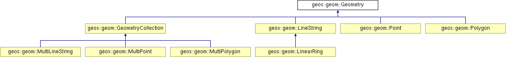

# PostGIS简明教程

PostGIS是PostgreSQL强大扩展能力的最佳示例，它已经成为GIS行业的事实标准，值得用几本书去专门讲。但这里不妨先管中窥豹一下。

## 1. 安装与配置

安装与配置并不是PostGIS的学习重点，然而它确实是许多新人入门的最大拦路虎。

建议直接使用现成的二进制包，发行版来安装PostGIS，而不是手工编译，这会轻松很多。

在Mac上可以通过homebrew一键安装PostGIS

```bash
/usr/bin/ruby -e "$(curl -fsSL https://raw.githubusercontent.com/Homebrew/install/master/install)"
```

在CentOS上可以通过yum安装，在Ubuntu可以通过apt-get安装，不再赘述

连接PostgreSQL并执行以下查询，确认PostGIS扩展已经正确地安装，可以被数据库识别：

```bash
vonng=# SELECT name,default_version FROM pg_available_extensions WHERE name ~ 'gis';
          name          | default_version
------------------------+-----------------
 postgis                | 2.4.3
 postgis_tiger_geocoder | 2.4.3
 postgis_topology       | 2.4.3
 btree_gist             | 1.5
 postgis_sfcgal         | 2.4.3
```


## 2. 创建GIS数据库

PostGIS是PostgreSQL的一个扩展，连接并执行以下命令，可在当前数据库中加载PostGIS插件。

```sql
CREATE EXTENSION postgis;
CREATE EXTENSION postgis_topology;
CREATE EXTENSION postgis_sfcgal;
CREATE EXTENSION fuzzystrmatch;
CREATE EXTENSION address_standardizer;
CREATE EXTENSION address_standardizer_data_us;
CREATE EXTENSION postgis_tiger_geocoder;
```

执行完毕后，执行`postgis_full_version`查看当前PostGIS版本。

```sql
gis=# SELECT postgis_full_version();

POSTGIS="2.4.3 r16312" PGSQL="100" GEOS="3.6.2-CAPI-1.10.2 4d2925d6" PROJ="Rel. 4.9.3, 15 August 2016" GDAL="GDAL 1.11.5, released 2016/07/01" LIBXML="2.9.7" LIBJSON="0.12.1" RASTER
```

现在GIS数据库已经准备好了。让我们进入主题吧。

## 3. 几何对象

PostGIS支持很多几何类型：点，线，多边形，复合几何体等，并提供了大量实用的相关函数。

注意，虽然PostGIS中的几何类型与PostgreSQL内建的几何类型非常像，但它们并不是一回事。所有PostGIS中的对象命名通常都以`ST`开头，是空间类型（Spatial Type）的缩写。

对于PostGIS而言，所有几何对象都有一个公共父类`Geometry`，这种面向对象的组织形式允许在数据库中进行一些灵活的操作：例如在数据表中的同一列中存储不同的几何对象。

每种几何对象实际上都是PostGIS底层C++几何库geos中对象包装，这些几何类型按照面向对象的继承关系组成了一颗树：




### 几何对象的创建

几何对象可以通过PostGIS内建的函数进行创建，例如：

```sql
>>> SELECT ST_Point(1.0, 2.0);
0101000000000000000000F03F0000000000000040
```

注意，当查询原始集合类型时，PostgreSQL会返回几何对象的二进制数据的十六进制表示。这允许各类ETL工具以同样的方式高效处理PostGIS类型，但二进制表示对人类很不友好，可以通过`ST_AsText`获取人类可读的格式。

```sql
>>> SELECT ST_AsText(ST_Point(1.0, 2.0));
POINT(1 2)
```

当然，如同PostgreSQL内建的类型一样，PostGIS类型也可以使用字面值的方式创建。

```SQL
CREATE TABLE geom (
  geom GEOMETRY
);

INSERT INTO geom VALUES 
('Point(1 2)'), 
('LineString(0 0,1 1,2 1,2 3)'),
('Polygon((0 0, 1 0, 1 1,0 1,0 0))'),
('MultiPoint(1 2,3 4)');
```

通常在使用PostGIS中，几何类型使用统一的`Geometry`类型。如果需要判断具体的几何类型，则可以使用`ST_GeometryType`。

```sql
geo=# SELECT ST_GeometryType(geom), ST_AsText(geom) FROM geom;

 st_geometrytype |           st_astext
-----------------+--------------------------------
 ST_Point        | POINT(1 2)
 ST_LineString   | LINESTRING(0 0,1 1,2 1,2 3)
 ST_Polygon      | POLYGON((0 0,1 0,1 1,0 1,0 0))
 ST_MultiPoint   | MULTIPOINT(1 2,3 4)
```

### 点

让我们从最简单的**点（Point）**开始。PostGIS的点默认是二维空间中的点，具有两个`double`类型的分量`x,y`。使用`ST_X, ST_Y`可以从点中取出对应的坐标分量

```sql
geo=# SELECT ST_X(geom), ST_Y(geom) FROM geom WHERE ST_GeometryType(geom) = 'ST_Point';
 st_x | st_y
------+------
    1 |    2
```

在介绍更多几何类型前，


## 4. Play with Point

单纯使用PostGIS的Point，就已经可以实现许多有趣的功能了。

### 计算两点距离

```sql
geo=# SELECT ST_Point(1,1) <-> ST_Point(2,2);
1.4142135623730951
```

运算符`<->`可以计算左右两侧两点之间的距离。

### 应用：查找最近的餐馆

现在我们有一张包含全国所有餐馆的表，有五千万条记录：

```sql
CREATE TABLE poi(
	id			BIGSERIAL,
	name		TEXT,
	position 	GEOMETRY
)
```

如果我现在在国贸`(116.458855, 39.909863)`，想要找到距离这里最近的10家餐厅。应该如何查询呢？

```sql
SELECT name FROM poi 
ORDER BY position <-> ST_Point(116.458855, 39.909863) LIMIT 10;
```

```sql
                                         QUERY PLAN
---------------------------------------------------------------------------------------------
 Limit  (cost=4610514.44..4610514.47 rows=10 width=31)
   ->  Sort  (cost=4610514.44..4767389.77 rows=62750132 width=31)
         Sort Key: (("position" <-> '0101000000CAA65CE15D1D5D40946B0A6476F44340'::geometry))
         ->  Seq Scan on poi  (cost=0.00..3254506.65 rows=62750132 width=31)
```

执行需要一次扫表，需要几分钟的时间。对于只有几千行、每天查询几十次来说，这也没什么大不了的。但对于几千万的数据量，几万的查询QPS，就需要索引了。

在`position`列上创建GIST索引：

```sql
CREATE INDEX CONCURRENTLY idx_poi_position_gist ON poi USING gist(position);
```

然后再执行同样的查询，变为了索引扫描。

```sql
                                              QUERY PLAN
------------------------------------------------------------------------------------------------------
 Limit  (cost=0.42..9.73 rows=10 width=31)
   ->  Index Scan using idx_poi_position_gist on poi  (cost=0.42..58440964.86 rows=62750132 width=31)
         Order By: ("position" <-> '0101000000CAA65CE15D1D5D40946B0A6476F44340'::geometry)
```

结果，在0.1毫秒内就返回了结果！

```sql
geo=# SELECT name
FROM poi
ORDER BY position <-> ST_Point(116.458855, 39.909863)
LIMIT 10;
             name
------------------------------
 苹果智元咨询北京有限公司
 住友商社
 国贸
 路易·费罗(国贸店)
 addidas(国贸店)
 博艺府家
 北京尚正明远信息技术研究中心
 北京竹露桐花商贸有限公司
 文心雕龙

(10 rows)

Time: 0.993 ms
```

也许需要成百上千行应用代码实现的功能，现在一行SQL就可以搞定，而且性能相当瞩目。


## 线段

### 表示道路

* 找出城市里最长的道路


* 计算城市道路里程
* 计算全国道路里程


## 多边形

### 带洞的多边形

表示复杂的地理对象，例如：工人体育馆

### 地理围栏

例如你有用户的位置轨迹数据，现在希望研究用户经过了哪些商圈。


