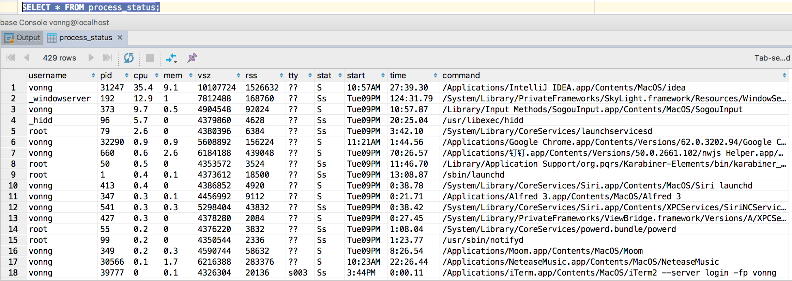

# file_fdw妙用无穷——从数据库读取系统信息

PostgreSQL是最先进的开源数据库，其中一个非常给力的特性就是FDW：外部数据包装器（Foreign Data Wrapper）。通过FDW，用户可以用统一的方式从Pg中访问各类外部数据源。`file_fdw`就是其中随数据库附赠的两个fdw之一。随着pg10的更新，`file_fdw`也添加了一颗赛艇的功能：从程序输出读取。

小霸王妙用无穷，我们能通过`file_fdw`，轻松查看操作系统信息，拉取网络数据，把各种各样的数据源轻松喂进数据库里统一查看管理。


## 安装与配置

`file_fdw`是Pg自带的组件，不需要奇怪的配置，在数据库中执行以下命令即可启用`file_fdw`：

```plsql
CREATE EXTENSION file_fdw;
```

启用FDW插件之后，需要创建一个实例，也是一行SQL搞定，创建一个名为`fs`的FDW Server实例。

```plsql
CREATE SERVER fs FOREIGN DATA WRAPPER file_fdw;
```


## 创建外部表

举个栗子，如果我想从数据库中读取操作系统中正在运行的进程信息，该怎么做呢？

最典型，也是最常用的外部数据格式就是CSV啦。不过系统命令输出的结果并不是很规整：

```bash
>>> ps ux
USER       PID %CPU %MEM    VSZ   RSS TTY      STAT START   TIME COMMAND
vonng     2658  0.0  0.2 148428  2620 ?        S    11:51   0:00 sshd: vonng@pts/0,pts/2
vonng     2659  0.0  0.2 115648  2312 pts/0    Ss+  11:51   0:00 -bash
vonng     4854  0.0  0.2 115648  2272 pts/2    Ss   15:46   0:00 -bash
vonng     5176  0.0  0.1 150940  1828 pts/2    R+   16:06   0:00 ps -ux
vonng    26460  0.0  1.2 271808 13060 ?        S    10月26   0:22 /usr/local/pgsql/bin/postgres
vonng    26462  0.0  0.2 271960  2640 ?        Ss   10月26   0:00 postgres: checkpointer process
vonng    26463  0.0  0.2 271808  2148 ?        Ss   10月26   0:25 postgres: writer process
vonng    26464  0.0  0.5 271808  5300 ?        Ss   10月26   0:27 postgres: wal writer process
vonng    26465  0.0  0.2 272216  2096 ?        Ss   10月26   0:31 postgres: autovacuum launcher process
vonng    26466  0.0  0.1 126896  1104 ?        Ss   10月26   0:54 postgres: stats collector process
vonng    26467  0.0  0.1 272100  1588 ?        Ss   10月26   0:01 postgres: bgworker: logical replication launcher

```

可以通过`awk`，将`ps`的命令输出规整为分隔符为`\x1F`的csv格式。

```
ps aux | awk '{print $1,$2,$3,$4,$5,$6,$7,$8,$9,$10,substr($0,index($0,$11))}' OFS='\037'
```

正戏来啦！通过以下DDL创建一张外表定义

```plsql
CREATE FOREIGN TABLE process_status (
  username TEXT,
  pid      INTEGER,
  cpu      NUMERIC,
  mem      NUMERIC,
  vsz      BIGINT,
  rss      BIGINT,
  tty      TEXT,
  stat     TEXT,
  start    TEXT,
  time     TEXT,
  command  TEXT
) SERVER fs OPTIONS (
PROGRAM $$ps aux | awk '{print $1,$2,$3,$4,$5,$6,$7,$8,$9,$10,substr($0,index($0,$11))}' OFS='\037'$$,
FORMAT 'csv', DELIMITER E'\037', HEADER 'TRUE');
```

这里，关键是通过`CREATE FOREIGN TABLE OPTIONS (xxxx)`中的`OPTIONS`提供相应的参数，在`PROGRAM`参数中填入上面的命令，pg就会在查询这张表的时候自动执行此命令，并读取其输出。`FORMAT`参数可以指定为`CSV`，`DELIMITER`参数指定为之前使用的`\x1F`，并通过`HEADER 'TRUE'`忽略CSV的第一行


那么结果如何呢？




## 有什么用

最简单的场景，原本系统指标监控需要编写各种监测脚本，部署在奇奇怪怪的地方。然后定期执行拉取metric，再存进数据库。现在通过file_fdw的方式，可以将感兴趣的指标直接录入数据库表，一步到位，而且维护方便，部署简单，更加可靠。在外表上加上视图，定期拉取聚合，将原本一个监控系统完成的事情，在数据库中一条龙解决了。

因为可以从程序输出读取结果，因此file_fdw可以与linux生态里各类强大的命令行工具配合使用，发挥出强大的威力。


## 其他栗子

诸如此类，实际上后来我发现Facebook貌似有一个类似的产品，叫OSQuery，也是干了差不多的事。通过SQL查询操作系统的指标。但明显PostgreSQL这种方法最简单粗暴高效啦，只要定义表结构，和命令数据源就能轻松对接指标数据，用不了一天就能做出一个功能差不多的东西来。

用于读取系统用户列表的DDL：

```plsql
CREATE FOREIGN TABLE etc_password (
  username  TEXT,
  password  TEXT,
  user_id   INTEGER,
  group_id  INTEGER,
  user_info TEXT,
  home_dir  TEXT,
  shell     TEXT
) SERVER fs OPTIONS (
  PROGRAM $$awk -F: 'NF && !/^[:space:]*#/ {print $1,$2,$3,$4,$5,$6,$7}' OFS='\037' /etc/passwd$$, 
  FORMAT 'csv', DELIMITER E'\037'
);
```

用于读取磁盘用量的DDL：

```plsql
CREATE FOREIGN TABLE disk_free (
  file_system TEXT,
  blocks_1m   BIGINT,
  used_1m     BIGINT,
  avail_1m    BIGINT,
  capacity    TEXT,
  iused       BIGINT,
  ifree       BIGINT,
  iused_pct   TEXT,
  mounted_on  TEXT
) SERVER fs OPTIONS (PROGRAM $$df -ml| awk '{print $1,$2,$3,$4,$5,$6,$7,$8,$9}' OFS='\037'$$, FORMAT 'csv', HEADER 'TRUE', DELIMITER E'\037'
);
```

当然，用file_fdw只是一个很Naive的FDW，譬如这里就只能读，不能改。

自己编写FDW实现增删改查逻辑也非常简单，例如Multicorn就是使用Python编写FDW的项目。

SQL over everything，让世界变的更简单~