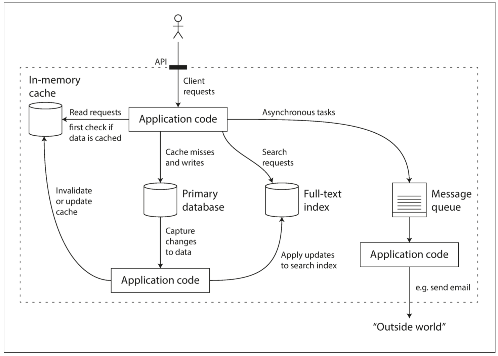

# 第一章：可靠性、可伸縮性和可維護性


> 網際網路做得太棒了，以至於大多數人將它看作像太平洋這樣的自然資源，而不是什麼人工產物。上一次出現這種大規模且無差錯的技術， 你還記得是什麼時候嗎？
>
> —— [艾倫・凱](http://www.drdobbs.com/architecture-and-design/interview-with-alan-kay/240003442) 在接受 Dobb 博士雜誌採訪時說（2012 年）

-----------------------

[TOC]

現今很多應用程式都是 **資料密集型（data-intensive）** 的，而非 **計算密集型（compute-intensive）** 的。因此 CPU 很少成為這類應用的瓶頸，更大的問題通常來自資料量、資料複雜性、以及資料的變更速度。

資料密集型應用通常由標準組件構建而成，標準組件提供了很多通用的功能；例如，許多應用程式都需要：

 - 儲存資料，以便自己或其他應用程式之後能再次找到 （*資料庫，即 databases*）
 - 記住開銷昂貴操作的結果，加快讀取速度（*快取，即 caches*）
 - 允許使用者按關鍵字搜尋資料，或以各種方式對資料進行過濾（*搜尋索引，即 search indexes*）
 - 向其他程序傳送訊息，進行非同步處理（*流處理，即 stream processing*）
 - 定期處理累積的大批次資料（*批處理，即 batch processing*）

如果這些功能聽上去平淡無奇，那是因為這些 **資料系統（data system）** 是非常成功的抽象：我們一直不假思索地使用它們並習以為常。絕大多數工程師不會幻想從零開始編寫儲存引擎，因為在開發應用時，資料庫已經是足夠完美的工具了。

但現實沒有這麼簡單。不同的應用有著不同的需求，因而資料庫系統也是百花齊放，有著各式各樣的特性。實現快取有很多種手段，建立搜尋索引也有好幾種方法，諸如此類。因此在開發應用前，我們依然有必要先弄清楚最適合手頭工作的工具和方法。而且當單個工具解決不了你的問題時，組合使用這些工具可能還是有些難度的。

本書將是一趟關於資料系統原理、實踐與應用的旅程，並講述了設計資料密集型應用的方法。我們將探索不同工具之間的共性與特性，以及各自的實現原理。

本章將從我們所要實現的基礎目標開始：可靠、可伸縮、可維護的資料系統。我們將澄清這些詞語的含義，概述考量這些目標的方法。並回顧一些後續章節所需的基礎知識。在接下來的章節中我們將抽絲剝繭，研究設計資料密集型應用時可能遇到的設計決策。


## 關於資料系統的思考

我們通常認為，資料庫、訊息佇列、快取等工具分屬於幾個差異顯著的類別。雖然資料庫和訊息隊列表面上有一些相似性 —— 它們都會儲存一段時間的資料 —— 但它們有迥然不同的訪問模式，這意味著迥異的效能特徵和實現手段。

那我們為什麼要把這些東西放在 **資料系統（data system）** 的總稱之下混為一談呢？

近些年來，出現了許多新的資料儲存工具與資料處理工具。它們針對不同應用場景進行最佳化，因此不再適合生硬地歸入傳統類別【1】。類別之間的界限變得越來越模糊，例如：資料儲存可以被當成訊息佇列用（Redis），訊息佇列則帶有類似資料庫的持久保證（Apache Kafka）。

其次，越來越多的應用程式有著各種嚴格而廣泛的要求，單個工具不足以滿足所有的資料處理和儲存需求。取而代之的是，總體工作被拆分成一系列能被單個工具高效完成的任務，並透過應用程式碼將它們縫合起來。

例如，如果將快取（應用管理的快取層，Memcached 或同類產品）和全文搜尋（全文搜尋伺服器，例如 Elasticsearch 或 Solr）功能從主資料庫剝離出來，那麼使快取 / 索引與主資料庫保持同步通常是應用程式碼的責任。[圖 1-1](../img/fig1-1.png) 給出了這種架構可能的樣子（細節將在後面的章節中詳細介紹）。



**圖 1-1 一個可能的組合使用多個元件的資料系統架構**

當你將多個工具組合在一起提供服務時，服務的介面或 **應用程式程式設計介面（API, Application Programming Interface）** 通常向客戶端隱藏這些實現細節。現在，你基本上已經使用較小的通用元件建立了一個全新的、專用的資料系統。這個新的複合資料系統可能會提供特定的保證，例如：快取在寫入時會作廢或更新，以便外部客戶端獲取一致的結果。現在你不僅是應用程式開發人員，還是資料系統設計人員了。

設計資料系統或服務時可能會遇到很多棘手的問題，例如：當系統出問題時，如何確保資料的正確性和完整性？當部分系統退化降級時，如何為客戶提供始終如一的良好效能？當負載增加時，如何擴容應對？什麼樣的 API 才是好的 API？

影響資料系統設計的因素很多，包括參與人員的技能和經驗、歷史遺留問題、系統路徑依賴、交付時限、公司的風險容忍度、監管約束等，這些因素都需要具體問題具體分析。

本書著重討論三個在大多數軟體系統中都很重要的問題：

* 可靠性（Reliability）

  系統在 **困境**（adversity，比如硬體故障、軟體故障、人為錯誤）中仍可正常工作（正確完成功能，並能達到期望的效能水準）。請參閱 “[可靠性](#可靠性)”。

* 可伸縮性（Scalability）

  有合理的辦法應對系統的增長（資料量、流量、複雜性）。請參閱 “[可伸縮性](#可伸縮性)”。

* 可維護性（Maintainability）

  許多不同的人（工程師、運維）在不同的生命週期，都能高效地在系統上工作（使系統保持現有行為，並適應新的應用場景）。請參閱 “[可維護性](#可維護性)”。

人們經常追求這些詞彙，卻沒有清楚理解它們到底意味著什麼。為了工程的嚴謹性，本章的剩餘部分將探討可靠性、可伸縮性和可維護性的含義。為實現這些目標而使用的各種技術，架構和演算法將在後續的章節中研究。


## 可靠性

人們對於一個東西是否可靠，都有一個直觀的想法。人們對可靠軟體的典型期望包括：

* 應用程式表現出使用者所期望的功能。
* 允許使用者犯錯，允許使用者以出乎意料的方式使用軟體。
* 在預期的負載和資料量下，效能滿足要求。
* 系統能防止未經授權的訪問和濫用。

如果所有這些在一起意味著 “正確工作”，那麼可以把可靠性粗略理解為 “即使出現問題，也能繼續正確工作”。

造成錯誤的原因叫做 **故障（fault）**，能預料並應對故障的系統特性可稱為 **容錯（fault-tolerant）** 或 **韌性（resilient）**。“**容錯**” 一詞可能會產生誤導，因為它暗示著系統可以容忍所有可能的錯誤，但在實際中這是不可能的。比方說，如果整個地球（及其上的所有伺服器）都被黑洞吞噬了，想要容忍這種錯誤，需要把網路託管到太空中 —— 這種預算能不能批准就祝你好運了。所以在討論容錯時，只有談論特定型別的錯誤才有意義。

注意 **故障（fault）** 不同於 **失效（failure）**【2】。**故障** 通常定義為系統的一部分狀態偏離其標準，而 **失效** 則是系統作為一個整體停止向用戶提供服務。故障的概率不可能降到零，因此最好設計容錯機制以防因 **故障** 而導致 **失效**。本書中我們將介紹幾種用不可靠的部件構建可靠系統的技術。

反直覺的是，在這類容錯系統中，透過故意觸發來 **提高** 故障率是有意義的，例如：在沒有警告的情況下隨機地殺死單個程序。許多高危漏洞實際上是由糟糕的錯誤處理導致的【3】，因此我們可以透過故意引發故障來確保容錯機制不斷執行並接受考驗，從而提高故障自然發生時系統能正確處理的信心。Netflix 公司的 *Chaos Monkey*【4】就是這種方法的一個例子。

儘管比起 **阻止錯誤（prevent error）**，我們通常更傾向於 **容忍錯誤**。但也有 **預防勝於治療** 的情況（比如不存在治療方法時）。安全問題就屬於這種情況。例如，如果攻擊者破壞了系統，並獲取了敏感資料，這種事是撤銷不了的。但本書主要討論的是可以恢復的故障種類，正如下面幾節所述。

### 硬體故障

當想到系統失效的原因時，**硬體故障（hardware faults）** 總會第一個進入腦海。硬碟崩潰、記憶體出錯、機房斷電、有人拔錯網線…… 任何與大型資料中心打過交道的人都會告訴你：一旦你擁有很多機器，這些事情 **總** 會發生！

據報道稱，硬碟的 **平均無故障時間（MTTF, mean time to failure）** 約為 10 到 50 年【5】【6】。因此從數學期望上講，在擁有 10000 個磁碟的儲存叢集上，平均每天會有 1 個磁碟出故障。

為了減少系統的故障率，第一反應通常都是增加單個硬體的冗餘度，例如：磁碟可以組建 RAID，伺服器可能有雙路電源和熱插拔 CPU，資料中心可能有電池和柴油發電機作為後備電源，某個元件掛掉時冗餘元件可以立刻接管。這種方法雖然不能完全防止由硬體問題導致的系統失效，但它簡單易懂，通常也足以讓機器不間斷執行很多年。

直到最近，硬體冗餘對於大多數應用來說已經足夠了，它使單臺機器完全失效變得相當罕見。只要你能快速地把備份恢復到新機器上，故障停機時間對大多數應用而言都算不上災難性的。只有少量高可用性至關重要的應用才會要求有多套硬體冗餘。

但是隨著資料量和應用計算需求的增加，越來越多的應用開始大量使用機器，這會相應地增加硬體故障率。此外，在類似亞馬遜 AWS（Amazon Web Services）的一些雲服務平臺上，虛擬機器例項不可用卻沒有任何警告也是很常見的【7】，因為雲平臺的設計就是優先考慮 **靈活性（flexibility）** 和 **彈性（elasticity）**[^i]，而不是單機可靠性。

如果在硬體冗餘的基礎上進一步引入軟體容錯機制，那麼系統在容忍整個（單臺）機器故障的道路上就更進一步了。這樣的系統也有運維上的便利，例如：如果需要重啟機器（例如應用作業系統安全補丁），單伺服器系統就需要計劃停機。而允許機器失效的系統則可以一次修復一個節點，無需整個系統停機。

[^i]: 在 [應對負載的方法](#應對負載的方法) 一節定義

### 軟體錯誤

我們通常認為硬體故障是隨機的、相互獨立的：一臺機器的磁碟失效並不意味著另一臺機器的磁碟也會失效。雖然大量硬體元件之間可能存在微弱的相關性（例如伺服器機架的溫度等共同的原因），但同時發生故障也是極為罕見的。

另一類錯誤是內部的 **系統性錯誤（systematic error）**【8】。這類錯誤難以預料，而且因為是跨節點相關的，所以比起不相關的硬體故障往往可能造成更多的 **系統失效**【5】。例子包括：

* 接受特定的錯誤輸入，便導致所有應用伺服器例項崩潰的 BUG。例如 2012 年 6 月 30 日的閏秒，由於 Linux 核心中的一個錯誤【9】，許多應用同時掛掉了。
* 失控程序會用盡一些共享資源，包括 CPU 時間、記憶體、磁碟空間或網路頻寬。
* 系統依賴的服務變慢，沒有響應，或者開始返回錯誤的響應。
* 級聯故障，一個元件中的小故障觸發另一個元件中的故障，進而觸發更多的故障【10】。

導致這類軟體故障的 BUG 通常會潛伏很長時間，直到被異常情況觸發為止。這種情況意味著軟體對其環境做出了某種假設 —— 雖然這種假設通常來說是正確的，但由於某種原因最後不再成立了【11】。

雖然軟體中的系統性故障沒有速效藥，但我們還是有很多小辦法，例如：仔細考慮系統中的假設和互動；徹底的測試；程序隔離；允許程序崩潰並重啟；測量、監控並分析生產環境中的系統行為。如果系統能夠提供一些保證（例如在一個訊息佇列中，進入與發出的訊息數量相等），那麼系統就可以在執行時不斷自檢，並在出現 **差異（discrepancy）** 時報警【12】。

### 人為錯誤

設計並構建了軟體系統的工程師是人類，維持系統執行的運維也是人類。即使他們懷有最大的善意，人類也是不可靠的。舉個例子，一項關於大型網際網路服務的研究發現，運維配置錯誤是導致服務中斷的首要原因，而硬體故障（伺服器或網路）僅導致了 10-25% 的服務中斷【13】。

儘管人類不可靠，但怎麼做才能讓系統變得可靠？最好的系統會組合使用以下幾種辦法：

* 以最小化犯錯機會的方式設計系統。例如，精心設計的抽象、API 和管理後臺使做對事情更容易，搞砸事情更困難。但如果介面限制太多，人們就會忽略它們的好處而想辦法繞開。很難正確把握這種微妙的平衡。
* 將人們最容易犯錯的地方與可能導致失效的地方 **解耦（decouple）**。特別是提供一個功能齊全的非生產環境 **沙箱（sandbox）**，使人們可以在不影響真實使用者的情況下，使用真實資料安全地探索和實驗。
* 在各個層次進行徹底的測試【3】，從單元測試、全系統整合測試到手動測試。自動化測試易於理解，已經被廣泛使用，特別適合用來覆蓋正常情況中少見的 **邊緣場景（corner case）**。
* 允許從人為錯誤中簡單快速地恢復，以最大限度地減少失效情況帶來的影響。 例如，快速回滾配置變更，分批發布新程式碼（以便任何意外錯誤隻影響一小部分使用者），並提供資料重算工具（以備舊的計算出錯）。
* 配置詳細和明確的監控，比如效能指標和錯誤率。 在其他工程學科中這指的是 **遙測（telemetry）**（一旦火箭離開了地面，遙測技術對於跟蹤發生的事情和理解失敗是至關重要的）。監控可以向我們發出預警訊號，並允許我們檢查是否有任何地方違反了假設和約束。當出現問題時，指標資料對於問題診斷是非常寶貴的。
* 良好的管理實踐與充分的培訓 —— 一個複雜而重要的方面，但超出了本書的範圍。

### 可靠性有多重要？

可靠性不僅僅是針對核電站和空中交通管制軟體而言，我們也期望更多平凡的應用能可靠地執行。商務應用中的錯誤會導致生產力損失（也許資料報告不完整還會有法律風險），而電商網站的中斷則可能會導致收入和聲譽的巨大損失。

即使在 “非關鍵” 應用中，我們也對使用者負有責任。試想一位家長把所有的照片和孩子的影片儲存在你的照片應用裡【15】。如果資料庫突然損壞，他們會感覺如何？他們可能會知道如何從備份恢復嗎？

在某些情況下，我們可能會選擇犧牲可靠性來降低開發成本（例如為未經證實的市場開發產品原型）或運營成本（例如利潤率極低的服務），但我們偷工減料時，應該清楚意識到自己在做什麼。


## 可伸縮性

系統今天能可靠執行，並不意味未來也能可靠執行。服務 **降級（degradation）** 的一個常見原因是負載增加，例如：系統負載已經從一萬個併發使用者增長到十萬個併發使用者，或者從一百萬增長到一千萬。也許現在處理的資料量級要比過去大得多。

**可伸縮性（Scalability）** 是用來描述系統應對負載增長能力的術語。但是請注意，這不是貼在系統上的一維標籤：說 “X 可伸縮” 或 “Y 不可伸縮” 是沒有任何意義的。相反，討論可伸縮性意味著考慮諸如 “如果系統以特定方式增長，有什麼選項可以應對增長？” 和 “如何增加計算資源來處理額外的負載？” 等問題。

### 描述負載

在討論增長問題（如果負載加倍會發生什麼？）前，首先要能簡要描述系統的當前負載。負載可以用一些稱為 **負載引數（load parameters）** 的數字來描述。引數的最佳選擇取決於系統架構，它可能是每秒向 Web 伺服器發出的請求、資料庫中的讀寫比率、聊天室中同時活躍的使用者數量、快取命中率或其他東西。除此之外，也許平均情況對你很重要，也許你的瓶頸是少數極端場景。

為了使這個概念更加具體，我們以推特在 2012 年 11 月釋出的資料【16】為例。推特的兩個主要業務是：

* 釋出推文

  使用者可以向其粉絲釋出新訊息（平均 4.6k 請求 / 秒，峰值超過 12k 請求 / 秒）。

* 主頁時間線

  使用者可以查閱他們關注的人釋出的推文（300k 請求 / 秒）。

處理每秒 12,000 次寫入（發推文的速率峰值）還是很簡單的。然而推特的伸縮性挑戰並不是主要來自推特量，而是來自 **扇出（fan-out）**[^ii]—— 每個使用者關注了很多人，也被很多人關注。

[^ii]: 扇出：從電子工程學中借用的術語，它描述了輸入連線到另一個門輸出的邏輯閘數量。 輸出需要提供足夠的電流來驅動所有連線的輸入。 在事務處理系統中，我們使用它來描述為了服務一個傳入請求而需要執行其他服務的請求數量。

大體上講，這一對操作有兩種實現方式。

1. 釋出推文時，只需將新推文插入全域性推文集合即可。當一個使用者請求自己的主頁時間線時，首先查詢他關注的所有人，查詢這些被關注使用者釋出的推文並按時間順序合併。在如 [圖 1-2](../img/fig1-2.png) 所示的關係型資料庫中，可以編寫這樣的查詢：

    ```sql
    SELECT tweets.*, users.*
      FROM tweets
      JOIN users   ON tweets.sender_id = users.id
      JOIN follows ON follows.followee_id = users.id
      WHERE follows.follower_id = current_user
    ```

    

    **圖 1-2 推特主頁時間線的關係型模式簡單實現**

2. 為每個使用者的主頁時間線維護一個快取，就像每個使用者的推文收件箱（[圖 1-3](../img/fig1-3.png)）。 當一個使用者釋出推文時，查詢所有關注該使用者的人，並將新的推文插入到每個主頁時間線快取中。 因此讀取主頁時間線的請求開銷很小，因為結果已經提前計算好了。

    

    **圖 1-3 用於分發推特至關注者的資料流水線，2012 年 11 月的負載引數【16】**

推特的第一個版本使用了方法 1，但系統很難跟上主頁時間線查詢的負載。所以公司轉向了方法 2，方法 2 的效果更好，因為發推頻率比查詢主頁時間線的頻率幾乎低了兩個數量級，所以在這種情況下，最好在寫入時做更多的工作，而在讀取時做更少的工作。

然而方法 2 的缺點是，發推現在需要大量的額外工作。平均來說，一條推文會發往約 75 個關注者，所以每秒 4.6k 的發推寫入，變成了對主頁時間線快取每秒 345k 的寫入。但這個平均值隱藏了使用者粉絲數差異巨大這一現實，一些使用者有超過 3000 萬的粉絲，這意味著一條推文就可能會導致主頁時間線快取的 3000 萬次寫入！及時完成這種操作是一個巨大的挑戰 —— 推特嘗試在 5 秒內向粉絲傳送推文。

在推特的例子中，每個使用者粉絲數的分佈（可能按這些使用者的發推頻率來加權）是探討可伸縮性的一個關鍵負載引數，因為它決定了扇出負載。你的應用程式可能具有非常不同的特徵，但可以採用相似的原則來考慮它的負載。

推特軼事的最終轉折：現在已經穩健地實現了方法 2，推特逐步轉向了兩種方法的混合。大多數使用者發的推文會被扇出寫入其粉絲主頁時間線快取中。但是少數擁有海量粉絲的使用者（即名流）會被排除在外。當用戶讀取主頁時間線時，分別地獲取出該使用者所關注的每位名流的推文，再與使用者的主頁時間線快取合併，如方法 1 所示。這種混合方法能始終如一地提供良好效能。在 [第十二章](ch12.md) 中我們將重新討論這個例子，這在覆蓋更多技術層面之後。

### 描述效能

一旦系統的負載被描述好，就可以研究當負載增加會發生什麼。我們可以從兩種角度來看：

* 增加負載引數並保持系統資源（CPU、記憶體、網路頻寬等）不變時，系統性能將受到什麼影響？
* 增加負載引數並希望保持效能不變時，需要增加多少系統資源？

這兩個問題都需要效能資料，所以讓我們簡單地看一下如何描述系統性能。

對於 Hadoop 這樣的批處理系統，通常關心的是 **吞吐量（throughput）**，即每秒可以處理的記錄數量，或者在特定規模資料集上執行作業的總時間 [^iii]。對於線上系統，通常更重要的是服務的 **響應時間（response time）**，即客戶端傳送請求到接收響應之間的時間。

[^iii]: 理想情況下，批次作業的執行時間是資料集的大小除以吞吐量。 在實踐中由於資料傾斜（資料不是均勻分佈在每個工作程序中），需要等待最慢的任務完成，所以執行時間往往更長。

> #### 延遲和響應時間
>
> **延遲（latency）** 和 **響應時間（response time）** 經常用作同義詞，但實際上它們並不一樣。響應時間是客戶所看到的，除了實際處理請求的時間（ **服務時間（service time）** ）之外，還包括網路延遲和排隊延遲。延遲是某個請求等待處理的 **持續時長**，在此期間它處於 **休眠（latent）** 狀態，並等待服務【17】。

即使不斷重複傳送同樣的請求，每次得到的響應時間也都會略有不同。現實世界的系統會處理各式各樣的請求，響應時間可能會有很大差異。因此我們需要將響應時間視為一個可以測量的數值 **分佈（distribution）**，而不是單個數值。

在 [圖 1-4](../img/fig1-4.png) 中，每個灰條代表一次對服務的請求，其高度表示請求花費了多長時間。大多數請求是相當快的，但偶爾會出現需要更長的時間的異常值。這也許是因為緩慢的請求實質上開銷更大，例如它們可能會處理更多的資料。但即使（你認為）所有請求都花費相同時間的情況下，隨機的附加延遲也會導致結果變化，例如：上下文切換到後臺程序，網路資料包丟失與 TCP 重傳，垃圾收集暫停，強制從磁碟讀取的頁面錯誤，伺服器機架中的震動【18】，還有很多其他原因。


**圖 1-4 展示了一個服務 100 次請求響應時間的均值與百分位數**

通常報表都會展示服務的平均響應時間。 （嚴格來講 “平均” 一詞並不指代任何特定公式，但實際上它通常被理解為 **算術平均值（arithmetic mean）**：給定 n 個值，加起來除以 n ）。然而如果你想知道 “**典型（typical）**” 響應時間，那麼平均值並不是一個非常好的指標，因為它不能告訴你有多少使用者實際上經歷了這個延遲。

通常使用 **百分位點（percentiles）** 會更好。如果將響應時間列表按最快到最慢排序，那麼 **中位數（median）** 就在正中間：舉個例子，如果你的響應時間中位數是 200 毫秒，這意味著一半請求的返回時間少於 200 毫秒，另一半比這個要長。

如果想知道典型場景下使用者需要等待多長時間，那麼中位數是一個好的度量標準：一半使用者請求的響應時間少於響應時間的中位數，另一半服務時間比中位數長。中位數也被稱為第 50 百分位點，有時縮寫為 p50。注意中位數是關於單個請求的；如果使用者同時發出幾個請求（在一個會話過程中，或者由於一個頁面中包含了多個資源），則至少一個請求比中位數慢的概率遠大於 50%。

為了弄清異常值有多糟糕，可以看看更高的百分位點，例如第 95、99 和 99.9 百分位點（縮寫為 p95，p99 和 p999）。它們意味著 95%、99% 或 99.9% 的請求響應時間要比該閾值快，例如：如果第 95 百分位點響應時間是 1.5 秒，則意味著 100 個請求中的 95 個響應時間快於 1.5 秒，而 100 個請求中的 5 個響應時間超過 1.5 秒。如 [圖 1-4](../img/fig1-4.png) 所示。

響應時間的高百分位點（也稱為 **尾部延遲**，即 **tail latencies**）非常重要，因為它們直接影響使用者的服務體驗。例如亞馬遜在描述內部服務的響應時間要求時是以 99.9 百分位點為準，即使它隻影響一千個請求中的一個。這是因為請求響應最慢的客戶往往也是資料最多的客戶，也可以說是最有價值的客戶 —— 因為他們掏錢了【19】。保證網站響應迅速對於保持客戶的滿意度非常重要，亞馬遜觀察到：響應時間增加 100 毫秒，銷售量就減少 1%【20】；而另一些報告說：慢 1 秒鐘會讓客戶滿意度指標減少 16%【21，22】。

另一方面，最佳化第 99.99 百分位點（一萬個請求中最慢的一個）被認為太昂貴了，不能為亞馬遜的目標帶來足夠好處。減小高百分位點處的響應時間相當困難，因為它很容易受到隨機事件的影響，這超出了控制範圍，而且效益也很小。

百分位點通常用於 **服務級別目標（SLO, service level objectives）** 和 **服務級別協議（SLA, service level agreements）**，即定義服務預期效能和可用性的合同。 SLA 可能會宣告，如果服務響應時間的中位數小於 200 毫秒，且 99.9 百分位點低於 1 秒，則認為服務工作正常（如果響應時間更長，就認為服務不達標）。這些指標為客戶設定了期望值，並允許客戶在 SLA 未達標的情況下要求退款。

**排隊延遲（queueing delay）** 通常佔了高百分位點處響應時間的很大一部分。由於伺服器只能並行處理少量的事務（如受其 CPU 核數的限制），所以只要有少量緩慢的請求就能阻礙後續請求的處理，這種效應有時被稱為 **頭部阻塞（head-of-line blocking）** 。即使後續請求在伺服器上處理的非常迅速，由於需要等待先前請求完成，客戶端最終看到的是緩慢的總體響應時間。因為存在這種效應，測量客戶端的響應時間非常重要。

為測試系統的可伸縮性而人為產生負載時，產生負載的客戶端要獨立於響應時間不斷傳送請求。如果客戶端在傳送下一個請求之前等待先前的請求完成，這種行為會產生人為排隊的效果，使得測試時的佇列比現實情況更短，使測量結果產生偏差【23】。

> #### 實踐中的百分位點
>
> 在多重呼叫的後端服務裡，高百分位數變得特別重要。即使並行呼叫，終端使用者請求仍然需要等待最慢的並行呼叫完成。如 [圖 1-5](../img/fig1-5.png) 所示，只需要一個緩慢的呼叫就可以使整個終端使用者請求變慢。即使只有一小部分後端呼叫速度較慢，如果終端使用者請求需要多個後端呼叫，則獲得較慢呼叫的機會也會增加，因此較高比例的終端使用者請求速度會變慢（效果稱為尾部延遲放大【24】）。
>
> 如果你想將響應時間百分點新增到你的服務的監視儀表板，則需要持續有效地計算它們。例如，你可能希望在最近 10 分鐘內保持請求響應時間的滾動視窗。每一分鐘，你都會計算出該視窗中的中值和各種百分數，並將這些度量值繪製在圖上。
>
> 簡單的實現是在時間視窗內儲存所有請求的響應時間列表，並且每分鐘對列表進行排序。如果對你來說效率太低，那麼有一些演算法能夠以最小的 CPU 和記憶體成本（如前向衰減【25】、t-digest【26】或 HdrHistogram 【27】）來計算百分位數的近似值。請注意，平均百分比（例如，減少時間解析度或合併來自多臺機器的資料）在數學上沒有意義 - 聚合響應時間資料的正確方法是新增直方圖【28】。


**圖 1-5 當一個請求需要多個後端請求時，單個後端慢請求就會拖慢整個終端使用者的請求**

### 應對負載的方法

現在我們已經討論了用於描述負載的引數和用於衡量效能的指標。可以開始認真討論可伸縮性了：當負載引數增加時，如何保持良好的效能？

適應某個級別負載的架構不太可能應付 10 倍於此的負載。如果你正在開發一個快速增長的服務，那麼每次負載發生數量級的增長時，你可能都需要重新考慮架構 —— 或者更頻繁。

人們經常討論 **縱向伸縮**（scaling up，也稱為垂直伸縮，即 vertical scaling，轉向更強大的機器）和 **橫向伸縮**（scaling out，也稱為水平伸縮，即 horizontal scaling，將負載分佈到多臺小機器上）之間的對立。跨多臺機器分配負載也稱為 “**無共享（shared-nothing）**” 架構。可以在單臺機器上執行的系統通常更簡單，但高階機器可能非常貴，所以非常密集的負載通常無法避免地需要橫向伸縮。現實世界中的優秀架構需要將這兩種方法務實地結合，因為使用幾臺足夠強大的機器可能比使用大量的小型虛擬機器更簡單也更便宜。

有些系統是 **彈性（elastic）** 的，這意味著可以在檢測到負載增加時自動增加計算資源，而其他系統則是手動伸縮（人工分析容量並決定向系統新增更多的機器）。如果負載 **極難預測（highly unpredictable）**，則彈性系統可能很有用，但手動伸縮系統更簡單，並且意外操作可能會更少（請參閱 “[分割槽再平衡](ch6.md#分割槽再平衡)”）。

跨多臺機器部署 **無狀態服務（stateless services）** 非常簡單，但將帶狀態的資料系統從單節點變為分散式配置則可能引入許多額外複雜度。出於這個原因，常識告訴我們應該將資料庫放在單個節點上（縱向伸縮），直到伸縮成本或可用性需求迫使其改為分散式。

隨著分散式系統的工具和抽象越來越好，至少對於某些型別的應用而言，這種常識可能會改變。可以預見分散式資料系統將成為未來的預設設定，即使對不處理大量資料或流量的場景也如此。本書的其餘部分將介紹多種分散式資料系統，不僅討論它們在可伸縮性方面的表現，還包括易用性和可維護性。

大規模的系統架構通常是應用特定的 —— 沒有一招鮮吃遍天的通用可伸縮架構（不正式的叫法：**萬金油（magic scaling sauce）** ）。應用的問題可能是讀取量、寫入量、要儲存的資料量、資料的複雜度、響應時間要求、訪問模式或者所有問題的大雜燴。

舉個例子，用於處理每秒十萬個請求（每個大小為 1 kB）的系統與用於處理每分鐘 3 個請求（每個大小為 2GB）的系統看上去會非常不一樣，儘管兩個系統有同樣的資料吞吐量。

一個良好適配應用的可伸縮架構，是圍繞著 **假設（assumption）** 建立的：哪些操作是常見的？哪些操作是罕見的？這就是所謂負載引數。如果假設最終是錯誤的，那麼為伸縮所做的工程投入就白費了，最糟糕的是適得其反。在早期創業公司或非正式產品中，通常支援產品快速迭代的能力，要比可伸縮至未來的假想負載要重要的多。

儘管這些架構是應用程式特定的，但可伸縮的架構通常也是從通用的積木塊搭建而成的，並以常見的模式排列。在本書中，我們將討論這些構件和模式。


## 可維護性

眾所周知，軟體的大部分開銷並不在最初的開發階段，而是在持續的維護階段，包括修復漏洞、保持系統正常執行、調查失效、適配新的平臺、為新的場景進行修改、償還技術債、新增新的功能等等。

不幸的是，許多從事軟體系統行業的人不喜歡維護所謂的 **遺留（legacy）** 系統，—— 也許因為涉及修復其他人的錯誤、和過時的平臺打交道，或者系統被迫使用於一些份外工作。每一個遺留系統都以自己的方式讓人不爽，所以很難給出一個通用的建議來和它們打交道。

但是我們可以，也應該以這樣一種方式來設計軟體：在設計之初就儘量考慮儘可能減少維護期間的痛苦，從而避免自己的軟體系統變成遺留系統。為此，我們將特別關注軟體系統的三個設計原則：

* 可操作性（Operability）

  便於運維團隊保持系統平穩執行。

* 簡單性（Simplicity）

  從系統中消除儘可能多的 **複雜度（complexity）**，使新工程師也能輕鬆理解系統（注意這和使用者介面的簡單性不一樣）。

* 可演化性（evolvability）

  使工程師在未來能輕鬆地對系統進行更改，當需求變化時為新應用場景做適配。也稱為 **可擴充套件性（extensibility）**、**可修改性（modifiability）** 或 **可塑性（plasticity）**。

和之前提到的可靠性、可伸縮性一樣，實現這些目標也沒有簡單的解決方案。不過我們會試著想象具有可操作性，簡單性和可演化性的系統會是什麼樣子。

### 可操作性：人生苦短，關愛運維

有人認為，“良好的運維經常可以繞開垃圾（或不完整）軟體的侷限性，而再好的軟體攤上垃圾運維也沒法可靠執行”。儘管運維的某些方面可以，而且應該是自動化的，但在最初建立正確運作的自動化機制仍然取決於人。

運維團隊對於保持軟體系統順利執行至關重要。一個優秀運維團隊的典型職責如下（或者更多）【29】：

* 監控系統的執行狀況，並在服務狀態不佳時快速恢復服務。
* 跟蹤問題的原因，例如系統故障或效能下降。
* 及時更新軟體和平臺，比如安全補丁。
* 瞭解系統間的相互作用，以便在異常變更造成損失前進行規避。
* 預測未來的問題，並在問題出現之前加以解決（例如，容量規劃）。
* 建立部署、配置、管理方面的良好實踐，編寫相應工具。
* 執行複雜的維護任務，例如將應用程式從一個平臺遷移到另一個平臺。
* 當配置變更時，維持系統的安全性。
* 定義工作流程，使運維操作可預測，並保持生產環境穩定。
* 鐵打的營盤流水的兵，維持組織對系統的瞭解。

良好的可操作性意味著更輕鬆的日常工作，進而運維團隊能專注於高價值的事情。資料系統可以透過各種方式使日常任務更輕鬆：

* 透過良好的監控，提供對系統內部狀態和執行時行為的 **可見性（visibility）**。
* 為自動化提供良好支援，將系統與標準化工具相整合。
* 避免依賴單臺機器（在整個系統繼續不間斷執行的情況下允許機器停機維護）。
* 提供良好的文件和易於理解的操作模型（“如果做 X，會發生 Y”）。
* 提供良好的預設行為，但需要時也允許管理員自由覆蓋預設值。
* 有條件時進行自我修復，但需要時也允許管理員手動控制系統狀態。
* 行為可預測，最大限度減少意外。


### 簡單性：管理複雜度

小型軟體專案可以使用簡單討喜的、富表現力的程式碼，但隨著專案越來越大，程式碼往往變得非常複雜，難以理解。這種複雜度拖慢了所有系統相關人員，進一步增加了維護成本。一個陷入複雜泥潭的軟體專案有時被描述為 **爛泥潭（a big ball of mud）** 【30】。

**複雜度（complexity）** 有各種可能的症狀，例如：狀態空間激增、模組間緊密耦合、糾結的依賴關係、不一致的命名和術語、解決效能問題的 Hack、需要繞開的特例等等，現在已經有很多關於這個話題的討論【31,32,33】。

因為複雜度導致維護困難時，預算和時間安排通常會超支。在複雜的軟體中進行變更，引入錯誤的風險也更大：當開發人員難以理解系統時，隱藏的假設、無意的後果和意外的互動就更容易被忽略。相反，降低複雜度能極大地提高軟體的可維護性，因此簡單性應該是構建系統的一個關鍵目標。

簡化系統並不一定意味著減少功能；它也可以意味著消除 **額外的（accidental）** 的複雜度。 Moseley 和 Marks【32】把 **額外複雜度** 定義為：由具體實現中湧現，而非（從使用者視角看，系統所解決的）問題本身固有的複雜度。

用於消除 **額外複雜度** 的最好工具之一是 **抽象（abstraction）**。一個好的抽象可以將大量實現細節隱藏在一個乾淨，簡單易懂的外觀下面。一個好的抽象也可以廣泛用於各類不同應用。比起重複造很多輪子，重用抽象不僅更有效率，而且有助於開發高質量的軟體。抽象元件的質量改進將使所有使用它的應用受益。

例如，高階程式語言是一種抽象，隱藏了機器碼、CPU 暫存器和系統呼叫。 SQL 也是一種抽象，隱藏了複雜的磁碟 / 記憶體資料結構、來自其他客戶端的併發請求、崩潰後的不一致性。當然在用高階語言程式設計時，我們仍然用到了機器碼；只不過沒有 **直接（directly）** 使用罷了，正是因為程式語言的抽象，我們才不必去考慮這些實現細節。

抽象可以幫助我們將系統的複雜度控制在可管理的水平，不過，找到好的抽象是非常困難的。在分散式系統領域雖然有許多好的演算法，但我們並不清楚它們應該打包成什麼樣抽象。

本書將緊盯那些允許我們將大型系統的部分提取為定義明確的、可重用的元件的優秀抽象。

### 可演化性：擁抱變化

系統的需求永遠不變，基本是不可能的。更可能的情況是，它們處於常態的變化中，例如：你瞭解了新的事實、出現意想不到的應用場景、業務優先順序發生變化、使用者要求新功能、新平臺取代舊平臺、法律或監管要求發生變化、系統增長迫使架構變化等。

在組織流程方面， **敏捷（agile）** 工作模式為適應變化提供了一個框架。敏捷社群還開發了對在頻繁變化的環境中開發軟體很有幫助的技術工具和模式，如 **測試驅動開發（TDD, test-driven development）** 和 **重構（refactoring）** 。

這些敏捷技術的大部分討論都集中在相當小的規模（同一個應用中的幾個程式碼檔案）。本書將探索在更大資料系統層面上提高敏捷性的方法，可能由幾個不同的應用或服務組成。例如，為了將裝配主頁時間線的方法從方法 1 變為方法 2，你會如何 “重構” 推特的架構 ？

修改資料系統並使其適應不斷變化需求的容易程度，是與 **簡單性** 和 **抽象性** 密切相關的：簡單易懂的系統通常比複雜系統更容易修改。但由於這是一個非常重要的概念，我們將用一個不同的詞來指代資料系統層面的敏捷性： **可演化性（evolvability）** 【34】。


## 本章小結

本章探討了一些關於資料密集型應用的基本思考方式。這些原則將指導我們閱讀本書的其餘部分，那裡將會深入技術細節。

一個應用必須滿足各種需求才稱得上有用。有一些 **功能需求**（functional requirements，即它應該做什麼，比如允許以各種方式儲存，檢索，搜尋和處理資料）以及一些 **非功能性需求**（nonfunctional，即通用屬性，例如安全性、可靠性、合規性、可伸縮性、相容性和可維護性）。在本章詳細討論了可靠性，可伸縮性和可維護性。


**可靠性（Reliability）** 意味著即使發生故障，系統也能正常工作。故障可能發生在硬體（通常是隨機的和不相關的）、軟體（通常是系統性的 Bug，很難處理）和人類（不可避免地時不時出錯）。 **容錯技術** 可以對終端使用者隱藏某些型別的故障。

**可伸縮性（Scalability）** 意味著即使在負載增加的情況下也有保持效能的策略。為了討論可伸縮性，我們首先需要定量描述負載和效能的方法。我們簡要了解了推特主頁時間線的例子，介紹描述負載的方法，並將響應時間百分位點作為衡量效能的一種方式。在可伸縮的系統中可以新增 **處理容量（processing capacity）** 以在高負載下保持可靠。

**可維護性（Maintainability）** 有許多方面，但實質上是關於工程師和運維團隊的生活質量的。良好的抽象可以幫助降低複雜度，並使系統易於修改和適應新的應用場景。良好的可操作性意味著對系統的健康狀態具有良好的可見性，並擁有有效的管理手段。

不幸的是，使應用可靠、可伸縮或可維護並不容易。但是某些模式和技術會不斷重新出現在不同的應用中。在接下來的幾章中，我們將看到一些資料系統的例子，並分析它們如何實現這些目標。

在本書後面的 [第三部分](part-iii.md) 中，我們將看到一種模式：幾個元件協同工作以構成一個完整的系統（如 [圖 1-1](../img/fig1-1.png) 中的例子）


## 參考文獻

1.  Michael Stonebraker and Uğur Çetintemel: “['One Size Fits All': An Idea Whose Time Has Come and Gone](http://citeseerx.ist.psu.edu/viewdoc/download?doi=10.1.1.68.9136&rep=rep1&type=pdf),” at *21st International Conference on Data Engineering* (ICDE), April 2005.
1.  Walter L. Heimerdinger and Charles B. Weinstock: “[A Conceptual Framework for System Fault Tolerance](http://www.sei.cmu.edu/reports/92tr033.pdf),” Technical Report CMU/SEI-92-TR-033, Software Engineering Institute, Carnegie Mellon University, October 1992.
1.  Ding Yuan, Yu Luo, Xin Zhuang, et al.: “[Simple Testing Can Prevent Most Critical Failures: An Analysis of Production Failures in Distributed Data-Intensive Systems](https://www.usenix.org/system/files/conference/osdi14/osdi14-paper-yuan.pdf),” at *11th USENIX Symposium on Operating Systems Design and Implementation* (OSDI), October 2014.
1.  Yury Izrailevsky and Ariel Tseitlin: “[The Netflix Simian Army](http://techblog.netflix.com/2011/07/netflix-simian-army.html),” *techblog.netflix.com*, July 19, 2011.
1.  Daniel Ford, François Labelle, Florentina I. Popovici, et al.: “[Availability in Globally Distributed Storage Systems](http://research.google.com/pubs/archive/36737.pdf),” at *9th USENIX Symposium on Operating Systems Design and Implementation* (OSDI), October 2010.
1.  Brian Beach: “[Hard Drive Reliability Update – Sep 2014](https://www.backblaze.com/blog/hard-drive-reliability-update-september-2014/),” *backblaze.com*, September 23, 2014.
1.  Laurie Voss: “[AWS: The Good, the Bad and the Ugly](https://web.archive.org/web/20160429075023/http://blog.awe.sm/2012/12/18/aws-the-good-the-bad-and-the-ugly/),” *blog.awe.sm*, December 18, 2012.
1.  Haryadi S. Gunawi, Mingzhe Hao, Tanakorn Leesatapornwongsa, et al.: “[What Bugs Live in the Cloud?](http://ucare.cs.uchicago.edu/pdf/socc14-cbs.pdf),” at *5th ACM Symposium on Cloud Computing* (SoCC), November 2014. [doi:10.1145/2670979.2670986](http://dx.doi.org/10.1145/2670979.2670986)
1.  Nelson Minar:  “[Leap Second Crashes Half the Internet](http://www.somebits.com/weblog/tech/bad/leap-second-2012.html),” *somebits.com*, July 3, 2012.
1.  Amazon Web Services:  “[Summary of the Amazon EC2 and Amazon RDS Service Disruption in the US East Region](http://aws.amazon.com/message/65648/),” *aws.amazon.com*, April 29, 2011.
1.  Richard I. Cook: “[How Complex Systems Fail](http://web.mit.edu/2.75/resources/random/How%20Complex%20Systems%20Fail.pdf),” Cognitive Technologies Laboratory, April 2000.
1.  Jay Kreps: “[Getting Real About Distributed System Reliability](http://blog.empathybox.com/post/19574936361/getting-real-about-distributed-system-reliability),” *blog.empathybox.com*, March 19, 2012.
1.  David Oppenheimer, Archana Ganapathi, and David A. Patterson: “[Why Do Internet Services Fail, and What Can Be Done About It?](http://static.usenix.org/legacy/events/usits03/tech/full_papers/oppenheimer/oppenheimer.pdf),” at *4th USENIX Symposium on Internet Technologies and Systems* (USITS), March 2003.
1.  Nathan Marz:  “[Principles of Software Engineering, Part 1](http://nathanmarz.com/blog/principles-of-software-engineering-part-1.html),” *nathanmarz.com*, April 2, 2013.
1.  Michael Jurewitz:“[The Human Impact of Bugs](http://jury.me/blog/2013/3/14/the-human-impact-of-bugs),” *jury.me*, March 15, 2013.
1.  Raffi Krikorian: “[Timelines at Scale](http://www.infoq.com/presentations/Twitter-Timeline-Scalability),” at *QCon San Francisco*, November 2012.
1.  Martin Fowler: *Patterns of Enterprise Application Architecture*. Addison Wesley, 2002. ISBN: 978-0-321-12742-6
1.  Kelly Sommers: “[After all that run around, what caused 500ms disk latency even when we replaced physical server?](https://twitter.com/kellabyte/status/532930540777635840)” *twitter.com*, November 13, 2014.
1.  Giuseppe DeCandia, Deniz Hastorun, Madan Jampani, et al.: “[Dynamo: Amazon's Highly Available Key-Value Store](http://www.allthingsdistributed.com/files/amazon-dynamo-sosp2007.pdf),” at *21st ACM Symposium on Operating Systems Principles* (SOSP), October 2007.
1.  Greg Linden: “[Make Data Useful](http://glinden.blogspot.co.uk/2006/12/slides-from-my-talk-at-stanford.html),” slides from presentation at Stanford University Data Mining class (CS345), December 2006.
1.  Tammy Everts: “[The Real Cost of Slow Time vs Downtime](http://www.webperformancetoday.com/2014/11/12/real-cost-slow-time-vs-downtime-slides/),” *webperformancetoday.com*, November 12, 2014.
1.  Jake Brutlag:“[Speed Matters for Google Web Search](http://googleresearch.blogspot.co.uk/2009/06/speed-matters.html),” *googleresearch.blogspot.co.uk*, June 22, 2009.
1.  Tyler Treat: “[Everything You Know About Latency Is Wrong](http://bravenewgeek.com/everything-you-know-about-latency-is-wrong/),” *bravenewgeek.com*, December 12, 2015.
1.  Jeffrey Dean and Luiz André Barroso: “[The Tail at Scale](http://cacm.acm.org/magazines/2013/2/160173-the-tail-at-scale/fulltext),” *Communications of the ACM*, volume 56, number 2, pages 74–80, February 2013. [doi:10.1145/2408776.2408794](http://dx.doi.org/10.1145/2408776.2408794)
1.  Graham Cormode, Vladislav Shkapenyuk, Divesh Srivastava, and Bojian Xu: “[Forward Decay: A Practical Time Decay Model for Streaming Systems](http://dimacs.rutgers.edu/~graham/pubs/papers/fwddecay.pdf),” at *25th IEEE International Conference on Data Engineering* (ICDE), March 2009.
1.  Ted Dunning and Otmar Ertl: “[Computing Extremely Accurate Quantiles Using t-Digests](https://github.com/tdunning/t-digest),” *github.com*, March 2014.
1.  Gil Tene: “[HdrHistogram](http://www.hdrhistogram.org/),” *hdrhistogram.org*.
1.  Baron Schwartz: “[Why Percentiles Don’t Work the Way You Think](https://www.vividcortex.com/blog/why-percentiles-dont-work-the-way-you-think),” *vividcortex.com*, December 7, 2015.
1.  James Hamilton: “[On Designing and Deploying Internet-Scale Services](https://www.usenix.org/legacy/events/lisa07/tech/full_papers/hamilton/hamilton.pdf),” at *21st Large Installation System Administration Conference* (LISA), November 2007.
1.  Brian Foote and Joseph Yoder: “[Big Ball of Mud](http://www.laputan.org/pub/foote/mud.pdf),” at *4th Conference on Pattern Languages of Programs* (PLoP), September 1997.
1.  Frederick P Brooks: “No Silver Bullet – Essence and Accident in Software Engineering,” in *The Mythical Man-Month*, Anniversary edition, Addison-Wesley, 1995. ISBN: 978-0-201-83595-3
1.  Ben Moseley and Peter Marks: “[Out of the Tar Pit](http://citeseerx.ist.psu.edu/viewdoc/summary?doi=10.1.1.93.8928),” at *BCS Software Practice Advancement* (SPA), 2006.
1.  Rich Hickey: “[Simple Made Easy](http://www.infoq.com/presentations/Simple-Made-Easy),” at *Strange Loop*, September 2011.
1.  Hongyu Pei Breivold, Ivica Crnkovic, and Peter J. Eriksson: “[Analyzing Software Evolvability](http://www.mrtc.mdh.se/publications/1478.pdf),” at *32nd Annual IEEE International Computer Software and Applications Conference* (COMPSAC), July 2008. [doi:10.1109/COMPSAC.2008.50](http://dx.doi.org/10.1109/COMPSAC.2008.50)


------

| 上一章                              | 目錄                            | 下一章                               |
| ----------------------------------- | ------------------------------- | ------------------------------------ |
| [第一部分：資料系統基礎](part-i.md) | [設計資料密集型應用](README.md) | [第二章：資料模型與查詢語言](ch2.md) |