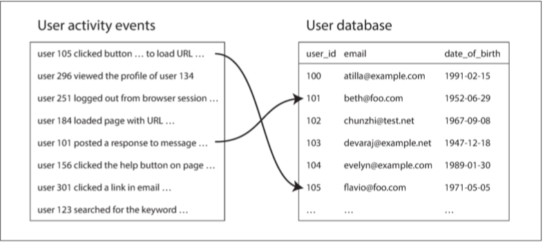

# 第十章：批處理


> 帶有太強個人色彩的系統無法成功。當最初的設計完成並且相對穩定時，不同的人們以自己的方式進行測試，真正的考驗才開始。
>
> —— 高德納

---------------

[TOC]

在本書的前兩部分中，我們討論了很多關於 **請求** 和 **查詢** 以及相應的 **響應** 或 **結果**。許多現有資料系統中都採用這種資料處理方式：你傳送請求指令，一段時間後（我們期望）系統會給出一個結果。資料庫、快取、搜尋索引、Web 伺服器以及其他一些系統都以這種方式工作。

像這樣的 **線上（online）** 系統，無論是瀏覽器請求頁面還是呼叫遠端 API 的服務，我們通常認為請求是由人類使用者觸發的，並且正在等待響應。他們不應該等太久，所以我們非常關注系統的響應時間（請參閱 “[描述效能](ch1.md#描述效能)”）。

Web 和越來越多的基於 HTTP/REST 的 API 使互動的請求 / 響應風格變得如此普遍，以至於很容易將其視為理所當然。但我們應該記住，這不是構建系統的唯一方式，其他方法也有其優點。我們來看看三種不同型別的系統：

* 服務（線上系統）

  服務等待客戶的請求或指令到達。每收到一個，服務會試圖儘快處理它，併發回一個響應。響應時間通常是服務效能的主要衡量指標，可用性通常非常重要（如果客戶端無法訪問服務，使用者可能會收到錯誤訊息）。

* 批處理系統（離線系統）

  一個批處理系統有大量的輸入資料，跑一個 **作業（job）** 來處理它，並生成一些輸出資料，這往往需要一段時間（從幾分鐘到幾天），所以通常不會有使用者等待作業完成。相反，批次作業通常會定期執行（例如，每天一次）。批處理作業的主要效能衡量標準通常是吞吐量（處理特定大小的輸入所需的時間）。本章中討論的就是批處理。

* 流處理系統（準實時系統）

  流處理介於線上和離線（批處理）之間，所以有時候被稱為 **準實時（near-real-time）** 或 **準線上（nearline）** 處理。像批處理系統一樣，流處理消費輸入併產生輸出（並不需要響應請求）。但是，流式作業在事件發生後不久就會對事件進行操作，而批處理作業則需等待固定的一組輸入資料。這種差異使流處理系統比起批處理系統具有更低的延遲。由於流處理基於批處理，我們將在 [第十一章](ch11.md) 討論它。

正如我們將在本章中看到的那樣，批處理是構建可靠、可伸縮和可維護應用程式的重要組成部分。例如，2004 年釋出的批處理演算法 Map-Reduce（可能被過分熱情地）被稱為 “造就 Google 大規模可伸縮性的演算法”【2】。隨後在各種開源資料系統中得到應用，包括 Hadoop、CouchDB 和 MongoDB。

與多年前為資料倉庫開發的並行處理系統【3,4】相比，MapReduce 是一個相當低級別的程式設計模型，但它使得在商用硬體上能進行的處理規模邁上一個新的臺階。雖然 MapReduce 的重要性正在下降【5】，但它仍然值得去理解，因為它描繪了一幅關於批處理為什麼有用，以及如何做到有用的清晰圖景。

實際上，批處理是一種非常古老的計算方式。早在可程式設計數字計算機誕生之前，打孔卡製表機（例如 1890 年美國人口普查【6】中使用的霍爾里斯機）實現了半機械化的批處理形式，從大量輸入中彙總計算。 Map-Reduce 與 1940 年代和 1950 年代廣泛用於商業資料處理的機電 IBM 卡片分類機器有著驚人的相似之處【7】。正如我們所說，歷史總是在不斷重複自己。

在本章中，我們將瞭解 MapReduce 和其他一些批處理演算法和框架，並探索它們在現代資料系統中的作用。但首先我們將看看使用標準 Unix 工具的資料處理。即使你已經熟悉了它們，Unix 的哲學也值得一讀，Unix 的思想和經驗教訓可以遷移到大規模、異構的分散式資料系統中。


## 使用Unix工具的批處理

我們從一個簡單的例子開始。假設你有一臺 Web 伺服器，每次處理請求時都會在日誌檔案中附加一行。例如，使用 nginx 預設的訪問日誌格式，日誌的一行可能如下所示：

```bash
216.58.210.78 - - [27/Feb/2015:17:55:11 +0000] "GET /css/typography.css HTTP/1.1"
200 3377 "http://martin.kleppmann.com/" "Mozilla/5.0 (Macintosh; Intel Mac OS X 10_9_5)
AppleWebKit/537.36 (KHTML, like Gecko) Chrome/40.0.2214.115 Safari/537.36"
```

（實際上這只是一行，分成多行只是為了便於閱讀。）這一行中有很多資訊。為了解釋它，你需要了解日誌格式的定義，如下所示：

```
 $remote_addr - $remote_user [$time_local] "$request"
 $status $body_bytes_sent "$http_referer" "$http_user_agent"
```

日誌的這一行表明在 2015 年 2 月 27 日 17:55:11 UTC，伺服器從客戶端 IP 地址 `216.58.210.78` 接收到對檔案 `/css/typography.css` 的請求。使用者沒有被認證，所以 `$remote_user` 被設定為連字元（`-` ）。響應狀態是 200（即請求成功），響應的大小是 3377 位元組。網頁瀏覽器是 Chrome 40，URL `http://martin.kleppmann.com/` 的頁面中的引用導致該檔案被載入。


### 簡單日誌分析

很多工具可以從這些日誌檔案生成關於網站流量的漂亮的報告，但為了練手，讓我們使用基本的 Unix 功能建立自己的工具。 例如，假設你想在你的網站上找到五個最受歡迎的網頁。 則可以在 Unix shell 中這樣做：[^i]

[^i]: 有些人認為 `cat` 這裡並沒有必要，因為輸入檔案可以直接作為 awk 的引數。 但這種寫法讓線性管道更為顯眼。

```bash
cat /var/log/nginx/access.log | #1
  awk '{print $7}' | #2
  sort             | #3
  uniq -c          | #4
  sort -r -n       | #5
  head -n 5          #6
```

1. 讀取日誌檔案
2. 將每一行按空格分割成不同的欄位，每行只輸出第七個欄位，恰好是請求的 URL。在我們的例子中是 `/css/typography.css`。
3. 按字母順序排列請求的 URL 列表。如果某個 URL 被請求過 n 次，那麼排序後，檔案將包含連續重複出現 n 次的該 URL。
4. `uniq` 命令透過檢查兩個相鄰的行是否相同來過濾掉輸入中的重複行。 `-c` 則表示還要輸出一個計數器：對於每個不同的 URL，它會報告輸入中出現該 URL 的次數。
5. 第二種排序按每行起始處的數字（`-n`）排序，這是 URL 的請求次數。然後逆序（`-r`）返回結果，大的數字在前。
6. 最後，只輸出前五行（`-n 5`），並丟棄其餘的。該系列命令的輸出如下所示：

```
    4189 /favicon.ico
    3631 /2013/05/24/improving-security-of-ssh-private-keys.html
    2124 /2012/12/05/schema-evolution-in-avro-protocol-buffers-thrift.html
    1369 /
     915 /css/typography.css
```

如果你不熟悉 Unix 工具，上面的命令列可能看起來有點吃力，但是它非常強大。它能在幾秒鐘內處理幾 GB 的日誌檔案，並且你可以根據需要輕鬆修改命令。例如，如果要從報告中省略 CSS 檔案，可以將 awk 引數更改為 `'$7 !~ /\.css$/ {print $7}'`, 如果想統計最多的客戶端 IP 地址，可以把 awk 引數改為 `'{print $1}'` 等等。

我們不會在這裡詳細探索 Unix 工具，但是它非常值得學習。令人驚訝的是，使用 awk、sed、grep、sort、uniq 和 xargs 的組合，可以在幾分鐘內完成許多資料分析，並且它們的效能相當的好【8】。

#### 命令鏈與自定義程式

除了 Unix 命令鏈，你還可以寫一個簡單的程式來做同樣的事情。例如在 Ruby 中，它可能看起來像這樣：

```ruby
counts = Hash.new(0)         # 1
File.open('/var/log/nginx/access.log') do |file|
    file.each do |line|
        url = line.split[6]  # 2
        counts[url] += 1     # 3
    end
end

top5 = counts.map{|url, count| [count, url] }.sort.reverse[0...5] # 4
top5.each{|count, url| puts "#{count} #{url}" }                   # 5
```

1. `counts` 是一個儲存計數器的雜湊表，儲存了每個 URL 被瀏覽的次數，預設為 0。
2. 逐行讀取日誌，抽取每行第七個被空格分隔的欄位為 URL（這裡的陣列索引是 6，因為 Ruby 的陣列索引從 0 開始計數）
3. 將日誌當前行中 URL 對應的計數器值加一。
4. 按計數器值（降序）對雜湊表內容進行排序，並取前五位。
5. 打印出前五個條目。

這個程式並不像 Unix 管道那樣簡潔，但是它的可讀性很強，喜歡哪一種屬於口味的問題。但兩者除了表面上的差異之外，執行流程也有很大差異，如果你在大檔案上執行此分析，則會變得明顯。

#### 排序 VS 記憶體中的聚合

Ruby 指令碼在記憶體中儲存了一個 URL 的雜湊表，將每個 URL 對映到它出現的次數。 Unix 管道沒有這樣的雜湊表，而是依賴於對 URL 列表的排序，在這個 URL 列表中，同一個 URL 的只是簡單地重複出現。

哪種方法更好？這取決於你有多少個不同的 URL。對於大多數中小型網站，你可能可以為所有不同網址提供一個計數器（假設我們使用 1GB 記憶體）。在此例中，作業的 **工作集**（working set，即作業需要隨機訪問的記憶體大小）僅取決於不同 URL 的數量：如果日誌中只有單個 URL，重複出現一百萬次，則散列表所需的空間表就只有一個 URL 加上一個計數器的大小。當工作集足夠小時，記憶體散列表表現良好，甚至在效能較差的膝上型電腦上也可以正常工作。

另一方面，如果作業的工作集大於可用記憶體，則排序方法的優點是可以高效地使用磁碟。這與我們在 “[SSTables 和 LSM 樹](ch3.md#SSTables和LSM樹)” 中討論過的原理是一樣的：資料塊可以在記憶體中排序並作為段檔案寫入磁碟，然後多個排序好的段可以合併為一個更大的排序檔案。 歸併排序具有在磁碟上執行良好的順序訪問模式。 （請記住，針對順序 I/O 進行最佳化是 [第三章](ch3.md) 中反覆出現的主題，相同的模式在此重現）

GNU Coreutils（Linux）中的 `sort` 程式透過溢位至磁碟的方式來自動應對大於記憶體的資料集，並能同時使用多個 CPU 核進行並行排序【9】。這意味著我們之前看到的簡單的 Unix 命令鏈很容易伸縮至大資料集，且不會耗盡記憶體。瓶頸可能是從磁碟讀取輸入檔案的速度。


### Unix哲學

我們可以非常容易地使用前一個例子中的一系列命令來分析日誌檔案，這並非巧合：事實上，這實際上是 Unix 的關鍵設計思想之一，而且它直至今天也仍然令人訝異地重要。讓我們更深入地研究一下，以便從 Unix 中借鑑一些想法【10】。

Unix 管道的發明者道格・麥克羅伊（Doug McIlroy）在 1964 年首先描述了這種情況【11】：“我們需要一種類似園藝膠管的方式來拼接程式 —— 當我們需要將訊息從一個程式傳遞另一個程式時，直接接上去就行。I/O 應該也按照這種方式進行 “。水管的類比仍然在生效，透過管道連線程式的想法成為了現在被稱為 **Unix 哲學** 的一部分 —— 這一組設計原則在 Unix 使用者與開發者之間流行起來，該哲學在 1978 年表述如下【12,13】：

1. 讓每個程式都做好一件事。要做一件新的工作，寫一個新程式，而不是透過新增 “功能” 讓老程式複雜化。
2. 期待每個程式的輸出成為另一個程式的輸入。不要將無關資訊混入輸出。避免使用嚴格的列資料或二進位制輸入格式。不要堅持互動式輸入。
3. 設計和構建軟體時，即使是作業系統，也讓它們能夠儘早地被試用，最好在幾周內完成。不要猶豫，扔掉笨拙的部分，重建它們。
4. 優先使用工具來減輕程式設計任務，即使必須曲線救國編寫工具，且在用完後很可能要扔掉大部分。

這種方法 —— 自動化，快速原型設計，增量式迭代，對實驗友好，將大型專案分解成可管理的塊 —— 聽起來非常像今天的敏捷開發和 DevOps 運動。奇怪的是，四十年來變化不大。

`sort` 工具是一個很好的例子。可以說它比大多數程式語言標準庫中的實現（它們不會利用磁碟或使用多執行緒，即使這樣做有很大好處）要更好。然而，單獨使用 `sort` 幾乎沒什麼用。它只能與其他 Unix 工具（如 `uniq`）結合使用。

像 `bash` 這樣的 Unix shell 可以讓我們輕鬆地將這些小程式組合成令人訝異的強大資料處理任務。儘管這些程式中有很多是由不同人群編寫的，但它們可以靈活地結合在一起。 Unix 如何實現這種可組合性？

#### 統一的介面

如果你希望一個程式的輸出成為另一個程式的輸入，那意味著這些程式必須使用相同的資料格式 —— 換句話說，一個相容的介面。如果你希望能夠將任何程式的輸出連線到任何程式的輸入，那意味著所有程式必須使用相同的 I/O 介面。

在 Unix 中，這種介面是一個 **檔案**（file，更準確地說，是一個檔案描述符）。一個檔案只是一串有序的位元組序列。因為這是一個非常簡單的介面，所以可以使用相同的介面來表示許多不同的東西：檔案系統上的真實檔案，到另一個程序（Unix 套接字，stdin，stdout）的通訊通道，裝置驅動程式（比如 `/dev/audio` 或 `/dev/lp0`），表示 TCP 連線的套接字等等。很容易將這些設計視為理所當然的，但實際上能讓這些差異巨大的東西共享一個統一的介面是非常厲害的，這使得它們可以很容易地連線在一起 [^ii]。

[^ii]: 統一介面的另一個例子是 URL 和 HTTP，這是 Web 的基石。 一個 URL 標識一個網站上的一個特定的東西（資源），你可以連結到任何其他網站的任何網址。 具有網路瀏覽器的使用者因此可以透過跟隨連結在網站之間無縫跳轉，即使伺服器可能由完全不相關的組織維護。 這個原則現在似乎非常明顯，但它卻是網路取能取得今天成就的關鍵。 之前的系統並不是那麼統一：例如，在公告板系統（BBS）時代，每個系統都有自己的電話號碼和波特率配置。 從一個 BBS 到另一個 BBS 的引用必須以電話號碼和調變解調器設定的形式；使用者將不得不掛斷，撥打其他 BBS，然後手動找到他們正在尋找的資訊。 直接連結到另一個 BBS 內的一些內容當時是不可能的。

按照慣例，許多（但不是全部）Unix 程式將這個位元組序列視為 ASCII 文字。我們的日誌分析示例使用了這個事實：`awk`、`sort`、`uniq` 和 `head` 都將它們的輸入檔案視為由 `\n`（換行符，ASCII `0x0A`）字元分隔的記錄列表。`\n` 的選擇是任意的 —— 可以說，ASCII 記錄分隔符 `0x1E` 本來就是一個更好的選擇，因為它是為了這個目的而設計的【14】，但是無論如何，所有這些程式都使用相同的記錄分隔符允許它們互操作。

每條記錄（即一行輸入）的解析則更加模糊。 Unix 工具通常透過空白或製表符將行分割成欄位，但也使用 CSV（逗號分隔），管道分隔和其他編碼。即使像 `xargs` 這樣一個相當簡單的工具也有六個命令列選項，用於指定如何解析輸入。

ASCII 文字的統一介面大多數時候都能工作，但它不是很優雅：我們的日誌分析示例使用 `{print $7}` 來提取網址，這樣可讀性不是很好。在理想的世界中可能是 `{print $request_url}` 或類似的東西。我們稍後會回顧這個想法。

儘管幾十年後還不夠完美，但統一的 Unix 介面仍然是非常出色的設計。沒有多少軟體能像 Unix 工具一樣互動組合的這麼好：你不能透過自定義分析工具輕鬆地將電子郵件帳戶的內容和線上購物歷史記錄以管道傳送至電子表格中，並將結果釋出到社交網路或維基。今天，像 Unix 工具一樣流暢地執行程式是一種例外，而不是規範。

即使是具有 **相同資料模型** 的資料庫，將資料從一種資料庫匯出再匯入到另一種資料庫也並不容易。缺乏整合導致了資料的 **巴爾幹化**[^譯註i]。

[^譯註i]: **巴爾幹化（Balkanization）** 是一個常帶有貶義的地緣政治學術語，其定義為：一個國家或政區分裂成多個互相敵對的國家或政區的過程。


#### 邏輯與佈線相分離

Unix 工具的另一個特點是使用標準輸入（`stdin`）和標準輸出（`stdout`）。如果你執行一個程式，而不指定任何其他的東西，標準輸入來自鍵盤，標準輸出指向螢幕。但是，你也可以從檔案輸入和 / 或將輸出重定向到檔案。管道允許你將一個程序的標準輸出附加到另一個程序的標準輸入（有個小記憶體緩衝區，而不需要將整個中間資料流寫入磁碟）。

如果需要，程式仍然可以直接讀取和寫入檔案，但 Unix 方法在程式不關心特定的檔案路徑、只使用標準輸入和標準輸出時效果最好。這允許 shell 使用者以任何他們想要的方式連線輸入和輸出；該程式不知道或不關心輸入來自哪裡以及輸出到哪裡。 （人們可以說這是一種 **松耦合（loose coupling）**，**晚期繫結（late binding）**【15】或 **控制反轉（inversion of control）**【16】）。將輸入 / 輸出佈線與程式邏輯分開，可以將小工具組合成更大的系統。

你甚至可以編寫自己的程式，並將它們與作業系統提供的工具組合在一起。你的程式只需要從標準輸入讀取輸入，並將輸出寫入標準輸出，它就可以加入資料處理的管道中。在日誌分析示例中，你可以編寫一個將 Usage-Agent 字串轉換為更靈敏的瀏覽器識別符號，或者將 IP 地址轉換為國家程式碼的工具，並將其插入管道。`sort` 程式並不關心它是否與作業系統的另一部分或者你寫的程式通訊。

但是，使用 `stdin` 和 `stdout` 能做的事情是有限的。需要多個輸入或輸出的程式雖然可能，卻非常棘手。你沒法將程式的輸出管道連線至網路連線中【17,18】[^iii] 。如果程式直接開啟檔案進行讀取和寫入，或者將另一個程式作為子程序啟動，或者開啟網路連線，那麼 I/O 的佈線就取決於程式本身了。它仍然可以被配置（例如透過命令列選項），但在 Shell 中對輸入和輸出進行佈線的靈活性就少了。

[^iii]: 除了使用一個單獨的工具，如 `netcat` 或 `curl`。 Unix 起初試圖將所有東西都表示為檔案，但是 BSD 套接字 API 偏離了這個慣例【17】。研究用作業系統 Plan 9 和 Inferno 在使用檔案方面更加一致：它們將 TCP 連線表示為 `/net/tcp` 中的檔案【18】。


#### 透明度和實驗

使 Unix 工具如此成功的部分原因是，它們使檢視正在發生的事情變得非常容易：

- Unix 命令的輸入檔案通常被視為不可變的。這意味著你可以隨意執行命令，嘗試各種命令列選項，而不會損壞輸入檔案。
- 你可以在任何時候結束管道，將管道輸出到 `less`，然後檢視它是否具有預期的形式。這種檢查能力對除錯非常有用。
- 你可以將一個流水線階段的輸出寫入檔案，並將該檔案用作下一階段的輸入。這使你可以重新啟動後面的階段，而無需重新執行整個管道。

因此，與關係資料庫的查詢最佳化器相比，即使 Unix 工具非常簡單，但仍然非常有用，特別是對於實驗而言。

然而，Unix 工具的最大侷限在於它們只能在一臺機器上執行 —— 而 Hadoop 這樣的工具即應運而生。


## MapReduce和分散式檔案系統

MapReduce 有點像 Unix 工具，但分佈在數千臺機器上。像 Unix 工具一樣，它相當簡單粗暴，但令人驚異地管用。一個 MapReduce 作業可以和一個 Unix 程序相類比：它接受一個或多個輸入，併產生一個或多個輸出。

和大多數 Unix 工具一樣，執行 MapReduce 作業通常不會修改輸入，除了生成輸出外沒有任何副作用。輸出檔案以連續的方式一次性寫入（一旦寫入檔案，不會修改任何現有的檔案部分）。

雖然 Unix 工具使用 `stdin` 和 `stdout` 作為輸入和輸出，但 MapReduce 作業在分散式檔案系統上讀寫檔案。在 Hadoop 的 MapReduce 實現中，該檔案系統被稱為 **HDFS（Hadoop 分散式檔案系統）**，一個 Google 檔案系統（GFS）的開源實現【19】。

除 HDFS 外，還有各種其他分散式檔案系統，如 GlusterFS 和 Quantcast File System（QFS）【20】。諸如 Amazon S3，Azure Blob 儲存和 OpenStack Swift【21】等物件儲存服務在很多方面都是相似的 [^iv]。在本章中，我們將主要使用 HDFS 作為示例，但是這些原則適用於任何分散式檔案系統。

[^iv]: 一個不同之處在於，對於 HDFS，可以將計算任務安排在儲存特定檔案副本的計算機上執行，而物件儲存通常將儲存和計算分開。如果網路頻寬是一個瓶頸，從本地磁碟讀取有效能優勢。但是請注意，如果使用糾刪碼（Erasure Coding），則會丟失區域性，因為來自多臺機器的資料必須進行合併以重建原始檔案【20】。

與網路連線儲存（NAS）和儲存區域網路（SAN）架構的共享磁碟方法相比，HDFS 基於 **無共享** 原則（請參閱 [第二部分](part-ii.md) 的介紹）。共享磁碟儲存由集中式儲存裝置實現，通常使用定製硬體和專用網路基礎設施（如光纖通道）。而另一方面，無共享方法不需要特殊的硬體，只需要透過傳統資料中心網路連線的計算機。

HDFS 在每臺機器上運行了一個守護程序，它對外暴露網路服務，允許其他節點訪問儲存在該機器上的檔案（假設資料中心中的每臺通用計算機都掛載著一些磁碟）。名為 **NameNode** 的中央伺服器會跟蹤哪個檔案塊儲存在哪臺機器上。因此，HDFS 在概念上建立了一個大型檔案系統，可以使用所有執行有守護程序的機器的磁碟。

為了容忍機器和磁碟故障，檔案塊被複制到多臺機器上。複製可能意味著多個機器上的相同資料的多個副本，如 [第五章](ch5.md) 中所述，或者諸如 Reed-Solomon 碼這樣的糾刪碼方案，它能以比完全複製更低的儲存開銷來支援恢復丟失的資料【20,22】。這些技術與 RAID 相似，後者可以在連線到同一臺機器的多個磁碟上提供冗餘；區別在於在分散式檔案系統中，檔案訪問和複製是在傳統的資料中心網路上完成的，沒有特殊的硬體。

HDFS 的可伸縮性已經很不錯了：在撰寫本書時，最大的 HDFS 部署執行在上萬臺機器上，總儲存容量達數百 PB【23】。如此大的規模已經變得可行，因為使用商品硬體和開源軟體的 HDFS 上的資料儲存和訪問成本遠低於在專用儲存裝置上支援同等容量的成本【24】。

### MapReduce作業執行

MapReduce 是一個程式設計框架，你可以使用它編寫程式碼來處理 HDFS 等分散式檔案系統中的大型資料集。理解它的最簡單方法是參考 “[簡單日誌分析](#簡單日誌分析)” 中的 Web 伺服器日誌分析示例。MapReduce 中的資料處理模式與此示例非常相似：

1. 讀取一組輸入檔案，並將其分解成 **記錄（records）**。在 Web 伺服器日誌示例中，每條記錄都是日誌中的一行（即 `\n` 是記錄分隔符）。
2. 呼叫 Mapper 函式，從每條輸入記錄中提取一對鍵值。在前面的例子中，Mapper 函式是 `awk '{print $7}'`：它提取 URL（`$7`）作為鍵，並將值留空。
3. 按鍵排序所有的鍵值對。在日誌的例子中，這由第一個 `sort` 命令完成。
4. 呼叫 Reducer 函式遍歷排序後的鍵值對。如果同一個鍵出現多次，排序使它們在列表中相鄰，所以很容易組合這些值而不必在記憶體中保留很多狀態。在前面的例子中，Reducer 是由 `uniq -c` 命令實現的，該命令使用相同的鍵來統計相鄰記錄的數量。

這四個步驟可以作為一個 MapReduce 作業執行。步驟 2（Map）和 4（Reduce）是你編寫自定義資料處理程式碼的地方。步驟 1（將檔案分解成記錄）由輸入格式解析器處理。步驟 3 中的排序步驟隱含在 MapReduce 中 —— 你不必編寫它，因為 Mapper 的輸出始終在送往 Reducer 之前進行排序。

要建立 MapReduce 作業，你需要實現兩個回撥函式，Mapper 和 Reducer，其行為如下（請參閱 “[MapReduce 查詢](ch2.md#MapReduce查詢)”）：

* Mapper

  Mapper 會在每條輸入記錄上呼叫一次，其工作是從輸入記錄中提取鍵值。對於每個輸入，它可以生成任意數量的鍵值對（包括 None）。它不會保留從一個輸入記錄到下一個記錄的任何狀態，因此每個記錄都是獨立處理的。

* Reducer

  MapReduce 框架拉取由 Mapper 生成的鍵值對，收集屬於同一個鍵的所有值，並在這組值上迭代呼叫 Reducer。 Reducer 可以產生輸出記錄（例如相同 URL 的出現次數）。

在 Web 伺服器日誌的例子中，我們在第 5 步中有第二個 `sort` 命令，它按請求數對 URL 進行排序。在 MapReduce 中，如果你需要第二個排序階段，則可以透過編寫第二個 MapReduce 作業並將第一個作業的輸出用作第二個作業的輸入來實現它。這樣看來，Mapper 的作用是將資料放入一個適合排序的表單中，並且 Reducer 的作用是處理已排序的資料。

#### 分散式執行MapReduce

MapReduce 與 Unix 命令管道的主要區別在於，MapReduce 可以在多臺機器上並行執行計算，而無需編寫程式碼來顯式處理並行問題。Mapper 和 Reducer 一次只能處理一條記錄；它們不需要知道它們的輸入來自哪裡，或者輸出去往什麼地方，所以框架可以處理在機器之間移動資料的複雜性。

在分散式計算中可以使用標準的 Unix 工具作為 Mapper 和 Reducer【25】，但更常見的是，它們被實現為傳統程式語言的函式。在 Hadoop MapReduce 中，Mapper 和 Reducer 都是實現特定介面的 Java 類。在 MongoDB 和 CouchDB 中，Mapper 和 Reducer 都是 JavaScript 函式（請參閱 “[MapReduce 查詢](ch2.md#MapReduce查詢)”）。

[圖 10-1](../img/fig10-1.png) 顯示了 Hadoop MapReduce 作業中的資料流。其並行化基於分割槽（請參閱 [第六章](ch6.md)）：作業的輸入通常是 HDFS 中的一個目錄，輸入目錄中的每個檔案或檔案塊都被認為是一個單獨的分割槽，可以單獨處理 map 任務（[圖 10-1](../img/fig10-1.png) 中的 m1，m2 和 m3 標記）。

每個輸入檔案的大小通常是數百兆位元組。 MapReduce 排程器（圖中未顯示）試圖在其中一臺儲存輸入檔案副本的機器上執行每個 Mapper，只要該機器有足夠的備用 RAM 和 CPU 資源來執行 Mapper 任務【26】。這個原則被稱為 **將計算放在資料附近**【27】：它節省了透過網路複製輸入檔案的開銷，減少網路負載並增加區域性。


**圖 10-1 具有三個 Mapper 和三個 Reducer 的 MapReduce 任務**

在大多數情況下，應該在 Mapper 任務中執行的應用程式碼在將要執行它的機器上還不存在，所以 MapReduce 框架首先將程式碼（例如 Java 程式中的 JAR 檔案）複製到適當的機器。然後啟動 Map 任務並開始讀取輸入檔案，一次將一條記錄傳入 Mapper 回撥函式。Mapper 的輸出由鍵值對組成。

計算的 Reduce 端也被分割槽。雖然 Map 任務的數量由輸入檔案塊的數量決定，但 Reducer 的任務的數量是由作業作者配置的（它可以不同於 Map 任務的數量）。為了確保具有相同鍵的所有鍵值對最終落在相同的 Reducer 處，框架使用鍵的雜湊值來確定哪個 Reduce 任務應該接收到特定的鍵值對（請參閱 “[根據鍵的雜湊分割槽](ch6.md#根據鍵的雜湊分割槽)”）。

鍵值對必須進行排序，但資料集可能太大，無法在單臺機器上使用常規排序演算法進行排序。相反，分類是分階段進行的。首先每個 Map 任務都按照 Reducer 對輸出進行分割槽。每個分割槽都被寫入 Mapper 程式的本地磁碟，使用的技術與我們在 “[SSTables 與 LSM 樹](ch3.md#SSTables和LSM樹)” 中討論的類似。

只要當 Mapper 讀取完輸入檔案，並寫完排序後的輸出檔案，MapReduce 排程器就會通知 Reducer 可以從該 Mapper 開始獲取輸出檔案。Reducer 連線到每個 Mapper，並下載自己相應分割槽的有序鍵值對檔案。按 Reducer 分割槽，排序，從 Mapper 向 Reducer 複製分割槽資料，這一整個過程被稱為 **混洗（shuffle）**【26】（一個容易混淆的術語  —— 不像洗牌，在 MapReduce 中的混洗沒有隨機性）。

Reduce 任務從 Mapper 獲取檔案，並將它們合併在一起，並保留有序特性。因此，如果不同的 Mapper 生成了鍵相同的記錄，則在 Reducer 的輸入中，這些記錄將會相鄰。

Reducer 呼叫時會收到一個鍵，和一個迭代器作為引數，迭代器會順序地掃過所有具有該鍵的記錄（因為在某些情況可能無法完全放入記憶體中）。Reducer 可以使用任意邏輯來處理這些記錄，並且可以生成任意數量的輸出記錄。這些輸出記錄會寫入分散式檔案系統上的檔案中（通常是在跑 Reducer 的機器本地磁碟上留一份，並在其他機器上留幾份副本）。

#### MapReduce工作流

單個 MapReduce 作業可以解決的問題範圍很有限。以日誌分析為例，單個 MapReduce 作業可以確定每個 URL 的頁面瀏覽次數，但無法確定最常見的 URL，因為這需要第二輪排序。

因此將 MapReduce 作業連結成為 **工作流（workflow）** 中是極為常見的，例如，一個作業的輸出成為下一個作業的輸入。Hadoop MapReduce 框架對工作流沒有特殊支援，所以這個鏈是透過目錄名隱式實現的：第一個作業必須將其輸出配置為 HDFS 中的指定目錄，第二個作業必須將其輸入配置為從同一個目錄。從 MapReduce 框架的角度來看，這是兩個獨立的作業。

因此，被連結的 MapReduce 作業並沒有那麼像 Unix 命令管道（它直接將一個程序的輸出作為另一個程序的輸入，僅用一個很小的記憶體緩衝區）。它更像是一系列命令，其中每個命令的輸出寫入臨時檔案，下一個命令從臨時檔案中讀取。這種設計有利也有弊，我們將在 “[物化中間狀態](#物化中間狀態)” 中討論。

只有當作業成功完成後，批處理作業的輸出才會被視為有效的（MapReduce 會丟棄失敗作業的部分輸出）。因此，工作流中的一項作業只有在先前的作業 —— 即生產其輸入的作業 —— 成功完成後才能開始。為了處理這些作業之間的依賴，有很多針對 Hadoop 的工作流排程器被開發出來，包括 Oozie、Azkaban、Luigi、Airflow 和 Pinball 【28】。

這些排程程式還具有管理功能，在維護大量批處理作業時非常有用。在構建推薦系統時，由 50 到 100 個 MapReduce 作業組成的工作流是常見的【29】。而在大型組織中，許多不同的團隊可能執行不同的作業來讀取彼此的輸出。工具支援對於管理這樣複雜的資料流而言非常重要。

Hadoop 的各種高階工具（如 Pig 【30】、Hive 【31】、Cascading 【32】、Crunch 【33】和 FlumeJava 【34】）也能自動佈線組裝多個 MapReduce 階段，生成合適的工作流。

### Reduce側連線與分組

我們在 [第二章](ch2.md) 中討論了資料模型和查詢語言的連線，但是我們還沒有深入探討連線是如何實現的。現在是我們再次撿起這條線索的時候了。

在許多資料集中，一條記錄與另一條記錄存在關聯是很常見的：關係模型中的 **外來鍵**，文件模型中的 **文件引用** 或圖模型中的 **邊**。當你需要同時訪問這一關聯的兩側（持有引用的記錄與被引用的記錄）時，連線就是必須的。正如 [第二章](ch2.md) 所討論的，非規範化可以減少對連線的需求，但通常無法將其完全移除 [^v]。

[^v]: 我們在本書中討論的連線通常是等值連線，即最常見的連線型別，其中記錄透過與其他記錄在特定欄位（例如 ID）中具有 **相同值** 相關聯。有些資料庫支援更通用的連線型別，例如使用小於運算子而不是等號運算子，但是我們沒有地方來講這些東西。

在資料庫中，如果執行只涉及少量記錄的查詢，資料庫通常會使用 **索引** 來快速定位感興趣的記錄（請參閱 [第三章](ch3.md)）。如果查詢涉及到連線，則可能涉及到查詢多個索引。然而 MapReduce 沒有索引的概念 —— 至少在通常意義上沒有。

當 MapReduce 作業被賦予一組檔案作為輸入時，它讀取所有這些檔案的全部內容；資料庫會將這種操作稱為 **全表掃描**。如果你只想讀取少量的記錄，則全表掃描與索引查詢相比，代價非常高昂。但是在分析查詢中（請參閱 “[事務處理還是分析？](ch3.md#事務處理還是分析？)”），通常需要計算大量記錄的聚合。在這種情況下，特別是如果能在多臺機器上並行處理時，掃描整個輸入可能是相當合理的事情。

當我們在批處理的語境中討論連線時，我們指的是在資料集中解析某種關聯的全量存在。 例如我們假設一個作業是同時處理所有使用者的資料，而非僅僅是為某個特定使用者查詢資料（而這能透過索引更高效地完成）。

#### 示例：使用者活動事件分析

[圖 10-2](../img/fig10-2.png) 給出了一個批處理作業中連線的典型例子。左側是事件日誌，描述登入使用者在網站上做的事情（稱為 **活動事件**，即 activity events，或 **點選流資料**，即 clickstream data），右側是使用者資料庫。 你可以將此示例看作是星型模式的一部分（請參閱 “[星型和雪花型：分析的模式](ch3.md#星型和雪花型：分析的模式)”）：事件日誌是事實表，使用者資料庫是其中的一個維度。



**圖 10-2 使用者行為日誌與使用者檔案的連線**

分析任務可能需要將使用者活動與使用者檔案資訊相關聯：例如，如果檔案包含使用者的年齡或出生日期，系統就可以確定哪些頁面更受哪些年齡段的使用者歡迎。然而活動事件僅包含使用者 ID，而沒有包含完整的使用者檔案資訊。在每個活動事件中嵌入這些檔案資訊很可能會非常浪費。因此，活動事件需要與使用者檔案資料庫相連線。

實現這一連線的最簡單方法是，逐個遍歷活動事件，併為每個遇到的使用者 ID 查詢使用者資料庫（在遠端伺服器上）。這是可能的，但是它的效能可能會非常差：處理吞吐量將受限於受資料庫伺服器的往返時間，本地快取的有效性很大程度上取決於資料的分佈，並行執行大量查詢可能會輕易壓垮資料庫【35】。

為了在批處理過程中實現良好的吞吐量，計算必須（儘可能）限於單臺機器上進行。為待處理的每條記錄發起隨機訪問的網路請求實在是太慢了。而且，查詢遠端資料庫意味著批處理作業變為 **非確定的（nondeterministic）**，因為遠端資料庫中的資料可能會改變。

因此，更好的方法是獲取使用者資料庫的副本（例如，使用 ETL 程序從資料庫備份中提取資料，請參閱 “[資料倉庫](ch3.md#資料倉庫)”），並將它和使用者行為日誌放入同一個分散式檔案系統中。然後你可以將使用者資料庫儲存在 HDFS 中的一組檔案中，而使用者活動記錄儲存在另一組檔案中，並能用 MapReduce 將所有相關記錄集中到同一個地方進行高效處理。

#### 排序合併連線

回想一下，Mapper 的目的是從每個輸入記錄中提取一對鍵值。在 [圖 10-2](../img/fig10-2.png) 的情況下，這個鍵就是使用者 ID：一組 Mapper 會掃過活動事件（提取使用者 ID 作為鍵，活動事件作為值），而另一組 Mapper 將會掃過使用者資料庫（提取使用者 ID 作為鍵，使用者的出生日期作為值）。這個過程如 [圖 10-3](../img/fig10-3.png) 所示。


**圖 10-3 在使用者 ID 上進行的 Reduce 端連線。如果輸入資料集分割槽為多個檔案，則每個分割槽都會被多個 Mapper 並行處理**

當 MapReduce 框架透過鍵對 Mapper 輸出進行分割槽，然後對鍵值對進行排序時，效果是具有相同 ID 的所有活動事件和使用者記錄在 Reducer 輸入中彼此相鄰。 Map-Reduce 作業甚至可以也讓這些記錄排序，使 Reducer 總能先看到來自使用者資料庫的記錄，緊接著是按時間戳順序排序的活動事件 ——  這種技術被稱為 **二次排序（secondary sort）**【26】。

然後 Reducer 可以容易地執行實際的連線邏輯：每個使用者 ID 都會被呼叫一次 Reducer 函式，且因為二次排序，第一個值應該是來自使用者資料庫的出生日期記錄。 Reducer 將出生日期儲存在區域性變數中，然後使用相同的使用者 ID 遍歷活動事件，輸出 **已觀看網址** 和 **觀看者年齡** 的結果對。隨後的 Map-Reduce 作業可以計算每個 URL 的檢視者年齡分佈，並按年齡段進行聚集。

由於 Reducer 一次處理一個特定使用者 ID 的所有記錄，因此一次只需要將一條使用者記錄儲存在記憶體中，而不需要透過網路發出任何請求。這個演算法被稱為 **排序合併連線（sort-merge join）**，因為 Mapper 的輸出是按鍵排序的，然後 Reducer 將來自連線兩側的有序記錄列表合併在一起。

#### 把相關資料放在一起

在排序合併連線中，Mapper 和排序過程確保了所有對特定使用者 ID 執行連線操作的必須資料都被放在同一個地方：單次呼叫 Reducer 的地方。預先排好了所有需要的資料，Reducer 可以是相當簡單的單執行緒程式碼，能夠以高吞吐量和與低記憶體開銷掃過這些記錄。

這種架構可以看做，Mapper 將 “訊息” 傳送給 Reducer。當一個 Mapper 發出一個鍵值對時，這個鍵的作用就像值應該傳遞到的目標地址。即使鍵只是一個任意的字串（不是像 IP 地址和埠號那樣的實際的網路地址），它表現的就像一個地址：所有具有相同鍵的鍵值對將被傳遞到相同的目標（一次 Reducer 的呼叫）。

使用 MapReduce 程式設計模型，能將計算的物理網路通訊層面（從正確的機器獲取資料）從應用邏輯中剝離出來（獲取資料後執行處理）。這種分離與資料庫的典型用法形成了鮮明對比，從資料庫中獲取資料的請求經常出現在應用程式碼內部【36】。由於 MapReduce 處理了所有的網路通訊，因此它也避免了讓應用程式碼去擔心部分故障，例如另一個節點的崩潰：MapReduce 在不影響應用邏輯的情況下能透明地重試失敗的任務。

#### 分組

除了連線之外，“把相關資料放在一起” 的另一種常見模式是，按某個鍵對記錄分組（如 SQL 中的 GROUP BY 子句）。所有帶有相同鍵的記錄構成一個組，而下一步往往是在每個組內進行某種聚合操作，例如：

- 統計每個組中記錄的數量（例如在統計 PV 的例子中，在 SQL 中表示為 `COUNT(*)` 聚合）
- 對某個特定欄位求和（SQL 中的 `SUM(fieldname)`）
- 按某種分級函式取出排名前 k 條記錄。

使用 MapReduce 實現這種分組操作的最簡單方法是設定 Mapper，以便它們生成的鍵值對使用所需的分組鍵。然後分割槽和排序過程將所有具有相同分割槽鍵的記錄導向同一個 Reducer。因此在 MapReduce 之上實現分組和連線看上去非常相似。

分組的另一個常見用途是整理特定使用者會話的所有活動事件，以找出使用者進行的一系列操作（稱為 **會話化（sessionization）**【37】）。例如，可以使用這種分析來確定顯示新版網站的使用者是否比那些顯示舊版本的使用者更有購買慾（A/B 測試），或者計算某個營銷活動是否值得。

如果你有多個 Web 伺服器處理使用者請求，則特定使用者的活動事件很可能分散在各個不同的伺服器的日誌檔案中。你可以透過使用會話 cookie，使用者 ID 或類似的識別符號作為分組鍵，以將特定使用者的所有活動事件放在一起來實現會話化，與此同時，不同使用者的事件仍然散佈在不同的分割槽中。

#### 處理偏斜

如果存在與單個鍵關聯的大量資料，則 “將具有相同鍵的所有記錄放到相同的位置” 這種模式就被破壞了。例如在社交網路中，大多數使用者可能會與幾百人有連線，但少數名人可能有數百萬的追隨者。這種不成比例的活動資料庫記錄被稱為 **關鍵物件（linchpin object）**【38】或 **熱鍵（hot key）**。

在單個 Reducer 中收集與某個名人相關的所有活動（例如他們釋出內容的回覆）可能導致嚴重的 **偏斜**（也稱為 **熱點**，即 hot spot）—— 也就是說，一個 Reducer 必須比其他 Reducer 處理更多的記錄（請參閱 “[負載偏斜與熱點消除](ch6.md#負載偏斜與熱點消除)“）。由於 MapReduce 作業只有在所有 Mapper 和 Reducer 都完成時才完成，所有後續作業必須等待最慢的 Reducer 才能啟動。

如果連線的輸入存在熱鍵，可以使用一些演算法進行補償。例如，Pig 中的 **偏斜連線（skewed join）** 方法首先執行一個抽樣作業（Sampling Job）來確定哪些鍵是熱鍵【39】。連線實際執行時，Mapper 會將熱鍵的關聯記錄 **隨機**（相對於傳統 MapReduce 基於鍵雜湊的確定性方法）傳送到幾個 Reducer 之一。對於另外一側的連線輸入，與熱鍵相關的記錄需要被複制到 **所有** 處理該鍵的 Reducer 上【40】。

這種技術將處理熱鍵的工作分散到多個 Reducer 上，這樣可以使其更好地並行化，代價是需要將連線另一側的輸入記錄複製到多個 Reducer 上。 Crunch 中的 **分片連線（sharded join）** 方法與之類似，但需要顯式指定熱鍵而不是使用抽樣作業。這種技術也非常類似於我們在 “[負載偏斜與熱點消除](ch6.md#負載偏斜與熱點消除)” 中討論的技術，使用隨機化來緩解分割槽資料庫中的熱點。

Hive 的偏斜連線最佳化採取了另一種方法。它需要在表格元資料中顯式指定熱鍵，並將與這些鍵相關的記錄單獨存放，與其它檔案分開。當在該表上執行連線時，對於熱鍵，它會使用 Map 端連線（請參閱下一節）。

當按照熱鍵進行分組並聚合時，可以將分組分兩個階段進行。第一個 MapReduce 階段將記錄傳送到隨機 Reducer，以便每個 Reducer 只對熱鍵的子集執行分組，為每個鍵輸出一個更緊湊的中間聚合結果。然後第二個 MapReduce 作業將所有來自第一階段 Reducer 的中間聚合結果合併為每個鍵一個值。


### Map側連線

上一節描述的連線演算法在 Reducer 中執行實際的連線邏輯，因此被稱為 Reduce 側連線。Mapper 扮演著預處理輸入資料的角色：從每個輸入記錄中提取鍵值，將鍵值對分配給 Reducer 分割槽，並按鍵排序。

Reduce 側方法的優點是不需要對輸入資料做任何假設：無論其屬性和結構如何，Mapper 都可以對其預處理以備連線。然而不利的一面是，排序，複製至 Reducer，以及合併 Reducer 輸入，所有這些操作可能開銷巨大。當資料透過 MapReduce 階段時，資料可能需要落盤好幾次，取決於可用的記憶體緩衝區【37】。

另一方面，如果你 **能** 對輸入資料作出某些假設，則透過使用所謂的 Map 側連線來加快連線速度是可行的。這種方法使用了一個裁減掉 Reducer 與排序的 MapReduce 作業，每個 Mapper 只是簡單地從分散式檔案系統中讀取一個輸入檔案塊，然後將輸出檔案寫入檔案系統，僅此而已。

#### 廣播雜湊連線

適用於執行 Map 端連線的最簡單場景是大資料集與小資料集連線的情況。要點在於小資料集需要足夠小，以便可以將其全部載入到每個 Mapper 的記憶體中。

例如，假設在 [圖 10-2](../img/fig10-2.png) 的情況下，使用者資料庫小到足以放進記憶體中。在這種情況下，當 Mapper 啟動時，它可以首先將使用者資料庫從分散式檔案系統讀取到記憶體中的散列表中。完成此操作後，Mapper 可以掃描使用者活動事件，並簡單地在散列表中查詢每個事件的使用者 ID [^vi]。

[^vi]: 這個例子假定散列表中的每個鍵只有一個條目，這對使用者資料庫（使用者 ID 唯一標識一個使用者）可能是正確的。通常，雜湊表可能需要包含具有相同鍵的多個條目，而連線運算子將對每個鍵輸出所有的匹配。

參與連線的較大輸入的每個檔案塊各有一個 Mapper（在 [圖 10-2](../img/fig10-2.png) 的例子中活動事件是較大的輸入）。每個 Mapper 都會將較小輸入整個載入到記憶體中。

這種簡單有效的演算法被稱為 **廣播雜湊連線（broadcast hash join）**：**廣播** 一詞反映了這樣一個事實，每個連線較大輸入端分割槽的 Mapper 都會將較小輸入端資料集整個讀入記憶體中（所以較小輸入實際上 “廣播” 到較大資料的所有分割槽上），**雜湊** 一詞反映了它使用一個散列表。 Pig（名為 “**複製連結（replicated join）**”），Hive（“**MapJoin**”），Cascading 和 Crunch 支援這種連線。它也被諸如 Impala 的資料倉庫查詢引擎使用【41】。

除了將較小的連線輸入載入到記憶體散列表中，另一種方法是將較小輸入儲存在本地磁碟上的只讀索引中【42】。索引中經常使用的部分將保留在作業系統的頁面快取中，因而這種方法可以提供與記憶體散列表幾乎一樣快的隨機查詢效能，但實際上並不需要資料集能放入記憶體中。

#### 分割槽雜湊連線

如果 Map 側連線的輸入以相同的方式進行分割槽，則雜湊連線方法可以獨立應用於每個分割槽。在 [圖 10-2](../img/fig10-2.png) 的情況中，你可以根據使用者 ID 的最後一位十進位制數字來對活動事件和使用者資料庫進行分割槽（因此連線兩側各有 10 個分割槽）。例如，Mapper3 首先將所有具有以 3 結尾的 ID 的使用者載入到散列表中，然後掃描 ID 為 3 的每個使用者的所有活動事件。

如果分割槽正確無誤，可以確定的是，所有你可能需要連線的記錄都落在同一個編號的分割槽中。因此每個 Mapper 只需要從輸入兩端各讀取一個分割槽就足夠了。好處是每個 Mapper 都可以在記憶體散列表中少放點資料。

這種方法只有當連線兩端輸入有相同的分割槽數，且兩側的記錄都是使用相同的鍵與相同的雜湊函式做分割槽時才適用。如果輸入是由之前執行過這種分組的 MapReduce 作業生成的，那麼這可能是一個合理的假設。

分割槽雜湊連線在 Hive 中稱為 **Map 側桶連線（bucketed map joins）【37】**。

#### Map側合併連線

如果輸入資料集不僅以相同的方式進行分割槽，而且還基於相同的鍵進行 **排序**，則可適用另一種 Map 側連線的變體。在這種情況下，輸入是否小到能放入記憶體並不重要，因為這時候 Mapper 同樣可以執行歸併操作（通常由 Reducer 執行）的歸併操作：按鍵遞增的順序依次讀取兩個輸入檔案，將具有相同鍵的記錄配對。

如果能進行 Map 側合併連線，這通常意味著前一個 MapReduce 作業可能一開始就已經把輸入資料做了分割槽並進行了排序。原則上這個連線就可以在前一個作業的 Reduce 階段進行。但使用獨立的僅 Map 作業有時也是合適的，例如，分好區且排好序的中間資料集可能還會用於其他目的。

#### MapReduce工作流與Map側連線

當下遊作業使用 MapReduce 連線的輸出時，選擇 Map 側連線或 Reduce 側連線會影響輸出的結構。Reduce 側連線的輸出是按照 **連線鍵** 進行分割槽和排序的，而 Map 端連線的輸出則按照與較大輸入相同的方式進行分割槽和排序（因為無論是使用分割槽連線還是廣播連線，連線較大輸入端的每個檔案塊都會啟動一個 Map 任務）。

如前所述，Map 側連線也對輸入資料集的大小，有序性和分割槽方式做出了更多假設。在最佳化連線策略時，瞭解分散式檔案系統中資料集的物理佈局變得非常重要：僅僅知道編碼格式和資料儲存目錄的名稱是不夠的；你還必須知道資料是按哪些鍵做的分割槽和排序，以及分割槽的數量。

在 Hadoop 生態系統中，這種關於資料集分割槽的元資料通常在 HCatalog 和 Hive Metastore 中維護【37】。


### 批處理工作流的輸出

我們已經說了很多用於實現 MapReduce 工作流的演算法，但卻忽略了一個重要的問題：這些處理完成之後的最終結果是什麼？我們最開始為什麼要跑這些作業？

在資料庫查詢的場景中，我們將事務處理（OLTP）與分析兩種目的區分開來（請參閱 “[事務處理還是分析？](ch3.md#事務處理還是分析？)”）。我們看到，OLTP 查詢通常根據鍵查詢少量記錄，使用索引，並將其呈現給使用者（比如在網頁上）。另一方面，分析查詢通常會掃描大量記錄，執行分組與聚合，輸出通常有著報告的形式：顯示某個指標隨時間變化的圖表，或按照某種排位取前 10 項，或將一些數字細化為子類。這種報告的消費者通常是需要做出商業決策的分析師或經理。

批處理放哪裡合適？它不屬於事務處理，也不是分析。它和分析比較接近，因為批處理通常會掃過輸入資料集的絕大部分。然而 MapReduce 作業工作流與用於分析目的的 SQL 查詢是不同的（請參閱 “[Hadoop 與分散式資料庫的對比](#Hadoop與分散式資料庫的對比)”）。批處理過程的輸出通常不是報表，而是一些其他型別的結構。

#### 建立搜尋索引

Google 最初使用 MapReduce 是為其搜尋引擎建立索引，其實現為由 5 到 10 個 MapReduce 作業組成的工作流【1】。雖然 Google 後來也不僅僅是為這個目的而使用 MapReduce 【43】，但如果從構建搜尋索引的角度來看，更能幫助理解 MapReduce。 （直至今日，Hadoop MapReduce 仍然是為 Lucene/Solr 構建索引的好方法【44】）

我們在 “[全文搜尋和模糊索引](ch3.md#全文搜尋和模糊索引)” 中簡要地瞭解了 Lucene 這樣的全文搜尋索引是如何工作的：它是一個檔案（關鍵詞字典），你可以在其中高效地查詢特定關鍵字，並找到包含該關鍵字的所有文件 ID 列表（文章列表）。這是一種非常簡化的看法 —— 實際上，搜尋索引需要各種額外資料，以便根據相關性對搜尋結果進行排名，糾正拼寫錯誤，解析同義詞等等 —— 但這個原則是成立的。

如果需要對一組固定文件執行全文搜尋，則批處理是一種構建索引的高效方法：Mapper 根據需要對文件集合進行分割槽，每個 Reducer 構建該分割槽的索引，並將索引檔案寫入分散式檔案系統。構建這樣的文件分割槽索引（請參閱 “[分割槽與次級索引](ch6.md#分割槽與次級索引)”）並行處理效果拔群。

由於按關鍵字查詢搜尋索引是隻讀操作，因而這些索引檔案一旦建立就是不可變的。

如果索引的文件集合發生更改，一種選擇是定期重跑整個索引工作流，並在完成後用新的索引檔案批次替換以前的索引檔案。如果只有少量的文件發生了變化，這種方法的計算成本可能會很高。但它的優點是索引過程很容易理解：文件進，索引出。

另一個選擇是，可以增量建立索引。如 [第三章](ch3.md) 中討論的，如果要在索引中新增，刪除或更新文件，Lucene 會寫新的段檔案，並在後臺非同步合併壓縮段檔案。我們將在 [第十一章](ch11.md) 中看到更多這種增量處理。

#### 鍵值儲存作為批處理輸出

搜尋索引只是批處理工作流可能輸出的一個例子。批處理的另一個常見用途是構建機器學習系統，例如分類器（比如垃圾郵件過濾器，異常檢測，影象識別）與推薦系統（例如，你可能認識的人，你可能感興趣的產品或相關的搜尋【29】）。

這些批處理作業的輸出通常是某種資料庫：例如，可以透過給定使用者 ID 查詢該使用者推薦好友的資料庫，或者可以透過產品 ID 查詢相關產品的資料庫【45】。

這些資料庫需要被處理使用者請求的 Web 應用所查詢，而它們通常是獨立於 Hadoop 基礎設施的。那麼批處理過程的輸出如何回到 Web 應用可以查詢的資料庫中呢？

最直接的選擇可能是，直接在 Mapper 或 Reducer 中使用你最愛的資料庫的客戶端庫，並從批處理作業直接寫入資料庫伺服器，一次寫入一條記錄。它能工作（假設你的防火牆規則允許從你的 Hadoop 環境直接訪問你的生產資料庫），但這並不是一個好主意，出於以下幾個原因：

- 正如前面在連線的上下文中討論的那樣，為每條記錄發起一個網路請求，要比批處理任務的正常吞吐量慢幾個數量級。即使客戶端庫支援批處理，效能也可能很差。
- MapReduce 作業經常並行執行許多工。如果所有 Mapper 或 Reducer 都同時寫入相同的輸出資料庫，並以批處理的預期速率工作，那麼該資料庫很可能被輕易壓垮，其查詢效能可能變差。這可能會導致系統其他部分的執行問題【35】。
- 通常情況下，MapReduce 為作業輸出提供了一個乾淨利落的 “全有或全無” 保證：如果作業成功，則結果就是每個任務恰好執行一次所產生的輸出，即使某些任務失敗且必須一路重試。如果整個作業失敗，則不會生成輸出。然而從作業內部寫入外部系統，會產生外部可見的副作用，這種副作用是不能以這種方式被隱藏的。因此，你不得不去操心對其他系統可見的部分完成的作業結果，並需要理解 Hadoop 任務嘗試與預測執行的複雜性。

更好的解決方案是在批處理作業 **內** 建立一個全新的資料庫，並將其作為檔案寫入分散式檔案系統中作業的輸出目錄，就像上節中的搜尋索引一樣。這些資料檔案一旦寫入就是不可變的，可以批次載入到處理只讀查詢的伺服器中。不少鍵值儲存都支援在 MapReduce 作業中構建資料庫檔案，包括 Voldemort 【46】、Terrapin 【47】、ElephantDB 【48】和 HBase 批次載入【49】。

構建這些資料庫檔案是 MapReduce 的一種好用法：使用 Mapper 提取出鍵並按該鍵排序，已經完成了構建索引所必需的大量工作。由於這些鍵值儲存大多都是隻讀的（檔案只能由批處理作業一次性寫入，然後就不可變），所以資料結構非常簡單。比如它們就不需要預寫式日誌（WAL，請參閱 “[讓 B 樹更可靠](ch3.md#讓B樹更可靠)”）。

將資料載入到 Voldemort 時，伺服器將繼續用舊資料檔案服務請求，同時將新資料檔案從分散式檔案系統複製到伺服器的本地磁碟。一旦複製完成，伺服器會自動將查詢切換到新檔案。如果在這個過程中出現任何問題，它可以輕易回滾至舊檔案，因為它們仍然存在而且不可變【46】。

#### 批處理輸出的哲學

本章前面討論過的 Unix 哲學（“[Unix 哲學](#Unix哲學)”）鼓勵以顯式指明資料流的方式進行實驗：程式讀取輸入並寫入輸出。在這一過程中，輸入保持不變，任何先前的輸出都被新輸出完全替換，且沒有其他副作用。這意味著你可以隨心所欲地重新執行一個命令，略做改動或進行除錯，而不會攪亂系統的狀態。

MapReduce 作業的輸出處理遵循同樣的原理。透過將輸入視為不可變且避免副作用（如寫入外部資料庫），批處理作業不僅實現了良好的效能，而且更容易維護：

- 如果在程式碼中引入了一個錯誤，而輸出錯誤或損壞了，則可以簡單地回滾到程式碼的先前版本，然後重新執行該作業，輸出將重新被糾正。或者，甚至更簡單，你可以將舊的輸出儲存在不同的目錄中，然後切換回原來的目錄。具有讀寫事務的資料庫沒有這個屬性：如果你部署了錯誤的程式碼，將錯誤的資料寫入資料庫，那麼回滾程式碼將無法修復資料庫中的資料。 （能夠從錯誤程式碼中恢復的概念被稱為 **人類容錯（human fault tolerance）**【50】）
- 由於回滾很容易，比起在錯誤意味著不可挽回的傷害的環境，功能開發進展能快很多。這種 **最小化不可逆性（minimizing irreversibility）** 的原則有利於敏捷軟體開發【51】。
- 如果 Map 或 Reduce 任務失敗，MapReduce 框架將自動重新排程，並在同樣的輸入上再次執行它。如果失敗是由程式碼中的錯誤造成的，那麼它會不斷崩潰，並最終導致作業在幾次嘗試之後失敗。但是如果故障是由於臨時問題導致的，那麼故障就會被容忍。因為輸入不可變，這種自動重試是安全的，而失敗任務的輸出會被 MapReduce 框架丟棄。
- 同一組檔案可用作各種不同作業的輸入，包括計算指標的監控作業並且評估作業的輸出是否具有預期的性質（例如，將其與前一次執行的輸出進行比較並測量差異） 。
- 與 Unix 工具類似，MapReduce 作業將邏輯與佈線（配置輸入和輸出目錄）分離，這使得關注點分離，可以重用程式碼：一個團隊可以專注實現一個做好一件事的作業；而其他團隊可以決定何時何地執行這項作業。

在這些領域，在 Unix 上表現良好的設計原則似乎也適用於 Hadoop，但 Unix 和 Hadoop 在某些方面也有所不同。例如，因為大多數 Unix 工具都假設輸入輸出是無型別文字檔案，所以它們必須做大量的輸入解析工作（本章開頭的日誌分析示例使用 `{print $7}` 來提取 URL）。在 Hadoop 上可以透過使用更結構化的檔案格式消除一些低價值的語法轉換：比如 Avro（請參閱 “[Avro](ch4.md#Avro)”）和 Parquet（請參閱 “[列式儲存](ch3.md#列式儲存)”）經常使用，因為它們提供了基於模式的高效編碼，並允許模式隨時間推移而演進（見 [第四章](ch4.md)）。

### Hadoop與分散式資料庫的對比

正如我們所看到的，Hadoop 有點像 Unix 的分散式版本，其中 HDFS 是檔案系統，而 MapReduce 是 Unix 程序的怪異實現（總是在 Map 階段和 Reduce 階段執行 `sort` 工具）。我們瞭解瞭如何在這些原語的基礎上實現各種連線和分組操作。

當 MapReduce 論文發表時【1】，它從某種意義上來說 —— 並不新鮮。我們在前幾節中討論的所有處理和並行連線演算法已經在十多年前所謂的 **大規模並行處理（MPP， massively parallel processing）** 資料庫中實現了【3,40】。比如 Gamma database machine、Teradata 和 Tandem NonStop SQL 就是這方面的先驅【52】。

最大的區別是，MPP 資料庫專注於在一組機器上並行執行分析 SQL 查詢，而 MapReduce 和分散式檔案系統【19】的組合則更像是一個可以執行任意程式的通用作業系統。

#### 儲存多樣性

資料庫要求你根據特定的模型（例如關係或文件）來構造資料，而分散式檔案系統中的檔案只是位元組序列，可以使用任何資料模型和編碼來編寫。它們可能是資料庫記錄的集合，但同樣可以是文字、影象、影片、感測器讀數、稀疏矩陣、特徵向量、基因組序列或任何其他型別的資料。

說白了，Hadoop 開放了將資料不加區分地轉儲到 HDFS 的可能性，允許後續再研究如何進一步處理【53】。相比之下，在將資料匯入資料庫專有儲存格式之前，MPP 資料庫通常需要對資料和查詢模式進行仔細的前期建模。

在純粹主義者看來，這種仔細的建模和匯入似乎是可取的，因為這意味著資料庫的使用者有更高質量的資料來處理。然而實踐經驗表明，簡單地使資料快速可用 —— 即使它很古怪，難以使用，使用原始格式 —— 也通常要比事先決定理想資料模型要更有價值【54】。

這個想法與資料倉庫類似（請參閱 “[資料倉庫](ch3.md#資料倉庫)”）：將大型組織的各個部分的資料集中在一起是很有價值的，因為它可以跨越以前相互分離的資料集進行連線。 MPP 資料庫所要求的謹慎模式設計拖慢了集中式資料收集速度；以原始形式收集資料，稍後再操心模式的設計，能使資料收集速度加快（有時被稱為 “**資料湖（data lake）**” 或 “**企業資料中心（enterprise data hub）**”【55】）。

不加區分的資料轉儲轉移瞭解釋資料的負擔：資料集的生產者不再需要強制將其轉化為標準格式，資料的解釋成為消費者的問題（**讀時模式** 方法【56】；請參閱 “[文件模型中的模式靈活性](ch2.md#文件模型中的模式靈活性)”）。如果生產者和消費者是不同優先順序的不同團隊，這可能是一種優勢。甚至可能不存在一個理想的資料模型，對於不同目的有不同的合適視角。以原始形式簡單地轉儲資料，可以允許多種這樣的轉換。這種方法被稱為 **壽司原則（sushi principle）**：“原始資料更好”【57】。

因此，Hadoop 經常被用於實現 ETL 過程（請參閱 “[資料倉庫](ch3.md#資料倉庫)”）：事務處理系統中的資料以某種原始形式轉儲到分散式檔案系統中，然後編寫 MapReduce 作業來清理資料，將其轉換為關係形式，並將其匯入 MPP 資料倉庫以進行分析。資料建模仍然在進行，但它在一個單獨的步驟中進行，與資料收集相解耦。這種解耦是可行的，因為分散式檔案系統支援以任何格式編碼的資料。

#### 處理模型的多樣性

MPP 資料庫是單體的，緊密整合的軟體，負責磁碟上的儲存佈局，查詢計劃，排程和執行。由於這些元件都可以針對資料庫的特定需求進行調整和最佳化，因此整個系統可以在其設計針對的查詢型別上取得非常好的效能。而且，SQL 查詢語言允許以優雅的語法表達查詢，而無需編寫程式碼，可以在業務分析師使用的視覺化工具（例如 Tableau）中訪問到。

另一方面，並非所有型別的處理都可以合理地表達為 SQL 查詢。例如，如果要構建機器學習和推薦系統，或者使用相關性排名模型的全文搜尋索引，或者執行影象分析，則很可能需要更一般的資料處理模型。這些型別的處理通常是特別針對特定應用的（例如機器學習的特徵工程，機器翻譯的自然語言模型，欺詐預測的風險評估函式），因此它們不可避免地需要編寫程式碼，而不僅僅是查詢。

MapReduce 使工程師能夠輕鬆地在大型資料集上執行自己的程式碼。如果你有 HDFS 和 MapReduce，那麼你 **可以** 在它之上建立一個 SQL 查詢執行引擎，事實上這正是 Hive 專案所做的【31】。但是，你也可以編寫許多其他形式的批處理，這些批處理不必非要用 SQL 查詢表示。

隨後，人們發現 MapReduce 對於某些型別的處理而言侷限性很大，表現很差，因此在 Hadoop 之上其他各種處理模型也被開發出來（我們將在 “[MapReduce 之後](#MapReduce之後)” 中看到其中一些）。只有兩種處理模型，SQL 和 MapReduce，還不夠，需要更多不同的模型！而且由於 Hadoop 平臺的開放性，實施一整套方法是可行的，而這在單體 MPP 資料庫的範疇內是不可能的【58】。

至關重要的是，這些不同的處理模型都可以在共享的單個機器叢集上執行，所有這些機器都可以訪問分散式檔案系統上的相同檔案。在 Hadoop 方式中，不需要將資料匯入到幾個不同的專用系統中進行不同型別的處理：系統足夠靈活，可以支援同一個叢集內不同的工作負載。不需要移動資料，使得從資料中挖掘價值變得容易得多，也使採用新的處理模型容易的多。

Hadoop 生態系統包括隨機訪問的 OLTP 資料庫，如 HBase（請參閱 “[SSTables 和 LSM 樹](ch3.md#SSTables和LSM樹)”）和 MPP 風格的分析型資料庫，如 Impala 【41】。 HBase 與 Impala 都不使用 MapReduce，但都使用 HDFS 進行儲存。它們是迥異的資料訪問與處理方法，但是它們可以共存，並被整合到同一個系統中。

#### 針對頻繁故障設計

當比較 MapReduce 和 MPP 資料庫時，兩種不同的設計思路出現了：處理故障和使用記憶體與磁碟的方式。與線上系統相比，批處理對故障不太敏感，因為就算失敗也不會立即影響到使用者，而且它們總是能再次執行。

如果一個節點在執行查詢時崩潰，大多數 MPP 資料庫會中止整個查詢，並讓使用者重新提交查詢或自動重新執行它【3】。由於查詢通常最多執行幾秒鐘或幾分鐘，所以這種錯誤處理的方法是可以接受的，因為重試的代價不是太大。 MPP 資料庫還傾向於在記憶體中保留儘可能多的資料（例如，使用雜湊連線）以避免從磁碟讀取的開銷。

另一方面，MapReduce 可以容忍單個 Map 或 Reduce 任務的失敗，而不會影響作業的整體，透過以單個任務的粒度重試工作。它也會非常急切地將資料寫入磁碟，一方面是為了容錯，另一部分是因為假設資料集太大而不能適應記憶體。

MapReduce 方式更適用於較大的作業：要處理如此之多的資料並執行很長時間的作業，以至於在此過程中很可能至少遇到一個任務故障。在這種情況下，由於單個任務失敗而重新執行整個作業將是非常浪費的。即使以單個任務的粒度進行恢復引入了使得無故障處理更慢的開銷，但如果任務失敗率足夠高，這仍然是一種合理的權衡。

但是這些假設有多麼現實呢？在大多數叢集中，機器故障確實會發生，但是它們不是很頻繁 —— 可能少到絕大多數作業都不會經歷機器故障。為了容錯，真的值得帶來這麼大的額外開銷嗎？

要了解 MapReduce 節約使用記憶體和在任務的層次進行恢復的原因，瞭解最初設計 MapReduce 的環境是很有幫助的。Google 有著混用的資料中心，線上生產服務和離線批處理作業在同樣機器上執行。每個任務都有一個透過容器強制執行的資源配給（CPU 核心、RAM、磁碟空間等）。每個任務也具有優先順序，如果優先順序較高的任務需要更多的資源，則可以終止（搶佔）同一臺機器上較低優先順序的任務以釋放資源。優先順序還決定了計算資源的定價：團隊必須為他們使用的資源付費，而優先順序更高的程序花費更多【59】。

這種架構允許非生產（低優先順序）計算資源被 **過量使用（overcommitted）**，因為系統知道必要時它可以回收資源。與分離生產和非生產任務的系統相比，過量使用資源可以更好地利用機器並提高效率。但由於 MapReduce 作業以低優先順序執行，它們隨時都有被搶佔的風險，因為優先順序較高的程序可能需要其資源。在高優先順序程序拿走所需資源後，批次作業能有效地 “撿麵包屑”，利用剩下的任何計算資源。

在谷歌，執行一個小時的 MapReduce 任務有大約有 5% 的風險被終止，為了給更高優先順序的程序挪地方。這一概率比硬體問題、機器重啟或其他原因的概率高了一個數量級【59】。按照這種搶佔率，如果一個作業有 100 個任務，每個任務執行 10 分鐘，那麼至少有一個任務在完成之前被終止的風險大於 50%。

這就是 MapReduce 被設計為容忍頻繁意外任務終止的原因：不是因為硬體很不可靠，而是因為任意終止程序的自由有利於提高計算叢集中的資源利用率。

在開源的叢集排程器中，搶佔的使用較少。 YARN 的 CapacityScheduler 支援搶佔，以平衡不同佇列的資源分配【58】，但在編寫本文時，YARN，Mesos 或 Kubernetes 不支援通用的優先順序搶佔【60】。在任務不經常被終止的環境中，MapReduce 的這一設計決策就沒有多少意義了。在下一節中，我們將研究一些與 MapReduce 設計決策相異的替代方案。


## MapReduce之後

雖然 MapReduce 在 2000 年代後期變得非常流行，並受到大量的炒作，但它只是分散式系統的許多可能的程式設計模型之一。對於不同的資料量，資料結構和處理型別，其他工具可能更適合表示計算。


不管如何，我們在這一章花了大把時間來討論 MapReduce，因為它是一種有用的學習工具，它是分散式檔案系統的一種相當簡單明晰的抽象。在這裡，**簡單** 意味著我們能理解它在做什麼，而不是意味著使用它很簡單。恰恰相反：使用原始的 MapReduce API 來實現複雜的處理工作實際上是非常困難和費力的 —— 例如，任意一種連線演算法都需要你從頭開始實現【37】。

針對直接使用 MapReduce 的困難，在 MapReduce 上有很多高階程式設計模型（Pig、Hive、Cascading、Crunch）被創造出來，作為建立在 MapReduce 之上的抽象。如果你瞭解 MapReduce 的原理，那麼它們學起來相當簡單。而且它們的高階結構能顯著簡化許多常見批處理任務的實現。

但是，MapReduce 執行模型本身也存在一些問題，這些問題並沒有透過增加另一個抽象層次而解決，而對於某些型別的處理，它表現得非常差勁。一方面，MapReduce 非常穩健：你可以使用它在任務會頻繁終止的多租戶系統上處理幾乎任意大量級的資料，並且仍然可以完成工作（雖然速度很慢）。另一方面，對於某些型別的處理而言，其他工具有時會快上幾個數量級。

在本章的其餘部分中，我們將介紹一些批處理方法。在 [第十一章](ch11.md) 我們將轉向流處理，它可以看作是加速批處理的另一種方法。

### 物化中間狀態

如前所述，每個 MapReduce 作業都獨立於其他任何作業。作業與世界其他地方的主要連線點是分散式檔案系統上的輸入和輸出目錄。如果希望一個作業的輸出成為第二個作業的輸入，則需要將第二個作業的輸入目錄配置為第一個作業輸出目錄，且外部工作流排程程式必須在第一個作業完成後再啟動第二個。

如果第一個作業的輸出是要在組織內廣泛釋出的資料集，則這種配置是合理的。在這種情況下，你需要透過名稱引用它，並將其重用為多個不同作業的輸入（包括由其他團隊開發的作業）。將資料釋出到分散式檔案系統中眾所周知的位置能夠帶來 **松耦合**，這樣作業就不需要知道是誰在提供輸入或誰在消費輸出（請參閱 “[邏輯與佈線相分離](#邏輯與佈線相分離)”）。

但在很多情況下，你知道一個作業的輸出只能用作另一個作業的輸入，這些作業由同一個團隊維護。在這種情況下，分散式檔案系統上的檔案只是簡單的 **中間狀態（intermediate state）**：一種將資料從一個作業傳遞到下一個作業的方式。在一個用於構建推薦系統的，由 50 或 100 個 MapReduce 作業組成的複雜工作流中，存在著很多這樣的中間狀態【29】。

將這個中間狀態寫入檔案的過程稱為 **物化（materialization）**。 （在 “[聚合：資料立方體和物化檢視](ch3.md#聚合：資料立方體和物化檢視)” 中已經在物化檢視的背景中遇到過這個術語。它意味著對某個操作的結果立即求值並寫出來，而不是在請求時按需計算）

作為對照，本章開頭的日誌分析示例使用 Unix 管道將一個命令的輸出與另一個命令的輸入連線起來。管道並沒有完全物化中間狀態，而是隻使用一個小的記憶體緩衝區，將輸出增量地 **流（stream）** 向輸入。

與 Unix 管道相比，MapReduce 完全物化中間狀態的方法存在不足之處：

- MapReduce 作業只有在前驅作業（生成其輸入）中的所有任務都完成時才能啟動，而由 Unix 管道連線的程序會同時啟動，輸出一旦生成就會被消費。不同機器上的資料偏斜或負載不均意味著一個作業往往會有一些掉隊的任務，比其他任務要慢得多才能完成。必須等待至前驅作業的所有任務完成，拖慢了整個工作流程的執行。
- Mapper 通常是多餘的：它們僅僅是讀取剛剛由 Reducer 寫入的同樣檔案，為下一個階段的分割槽和排序做準備。在許多情況下，Mapper 程式碼可能是前驅 Reducer 的一部分：如果 Reducer 和 Mapper 的輸出有著相同的分割槽與排序方式，那麼 Reducer 就可以直接串在一起，而不用與 Mapper 相互交織。
- 將中間狀態儲存在分散式檔案系統中意味著這些檔案被複制到多個節點，對這些臨時資料這麼搞就比較過分了。

#### 資料流引擎

為了解決 MapReduce 的這些問題，幾種用於分散式批處理的新執行引擎被開發出來，其中最著名的是 Spark 【61,62】，Tez 【63,64】和 Flink 【65,66】。它們的設計方式有很多區別，但有一個共同點：把整個工作流作為單個作業來處理，而不是把它分解為獨立的子作業。

由於它們將工作流顯式建模為資料從幾個處理階段穿過，所以這些系統被稱為 **資料流引擎（dataflow engines）**。像 MapReduce 一樣，它們在一條線上透過反覆呼叫使用者定義的函式來一次處理一條記錄，它們透過輸入分割槽來並行化載荷，它們透過網路將一個函式的輸出複製到另一個函式的輸入。

與 MapReduce 不同，這些函式不需要嚴格扮演交織的 Map 與 Reduce 的角色，而是可以以更靈活的方式進行組合。我們稱這些函式為 **運算元（operators）**，資料流引擎提供了幾種不同的選項來將一個運算元的輸出連線到另一個運算元的輸入：

- 一種選項是對記錄按鍵重新分割槽並排序，就像在 MapReduce 的混洗階段一樣（請參閱 “[分散式執行 MapReduce](#分散式執行MapReduce)”）。這種功能可以用於實現排序合併連線和分組，就像在 MapReduce 中一樣。
- 另一種可能是接受多個輸入，並以相同的方式進行分割槽，但跳過排序。當記錄的分割槽重要但順序無關緊要時，這省去了分割槽雜湊連線的工作，因為構建散列表還是會把順序隨機打亂。
- 對於廣播雜湊連線，可以將一個運算元的輸出，傳送到連線運算元的所有分割槽。

這種型別的處理引擎是基於像 Dryad【67】和 Nephele【68】這樣的研究系統，與 MapReduce 模型相比，它有幾個優點：

- 排序等昂貴的工作只需要在實際需要的地方執行，而不是預設地在每個 Map 和 Reduce 階段之間出現。
- 沒有不必要的 Map 任務，因為 Mapper 所做的工作通常可以合併到前面的 Reduce 運算元中（因為 Mapper 不會更改資料集的分割槽）。
- 由於工作流中的所有連線和資料依賴都是顯式宣告的，因此排程程式能夠總覽全域性，知道哪裡需要哪些資料，因而能夠利用區域性進行最佳化。例如，它可以嘗試將消費某些資料的任務放在與生成這些資料的任務相同的機器上，從而資料可以透過共享記憶體緩衝區傳輸，而不必透過網路複製。
- 通常，運算元間的中間狀態足以儲存在記憶體中或寫入本地磁碟，這比寫入 HDFS 需要更少的 I/O（必須將其複製到多臺機器，並將每個副本寫入磁碟）。 MapReduce 已經對 Mapper 的輸出做了這種最佳化，但資料流引擎將這種思想推廣至所有的中間狀態。
- 運算元可以在輸入就緒後立即開始執行；後續階段無需等待前驅階段整個完成後再開始。
- 與 MapReduce（為每個任務啟動一個新的 JVM）相比，現有 Java 虛擬機器（JVM）程序可以重用來執行新運算元，從而減少啟動開銷。

你可以使用資料流引擎執行與 MapReduce 工作流同樣的計算，而且由於此處所述的最佳化，通常執行速度要明顯快得多。既然運算元是 Map 和 Reduce 的泛化，那麼相同的處理程式碼就可以在任一執行引擎上執行：Pig，Hive 或 Cascading 中實現的工作流可以無需修改程式碼，可以透過修改配置，簡單地從 MapReduce 切換到 Tez 或 Spark【64】。

Tez 是一個相當薄的庫，它依賴於 YARN shuffle 服務來實現節點間資料的實際複製【58】，而 Spark 和 Flink 則是包含了獨立網路通訊層，排程器，及使用者向 API 的大型框架。我們將簡要討論這些高階 API。

#### 容錯

完全物化中間狀態至分散式檔案系統的一個優點是，它具有永續性，這使得 MapReduce 中的容錯相當容易：如果一個任務失敗，它可以在另一臺機器上重新啟動，並從檔案系統重新讀取相同的輸入。

Spark、Flink 和 Tez 避免將中間狀態寫入 HDFS，因此它們採取了不同的方法來容錯：如果一臺機器發生故障，並且該機器上的中間狀態丟失，則它會從其他仍然可用的資料重新計算（在可行的情況下是先前的中間狀態，要麼就只能是原始輸入資料，通常在 HDFS 上）。

為了實現這種重新計算，框架必須跟蹤一個給定的資料是如何計算的 —— 使用了哪些輸入分割槽？應用了哪些運算元？ Spark 使用 **彈性分散式資料集（RDD，Resilient Distributed Dataset）** 的抽象來跟蹤資料的譜系【61】，而 Flink 對運算元狀態存檔，允許恢復執行在執行過程中遇到錯誤的運算元【66】。

在重新計算資料時，重要的是要知道計算是否是 **確定性的**：也就是說，給定相同的輸入資料，運算元是否始終產生相同的輸出？如果一些丟失的資料已經發送給下游運算元，這個問題就很重要。如果運算元重新啟動，重新計算的資料與原有的丟失資料不一致，下游運算元很難解決新舊資料之間的矛盾。對於不確定性運算元來說，解決方案通常是殺死下游運算元，然後再重跑新資料。

為了避免這種級聯故障，最好讓運算元具有確定性。但需要注意的是，非確定性行為很容易悄悄溜進來：例如，許多程式語言在迭代雜湊表的元素時不能對順序作出保證，許多概率和統計演算法顯式依賴於使用隨機數，以及用到系統時鐘或外部資料來源，這些都是都不確定性的行為。為了能可靠地從故障中恢復，需要消除這種不確定性因素，例如使用固定的種子生成偽隨機數。

透過重算資料來從故障中恢復並不總是正確的答案：如果中間狀態資料要比源資料小得多，或者如果計算量非常大，那麼將中間資料物化為檔案可能要比重新計算廉價的多。

#### 關於物化的討論

回到 Unix 的類比，我們看到，MapReduce 就像是將每個命令的輸出寫入臨時檔案，而資料流引擎看起來更像是 Unix 管道。尤其是 Flink 是基於管道執行的思想而建立的：也就是說，將運算元的輸出增量地傳遞給其他運算元，不待輸入完成便開始處理。

排序運算元不可避免地需要消費全部的輸入後才能生成任何輸出，因為輸入中最後一條輸入記錄可能具有最小的鍵，因此需要作為第一條記錄輸出。因此，任何需要排序的運算元都需要至少暫時地累積狀態。但是工作流的許多其他部分可以以流水線方式執行。

當作業完成時，它的輸出需要持續到某個地方，以便使用者可以找到並使用它 —— 很可能它會再次寫入分散式檔案系統。因此，在使用資料流引擎時，HDFS 上的物化資料集通常仍是作業的輸入和最終輸出。和 MapReduce 一樣，輸入是不可變的，輸出被完全替換。比起 MapReduce 的改進是，你不用再自己去將中間狀態寫入檔案系統了。

### 圖與迭代處理

在 “[圖資料模型](ch2.md#圖資料模型)” 中，我們討論了使用圖來建模資料，並使用圖查詢語言來遍歷圖中的邊與點。[第二章](ch2.md) 的討論集中在 OLTP 風格的應用場景：快速執行查詢來查詢少量符合特定條件的頂點。

批處理上下文中的圖也很有趣，其目標是在整個圖上執行某種離線處理或分析。這種需求經常出現在機器學習應用（如推薦引擎）或排序系統中。例如，最著名的圖形分析演算法之一是 PageRank 【69】，它試圖根據連結到某個網頁的其他網頁來估計該網頁的流行度。它作為配方的一部分，用於確定網路搜尋引擎呈現結果的順序。

> 像 Spark、Flink 和 Tez 這樣的資料流引擎（請參閱 “[物化中間狀態](#物化中間狀態)”）通常將運算元作為 **有向無環圖（DAG）** 的一部分安排在作業中。這與圖處理不一樣：在資料流引擎中，**從一個運算元到另一個運算元的資料流** 被構造成一個圖，而資料本身通常由關係型元組構成。在圖處理中，資料本身具有圖的形式。又一個不幸的命名混亂！

許多圖演算法是透過一次遍歷一條邊來表示的，將一個頂點與近鄰的頂點連線起來，以傳播一些資訊，並不斷重複，直到滿足一些條件為止 —— 例如，直到沒有更多的邊要跟進，或直到一些指標收斂。我們在 [圖 2-6](../img/fig2-6.png) 中看到一個例子，它透過重複跟進標明地點歸屬關係的邊，生成了資料庫中北美包含的所有地點列表（這種演算法被稱為 **傳遞閉包**，即 transitive closure）。

可以在分散式檔案系統中儲存圖（包含頂點和邊的列表的檔案），但是這種 “重複至完成” 的想法不能用普通的 MapReduce 來表示，因為它只掃過一趟資料。這種演算法因此經常以 **迭代** 的風格實現：

1. 外部排程程式執行批處理來計算演算法的一個步驟。
2. 當批處理過程完成時，排程器檢查它是否完成（基於完成條件 —— 例如，沒有更多的邊要跟進，或者與上次迭代相比的變化低於某個閾值）。
3. 如果尚未完成，則排程程式返回到步驟 1 並執行另一輪批處理。

這種方法是有效的，但是用 MapReduce 實現它往往非常低效，因為 MapReduce 沒有考慮演算法的迭代性質：它總是讀取整個輸入資料集併產生一個全新的輸出資料集，即使與上次迭代相比，改變的僅僅是圖中的一小部分。

#### Pregel處理模型

針對圖批處理的最佳化 —— **批次同步並行（BSP，Bulk Synchronous Parallel）** 計算模型【70】已經開始流行起來。其中，Apache Giraph 【37】，Spark 的 GraphX API 和 Flink 的 Gelly API 【71】實現了它。它也被稱為 **Pregel** 模型，因為 Google 的 Pregel 論文推廣了這種處理圖的方法【72】。

回想一下在 MapReduce 中，Mapper 在概念上向 Reducer 的特定呼叫 “傳送訊息”，因為框架將所有具有相同鍵的 Mapper 輸出集中在一起。 Pregel 背後有一個類似的想法：一個頂點可以向另一個頂點 “傳送訊息”，通常這些訊息是沿著圖的邊傳送的。

在每次迭代中，為每個頂點呼叫一個函式，將所有傳送給它的訊息傳遞給它 —— 就像呼叫 Reducer 一樣。與 MapReduce 的不同之處在於，在 Pregel 模型中，頂點在一次迭代到下一次迭代的過程中會記住它的狀態，所以這個函式只需要處理新的傳入訊息。如果圖的某個部分沒有被傳送訊息，那裡就不需要做任何工作。

這與 Actor 模型有些相似（請參閱 “[分散式的 Actor 框架](ch4.md#分散式的Actor框架)”），除了頂點狀態和頂點之間的訊息具有容錯性和永續性，且通訊以固定的回合進行：在每次迭代中，框架遞送上次迭代中傳送的所有訊息。Actor 通常沒有這樣的時序保證。

#### 容錯

頂點只能透過訊息傳遞進行通訊（而不是直接相互查詢）的事實有助於提高 Pregel 作業的效能，因為訊息可以成批處理，且等待通訊的次數也減少了。唯一的等待是在迭代之間：由於 Pregel 模型保證所有在一輪迭代中傳送的訊息都在下輪迭代中送達，所以在下一輪迭代開始前，先前的迭代必須完全完成，而所有的訊息必須在網路上完成複製。

即使底層網路可能丟失、重複或任意延遲訊息（請參閱 “[不可靠的網路](ch8.md#不可靠的網路)”），Pregel 的實現能保證在後續迭代中訊息在其目標頂點恰好處理一次。像 MapReduce 一樣，框架能從故障中透明地恢復，以簡化在 Pregel 上實現演算法的程式設計模型。

這種容錯是透過在迭代結束時，定期存檔所有頂點的狀態來實現的，即將其全部狀態寫入持久化儲存。如果某個節點發生故障並且其記憶體中的狀態丟失，則最簡單的解決方法是將整個圖計算回滾到上一個存檔點，然後重啟計算。如果演算法是確定性的，且訊息記錄在日誌中，那麼也可以選擇性地只恢復丟失的分割槽（就像之前討論過的資料流引擎）【72】。

#### 並行執行

頂點不需要知道它在哪臺物理機器上執行；當它向其他頂點發送訊息時，它只是簡單地將訊息發往某個頂點 ID。圖的分割槽取決於框架 —— 即，確定哪個頂點執行在哪臺機器上，以及如何透過網路路由訊息，以便它們到達正確的地方。

由於程式設計模型一次僅處理一個頂點（有時稱為 “像頂點一樣思考”），所以框架可以以任意方式對圖分割槽。理想情況下如果頂點需要進行大量的通訊，那麼它們最好能被分割槽到同一臺機器上。然而找到這樣一種最佳化的分割槽方法是很困難的 —— 在實踐中，圖經常按照任意分配的頂點 ID 分割槽，而不會嘗試將相關的頂點分組在一起。

因此，圖演算法通常會有很多跨機器通訊的額外開銷，而中間狀態（節點之間傳送的訊息）往往比原始圖大。透過網路傳送訊息的開銷會顯著拖慢分散式圖演算法的速度。

出於這個原因，如果你的圖可以放入一臺計算機的記憶體中，那麼單機（甚至可能是單執行緒）演算法很可能會超越分散式批處理【73,74】。圖比記憶體大也沒關係，只要能放入單臺計算機的磁碟，使用 GraphChi 等框架進行單機處理是就一個可行的選擇【75】。如果圖太大，不適合單機處理，那麼像 Pregel 這樣的分散式方法是不可避免的。高效的並行圖演算法是一個進行中的研究領域【76】。


### 高階API和語言

自 MapReduce 開始流行的這幾年以來，分散式批處理的執行引擎已經很成熟了。到目前為止，基礎設施已經足夠強大，能夠儲存和處理超過 10,000 臺機器叢集上的數 PB 的資料。由於在這種規模下物理執行批處理的問題已經被認為或多或少解決了，所以關注點已經轉向其他領域：改進程式設計模型，提高處理效率，擴大這些技術可以解決的問題集。

如前所述，Hive，Pig，Cascading 和 Crunch 等高階語言和 API 變得越來越流行，因為手寫 MapReduce 作業實在是個苦力活。隨著 Tez 的出現，這些高階語言還有一個額外好處，可以遷移到新的資料流執行引擎，而無需重寫作業程式碼。 Spark 和 Flink 也有它們自己的高階資料流 API，通常是從 FlumeJava 中獲取的靈感【34】。

這些資料流 API 通常使用關係型構建塊來表達一個計算：按某個欄位連線資料集；按鍵對元組做分組；按某些條件過濾；並透過計數求和或其他函式來聚合元組。在內部，這些操作是使用本章前面討論過的各種連線和分組演算法來實現的。

除了少寫程式碼的明顯優勢之外，這些高階介面還支援互動式用法，在這種互動式使用中，你可以在 Shell 中增量式編寫分析程式碼，頻繁執行來觀察它做了什麼。這種開發風格在探索資料集和試驗處理方法時非常有用。這也讓人聯想到 Unix 哲學，我們在 “[Unix 哲學](#Unix哲學)” 中討論過這個問題。

此外，這些高階介面不僅提高了人類的工作效率，也提高了機器層面的作業執行效率。

#### 向宣告式查詢語言的轉變

與硬寫執行連線的程式碼相比，指定連線關係運算元的優點是，框架可以分析連線輸入的屬性，並自動決定哪種上述連線演算法最適合當前任務。 Hive、Spark 和 Flink 都有基於代價的查詢最佳化器可以做到這一點，甚至可以改變連線順序，最小化中間狀態的數量【66,77,78,79】。

連線演算法的選擇可以對批處理作業的效能產生巨大影響，而無需理解和記住本章中討論的各種連線演算法。如果連線是以 **宣告式（declarative）** 的方式指定的，那這就這是可行的：應用只是簡單地說明哪些連線是必需的，查詢最佳化器決定如何最好地執行連線。我們以前在 “[資料查詢語言](ch2.md#資料查詢語言)” 中見過這個想法。

但 MapReduce 及其資料流後繼者在其他方面，與 SQL 的完全宣告式查詢模型有很大區別。 MapReduce 是圍繞著回撥函式的概念建立的：對於每條記錄或者一組記錄，呼叫一個使用者定義的函式（Mapper 或 Reducer），並且該函式可以自由地呼叫任意程式碼來決定輸出什麼。這種方法的優點是可以基於大量已有庫的生態系統創作：解析、自然語言分析、影象分析以及執行數值或統計演算法等。

自由執行任意程式碼，長期以來都是傳統 MapReduce 批處理系統與 MPP 資料庫的區別所在（請參閱 “[Hadoop 與分散式資料庫的對比](#Hadoop與分散式資料庫的對比)” 一節）。雖然資料庫具有編寫使用者定義函式的功能，但是它們通常使用起來很麻煩，而且與大多數程式語言中廣泛使用的程式包管理器和依賴管理系統相容不佳（例如 Java 的 Maven、Javascript 的 npm 以及 Ruby 的 gems）。

然而資料流引擎已經發現，支援除連線之外的更多 **宣告式特性** 還有其他的優勢。例如，如果一個回撥函式只包含一個簡單的過濾條件，或者只是從一條記錄中選擇了一些欄位，那麼在為每條記錄呼叫函式時會有相當大的額外 CPU 開銷。如果以宣告方式表示這些簡單的過濾和對映操作，那麼查詢最佳化器可以利用列式儲存佈局（請參閱 “[列式儲存](ch3.md#列式儲存)”），只從磁碟讀取所需的列。 Hive、Spark DataFrames 和 Impala 還使用了向量化執行（請參閱 “[記憶體頻寬和向量化處理](ch3.md#記憶體頻寬和向量化處理)”）：在對 CPU 快取友好的內部迴圈中迭代資料，避免函式呼叫。Spark 生成 JVM 位元組碼【79】，Impala 使用 LLVM 為這些內部迴圈生成本機程式碼【41】。

透過在高階 API 中引入宣告式的部分，並使查詢最佳化器可以在執行期間利用這些來做最佳化，批處理框架看起來越來越像 MPP 資料庫了（並且能實現可與之媲美的效能）。同時，透過擁有執行任意程式碼和以任意格式讀取資料的可擴充套件性，它們保持了靈活性的優勢。

#### 專業化的不同領域

儘管能夠執行任意程式碼的可擴充套件性是很有用的，但是也有很多常見的例子，不斷重複著標準的處理模式。因而這些模式值得擁有自己的可重用通用構建模組實現。傳統上，MPP 資料庫滿足了商業智慧分析和業務報表的需求，但這只是許多使用批處理的領域之一。

另一個越來越重要的領域是統計和數值演算法，它們是機器學習應用所需要的（例如分類器和推薦系統）。可重用的實現正在出現：例如，Mahout 在 MapReduce、Spark 和 Flink 之上實現了用於機器學習的各種演算法，而 MADlib 在關係型 MPP 資料庫（Apache HAWQ）中實現了類似的功能【54】。

空間演算法也是有用的，例如 **k 近鄰搜尋（k-nearest neighbors, kNN）**【80】，它在一些多維空間中搜索與給定項最近的專案 —— 這是一種相似性搜尋。近似搜尋對於基因組分析演算法也很重要，它們需要找到相似但不相同的字串【81】。

批處理引擎正被用於分散式執行日益廣泛的各領域演算法。隨著批處理系統獲得各種內建功能以及高階宣告式運算元，且隨著 MPP 資料庫變得更加靈活和易於程式設計，兩者開始看起來相似了：最終，它們都只是儲存和處理資料的系統。


## 本章小結

在本章中，我們探索了批處理的主題。我們首先看到了諸如 awk、grep 和 sort 之類的 Unix 工具，然後我們看到了這些工具的設計理念是如何應用到 MapReduce 和更近的資料流引擎中的。一些設計原則包括：輸入是不可變的，輸出是為了作為另一個（仍未知的）程式的輸入，而複雜的問題是透過編寫 “做好一件事” 的小工具來解決的。

在 Unix 世界中，允許程式與程式組合的統一介面是檔案與管道；在 MapReduce 中，該介面是一個分散式檔案系統。我們看到資料流引擎添加了自己的管道式資料傳輸機制，以避免將中間狀態物化至分散式檔案系統，但作業的初始輸入和最終輸出通常仍是 HDFS。

分散式批處理框架需要解決的兩個主要問題是：

* 分割槽

  在 MapReduce 中，Mapper 根據輸入檔案塊進行分割槽。Mapper 的輸出被重新分割槽、排序併合併到可配置數量的 Reducer 分割槽中。這一過程的目的是把所有的 **相關** 資料（例如帶有相同鍵的所有記錄）都放在同一個地方。

  後 MapReduce 時代的資料流引擎若非必要會盡量避免排序，但它們也採取了大致類似的分割槽方法。

* 容錯

  MapReduce 經常寫入磁碟，這使得從單個失敗的任務恢復很輕鬆，無需重新啟動整個作業，但在無故障的情況下減慢了執行速度。資料流引擎更多地將中間狀態儲存在記憶體中，更少地物化中間狀態，這意味著如果節點發生故障，則需要重算更多的資料。確定性運算元減少了需要重算的資料量。


我們討論了幾種 MapReduce 的連線演算法，其中大多數也在 MPP 資料庫和資料流引擎內部使用。它們也很好地演示了分割槽演算法是如何工作的：

* 排序合併連線

  每個參與連線的輸入都透過一個提取連線鍵的 Mapper。透過分割槽、排序和合並，具有相同鍵的所有記錄最終都會進入相同的 Reducer 呼叫。這個函式能輸出連線好的記錄。

* 廣播雜湊連線

  兩個連線輸入之一很小，所以它並沒有分割槽，而且能被完全載入進一個雜湊表中。因此，你可以為連線輸入大端的每個分割槽啟動一個 Mapper，將輸入小端的散列表載入到每個 Mapper 中，然後掃描大端，一次一條記錄，併為每條記錄查詢散列表。

* 分割槽雜湊連線

  如果兩個連線輸入以相同的方式分割槽（使用相同的鍵，相同的雜湊函式和相同數量的分割槽），則可以獨立地對每個分割槽應用散列表方法。

分散式批處理引擎有一個刻意限制的程式設計模型：回撥函式（比如 Mapper 和 Reducer）被假定是無狀態的，而且除了指定的輸出外，必須沒有任何外部可見的副作用。這一限制允許框架在其抽象下隱藏一些困難的分散式系統問題：當遇到崩潰和網路問題時，任務可以安全地重試，任何失敗任務的輸出都被丟棄。如果某個分割槽的多個任務成功，則其中只有一個能使其輸出實際可見。

得益於這個框架，你在批處理作業中的程式碼無需操心實現容錯機制：框架可以保證作業的最終輸出與沒有發生錯誤的情況相同，雖然實際上也許不得不重試各種任務。比起線上服務一邊處理使用者請求一邊將寫入資料庫作為處理請求的副作用，批處理提供的這種可靠性語義要強得多。

批處理作業的顯著特點是，它讀取一些輸入資料併產生一些輸出資料，但不修改輸入 —— 換句話說，輸出是從輸入衍生出的。最關鍵的是，輸入資料是 **有界的（bounded）**：它有一個已知的，固定的大小（例如，它包含一些時間點的日誌檔案或資料庫內容的快照）。因為它是有界的，一個作業知道自己什麼時候完成了整個輸入的讀取，所以一個工作在做完後，最終總是會完成的。

在下一章中，我們將轉向流處理，其中的輸入是 **無界的（unbounded）** —— 也就是說，你還有活兒要幹，然而它的輸入是永無止境的資料流。在這種情況下，作業永無完成之日。因為在任何時候都可能有更多的工作湧入。我們將看到，在某些方面上，流處理和批處理是相似的。但是關於無盡資料流的假設也對我們構建系統的方式產生了很多改變。


## 參考文獻

1.  Jeffrey Dean and Sanjay Ghemawat: “[MapReduce: Simplified Data Processing on Large Clusters](http://research.google.com/archive/mapreduce.html),” at *6th USENIX Symposium on Operating System Design and Implementation* (OSDI), December 2004.
1.  Joel Spolsky: “[The Perils of JavaSchools](http://www.joelonsoftware.com/articles/ThePerilsofJavaSchools.html),” *joelonsoftware.com*, December 25, 2005.
1.  Shivnath Babu and Herodotos Herodotou: “[Massively Parallel Databases and MapReduce Systems](http://research.microsoft.com/pubs/206464/db-mr-survey-final.pdf),” *Foundations and Trends in Databases*, volume 5, number 1, pages 1–104, November 2013. [doi:10.1561/1900000036](http://dx.doi.org/10.1561/1900000036)
1.  David J. DeWitt and Michael Stonebraker: “[MapReduce: A Major Step Backwards](https://homes.cs.washington.edu/~billhowe/mapreduce_a_major_step_backwards.html),” originally published at *databasecolumn.vertica.com*, January 17, 2008.
1.  Henry Robinson: “[The Elephant Was a Trojan Horse: On the Death of Map-Reduce at Google](http://the-paper-trail.org/blog/the-elephant-was-a-trojan-horse-on-the-death-of-map-reduce-at-google/),” *the-paper-trail.org*, June 25, 2014.
1.  “[The Hollerith Machine](https://www.census.gov/history/www/innovations/technology/the_hollerith_tabulator.html),” United States Census Bureau, *census.gov*.
1.  “[IBM 82, 83, and 84 Sorters Reference Manual](http://www.textfiles.com/bitsavers/pdf/ibm/punchedCard/Sorter/A24-1034-1_82-83-84_sorters.pdf),” Edition A24-1034-1, International Business Machines Corporation, July 1962.
1.  Adam Drake: “[Command-Line Tools Can Be 235x Faster than Your Hadoop Cluster](https://adamdrake.com/command-line-tools-can-be-235x-faster-than-your-hadoop-cluster.html),” *aadrake.com*, January 25, 2014.
1.  “[GNU Coreutils 8.23 Documentation](http://www.gnu.org/software/coreutils/manual/html_node/index.html),” Free Software Foundation, Inc., 2014.
1.  Martin Kleppmann: “[Kafka, Samza, and the Unix Philosophy of Distributed Data](http://martin.kleppmann.com/2015/08/05/kafka-samza-unix-philosophy-distributed-data.html),” *martin.kleppmann.com*, August 5, 2015.
1.  Doug McIlroy:[Internal Bell Labs memo](http://cm.bell-labs.com/cm/cs/who/dmr/mdmpipe.pdf), October 1964. Cited in: Dennis M. Richie: “[Advice from Doug McIlroy](https://www.bell-labs.com/usr/dmr/www/mdmpipe.html),” *cm.bell-labs.com*.
1.  M. D. McIlroy, E. N. Pinson, and B. A. Tague: “[UNIX Time-Sharing System: Foreword](https://archive.org/details/bstj57-6-1899),” *The Bell System Technical Journal*, volume 57, number 6, pages 1899–1904, July 1978.
1.  Eric S. Raymond: <a href="http://www.catb.org/~esr/writings/taoup/html/">*The Art of UNIX Programming*</a>. Addison-Wesley, 2003. ISBN: 978-0-13-142901-7
1.  Ronald Duncan: “[Text File Formats – ASCII Delimited Text – Not CSV or TAB Delimited Text](https://ronaldduncan.wordpress.com/2009/10/31/text-file-formats-ascii-delimited-text-not-csv-or-tab-delimited-text/),” *ronaldduncan.wordpress.com*, October 31, 2009.
1.  Alan Kay: “[Is 'Software Engineering' an Oxymoron?](http://tinlizzie.org/~takashi/IsSoftwareEngineeringAnOxymoron.pdf),” *tinlizzie.org*.
1.  Martin Fowler: “[InversionOfControl](http://martinfowler.com/bliki/InversionOfControl.html),” *martinfowler.com*, June 26, 2005.
1.  Daniel J. Bernstein: “[Two File Descriptors for Sockets](http://cr.yp.to/tcpip/twofd.html),” *cr.yp.to*.
1.  Rob Pike and Dennis M. Ritchie: “[The Styx Architecture for Distributed Systems](http://doc.cat-v.org/inferno/4th_edition/styx),” *Bell Labs Technical Journal*, volume 4, number 2, pages 146–152, April 1999.
1.  Sanjay Ghemawat, Howard Gobioff, and Shun-Tak Leung: “[The Google File System](http://research.google.com/archive/gfs-sosp2003.pdf),” at *19th ACM Symposium on Operating Systems Principles* (SOSP), October 2003. [doi:10.1145/945445.945450](http://dx.doi.org/10.1145/945445.945450)
1.  Michael Ovsiannikov, Silvius Rus, Damian Reeves, et al.: “[The Quantcast File System](http://db.disi.unitn.eu/pages/VLDBProgram/pdf/industry/p808-ovsiannikov.pdf),” *Proceedings of the VLDB Endowment*, volume 6, number 11, pages 1092–1101, August 2013. [doi:10.14778/2536222.2536234](http://dx.doi.org/10.14778/2536222.2536234)
1.  “[OpenStack Swift 2.6.1 Developer Documentation](http://docs.openstack.org/developer/swift/),” OpenStack Foundation, *docs.openstack.org*, March 2016.
1.  Zhe Zhang, Andrew Wang, Kai Zheng, et al.: “[Introduction to HDFS Erasure Coding in Apache Hadoop](http://blog.cloudera.com/blog/2015/09/introduction-to-hdfs-erasure-coding-in-apache-hadoop/),” *blog.cloudera.com*, September 23, 2015.
1.  Peter Cnudde: “[Hadoop Turns 10](http://yahoohadoop.tumblr.com/post/138739227316/hadoop-turns-10),” *yahoohadoop.tumblr.com*, February 5, 2016.
1.  Eric Baldeschwieler: “[Thinking About the HDFS vs. Other Storage Technologies](http://hortonworks.com/blog/thinking-about-the-hdfs-vs-other-storage-technologies/),” *hortonworks.com*, July 25, 2012.
1.  Brendan Gregg: “[Manta: Unix Meets Map Reduce](http://dtrace.org/blogs/brendan/2013/06/25/manta-unix-meets-map-reduce/),” *dtrace.org*, June 25, 2013.
1.  Tom White: *Hadoop: The Definitive Guide*, 4th edition. O'Reilly Media, 2015. ISBN: 978-1-491-90163-2
1.  Jim N. Gray: “[Distributed Computing Economics](http://arxiv.org/pdf/cs/0403019.pdf),” Microsoft Research Tech Report MSR-TR-2003-24, March 2003.
1.  Márton Trencséni: “[Luigi vs Airflow vs Pinball](http://bytepawn.com/luigi-airflow-pinball.html),” *bytepawn.com*, February 6, 2016.
1.  Roshan Sumbaly, Jay Kreps, and Sam Shah: “[The 'Big Data' Ecosystem at LinkedIn](http://www.slideshare.net/s_shah/the-big-data-ecosystem-at-linkedin-23512853),” at *ACM International Conference on Management of Data (SIGMOD)*, July 2013. [doi:10.1145/2463676.2463707](http://dx.doi.org/10.1145/2463676.2463707)
1.  Alan F. Gates, Olga Natkovich, Shubham Chopra, et al.: “[Building a High-Level Dataflow System on Top of Map-Reduce: The Pig Experience](http://www.vldb.org/pvldb/2/vldb09-1074.pdf),” at *35th International Conference on Very Large Data Bases* (VLDB), August 2009.
1.  Ashish Thusoo, Joydeep Sen Sarma, Namit Jain, et al.: “[Hive – A Petabyte Scale Data Warehouse Using Hadoop](http://i.stanford.edu/~ragho/hive-icde2010.pdf),” at *26th IEEE International Conference on Data Engineering* (ICDE), March 2010. [doi:10.1109/ICDE.2010.5447738](http://dx.doi.org/10.1109/ICDE.2010.5447738)
1.  “[Cascading 3.0 User Guide](http://docs.cascading.org/cascading/3.0/userguide/),” Concurrent, Inc., *docs.cascading.org*, January 2016.
1.  “[Apache Crunch User Guide](https://crunch.apache.org/user-guide.html),” Apache Software Foundation, *crunch.apache.org*.
1.  Craig Chambers, Ashish Raniwala, Frances Perry, et al.: “[FlumeJava: Easy, Efficient Data-Parallel Pipelines](https://research.google.com/pubs/archive/35650.pdf),” at *31st ACM SIGPLAN Conference on Programming Language Design and Implementation* (PLDI), June 2010. [doi:10.1145/1806596.1806638](http://dx.doi.org/10.1145/1806596.1806638)
1.  Jay Kreps: “[Why Local State is a Fundamental Primitive in Stream Processing](https://www.oreilly.com/ideas/why-local-state-is-a-fundamental-primitive-in-stream-processing),” *oreilly.com*, July 31, 2014.
1.  Martin Kleppmann: “[Rethinking Caching in Web Apps](http://martin.kleppmann.com/2012/10/01/rethinking-caching-in-web-apps.html),” *martin.kleppmann.com*, October 1, 2012.
1.  Mark Grover, Ted Malaska, Jonathan Seidman, and Gwen Shapira: *[Hadoop Application Architectures](http://shop.oreilly.com/product/0636920033196.do)*. O'Reilly Media, 2015. ISBN: 978-1-491-90004-8
1.  Philippe Ajoux, Nathan Bronson, Sanjeev Kumar, et al.: “[Challenges to Adopting Stronger Consistency at Scale](https://www.usenix.org/system/files/conference/hotos15/hotos15-paper-ajoux.pdf),” at *15th USENIX Workshop on Hot Topics in Operating Systems* (HotOS), May 2015.
1.  Sriranjan Manjunath: “[Skewed Join](https://wiki.apache.org/pig/PigSkewedJoinSpec),” *wiki.apache.org*, 2009.
1.  David J. DeWitt, Jeffrey F. Naughton, Donovan A.Schneider, and S. Seshadri: “[Practical Skew Handling in Parallel Joins](http://www.vldb.org/conf/1992/P027.PDF),” at *18th International Conference on Very Large Data Bases* (VLDB), August 1992.
1.  Marcel Kornacker, Alexander Behm, Victor Bittorf, et al.: “[Impala: A Modern, Open-Source SQL Engine for Hadoop](http://pandis.net/resources/cidr15impala.pdf),” at *7th Biennial Conference on Innovative Data Systems Research* (CIDR), January 2015.
1.  Matthieu Monsch: “[Open-Sourcing PalDB, a Lightweight Companion for Storing Side Data](https://engineering.linkedin.com/blog/2015/10/open-sourcing-paldb--a-lightweight-companion-for-storing-side-da),” *engineering.linkedin.com*, October 26, 2015.
1.  Daniel Peng and Frank Dabek: “[Large-Scale Incremental Processing Using Distributed Transactions and Notifications](https://www.usenix.org/legacy/event/osdi10/tech/full_papers/Peng.pdf),” at *9th USENIX conference on Operating Systems Design and Implementation* (OSDI), October 2010.
1.  “["Cloudera Search User Guide,"](http://www.cloudera.com/documentation/cdh/5-1-x/Search/Cloudera-Search-User-Guide/Cloudera-Search-User-Guide.html) Cloudera, Inc., September 2015.
1.  Lili Wu, Sam Shah, Sean Choi, et al.: “[The Browsemaps: Collaborative Filtering at LinkedIn](http://ls13-www.cs.uni-dortmund.de/homepage/rsweb2014/papers/rsweb2014_submission_3.pdf),” at *6th Workshop on Recommender Systems and the Social Web* (RSWeb), October 2014.
1.  Roshan Sumbaly, Jay Kreps, Lei Gao, et al.: “[Serving Large-Scale Batch Computed Data with Project Voldemort](http://static.usenix.org/events/fast12/tech/full_papers/Sumbaly.pdf),” at *10th USENIX Conference on File and Storage Technologies* (FAST), February 2012.
1.  Varun Sharma: “[Open-Sourcing Terrapin: A Serving System for Batch Generated Data](https://engineering.pinterest.com/blog/open-sourcing-terrapin-serving-system-batch-generated-data-0),”  *engineering.pinterest.com*, September 14, 2015.
1.  Nathan Marz: “[ElephantDB](http://www.slideshare.net/nathanmarz/elephantdb),” *slideshare.net*, May 30, 2011.
1.  Jean-Daniel (JD) Cryans: “[How-to: Use HBase Bulk Loading, and Why](http://blog.cloudera.com/blog/2013/09/how-to-use-hbase-bulk-loading-and-why/),” *blog.cloudera.com*, September 27, 2013.
1.  Nathan Marz:  “[How to Beat the CAP   Theorem](http://nathanmarz.com/blog/how-to-beat-the-cap-theorem.html),” *nathanmarz.com*, October 13, 2011.
1.  Molly Bartlett Dishman and Martin Fowler:  “[Agile   Architecture](http://conferences.oreilly.com/software-architecture/sa2015/public/schedule/detail/40388),” at *O'Reilly Software Architecture Conference*, March 2015.
1.  David J. DeWitt and Jim N. Gray: “[Parallel Database Systems: The Future of High Performance Database Systems](http://www.cs.cmu.edu/~pavlo/courses/fall2013/static/papers/dewittgray92.pdf),” *Communications of the ACM*, volume 35, number 6, pages 85–98, June 1992. [doi:10.1145/129888.129894](http://dx.doi.org/10.1145/129888.129894)
1.  Jay Kreps: “[But the multi-tenancy thing is actually really really hard](https://twitter.com/jaykreps/status/528235702480142336),” tweetstorm, *twitter.com*, October 31, 2014.
1.  Jeffrey Cohen, Brian Dolan, Mark Dunlap, et al.: “[MAD Skills: New Analysis Practices for Big Data](http://www.vldb.org/pvldb/2/vldb09-219.pdf),” *Proceedings of the VLDB Endowment*, volume 2, number 2, pages 1481–1492, August 2009. [doi:10.14778/1687553.1687576](http://dx.doi.org/10.14778/1687553.1687576)
1.  Ignacio Terrizzano, Peter Schwarz, Mary Roth, and John E. Colino: “[Data Wrangling: The Challenging Journey from the Wild to the Lake](http://cidrdb.org/cidr2015/Papers/CIDR15_Paper2.pdf),” at *7th Biennial Conference on Innovative Data Systems Research* (CIDR), January 2015.
1.  Paige Roberts: “[To Schema on Read or to Schema on Write, That Is the Hadoop Data Lake Question](http://adaptivesystemsinc.com/blog/to-schema-on-read-or-to-schema-on-write-that-is-the-hadoop-data-lake-question/),” *adaptivesystemsinc.com*, July 2, 2015.
1.  Bobby Johnson and Joseph Adler: “[The Sushi Principle: Raw Data Is Better](https://vimeo.com/123985284),” at *Strata+Hadoop World*, February 2015.
1.  Vinod Kumar Vavilapalli, Arun C. Murthy, Chris Douglas, et al.: “[Apache Hadoop YARN: Yet Another Resource Negotiator](http://www.socc2013.org/home/program/a5-vavilapalli.pdf),” at *4th ACM Symposium on Cloud Computing* (SoCC), October 2013. [doi:10.1145/2523616.2523633](http://dx.doi.org/10.1145/2523616.2523633)
1.  Abhishek Verma, Luis Pedrosa, Madhukar Korupolu, et al.: “[Large-Scale Cluster Management at Google with Borg](http://research.google.com/pubs/pub43438.html),” at *10th European Conference on Computer Systems* (EuroSys), April 2015. [doi:10.1145/2741948.2741964](http://dx.doi.org/10.1145/2741948.2741964)
1.  Malte Schwarzkopf: “[The Evolution of Cluster Scheduler Architectures](http://www.firmament.io/blog/scheduler-architectures.html),” *firmament.io*, March 9, 2016.
1.  Matei Zaharia, Mosharaf Chowdhury, Tathagata Das, et al.: “[Resilient Distributed Datasets: A Fault-Tolerant Abstraction for In-Memory Cluster Computing](https://www.usenix.org/system/files/conference/nsdi12/nsdi12-final138.pdf),” at *9th USENIX Symposium on Networked Systems Design and Implementation* (NSDI), April 2012.
1.  Holden Karau, Andy Konwinski, Patrick Wendell, and Matei Zaharia: *Learning Spark*. O'Reilly Media, 2015. ISBN: 978-1-449-35904-1
1.  Bikas Saha and Hitesh Shah: “[Apache Tez: Accelerating Hadoop Query Processing](http://www.slideshare.net/Hadoop_Summit/w-1205phall1saha),” at *Hadoop Summit*, June 2014.
1.  Bikas Saha, Hitesh Shah, Siddharth Seth, et al.: “[Apache Tez: A Unifying Framework for Modeling and Building Data Processing Applications](http://home.cse.ust.hk/~weiwa/teaching/Fall15-COMP6611B/reading_list/Tez.pdf),” at *ACM International Conference on Management of Data* (SIGMOD), June 2015. [doi:10.1145/2723372.2742790](http://dx.doi.org/10.1145/2723372.2742790)
1.  Kostas Tzoumas: “[Apache Flink: API, Runtime, and Project Roadmap](http://www.slideshare.net/KostasTzoumas/apache-flink-api-runtime-and-project-roadmap),” *slideshare.net*, January 14, 2015.
1.  Alexander Alexandrov, Rico Bergmann, Stephan Ewen, et al.: “[The Stratosphere Platform for Big Data Analytics](https://ssc.io/pdf/2014-VLDBJ_Stratosphere_Overview.pdf),” *The VLDB Journal*, volume 23, number 6, pages 939–964, May 2014. [doi:10.1007/s00778-014-0357-y](http://dx.doi.org/10.1007/s00778-014-0357-y)
1.  Michael Isard, Mihai Budiu, Yuan Yu, et al.: “[Dryad: Distributed Data-Parallel Programs from Sequential Building Blocks](http://research.microsoft.com/en-us/projects/dryad/eurosys07.pdf),” at *European Conference on Computer Systems* (EuroSys), March 2007. [doi:10.1145/1272996.1273005](http://dx.doi.org/10.1145/1272996.1273005)
1.  Daniel Warneke and Odej Kao: “[Nephele: Efficient Parallel Data Processing in the Cloud](https://stratosphere2.dima.tu-berlin.de/assets/papers/Nephele_09.pdf),” at *2nd Workshop on Many-Task Computing on Grids and Supercomputers* (MTAGS), November 2009. [doi:10.1145/1646468.1646476](http://dx.doi.org/10.1145/1646468.1646476)
1.  Lawrence Page, Sergey Brin, Rajeev Motwani, and Terry Winograd: ["The PageRank"](http://ilpubs.stanford.edu:8090/422/)
1.  Leslie G. Valiant: “[A Bridging Model for Parallel Computation](http://dl.acm.org/citation.cfm?id=79181),” *Communications of the ACM*, volume 33, number 8, pages 103–111, August 1990. [doi:10.1145/79173.79181](http://dx.doi.org/10.1145/79173.79181)
1.  Stephan Ewen, Kostas Tzoumas, Moritz Kaufmann, and Volker Markl: “[Spinning Fast Iterative Data Flows](http://vldb.org/pvldb/vol5/p1268_stephanewen_vldb2012.pdf),” *Proceedings of the VLDB Endowment*, volume 5, number 11, pages 1268-1279, July 2012. [doi:10.14778/2350229.2350245](http://dx.doi.org/10.14778/2350229.2350245)
1.  Grzegorz Malewicz, Matthew H.Austern, Aart J. C. Bik, et al.: “[Pregel: A System for Large-Scale Graph Processing](https://kowshik.github.io/JPregel/pregel_paper.pdf),” at *ACM International Conference on Management of Data* (SIGMOD), June 2010. [doi:10.1145/1807167.1807184](http://dx.doi.org/10.1145/1807167.1807184)
1.  Frank McSherry, Michael Isard, and Derek G. Murray: “[Scalability! But at What COST?](http://www.frankmcsherry.org/assets/COST.pdf),” at *15th USENIX Workshop on Hot Topics in Operating Systems* (HotOS), May 2015.
1.  Ionel Gog, Malte Schwarzkopf, Natacha Crooks, et al.: “[Musketeer: All for One, One for All in Data Processing Systems](http://www.cl.cam.ac.uk/research/srg/netos/camsas/pubs/eurosys15-musketeer.pdf),” at *10th European Conference on Computer Systems* (EuroSys), April 2015. [doi:10.1145/2741948.2741968](http://dx.doi.org/10.1145/2741948.2741968)
1.  Aapo Kyrola, Guy Blelloch, and Carlos Guestrin: “[GraphChi: Large-Scale Graph Computation on Just a PC](https://www.usenix.org/system/files/conference/osdi12/osdi12-final-126.pdf),” at *10th USENIX Symposium on Operating Systems Design and Implementation* (OSDI), October 2012.
1.  Andrew Lenharth, Donald Nguyen, and Keshav Pingali: “[Parallel Graph Analytics](http://cacm.acm.org/magazines/2016/5/201591-parallel-graph-analytics/fulltext),” *Communications of the ACM*, volume 59, number 5, pages 78–87, May [doi:10.1145/2901919](http://dx.doi.org/10.1145/2901919)
1.  Fabian Hüske: “[Peeking into Apache Flink's Engine Room](http://flink.apache.org/news/2015/03/13/peeking-into-Apache-Flinks-Engine-Room.html),” *flink.apache.org*, March 13, 2015.
1.  Mostafa Mokhtar: “[Hive 0.14 Cost Based Optimizer (CBO) Technical Overview](http://hortonworks.com/blog/hive-0-14-cost-based-optimizer-cbo-technical-overview/),” *hortonworks.com*, March 2, 2015.
1.  Michael Armbrust, Reynold S Xin, Cheng Lian, et al.: “[Spark SQL: Relational Data Processing in Spark](http://people.csail.mit.edu/matei/papers/2015/sigmod_spark_sql.pdf),” at *ACM International Conference on Management of Data* (SIGMOD), June 2015. [doi:10.1145/2723372.2742797](http://dx.doi.org/10.1145/2723372.2742797)
1.  Daniel Blazevski: “[Planting Quadtrees for Apache Flink](http://insightdataengineering.com/blog/flink-knn/),” *insightdataengineering.com*, March 25, 2016.
1.  Tom White: “[Genome Analysis Toolkit: Now Using Apache Spark for Data Processing](http://blog.cloudera.com/blog/2016/04/genome-analysis-toolkit-now-using-apache-spark-for-data-processing/),” *blog.cloudera.com*, April 6, 2016.


------

| 上一章                            | 目錄                            | 下一章                   |
| --------------------------------- | ------------------------------- | ------------------------ |
| [第三部分：衍生資料](part-iii.md) | [設計資料密集型應用](README.md) | [第十一章：流處理](ch11.md) |