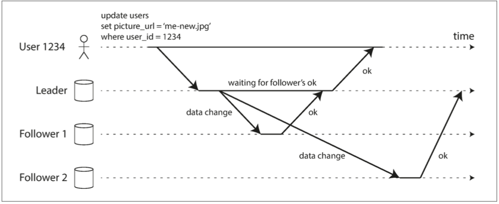
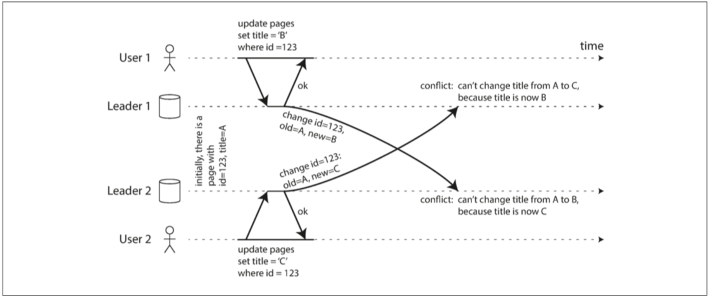
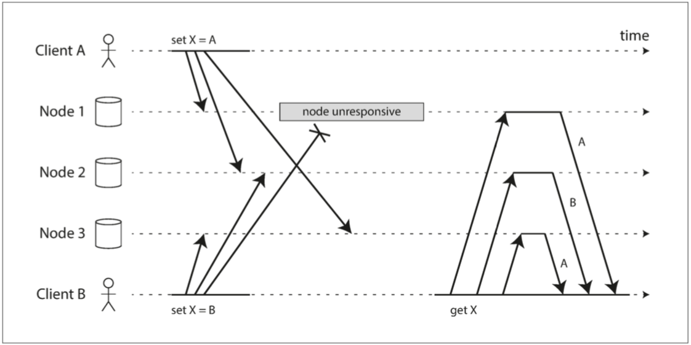

# 第五章：複製

> 與可能出錯的東西比，“不可能”出錯的東西最顯著的特點就是：一旦真的出錯，通常就徹底玩完了。
>
> —— 道格拉斯・亞當斯（1992）

------

[TOC]

複製意味著在透過網路連線的多臺機器上保留相同資料的副本。正如在 [第二部分](part-ii.md) 的介紹中所討論的那樣，我們希望能複製資料，可能出於各種各樣的原因：

* 使得資料與使用者在地理上接近（從而減少延遲）
* 即使系統的一部分出現故障，系統也能繼續工作（從而提高可用性）
* 伸縮可以接受讀請求的機器數量（從而提高讀取吞吐量）

本章將假設你的資料集非常小，每臺機器都可以儲存整個資料集的副本。在 [第六章](ch6.md) 中將放寬這個假設，討論對單個機器來說太大的資料集的分割（分片）。在後面的章節中，我們將討論複製資料系統中可能發生的各種故障，以及如何處理這些故障。

如果複製中的資料不會隨時間而改變，那複製就很簡單：將資料複製到每個節點一次就萬事大吉。複製的困難之處在於處理複製資料的 **變更（change）**，這就是本章所要講的。我們將討論三種流行的變更復制演算法：**單領導者（single leader，單主）**，**多領導者（multi leader，多主）** 和 **無領導者（leaderless，無主）**。幾乎所有分散式資料庫都使用這三種方法之一。

在複製時需要進行許多權衡：例如，使用同步複製還是非同步複製？如何處理失敗的副本？這些通常是資料庫中的配置選項，細節因資料庫而異，但原理在許多不同的實現中都類似。本章會討論這些決策的後果。

資料庫的複製算得上是老生常談了 ——70 年代研究得出的基本原則至今沒有太大變化【1】，因為網路的基本約束仍保持不變。然而在研究之外，許多開發人員仍然假設一個數據庫只有一個節點。分散式資料庫變為主流只是最近發生的事。許多程式設計師都是這一領域的新手，因此對於諸如 **最終一致性（eventual consistency）** 等問題存在許多誤解。在 “[複製延遲問題](#複製延遲問題)” 一節，我們將更加精確地瞭解最終一致性，並討論諸如 **讀己之寫（read-your-writes）** 和 **單調讀（monotonic read）** 等內容。

## 領導者與追隨者

儲存了資料庫複製的每個節點被稱為 **副本（replica）** 。當存在多個副本時，會不可避免的出現一個問題：如何確保所有資料都落在了所有的副本上？

每一次向資料庫的寫入操作都需要傳播到所有副本上，否則副本就會包含不一樣的資料。最常見的解決方案被稱為 **基於領導者的複製（leader-based replication）** （也稱 **主動/被動（active/passive）** 複製或 **主/從（master/slave）** 複製），如 [圖 5-1](#fig5-1.png) 所示。它的工作原理如下：

1. 其中一個副本被指定為 **領導者（leader）**，也稱為 **主庫（master|primary）** 。當客戶端要向資料庫寫入時，它必須將請求傳送給該 **領導者**，其會將新資料寫入其本地儲存。
2. 其他副本被稱為 **追隨者（followers）**，亦稱為 **只讀副本（read replicas）**、**從庫（slaves）**、**備庫（ secondaries）** 或 **熱備（hot-standby）**[^i]。每當領導者將新資料寫入本地儲存時，它也會將資料變更傳送給所有的追隨者，稱之為 **複製日誌（replication log）** 或 **變更流（change stream）**。每個跟隨者從領導者拉取日誌，並相應更新其本地資料庫副本，方法是按照與領導者相同的處理順序來進行所有寫入。
3. 當客戶想要從資料庫中讀取資料時，它可以向領導者或任一追隨者進行查詢。但只有領導者才能接受寫入操作（從客戶端的角度來看從庫都是隻讀的）。

[^i]: 不同的人對 **熱（hot）**、**溫（warm）** 和 **冷（cold）** 備份伺服器有不同的定義。例如在 PostgreSQL 中，**熱備（hot standby）** 指的是能接受客戶端讀請求的副本。而 **溫備（warm standby）** 只是追隨領導者，但不處理客戶端的任何查詢。就本書而言，這些差異並不重要。

**圖 5-1 基於領導者的（主/從）複製**

這種複製模式是許多關係資料庫的內建功能，如 PostgreSQL（從 9.0 版本開始）、MySQL、Oracle Data Guard【2】和 SQL Server 的 AlwaysOn 可用性組【3】。 它也被用於一些非關係資料庫，包括 MongoDB、RethinkDB 和 Espresso【4】。最後，基於領導者的複製並不僅限於資料庫：像 Kafka【5】和 RabbitMQ 高可用佇列【6】這樣的分散式訊息代理也使用它。某些網路檔案系統，例如 DRBD 這樣的塊複製裝置也與之類似。

### 同步複製與非同步複製

複製系統的一個重要細節是：複製是 **同步（synchronously）** 發生的還是 **非同步（asynchronously）** 發生的。（在關係型資料庫中這通常是一個配置項，其他系統則通常硬編碼為其中一個）。

想象一下 [圖 5-1](fig5-1.png) 中發生的場景，即網站的使用者更新他們的個人頭像。在某個時間點，客戶向主庫傳送更新請求；不久之後主庫就收到了請求。在某個時間點，主庫又會將資料變更轉發給自己的從庫。最終，主庫通知客戶更新成功。

[圖 5-2](../img/fig5-2.png) 顯示了系統各個元件之間的通訊：使用者客戶端、主庫和兩個從庫。時間從左向右流動。請求或響應訊息用粗箭頭表示。

**圖 5-2 基於領導者的複製：一個同步從庫和一個非同步從庫**

在 [圖 5-2](../img/fig5-2.png) 的示例中，從庫 1 的複製是同步的：在向用戶報告寫入成功並使結果對其他使用者可見之前，主庫需要等待從庫 1 的確認，確保從庫 1 已經收到寫入操作。而從庫 2 的複製是非同步的：主庫傳送訊息，但不等待該從庫的響應。

在這幅圖中，從庫 2 處理訊息前存在一個顯著的延遲。通常情況下，複製的速度相當快：大多數資料庫系統能在不到一秒內完成從庫的同步，但它們不能提供複製用時的保證。有些情況下，從庫可能落後主庫幾分鐘或更久，例如：從庫正在從故障中恢復，系統正在最大容量附近執行，或者當節點間存在網路問題時。

同步複製的優點是，從庫能保證有與主庫一致的最新資料副本。如果主庫突然失效，我們可以確信這些資料仍然能在從庫上找到。缺點是，如果同步從庫沒有響應（比如它已經崩潰，或者出現網路故障，或其它任何原因），主庫就無法處理寫入操作。主庫必須阻止所有寫入，並等待同步副本再次可用。

因此，將所有從庫都設定為同步的是不切實際的：任何一個節點的中斷都會導致整個系統停滯不前。實際上，如果在資料庫上啟用同步複製，通常意味著其中 **一個** 從庫是同步的，而其他的從庫則是非同步的。如果該同步從庫變得不可用或緩慢，則將一個非同步從庫改為同步執行。這保證你至少在兩個節點上擁有最新的資料副本：主庫和同步從庫。 這種配置有時也被稱為 **半同步（semi-synchronous）**【7】。

通常情況下，基於領導者的複製都配置為完全非同步。在這種情況下，如果主庫失效且不可恢復，則任何尚未複製給從庫的寫入都會丟失。這意味著即使已經向客戶端確認成功，寫入也不能保證是 **持久（Durable）** 的。然而，一個完全非同步的配置也有優點：即使所有的從庫都落後了，主庫也可以繼續處理寫入。

弱化的永續性可能聽起來像是一個壞的折衷，但非同步複製其實已經被廣泛使用了，特別是在有很多從庫的場景下，或者當從庫在地理上分佈很廣的時候。我們將在討論 “[複製延遲問題](#複製延遲問題)” 時回到這個問題。

> ### 關於複製的研究
>
> 對於非同步複製系統而言，主庫故障時會丟失資料可能是一個嚴重的問題，因此研究人員仍在研究不丟資料但仍能提供良好效能和可用性的複製方法。例如，**鏈式複製（chain replication）**【8,9】是同步複製的一種變體，已經在一些系統（如 Microsoft Azure Storage【10,11】）中成功實現。
>
> 複製的一致性與 **共識**（consensus，使幾個節點就某個值達成一致）之間有著密切的聯絡，[第九章](ch9.md) 將詳細地探討這一領域的理論。本章主要討論實踐中的資料庫常用的簡單複製形式。
>

### 設定新從庫

有時候需要設定一個新的從庫：也許是為了增加副本的數量，或替換失敗的節點。如何確保新的從庫擁有主庫資料的精確副本？

簡單地將資料檔案從一個節點複製到另一個節點通常是不夠的：客戶端不斷向資料庫寫入資料，資料總是在不斷地變化，標準的檔案複製會看到資料庫的不同部分在不同的時間點的內容，其結果可能沒有任何意義。

可以透過鎖定資料庫（使其不可用於寫入）來使磁碟上的檔案保持一致，但是這會違背高可用的目標。幸運的是，設定新從庫通常並不需要停機。從概念上講，其過程如下所示：

1. 在某個時刻獲取主庫的一致性快照（如果可能，不必鎖定整個資料庫）。大多數資料庫都具有這個功能，因為它是備份必需的。對於某些場景，可能需要第三方工具，例如用於 MySQL 的 innobackupex【12】。
2. 將快照複製到新的從庫節點。
3. 從庫連線到主庫，並拉取快照之後發生的所有資料變更。這要求快照與主庫複製日誌中的位置精確關聯。該位置有不同的名稱，例如 PostgreSQL 將其稱為 **日誌序列號（log sequence number，LSN）**，MySQL 將其稱為 **二進位制日誌座標（binlog coordinates）**。
4. 當從庫處理完快照之後積累的資料變更，我們就說它 **趕上（caught up）** 了主庫，現在它可以繼續及時處理主庫產生的資料變化了。

建立從庫的實際步驟因資料庫而異。在某些系統中，這個過程是完全自動化的，而在另外一些系統中，它可能是一個需要由管理員手動執行的、有點神祕的多步驟工作流。

### 處理節點宕機

系統中的任何節點都可能宕機，可能因為意外的故障，也可能由於計劃內的維護（例如，重啟機器以安裝核心安全補丁）。對運維而言，能在系統不中斷服務的情況下重啟單個節點好處多多。我們的目標是，即使個別節點失效，也能保持整個系統執行，並儘可能控制節點停機帶來的影響。

如何透過基於領導者的複製實現高可用？

#### 從庫失效：追趕恢復

在其本地磁碟上，每個從庫記錄從主庫收到的資料變更。如果從庫崩潰並重新啟動，或者，如果主庫和從庫之間的網路暫時中斷，則比較容易恢復：從庫可以從日誌中知道，在發生故障之前處理的最後一個事務。因此，從庫可以連線到主庫，並請求在從庫斷開期間發生的所有資料變更。當應用完所有這些變更後，它就趕上了主庫，並可以像以前一樣繼續接收資料變更流。

#### 主庫失效：故障切換

主庫失效處理起來相當棘手：其中一個從庫需要被提升為新的主庫，需要重新配置客戶端，以將它們的寫操作傳送給新的主庫，其他從庫需要開始拉取來自新主庫的資料變更。這個過程被稱為 **故障切換（failover）**。

故障切換可以手動進行（通知管理員主庫掛了，並採取必要的步驟來建立新的主庫）或自動進行。自動的故障切換過程通常由以下步驟組成：

1. 確認主庫失效。有很多事情可能會出錯：崩潰、停電、網路問題等等。沒有萬無一失的方法來檢測出現了什麼問題，所以大多數系統只是簡單使用 **超時（Timeout）** ：節點頻繁地相互來回傳遞訊息，如果一個節點在一段時間內（例如 30 秒）沒有響應，就認為它掛了（因為計劃內維護而故意關閉主庫不算）。
2. 選擇一個新的主庫。這可以透過選舉過程（主庫由剩餘副本以多數選舉產生）來完成，或者可以由之前選定的 **控制器節點（controller node）** 來指定新的主庫。主庫的最佳人選通常是擁有舊主庫最新資料副本的從庫（以最小化資料損失）。讓所有的節點同意一個新的領導者，是一個 **共識** 問題，將在 [第九章](ch9.md) 詳細討論。
3. 重新配置系統以啟用新的主庫。客戶端現在需要將它們的寫請求傳送給新主庫（將在 “[請求路由](ch6.md#請求路由)” 中討論這個問題）。如果舊主庫恢復，可能仍然認為自己是主庫，而沒有意識到其他副本已經讓它失去領導權了。系統需要確保舊主庫意識到新主庫的存在，併成為一個從庫。

故障切換的過程中有很多地方可能出錯：

* 如果使用非同步複製，則新主庫可能沒有收到老主庫宕機前最後的寫入操作。在選出新主庫後，如果老主庫重新加入叢集，新主庫在此期間可能會收到衝突的寫入，那這些寫入該如何處理？最常見的解決方案是簡單丟棄老主庫未複製的寫入，這很可能打破客戶對於資料永續性的期望。

* 如果資料庫需要和其他外部儲存相協調，那麼丟棄寫入內容是極其危險的操作。例如在 GitHub 【13】的一場事故中，一個過時的 MySQL 從庫被提升為主庫。資料庫使用自增 ID 作為主鍵，因為新主庫的計數器落後於老主庫的計數器，所以新主庫重新分配了一些已經被老主庫分配掉的 ID 作為主鍵。這些主鍵也在 Redis 中使用，主鍵重用使得 MySQL 和 Redis 中的資料產生不一致，最後導致一些私有資料洩漏到錯誤的使用者手中。

* 發生某些故障時（見 [第八章](ch8.md)）可能會出現兩個節點都以為自己是主庫的情況。這種情況稱為 **腦裂 (split brain)**，非常危險：如果兩個主庫都可以接受寫操作，卻沒有衝突解決機制（請參閱 “[多主複製](#多主複製)”），那麼資料就可能丟失或損壞。一些系統採取了安全防範措施：當檢測到兩個主庫節點同時存在時會關閉其中一個節點 [^ii]，但設計粗糙的機制可能最後會導致兩個節點都被關閉【14】。

  [^ii]: 這種機制稱為 **屏障（fencing）**，或者更充滿感情的術語是：**爆彼之頭（Shoot The Other Node In The Head, STONITH）**。我們將在 “[領導者和鎖](ch8.md#領導者和鎖)” 中對屏障進行詳細討論。

* 主庫被宣告死亡之前的正確超時應該怎麼配置？在主庫失效的情況下，超時時間越長意味著恢復時間也越長。但是如果超時設定太短，又可能會出現不必要的故障切換。例如，臨時的負載峰值可能導致節點的響應時間增加到超出超時時間，或者網路故障也可能導致資料包延遲。如果系統已經處於高負載或網路問題的困擾之中，那麼不必要的故障切換可能會讓情況變得更糟糕。

這些問題沒有簡單的解決方案。因此，即使軟體支援自動故障切換，不少運維團隊還是更願意手動執行故障切換。

節點故障、不可靠的網路、對副本一致性、永續性、可用性和延遲的權衡，這些問題實際上是分散式系統中的基本問題。[第八章](ch8.md) 和 [第九章](ch9.md) 將更深入地討論它們。

### 複製日誌的實現

基於領導者的複製在底層是如何工作的？實踐中有好幾種不同的複製方式，所以先簡要地看一下。

#### 基於語句的複製

在最簡單的情況下，主庫記錄下它執行的每個寫入請求（**語句**，即 statement）並將該語句日誌傳送給從庫。對於關係資料庫來說，這意味著每個 `INSERT`、`UPDATE` 或 `DELETE` 語句都被轉發給每個從庫，每個從庫解析並執行該 SQL 語句，就像直接從客戶端收到一樣。

雖然聽上去很合理，但有很多問題會搞砸這種複製方式：

* 任何呼叫 **非確定性函式（nondeterministic）** 的語句，可能會在每個副本上生成不同的值。例如，使用 `NOW()` 獲取當前日期時間，或使用 `RAND()` 獲取一個隨機數。
* 如果語句使用了 **自增列（auto increment）**，或者依賴於資料庫中的現有資料（例如，`UPDATE ... WHERE <某些條件>`），則必須在每個副本上按照完全相同的順序執行它們，否則可能會產生不同的效果。當有多個併發執行的事務時，這可能成為一個限制。
* 有副作用的語句（例如：觸發器、儲存過程、使用者定義的函式）可能會在每個副本上產生不同的副作用，除非副作用是絕對確定性的。

的確有辦法繞開這些問題 —— 例如，當語句被記錄時，主庫可以用固定的返回值替換掉任何不確定的函式呼叫，以便所有從庫都能獲得相同的值。但是由於邊緣情況實在太多了，現在通常會選擇其他的複製方法。

基於語句的複製在 5.1 版本前的 MySQL 中被使用到。因為它相當緊湊，現在有時候也還在用。但現在在預設情況下，如果語句中存在任何不確定性，MySQL 會切換到基於行的複製（稍後討論）。 VoltDB 使用了基於語句的複製，但要求事務必須是確定性的，以此來保證安全【15】。

#### 傳輸預寫式日誌（WAL）

在 [第三章](ch3.md) 中，我們討論了儲存引擎如何在磁碟上表示資料，我們也發現了通常會將寫操作追加到日誌中：

* 對於日誌結構儲存引擎（請參閱 “[SSTables 和 LSM 樹](ch3.md#SSTables和LSM樹)”），日誌是主要的儲存位置。日誌段在後臺壓縮，並進行垃圾回收。
* 對於覆寫單個磁碟塊的 [B 樹](ch3.md#B樹)，每次修改都會先寫入 **預寫式日誌（Write Ahead Log, WAL）**，以便崩潰後索引可以恢復到一個一致的狀態。

在任何一種情況下，該日誌都是包含了所有資料庫寫入的僅追加位元組序列。可以使用完全相同的日誌在另一個節點上構建副本：除了將日誌寫入磁碟之外，主庫還可以透過網路將其傳送給從庫。

透過使用這個日誌，從庫可以構建一個與主庫一模一樣的資料結構複製。

這種複製方法在 PostgreSQL 和 Oracle 等一些產品中被使用到【16】。其主要缺點是日誌記錄的資料非常底層：WAL 包含哪些磁碟塊中的哪些位元組發生了更改。這使複製與儲存引擎緊密耦合。如果資料庫將其儲存格式從一個版本更改為另一個版本，通常不可能在主庫和從庫上執行不同版本的資料庫軟體。

看上去這可能只是一個小的實現細節，但卻可能對運維產生巨大的影響。如果複製協議允許從庫使用比主庫更新的軟體版本，則可以先升級從庫，然後執行故障切換，使升級後的節點之一成為新的主庫，從而允許資料庫軟體的零停機升級。如果複製協議不允許版本不匹配（傳輸 WAL 經常出現這種情況），則此類升級需要停機。

#### 邏輯日誌複製（基於行）

另一種方法是對複製和儲存引擎使用不同的日誌格式，這樣可以將複製日誌從儲存引擎的內部實現中解耦出來。這種複製日誌被稱為邏輯日誌（logical log），以將其與儲存引擎的（物理）資料表示區分開來。

關係資料庫的邏輯日誌通常是以行的粒度來描述對資料庫表的寫入記錄的序列：

* 對於插入的行，日誌包含所有列的新值。
* 對於刪除的行，日誌包含足夠的資訊來唯一標識被刪除的行，這通常是主鍵，但如果表上沒有主鍵，則需要記錄所有列的舊值。
* 對於更新的行，日誌包含足夠的資訊來唯一標識被更新的行，以及所有列的新值（或至少所有已更改的列的新值）。

修改多行的事務會生成多條這樣的日誌記錄，後面跟著一條指明事務已經提交的記錄。 MySQL 的二進位制日誌（當配置為使用基於行的複製時）使用了這種方法【17】。

由於邏輯日誌與儲存引擎的內部實現是解耦的，系統可以更容易地做到向後相容，從而使主庫和從庫能夠執行不同版本的資料庫軟體，或者甚至不同的儲存引擎。

對於外部應用程式來說，邏輯日誌格式也更容易解析。如果要將資料庫的內容傳送到外部系統，例如複製到資料倉庫進行離線分析，或建立自定義索引和快取【18】，這一點會很有用。這種技術被稱為 **資料變更捕獲（change data capture）**，[第十一章](ch11.md) 將重新講到它。

#### 基於觸發器的複製

到目前為止描述的複製方法是由資料庫系統實現的，不涉及任何應用程式程式碼。在很多情況下，這就是你想要的。但在某些情況下需要更多的靈活性。例如，如果你只想複製資料的一個子集，或者想從一種資料庫複製到另一種資料庫，或者如果你需要衝突解決邏輯（請參閱 “[處理寫入衝突](#處理寫入衝突)”），則可能需要將複製操作上移到應用程式層。

一些工具，如 Oracle Golden Gate【19】，可以透過讀取資料庫日誌，使得其他應用程式可以使用資料。另一種方法是使用許多關係資料庫自帶的功能：觸發器和儲存過程。

觸發器允許你將資料更改（寫入事務）發生時自動執行的自定義應用程式程式碼註冊在資料庫系統中。觸發器有機會將更改記錄到一個單獨的表中，使用外部程式讀取這個表，再加上一些必要的業務邏輯，就可以將資料變更復制到另一個系統去。例如，Databus for Oracle【20】和 Bucardo for Postgres【21】就是這樣工作的。

基於觸發器的複製通常比其他複製方法具有更高的開銷，並且比資料庫內建的複製更容易出錯，也有很多限制。然而由於其靈活性，它仍然是很有用的。

## 複製延遲問題

容忍節點故障只是需要複製的一個原因。正如在 [第二部分](part-ii.md) 的介紹中提到的，其它原因還包括可伸縮性（處理比單個機器更多的請求）和延遲（讓副本在地理位置上更接近使用者）。

基於領導者的複製要求所有寫入都由單個節點處理，但只讀查詢可以由任何一個副本來處理。所以對於讀多寫少的場景（Web 上的常見模式），一個有吸引力的選擇是建立很多從庫，並將讀請求分散到所有的從庫上去。這樣能減小主庫的負載，並允許由附近的副本來處理讀請求。

在這種讀伸縮（read-scaling）的體系結構中，只需新增更多的從庫，就可以提高只讀請求的服務容量。但是，這種方法實際上只適用於非同步複製 —— 如果嘗試同步複製到所有從庫，則單個節點故障或網路中斷將導致整個系統都無法寫入。而且節點越多越有可能出現個別節點宕機的情況，所以完全同步的配置將是非常不可靠的。

不幸的是，當應用程式從非同步從庫讀取時，如果從庫落後，它可能會看到過時的資訊。這會導致資料庫中出現明顯的不一致：同時對主庫和從庫執行相同的查詢，可能得到不同的結果，因為並非所有的寫入都反映在從庫中。這種不一致只是一個暫時的狀態 —— 如果停止寫入資料庫並等待一段時間，從庫最終會趕上並與主庫保持一致。出於這個原因，這種效應被稱為 **最終一致性（eventual consistency）**【22,23】。[^iii]

[^iii]: 道格拉斯・特里（Douglas Terry）等人【24】創造了最終一致性這個術語，並經由 Werner Vogels【22】的推廣，成為了許多 NoSQL 專案的口號。然而，最終一致性並不只屬於 NoSQL 資料庫：關係型資料庫中的非同步複製從庫也有相同的特性。

最終一致性中的 “最終” 一詞有意進行了模糊化：總的來說，副本落後的程度是沒有限制的。在正常的操作中，**複製延遲（replication lag）**，即寫入主庫到反映至從庫之間的延遲，可能僅僅是幾分之一秒，在實踐中並不顯眼。但如果系統在接近極限的情況下執行，或網路中存在問題時，延遲可以輕而易舉地超過幾秒，甚至達到幾分鐘。

因為滯後時間太長引入的不一致性，不僅僅是一個理論問題，更是應用設計中會遇到的真實問題。本節將重點介紹三個在複製延遲時可能發生的問題例項，並簡述解決這些問題的一些方法。

### 讀己之寫

許多應用讓使用者提交一些資料，然後檢視他們提交的內容。可能是使用者資料庫中的記錄，也可能是對討論主題的評論，或其他類似的內容。提交新資料時，必須將其傳送給主庫，但是當用戶檢視資料時，可以透過從庫進行讀取。如果資料經常被檢視，但只是偶爾寫入，這是非常合適的。

但對於非同步複製，問題就來了。如 [圖 5-3](fig5-3.png) 所示：如果使用者在寫入後馬上就檢視資料，則新資料可能尚未到達副本。對使用者而言，看起來好像是剛提交的資料丟失了，所以他們不高興是可以理解的。

**圖 5-3 使用者寫入後從舊副本中讀取資料。需要寫後讀 (read-after-write) 的一致性來防止這種異常**

在這種情況下，我們需要 **寫後讀一致性（read-after-write consistency）**，也稱為 **讀己之寫一致性（read-your-writes consistency）**【24】。這是一個保證，如果使用者重新載入頁面，他們總會看到他們自己提交的任何更新。它不會對其他使用者的寫入做出承諾：其他使用者的更新可能稍等才會看到。它保證使用者自己的輸入已被正確儲存。

如何在基於領導者的複製系統中實現寫後讀一致性？有各種可能的技術，這裡說一些：

* 對於使用者 **可能修改過** 的內容，總是從主庫讀取；這就要求得有辦法不透過實際的查詢就可以知道使用者是否修改了某些東西。舉個例子，社交網路上的使用者個人資料資訊通常只能由使用者本人編輯，而不能由其他人編輯。因此一個簡單的規則就是：總是從主庫讀取使用者自己的檔案，如果要讀取其他使用者的檔案就去從庫。

* 如果應用中的大部分內容都可能被使用者編輯，那這種方法就沒用了，因為大部分內容都必須從主庫讀取（讀伸縮就沒效果了）。在這種情況下可以使用其他標準來決定是否從主庫讀取。例如可以跟蹤上次更新的時間，在上次更新後的一分鐘內，從主庫讀。還可以監控從庫的複製延遲，防止向任何滯後主庫超過一分鐘的從庫發出查詢。

* 客戶端可以記住最近一次寫入的時間戳，系統需要確保從庫在處理該使用者的讀取請求時，該時間戳前的變更都已經傳播到了本從庫中。如果當前從庫不夠新，則可以從另一個從庫讀取，或者等待從庫追趕上來。這裡的時間戳可以是邏輯時間戳（表示寫入順序的東西，例如日誌序列號）或實際的系統時鐘（在這種情況下，時鐘同步變得至關重要，請參閱 “[不可靠的時鐘](ch8.md#不可靠的時鐘)”）。

* 如果你的副本分佈在多個數據中心（為了在地理上接近使用者或者出於可用性目的），還會有額外的複雜性。任何需要由主庫提供服務的請求都必須路由到包含該主庫的資料中心。

另一種複雜的情況發生在同一位使用者從多個裝置（例如桌面瀏覽器和移動 APP）請求服務的時候。這種情況下可能就需要提供跨裝置的寫後讀一致性：如果使用者在一個裝置上輸入了一些資訊，然後在另一個裝置上檢視，則應該看到他們剛輸入的資訊。

在這種情況下，還有一些需要考慮的問題：

* 記住使用者上次更新時間戳的方法變得更加困難，因為一個裝置上執行的程式不知道另一個裝置上發生了什麼。需要對這些元資料進行中心化的儲存。
* 如果副本分佈在不同的資料中心，很難保證來自不同裝置的連線會路由到同一資料中心。（例如，使用者的臺式計算機使用家庭寬頻連線，而移動裝置使用蜂窩資料網路，則裝置的網路路由可能完全不同）。如果你的方法需要讀主庫，可能首先需要把來自該使用者所有裝置的請求都路由到同一個資料中心。

### 單調讀

在從非同步從庫讀取時可能發生的異常的第二個例子是使用者可能會遇到 **時光倒流（moving backward in time）**。

如果使用者從不同從庫進行多次讀取，就可能發生這種情況。例如，[圖 5-4](../img/fig5-4.png) 顯示了使用者 2345 兩次進行相同的查詢，首先查詢了一個延遲很小的從庫，然後是一個延遲較大的從庫（如果使用者重新整理網頁時每個請求都被路由到一個隨機的伺服器，這種情況就很有可能發生）。第一個查詢返回了最近由使用者 1234 新增的評論，但是第二個查詢不返回任何東西，因為滯後的從庫還沒有拉取到該寫入內容。實際上可以認為第二個查詢是在比第一個查詢更早的時間點上觀察系統。如果第一個查詢沒有返回任何內容，那問題並不大，因為使用者 2345 可能不知道使用者 1234 最近添加了評論。但如果使用者 2345 先看見使用者 1234 的評論，然後又看到它消失，這就會讓人覺得非常困惑了。

**圖 5-4 使用者首先從新副本讀取，然後從舊副本讀取。時間看上去回退了。為了防止這種異常，我們需要單調的讀取。**

**單調讀（monotonic reads）**【23】可以保證這種異常不會發生。這是一個比 **強一致性（strong consistency）** 更弱，但比 **最終一致性（eventual consistency）** 更強的保證。當讀取資料時，你可能會看到一箇舊值；單調讀僅意味著如果一個使用者順序地進行多次讀取，則他們不會看到時間回退，也就是說，如果已經讀取到較新的資料，後續的讀取不會得到更舊的資料。

實現單調讀的一種方式是確保每個使用者總是從同一個副本進行讀取（不同的使用者可以從不同的副本讀取）。例如，可以基於使用者 ID 的雜湊來選擇副本，而不是隨機選擇副本。但是，如果該副本出現故障，使用者的查詢將需要重新路由到另一個副本。

### 一致字首讀

第三個複製延遲異常的例子違反了因果律。 想象一下 Poons 先生和 Cake 夫人之間的以下簡短對話：

*Mr. Poons*
> Mrs. Cake，你能看到多遠的未來？

*Mrs. Cake*
> 通常約十秒鐘，Mr. Poons.

這兩句話之間有因果關係：Cake 夫人聽到了 Poons 先生的問題並回答了這個問題。

現在，想象第三個人正在透過從庫來聽這個對話。 Cake 夫人說的內容是從一個延遲很低的從庫讀取的，但 Poons 先生所說的內容，從庫的延遲要大的多（見 [圖 5-5](../img/fig5-5.png)）。於是，這個觀察者會聽到以下內容：

*Mrs. Cake*
> 通常約十秒鐘，Mr. Poons.

*Mr. Poons*
> Mrs. Cake，你能看到多遠的未來？

對於觀察者來說，看起來好像 Cake 夫人在 Poons 先生提問前就回答了這個問題。這種超能力讓人印象深刻，但也會把人搞糊塗。【25】。

**圖 5-5 如果某些分割槽的複製速度慢於其他分割槽，那麼觀察者可能會在看到問題之前先看到答案。**

要防止這種異常，需要另一種型別的保證：**一致字首讀（consistent prefix reads）**【23】。這個保證的意思是說：如果一系列寫入按某個順序發生，那麼任何人讀取這些寫入時，也會看見它們以同樣的順序出現。

這是 **分割槽（partitioned）** 或 **分片（sharded）** 資料庫中的一個特殊問題，我們將在 [第六章](ch6.md) 中討論分割槽資料庫。如果資料庫總是以相同的順序應用寫入，而讀取總是看到一致的字首，那麼這種異常不會發生。但是在許多分散式資料庫中，不同的分割槽獨立執行，因此不存在 **全域性的寫入順序**：當用戶從資料庫中讀取資料時，可能會看到資料庫的某些部分處於較舊的狀態，而某些則處於較新的狀態。

一種解決方案是，確保任何因果相關的寫入都寫入相同的分割槽，但在一些應用中可能無法高效地完成這種操作。還有一些顯式跟蹤因果依賴關係的演算法，我們將在 “[“此前發生” 的關係和併發](#“此前發生”的關係和併發)” 一節中回到這個話題。

### 複製延遲的解決方案

在使用最終一致的系統時，如果複製延遲增加到幾分鐘甚至幾小時，則應該考慮應用程式的行為。如果答案是 “沒問題”，那很好。但如果結果對於使用者來說是不好的體驗，那麼設計系統來提供更強的保證（例如 **寫後讀**）是很重要的。明明是非同步複製卻假設複製是同步的，這是很多麻煩的根源。

如前所述，應用程式可以提供比底層資料庫更強有力的保證，例如透過主庫進行某種讀取。但在應用程式程式碼中處理這些問題是複雜的，容易出錯。

如果應用程式開發人員不必擔心微妙的複製問題，並可以信賴他們的資料庫 “做了正確的事情”，那該多好呀。這就是 **事務（transaction）** 存在的原因：**資料庫透過事務提供強大的保證**，所以應用程式可以更加簡單。

單節點事務已經存在了很長時間。然而在走向分散式（複製和分割槽）資料庫時，許多系統放棄了事務，聲稱事務在效能和可用性上的代價太高，並斷言在可伸縮系統中最終一致性是不可避免的。這個敘述有一些道理，但過於簡單了，本書其餘部分將提出更為細緻的觀點。我們將在 [第七章](ch7.md) 和 [第九章](ch9.md) 回到事務的話題，並將在 [第三部分](part-iii.md) 討論一些替代機制。

## 多主複製

本章到目前為止，我們只考慮了使用單個主庫的複製架構。雖然這是一種常見的方法，但還有其它一些有趣的選擇。

基於領導者的複製有一個主要的缺點：只有一個主庫，而且所有的寫入都必須透過它 [^iv]。如果出於任何原因（例如和主庫之間的網路連線中斷）無法連線到主庫， 就無法向資料庫寫入。

[^iv]: 如果資料庫被分割槽（見 [第六章](ch6.md)），每個分割槽都有一個主庫。不同的分割槽的主庫可能在不同的節點上，但是每個分割槽都必須有一個主庫。

基於領導者的複製模型的自然延伸是允許多個節點接受寫入。複製仍然以同樣的方式發生：處理寫入的每個節點都必須將該資料變更轉發給所有其他節點。我們將其稱之為 **多領導者配置**（multi-leader configuration，也稱多主、多活複製，即 master-master replication 或 active/active replication）。在這種情況下，每個主庫同時是其他主庫的從庫。

### 多主複製的應用場景

在單個數據中心內部使用多個主庫的配置沒有太大意義，因為其導致的複雜性已經超過了能帶來的好處。但在一些情況下，這種配置也是合理的。

#### 運維多個數據中心

假如你有一個數據庫，副本分散在好幾個不同的資料中心（可能會用來容忍單個數據中心的故障，或者為了在地理上更接近使用者）。如果使用常規的基於領導者的複製設定，主庫必須位於其中一個數據中心，且所有寫入都必須經過該資料中心。

多主配置中可以在每個資料中心都有主庫。[圖 5-6](../img/fig5-6.png) 展示了這個架構。在每個資料中心內使用常規的主從複製；在資料中心之間，每個資料中心的主庫都會將其更改複製到其他資料中心的主庫中。

**圖 5-6 跨多個數據中心的多主複製**

我們來比較一下在運維多個數據中心時，單主和多主的適應情況：

* 效能

  在單主配置中，每個寫入都必須穿過網際網路，進入主庫所在的資料中心。這可能會增加寫入時間，並可能違背了設定多個數據中心的初心。在多主配置中，每個寫操作都可以在本地資料中心進行處理，並與其他資料中心非同步複製。因此，資料中心之間的網路延遲對使用者來說是透明的，這意味著感覺到的效能可能會更好。

* 容忍資料中心停機

  在單主配置中，如果主庫所在的資料中心發生故障，故障切換必須使另一個數據中心裡的從庫成為主庫。在多主配置中，每個資料中心可以獨立於其他資料中心繼續執行，並且當發生故障的資料中心歸隊時，複製會自動趕上。

* 容忍網路問題

  資料中心之間的通訊通常穿過公共網際網路，這可能不如資料中心內的本地網路可靠。單主配置對資料中心之間的連線問題非常敏感，因為透過這個連線進行的寫操作是同步的。採用非同步複製功能的多主配置通常能更好地承受網路問題：臨時的網路中斷並不會妨礙正在處理的寫入。

有些資料庫預設情況下支援多主配置，但使用外部工具實現也很常見，例如用於 MySQL 的 Tungsten Replicator 【26】，用於 PostgreSQL 的 BDR【27】以及用於 Oracle 的 GoldenGate 【19】。

儘管多主複製有這些優勢，但也有一個很大的缺點：兩個不同的資料中心可能會同時修改相同的資料，寫衝突是必須解決的（如 [圖 5-6](../img/fig5-6.png) 中的 “衝突解決（conflict resolution）”）。本書將在 “[處理寫入衝突](#處理寫入衝突)” 中詳細討論這個問題。

由於多主複製在許多資料庫中都屬於改裝的功能，所以常常存在微妙的配置缺陷，且經常與其他資料庫功能之間出現意外的反應。比如自增主鍵、觸發器、完整性約束等都可能會有麻煩。因此，多主複製往往被認為是危險的領域，應儘可能避免【28】。

#### 需要離線操作的客戶端

多主複製的另一種適用場景是：應用程式在斷網之後仍然需要繼續工作。

例如，考慮手機，膝上型電腦和其他裝置上的日曆應用。無論裝置目前是否有網際網路連線，你需要能隨時檢視你的會議（發出讀取請求），輸入新的會議（發出寫入請求）。如果在離線狀態下進行任何更改，則裝置下次上線時，需要與伺服器和其他裝置同步。

在這種情況下，每個裝置都有一個充當主庫的本地資料庫（它接受寫請求），並且在所有裝置上的日曆副本之間同步時，存在非同步的多主複製過程。複製延遲可能是幾小時甚至幾天，具體取決於何時可以訪問網際網路。

從架構的角度來看，這種設定實際上與資料中心之間的多主複製類似，每個裝置都是一個 “資料中心”，而它們之間的網路連線是極度不可靠的。從歷史上各類日曆同步功能的破爛實現可以看出，想把多主複製用好是多麼困難的一件事。

有一些工具旨在使這種多主配置更容易。例如，CouchDB 就是為這種操作模式而設計的【29】。

#### 協同編輯

實時協作編輯應用程式允許多個人同時編輯文件。例如，Etherpad 【30】和 Google Docs 【31】允許多人同時編輯文字文件或電子表格（該演算法在 “[自動衝突解決](#自動衝突解決)” 中簡要討論）。我們通常不會將協作式編輯視為資料庫複製問題，但它與前面提到的離線編輯用例有許多相似之處。當一個使用者編輯文件時，所做的更改將立即應用到其本地副本（Web 瀏覽器或客戶端應用程式中的文件狀態），並非同步複製到伺服器和編輯同一文件的任何其他使用者。

如果要保證不會發生編輯衝突，則應用程式必須先取得文件的鎖定，然後使用者才能對其進行編輯。如果另一個使用者想要編輯同一個文件，他們首先必須等到第一個使用者提交修改並釋放鎖定。這種協作模式相當於主從複製模型下在主節點上執行事務操作。

但是，為了加速協作，你可能希望將更改的單位設定得非常小（例如單次按鍵），並避免鎖定。這種方法允許多個使用者同時進行編輯，但同時也帶來了多主複製的所有挑戰，包括需要解決衝突【32】。

### 處理寫入衝突

多主複製的最大問題是可能發生寫衝突，這意味著需要解決衝突。

例如，考慮一個由兩個使用者同時編輯的維基頁面，如 [圖 5-7](../img/fig5-7.png) 所示。使用者 1 將頁面的標題從 A 更改為 B，並且使用者 2 同時將標題從 A 更改為 C。每個使用者的更改已成功應用到其本地主庫。但當非同步複製時，會發現衝突【33】。單主資料庫中不會出現此問題。

**圖 5-7 兩個主庫同時更新同一記錄引起的寫入衝突**

#### 同步與非同步衝突檢測

在單主資料庫中，第二個寫入將被阻塞並等待第一個寫入完成，或者中止第二個寫入事務並強制使用者重試。另一方面，在多主配置中，兩個寫入都是成功的，在稍後的某個時間點才能非同步地檢測到衝突。那時再來要求使用者解決衝突可能為時已晚。

原則上，可以使衝突檢測同步 - 即等待寫入被複制到所有副本，然後再告訴使用者寫入成功。但是，透過這樣做，你將失去多主複製的主要優點：允許每個副本獨立地接受寫入。如果你想要同步衝突檢測，那麼你可能不如直接使用單主複製。

#### 避免衝突

處理衝突的最簡單的策略就是避免它們：如果應用程式可以確保特定記錄的所有寫入都透過同一個主庫，那麼衝突就不會發生。由於許多的多主複製實現在處理衝突時處理得相當不好，避免衝突是一個經常被推薦的方法【34】。

例如，在一個使用者可以編輯自己資料的應用程式中，可以確保來自特定使用者的請求始終路由到同一資料中心，並使用該資料中心的主庫進行讀寫。不同的使用者可能有不同的 “主” 資料中心（可能根據使用者的地理位置選擇），但從任何一位使用者的角度來看，本質上就是單主配置了。

但是，有時你可能需要更改被指定的主庫 —— 可能是因為某個資料中心出現故障，你需要將流量重新路由到另一個數據中心，或者可能是因為使用者已經遷移到另一個位置，現在更接近其它的資料中心。在這種情況下，衝突避免將失效，你必須處理不同主庫同時寫入的可能性。

#### 收斂至一致的狀態

單主資料庫按順序進行寫操作：如果同一個欄位有多個更新，則最後一個寫操作將決定該欄位的最終值。

在多主配置中，沒有明確的寫入順序，所以最終值應該是什麼並不清楚。在 [圖 5-7](../img/fig5-7.png) 中，在主庫 1 中標題首先更新為 B 而後更新為 C；在主庫 2 中，首先更新為 C，然後更新為 B。兩種順序都不比另一種“更正確”。

如果每個副本只是按照它看到寫入的順序寫入，那麼資料庫最終將處於不一致的狀態：最終值將是在主庫 1 的 C 和主庫 2 的 B。這是不可接受的，每個複製方案都必須確保資料最終在所有副本中都是相同的。因此，資料庫必須以一種 **收斂（convergent）** 的方式解決衝突，這意味著所有副本必須在所有變更復制完成時收斂至一個相同的最終值。

實現衝突合併解決有多種途徑：

* 給每個寫入一個唯一的 ID（例如時間戳、長隨機數、UUID 或者鍵和值的雜湊），挑選最高 ID 的寫入作為勝利者，並丟棄其他寫入。如果使用時間戳，這種技術被稱為 **最後寫入勝利（LWW, last write wins）**。雖然這種方法很流行，但是很容易造成資料丟失【35】。我們將在本章末尾的 [檢測併發寫入](#檢測併發寫入) 一節更詳細地討論 LWW。
* 為每個副本分配一個唯一的 ID，ID 編號更高的寫入具有更高的優先順序。這種方法也意味著資料丟失。
* 以某種方式將這些值合併在一起 - 例如，按字母順序排序，然後連線它們（在 [圖 5-7](../img/fig5-7.png) 中，合併的標題可能類似於 “B/C”）。
* 用一種可保留所有資訊的顯式資料結構來記錄衝突，並編寫解決衝突的應用程式程式碼（也許透過提示使用者的方式）。

#### 自定義衝突解決邏輯

解決衝突的最合適的方法可能取決於應用程式，大多數多主複製工具允許使用應用程式程式碼編寫衝突解決邏輯。該程式碼可以在寫入或讀取時執行：

* 寫時執行

  只要資料庫系統檢測到複製更改日誌中存在衝突，就會呼叫衝突處理程式。例如，Bucardo 允許你為此編寫一段 Perl 程式碼。這個處理程式通常不能提示使用者 —— 它在後臺程序中執行，並且必須快速執行。

* 讀時執行

  當檢測到衝突時，所有衝突寫入被儲存。下一次讀取資料時，會將這些多個版本的資料返回給應用程式。應用程式可以提示使用者或自動解決衝突，並將結果寫回資料庫。例如 CouchDB 就以這種方式工作。

請注意，衝突解決通常適用於單行記錄或單個文件的層面，而不是整個事務【36】。因此，如果你有一個事務會原子性地進行幾次不同的寫入（請參閱 [第七章](ch7.md)），對於衝突解決而言，每個寫入仍需分開單獨考慮。

> #### 自動衝突解決
>
> 衝突解決規則可能很容易變得越來越複雜，自定義程式碼可能也很容易出錯。亞馬遜是一個經常被引用的例子，由於衝突解決處理程式而產生了令人意外的效果：一段時間以來，購物車上的衝突解決邏輯將保留新增到購物車的物品，但不包括從購物車中移除的物品。因此，顧客有時會看到物品重新出現在他們的購物車中，即使他們之前已經被移走【37】。
>
> 已經有一些有趣的研究來自動解決由於資料修改引起的衝突。有幾項研究值得一提：
>
> * **無衝突複製資料型別（Conflict-free replicated datatypes，CRDT）**【32,38】是可以由多個使用者同時編輯的集合、對映、有序列表、計數器等一系列資料結構，它們以合理的方式自動解決衝突。一些 CRDT 已經在 Riak 2.0 中實現【39,40】。
> * **可合併的持久資料結構（Mergeable persistent data structures）**【41】顯式跟蹤歷史記錄，類似於 Git 版本控制系統，並使用三向合併功能（而 CRDT 使用雙向合併）。
> * **操作轉換（operational transformation）**[42] 是 Etherpad 【30】和 Google Docs 【31】等協同編輯應用背後的衝突解決演算法。它是專為有序列表的併發編輯而設計的，例如構成文字文件的字元列表。
>
> 這些演算法在資料庫中的實現還很年輕，但很可能將來它們會被整合到更多的複製資料系統中。自動衝突解決方案可以使應用程式處理多主資料同步更為簡單。

#### 什麼是衝突？

有些衝突是顯而易見的。在 [圖 5-7](../img/fig5-7.png) 的例子中，兩個寫操作併發地修改了同一條記錄中的同一個欄位，並將其設定為兩個不同的值。毫無疑問這是一個衝突。

其他型別的衝突可能更為微妙而難以發現。例如，考慮一個會議室預訂系統：它記錄誰訂了哪個時間段的哪個房間。應用程式需要確保每個房間在任意時刻都只能被一組人進行預定（即不得有相同房間的重疊預訂）。在這種情況下，如果為同一個房間同時建立兩個不同的預訂，則可能會發生衝突。即使應用程式在允許使用者進行預訂之前先檢查會議室的可用性，如果兩次預訂是由兩個不同的主庫進行的，則仍然可能會有衝突。

雖然現在還沒有一個現成的答案，但在接下來的章節中，我們將更好地瞭解這個問題。我們將在 [第七章](ch7.md) 中看到更多的衝突示例，在 [第十二章](ch12.md) 中我們將討論用於檢測和解決複製系統中衝突的可伸縮方法。

### 多主複製拓撲

**複製拓撲**（replication topology）用來描述寫入操作從一個節點傳播到另一個節點的通訊路徑。如果你有兩個主庫，如 [圖 5-7](../img/fig5-7.png) 所示，只有一個合理的拓撲結構：主庫 1 必須把它所有的寫入都發送到主庫 2，反之亦然。當有兩個以上的主庫，多種不同的拓撲都是可能的。[圖 5-8](../img/fig5-8.png) 舉例說明了一些例子。

**圖 5-8 三種可以在多主複製中使用的拓撲示例。**

最常見的拓撲是全部到全部（all-to-all，如 [圖 5-8 (c)](../img/fig5-8.png)），其中每個主庫都將其寫入傳送給其他所有的主庫。然而，一些更受限的拓撲也會被使用到：例如，預設情況下 MySQL 僅支援 **環形拓撲（circular topology）**【34】，其中每個節點都從一個節點接收寫入，並將這些寫入（加上自己的寫入）轉發給另一個節點。另一種流行的拓撲結構具有星形的形狀 [^v]：一個指定的根節點將寫入轉發給所有其他節點。星形拓撲可以推廣到樹。

[^v]: 不要與星型模式混淆（請參閱 “[星型和雪花型：分析的模式](ch3.md#星型和雪花型：分析的模式)”），其中描述了資料模型的結構，而不是節點之間的通訊拓撲。

在環形和星形拓撲中，寫入可能需要在到達所有副本之前透過多個節點。因此，節點需要轉發從其他節點收到的資料更改。為了防止無限複製迴圈，每個節點被賦予一個唯一的識別符號，並且在複製日誌中，每次寫入都會使用其經過的所有節點的識別符號進行標記【43】。當一個節點收到用自己的識別符號標記的資料更改時，該資料更改將被忽略，因為節點知道它已經被處理過。

環形和星形拓撲的問題是，如果只有一個節點發生故障，則可能會中斷其他節點之間的複製訊息流，導致它們無法通訊，除非節點被修復。拓撲結構可以重新配置為跳過發生故障的節點，但在大多數部署中，這種重新配置必須手動完成。更密集連線的拓撲結構（例如全部到全部）的容錯性更好，因為它允許訊息沿著不同的路徑傳播，可以避免單點故障。

另一方面，全部到全部的拓撲也可能有問題。特別是，一些網路連結可能比其他網路連結更快（例如由於網路擁塞），結果是一些複製訊息可能 “超越” 其他複製訊息，如 [圖 5-9](../img/fig5-9.png) 所示。

**圖 5-9 使用多主複製時，寫入可能會以錯誤的順序到達某些副本。**

在 [圖 5-9](../img/fig5-9.png) 中，客戶端 A 向主庫 1 的表中插入一行，客戶端 B 在主庫 3 上更新該行。然而，主庫 2 可以以不同的順序接收寫入：它可能先接收到更新（從它的角度來看，是對資料庫中不存在的行的更新），稍後才接收到相應的插入（其應該在更新之前）。

這是一個因果關係的問題，類似於我們在 “[一致字首讀](#一致字首讀)” 中看到的：更新取決於先前的插入，所以我們需要確保所有節點先處理插入，然後再處理更新。僅僅在每一次寫入時新增一個時間戳是不夠的，因為時鐘不可能被充分地同步，所以主庫 2 就無法正確地對這些事件進行排序（見 [第八章](ch8.md)）。

要正確排序這些事件，可以使用一種稱為 **版本向量（version vectors）** 的技術，本章稍後將討論這種技術（請參閱 “[檢測併發寫入](#檢測併發寫入)”）。然而，許多多主複製系統中的衝突檢測技術實現得並不好。例如，在撰寫本文時，PostgreSQL BDR 不提供寫入的因果排序【27】，而 Tungsten Replicator for MySQL 甚至都不做檢測衝突【34】。

如果你正在使用基於多主複製的系統，那麼你應該多瞭解這些問題，仔細閱讀文件，並徹底測試你的資料庫，以確保它確實提供了你想要的保證。

## 無主複製

我們在本章到目前為止所討論的複製方法 —— 單主複製、多主複製 —— 都是這樣的想法：客戶端向一個主庫傳送寫請求，而資料庫系統負責將寫入複製到其他副本。主庫決定寫入的順序，而從庫按相同順序應用主庫的寫入。

一些資料儲存系統採用不同的方法，放棄主庫的概念，並允許任何副本直接接受來自客戶端的寫入。最早的一些的複製資料系統是 **無主的（leaderless）**【1,44】，但是在關係資料庫主導的時代，這個想法幾乎已被忘卻。在亞馬遜將其用於其內部的 Dynamo 系統 [^vi] 之後，它再一次成為資料庫的一種時尚架構【37】。Riak，Cassandra 和 Voldemort 是受 Dynamo 啟發的無主複製模型的開源資料儲存，所以這類資料庫也被稱為 *Dynamo 風格*。

[^vi]: Dynamo 不適用於 Amazon 以外的使用者。令人困惑的是，AWS 提供了一個名為 DynamoDB 的託管資料庫產品，它使用了完全不同的體系結構：它基於單主複製。

在一些無主複製的實現中，客戶端直接將寫入傳送到幾個副本中，而另一些情況下，由一個 **協調者（coordinator）** 節點代表客戶端進行寫入。但與主庫資料庫不同，協調者不執行特定的寫入順序。我們將會看到，這種設計上的差異對資料庫的使用方式有著深遠的影響。

### 當節點故障時寫入資料庫

假設你有一個帶有三個副本的資料庫，而其中一個副本目前不可用，或許正在重新啟動以安裝系統更新。在基於領導者的配置中，如果要繼續處理寫入，則可能需要執行故障切換（請參閱「[處理節點宕機](#處理節點宕機)」）。

另一方面，在無主配置中，不存在故障轉移。[圖 5-10](../img/fig5-10.png) 演示了會發生了什麼事情：客戶端（使用者 1234）並行傳送寫入到所有三個副本，並且兩個可用副本接受寫入，但是不可用副本錯過了它。假設三個副本中的兩個承認寫入是足夠的：在使用者 1234 已經收到兩個確定的響應之後，我們認為寫入成功。客戶簡單地忽略了其中一個副本錯過了寫入的事實。

**圖 5-10 法定寫入，法定讀取，並在節點中斷後讀修復。**

現在想象一下，不可用的節點重新聯機，客戶端開始讀取它。節點關閉期間發生的任何寫入都不在該節點上。因此，如果你從該節點讀取資料，則可能會從響應中拿到陳舊的（過時的）值。

為了解決這個問題，當一個客戶端從資料庫中讀取資料時，它不僅僅把它的請求傳送到一個副本：讀請求將被並行地傳送到多個節點。客戶可能會從不同的節點獲得不同的響應，即來自一個節點的最新值和來自另一個節點的陳舊值。版本號將被用於確定哪個值是更新的（請參閱 “[檢測併發寫入](#檢測併發寫入)”）。

#### 讀修復和反熵

複製方案應確保最終將所有資料複製到每個副本。在一個不可用的節點重新聯機之後，它如何趕上它錯過的寫入？

在 Dynamo 風格的資料儲存中經常使用兩種機制：

* 讀修復（Read repair）

  當客戶端並行讀取多個節點時，它可以檢測到任何陳舊的響應。例如，在 [圖 5-10](../img/fig5-10.png) 中，使用者 2345 獲得了來自副本 3 的版本 6 值和來自副本 1 和 2 的版本 7 值。客戶端發現副本 3 具有陳舊值，並將新值寫回到該副本。這種方法適用於讀頻繁的值。

* 反熵過程（Anti-entropy process）

  此外，一些資料儲存具有後臺程序，該程序不斷查詢副本之間的資料差異，並將任何缺少的資料從一個副本複製到另一個副本。與基於領導者的複製中的複製日誌不同，此反熵過程不會以任何特定的順序複製寫入，並且在複製資料之前可能會有顯著的延遲。

並不是所有的系統都實現了這兩種機制，例如，Voldemort 目前沒有反熵過程。請注意，如果沒有反熵過程，很少被讀取的值可能會從某些副本中丟失，從而降低了永續性，因為只有在應用程式讀取值時才執行讀修復。

#### 讀寫的法定人數

在 [圖 5-10](../img/fig5-10.png) 的示例中，我們認為即使僅在三個副本中的兩個上進行處理，寫入仍然是成功的。如果三個副本中只有一個接受了寫入，會怎樣？以此類推，究竟多少個副本完成才可以認為寫入成功？

如果我們知道，每個成功的寫操作意味著在三個副本中至少有兩個出現，這意味著至多有一個副本可能是陳舊的。因此，如果我們從至少兩個副本讀取，我們可以確定至少有一個是最新的。如果第三個副本停機或響應速度緩慢，則讀取仍可以繼續返回最新值。

更一般地說，如果有 n 個副本，每個寫入必須由 w 個節點確認才能被認為是成功的，並且我們必須至少為每個讀取查詢 r 個節點。 （在我們的例子中，$n = 3，w = 2，r = 2$）。只要 $w + r > n$，我們可以預期在讀取時能獲得最新的值，因為 r 個讀取中至少有一個節點是最新的。遵循這些 r 值和 w 值的讀寫稱為 **法定人數（quorum）**[^vii] 的讀和寫【44】。你可以認為，r 和 w 是有效讀寫所需的最低票數。

[^vii]: 有時候這種法定人數被稱為嚴格的法定人數，其相對 “寬鬆的法定人數” 而言（見 “[寬鬆的法定人數與提示移交](#寬鬆的法定人數與提示移交)”）

在 Dynamo 風格的資料庫中，引數 n、w 和 r 通常是可配置的。一個常見的選擇是使 n 為奇數（通常為 3 或 5）並設定 $w = r = (n + 1) / 2$（向上取整）。但是你可以根據需要更改數字。例如，寫入次數較少且讀取次數較多的工作負載可以從設定 $w = n$ 和 $r = 1$中受益。這會使得讀取速度更快，但缺點是隻要有一個不可用的節點就會導致所有的資料庫寫入都失敗。

> 叢集中可能有多於 n 個的節點（叢集的機器數可能多於副本數目）。但是任何給定的值只能儲存在 n 個節點上。這允許對資料集進行分割槽，從而可以支援比單個節點的儲存能力更大的資料集。我們將在 [第六章](ch6.md) 繼續討論分割槽。

法定人數條件 $w + r > n$ 允許系統容忍不可用的節點，如下所示：

* 如果 $w < n$，當節點不可用時，我們仍然可以處理寫入。
* 如果 $r < n$，當節點不可用時，我們仍然可以處理讀取。
* 對於 $n = 3，w = 2，r = 2$，我們可以容忍一個不可用的節點。
* 對於 $n = 5，w = 3，r = 3$，我們可以容忍兩個不可用的節點。 這個案例如 [圖 5-11](../img/fig5-11.png) 所示。
* 通常，讀取和寫入操作始終並行傳送到所有 n 個副本。引數 w 和 r 決定我們等待多少個節點，即在我們認為讀或寫成功之前，有多少個節點需要報告成功。

**圖 5-11  如果 $w + r > n$，讀取 r 個副本，至少有一個副本必然包含了最近的成功寫入。**

如果可用的節點少於所需的 w 或 r，則寫入或讀取將返回錯誤。節點可能由於多種原因而不可用，比如：節點關閉（異常崩潰，電源關閉）、操作執行過程中的錯誤（由於磁碟已滿而無法寫入）、客戶端和伺服器節點之間的網路中斷或任何其他原因。我們只需要關心節點是否返回了成功的響應，而不需要區分不同型別的錯誤。

### 法定人數一致性的侷限性

如果你有 n 個副本，並且你選擇了滿足 $w + r > n$ 的 w 和 r，你通常可以期望每次讀取都能返回最近寫入的值。情況就是這樣，因為你寫入的節點集合和你讀取的節點集合必然有重疊。也就是說，你讀取的節點中必然至少有一個節點具有最新值（如 [圖 5-11](../img/fig5-11.png) 所示）。

通常，r 和 w 被選為多數（超過 $n/2$ ）節點，因為這確保了 $w + r > n$，同時仍然容忍多達 $n/2$ 個節點故障。但是，法定人數不一定必須是大多數，重要的是讀寫使用的節點至少有一個節點的交集。其他法定人數的配置是可能的，這使得分散式演算法的設計有一定的靈活性【45】。

你也可以將 w 和 r 設定為較小的數字，以使 $w + r ≤ n$（即法定條件不滿足）。在這種情況下，讀取和寫入操作仍將被傳送到 n 個節點，但操作成功只需要少量的成功響應。

較小的 w 和 r 更有可能會讀取到陳舊的資料，因為你的讀取更有可能未包含具有最新值的節點。另一方面，這種配置允許更低的延遲和更高的可用性：如果存在網路中斷，並且許多副本變得無法訪問，則有更大的機會可以繼續處理讀取和寫入。只有當可達副本的數量低於 w 或 r 時，資料庫才變得不可寫入或讀取。

但是，即使在 $w + r > n$ 的情況下，也可能存在返回陳舊值的邊緣情況。這取決於實現，但可能的情況包括：

* 如果使用寬鬆的法定人數（見 “[寬鬆的法定人數與提示移交](#寬鬆的法定人數與提示移交)”），w 個寫入和 r 個讀取有可能落在完全不同的節點上，因此 r 節點和 w 之間不再保證有重疊節點【46】。
* 如果兩個寫入同時發生，不清楚哪一個先發生。在這種情況下，唯一安全的解決方案是合併併發寫入（請參閱 “[處理寫入衝突](#處理寫入衝突)”）。如果根據時間戳（最後寫入勝利）挑選出一個勝者，則寫入可能由於時鐘偏差【35】而丟失。我們將在 “[檢測併發寫入](#檢測併發寫入)” 繼續討論此話題。
* 如果寫操作與讀操作同時發生，寫操作可能僅反映在某些副本上。在這種情況下，不確定讀取返回的是舊值還是新值。
* 如果寫操作在某些副本上成功，而在其他節點上失敗（例如，因為某些節點上的磁碟已滿），在小於 w 個副本上寫入成功。所以整體判定寫入失敗，但整體寫入失敗並沒有在寫入成功的副本上回滾。這意味著一個寫入雖然報告失敗，後續的讀取仍然可能會讀取這次失敗寫入的值【47】。
* 如果攜帶新值的節點發生故障，需要從其他帶有舊值的副本進行恢復，則儲存新值的副本數可能會低於 w，從而打破法定人數條件。
* 即使一切工作正常，有時也會不幸地出現關於 **時序（timing）** 的邊緣情況，我們將在 “[線性一致性和法定人數](ch9.md#線性一致性和法定人數)” 中看到這點。

因此，儘管法定人數似乎保證讀取返回最新的寫入值，但在實踐中並不那麼簡單。 Dynamo 風格的資料庫通常針對可以忍受最終一致性的用例進行最佳化。你可以透過引數 w 和 r 來調整讀取到陳舊值的概率，但把它們當成絕對的保證是不明智的。

尤其是，因為通常得不到 “[複製延遲問題](#複製延遲問題)” 中討論的那些保證（讀己之寫，單調讀，一致字首讀），前面提到的異常可能會發生在應用程式中。更強有力的保證通常需要 **事務** 或 **共識**。我們將在 [第七章](ch7.md) 和 [第九章](ch9.md) 回到這些話題。

#### 監控陳舊度

從運維的角度來看，監視你的資料庫是否返回最新的結果是很重要的。即使應用可以容忍陳舊的讀取，你也需要了解複製的健康狀況。如果顯著落後，它應該提醒你以便你可以調查原因（例如網路中的問題或過載的節點）。

對於基於領導者的複製，資料庫通常會提供複製延遲的測量值，你可以將其提供給監視系統。這之所以能做到，是因為寫入是按照相同的順序應用於主庫和從庫，並且每個節點對應了複製日誌中的一個位置（已經在本地應用的寫入數量）。透過從主庫的當前位置中減去從庫的當前位置，你可以測量複製延遲的程度。

然而，在無主複製的系統中，沒有固定的寫入順序，這使得監控變得更加困難。而且，如果資料庫只使用讀修復（沒有反熵過程），那麼對於一個值可能會有多陳舊其實是沒有限制的 - 如果一個值很少被讀取，那麼由一個陳舊副本返回的值可能是古老的。

已經有一些關於衡量無主複製資料庫中的複製陳舊度的研究，並根據引數 n、w 和 r 來預測陳舊讀取的預期百分比【48】。不幸的是，這還不是很常見的做法，但是將陳舊測量值包含在資料庫的標準度量集中是一件好事。雖然最終一致性是一種有意模糊的保證，但是從可操作性角度來說，能夠量化 “最終” 也是很重要的。

### 寬鬆的法定人數與提示移交

合理配置的法定人數可以使資料庫無需故障切換即可容忍個別節點的故障。它也可以容忍個別節點變慢，因為請求不必等待所有 n 個節點響應 —— 當 w 或 r 個節點響應時它們就可以返回。對於需要高可用、低延時、且能夠容忍偶爾讀到陳舊值的應用場景來說，這些特性使無主複製的資料庫很有吸引力。

然而，法定人數（如迄今為止所描述的）並不像它們可能的那樣具有容錯性。網路中斷可以很容易地將客戶端從大量的資料庫節點上切斷。雖然這些節點是活著的，而其他客戶端可能也能夠連線到它們，但是從資料庫節點切斷的客戶端來看，它們也可能已經死亡。在這種情況下，剩餘的可用節點可能會少於 w 或 r，因此客戶端不再能達到法定人數。

在一個大型的叢集中（節點數量明顯多於 n 個），網路中斷期間客戶端可能仍能連線到一些資料庫節點，但又不足以組成一個特定的法定人數。在這種情況下，資料庫設計人員需要權衡一下：

* 對於所有無法達到 w 或 r 個節點法定人數的請求，是否返回錯誤是更好的？
* 或者我們是否應該接受寫入，然後將它們寫入一些可達的節點，但不在這些值通常所存在的 n 個節點上？

後者被認為是一個 **寬鬆的法定人數（sloppy quorum）**【37】：寫和讀仍然需要 w 和 r 個成功的響應，但這些響應可能來自不在指定的 n 個 “主” 節點中的其它節點。就好比說，如果你把自己鎖在房子外面了，你可能會去敲開鄰居的門，問是否可以暫時呆在他們的沙發上。

一旦網路中斷得到解決，一個節點代表另一個節點臨時接受的任何寫入都將被傳送到適當的 “主” 節點。這就是所謂的 **提示移交（hinted handoff）**（一旦你再次找到你的房子的鑰匙，你的鄰居可以禮貌地要求你離開沙發回家）。

寬鬆的法定人數對寫入可用性的提高特別有用：只要有任何 w 個節點可用，資料庫就可以接受寫入。然而，這意味著即使當 $w + r > n$ 時，也不能確保讀取到某個鍵的最新值，因為最新的值可能已經臨時寫入了 n 之外的某些節點【47】。

因此，在傳統意義上，寬鬆的法定人數實際上並不是法定人數。它只是一個永續性的保證，即資料已儲存在某處的 w 個節點。但不能保證 r 個節點的讀取能看到它，除非提示移交已經完成。

在所有常見的 Dynamo 實現中，寬鬆的法定人數是可選的。在 Riak 中，它們預設是啟用的，而在 Cassandra 和 Voldemort 中它們預設是禁用的【46,49,50】。

#### 運維多個數據中心

我們先前討論了跨資料中心複製，作為多主複製的用例（請參閱 “[多主複製](#多主複製)”）。其實無主複製也適用於多資料中心操作，既然它旨在容忍衝突的併發寫入、網路中斷和延遲尖峰。

Cassandra 和 Voldemort 在正常的無主模型中實現了他們的多資料中心支援：副本的數量 n 包括所有資料中心的節點，你可以在配置中指定每個資料中心所擁有的副本的數量。無論資料中心如何，每個來自客戶端的寫入都會發送到所有副本，但客戶端通常只等待來自其本地資料中心內的法定節點的確認，從而不會受到跨資料中心鏈路延遲和中斷的影響。對其他資料中心的高延遲寫入通常被配置為非同步執行，儘管該配置仍有一定的靈活性【50,51】。

Riak 將客戶端和資料庫節點之間的所有通訊保持在一個本地的資料中心，因此 n 描述了一個數據中心內的副本數量。資料庫叢集之間的跨資料中心複製在後臺非同步發生，其風格類似於多主複製【52】。

### 檢測併發寫入

Dynamo 風格的資料庫允許多個客戶端同時寫入相同的鍵（Key），這意味著即使使用嚴格的法定人數也會發生衝突。這種情況與多主複製相似（請參閱 “[處理寫入衝突](#處理寫入衝突)”），但在 Dynamo 風格的資料庫中，在 **讀修復** 或 **提示移交** 期間也可能會產生衝突。

其問題在於，由於可變的網路延遲和部分節點的故障，事件可能以不同的順序到達不同的節點。例如，[圖 5-12](../img/fig5-12.png) 顯示了兩個客戶機 A 和 B 同時寫入三節點資料儲存中的鍵 X：

* 節點 1 接收來自 A 的寫入，但由於暫時中斷，未接收到來自 B 的寫入。
* 節點 2 首先接收來自 A 的寫入，然後接收來自 B 的寫入。
* 節點 3 首先接收來自 B 的寫入，然後從 A 寫入。

**圖 5-12 併發寫入 Dynamo 風格的資料儲存：沒有明確定義的順序。**

如果每個節點只要接收到來自客戶端的寫入請求就簡單地覆寫某個鍵值，那麼節點就會永久地不一致，如 [圖 5-12](../img/fig5-12.png) 中的最終獲取請求所示：節點 2 認為 X 的最終值是 B，而其他節點認為值是 A 。

為了最終達成一致，副本應該趨於相同的值。如何做到這一點？有人可能希望複製的資料庫能夠自動處理，但不幸的是，大多數的實現都很糟糕：如果你想避免丟失資料，你（應用程式開發人員）需要知道很多有關資料庫衝突處理的內部資訊。

在 “[處理寫入衝突](#處理寫入衝突)” 一節中已經簡要介紹了一些解決衝突的技術。在總結本章之前，讓我們來更詳細地探討這個問題。

#### 最後寫入勝利（丟棄併發寫入）

實現最終收斂的一種方法是宣告每個副本只需要儲存 **“最近”** 的值，並允許 **“更舊”** 的值被覆蓋和拋棄。然後，只要我們有一種明確的方式來確定哪個寫是 “最近的”，並且每個寫入最終都被複制到每個副本，那麼複製最終會收斂到相同的值。

正如 **“最近”** 的引號所表明的，這個想法其實頗具誤導性。在 [圖 5-12](../img/fig5-12.png) 的例子中，當客戶端向資料庫節點發送寫入請求時，兩個客戶端都不知道另一個客戶端，因此不清楚哪一個先發送請求。事實上，說這兩種情況誰先發送請求是沒有意義的：既然我們說寫入是 **併發（concurrent）** 的，那麼它們的順序就是不確定的。

即使寫入沒有自然的排序，我們也可以強制進行排序。例如，可以為每個寫入附加一個時間戳，然後挑選最大的時間戳作為 **“最近的”**，並丟棄具有較早時間戳的任何寫入。這種衝突解決演算法被稱為 **最後寫入勝利（LWW, last write wins）**，是 Cassandra 唯一支援的衝突解決方法【53】，也是 Riak 中的一個可選特徵【35】。

LWW 實現了最終收斂的目標，但以 **永續性** 為代價：如果同一個鍵有多個併發寫入，即使它們反饋給客戶端的結果都是成功的（因為它們被寫入 w 個副本），也只有一個寫入將被保留，而其他寫入將被默默地丟棄。此外，LWW 甚至可能會丟棄不是併發的寫入，我們將在 “[有序事件的時間戳](ch8.md#有序事件的時間戳)” 中進行討論。

在類似快取的一些情況下，寫入丟失可能是可以接受的。但如果資料丟失不可接受，LWW 是解決衝突的一個很爛的選擇。

在資料庫中使用 LWW 的唯一安全方法是確保一個鍵只寫入一次，然後視為不可變，從而避免對同一個鍵進行併發更新。例如，Cassandra 推薦使用的方法是使用 UUID 作為鍵，從而為每個寫操作提供一個唯一的鍵【53】。

#### “此前發生”的關係和併發

我們如何判斷兩個操作是否是併發的？為了建立一個直覺，讓我們看看一些例子：

* 在 [圖 5-9](fig5-9.png) 中，兩個寫入不是併發的：A 的插入發生在 B 的遞增之前，因為 B 遞增的值是 A 插入的值。換句話說，B 的操作建立在 A 的操作上，所以 B 的操作必須後發生。我們也可以說 B **因果依賴（causally dependent）** 於 A。
* 另一方面，[圖 5-12](fig5-12.png) 中的兩個寫入是併發的：當每個客戶端啟動操作時，它不知道另一個客戶端也正在對同樣的鍵執行操作。因此，操作之間不存在因果關係。

如果操作 B 瞭解操作 A，或者依賴於 A，或者以某種方式構建於操作 A 之上，則操作 A 在操作 B 之前發生（happens before）。一個操作是否在另一個操作之前發生是定義併發含義的關鍵。事實上，我們可以簡單地說，如果兩個操作中的任何一個都不在另一個之前發生（即，兩個操作都不知道對方），那麼這兩個操作是併發的【54】。

因此，只要有兩個操作 A 和 B，就有三種可能性：A 在 B 之前發生，或者 B 在 A 之前發生，或者 A 和 B 併發。我們需要的是一個演算法來告訴我們兩個操作是否是併發的。如果一個操作發生在另一個操作之前，則後面的操作應該覆蓋前面的操作，但是如果這些操作是併發的，則存在需要解決的衝突。

> #### 併發性、時間和相對性
>
> 如果兩個操作 **“同時”** 發生，似乎應該稱為併發 —— 但事實上，它們在字面時間上重疊與否並不重要。由於分散式系統中的時鐘問題，現實中是很難判斷兩個事件是否是 **同時** 發生的，這個問題我們將在 [第八章](ch8.md) 中詳細討論。
>
> 為了定義併發性，確切的時間並不重要：如果兩個操作都意識不到對方的存在，就稱這兩個操作 **併發**，而不管它們實際發生的物理時間。人們有時把這個原理和物理學中的狹義相對論聯絡起來【54】，該理論引入了資訊不能比光速更快的思想。因此，如果兩個事件發生的時間差小於光透過它們之間的距離所需要的時間，那麼這兩個事件不可能相互影響。
>
> 在計算機系統中，即使光速原則上允許一個操作影響另一個操作，但兩個操作也可能是 **並行的**。例如，如果網路緩慢或中斷，兩個操作間可能會出現一段時間間隔，但仍然是併發的，因為網路問題阻止一個操作意識到另一個操作的存在。

#### 捕獲"此前發生"關係

我們來看一個演算法，它可以確定兩個操作是否為併發的，還是一個在另一個之前。簡單起見，我們從一個只有一個副本的資料庫開始。一旦我們知道了如何在單個副本上完成這項工作，我們可以將該方法推廣到具有多個副本的無主資料庫。

[圖 5-13](../img/fig5-13.png) 顯示了兩個客戶端同時向同一購物車新增專案。（如果這樣的例子讓你覺得無趣，那麼可以想象一下兩個空中交通管制員同時把飛機新增到他們正在跟蹤的區域。）最初，購物車是空的。然後客戶端向資料庫發出五次寫入：

1. 客戶端 1 將牛奶加入購物車。這是該鍵的第一次寫入，伺服器成功儲存了它併為其分配版本號 1，最後將值與版本號一起回送給客戶端。
2. 客戶端 2 將雞蛋加入購物車，不知道客戶端 1 同時添加了牛奶（客戶端 2 認為它的雞蛋是購物車中的唯一物品）。伺服器為此寫入分配版本號 2，並將雞蛋和牛奶儲存為兩個單獨的值。然後它將這兩個值 **都** 返回給客戶端 2 ，並附上版本號 2。
3. 客戶端 1 不知道客戶端 2 的寫入，想要將麵粉加入購物車，因此認為當前的購物車內容應該是 [牛奶，麵粉]。它將此值與伺服器先前向客戶端 1 提供的版本號 1 一起傳送到伺服器。伺服器可以從版本號中知道 [牛奶，麵粉] 的寫入取代了 [牛奶] 的先前值，但與 [雞蛋] 的值是 **併發** 的。因此，伺服器將版本號 3 分配給 [牛奶，麵粉]，覆蓋版本 1 的值 [牛奶]，但保留版本 2 的值 [蛋]，並將所有的值返回給客戶端 1。
4. 同時，客戶端 2 想要加入火腿，不知道客戶端 1 剛剛加了麵粉。客戶端 2 在最近一次響應中從伺服器收到了兩個值 [牛奶] 和 [蛋]，所以客戶端 2 現在合併這些值，並新增火腿形成一個新的值 [雞蛋，牛奶，火腿]。它將這個值傳送到伺服器，帶著之前的版本號 2 。伺服器檢測到新值會覆蓋版本 2 的值 [雞蛋]，但新值也會與版本 3 的值 [牛奶，麵粉] **併發**，所以剩下的兩個值是版本 3 的 [牛奶，麵粉]，和版本 4 的 [雞蛋，牛奶，火腿]。
5. 最後，客戶端 1 想要加培根。它之前從伺服器接收到了版本 3 的 [牛奶，麵粉] 和 [雞蛋]，所以它合併這些，新增培根，並將最終值 [牛奶，麵粉，雞蛋，培根] 連同版本號 3 發往伺服器。這會覆蓋版本 3 的值 [牛奶，麵粉]（請注意 [雞蛋] 已經在上一步被覆蓋），但與版本 4 的值 [雞蛋，牛奶，火腿] 併發，所以伺服器將保留這兩個併發值。

**圖 5-13  在同時編輯購物車時捕獲兩個客戶端之間的因果關係。**

[圖 5-13](../img/fig5-13.png) 中的操作之間的資料流如 [圖 5-14](../img/fig5-14.png) 所示。箭頭表示哪個操作發生在其他操作之前，意味著後面的操作知道或依賴於較早的操作。在這個例子中，客戶端永遠不會完全拿到伺服器上的最新資料，因為總是有另一個操作同時進行。但是舊版本的值最終會被覆蓋，並且不會丟失任何寫入。

**圖 5-14 圖 5-13 中的因果依賴關係圖。**

請注意，伺服器可以只通過檢視版本號來確定兩個操作是否是併發的 —— 它不需要對值本身進行解釋（因此該值可以是任何資料結構）。該演算法的工作原理如下：

* 伺服器為每個鍵維護一個版本號，每次寫入該鍵時都遞增版本號，並將新版本號與寫入的值一起儲存。
* 當客戶端讀取鍵時，伺服器將返回所有未覆蓋的值以及最新的版本號。客戶端在寫入前必須先讀取。
* 當客戶端寫入鍵時，必須包含之前讀取的版本號，並且必須將之前讀取的所有值合併在一起（針對寫入請求的響應可以像讀取請求一樣，返回所有當前值，這使得我們可以像購物車示例那樣將多個寫入串聯起來）。
* 當伺服器接收到具有特定版本號的寫入時，它可以覆蓋該版本號或更低版本的所有值（因為它知道它們已經被合併到新的值中），但是它必須用更高的版本號來儲存所有值（因為這些值與正在進行的其它寫入是併發的）。

當一個寫入包含前一次讀取的版本號時，它會告訴我們的寫入是基於之前的哪一種狀態。如果在不包含版本號的情況下進行寫操作，則與所有其他寫操作併發，因此它不會覆蓋任何內容 —— 只會在隨後的讀取中作為其中一個值返回。

#### 合併併發寫入的值

這種演算法可以確保沒有資料被無聲地丟棄，但不幸的是，客戶端需要做一些額外的工作：客戶端隨後必須合併併發寫入的值。 Riak 稱這些併發值為 **兄弟（siblings）**。

合併併發值，本質上是與多主複製中的衝突解決問題相同，我們先前討論過（請參閱 “[處理寫入衝突](#處理寫入衝突)”）。一個簡單的方法是根據版本號或時間戳（最後寫入勝利）來選擇一個值，但這意味著丟失資料。所以，你可能需要在應用程式程式碼中額外做些更聰明的事情。

以購物車為例，一種合理的合併值的方法就是做並集。在 [圖 5-14](../img/fig5-14.png) 中，最後的兩個兄弟是 [牛奶，麵粉，雞蛋，燻肉] 和 [雞蛋，牛奶，火腿]。注意牛奶和雞蛋雖然同時出現在兩個併發值裡，但他們每個只被寫過一次。合併的值可以是 [牛奶，麵粉，雞蛋，培根，火腿]，不再有重複了。

然而，如果你想讓人們也可以從他們的購物車中 **移除** 東西，而不是僅僅新增東西，那麼把併發值做並集可能不會產生正確的結果：如果你合併了兩個客戶端的購物車，並且只在其中一個客戶端裡面移除了一個專案，那麼被移除的專案將會重新出現在這兩個客戶端的交集結果中【37】。為了防止這個問題，要移除一個專案時不能簡單地直接從資料庫中刪除；相反，系統必須留下一個具有適當版本號的標記，以在兄弟合併時表明該專案已被移除。這種刪除標記被稱為 **墓碑（tombstone）**（我們上一次看到墓碑是在 “[雜湊索引”](ch3.md#雜湊索引) 章節的日誌壓縮部分）。

因為在應用程式程式碼中做兄弟合併是複雜且容易出錯的，所以有一些資料結構被設計出來用於自動執行這種合併，比如在 “[自動衝突解決](#自動衝突解決)” 中討論過的那些。舉例來說，Riak 的資料型別就支援使用稱為 CRDT 【38,39,55】的能以合理方式自動進行兄弟合併的資料結構家族，包括對保留刪除的支援。

#### 版本向量

[圖 5-13](../img/fig5-13.png) 中的示例只使用了一個副本。當有多個副本但又沒有主庫時，演算法該如何修改？

[圖 5-13](../img/fig5-13.png) 使用單個版本號來捕獲操作之間的依賴關係，但是當多個副本併發接受寫入時，這是不夠的。相反，除了對每個鍵，我們還需要對 **每個副本** 使用版本號。每個副本在處理寫入時增加自己的版本號，並且跟蹤從其他副本中看到的版本號。這個資訊指出了要覆蓋哪些併發值，以及要保留哪些併發值或兄弟值。

所有副本的版本號集合稱為 **版本向量（version vector）**【56】。這個想法的一些變體正在被使用，但最有趣的可能是在 Riak 2.0 【58,59】中使用的 **虛線版本向量（dotted version vector）**【57】。我們不會深入細節，但是它的工作方式與我們在購物車示例中看到的非常相似。

與 [圖 5-13](../img/fig5-13.png) 中的版本號一樣，當讀取值時，版本向量會從資料庫副本傳送到客戶端，並且隨後寫入值時需要將其傳送回資料庫。（Riak 將版本向量編碼為一個字串，並稱其為 **因果上下文**，即 causal context）。版本向量允許資料庫區分覆蓋寫入和併發寫入。

另外，就像在單個副本中的情況一樣，應用程式可能需要合併併發值。版本向量結構能夠確保從一個副本讀取並隨後寫回到另一個副本是安全的。這樣做雖然可能會在其他副本上面建立資料，但只要能正確合併就不會丟失資料。

> #### 版本向量和向量時鐘
>
> 版本向量有時也被稱為向量時鐘，即使它們不完全相同。其中的差別很微妙 —— 細節請參閱參考資料【57,60,61】。簡而言之，在比較副本的狀態時，版本向量才是正確的資料結構。

## 本章小結

在本章中，我們考察了複製的問題。複製可以用於幾個目的：

* 高可用性

  即使在一臺機器（或多臺機器，或整個資料中心）停機的情況下也能保持系統正常執行

* 斷開連線的操作

  允許應用程式在網路中斷時繼續工作

* 延遲

  將資料放置在地理上距離使用者較近的地方，以便使用者能夠更快地與其互動

* 可伸縮性

  透過在副本上讀，能夠處理比單機更大的讀取量

儘管是一個簡單的目標 - 在幾臺機器上保留相同資料的副本，但複製卻是一個非常棘手的問題。它需要仔細考慮併發和所有可能出錯的事情，並處理這些故障的後果。至少，我們需要處理不可用的節點和網路中斷（這還不包括更隱蔽的故障，例如由於軟體錯誤導致的靜默資料損壞）。

我們討論了複製的三種主要方法：

* 單主複製

  客戶端將所有寫入操作傳送到單個節點（主庫），該節點將資料更改事件流傳送到其他副本（從庫）。讀取可以在任何副本上執行，但從庫的讀取結果可能是陳舊的。

* 多主複製

  客戶端將每個寫入傳送到幾個主庫節點之一，其中任何一個主庫都可以接受寫入。主庫將資料更改事件流傳送給彼此以及任何從庫節點。

* 無主複製

  客戶端將每個寫入傳送到幾個節點，並從多個節點並行讀取，以檢測和糾正具有陳舊資料的節點。

每種方法都有優點和缺點。單主複製是非常流行的，因為它很容易理解，不需要擔心衝突解決。在出現故障節點、網路中斷和延遲峰值的情況下，多主複製和無主複製可以更加健壯，其代價是難以推理並且僅提供非常弱的一致性保證。

複製可以是同步的，也可以是非同步的，這在發生故障時對系統行為有深遠的影響。儘管在系統執行平穩時非同步複製速度很快，但是要弄清楚在複製延遲增加和伺服器故障時會發生什麼，這一點很重要。如果主庫失敗後你將一個非同步更新的從庫提升為新的主庫，那麼最近提交的資料可能會丟失。

我們研究了一些可能由複製延遲引起的奇怪效應，我們也討論了一些有助於決定應用程式在複製延遲時的行為的一致性模型：

* 寫後讀一致性

  使用者應該總是能看到自己提交的資料。

* 單調讀

  使用者在看到某個時間點的資料後，他們不應該再看到該資料在更早時間點的情況。

* 一致字首讀

  使用者應該看到資料處於一種具有因果意義的狀態：例如，按正確的順序看到一個問題和對應的回答。

最後，我們討論了多主複製和無主複製方法所固有的併發問題：因為他們允許多個寫入併發發生，這可能會導致衝突。我們研究了一個數據庫可以使用的演算法來確定一個操作是否發生在另一個操作之前，或者它們是否併發發生。我們還談到了透過合併併發更新來解決衝突的方法。

在下一章中，我們將繼續考察資料分佈在多臺機器間的另一種不同於 **複製** 的形式：將大資料集分割成 **分割槽**。

## 參考文獻

1.  Bruce G. Lindsay, Patricia Griffiths Selinger, C. Galtieri, et al.: “[Notes on Distributed Databases](http://domino.research.ibm.com/library/cyberdig.nsf/papers/A776EC17FC2FCE73852579F100578964/$File/RJ2571.pdf),” IBM Research, Research Report RJ2571(33471), July 1979.
1.  “[Oracle Active Data Guard Real-Time Data Protection and Availability](http://www.oracle.com/technetwork/database/availability/active-data-guard-wp-12c-1896127.pdf),” Oracle White Paper, June 2013.
1.  “[AlwaysOn Availability Groups](http://msdn.microsoft.com/en-us/library/hh510230.aspx),” in *SQL Server Books Online*, Microsoft, 2012.
1.  Lin Qiao, Kapil Surlaker, Shirshanka Das, et al.: “[On Brewing Fresh Espresso: LinkedIn’s Distributed Data Serving Platform](http://www.slideshare.net/amywtang/espresso-20952131),” at *ACM International Conference on Management of Data* (SIGMOD), June 2013.
1.  Jun Rao: “[Intra-Cluster Replication for Apache Kafka](http://www.slideshare.net/junrao/kafka-replication-apachecon2013),” at *ApacheCon North America*, February 2013.
1.  “[Highly Available Queues](https://www.rabbitmq.com/ha.html),” in *RabbitMQ Server Documentation*, Pivotal Software, Inc., 2014.
1.  Yoshinori Matsunobu: “[Semi-Synchronous Replication at Facebook](http://yoshinorimatsunobu.blogspot.co.uk/2014/04/semi-synchronous-replication-at-facebook.html),” *yoshinorimatsunobu.blogspot.co.uk*, April 1, 2014.
1.  Robbert van Renesse and Fred B. Schneider: “[Chain Replication for Supporting High Throughput and Availability](http://static.usenix.org/legacy/events/osdi04/tech/full_papers/renesse/renesse.pdf),” at *6th USENIX Symposium on Operating System Design and Implementation* (OSDI), December 2004.
1.  Jeff Terrace and Michael J. Freedman: “[Object Storage on CRAQ: High-Throughput Chain Replication for Read-Mostly Workloads](https://www.usenix.org/legacy/event/usenix09/tech/full_papers/terrace/terrace.pdf),” at *USENIX Annual Technical Conference* (ATC), June 2009.
1.  Brad Calder, Ju Wang, Aaron Ogus, et al.: “[Windows Azure Storage: A Highly Available Cloud Storage Service with Strong Consistency](http://sigops.org/sosp/sosp11/current/2011-Cascais/printable/11-calder.pdf),” at *23rd ACM Symposium on Operating Systems Principles* (SOSP), October 2011.
1.  Andrew Wang: “[Windows Azure Storage](http://umbrant.com/blog/2016/windows_azure_storage.html),” *umbrant.com*, February 4, 2016.
1.  “[Percona    Xtrabackup - Documentation](https://www.percona.com/doc/percona-xtrabackup/2.1/index.html),” Percona LLC, 2014.
1.  Jesse Newland: “[GitHub Availability This   Week](https://github.com/blog/1261-github-availability-this-week),” *github.com*, September 14, 2012.
1.  Mark Imbriaco:  “[Downtime Last Saturday](https://github.com/blog/1364-downtime-last-saturday),”  *github.com*, December 26, 2012.
1.  John Hugg: “[‘All in’ with Determinism for Performance and Testing in Distributed Systems](https://www.youtube.com/watch?v=gJRj3vJL4wE),” at *Strange Loop*, September 2015. Amit Kapila: “[WAL Internals of PostgreSQL](http://www.pgcon.org/2012/schedule/attachments/258_212_Internals%20Of%20PostgreSQL%20Wal.pdf),” at *PostgreSQL Conference* (PGCon), May 2012.
1.  [*MySQL Internals Manual*](http://dev.mysql.com/doc/internals/en/index.html). Oracle, 2014.
1.  Yogeshwer Sharma, Philippe Ajoux, Petchean Ang, et al.: “[Wormhole: Reliable Pub-Sub to Support Geo-Replicated Internet Services](https://www.usenix.org/system/files/conference/nsdi15/nsdi15-paper-sharma.pdf),” at *12th USENIX Symposium on Networked Systems Design and Implementation* (NSDI), May 2015.
1.  “[Oracle GoldenGate 12c: Real-Time Access to Real-Time Information](http://www.oracle.com/us/products/middleware/data-integration/oracle-goldengate-realtime-access-2031152.pdf),” Oracle White Paper, October 2013.
1.  Shirshanka Das, Chavdar Botev, Kapil Surlaker, et al.: “[All Aboard the Databus!](http://www.socc2012.org/s18-das.pdf),” at *ACM Symposium on Cloud Computing* (SoCC), October 2012.
1.  Greg Sabino Mullane: “[Version 5 of Bucardo Database Replication System](http://blog.endpoint.com/2014/06/bucardo-5-multimaster-postgres-released.html),” *blog.endpoint.com*, June 23, 2014.
1.  Werner Vogels: “[Eventually Consistent](http://queue.acm.org/detail.cfm?id=1466448),” *ACM Queue*, volume 6, number 6, pages 14–19, October 2008. [doi:10.1145/1466443.1466448](http://dx.doi.org/10.1145/1466443.1466448)
1.  Douglas B. Terry: “[Replicated Data Consistency Explained Through Baseball](http://research.microsoft.com/pubs/157411/ConsistencyAndBaseballReport.pdf),” Microsoft Research, Technical Report MSR-TR-2011-137, October 2011.
1.  Douglas B. Terry, Alan J. Demers, Karin Petersen, et al.: “[Session Guarantees for Weakly Consistent Replicated Data](http://citeseerx.ist.psu.edu/viewdoc/download?doi=10.1.1.71.2269&rep=rep1&type=pdf),” at *3rd International Conference on Parallel and Distributed Information Systems* (PDIS), September 1994. [doi:10.1109/PDIS.1994.331722](http://dx.doi.org/10.1109/PDIS.1994.331722)
1.  Terry Pratchett: *Reaper Man: A Discworld Novel*. Victor Gollancz, 1991. ISBN: 978-0-575-04979-6
1.  “[Tungsten Replicator](http://tungsten-replicator.org/),” Continuent, Inc., 2014.
1.  “[BDR 0.10.0 Documentation](http://bdr-project.org/docs/next/index.html),” The PostgreSQL Global Development Group, *bdr-project.org*, 2015.
1.  Robert Hodges: “[If You *Must* Deploy Multi-Master Replication, Read This First](http://scale-out-blog.blogspot.co.uk/2012/04/if-you-must-deploy-multi-master.html),” *scale-out-blog.blogspot.co.uk*, March 30, 2012.
1.  J. Chris Anderson, Jan Lehnardt, and Noah Slater: *CouchDB: The Definitive Guide*. O'Reilly Media, 2010. ISBN: 978-0-596-15589-6
1.  AppJet, Inc.: “[Etherpad and EasySync Technical Manual](https://github.com/ether/etherpad-lite/blob/e2ce9dc/doc/easysync/easysync-full-description.pdf),” *github.com*, March 26, 2011.
1.  John Day-Richter: “[What’s Different About the New Google Docs: Making Collaboration Fast](http://googledrive.blogspot.com/2010/09/whats-different-about-new-google-docs.html),” *googledrive.blogspot.com*, 23 September 2010.
1.  Martin Kleppmann and Alastair R. Beresford: “[A Conflict-Free Replicated JSON Datatype](http://arxiv.org/abs/1608.03960),” arXiv:1608.03960, August 13, 2016.
1.  Frazer Clement: “[Eventual Consistency – Detecting Conflicts](http://messagepassing.blogspot.co.uk/2011/10/eventual-consistency-detecting.html),” *messagepassing.blogspot.co.uk*, October 20, 2011.
1.  Robert Hodges: “[State of the Art for MySQL Multi-Master Replication](https://www.percona.com/live/mysql-conference-2013/sessions/state-art-mysql-multi-master-replication),” at *Percona Live: MySQL Conference & Expo*, April 2013.
1.  John Daily: “[Clocks Are Bad, or,   Welcome to the Wonderful World of Distributed Systems](http://basho.com/clocks-are-bad-or-welcome-to-distributed-systems/),” *basho.com*, November 12, 2013.
1.  Riley Berton: “[Is Bi-Directional Replication (BDR) in Postgres Transactional?](http://sdf.org/~riley/blog/2016/01/04/is-bi-directional-replication-bdr-in-postgres-transactional/),” *sdf.org*, January 4, 2016.
1.  Giuseppe DeCandia, Deniz Hastorun, Madan Jampani, et al.: “[Dynamo: Amazon's Highly Available Key-Value Store](http://www.allthingsdistributed.com/files/amazon-dynamo-sosp2007.pdf),” at *21st ACM Symposium on Operating Systems Principles* (SOSP), October 2007.
1.  Marc Shapiro, Nuno Preguiça, Carlos Baquero, and Marek Zawirski: “[A Comprehensive Study of   Convergent and Commutative Replicated Data Types](http://hal.inria.fr/inria-00555588/),” INRIA Research Report no. 7506, January 2011.
1.  Sam Elliott:  “[CRDTs: An UPDATE (or   Maybe Just a PUT)](https://speakerdeck.com/lenary/crdts-an-update-or-just-a-put),” at *RICON West*, October 2013.
1.  Russell Brown:  “[A Bluffers Guide to CRDTs in   Riak](https://gist.github.com/russelldb/f92f44bdfb619e089a4d),” *gist.github.com*, October 28, 2013.
1.  Benjamin Farinier, Thomas Gazagnaire, and Anil Madhavapeddy: “[Mergeable Persistent Data   Structures](http://gazagnaire.org/pub/FGM15.pdf),” at *26es Journées Francophones des Langages Applicatifs* (JFLA),  January 2015.
1.  Chengzheng Sun and Clarence Ellis: “[Operational   Transformation in Real-Time Group Editors: Issues, Algorithms, and Achievements](http://citeseerx.ist.psu.edu/viewdoc/download?doi=10.1.1.53.933&rep=rep1&type=pdf),” at  *ACM Conference on Computer Supported Cooperative Work* (CSCW), November 1998.
1.  Lars Hofhansl: “[HBASE-7709: Infinite Loop Possible in Master/Master Replication](https://issues.apache.org/jira/browse/HBASE-7709),” *issues.apache.org*, January 29, 2013.
1.  David K. Gifford: “[Weighted Voting for Replicated Data](http://citeseerx.ist.psu.edu/viewdoc/summary?doi=10.1.1.84.7698),” at *7th ACM Symposium on Operating Systems Principles* (SOSP), December 1979. [doi:10.1145/800215.806583](http://dx.doi.org/10.1145/800215.806583)
1.  Heidi Howard, Dahlia Malkhi, and Alexander Spiegelman: “[Flexible Paxos: Quorum Intersection Revisited](https://arxiv.org/abs/1608.06696),” *arXiv:1608.06696*, August 24, 2016.
1.  Joseph Blomstedt: “[Re:   Absolute Consistency](http://lists.basho.com/pipermail/riak-users_lists.basho.com/2012-January/007157.html),” email to *riak-users* mailing list, *lists.basho.com*, January 11, 2012.
1.  Joseph Blomstedt:  “[Bringing Consistency to Riak](https://vimeo.com/51973001),” at *RICON West*,  October 2012.
1.  Peter Bailis, Shivaram Venkataraman, Michael J. Franklin, et al.: “[Quantifying Eventual Consistency with PBS](http://www.bailis.org/papers/pbs-cacm2014.pdf),” *Communications of the ACM*, volume 57, number 8, pages 93–102, August 2014. [doi:10.1145/2632792](http://dx.doi.org/10.1145/2632792)
1.  Jonathan Ellis: “[Modern Hinted Handoff](http://www.datastax.com/dev/blog/modern-hinted-handoff),” *datastax.com*, December 11, 2012.
1.  “[Project Voldemort Wiki](https://github.com/voldemort/voldemort/wiki),” *github.com*, 2013.
1.  “[Apache Cassandra 2.0 Documentation](http://www.datastax.com/documentation/cassandra/2.0/index.html),” DataStax, Inc., 2014.
1.  “[Riak Enterprise: Multi-Datacenter Replication](http://basho.com/assets/MultiDatacenter_Replication.pdf).” Technical whitepaper, Basho Technologies, Inc., September 2014.
1.  Jonathan Ellis: “[Why Cassandra Doesn't Need Vector Clocks](http://www.datastax.com/dev/blog/why-cassandra-doesnt-need-vector-clocks),” *datastax.com*, September 2, 2013.
1.  Leslie Lamport: “[Time, Clocks, and the Ordering of Events in a Distributed System](http://research.microsoft.com/en-US/um/people/Lamport/pubs/time-clocks.pdf),” *Communications of the ACM*, volume 21, number 7, pages 558–565, July 1978. [doi:10.1145/359545.359563](http://dx.doi.org/10.1145/359545.359563)
1.  Joel Jacobson: “[Riak 2.0: Data Types](http://blog.joeljacobson.com/riak-2-0-data-types/),” *blog.joeljacobson.com*, March 23, 2014.
1.  D. Stott Parker Jr., Gerald J. Popek, Gerard Rudisin, et al.: “[Detection of Mutual Inconsistency in Distributed Systems](http://zoo.cs.yale.edu/classes/cs426/2013/bib/parker83detection.pdf),” *IEEE Transactions on Software Engineering*, volume 9, number 3, pages 240–247, May 1983. [doi:10.1109/TSE.1983.236733](http://dx.doi.org/10.1109/TSE.1983.236733)
1.  Nuno Preguiça, Carlos Baquero, Paulo Sérgio Almeida, et al.: “[Dotted Version Vectors: Logical Clocks for Optimistic Replication](http://arxiv.org/pdf/1011.5808v1.pdf),” arXiv:1011.5808, November 26, 2010.
1.  Sean Cribbs: “[A Brief History of Time in Riak](https://www.youtube.com/watch?v=HHkKPdOi-ZU),” at *RICON*, October 2014.
1.  Russell Brown: “[Vector Clocks Revisited Part 2: Dotted Version Vectors](http://basho.com/posts/technical/vector-clocks-revisited-part-2-dotted-version-vectors/),” *basho.com*, November 10, 2015.
1.  Carlos Baquero: “[Version Vectors Are Not Vector Clocks](https://haslab.wordpress.com/2011/07/08/version-vectors-are-not-vector-clocks/),” *haslab.wordpress.com*, July 8, 2011.
1.  Reinhard Schwarz and Friedemann Mattern: “[Detecting Causal Relationships in Distributed Computations: In Search of the Holy Grail](http://dcg.ethz.ch/lectures/hs08/seminar/papers/mattern4.pdf),” *Distributed Computing*, volume 7, number 3, pages 149–174, March 1994. [doi:10.1007/BF02277859](http://dx.doi.org/10.1007/BF02277859)

--------

|               上一章               |              目錄               |         下一章         |
| :--------------------------------: | :-----------------------------: | :--------------------: |
| [第二部分：分散式資料](part-ii.md) | [設計資料密集型應用](README.md) | [第六章：分割槽](ch6.md) |